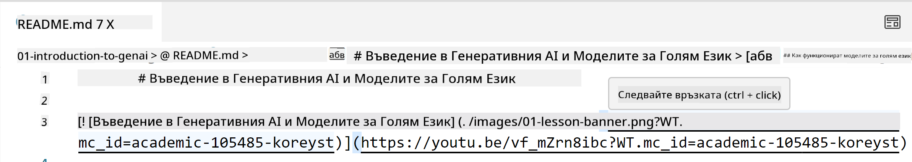
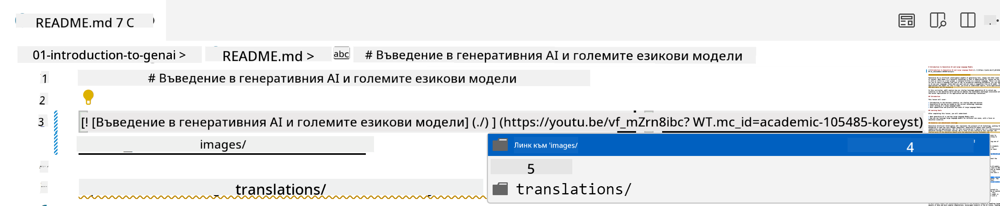
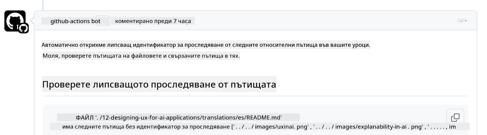
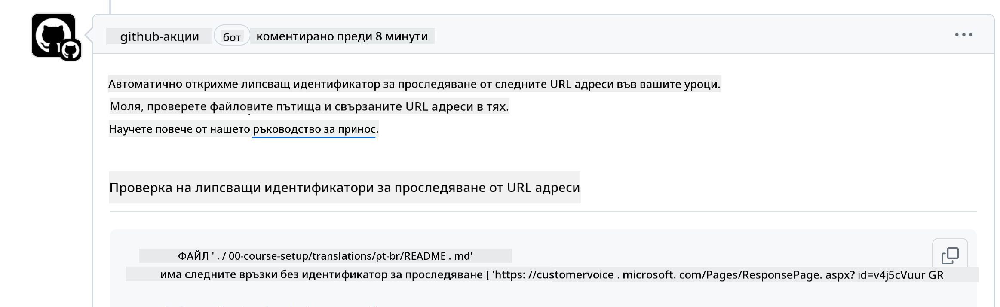
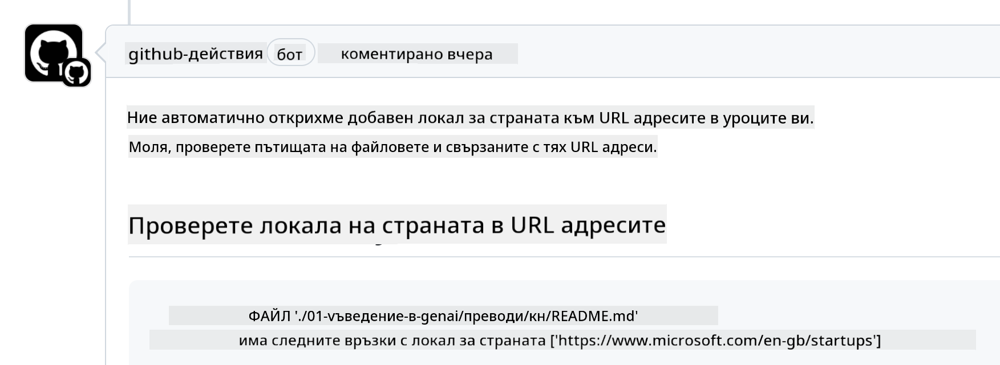

<!--
CO_OP_TRANSLATOR_METADATA:
{
  "original_hash": "57c41f2af71001a2cff9d8eb797cb843",
  "translation_date": "2025-05-19T11:25:27+00:00",
  "source_file": "CONTRIBUTING.md",
  "language_code": "bg"
}
-->
# Допринасяне

Този проект приветства приноси и предложения. Повечето приноси изискват от вас да се съгласите със Споразумение за лиценз за приносител (CLA), което декларира, че имате право и наистина ни предоставяте правата да използваме вашия принос. За повече информация посетете <https://cla.microsoft.com>.

> Важно: когато превеждате текст в това хранилище, моля, уверете се, че не използвате машинен превод. Ще проверим преводите чрез общността, така че моля, доброволствайте за преводи само на езици, на които сте компетентни.

Когато изпратите pull request, CLA-ботът автоматично ще определи дали трябва да предоставите CLA и ще украси PR-а съответно (например етикет, коментар). Просто следвайте инструкциите, предоставени от бота. Ще трябва да направите това само веднъж за всички хранилища, използващи нашия CLA.

## Кодекс на поведение

Този проект е приел [Кодекса на поведение за отворен код на Microsoft](https://opensource.microsoft.com/codeofconduct/?WT.mc_id=academic-105485-koreyst). За повече информация прочетете [Често задавани въпроси за Кодекса на поведение](https://opensource.microsoft.com/codeofconduct/faq/?WT.mc_id=academic-105485-koreyst) или се свържете с [opencode@microsoft.com](mailto:opencode@microsoft.com) за допълнителни въпроси или коментари.

## Въпрос или проблем?

Моля, не отваряйте въпроси в GitHub за общи въпроси за поддръжка, тъй като списъкът в GitHub трябва да се използва за заявки за функции и доклади за грешки. Така можем по-лесно да проследяваме действителни проблеми или грешки в кода и да държим общата дискусия отделно от самия код.

## Правописни грешки, проблеми, бъгове и приноси

Всеки път, когато подавате промени в хранилището Generative AI for Beginners, моля, следвайте тези препоръки.

* Винаги клонирайте хранилището към вашия акаунт, преди да направите модификациите си
* Не комбинирайте множество промени в един pull request. Например, подавайте всяка поправка на бъг и актуализации на документация с отделни PR-и
* Ако вашият pull request показва конфликти при сливане, уверете се, че сте актуализирали вашия локален main, за да бъде огледало на това, което е в основното хранилище, преди да направите модификациите си
* Ако подавате превод, моля, създайте един PR за всички преведени файлове, тъй като не приемаме частични преводи за съдържанието
* Ако подавате поправка на правописна грешка или документация, можете да комбинирате модификациите в един PR, където е подходящо

## Общи насоки за писане

- Уверете се, че всички ваши URL адреси са обгърнати в квадратни скоби, последвани от скоби без допълнителни интервали около тях или вътре в тях ``.
- Уверете се, че всяка относителна връзка (т.е. връзки към други файлове и папки в хранилището) започва с `./`, отнасяща се до файл или папка, намираща се в текущата работна директория или `../`, отнасяща се до файл или папка, намираща се в родителската работна директория.
- Уверете се, че всяка относителна връзка (т.е. връзки към други файлове и папки в хранилището) има идентификатор за проследяване (т.е. `?` или `&`, след това `wt.mc_id=` или `WT.mc_id=`) в края си.
- Уверете се, че всеки URL от следните домейни _github.com, microsoft.com, visualstudio.com, aka.ms, и azure.com_ има идентификатор за проследяване (т.е. `?` или `&`, след това `wt.mc_id=` или `WT.mc_id=`) в края си.
- Уверете се, че вашите връзки нямат специфичен за държава локал в тях (т.е. `/en-us/` или `/en/`).
- Уверете се, че всички изображения са съхранени в папката `./images`.
- Уверете се, че изображенията имат описателни имена, използващи английски символи, числа и тирета в името на вашето изображение.

## Работни потоци в GitHub

Когато изпратите pull request, ще се задействат четири различни работни потока, за да валидират предишните правила. Просто следвайте инструкциите, изброени тук, за да преминете проверките на работния поток.

- [Проверка за счупени относителни пътища](../..)
- [Проверка дали пътищата имат проследяване](../..)
- [Проверка дали URL адресите имат проследяване](../..)
- [Проверка дали URL адресите нямат локал](../..)

### Проверка за счупени относителни пътища

Този работен поток гарантира, че всеки относителен път във вашите файлове работи. Това хранилище е разположено на страниците на GitHub, така че трябва да бъдете много внимателни, когато въвеждате връзките, които свързват всичко заедно, за да не насочите никого на грешно място.

За да се уверите, че вашите връзки работят правилно, просто използвайте VS code, за да проверите това.

Например, когато задържите курсора върху някоя връзка във вашите файлове, ще бъдете подканени да следвате връзката, като натиснете **ctrl + click**

Ако кликнете върху връзка и тя не работи локално, тогава със сигурност ще задейства работния поток и няма да работи в GitHub.

За да решите този проблем, опитайте да въведете връзката с помощта на VS code.

Когато въведете `./` или `../`, VS code ще ви подканя да изберете от наличните опции според това, което сте въвели.

Следвайте пътя, като кликнете върху желания файл или папка и ще бъдете сигурни, че пътят ви не е счупен.

След като добавите правилния относителен път, запазете и натиснете вашите промени, работният поток ще се задейства отново, за да провери вашите промени. Ако преминете проверката, значи сте готови.

### Проверка дали пътищата имат проследяване

Този работен поток гарантира, че всеки относителен път има проследяване в него. Това хранилище е разположено на страниците на GitHub, така че трябва да проследим движението между различните файлове и папки.

За да се уверите, че вашите относителни пътища имат проследяване в тях, просто проверете за следния текст `?wt.mc_id=` в края на пътя. Ако е добавен към вашите относителни пътища, тогава ще преминете тази проверка.

Ако не, може да получите следната грешка.

За да решите този проблем, опитайте да отворите файла, който работният поток е осветил, и добавете идентификатора за проследяване в края на относителните пътища.

След като добавите идентификатора за проследяване, запазете и натиснете вашите промени, работният поток ще се задейства отново, за да провери вашите промени. Ако преминете проверката, значи сте готови.

### Проверка дали URL адресите имат проследяване

Този работен поток гарантира, че всеки уеб URL адрес има проследяване в него. Това хранилище е достъпно за всеки, така че трябва да се уверите, че проследявате достъпа, за да знаете откъде идва трафикът.

За да се уверите, че вашите URL адреси имат проследяване в тях, просто проверете за следния текст `?wt.mc_id=` в края на URL адреса. Ако е добавен към вашите URL адреси, тогава ще преминете тази проверка.

Ако не, може да получите следната грешка.

За да решите този проблем, опитайте да отворите файла, който работният поток е осветил, и добавете идентификатора за проследяване в края на URL адресите.

След като добавите идентификатора за проследяване, запазете и натиснете вашите промени, работният поток ще се задейства отново, за да провери вашите промени. Ако преминете проверката, значи сте готови.

### Проверка дали URL адресите нямат локал

Този работен поток гарантира, че всеки уеб URL адрес няма специфичен за държава локал в него. Това хранилище е достъпно за всеки по света, така че трябва да се уверите, че не включвате локала на вашата държава в URL адресите.

За да се уверите, че вашите URL адреси нямат локал на държава в тях, просто проверете за следния текст `/en-us/` или `/en/` или друг езиков локал навсякъде в URL адреса. Ако не е налице във вашите URL адреси, тогава ще преминете тази проверка.

Ако не, може да получите следната грешка.

За да решите този проблем, опитайте да отворите файла, който работният поток е осветил, и премахнете локала на държавата от URL адресите.

След като премахнете локала на държавата, запазете и натиснете вашите промени, работният поток ще се задейства отново, за да провери вашите промени. Ако преминете проверката, значи сте готови.

Поздравления! Ще се свържем с вас възможно най-скоро с обратна връзка за вашия принос.

**Отказ от отговорност**:  
Този документ е преведен с помощта на AI услуга за превод [Co-op Translator](https://github.com/Azure/co-op-translator). Въпреки че се стремим към точност, моля, имайте предвид, че автоматизираните преводи може да съдържат грешки или неточности. Оригиналният документ на неговия роден език трябва да се счита за авторитетния източник. За критична информация се препоръчва професионален човешки превод. Не носим отговорност за каквито и да било недоразумения или погрешни тълкувания, произтичащи от използването на този превод.