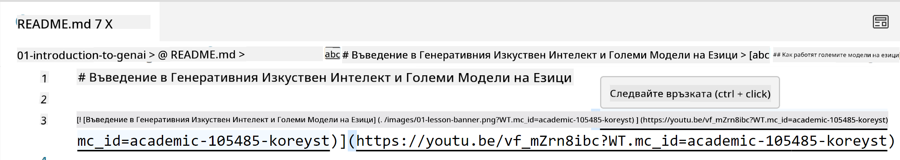
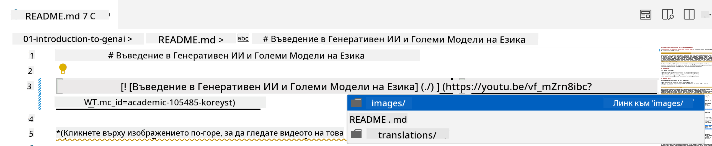
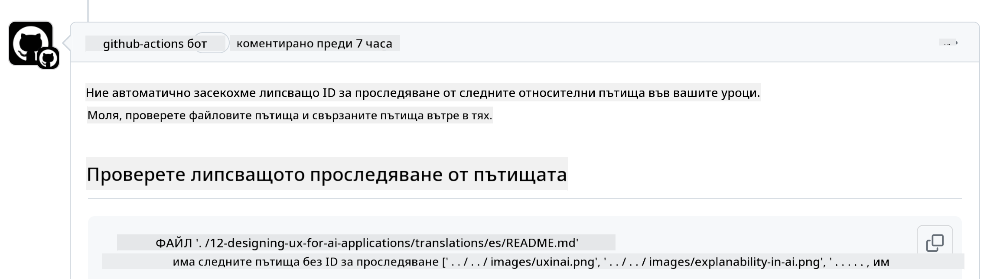
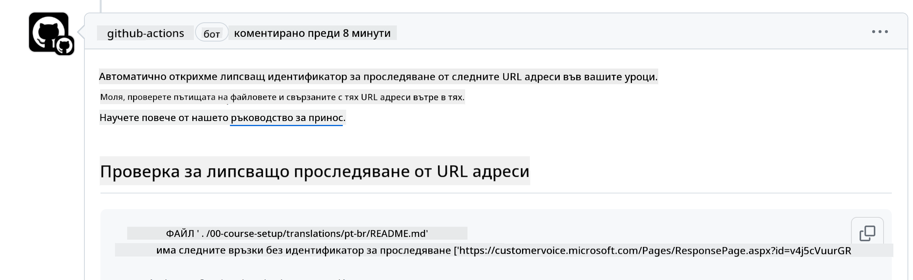
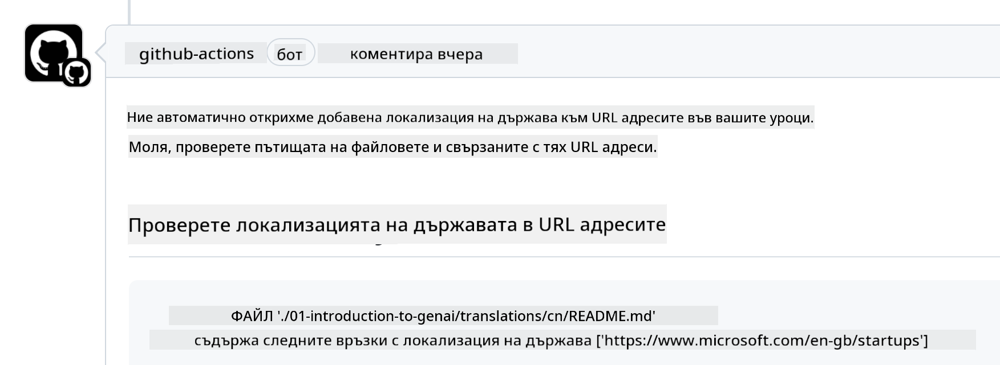

<!--
CO_OP_TRANSLATOR_METADATA:
{
  "original_hash": "57c41f2af71001a2cff9d8eb797cb843",
  "translation_date": "2025-06-25T07:20:07+00:00",
  "source_file": "CONTRIBUTING.md",
  "language_code": "bg"
}
-->
# Принос

Този проект приветства приноси и предложения. Повечето приноси изискват от вас да се съгласите със Споразумение за лицензионен принос (CLA), което декларира, че имате правото и действително предоставяте правата ни да използваме вашия принос. За подробности посетете <https://cla.microsoft.com>.

> Важно: когато превеждате текст в това хранилище, моля, уверете се, че не използвате машинен превод. Ще проверим преводите чрез общността, затова моля, доброволствайте за преводи само на езици, на които сте компетентни.

Когато изпращате pull заявка, CLA-bot автоматично ще определи дали трябва да предоставите CLA и ще декорира PR съответно (например, етикет, коментар). Просто следвайте инструкциите, предоставени от бота. Ще трябва да направите това само веднъж за всички хранилища, използващи нашето CLA.

## Кодекс на поведение

Този проект е приел [Кодекса на поведение за отворен код на Microsoft](https://opensource.microsoft.com/codeofconduct/?WT.mc_id=academic-105485-koreyst). За повече информация прочетете [Често задавани въпроси за Кодекса на поведение](https://opensource.microsoft.com/codeofconduct/faq/?WT.mc_id=academic-105485-koreyst) или се свържете с [opencode@microsoft.com](mailto:opencode@microsoft.com) за допълнителни въпроси или коментари.

## Въпрос или проблем?

Моля, не отваряйте GitHub проблеми за общи въпроси за поддръжка, тъй като списъкът на GitHub трябва да се използва за заявки за функции и доклади за грешки. По този начин можем по-лесно да проследим действителни проблеми или грешки от кода и да държим общата дискусия отделена от действителния код.

## Грешки, проблеми, бъгове и приноси

Всеки път, когато правите промени в хранилището Generative AI for Beginners, моля, следвайте тези препоръки.

* Винаги разклонявайте хранилището към вашия собствен акаунт, преди да направите модификациите си
* Не комбинирайте множество промени в една pull заявка. Например, изпратете всяка поправка на бъг и актуализации на документация, използвайки отделни PRs
* Ако вашата pull заявка показва конфликти при сливане, уверете се, че актуализирате вашето локално основно, за да бъде огледало на това, което е в основното хранилище, преди да направите модификациите си
* Ако изпращате превод, моля, създайте един PR за всички преведени файлове, тъй като не приемаме частични преводи на съдържанието
* Ако изпращате поправка на грешка или документация, можете да комбинирате модификации в един PR, където е подходящо

## Обща насока за писане

- Уверете се, че всички ваши URL адреси са обвити в квадратни скоби, последвани от скоби без допълнителни интервали около тях или вътре в тях ``.
- Уверете се, че всяка относителна връзка (т.е. връзки към други файлове и папки в хранилището) започва с `./`, отнасяща се до файл или папка, намираща се в текущата работна директория, или `../`, отнасяща се до файл или папка, намираща се в родителската работна директория.
- Уверете се, че всяка относителна връзка (т.е. връзки към други файлове и папки в хранилището) има идентификатор за проследяване (т.е. `?` или `&` след това `wt.mc_id=` или `WT.mc_id=`) в края си.
- Уверете се, че всеки URL адрес от следните домейни _github.com, microsoft.com, visualstudio.com, aka.ms и azure.com_ има идентификатор за проследяване (т.е. `?` или `&` след това `wt.mc_id=` или `WT.mc_id=`) в края си.
- Уверете се, че вашите връзки нямат специфичен за страната езиков код в тях (т.е. `/en-us/` или `/en/`).
- Уверете се, че всички изображения са съхранени в папката `./images`.
- Уверете се, че изображенията имат описателни имена, използвайки английски букви, цифри и тирета в името на вашето изображение.

## GitHub Работни потоци

Когато изпратите pull заявка, ще бъдат задействани четири различни работни потока, за да се валидират предишните правила. Просто следвайте инструкциите, изброени тук, за да преминете проверките на работния поток.

- [Проверка на счупени относителни пътища](../..)
- [Проверка на пътища с проследяване](../..)
- [Проверка на URL адреси с проследяване](../..)
- [Проверка на URL адреси без езиков код](../..)

### Проверка на счупени относителни пътища

Този работен поток гарантира, че всеки относителен път във вашите файлове работи. Това хранилище е разположено на GitHub страници, така че трябва да бъдете много внимателни, когато въвеждате връзките, които свързват всичко заедно, за да не насочите никого към грешно място.

За да сте сигурни, че вашите връзки работят правилно, просто използвайте VS код, за да проверите това.

Например, когато задържите курсора над която и да е връзка във вашите файлове, ще бъдете подканени да следвате връзката, като натиснете **ctrl + клик**

Ако кликнете върху връзка и тя не работи локално, тогава със сигурност ще задейства работния поток и няма да работи в GitHub.

За да поправите този проблем, опитайте да въведете връзката с помощта на VS код.

Когато въведете `./` или `../`, VS код ще ви подкани да изберете от наличните опции според това, което сте въвели.

Следвайте пътя, като кликнете върху желания файл или папка и ще сте сигурни, че вашият път не е счупен.

След като добавите правилния относителен път, запазете и качете промените си, работният поток ще бъде задействан отново, за да провери вашите промени. Ако преминете проверката, тогава сте готови.

### Проверка на пътища с проследяване

Този работен поток гарантира, че всеки относителен път има проследяване в него. Това хранилище е разположено на GitHub страници, така че трябва да проследим движението между различните файлове и папки.

За да сте сигурни, че вашите относителни пътища имат проследяване в тях, просто проверете за следния текст `?wt.mc_id=` в края на пътя. Ако е добавен към вашите относителни пътища, тогава ще преминете тази проверка.

Ако не, може да получите следната грешка.

За да поправите този проблем, опитайте да отворите файла, който работният поток е подчертавал, и добавете идентификатора за проследяване в края на относителните пътища.

След като добавите идентификатора за проследяване, запазете и качете промените си, работният поток ще бъде задействан отново, за да провери вашите промени. Ако преминете проверката, тогава сте готови.

### Проверка на URL адреси с проследяване

Този работен поток гарантира, че всеки уеб URL адрес има проследяване в него. Това хранилище е достъпно за всеки, така че трябва да се уверите, че проследявате достъпа, за да знаете откъде идва трафикът.

За да сте сигурни, че вашите URL адреси имат проследяване в тях, просто проверете за следния текст `?wt.mc_id=` в края на URL адреса. Ако е добавен към вашите URL адреси, тогава ще преминете тази проверка.

Ако не, може да получите следната грешка.

За да поправите този проблем, опитайте да отворите файла, който работният поток е подчертавал, и добавете идентификатора за проследяване в края на URL адресите.

След като добавите идентификатора за проследяване, запазете и качете промените си, работният поток ще бъде задействан отново, за да провери вашите промени. Ако преминете проверката, тогава сте готови.

### Проверка на URL адреси без езиков код

Този работен поток гарантира, че всеки уеб URL адрес няма специфичен за страната езиков код в него. Това хранилище е достъпно за всеки по света, така че трябва да се уверите, че не включвате езиковия код на вашата страна в URL адресите.

За да сте сигурни, че вашите URL адреси нямат езиков код в тях, просто проверете за следния текст `/en-us/` или `/en/` или който и да е друг езиков код навсякъде в URL адреса. Ако не е налице във вашите URL адреси, тогава ще преминете тази проверка.

Ако не, може да получите следната грешка.

За да поправите този проблем, опитайте да отворите файла, който работният поток е подчертавал, и премахнете езиковия код от URL адресите.

След като премахнете езиковия код, запазете и качете промените си, работният поток ще бъде задействан отново, за да провери вашите промени. Ако преминете проверката, тогава сте готови.

Поздравления! Ще се свържем с вас възможно най-скоро с обратна връзка за вашия принос.

**Отказ от отговорност**:  
Този документ е преведен с помощта на AI услуга за превод [Co-op Translator](https://github.com/Azure/co-op-translator). Въпреки че се стремим към точност, моля, имайте предвид, че автоматизираните преводи могат да съдържат грешки или неточности. Оригиналният документ на неговия роден език трябва да се счита за авторитетен източник. За критична информация се препоръчва професионален човешки превод. Ние не носим отговорност за каквито и да било недоразумения или погрешни интерпретации, произтичащи от използването на този превод.