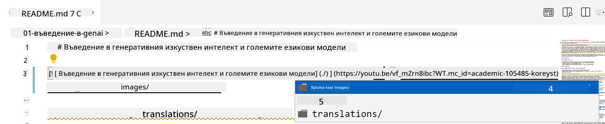
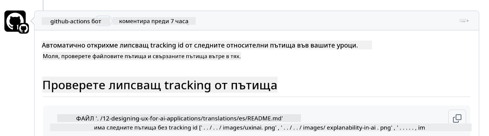
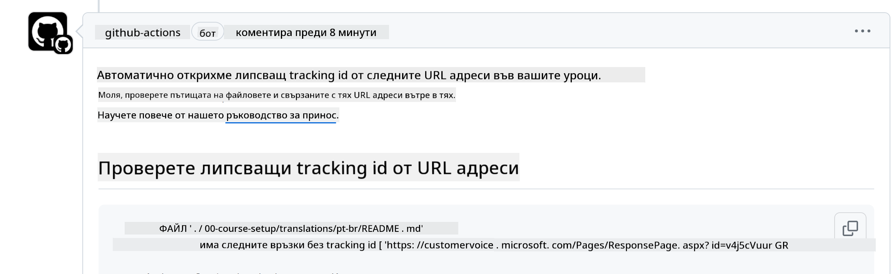

<!--
CO_OP_TRANSLATOR_METADATA:
{
  "original_hash": "57c41f2af71001a2cff9d8eb797cb843",
  "translation_date": "2025-07-09T06:12:48+00:00",
  "source_file": "CONTRIBUTING.md",
  "language_code": "bg"
}
-->
# Принос

Този проект приема приноси и предложения. Повечето приноси изискват да се съгласите с Contributor License Agreement (CLA), с който декларирате, че имате правото и наистина предоставяте правата за използване на вашия принос. За подробности посетете <https://cla.microsoft.com>.

> Важно: при превод на текст в това хранилище, моля, уверете се, че не използвате машинен превод. Ще проверяваме преводите чрез общността, затова моля, доброволствайте за преводи само на езици, на които владеете добре.

Когато изпратите pull request, CLA-бот автоматично ще определи дали трябва да предоставите CLA и ще маркира PR съответно (например с етикет или коментар). Просто следвайте инструкциите на бота. Това се прави само веднъж за всички хранилища, използващи нашия CLA.

## Кодекс на поведение

Този проект е приел [Microsoft Open Source Code of Conduct](https://opensource.microsoft.com/codeofconduct/?WT.mc_id=academic-105485-koreyst).  
За повече информация прочетете [Code of Conduct FAQ](https://opensource.microsoft.com/codeofconduct/faq/?WT.mc_id=academic-105485-koreyst) или се свържете с [opencode@microsoft.com](mailto:opencode@microsoft.com) при допълнителни въпроси или коментари.

## Въпрос или проблем?

Моля, не отваряйте GitHub issues за общи въпроси за поддръжка, тъй като списъкът в GitHub трябва да се използва за заявки за нови функции и доклади за грешки. По този начин можем по-лесно да следим реалните проблеми или бъгове в кода и да държим общите дискусии отделно от кода.

## Грешки, проблеми, бъгове и приноси

Когато подавате промени в хранилището Generative AI for Beginners, моля, следвайте тези препоръки:

* Винаги форквайте хранилището в своя акаунт преди да направите модификациите си  
* Не комбинирайте множество промени в един pull request. Например, подавайте корекции на бъгове и обновления на документацията в отделни PR  
* Ако вашият pull request показва конфликти при сливане, уверете се, че локалният ви main е актуален и отразява основното хранилище преди да направите модификациите  
* Ако подавате превод, моля, създайте един PR за всички преведени файлове, тъй като не приемаме частични преводи на съдържанието  
* Ако подавате корекция на печатна грешка или документация, можете да комбинирате модификациите в един PR, когато е подходящо

## Общи насоки за писане

- Уверете се, че всички ваши URL адреси са оградени в квадратни скоби, последвани от скоби без допълнителни интервали около или вътре в тях ``.  
- Уверете се, че всеки относителен линк (т.е. връзки към други файлове и папки в хранилището) започва с `./` за файл или папка в текущата работна директория или с `../` за файл или папка в родителска директория.  
- Уверете се, че всеки относителен линк има в края си проследяващ идентификатор (т.е. `?` или `&` следвано от `wt.mc_id=` или `WT.mc_id=`).  
- Уверете се, че всеки URL от следните домейни _github.com, microsoft.com, visualstudio.com, aka.ms, и azure.com_ има в края си проследяващ идентификатор (т.е. `?` или `&` следвано от `wt.mc_id=` или `WT.mc_id=`).  
- Уверете се, че вашите връзки не съдържат локализация, специфична за държава (например `/en-us/` или `/en/`).  
- Уверете се, че всички изображения са съхранени в папката `./images`.  
- Уверете се, че изображенията имат описателни имена, използващи английски букви, цифри и тирета.

## GitHub Workflows

Когато изпратите pull request, ще се задействат четири различни workflow-а, които проверяват спазването на горните правила.  
Просто следвайте инструкциите тук, за да преминете проверките.

- [Check Broken Relative Paths](../..)  
- [Check Paths Have Tracking](../..)  
- [Check URLs Have Tracking](../..)  
- [Check URLs Don't Have Locale](../..)  

### Check Broken Relative Paths

Този workflow гарантира, че всички относителни пътища във вашите файлове работят правилно.  
Това хранилище е публикувано в GitHub pages, затова трябва да внимавате много при писането на връзките, които свързват всичко, за да не насочват никого на грешно място.

За да сте сигурни, че връзките ви работят, просто използвайте VS code за проверка.

Например, когато задържите курсора върху някоя връзка във файловете, ще получите подсказка да последвате връзката с натискане на **ctrl + клик**

Ако кликнете върху връзка и тя не работи локално, със сигурност ще предизвика workflow грешка и няма да работи и в GitHub.

За да поправите този проблем, опитайте да напишете връзката с помощта на VS code.

Когато напишете `./` или `../`, VS code ще ви предложи да изберете от наличните опции според това, което сте въвели.

Следвайте пътя, като кликнете върху желания файл или папка, и ще сте сигурни, че пътят ви не е счупен.

След като добавите правилния относителен път, запазете и качете промените си, workflow-ът ще се задейства отново, за да ги провери.  
Ако преминете проверката, сте готови.

### Check Paths Have Tracking

Този workflow гарантира, че всеки относителен път съдържа проследяващ идентификатор.  
Това хранилище е публикувано в GitHub pages, затова трябва да следим движението между различните файлове и папки.

За да сте сигурни, че относителните ви пътища съдържат проследяване, просто проверете дали в края им има текст `?wt.mc_id=`.  
Ако е добавен, ще преминете проверката.

Ако не, може да получите следната грешка.

За да поправите този проблем, отворете файла, посочен от workflow-а, и добавете проследяващия идентификатор в края на относителните пътища.

След като добавите идентификатора, запазете и качете промените си, workflow-ът ще се задейства отново, за да ги провери.  
Ако преминете проверката, сте готови.

### Check URLs Have Tracking

Този workflow гарантира, че всеки уеб URL съдържа проследяващ идентификатор.  
Това хранилище е достъпно за всички, затова трябва да следим достъпа, за да знаем откъде идва трафикът.

За да сте сигурни, че URL адресите ви съдържат проследяване, просто проверете дали в края им има текст `?wt.mc_id=`.  
Ако е добавен, ще преминете проверката.

Ако не, може да получите следната грешка.

За да поправите този проблем, отворете файла, посочен от workflow-а, и добавете проследяващия идентификатор в края на URL адресите.

След като добавите идентификатора, запазете и качете промените си, workflow-ът ще се задейства отново, за да ги провери.  
Ако преминете проверката, сте готови.

### Check URLs Don't Have Locale

Този workflow гарантира, че нито един уеб URL не съдържа локализация, специфична за държава.  
Това хранилище е достъпно за всички по света, затова трябва да внимавате да не включвате локализацията на вашата страна в URL адресите.

За да сте сигурни, че URL адресите ви не съдържат локализация, просто проверете дали няма текст `/en-us/` или `/en/` или друга езикова локализация някъде в URL адреса.  
Ако няма, ще преминете проверката.

Ако има, може да получите следната грешка.

За да поправите този проблем, отворете файла, посочен от workflow-а, и премахнете локализацията на държавата от URL адресите.

След като премахнете локализацията, запазете и качете промените си, workflow-ът ще се задейства отново, за да ги провери.  
Ако преминете проверката, сте готови.

Поздравления! Ще се свържем с вас възможно най-скоро с обратна връзка относно вашия принос.

**Отказ от отговорност**:  
Този документ е преведен с помощта на AI преводаческа услуга [Co-op Translator](https://github.com/Azure/co-op-translator). Въпреки че се стремим към точност, моля, имайте предвид, че автоматизираните преводи могат да съдържат грешки или неточности. Оригиналният документ на неговия роден език трябва да се счита за авторитетен източник. За критична информация се препоръчва професионален човешки превод. Ние не носим отговорност за каквито и да е недоразумения или неправилни тълкувания, произтичащи от използването на този превод.