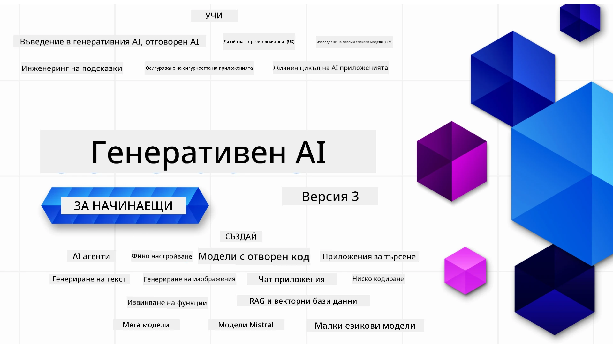

### 21 урока, които ви учат на всичко необходимо, за да започнете да изграждате приложения с Генеративен AI

[](https://github.com/microsoft/Generative-AI-For-Beginners/blob/master/LICENSE?WT.mc_id=academic-105485-koreyst)
[](https://GitHub.com/microsoft/Generative-AI-For-Beginners/graphs/contributors/?WT.mc_id=academic-105485-koreyst)
[](https://GitHub.com/microsoft/Generative-AI-For-Beginners/issues/?WT.mc_id=academic-105485-koreyst)
[](https://GitHub.com/microsoft/Generative-AI-For-Beginners/pulls/?WT.mc_id=academic-105485-koreyst)
[](http://makeapullrequest.com?WT.mc_id=academic-105485-koreyst)

[](https://GitHub.com/microsoft/Generative-AI-For-Beginners/watchers/?WT.mc_id=academic-105485-koreyst)
[](https://GitHub.com/microsoft/Generative-AI-For-Beginners/network/?WT.mc_id=academic-105485-koreyst)
[](https://GitHub.com/microsoft/Generative-AI-For-Beginners/stargazers/?WT.mc_id=academic-105485-koreyst)

[](https://discord.gg/nTYy5BXMWG)

### 🌐 Поддръжка на много езици

#### Поддържа се чрез GitHub Action (Автоматизирано и винаги актуално)

<!-- CO-OP TRANSLATOR LANGUAGES TABLE START -->
[Арабски](../ar/README.md) | [Бенгалски](../bn/README.md) | [Български](./README.md) | [Бирмански (Мианмар)](../my/README.md) | [Китайски (опростен)](../zh-CN/README.md) | [Китайски (традиционен, Хонконг)](../zh-HK/README.md) | [Китайски (традиционен, Макао)](../zh-MO/README.md) | [Китайски (традиционен, Тайван)](../zh-TW/README.md) | [Хърватски](../hr/README.md) | [Чешки](../cs/README.md) | [Датски](../da/README.md) | [Холандски](../nl/README.md) | [Естонски](../et/README.md) | [Фински](../fi/README.md) | [Френски](../fr/README.md) | [Немски](../de/README.md) | [Гръцки](../el/README.md) | [Иврит](../he/README.md) | [Хинди](../hi/README.md) | [Унгарски](../hu/README.md) | [Индонезийски](../id/README.md) | [Италиански](../it/README.md) | [Японски](../ja/README.md) | [Каннада](../kn/README.md) | [Корейски](../ko/README.md) | [Литовски](../lt/README.md) | [Малайски](../ms/README.md) | [Малаялам](../ml/README.md) | [Маратхи](../mr/README.md) | [Непали](../ne/README.md) | [Нигерийски Пиджин](../pcm/README.md) | [Норвежки](../no/README.md) | [Персийски (фарси)](../fa/README.md) | [Полски](../pl/README.md) | [Португалски (Бразилия)](../pt-BR/README.md) | [Португалски (Португалия)](../pt-PT/README.md) | [Пенджабски (Гурмукхи)](../pa/README.md) | [Румънски](../ro/README.md) | [Руски](../ru/README.md) | [Сръбски (кирилица)](../sr/README.md) | [Словашки](../sk/README.md) | [Словенски](../sl/README.md) | [Испански](../es/README.md) | [Суахили](../sw/README.md) | [Шведски](../sv/README.md) | [Тагалог (филипински)](../tl/README.md) | [Тамилски](../ta/README.md) | [Телугу](../te/README.md) | [Тайски](../th/README.md) | [Турски](../tr/README.md) | [Украински](../uk/README.md) | [Урду](../ur/README.md) | [Виетнамски](../vi/README.md)

> **Предпочитате да клонирате локално?**

> Това хранилище включва над 50 езикови превода, което значително увеличава размера на изтегляне. За да клонирате без преводи, използвайте sparse checkout:
> ```bash
> git clone --filter=blob:none --sparse https://github.com/microsoft/generative-ai-for-beginners.git
> cd generative-ai-for-beginners
> git sparse-checkout set --no-cone '/*' '!translations' '!translated_images'
> ```
> Това ви дава всичко необходимо, за да завършите курса с по-бързо изтегляне.
<!-- CO-OP TRANSLATOR LANGUAGES TABLE END -->

# Генеративен AI за начинаещи (Версия 3) - Курс

Научете основите на изграждане на приложения с Генеративен AI чрез нашия изчерпателен курс с 21 урока, създаден от облачни адвокати на Microsoft.

## 🌱 Започване

Този курс съдържа 21 урока. Всеки урок обхваща своя собствена тема, така че започнете от всяка точка, която желаете!

Уроките са обозначени като "Научи" - обясняващи концепция от Генеративния AI или "Изграждане" - обясняващи концепция с примерен код и на двете **Python** и **TypeScript**, когато е възможно.

За разработчици .NET разгледайте [Генеративен AI за начинаещи (.NET издание)](https://github.com/microsoft/Generative-AI-for-beginners-dotnet?WT.mc_id=academic-105485-koreyst)!

Всеки урок включва и секция "Продължете да учите" с допълнителни инструменти за обучение.

## Какво ви е необходимо
### За да стартирате кода от този курс, можете да използвате: 
 - [Azure OpenAI Service](https://aka.ms/genai-beginners/azure-open-ai?WT.mc_id=academic-105485-koreyst) - **Уроци:** "aoai-assignment"
 - [GitHub Marketplace Model Catalog](https://aka.ms/genai-beginners/gh-models?WT.mc_id=academic-105485-koreyst) - **Уроци:** "githubmodels"
 - [OpenAI API](https://aka.ms/genai-beginners/open-ai?WT.mc_id=academic-105485-koreyst) - **Уроци:** "oai-assignment" 
   
- Основни познания по Python или TypeScript са полезни - \*За абсолютно начинаещи разгледайте тези [Python](https://aka.ms/genai-beginners/python?WT.mc_id=academic-105485-koreyst) и [TypeScript](https://aka.ms/genai-beginners/typescript?WT.mc_id=academic-105485-koreyst) курсове
- GitHub акаунт, за да [форкнете цялото това хранилище](https://aka.ms/genai-beginners/github?WT.mc_id=academic-105485-koreyst) във вашия собствен GitHub акаунт

Създадохме урок за **[Настройка на курса](./00-course-setup/README.md?WT.mc_id=academic-105485-koreyst)**, който да ви помогне с настройването на средата за разработка.

Не забравяйте да [дадете звезда (🌟) на това хранилище](https://docs.github.com/en/get-started/exploring-projects-on-github/saving-repositories-with-stars?WT.mc_id=academic-105485-koreyst), за да го намерите по-лесно по-късно.

## 🧠 Готови за пускане?

Ако търсите по-напреднали кодови примери, разгледайте нашата [колекция от кодови примери за Генеративен AI](https://aka.ms/genai-beg-code?WT.mc_id=academic-105485-koreyst) както на **Python**, така и на **TypeScript**.

## 🗣️ Срещнете други учащи, получете подкрепа

Присъединете се към нашия [официален Discord сървър Azure AI Foundry](https://aka.ms/genai-discord?WT.mc_id=academic-105485-koreyst), за да се срещнете и свържете с други учащи, които взимат този курс, и да получите подкрепа.

Задавайте въпроси или споделяйте обратна връзка за продукта в нашия [Azure AI Foundry Developer Forum](https://aka.ms/azureaifoundry/forum) в Github.

## 🚀 Изграждате стартъп?

Посетете [Microsoft for Startups](https://www.microsoft.com/startups), за да разберете как да започнете да изграждате с Azure кредити още днес.

## 🙏 Искате да помогнете?

Имате ли предложения или сте открили правописни или кодови грешки? [Отворете проблем](https://github.com/microsoft/generative-ai-for-beginners/issues?WT.mc_id=academic-105485-koreyst) или [Създайте pull request](https://github.com/microsoft/generative-ai-for-beginners/pulls?WT.mc_id=academic-105485-koreyst)

## 📂 Всеки урок включва:

- Кратко видео въведение в темата
- Писмен урок, разположен в README
- Примери с код на Python и TypeScript, поддържащи Azure OpenAI и OpenAI API
- Връзки към допълнителни ресурси за продължаване на ученето

## 🗃️ Уроци

| #   | **Връзка към урока**                                                                                                                         | **Описание**                                                                                | **Видео**                                                                   | **Допълнително обучение**                                                      |
| --- | -------------------------------------------------------------------------------------------------------------------------------------------- | ------------------------------------------------------------------------------------------- | --------------------------------------------------------------------------- | ------------------------------------------------------------------------------ |
| 00  | [Настройка на курса](./00-course-setup/README.md?WT.mc_id=academic-105485-koreyst)                                                           | **Научи:** Как да настроите вашата среда за разработка                                     | Видео предстои                                                                 | [Научете повече](https://aka.ms/genai-collection?WT.mc_id=academic-105485-koreyst) |
| 01  | [Въведение в Генеративния AI и големите езикови модели (LLMs)](./01-introduction-to-genai/README.md?WT.mc_id=academic-105485-koreyst)           | **Научи:** Разбиране какво е Генеративен AI и как работят големите езикови модели (LLMs).    | [Видео](https://aka.ms/gen-ai-lesson-1-gh?WT.mc_id=academic-105485-koreyst) | [Научете повече](https://aka.ms/genai-collection?WT.mc_id=academic-105485-koreyst) |
| 02  | [Изследване и сравнение на различни големи езикови модели](./02-exploring-and-comparing-different-llms/README.md?WT.mc_id=academic-105485-koreyst) | **Научи:** Как да изберете правилния модел за вашия случай на употреба                     | [Видео](https://aka.ms/gen-ai-lesson2-gh?WT.mc_id=academic-105485-koreyst)  | [Научете повече](https://aka.ms/genai-collection?WT.mc_id=academic-105485-koreyst) |
| 03  | [Отговорно използване на Генеративния AI](./03-using-generative-ai-responsibly/README.md?WT.mc_id=academic-105485-koreyst)                       | **Научи:** Как да изградите отговорни приложения с Генеративен AI                          | [Видео](https://aka.ms/gen-ai-lesson3-gh?WT.mc_id=academic-105485-koreyst)  | [Научете повече](https://aka.ms/genai-collection?WT.mc_id=academic-105485-koreyst) |
| 04  | [Разбиране на основите на проектиране на подсказки](./04-prompt-engineering-fundamentals/README.md?WT.mc_id=academic-105485-koreyst)             | **Научете:** Практически най-добри практики за проектиране на подсказки                                           | [Видео](https://aka.ms/gen-ai-lesson4-gh?WT.mc_id=academic-105485-koreyst)  | [Научете повече](https://aka.ms/genai-collection?WT.mc_id=academic-105485-koreyst) |
| 05  | [Създаване на усъвършенствани подсказки](./05-advanced-prompts/README.md?WT.mc_id=academic-105485-koreyst)                                                | **Научете:** Как да прилагате техники за проектиране на подсказки, които подобряват резултатите от вашите подсказки. | [Видео](https://aka.ms/gen-ai-lesson5-gh?WT.mc_id=academic-105485-koreyst)  | [Научете повече](https://aka.ms/genai-collection?WT.mc_id=academic-105485-koreyst) |
| 06  | [Създаване на приложения за генериране на текст](./06-text-generation-apps/README.md?WT.mc_id=academic-105485-koreyst)                                | **Създаване:** Приложение за генериране на текст с помощта на Azure OpenAI / OpenAI API                                | [Видео](https://aka.ms/gen-ai-lesson6-gh?WT.mc_id=academic-105485-koreyst)  | [Научете повече](https://aka.ms/genai-collection?WT.mc_id=academic-105485-koreyst) |
| 07  | [Създаване на чат приложения](./07-building-chat-applications/README.md?WT.mc_id=academic-105485-koreyst)                                     | **Създаване:** Техники за ефективно създаване и интегриране на чат приложения.               | [Видео](https://aka.ms/gen-ai-lessons7-gh?WT.mc_id=academic-105485-koreyst) | [Научете повече](https://aka.ms/genai-collection?WT.mc_id=academic-105485-koreyst) |
| 08  | [Създаване на приложения за търсене и векторни бази данни](./08-building-search-applications/README.md?WT.mc_id=academic-105485-koreyst)                        | **Създаване:** Приложение за търсене, което използва вграждания за търсене на данни.                        | [Видео](https://aka.ms/gen-ai-lesson8-gh?WT.mc_id=academic-105485-koreyst)  | [Научете повече](https://aka.ms/genai-collection?WT.mc_id=academic-105485-koreyst) |
| 09  | [Създаване на приложения за генериране на изображения](./09-building-image-applications/README.md?WT.mc_id=academic-105485-koreyst)                        | **Създаване:** Приложение за генериране на изображения                                                       | [Видео](https://aka.ms/gen-ai-lesson9-gh?WT.mc_id=academic-105485-koreyst)  | [Научете повече](https://aka.ms/genai-collection?WT.mc_id=academic-105485-koreyst) |
| 10  | [Създаване на AI приложения с нисък код](./10-building-low-code-ai-applications/README.md?WT.mc_id=academic-105485-koreyst)                       | **Създаване:** Приложение с генеративен AI, използващо инструменти с нисък код                                     | [Видео](https://aka.ms/gen-ai-lesson10-gh?WT.mc_id=academic-105485-koreyst) | [Научете повече](https://aka.ms/genai-collection?WT.mc_id=academic-105485-koreyst) |
| 11  | [Интегриране на външни приложения с функциите за извикване](./11-integrating-with-function-calling/README.md?WT.mc_id=academic-105485-koreyst) | **Създаване:** Какво е извикването на функции и случаите му на употреба при приложения                          | [Видео](https://aka.ms/gen-ai-lesson11-gh?WT.mc_id=academic-105485-koreyst) | [Научете повече](https://aka.ms/genai-collection?WT.mc_id=academic-105485-koreyst) |
| 12  | [Проектиране на UX за AI приложения](./12-designing-ux-for-ai-applications/README.md?WT.mc_id=academic-105485-koreyst)                         | **Научете:** Как да прилагате принципи на UX дизайна при разработка на приложения с генеративен AI         | [Видео](https://aka.ms/gen-ai-lesson12-gh?WT.mc_id=academic-105485-koreyst) | [Научете повече](https://aka.ms/genai-collection?WT.mc_id=academic-105485-koreyst) |
| 13  | [Защита на вашите генеративни AI приложения](./13-securing-ai-applications/README.md?WT.mc_id=academic-105485-koreyst)                         | **Научете:** Заплахите и рисковете за AI системите и методите за защита на тези системи.             | [Видео](https://aka.ms/gen-ai-lesson13-gh?WT.mc_id=academic-105485-koreyst) | [Научете повече](https://aka.ms/genai-collection?WT.mc_id=academic-105485-koreyst) |
| 14  | [Жизнен цикъл на генеративните AI приложения](./14-the-generative-ai-application-lifecycle/README.md?WT.mc_id=academic-105485-koreyst)           | **Научете:** Инструментите и метриките за управление на жизнения цикъл на LLM и LLMOps                         | [Видео](https://aka.ms/gen-ai-lesson14-gh?WT.mc_id=academic-105485-koreyst) | [Научете повече](https://aka.ms/genai-collection?WT.mc_id=academic-105485-koreyst) |
| 15  | [Извадково подсилено генериране (RAG) и векторни бази данни](./15-rag-and-vector-databases/README.md?WT.mc_id=academic-105485-koreyst)        | **Създаване:** Приложение, използващо RAG Framework за извличане на вграждания от векторни бази данни  | [Видео](https://aka.ms/gen-ai-lesson15-gh?WT.mc_id=academic-105485-koreyst) | [Научете повече](https://aka.ms/genai-collection?WT.mc_id=academic-105485-koreyst) |
| 16  | [Отворени модели и Hugging Face](./16-open-source-models/README.md?WT.mc_id=academic-105485-koreyst)                                    | **Създаване:** Приложение, използващо отворени модели, налични в Hugging Face                    | [Видео](https://aka.ms/gen-ai-lesson16-gh?WT.mc_id=academic-105485-koreyst) | [Научете повече](https://aka.ms/genai-collection?WT.mc_id=academic-105485-koreyst) |
| 17  | [AI агенти](./17-ai-agents/README.md?WT.mc_id=academic-105485-koreyst)                                                                       | **Създаване:** Приложение, използващо рамка за AI агенти                                           | [Видео](https://aka.ms/gen-ai-lesson17-gh?WT.mc_id=academic-105485-koreyst) | [Научете повече](https://aka.ms/genai-collection?WT.mc_id=academic-105485-koreyst) |
| 18  | [Фино настройване на LLMs](./18-fine-tuning/README.md?WT.mc_id=academic-105485-koreyst)                                                              | **Научете:** Какво, защо и как на финото настройване на LLM                                         | [Видео](https://aka.ms/gen-ai-lesson18-gh?WT.mc_id=academic-105485-koreyst) | [Научете повече](https://aka.ms/genai-collection?WT.mc_id=academic-105485-koreyst) |
| 19  | [Създаване с SLMs](./19-slm/README.md?WT.mc_id=academic-105485-koreyst)                                                              | **Научете:** Ползите от създаването с Малки езици модели                                            | Скоро предстои видео | [Научете повече](https://aka.ms/genai-collection?WT.mc_id=academic-105485-koreyst) |
| 20  | [Създаване с модели Mistral](./20-mistral/README.md?WT.mc_id=academic-105485-koreyst)                                                              | **Научете:** Характеристиките и разликите на моделите от фамилията Mistral                                           | Скоро предстои видео | [Научете повече](https://aka.ms/genai-collection?WT.mc_id=academic-105485-koreyst) |
| 21  | [Създаване с модели Meta](./21-meta/README.md?WT.mc_id=academic-105485-koreyst)                                                              | **Научете:** Характеристиките и разликите на моделите от фамилията Meta                                           | Скоро предстои видео | [Научете повече](https://aka.ms/genai-collection?WT.mc_id=academic-105485-koreyst) |

### 🌟 Специални благодарности

Специални благодарности на [**Джон Азиз**](https://www.linkedin.com/in/john0isaac/) за създаването на всички GitHub Actions и работни потоци

[**Бернхард Мерке**](https://www.linkedin.com/in/bernhard-merkle-738b73/) за ключовите приноси във всяко занятие за подобряване на преживяването на обучаващите се и на кода.

## 🎒 Други курсове

Нашият екип създава и други курсове! Вижте:

<!-- CO-OP TRANSLATOR OTHER COURSES START -->
### LangChain
[](https://aka.ms/langchain4j-for-beginners)
[](https://aka.ms/langchainjs-for-beginners?WT.mc_id=m365-94501-dwahlin)

---

### Azure / Edge / MCP / Агенти
[](https://github.com/microsoft/AZD-for-beginners?WT.mc_id=academic-105485-koreyst)
[](https://github.com/microsoft/edgeai-for-beginners?WT.mc_id=academic-105485-koreyst)
[](https://github.com/microsoft/mcp-for-beginners?WT.mc_id=academic-105485-koreyst)
[](https://github.com/microsoft/ai-agents-for-beginners?WT.mc_id=academic-105485-koreyst)

---
 
### Серия за генеративен AI
[](https://github.com/microsoft/generative-ai-for-beginners?WT.mc_id=academic-105485-koreyst)
[-9333EA?style=for-the-badge&labelColor=E5E7EB&color=9333EA)](https://github.com/microsoft/Generative-AI-for-beginners-dotnet?WT.mc_id=academic-105485-koreyst)
[-C084FC?style=for-the-badge&labelColor=E5E7EB&color=C084FC)](https://github.com/microsoft/generative-ai-for-beginners-java?WT.mc_id=academic-105485-koreyst)
[-E879F9?style=for-the-badge&labelColor=E5E7EB&color=E879F9)](https://github.com/microsoft/generative-ai-with-javascript?WT.mc_id=academic-105485-koreyst)

---
 
### Основно обучение
[](https://aka.ms/ml-beginners?WT.mc_id=academic-105485-koreyst)
[](https://aka.ms/datascience-beginners?WT.mc_id=academic-105485-koreyst)
[](https://aka.ms/ai-beginners?WT.mc_id=academic-105485-koreyst)
[](https://github.com/microsoft/Security-101?WT.mc_id=academic-96948-sayoung)
[](https://aka.ms/webdev-beginners?WT.mc_id=academic-105485-koreyst)
[](https://aka.ms/iot-beginners?WT.mc_id=academic-105485-koreyst)
[](https://github.com/microsoft/xr-development-for-beginners?WT.mc_id=academic-105485-koreyst)

---
 
### Серия Copilot
[](https://aka.ms/GitHubCopilotAI?WT.mc_id=academic-105485-koreyst)
[](https://github.com/microsoft/mastering-github-copilot-for-dotnet-csharp-developers?WT.mc_id=academic-105485-koreyst)
[](https://github.com/microsoft/CopilotAdventures?WT.mc_id=academic-105485-koreyst)
<!-- CO-OP TRANSLATOR OTHER COURSES END -->

## Получаване на помощ

Ако се затрудните или имате въпроси относно изграждането на AI приложения. Присъединете се към други учащи и опитни разработчици в дискусии за MCP. Това е подкрепяща общност, където въпросите са добре дошли, а знанията се споделят свободно.

[](https://discord.gg/nTYy5BXMWG)

Ако имате обратна връзка за продукта или грешки при изграждането, посетете:

[](https://aka.ms/foundry/forum)

---

<!-- CO-OP TRANSLATOR DISCLAIMER START -->
**Отказ от отговорност**:
Този документ е преведен с помощта на AI преводаческа услуга [Co-op Translator](https://github.com/Azure/co-op-translator). Въпреки че се стремим към точност, моля, имайте предвид, че автоматичните преводи могат да съдържат грешки или неточности. Оригиналният документ на неговия език трябва да се счита за авторитетен източник. За критична информация се препоръчва професионален човешки превод. Ние не носим отговорност за каквито и да е недоразумения или неправилни тълкувания, произтичащи от използването на този превод.
<!-- CO-OP TRANSLATOR DISCLAIMER END -->