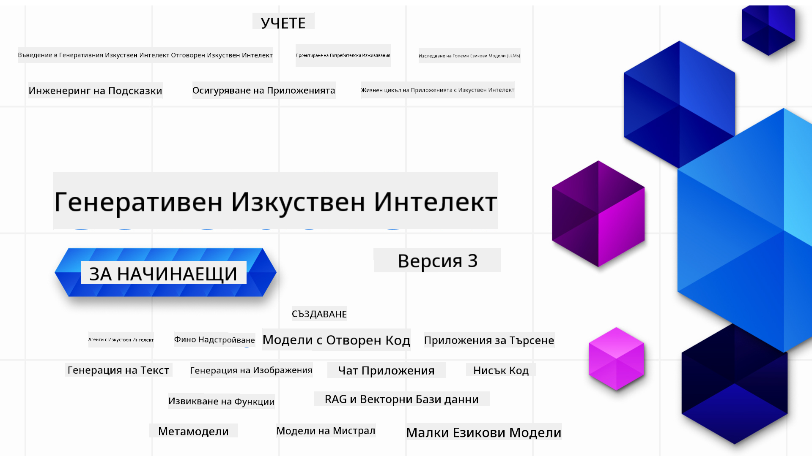

<!--
CO_OP_TRANSLATOR_METADATA:
{
  "original_hash": "c2ee25895ebbfa1a52868bb6eab686fc",
  "translation_date": "2025-05-19T12:03:20+00:00",
  "source_file": "README.md",
  "language_code": "bg"
}
-->

### 21 урока, които ще ви научат на всичко необходимо, за да започнете да изграждате приложения с генеративен AI

### 🌐 Поддръжка на много езици

#### Поддържано чрез GitHub Action (Автоматизирано и винаги актуално)
[Френски](../fr/README.md) | [Испански](../es/README.md) | [Немски](../de/README.md) | [Руски](../ru/README.md) | [Арабски](../ar/README.md) | [Персийски (Фарси)](../fa/README.md) | [Урду](../ur/README.md) | [Китайски (опростен)](../zh/README.md) | [Китайски (традиционен, Макао)](../mo/README.md) | [Китайски (традиционен, Хонконг)](../hk/README.md) | [Китайски (традиционен, Тайван)](../tw/README.md) | [Японски](../ja/README.md) | [Корейски](../ko/README.md) | [Хинди](../hi/README.md) | [Бенгалски](../bn/README.md) | [Маратхи](../mr/README.md) | [Непалски](../ne/README.md) | [Пенджабски (Гурмукхи)](../pa/README.md) | [Португалски (Португалия)](../pt/README.md) | [Португалски (Бразилия)](../br/README.md) | [Италиански](../it/README.md) | [Полски](../pl/README.md) | [Турски](../tr/README.md) | [Гръцки](../el/README.md) | [Тайски](../th/README.md) | [Шведски](../sv/README.md) | [Датски](../da/README.md) | [Норвежки](../no/README.md) | [Фински](../fi/README.md) | [Холандски](../nl/README.md) | [Иврит](../he/README.md) | [Виетнамски](../vi/README.md) | [Индонезийски](../id/README.md) | [Малайски](../ms/README.md) | [Тагалог (Филипински)](../tl/README.md) | [Суахили](../sw/README.md) | [Унгарски](../hu/README.md) | [Чешки](../cs/README.md) | [Словашки](../sk/README.md) | [Румънски](../ro/README.md) | [Български](./README.md) | [Сръбски (Кирилица)](../sr/README.md) | [Хърватски](../hr/README.md) | [Словенски](../sl/README.md)
# Генеративен AI за начинаещи (Версия 3) - Курс

Научете основите на изграждането на приложения с Генеративен AI с нашия 21-урочен курс от Microsoft Cloud Advocates.

## 🌱 Първи стъпки

Този курс съдържа 21 урока. Всеки урок покрива собствена тема, така че започнете оттам, откъдето искате!

Уроците са обозначени като "Learn" уроци, които обясняват концепция на Генеративен AI, или "Build" уроци, които обясняват концепция и дават примери за код както на **Python**, така и на **TypeScript**, когато е възможно.

За .NET разработчици вижте [Генеративен AI за начинаещи (.NET издание)](https://github.com/microsoft/Generative-AI-for-beginners-dotnet?WT.mc_id=academic-105485-koreyst)!

Всеки урок също така включва секция "Продължете да учите" с допълнителни учебни инструменти.

## Какво ви е необходимо
### За да стартирате кода на този курс, можете да използвате:
 - [Azure OpenAI Service](https://aka.ms/genai-beginners/azure-open-ai?WT.mc_id=academic-105485-koreyst) - **Уроци:** "aoai-assignment"
 - [GitHub Marketplace Model Catalog](https://aka.ms/genai-beginners/gh-models?WT.mc_id=academic-105485-koreyst) - **Уроци:** "githubmodels"
 - [OpenAI API](https://aka.ms/genai-beginners/open-ai?WT.mc_id=academic-105485-koreyst) - **Уроци:** "oai-assignment" 

- Основни познания по Python или TypeScript са полезни - \*За абсолютни начинаещи вижте тези курсове по [Python](https://aka.ms/genai-beginners/python?WT.mc_id=academic-105485-koreyst) и [TypeScript](https://aka.ms/genai-beginners/typescript?WT.mc_id=academic-105485-koreyst)
- GitHub акаунт, за да [клонирате цялото това репо](https://aka.ms/genai-beginners/github?WT.mc_id=academic-105485-koreyst) във вашия собствен GitHub акаунт

Създадохме урок **[Настройка на курса](./00-course-setup/README.md?WT.mc_id=academic-105485-koreyst)**, за да ви помогнем с настройката на вашата среда за разработка.

Не забравяйте да [звездите (🌟) това репо](https://docs.github.com/en/get-started/exploring-projects-on-github/saving-repositories-with-stars?WT.mc_id=academic-105485-koreyst), за да го намерите по-лесно по-късно.

## 🧠 Готови за внедряване?

Ако търсите по-напреднали кодови примери, разгледайте нашата [колекция от кодови примери за Генеративен AI](https://aka.ms/genai-beg-code?WT.mc_id=academic-105485-koreyst) както на **Python**, така и на **TypeScript**.

## 🗣️ Срещнете се с други обучаващи се, получете подкрепа

Присъединете се към нашия [официален Discord сървър на Azure AI Foundry](https://aka.ms/genai-discord?WT.mc_id=academic-105485-koreyst), за да се срещнете и свържете с други обучаващи се, които вземат този курс и да получите подкрепа.

Задавайте въпроси или споделяйте обратна връзка за продукта в нашия [Azure AI Foundry Developer Forum](https://aka.ms/azureaifoundry/forum) в Github.

## 🚀 Изграждане на стартираща компания?

Регистрирайте се за [Microsoft for Startups Founders Hub](https://aka.ms/genai-foundershub?WT.mc_id=academic-105485-koreyst), за да получите **безплатни OpenAI кредити** и до **$150k за Azure кредити, за да получите достъп до OpenAI модели чрез Azure OpenAI Services**.

## 🙏 Искате да помогнете?

Имате ли предложения или сте намерили правописни или кодови грешки? [Повдигнете въпрос](https://github.com/microsoft/generative-ai-for-beginners/issues?WT.mc_id=academic-105485-koreyst) или [Създайте pull request](https://github.com/microsoft/generative-ai-for-beginners/pulls?WT.mc_id=academic-105485-koreyst)

## 📂 Всеки урок включва:

- Кратко видео въведение в темата
- Писмен урок, разположен в README
- Примери за код на Python и TypeScript, поддържащи Azure OpenAI и OpenAI API
- Връзки към допълнителни ресурси за продължаване на обучението ви

## 🗃️ Уроци

| #   | **Връзка към урока**                                                                                                                              | **Описание**                                                                                 | **Видео**                                                                   | **Допълнително обучение**                                                             |
| --- | -------------------------------------------------------------------------------------------------------------------------------------------- | ----------------------------------------------------------------------------------------------- | --------------------------------------------------------------------------- | ------------------------------------------------------------------------------ |
| 00  | [Настройка на курса](./00-course-setup/README.md?WT.mc_id=academic-105485-koreyst)                                                                 | **Научете:** Как да настроите вашата среда за разработка                                            | Видео скоро                                                                 | [Научете повече](https://aka.ms/genai-collection?WT.mc_id=academic-105485-koreyst) |
| 01  | [Въведение в Генеративния AI и LLMs](./01-introduction-to-genai/README.md?WT.mc_id=academic-105485-koreyst)                              | **Научете:** Разбиране на това какво е Генеративен AI и как работят Големите езикови модели (LLMs).       | [Видео](https://aka.ms/gen-ai-lesson-1-gh?WT.mc_id=academic-105485-koreyst) | [Научете повече](https://aka.ms/genai-collection?WT.mc_id=academic-105485-koreyst) |
| 02  | [Изследване и сравняване на различни LLMs](./02-exploring-and-comparing-different-llms/README.md?WT.mc_id=academic-105485-koreyst)             | **Научете:** Как да изберете правилния модел за вашия случай                                      | [Видео](https://aka.ms/gen-ai-lesson2-gh?WT.mc_id=academic-105485-koreyst)  | [Научете повече](https://aka.ms/genai-collection?WT.mc_id=academic-105485-koreyst) |
| 03  | [Използване на Генеративен AI отговорно](./03-using-generative-ai-responsibly/README.md?WT.mc_id=academic-105485-koreyst)                           | **Научете:** Как да изграждате приложения с Генеративен AI отговорно                                  | [Видео](https://aka.ms/gen-ai-lesson3-gh?WT.mc_id=academic-105485-koreyst)  | [Научете повече](https://aka.ms/genai-collection?WT.mc_id=academic-105485-koreyst) |
| 04  | [Разбиране на основите на инженерството на подсказки](./04-prompt-engineering-fundamentals/README.md?WT.mc_id=academic-105485-koreyst)             | **Научете:** Практически най-добри практики за инженерство на подсказки                                           | [Видео](https://aka.ms/gen-ai-lesson4-gh?WT.mc_id=academic-105485-koreyst)  | [Научете повече](https://aka.ms/genai-collection?WT.mc_id=academic-105485-koreyst) |
| 05  | [Създаване на напреднали подкани](./05-advanced-prompts/README.md?WT.mc_id=academic-105485-koreyst)                                                | **Научете:** Как да приложите техники за инженеринг на подкани, които подобряват резултата от вашите подкани. | [Видео](https://aka.ms/gen-ai-lesson5-gh?WT.mc_id=academic-105485-koreyst)  | [Научете повече](https://aka.ms/genai-collection?WT.mc_id=academic-105485-koreyst) |
| 06  | [Създаване на приложения за генериране на текст](./06-text-generation-apps/README.md?WT.mc_id=academic-105485-koreyst)                                | **Създайте:** Приложение за генериране на текст с помощта на Azure OpenAI / OpenAI API                                | [Видео](https://aka.ms/gen-ai-lesson6-gh?WT.mc_id=academic-105485-koreyst)  | [Научете повече](https://aka.ms/genai-collection?WT.mc_id=academic-105485-koreyst) |
| 07  | [Създаване на чат приложения](./07-building-chat-applications/README.md?WT.mc_id=academic-105485-koreyst)                                     | **Създайте:** Техники за ефективно създаване и интегриране на чат приложения.               | [Видео](https://aka.ms/gen-ai-lessons7-gh?WT.mc_id=academic-105485-koreyst) | [Научете повече](https://aka.ms/genai-collection?WT.mc_id=academic-105485-koreyst) |
| 08  | [Създаване на приложения за търсене с векторни бази данни](./08-building-search-applications/README.md?WT.mc_id=academic-105485-koreyst)                        | **Създайте:** Приложение за търсене, което използва вградени елементи за търсене на данни.                        | [Видео](https://aka.ms/gen-ai-lesson8-gh?WT.mc_id=academic-105485-koreyst)  | [Научете повече](https://aka.ms/genai-collection?WT.mc_id=academic-105485-koreyst) |
| 09  | [Създаване на приложения за генериране на изображения](./09-building-image-applications/README.md?WT.mc_id=academic-105485-koreyst)                        | **Създайте:** Приложение за генериране на изображения                                                       | [Видео](https://aka.ms/gen-ai-lesson9-gh?WT.mc_id=academic-105485-koreyst)  | [Научете повече](https://aka.ms/genai-collection?WT.mc_id=academic-105485-koreyst) |
| 10  | [Създаване на AI приложения с нисък код](./10-building-low-code-ai-applications/README.md?WT.mc_id=academic-105485-koreyst)                       | **Създайте:** Приложение за генеративен AI с помощта на инструменти за нисък код                                     | [Видео](https://aka.ms/gen-ai-lesson10-gh?WT.mc_id=academic-105485-koreyst) | [Научете повече](https://aka.ms/genai-collection?WT.mc_id=academic-105485-koreyst) |
| 11  | [Интегриране на външни приложения с извикване на функции](./11-integrating-with-function-calling/README.md?WT.mc_id=academic-105485-koreyst) | **Създайте:** Какво представлява извикването на функции и неговите случаи на употреба за приложения                          | [Видео](https://aka.ms/gen-ai-lesson11-gh?WT.mc_id=academic-105485-koreyst) | [Научете повече](https://aka.ms/genai-collection?WT.mc_id=academic-105485-koreyst) |
| 12  | [Дизайн на UX за AI приложения](./12-designing-ux-for-ai-applications/README.md?WT.mc_id=academic-105485-koreyst)                         | **Научете:** Как да приложите принципи за UX дизайн при разработване на генеративни AI приложения         | [Видео](https://aka.ms/gen-ai-lesson12-gh?WT.mc_id=academic-105485-koreyst) | [Научете повече](https://aka.ms/genai-collection?WT.mc_id=academic-105485-koreyst) |
| 13  | [Осигуряване на вашите генеративни AI приложения](./13-securing-ai-applications/README.md?WT.mc_id=academic-105485-koreyst)                         | **Научете:** Заплахите и рисковете за AI системите и методите за осигуряване на тези системи.             | [Видео](https://aka.ms/gen-ai-lesson13-gh?WT.mc_id=academic-105485-koreyst) | [Научете повече](https://aka.ms/genai-collection?WT.mc_id=academic-105485-koreyst) |
| 14  | [Жизненият цикъл на генеративните AI приложения](./14-the-generative-ai-application-lifecycle/README.md?WT.mc_id=academic-105485-koreyst)           | **Научете:** Инструментите и метриките за управление на жизнения цикъл на LLM и LLMOps                         | [Видео](https://aka.ms/gen-ai-lesson14-gh?WT.mc_id=academic-105485-koreyst) | [Научете повече](https://aka.ms/genai-collection?WT.mc_id=academic-105485-koreyst) |
| 15  | [Извличане с Разширено Генериране (RAG) и Векторни Бази Данни](./15-rag-and-vector-databases/README.md?WT.mc_id=academic-105485-koreyst)        | **Създаване:** Приложение с използване на RAG Framework за извличане на вградени данни от Векторни Бази Данни  | [Видео](https://aka.ms/gen-ai-lesson15-gh?WT.mc_id=academic-105485-koreyst) | [Научете повече](https://aka.ms/genai-collection?WT.mc_id=academic-105485-koreyst) |
| 16  | [Модели с Отворен Код и Hugging Face](./16-open-source-models/README.md?WT.mc_id=academic-105485-koreyst)                                    | **Създаване:** Приложение с използване на модели с отворен код, налични в Hugging Face                    | [Видео](https://aka.ms/gen-ai-lesson16-gh?WT.mc_id=academic-105485-koreyst) | [Научете повече](https://aka.ms/genai-collection?WT.mc_id=academic-105485-koreyst) |
| 17  | [AI Агенти](./17-ai-agents/README.md?WT.mc_id=academic-105485-koreyst)                                                                       | **Създаване:** Приложение с използване на AI Agent Framework                                           | [Видео](https://aka.ms/gen-ai-lesson17-gh?WT.mc_id=academic-105485-koreyst) | [Научете повече](https://aka.ms/genai-collection?WT.mc_id=academic-105485-koreyst) |
| 18  | [Фина Настройка на LLMs](./18-fine-tuning/README.md?WT.mc_id=academic-105485-koreyst)                                                              | **Научете:** Какво, защо и как на фината настройка на LLMs                                            | [Видео](https://aka.ms/gen-ai-lesson18-gh?WT.mc_id=academic-105485-koreyst) | [Научете повече](https://aka.ms/genai-collection?WT.mc_id=academic-105485-koreyst) |
| 19  | [Създаване със SLMs](./19-slm/README.md?WT.mc_id=academic-105485-koreyst)                                                              | **Научете:** Ползите от създаването с Малки Езикови Модели                                            | Видео скоро | [Научете повече](https://aka.ms/genai-collection?WT.mc_id=academic-105485-koreyst) |
| 20  | [Създаване с Модели Mistral](./20-mistral/README.md?WT.mc_id=academic-105485-koreyst)                                                              | **Научете:** Характеристиките и разликите на Моделите от Семейство Mistral                                           | Видео скоро | [Научете повече](https://aka.ms/genai-collection?WT.mc_id=academic-105485-koreyst) |
| 21  | [Създаване с Модели Meta](./21-meta/README.md?WT.mc_id=academic-105485-koreyst)                                                              | **Научете:** Характеристиките и разликите на Моделите от Семейство Meta                                           | Видео скоро | [Научете повече](https://aka.ms/genai-collection?WT.mc_id=academic-105485-koreyst) |

### 🌟 Специални благодарности

Специални благодарности на [**John Aziz**](https://www.linkedin.com/in/john0isaac/) за създаването на всички GitHub Actions и работни процеси.

[**Bernhard Merkle**](https://www.linkedin.com/in/bernhard-merkle-738b73/) за ключовите му приноси към всяка лекция за подобряване на опита на обучаващите и код.

## 🎒 Други курсове

Нашият екип създава и други курсове! Вижте:

- [**НОВ** AI Агенти за Начинаещи](https://github.com/microsoft/ai-agents-for-beginners?WT.mc_id=academic-105485-koreyst)
- [**НОВ** Генеративен AI за Начинаещи с .NET](https://github.com/microsoft/Generative-AI-for-beginners-dotnet?WT.mc_id=academic-105485-koreyst)
- [**НОВ** Генеративен AI за Начинаещи с JavaScript](https://aka.ms/genai-js-course?WT.mc_id=academic-105485-koreyst)
- [ML за Начинаещи](https://aka.ms/ml-beginners?WT.mc_id=academic-105485-koreyst)
- [Наука за Данни за Начинаещи](https://aka.ms/datascience-beginners?WT.mc_id=academic-105485-koreyst)
- [AI за Начинаещи](https://aka.ms/ai-beginners?WT.mc_id=academic-105485-koreyst)
- [Киберсигурност за Начинаещи](https://github.com/microsoft/Security-101??WT.mc_id=academic-96948-sayoung)
- [Уеб Разработка за Начинаещи](https://aka.ms/webdev-beginners?WT.mc_id=academic-105485-koreyst)
- [IoT за Начинаещи](https://aka.ms/iot-beginners?WT.mc_id=academic-105485-koreyst)
- [XR Разработка за Начинаещи](https://github.com/microsoft/xr-development-for-beginners?WT.mc_id=academic-105485-koreyst)
- [Овладяване на GitHub Copilot за сдвояване на програмисти с AI](https://aka.ms/GitHubCopilotAI?WT.mc_id=academic-105485-koreyst)
- [Овладяване на GitHub Copilot за C#/.NET разработчици](https://github.com/microsoft/mastering-github-copilot-for-dotnet-csharp-developers?WT.mc_id=academic-105485-koreyst)
- [Изберете своето собствено приключение с Copilot](https://github.com/microsoft/CopilotAdventures?WT.mc_id=academic-105485-koreyst)

**Отказ от отговорност**:  
Този документ е преведен с помощта на AI услуга за превод [Co-op Translator](https://github.com/Azure/co-op-translator). Въпреки че се стремим към точност, моля, имайте предвид, че автоматичните преводи може да съдържат грешки или неточности. Оригиналният документ на неговия роден език трябва да се счита за авторитетен източник. За критична информация се препоръчва професионален човешки превод. Ние не носим отговорност за каквито и да било недоразумения или погрешни тълкувания, произтичащи от използването на този превод.