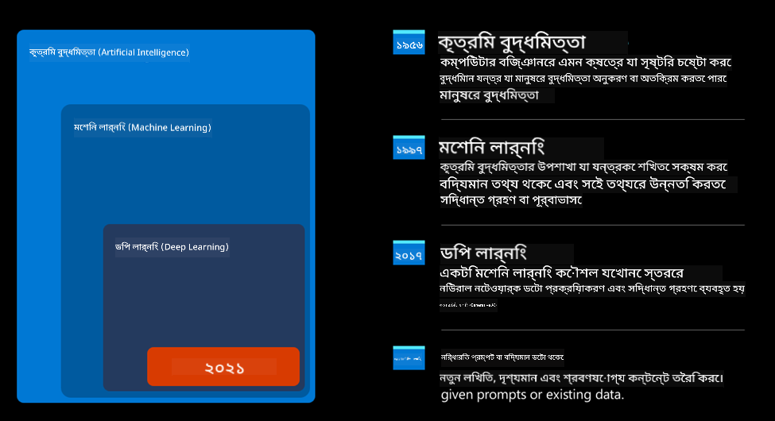
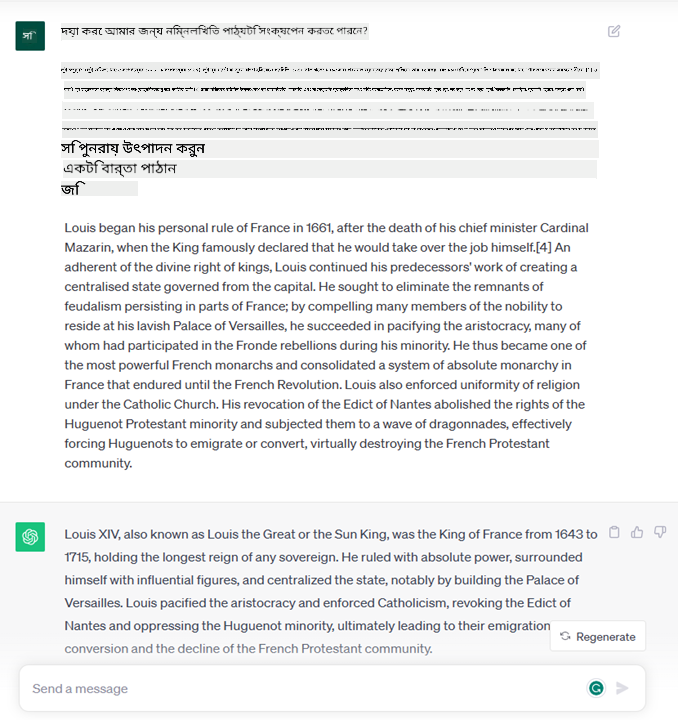
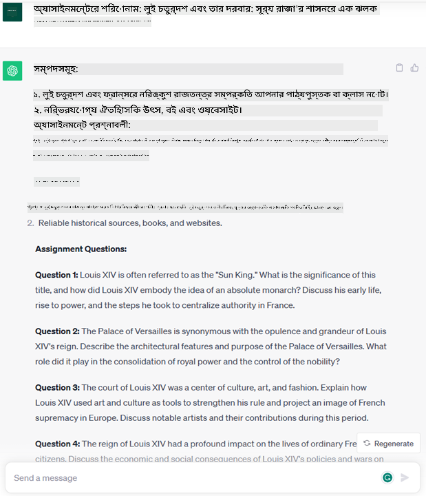
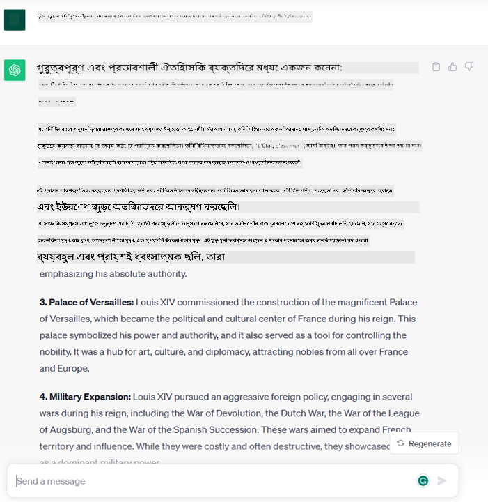
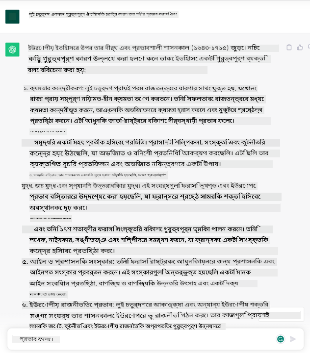
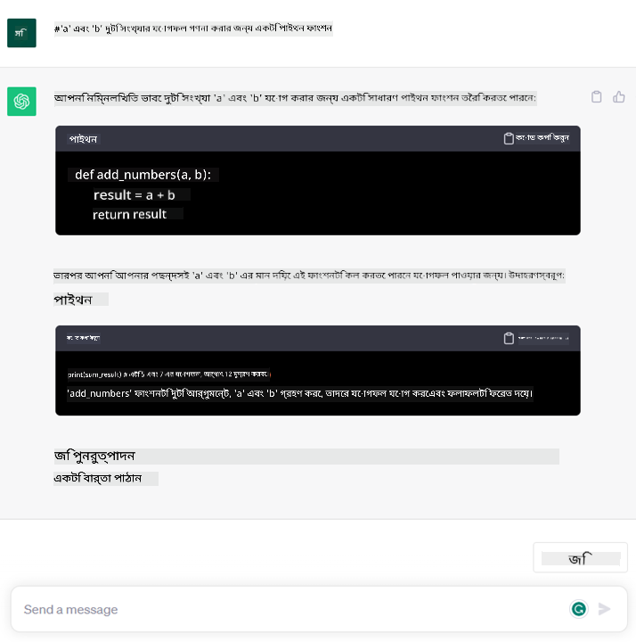

<!--
CO_OP_TRANSLATOR_METADATA:
{
  "original_hash": "f53ba0fa49164f9323043f1c6b11f2b1",
  "translation_date": "2025-05-19T13:07:24+00:00",
  "source_file": "01-introduction-to-genai/README.md",
  "language_code": "bn"
}
-->
# জেনারেটিভ এআই এবং বৃহৎ ভাষার মডেলের পরিচিতি

_(এই পাঠের ভিডিও দেখতে উপরের ছবিতে ক্লিক করুন)_

জেনারেটিভ এআই হলো কৃত্রিম বুদ্ধিমত্তা যা টেক্সট, ছবি এবং অন্যান্য ধরণের কন্টেন্ট তৈরি করতে সক্ষম। এটি একটি চমৎকার প্রযুক্তি কারণ এটি এআইকে সবার জন্য সহজলভ্য করে তোলে, যে কেউ এটি ব্যবহার করতে পারে শুধুমাত্র একটি টেক্সট প্রম্পট, একটি প্রাকৃতিক ভাষায় লেখা বাক্য দিয়ে। জাভা বা এসকিউএল এর মত ভাষা শিখতে হবে না, শুধু আপনার ভাষায় যা চান তা বলুন এবং এআই মডেল থেকে একটি প্রস্তাবনা আসবে। এর প্রয়োগ এবং প্রভাব বিশাল, আপনি রিপোর্ট লিখতে বা বুঝতে পারবেন, অ্যাপ্লিকেশন লিখতে পারবেন এবং আরও অনেক কিছু করতে পারবেন, সবই সেকেন্ডের মধ্যে।

এই পাঠ্যক্রমে, আমরা কীভাবে আমাদের স্টার্টআপ জেনারেটিভ এআই ব্যবহার করে শিক্ষা জগতে নতুন পরিস্থিতি উন্মোচন করছে এবং এর প্রয়োগের সামাজিক প্রভাব এবং প্রযুক্তিগত সীমাবদ্ধতার সাথে সম্পর্কিত অনিবার্য চ্যালেঞ্জগুলি কীভাবে মোকাবেলা করছে তা অন্বেষণ করব।

## পরিচিতি

এই পাঠে আলোচনা করা হবে:

- ব্যবসার পরিস্থিতির পরিচিতি: আমাদের স্টার্টআপ ধারণা এবং মিশন।
- জেনারেটিভ এআই এবং আমরা কীভাবে বর্তমান প্রযুক্তি পরিবেশে পৌঁছেছি।
- বৃহৎ ভাষার মডেলের অভ্যন্তরীণ কার্যপ্রণালী।
- বৃহৎ ভাষার মডেলের প্রধান ক্ষমতা এবং ব্যবহারিক ব্যবহার ক্ষেত্র।

## শেখার লক্ষ্য

এই পাঠ সম্পন্ন করার পরে, আপনি বুঝতে পারবেন:

- জেনারেটিভ এআই কী এবং বৃহৎ ভাষার মডেল কীভাবে কাজ করে।
- আপনি কীভাবে বিভিন্ন ব্যবহার ক্ষেত্রের জন্য বৃহৎ ভাষার মডেলগুলি ব্যবহার করতে পারেন, শিক্ষার পরিস্থিতির উপর ফোকাস করে।

## পরিস্থিতি: আমাদের শিক্ষামূলক স্টার্টআপ

জেনারেটিভ কৃত্রিম বুদ্ধিমত্তা (এআই) এআই প্রযুক্তির শীর্ষস্থানীয় প্রতিনিধিত্ব করে, যা একসময় অসম্ভব মনে করা হয়েছিল তার সীমা অতিক্রম করে। জেনারেটিভ এআই মডেলের বিভিন্ন ক্ষমতা এবং প্রয়োগ রয়েছে, তবে এই পাঠ্যক্রমে আমরা কল্পিত একটি স্টার্টআপের মাধ্যমে এটি কীভাবে শিক্ষাকে বিপ্লব করছে তা অন্বেষণ করব। আমরা এই স্টার্টআপকে _আমাদের স্টার্টআপ_ বলে উল্লেখ করব। আমাদের স্টার্টআপ শিক্ষা ক্ষেত্রে কাজ করে, একটি উচ্চাকাঙ্ক্ষী মিশন বিবৃতির সাথে

> _শেখার অ্যাক্সেসিবিলিটি উন্নত করা, বিশ্বব্যাপী, শিক্ষা প্রাপ্তির সমতা নিশ্চিত করা এবং প্রতিটি শিক্ষার্থীর প্রয়োজন অনুযায়ী ব্যক্তিগতকৃত শেখার অভিজ্ঞতা প্রদান করা।_

আমাদের স্টার্টআপ দল জানে যে আমরা এই লক্ষ্য অর্জন করতে পারব না আধুনিক সময়ের অন্যতম শক্তিশালী সরঞ্জাম - বৃহৎ ভাষার মডেল (এলএলএম) ব্যবহার না করে।

জেনারেটিভ এআই আজকের শেখার এবং শিক্ষাদানের পদ্ধতি বিপ্লব ঘটাতে চলেছে, যেখানে শিক্ষার্থীরা ২৪ ঘন্টা ভার্চুয়াল শিক্ষকদের সুবিধা পাবে যারা বিশাল পরিমাণ তথ্য এবং উদাহরণ প্রদান করবে, এবং শিক্ষকরা তাদের শিক্ষার্থীদের মূল্যায়ন করতে এবং প্রতিক্রিয়া দিতে উদ্ভাবনী সরঞ্জামগুলি ব্যবহার করতে সক্ষম হবে।

শুরুতে, আসুন কিছু মৌলিক ধারণা এবং পরিভাষা নির্ধারণ করি যা আমরা পুরো পাঠ্যক্রম জুড়ে ব্যবহার করব।

## আমরা কীভাবে জেনারেটিভ এআই পেলাম?

জেনারেটিভ এআই মডেলের ঘোষণার কারণে সাম্প্রতিককালে তৈরি হওয়া অসাধারণ _হাইপ_ সত্ত্বেও, এই প্রযুক্তি কয়েক দশক ধরে তৈরি হচ্ছে, যার প্রথম গবেষণা প্রচেষ্টা ৬০-এর দশক থেকে শুরু হয়েছিল। আমরা এখন এমন একটি পর্যায়ে আছি যেখানে এআই-এর মানব জ্ঞানীয় ক্ষমতা রয়েছে, যেমন কথোপকথন যেমন উদাহরণস্বরূপ [OpenAI ChatGPT](https://openai.com/chatgpt) বা [Bing Chat](https://www.microsoft.com/edge/features/bing-chat?WT.mc_id=academic-105485-koreyst) দ্বারা প্রদর্শিত হয়, যা ওয়েব অনুসন্ধান বিং কথোপকথনের জন্য একটি GPT মডেলও ব্যবহার করে।

একটু পেছনে ফিরে গেলে, এআই-এর প্রথম প্রোটোটাইপগুলি টাইপ করা চ্যাটবট নিয়ে গঠিত ছিল, যা একটি বিশেষজ্ঞ গোষ্ঠী থেকে প্রাপ্ত একটি জ্ঞান ভিত্তির উপর নির্ভর করে এবং কম্পিউটারে উপস্থাপিত হয়েছিল। ইনপুট টেক্সটে উপস্থিত কীওয়ার্ড দ্বারা জ্ঞান ভিত্তির উত্তরগুলি ট্রিগার করা হয়েছিল।
তবে, শীঘ্রই এটি স্পষ্ট হয়ে যায় যে টাইপ করা চ্যাটবট ব্যবহার করে এমন একটি পদ্ধতি ভালোভাবে স্কেল হয় না।

### এআই-এর একটি পরিসংখ্যানগত পদ্ধতি: মেশিন লার্নিং

৯০-এর দশকে, পাঠ বিশ্লেষণে পরিসংখ্যানগত পদ্ধতির প্রয়োগের মাধ্যমে একটি মোড় আসে। এটি নতুন অ্যালগরিদমের বিকাশের দিকে পরিচালিত করে - যা মেশিন লার্নিং নামে পরিচিত - যা স্পষ্টভাবে প্রোগ্রাম করা ছাড়াই ডেটা থেকে প্যাটার্ন শিখতে সক্ষম। এই পদ্ধতি মেশিনগুলিকে মানব ভাষা বোঝার অনুকরণ করতে দেয়: একটি পরিসংখ্যানগত মডেল টেক্সট-লেবেল জোড়াগুলিতে প্রশিক্ষিত হয়, যা মডেলটিকে একটি পূর্বনির্ধারিত লেবেল সহ একটি অজানা ইনপুট টেক্সট শ্রেণীবদ্ধ করতে সক্ষম করে যা বার্তার অভিপ্রায়কে প্রতিনিধিত্ব করে।

### নিউরাল নেটওয়ার্ক এবং আধুনিক ভার্চুয়াল সহকারীরা

সাম্প্রতিক বছরগুলিতে, বৃহত্তর পরিমাণে ডেটা এবং আরও জটিল গণনা পরিচালনা করতে সক্ষম হার্ডওয়্যারের প্রযুক্তিগত বিবর্তন এআই-এ গবেষণাকে উৎসাহিত করেছে, উন্নত মেশিন লার্নিং অ্যালগরিদমের বিকাশের দিকে পরিচালিত করে যা নিউরাল নেটওয়ার্ক বা গভীর লার্নিং অ্যালগরিদম হিসাবে পরিচিত।

নিউরাল নেটওয়ার্ক (এবং বিশেষ করে পুনরাবৃত্ত নিউরাল নেটওয়ার্ক - আরএনএন) প্রাকৃতিক ভাষা প্রক্রিয়াকরণকে উল্লেখযোগ্যভাবে উন্নত করেছে, বাক্যে একটি শব্দের প্রসঙ্গকে মূল্যায়ন করে পাঠের অর্থকে আরও অর্থপূর্ণভাবে উপস্থাপন করতে সক্ষম করেছে।

এটি সেই প্রযুক্তি যা নতুন শতাব্দীর প্রথম দশকে জন্ম নেওয়া ভার্চুয়াল সহকারীদের চালিত করেছিল, যা মানব ভাষা ব্যাখ্যা করতে, একটি প্রয়োজন চিহ্নিত করতে এবং এটি পূরণ করতে একটি পদক্ষেপ সম্পাদন করতে খুব দক্ষ ছিল - যেমন একটি পূর্বনির্ধারিত স্ক্রিপ্টের সাথে উত্তর দেওয়া বা একটি তৃতীয় পক্ষের পরিষেবা ব্যবহার করা।

### বর্তমান দিন, জেনারেটিভ এআই

তাহলে আমরা আজকের জেনারেটিভ এআই-তে কীভাবে পৌঁছলাম, যা গভীর শিক্ষার একটি উপসেট হিসাবে দেখা যেতে পারে।

এআই ক্ষেত্রে কয়েক দশকের গবেষণার পরে, একটি নতুন মডেল আর্কিটেকচার - _ট্রান্সফরমার_ নামে পরিচিত - আরএনএন-এর সীমাবদ্ধতা অতিক্রম করেছে, যা ইনপুট হিসাবে অনেক দীর্ঘ টেক্সট সিকোয়েন্স পেতে সক্ষম। ট্রান্সফরমারগুলি মনোযোগ প্রক্রিয়ার উপর ভিত্তি করে তৈরি, যা মডেলকে এটি যে ইনপুটগুলি গ্রহণ করে তা বিভিন্ন ওজন দিতে সক্ষম করে, যেখানে সবচেয়ে প্রাসঙ্গিক তথ্য কেন্দ্রীভূত থাকে সেখানে আরও বেশি মনোযোগ দেয়, তাদের টেক্সট সিকোয়েন্সের ক্রম নির্বিশেষে।

সাম্প্রতিক বেশিরভাগ জেনারেটিভ এআই মডেল - যা বৃহৎ ভাষার মডেল (এলএলএম) নামেও পরিচিত, যেহেতু তারা পাঠ্য ইনপুট এবং আউটপুট নিয়ে কাজ করে - প্রকৃতপক্ষে এই আর্কিটেকচারের উপর ভিত্তি করে। এই মডেলগুলি সম্পর্কে আকর্ষণীয় বিষয় - যা বই, নিবন্ধ এবং ওয়েবসাইটের মতো বিভিন্ন উৎস থেকে বিশাল পরিমাণের অচিহ্নিত ডেটাতে প্রশিক্ষিত - তা হলো তারা বিভিন্ন ধরণের কাজের জন্য মানিয়ে নিতে পারে এবং সৃজনশীলতার একটি ছাপ সহ ব্যাকরণগতভাবে সঠিক টেক্সট তৈরি করতে পারে। সুতরাং, তারা একটি মেশিনের ইনপুট পাঠ্য 'বুঝতে' সক্ষমতা অবিশ্বাস্যভাবে উন্নত করেছে তা নয়, তারা মানুষের ভাষায় একটি আসল প্রতিক্রিয়া তৈরি করার তাদের ক্ষমতা সক্ষম করেছে।

## বৃহৎ ভাষার মডেল কীভাবে কাজ করে?

পরবর্তী অধ্যায়ে আমরা বিভিন্ন ধরণের জেনারেটিভ এআই মডেল অন্বেষণ করব, তবে আপাতত আসুন দেখি বৃহৎ ভাষার মডেল কীভাবে কাজ করে, ওপেনএআই জিপিটি (জেনারেটিভ প্রি-ট্রেইন্ড ট্রান্সফরমার) মডেলের উপর ফোকাস করে।

- **টোকেনাইজার, পাঠ্য থেকে সংখ্যা**: বৃহৎ ভাষার মডেলগুলি ইনপুট হিসাবে একটি পাঠ্য গ্রহণ করে এবং আউটপুট হিসাবে একটি পাঠ্য তৈরি করে। তবে, পরিসংখ্যানগত মডেল হওয়ায় তারা সংখ্যার সাথে পাঠ্য সিকোয়েন্সের চেয়ে অনেক ভালো কাজ করে। এজন্য মডেলটির প্রতিটি ইনপুট একটি টোকেনাইজার দ্বারা প্রক্রিয়াজাত করা হয়, মূল মডেল দ্বারা ব্যবহৃত হওয়ার আগে। একটি টোকেন একটি পাঠ্য টুকরো - একটি পরিবর্তনশীল সংখ্যক অক্ষর নিয়ে গঠিত, তাই টোকেনাইজারের প্রধান কাজটি ইনপুটকে টোকেনের অ্যারেতে ভাগ করা। তারপর, প্রতিটি টোকেন একটি টোকেন সূচকের সাথে মানচিত্র করা হয়, যা মূল পাঠ্য টুকরোর পূর্ণসংখ্যা এনকোডিং।

- **আউটপুট টোকেন পূর্বাভাস**: n টোকেন ইনপুট হিসাবে দেওয়া হলে (একটি মডেল থেকে অন্য মডেলে সর্বাধিক n পরিবর্তিত হয়), মডেলটি আউটপুট হিসাবে একটি টোকেন পূর্বাভাস দিতে সক্ষম। এই টোকেনটি পরবর্তী পুনরাবৃত্তির ইনপুটে অন্তর্ভুক্ত করা হয়, একটি প্রসারণশীল উইন্ডো প্যাটার্নে, একটি উত্তরের একটি (বা একাধিক) বাক্য পাওয়ার একটি ভাল ব্যবহারকারীর অভিজ্ঞতা সক্ষম করে। এটি ব্যাখ্যা করে কেন, যদি আপনি কখনও ChatGPT-এর সাথে খেলেন, আপনি লক্ষ্য করতে পারেন যে কখনও কখনও এটি বাক্যের মাঝখানে থেমে যায়।

- **নির্বাচন প্রক্রিয়া, সম্ভাব্যতা বিতরণ**: আউটপুট টোকেনটি মডেল দ্বারা তার বর্তমান পাঠ্য সিকোয়েন্সের পরে ঘটার সম্ভাবনার ভিত্তিতে নির্বাচিত হয়। এটি কারণ মডেলটি এর প্রশিক্ষণের উপর ভিত্তি করে সমস্ত সম্ভাব্য 'পরবর্তী টোকেন' এর উপর একটি সম্ভাব্যতা বিতরণ পূর্বাভাস দেয়। তবে, সর্বদা সর্বোচ্চ সম্ভাবনার টোকেনটি ফলাফল বিতরণ থেকে নির্বাচিত হয় না। এই পছন্দে একটি ডিগ্রি র্যান্ডমনেস যোগ করা হয়, যাতে মডেলটি একটি অনির্ধারিত পদ্ধতিতে কাজ করে - আমরা একই ইনপুটের জন্য একই আউটপুট পাই না। এই র্যান্ডমনেসের ডিগ্রি সৃজনশীল চিন্তাভাবনার প্রক্রিয়া অনুকরণ করতে যোগ করা হয় এবং এটি একটি মডেল প্যারামিটার নামে পরিচিত তাপমাত্রা ব্যবহার করে সামঞ্জস্য করা যায়।

## আমাদের স্টার্টআপ কীভাবে বৃহৎ ভাষার মডেলগুলি ব্যবহার করতে পারে?

এখন যে আমরা বৃহৎ ভাষার মডেলের অভ্যন্তরীণ কার্যপ্রণালী সম্পর্কে একটি ভাল ধারণা পেয়েছি, আসুন দেখি তারা সবচেয়ে সাধারণ কাজগুলির কিছু ব্যবহারিক উদাহরণ যা তারা বেশ ভালোভাবে সম্পাদন করতে পারে, আমাদের ব্যবসার পরিস্থিতির দিকে নজর দিয়ে।
আমরা বলেছি যে বৃহৎ ভাষার মডেলের প্রধান ক্ষমতা হলো _প্রাকৃতিক ভাষায় লেখা একটি পাঠ্য ইনপুট থেকে শুরু করে একটি পাঠ্য তৈরি করা_।

কিন্তু কী ধরনের পাঠ্য ইনপুট এবং আউটপুট?
বৃহৎ ভাষার মডেলের ইনপুটটি একটি প্রম্পট হিসাবে পরিচিত, যখন আউটপুটটি একটি সম্পূর্ণতা হিসাবে পরিচিত, যা বর্তমান ইনপুটটি সম্পূর্ণ করতে পরবর্তী টোকেন তৈরির মডেল প্রক্রিয়াকে বোঝায়। আমরা কী একটি প্রম্পট এবং কীভাবে আমাদের মডেল থেকে সর্বাধিক পেতে এটি ডিজাইন করতে পারি তা নিয়ে গভীরভাবে ডুব দেব। তবে আপাতত, আসুন শুধু বলি যে একটি প্রম্পট অন্তর্ভুক্ত করতে পারে:

- মডেল থেকে আমরা যে ধরনের আউটপুট আশা করি তা নির্দিষ্ট করে একটি **নির্দেশনা**। এই নির্দেশনায় কখনও কখনও কিছু উদাহরণ বা কিছু অতিরিক্ত ডেটা অন্তর্ভুক্ত থাকতে পারে।

  1. একটি নিবন্ধ, বই, পণ্য পর্যালোচনা এবং আরও অনেক কিছু সংক্ষেপণ, অগঠিত ডেটা থেকে অন্তর্দৃষ্টি নিষ্কাশনের সাথে।

    
  
  2. একটি নিবন্ধ, একটি প্রবন্ধ, একটি অ্যাসাইনমেন্ট বা আরও অনেক কিছু সৃজনশীল ধারণা এবং ডিজাইন।
      
     

- একটি এজেন্টের সাথে কথোপকথনের আকারে জিজ্ঞাসিত একটি **প্রশ্ন**।
  
  

- **সম্পূর্ণ করার জন্য একটি টেক্সট টুকরা**, যা পরোক্ষভাবে লেখার সহায়তার জন্য একটি জিজ্ঞাসা।

  

- একটি নির্দিষ্ট কাজ সম্পাদনকারী একটি কোড টুকরা তৈরি করার জন্য ব্যাখ্যা এবং ডকুমেন্ট করার জন্য একটি মন্তব্য সহ একটি **কোড টুকরা**।

  

উপরে উল্লেখিত উদাহরণগুলি বেশ সাধারণ এবং বৃহৎ ভাষার মডেলের ক্ষমতার একটি সম্পূর্ণ প্রদর্শনী হিসাবে উদ্দেশ্য নয়। এগুলি জেনারেটিভ এআই ব্যবহার করার সম্ভাবনা দেখানোর জন্য, বিশেষত তবে শিক্ষামূলক প্রসঙ্গে সীমাবদ্ধ নয়।

এছাড়াও, একটি জেনারেটিভ এআই মডেলের আউটপুট নিখুঁত নয় এবং কখনও কখনও মডেলের সৃজনশীলতা এটি বিপরীতে কাজ করতে পারে, যার ফলে এমন একটি আউটপুট হয় যা মানব ব্যবহারকারী বাস্তবতার একটি মিথ্যাচার হিসাবে ব্যাখ্যা করতে পারে, বা এটি আক্রমণাত্মক হতে পারে। জেনারেটিভ এআই বুদ্ধিমান নয় - অন্তত বুদ্ধিমত্তার আরও ব্যাপক সংজ্ঞায়, সমালোচনামূলক এবং সৃজনশীল যুক্তি বা আবেগীয় বুদ্ধিমত্তা সহ; এটি অনির্ধারিত নয়, এবং এটি বিশ্বাসযোগ্য নয়, কারণ ভুল রেফারেন্স, বিষয়বস্তু এবং বিবৃতি সঠিক তথ্যের সাথে মিলিত হতে পারে এবং একটি বিশ্বাসযোগ্য এবং আত্মবিশ্বাসী পদ্ধতিতে উপস্থাপন করা যেতে পারে। পরবর্তী পাঠে, আমরা এই সমস্ত সীমাবদ্ধতার সাথে মোকাবিলা করব এবং এগুলি হ্রাস করার জন্য আমরা কী করতে পারি তা দেখব।

## অ্যাসাইনমেন্ট

আপনার অ্যাসাইনমেন্ট হল [জেনারেটিভ এআই](https://en.wikipedia.org/wiki/Generative_artificial_intelligence?WT.mc_id=academic-105485-koreyst) সম্পর্কে আরও পড়া এবং এমন একটি ক্ষেত্র চিহ্নিত করার চেষ্টা করা যেখানে আপনি আজ জেনারেটিভ এআই যোগ করবেন যা এটি নেই। এটি "পুরানো পদ্ধতিতে" করার থেকে প্রভাব কীভাবে আলাদা হবে, আপনি কি এমন কিছু করতে পারবেন যা আপনি আগে করতে পারেননি, নাকি আপনি দ্রুত? আপনার স্বপ্নের এআই স্টার্টআপটি কেমন হবে তার উপর একটি ৩০০ শব্দের সারাংশ লিখুন এবং "সমস্যা", "আমি কীভাবে এআই ব্যবহার করব", "প্রভাব" এবং ঐচ্ছিকভাবে একটি ব্যবসায়িক পরিকল্পনার মতো শিরোনাম অন্তর্ভুক্ত করুন।

যদি আপনি এই কাজটি করেন, আপনি মাইক্রোসফটের ইনকিউবেটরে আবেদন করতে প্রস্তুত হতে পারেন

**অস্বীকৃতি**:  
এই নথিটি AI অনুবাদ পরিষেবা [Co-op Translator](https://github.com/Azure/co-op-translator) ব্যবহার করে অনুবাদ করা হয়েছে। আমরা যথাসম্ভব সঠিকতা নিশ্চিত করার চেষ্টা করি, তবে অনুগ্রহ করে সচেতন থাকুন যে স্বয়ংক্রিয় অনুবাদে ত্রুটি বা অসঙ্গতি থাকতে পারে। মূল নথিটি তার মাতৃভাষায় প্রামাণিক উৎস হিসাবে বিবেচিত হওয়া উচিত। গুরুত্বপূর্ণ তথ্যের জন্য, পেশাদার মানব অনুবাদ সুপারিশ করা হয়। এই অনুবাদ ব্যবহারের ফলে সৃষ্ট কোনও ভুল বোঝাবুঝি বা ভুল ব্যাখ্যার জন্য আমরা দায়বদ্ধ নই।