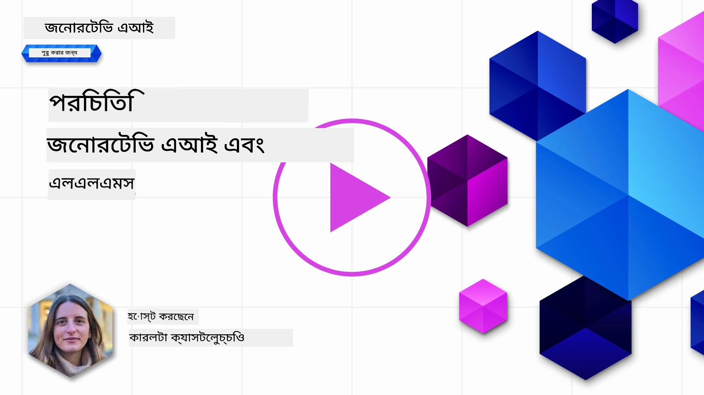
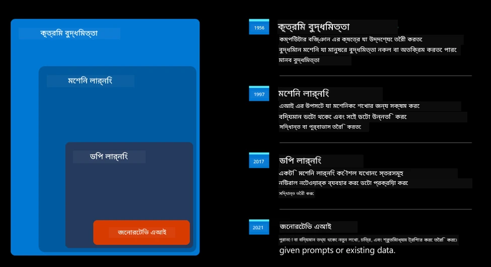
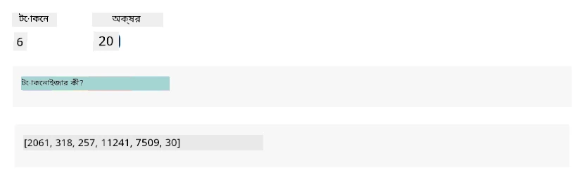
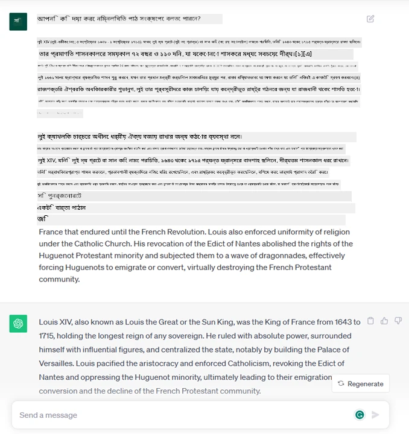
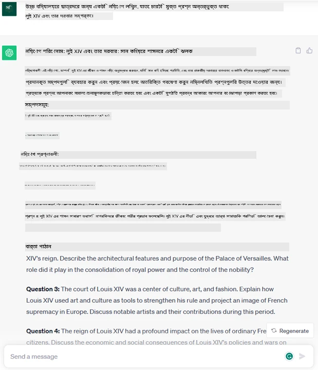
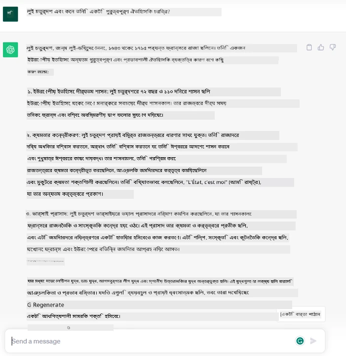
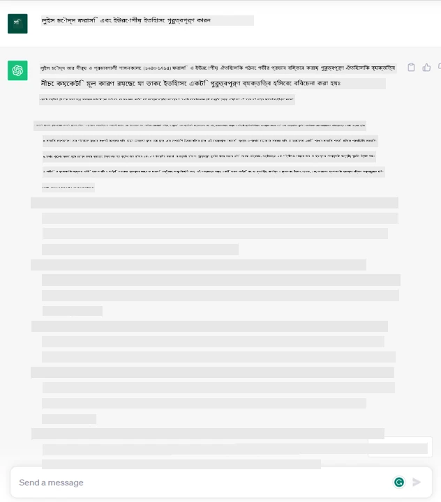
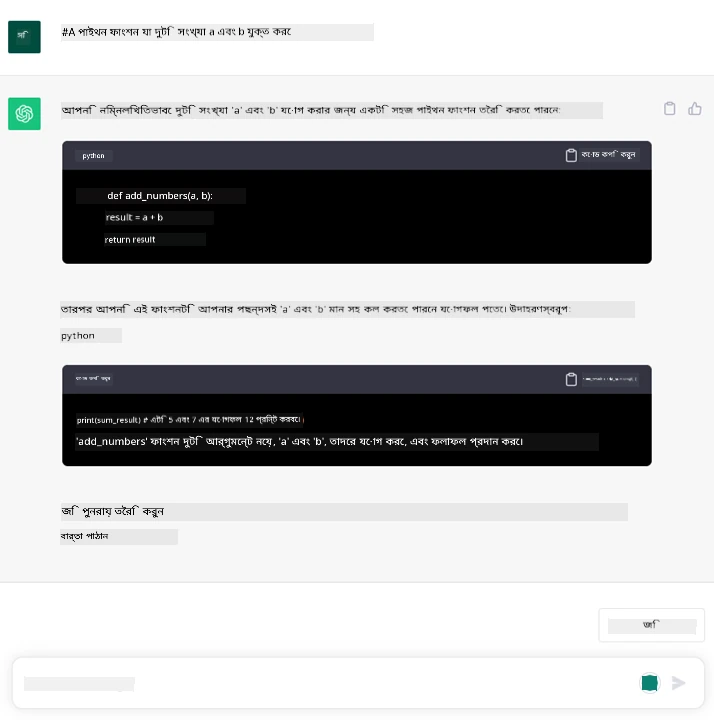

# জেনেরেটিভ AI এবং বড় ভাষা মডেলগুলির পরিচিতি

_(এই পাঠের ভিডিও দেখতে উপরের ছবিতে ক্লিক করুন)_

জেনেরেটিভ AI হলো এমন কৃত্রিম বুদ্ধিমত্তা যা লেখা, ছবি এবং অন্যান্য ধরনের বিষয়বস্তু তৈরিতে সক্ষম। যা এটিকে অসাধারণ প্রযুক্তি করে তোলে তা হলো এটি AI-এর গণতান্ত্রিকরণ করে, যেকেউ খুব সামান্য একটি লিখিত বাক্যের মাধ্যমে এটি ব্যবহার করতে পারে, যা একটি প্রাকৃতিক ভাষায় লেখা। আপনি Java বা SQL এর মতো ভাষা শিখতে হবে না কোনো মূল কাজ করতে, আপনাকে শুধুমাত্র আপনার ভাষা ব্যবহার করতে হবে, যা আপনি চান তা জানাতে হবে এবং ফলস্বরূপ AI মডেল থেকে একটি পরামর্শ আসবে। এর প্রভাব এবং ব্যবহার ব্যাপক, আপনি রিপোর্ট লেখেন বা বুঝেন, অ্যাপ্লিকেশন লেখেন এবং আরও অনেক কিছু, সবকিছুই কয়েক সেকেন্ডে।

এই পাঠক্রমে, আমরা অন্বেষণ করব কীভাবে আমাদের স্টার্টআপ জেনেরেটিভ AI ব্যবহার করে শিক্ষা দুনিয়ায় নতুন পরিস্থিতি উন্মুক্ত করে এবং কীভাবে আমরা এর প্রয়োগের সামাজিক প্রভাব ও প্রযুক্তিগত সীমাবদ্ধতা থেকে উদ্ভূত চ্যালেঞ্জগুলির মোকাবিলা করি।

## পরিচিতি

এই পাঠে আলোচনা করা হবে:

- ব্যবসায়িক পরিস্থিতির পরিচিতি: আমাদের স্টার্টআপের ধারণা এবং লক্ষ্য।
- জেনেরেটিভ AI এবং আমরা কীভাবে বর্তমান প্রযুক্তি দৃশ্যে পৌঁছেছি।
- বড় ভাষা মডেলের অভ্যন্তরীণ কাঠামো।
- বড় ভাষা মডেলের প্রধান ক্ষমতা এবং বাস্তব ব্যবহার ক্ষেত্র।

## শেখার লক্ষ্যসমূহ

এই পাঠ শেষ করার পর, আপনি বুঝতে পারবেন:

- জেনেরেটিভ AI কী এবং বড় ভাষা মডেল কীভাবে কাজ করে।
- আপনি কিভাবে বড় ভাষা মডেলগুলি বিভিন্ন ব্যবহার ক্ষেত্রের জন্য ব্যবহার করতে পারেন, বিশেষ করে শিক্ষা পরিস্থিতিতে।

## পরিস্থিতি: আমাদের শিক্ষামূলক স্টার্টআপ

জেনেরেটিভ কৃত্রিম বুদ্ধিমত্তা (AI) AI প্রযুক্তির শীর্ষস্থান প্রতিনিধিত্ব করে, যা একসময় অসম্ভব মনে হওয়া সীমাগুলো অতিক্রম করছে। জেনেরেটিভ AI মডেলগুলির অনেক সক্ষমতা ও ব্যবহার রয়েছে, কিন্তু এই পাঠক্রমে আমরা অন্বেষণ করব কীভাবে এটি একটি কাল্পনিক স্টার্টআপের মাধ্যমে শিক্ষায় বিপ্লব ঘটাচ্ছে। আমরা এই স্টার্টআপকে বলব _আমাদের স্টার্টআপ_। আমাদের স্টার্টআপ শিক্ষা ক্ষেত্রে কাজ করে এবং তার উচ্চাকাঙ্ক্ষী মিশন হল

> _শিক্ষায় গ্লোবালি প্রবেশাধিকার উন্নত করা, সকলের জন্য ন্যায্য শিক্ষা নিশ্চিত করা এবং প্রত্যেক শিক্ষার্থীর প্রয়োজন অনুযায়ী ব্যক্তিগতকৃত শেখার অভিজ্ঞতা প্রদান করা_।

আমাদের স্টার্টআপ দল জানে যে আমরা এই লক্ষ্যে পৌঁছাতে পারবো না যদি না আমরা আধুনিক সময়ের অন্যতম শক্তিশালী হাতিয়ার – বড় ভাষা মডেলগুলি (LLMs) ব্যবহার করি।

জেনেরেটিভ AI প্রত্যাশিত যে আজকের শেখার এবং শিক্ষার পদ্ধতিতে বিপ্লব ঘটাবে, যেখানে শিক্ষার্থীরা ২৪ ঘণ্টা ভাসচুয়াল শিক্ষক পাবে যাদের মাধ্যমে প্রচুর তথ্য এবং উদাহরণ পাওয়া যাবে, এবং শিক্ষকরা উদ্ভাবনী টুল ব্যবহার করে তাদের শিক্ষার্থীদের মূল্যায়ন এবং প্রতিক্রিয়া প্রদান করতে পারবেন।

শুরুতে, আসুন কিছু মূল ধারণা এবং পরিভাষা সংজ্ঞায়িত করি যা আমরা সম্পূর্ণ পাঠক্রমে ব্যবহার করব।

## আমরা কিভাবে পেলাম জেনেরেটিভ AI?

সাম্প্রতিককালে জেনেরেটিভ AI মডেলগুলির ঘোষণায় যে অসাধারণ _হাইপ_ তৈরি হয়েছে তা সত্ত্বেও, এই প্রযুক্তি দশকের ওপর তৈরি হয়েছে, প্রথম গবেষণা প্রচেষ্টা ৬০ এর দশকে শুরু হয়েছিল। এখন আমরা এমন একটি পর্যায়ে পৌঁছেছি যেখানে AI মানব মানসিক দক্ষতা অর্জন করেছে, যেমন কথোপকথন, উদাহরণস্বরূপ [OpenAI ChatGPT](https://openai.com/chatgpt) বা [Microsoft Copilot](https://copilot.microsoft.com/?WT.mc_id=academic-105485-koreyst), যা কথোপকথনমূলক ওয়েব সার্চ অভিজ্ঞতার জন্য GPT মডেল ব্যবহার করে।

একটু আগে ফিরে যাওয়া যাক, AI এর প্রথম প্রোটোটাইপ ছিল টাইপরাইটেন চ্যাটবট, যা বিশেষজ্ঞদের একটি দল থেকে সংগৃহীত জ্ঞানভাণ্ডার উপর নির্ভর করত এবং কম্পিউটারে উপস্থাপিত হত। জ্ঞানভাণ্ডারের উত্তরগুলো ইনপুট টেক্সটে প্রদত্ত কীওয়ার্ড দ্বারা ট্রিগার হত।
তবে, দ্রুতই পরিষ্কার হয়ে গেল এই পদ্ধতি, টাইপরাইটেন চ্যাটবট ব্যবহার করে, ভালভাবে স্কেল হয় না।

### AI এর উপর একটি পরিসংখ্যানগত পদ্ধতি: মেশিন লার্নিং

৯০ এর দশকে একটি মোড়ল, যেখানে টেক্সট বিশ্লেষণে পরিসংখ্যানগত পদ্ধতি প্রয়োগ করা হয়। এর ফলে নতুন অ্যালগোরিদম উদ্ভাবিত হয় – যাদের মেশিন লার্নিং বলা হয় – যা স্পষ্ট প্রোগ্রামিং ছাড়া ডেটা থেকে প্যাটার্ন শিখতে সক্ষম। এই পদ্ধতি মেশিনগুলোকে মানব ভাষা বোঝার সিমুলেশন করতে দেয়: একটি পরিসংখ্যানগত মডেল টেক্সট-লেবেল জুগল থেকে প্রশিক্ষিত হয়, যা মডেলকে অপরিচিত ইনপুট টেক্সটকে একটি পূর্বনির্ধারিত লেবেলে শ্রেণীবদ্ধ করতে সক্ষম করে, যা মেসেজের উদ্দেশ্য প্রতিফলিত করে।

### নিউরাল নেটওয়ার্ক এবং আধুনিক ভার্চুয়াল সহকারীগণ

সাম্প্রতিক বছরগুলোতে, হার্ডওয়্যার প্রযুক্তির বিবর্তন, যা বড় ডেটা এবং জটিল গণনা পরিচালনা করতে সক্ষম, AI তে গবেষণাকে উৎসাহিত করেছে, ফলে নিউরাল নেটওয়ার্ক বা ডিপ লার্নিং অ্যালগোরিদম নামে উন্নত মেশিন লার্নিং অ্যালগোরিদমগুলি তৈরি হয়েছে।

নিউরাল নেটওয়ার্কগুলো (বিশেষ করে রিকারেন্ট নিউরাল নেটওয়ার্ক – RNNs) স্বাভাবিক ভাষা প্রক্রিয়াকরণে উল্লেখযোগ্য উন্নতি এনেছে, যা টেক্সটের অর্থকে আরও সমৃদ্ধভাবে উপস্থাপন করে, বাক্যের মধ্যে একটি শব্দের প্রসঙ্গ মূল্যায়ন করে।

এই প্রযুক্তি ছিল নতুন শতাব্দীর প্রথম দশকে জন্ম নেওয়া ভার্চুয়াল সহকারীগণের শক্তির উৎস, যারা মানব ভাষা ব্যাখ্যা করতে, প্রয়োজন সনাক্ত করতে এবং তা পূরণের জন্য একটি ক্রিয়া সম্পাদন করতে দক্ষ – যেমন পূর্বনির্ধারিত স্ক্রিপ্ট দিয়ে উত্তর দেত্তয়া বা তৃতীয় পক্ষের সেবা গ্রহণ।

### বর্তমান সময়, জেনেরেটিভ AI

এভাবেই আমরা আজকের জেনেরেটিভ AI এ পৌঁছেছি, যা ডিপ লার্নিংয়ের একটি উপশাখা হিসেবে দেখা যেতে পারে।

বহু দশকের AI গবেষণার পর, একটি নতুন মডেল আর্কিটেকচার – _ট্রান্সফর্মার_ – RNNs এর সীমাবদ্ধতা অতিক্রম করেছে, যা অনেক দীর্ঘ টেক্সট সিকোয়েন্স ইনপুট নিতে সক্ষম। ট্রান্সফর্মারগুলো অ্যাটেনশন মেকানিজমের উপর ভিত্তি করে, মডেলকে বিভিন্ন ইনপুটে ভিন্ন ওজন দিতে দেয়, যেখানে সবচেয়ে প্রাসঙ্গিক তথ্য আছে সেখানে 'বেশি মনোযোগ' দেওয়া হয়, টেক্সট সিকোয়েন্সের ক্রম নির্বিশেষে।

সাম্প্রতিক অধিকাংশ জেনেরেটিভ AI মডেল – যাদেরকে বড় ভাষা মডেল (LLMs) বলা হয়, কারণ তারা টেক্সট ইনপুট এবং আউটপুট নিয়ে কাজ করে – আসলে এই আর্কিটেকচারের ওপর ভিত্তি করে তৈরি। এই মডেলগুলো – যেগুলো বিপুল পরিমাণ অশিক্ষিত ডেটা থেকে প্রশিক্ষিত হয়েছে, যেমন বই, প্রবন্ধ এবং ওয়েবসাইট – বিভিন্ন কাজে অভিযোজিত হতে পারে এবং সৃজনশীলতার ছোঁয়া সহ ব্যাকরণের দিক থেকে সঠিক টেক্সট তৈরি করতে পারে। তাই, তারা কেবল মেশিনের ইনপুট টেক্সট 'বোঝার' ক্ষমতা বাড়ায়নি, বরং মানুষের ভাষায় মৌলিক প্রতিক্রিয়া তৈরি করার সক্ষমতাও দিয়েছে।

## বড় ভাষা মডেল কিভাবে কাজ করে?

পরবর্তী অধ্যায়ে আমরা জেনেরেটিভ AI মডেলের বিভিন্ন ধরণ অন্বেষণ করব, কিন্তু আপাতত আসুন খুঁজে দেখি বড় ভাষা মডেল কীভাবে কাজ করে, বিশেষ করে OpenAI GPT (Generative Pre-trained Transformer) মডেলের উপর দৃষ্টি রেখে।

- **টোকেনাইজার, লেখাকে সংখ্যায় পরিণত করাঃ** বড় ভাষা মডেল একটি লেখা ইনপুট হিসেবে গ্রহণ করে এবং একটি লেখা আউটপুট হিসেবে উৎপন্ন করে। তবে, যেহেতু এটি পরিসংখ্যানগত মডেল, সংখ্যার সাথে কাজ অনেক বেশি কার্যকর। তাই প্রতিটি ইনপুট মডেলে যাওয়ার আগে টোকেনাইজারের মাধ্যমে প্রক্রিয়াকৃত হয়। একটি টোকেন হলো লেখার একটি অংশ – যা অক্ষরের পরিবর্তনশীল সংখ্যার সমষ্টি, তাই টোকেনাইজারের প্রধান কাজ হলো ইনপুটকে টোকেন সমষ্টিতে ভাগ করা। তারপর প্রতিটি টোকেনকে একটি টোকেন সূচক সহ মানচিত্রিত করা হয়, যা মূল লেখার টুকরোর পূর্ণসংখ্যার এনকোডিং।

- **আউটপুট টোকেন প্রেডিকশনঃ** একটি নির্দিষ্ট সংখ্যক (n) টোকেন ইনপুট হিসেবে দেওয়া হলে (যার সর্বোচ্চ n মডেল অনুযায়ী পরিবর্তিত হয়), মডেল একটি টোকেন আউটপুট হিসেবে পূর্বাভাস করতে পারে। এই টোকেনটি পরবর্তী পর্যায়ের ইনপুটে অন্তর্ভুক্ত হয়, একটি বাড়ন্ত উইন্ডোর মতো, যা ব্যবহারকারীর জন্য এক বা একাধিক বাক্যের উত্তর পাওয়া সহজ করে তোলে। এর কারণ হলো, আপনি যদি কখনও ChatGPT ব্যবহার করে থাকেন, আপনি লক্ষ্য করতে পারেন কখনো কখনো এটি একটি বাক্যের মাঝখানে থেমে যায়।

- **নির্বাচন প্রক্রিয়া, সম্ভাবনা বন্টনঃ** আউটপুট টোকেন মডেল দ্বারা নির্বাচিত হয় তার বর্তমান টেক্সট সিকোয়েন্সের পরে ঘটার সম্ভাবনার উপর ভিত্তি করে। কারণ মডেল সব সম্ভাব্য 'পরবর্তী টোকেন' এর সম্ভাবনা বন্টন পূর্বাভাস দেয়, যা তার প্রশিক্ষণের উপর ভিত্তি করে গণনা হয়। তবে সর্বোচ্চ সম্ভাবনাযুক্ত টোকেন সর্বদা নির্বাচিত হয় না। নির্বাচনে একটি ধরনের এলোমেলোই যোগ করা হয়, যাতে মডেল অ-নিযমিত পদ্ধতিতে কাজ করে - একই ইনপুটের জন্য একই আউটপুট পাওয়া যায় না। এই এলোমেলোত্ব সৃজনশীল চিন্তার প্রক্রিয়া অনুকরণ করতে যোগ করা হয় এবং এটিকে টিউন করা যায় একটি মডেল পরামিতি যার নাম টেম্পারেচার ব্যবহার করে।

## আমাদের স্টার্টআপ কিভাবে বড় ভাষা মডেল ব্যবহার করতে পারে?

এখন আমরা বড় ভাষা মডেলের অন্তঃকর্ম সম্বন্ধে ভাল ধারণা পেয়েছি, আসুন দেখি কিছু বাস্তব উদাহরণ যা তারা বেশ ভালভাবে করতে পারে, আমাদের ব্যবসায়িক পরিস্থিতির আলোকে।
আমরা বলেছিলাম বড় ভাষা মডেলের প্রধান ক্ষমতা হলো _প্রাকৃতিক ভাষায় লেখা একটি ইনপুট থেকে সম্পূর্ণ নতুন একটি লেখা তৈরি করা_।

কিন্তু কী ধরনের টেক্সট ইনপুট এবং আউটপুট?
বড় ভাষা মডেলের ইনপুটকে প্রম্পট বলা হয়, এবং আউটপুটকে কমপ্লিশন বলা হয়, যা মডেলের পরবর্তী টোকেন তৈরি করার প্রক্রিয়াকে বোঝায়। আমরা প্রম্পট কী এবং কীভাবে অনুকূল ডিজাইন করা যায় তা গভীরভাবে আলোচনা করব। আপাতত বলি প্রম্পটে অন্তর্ভুক্ত থাকতে পারে:

- একটি **নির্দেশনা** যা মডেল থেকে আমরা আশা করি এমন আউটপুটের ধরন নির্ধারণ করে। এই নির্দেশনা মাঝে মাঝে কিছু উদাহরণ বা অতিরিক্ত তথ্যও থাকতে পারে।

  ১। একটি প্রবন্ধ, বই, পণ্য পর্যালোচনা ইত্যাদির সারাংশ তৈরি, এবং অব্যবস্থিত তথ্য থেকে অন্তর্দৃষ্টি আহরণ।
    
    
  
  ২। একটি প্রবন্ধ, প্রবন্ধিকা, নিয়োগ বা আরও কিছু সৃজনশীল চিন্তা এবং নকশা।
      
     

- একটি **প্রশ্ন**, যা একটি এজেন্টের সঙ্গে কথোপকথনের আকারে জিজ্ঞাসা করা হয়।
  
  

- একটি **টেক্সট সম্পূর্ণ করার টুকরা**, যা আংশিকভাবে লিখন সহযোগিতার অনুরোধ।
  
  

- একটি **কোডের অংশ** এবং সেটি ব্যাখ্যা এবং ডকুমেন্টেশন তৈরির অনুরোধ, অথবা এমন কমেন্ট যা একটি নির্দিষ্ট কাজ সম্পাদন করার জন্য কোড তৈরির অনুরোধ করে।
  
  

উপরের উদাহরণগুলো বেশ সরল এবং বড় ভাষা মডেলের ক্ষমতার বিস্তৃত প্রদর্শন হিসেবে বিবেচিত নয়। এগুলো মূলত জেনেরেটিভ AI-এর সম্ভাবনা প্রদর্শনের জন্য, বিশেষ করে শিক্ষামূলক প্রসঙ্গে হলেও সীমাবদ্ধ নয়।

এছাড়াও, জেনেরেটিভ AI মডেলের আউটপুট পরিপূর্ণ নয় এবং কখনো কখনো মডেলের সৃজনশীলতা এর বিরুদ্ধেও কাজ করতে পারে, যার ফলে একটি আউটপুট আসতে পারে যা মানুষের কাছে বাস্তবের আবরণ বা বিভ্রান্তি হিসেবে ধরা পড়ে, বা এটি আক্রমণাত্মক হতে পারে। জেনেরেটিভ AI বুদ্ধিমান নয় - অন্তত একটি বিস্তৃত বুদ্ধিমত্তার সংজ্ঞায় যা সমালোচনামূলক ও সৃজনশীল যুক্তি বা আবেগীয় বুদ্ধিমত্তা অন্তর্ভুক্ত করে; এটি নিরূপণমূলক নয় এবং এটি বিশ্বাসযোগ্য নয়, কারণ বিভ্রান্তিকর তথ্য, যেমন ভুল রেফারেন্স, বিষয়বস্তু এবং বিবৃতি সঠিক তথ্যের সাথে মিশিয়ে প্ররোচিত এবং আত্মবিশ্বাসী উপস্থাপিত হতে পারে। পরবর্তী পাঠগুলোতে, আমরা এই সব সীমাবদ্ধতার প্রতি মনোযোগ দেব এবং এগুলো মোকাবিলার উপায় অনুসন্ধান করব।

## নিয়োগ

আপনার নিয়োগ হলো [জেনেরেটিভ AI](https://en.wikipedia.org/wiki/Generative_artificial_intelligence?WT.mc_id=academic-105485-koreyst) সম্পর্কে আরও পড়াশোনা করা এবং এমন একটি ক্ষেত্র সনাক্ত করা যেখানে আপনি আজকে জেনেরেটিভ AI যোগ করতে পারবেন যা নেই। এর প্রভাব আগের "পুরানো পদ্ধতি" থেকে কেমন ভিন্ন হবে, আপনি এমন কিছু করতে পারবেন যা আগে পারেননি, নাকি আপনি দ্রুততর হবেন? ৩০০ শব্দের একটি সারসংক্ষেপ লিখুন আপনার স্বপ্নের AI স্টার্টআপ কেমন হবে এবং অন্তর্ভুক্ত করুন “সমস্যা”, “আমি কিভাবে AI ব্যবহার করব”, “প্রভাব” এবং ঐচ্ছিক ব্যবসায়িক পরিকল্পনা শিরোনাম।

যদি আপনি এই কাজটি করেন, তাহলে হয়তো আপনি Microsoft-এর ইনকিউবেটরে আবেদন করার জন্য প্রস্তুত, [Microsoft for Startups Founders Hub](https://www.microsoft.com/startups?WT.mc_id=academic-105485-koreyst), যেখানে আমরা Azure, OpenAI, মেন্টরিং এবং আরও অনেককিছুতে ক্রেডিট অফার করি, দেখুন!

## বোধগম্যতা পরীক্ষা

বড় ভাষা মডেল সম্পর্কে নিচের কোনটি সত্য?

১। আপনি প্রতিবার ঠিক একই উত্তর পাবেন।
১। এটি কাজগুলো নিখুঁতভাবে করে, সংখ্যার যোগফল দিয়ে দক্ষ, কাজ করা কোড তৈরি করে ইত্যাদি।
১। একই প্রম্পট ব্যবহার করেও উত্তর ভিন্ন হতে পারে। এটি প্রথম খসড়া দিতে খুব ভাল, সেটা লেখা হোক বা কোড। কিন্তু ফলাফল উন্নত করতে হবে।

উত্তর: ৩, একটি LLM নিরূপণমূলক নয়, উত্তর পরিবর্তিত হয়, তবে আপনি এর পরিবর্তনশীলতা টেম্পারেচার সেটিং-এর মাধ্যমে নিয়ন্ত্রণ করতে পারেন। আপনাকে এটা নিখুঁত কিছু করার আশা করা উচিত নয়, এটি আপনার জন্য ভারী কাজ করে যা প্রায়শই একটি ভাল প্রথম প্রচেষ্টা দেয় যা আপনাকে ধাপে ধাপে উন্নত করতে হয়।

## দুর্দান্ত কাজ! যাত্রা চালিয়ে যান

এই পাঠ শেষ করার পর, আমাদের [জেনেরেটিভ AI শেখার সংগ্রহ](https://aka.ms/genai-collection?WT.mc_id=academic-105485-koreyst) দেখুন এবং আপনার জেনেরেটিভ AI জ্ঞান বাড়াতে থাকুন!

পাঠ ২ এ যান যেখানে আমরা [বিভিন্ন এলএলএম প্রকার অন্বেষণ এবং তুলনা করার পদ্ধতি](../02-exploring-and-comparing-different-llms/README.md?WT.mc_id=academic-105485-koreyst) দেখব!

---

<!-- CO-OP TRANSLATOR DISCLAIMER START -->
**অস্বীকৃতি**:
এই নথিটি AI অনুবাদ পরিষেবা [Co-op Translator](https://github.com/Azure/co-op-translator) ব্যবহার করে অনূদিত হয়েছে। যদিও আমরা শুদ্ধতার জন্য চেষ্টা করি, অনুগ্রহ করে মনে রাখবেন যে স্বয়ংক্রিয় অনুবাদে ত্রুটি বা অসঙ্গতি থাকতে পারে। মূল নথিটি তার স্বভাষায় কর্তৃত্বপূর্ণ উৎস হিসেবে বিবেচিত হওয়া উচিত। গুরুত্বপূর্ণ তথ্যের জন্য পেশাদার মানব অনুবাদ সুপারিশ করা হয়। এই অনুবাদের ব্যবহারে প্রয়োজনীয় ভুল বোঝাবুঝি বা ভুল ব্যাখ্যার জন্য আমরা দায়বদ্ধ নই।
<!-- CO-OP TRANSLATOR DISCLAIMER END -->