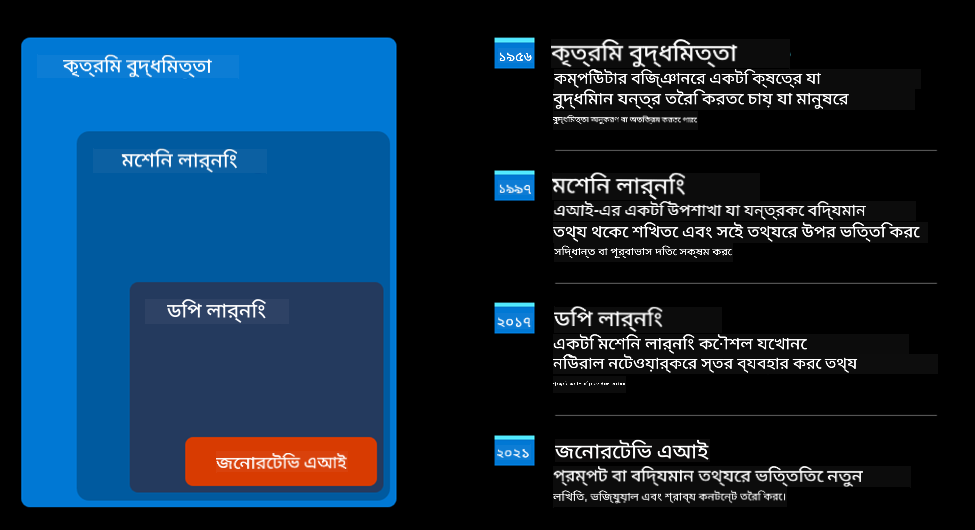
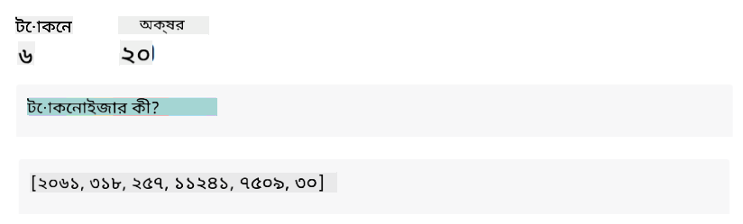
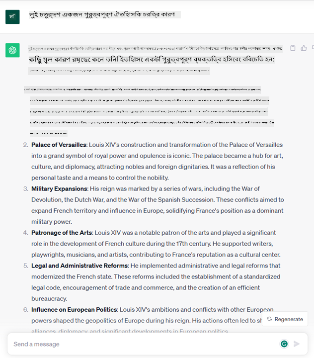

<!--
CO_OP_TRANSLATOR_METADATA:
{
  "original_hash": "f53ba0fa49164f9323043f1c6b11f2b1",
  "translation_date": "2025-07-09T07:47:26+00:00",
  "source_file": "01-introduction-to-genai/README.md",
  "language_code": "bn"
}
-->
# জেনারেটিভ AI এবং বড় ভাষা মডেলগুলোর পরিচিতি

_(উপরের ছবিতে ক্লিক করে এই পাঠের ভিডিও দেখুন)_

জেনারেটিভ AI হলো এমন একটি কৃত্রিম বুদ্ধিমত্তা যা টেক্সট, ছবি এবং অন্যান্য ধরনের কনটেন্ট তৈরি করতে সক্ষম। এটিকে অসাধারণ প্রযুক্তি বানায় এর সহজলভ্যতা, যে কেউ খুব সামান্য একটি টেক্সট প্রম্পট বা প্রাকৃতিক ভাষায় লেখা একটি বাক্য ব্যবহার করেই এটি ব্যবহার করতে পারে। কিছু মূল্যবান কাজ করার জন্য আপনাকে Java বা SQL-এর মতো ভাষা শেখার দরকার নেই, শুধু আপনার ভাষায় যা চান তা বলুন, আর AI মডেল থেকে একটি প্রস্তাবনা আসবে। এর প্রয়োগ এবং প্রভাব বিশাল, আপনি রিপোর্ট লিখতে বা বুঝতে পারেন, অ্যাপ্লিকেশন তৈরি করতে পারেন এবং আরও অনেক কিছু, সবকিছুই কয়েক সেকেন্ডে।

এই পাঠক্রমে, আমরা দেখব কীভাবে আমাদের স্টার্টআপ জেনারেটিভ AI ব্যবহার করে শিক্ষা ক্ষেত্রে নতুন সুযোগ উন্মোচন করছে এবং এর সামাজিক প্রভাব ও প্রযুক্তিগত সীমাবদ্ধতাগুলোর সঙ্গে কীভাবে মোকাবিলা করছে।

## পরিচিতি

এই পাঠে আলোচনা করা হবে:

- ব্যবসায়িক পরিস্থিতির পরিচিতি: আমাদের স্টার্টআপের ধারণা ও মিশন।
- জেনারেটিভ AI এবং বর্তমান প্রযুক্তি প্রেক্ষাপট।
- বড় ভাষা মডেলের অভ্যন্তরীণ কাজকর্ম।
- বড় ভাষা মডেলের প্রধান ক্ষমতা ও ব্যবহারিক উদাহরণ।

## শেখার লক্ষ্য

এই পাঠ শেষ করার পর আপনি বুঝতে পারবেন:

- জেনারেটিভ AI কী এবং বড় ভাষা মডেল কীভাবে কাজ করে।
- কীভাবে বিভিন্ন ব্যবহারের ক্ষেত্রে বড় ভাষা মডেল ব্যবহার করা যায়, বিশেষ করে শিক্ষা ক্ষেত্রে।

## পরিস্থিতি: আমাদের শিক্ষামূলক স্টার্টআপ

জেনারেটিভ কৃত্রিম বুদ্ধিমত্তা (AI) হলো AI প্রযুক্তির শীর্ষস্থান, যা আগে অসম্ভব মনে হওয়া অনেক কিছু সম্ভব করছে। জেনারেটিভ AI মডেলগুলোর অনেক ক্ষমতা ও প্রয়োগ আছে, কিন্তু এই পাঠক্রমে আমরা দেখব কীভাবে এটি একটি কাল্পনিক স্টার্টআপের মাধ্যমে শিক্ষাকে বিপ্লবী করছে। আমরা এই স্টার্টআপকে _আমাদের স্টার্টআপ_ বলব। আমাদের স্টার্টআপ শিক্ষা ক্ষেত্রে কাজ করে এবং এর উচ্চাকাঙ্ক্ষী মিশন হলো

> _শিক্ষায় বিশ্বব্যাপী প্রবেশাধিকার উন্নত করা, শিক্ষার সমান সুযোগ নিশ্চিত করা এবং প্রত্যেক শিক্ষার্থীর প্রয়োজন অনুযায়ী ব্যক্তিগতকৃত শেখার অভিজ্ঞতা প্রদান করা_।

আমাদের স্টার্টআপ দল জানে যে এই লক্ষ্য অর্জন করা সম্ভব হবে না আধুনিক সময়ের সবচেয়ে শক্তিশালী সরঞ্জামগুলোর মধ্যে একটি – বড় ভাষা মডেল (LLMs) ব্যবহার না করে।

জেনারেটিভ AI আজকের শেখা ও শেখানোর পদ্ধতিতে বিপ্লব ঘটাবে বলে আশা করা হচ্ছে, যেখানে শিক্ষার্থীরা ২৪ ঘণ্টা ভার্চুয়াল শিক্ষক পাবে, যারা প্রচুর তথ্য ও উদাহরণ সরবরাহ করবে, আর শিক্ষকরা উদ্ভাবনী সরঞ্জাম ব্যবহার করে তাদের শিক্ষার্থীদের মূল্যায়ন ও প্রতিক্রিয়া দিতে পারবেন।

শুরুতে, আসুন কিছু মৌলিক ধারণা ও পরিভাষা সংজ্ঞায়িত করি যা আমরা পুরো পাঠক্রমে ব্যবহার করব।

## আমরা কীভাবে জেনারেটিভ AI পেলাম?

সাম্প্রতিককালে জেনারেটিভ AI মডেলগুলোর ঘোষণা দিয়ে যে অসাধারণ _হাইপ_ তৈরি হয়েছে, এই প্রযুক্তি দশকের পর দশক ধরে তৈরি হচ্ছে, যার প্রথম গবেষণা ৬০-এর দশকে শুরু হয়। এখন আমরা এমন এক পর্যায়ে পৌঁছেছি যেখানে AI মানুষের মত বুদ্ধিমত্তা প্রদর্শন করছে, যেমন কথোপকথন, যা উদাহরণস্বরূপ [OpenAI ChatGPT](https://openai.com/chatgpt) বা [Bing Chat](https://www.microsoft.com/edge/features/bing-chat?WT.mc_id=academic-105485-koreyst) দ্বারা প্রদর্শিত হয়, যা ওয়েব সার্চ Bing কথোপকথনের জন্য GPT মডেল ব্যবহার করে।

আবার একটু পিছনে ফিরে গেলে, AI-এর প্রথম প্রোটোটাইপ ছিল টাইপরাইটেন চ্যাটবট, যা বিশেষজ্ঞদের জ্ঞানের ভিত্তিতে তৈরি এবং কম্পিউটারে উপস্থাপিত। ইনপুট টেক্সটে থাকা কীওয়ার্ডের মাধ্যমে জ্ঞানের উত্তরগুলো ট্রিগার হত। তবে দ্রুত বোঝা গেল এই পদ্ধতি, টাইপরাইটেন চ্যাটবট ব্যবহার, বড় পরিসরে কাজ করে না।

### AI-তে একটি পরিসংখ্যানভিত্তিক পদ্ধতি: মেশিন লার্নিং

৯০-এর দশকে একটি মোড় আসে, যখন টেক্সট বিশ্লেষণে পরিসংখ্যানভিত্তিক পদ্ধতি প্রয়োগ করা হয়। এর ফলে নতুন অ্যালগরিদম তৈরি হয় – যাদের মেশিন লার্নিং বলা হয় – যা স্পষ্টভাবে প্রোগ্রাম না করেও ডেটা থেকে প্যাটার্ন শিখতে পারে। এই পদ্ধতি মেশিনকে মানুষের ভাষা বোঝার অনুকরণ করতে দেয়: একটি পরিসংখ্যানভিত্তিক মডেল টেক্সট-লেবেল জোড়ায় প্রশিক্ষিত হয়, যা মডেলকে অজানা ইনপুট টেক্সটকে একটি পূর্বনির্ধারিত লেবেল দিয়ে শ্রেণীবদ্ধ করতে সক্ষম করে, যা বার্তার উদ্দেশ্য নির্দেশ করে।

### নিউরাল নেটওয়ার্ক এবং আধুনিক ভার্চুয়াল সহকারী

সাম্প্রতিক বছরগুলোতে, হার্ডওয়্যারের প্রযুক্তিগত উন্নতি, যা বড় ডেটা এবং জটিল গণনা পরিচালনা করতে সক্ষম, AI গবেষণাকে উৎসাহিত করেছে, যার ফলে উন্নত মেশিন লার্নিং অ্যালগরিদম তৈরি হয়েছে, যাদের নিউরাল নেটওয়ার্ক বা ডিপ লার্নিং অ্যালগরিদম বলা হয়।

নিউরাল নেটওয়ার্ক (বিশেষ করে Recurrent Neural Networks – RNNs) প্রাকৃতিক ভাষা প্রক্রিয়াকরণকে অনেক উন্নত করেছে, যা টেক্সটের অর্থ আরও অর্থবহভাবে উপস্থাপন করতে সক্ষম, বাক্যের শব্দের প্রেক্ষাপটকে মূল্যায়ন করে।

এই প্রযুক্তি চালিত ভার্চুয়াল সহকারীরা নতুন শতাব্দীর প্রথম দশকে জন্ম নিয়েছিল, যারা মানুষের ভাষা ব্যাখ্যা করতে, প্রয়োজন সনাক্ত করতে এবং তা পূরণে কাজ করতে পারত – যেমন পূর্বনির্ধারিত স্ক্রিপ্ট দিয়ে উত্তর দেওয়া বা তৃতীয় পক্ষের সেবা ব্যবহার করা।

### বর্তমান সময়, জেনারেটিভ AI

এভাবেই আমরা আজকের জেনারেটিভ AI-তে পৌঁছেছি, যা ডিপ লার্নিংয়ের একটি উপশাখা হিসেবে দেখা যায়।

দশকের গবেষণার পর, একটি নতুন মডেল আর্কিটেকচার – _Transformer_ – RNN-এর সীমাবদ্ধতাগুলো অতিক্রম করেছে, যা অনেক দীর্ঘ টেক্সট সিকোয়েন্স ইনপুট হিসেবে নিতে পারে। ট্রান্সফর্মারগুলো অ্যাটেনশন মেকানিজমের উপর ভিত্তি করে, যা মডেলকে ইনপুটগুলোর মধ্যে সবচেয়ে প্রাসঙ্গিক তথ্যের দিকে বেশি ‘মনোযোগ’ দিতে সক্ষম করে, ইনপুটের ক্রম নির্বিশেষে।

সাম্প্রতিক বেশিরভাগ জেনারেটিভ AI মডেল – যাদের বড় ভাষা মডেল (LLMs) বলা হয়, কারণ তারা টেক্সট ইনপুট ও আউটপুট নিয়ে কাজ করে – এই আর্কিটেকচারের উপর ভিত্তি করে তৈরি। এই মডেলগুলো, যা বই, প্রবন্ধ ও ওয়েবসাইটের মতো বিভিন্ন উৎস থেকে বিশাল পরিমাণ লেবেলবিহীন ডেটায় প্রশিক্ষিত, বিভিন্ন কাজের জন্য অভিযোজিত হতে পারে এবং সৃজনশীলতার ছোঁয়া সহ ব্যাকরণগতভাবে সঠিক টেক্সট তৈরি করতে পারে। তাই, তারা শুধু ইনপুট টেক্সট ‘বোঝার’ ক্ষমতা বাড়ায়নি, বরং মানুষের ভাষায় মৌলিক উত্তর তৈরি করার ক্ষমতাও দিয়েছে।

## বড় ভাষা মডেল কীভাবে কাজ করে?

পরবর্তী অধ্যায়ে আমরা বিভিন্ন ধরনের জেনারেটিভ AI মডেল দেখব, কিন্তু আপাতত আসুন বড় ভাষা মডেল কীভাবে কাজ করে তা দেখি, বিশেষ করে OpenAI GPT (Generative Pre-trained Transformer) মডেলের ওপর ফোকাস করে।

- **Tokenizer, টেক্সট থেকে সংখ্যা**: বড় ভাষা মডেল একটি টেক্সট ইনপুট হিসেবে নেয় এবং টেক্সট আউটপুট তৈরি করে। তবে, যেহেতু এগুলো পরিসংখ্যানভিত্তিক মডেল, তাই তারা টেক্সটের চেয়ে সংখ্যার সঙ্গে অনেক ভালো কাজ করে। এজন্য প্রতিটি ইনপুট মডেলের কাছে যাওয়ার আগে একটি tokenizer দ্বারা প্রক্রিয়াজাত হয়। একটি token হলো টেক্সটের একটি অংশ – যেটি বিভিন্ন সংখ্যক অক্ষর নিয়ে গঠিত, তাই tokenizer-এর প্রধান কাজ হলো ইনপুটকে token-এর একটি অ্যারেতে ভাগ করা। এরপর প্রতিটি token একটি token index এর সঙ্গে ম্যাপ করা হয়, যা মূল টেক্সট অংশের পূর্ণসংখ্যা এনকোডিং।

- **আউটপুট টোকেন পূর্বাভাস**: n সংখ্যক token ইনপুট হিসেবে দেওয়া হলে (যার সর্বোচ্চ n মডেল অনুযায়ী পরিবর্তিত হয়), মডেল একটি token আউটপুট হিসেবে পূর্বাভাস দিতে পারে। এই token পরবর্তী পুনরাবৃত্তির ইনপুটে যুক্ত হয়, একটি সম্প্রসারিত উইন্ডো প্যাটার্নে, যা ব্যবহারকারীর জন্য এক বা একাধিক বাক্যের উত্তর পাওয়ার অভিজ্ঞতাকে উন্নত করে। এজন্য, যদি আপনি কখনো ChatGPT ব্যবহার করে থাকেন, আপনি লক্ষ্য করতে পারেন যে মাঝে মাঝে এটি বাক্যের মাঝখানে থেমে যায়।

- **বাছাই প্রক্রিয়া, সম্ভাব্যতা বণ্টন**: আউটপুট token মডেল তার প্রশিক্ষণের ভিত্তিতে সম্ভাব্য ‘পরবর্তী token’ গুলোর উপর একটি সম্ভাব্যতা বণ্টন পূর্বাভাস দেয় এবং সেই অনুযায়ী বেছে নেয়। তবে সর্বোচ্চ সম্ভাব্যতার token সবসময় নির্বাচিত হয় না। কিছুটা এলোমেলোতা যুক্ত করা হয়, যাতে মডেল একটি অ-নির্ধারিত আচরণ করে – একই ইনপুটের জন্য একই আউটপুট পাওয়া যায় না। এই এলোমেলোতা সৃজনশীল চিন্তার প্রক্রিয়া অনুকরণ করতে দেয় এবং এটি একটি মডেল প্যারামিটার temperature ব্যবহার করে নিয়ন্ত্রণ করা যায়।

## আমাদের স্টার্টআপ কীভাবে বড় ভাষা মডেল ব্যবহার করতে পারে?

এখন যেহেতু আমরা বড় ভাষা মডেলের অভ্যন্তরীণ কাজ বুঝতে পেরেছি, আসুন দেখি তারা সবচেয়ে সাধারণ কাজগুলো কীভাবে ভালোভাবে করতে পারে, আমাদের ব্যবসায়িক পরিস্থিতির দৃষ্টিকোণ থেকে।

আমরা বলেছিলাম বড় ভাষা মডেলের প্রধান ক্ষমতা হলো _শূন্য থেকে একটি টেক্সট তৈরি করা, প্রাকৃতিক ভাষায় লেখা একটি টেক্সট ইনপুট থেকে শুরু করে_।

কিন্তু কী ধরনের টেক্সট ইনপুট এবং আউটপুট?

বড় ভাষা মডেলের ইনপুটকে প্রম্পট বলা হয়, আর আউটপুটকে কমপ্লিশন বলা হয়, যা মডেলের পরবর্তী token তৈরি করার প্রক্রিয়াকে বোঝায়। আমরা পরবর্তীতে প্রম্পট কী এবং কীভাবে এটি ডিজাইন করতে হয় তা বিস্তারিত জানব। আপাতত বলি, একটি প্রম্পটে থাকতে পারে:

- একটি **নির্দেশনা** যা মডেল থেকে প্রত্যাশিত আউটপুটের ধরন নির্ধারণ করে। এই নির্দেশনায় মাঝে মাঝে কিছু উদাহরণ বা অতিরিক্ত তথ্য থাকতে পারে।

  ১. একটি প্রবন্ধ, বই, পণ্য পর্যালোচনা ইত্যাদির সারাংশ তৈরি এবং অগঠিত ডেটা থেকে অন্তর্দৃষ্টি আহরণ।
    
    
  
  ২. একটি প্রবন্ধ, প্রবন্ধ, অ্যাসাইনমেন্ট বা আরও কিছু সৃজনশীল ধারণা ও ডিজাইন।
      
     

- একটি **প্রশ্ন**, যা একটি এজেন্টের সঙ্গে কথোপকথনের আকারে করা হয়।
  
  

- একটি **টেক্সটের অংশ যা সম্পূর্ণ করতে হবে**, যা লেখার সহায়তার অনুরোধ।
  
  

- একটি **কোডের অংশ** যা ব্যাখ্যা ও ডকুমেন্টেশন চাওয়া হয়েছে, অথবা একটি নির্দিষ্ট কাজ সম্পাদনের জন্য কোড তৈরি করার অনুরোধ।
  
  

উপরের উদাহরণগুলো বেশ সহজ এবং বড় ভাষা মডেলের ক্ষমতার সম্পূর্ণ প্রদর্শন নয়। এগুলো মূলত জেনারেটিভ AI ব্যবহারের সম্ভাবনা দেখানোর জন্য, বিশেষ করে কিন্তু শুধুমাত্র শিক্ষামূলক প্রসঙ্গে নয়।

এছাড়াও, জেনারেটিভ AI মডেলের আউটপুট সবসময় নিখুঁত নয় এবং কখনো কখনো মডেলের সৃজনশীলতা এর বিরুদ্ধে কাজ করতে পারে, যার ফলে এমন আউটপুট তৈরি হয় যা মানুষের কাছে বাস্তবতার বিভ্রান্তিকর বা আপত্তিকর মনে হতে পারে। জেনারেটিভ AI বুদ্ধিমান নয় – অন্তত বুদ্ধিমত্তার বিস্তৃত সংজ্ঞায়, যার মধ্যে সমালোচনামূলক ও সৃজনশীল যুক্তি বা আবেগীয় বুদ্ধিমত্তা অন্তর্ভুক্ত; এটি নির্ধারিত নয় এবং বিশ্বাসযোগ্য নয়, কারণ ভুল তথ্য, যেমন ভুল রেফারেন্স, বিষয়বস্তু ও বিবৃতি সঠিক তথ্যের সঙ্গে মিশে প্রভাবশালী ও আত্মবিশ্বাসী উপস্থাপিত হতে পারে। পরবর্তী পাঠগুলোতে আমরা এই সব সীমাবদ্ধতার সঙ্গে মোকাবিলা করব এবং কীভাবে এগুলো কমানো যায় তা দেখব।

## অ্যাসাইনমেন্ট

আপনার কাজ হলো [জেনারেটিভ AI](https://en.wikipedia.org/wiki/Generative_artificial_intelligence?WT.mc_id=academic-105485-koreyst) সম্পর্কে আরও পড়াশোনা করা এবং এমন একটি ক্ষেত্র চিহ্নিত করা যেখানে আজকের দিনে জেনারেটিভ AI যোগ করা যায় যা এখনও নেই। "পুরনো পদ্ধতি" থেকে এর প্রভাব কীভাবে আলাদা হবে, আপনি কি আগে যা করতে পারতেন না তা করতে পারবেন, নাকি আপনি দ্রুততর হবেন? আপনার স্বপ্নের AI স্টার্টআপ কেমন হবে তা ৩০০ শব্দে লিখুন এবং "সমস্যা", "আমি কীভাবে AI ব্যবহার করব", "প্রভাব" এর মতো শিরোনাম অন্তর্ভুক্ত করুন, এবং ইচ্ছা করলে একটি ব্যবসায়িক পরিকল্পনাও দিন।

এই কাজটি করলে, আপনি হয়তো Microsoft-এর ইনকিউবেটর [Microsoft for Startups Founders Hub](https://www.microsoft.com/startups?WT.mc_id=academic-105485-koreyst)-এ আবেদন করার জন্য প্রস্তুত হবেন। আমরা Azure, OpenAI, মেন্টরিং এবং আরও অনেক কিছুতে ক্রেডিট অফার করি, দেখে নিন!

## জ্ঞান যাচাই

বড় ভাষা মডেল সম্পর্কে কোনটি সত্য?

1. আপনি প্রতিবার একই উত্তর পাবেন।
2. এটি সবকিছু নিখুঁতভাবে করে, যেমন সংখ্যার যোগফল, কাজ করা কোড তৈরি ইত্যাদি।
3. একই প্রম্পট ব্যবহার করেও উত্তর ভিন্ন হতে পারে। এটি প্রথম খসড়া তৈরি করতে খুব ভালো, সেটা টেক্সট হোক বা কোড। তবে আপনাকে ফলাফল উন্নত করতে হবে।

উত্তর: ৩, একটি LLM অ-নির্ধারিত, উত্তর পরিবর্তিত হয়, তবে আপনি temperature সেটিং দিয়ে এর পরিবর্তন নিয়ন্ত্রণ করতে পারেন। এটি সবকিছু নিখুঁতভাবে করবে বলে আশা করা উচিত নয়, এটি আপনার জন্য ভারী কাজ করে দেয়, যার ফলে আপনি একটি ভালো প্রথম প্রচেষ্টা পান যা ধীরে ধীরে উন্নত করতে হয়।

## অসাধারণ কাজ! যাত্রা চালিয়ে যান

এই পাঠ শেষ করার পর, আমাদের [Generative AI Learning collection](https://aka.ms/genai-collection?WT.mc_id=academic-105485-koreyst) দেখুন এবং আপনার জেনারেটিভ AI জ্ঞান আরও উন্নত করুন!
Lesson 2-এ যান যেখানে আমরা কীভাবে বিভিন্ন LLM ধরনের [অন্বেষণ এবং তুলনা করতে হয়](../02-exploring-and-comparing-different-llms/README.md?WT.mc_id=academic-105485-koreyst) তা দেখব!

**অস্বীকৃতি**:  
এই নথিটি AI অনুবাদ সেবা [Co-op Translator](https://github.com/Azure/co-op-translator) ব্যবহার করে অনূদিত হয়েছে। আমরা যথাসাধ্য সঠিকতার চেষ্টা করি, তবে স্বয়ংক্রিয় অনুবাদে ত্রুটি বা অসঙ্গতি থাকতে পারে। মূল নথিটি তার নিজস্ব ভাষায়ই কর্তৃত্বপূর্ণ উৎস হিসেবে বিবেচিত হওয়া উচিত। গুরুত্বপূর্ণ তথ্যের জন্য পেশাদার মানব অনুবাদ গ্রহণ করার পরামর্শ দেওয়া হয়। এই অনুবাদের ব্যবহারে সৃষ্ট কোনো ভুল বোঝাবুঝি বা ভুল ব্যাখ্যার জন্য আমরা দায়ী নই।