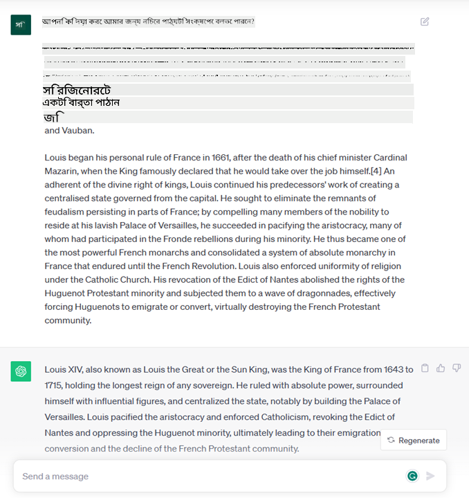

<!--
CO_OP_TRANSLATOR_METADATA:
{
  "original_hash": "bfb7901bdbece1ba3e9f35c400ca33e8",
  "translation_date": "2025-10-17T14:57:33+00:00",
  "source_file": "01-introduction-to-genai/README.md",
  "language_code": "bn"
}
-->
# জেনারেটিভ এআই এবং বড় ভাষার মডেলের পরিচিতি

_(উপরের ছবিতে ক্লিক করে এই পাঠের ভিডিও দেখুন)_

জেনারেটিভ এআই হলো এমন একটি কৃত্রিম বুদ্ধিমত্তা যা টেক্সট, ছবি এবং অন্যান্য ধরণের কন্টেন্ট তৈরি করতে সক্ষম। এই প্রযুক্তির অসাধারণ দিক হলো এটি এআইকে সবার জন্য সহজলভ্য করে তুলেছে। যে কেউ এটি ব্যবহার করতে পারে শুধুমাত্র একটি টেক্সট প্রম্পট দিয়ে, যা একটি প্রাকৃতিক ভাষায় লেখা একটি বাক্য। আপনাকে জাভা বা SQL-এর মতো কোনো ভাষা শিখতে হবে না কিছু অর্জন করার জন্য; আপনার ভাষা ব্যবহার করে যা চান তা বলুন এবং এআই মডেল থেকে একটি প্রস্তাবনা বেরিয়ে আসবে। এর প্রয়োগ এবং প্রভাব বিশাল, আপনি রিপোর্ট লিখতে বা বুঝতে, অ্যাপ্লিকেশন তৈরি করতে এবং আরও অনেক কিছু করতে পারবেন, সবকিছুই কয়েক সেকেন্ডে।

এই পাঠ্যক্রমে, আমরা দেখব কীভাবে আমাদের স্টার্টআপ জেনারেটিভ এআই ব্যবহার করে শিক্ষা জগতে নতুন সম্ভাবনা উন্মোচন করছে এবং এর প্রয়োগের সামাজিক প্রভাব ও প্রযুক্তিগত সীমাবদ্ধতার চ্যালেঞ্জগুলো মোকাবিলা করছে।

## পরিচিতি

এই পাঠে আলোচনা করা হবে:

- ব্যবসার পরিস্থিতির পরিচিতি: আমাদের স্টার্টআপের ধারণা এবং লক্ষ্য।
- জেনারেটিভ এআই এবং বর্তমান প্রযুক্তি প্রেক্ষাপটে আমাদের অবস্থান।
- বড় ভাষার মডেলের অভ্যন্তরীণ কার্যপ্রণালী।
- বড় ভাষার মডেলের প্রধান ক্ষমতা এবং ব্যবহারিক প্রয়োগ।

## শেখার লক্ষ্য

এই পাঠ শেষ করার পর আপনি বুঝতে পারবেন:

- জেনারেটিভ এআই কী এবং বড় ভাষার মডেল কীভাবে কাজ করে।
- কীভাবে আপনি বড় ভাষার মডেল বিভিন্ন প্রয়োগে ব্যবহার করতে পারেন, বিশেষত শিক্ষার ক্ষেত্রে।

## পরিস্থিতি: আমাদের শিক্ষামূলক স্টার্টআপ

জেনারেটিভ কৃত্রিম বুদ্ধিমত্তা (এআই) হলো এআই প্রযুক্তির শীর্ষস্থানীয় উদাহরণ, যা একসময় অসম্ভব বলে মনে করা হতো তার সীমা অতিক্রম করছে। জেনারেটিভ এআই মডেলের অনেক ক্ষমতা এবং প্রয়োগ রয়েছে, তবে এই পাঠ্যক্রমে আমরা দেখব কীভাবে এটি শিক্ষাকে বিপ্লব ঘটাচ্ছে একটি কাল্পনিক স্টার্টআপের মাধ্যমে। আমরা এই স্টার্টআপকে _আমাদের স্টার্টআপ_ বলে উল্লেখ করব। আমাদের স্টার্টআপ শিক্ষা ক্ষেত্রে কাজ করে এবং এর উচ্চাকাঙ্ক্ষী লক্ষ্য হলো:

> _শিক্ষায় প্রবেশাধিকার উন্নত করা, বৈশ্বিক পর্যায়ে, নিশ্চিত করা যাতে শিক্ষা সবার জন্য সমানভাবে সহজলভ্য হয় এবং প্রতিটি শিক্ষার্থীর প্রয়োজন অনুযায়ী ব্যক্তিগত শিক্ষার অভিজ্ঞতা প্রদান করা।_

আমাদের স্টার্টআপ দল জানে যে আমরা এই লক্ষ্য অর্জন করতে পারব না যদি আমরা আধুনিক সময়ের অন্যতম শক্তিশালী টুল – বড় ভাষার মডেল (LLMs) – ব্যবহার না করি।

জেনারেটিভ এআই আজকের শিক্ষার এবং শেখানোর পদ্ধতিকে বিপ্লব ঘটানোর সম্ভাবনা রাখে, যেখানে শিক্ষার্থীরা ২৪ ঘণ্টা ভার্চুয়াল শিক্ষক পাবে যারা বিশাল পরিমাণ তথ্য এবং উদাহরণ প্রদান করবে, এবং শিক্ষকরা তাদের শিক্ষার্থীদের মূল্যায়ন এবং প্রতিক্রিয়া দেওয়ার জন্য উদ্ভাবনী টুল ব্যবহার করতে পারবে।

শুরু করার জন্য, আসুন আমরা কিছু মৌলিক ধারণা এবং পরিভাষা সংজ্ঞায়িত করি যা আমরা এই পাঠ্যক্রমে ব্যবহার করব।

## জেনারেটিভ এআই কীভাবে পেলাম?

জেনারেটিভ এআই মডেলের ঘোষণা দ্বারা সম্প্রতি তৈরি হওয়া অসাধারণ _হাইপ_ সত্ত্বেও, এই প্রযুক্তি কয়েক দশক ধরে তৈরি হচ্ছে, যার প্রথম গবেষণা প্রচেষ্টা ৬০-এর দশকে শুরু হয়েছিল। আমরা এখন এমন একটি পর্যায়ে পৌঁছেছি যেখানে এআই মানুষের জ্ঞানীয় ক্ষমতা অর্জন করেছে, যেমন কথোপকথন, যা উদাহরণস্বরূপ [OpenAI ChatGPT](https://openai.com/chatgpt) বা [Bing Chat](https://www.microsoft.com/edge/features/bing-chat?WT.mc_id=academic-105485-koreyst)-এ দেখা যায়, যা ওয়েব অনুসন্ধান Bing কথোপকথনের জন্য GPT মডেল ব্যবহার করে।

একটু পিছিয়ে গেলে, এআই-এর প্রথম প্রোটোটাইপ ছিল টাইপ করা চ্যাটবট, যা বিশেষজ্ঞদের একটি দল থেকে প্রাপ্ত জ্ঞানভিত্তিক তথ্যের উপর নির্ভর করত এবং কম্পিউটারে উপস্থাপিত হতো। জ্ঞানভিত্তিক তথ্যের উত্তর ইনপুট টেক্সটে উপস্থিত কীওয়ার্ড দ্বারা ট্রিগার করা হতো। তবে, শীঘ্রই এটি স্পষ্ট হয়ে যায় যে টাইপ করা চ্যাটবট ব্যবহার করে এমন একটি পদ্ধতি ভালোভাবে স্কেল করে না।

### এআই-এর পরিসংখ্যানগত পদ্ধতি: মেশিন লার্নিং

৯০-এর দশকে টেক্সট বিশ্লেষণে পরিসংখ্যানগত পদ্ধতির প্রয়োগের মাধ্যমে একটি গুরুত্বপূর্ণ পরিবর্তন আসে। এটি নতুন অ্যালগরিদমের বিকাশ ঘটায় – যা মেশিন লার্নিং নামে পরিচিত – যা ডেটা থেকে প্যাটার্ন শিখতে সক্ষম, যা স্পষ্টভাবে প্রোগ্রাম করা হয়নি। এই পদ্ধতি মেশিনকে মানব ভাষা বোঝার অনুকরণ করতে সক্ষম করে: একটি পরিসংখ্যানগত মডেল টেক্সট-লেবেল জোড়ার উপর প্রশিক্ষিত হয়, যা মডেলকে একটি পূর্ব-সংজ্ঞায়িত লেবেল দিয়ে অজানা ইনপুট টেক্সট শ্রেণীবদ্ধ করতে সক্ষম করে, যা বার্তার উদ্দেশ্যকে উপস্থাপন করে।

### নিউরাল নেটওয়ার্ক এবং আধুনিক ভার্চুয়াল সহকারী

সাম্প্রতিক বছরগুলোতে, হার্ডওয়ারের প্রযুক্তিগত বিবর্তন, যা বৃহত্তর পরিমাণে ডেটা এবং আরও জটিল গণনা পরিচালনা করতে সক্ষম, এআই-এ গবেষণাকে উৎসাহিত করেছে, উন্নত মেশিন লার্নিং অ্যালগরিদমের বিকাশ ঘটিয়েছে যা নিউরাল নেটওয়ার্ক বা ডিপ লার্নিং অ্যালগরিদম নামে পরিচিত।

নিউরাল নেটওয়ার্ক (বিশেষত রিকারেন্ট নিউরাল নেটওয়ার্ক – RNNs) প্রাকৃতিক ভাষা প্রক্রিয়াকরণকে উল্লেখযোগ্যভাবে উন্নত করেছে, একটি বাক্যে শব্দের প্রসঙ্গকে মূল্যায়ন করে টেক্সটের অর্থকে আরও অর্থপূর্ণভাবে উপস্থাপন করতে সক্ষম করেছে।

এই প্রযুক্তি প্রথম দশকে জন্ম নেওয়া ভার্চুয়াল সহকারীদের শক্তি জুগিয়েছে, যারা মানব ভাষা ব্যাখ্যা করতে, একটি প্রয়োজন চিহ্নিত করতে এবং এটি পূরণ করার জন্য একটি পদক্ষেপ নিতে খুব দক্ষ ছিল – যেমন একটি পূর্ব-সংজ্ঞায়িত স্ক্রিপ্টের উত্তর দেওয়া বা একটি তৃতীয় পক্ষের পরিষেবা ব্যবহার করা।

### বর্তমান সময়, জেনারেটিভ এআই

এভাবেই আমরা আজকের জেনারেটিভ এআই-এ পৌঁছেছি, যা ডিপ লার্নিং-এর একটি উপসেট হিসেবে দেখা যেতে পারে।

এআই ক্ষেত্রে কয়েক দশকের গবেষণার পর, একটি নতুন মডেল আর্কিটেকচার – _ট্রান্সফর্মার_ – RNNs-এর সীমাবদ্ধতা অতিক্রম করেছে, যা ইনপুট হিসেবে অনেক দীর্ঘ টেক্সট সিকোয়েন্স গ্রহণ করতে সক্ষম। ট্রান্সফর্মারগুলো মনোযোগ প্রক্রিয়ার উপর ভিত্তি করে তৈরি, যা মডেলকে তার প্রাপ্ত ইনপুটগুলিকে বিভিন্ন ওজন দিতে সক্ষম করে, যেখানে সবচেয়ে প্রাসঙ্গিক তথ্য কেন্দ্রীভূত থাকে সেখানে ‘বেশি মনোযোগ’ দেয়, টেক্সট সিকোয়েন্সে তাদের ক্রম নির্বিশেষে।

সাম্প্রতিক বেশিরভাগ জেনারেটিভ এআই মডেল – যা বড় ভাষার মডেল (LLMs) নামেও পরিচিত, যেহেতু তারা টেক্সট ইনপুট এবং আউটপুট নিয়ে কাজ করে – এই আর্কিটেকচার ভিত্তিক। এই মডেলগুলোর আকর্ষণীয় দিক হলো – বই, নিবন্ধ এবং ওয়েবসাইটের মতো বিভিন্ন উৎস থেকে বিশাল পরিমাণে লেবেলবিহীন ডেটা দিয়ে প্রশিক্ষিত – এগুলো বিভিন্ন ধরণের কাজের জন্য মানিয়ে নেওয়া যায় এবং সৃজনশীলতার ছাপ সহ ব্যাকরণগতভাবে সঠিক টেক্সট তৈরি করতে পারে। সুতরাং, তারা শুধু একটি মেশিনের ইনপুট টেক্সট ‘বোঝার’ ক্ষমতাকে অবিশ্বাস্যভাবে উন্নত করেনি, বরং তারা মানব ভাষায় একটি মৌলিক উত্তর তৈরি করার ক্ষমতা সক্ষম করেছে।

## বড় ভাষার মডেল কীভাবে কাজ করে?

পরবর্তী অধ্যায়ে আমরা বিভিন্ন ধরণের জেনারেটিভ এআই মডেল অন্বেষণ করব, তবে আপাতত আসুন আমরা বড় ভাষার মডেল কীভাবে কাজ করে তা দেখি, OpenAI GPT (Generative Pre-trained Transformer) মডেলের উপর ফোকাস করে।

- **টোকেনাইজার, টেক্সট থেকে সংখ্যা**: বড় ভাষার মডেলগুলো একটি টেক্সট ইনপুট হিসেবে গ্রহণ করে এবং একটি টেক্সট আউটপুট হিসেবে তৈরি করে। তবে, পরিসংখ্যানগত মডেল হিসেবে, তারা টেক্সট সিকোয়েন্সের চেয়ে সংখ্যার সাথে অনেক ভালো কাজ করে। এজন্য মডেলের মূল অংশে ব্যবহৃত হওয়ার আগে প্রতিটি ইনপুট একটি টোকেনাইজার দ্বারা প্রক্রিয়াকৃত হয়। একটি টোকেন হলো একটি টেক্সটের অংশ – যা পরিবর্তনশীল সংখ্যক অক্ষর নিয়ে গঠিত, তাই টোকেনাইজারের প্রধান কাজ হলো ইনপুটকে টোকেনের একটি অ্যারে-তে বিভক্ত করা। এরপর, প্রতিটি টোকেন একটি টোকেন ইনডেক্সের সাথে ম্যাপ করা হয়, যা মূল টেক্সট অংশের পূর্ণসংখ্যার এনকোডিং।

- **আউটপুট টোকেনের পূর্বাভাস**: n টোকেন ইনপুট হিসেবে দেওয়া হলে (প্রত্যেক মডেলের জন্য n-এর সর্বাধিক মান পরিবর্তিত হয়), মডেল একটি টোকেন আউটপুট হিসেবে পূর্বাভাস দিতে সক্ষম। এই টোকেনটি পরবর্তী পুনরাবৃত্তির ইনপুটে অন্তর্ভুক্ত করা হয়, একটি প্রসারিত উইন্ডো প্যাটার্নে, একটি উত্তরের জন্য একটি (বা একাধিক) বাক্য পাওয়ার একটি ভালো ব্যবহারকারীর অভিজ্ঞতা সক্ষম করে। এটি ব্যাখ্যা করে কেন, যদি আপনি কখনও ChatGPT-এর সাথে খেলেন, আপনি লক্ষ্য করতে পারেন যে এটি কখনও কখনও একটি বাক্যের মাঝখানে থেমে যায়।

- **নির্বাচন প্রক্রিয়া, সম্ভাব্যতা বিতরণ**: আউটপুট টোকেনটি মডেল দ্বারা নির্বাচিত হয় বর্তমান টেক্সট সিকোয়েন্সের পরে ঘটার সম্ভাবনার ভিত্তিতে। কারণ মডেলটি তার প্রশিক্ষণের ভিত্তিতে সমস্ত সম্ভাব্য ‘পরবর্তী টোকেন’-এর উপর একটি সম্ভাব্যতা বিতরণ পূর্বাভাস দেয়। তবে, সর্বদা সর্বোচ্চ সম্ভাবনার টোকেনটি ফলাফল বিতরণ থেকে নির্বাচিত হয় না। এই পছন্দে একটি ডিগ্রি র‍্যান্ডমনেস যোগ করা হয়, যাতে মডেলটি একটি অ-নির্ধারিত পদ্ধতিতে কাজ করে - আমরা একই ইনপুটের জন্য একই আউটপুট পাই না। এই র‍্যান্ডমনেসের ডিগ্রি সৃজনশীল চিন্তার প্রক্রিয়াকে অনুকরণ করতে যোগ করা হয় এবং এটি একটি মডেল প্যারামিটার ব্যবহার করে টিউন করা যেতে পারে, যা টেম্পারেচার নামে পরিচিত।

## আমাদের স্টার্টআপ কীভাবে বড় ভাষার মডেল ব্যবহার করতে পারে?

এখন যেহেতু আমরা বড় ভাষার মডেলের অভ্যন্তরীণ কার্যপ্রণালী সম্পর্কে আরও ভালোভাবে বুঝতে পেরেছি, আসুন আমরা কিছু ব্যবহারিক উদাহরণ দেখি যে তারা কোন সাধারণ কাজগুলো বেশ ভালোভাবে সম্পাদন করতে পারে, আমাদের ব্যবসার পরিস্থিতির দিকে নজর রেখে।
আমরা বলেছিলাম যে বড় ভাষার মডেলের প্রধান ক্ষমতা হলো _প্রাকৃতিক ভাষায় লেখা একটি টেক্সট ইনপুট থেকে সম্পূর্ণ নতুন টেক্সট তৈরি করা।_

কিন্তু কী ধরণের টেক্সট ইনপুট এবং আউটপুট?
বড় ভাষার মডেলের ইনপুটকে প্রম্পট বলা হয়, আর আউটপুটকে বলা হয় কমপ্লিশন, যা মডেলের বর্তমান ইনপুট সম্পূর্ণ করার জন্য পরবর্তী টোকেন তৈরি করার প্রক্রিয়াকে নির্দেশ করে। আমরা প্রম্পট কী এবং কীভাবে এটি ডিজাইন করতে হয় যাতে আমাদের মডেল থেকে সর্বাধিক সুবিধা পাওয়া যায় তা গভীরভাবে আলোচনা করব। তবে আপাতত, আসুন আমরা বলি যে একটি প্রম্পট অন্তর্ভুক্ত করতে পারে:

- একটি **নির্দেশনা** যা মডেল থেকে আমরা যে ধরণের আউটপুট আশা করি তা নির্দিষ্ট করে। এই নির্দেশনায় কখনও কখনও কিছু উদাহরণ বা কিছু অতিরিক্ত ডেটা অন্তর্ভুক্ত থাকতে পারে।

  1. একটি নিবন্ধ, বই, পণ্য পর্যালোচনা এবং আরও অনেক কিছু সংক্ষেপণ, পাশাপাশি অগঠিত ডেটা থেকে অন্তর্দৃষ্টি বের করা।
    
    
  
  2. একটি নিবন্ধ, প্রবন্ধ, অ্যাসাইনমেন্ট বা আরও কিছু সৃজনশীল ধারণা এবং ডিজাইন।
      
     

- একটি **প্রশ্ন**, যা একটি এজেন্টের সাথে কথোপকথনের আকারে জিজ্ঞাসা করা হয়।
  
  

- একটি **টেক্সট সম্পূর্ণ করার অংশ**, যা পরোক্ষভাবে লেখার সহায়তার জন্য একটি অনুরোধ।
  
  

- একটি **কোডের অংশ** যা ব্যাখ্যা এবং ডকুমেন্ট করার জন্য অনুরোধ করা হয়, অথবা একটি নির্দিষ্ট কাজ সম্পাদন করার জন্য একটি কোড তৈরি করার জন্য একটি মন্তব্য।
  
  

উপরের উদাহরণগুলো বেশ সহজ এবং বড় ভাষার মডেলের ক্ষমতার একটি সম্পূর্ণ প্রদর্শনী হিসেবে উদ্দেশ্যপ্রণোদিত নয়। এগুলো জেনারেটিভ এআই ব্যবহারের সম্ভাবনা দেখানোর জন্য, বিশেষত কিন্তু শিক্ষামূলক প্রসঙ্গের মধ্যে সীমাবদ্ধ নয়।

এছাড়াও, একটি জেনারেটিভ এআই মডেলের আউটপুট নিখুঁত নয় এবং কখনও কখনও মডেলের সৃজনশীলতা এর বিরুদ্ধে কাজ করতে পারে, যার ফলে একটি আউটপুট তৈরি হয় যা শব্দের একটি সংমিশ্রণ যা মানব ব্যবহারকারী বাস্তবতার বিকৃতি হিসেবে ব্যাখ্যা করতে পারে, অথবা এটি আপত্তিকর হতে পারে। জেনারেটিভ এআই বুদ্ধিমান নয় - অন্তত বুদ্ধিমত্তার আরও ব্যাপক সংজ্ঞা অনুযায়ী, যার মধ্যে সমালোচনামূলক এবং সৃজনশীল যুক্তি বা আবেগগত বুদ্ধিমত্তা অন্তর্ভুক্ত রয়েছে; এটি নির্ধারিত নয়, এবং এটি বিশ্বাসযোগ্য নয়, কারণ ভুল রেফারেন্স, বিষয়বস্তু এবং বিবৃতি সঠিক তথ্যের সাথে মিলিত হতে পারে এবং একটি বিশ্বাসযোগ্য এবং আত্মবিশ্বাসী পদ্ধতিতে উপস্থাপিত হতে পারে। পরবর্তী পাঠগুলোতে, আমরা এই সীমাবদ্ধতাগুলো নিয়ে আলোচনা করব এবং এগুলো কমানোর জন্য কী করা যেতে পারে তা দেখব।

## অ্যাসাইনমেন্ট

আপনার অ্যাসাইনমেন্ট হলো [জেনারেটিভ এআই](https://en.wikipedia.org/wiki/Generative_artificial_intelligence?WT.mc_id=academic-105485-koreyst) সম্পর্কে আরও পড়া এবং এমন একটি ক্ষেত্র চিহ্নিত করার চেষ্টা করা যেখানে আপনি আজ জেনারেটিভ এআই যোগ করবেন যা এখনও নেই। এটি "পুরনো পদ্ধতিতে" করার চেয়ে কীভাবে প্রভাব আলাদা হবে, আপনি কি আগে যা করতে পারেননি তা করতে পারবেন, অথবা আপনি কি দ্রুত কাজ করতে পারবেন? আপনার স্বপ্নের এআই স্টার্টআপটি কেমন হবে তা নিয়ে ৩০০ শব্দের একটি সারাংশ লিখুন এবং "সমস্যা", "আমি কীভাবে এআই ব্যবহার করব", "প্রভাব" এবং ঐচ্ছিকভাবে একটি ব্যবসায়িক পরিকল্পনার মতো শিরোনাম অন্তর্ভুক্ত করুন।

যদি আপনি এই কাজটি করেন, তবে আপনি Microsoft-এর ইনকিউবেটরে আবেদন করার জন্য প্রস্তুত হতে পারেন, [Microsoft for Startups Founders Hub](https://www.microsoft.com/startups?WT.mc_id=academic-105485-koreyst) যেখানে আমরা Azure, OpenAI, পরামর্শ এবং আরও অনেক কিছুর জন্য ক্রেডিট অফার করি, এটি দেখুন!

## জ্ঞান যাচাই

বড় ভাষার ম
যাও লেসন ২-এ, যেখানে আমরা [বিভিন্ন LLM প্রকারের অনুসন্ধান এবং তুলনা](../02-exploring-and-comparing-different-llms/README.md?WT.mc_id=academic-105485-koreyst) করার পদ্ধতি দেখব!

---

**অস্বীকৃতি**:  
এই নথিটি AI অনুবাদ পরিষেবা [Co-op Translator](https://github.com/Azure/co-op-translator) ব্যবহার করে অনুবাদ করা হয়েছে। আমরা যথাসাধ্য সঠিকতার জন্য চেষ্টা করি, তবে অনুগ্রহ করে মনে রাখবেন যে স্বয়ংক্রিয় অনুবাদে ত্রুটি বা অসঙ্গতি থাকতে পারে। মূল ভাষায় থাকা নথিটিকে প্রামাণিক উৎস হিসেবে বিবেচনা করা উচিত। গুরুত্বপূর্ণ তথ্যের জন্য, পেশাদার মানব অনুবাদ সুপারিশ করা হয়। এই অনুবাদ ব্যবহারের ফলে কোনো ভুল বোঝাবুঝি বা ভুল ব্যাখ্যার জন্য আমরা দায়বদ্ধ নই।