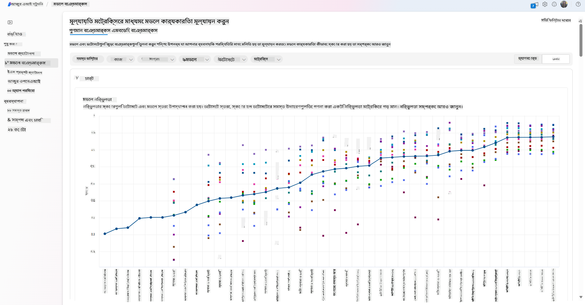
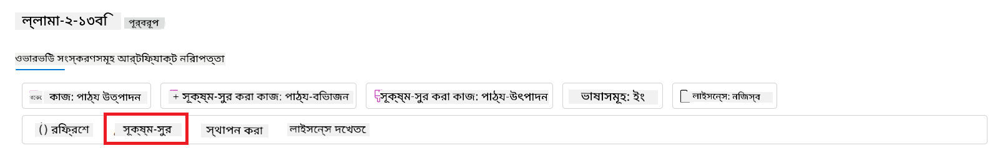
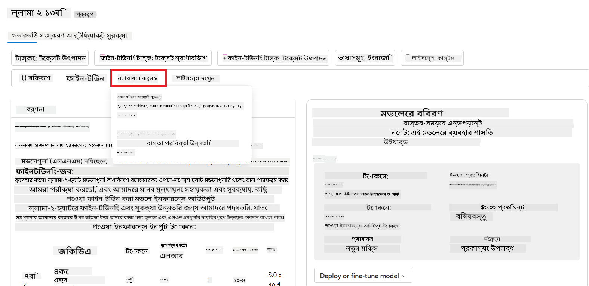
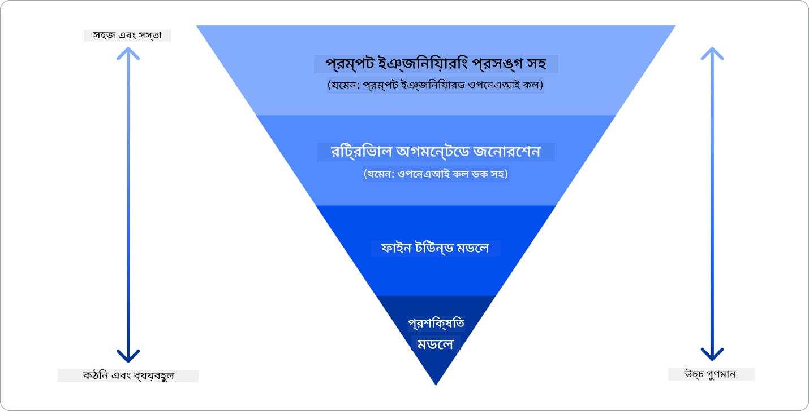

<!--
CO_OP_TRANSLATOR_METADATA:
{
  "original_hash": "e2f686f2eb794941761252ac5e8e090b",
  "translation_date": "2025-05-19T13:49:56+00:00",
  "source_file": "02-exploring-and-comparing-different-llms/README.md",
  "language_code": "bn"
}
-->
# বিভিন্ন LLMs অন্বেষণ এবং তুলনা করা

আগের পাঠে আমরা দেখেছি কিভাবে জেনারেটিভ এআই প্রযুক্তির দৃশ্যপট পরিবর্তন করছে, কিভাবে লার্জ ল্যাঙ্গুয়েজ মডেলস (LLMs) কাজ করে এবং কিভাবে একটি ব্যবসা - যেমন আমাদের স্টার্টআপ - তাদের ব্যবহার ক্ষেত্রে প্রয়োগ করতে পারে এবং বৃদ্ধি পেতে পারে! এই অধ্যায়ে, আমরা বিভিন্ন ধরনের লার্জ ল্যাঙ্গুয়েজ মডেলস (LLMs) তুলনা এবং বিপরীতমুখী করবো তাদের সুবিধা এবং অসুবিধা বোঝার জন্য।

আমাদের স্টার্টআপের পরবর্তী পদক্ষেপ হল বর্তমান LLMs দৃশ্যপট অন্বেষণ করা এবং আমাদের ব্যবহারের জন্য কোনটি উপযুক্ত তা বোঝা।

## পরিচিতি

এই পাঠে আলোচনা করা হবে:

- বর্তমান দৃশ্যপটের বিভিন্ন ধরনের LLMs।
- আপনার ব্যবহারের জন্য Azure-এ বিভিন্ন মডেল পরীক্ষা করা, পুনরাবৃত্তি করা এবং তুলনা করা।
- কিভাবে একটি LLM স্থাপন করতে হয়।

## শেখার লক্ষ্য

এই পাঠ শেষ করার পর, আপনি সক্ষম হবেন:

- আপনার ব্যবহারের জন্য সঠিক মডেল নির্বাচন করতে।
- কিভাবে আপনার মডেল পরীক্ষা, পুনরাবৃত্তি এবং কর্মক্ষমতা উন্নত করতে হয় তা বুঝতে।
- কিভাবে ব্যবসাগুলি মডেল স্থাপন করে তা জানতে।

## বিভিন্ন ধরনের LLMs বোঝা

LLMs-এর স্থাপত্য, প্রশিক্ষণ ডেটা এবং ব্যবহারের ক্ষেত্রে উপর ভিত্তি করে একাধিক শ্রেণীবিভাগ থাকতে পারে। এই পার্থক্যগুলি বোঝা আমাদের স্টার্টআপকে সঠিক মডেল নির্বাচন করতে সহায়তা করবে, এবং কিভাবে পরীক্ষা, পুনরাবৃত্তি এবং কর্মক্ষমতা উন্নত করতে হয় তা বুঝতে সাহায্য করবে।

বিভিন্ন ধরনের LLM মডেল আছে, আপনার মডেল পছন্দ নির্ভর করবে আপনি কি উদ্দেশ্যে তাদের ব্যবহার করতে চান, আপনার ডেটা, আপনি কতটা খরচ করতে প্রস্তুত এবং আরও অনেক কিছু।

আপনি যদি মডেলগুলি টেক্সট, অডিও, ভিডিও, ইমেজ জেনারেশনের জন্য ব্যবহার করতে চান কিনা তার উপর নির্ভর করে, আপনি ভিন্ন ধরনের মডেল বেছে নিতে পারেন।

- **অডিও এবং স্পিচ স্বীকৃতি**। এই উদ্দেশ্যে, হুইস্পার-টাইপ মডেলগুলি একটি চমৎকার পছন্দ কারণ তারা সাধারণ উদ্দেশ্যের এবং স্পিচ স্বীকৃতির জন্য তৈরি। এটি বিভিন্ন অডিওতে প্রশিক্ষিত এবং বহুভাষী স্পিচ স্বীকৃতি করতে সক্ষম। [হুইস্পার টাইপ মডেলগুলি সম্পর্কে আরও জানুন এখানে](https://platform.openai.com/docs/models/whisper?WT.mc_id=academic-105485-koreyst)।

- **ইমেজ জেনারেশন**। ইমেজ জেনারেশনের জন্য, DALL-E এবং Midjourney দুটি খুবই পরিচিত পছন্দ। DALL-E Azure OpenAI দ্বারা প্রস্তাবিত। [DALL-E সম্পর্কে আরও পড়ুন এখানে](https://platform.openai.com/docs/models/dall-e?WT.mc_id=academic-105485-koreyst) এবং এই পাঠ্যক্রমের অধ্যায় 9-এ।

- **টেক্সট জেনারেশন**। বেশিরভাগ মডেলগুলি টেক্সট জেনারেশনে প্রশিক্ষিত এবং আপনার কাছে GPT-3.5 থেকে GPT-4 পর্যন্ত বিভিন্ন পছন্দ রয়েছে। তারা বিভিন্ন খরচে আসে এবং GPT-4 সবচেয়ে ব্যয়বহুল। এটি মূল্যায়ন করার জন্য [Azure OpenAI প্লেগ্রাউন্ড](https://oai.azure.com/portal/playground?WT.mc_id=academic-105485-koreyst) দেখা মূল্যবান যে কোন মডেলগুলি আপনার ক্ষমতা এবং খরচের দিক থেকে আপনার প্রয়োজনের জন্য সবচেয়ে উপযুক্ত।

- **মাল্টি-মোডালিটি**। যদি আপনি ইনপুট এবং আউটপুটের মধ্যে একাধিক ধরনের ডেটা পরিচালনা করতে চান, তাহলে আপনি [gpt-4 টার্বো ভিশন বা gpt-4o](https://learn.microsoft.com/azure/ai-services/openai/concepts/models#gpt-4-and-gpt-4-turbo-models?WT.mc_id=academic-105485-koreyst) মডেলগুলিতে নজর দিতে পারেন - OpenAI মডেলের সর্বশেষ রিলিজগুলি - যা প্রাকৃতিক ভাষা প্রক্রিয়াকরণকে ভিজ্যুয়াল বোঝার সাথে সংযুক্ত করতে সক্ষম, মাল্টি-মোডাল ইন্টারফেসের মাধ্যমে ইন্টারঅ্যাকশন সক্ষম করে।

একটি মডেল নির্বাচন করা মানে আপনি কিছু মৌলিক ক্ষমতা পান, তবে তা যথেষ্ট নাও হতে পারে। প্রায়শই আপনার কাছে কোম্পানির নির্দিষ্ট ডেটা থাকে যা আপনি কোনওভাবে LLM-কে জানাতে চান। এটি কীভাবে মোকাবিলা করবেন তার কয়েকটি ভিন্ন পছন্দ রয়েছে, আসন্ন বিভাগগুলিতে আরও।

### ফাউন্ডেশন মডেল বনাম LLMs

ফাউন্ডেশন মডেল শব্দটি [স্ট্যানফোর্ড গবেষকরা তৈরি করেছেন](https://arxiv.org/abs/2108.07258?WT.mc_id=academic-105485-koreyst) এবং একটি AI মডেল হিসাবে সংজ্ঞায়িত করেছেন যা কিছু মানদণ্ড অনুসরণ করে, যেমন:

- **তারা অসুপারভাইজড লার্নিং বা সেল্ফ-সুপারভাইজড লার্নিং ব্যবহার করে প্রশিক্ষিত**, অর্থাৎ তারা লেবেলবিহীন মাল্টি-মোডাল ডেটাতে প্রশিক্ষিত, এবং তাদের প্রশিক্ষণ প্রক্রিয়ার জন্য মানবীয় টীকা বা ডেটার লেবেলিং প্রয়োজন হয় না।
- **তারা খুব বড় মডেল**, যা বিলিয়ন প্যারামিটারে প্রশিক্ষিত খুব গভীর নিউরাল নেটওয়ার্কের উপর ভিত্তি করে।
- **তারা সাধারণত অন্য মডেলগুলির জন্য একটি 'ভিত্তি' হিসাবে কাজ করার উদ্দেশ্যে**, অর্থাৎ তারা অন্য মডেলগুলির জন্য একটি প্রারম্ভিক পয়েন্ট হিসাবে ব্যবহার করা যেতে পারে, যা ফাইন-টিউনিং করে করা যেতে পারে।

এই পার্থক্য আরও স্পষ্ট করতে, আসুন ChatGPT-কে উদাহরণ হিসাবে নেওয়া যাক। ChatGPT-এর প্রথম সংস্করণ তৈরি করতে, GPT-3.5 নামক একটি মডেল ফাউন্ডেশন মডেল হিসাবে কাজ করেছে। এর মানে হল যে OpenAI কিছু চ্যাট-নির্দিষ্ট ডেটা ব্যবহার করেছে GPT-3.5-এর একটি টিউনড সংস্করণ তৈরি করতে যা কথোপকথনমূলক পরিস্থিতিতে, যেমন চ্যাটবটগুলিতে ভালো পারফর্ম করার জন্য বিশেষায়িত ছিল।

### ওপেন সোর্স বনাম প্রোপাইটারি মডেল

আরেকটি উপায় LLMs শ্রেণীবদ্ধ করার হল তারা ওপেন সোর্স নাকি প্রোপাইটারি।

ওপেন সোর্স মডেলগুলি মডেল যা জনসাধারণের জন্য উপলব্ধ এবং যে কেউ ব্যবহার করতে পারে। এগুলি প্রায়শই তৈরি করা কোম্পানি বা গবেষণা সম্প্রদায় দ্বারা উপলব্ধ করা হয়। এই মডেলগুলি LLMs-এ বিভিন্ন ব্যবহারের ক্ষেত্রে পরিদর্শন, পরিবর্তন এবং কাস্টমাইজ করার অনুমতি দেওয়া হয়। তবে, তারা সর্বদা উৎপাদনের জন্য অনুকূলিত হয় না এবং প্রোপাইটারি মডেলগুলির মতো কার্যকর নাও হতে পারে। এছাড়াও, ওপেন সোর্স মডেলগুলির জন্য অর্থায়ন সীমিত হতে পারে এবং সেগুলি দীর্ঘমেয়াদে রক্ষণাবেক্ষণ করা নাও হতে পারে বা সর্বশেষ গবেষণার সাথে আপডেট নাও হতে পারে। জনপ্রিয় ওপেন সোর্স মডেলের উদাহরণগুলি হল [Alpaca](https://crfm.stanford.edu/2023/03/13/alpaca.html?WT.mc_id=academic-105485-koreyst), [Bloom](https://huggingface.co/bigscience/bloom) এবং [LLaMA](https://llama.meta.com)।

প্রোপাইটারি মডেলগুলি মডেল যা একটি কোম্পানির মালিকানাধীন এবং জনসাধারণের জন্য উপলব্ধ নয়। এই মডেলগুলি প্রায়শই উৎপাদনের জন্য অনুকূলিত হয়। তবে, সেগুলি বিভিন্ন ব্যবহারের ক্ষেত্রে পরিদর্শন, পরিবর্তন বা কাস্টমাইজ করার অনুমতি নেই। এছাড়াও, সেগুলি সর্বদা বিনামূল্যে উপলব্ধ নাও হতে পারে এবং ব্যবহার করার জন্য সাবস্ক্রিপশন বা অর্থপ্রদান প্রয়োজন হতে পারে। এছাড়াও, ব্যবহারকারীদের মডেলটি প্রশিক্ষণ করতে ব্যবহৃত ডেটার উপর নিয়ন্ত্রণ নেই, যার অর্থ হল তাদের ডেটা গোপনীয়তা এবং AI-এর দায়িত্বশীল ব্যবহারের প্রতিশ্রুতি নিশ্চিত করার জন্য মডেল মালিকের উপর নির্ভর করতে হবে। জনপ্রিয় প্রোপাইটারি মডেলের উদাহরণগুলি হল [OpenAI মডেলগুলি](https://platform.openai.com/docs/models/overview?WT.mc_id=academic-105485-koreyst), [Google Bard](https://sapling.ai/llm/bard?WT.mc_id=academic-105485-koreyst) বা [Claude 2](https://www.anthropic.com/index/claude-2?WT.mc_id=academic-105485-koreyst)।

### এম্বেডিং বনাম ইমেজ জেনারেশন বনাম টেক্সট এবং কোড জেনারেশন

LLMs তাদের আউটপুট দ্বারা শ্রেণীবদ্ধ করা যেতে পারে।

এম্বেডিংগুলি এমন মডেলের একটি সেট যা টেক্সটকে একটি সংখ্যাগত ফর্মে রূপান্তর করতে পারে, যাকে এম্বেডিং বলা হয়, যা ইনপুট টেক্সটের একটি সংখ্যাগত উপস্থাপনা। এম্বেডিংগুলি মেশিনগুলির জন্য শব্দ বা বাক্যের মধ্যে সম্পর্কগুলি বুঝতে সহজ করে এবং অন্যান্য মডেলগুলির দ্বারা ইনপুট হিসাবে ব্যবহৃত হতে পারে, যেমন শ্রেণীবিভাজন মডেল, বা ক্লাস্টারিং মডেল যা সংখ্যাগত ডেটায় ভাল পারফর্ম করে। এম্বেডিং মডেলগুলি প্রায়শই ট্রান্সফার লার্নিংয়ের জন্য ব্যবহৃত হয়, যেখানে একটি মডেল প্রচুর ডেটা সহ একটি সরোগেট টাস্কের জন্য তৈরি করা হয় এবং তারপর মডেলের ওজন (এম্বেডিং) অন্যান্য ডাউনস্ট্রিম টাস্কগুলির জন্য পুনরায় ব্যবহার করা হয়। এই বিভাগের একটি উদাহরণ হল [OpenAI এম্বেডিং](https://platform.openai.com/docs/models/embeddings?WT.mc_id=academic-105485-koreyst)।

ইমেজ জেনারেশন মডেলগুলি মডেল যা ছবি তৈরি করে। এই মডেলগুলি প্রায়শই ইমেজ এডিটিং, ইমেজ সংশ্লেষণ এবং ইমেজ অনুবাদের জন্য ব্যবহৃত হয়। ইমেজ জেনারেশন মডেলগুলি প্রায়শই বৃহৎ ডেটাসেটের উপর প্রশিক্ষিত হয়, যেমন [LAION-5B](https://laion.ai/blog/laion-5b/?WT.mc_id=academic-105485-koreyst), এবং নতুন ছবি তৈরি করতে বা বিদ্যমান ছবিগুলি ইনপেইন্টিং, সুপার-রেজোলিউশন এবং রঙিনকরণ কৌশলগুলির সাথে সম্পাদনা করতে ব্যবহার করা যেতে পারে। উদাহরণগুলির মধ্যে রয়েছে [DALL-E-3](https://openai.com/dall-e-3?WT.mc_id=academic-105485-koreyst) এবং [Stable Diffusion মডেলগুলি](https://github.com/Stability-AI/StableDiffusion?WT.mc_id=academic-105485-koreyst)।

টেক্সট এবং কোড জেনারেশন মডেলগুলি মডেল যা টেক্সট বা কোড তৈরি করে। এই মডেলগুলি প্রায়শই টেক্সট সারাংশ, অনুবাদ এবং প্রশ্নের উত্তর দেওয়ার জন্য ব্যবহৃত হয়। টেক্সট জেনারেশন মডেলগুলি প্রায়শই বৃহৎ ডেটাসেটের উপর প্রশিক্ষিত হয়, যেমন [BookCorpus](https://www.cv-foundation.org/openaccess/content_iccv_2015/html/Zhu_Aligning_Books_and_ICCV_2015_paper.html?WT.mc_id=academic-105485-koreyst), এবং নতুন টেক্সট তৈরি করতে বা প্রশ্নের উত্তর দিতে ব্যবহার করা যেতে পারে। কোড জেনারেশন মডেলগুলি, যেমন [CodeParrot](https://huggingface.co/codeparrot?WT.mc_id=academic-105485-koreyst), প্রায়শই বৃহৎ ডেটাসেটের উপর প্রশিক্ষিত হয়, যেমন GitHub, এবং নতুন কোড তৈরি করতে বা বিদ্যমান কোডে বাগগুলি ঠিক করতে ব্যবহার করা যেতে পারে।

### এনকোডার-ডিকোডার বনাম শুধুমাত্র ডিকোডার

LLMs-এর বিভিন্ন স্থাপত্যের ধরণ নিয়ে কথা বলতে, আসুন একটি উপমা ব্যবহার করি।

ধরুন আপনার ম্যানেজার আপনাকে ছাত্রদের জন্য একটি কুইজ লেখার কাজ দিয়েছেন। আপনার দুটি সহকর্মী আছে; একজন বিষয়বস্তু তৈরি করার তত্ত্বাবধান করেন এবং অন্যজন সেগুলি পর্যালোচনা করেন।

বিষয়বস্তু স্রষ্টা একটি শুধুমাত্র ডিকোডার মডেলের মত, তারা বিষয়টি দেখে এবং আপনি ইতিমধ্যে যা লিখেছেন তা দেখে এবং তারপর তার উপর ভিত্তি করে একটি কোর্স লিখতে পারে। তারা আকর্ষণীয় এবং তথ্যবহুল বিষয়বস্তু লেখার ক্ষেত্রে খুবই দক্ষ, কিন্তু তারা বিষয় এবং শিক্ষার উদ্দেশ্যগুলি বুঝতে খুব ভালো নয়। কিছু ডিকোডার মডেলের উদাহরণ হল GPT পরিবার মডেল, যেমন GPT-3।

পর্যালোচক একজন এনকোডার মডেলের মত, তারা লেখা কোর্স এবং উত্তরগুলি দেখে, তাদের মধ্যে সম্পর্ক এবং প্রসঙ্গ বুঝতে পারে, কিন্তু তারা বিষয়বস্তু তৈরিতে খুব ভালো নয়। একটি এনকোডার মডেলের উদাহরণ হবে BERT।

ধরুন আমাদের এমন কেউ আছে যে কুইজ তৈরি এবং পর্যালোচনা উভয়ই করতে পারে, এটি একটি এনকোডার-ডিকোডার মডেল। কিছু উদাহরণ হবে BART এবং T5।

### সার্ভিস বনাম মডেল

এখন, আসুন সার্ভিস এবং মডেলের মধ্যে পার্থক্য নিয়ে কথা বলি। একটি সার্ভিস হল একটি পণ্য যা একটি ক্লাউড সার্ভিস প্রদানকারী দ্বারা প্রস্তাবিত হয় এবং প্রায়শই মডেল, ডেটা এবং অন্যান্য উপাদানগুলির সমন্বয় হয়। একটি মডেল হল একটি সার্ভিসের মূল উপাদান এবং প্রায়শই একটি ফাউন্ডেশন মডেল, যেমন একটি LLM।

সার্ভিসগুলি প্রায়শই উৎপাদনের জন্য অনুকূলিত হয় এবং প্রায়শই মডেলের তুলনায় ব্যবহার করা সহজ হয়, একটি গ্রাফিক্যাল ইউজার ইন্টারফেসের মাধ্যমে। তবে, সার্ভিসগুলি সর্বদা বিনামূল্যে উপলব্ধ নাও হতে পারে এবং ব্যবহার করার জন্য সাবস্ক্রিপশন বা অর্থপ্রদান প্রয়োজন হতে পারে, সার্ভিস মালিকের সরঞ্জাম এবং সংস্থানগুলি ব্যবহার করে খরচ অপ্টিমাইজ করার এবং সহজেই স্কেল করার বিনিময়ে। একটি সার্ভিসের উদাহরণ হল [Azure OpenAI সার্ভিস](https://learn.microsoft.com/azure/ai-services/openai/overview?WT.mc_id=academic-105485-koreyst), যা একটি পে-অ্যাস-ইউ-গো রেট প্ল্যান অফার করে, যার অর্থ ব্যবহারকারীদের সার্ভিসটি কতটা ব্যবহার করে তার অনুপাতে চার্জ করা হয়। এছাড়াও, Azure OpenAI সার্ভিস এন্টারপ্রাইজ-গ্রেড নিরাপত্তা এবং মডেলের ক্ষমতার উপরে একটি দায়িত্বশীল AI ফ্রেমওয়ার্ক অফার করে।

মডেলগুলি শুধুমাত্র নিউরাল নেটওয়ার্ক, প্যারামিটার, ওজন এবং অন্যান্যগুলি। কোম্পানিগুলিকে স্থানীয়ভাবে চালানোর অনুমতি দেয়, তবে সরঞ্জাম কিনতে হবে, স্কেল করার জন্য একটি কাঠামো তৈরি করতে হবে এবং একটি লাইসেন্স কিনতে হবে বা একটি ওপেন সোর্স মডেল ব্যবহার করতে হবে। LLaMA-এর মতো একটি মডেল ব্যবহারের জন্য উপলব্ধ, মডেলটি চালানোর জন্য কম্পিউটেশনাল ক্ষমতা প্রয়োজন।

## Azure-এ পারফরম্যান্স বোঝার জন্য বিভিন্ন মডেলের সাথে কিভাবে পরীক্ষা এবং পুনরাবৃত্তি করবেন

একবার আমাদের দল বর্তমান LLMs দৃশ্যপট অন্বেষণ করেছে এবং তাদের পরিস্থিতির জন্য কিছু ভাল প্রার্থী চিহ্নিত করেছে, পরবর্তী পদক্ষেপ হল তাদের ডেটা এবং তাদের ওয়ার্কলোডে সেগুলি পরীক্ষা করা। এটি একটি পুনরাবৃত্তিমূলক প্রক্রিয়া, পরীক্ষা এবং পরিমাপের মাধ্যমে সম্পন্ন হয়।
আমরা পূর্ববর্তী অনুচ্ছেদে উল্লেখ করেছি এমন বেশিরভাগ মডেল (OpenAI মডেল, Llama2-এর মতো ওপেন সোর্স মডেল এবং Hugging Face ট্রান্সফর্মার) [Model Catalog](https://learn.microsoft.com/azure/ai-studio/how-to/model-catalog-overview?WT.mc_id=academic-105485-koreyst) এ উপলব্ধ [Azure AI Studio](https://ai.azure.com/?WT.mc_id=academic-105485-koreyst)।

[Azure AI Studio](https://learn.microsoft.com/azure/ai-studio/what-is-ai-studio?WT.mc_id=academic-105485-koreyst) একটি ক্লাউড প্ল্যাটফর্ম যা ডেভেলপারদের জন্য জেনারেটিভ AI অ্যাপ্লিকেশন তৈরি করতে এবং সমগ্র উন্নয়ন জীবনচক্র পরিচালনা করতে ডিজাইন করা হয়েছে - পরীক্ষা থেকে মূল্যায়ন পর্যন্ত - সমস্ত Azure AI সার্ভিসগুলিকে একটি একক কেন্দ্রে সংযুক্ত করে একটি সুবিধাজনক GUI সহ। Azure AI Studio-তে মডেল ক্যাটালগ ব্যবহারকারীকে সক্ষম করে:

- ক্যাটালগে আগ্রহের ফাউন্ডেশন মডেলটি খুঁজুন - হয় প্রোপাইটারি বা ওপেন সোর্স, কাজ, লাইসেন্স বা নাম দ্বারা ফিল্টার করে। অনুসন্ধানযোগ্যতা উন্নত করতে, মডেলগুলি সংগ্র
- শিল্পের বিভিন্ন মডেল ও ডেটাসেটের বেঞ্চমার্ক তুলনা করে ব্যবসায়িক পরিস্থিতির জন্য কোনটি উপযুক্ত তা মূল্যায়ন করুন, [Model Benchmarks](https://learn.microsoft.com/azure/ai-studio/how-to/model-benchmarks?WT.mc_id=academic-105485-koreyst) প্যানের মাধ্যমে।

- নির্দিষ্ট কাজের চাপের মধ্যে মডেলের কর্মক্ষমতা উন্নত করতে কাস্টম প্রশিক্ষণ ডেটায় মডেলটি সূক্ষ্ম-টিউন করুন, Azure AI Studio-এর পরীক্ষামূলক ও ট্র্যাকিং ক্ষমতা ব্যবহার করে।

- অ্যাপ্লিকেশনগুলি এটি ব্যবহার করতে সক্ষম করার জন্য মূল প্রাক-প্রশিক্ষিত মডেল বা সূক্ষ্ম-টিউন করা সংস্করণটিকে একটি রিমোট রিয়েল-টাইম পূর্বাভাস - পরিচালিত কম্পিউট - বা সার্ভারলেস এপিআই এন্ডপয়েন্টে - [pay-as-you-go](https://learn.microsoft.com/azure/ai-studio/how-to/model-catalog-overview#model-deployment-managed-compute-and-serverless-api-pay-as-you-go?WT.mc_id=academic-105485-koreyst) - স্থাপন করুন।

> [!NOTE]
> ক্যাটালগের সমস্ত মডেল বর্তমানে সূক্ষ্ম-টিউন এবং/অথবা pay-as-you-go স্থাপনের জন্য উপলব্ধ নয়। মডেলের ক্ষমতা ও সীমাবদ্ধতার বিস্তারিত জানতে মডেল কার্ডটি চেক করুন।

## LLM ফলাফল উন্নত করা

আমাদের স্টার্টআপ টিমের সাথে আমরা বিভিন্ন ধরনের LLM এবং একটি ক্লাউড প্ল্যাটফর্ম (Azure Machine Learning) নিয়ে পরীক্ষা করেছি যা আমাদের বিভিন্ন মডেল তুলনা করতে, পরীক্ষার ডেটায় তাদের মূল্যায়ন করতে, কর্মক্ষমতা উন্নত করতে এবং পূর্বাভাসের এন্ডপয়েন্টে স্থাপন করতে সক্ষম করেছে।

কিন্তু কখন তারা একটি মডেল সূক্ষ্ম-টিউন করার কথা ভাববে প্রাক-প্রশিক্ষিত মডেল ব্যবহার করার পরিবর্তে? নির্দিষ্ট কাজের চাপের উপর মডেলের কর্মক্ষমতা উন্নত করার জন্য কি অন্য পন্থা রয়েছে?

একটি ব্যবসা তাদের প্রয়োজনীয় ফলাফল LLM থেকে পেতে বিভিন্ন পন্থা ব্যবহার করতে পারে। আপনি প্রোডাকশনে LLM স্থাপন করার সময় বিভিন্ন প্রশিক্ষণের মাত্রা সহ বিভিন্ন ধরনের মডেল নির্বাচন করতে পারেন, যা জটিলতা, খরচ, এবং গুণমানের বিভিন্ন স্তর রয়েছে। এখানে কিছু পন্থা রয়েছে:

- **প্রম্পট ইঞ্জিনিয়ারিং কন্টেক্সট সহ**। ধারণাটি হল প্রম্পট করার সময় যথেষ্ট প্রসঙ্গ প্রদান করা যাতে আপনি আপনার প্রয়োজনীয় প্রতিক্রিয়া পান।

- **Retrieval Augmented Generation, RAG**। আপনার ডেটা একটি ডাটাবেস বা ওয়েব এন্ডপয়েন্টে থাকতে পারে উদাহরণস্বরূপ, এই ডেটা বা এর একটি উপসেট প্রম্পট করার সময় অন্তর্ভুক্ত করা নিশ্চিত করতে, আপনি প্রাসঙ্গিক ডেটা সংগ্রহ করতে পারেন এবং এটি ব্যবহারকারীর প্রম্পটের অংশ করতে পারেন।

- **Fine-tuned model**। এখানে, আপনি আপনার নিজস্ব ডেটায় মডেলটিকে আরও প্রশিক্ষণ দিয়েছেন যা মডেলটিকে আপনার প্রয়োজনের সাথে আরও সুনির্দিষ্ট ও প্রতিক্রিয়াশীল করে তুলেছে তবে এটি ব্যয়বহুল হতে পারে।

ছবির উৎস: [Four Ways that Enterprises Deploy LLMs | Fiddler AI Blog](https://www.fiddler.ai/blog/four-ways-that-enterprises-deploy-llms?WT.mc_id=academic-105485-koreyst)

### প্রম্পট ইঞ্জিনিয়ারিং কন্টেক্সট সহ

প্রাক-প্রশিক্ষিত LLMs সাধারণকৃত প্রাকৃতিক ভাষার কাজে খুব ভাল কাজ করে, এমনকি তাদের একটি ছোট প্রম্পট দিয়ে ডাকা হলে, যেমন একটি বাক্য সম্পূর্ণ করা বা একটি প্রশ্ন – তথাকথিত "জিরো-শট" শেখা।

তবে, ব্যবহারকারী যত বেশি তাদের প্রশ্নটি ফ্রেম করতে পারে, একটি বিস্তারিত অনুরোধ এবং উদাহরণ সহ – প্রসঙ্গ – উত্তরটি ততই সঠিক এবং ব্যবহারকারীর প্রত্যাশার কাছাকাছি হবে। এই ক্ষেত্রে, আমরা "ওয়ান-শট" শেখার কথা বলি যদি প্রম্পটটি শুধুমাত্র একটি উদাহরণ অন্তর্ভুক্ত করে এবং "কিছু শট শেখা" যদি এটি একাধিক উদাহরণ অন্তর্ভুক্ত করে।
প্রম্পট ইঞ্জিনিয়ারিং কন্টেক্সট সহ শুরু করার জন্য সবচেয়ে সাশ্রয়ী পন্থা।

### Retrieval Augmented Generation (RAG)

LLMs-এর সীমাবদ্ধতা হল তারা তাদের প্রশিক্ষণের সময় ব্যবহৃত ডেটা ব্যবহার করে উত্তর তৈরি করতে পারে। এর মানে হল যে তারা তাদের প্রশিক্ষণ প্রক্রিয়া পরবর্তী ঘটনা সম্পর্কে কিছু জানে না, এবং তারা অ-প্রকাশ্য তথ্য (যেমন কোম্পানির ডেটা) অ্যাক্সেস করতে পারে না।
এটি RAG-এর মাধ্যমে অতিক্রম করা যেতে পারে, একটি কৌশল যা প্রম্পটকে নথির টুকরো আকারে বাহ্যিক ডেটা দিয়ে বাড়ায়, প্রম্পট দৈর্ঘ্যের সীমা বিবেচনা করে। এটি ভেক্টর ডাটাবেস সরঞ্জাম দ্বারা সমর্থিত (যেমন [Azure Vector Search](https://learn.microsoft.com/azure/search/vector-search-overview?WT.mc_id=academic-105485-koreyst)) যা বিভিন্ন পূর্ব-সংজ্ঞায়িত ডেটা উৎস থেকে দরকারী টুকরোগুলি পুনরুদ্ধার করে এবং সেগুলি প্রম্পট প্রসঙ্গে যুক্ত করে।

এই কৌশলটি খুব সহায়ক যখন একটি ব্যবসার কাছে পর্যাপ্ত ডেটা নেই, পর্যাপ্ত সময় নেই, বা একটি LLM সূক্ষ্ম-টিউন করার জন্য সংস্থান নেই, তবে এখনও একটি নির্দিষ্ট কাজের চাপের উপর কর্মক্ষমতা উন্নত করতে এবং বাস্তবতা বা ক্ষতিকর বিষয়বস্তুর বিকৃতি, অর্থাৎ কল্পনার ঝুঁকি কমাতে ইচ্ছুক।

### Fine-tuned model

ফাইন-টিউনিং একটি প্রক্রিয়া যা ট্রান্সফার লার্নিংকে কাজে লাগিয়ে মডেলকে একটি ডাউনস্ট্রিম কাজের সাথে 'অ্যাডাপ্ট' করে বা একটি নির্দিষ্ট সমস্যা সমাধান করে। কয়েক-শট শেখা এবং RAG থেকে ভিন্ন, এটি একটি নতুন মডেল তৈরি হওয়ার ফলাফল হয়, আপডেট করা ওজন এবং পক্ষপাত সহ। এটি একটি প্রশিক্ষণের উদাহরণ সেটের প্রয়োজন হয় যা একটি একক ইনপুট (প্রম্পট) এবং এর সম্পর্কিত আউটপুট (সম্পূর্ণতা) নিয়ে গঠিত।
এই পন্থা পছন্দনীয় হবে যদি:

- **Fine-tuned মডেল ব্যবহার করা**। একটি ব্যবসা কম সক্ষম সূক্ষ্ম-টিউন করা মডেল (যেমন এম্বেডিং মডেল) ব্যবহার করতে চায় উচ্চ-প্রদর্শনকারী মডেলগুলির পরিবর্তে, যার ফলে একটি আরও সাশ্রয়ী ও দ্রুত সমাধান হয়।

- **লেটেন্সি বিবেচনা করা**। লেটেন্সি একটি নির্দিষ্ট ব্যবহারের ক্ষেত্রে গুরুত্বপূর্ণ, তাই খুব দীর্ঘ প্রম্পট ব্যবহার করা সম্ভব নয় বা যে উদাহরণগুলি মডেল থেকে শেখা উচিত সেগুলি প্রম্পট দৈর্ঘ্যের সীমার সাথে মিলে না।

- **আপডেট থাকা**। একটি ব্যবসার কাছে প্রচুর উচ্চ-গুণমানের ডেটা এবং গ্রাউন্ড ট্রুথ লেবেল রয়েছে এবং সময়ের সাথে সাথে এই ডেটা আপডেট রাখতে প্রয়োজনীয় সংস্থান রয়েছে।

### প্রশিক্ষিত মডেল

শুরু থেকে একটি LLM প্রশিক্ষণ দেওয়া নিঃসন্দেহে সবচেয়ে কঠিন এবং গ্রহণ করার সবচেয়ে জটিল পন্থা, বিপুল পরিমাণ ডেটা, দক্ষ সংস্থান এবং উপযুক্ত কম্পিউটেশনাল শক্তির প্রয়োজন। এই বিকল্পটি শুধুমাত্র একটি ব্যবসার ডোমেন-নির্দিষ্ট ব্যবহারের ক্ষেত্রে এবং ডোমেন-কেন্দ্রিক ডেটার একটি বড় পরিমাণে একটি দৃশ্যে বিবেচনা করা উচিত।

## জ্ঞান পরীক্ষা

LLM সম্পূর্ণতার ফলাফল উন্নত করার জন্য একটি ভাল পন্থা কী হতে পারে?

1. প্রম্পট ইঞ্জিনিয়ারিং কন্টেক্সট সহ
1. RAG
1. Fine-tuned model

উত্তর: 3, যদি আপনার সময় ও সংস্থান এবং উচ্চ-গুণমানের ডেটা থাকে, সূক্ষ্ম-টিউন করা একটি ভাল বিকল্প আপডেট থাকতে। তবে, যদি আপনি জিনিসগুলি উন্নত করার দিকে তাকিয়ে থাকেন এবং আপনার সময়ের অভাব থাকে তবে প্রথমে RAG বিবেচনা করা মূল্যবান।

## 🚀 চ্যালেঞ্জ

আপনার ব্যবসার জন্য [RAG ব্যবহার](https://learn.microsoft.com/azure/search/retrieval-augmented-generation-overview?WT.mc_id=academic-105485-koreyst) সম্পর্কে আরও পড়ুন।

## দুর্দান্ত কাজ, আপনার শেখা চালিয়ে যান

এই পাঠটি সম্পন্ন করার পর, আমাদের [Generative AI Learning collection](https://aka.ms/genai-collection?WT.mc_id=academic-105485-koreyst) দেখুন আপনার Generative AI জ্ঞান উন্নত করতে চালিয়ে যেতে!

পাঠ ৩-এ যান যেখানে আমরা দেখব কিভাবে [Generative AI দায়িত্বশীলভাবে তৈরি করা যায়](../03-using-generative-ai-responsibly/README.md?WT.mc_id=academic-105485-koreyst)!

**অস্বীকৃতি**:  
এই নথিটি AI অনুবাদ পরিষেবা [Co-op Translator](https://github.com/Azure/co-op-translator) ব্যবহার করে অনুবাদ করা হয়েছে। আমরা যথাসম্ভব সঠিকতার জন্য চেষ্টা করি, তবে অনুগ্রহ করে সচেতন থাকুন যে স্বয়ংক্রিয় অনুবাদে ত্রুটি বা অসঙ্গতি থাকতে পারে। এর মূল ভাষায় থাকা নথিটি প্রামাণিক উৎস হিসাবে বিবেচিত হওয়া উচিত। গুরুত্বপূর্ণ তথ্যের জন্য, পেশাদার মানব অনুবাদ সুপারিশ করা হয়। এই অনুবাদ ব্যবহারের ফলে কোনো ভুল বোঝাবুঝি বা ভুল ব্যাখ্যার জন্য আমরা দায়ী নই।