<!--
CO_OP_TRANSLATOR_METADATA:
{
  "original_hash": "6b7629b8ee4d7d874a27213e903d86a7",
  "translation_date": "2025-10-17T14:53:40+00:00",
  "source_file": "02-exploring-and-comparing-different-llms/README.md",
  "language_code": "bn"
}
-->
# বিভিন্ন LLM অন্বেষণ এবং তুলনা করা

[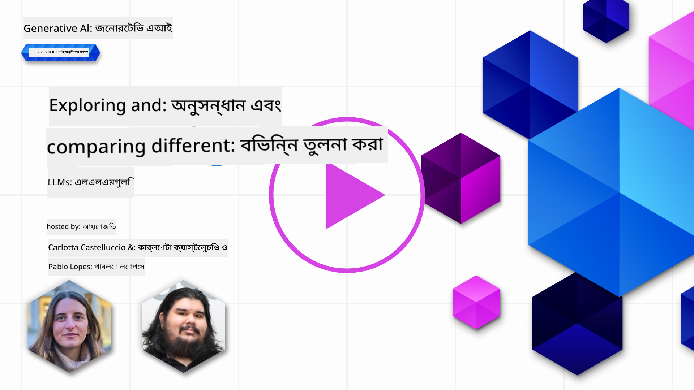](https://youtu.be/KIRUeDKscfI?si=8BHX1zvwzQBn-PlK)

> _উপরের ছবিতে ক্লিক করে এই পাঠের ভিডিও দেখুন_

পূর্ববর্তী পাঠে আমরা দেখেছি কীভাবে জেনারেটিভ AI প্রযুক্তির ক্ষেত্র পরিবর্তন করছে, কীভাবে লার্জ ল্যাঙ্গুয়েজ মডেল (LLM) কাজ করে এবং কীভাবে একটি ব্যবসা - যেমন আমাদের স্টার্টআপ - তাদের ব্যবহারিক ক্ষেত্রে প্রয়োগ করে এবং বৃদ্ধি করতে পারে! এই অধ্যায়ে, আমরা বিভিন্ন ধরনের লার্জ ল্যাঙ্গুয়েজ মডেল (LLM) তুলনা এবং বিশ্লেষণ করতে যাচ্ছি, তাদের সুবিধা এবং অসুবিধা বুঝতে।

আমাদের স্টার্টআপের পরবর্তী পদক্ষেপ হলো বর্তমান LLM-এর ক্ষেত্র অন্বেষণ করা এবং কোনটি আমাদের ব্যবহারিক ক্ষেত্রে উপযুক্ত তা বোঝা।

## পরিচিতি

এই পাঠে আলোচনা করা হবে:

- বর্তমান LLM-এর বিভিন্ন ধরন।
- Azure-এ আপনার ব্যবহারিক ক্ষেত্রে বিভিন্ন মডেল পরীক্ষা, পুনরাবৃত্তি এবং তুলনা করা।
- কীভাবে একটি LLM স্থাপন করা যায়।

## শেখার লক্ষ্য

এই পাঠ সম্পন্ন করার পর, আপনি সক্ষম হবেন:

- আপনার ব্যবহারিক ক্ষেত্রে সঠিক মডেল নির্বাচন করতে।
- কীভাবে আপনার মডেলের কার্যকারিতা পরীক্ষা, পুনরাবৃত্তি এবং উন্নত করতে হয় তা বুঝতে।
- ব্যবসাগুলি কীভাবে মডেল স্থাপন করে তা জানতে।

## বিভিন্ন ধরনের LLM বোঝা

LLM-এর স্থাপত্য, প্রশিক্ষণ ডেটা এবং ব্যবহারিক ক্ষেত্রে ভিত্তিতে বিভিন্ন শ্রেণিবিভাগ থাকতে পারে। এই পার্থক্যগুলো বোঝা আমাদের স্টার্টআপকে সঠিক মডেল নির্বাচন করতে সাহায্য করবে এবং কীভাবে পরীক্ষা, পুনরাবৃত্তি এবং কার্যকারিতা উন্নত করতে হয় তা বুঝতে সাহায্য করবে।

LLM মডেলের অনেক ধরন রয়েছে, আপনার মডেল নির্বাচন নির্ভর করে আপনি কী উদ্দেশ্যে এটি ব্যবহার করতে চান, আপনার ডেটা, কতটা খরচ করতে প্রস্তুত এবং আরও অনেক কিছু।

আপনি যদি মডেলগুলোকে টেক্সট, অডিও, ভিডিও, ইমেজ জেনারেশন ইত্যাদির জন্য ব্যবহার করতে চান, তাহলে আপনি ভিন্ন ধরনের মডেল বেছে নিতে পারেন।

- **অডিও এবং স্পিচ রিকগনিশন**। এই উদ্দেশ্যে, Whisper-ধরনের মডেলগুলো একটি চমৎকার পছন্দ কারণ এগুলো সাধারণ উদ্দেশ্যে এবং স্পিচ রিকগনিশনের জন্য তৈরি। এটি বিভিন্ন অডিওতে প্রশিক্ষিত এবং বহুভাষিক স্পিচ রিকগনিশন করতে সক্ষম। [Whisper ধরনের মডেল সম্পর্কে আরও জানুন](https://platform.openai.com/docs/models/whisper?WT.mc_id=academic-105485-koreyst)।

- **ইমেজ জেনারেশন**। ইমেজ জেনারেশনের জন্য, DALL-E এবং Midjourney দুটি খুব পরিচিত পছন্দ। DALL-E Azure OpenAI দ্বারা সরবরাহ করা হয়। [DALL-E সম্পর্কে আরও পড়ুন](https://platform.openai.com/docs/models/dall-e?WT.mc_id=academic-105485-koreyst) এবং এই পাঠ্যক্রমের ৯ম অধ্যায়ে।

- **টেক্সট জেনারেশন**। বেশিরভাগ মডেল টেক্সট জেনারেশনে প্রশিক্ষিত এবং আপনার কাছে GPT-3.5 থেকে GPT-4 পর্যন্ত অনেক বিকল্প রয়েছে। এগুলো বিভিন্ন খরচে আসে, GPT-4 সবচেয়ে ব্যয়বহুল। [Azure OpenAI প্লেগ্রাউন্ড](https://oai.azure.com/portal/playground?WT.mc_id=academic-105485-koreyst) পরীক্ষা করে দেখুন কোন মডেল আপনার প্রয়োজন অনুযায়ী সক্ষমতা এবং খরচের ক্ষেত্রে সবচেয়ে ভালো।

- **মাল্টি-মডালিটি**। যদি আপনি ইনপুট এবং আউটপুটে একাধিক ধরনের ডেটা পরিচালনা করতে চান, তাহলে আপনি [gpt-4 turbo with vision বা gpt-4o](https://learn.microsoft.com/azure/ai-services/openai/concepts/models#gpt-4-and-gpt-4-turbo-models?WT.mc_id=academic-105485-koreyst) - OpenAI মডেলের সর্বশেষ সংস্করণ - দেখতে পারেন, যা প্রাকৃতিক ভাষা প্রক্রিয়াকরণকে ভিজ্যুয়াল বোঝার সাথে সংযুক্ত করতে সক্ষম, মাল্টি-মডাল ইন্টারফেসের মাধ্যমে যোগাযোগ সক্ষম করে।

একটি মডেল নির্বাচন করার অর্থ হলো আপনি কিছু মৌলিক সক্ষমতা পাবেন, যা যথেষ্ট নাও হতে পারে। প্রায়ই আপনার কোম্পানির নির্দিষ্ট ডেটা থাকে যা আপনি কোনোভাবে LLM-কে জানাতে চান। এটি করার জন্য কয়েকটি ভিন্ন পদ্ধতি রয়েছে, যা পরবর্তী অংশে আলোচনা করা হবে।

### ফাউন্ডেশন মডেল বনাম LLM

ফাউন্ডেশন মডেল শব্দটি [স্ট্যানফোর্ড গবেষকরা](https://arxiv.org/abs/2108.07258?WT.mc_id=academic-105485-koreyst) তৈরি করেছেন এবং এটি এমন একটি AI মডেল হিসেবে সংজ্ঞায়িত করা হয়েছে যা কিছু মানদণ্ড অনুসরণ করে, যেমন:

- **এগুলো আনসুপারভাইজড লার্নিং বা সেল্ফ-সুপারভাইজড লার্নিং ব্যবহার করে প্রশিক্ষিত**, অর্থাৎ এগুলো লেবেলবিহীন মাল্টি-মডাল ডেটায় প্রশিক্ষিত এবং তাদের প্রশিক্ষণ প্রক্রিয়ার জন্য মানব অ্যানোটেশন বা ডেটা লেবেলিং প্রয়োজন হয় না।
- **এগুলো খুব বড় মডেল**, যা খুব গভীর নিউরাল নেটওয়ার্কের উপর ভিত্তি করে বিলিয়ন প্যারামিটারে প্রশিক্ষিত।
- **এগুলো সাধারণত অন্যান্য মডেলের জন্য একটি 'ফাউন্ডেশন' হিসেবে কাজ করার উদ্দেশ্যে তৈরি**, অর্থাৎ এগুলোকে অন্যান্য মডেল তৈরির জন্য একটি সূচনা পয়েন্ট হিসেবে ব্যবহার করা যেতে পারে, যা ফাইন-টিউনিং করে করা যেতে পারে।

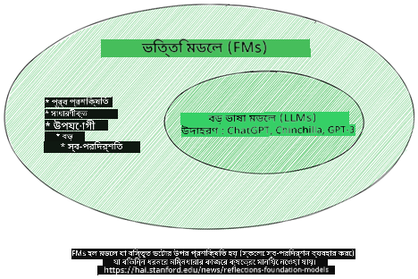

ছবির উৎস: [ফাউন্ডেশন মডেল এবং লার্জ ল্যাঙ্গুয়েজ মডেলের জন্য অপরিহার্য গাইড | Babar M Bhatti | Medium](https://thebabar.medium.com/essential-guide-to-foundation-models-and-large-language-models-27dab58f7404)

এই পার্থক্যটি আরও স্পষ্ট করতে, আসুন ChatGPT-এর একটি উদাহরণ নিই। ChatGPT-এর প্রথম সংস্করণ তৈরি করতে GPT-3.5 নামক একটি মডেল ফাউন্ডেশন মডেল হিসেবে কাজ করেছে। এর অর্থ হলো OpenAI কিছু চ্যাট-নির্দিষ্ট ডেটা ব্যবহার করেছে GPT-3.5-এর একটি টিউনড সংস্করণ তৈরি করতে, যা কথোপকথনের পরিস্থিতিতে, যেমন চ্যাটবট, ভালো পারফর্ম করার জন্য বিশেষায়িত।

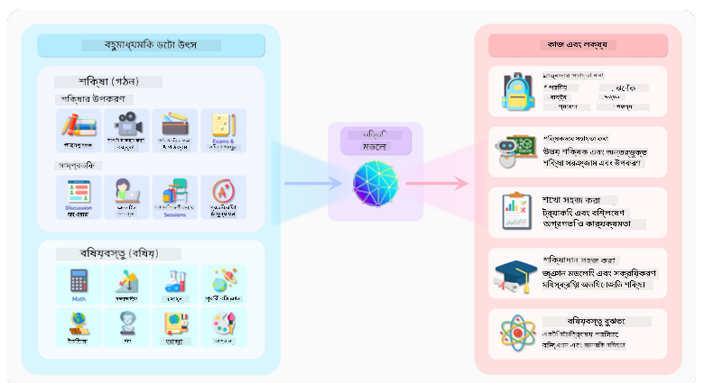

ছবির উৎস: [2108.07258.pdf (arxiv.org)](https://arxiv.org/pdf/2108.07258.pdf?WT.mc_id=academic-105485-koreyst)

### ওপেন সোর্স বনাম প্রোপ্রাইটারি মডেল

LLM-কে আরেকভাবে শ্রেণিবদ্ধ করা যায়, তা হলো এগুলো ওপেন সোর্স নাকি প্রোপ্রাইটারি।

ওপেন সোর্স মডেল হলো এমন মডেল যা জনসাধারণের জন্য উপলব্ধ এবং যে কেউ ব্যবহার করতে পারে। এগুলো প্রায়ই সৃষ্টিকারী কোম্পানি বা গবেষণা সম্প্রদায় দ্বারা উপলব্ধ করা হয়। এই মডেলগুলো পরীক্ষা, পরিবর্তন এবং বিভিন্ন ব্যবহারিক ক্ষেত্রে কাস্টমাইজ করার অনুমতি দেয়। তবে, এগুলো সবসময় প্রোডাকশন ব্যবহারের জন্য অপ্টিমাইজ করা হয় না এবং প্রোপ্রাইটারি মডেলের মতো কার্যকরী নাও হতে পারে। এছাড়া, ওপেন সোর্স মডেলের জন্য অর্থায়ন সীমিত হতে পারে এবং এগুলো দীর্ঘমেয়াদে রক্ষণাবেক্ষণ করা নাও হতে পারে বা সর্বশেষ গবেষণার সাথে আপডেট করা নাও হতে পারে। জনপ্রিয় ওপেন সোর্স মডেলের উদাহরণ হলো [Alpaca](https://crfm.stanford.edu/2023/03/13/alpaca.html?WT.mc_id=academic-105485-koreyst), [Bloom](https://huggingface.co/bigscience/bloom) এবং [LLaMA](https://llama.meta.com)।

প্রোপ্রাইটারি মডেল হলো এমন মডেল যা একটি কোম্পানির মালিকানাধীন এবং জনসাধারণের জন্য উপলব্ধ নয়। এই মডেলগুলো প্রায়ই প্রোডাকশন ব্যবহারের জন্য অপ্টিমাইজ করা হয়। তবে, এগুলো পরীক্ষা, পরিবর্তন বা বিভিন্ন ব্যবহারিক ক্ষেত্রে কাস্টমাইজ করার অনুমতি দেয় না। এছাড়া, এগুলো সবসময় বিনামূল্যে উপলব্ধ নয় এবং ব্যবহার করতে সাবস্ক্রিপশন বা অর্থপ্রদান প্রয়োজন হতে পারে। এছাড়া, ব্যবহারকারীদের মডেল প্রশিক্ষণের জন্য ব্যবহৃত ডেটার উপর নিয়ন্ত্রণ থাকে না, যার অর্থ হলো মডেল মালিকের কাছে ডেটা গোপনীয়তা এবং AI-এর দায়িত্বশীল ব্যবহারের প্রতিশ্রুতি নিশ্চিত করার দায়িত্ব দিতে হবে। জনপ্রিয় প্রোপ্রাইটারি মডেলের উদাহরণ হলো [OpenAI মডেল](https://platform.openai.com/docs/models/overview?WT.mc_id=academic-105485-koreyst), [Google Bard](https://sapling.ai/llm/bard?WT.mc_id=academic-105485-koreyst) বা [Claude 2](https://www.anthropic.com/index/claude-2?WT.mc_id=academic-105485-koreyst)।

### এমবেডিং বনাম ইমেজ জেনারেশন বনাম টেক্সট এবং কোড জেনারেশন

LLM-কে তাদের আউটপুটের ভিত্তিতে শ্রেণিবদ্ধ করা যায়।

এমবেডিং হলো এমন মডেলের একটি সেট যা টেক্সটকে একটি সংখ্যাসূচক রূপে রূপান্তর করতে পারে, যাকে এমবেডিং বলা হয়, যা ইনপুট টেক্সটের একটি সংখ্যাসূচক উপস্থাপনা। এমবেডিং মেশিনের জন্য শব্দ বা বাক্যের মধ্যে সম্পর্ক বোঝা সহজ করে এবং অন্যান্য মডেলের ইনপুট হিসেবে ব্যবহার করা যেতে পারে, যেমন শ্রেণিবিন্যাস মডেল বা ক্লাস্টারিং মডেল যা সংখ্যাসূচক ডেটায় ভালো পারফর্ম করে। এমবেডিং মডেলগুলো প্রায়ই ট্রান্সফার লার্নিংয়ের জন্য ব্যবহৃত হয়, যেখানে একটি মডেল প্রচুর ডেটা সহ একটি বিকল্প কাজের জন্য তৈরি করা হয় এবং তারপর মডেল ওজন (এমবেডিং) অন্যান্য ডাউনস্ট্রিম কাজের জন্য পুনরায় ব্যবহার করা হয়। এই শ্রেণির একটি উদাহরণ হলো [OpenAI এমবেডিং](https://platform.openai.com/docs/models/embeddings?WT.mc_id=academic-105485-koreyst)।

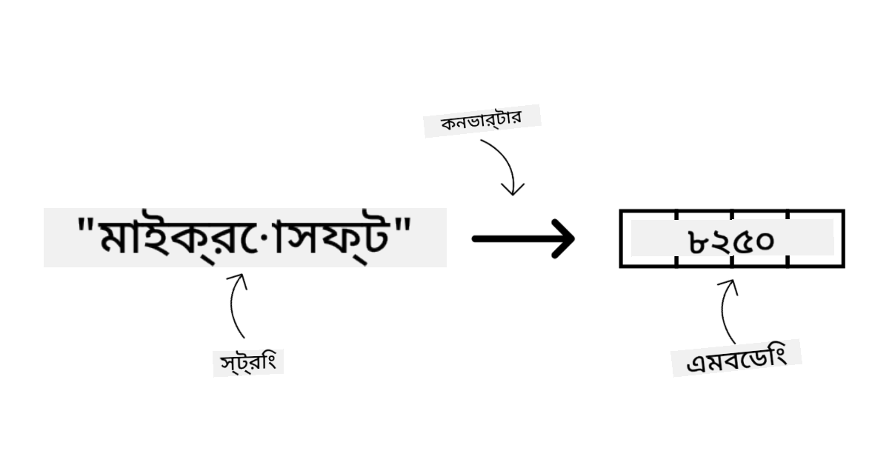

ইমেজ জেনারেশন মডেল হলো এমন মডেল যা ইমেজ তৈরি করে। এই মডেলগুলো প্রায়ই ইমেজ সম্পাদনা, ইমেজ সংশ্লেষণ এবং ইমেজ অনুবাদের জন্য ব্যবহৃত হয়। ইমেজ জেনারেশন মডেলগুলো প্রায়ই বড় ইমেজ ডেটাসেটে প্রশিক্ষিত হয়, যেমন [LAION-5B](https://laion.ai/blog/laion-5b/?WT.mc_id=academic-105485-koreyst), এবং নতুন ইমেজ তৈরি করতে বা বিদ্যমান ইমেজ সম্পাদনা করতে ব্যবহৃত হতে পারে ইনপেইন্টিং, সুপার-রেজোলিউশন এবং কালারাইজেশন কৌশল ব্যবহার করে। উদাহরণ হিসেবে [DALL-E-3](https://openai.com/dall-e-3?WT.mc_id=academic-105485-koreyst) এবং [Stable Diffusion মডেল](https://github.com/Stability-AI/StableDiffusion?WT.mc_id=academic-105485-koreyst)।

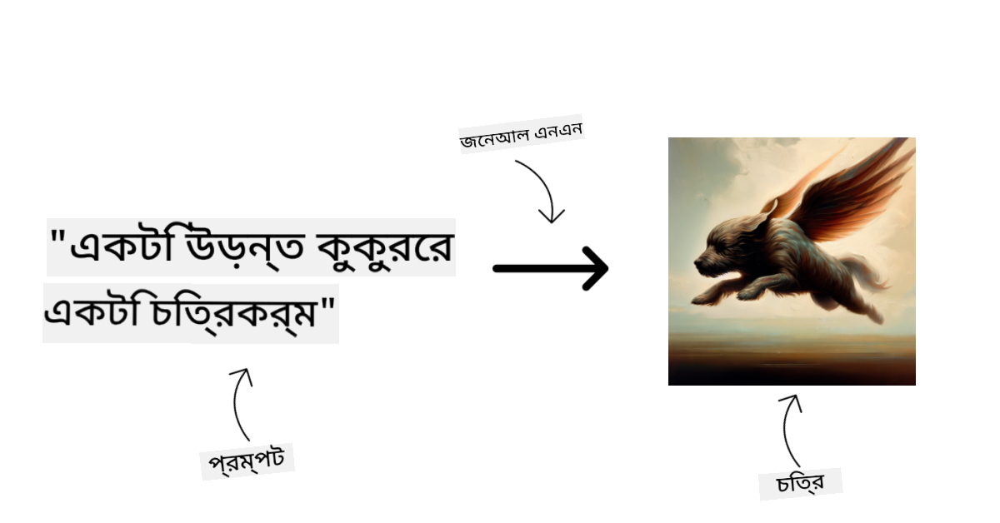

টেক্সট এবং কোড জেনারেশন মডেল হলো এমন মডেল যা টেক্সট বা কোড তৈরি করে। এই মডেলগুলো প্রায়ই টেক্সট সারাংশ, অনুবাদ এবং প্রশ্নের উত্তর দেওয়ার জন্য ব্যবহৃত হয়। টেক্সট জেনারেশন মডেলগুলো প্রায়ই বড় টেক্সট ডেটাসেটে প্রশিক্ষিত হয়, যেমন [BookCorpus](https://www.cv-foundation.org/openaccess/content_iccv_2015/html/Zhu_Aligning_Books_and_ICCV_2015_paper.html?WT.mc_id=academic-105485-koreyst), এবং নতুন টেক্সট তৈরি করতে বা প্রশ্নের উত্তর দিতে ব্যবহৃত হতে পারে। কোড জেনারেশন মডেল, যেমন [CodeParrot](https://huggingface.co/codeparrot?WT.mc_id=academic-105485-koreyst), প্রায়ই বড় কোড ডেটাসেটে প্রশিক্ষিত হয়, যেমন GitHub, এবং নতুন কোড তৈরি করতে বা বিদ্যমান কোডে বাগ ঠিক করতে ব্যবহৃত হতে পারে।

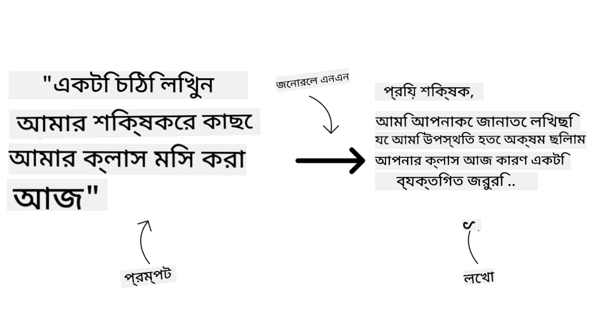

### এনকোডার-ডিকোডার বনাম শুধুমাত্র ডিকোডার

LLM-এর বিভিন্ন ধরনের স্থাপত্য নিয়ে আলোচনা করতে, আসুন একটি উদাহরণ ব্যবহার করি।

ধরুন আপনার ম্যানেজার আপনাকে শিক্ষার্থীদের জন্য একটি কুইজ লেখার কাজ দিয়েছেন। আপনার দুটি সহকর্মী রয়েছে; একজন বিষয়বস্তু তৈরি করার দায়িত্বে এবং অন্যজন তা পর্যালোচনা করার দায়িত্বে।

বিষয়বস্তু নির্মাতা হলো শুধুমাত্র ডিকোডার মডেলের মতো, তারা বিষয়টি দেখতে পারে এবং আপনি যা লিখেছেন তা দেখে তার উপর ভিত্তি করে একটি কোর্স লিখতে পারে। তারা আকর্ষণীয় এবং তথ্যবহুল বিষয়বস্তু লেখার ক্ষেত্রে খুব ভালো, কিন্তু তারা বিষয় এবং শেখার উদ্দেশ্যগুলি বুঝতে খুব ভালো নয়। শুধুমাত্র ডিকোডার মডেলের উদাহরণ হলো GPT পরিবারের মডেল, যেমন GPT-3।

পর্যালোচক হলো শুধুমাত্র এনকোডার মডেলের মতো, তারা লেখা কোর্স এবং উত্তরগুলো দেখে, তাদের মধ্যে সম্পর্ক লক্ষ্য করে এবং প্রসঙ্গ বোঝে, কিন্তু তারা বিষয়বস্তু তৈরি করতে ভালো নয়। শুধুমাত্র এনকোডার মডেলের একটি উদাহরণ হলো BERT।

ধরুন আমাদের এমন কেউ আছে যে কুইজ তৈরি এবং পর্যালোচনা করতে পারে, এটি একটি এনকোডার-ডিকোডার মডেল। কিছু উদাহরণ হলো BART এবং T5।

### সার্ভিস বনাম মডেল

এখন, আসুন একটি সার্ভিস এবং একটি মডেলের মধ্যে পার্থক্য নিয়ে আলোচনা করি। একটি সার্ভিস হলো একটি পণ্য যা একটি ক্লাউড সার্ভিস প্রদানকারী দ্বারা সরবরাহ করা হয় এবং প্রায়ই মডেল, ডেটা এবং অন্যান্য উপাদানগুলোর সংমিশ্রণ। একটি মডেল হলো একটি সার্ভিসের মূল উপাদান এবং প্রায়ই একটি ফাউন্ডেশন মডেল, যেমন একটি LLM।

সার্ভিসগুলো প্রায়ই প্রোডাকশন ব্যবহারের জন্য অপ্টিমাইজ করা হয় এবং প্রায়ই মডেলের তুলনায় ব্যবহার করা সহজ হয়, একটি গ্রাফিকাল ইউজার ইন্টারফেসের মাধ্যমে। তবে, সার্ভিসগুলো সবসময় বিনামূল্যে উপলব্ধ নয় এবং ব্যবহার করতে সাবস্ক্রিপশন বা অর্থপ্রদান প্রয়োজন হতে পারে, সার্ভিস মালিকের সরঞ্জাম এবং সম্পদ ব্যবহার করার বিনিময়ে, খরচ অপ্টিমাইজ এবং সহজে স্কেল করার জন্য। একটি সার্ভিসের উদাহরণ হলো [Azure OpenAI সার্ভিস](https://learn.microsoft.com/azure/ai-services/openai/overview?WT.mc_id=academic-105485-koreyst), যা একটি পে-অ্যাজ-ইউ-গো রেট প্ল্যান অফার করে, অর্থাৎ ব্যবহারকারীদের তাদের ব্যবহারের পরিমাণ অনুযায়ী চার্জ করা হয়। এছাড়া, Azure OpenAI সার্ভিস মডেলের সক্ষমতার উপর এন্টারপ্রাইজ-গ্রেড নিরাপত্তা এবং একটি দায়িত্বশীল AI কাঠামো সরবরাহ করে।

মডেলগুলো শুধুমাত্র নিউরাল নেটওয়ার্ক, প্যারামিটার, ওজন এবং অন্যান্য উপাদান। কোম্পানিগুলোকে স্থানীয়ভাবে চালানোর অনুমতি দেয়, তবে এর জন্য সরঞ্জাম কিনতে হবে, স্কেল করার জন্য একটি কাঠামো তৈরি করতে হবে এবং একটি লাইসেন্স কিনতে হবে বা একটি ওপেন সোর্স মডেল ব্যবহার করতে হবে। একটি মডেল যেমন LLaMA ব্যবহারের জন্য উপলব্ধ, যা চালানোর জন্য কম্পিউটেশনাল ক্ষমতা প্রয়োজন।

## Azure-এ বিভিন্ন মডেলের কার্যকারিতা পরীক্ষা এবং পুনরাবৃত্তি করার পদ্ধতি

আমাদের দল যখন বর্তমান LLM-এর ক্ষেত্র অন্বেষণ করে এবং তাদের পরিস্থিতির জন্য কিছু ভালো প্রার্থী চিহ্নিত করে, তখন পরবর্তী পদক্ষেপ হলো তাদের ডেটা এবং কাজের উপর পরীক্ষা করা। এটি একটি পুনরাবৃত্তিমূলক প্রক্রিয়া, যা পরীক্ষা এবং পরিমাপের মাধ্যমে করা হয়।
আমরা পূর্ববর্তী অনুচ্ছেদে উল্লেখিত বেশিরভাগ মডেল (OpenAI মডেল, Llama2-এর মতো ওপেন সোর্স মডেল এবং Hugging Face ট্রান্সফর্মার) [Model Catalog](https://learn.microsoft.com/azure/ai-studio/how-to/model-catalog-overview?WT.mc_id=academic-105485-koreyst)-এ [Azure AI Studio](https://ai.azure.com/?WT.mc_id=academic-105485-koreyst)-এ উপলব্ধ।

[Azure AI Studio](https://learn.microsoft.com/azure/ai-studio/what-is-ai-studio?WT.mc_id=academic-105485-koreyst) একটি ক্লাউড প্ল্যাটফর্ম যা ডেভেলপারদের জন্য জেনারেটিভ AI অ্যাপ্লিকেশন তৈরি এবং পুরো ডেভেলপমেন্ট লাইফসাইকেল পরিচালনা করার জন্য ডিজাইন করা হয়েছে - পরীক্ষামূলক পর্যায় থেকে মূল্যায়ন পর্যন্ত - সমস্ত Azure AI পরিষেবাগুলিকে একটি কেন্দ্রীয় হাবে সংযুক্ত করে একটি সহজ GUI সহ। Azure AI Studio-এর Model Catalog ব্যবহারকারীকে সক্ষম করে:

- ক্যাটালগে আগ্রহের Foundation Model খুঁজে বের করা - হয় মালিকানাধীন বা ওপেন সোর্স, টাস্ক, লাইসেন্স বা নাম অনুযায়ী ফিল্টার করে। অনুসন্ধানযোগ্যতা উন্নত করতে, মডেলগুলো সংগ্রহে সংগঠিত করা হয়েছে, যেমন Azure OpenAI collection, Hugging Face collection এবং আরও অনেক কিছু।

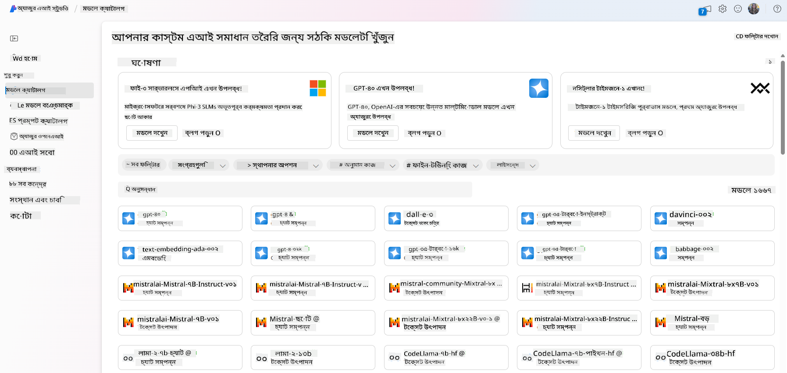

- মডেল কার্ড পর্যালোচনা করা, যার মধ্যে রয়েছে উদ্দেশ্যপূর্ণ ব্যবহার এবং প্রশিক্ষণ ডেটার বিস্তারিত বিবরণ, কোড নমুনা এবং অভ্যন্তরীণ মূল্যায়ন লাইব্রেরিতে মূল্যায়নের ফলাফল।

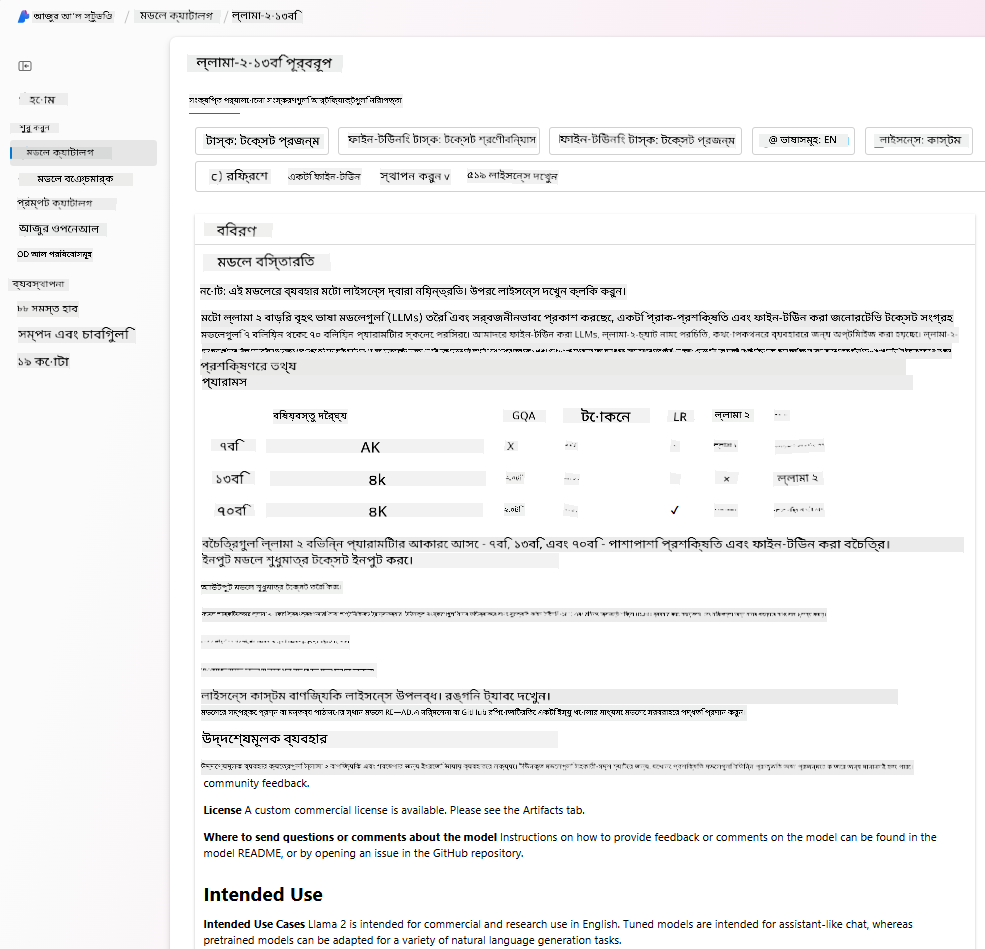

- শিল্পে উপলব্ধ মডেল এবং ডেটাসেটের মধ্যে বেঞ্চমার্ক তুলনা করা, [Model Benchmarks](https://learn.microsoft.com/azure/ai-studio/how-to/model-benchmarks?WT.mc_id=academic-105485-koreyst) প্যানেলের মাধ্যমে ব্যবসায়িক পরিস্থিতির সাথে কোনটি সেরা তা মূল্যায়ন করা।

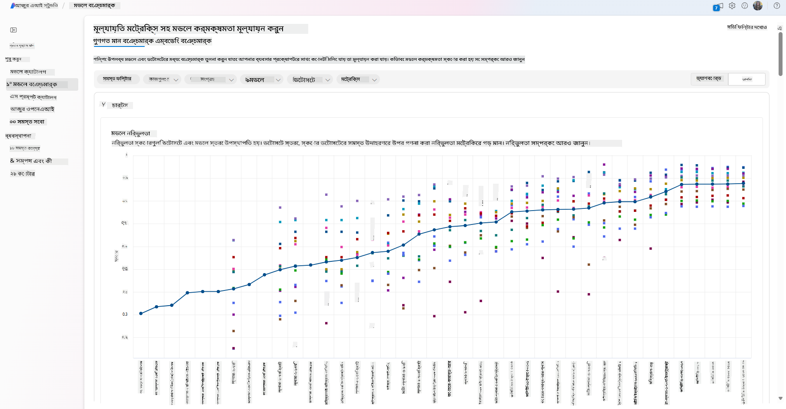

- নির্দিষ্ট কাজের ক্ষেত্রে মডেলের কার্যকারিতা উন্নত করতে কাস্টম প্রশিক্ষণ ডেটার উপর মডেলটি ফাইন-টিউন করা, Azure AI Studio-এর পরীক্ষামূলক এবং ট্র্যাকিং সক্ষমতাকে কাজে লাগিয়ে।

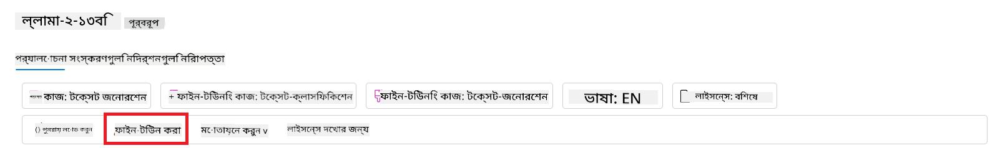

- মূল প্রি-ট্রেইনড মডেল বা ফাইন-টিউনড সংস্করণটি রিমোট রিয়েল টাইম ইনফারেন্স - ম্যানেজড কম্পিউট - বা সার্ভারলেস API এন্ডপয়েন্টে - [pay-as-you-go](https://learn.microsoft.com/azure/ai-studio/how-to/model-catalog-overview#model-deployment-managed-compute-and-serverless-api-pay-as-you-go?WT.mc_id=academic-105485-koreyst) - ডিপ্লয় করা, যাতে অ্যাপ্লিকেশনগুলো এটি ব্যবহার করতে পারে।

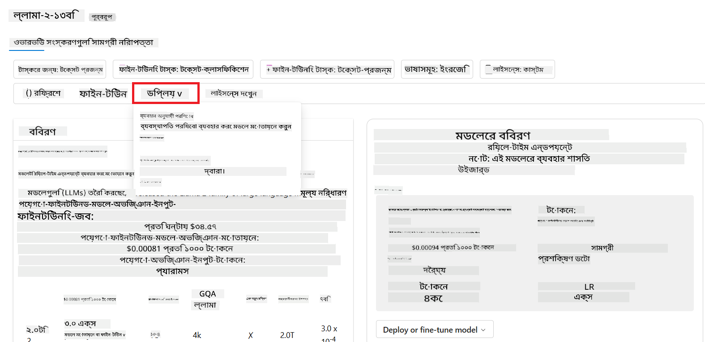

> [!NOTE]
> ক্যাটালগে থাকা সমস্ত মডেল বর্তমানে ফাইন-টিউনিং এবং/অথবা pay-as-you-go ডিপ্লয়মেন্টের জন্য উপলব্ধ নয়। মডেলের সক্ষমতা এবং সীমাবদ্ধতার বিস্তারিত জানতে মডেল কার্ডটি পরীক্ষা করুন।

## LLM ফলাফল উন্নত করা

আমরা আমাদের স্টার্টআপ টিমের সাথে বিভিন্ন ধরনের LLM এবং একটি ক্লাউড প্ল্যাটফর্ম (Azure Machine Learning) নিয়ে পরীক্ষা করেছি যা আমাদের বিভিন্ন মডেল তুলনা করতে, টেস্ট ডেটায় মূল্যায়ন করতে, কার্যকারিতা উন্নত করতে এবং ইনফারেন্স এন্ডপয়েন্টে ডিপ্লয় করতে সক্ষম করে।

কিন্তু কখন তাদের একটি প্রি-ট্রেইনড মডেল ব্যবহার করার পরিবর্তে একটি মডেল ফাইন-টিউন করা উচিত? নির্দিষ্ট কাজের ক্ষেত্রে মডেলের কার্যকারিতা উন্নত করার জন্য কি অন্য কোনো পদ্ধতি আছে?

একটি ব্যবসা LLM থেকে প্রয়োজনীয় ফলাফল পেতে বিভিন্ন পদ্ধতি ব্যবহার করতে পারে। প্রোডাকশনে LLM ডিপ্লয় করার সময় বিভিন্ন প্রশিক্ষণের মাত্রা সহ বিভিন্ন ধরনের মডেল নির্বাচন করা যায়, যার জটিলতা, খরচ এবং গুণমানের বিভিন্ন স্তর রয়েছে। এখানে কিছু পদ্ধতি উল্লেখ করা হলো:

- **প্রম্পট ইঞ্জিনিয়ারিং উইথ কনটেক্সট**। ধারণাটি হলো যথেষ্ট প্রসঙ্গ প্রদান করা যাতে আপনি প্রয়োজনীয় উত্তর পেতে পারেন।

- **Retrieval Augmented Generation, RAG**। আপনার ডেটা একটি ডাটাবেস বা ওয়েব এন্ডপয়েন্টে থাকতে পারে, উদাহরণস্বরূপ, এই ডেটা বা এর একটি অংশ প্রম্পট করার সময় অন্তর্ভুক্ত করার জন্য, আপনি প্রাসঙ্গিক ডেটা সংগ্রহ করতে পারেন এবং এটি ব্যবহারকারীর প্রম্পটের অংশ করতে পারেন।

- **ফাইন-টিউনড মডেল**। এখানে, আপনি মডেলটিকে আপনার নিজস্ব ডেটার উপর আরও প্রশিক্ষণ দিয়েছেন যা মডেলটিকে আপনার প্রয়োজন অনুযায়ী আরও সুনির্দিষ্ট এবং প্রতিক্রিয়াশীল করে তুলেছে, তবে এটি ব্যয়বহুল হতে পারে।

ছবির উৎস: [Four Ways that Enterprises Deploy LLMs | Fiddler AI Blog](https://www.fiddler.ai/blog/four-ways-that-enterprises-deploy-llms?WT.mc_id=academic-105485-koreyst)

### প্রম্পট ইঞ্জিনিয়ারিং উইথ কনটেক্সট

প্রি-ট্রেইনড LLMs সাধারণত সাধারণ প্রাকৃতিক ভাষার কাজগুলোতে খুব ভালো কাজ করে, এমনকি একটি ছোট প্রম্পট দিয়ে তাদের কল করলেও, যেমন একটি বাক্য সম্পূর্ণ করা বা একটি প্রশ্ন – যাকে "জিরো-শট" লার্নিং বলা হয়।

তবে, ব্যবহারকারী তাদের প্রশ্নটি যত বেশি ফ্রেম করতে পারে, একটি বিস্তারিত অনুরোধ এবং উদাহরণ সহ – কনটেক্সট – উত্তরটি তত বেশি সঠিক এবং ব্যবহারকারীর প্রত্যাশার কাছাকাছি হবে। এই ক্ষেত্রে, আমরা "ওয়ান-শট" লার্নিং সম্পর্কে কথা বলি যদি প্রম্পটটিতে শুধুমাত্র একটি উদাহরণ থাকে এবং "ফিউ-শট লার্নিং" যদি এতে একাধিক উদাহরণ থাকে। প্রম্পট ইঞ্জিনিয়ারিং উইথ কনটেক্সট শুরু করার জন্য সবচেয়ে ব্যয়-সাশ্রয়ী পদ্ধতি।

### Retrieval Augmented Generation (RAG)

LLMs-এর সীমাবদ্ধতা হলো তারা শুধুমাত্র তাদের প্রশিক্ষণের সময় ব্যবহৃত ডেটা ব্যবহার করতে পারে উত্তর তৈরি করার জন্য। এর অর্থ হলো তারা তাদের প্রশিক্ষণ প্রক্রিয়ার পরে ঘটে যাওয়া ঘটনাগুলি সম্পর্কে কিছুই জানে না এবং তারা অ-সর্বজনীন তথ্য (যেমন কোম্পানির ডেটা) অ্যাক্সেস করতে পারে না।  
এটি RAG-এর মাধ্যমে অতিক্রম করা যেতে পারে, একটি কৌশল যা প্রম্পটকে বাহ্যিক ডেটা দিয়ে ডকুমেন্টের অংশ হিসেবে বৃদ্ধি করে, প্রম্পটের দৈর্ঘ্যের সীমা বিবেচনা করে। এটি Vector ডাটাবেস টুল (যেমন [Azure Vector Search](https://learn.microsoft.com/azure/search/vector-search-overview?WT.mc_id=academic-105485-koreyst)) দ্বারা সমর্থিত যা পূর্বনির্ধারিত ডেটা উৎস থেকে দরকারী অংশগুলি পুনরুদ্ধার করে এবং সেগুলোকে প্রম্পট কনটেক্সটে যোগ করে।

এই কৌশলটি খুবই সহায়ক যখন একটি ব্যবসার কাছে পর্যাপ্ত ডেটা, পর্যাপ্ত সময় বা একটি LLM ফাইন-টিউন করার জন্য পর্যাপ্ত সম্পদ নেই, তবে একটি নির্দিষ্ট কাজের ক্ষেত্রে কার্যকারিতা উন্নত করতে এবং বাস্তবতার বিকৃতি বা ক্ষতিকারক বিষয়বস্তুর ঝুঁকি কমাতে চায়।

### ফাইন-টিউনড মডেল

ফাইন-টিউনিং একটি প্রক্রিয়া যা ট্রান্সফার লার্নিং ব্যবহার করে মডেলটিকে একটি ডাউনস্ট্রিম টাস্কে 'অ্যাডাপ্ট' করতে বা একটি নির্দিষ্ট সমস্যা সমাধান করতে। ফিউ-শট লার্নিং এবং RAG থেকে ভিন্ন, এটি একটি নতুন মডেল তৈরি করে, আপডেটেড ওয়েট এবং বায়াস সহ। এটি একটি প্রশিক্ষণ উদাহরণ সেট প্রয়োজন, যা একটি একক ইনপুট (প্রম্পট) এবং এর সংশ্লিষ্ট আউটপুট (কমপ্লিশন) নিয়ে গঠিত।  
এটি পছন্দের পদ্ধতি হবে যদি:

- **ফাইন-টিউনড মডেল ব্যবহার করা**। একটি ব্যবসা কম সক্ষম মডেল (যেমন এমবেডিং মডেল) ব্যবহার করতে চায়, উচ্চ কার্যক্ষমতার মডেলের পরিবর্তে, যা একটি আরও ব্যয়-সাশ্রয়ী এবং দ্রুত সমাধান প্রদান করে।

- **লেটেন্সি বিবেচনা করা**। একটি নির্দিষ্ট ব্যবহারের ক্ষেত্রে লেটেন্সি গুরুত্বপূর্ণ, তাই খুব দীর্ঘ প্রম্পট ব্যবহার করা সম্ভব নয় বা মডেল থেকে শেখার জন্য প্রয়োজনীয় উদাহরণগুলোর সংখ্যা প্রম্পটের দৈর্ঘ্যের সীমার সাথে খাপ খায় না।

- **আপডেট থাকা**। একটি ব্যবসার কাছে প্রচুর উচ্চ-গুণমানের ডেটা এবং গ্রাউন্ড ট্রুথ লেবেল রয়েছে এবং সময়ের সাথে সাথে এই ডেটা আপডেট রাখতে প্রয়োজনীয় সম্পদ রয়েছে।

### প্রশিক্ষিত মডেল

শুরু থেকে একটি LLM প্রশিক্ষণ দেওয়া নিঃসন্দেহে সবচেয়ে কঠিন এবং সবচেয়ে জটিল পদ্ধতি, যা বিশাল পরিমাণ ডেটা, দক্ষ সম্পদ এবং উপযুক্ত কম্পিউটেশনাল ক্ষমতা প্রয়োজন। এই বিকল্পটি শুধুমাত্র তখন বিবেচনা করা উচিত যখন একটি ব্যবসার কাছে একটি ডোমেইন-নির্দিষ্ট ব্যবহারের ক্ষেত্রে এবং ডোমেইন-কেন্দ্রিক ডেটার একটি বড় পরিমাণ থাকে।

## জ্ঞান যাচাই

LLM কমপ্লিশন ফলাফল উন্নত করার জন্য একটি ভালো পদ্ধতি কী হতে পারে?

1. প্রম্পট ইঞ্জিনিয়ারিং উইথ কনটেক্সট  
1. RAG  
1. ফাইন-টিউনড মডেল  

উত্তর: ৩, যদি আপনার সময় এবং সম্পদ থাকে এবং উচ্চ গুণমানের ডেটা থাকে, তাহলে ফাইন-টিউনিং আপডেট থাকার জন্য ভালো বিকল্প। তবে, যদি আপনি উন্নতি করতে চান এবং আপনার সময়ের অভাব থাকে, তাহলে প্রথমে RAG বিবেচনা করা মূল্যবান।

## 🚀 চ্যালেঞ্জ

আপনার ব্যবসার জন্য [RAG ব্যবহার](https://learn.microsoft.com/azure/search/retrieval-augmented-generation-overview?WT.mc_id=academic-105485-koreyst) সম্পর্কে আরও পড়ুন।

## অসাধারণ কাজ, আপনার শেখা চালিয়ে যান

এই পাঠটি সম্পন্ন করার পরে, আমাদের [Generative AI Learning collection](https://aka.ms/genai-collection?WT.mc_id=academic-105485-koreyst) দেখুন এবং আপনার Generative AI জ্ঞান আরও উন্নত করুন!

পাঠ ৩-এ যান যেখানে আমরা দেখব কীভাবে [Generative AI দায়িত্বশীলভাবে ব্যবহার করা যায়](../03-using-generative-ai-responsibly/README.md?WT.mc_id=academic-105485-koreyst)!

---

**অস্বীকৃতি**:  
এই নথিটি AI অনুবাদ পরিষেবা [Co-op Translator](https://github.com/Azure/co-op-translator) ব্যবহার করে অনুবাদ করা হয়েছে। আমরা যথাসাধ্য সঠিকতা নিশ্চিত করার চেষ্টা করি, তবে অনুগ্রহ করে মনে রাখবেন যে স্বয়ংক্রিয় অনুবাদে ত্রুটি বা অসঙ্গতি থাকতে পারে। মূল ভাষায় থাকা নথিটিকে প্রামাণিক উৎস হিসেবে বিবেচনা করা উচিত। গুরুত্বপূর্ণ তথ্যের জন্য, পেশাদার মানব অনুবাদ সুপারিশ করা হয়। এই অনুবাদ ব্যবহারের ফলে কোনো ভুল বোঝাবুঝি বা ভুল ব্যাখ্যার জন্য আমরা দায়বদ্ধ নই।