# বিভিন্ন এলএলএম অনুসন্ধান এবং তুলনা

[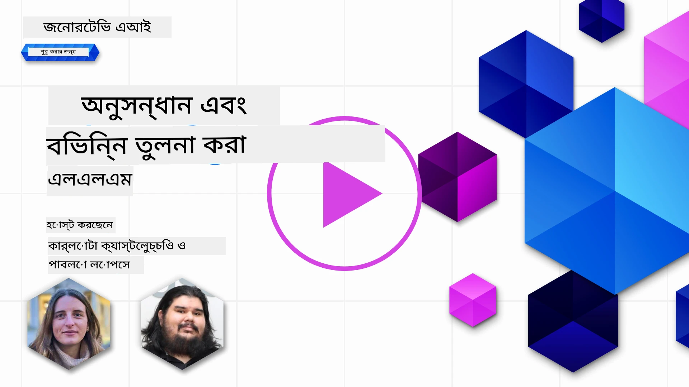](https://youtu.be/KIRUeDKscfI?si=8BHX1zvwzQBn-PlK)

> _এই পাঠের ভিডিও দেখতে উপরের ছবিতে ক্লিক করুন_

আগের পাঠে, আমরা দেখেছি কিভাবে জেনেরেটিভ এআই প্রযুক্তির পরিপ্রেক্ষিত পরিবর্তন করছে, কিভাবে বড় ভাষা মডেলসমূহ (LLMs) কাজ করে এবং কিভাবে একটি ব্যবসা - যেমন আমাদের স্টার্টআপ - এগুলো তাদের ব্যবহারের ক্ষেত্রে প্রয়োগ করতে পারে এবং বৃদ্ধি পেতে পারে! এই অধ্যায়ে, আমরা বিভিন্ন ধরনের বড় ভাষা মডেলসমূহ (LLMs) তুলনা এবং পার্থক্য বিশ্লেষণ করব তাদের সুবিধা এবং অসুবিধা বুঝতে।

আমাদের স্টার্টআপের যাত্রার পরবর্তী ধাপ হল বর্তমান এলএলএমের পরিস্থিতি অনুসন্ধান করা এবং বুঝতে পারা কোনগুলো আমাদের ব্যবহারের জন্য উপযুক্ত।

## ভূমিকা

এই পাঠে নিম্নলিখিত বিষয়গুলো আলোচনা হবে:

- বর্তমান ল্যান্ডস্কেপে বিভিন্ন ধরনের এলএলএম।
- Azure এ আপনার ব্যবহারের জন্য বিভিন্ন মডেল পরীক্ষা, পুনরাবৃত্তি এবং তুলনা করা।
- একটি এলএলএম কীভাবে স্থাপন করবেন।

## শেখার লক্ষ্যসমূহ

এই পাঠ শেষ করলে, আপনি সক্ষম হবেন:

- আপনার ব্যবহারের জন্য সঠিক মডেল নির্বাচন করতে।
- আপনার মডেলের কার্যক্ষমতা পরীক্ষা, পুনরাবৃত্তি এবং উন্নত করার পদ্ধতি বুঝতে।
- ব্যবসাগুলো কিভাবে মডেল স্থাপন করে তা জানা।

## বিভিন্ন ধরনের এলএলএম বোঝা

এলএলএমগুলো বিভিন্ন পৃষ্ঠভূমি, প্রশিক্ষণ ডেটা, এবং ব্যবহারের উপর ভিত্তি করে বিভিন্ন শ্রেণীবিভাগ থাকতে পারে। এই পার্থক্যগুলো বোঝা আমাদের স্টার্টআপকে সঠিক মডেল নির্বাচন করতে এবং কিভাবে পরীক্ষা, পুনরাবৃত্তি এবং কার্যক্ষমতা উন্নয়ন করতে তা বুঝতে সাহায্য করবে।

এলএলএম মডেলের অনেক ধরন আছে, আপনার মডেল নির্বাচন নির্ভর করে আপনি কীভাবে এগুলো ব্যবহার করতে চান, আপনার ডেটা, আপনি কতটা খরচ করতে প্রস্তুত এবং আরও অন্য অনেক কিছু।

আপনি যদি মডেলগুলো টেক্সট, অডিও, ভিডিও, ইমেজ উৎপাদনের জন্য ব্যবহার করতে চান, তাহলে ভিন্ন ধরনের মডেল বেছে নিতে পারেন।

- **অডিও এবং ভাষা স্বীকৃতি**। Whisper-শৈলীর মডেলগুলো এখনও বহু-উদ্দেশ্য ভাষা স্বীকৃতি মডেল হিসেবে কার্যকর, তবে প্রোডাকশনে আরও নতুন স্পিচ-টু-টেক্সট মডেলগুলোরও ব্যবহার হচ্ছে যেমন `gpt-4o-transcribe`, `gpt-4o-mini-transcribe`, এবং ডায়ারাইজেশন ভ্যারিয়েন্ট। আপনার ব্যবহারের জন্য ভাষার আওতা, ডায়ারাইজেশন, রিয়েল-টাইম সাপোর্ট, লেটেন্সি এবং খরচ বিবেচনা করুন। আরও জানুন [OpenAI স্পিচ-টু-টেক্সট ডকুমেন্টেশন](https://platform.openai.com/docs/guides/speech-to-text?WT.mc_id=academic-105485-koreyst) এ।

- **ইমেজ উৎপাদন**। DALL-E এবং Midjourney হল পরিচিত ইমেজ উৎপাদনের অপশন, কিন্তু বর্তমান OpenAI ইমেজ API-গুলি GPT ইমেজ মডেল যেমন `gpt-image-2` কেন্দ্রীভূত, যখন Stable Diffusion, Imagen, Flux এবং অন্যান্য মডেল পরিবারগুলোও সাধারণ পছন্দ। প্রম্পট আচরণ, সম্পাদনার সমর্থন, স্টাইল কন্ট্রোল, নিরাপত্তা দাবীদাওয়া, এবং লাইসেন্সিং তুলনা করুন। আরও জানুন [OpenAI ইমেজ উৎপাদন গাইড](https://platform.openai.com/docs/guides/images?WT.mc_id=academic-105485-koreyst) এবং এই পাঠক্রমের অধ্যায় ৯ এ।

- **টেক্সট উৎপাদন**। টেক্সট মডেলগুলো এখন সীমান্তবাহী মডেল, যুক্তিবাদী মডেল, সাধারণত কম লেটেন্সি মডেল এবং ওপেন-ওয়েট মডেলগুলোর মধ্যে বিভক্ত। বর্তমান উদাহরণগুলোর মধ্যে আছে OpenAI GPT-5.x মডেল, Anthropic Claude 4.x মডেল, Google Gemini 3.x মডেল, Meta Llama 4 মডেল এবং Mistral মডেল। শুধুমাত্র রিলিজ তারিখ বা দাম দেখে নির্বাচন করবেন না; কাজের গুণমান, লেটেন্সি, কন্টেক্সট উইন্ডো, টুল ব্যবহারের ক্ষমতা, নিরাপত্তার আচরণ, আঞ্চলিক প্রাপ্যতা, এবং মোট খরচ তুলনা করুন। [Microsoft Foundry মডেল ক্যাটালগ](https://ai.azure.com/catalog?WT.mc_id=academic-105485-koreyst) হলো Azur এ উপলব্ধ মডেলগুলো তুলনা করার একটি ভাল স্থান।

- **মাল্টি-মোড্যালিটি**। অনেক বর্তমান মডেল শুধুমাত্র টেক্সট নয়, এর থেকে বেশি প্রসেস করতে পারে। কেউ কেউ ছবি, অডিও, বা ভিডিও ইনপুট নিতে পারে; কেউ টুল কল করতে পারে; এবং কিছু বিশেষায়িত মডেল ছবি, অডিও, বা ভিডিও তৈরি করতে পারে। উদাহরণস্বরূপ, বর্তমান OpenAI মডেলগুলো টেক্সট এবং ইমেজ ইনপুট সমর্থন করে, Gemini মডেলগুলো বিভিন্ন ভ্যারিয়েন্ট অনুসারে টেক্সট, কোড, ইমেজ, অডিও এবং ভিডিও ইনপুট সমর্থন করে, আর Llama 4 Scout এবং Maverick হলো ওপেন-ওয়েট নেটিভ মাল্টিমোডাল মডেল। প্রতিটি মডেলের কার্ড দেখে নিশ্চিত হন কোন ইনপুট এবং আউটপুট মোডালিটি সমর্থিত সেটি বুঝতে, যাতে ওয়ার্কফ্লো তৈরি করার আগে ঠিকঠাক প্রস্তুতি নেওয়া যায়।

মডেল নির্বাচন মানে আপনি কিছু মৌলিক ক্ষমতা পাচ্ছেন, কিন্তু তা প্রায়ই যথেষ্ট নাও হতে পারে। প্রায়শই আপনার কোম্পানির নির্দিষ্ট ডেটা থাকে যা somehow এলএলএমকে জানাতে হয়। সেটা করার জন্য বিভিন্ন পন্থা রয়েছে, পরবর্তী অংশে সেগুলো আলোচনা করা হবে।

### ফাউন্ডেশন মডেল বনাম এলএলএম

ফাউন্ডেশন মডেল শব্দগুচ্ছটি [স্ট্যানফোর্ড গবেষকদের কর্তৃক তৈরি](https://arxiv.org/abs/2108.07258?WT.mc_id=academic-105485-koreyst) এবং এআই মডেল হিসাবে সংজ্ঞায়িত যা কিছু শর্ত অনুসরণ করে, যেমন:

- **এগুলো অসংলগ্ন শেখানো বা স্ব-শিক্ষণ প্রক্রিয়ায় প্রশিক্ষিত হয়**, অর্থাৎ তারা লেবেলবিহীন মাল্টি-মোডাল ডেটা ব্যবহার করে প্রশিক্ষণ পায়, এবং প্রশিক্ষণের জন্য মানুষের এনোটেশন বা লেবেল প্রয়োজন হয় না।
- **এগুলো খুব বড় মডেল**, অত্যন্ত গভীর নিউরাল নেটওয়ার্কের উপর ভিত্তি করে, যা বিলিয়ন হিসেবে প্যারামিটার নিয়ে প্রশিক্ষিত।
- **সাধারণত অন্য মডেল গড়ার জন্য ‘ফাউন্ডেশন’ হিসেবে ব্যবহারের জন্য ডিজাইন করা হয়**, অর্থাৎ এগুলোকে ভিত্তি হিসেবে নিয়ে অন্যান্য মডেল ফাইন-টিউনিং করে তৈরি করা হয়।

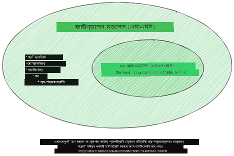

চিত্র উৎস: [Essential Guide to Foundation Models and Large Language Models | Babar M Bhatti | Medium
](https://thebabar.medium.com/essential-guide-to-foundation-models-and-large-language-models-27dab58f7404)

এই পার্থক্য আরও স্পষ্ট করতে, চলুন ChatGPT কে একটি ঐতিহাসিক উদাহরণ হিসাবে নিই। ChatGPT এর প্রাথমিক সংস্করণ GPT-3.5 কে ফাউন্ডেশন মডেল হিসেবে ব্যবহার করেছে। OpenAI পরে চ্যাট-সুনির্দিষ্ট ডেটা এবং অ্যлайнমেন্ট প্রযুক্তি ব্যবহার করে একটি টিউন করা সংস্করণ তৈরি করে যা আলাপচারিতা পরিসরে ভালো পারফরম্যান্স দেখায়, যেমন চ্যাটবট। আধুনিক এআই সার্ভিসগুলি প্রায়ই একাধিক মডেল ভ্যারিয়েন্টের মধ্যে রুট করে, তাই সার্ভিসের নাম এবং আন্ডারলাইনিং মডেলের নাম সর্বদা একই নয়।

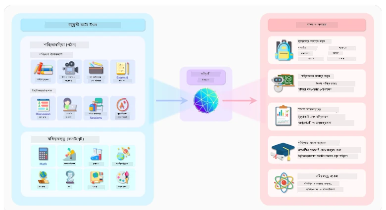

চিত্র উৎস: [2108.07258.pdf (arxiv.org)](https://arxiv.org/pdf/2108.07258.pdf?WT.mc_id=academic-105485-koreyst)

### ওপেন-ওয়েট/ওপেন-সোর্স বনাম প্রাইভেটারি মডেল

এলএলএমগুলোর আরেকটি বিভাগ হলো তারা ওপেন-ওয়েট, ওপেন-সোর্স নাকি প্রাইভেটারি।

ওপেন-সোর্স এবং ওপেন-ওয়েট মডেলগুলো মডেলের আর্টিফ্যাক্টগুলি পরিদর্শন, ডাউনলোড বা কাস্টমাইজেশনের জন্য উপলব্ধ করে, কিন্তু তাদের লাইসেন্স আলাদা। কিছু সম্পূর্ণ ওপেন সোর্স, আবার কিছু ওপেন-ওয়েট মডেল ব্যবহারের সীমাবদ্ধতা সহ। ব্যবসার জন্য যদি বেশি নিয়ন্ত্রণ প্রয়োজন হয় ডিপ্লয়মেন্ট, ডেটা লোকালিটি, খরচ, বা কাস্টমাইজেশনের ক্ষেত্রে, তবে এগুলো কার্যকর। তবে দলগুলোকে অবশ্যই লাইসেন্স শর্তাবলী, সেবা খরচ, রক্ষণাবেক্ষণ, নিরাপত্তা আপডেট এবং মূল্যায়নের গুণমান পরীক্ষা করতে হবে প্রোডাকশনে ব্যবহারের আগে। উদাহরণস্বরূপ [Meta Llama 4](https://ai.meta.com/blog/llama-4-multimodal-intelligence/?WT.mc_id=academic-105485-koreyst), কিছু [Mistral মডেল](https://docs.mistral.ai/models/overview?WT.mc_id=academic-105485-koreyst), এবং অনেক মডেল [Hugging Face](https://huggingface.co/models?WT.mc_id=academic-105485-koreyst) এ হোস্টেড।

প্রাইভেটারি মডেলগুলো একজন প্রদানকারীর মালিকানায় এবং হোস্টিং করে। এই মডেলগুলো সাধারণত পরিচালিত প্রোডাকশন ব্যবহারের জন্য অপ্টিমাইজ করা হয় এবং শক্তিশালী সাপোর্ট, নিরাপত্তা ব্যবস্থা, টুল ইন্টিগ্রেশন এবং স্কেল অফার করতে পারে। তবে গ্রাহকরা সাধারণত মডেল ওয়েটগুলি পরিদর্শন বা পরিবর্তন করতে পারে না, এবং তারা প্রদানকারীর শর্তাবলী যেমন প্রাইভেসি, ডেটা সংরক্ষণ, সম্মতি এবং গ্রহণযোগ্য ব্যবহার পর্যালোচনা করতে হবে। উদাহরণস্বরূপ [OpenAI মডেল](https://platform.openai.com/docs/models?WT.mc_id=academic-105485-koreyst), [Google Gemini](https://deepmind.google/models/gemini/pro/?WT.mc_id=academic-105485-koreyst), এবং [Anthropic Claude](https://platform.claude.com/docs/en/about-claude/models/overview?WT.mc_id=academic-105485-koreyst)।

### এমবেডিং বনাম ইমেজ উৎপাদন বনাম টেক্সট এবং কোড উৎপাদন

এলএলএমগুলো তাদের আউটপুট অনুসারে শ্রেণিবদ্ধও হতে পারে।

এমবেডিংগুলো এমন মডেল যা টেক্সটকে সংখ্যাসূচক ফর্মে রূপান্তর করে, যাকে এমবেডিং বলা হয়, যা ইনপুট টেক্সটের সংখ্যাসূচক প্রতিনিধিত্ব। এমবেডিং মেশিনের জন্য শব্দ বা বাক্যের মধ্যে সম্পর্ক বুঝতে সহজ করে তোলে এবং ক্লাসিফিকেশন মডেল বা ক্লাস্টারিং মডেল মত অন্যান্য মডেলের ইনপুট হিসেবে ব্যবহার করা যায় যাদের গাণিতিক ডেটায় ভালো পারফরম্যান্স থাকে। এমবেডিং মডেলগুলো প্রায়ই ট্রান্সফার লার্নিং এ ব্যবহৃত হয়, যেখানে একটি মডেল স্যুরোগেট টাস্কের জন্য তৈরি করা হয় যেখানে প্রচুর ডেটা থাকে, তারপর মডেল ওয়েট (এমবেডিং) পুনরায় ব্যবহার করা হয় অন্যান্য ডাউনস্ট্রিম কাজে। এই বিভাগের একটি উদাহরণ হলো [OpenAI embeddings](https://platform.openai.com/docs/models/embeddings?WT.mc_id=academic-105485-koreyst)।

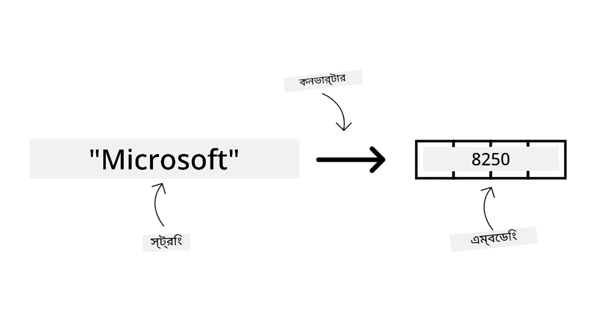

ইমেজ উৎপাদন মডেল হলো এমন মডেল যা ছবি তৈরি করে। এগুলো প্রায়ই ছবি সম্পাদনা, ছবি সংশ্লেষ এবং ছবি অনুবাদে ব্যবহৃত হয়। ইমেজ উৎপাদন মডেলগুলো প্রায়ই বড় ডাটাসেট যেমন [LAION-5B](https://laion.ai/blog/laion-5b/?WT.mc_id=academic-105485-koreyst) এর উপর প্রশিক্ষিত হয় এবং নতুন ছবি তৈরি বা বিদ্যমান ছবিতে ইনপেইন্টিং, সুপার-রেজল্যুশন, এবং কালারাইজেশন প্রযুক্তি ব্যবহার করে সম্পাদনার জন্য ব্যবহৃত হতে পারে। উদাহরণস্বরূপ [GPT Image মডেল](https://platform.openai.com/docs/guides/images?WT.mc_id=academic-105485-koreyst), [Stable Diffusion মডেল](https://github.com/Stability-AI/StableDiffusion?WT.mc_id=academic-105485-koreyst), এবং Imagen মডেল।

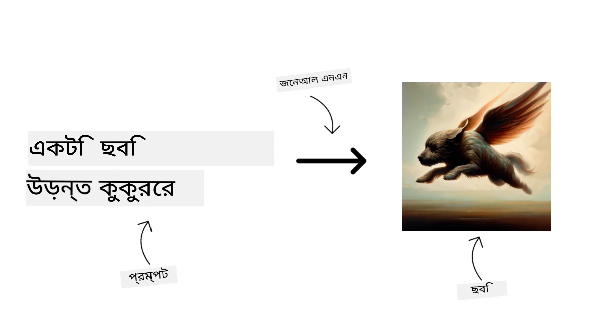

টেক্সট এবং কোড উৎপাদন মডেল হলো এমন মডেল যা টেক্সট বা কোড তৈরি করে। এগুলো প্রায়ই টেক্সট সংক্ষিপ্তকরণ, অনুবাদ এবং প্রশ্নোত্তরে ব্যবহৃত হয়। টেক্সট উৎপাদন মডেলগুলো বড় বড় টেক্সট ডাটাসেট যেমন [BookCorpus](https://www.cv-foundation.org/openaccess/content_iccv_2015/html/Zhu_Aligning_Books_and_ICCV_2015_paper.html?WT.mc_id=academic-105485-koreyst) এ প্রশিক্ষিত হয় এবং তারা নতুন টেক্সট তৈরি করতে বা প্রশ্নের উত্তর দিতে পারে। কোড উৎপাদন মডেল যেমন [CodeParrot](https://huggingface.co/codeparrot?WT.mc_id=academic-105485-koreyst) বড় বড় কোড ডাটাসেট যেমন GitHub এ প্রশিক্ষিত হয় এবং নতুন কোড তৈরি বা বিদ্যমান কোডের বাগ মেরামত করতে পারে।

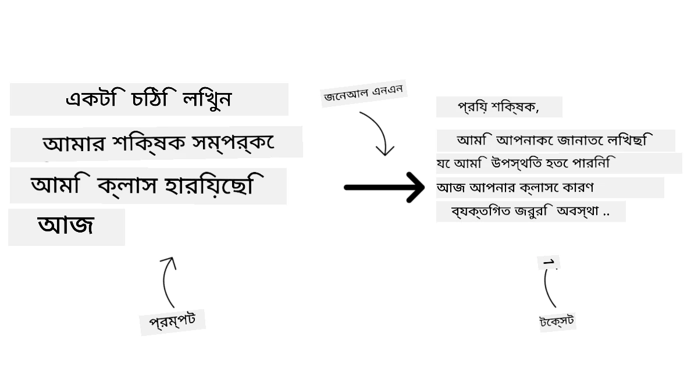

### এনকোডার-ডিকোডার বনাম কেবল ডিকোডার

এলএলএমের বিভিন্ন আর্কিটেকচারের কথা বলতে, চলুন একটি উপমা ব্যবহার করি।

ভাবুন আপনার ম্যানেজার আপনাকে একটি ছাত্রদের জন্য কুইজ লেখার কাজ দিয়েছেন। আপনার দুই সহকর্মী আছেন; একজন বিষয়বস্তু তৈরি করেন আর একজন পর্যালোচনা করেন।

বিষয়বস্তু নির্মাতা হল ডিকোডার-অনলি মডেলের মতো: তারা বিষয়ে তাকান, যা আপনি ইতিমধ্যেই লিখেছেন তা দেখে সেটির উপর ভিত্তি করে বিষয়বস্তু তৈরি চালিয়ে যান। তারা আকর্ষণীয় এবং তথ্যবহুল বিষয়বস্তু লেখায় খুব দক্ষ, কিন্তু তারা সব সময় শুদ্ধ শ্রেণীবদ্ধকরণ, তথ্য অনুসন্ধান বা এনকোডিং এর জন্য সেরা পছন্দ নয়। ডিকোডার-অনলি মডেল পরিবারের উদাহরণ হলো GPT এবং Llama মডেল।

পর্যালোচক হল এনকোডার-অনলি মডেলের মতো, তারা লেখা বিষয়বস্তু ও উত্তরগুলো দেখে সম্পর্ক বুঝে এবং প্রসঙ্গ অনুধাবন করে, কিন্তু তারা বিষয়বস্তু তৈরি করতে ভালো নয়। এনকোডার-অনলি মডেলের উদাহরণ হলো BERT।

ভাবুন এমন কেউ থাকতে পারে যিনি কুইজ তৈরি এবং পর্যালোচনা দুইই করতে পারেন, এটাই এনকোডার-ডিকোডার মডেল। কিছু উদাহরণ হলো BART এবং T5।

### সার্ভিস বনাম মডেল

এখন, চলুন সার্ভিস এবং মডেলের পার্থক্য আলোচনা করি। সার্ভিস একটি পণ্য যা ক্লাউড সার্ভিস প্রদানকারী অফার করে, এবং সাধারণত এটি মডেল, ডেটা ও অন্যান্য উপাদানের সমন্বয়। মডেল হলো সার্ভিসের মূল উপাদান, যা সাধারণত একটি ফাউন্ডেশন মডেল, যেমন একটি এলএলএম।

সার্ভিসগুলো সাধারণত প্রোডাকশনে ব্যবহারের জন্য অপ্টিমাইজড এবং মডেলের থেকে ব্যবহারে সহজ, সাধারণত গ্রাফিকাল ইউজার ইন্টারফেসের মাধ্যমে। তবে সার্ভিসগুলো সবসময় ফ্রি নয়, এগুলো ব্যবহারের জন্য সাবস্ক্রিপশন বা অর্থ প্রদান প্রয়োজন হতে পারে, যা সার্ভিস মালিকের সরঞ্জাম ও সম্পদ ব্যবহার করার বিনিময়, খরচ অপ্টিমাইজ করে এবং স্কেল করাকে সহজ করে। একটি উদাহরণ হলো [Azure OpenAI Service](https://learn.microsoft.com/azure/ai-foundry/openai/overview?WT.mc_id=academic-105485-koreyst), যা পে-এজ-ইউ-গো রেট প্ল্যান অফার করে, অর্থাৎ ব্যবহারকারীদের তাদের ব্যবহারের অনুপাতে চার্জ করা হয়। Azure OpenAI Service এন্টারপ্রাইজ-গ্রেড নিরাপত্তা এবং মডেলের ক্ষমতার উপর একটি দায়িত্বশীল AI কাঠামোও সরবরাহ করে।

মডেল হলো নিউরাল নেটওয়ার্কের আর্টিফ্যাক্ট: প্যারামিটার, ওয়েট, আর্কিটেকচার, টোকেনাইজার, এবং সমর্থনকারী কনফিগারেশন। মডেল লোকালি বা প্রাইভেট পরিবেশে চালাতে হলে উপযুক্ত হার্ডওয়্যার, সার্ভিং অবকাঠামো, মনিটরিং এবং বা একটি সামঞ্জস্যপূর্ণ ওপেন-সোর্স/ওপেন-ওয়েট লাইসেন্স অথবা একটি বাণিজ্যিক লাইসেন্স প্রয়োজন। ওপেন-ওয়েট মডেল যেমন Llama 4 অথবা Mistral মডেল নিজস্ব হোস্টিং করা যেতে পারে, তবে সেক্ষেত্রেও কম্পিউটিং শক্তি এবং অপারেশনাল দক্ষতার প্রয়োজন।

## Azure এ বিভিন্ন মডেল নিয়ে কীভাবে পরীক্ষা ও পুনরাবৃত্তি করে কার্যক্ষমতা বুঝবেন

একবার আমাদের দল বর্তমান LLMs ল্যান্ডস্কেপ অনুসন্ধান করে এবং তাদের পরিস্থিতির জন্য কিছু ভাল প্রার্থী চিহ্নিত করলে, পরবর্তী ধাপ হলো তাদের ডেটা এবং তাদের ওয়ার্কলোডে পরীক্ষা করা। এটি একটি পুনরাবৃত্তিমূলক প্রক্রিয়া, যা পরীক্ষানিরীক্ষা ও মাপজোক দ্বারা সম্পন্ন হয়।
পূর্বের অনুচ্ছেদে আমরা যে বেশিরভাগ মডেলের কথা উল্লেখ করেছি (OpenAI মডেল, Llama 4 এবং Mistral-এর মত ওপেন-ওয়েট মডেল, এবং Hugging Face মডেল) সেগুলি [Microsoft Foundry Models](https://learn.microsoft.com/azure/foundry/concepts/foundry-models-overview?WT.mc_id=academic-105485-koreyst)-এ উপলব্ধ।

[Microsoft Foundry](https://learn.microsoft.com/azure/foundry/what-is-foundry?WT.mc_id=academic-105485-koreyst), পূর্বে Azure AI Studio/Azure AI Foundry নামে পরিচিত, AI অ্যাপ এবং এজেন্ট তৈরির জন্য একটি এককীকৃত Azure প্ল্যাটফর্ম। এটি বিকাশকারীদের পরীক্ষানিরীক্ষা ও মূল্যায়ন থেকে শুরু করে স্থাপন, পর্যবেক্ষণ এবং শাসন পর্যন্ত লাইফসাইকেল পরিচালনা করতে সাহায্য করে। Microsoft Foundry-র মডেল ক্যাটালগ ব্যবহারকারীকে নিম্নলিখিত সুবিধা দেয়:

- ক্যাটালগ থেকে আগ্রহের ফাউন্ডেশন মডেল খুঁজে বের করুন, যার মধ্যে Azure বিক্রিত মডেল এবং অংশীদার ও কমিউনিটি প্রদানকারীদের মডেল রয়েছে। ব্যবহারকারীরা টাস্ক, প্রদানকারী, লাইসেন্স, স্থাপন বিকল্প, বা নাম দ্বারা ফিল্টার করতে পারেন।

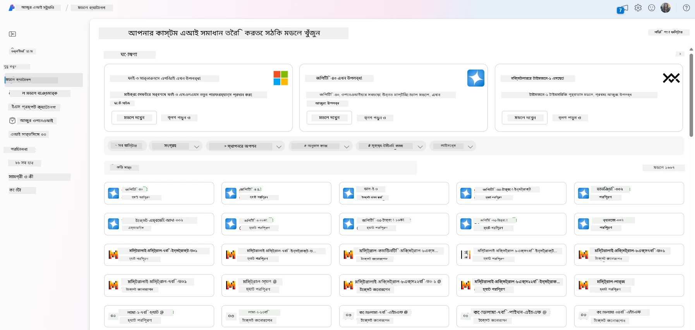

- মডেল কার্ড পর্যালোচনা করুন, যার মধ্যে রয়েছে উদ্দেশ্যযুক্ত ব্যবহার ও প্রশিক্ষণ ডেটার বিস্তারিত বিবরণ, কোড নমুনা এবং অভ্যন্তরীণ মূল্যায়ন লাইব্রেরির উপর মূল্যায়ন ফলাফল।

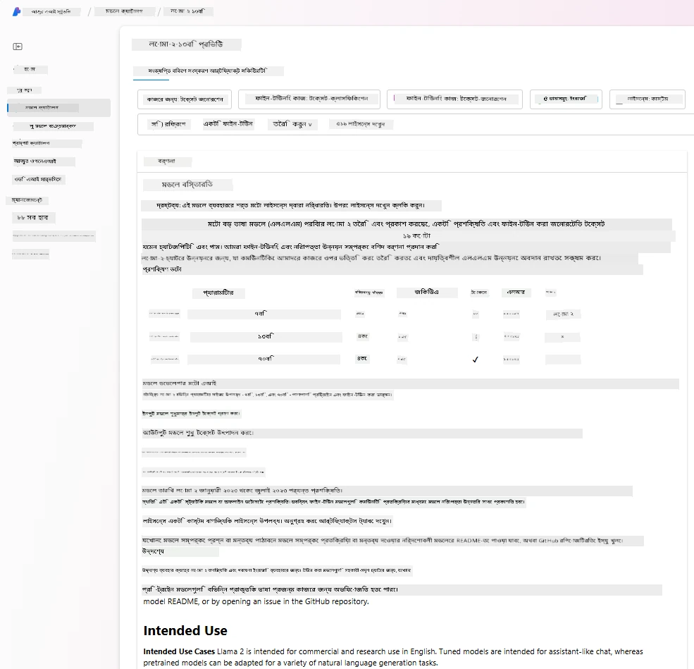

- শিল্পে উপলব্ধ মডেল এবং ডেটাসেটগুলোর মধ্যে বেঞ্চমার্ক তুলনা করুন, যাতে এটি ব্যবসায়িক পরিস্থিতির সাথে মানানসই কি না সেটি মূল্যায়ন করা যায়, [Model Benchmarks](https://learn.microsoft.com/azure/ai-foundry/concepts/model-benchmarks?WT.mc_id=academic-105485-koreyst) প্যানের মাধ্যমে।

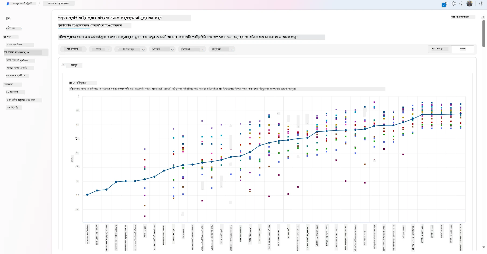

- Microsoft Foundry-র পরীক্ষানিরীক্ষা ও ট্র্যাকিং ক্ষমতা ব্যবহার করে কাস্টম প্রশিক্ষণ ডেটা দিয়ে সমর্থিত মডেলগুলোকে নির্দিষ্ট ওয়ার্কলোডে পারফরমেন্স উন্নত করার জন্য ফাইন-টিউন করুন।

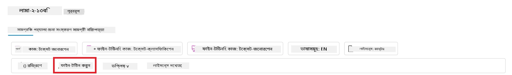

- মডেলের মূল প্রি-ট্রেইনড সংস্করণ বা ফাইন-টিউন করা সংস্করণকে রিমোট রিয়েল-টাইম ইনফারেন্স এণ্ডপয়েন্টে স্থানান্তর করুন, ম্যানেজড কম্পিউট বা সার্ভারলেস স্থাপন বিকল্প ব্যবহার করে, যাতে অ্যাপ্লিকেশনগুলো এটি ব্যবহার করতে পারে।

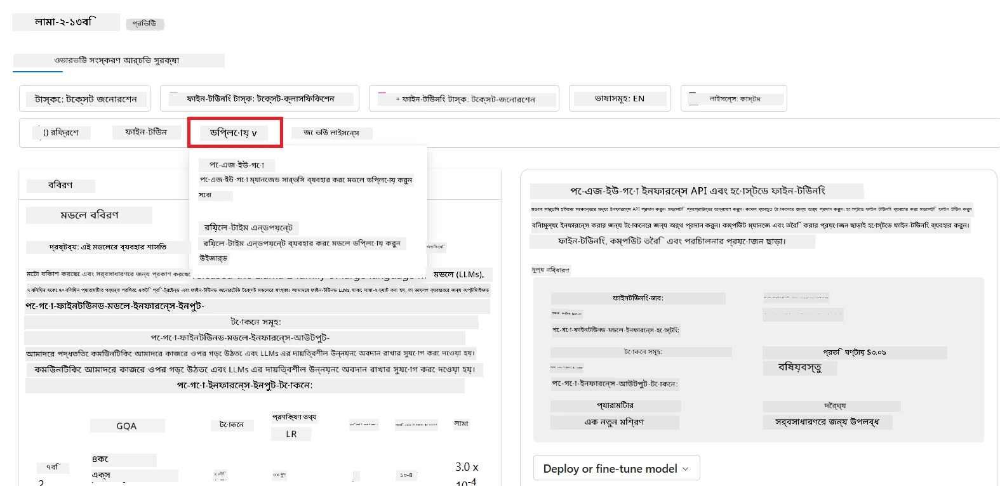

> [!NOTE]
> ক্যাটালগের সব মডেল বর্তমানে ফাইন-টিউনিং এবং/অথবা পে-অ্যাস-ইউ-গো স্থাপনার জন্য উপলব্ধ নয়। মডেল কার্ডে মডেলের ক্ষমতা ও সীমাবদ্ধতার বিস্তারিত বিবরণ দেখুন।

## LLM ফলাফল উন্নত করা

আমরা আমাদের স্টার্টআপ দলের সাথে বিভিন্ন ধরনের LLM এবং একটি ক্লাউড প্ল্যাটফর্ম (Microsoft Foundry) অন্বেষণ করেছি, যা আমাদের বিভিন্ন মডেল তুলনা করতে, পরীক্ষা ডেটায় মূল্যায়ন করতে, পারফরমেন্স উন্নত করতে এবং ইনফারেন্স এণ্ডপয়েন্টে স্থাপন করতে সক্ষম করে।

কিন্তু কখন তারা একটি প্রি-ট্রেইনড মডেলের পরিবর্তে ফাইন-টিউনিং করা মডেল বিবেচনা করবেন? নির্দিষ্ট ওয়ার্কলোডে মডেল পারফরমেন্স উন্নত করার জন্য কি অন্য কোনো পদ্ধতি আছে?

একটি ব্যবসায় LLM থেকে প্রয়োজনীয় ফলাফল পাওয়ার জন্য অনেক রকম পন্থা ব্যবহার করতে পারে। প্রোডাকশনে LLM স্থাপনের সময় বিভিন্ন প্রশিক্ষণের মাত্রার বিভিন্ন ধরনের মডেল বেছে নেওয়া যায়, যার বিভিন্ন জটিলতা, খরচ এবং গুণগত মান আছে। এখানে কিছু ভিন্ন পদ্ধতি রয়েছে:

- **কন্টেক্সট সহ প্রম্পট ইঞ্জিনিয়ারিং**। মূল ধারণা হলো যথেষ্ট প্রাসঙ্গিক তথ্য প্রদান করা যাতে প্রম্পট করার সময় আপনি প্রয়োজনীয় সঠিক উত্তর পান।

- **রিট্রিভাল অগমেন্টেড জেনারেশন, RAG**। আপনার ডেটা যেমন একটি ডেটাবেস বা ওয়েব এণ্ডপয়েন্টে থাকতে পারে, প্রম্পটের সময় এই ডেটা বা এর একটি অংশ অন্তর্ভুক্ত করতে চাইলে, আপনি প্রাসঙ্গিক তথ্য আনতে পারেন এবং তা ব্যবহারকারীর প্রম্পটের অংশ করতে পারেন।

- **ফাইন-টিউনড মডেল**। এতে আপনি আপনার নিজস্ব ডেটায় মডেলটিকে আরও প্রশিক্ষণ দিয়েছেন, যা মডেলকে আপনার চাহিদার জন্য আরও সুনির্দিষ্ট এবং প্রতিক্রিয়াশীল করে তোলে তবে খরচ বেশি হতে পারে।

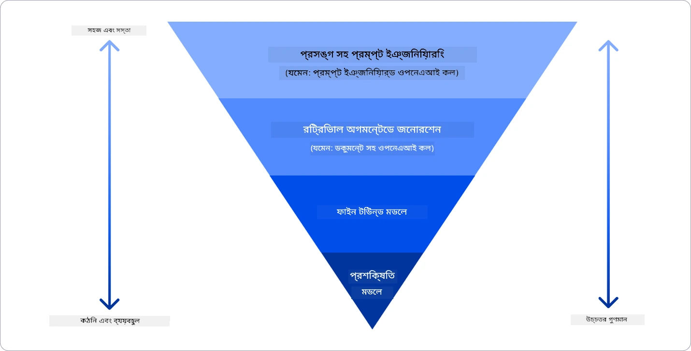

চিত্র উৎস: [Four Ways that Enterprises Deploy LLMs | Fiddler AI Blog](https://www.fiddler.ai/blog/four-ways-that-enterprises-deploy-llms?WT.mc_id=academic-105485-koreyst)

### কন্টেক্সট সহ প্রম্পট ইঞ্জিনিয়ারিং

প্রি-ট্রেইনড LLM সাধারণ স্বাভাবিক ভাষার কাজগুলিতে খুব ভাল কাজ করে, এমনকি একটি ছোট প্রম্পট যেমন একটি বাক্য সম্পূর্ণ করা বা একটি প্রশ্নের মাধ্যমে – যাকে "জিরো-শট" লার্নিং বলা হয়।

তবে, ব্যবহারকারী যতটা বিশদ অনুরোধ ও উদাহরণ দ্বারা তাদের প্রশ্ন ফ্রেম করতে পারেন – অর্থাৎ কন্টেক্সট – ততই উত্তর হবে আরও সঠিক এবং ব্যবহারকারীর প্রত্যাশার কাছাকাছি। এই ক্ষেত্রে, যদি শুধু একটি উদাহরণ থাকে তবে এটিকে "ওয়ান-শট" লার্নিং বলা হয় এবং একাধিক উদাহরণ থাকলে "ফিউ শট লার্নিং" বলা হয়।
কন্টেক্সট সহ প্রম্পট ইঞ্জিনিয়ারিং শুরু করার জন্য সবচেয়ে খরচ-সাশ্রয়ী পদ্ধতি।

### রিট্রিভাল অগমেন্টেড জেনারেশন (RAG)

LLM-দের সীমাবদ্ধতা আছে যে তারা শুধুমাত্র তাদের প্রশিক্ষণের সময় ব্যবহৃত ডেটা ব্যবহার করতে পারে উত্তর তৈরির জন্য। অর্থাৎ, তারা তাদের প্রশিক্ষণের পর ঘটে যাওয়া তথ্যের সম্পর্কে কিছু জানে না, এবং তারা বেসরকারি তথ্য (যেমন কোম্পানির ডেটা) অ্যাক্সেস করতে পারে না।
এটি RAG দ্বারা অতিক্রম করা যায়, যা প্রম্পটকে বহিরাগত ডেটার অংশ (ডকুমেন্টের অংশ) সহ বাড়িয়ে দেয়, প্রম্পটের দৈর্ঘ্যের সীমা বিবেচনায় রেখে। এটি ভেক্টর ডাটাবেস টুলস যেমন [Azure Vector Search](https://learn.microsoft.com/azure/search/vector-search-overview?WT.mc_id=academic-105485-koreyst) দ্বারা সমর্থিত, যা প্রিসেট ডেটা উৎস থেকে প্রাসঙ্গিক অংশগুলি আহরণ করে প্রম্পটের কন্টেক্সটে যোগ করে।

এই প্রযুক্তি বিশেষভাবে উপকারী যখন একটি ব্যবসার কাছে যথেষ্ট ডেটা, প্রয়োজনীয় সময় বা সম্পদ নেই ফাইন-টিউনিং করার জন্য, তবুও তারা নির্দিষ্ট কাজের ওয়ার্কলোডে পারফরমেন্স উন্নত করতে চায় এবং ভুল, পুরানো বা অপ্রমাণিত উত্তরের ঝুঁকি কমাতে চায়।

### ফাইন-টিউনড মডেল

ফাইন-টিউনিং একটি প্রক্রিয়া যা ট্রান্সফার লার্নিং ব্যবহার করে মডেলটিকে একটি নির্দিষ্ট টাস্ক বা সমস্যার জন্য ‘অ্যাডাপ্ট’ করে। ফিউ শট লার্নিং এবং RAG থেকে পৃথকভাবে, এটি একটি নতুন মডেল তৈরি করে যার আপডেটেড ওজন ও বায়াস থাকে। এর জন্য প্রশিক্ষণের উদাহরণ সেট লাগে, যা একটি ইনপুট (প্রম্পট) এবং তার সংশ্লিষ্ট আউটপুট (সম্পূর্ণতা) নিয়ে গঠিত।
এটি প্রাধান্যযোগ্য পদ্ধতি হবে যদি:

- **ছোট প্রতিষ্ঠিত টাস্ক-নির্দিষ্ট মডেল ব্যবহার**। একটি ব্যবসা বড় ফ্রন্টিয়ার মডেলকে বারংবার প্রম্পট দেওয়ার পরিবর্তে একটি ছোট মডেল একটি সংকীর্ণ টাস্কের জন্য ফাইন-টিউন করতে চায়, যা আরও সাশ্রয়ী এবং দ্রুত সমাধান দেয়।

- **বিলম্ব বিবেচনা**। একটি নির্দিষ্ট ব্যবহারের জন্য বিলম্ব গুরুত্বপূর্ণ, তাই খুব দীর্ঘ প্রম্পট ব্যবহার করা সম্ভব নয় বা মডেল থেকে শেখার জন্য প্রয়োজনীয় উদাহরণের সংখ্যা প্রম্পট দৈর্ঘ্যের সীমার মধ্যে ফিট করে না।

- **স্থায়ী আচরণের অভিযোজন**। একটি ব্যবসার অনেক উচ্চ-মানের উদাহরণ আছে এবং তারা চায় মডেলটি ধারাবাহিকভাবে একটি টাস্কের ধরণ, আউটপুট ফরম্যাট, টোন, বা ডোমেন-নির্দিষ্ট শৈলী অনুসরণ করুক। যদি মূল সমস্যা হয় নতুন তথ্য বা প্রাইভেট জ্ঞান যা প্রায়ই পরিবর্তিত হয়, তবে কেবল ফাইন-টিউনিংয়ের উপর নির্ভর না করে RAG ব্যবহার করুন।

### প্রশিক্ষিত মডেল

সম্পূর্ণ শূন্য থেকে LLM প্রশিক্ষণ দেওয়া ছাড়াই সবচেয়ে কঠিন এবং জটিল পদ্ধতি, যার জন্য বিপুল পরিমাণ ডেটা, দক্ষ সম্পদ এবং উপযুক্ত কম্পিউটেশনাল শক্তি প্রয়োজন। এই বিকল্পটি শুধুমাত্র তখন বিবেচনা করা উচিত যখন একটি ব্যবসার ডোমেন-নির্দিষ্ট ব্যবহারের কেস এবং বড় পরিমাণে ডোমেইন-কেন্দ্রিক ডেটা থাকে।

## জ্ঞান যাচাই

LLM কমপ্লিশন ফলাফল উন্নতির জন্য কী একটি ভাল পদ্ধতি হতে পারে?

১. কন্টেক্সট সহ প্রম্পট ইঞ্জিনিয়ারিং
১. RAG
১. ফাইন-টিউনড মডেল

উত্তর: এই তিনটি পদ্ধতি সাহায্য করতে পারে। দ্রুত উন্নতির জন্য শুরু করুন কন্টেক্সটসহ প্রম্পট ইঞ্জিনিয়ারিং দিয়ে, এবং যখন মডেলের জন্য সাম্প্রতিক তথ্য বা ব্যক্তিগত ব্যবসায়িক ডেটা প্রয়োজন তখন RAG ব্যবহার করুন। যথেষ্ট উচ্চ-মানের উদাহরণ থাকলে এবং মডেলটিকে ধারাবাহিকভাবে একটি টাস্ক, ফরম্যাট, টোন বা ডোমেইন প্যাটার্ন অনুসরণ করানো দরকার হলে ফাইন-টিউনিং বেছে নিন।

## 🚀 চ্যালেঞ্জ

আপনার ব্যবসার জন্য [RAG কীভাবে ব্যবহার করবেন](https://learn.microsoft.com/azure/search/retrieval-augmented-generation-overview?WT.mc_id=academic-105485-koreyst) তা আরও পড়ুন।

## অসাধারণ কাজ, আপনার শেখা চালিয়ে যান

এই পাঠ শেষ করার পর আমাদের [Generative AI Learning collection](https://aka.ms/genai-collection?WT.mc_id=academic-105485-koreyst) দেখুন যাতে আপনি আপনার Generative AI জ্ঞান আরও উন্নীত করতে পারেন!

পাঠ ৩-এ যান যেখানে আমরা দেখব কিভাবে [দায়িত্বপূর্ণভাবে Generative AI দিয়ে নির্মাণ করবেন](../03-using-generative-ai-responsibly/README.md?WT.mc_id=academic-105485-koreyst)!

---

<!-- CO-OP TRANSLATOR DISCLAIMER START -->
**অস্বীকৃতি**:
এই নথিটি AI অনুবাদ পরিষেবা [Co-op Translator](https://github.com/Azure/co-op-translator) ব্যবহার করে অনূদিত হয়েছে। যদিও আমরা শুদ্ধতার জন্য চেষ্টা করি, অনুগ্রহ করে মনে রাখবেন যে স্বয়ংক্রিয় অনুবাদে ত্রুটি বা অসঙ্গতি থাকতে পারে। মূল নথিটি তার স্বভাষায় কর্তৃত্বপূর্ণ উৎস হিসেবে বিবেচিত হওয়া উচিত। গুরুত্বপূর্ণ তথ্যের জন্য পেশাদার মানব অনুবাদ সুপারিশ করা হয়। এই অনুবাদের ব্যবহারে প্রয়োজনীয় ভুল বোঝাবুঝি বা ভুল ব্যাখ্যার জন্য আমরা দায়বদ্ধ নই।
<!-- CO-OP TRANSLATOR DISCLAIMER END -->