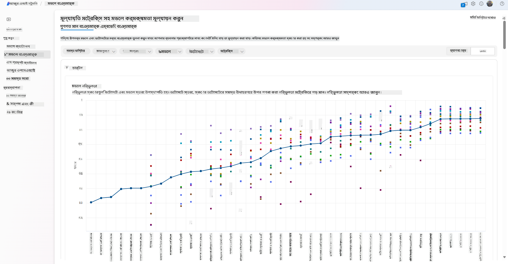
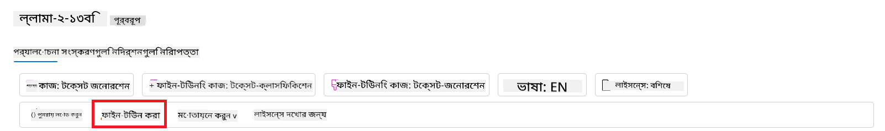
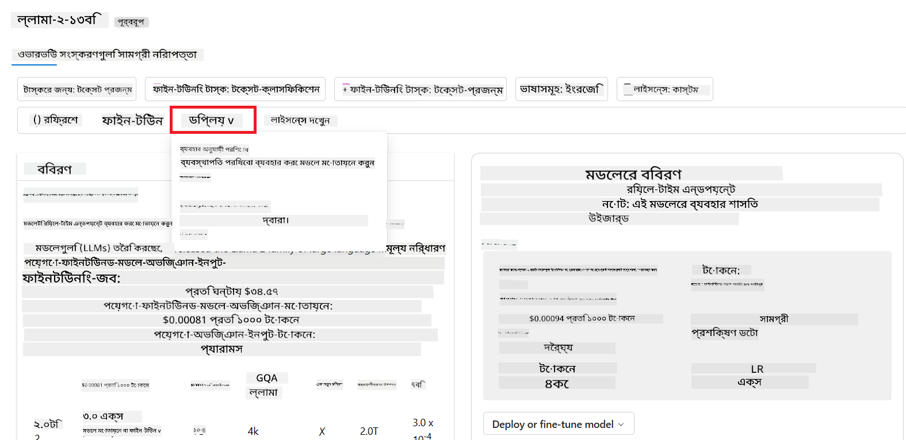
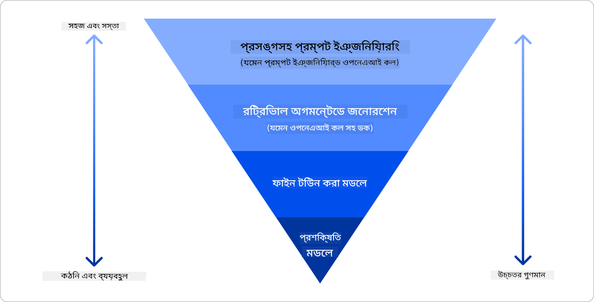

<!--
CO_OP_TRANSLATOR_METADATA:
{
  "original_hash": "e2f686f2eb794941761252ac5e8e090b",
  "translation_date": "2025-06-25T10:27:09+00:00",
  "source_file": "02-exploring-and-comparing-different-llms/README.md",
  "language_code": "bn"
}
-->
# বিভিন্ন LLM অন্বেষণ এবং তুলনা করা

> _এই পাঠের ভিডিও দেখতে উপরের ছবিতে ক্লিক করুন_

পূর্ববর্তী পাঠে, আমরা দেখেছি কীভাবে জেনারেটিভ AI প্রযুক্তির দৃশ্যপট পরিবর্তন করছে, কীভাবে লার্জ ল্যাঙ্গুয়েজ মডেলস (LLMs) কাজ করে এবং কীভাবে আমাদের স্টার্টআপের মতো একটি ব্যবসা তাদের ব্যবহার ক্ষেত্রে প্রয়োগ করে এবং বৃদ্ধি পেতে পারে! এই অধ্যায়ে, আমরা বিভিন্ন ধরনের বড় ভাষার মডেল (LLMs) তুলনা করতে যাচ্ছি যাতে তাদের সুবিধা এবং অসুবিধাগুলি বোঝা যায়।

আমাদের স্টার্টআপের পরবর্তী পদক্ষেপ হল বর্তমান LLM গুলির দৃশ্যপট অন্বেষণ করা এবং আমাদের ব্যবহারের ক্ষেত্রে কোনটি উপযুক্ত তা বোঝা।

## ভূমিকা

এই পাঠে অন্তর্ভুক্ত থাকবে:

- বর্তমান দৃশ্যপটে বিভিন্ন ধরনের LLM।
- আপনার ব্যবহারের ক্ষেত্রে Azure-এ বিভিন্ন মডেল পরীক্ষা করা, পুনরাবৃত্তি করা এবং তুলনা করা।
- একটি LLM কীভাবে স্থাপন করা যায়।

## শেখার লক্ষ্য

এই পাঠ শেষ করার পর, আপনি সক্ষম হবেন:

- আপনার ব্যবহারের ক্ষেত্রে সঠিক মডেল নির্বাচন করতে।
- কীভাবে আপনার মডেল পরীক্ষা করা, পুনরাবৃত্তি করা এবং কর্মক্ষমতা উন্নত করা যায় তা বোঝা।
- কীভাবে ব্যবসা মডেল স্থাপন করে তা জানা।

## বিভিন্ন ধরনের LLM বোঝা

LLMs তাদের স্থাপত্য, প্রশিক্ষণ ডেটা এবং ব্যবহারের ক্ষেত্রে ভিত্তিতে একাধিক শ্রেণীবিভাগ থাকতে পারে। এই পার্থক্যগুলি বোঝা আমাদের স্টার্টআপকে সঠিক মডেল নির্বাচন করতে সাহায্য করবে এবং কীভাবে কর্মক্ষমতা পরীক্ষা, পুনরাবৃত্তি এবং উন্নত করতে হবে তা বোঝাবে।

অনেক ধরনের LLM মডেল আছে, আপনার মডেল পছন্দ নির্ভর করে আপনি কীসের জন্য তাদের ব্যবহার করতে চান, আপনার ডেটা, আপনি কতটা খরচ করতে প্রস্তুত এবং আরও অনেক কিছু।

আপনি যদি মডেলগুলি পাঠ্য, অডিও, ভিডিও, চিত্র তৈরি ইত্যাদির জন্য ব্যবহার করতে চান কিনা তা নির্ভর করে, আপনি একটি ভিন্ন ধরনের মডেল বেছে নিতে পারেন।

- **অডিও এবং বক্তৃতা স্বীকৃতি**। এই উদ্দেশ্যে, হুইস্পার-টাইপ মডেলগুলি একটি দুর্দান্ত পছন্দ কারণ তারা সাধারণ উদ্দেশ্যে এবং বক্তৃতা স্বীকৃতির জন্য লক্ষ্যযুক্ত। এটি বৈচিত্র্যময় অডিওতে প্রশিক্ষিত এবং বহুভাষিক বক্তৃতা স্বীকৃতি সম্পাদন করতে পারে। [Whisper টাইপ মডেল সম্পর্কে আরও জানুন এখানে](https://platform.openai.com/docs/models/whisper?WT.mc_id=academic-105485-koreyst)।

- **চিত্র তৈরি**। চিত্র তৈরির জন্য, DALL-E এবং Midjourney দুটি খুব পরিচিত পছন্দ। DALL-E Azure OpenAI দ্বারা অফার করা হয়। [DALL-E সম্পর্কে আরও পড়ুন এখানে](https://platform.openai.com/docs/models/dall-e?WT.mc_id=academic-105485-koreyst) এবং এই পাঠ্যক্রমের অধ্যায় 9-এ।

- **পাঠ্য তৈরি**। বেশিরভাগ মডেল পাঠ্য তৈরির জন্য প্রশিক্ষিত এবং আপনার কাছে GPT-3.5 থেকে GPT-4 পর্যন্ত প্রচুর পছন্দ রয়েছে। তারা বিভিন্ন খরচে আসে যেখানে GPT-4 সবচেয়ে ব্যয়বহুল। [Azure OpenAI প্লেগ্রাউন্ড](https://oai.azure.com/portal/playground?WT.mc_id=academic-105485-koreyst) দেখে নেওয়া মূল্যবান যে কোন মডেলগুলি আপনার প্রয়োজনের জন্য ক্ষমতা এবং খরচের দিক থেকে সবচেয়ে ভাল মানায়।

- **মাল্টি-মোডালিটি**। আপনি যদি ইনপুট এবং আউটপুটে একাধিক ধরনের ডেটা পরিচালনা করতে চান, তাহলে আপনি [gpt-4 টার্বো উইথ ভিশন বা gpt-4o](https://learn.microsoft.com/azure/ai-services/openai/concepts/models#gpt-4-and-gpt-4-turbo-models?WT.mc_id=academic-105485-koreyst) মডেলগুলিতে দেখতে পারেন - OpenAI মডেলের সর্বশেষ প্রকাশনা - যা প্রাকৃতিক ভাষা প্রক্রিয়াকরণকে ভিজ্যুয়াল বোঝার সাথে একত্রিত করতে সক্ষম, মাল্টি-মোডাল ইন্টারফেসের মাধ্যমে মিথস্ক্রিয়া সক্ষম করে।

একটি মডেল নির্বাচন করা মানে আপনি কিছু মৌলিক ক্ষমতা পান, যা যথেষ্ট নাও হতে পারে। প্রায়ই আপনার কাছে কোম্পানির নির্দিষ্ট ডেটা থাকে যা আপনাকে কোনওভাবে LLM কে জানাতে হবে। সেই বিষয়ে আরও আসন্ন বিভাগে।

### ফাউন্ডেশন মডেল বনাম LLMs

ফাউন্ডেশন মডেল শব্দটি [স্ট্যানফোর্ড গবেষকরা তৈরি করেছিলেন](https://arxiv.org/abs/2108.07258?WT.mc_id=academic-105485-koreyst) এবং এটি একটি AI মডেল হিসাবে সংজ্ঞায়িত করেছেন যা কিছু মানদণ্ড অনুসরণ করে, যেমন:

- **তারা অযৌক্তিক শিক্ষণ বা স্ব-অযৌক্তিক শিক্ষণ ব্যবহার করে প্রশিক্ষিত হয়**, অর্থাৎ তারা লেবেলবিহীন মাল্টি-মোডাল ডেটায় প্রশিক্ষিত হয় এবং তাদের প্রশিক্ষণ প্রক্রিয়ার জন্য ডেটার মানবীয় ব্যাখ্যা বা লেবেলিং প্রয়োজন হয় না।
- **তারা খুব বড় মডেল**, বিলিয়ন প্যারামিটারে প্রশিক্ষিত খুব গভীর নিউরাল নেটওয়ার্কের উপর ভিত্তি করে।
- **তারা সাধারণত অন্যান্য মডেলের জন্য একটি 'ভিত্তি' হিসাবে কাজ করার উদ্দেশ্যে**, অর্থাৎ তারা অন্যান্য মডেল তৈরির জন্য একটি প্রাথমিক বিন্দু হিসাবে ব্যবহার করা যেতে পারে, যা সূক্ষ্ম-টিউনিং দ্বারা করা যেতে পারে।

এই পার্থক্য আরও স্পষ্ট করার জন্য, আসুন ChatGPT কে উদাহরণ হিসাবে গ্রহণ করি। ChatGPT এর প্রথম সংস্করণ তৈরি করতে, GPT-3.5 নামক একটি মডেল ফাউন্ডেশন মডেল হিসাবে কাজ করেছে। এর মানে হল OpenAI কিছু চ্যাট-নির্দিষ্ট ডেটা ব্যবহার করেছে GPT-3.5 এর একটি টিউনড সংস্করণ তৈরি করতে যা কথোপকথনের পরিস্থিতিতে ভাল পারফর্ম করতে বিশেষায়িত ছিল, যেমন চ্যাটবট।

### ওপেন সোর্স বনাম মালিকানাধীন মডেল

LLMs কে শ্রেণীবদ্ধ করার আরেকটি উপায় হল তারা ওপেন সোর্স কিনা বা মালিকানাধীন।

ওপেন সোর্স মডেলগুলি এমন মডেল যা জনসাধারণের জন্য উপলব্ধ করা হয় এবং যে কেউ ব্যবহার করতে পারে। তারা প্রায়ই যে কোম্পানি তাদের তৈরি করেছে বা গবেষণা সম্প্রদায় দ্বারা উপলব্ধ করা হয়। এই মডেলগুলি LLMs-এ বিভিন্ন ব্যবহারের ক্ষেত্রে পরিদর্শন, পরিবর্তন এবং কাস্টমাইজ করার অনুমতি দেওয়া হয়। তবে, তারা সর্বদা উত্পাদন ব্যবহারের জন্য অপ্টিমাইজ করা হয় না এবং মালিকানাধীন মডেলের মতো কার্যকরী নাও হতে পারে। এছাড়াও, ওপেন সোর্স মডেলের জন্য অর্থায়ন সীমিত হতে পারে এবং তারা দীর্ঘমেয়াদে রক্ষণাবেক্ষণ নাও হতে পারে বা সর্বশেষ গবেষণার সাথে আপডেট নাও হতে পারে। জনপ্রিয় ওপেন সোর্স মডেলের উদাহরণগুলির মধ্যে রয়েছে [Alpaca](https://crfm.stanford.edu/2023/03/13/alpaca.html?WT.mc_id=academic-105485-koreyst), [Bloom](https://huggingface.co/bigscience/bloom) এবং [LLaMA](https://llama.meta.com)।

মালিকানাধীন মডেলগুলি এমন মডেল যা একটি কোম্পানির মালিকানাধীন এবং জনসাধারণের জন্য উপলব্ধ নয়। এই মডেলগুলি প্রায়শই উত্পাদন ব্যবহারের জন্য অপ্টিমাইজ করা হয়। তবে, তাদের বিভিন্ন ব্যবহারের ক্ষেত্রে পরিদর্শন, পরিবর্তন বা কাস্টমাইজ করার অনুমতি নেই। এছাড়াও, তারা সর্বদা বিনামূল্যে উপলব্ধ নয় এবং ব্যবহার করার জন্য সাবস্ক্রিপশন বা অর্থপ্রদান প্রয়োজন হতে পারে। এছাড়াও, ব্যবহারকারীদের মডেল প্রশিক্ষণের জন্য ব্যবহৃত ডেটার উপর নিয়ন্ত্রণ নেই, যার অর্থ হল তাদের ডেটা গোপনীয়তা এবং AI এর দায়িত্বশীল ব্যবহারের প্রতিশ্রুতি নিশ্চিত করার জন্য মডেল মালিকের উপর আস্থা রাখা উচিত। জনপ্রিয় মালিকানাধীন মডেলের উদাহরণগুলির মধ্যে রয়েছে [OpenAI মডেল](https://platform.openai.com/docs/models/overview?WT.mc_id=academic-105485-koreyst), [Google Bard](https://sapling.ai/llm/bard?WT.mc_id=academic-105485-koreyst) বা [Claude 2](https://www.anthropic.com/index/claude-2?WT.mc_id=academic-105485-koreyst)।

### এম্বেডিং বনাম ইমেজ জেনারেশন বনাম টেক্সট এবং কোড জেনারেশন

LLMs তাদের দ্বারা উত্পাদিত আউটপুট দ্বারা শ্রেণীবদ্ধ করা যেতে পারে।

এম্বেডিংগুলি এমন মডেলের একটি সেট যা পাঠ্যকে একটি সংখ্যাসূচক রূপে রূপান্তর করতে পারে, যাকে এম্বেডিং বলা হয়, যা ইনপুট পাঠ্যের একটি সংখ্যাসূচক উপস্থাপনা। এম্বেডিংগুলি মেশিনগুলির জন্য শব্দ বা বাক্যের মধ্যে সম্পর্কগুলি বোঝা সহজ করে তোলে এবং অন্যান্য মডেলগুলির দ্বারা ইনপুট হিসাবে গ্রহণ করা যেতে পারে, যেমন শ্রেণীবিভাজন মডেল, বা ক্লাস্টারিং মডেল যেগুলি সংখ্যাসূচক ডেটাতে আরও ভাল পারফর্ম করে। এম্বেডিং মডেলগুলি প্রায়শই ট্রান্সফার লার্নিংয়ের জন্য ব্যবহৃত হয়, যেখানে একটি মডেল একটি বিকল্প কাজের জন্য তৈরি করা হয় যার জন্য প্রচুর পরিমাণে ডেটা রয়েছে, এবং তারপরে মডেল ওজন (এম্বেডিং) অন্যান্য ডাউনস্ট্রিম কাজের জন্য পুনরায় ব্যবহার করা হয়। এই শ্রেণীর একটি উদাহরণ হল [OpenAI embeddings](https://platform.openai.com/docs/models/embeddings?WT.mc_id=academic-105485-koreyst)।

চিত্র তৈরি মডেলগুলি এমন মডেল যা চিত্র তৈরি করে। এই মডেলগুলি প্রায়শই চিত্র সম্পাদনা, চিত্র সংশ্লেষণ এবং চিত্র অনুবাদের জন্য ব্যবহৃত হয়। চিত্র তৈরির মডেলগুলি প্রায়শই বড় ডেটাসেটের চিত্রগুলিতে প্রশিক্ষিত হয়, যেমন [LAION-5B](https://laion.ai/blog/laion-5b/?WT.mc_id=academic-105485-koreyst), এবং নতুন চিত্র তৈরি করতে বা বিদ্যমান চিত্রগুলিকে ইনপেইন্টিং, সুপার-রেজোলিউশন এবং রঙকরণ কৌশলগুলি দিয়ে সম্পাদনা করতে ব্যবহৃত হতে পারে। উদাহরণগুলির মধ্যে রয়েছে [DALL-E-3](https://openai.com/dall-e-3?WT.mc_id=academic-105485-koreyst) এবং [Stable Diffusion মডেলগুলি](https://github.com/Stability-AI/StableDiffusion?WT.mc_id=academic-105485-koreyst)।

পাঠ্য এবং কোড জেনারেশন মডেলগুলি এমন মডেল যা পাঠ্য বা কোড তৈরি করে। এই মডেলগুলি প্রায়শই পাঠ্য সংক্ষিপ্তকরণ, অনুবাদ এবং প্রশ্ন উত্তর দেওয়ার জন্য ব্যবহৃত হয়। পাঠ্য তৈরি মডেলগুলি প্রায়শই বড় ডেটাসেটের পাঠ্যে প্রশিক্ষিত হয়, যেমন [BookCorpus](https://www.cv-foundation.org/openaccess/content_iccv_2015/html/Zhu_Aligning_Books_and_ICCV_2015_paper.html?WT.mc_id=academic-105485-koreyst), এবং নতুন পাঠ্য তৈরি করতে বা প্রশ্নের উত্তর দিতে ব্যবহৃত হতে পারে। কোড তৈরি মডেলগুলি, যেমন [CodeParrot](https://huggingface.co/codeparrot?WT.mc_id=academic-105485-koreyst), প্রায়শই বড় ডেটাসেটের কোডে প্রশিক্ষিত হয়, যেমন GitHub, এবং নতুন কোড তৈরি করতে বা বিদ্যমান কোডের বাগগুলি ঠিক করতে ব্যবহৃত হতে পারে।

### এনকোডার-ডিকোডার বনাম শুধুমাত্র ডিকোডার

LLMs এর বিভিন্ন ধরনের স্থাপত্য সম্পর্কে কথা বলতে, আসুন একটি উপমা ব্যবহার করি।

ধরুন আপনার ম্যানেজার আপনাকে শিক্ষার্থীদের জন্য একটি কুইজ লেখার কাজ দিয়েছেন। আপনার দুই সহকর্মী আছে; একজন বিষয়বস্তু তৈরি করার দায়িত্বে এবং অন্যজন তাদের পর্যালোচনা করার দায়িত্বে।

বিষয়বস্তু সৃষ্টিকর্তা হল একটি শুধুমাত্র ডিকোডার মডেলের মতো, তারা বিষয়টি দেখতে পারে এবং আপনি ইতিমধ্যে যা লিখেছেন তা দেখতে পারে এবং তার উপর ভিত্তি করে একটি কোর্স লিখতে পারে। তারা আকর্ষণীয় এবং তথ্যপূর্ণ বিষয়বস্তু লেখার ক্ষেত্রে খুব ভাল, কিন্তু তারা বিষয় এবং শেখার উদ্দেশ্যগুলি বোঝার ক্ষেত্রে খুব ভাল নয়। শুধুমাত্র ডিকোডার মডেলের কিছু উদাহরণ হল GPT পরিবারের মডেল, যেমন GPT-3।

পর্যালোচক হল একটি শুধুমাত্র এনকোডার মডেলের মতো, তারা লেখা কোর্স এবং উত্তরগুলি দেখে, তাদের মধ্যে সম্পর্ক লক্ষ্য করে এবং প্রসঙ্গ বোঝে, কিন্তু তারা বিষয়বস্তু তৈরি করতে খুব ভাল নয়। শুধুমাত্র এনকোডার মডেলের একটি উদাহরণ হবে BERT।

ধরুন আমাদের এমন কেউ আছে যে কুইজ তৈরি এবং পর্যালোচনা করতে পারে, এটি একটি এনকোডার-ডিকোডার মডেল। কিছু উদাহরণ হবে BART এবং T5।

### পরিষেবা বনাম মডেল

এখন, আসুন একটি পরিষেবা এবং একটি মডেলের মধ্যে পার্থক্য সম্পর্কে কথা বলি। একটি পরিষেবা হল একটি পণ্য যা একটি ক্লাউড সার্ভিস প্রদানকারী দ্বারা অফার করা হয় এবং প্রায়শই মডেল, ডেটা এবং অন্যান্য উপাদানগুলির সংমিশ্রণ। একটি মডেল হল একটি পরিষেবার মূল উপাদান এবং প্রায়শই একটি ফাউন্ডেশন মডেল, যেমন একটি LLM।

পরিষেবাগুলি প্রায়শই উত্পাদন ব্যবহারের জন্য অপ্টিমাইজ করা হয় এবং প্রায়শই একটি গ্রাফিকাল ইউজার ইন্টারফেসের মাধ্যমে মডেলের চেয়ে ব্যবহার করা সহজ হয়। তবে, পরিষেবাগুলি সর্বদা বিনামূল্যে উপলব্ধ নয় এবং ব্যবহার করার জন্য একটি সাবস্ক্রিপশন বা অর্থপ্রদান প্রয়োজন হতে পারে, পরিষেবা মালিকের সরঞ্জাম এবং সংস্থানগুলি ব্যবহার করার বিনিময়ে, খরচগুলি অপ্টিমাইজ করা এবং সহজেই স্কেল করা। একটি পরিষেবার উদাহরণ হল [Azure OpenAI সার্ভিস](https://learn.microsoft.com/azure/ai-services/openai/overview?WT.mc_id=academic-105485-koreyst), যা একটি পে-অ্যাজ-ইউ-গো রেট প্ল্যান অফার করে, যার অর্থ ব্যবহারকারীদের চার্জ করা হয় তারা পরিষেবাটি কতটা ব্যবহার করে তার আনুপাতিকভাবে। এছাড়াও, Azure OpenAI সার্ভিস এন্টারপ্রাইজ-গ্রেড নিরাপত্তা এবং মডেলের ক্ষমতার উপর একটি দায়িত্বশীল AI কাঠামো প্রদান করে।

মডেলগুলি কেবল নিউরাল নেটওয়ার্ক, প্যারামিটার, ওজন এবং অন্যান্য সহ। কোম্পানিগুলিকে স্থানীয়ভাবে চালানোর অনুমতি দেওয়া, তবে সরঞ্জাম কিনতে হবে, স্কেল করার জন্য একটি কাঠামো তৈরি করতে হবে এবং একটি লাইসেন্স কিনতে হবে বা একটি ওপেন সোর্স মডেল ব্যবহার করতে হবে। LLaMA-এর মতো একটি মডেল ব্যবহার করার জন্য উপলব্ধ, মডেলটি চালানোর জন্য কম্পিউটেশনাল পাওয়ার প্রয়োজন।

## Azure-এ কর্মক্ষমতা বুঝতে বিভিন্ন মডেলের সাথে কীভাবে পরীক্ষা এবং পুনরাবৃত্তি করবেন

একবার আমাদের দল বর্তমান LLMs এর দৃশ্যপট অন্বেষণ করেছে এবং তাদের পরিস্থিতির জন্য কিছু ভাল প্রার্থী চিহ্নিত করেছে, পরবর্তী পদক্ষেপ হল তাদের ডেটা এবং তাদের কাজের বোঝায় পরীক্ষা করা। এটি একটি পুনরাবৃত্তিমূলক প্রক্রিয়া, পরীক্ষার এবং পরিমাপের মাধ্যমে সম্পন্ন হয়। আমরা পূর্ববর্তী অনুচ্ছেদে উল্লিখিত বেশিরভাগ মডেল (OpenAI মডেল, Llama2-এর মতো ওপেন সোর্স মডেল এবং Hugging Face ট্রান্সফর্মার) [Model Catalog](https://learn.microsoft.com/azure/ai-studio/how-to/model-catalog-overview?WT.mc_id=academic-105485-koreyst) এ [Azure AI Studio](https://ai.azure.com/?WT.mc_id=academic-105485-koreyst) এ উপলব্ধ।

[Azure AI Studio](https://learn.microsoft.com/azure/ai-studio/what-is-ai-studio?WT.mc_id=academic-105485-koreyst) একটি ক্লাউড প্ল্যাটফর্ম যা বিকাশকারীদের জন্য জেনারেটিভ AI অ্যাপ্লিকেশন তৈরি করতে এবং সমগ্র বিকাশের জীবনচক্র পরিচালনা করতে ডিজাইন করা হয়েছে - পরীক্ষার থেকে মূল্যায়ন - সমস্ত Azure AI পরিষেবাগুলিকে একটি একক কেন্দ্রে একত্রিত করে একটি সুবিধাজনক GUI সহ। Azure AI স্টুডিওর মডেল ক্যাটালগ ব্যবহারকারীকে সক্ষম করে:

- ক্যাটালগে আগ্রহের ফাউন্ডেশন মডেল খুঁজুন - হয় মালিকানাধীন বা ওপেন সোর্স, কাজ, লাইসেন্স বা নাম দ্বারা ফিল্টার করা। অনুসন্ধানযোগ্যতা উন্নত করতে, মডেলগুলি সংগ্রহে সংগঠিত করা হয়েছে, যেমন Azure OpenAI সংগ্রহ, Hugging Face সংগ্রহ এবং আরও অনেক কিছু।

- মডেল কার্ড পর্যালোচনা করুন, যার মধ্যে উদ্দেশ্য
- শিল্পে উপলব্ধ মডেল এবং ডেটাসেটের বেঞ্চমার্ক তুলনা করে ব্যবসার পরিস্থিতির সাথে কোনটি মিলে তা মূল্যায়ন করুন, [Model Benchmarks](https://learn.microsoft.com/azure/ai-studio/how-to/model-benchmarks?WT.mc_id=academic-105485-koreyst) প্যানের মাধ্যমে।

- নির্দিষ্ট কাজের ক্ষেত্রে মডেলের কার্যক্ষমতা উন্নত করতে কাস্টম প্রশিক্ষণ ডেটায় মডেলটি ফাইন-টিউন করুন, Azure AI Studio-এর পরীক্ষা এবং ট্র্যাকিং ক্ষমতাগুলি ব্যবহার করে।

- মূল প্রি-ট্রেইনড মডেল বা ফাইন-টিউন করা সংস্করণটি রিমোট রিয়েল টাইম ইনফারেন্স - পরিচালিত কম্পিউট - বা সার্ভারলেস এপিআই এন্ডপয়েন্ট - [pay-as-you-go](https://learn.microsoft.com/azure/ai-studio/how-to/model-catalog-overview#model-deployment-managed-compute-and-serverless-api-pay-as-you-go?WT.mc_id=academic-105485-koreyst) - এ মোতায়েন করুন যাতে অ্যাপ্লিকেশনগুলি এটি ব্যবহার করতে পারে।

> [!NOTE]
> ক্যাটালগের সব মডেল বর্তমানে ফাইন-টিউনিং এবং/অথবা pay-as-you-go মোতায়েনের জন্য উপলব্ধ নয়। মডেলের ক্ষমতা এবং সীমাবদ্ধতার বিশদ বিবরণের জন্য মডেল কার্ডটি দেখুন।

## LLM ফলাফল উন্নত করা

আমরা আমাদের স্টার্টআপ দলের সাথে বিভিন্ন ধরণের LLM এবং একটি ক্লাউড প্ল্যাটফর্ম (Azure Machine Learning) নিয়ে অনুসন্ধান করেছি যা আমাদের বিভিন্ন মডেলের তুলনা করতে, টেস্ট ডেটায় তাদের মূল্যায়ন করতে, কর্মক্ষমতা উন্নত করতে এবং ইনফারেন্স এন্ডপয়েন্টে মোতায়েন করতে সক্ষম করে।

কিন্তু কখন তারা প্রি-ট্রেইনড মডেলের পরিবর্তে মডেল ফাইন-টিউন করার কথা ভাববে? নির্দিষ্ট কাজের ক্ষেত্রে মডেলের কর্মক্ষমতা উন্নত করার জন্য কি অন্য পন্থা আছে?

একটি ব্যবসা LLM থেকে প্রয়োজনীয় ফলাফল পেতে বিভিন্ন পন্থা ব্যবহার করতে পারে। আপনি প্রোডাকশনে LLM মোতায়েন করার সময় বিভিন্ন প্রশিক্ষণের ডিগ্রি সহ বিভিন্ন ধরনের মডেল নির্বাচন করতে পারেন, যার বিভিন্ন স্তরের জটিলতা, খরচ এবং গুণমান থাকে। এখানে কিছু ভিন্ন পন্থা রয়েছে:

- **প্রম্পট ইঞ্জিনিয়ারিং প্রেক্ষাপট সহ**। ধারণাটি হল যখন আপনি প্রম্পট করেন তখন যথেষ্ট প্রেক্ষাপট প্রদান করা যাতে আপনি প্রয়োজনীয় প্রতিক্রিয়া পান।

- **রিট্রিভাল অগমেন্টেড জেনারেশন, RAG**। আপনার ডেটা একটি ডেটাবেস বা ওয়েব এন্ডপয়েন্টে থাকতে পারে, উদাহরণস্বরূপ, এই ডেটা বা এর একটি অংশ প্রম্পট করার সময় অন্তর্ভুক্ত করার জন্য, আপনি প্রাসঙ্গিক ডেটা আনতে পারেন এবং এটি ব্যবহারকারীর প্রম্পটের অংশ করতে পারেন।

- **ফাইন-টিউন করা মডেল**। এখানে, আপনি আপনার নিজস্ব ডেটায় মডেলটি আরও প্রশিক্ষণ দিয়েছেন যা মডেলকে আপনার প্রয়োজনের জন্য আরও সঠিক এবং প্রতিক্রিয়াশীল করে তুলেছে তবে এটি ব্যয়বহুল হতে পারে।

ইমেজ সূত্র: [Four Ways that Enterprises Deploy LLMs | Fiddler AI Blog](https://www.fiddler.ai/blog/four-ways-that-enterprises-deploy-llms?WT.mc_id=academic-105485-koreyst)

### প্রম্পট ইঞ্জিনিয়ারিং প্রেক্ষাপট সহ

প্রি-ট্রেইনড LLMs সাধারণ প্রাকৃতিক ভাষার কাজগুলিতে খুব ভাল কাজ করে, এমনকি তাদের একটি ছোট প্রম্পট দিয়ে কল করলেও, যেমন একটি বাক্য সম্পূর্ণ করা বা একটি প্রশ্ন – তথাকথিত “জিরো-শট” লার্নিং।

তবে, ব্যবহারকারী তাদের প্রশ্ন যত বেশি ফ্রেম করতে পারে, একটি বিস্তারিত অনুরোধ এবং উদাহরণ সহ – প্রেক্ষাপট – উত্তরটি তত বেশি সঠিক এবং ব্যবহারকারীর প্রত্যাশার কাছাকাছি হবে। এই ক্ষেত্রে, আমরা "ওয়ান-শট" লার্নিং সম্পর্কে কথা বলি যদি প্রম্পটটি শুধুমাত্র একটি উদাহরণ অন্তর্ভুক্ত করে এবং "ফিউ শট লার্নিং" যদি এটি একাধিক উদাহরণ অন্তর্ভুক্ত করে। প্রম্পট ইঞ্জিনিয়ারিং প্রেক্ষাপট সহ শুরু করার জন্য সবচেয়ে ব্যয়বহুল পন্থা।

### রিট্রিভাল অগমেন্টেড জেনারেশন (RAG)

LLMs-এর সীমাবদ্ধতা হল তারা শুধুমাত্র তাদের প্রশিক্ষণের সময় ব্যবহৃত ডেটা ব্যবহার করতে পারে উত্তর তৈরি করতে। এর মানে হল যে তারা তাদের প্রশিক্ষণ প্রক্রিয়ার পরে ঘটে যাওয়া ঘটনাগুলি সম্পর্কে কিছুই জানে না এবং তারা অ-প্রকাশ্য তথ্য (যেমন কোম্পানি ডেটা) অ্যাক্সেস করতে পারে না।
এটি RAG এর মাধ্যমে কাটিয়ে উঠা যায়, একটি কৌশল যা প্রম্পটকে বাইরের ডেটার সাথে ডকুমেন্টের টুকরোর আকারে বাড়ায়, প্রম্পটের দৈর্ঘ্যের সীমা বিবেচনা করে। এটি ভেক্টর ডেটাবেস টুল দ্বারা সমর্থিত (যেমন [Azure Vector Search](https://learn.microsoft.com/azure/search/vector-search-overview?WT.mc_id=academic-105485-koreyst)) যা বিভিন্ন পূর্ব-সংজ্ঞায়িত ডেটা উৎস থেকে দরকারী টুকরো উদ্ধার করে এবং সেগুলি প্রম্পট প্রেক্ষাপটে যোগ করে।

এই কৌশলটি খুব সহায়ক যখন একটি ব্যবসার কাছে যথেষ্ট ডেটা নেই, যথেষ্ট সময় নেই, বা একটি LLM ফাইন-টিউন করার জন্য সম্পদ নেই, তবে এখনও একটি নির্দিষ্ট কাজের ক্ষেত্রে কর্মক্ষমতা উন্নত করতে এবং বাস্তবতার বা ক্ষতিকারক বিষয়বস্তুর মিথ্যাচার হ্রাস করতে চায়।

### ফাইন-টিউন করা মডেল

ফাইন-টিউনিং একটি প্রক্রিয়া যা ট্রান্সফার লার্নিংকে কাজে লাগায় মডেলকে ডাউনস্ট্রিম কাজের সাথে ‘অ্যাডাপ্ট’ করতে বা একটি নির্দিষ্ট সমস্যা সমাধান করতে। ফিউ-শট লার্নিং এবং RAG থেকে ভিন্ন, এটি একটি নতুন মডেল তৈরি হয়, আপডেট করা ওজন এবং বায়াস সহ। এটি একটি প্রশিক্ষণ উদাহরণের সেট প্রয়োজন যা একটি একক ইনপুট (প্রম্পট) এবং এর সম্পর্কিত আউটপুট (সম্পূর্ণতা) নিয়ে গঠিত।
এটি পছন্দের পন্থা হবে যদি:

- **ফাইন-টিউন করা মডেল ব্যবহার করা**। একটি ব্যবসা কম সক্ষম মডেল (যেমন এমবেডিং মডেল) ফাইন-টিউন করতে চায় উচ্চ কর্মক্ষমতা মডেলের পরিবর্তে, যা একটি আরও ব্যয়বহুল এবং দ্রুত সমাধান প্রদান করে।

- **বিলম্ব বিবেচনা করা**। বিলম্ব একটি নির্দিষ্ট ব্যবহার-কেসের জন্য গুরুত্বপূর্ণ, তাই খুব দীর্ঘ প্রম্পট ব্যবহার করা সম্ভব নয় বা যে উদাহরণগুলি মডেল থেকে শেখা উচিত তা প্রম্পটের দৈর্ঘ্যের সীমার সাথে মেলে না।

- **আপ টু ডেট থাকা**। একটি ব্যবসার কাছে প্রচুর উচ্চ-মানের ডেটা এবং গ্রাউন্ড ট্রুথ লেবেল এবং সময়ের সাথে এই ডেটা আপ টু ডেট রাখতে প্রয়োজনীয় সম্পদ রয়েছে।

### প্রশিক্ষিত মডেল

একটি LLM শুরু থেকে প্রশিক্ষণ দেওয়া নিঃসন্দেহে সবচেয়ে কঠিন এবং সবচেয়ে জটিল পন্থা গ্রহণ করা, প্রচুর পরিমাণে ডেটা, দক্ষ সম্পদ এবং উপযুক্ত কম্পিউটেশনাল ক্ষমতা প্রয়োজন। এই বিকল্পটি শুধুমাত্র একটি পরিস্থিতিতে বিবেচনা করা উচিত যেখানে একটি ব্যবসার ডোমেন-নির্দিষ্ট ব্যবহার-কেস এবং প্রচুর পরিমাণে ডোমেন-কেন্দ্রিক ডেটা রয়েছে।

## জ্ঞান যাচাই

LLM সম্পূর্ণতার ফলাফল উন্নত করার জন্য একটি ভাল পন্থা কি হতে পারে?

1. প্রম্পট ইঞ্জিনিয়ারিং প্রেক্ষাপট সহ
1. RAG
1. ফাইন-টিউন করা মডেল

A:3, যদি আপনার কাছে সময় এবং সম্পদ এবং উচ্চ মানের ডেটা থাকে, ফাইন-টিউনিং আপ টু ডেট থাকার জন্য ভাল বিকল্প। তবে, যদি আপনি জিনিসগুলি উন্নত করতে চান এবং আপনার কাছে সময়ের অভাব থাকে তবে প্রথমে RAG বিবেচনা করা মূল্যবান।

## 🚀 চ্যালেঞ্জ

আপনার ব্যবসার জন্য [RAG ব্যবহার করা](https://learn.microsoft.com/azure/search/retrieval-augmented-generation-overview?WT.mc_id=academic-105485-koreyst) সম্পর্কে আরও পড়ুন।

## চমৎকার কাজ, আপনার শেখা চালিয়ে যান

এই পাঠ সম্পন্ন করার পর, আমাদের [Generative AI Learning collection](https://aka.ms/genai-collection?WT.mc_id=academic-105485-koreyst) দেখুন আপনার Generative AI জ্ঞান আরও বাড়াতে!

Lesson 3-এ যান যেখানে আমরা দেখব কিভাবে [Generative AI দায়িত্বশীলভাবে তৈরি করা যায়](../03-using-generative-ai-responsibly/README.md?WT.mc_id=academic-105485-koreyst)!

**অস্বীকৃতি**:  
এই নথিটি AI অনুবাদ পরিষেবা [Co-op Translator](https://github.com/Azure/co-op-translator) ব্যবহার করে অনুবাদ করা হয়েছে। আমরা যথাসম্ভব নির্ভুলতার জন্য চেষ্টা করি, তবে দয়া করে সচেতন থাকুন যে স্বয়ংক্রিয় অনুবাদে ত্রুটি বা অসংগতি থাকতে পারে। মূল ভাষায় মূল নথিটিকে প্রামাণিক উৎস হিসেবে বিবেচনা করা উচিত। গুরুত্বপূর্ণ তথ্যের জন্য, পেশাদার মানব অনুবাদ সুপারিশ করা হয়। এই অনুবাদ ব্যবহারের ফলে উদ্ভূত কোনও ভুল বোঝাবুঝি বা ভুল ব্যাখ্যার জন্য আমরা দায়ী নই।