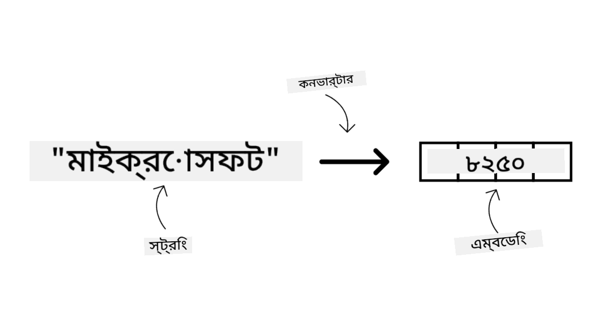
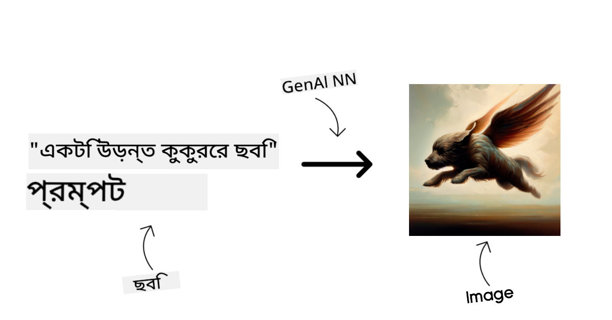
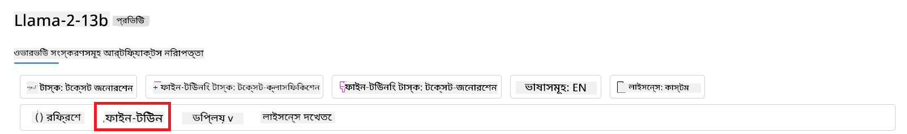

<!--
CO_OP_TRANSLATOR_METADATA:
{
  "original_hash": "e2f686f2eb794941761252ac5e8e090b",
  "translation_date": "2025-07-09T08:18:56+00:00",
  "source_file": "02-exploring-and-comparing-different-llms/README.md",
  "language_code": "bn"
}
-->
# বিভিন্ন LLM অন্বেষণ এবং তুলনা

> _এই পাঠের ভিডিও দেখতে উপরের ছবিতে ক্লিক করুন_

আগের পাঠে আমরা দেখেছি কিভাবে Generative AI প্রযুক্তির পরিসর পরিবর্তন করছে, কিভাবে Large Language Models (LLMs) কাজ করে এবং কিভাবে একটি ব্যবসা—যেমন আমাদের স্টার্টআপ—তাদের ব্যবহার ক্ষেত্রে এগুলো প্রয়োগ করে বৃদ্ধি পেতে পারে! এই অধ্যায়ে, আমরা বিভিন্ন ধরনের বড় ভাষা মডেল (LLMs) তুলনা ও পার্থক্য বিশ্লেষণ করব যাতে তাদের সুবিধা ও অসুবিধাগুলো বুঝতে পারি।

আমাদের স্টার্টআপের পরবর্তী ধাপ হলো বর্তমান LLMs এর পরিসর অন্বেষণ করা এবং বুঝতে পারা কোনগুলো আমাদের ব্যবহারের জন্য উপযুক্ত।

## পরিচিতি

এই পাঠে আলোচনা করা হবে:

- বর্তমান পরিসরে বিভিন্ন ধরনের LLMs।
- Azure-তে আপনার ব্যবহারের জন্য বিভিন্ন মডেল পরীক্ষা, পুনরাবৃত্তি এবং তুলনা করা।
- কিভাবে একটি LLM ডিপ্লয় করবেন।

## শেখার লক্ষ্য

এই পাঠ শেষ করার পর, আপনি সক্ষম হবেন:

- আপনার ব্যবহারের জন্য সঠিক মডেল নির্বাচন করতে।
- কিভাবে মডেল পরীক্ষা, পুনরাবৃত্তি এবং কর্মক্ষমতা উন্নত করবেন তা বুঝতে।
- ব্যবসাগুলো কিভাবে মডেল ডিপ্লয় করে তা জানতে।

## বিভিন্ন ধরনের LLMs বোঝা

LLMs বিভিন্ন আর্কিটেকচার, প্রশিক্ষণ ডেটা এবং ব্যবহারের ভিত্তিতে বিভিন্ন শ্রেণীবিভাগে বিভক্ত হতে পারে। এই পার্থক্যগুলো বোঝা আমাদের স্টার্টআপকে সঠিক মডেল নির্বাচন করতে সাহায্য করবে, এবং কিভাবে পরীক্ষা, পুনরাবৃত্তি ও কর্মক্ষমতা উন্নত করতে হয় তা বুঝতে সহায়ক হবে।

বিভিন্ন ধরনের LLM মডেল রয়েছে, আপনার মডেল নির্বাচন নির্ভর করে আপনি কী জন্য ব্যবহার করতে চান, আপনার ডেটা, আপনি কতটা খরচ করতে প্রস্তুত এবং আরও অনেক কিছুর উপর।

আপনি যদি মডেলগুলো টেক্সট, অডিও, ভিডিও, ছবি তৈরি ইত্যাদির জন্য ব্যবহার করতে চান, তাহলে হয়তো ভিন্ন ধরনের মডেল বেছে নেবেন।

- **অডিও এবং স্পিচ রিকগনিশন**। এই উদ্দেশ্যে Whisper-ধরনের মডেলগুলো খুবই ভালো, কারণ এগুলো সাধারণ উদ্দেশ্যের এবং স্পিচ রিকগনিশনের জন্য তৈরি। এগুলো বিভিন্ন ধরনের অডিওতে প্রশিক্ষিত এবং বহু ভাষায় স্পিচ রিকগনিশন করতে পারে। [Whisper টাইপ মডেল সম্পর্কে আরও জানুন এখানে](https://platform.openai.com/docs/models/whisper?WT.mc_id=academic-105485-koreyst)।

- **ছবি তৈরি**। ছবি তৈরির জন্য DALL-E এবং Midjourney দুটি খুব পরিচিত মডেল। DALL-E Azure OpenAI দ্বারা সরবরাহ করা হয়। [DALL-E সম্পর্কে আরও পড়ুন এখানে](https://platform.openai.com/docs/models/dall-e?WT.mc_id=academic-105485-koreyst) এবং এই পাঠক্রমের অধ্যায় ৯-এ।

- **টেক্সট তৈরি**। বেশিরভাগ মডেল টেক্সট জেনারেশনের জন্য প্রশিক্ষিত এবং GPT-3.5 থেকে GPT-4 পর্যন্ত অনেক বিকল্প রয়েছে। GPT-4 সবচেয়ে ব্যয়বহুল। আপনার প্রয়োজনীয়তা ও খরচের দিক থেকে কোন মডেল সবচেয়ে ভালো তা মূল্যায়নের জন্য [Azure OpenAI প্লেগ্রাউন্ড](https://oai.azure.com/portal/playground?WT.mc_id=academic-105485-koreyst) দেখার পরামর্শ দেওয়া হয়।

- **মাল্টি-মোডালিটি**। যদি আপনি ইনপুট ও আউটপুটে একাধিক ধরনের ডেটা পরিচালনা করতে চান, তাহলে [gpt-4 turbo with vision বা gpt-4o](https://learn.microsoft.com/azure/ai-services/openai/concepts/models#gpt-4-and-gpt-4-turbo-models?WT.mc_id=academic-105485-koreyst) মত মডেলগুলো দেখতে পারেন—OpenAI এর সর্বশেষ মডেলগুলো—যা প্রাকৃতিক ভাষা প্রক্রিয়াকরণ ও ভিজ্যুয়াল বোঝাপড়া একত্রিত করতে সক্ষম, মাল্টি-মোডাল ইন্টারফেসের মাধ্যমে ইন্টারঅ্যাকশন সম্ভব করে।

মডেল নির্বাচন মানে আপনি কিছু মৌলিক ক্ষমতা পাবেন, যা অনেক সময় যথেষ্ট নাও হতে পারে। প্রায়ই আপনার কোম্পানির নির্দিষ্ট ডেটা থাকে যা somehow LLM-কে জানাতে হয়। এই বিষয়ে বিভিন্ন পন্থা আছে, যা পরবর্তী অংশে আলোচনা করা হবে।

### Foundation Models বনাম LLMs

Foundation Model শব্দটি [স্ট্যানফোর্ড গবেষকরা প্রবর্তন করেছেন](https://arxiv.org/abs/2108.07258?WT.mc_id=academic-105485-koreyst) এবং এটি এমন একটি AI মডেল যা কিছু শর্ত পূরণ করে, যেমন:

- **এগুলো unsupervised বা self-supervised learning ব্যবহার করে প্রশিক্ষিত হয়**, অর্থাৎ লেবেলবিহীন মাল্টি-মোডাল ডেটায় প্রশিক্ষণ হয়, এবং প্রশিক্ষণের জন্য মানুষের দ্বারা ডেটা লেবেলিং বা অ্যানোটেশন প্রয়োজন হয় না।
- **এগুলো খুব বড় মডেল**, গভীর নিউরাল নেটওয়ার্কের উপর ভিত্তি করে, যা বিলিয়ন বিলিয়ন প্যারামিটারে প্রশিক্ষিত।
- **সাধারণত এগুলো অন্যান্য মডেলের জন্য ‘foundation’ হিসেবে কাজ করে**, অর্থাৎ এগুলোকে ভিত্তি হিসেবে নিয়ে অন্যান্য মডেল তৈরি করা যায়, যা fine-tuning এর মাধ্যমে করা হয়।

ছবির উৎস: [Essential Guide to Foundation Models and Large Language Models | by Babar M Bhatti | Medium](https://thebabar.medium.com/essential-guide-to-foundation-models-and-large-language-models-27dab58f7404)

এই পার্থক্য আরও স্পষ্ট করতে, ChatGPT কে উদাহরণ হিসেবে নেওয়া যাক। ChatGPT এর প্রথম সংস্করণ তৈরির জন্য GPT-3.5 মডেলটি foundation model হিসেবে ব্যবহৃত হয়েছিল। অর্থাৎ OpenAI কিছু চ্যাট-নির্দিষ্ট ডেটা ব্যবহার করে GPT-3.5 এর একটি টিউন করা সংস্করণ তৈরি করেছে, যা কথোপকথনমূলক পরিস্থিতিতে ভালো পারফর্ম করে, যেমন চ্যাটবট।

ছবির উৎস: [2108.07258.pdf (arxiv.org)](https://arxiv.org/pdf/2108.07258.pdf?WT.mc_id=academic-105485-koreyst)

### Open Source বনাম Proprietary Models

আরেকটি শ্রেণীবিভাগ হলো মডেলগুলো ওপেন সোর্স নাকি প্রোপাইটারি।

ওপেন সোর্স মডেলগুলো জনসাধারণের জন্য উন্মুক্ত এবং যেকেউ ব্যবহার করতে পারে। এগুলো সাধারণত সেই কোম্পানি বা গবেষণা সম্প্রদায় দ্বারা প্রকাশিত হয় যারা এগুলো তৈরি করেছে। এই মডেলগুলো পরিদর্শন, পরিবর্তন এবং বিভিন্ন ব্যবহারের জন্য কাস্টমাইজ করা যায়। তবে এগুলো সবসময় প্রোডাকশন ব্যবহারের জন্য অপ্টিমাইজড নাও হতে পারে এবং প্রোপাইটারি মডেলগুলোর মতো পারফরম্যান্স নাও দিতে পারে। ওপেন সোর্স মডেলগুলোর জন্য তহবিল সীমিত হতে পারে, দীর্ঘমেয়াদে রক্ষণাবেক্ষণ বা সর্বশেষ গবেষণার আপডেট নাও পেতে পারে। জনপ্রিয় ওপেন সোর্স মডেলের উদাহরণ হলো [Alpaca](https://crfm.stanford.edu/2023/03/13/alpaca.html?WT.mc_id=academic-105485-koreyst), [Bloom](https://huggingface.co/bigscience/bloom) এবং [LLaMA](https://llama.meta.com)।

প্রোপাইটারি মডেলগুলো কোম্পানির মালিকানাধীন এবং জনসাধারণের জন্য উন্মুক্ত নয়। এগুলো সাধারণত প্রোডাকশন ব্যবহারের জন্য অপ্টিমাইজড। তবে এগুলো পরিদর্শন, পরিবর্তন বা বিভিন্ন ব্যবহারের জন্য কাস্টমাইজ করা যায় না। এছাড়া এগুলো সবসময় বিনামূল্যে পাওয়া যায় না, সাবস্ক্রিপশন বা পেমেন্টের প্রয়োজন হতে পারে। ব্যবহারকারীরা মডেল প্রশিক্ষণের জন্য ব্যবহৃত ডেটার নিয়ন্ত্রণে থাকে না, তাই ডেটা প্রাইভেসি এবং AI এর দায়িত্বশীল ব্যবহারের জন্য মডেল মালিকের প্রতি বিশ্বাস রাখতে হয়। জনপ্রিয় প্রোপাইটারি মডেলের উদাহরণ হলো [OpenAI মডেলগুলো](https://platform.openai.com/docs/models/overview?WT.mc_id=academic-105485-koreyst), [Google Bard](https://sapling.ai/llm/bard?WT.mc_id=academic-105485-koreyst) এবং [Claude 2](https://www.anthropic.com/index/claude-2?WT.mc_id=academic-105485-koreyst)।

### Embedding বনাম Image Generation বনাম Text এবং Code Generation

LLMs আউটপুটের ধরন অনুসারে শ্রেণীবদ্ধ করা যায়।

Embedding মডেলগুলো এমন মডেল যা টেক্সটকে সংখ্যাসূচক রূপে রূপান্তর করে, যাকে embedding বলা হয়। এটি ইনপুট টেক্সটের একটি সংখ্যাসূচক উপস্থাপনা। Embedding মেশিনের জন্য শব্দ বা বাক্যের সম্পর্ক বোঝা সহজ করে এবং অন্যান্য মডেলের ইনপুট হিসেবে ব্যবহার করা যায়, যেমন ক্লাসিফিকেশন মডেল বা ক্লাস্টারিং মডেল, যেগুলো সংখ্যাসূচক ডেটায় ভালো পারফরম্যান্স দেয়। Embedding মডেলগুলো প্রায়ই ট্রান্সফার লার্নিংয়ে ব্যবহৃত হয়, যেখানে একটি মডেল একটি সারোগেট টাস্কের জন্য তৈরি করা হয় যার জন্য প্রচুর ডেটা থাকে, এবং তারপর মডেল ওয়েট (embedding) অন্যান্য ডাউনস্ট্রিম টাস্কে পুনরায় ব্যবহার করা হয়। এই ক্যাটাগরির একটি উদাহরণ হলো [OpenAI embeddings](https://platform.openai.com/docs/models/embeddings?WT.mc_id=academic-105485-koreyst)।

ছবি তৈরি মডেলগুলো ছবি তৈরি করে। এগুলো প্রায়ই ছবি সম্পাদনা, ছবি সংশ্লেষণ এবং ছবি অনুবাদের জন্য ব্যবহৃত হয়। ছবি তৈরি মডেলগুলো বড় বড় ছবি ডেটাসেটে প্রশিক্ষিত হয়, যেমন [LAION-5B](https://laion.ai/blog/laion-5b/?WT.mc_id=academic-105485-koreyst), এবং নতুন ছবি তৈরি বা বিদ্যমান ছবি সম্পাদনার জন্য ব্যবহার করা যায়, যেমন ইনপেইন্টিং, সুপার-রেজোলিউশন এবং রঙিনকরণ প্রযুক্তি ব্যবহার করে। উদাহরণ হিসেবে [DALL-E-3](https://openai.com/dall-e-3?WT.mc_id=academic-105485-koreyst) এবং [Stable Diffusion মডেলগুলো](https://github.com/Stability-AI/StableDiffusion?WT.mc_id=academic-105485-koreyst)।

টেক্সট এবং কোড জেনারেশন মডেলগুলো টেক্সট বা কোড তৈরি করে। এগুলো প্রায়ই টেক্সট সারাংশ, অনুবাদ এবং প্রশ্নোত্তরের জন্য ব্যবহৃত হয়। টেক্সট জেনারেশন মডেলগুলো বড় বড় টেক্সট ডেটাসেটে প্রশিক্ষিত হয়, যেমন [BookCorpus](https://www.cv-foundation.org/openaccess/content_iccv_2015/html/Zhu_Aligning_Books_and_ICCV_2015_paper.html?WT.mc_id=academic-105485-koreyst), এবং নতুন টেক্সট তৈরি বা প্রশ্নের উত্তর দিতে পারে। কোড জেনারেশন মডেল, যেমন [CodeParrot](https://huggingface.co/codeparrot?WT.mc_id=academic-105485-koreyst), বড় বড় কোড ডেটাসেটে প্রশিক্ষিত হয়, যেমন GitHub, এবং নতুন কোড তৈরি বা বিদ্যমান কোডের বাগ ঠিক করতে পারে।

### Encoder-Decoder বনাম Decoder-only

LLMs এর বিভিন্ন আর্কিটেকচার বোঝাতে একটি উপমা ব্যবহার করা যাক।

ধরুন আপনার ম্যানেজার আপনাকে একটি কুইজ তৈরির কাজ দিয়েছেন ছাত্রদের জন্য। আপনার দুই সহকর্মী আছেন; একজন বিষয়বস্তু তৈরি করেন এবং অন্যজন তা পর্যালোচনা করেন।

বিষয়বস্তু নির্মাতা হলেন Decoder-only মডেলের মতো, যিনি বিষয়বস্তু দেখে এবং যা আপনি লিখেছেন তা দেখে নতুন কন্টেন্ট তৈরি করেন। তারা আকর্ষণীয় এবং তথ্যবহুল বিষয়বস্তু লেখায় দক্ষ, কিন্তু বিষয়বস্তু এবং শেখার উদ্দেশ্য বোঝার ক্ষেত্রে ততটা পারদর্শী নন। Decoder মডেলের উদাহরণ হলো GPT পরিবার, যেমন GPT-3।

পর্যালোচক হলেন Encoder-only মডেলের মতো, যিনি লেখা বিষয়বস্তু এবং উত্তরগুলো দেখে তাদের মধ্যে সম্পর্ক বুঝেন এবং প্রসঙ্গ বোঝেন, কিন্তু নতুন বিষয়বস্তু তৈরি করতে পারেন না। Encoder-only মডেলের উদাহরণ হলো BERT।

ধরুন এমন কেউ আছেন যিনি কুইজ তৈরি এবং পর্যালোচনা দুটোই করতে পারেন, তাকে বলা যায় Encoder-Decoder মডেল। উদাহরণ হিসেবে BART এবং T5।

### সার্ভিস বনাম মডেল

এখন, সার্ভিস এবং মডেলের মধ্যে পার্থক্য আলোচনা করি। সার্ভিস হলো একটি পণ্য যা ক্লাউড সার্ভিস প্রদানকারী দ্বারা সরবরাহ করা হয়, এবং এটি প্রায়ই মডেল, ডেটা এবং অন্যান্য উপাদানের সমন্বয়। মডেল হলো সার্ভিসের মূল উপাদান, যা সাধারণত একটি foundation model, যেমন LLM।

সার্ভিসগুলো প্রোডাকশন ব্যবহারের জন্য অপ্টিমাইজড এবং মডেলের তুলনায় ব্যবহার করা সহজ, সাধারণত গ্রাফিকাল ইউজার ইন্টারফেসের মাধ্যমে। তবে সার্ভিসগুলো সবসময় বিনামূল্যে পাওয়া যায় না, সাবস্ক্রিপশন বা পেমেন্টের প্রয়োজন হতে পারে, যা সার্ভিস মালিকের সরঞ্জাম ও সম্পদ ব্যবহারের বিনিময়ে খরচ এবং স্কেলিং সহজ করে। উদাহরণ হিসেবে [Azure OpenAI Service](https://learn.microsoft.com/azure/ai-services/openai/overview?WT.mc_id=academic-105485-koreyst) আছে, যা pay-as-you-go রেট প্ল্যান অফার করে, অর্থাৎ ব্যবহারকারীরা যতটা সার্ভিস ব্যবহার করবেন ততটাই চার্জ করা হবে। এছাড়া Azure OpenAI Service এ এন্টারপ্রাইজ-গ্রেড সিকিউরিটি এবং মডেলের ক্ষমতার উপর দায়িত্বশীল AI ফ্রেমওয়ার্ক রয়েছে।

মডেলগুলো হলো শুধু নিউরাল নেটওয়ার্ক, প্যারামিটার, ওয়েট ইত্যাদি নিয়ে গঠিত। কোম্পানিগুলো এগুলো লোকালি চালাতে পারে, তবে তাদের সরঞ্জাম কিনতে হবে, স্কেল করার জন্য কাঠামো তৈরি করতে হবে এবং লাইসেন্স কিনতে হবে অথবা ওপেন সোর্স মডেল ব্যবহার করতে হবে। যেমন LLaMA মডেল ব্যবহার করা যায়, তবে চালানোর জন্য যথেষ্ট কম্পিউটেশনাল পাওয়ার দরকার।

## Azure-তে বিভিন্ন মডেল পরীক্ষা এবং পুনরাবৃত্তি করে কর্মক্ষমতা বোঝার উপায়

যখন আমাদের দল বর্তমান LLMs এর পরিসর অন্বেষণ করে এবং তাদের পরিস্থিতির জন্য কিছু ভালো প্রার্থী চিহ্নিত করে, পরবর্তী ধাপ হলো তাদের ডেটা এবং ওয়ার্কলোডে পরীক্ষা করা। এটি একটি পুনরাবৃত্তিমূলক প্রক্রিয়া, যা পরীক্ষা-নিরীক্ষা এবং পরিমাপের মাধ্যমে সম্পন্ন হয়।
আমাদের পূর্ববর্তী অনুচ্ছেদগুলোতে উল্লেখিত বেশিরভাগ মডেল (OpenAI মডেল, Llama2-এর মতো ওপেন সোর্স মডেল এবং Hugging Face ট্রান্সফর্মারস) [Azure AI Studio]-র [Model Catalog]-এ পাওয়া যায়।

[Azure AI Studio] হলো একটি ক্লাউড প্ল্যাটফর্ম যা ডেভেলপারদের জন্য ডিজাইন করা হয়েছে যাতে তারা জেনারেটিভ AI অ্যাপ্লিকেশন তৈরি করতে এবং পুরো ডেভেলপমেন্ট লাইফসাইকেল পরিচালনা করতে পারে – পরীক্ষা থেকে মূল্যায়ন পর্যন্ত – সব Azure AI সার্ভিসকে একটি একক হাবে, একটি সুবিধাজনক GUI-এর মাধ্যমে একত্রিত করে। Azure AI Studio-র Model Catalog ব্যবহারকারীকে সক্ষম করে:

- ক্যাটালগ থেকে আগ্রহের ফাউন্ডেশন মডেল খুঁজে বের করতে – সেটা প্রোপাইটারি হোক বা ওপেন সোর্স, টাস্ক, লাইসেন্স বা নাম অনুসারে ফিল্টার করে। সার্চ সুবিধার জন্য, মডেলগুলো বিভিন্ন কালেকশনে সংগঠিত, যেমন Azure OpenAI কালেকশন, Hugging Face কালেকশন, ইত্যাদি।

- মডেল কার্ড পর্যালোচনা করতে, যার মধ্যে রয়েছে উদ্দেশ্য, প্রশিক্ষণ ডেটার বিস্তারিত বিবরণ, কোড স্যাম্পল এবং অভ্যন্তরীণ মূল্যায়ন লাইব্রেরির উপর মূল্যায়ন ফলাফল।

- শিল্পে উপলব্ধ মডেল এবং ডেটাসেটের মধ্যে বেঞ্চমার্ক তুলনা করতে, ব্যবসায়িক পরিস্থিতির সাথে কোনটি মানানসই তা নির্ধারণের জন্য [Model Benchmarks] প্যানেল ব্যবহার করতে।

- Azure AI Studio-এর পরীক্ষামূলক এবং ট্র্যাকিং ক্ষমতা ব্যবহার করে নির্দিষ্ট ওয়ার্কলোডে মডেলের পারফরম্যান্স উন্নত করতে কাস্টম প্রশিক্ষণ ডেটা দিয়ে মডেল ফাইন-টিউন করতে।

- মূল প্রি-ট্রেইনড মডেল বা ফাইন-টিউনড ভার্সনকে রিমোট রিয়েল টাইম ইনফারেন্স – ম্যানেজড কম্পিউট – অথবা সার্ভারলেস API এন্ডপয়েন্টে [pay-as-you-go] ভিত্তিতে ডিপ্লয় করতে, যাতে অ্যাপ্লিকেশনগুলো এটি ব্যবহার করতে পারে।

> [!NOTE]
> ক্যাটালগের সব মডেল বর্তমানে ফাইন-টিউনিং এবং/অথবা pay-as-you-go ডিপ্লয়মেন্টের জন্য উপলব্ধ নয়। মডেল কার্ডে মডেলের ক্ষমতা এবং সীমাবদ্ধতা সম্পর্কে বিস্তারিত দেখুন।

## LLM ফলাফল উন্নতকরণ

আমরা আমাদের স্টার্টআপ টিমের সাথে বিভিন্ন ধরনের LLM এবং একটি ক্লাউড প্ল্যাটফর্ম (Azure Machine Learning) পরীক্ষা করেছি, যা আমাদের বিভিন্ন মডেল তুলনা করতে, টেস্ট ডেটায় মূল্যায়ন করতে, পারফরম্যান্স উন্নত করতে এবং ইনফারেন্স এন্ডপয়েন্টে ডিপ্লয় করতে সাহায্য করে।

কিন্তু কখন তারা একটি প্রি-ট্রেইনড মডেলের পরিবর্তে ফাইন-টিউনড মডেল বিবেচনা করবে? নির্দিষ্ট ওয়ার্কলোডে মডেলের পারফরম্যান্স উন্নত করার জন্য অন্য কোন পদ্ধতি আছে কি?

একটি ব্যবসা LLM থেকে প্রয়োজনীয় ফলাফল পেতে বিভিন্ন পদ্ধতি ব্যবহার করতে পারে। প্রোডাকশনে LLM ডিপ্লয় করার সময় আপনি বিভিন্ন প্রশিক্ষণের মাত্রা সহ বিভিন্ন ধরনের মডেল নির্বাচন করতে পারেন, যার জটিলতা, খরচ এবং গুণগত মান ভিন্ন। এখানে কিছু ভিন্ন পদ্ধতি দেওয়া হলো:

- **প্রম্পট ইঞ্জিনিয়ারিং উইথ কনটেক্সট**। ধারণাটি হলো যথেষ্ট প্রাসঙ্গিক তথ্য প্রদান করা যাতে আপনি প্রয়োজনীয় উত্তর পেতে পারেন।

- **Retrieval Augmented Generation, RAG**। আপনার ডেটা হয়তো একটি ডাটাবেস বা ওয়েব এন্ডপয়েন্টে থাকতে পারে, যাতে নিশ্চিত করা যায় যে প্রম্পট করার সময় এই ডেটা বা এর একটি অংশ অন্তর্ভুক্ত হয়, আপনি প্রাসঙ্গিক ডেটা নিয়ে এসে ব্যবহারকারীর প্রম্পটের অংশ হিসেবে যোগ করতে পারেন।

- **ফাইন-টিউনড মডেল**। এখানে, আপনি আপনার নিজস্ব ডেটায় মডেলকে আরও প্রশিক্ষণ দিয়েছেন, যার ফলে মডেলটি আপনার প্রয়োজনের প্রতি আরও সঠিক এবং প্রতিক্রিয়াশীল হয়েছে, তবে এটি ব্যয়বহুল হতে পারে।

ছবির উৎস: [Four Ways that Enterprises Deploy LLMs | Fiddler AI Blog](https://www.fiddler.ai/blog/four-ways-that-enterprises-deploy-llms?WT.mc_id=academic-105485-koreyst)

### প্রম্পট ইঞ্জিনিয়ারিং উইথ কনটেক্সট

প্রি-ট্রেইনড LLM গুলো সাধারণ ভাষার কাজগুলোতে খুব ভালো কাজ করে, এমনকি ছোট একটি প্রম্পট দিয়ে, যেমন একটি বাক্য সম্পূর্ণ করা বা একটি প্রশ্ন – যাকে বলা হয় “জিরো-শট” লার্নিং।

তবে, ব্যবহারকারী যত বেশি বিস্তারিত অনুরোধ এবং উদাহরণ – অর্থাৎ কনটেক্সট – দিতে পারেন, উত্তর তত বেশি সঠিক এবং ব্যবহারকারীর প্রত্যাশার কাছাকাছি হবে। এই ক্ষেত্রে, যদি প্রম্পটে শুধুমাত্র একটি উদাহরণ থাকে তাহলে তাকে “ওয়ান-শট” লার্নিং বলা হয় এবং যদি একাধিক উদাহরণ থাকে তাহলে “ফিউ শট” লার্নিং। প্রম্পট ইঞ্জিনিয়ারিং উইথ কনটেক্সট শুরু করার জন্য সবচেয়ে খরচ-সাশ্রয়ী পদ্ধতি।

### Retrieval Augmented Generation (RAG)

LLM-এর সীমাবদ্ধতা হলো তারা শুধুমাত্র তাদের প্রশিক্ষণের সময় ব্যবহৃত ডেটা ব্যবহার করে উত্তর তৈরি করতে পারে। এর মানে তারা প্রশিক্ষণের পর ঘটে যাওয়া তথ্য সম্পর্কে কিছুই জানে না এবং তারা অ-সার্বজনীন তথ্য (যেমন কোম্পানির ডেটা) অ্যাক্সেস করতে পারে না।

এটি RAG-এর মাধ্যমে অতিক্রম করা যায়, একটি কৌশল যা প্রম্পটকে বাহ্যিক ডেটার টুকরো দিয়ে বাড়িয়ে তোলে, প্রম্পটের দৈর্ঘ্যের সীমা বিবেচনায় রেখে। এটি ভেক্টর ডাটাবেস টুলস (যেমন [Azure Vector Search]) দ্বারা সমর্থিত, যা বিভিন্ন পূর্বনির্ধারিত ডেটা সোর্স থেকে প্রয়োজনীয় টুকরো উদ্ধার করে এবং প্রম্পটের কনটেক্সটে যোগ করে।

এই কৌশলটি খুবই উপকারী যখন একটি ব্যবসার কাছে পর্যাপ্ত ডেটা, সময় বা সম্পদ নেই LLM ফাইন-টিউন করার জন্য, কিন্তু তারা নির্দিষ্ট ওয়ার্কলোডে পারফরম্যান্স উন্নত করতে এবং মিথ্যা তথ্য বা ক্ষতিকর বিষয়বস্তুর ঝুঁকি কমাতে চায়।

### ফাইন-টিউনড মডেল

ফাইন-টিউনিং হলো একটি প্রক্রিয়া যা ট্রান্সফার লার্নিং ব্যবহার করে মডেলকে একটি নির্দিষ্ট কাজ বা সমস্যা সমাধানের জন্য ‘অ্যাডাপ্ট’ করে। ফিউ শট লার্নিং এবং RAG থেকে ভিন্ন, এটি একটি নতুন মডেল তৈরি করে, যার ওজন এবং বায়াস আপডেট করা হয়। এটি একটি প্রশিক্ষণ উদাহরণের সেট প্রয়োজন, যেখানে একটি ইনপুট (প্রম্পট) এবং তার সংশ্লিষ্ট আউটপুট (কমপ্লিশন) থাকে।

এটি পছন্দের পদ্ধতি হতে পারে যদি:

- **ফাইন-টিউনড মডেল ব্যবহার করা হয়**। একটি ব্যবসা কম ক্ষমতাসম্পন্ন ফাইন-টিউনড মডেল (যেমন এমবেডিং মডেল) ব্যবহার করতে চায়, যা উচ্চ পারফরম্যান্স মডেলের তুলনায় খরচ সাশ্রয়ী এবং দ্রুত সমাধান দেয়।

- **লেটেন্সি বিবেচনা করা হয়**। নির্দিষ্ট ব্যবহারের ক্ষেত্রে লেটেন্সি গুরুত্বপূর্ণ, তাই খুব দীর্ঘ প্রম্পট ব্যবহার করা সম্ভব নয় বা মডেল থেকে শেখার জন্য উদাহরণের সংখ্যা প্রম্পট দৈর্ঘ্যের সীমার সাথে মানানসই নয়।

- **আপডেট থাকা**। একটি ব্যবসার কাছে প্রচুর উচ্চ-গুণমানের ডেটা এবং গ্রাউন্ড ট্রুথ লেবেল আছে এবং তারা এই ডেটা সময়ের সাথে আপডেট রাখতে প্রয়োজনীয় সম্পদ রাখে।

### প্রশিক্ষিত মডেল

শূন্য থেকে একটি LLM প্রশিক্ষণ দেওয়া নিঃসন্দেহে সবচেয়ে কঠিন এবং জটিল পদ্ধতি, যা প্রচুর ডেটা, দক্ষ সম্পদ এবং যথাযথ কম্পিউটেশনাল ক্ষমতা প্রয়োজন। এই বিকল্পটি শুধুমাত্র তখন বিবেচনা করা উচিত যখন একটি ব্যবসার ডোমেইন-নির্দিষ্ট ব্যবহার এবং প্রচুর ডোমেইন-কেন্দ্রিক ডেটা থাকে।

## জ্ঞান যাচাই

LLM কমপ্লিশন ফলাফল উন্নত করার জন্য কোন পদ্ধতি ভালো হতে পারে?

1. প্রম্পট ইঞ্জিনিয়ারিং উইথ কনটেক্সট  
2. RAG  
3. ফাইন-টিউনড মডেল

উত্তর: ৩, যদি আপনার সময়, সম্পদ এবং উচ্চ-গুণমানের ডেটা থাকে, তাহলে ফাইন-টিউনিং আপডেট থাকার জন্য ভালো বিকল্প। তবে, যদি আপনি উন্নতি করতে চান এবং সময় কম থাকে, তাহলে প্রথমে RAG বিবেচনা করা উচিত।

## 🚀 চ্যালেঞ্জ

আপনার ব্যবসার জন্য কিভাবে [RAG ব্যবহার করবেন](https://learn.microsoft.com/azure/search/retrieval-augmented-generation-overview?WT.mc_id=academic-105485-koreyst) তা আরও পড়ুন।

## চমৎকার কাজ, আপনার শেখা চালিয়ে যান

এই পাঠ শেষ করার পর, আমাদের [Generative AI Learning collection] দেখুন যাতে আপনার জেনারেটিভ AI জ্ঞান আরও উন্নত হয়!

পরবর্তী পাঠ ৩-এ যান যেখানে আমরা দেখব কিভাবে [দায়িত্বশীলভাবে জেনারেটিভ AI ব্যবহার করবেন](../03-using-generative-ai-responsibly/README.md?WT.mc_id=academic-105485-koreyst)!

**অস্বীকৃতি**:  
এই নথিটি AI অনুবাদ সেবা [Co-op Translator](https://github.com/Azure/co-op-translator) ব্যবহার করে অনূদিত হয়েছে। আমরা যথাসাধ্য সঠিকতার চেষ্টা করি, তবে স্বয়ংক্রিয় অনুবাদে ত্রুটি বা অসঙ্গতি থাকতে পারে। মূল নথিটি তার নিজস্ব ভাষায়ই কর্তৃত্বপূর্ণ উৎস হিসেবে বিবেচিত হওয়া উচিত। গুরুত্বপূর্ণ তথ্যের জন্য পেশাদার মানব অনুবাদ গ্রহণ করার পরামর্শ দেওয়া হয়। এই অনুবাদের ব্যবহারে সৃষ্ট কোনো ভুল বোঝাবুঝি বা ভুল ব্যাখ্যার জন্য আমরা দায়ী নই।