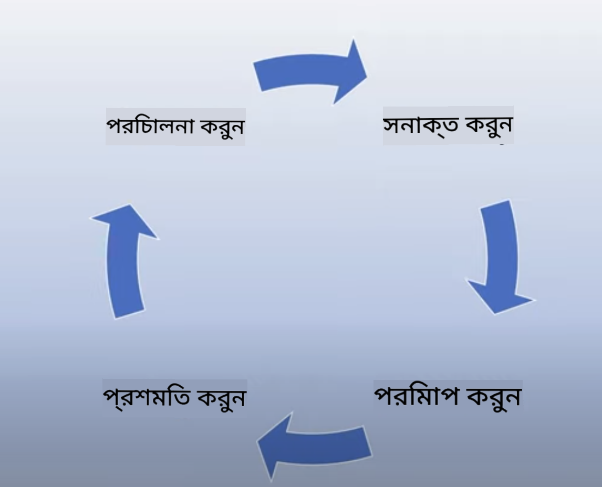
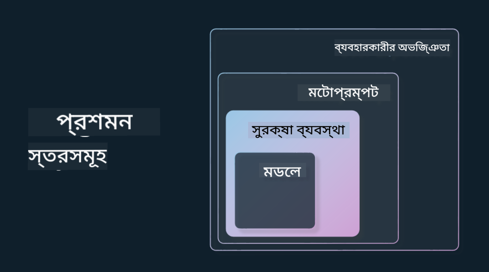

<!--
CO_OP_TRANSLATOR_METADATA:
{
  "original_hash": "4d57fad773cbeb69c5dd62e65c34200d",
  "translation_date": "2025-10-17T14:52:36+00:00",
  "source_file": "03-using-generative-ai-responsibly/README.md",
  "language_code": "bn"
}
-->
# জেনারেটিভ এআই দায়িত্বশীলভাবে ব্যবহার করা

> _উপরের ছবিতে ক্লিক করে এই পাঠের ভিডিও দেখুন_

এআই এবং বিশেষ করে জেনারেটিভ এআই নিয়ে মুগ্ধ হওয়া সহজ, তবে এটি দায়িত্বশীলভাবে কীভাবে ব্যবহার করবেন তা বিবেচনা করা গুরুত্বপূর্ণ। আপনাকে এমন বিষয়গুলি বিবেচনা করতে হবে যেমন আউটপুট কীভাবে ন্যায্য, ক্ষতিকারক নয় এবং আরও অনেক কিছু নিশ্চিত করা যায়। এই অধ্যায়টি আপনাকে উল্লেখিত প্রসঙ্গ, কী বিবেচনা করতে হবে এবং আপনার এআই ব্যবহারে উন্নতি করার জন্য সক্রিয় পদক্ষেপ নেওয়ার উপায় প্রদান করার লক্ষ্য রাখে।

## পরিচিতি

এই পাঠে আলোচনা করা হবে:

- জেনারেটিভ এআই অ্যাপ্লিকেশন তৈরি করার সময় কেন দায়িত্বশীল এআইকে অগ্রাধিকার দেওয়া উচিত।
- দায়িত্বশীল এআই-এর মূল নীতিগুলি এবং সেগুলি কীভাবে জেনারেটিভ এআই-এর সাথে সম্পর্কিত।
- কৌশল এবং সরঞ্জামের মাধ্যমে এই দায়িত্বশীল এআই নীতিগুলি কীভাবে বাস্তবায়ন করা যায়।

## শেখার লক্ষ্য

এই পাঠ সম্পন্ন করার পরে আপনি জানতে পারবেন:

- জেনারেটিভ এআই অ্যাপ্লিকেশন তৈরি করার সময় দায়িত্বশীল এআই-এর গুরুত্ব।
- জেনারেটিভ এআই অ্যাপ্লিকেশন তৈরি করার সময় দায়িত্বশীল এআই-এর মূল নীতিগুলি কখন চিন্তা করবেন এবং প্রয়োগ করবেন।
- দায়িত্বশীল এআই ধারণাটি বাস্তবায়নের জন্য আপনার কাছে কী সরঞ্জাম এবং কৌশলগুলি উপলব্ধ।

## দায়িত্বশীল এআই নীতিমালা

জেনারেটিভ এআই-এর উত্তেজনা কখনোই এত বেশি ছিল না। এই উত্তেজনা অনেক নতুন ডেভেলপার, মনোযোগ এবং এই ক্ষেত্রে তহবিল এনেছে। এটি জেনারেটিভ এআই ব্যবহার করে পণ্য এবং কোম্পানি তৈরি করতে আগ্রহী যে কারও জন্য খুবই ইতিবাচক, তবে এটি গুরুত্বপূর্ণ যে আমরা দায়িত্বশীলভাবে এগিয়ে যাই।

এই কোর্স জুড়ে, আমরা আমাদের স্টার্টআপ এবং আমাদের এআই শিক্ষা পণ্য তৈরি করার উপর মনোযোগ দিচ্ছি। আমরা দায়িত্বশীল এআই-এর নীতিগুলি ব্যবহার করব: ন্যায্যতা, অন্তর্ভুক্তি, নির্ভরযোগ্যতা/নিরাপত্তা, নিরাপত্তা এবং গোপনীয়তা, স্বচ্ছতা এবং জবাবদিহিতা। এই নীতিগুলির সাথে, আমরা আমাদের পণ্যগুলিতে জেনারেটিভ এআই ব্যবহারের সাথে তাদের সম্পর্ক কীভাবে অন্বেষণ করব।

## কেন দায়িত্বশীল এআইকে অগ্রাধিকার দেওয়া উচিত

একটি পণ্য তৈরি করার সময়, আপনার ব্যবহারকারীর সর্বোত্তম স্বার্থকে মাথায় রেখে মানব-কেন্দ্রিক পদ্ধতি গ্রহণ করলে সর্বোত্তম ফলাফল পাওয়া যায়।

জেনারেটিভ এআই-এর অনন্যতা হল এটি ব্যবহারকারীদের জন্য সহায়ক উত্তর, তথ্য, নির্দেশনা এবং বিষয়বস্তু তৈরি করার ক্ষমতা। এটি অনেক ম্যানুয়াল পদক্ষেপ ছাড়াই করা যেতে পারে যা খুবই চিত্তাকর্ষক ফলাফল দিতে পারে। যথাযথ পরিকল্পনা এবং কৌশল ছাড়া, এটি দুর্ভাগ্যবশত আপনার ব্যবহারকারী, আপনার পণ্য এবং পুরো সমাজের জন্য কিছু ক্ষতিকারক ফলাফলও দিতে পারে।

চলুন কিছু (কিন্তু সব নয়) সম্ভাব্য ক্ষতিকারক ফলাফল দেখি:

### হ্যালুসিনেশন

হ্যালুসিনেশন একটি শব্দ যা ব্যবহার করা হয় যখন একটি LLM এমন বিষয়বস্তু তৈরি করে যা সম্পূর্ণ অর্থহীন বা এমন কিছু যা আমরা জানি অন্যান্য তথ্যের উৎসের উপর ভিত্তি করে বাস্তবিকভাবে ভুল।

ধরা যাক আমরা আমাদের স্টার্টআপের জন্য একটি ফিচার তৈরি করি যা শিক্ষার্থীদের একটি মডেলকে ঐতিহাসিক প্রশ্ন জিজ্ঞাসা করতে দেয়। একজন শিক্ষার্থী প্রশ্ন করে `টাইটানিকের একমাত্র জীবিত ব্যক্তি কে ছিলেন?`

মডেল নিচের মতো একটি উত্তর তৈরি করে:

> _(উৎস: [Flying bisons](https://flyingbisons.com?WT.mc_id=academic-105485-koreyst))_

এটি একটি খুব আত্মবিশ্বাসী এবং বিস্তারিত উত্তর। দুর্ভাগ্যবশত, এটি ভুল। সামান্য গবেষণার মাধ্যমেই একজন জানতে পারবেন যে টাইটানিক বিপর্যয়ের একাধিক জীবিত ব্যক্তি ছিলেন। একজন শিক্ষার্থী যিনি এই বিষয়ে গবেষণা শুরু করছেন, তার জন্য এই উত্তরটি যথেষ্ট বিশ্বাসযোগ্য হতে পারে এবং এটি প্রশ্ন না করে সত্য হিসাবে গ্রহণ করা হতে পারে। এর পরিণতি এআই সিস্টেমকে অবিশ্বস্ত করে তুলতে পারে এবং আমাদের স্টার্টআপের খ্যাতির উপর নেতিবাচক প্রভাব ফেলতে পারে।

যেকোনো প্রদত্ত LLM-এর প্রতিটি পুনরাবৃত্তির সাথে, আমরা হ্যালুসিনেশন কমানোর ক্ষেত্রে কর্মক্ষমতার উন্নতি দেখেছি। এই উন্নতির সত্ত্বেও, আমরা অ্যাপ্লিকেশন নির্মাতা এবং ব্যবহারকারী হিসাবে এই সীমাবদ্ধতার বিষয়ে সচেতন থাকতে হবে।

### ক্ষতিকারক বিষয়বস্তু

আমরা আগের অংশে আলোচনা করেছি যখন একটি LLM ভুল বা অর্থহীন উত্তর তৈরি করে। আরেকটি ঝুঁকি যা আমাদের সচেতন হওয়া উচিত তা হল যখন একটি মডেল ক্ষতিকারক বিষয়বস্তু দিয়ে সাড়া দেয়।

ক্ষতিকারক বিষয়বস্তুকে সংজ্ঞায়িত করা যেতে পারে:

- আত্ম-ক্ষতি বা নির্দিষ্ট গোষ্ঠীর ক্ষতি করার নির্দেশনা প্রদান বা উৎসাহিত করা।
- ঘৃণামূলক বা অবমাননাকর বিষয়বস্তু।
- যেকোনো ধরনের আক্রমণ বা সহিংস কাজের পরিকল্পনা নির্দেশনা প্রদান।
- অবৈধ বিষয়বস্তু খুঁজে বের করার বা অবৈধ কাজ করার নির্দেশনা প্রদান।
- যৌনভাবে স্পষ্ট বিষয়বস্তু প্রদর্শন।

আমাদের স্টার্টআপের জন্য, আমরা নিশ্চিত করতে চাই যে আমাদের কাছে সঠিক সরঞ্জাম এবং কৌশল রয়েছে যাতে শিক্ষার্থীদের দ্বারা এই ধরনের বিষয়বস্তু দেখা থেকে রোধ করা যায়।

### ন্যায্যতার অভাব

ন্যায্যতা সংজ্ঞায়িত করা হয় "এআই সিস্টেমকে পক্ষপাত এবং বৈষম্য থেকে মুক্ত রাখা এবং এটি সবাইকে ন্যায্য এবং সমানভাবে আচরণ করে তা নিশ্চিত করা।" জেনারেটিভ এআই-এর জগতে, আমরা নিশ্চিত করতে চাই যে মডেলের আউটপুট দ্বারা প্রান্তিক গোষ্ঠীগুলির বর্জনমূলক বিশ্বদৃষ্টিভঙ্গি শক্তিশালী হয় না।

এই ধরনের আউটপুটগুলি আমাদের ব্যবহারকারীদের জন্য ইতিবাচক পণ্য অভিজ্ঞতা তৈরি করার ক্ষেত্রে ধ্বংসাত্মক এবং এটি আরও সামাজিক ক্ষতি করে। অ্যাপ্লিকেশন নির্মাতা হিসাবে, জেনারেটিভ এআই দিয়ে সমাধান তৈরি করার সময় আমাদের সর্বদা একটি বিস্তৃত এবং বৈচিত্র্যময় ব্যবহারকারী ভিত্তি মাথায় রাখা উচিত।

## জেনারেটিভ এআই দায়িত্বশীলভাবে কীভাবে ব্যবহার করবেন

এখন আমরা দায়িত্বশীল জেনারেটিভ এআই-এর গুরুত্ব চিহ্নিত করেছি, আসুন ৪টি ধাপ দেখি যা আমরা আমাদের এআই সমাধানগুলি দায়িত্বশীলভাবে তৈরি করতে নিতে পারি:

### সম্ভাব্য ক্ষতি পরিমাপ করুন

সফটওয়্যার টেস্টিংয়ে, আমরা অ্যাপ্লিকেশনে ব্যবহারকারীর প্রত্যাশিত ক্রিয়াগুলি পরীক্ষা করি। অনুরূপভাবে, ব্যবহারকারীরা সবচেয়ে বেশি সম্ভাব্য যে প্রম্পটগুলি ব্যবহার করতে যাচ্ছেন তার একটি বৈচিত্র্যময় সেট পরীক্ষা করা সম্ভাব্য ক্ষতি পরিমাপ করার একটি ভাল উপায়।

যেহেতু আমাদের স্টার্টআপ একটি শিক্ষা পণ্য তৈরি করছে, এটি শিক্ষা-সম্পর্কিত প্রম্পটগুলির একটি তালিকা প্রস্তুত করা ভাল হবে। এটি একটি নির্দিষ্ট বিষয়, ঐতিহাসিক তথ্য এবং শিক্ষার্থীদের জীবন সম্পর্কে প্রম্পটগুলি কভার করতে পারে।

### সম্ভাব্য ক্ষতি কমান

এখন সময় এসেছে যেখানে আমরা মডেল এবং এর প্রতিক্রিয়াগুলির কারণে সম্ভাব্য ক্ষতি প্রতিরোধ বা সীমিত করার উপায় খুঁজে বের করতে পারি। আমরা এটি ৪টি ভিন্ন স্তরে দেখতে পারি:

- **মডেল**। সঠিক ব্যবহারের জন্য সঠিক মডেল নির্বাচন করা। GPT-4-এর মতো বড় এবং আরও জটিল মডেলগুলি ছোট এবং আরও নির্দিষ্ট ব্যবহারের ক্ষেত্রে প্রয়োগ করার সময় ক্ষতিকারক বিষয়বস্তু তৈরির ঝুঁকি বেশি হতে পারে। আপনার প্রশিক্ষণ ডেটা ব্যবহার করে ফাইন-টিউন করাও ক্ষতিকারক বিষয়বস্তু তৈরির ঝুঁকি কমায়।

- **নিরাপত্তা ব্যবস্থা**। একটি নিরাপত্তা ব্যবস্থা হল মডেল পরিবেশনকারী প্ল্যাটফর্মে সরঞ্জাম এবং কনফিগারেশনের একটি সেট যা ক্ষতি কমাতে সাহায্য করে। এর একটি উদাহরণ হল Azure OpenAI পরিষেবার বিষয়বস্তু ফিল্টারিং সিস্টেম। সিস্টেমগুলি জেলব্রেক আক্রমণ এবং বটের অনুরোধের মতো অনাকাঙ্ক্ষিত কার্যকলাপ সনাক্ত করাও উচিত।

- **মেটাপ্রম্পট**। মেটাপ্রম্পট এবং গ্রাউন্ডিং হল এমন উপায় যা আমরা নির্দিষ্ট আচরণ এবং তথ্যের উপর ভিত্তি করে মডেলকে নির্দেশ বা সীমিত করতে পারি। এটি মডেলের নির্দিষ্ট সীমা সংজ্ঞায়িত করতে সিস্টেম ইনপুট ব্যবহার করা হতে পারে। এছাড়াও, সিস্টেমের স্কোপ বা ডোমেইনের সাথে আরও প্রাসঙ্গিক আউটপুট প্রদান করা।

এটি নির্ভরযোগ্য উৎসের একটি নির্বাচন থেকে শুধুমাত্র তথ্য টানতে মডেলকে বাধ্য করার জন্য Retrieval Augmented Generation (RAG)-এর মতো কৌশল ব্যবহার করাও হতে পারে। এই কোর্সে [সার্চ অ্যাপ্লিকেশন তৈরি করা](../08-building-search-applications/README.md?WT.mc_id=academic-105485-koreyst) নিয়ে একটি পাঠ রয়েছে।

- **ব্যবহারকারীর অভিজ্ঞতা**। চূড়ান্ত স্তরটি যেখানে ব্যবহারকারী আমাদের অ্যাপ্লিকেশনের ইন্টারফেসের মাধ্যমে মডেলের সাথে সরাসরি যোগাযোগ করে। এইভাবে আমরা UI/UX ডিজাইন করতে পারি যাতে ব্যবহারকারী মডেলে পাঠাতে পারে এমন ইনপুটের ধরন সীমিত করা যায় এবং ব্যবহারকারীর কাছে প্রদর্শিত পাঠ্য বা চিত্রগুলি সীমিত করা যায়। এআই অ্যাপ্লিকেশন স্থাপন করার সময়, আমাদের জেনারেটিভ এআই অ্যাপ্লিকেশন কী করতে পারে এবং কী করতে পারে না সে সম্পর্কে স্বচ্ছ হতে হবে।

আমাদের [এআই অ্যাপ্লিকেশনের জন্য UX ডিজাইন করা](../12-designing-ux-for-ai-applications/README.md?WT.mc_id=academic-105485-koreyst) নিয়ে একটি সম্পূর্ণ পাঠ রয়েছে।

- **মডেল মূল্যায়ন করুন**। LLM-এর সাথে কাজ করা চ্যালেঞ্জিং হতে পারে কারণ আমরা সর্বদা মডেলটি যে ডেটাতে প্রশিক্ষিত হয়েছিল তার উপর নিয়ন্ত্রণ করি না। তা সত্ত্বেও, আমাদের সর্বদা মডেলের কর্মক্ষমতা এবং আউটপুট মূল্যায়ন করা উচিত। মডেলের সঠিকতা, সাদৃশ্য, গ্রাউন্ডেডনেস এবং আউটপুটের প্রাসঙ্গিকতা পরিমাপ করা এখনও গুরুত্বপূর্ণ। এটি স্টেকহোল্ডার এবং ব্যবহারকারীদের কাছে স্বচ্ছতা এবং বিশ্বাস প্রদান করতে সাহায্য করে।

### একটি দায়িত্বশীল জেনারেটিভ এআই সমাধান পরিচালনা করুন

আপনার এআই অ্যাপ্লিকেশনগুলির চারপাশে একটি অপারেশনাল অনুশীলন তৈরি করা চূড়ান্ত পর্যায়। এর মধ্যে আমাদের স্টার্টআপের অন্যান্য অংশ যেমন লিগাল এবং সিকিউরিটির সাথে অংশীদারিত্ব অন্তর্ভুক্ত রয়েছে যাতে আমরা সমস্ত নিয়ন্ত্রক নীতির সাথে সঙ্গতিপূর্ণ থাকি। চালু করার আগে, আমরা ডেলিভারি, ঘটনা পরিচালনা এবং রোলব্যাকের চারপাশে পরিকল্পনা তৈরি করতে চাই যাতে আমাদের ব্যবহারকারীদের ক্ষতি থেকে রোধ করা যায়।

## সরঞ্জাম

দায়িত্বশীল এআই সমাধান তৈরি করার কাজ অনেক মনে হতে পারে, তবে এটি প্রচেষ্টার জন্য মূল্যবান কাজ। জেনারেটিভ এআই-এর ক্ষেত্রটি বাড়ার সাথে সাথে, ডেভেলপারদের তাদের কর্মপ্রবাহে দক্ষতার সাথে দায়িত্ব সংহত করতে সাহায্য করার জন্য আরও সরঞ্জাম পরিপক্ক হবে। উদাহরণস্বরূপ, [Azure AI Content Safety](https://learn.microsoft.com/azure/ai-services/content-safety/overview?WT.mc_id=academic-105485-koreyst) একটি API অনুরোধের মাধ্যমে ক্ষতিকারক বিষয়বস্তু এবং চিত্র সনাক্ত করতে সাহায্য করতে পারে।

## জ্ঞান যাচাই

দায়িত্বশীল এআই ব্যবহারের নিশ্চয়তা দিতে আপনাকে কোন বিষয়গুলির যত্ন নিতে হবে?

1. যে উত্তরটি সঠিক।
1. ক্ষতিকারক ব্যবহার, যে এআই অপরাধমূলক উদ্দেশ্যে ব্যবহার করা হচ্ছে না।
1. নিশ্চিত করা যে এআই পক্ষপাত এবং বৈষম্য থেকে মুক্ত।

উত্তর: ২ এবং ৩ সঠিক। দায়িত্বশীল এআই আপনাকে ক্ষতিকারক প্রভাব এবং পক্ষপাত কমানোর উপায় বিবেচনা করতে সাহায্য করে এবং আরও অনেক কিছু।

## 🚀 চ্যালেঞ্জ

[Azure AI Content Safety](https://learn.microsoft.com/azure/ai-services/content-safety/overview?WT.mc_id=academic-105485-koreyst) সম্পর্কে পড়ুন এবং দেখুন আপনি আপনার ব্যবহারের জন্য কী গ্রহণ করতে পারেন।

## চমৎকার কাজ, আপনার শেখা চালিয়ে যান

এই পাঠটি সম্পন্ন করার পরে, আমাদের [জেনারেটিভ এআই শেখার সংগ্রহ](https://aka.ms/genai-collection?WT.mc_id=academic-105485-koreyst) দেখুন যাতে আপনার জেনারেটিভ এআই জ্ঞান আরও উন্নত হয়!

পাঠ ৪-এ যান যেখানে আমরা [প্রম্পট ইঞ্জিনিয়ারিংয়ের মৌলিক বিষয়গুলি](../04-prompt-engineering-fundamentals/README.md?WT.mc_id=academic-105485-koreyst) দেখব!

---

**অস্বীকৃতি**:  
এই নথিটি AI অনুবাদ পরিষেবা [Co-op Translator](https://github.com/Azure/co-op-translator) ব্যবহার করে অনুবাদ করা হয়েছে। আমরা যথাসাধ্য সঠিকতার জন্য চেষ্টা করি, তবে অনুগ্রহ করে মনে রাখবেন যে স্বয়ংক্রিয় অনুবাদে ত্রুটি বা অসঙ্গতি থাকতে পারে। মূল ভাষায় থাকা নথিটিকে প্রামাণিক উৎস হিসেবে বিবেচনা করা উচিত। গুরুত্বপূর্ণ তথ্যের জন্য, পেশাদার মানব অনুবাদ সুপারিশ করা হয়। এই অনুবাদ ব্যবহারের ফলে কোনো ভুল বোঝাবুঝি বা ভুল ব্যাখ্যা হলে আমরা দায়বদ্ধ থাকব না।