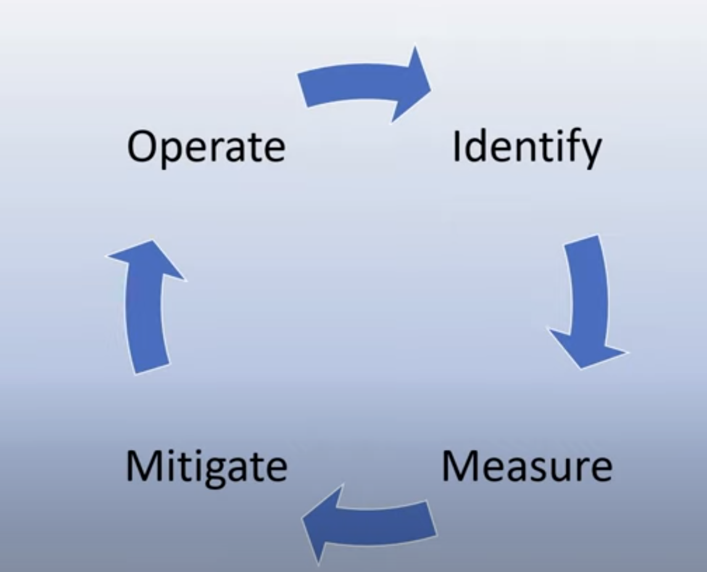
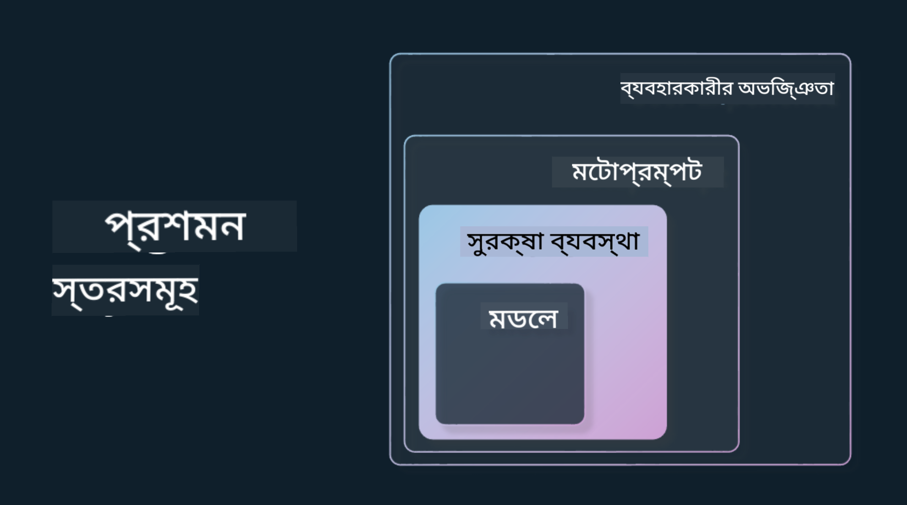

<!--
CO_OP_TRANSLATOR_METADATA:
{
  "original_hash": "13084c6321a2092841b9a081b29497ba",
  "translation_date": "2025-06-25T11:17:31+00:00",
  "source_file": "03-using-generative-ai-responsibly/README.md",
  "language_code": "bn"
}
-->
# জেনারেটিভ AI দায়িত্বশীলভাবে ব্যবহার করা

> _এই পাঠের ভিডিও দেখতে উপরের ছবিতে ক্লিক করুন_

AI এবং বিশেষভাবে জেনারেটিভ AI এর প্রতি আকৃষ্ট হওয়া সহজ, কিন্তু আপনাকে বিবেচনা করতে হবে আপনি কীভাবে এটি দায়িত্বশীলভাবে ব্যবহার করবেন। আপনাকে যেমন বিষয়গুলি বিবেচনা করতে হবে যেমন কীভাবে নিশ্চিত করবেন যে আউটপুটটি ন্যায্য, ক্ষতিকর নয় এবং আরও অনেক কিছু। এই অধ্যায়টি আপনাকে উল্লেখিত প্রেক্ষাপট, কী বিবেচনা করতে হবে এবং কীভাবে আপনার AI ব্যবহারের উন্নতি করার জন্য সক্রিয় পদক্ষেপ নিতে হবে তা প্রদান করার লক্ষ্য।

## ভূমিকা

এই পাঠে আলোচনা করা হবে:

- জেনারেটিভ AI অ্যাপ্লিকেশন তৈরি করার সময় কেন দায়িত্বশীল AI অগ্রাধিকার দেওয়া উচিত।
- দায়িত্বশীল AI এর মূল নীতিমালা এবং তারা কীভাবে জেনারেটিভ AI এর সাথে সম্পর্কিত।
- কৌশল এবং টুলিং এর মাধ্যমে এই দায়িত্বশীল AI নীতিমালাগুলি কীভাবে বাস্তবে প্রয়োগ করা যায়।

## শেখার লক্ষ্য

এই পাঠটি সম্পন্ন করার পর আপনি জানবেন:

- জেনারেটিভ AI অ্যাপ্লিকেশন তৈরি করার সময় দায়িত্বশীল AI এর গুরুত্ব।
- জেনারেটিভ AI অ্যাপ্লিকেশন তৈরি করার সময় দায়িত্বশীল AI এর মূল নীতিমালা কখন চিন্তা এবং প্রয়োগ করা উচিত।
- দায়িত্বশীল AI এর ধারণাটি বাস্তবে প্রয়োগ করার জন্য আপনার কাছে কী টুল এবং কৌশল উপলব্ধ।

## দায়িত্বশীল AI নীতিমালা

জেনারেটিভ AI এর উত্তেজনা কখনও এত বেশি ছিল না। এই উত্তেজনা অনেক নতুন ডেভেলপার, মনোযোগ এবং এই ক্ষেত্রে অর্থায়ন নিয়ে এসেছে। যদিও এটি জেনারেটিভ AI ব্যবহার করে পণ্য এবং কোম্পানি তৈরি করতে আগ্রহী যে কারো জন্য খুবই ইতিবাচক, আমাদের দায়িত্বশীলভাবে এগিয়ে যাওয়া গুরুত্বপূর্ণ।

এই কোর্সে, আমরা আমাদের স্টার্টআপ এবং আমাদের AI শিক্ষা পণ্য তৈরি করার উপর ফোকাস করছি। আমরা দায়িত্বশীল AI এর নীতিমালা ব্যবহার করবো: ন্যায্যতা, অন্তর্ভুক্তি, নির্ভরযোগ্যতা/নিরাপত্তা, নিরাপত্তা ও গোপনীয়তা, স্বচ্ছতা এবং জবাবদিহিতা। এই নীতিমালাগুলি ব্যবহার করে, আমরা আমাদের পণ্যে জেনারেটিভ AI এর ব্যবহার কীভাবে সম্পর্কিত তা অন্বেষণ করবো।

## কেন দায়িত্বশীল AI অগ্রাধিকার দেওয়া উচিত

একটি পণ্য তৈরি করার সময়, আপনার ব্যবহারকারীর সর্বোত্তম স্বার্থকে মাথায় রেখে একটি মানব-কেন্দ্রিক পদ্ধতি গ্রহণ করা সেরা ফলাফল দেয়।

জেনারেটিভ AI এর অনন্যতা হল এর ব্যবহারকারীদের জন্য সহায়ক উত্তর, তথ্য, নির্দেশনা এবং সামগ্রী তৈরি করার ক্ষমতা। এটি অনেক ম্যানুয়াল পদক্ষেপ ছাড়াই করা যেতে পারে যা খুবই চিত্তাকর্ষক ফলাফল দিতে পারে। সঠিক পরিকল্পনা এবং কৌশল ছাড়া, এটি দুর্ভাগ্যবশত আপনার ব্যবহারকারীদের, আপনার পণ্য এবং পুরো সমাজের জন্য কিছু ক্ষতিকর ফলাফলের দিকে নিয়ে যেতে পারে।

চলুন দেখি কিছু (কিন্তু সব নয়) এই সম্ভাব্য ক্ষতিকর ফলাফল:

### হ্যালুসিনেশন

হ্যালুসিনেশন একটি শব্দ যা ব্যবহার করা হয় যখন একটি LLM এমন সামগ্রী তৈরি করে যা সম্পূর্ণ অর্থহীন বা কিছু যা আমরা জানি অন্য তথ্যসূত্রের ভিত্তিতে বাস্তবিকভাবে ভুল।

ধরা যাক আমরা আমাদের স্টার্টআপের জন্য একটি ফিচার তৈরি করি যা শিক্ষার্থীদের একটি মডেলে ঐতিহাসিক প্রশ্ন জিজ্ঞাসা করার অনুমতি দেয়। একজন শিক্ষার্থী প্রশ্ন করে `Who was the sole survivor of Titanic?`

মডেলটি নিচের মতো একটি উত্তর তৈরি করে:

> _(সূত্র: [Flying bisons](https://flyingbisons.com?WT.mc_id=academic-105485-koreyst))_

এটি একটি খুব আত্মবিশ্বাসী এবং বিস্তারিত উত্তর। দুর্ভাগ্যবশত, এটি ভুল। সামান্য গবেষণা করলেই একজন জানতে পারবেন যে টাইটানিক বিপর্যয়ে একাধিক জীবিত ব্যক্তি ছিলেন। একজন শিক্ষার্থী যে এই বিষয়ে গবেষণা শুরু করছে, তার জন্য এই উত্তরটি যথেষ্ট প্রভাবশালী হতে পারে যা প্রশ্ন করা হবে না এবং বাস্তবিক হিসেবে গ্রহণ করা হবে। এর পরিণতি AI সিস্টেমকে অ-নির্ভরযোগ্য করে তুলতে পারে এবং আমাদের স্টার্টআপের সুনামকে নেতিবাচকভাবে প্রভাবিত করতে পারে।

যেকোনো প্রদত্ত LLM এর প্রতিটি পুনরাবৃত্তিতে, আমরা হ্যালুসিনেশন কমানোর ক্ষেত্রে কর্মক্ষমতা উন্নতি দেখেছি। এই উন্নতির সাথেও, আমাদের অ্যাপ্লিকেশন নির্মাতা এবং ব্যবহারকারী হিসেবে এখনও এই সীমাবদ্ধতাগুলি সম্পর্কে সচেতন থাকা প্রয়োজন।

### ক্ষতিকর সামগ্রী

আমরা পূর্বের অংশে আলোচনা করেছি যখন একটি LLM ভুল বা অর্থহীন উত্তর তৈরি করে। আরেকটি ঝুঁকি যার সম্পর্কে আমাদের সচেতন হওয়া প্রয়োজন তা হল যখন একটি মডেল ক্ষতিকর সামগ্রী দিয়ে উত্তর দেয়।

ক্ষতিকর সামগ্রীকে সংজ্ঞায়িত করা যায়:

- আত্ম-ক্ষতি বা নির্দিষ্ট গোষ্ঠীর ক্ষতি করার নির্দেশনা বা উৎসাহ প্রদান।
- ঘৃণাত্মক বা অবমাননাকর সামগ্রী।
- কোনো ধরনের আক্রমণ বা সহিংস কর্মকাণ্ডের পরিকল্পনা নির্দেশনা প্রদান।
- অবৈধ সামগ্রী খোঁজার বা অবৈধ কর্মকাণ্ড করার নির্দেশনা প্রদান।
- যৌন স্পষ্ট সামগ্রী প্রদর্শন।

আমাদের স্টার্টআপের জন্য, আমরা নিশ্চিত করতে চাই যে আমাদের কাছে সঠিক টুল এবং কৌশল রয়েছে যাতে এই ধরনের সামগ্রী শিক্ষার্থীদের দ্বারা দেখা না যায়।

### ন্যায্যতার অভাব

ন্যায্যতা সংজ্ঞায়িত করা হয় “নিশ্চিত করা যে একটি AI সিস্টেম পক্ষপাত এবং বৈষম্য থেকে মুক্ত এবং তারা সকলকে ন্যায্য এবং সমানভাবে আচরণ করে।” জেনারেটিভ AI এর জগতে, আমরা নিশ্চিত করতে চাই যে মডেলের আউটপুট দ্বারা প্রান্তিককৃত গোষ্ঠীর বর্জনমূলক বিশ্বদর্শনগুলি শক্তিশালী করা হচ্ছে না।

এই ধরনের আউটপুটগুলি শুধুমাত্র আমাদের ব্যবহারকারীদের জন্য ইতিবাচক পণ্য অভিজ্ঞতা তৈরি করতে ধ্বংসাত্মক নয়, তারা আরও সামাজিক ক্ষতি সৃষ্টি করে। অ্যাপ্লিকেশন নির্মাতা হিসেবে, আমাদের জেনারেটিভ AI দিয়ে সমাধান তৈরি করার সময় সর্বদা একটি বিস্তৃত এবং বৈচিত্র্যময় ব্যবহারকারী ভিত্তি মাথায় রাখা উচিত।

## কীভাবে জেনারেটিভ AI দায়িত্বশীলভাবে ব্যবহার করবেন

এখন আমরা দায়িত্বশীল জেনারেটিভ AI এর গুরুত্ব চিহ্নিত করেছি, চলুন দেখি 4টি পদক্ষেপ যা আমরা আমাদের AI সমাধানগুলি দায়িত্বশীলভাবে তৈরি করতে নিতে পারি:

### সম্ভাব্য ক্ষতি পরিমাপ করা

সফটওয়্যার টেস্টিংয়ে, আমরা একটি অ্যাপ্লিকেশনে ব্যবহারকারীর প্রত্যাশিত ক্রিয়াগুলি পরীক্ষা করি। অনুরূপভাবে, ব্যবহারকারীরা যে বৈচিত্র্যময় প্রম্পটগুলি সবচেয়ে বেশি ব্যবহার করতে পারে তা পরীক্ষা করা সম্ভাব্য ক্ষতি পরিমাপ করার একটি ভাল উপায়।

যেহেতু আমাদের স্টার্টআপ একটি শিক্ষা পণ্য তৈরি করছে, এটি শিক্ষা সম্পর্কিত প্রম্পটগুলির একটি তালিকা প্রস্তুত করা ভাল হবে। এটি একটি নির্দিষ্ট বিষয়, ঐতিহাসিক তথ্য এবং শিক্ষার্থী জীবনের প্রম্পটগুলি কভার করতে পারে।

### সম্ভাব্য ক্ষতি হ্রাস করা

এখন সময় এসেছে যেখানে আমরা মডেল এবং এর প্রতিক্রিয়াগুলির দ্বারা সৃষ্ট সম্ভাব্য ক্ষতি প্রতিরোধ বা সীমিত করার উপায়গুলি খুঁজে বের করতে পারি। আমরা এটি 4টি ভিন্ন স্তরে দেখতে পারি:

- **মডেল**. সঠিক ব্যবহার ক্ষেত্রে সঠিক মডেল নির্বাচন করা। GPT-4 এর মতো বড় এবং আরও জটিল মডেলগুলি ছোট এবং আরও নির্দিষ্ট ব্যবহার ক্ষেত্রে প্রয়োগ করার সময় ক্ষতিকর সামগ্রীর ঝুঁকি বেশি হতে পারে। আপনার প্রশিক্ষণ ডেটা ব্যবহার করে ফাইন-টিউনিং করাও ক্ষতিকর সামগ্রীর ঝুঁকি কমায়।

- **নিরাপত্তা সিস্টেম**. একটি নিরাপত্তা সিস্টেম মডেলটি পরিবেশন করা প্ল্যাটফর্মে ক্ষতি হ্রাস করতে সহায়তা করার জন্য একটি সরঞ্জাম এবং কনফিগারেশনের সেট। এর একটি উদাহরণ হল Azure OpenAI সার্ভিসের সামগ্রী ফিল্টারিং সিস্টেম। সিস্টেমগুলি জেলব্রেক আক্রমণ এবং অনাকাঙ্ক্ষিত কার্যকলাপ যেমন বটের অনুরোধ সনাক্ত করা উচিত।

- **মেটাপ্রম্পট**. মেটাপ্রম্পট এবং গ্রাউন্ডিং হল কিছু আচরণ এবং তথ্যের ভিত্তিতে মডেলটি পরিচালনা বা সীমাবদ্ধ করার উপায়। এটি মডেলের নির্দিষ্ট সীমা সংজ্ঞায়িত করতে সিস্টেম ইনপুট ব্যবহার হতে পারে। এছাড়াও, সিস্টেমের স্কোপ বা ডোমেনের সাথে আরও প্রাসঙ্গিক আউটপুট প্রদান করা।

এটি রিট্রিভাল অগমেন্টেড জেনারেশন (RAG) এর মতো কৌশল ব্যবহার করাও হতে পারে যাতে মডেলটি শুধুমাত্র বিশ্বস্ত সূত্রের একটি নির্বাচন থেকে তথ্য টেনে আনতে পারে। এই কোর্সের পরে [অনুসন্ধান অ্যাপ্লিকেশন তৈরি করা](../08-building-search-applications/README.md?WT.mc_id=academic-105485-koreyst) জন্য একটি পাঠ রয়েছে।

- **ব্যবহারকারীর অভিজ্ঞতা**. চূড়ান্ত স্তরটি যেখানে ব্যবহারকারী আমাদের অ্যাপ্লিকেশনের ইন্টারফেসের মাধ্যমে মডেলের সাথে সরাসরি যোগাযোগ করে। এইভাবে আমরা UI/UX ডিজাইন করতে পারি যাতে ব্যবহারকারীকে তারা মডেলে পাঠাতে পারে এমন ইনপুটের ধরণগুলি এবং ব্যবহারকারীর কাছে প্রদর্শিত পাঠ্য বা চিত্রগুলি সীমিত করা যায়। AI অ্যাপ্লিকেশন মোতায়েন করার সময়, আমাদের স্বচ্ছতাও থাকতে হবে আমাদের জেনারেটিভ AI অ্যাপ্লিকেশন কী করতে পারে এবং কী করতে পারে না।

আমাদের [AI অ্যাপ্লিকেশনগুলির জন্য UX ডিজাইন করা](../12-designing-ux-for-ai-applications/README.md?WT.mc_id=academic-105485-koreyst) এর জন্য একটি সম্পূর্ণ পাঠ রয়েছে।

- **মডেল মূল্যায়ন**. LLMs এর সাথে কাজ করা চ্যালেঞ্জিং হতে পারে কারণ আমরা সর্বদা মডেলটি যে ডেটা প্রশিক্ষিত হয়েছিল তার উপর নিয়ন্ত্রণ রাখি না। তবুও, আমাদের সর্বদা মডেলের কর্মক্ষমতা এবং আউটপুট মূল্যায়ন করা উচিত। মডেলের সঠিকতা, সাদৃশ্য, ভিত্তি এবং আউটপুটের প্রাসঙ্গিকতা পরিমাপ করা এখনও গুরুত্বপূর্ণ। এটি স্টেকহোল্ডার এবং ব্যবহারকারীদের কাছে স্বচ্ছতা এবং বিশ্বাস প্রদান করতে সহায়তা করে।

### একটি দায়িত্বশীল জেনারেটিভ AI সমাধান পরিচালনা করা

আপনার AI অ্যাপ্লিকেশনগুলির চারপাশে একটি অপারেশনাল অনুশীলন তৈরি করা চূড়ান্ত পর্যায়। এর মধ্যে আমাদের স্টার্টআপের অন্যান্য অংশের সাথে অংশীদারিত্ব অন্তর্ভুক্ত রয়েছে যেমন আইন এবং নিরাপত্তা যাতে আমরা সমস্ত নিয়ন্ত্রক নীতির সাথে সামঞ্জস্যপূর্ণ। চালু করার আগে, আমরা ডেলিভারি, ঘটনা পরিচালনা এবং রোলব্যাক সম্পর্কে পরিকল্পনা তৈরি করতে চাই যাতে আমাদের ব্যবহারকারীদের ক্ষতি থেকে রক্ষা করা যায়।

## টুলস

যদিও দায়িত্বশীল AI সমাধানগুলি তৈরি করা অনেক কাজ বলে মনে হতে পারে, এটি প্রচেষ্টার মূল্যবান কাজ। জেনারেটিভ AI এর ক্ষেত্রটি যেমন বৃদ্ধি পাচ্ছে, ডেভেলপারদের তাদের ওয়ার্কফ্লোতে দক্ষতার সাথে দায়িত্ব একত্রিত করতে সাহায্য করার জন্য আরও টুলিং পরিপক্ক হবে। উদাহরণস্বরূপ, [Azure AI Content Safety](https://learn.microsoft.com/azure/ai-services/content-safety/overview?WT.mc_id=academic-105485-koreyst) একটি API অনুরোধের মাধ্যমে ক্ষতিকর সামগ্রী এবং চিত্রগুলি সনাক্ত করতে সহায়তা করতে পারে।

## জ্ঞান পরীক্ষা

দায়িত্বশীল AI ব্যবহার নিশ্চিত করার জন্য আপনাকে কিছু বিষয়ের যত্ন নিতে হবে?

1. যে উত্তরটি সঠিক।
1. ক্ষতিকর ব্যবহার, AI যেন অপরাধমূলক উদ্দেশ্যে ব্যবহার না হয়।
1. নিশ্চিত করা যে AI পক্ষপাত এবং বৈষম্য থেকে মুক্ত।

উত্তর: 2 এবং 3 সঠিক। দায়িত্বশীল AI আপনাকে ক্ষতিকর প্রভাব এবং পক্ষপাত হ্রাস করার কৌশলগুলি বিবেচনা করতে সহায়তা করে এবং আরও অনেক কিছু।

## 🚀 চ্যালেঞ্জ

[Azure AI Content Safety](https://learn.microsoft.com/azure/ai-services/content-safety/overview?WT.mc_id=academic-105485-koreyst) সম্পর্কে পড়ুন এবং দেখুন আপনি আপনার ব্যবহারের জন্য কী গ্রহণ করতে পারেন।

## চমৎকার কাজ, আপনার শেখা চালিয়ে যান

এই পাঠটি সম্পন্ন করার পর, আমাদের [জেনারেটিভ AI শেখার সংগ্রহ](https://aka.ms/genai-collection?WT.mc_id=academic-105485-koreyst) দেখুন আপনার জেনারেটিভ AI জ্ঞান আরও উন্নত করতে!

Lesson 4 এ যান যেখানে আমরা [প্রম্পট ইঞ্জিনিয়ারিং মৌলিক বিষয়](../04-prompt-engineering-fundamentals/README.md?WT.mc_id=academic-105485-koreyst) দেখবো!

**অস্বীকৃতি**:  
এই নথিটি AI অনুবাদ পরিষেবা [Co-op Translator](https://github.com/Azure/co-op-translator) ব্যবহার করে অনুবাদ করা হয়েছে। আমরা যথাসম্ভব সঠিক অনুবাদের চেষ্টা করি, তবে অনুগ্রহ করে সচেতন থাকুন যে স্বয়ংক্রিয় অনুবাদে ভুল বা অসঙ্গতি থাকতে পারে। মূল ভাষায় থাকা নথিটিকে প্রামাণিক উৎস হিসেবে বিবেচনা করা উচিত। গুরুত্বপূর্ণ তথ্যের জন্য, পেশাদার মানব অনুবাদ সুপারিশ করা হয়। এই অনুবাদ ব্যবহারের ফলে কোনো ভুল বোঝাবুঝি বা ভুল ব্যাখ্যার জন্য আমরা দায়ী নই।