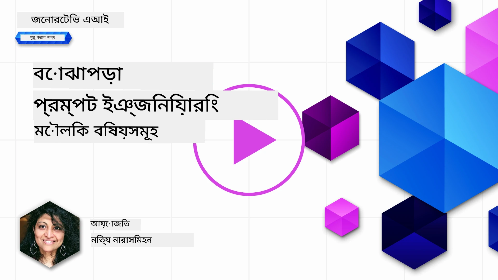
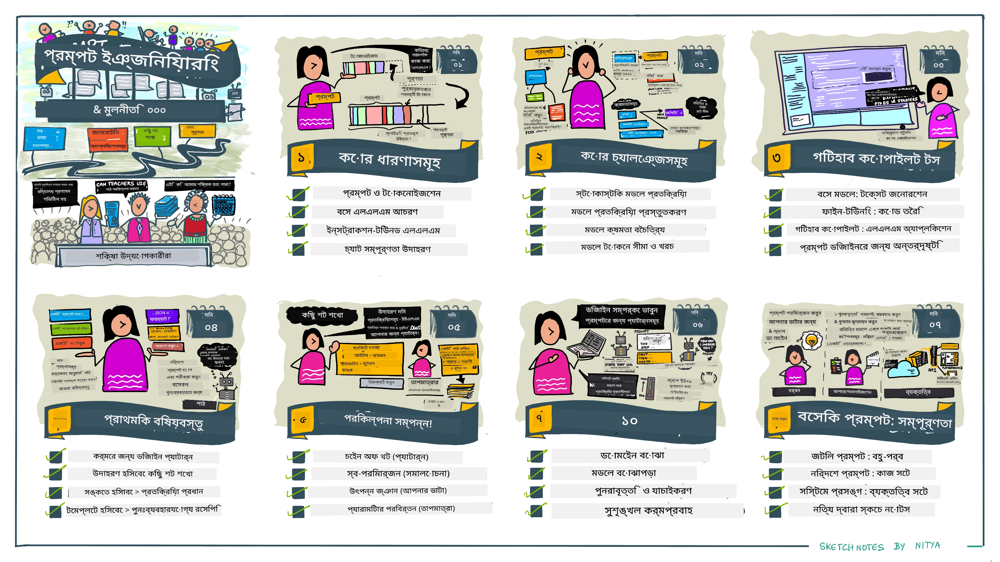
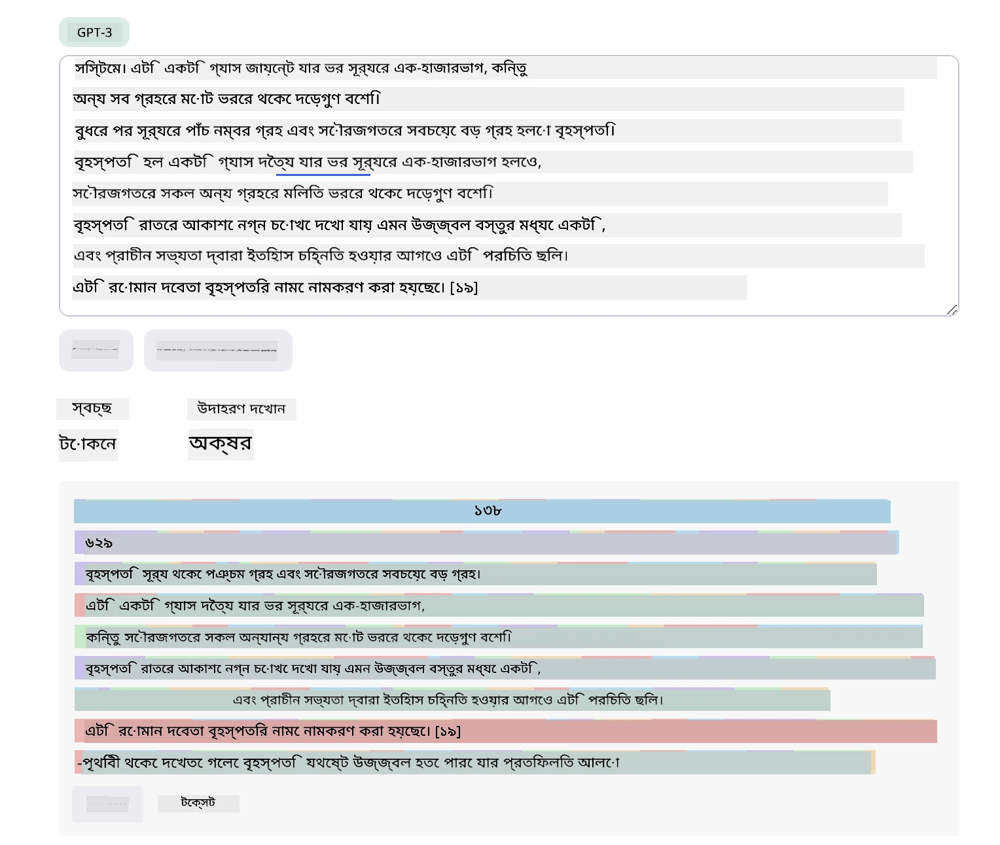
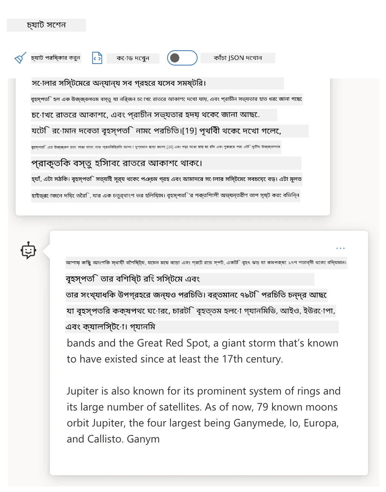
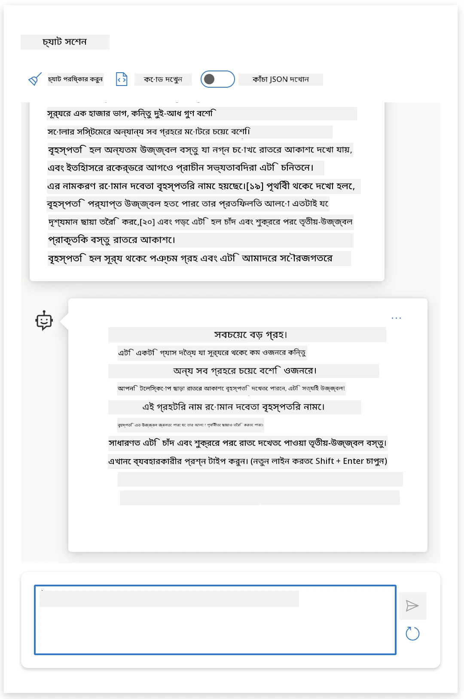
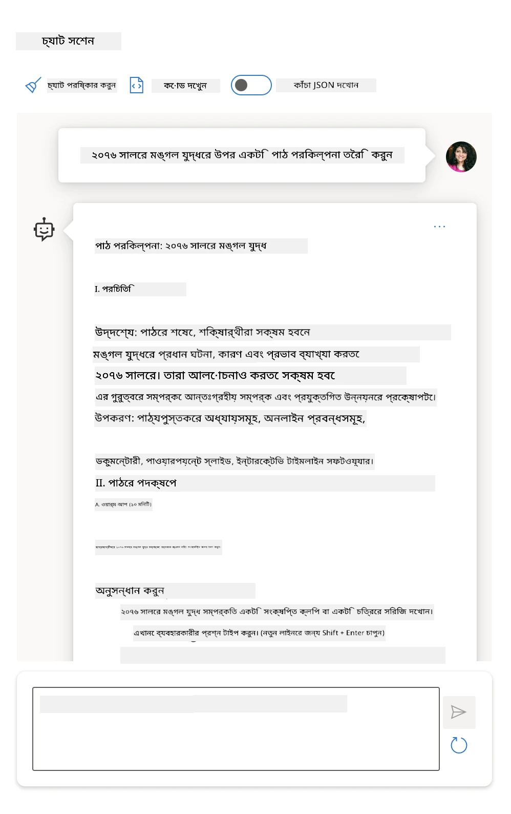
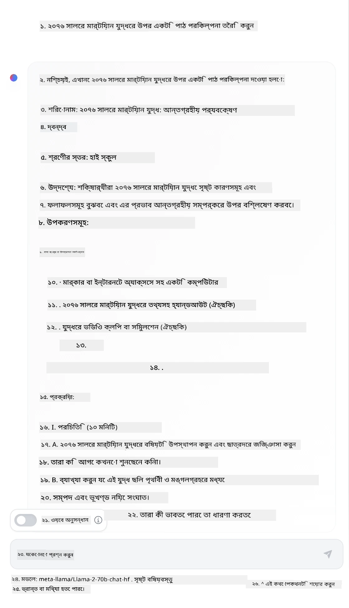

# প্রম্পট ইঞ্জিনিয়ারিং ফান্ডামেন্টালস

[](https://youtu.be/GElCu2kUlRs?si=qrXsBvXnCW12epb8)

## পরিচিতি
এই মডিউলটি জেনারেটিভ AI মডেলগুলিতে কার্যকর প্রম্পট তৈরির জন্য প্রয়োজনীয় ধারণা এবং কৌশলগুলি আচ্ছাদন করে। আপনি যেভাবে LLM-এ আপনার প্রম্পট লেখেন তা গুরুত্বপূর্ণ। সাবধানতার সাথে প্রস্তুত করা একটি প্রম্পট আরও ভাল মানের প্রতিক্রিয়া অর্জন করতে পারে। কিন্তু _প্রম্পট_ এবং _প্রম্পট ইঞ্জিনিয়ারিং_ মত শব্দগুলি আসলে কী অর্থ বহন করে? এবং আমি কিভাবে LLM-কে পাঠানো প্রম্পট _ইনপুট_ উন্নত করব? এই প্রশ্নগুলোর উত্তর আমরা এই অধ্যায় এবং পরবর্তী অধ্যায়ে খুঁজে বের করার চেষ্টা করব।

_জেনারেটিভ AI_ ব্যবহারকারীর অনুরোধ অনুযায়ী নতুন বিষয়বস্তু (যেমন, পাঠ্য, ছবি, অডিও, কোড ইত্যাদি) তৈরি করতে সক্ষম। এটি OpenAI-এর GPT ("Generative Pre-trained Transformer") সিরিজের মতো _বড় ভাষার মডেলগুলির_ মাধ্যমে এটি অর্জন করে যা প্রাকৃতিক ভাষা এবং কোড ব্যবহারের জন্য প্রশিক্ষিত।

ব্যবহারকারীরা এখন চ্যাটের মতো পরিচিত পদ্ধতি ব্যবহার করে এই মডেলগুলির সাথে যোগাযোগ করতে পারে, কোনো প্রযুক্তিগত দক্ষতা বা প্রশিক্ষণের প্রয়োজন ছাড়াই। মডেলগুলি _প্রম্পট-ভিত্তিক_ — ব্যবহারকারীরা একটি টেক্সট ইনপুট (প্রম্পট) পাঠায় এবং AI-এর প্রতিক্রিয়া (সম্পূর্ণতা) ফিরে পায়। তারা পরোপর কথোপকথনে "AI-এর সাথে চ্যাট" করতে পারে, তাদের প্রম্পটটিকে পুনরায় সংশোধন করে যতক্ষণ না প্রতিক্রিয়া তাদের প্রত্যাশার সাথে মেলে।

"প্রম্পটগুলি" এখন জেনারেটিভ AI অ্যাপ্লিকেশনগুলির জন্য প্রধান _প্রোগ্রামিং ইন্টারফেস_ হয়ে উঠেছে, মডেলকে নির্দেশ দেয় যে কী করতে হবে এবং ফেরত আসা প্রতিক্রিয়ার গুণগতমানকে প্রভাবিত করে। "প্রম্পট ইঞ্জিনিয়ারিং" দ্রুত বর্ধনশীল একটি অধ্যয়ন ক্ষেত্র যা স্কেলে ধারাবাহিক এবং মানসম্পন্ন প্রতিক্রিয়া দেওয়ার জন্য প্রম্পটের _ডিজাইন এবং অপ্টিমাইজেশনে_ মনোনিবেশ করে।

## শেখার লক্ষ্য

এই পাঠে, আমরা শিখব প্রম্পট ইঞ্জিনিয়ারিং কী, কেন এটি গুরুত্বপূর্ণ, এবং কীভাবে একটি নির্দিষ্ট মডেল এবং প্রয়োগ লক্ষ্য অনুযায়ী আরও কার্যকর প্রম্পট তৈরি করা যায়। আমরা প্রম্পট ইঞ্জিনিয়ারিং এর মূল ধারণা এবং সেরা অনুশীলনগুলো বোঝব - এবং একটি ইন্টারেক্টিভ জুপিটার নোটবুক "স্যান্ডবক্স" পরিবেশের কথা জানব যেখানে আমরা বাস্তব উদাহরণে এই ধারণাগুলো প্রয়োগ দেখতে পাব।

এই পাঠের শেষে আমরা সক্ষম হব:

1. প্রম্পট ইঞ্জিনিয়ারিং কী এবং কেন তা গুরুত্বপূর্ণ তা ব্যাখ্যা করতে।
2. প্রম্পটের উপাদানসমূহ বর্ণনা করতে এবং সেগুলো কীভাবে ব্যবহৃত হয় তা জানাতে।
3. প্রম্পট ইঞ্জিনিয়ারিং এর সেরা অনুশীলন এবং কৌশলগুলি শেখা।
4. শেখা কৌশলগুলি বাস্তব উদাহরণে প্রয়োগ করা ওপেনএআই এন্ডপয়েন্ট ব্যবহার করে।

## মূল শব্দসমূহ

প্রম্পট ইঞ্জিনিয়ারিং: AI মডেলগুলোকে কাঙ্ক্ষিত আউটপুট উৎপাদনে পরিচালিত করার জন্য ইনপুট ডিজাইন এবং পরিশোধনের প্রক্রিয়া।  
টোকেনাইজেশন: টেক্সটকে ছোট ইউনিটে (টোকেন) রূপান্তর করার প্রক্রিয়া, যা একটি মডেল বুঝতে এবং প্রক্রিয়া করতে পারে।  
ইনস্ট্রাকশন-টিউনড LLMs: বড় ভাষার মডেল (LLM) যেগুলো নির্দিষ্ট নির্দেশনার মাধ্যমে উন্নত সাড়া মান ও প্রাসঙ্গিকতার জন্য ফাইন-টিউনড হয়েছে।

## শেখার স্যান্ডবক্স

প্রম্পট ইঞ্জিনিয়ারিং বর্তমানে বিজ্ঞান থেকে বেশি একটা শিল্প। এটির প্রতি আমাদের অন্তর্দৃষ্টি উন্নত করার সেরা উপায় হলো _অধিক অনুশীলন_ এবং একটি পরীক্ষামূলক পদ্ধতি গ্রহণ করা যা অ্যাপ্লিকেশন ডোমেইন দক্ষতার সাথে সুপারিশকৃত কৌশল এবং মডেল-নির্দিষ্ট অপ্টিমাইজেশনগুলোকে একত্রিত করে।

এই পাঠের সাথে যুক্ত জুপিটার নোটবুক একটি _স্যান্ডবক্স_ পরিবেশ প্রদান করে যেখানে আপনি যা শিখছেন তা চেষ্টা করতে পারেন - চলাকালীন অথবা শেষে কোড চ্যালেঞ্জের অংশ হিসেবে। অনুশীলনগুলো সম্পাদনের জন্য আপনাকে প্রয়োজন:

1. **একটি Azure OpenAI API কী** - একটি ডিপ্লয় করা LLM এর সার্ভিস এন্ডপয়েন্ট।  
2. **একটি পাইথন রানটাইম** - যেখানে নোটবুক কার্যকর করা যাবে।  
3. **লোকাল এনভায়রনমেন্ট ভেরিয়েবলস** - _এখনই [SETUP](./../00-course-setup/02-setup-local.md?WT.mc_id=academic-105485-koreyst) ধাপগুলি সম্পন্ন করুন প্রস্তুতির জন্য_।

নোটবুকটি _স্টার্টার_ অনুশীলন নিয়ে আসে - কিন্তু আপনি নিজের _মার্কডাউন_ (বর্ণনা) এবং _কোড_ (প্রম্পট অনুরোধ) সেকশন যোগ করতে উৎসাহিত যাতে আপনি আরো উদাহরণ বা ভাবনা পরীক্ষা করতে পারেন - এবং প্রম্পট ডিজাইনের প্রতি আপনার অন্তর্দৃষ্টি নির্মাণ করতে পারেন।

## চিত্রিত গাইড

আপনি কি এই পাঠের বড় চিত্রটি জানতে চান, ডুব দেওয়ার আগে? এই চিত্রিত গাইডটি দেখুন, যা আপনাকে প্রধান বিষয়গুলো এবং প্রতিটিতে ভাবার জন্য মূল পয়েন্টগুলো বর্ণনা করে। পাঠের রোডম্যাপ আপনাকে মূল ধারণাগুলো এবং চ্যালেঞ্জগুলো বোঝার থেকে এগিয়ে নিয়ে যাবে প্রাসঙ্গিক প্রম্পট ইঞ্জিনিয়ারিং কৌশল এবং সেরা অনুশীলনের মাধ্যমে সেগুলো সমাধানের দিক। মনে রাখবেন, গাইডের "উন্নত কৌশলগুলি" অংশটি এই পাঠক্রমের _পরবর্তী_ অধ্যায়ে উল্লেখিত বিষয়বস্তু নির্দেশ করে।



## আমাদের স্টার্টআপ

এখন, আসুন কথা বলি কিভাবে _এই বিষয়টি_ আমাদের স্টার্টআপ মিশনের সাথে সংযুক্ত, যা [শিক্ষায় AI প্রযুক্তি আনার](https://educationblog.microsoft.com/2023/06/collaborating-to-bring-ai-innovation-to-education?WT.mc_id=academic-105485-koreyst) লক্ষ্যমাত্রা ধরা হয়েছে। আমরা ব্যক্তিগতকৃত শিক্ষার AI-চালিত অ্যাপ্লিকেশন তৈরি করতে চাই - তাই ভাবা যাক আমাদের অ্যাপ্লিকেশনের বিভিন্ন ব্যবহারকারী কিভাবে প্রম্পট "ডিজাইন" করতে পারে:

- **প্রশাসকরা** AI কে অনুরোধ করতে পারেন _পাঠক্রম তথ্য বিশ্লেষণ করার জন্য এবং কাভারেজের ফাঁক সমূহ সনাক্ত করার জন্য_। AI ফলাফলগুলো সারসংক্ষেপ করতে পারে বা কোডসহ ভিজ্যুয়ালাইজ করতে পারে।  
- **শিক্ষকরা** AI কে বলতে পারেন _লক্ষ্যিত শ্রোতা এবং বিষয়ের জন্য একটি পাঠ পরিকল্পনা তৈরি করতে_। AI নির্দিষ্ট ফরম্যাটে ব্যক্তিগতকৃত পরিকল্পনা তৈরি করতে পারে।  
- **শিক্ষার্থীরা** AI কে বলতে পারে _তাদের কঠিন একটি বিষয় শেখাতে_। AI এবার শিক্ষার্থীদের তাদের স্তরের জন্য উপযুক্ত পাঠ, সংকেত ও উদাহরণের মাধ্যমে গাইড করতে পারে।

এগুলো কেবল শুরু মাত্র। একটি বিস্তৃত ধারণার জন্য দেখুন [Prompts For Education](https://github.com/microsoft/prompts-for-edu/tree/main?WT.mc_id=academic-105485-koreyst) — এক শিক্ষাবিদদের দ্বারা তৈরি একটি ওপেন-সোর্স প্রম্পট লাইব্রেরি! _স্যান্ডবক্সে বা OpenAI প্লেগ্রাউন্ডে কিছু প্রম্পট চালিয়ে দেখুন কী ফলাফল আসে!_

<!--
LESSON TEMPLATE:
This unit should cover core concept #1.
Reinforce the concept with examples and references.

CONCEPT #1:
Prompt Engineering.
Define it and explain why it is needed.
-->

## প্রম্পট ইঞ্জিনিয়ারিং কী?

আমরা এই পাঠ শুরু করেছি প্রম্পট ইঞ্জিনিয়ারিংকে সংজ্ঞায়িত করে, যা হলো একটি নির্দিষ্ট অ্যাপ্লিকেশন লক্ষ্যমাত্রা এবং মডেলের জন্য ধারাবাহিক এবং গুণগত মানের প্রতিক্রিয়া (সম্পূর্ণতা) প্রদানের জন্য টেক্সট ইনপুট (প্রম্পট) ডিজাইন এবং অপ্টিমাইজ করার প্রক্রিয়া। আমরা এটিকে দু-ধাপের প্রক্রিয়া হিসাবে ভাবতে পারি:

- একটি নির্দিষ্ট মডেল এবং লক্ষ্যমাত্রার জন্য প্রাথমিক প্রম্পট _ডিজাইন_ করা  
- প্রতিক্রিয়ার মান উন্নত করতে প্রম্পটকে পরপর _সংশোধন_ করা  

এটি অবশ্যই একটি পরীক্ষানিরীক্ষা ও ভুল-ভ্রান্তির পদ্ধতি, যা ব্যবহারকারীর অন্তর্দৃষ্টি এবং প্রচেষ্টা প্রয়োজন যাতে সর্বোত্তম ফলাফল পাওয়া যায়। তাহলে কেন এটি গুরুত্বপূর্ণ? সেই প্রশ্নের উত্তর জানার জন্য আমাদের প্রথমে তিনটি ধারণা বুঝতে হবে:

- _টোকেনাইজেশন_ = মডেল কীভাবে প্রম্পট "দেখে"  
- _বেস LLM_ = বেস মডেল কীভাবে একটি প্রম্পট "প্রক্রিয়া করে"  
- _ইনস্ট্রাকশন-টিউনড LLM_ = মডেল এখন কীভাবে "কার্য" দেখতে পারে  

### টোকেনাইজেশন

একটি LLM প্রম্পটকে _টোকেনের ক্রম_ হিসেবে দেখে যেখানে বিভিন্ন মডেল (অথবা একটি মডেলের বিভিন্ন সংস্করণ) একই প্রম্পটকে বিভিন্নভাবে টোকেনাইজ করতে পারে। যেহেতু LLM গুলো টোকেনের উপর প্রশিক্ষিত (কাঁচা টেক্সট নয়), প্রম্পটগুলি যেভাবে টোকেনাইজ করা হয় তা তৈরি হওয়া প্রতিক্রিয়ার গুণমানের উপর সরাসরি প্রভাব ফেলে।

টোকেনাইজেশনের কাজ কীভাবে হয় তা বোঝার জন্য, নিচের মতো টুল ব্যবহার করে দেখতে পারেন যেমন [OpenAI Tokenizer](https://platform.openai.com/tokenizer?WT.mc_id=academic-105485-koreyst) যা নিচে দেখানো হয়েছে। আপনার প্রম্পট কপি করে সেখানে বসান - এবং দেখুন কিভাবে সেটি টোকেনে রূপান্তরিত হচ্ছে, বিশেষ করে কীভাবে স্পেস ও বিরামচিহ্নগুলো হ্যান্ডেল হচ্ছে তা নিশ্চিত করুন। লক্ষ্য করুন, এই উদাহরণটি পুরনো একটি LLM (GPT-3) প্রদর্শন করে - তাই নতুন মডেলের সাথে চেষ্টা করলে ভিন্ন ফলাফল আসতে পারে।



### ধারণা: ফাউন্ডেশন মডেল

এখন একটি প্রম্পট যদি টোকেনাইজ করা হয়, ["বেস LLM"](https://blog.gopenai.com/an-introduction-to-base-and-instruction-tuned-large-language-models-8de102c785a6?WT.mc_id=academic-105485-koreyst) (অথবা ফাউন্ডেশন মডেল) এর প্রধান কাজ হলো ওই ক্রমে পরবর্তী টোকেনের পূর্বাভাস দেওয়া। যেহেতু LLM গুলো বিশাল টেক্সট ডেটাসেটে প্রশিক্ষিত, তাই এগুলো টোকেনগুলোর মধ্যে সংখ্যাত্মক সম্পর্ক ভাল বুঝতে পারে এবং কিছুটা আত্মবিশ্বাসের সাথে পূর্বাভাস দিতে পারে। লক্ষ্য করুন তারা প্রম্পট বা টোকেনের শব্দগুলোর _অর্থ_ বোঝে না; তারা শুধুমাত্র একটি প্যাটার্ন দেখে যা তারা তাদের পরবর্তী পূর্বাভাস দিয়ে "সম্পূর্ণ" করতে পারে। ব্যবহারকারীর হস্তক্ষেপ অথবা পূর্বনির্ধারিত কোনো শর্ত পূর্ণ না হওয়া পর্যন্ত তারা ক্রমটি পূর্বাভাস দিতে থাকে।

আপনি কি দেখতে চান প্রম্পট-ভিত্তিক সম্পূর্ণতা কীভাবে কাজ করে? উপরের প্রম্পটটি Azure OpenAI Studio [_Chat Playground_](https://oai.azure.com/playground?WT.mc_id=academic-105485-koreyst) এ ডিফল্ট সেটিংস সহ প্রবেশ করান। সিস্টেম প্রম্পটগুলোকে তথ্যের অনুরোধ হিসেবে বিবেচনা করে – তাই আপনি সেই প্রসঙ্গে সন্তুষ্টিকর একটি সম্পূর্ণতা দেখতে পাবেন।

কিন্তু যদি ব্যবহারকারী এমন কিছু দেখতে চায় যা কোনো নির্দিষ্ট শর্ত বা কাজের লক্ষ্য পূরণ করে? তখনই _ইনস্ট্রাকশন-টিউনড_ LLMগুলো জরুরি হয়ে পড়ে।



### ধারণা: ইনস্ট্রাকশন-টিউনড LLM

একটি [ইনস্ট্রাকশন-টিউনড LLM](https://blog.gopenai.com/an-introduction-to-base-and-instruction-tuned-large-language-models-8de102c785a6?WT.mc_id=academic-105485-koreyst) বেস মডেলের উপর ভিত্তি করে শুরু করে এবং উদাহরণ বা ইনপুট/আউটপুট জোড়া (যেমন, বহু-পর্বের "মেসেজ") ব্যবহার করে ফাইন-টিউন করে, যেখানে স্পষ্ট নির্দেশনা থাকতে পারে - এবং AI সেই নির্দেশনা অনুসরণ করার চেষ্টা করে প্রতিক্রিয়া দেয়।

এটি Reinforcement Learning with Human Feedback (RLHF) এর মত কৌশল ব্যবহার করে যাতে মডেলকে _নির্দেশনা অনুসরণ_ এবং _প্রতিক্রিয়া থেকে শেখার_ জন্য প্রশিক্ষণ দেওয়া যায়; ফলে প্রয়োগগত দিক থেকে উপযুক্ত এবং ব্যবহারকারী লক্ষ্য অনুযায়ী প্রাসঙ্গিক প্রতিক্রিয়া উৎপাদন করে।

চেষ্টা করে দেখুন — উপরের প্রম্পটটি আবার দেখুন, কিন্তু এখন _সিস্টেম মেসেজ_ পরিবর্তন করে নিম্নলিখিত নির্দেশনা প্রসঙ্গ হিসেবে দিন:

> _আপনাকে প্রদত্ত বিষয়বস্তু দ্বিতীয়-শ্রেণীর শিক্ষার্থীর জন্য সংক্ষেপ করুন। ফলাফল এক অনুচ্ছেদ এবং ৩-৫ টির্বল পয়েন্টে সীমাবদ্ধ রাখুন।_

দেখুন ফলাফল এখন কাঙ্ক্ষিত লক্ষ্য ও বিন্যাসের সঙ্গে সঙ্গতিপূর্ণ। একজন শিক্ষক এই প্রতিক্রিয়াটি সরাসরি তাদের শ্রেণীর স্লাইডে ব্যবহার করতে পারেন।



## আমরা কেন প্রম্পট ইঞ্জিনিয়ারিং প্রয়োজন?

এখন আমরা জানি কিভাবে LLM গুলো প্রম্পট প্রক্রিয়া করে, আসুন কথা বলি _কেন_ প্রম্পট ইঞ্জিনিয়ারিং দরকার। এর উত্তরে রয়েছে যে বর্তমান LLM গুলো কিছু চ্যালেঞ্জ নিয়ে আসে যা _ভরসাযোগ্য এবং ধারাবাহিক সম্পূর্ণতা_ অর্জন করাকে কঠিন করে তোলে যদি না প্রম্পট নির্মাণ ও অপ্টিমাইজেশনে প্রচেষ্টা দেওয়া হয়। উদাহরণ স্বরূপ:

1. **মডেলের প্রতিক্রিয়া স্টোকাস্টিক।** _একই প্রম্পট_ বিভিন্ন মডেল বা সংস্করণের সঙ্গে হয়তো বিভিন্ন প্রতিক্রিয়া তৈরি করবে। এবং একই মডেল ব্যবহার করলেও বিভিন্ন সময়ে বিভিন্ন ফলাফল আসতে পারে। _প্রম্পট ইঞ্জিনিয়ারিং কৌশলগুলো এই ভিন্নতাগুলো কমাতে সাহায্য করতে পারে ভাল গার্ডরেল সরবরাহ করে।_

1. **মডেলগুলি প্রতিক্রিয়া গড়ে তুলতে পারে।** মডেলগুলি _বৃহৎ কিন্তু সীমিত_ ডেটাসেটে প্রাক-প্রশিক্ষিত, যার অর্থ তারা প্রশিক্ষণ সীমার বাইরে থাকা ধারণাগুলো সম্পর্কে জ্ঞানে অভাবী। ফলে তারা এমন সম্পূর্ণতা তৈরি করতে পারে যা ভুল, কল্পিত, বা জানা সত্যের সাথে সরাসরি বিরোধপূর্ণ হতে পারে। _প্রম্পট ইঞ্জিনিয়ারিং ব্যবহারকারীদের এই রকম গড়া তথ্য সনাক্ত ও হ্রাস করতে সাহায্য করে যেমন, AI-কে উত্স কিংবা যুক্তি জিজ্ঞাসা করা।_

1. **মডেল ক্ষমতাগুলো ভিন্ন হবে।** নতুন মডেল বা মডেল প্রজন্মগুলো আরও সমৃদ্ধ ক্ষমতা নিয়ে আসবে কিন্তু নিজেদের অনন্য সমস্যা, খরচ ও জটিলতার ব্যবসায় ঝুঁকি নিয়ে আসবে। _প্রম্পট ইঞ্জিনিয়ারিং সেরা অনুশীলন এবং ওয়ার্কফ্লো গঠন করতে সাহায্য করে যা পার্থক্যগুলো বিমূর্ত করে এবং মডেল-নির্দিষ্ট চাহিদা অনুযায়ী স্কেলেবল, সিমলেস উপায়ে অভিযোজন সম্ভব করে।_

এসব আমরা OpenAI বা Azure OpenAI প্লেগ্রাউন্ডে পরীক্ষা করে দেখতে পারি:

- একই প্রম্পট বিভিন্ন LLM ডিপ্লয়মেন্ট (যেমন, OpenAI, Azure OpenAI, Hugging Face) এর সাথে ব্যবহার করুন — আপনি কি ভিন্নতা লক্ষ্য করেছেন?  
- একই প্রম্পট একটি _একই_ LLM ডিপ্লয়মেন্টে বারবার ব্যবহার করুন (যেমন, Azure OpenAI প্লেগ্রাউন্ড) — এই ভিন্নতাগুলো কীভাবে আলাদা ছিল?

### গড়ানো তথ্যের উদাহরণ

এই কোর্সে আমরা **"গড়ানো"** শব্দটি ব্যবহার করি যেখানে LLM কখনও কখনও তাদের প্রশিক্ষণের সীমাবদ্ধতা বা অন্যান্য সীমাবদ্ধতার কারণে তথ্যগতভাবে ভুল তথ্য উত্পন্ন করে। জনপ্রিয় প্রবন্ধ বা গবেষণা পত্রগুলিতে এটিকে _"হ্যালুসিনেশন"_ হিসেবেও উল্লেখ করা হয়েছে। তবে আমরা দৃঢ়ভাবে সুপারিশ করি _"গড়ানো"_ শব্দটি ব্যবহার করতে যাতে আমরা ভুলবশত মানুষের মতো বৈশিষ্ট্য মেশিন দ্বারা চালিত ফলাফলে স্থাপন না করি। এটি [দায়িত্বশীল AI নির্দেশিকা](https://www.microsoft.com/ai/responsible-ai?WT.mc_id=academic-105485-koreyst) এর দৃষ্টিতে টার্মিনোলজির যথাযথ ব্যবহার নিশ্চিত করে, যা কিছু ক্ষেত্রে সহিংস বা অন্তর্ভুক্তিহীন শব্দ নির্মূল করে।

আপনি কি দেখতে চান গড়ানো কিভাবে কাজ করে? এমন একটি প্রম্পট ভাবুন যা AI কে একটি অস্থিতিশীল বিষয়ের জন্য বিষয়বস্তু তৈরি করতে নির্দেশ দেয় (যাতে এটি প্রশিক্ষণ ডেটাসেটে পাওয়া না যায়)। উদাহরণস্বরূপ — আমি এই প্রম্পটটি চেষ্টা করেছি:

> **প্রম্পট:** 2076 সালের মার্টিয়ান যুদ্ধের উপর একটি পাঠ পরিকল্পনা তৈরি করুন।
একটি ওয়েব অনুসন্ধান আমাকে দেখিয়েছিল যে মার্টিয়ান যুদ্ধে (যেমন, টেলিভিশন সিরিজ বা বই) কাল্পনিক বিবরণ রয়েছে—কিন্তু ২০৭৬ সালে নয়। সাধারণ জ্ঞানও বলে যে ২০৭৬ _ভবিষ্যতে_ এবং সুতরাং, এটি কোনো বাস্তব ঘটনার সঙ্গে যুক্ত হতে পারে না।

তাহলে কী ঘটে যখন আমরা বিভিন্ন LLM প্রদানকারীদের সাথে এই প্রম্পট চালাই?

> **প্রতিক্রিয়া ১**: OpenAI প্লেগ্রাউন্ড (GPT-35)


> **প্রতিক্রিয়া ২**: Azure OpenAI প্লেগ্রাউন্ড (GPT-35)



> **প্রতিক্রিয়া ৩**: : Hugging Face চ্যাট প্লেগ্রাউন্ড (LLama-2)



প্রত্যাশা অনুযায়ী, প্রতিটি মডেল (বা মডেল সংস্করণ) অপেক্ষাকৃত ভিন্ন প্রতিক্রিয়া উৎপন্ন করে, যা স্টোকাস্টিক আচরণ এবং মডেলের সক্ষমতার পার্থক্যের কারণ। উদাহরণস্বরূপ, একটি মডেল ৮ম শ্রেণির ছাত্রদের লক্ষ্য করে, অন্যটি ‍উচ্চ বিদ্যালয়ের ছাত্রকে ধরে নেয়। কিন্তু তিনটি মডেলই এমন প্রতিক্রিয়া তৈরি করেছে যা অজ্ঞাত ব্যবহারকারীকে এই ঘটনা বাস্তব বলে বিশ্বাস করাতে পারে।

প্রম্পট ইঞ্জিনিয়ারিং কৌশল যেমন _মেটাপ্রম্পটিং_ এবং _তাপমাত্রা কনফিগারেশন_ কিছুটা মডেল তৈরি ভুল কমাতে পারে। নতুন প্রম্পট ইঞ্জিনিয়ারিং _আর্কিটেকচার_ গুলো নতুন টুল এবং কৌশলগুলি নির্বিঘ্নে প্রম্পট ফ্লো তে অন্তর্ভুক্ত করে, যা এই প্রভাবগুলির কিছু মিটিগেট বা হ্রাস করতে সাহায্য করে।

## কেস স্টাডি: GitHub Copilot

চলুন এই অংশটি একটি কেস স্টাডি দেখে শেষ করি: [GitHub Copilot](https://github.com/features/copilot?WT.mc_id=academic-105485-koreyst) কীভাবে প্রম্পট ইঞ্জিনিয়ারিং বাস্তব জগতে ব্যবহৃত হয় তার একটা ধারণা নিতে।

GitHub Copilot হলো আপনার "AI যুগল প্রোগ্রামার"—এটি টেক্সট প্রম্পটকে কোড সম্পূরকরণে রূপান্তর করে এবং আপনার ডেভেলপমেন্ট এনভায়রনমেন্টে (যেমন, Visual Studio Code) সংহত করে অকপট ব্যবহারকারীর অভিজ্ঞতার জন্য। নীচের ব্লগ সিরিজে যা ডকুমেন্ট করা হয়েছে, প্রাথমিক সংস্করণ ছিল OpenAI Codex মডেলের উপর ভিত্তি করে—যেখানে ইঞ্জিনিয়াররা দ্রুত বুঝতে পারে মডেলটিকে ফাইন-টিউন করার এবং উন্নত প্রম্পট ইঞ্জিনিয়ারিং কৌশল বিকাশের প্রয়োজন, কোডের গুণমান বাড়ানোর জন্য। জুলাই মাসে, তারা [Codex ছাড়িয়ে একটি উন্নত AI মডেল উন্মোচন করেছে](https://github.blog/2023-07-28-smarter-more-efficient-coding-github-copilot-goes-beyond-codex-with-improved-ai-model/?WT.mc_id=academic-105485-koreyst) দ্রুততর সাজেশন দেওয়ার জন্য।

তাদের শেখার যাত্রা অনুসরণ করতে পোস্টগুলো ধারাবাহিকভাবে পড়ুন।

- **মে ২০২৩** | [GitHub Copilot আপনার কোড বুঝতে আরও ভালো হচ্ছে](https://github.blog/2023-05-17-how-github-copilot-is-getting-better-at-understanding-your-code/?WT.mc_id=academic-105485-koreyst)
- **মে ২০২৩** | [GitHub-এর অন্তর্দৃষ্টি: GitHub Copilot-এর পেছনের LLM-এর সাথে কাজ করা](https://github.blog/2023-05-17-inside-github-working-with-the-llms-behind-github-copilot/?WT.mc_id=academic-105485-koreyst)
- **জুন ২০২৩** | [GitHub Copilot-এর জন্য কিভাবে ভালো প্রম্পট লিখবেন](https://github.blog/2023-06-20-how-to-write-better-prompts-for-github-copilot/?WT.mc_id=academic-105485-koreyst)
- **জুলাই ২০২৩** | [GitHub Copilot Codex ছাড়িয়ে উন্নত AI মডেলের সাথে যায়](https://github.blog/2023-07-28-smarter-more-efficient-coding-github-copilot-goes-beyond-codex-with-improved-ai-model/?WT.mc_id=academic-105485-koreyst)
- **জুলাই ২০২৩** | [একজন ডেভেলপার এর গাইড টু প্রম্পট ইঞ্জিনিয়ারিং এবং LLMs](https://github.blog/2023-07-17-prompt-engineering-guide-generative-ai-llms/?WT.mc_id=academic-105485-koreyst)
- **সেপ্টেম্বর ২০২৩** | [কিভাবে একটি এন্টারপ্রাইজ LLM অ্যাপ তৈরি করবেন: GitHub Copilot থেকে শেখা পাঠ](https://github.blog/2023-09-06-how-to-build-an-enterprise-llm-application-lessons-from-github-copilot/?WT.mc_id=academic-105485-koreyst)

তাদের আরও পোস্টের জন্য [ইঞ্জিনিয়ারিং ব্লগ](https://github.blog/category/engineering/?WT.mc_id=academic-105485-koreyst) ব্রাউজ করতে পারেন, যেমন [এই পোস্টটি](https://github.blog/2023-09-27-how-i-used-github-copilot-chat-to-build-a-reactjs-gallery-prototype/?WT.mc_id=academic-105485-koreyst) যেখানে দেখানো হয়েছে কিভাবে এই মডেল ও কৌশলগুলি বাস্তব অ্যাপ্লিকেশন পরিচালনার জন্য _প্রয়োগ_ করা হয়।

---

<!--
LESSON TEMPLATE:
This unit should cover core concept #2.
Reinforce the concept with examples and references.

CONCEPT #2:
Prompt Design.
Illustrated with examples.
-->

## প্রম্পট নির্মাণ

আমরা দেখেছি কেন প্রম্পট ইঞ্জিনিয়ারিং গুরুত্বপূর্ণ—এখন আসুন বুঝি প্রম্পটগুলো কিভাবে _নির্মিত_ হয় যাতে আমরা বিভিন্ন কৌশল মূল্যায়ন করতে পারি আরও কার্যকর প্রম্পট ডিজাইনের জন্য।

### মৌলিক প্রম্পট

চলুন শুরু করি মৌলিক প্রম্পট দিয়ে: মডেলে পাঠানো একটি পাঠ্য ইনপুট, অন্য কোনো প্রসঙ্গ ছাড়া। উদাহরণস্বরূপ, যখন আমরা মার্কিন জাতীয় সঙ্গীতের প্রথম কয়েকটি শব্দ OpenAI [Completion API](https://platform.openai.com/docs/api-reference/completions?WT.mc_id=academic-105485-koreyst) এ পাঠাই, এটি তৎক্ষণাৎ পরবর্তী কয়েকটি লাইন দিয়ে উত্তর _সম্পূরক_ করে, মৌলিক পূর্বাভাস আচরণ প্রদর্শন করে।

| প্রম্পট (ইনপুট)     | সম্পূরক (আউটপুট)                                                                                                                        |
| :----------------- | :----------------------------------------------------------------------------------------------------------------------------------------- |
| Oh say can you see | এটি শুনে মনে হচ্ছে আপনি "The Star-Spangled Banner," যুক্তরাষ্ট্রের জাতীয় সঙ্গীতের লিরিক্স শুরু করছেন। সম্পূর্ণ লিরিক্স হলো ... |

### জটিল প্রম্পট

এখন চলুন ঐ মৌলিক প্রম্পটে প্রসঙ্গ এবং নির্দেশনা যোগ করি। [Chat Completion API](https://learn.microsoft.com/azure/ai-services/openai/how-to/chatgpt?WT.mc_id=academic-105485-koreyst) আমাদের একটি জটিল প্রম্পট তৈরি করতে দেয় যা _মেসেজ_ সংগ্রহ হিসাবে:

- ইনপুট/আউটপুট জোড়া যা _ব্যবহারকারী_ ইনপুট এবং _সহকারী_ প্রতিক্রিয়া প্রতিফলিত করে।
- সিস্টেম মেসেজ যা সহকারীর আচরণ অথবা ব্যক্তিত্বের প্রসঙ্গ নির্ধারণ করে।

অনুরোধ এখন নিচের আকারে, যেখানে _টোকেনাইজেশন_ কার্যকরভাবে প্রসঙ্গ এবং কথোপকথন থেকে প্রাসঙ্গিক তথ্য ধরেছে। এখন, সিস্টেম প্রসঙ্গ পরিবর্তন করা সম্পূরকের মানে প্রভাব ফেলতে পারে, যেমন ব্যবহারকারীর ইনপুট পরিবর্তিত হয়।

```python
response = openai.chat.completions.create(
    model="gpt-3.5-turbo",
    messages=[
        {"role": "system", "content": "You are a helpful assistant."},
        {"role": "user", "content": "Who won the world series in 2020?"},
        {"role": "assistant", "content": "The Los Angeles Dodgers won the World Series in 2020."},
        {"role": "user", "content": "Where was it played?"}
    ]
)
```

### নির্দেশনা প্রম্পট

উপরের উদাহরণে, ব্যবহারকারীর প্রম্পট ছিল একটি সরল টেক্সট প্রশ্ন যা তথ্য চাওয়ার অনুরোধ হিসেবে ব্যাখ্যা করা যায়। _নির্দেশনা_ প্রম্পটের মাধ্যমে আমরা সেই টেক্সট ব্যবহার করে কাজটি আরও বিস্তারিত Specify করতে পারি, AI-কে আরও ভালো নির্দেশনা দিতে। এখানে একটি উদাহরণ:

| প্রম্পট (ইনপুট)                                                                                                                                                                                                                         | সম্পূরক (আউটপুট)                                                                                                        | নির্দেশনার ধরন    |
| :------------------------------------------------------------------------------------------------------------------------------------------------------------------------------------------------------------------------------------- | :------------------------------------------------------------------------------------------------------------------------- | :------------------ |
| Write a description of the Civil War                                                                                                                                                                                                   | _সরল একটি প্যারাগ্রাফ ফিরিয়ে দেয়_                                                                                         | সরল               |
| Write a description of the Civil War. Provide key dates and events and describe their significance                                                                                                                                     | _একটি প্যারাগ্রাফ এবং কী গুরুত্বপূর্ণ ঘটনাগুলোর তারিখসহ বর্ণনা প্রদান করে_                                                     | জটিল               |
| Write a description of the Civil War in 1 paragraph. Provide 3 bullet points with key dates and their significance. Provide 3 more bullet points with key historical figures and their contributions. Return the output as a JSON file | _একটি টেক্সট বক্সে বিস্তৃত বিস্তারিত দিয়ে JSON আকারে আউটপুট দেয়, যা কপি-পেস্ট করে ফাইল হিসেবে ভ্যালিডেট করা যায়_                | জটিল। ফরম্যাটকৃত। |

## প্রধান বিষয়বস্তু

উপরের উদাহরণগুলোতে, প্রম্পট এখনও মোটামুটি মুক্ত ছিল, LLM নিজেই প্রাক-প্রশিক্ষিত ডেটাসেটের কোন অংশ প্রাসঙ্গিক তা ঠিক করত। _প্রাথমিক বিষয়বস্তু_ ডিজাইন প্যাটার্নে, ইনপুট টেক্সট দুই ভাগে বিভক্ত:

- একটি নির্দেশনা (কর্ম)
- প্রাসঙ্গিক বিষয়বস্তু (যা কর্মকে প্রভাবিত করে)

এখানে একটি উদাহরণ যেখানে নির্দেশনা হলো "এটি ২ বাক্যে সংক্ষেপ করুন"।

| প্রম্পট (ইনপুট)                                                                                                                                                                                                                                                                                                                                                                                                                                                                                                                                                                                                                                                                                      | সম্পূরক (আউটপুট)                                                                                                                                                                                                                                                                             |
| :-------------------------------------------------------------------------------------------------------------------------------------------------------------------------------------------------------------------------------------------------------------------------------------------------------------------------------------------------------------------------------------------------------------------------------------------------------------------------------------------------------------------------------------------------------------------------------------------------------------------------------------------------------------------------------------------------- | :---------------------------------------------------------------------------------------------------------------------------------------------------------------------------------------------------------------------------------------------------------------------------------------------- |
| Jupiter হলো সূর্য থেকে پانچ নম্বর গ্রহ এবং সৌরজগতের সবচেয়ে বড় গ্রহ। এটি একটি গ্যাস দৈত্য, যার ভর সূর্যের এক হাজার ভাগের এক ভাগ, কিন্তু সৌরজগতের অন্যান্য সমস্ত গ্রহের মোট ভরের থেকে দুই ও আধগুণ বেশী। জুপিটার হলো স্বাধীন চোখে দেখা সবচেয়ে উজ্জ্বল বস্তুর মধ্যে একটি, এবং এটি প্রাচীন সভ্যতার আগে থেকেই জানা। এটি রোমান দেবতা জুপিটার এর নামে নামকরণ করা হয়েছে।[19] পৃথিবী থেকে দেখা গেলে, জুপিটার যথেষ্ট উজ্জ্বল হতে পারে যাতে এর প্রতিফলিত আলো দৃশ্যমান ছায়া তৈরি করে,[20] এবং গড়ে এটি চাঁদ এবং ভেনাসের পরে তৃতীয় উজ্জ্বলতম প্রাকৃতিক বস্তু। <br/> **এটি ২টি সংক্ষিপ্ত বাক্যে সংক্ষেপ করুন** | জুপিটার, সূর্য থেকে পঞ্চম গ্রহ, সৌরজগতের সবচেয়ে বড় গ্রহ এবং রাত্রি আকাশে সবচেয়ে উজ্জ্বল বস্তুর মধ্যে একটি। রোমান দেবতা জুপিটার এর নামে নামকৃত, এটি একটি গ্যাস দৈত্য যার ভর সৌরজগতের অন্যান্য সব গ্রহের মিলে যোগফলের থেকে দুই ও আধগুণ বেশি। |

প্রাথমিক বিষয়বস্তু বিভাগ বিভিন্নভাবে ব্যবহার করা যেতে পারে আরও কার্যকর নির্দেশনা দিতে:

- **উদাহরণ** - মডেলকে সরাসরি কি করতে হবে না বলে, একটি ইঙ্গিত দেওয়া হয় তার কাঙ্ক্ষিত আউটপুটের উদাহরণ দিয়ে ও এটি থেকে প্যাটার্ন অনুমান করার সুযোগ দেওয়া হয়।
- **কিউ** - নির্দেশনার পরে একটি "কিউ" যোগ করা হয় যা পরিপূরককে প্রাথমিক করে, মডেলকে আরও প্রাসঙ্গিক সাড়া দেওয়ার দিকে পরিচালিত করে।
- **টার্মপ্লেট** - এগুলো পুনরাবৃত্তিযোগ্য রেসিপি যার মধ্যে প্লেসহোল্ডার (ভেরিয়েবল) থাকে যা নির্দিষ্ট কাজের জন্য ডেটা দিয়ে কাস্টমাইজ করা যায়।

এগুলি প্রত্যেকটিকে আমরা পরীক্ষায় দেখি।

### উদাহরণ ব্যবহার

এটি একটি পদ্ধতি যেখানে আপনি প্রাথমিক বিষয়বস্তু হিসেবে কিছু উদাহরণ দিয়ে মডেলকে কাঙ্ক্ষিত আউটপুটের ধরন শেখান, এবং মডেল প্যাটার্ন অনুমান করে কাঙ্ক্ষিত আউটপুট তৈরি করে। উদাহরণের সংখ্যার উপর ভিত্তি করে, আমরা শূন্য-শট, এক-শট, বা কয়েক-শট প্রম্পটিং করতে পারি।

প্রম্পট এখন তিনটি উপাদানের সমন্বয়ে:

- একটি কাজের বর্ণনা
- কাঙ্ক্ষিত আউটপুটের কয়েকটি উদাহরণ
- একটি নতুন উদাহরণ শুরু (যা আসলে একটি ইঙ্গিতমূলক কাজের বর্ণনা)

| শেখার ধরন | প্রম্পট (ইনপুট)                                                                                                                                        | সম্পূরক (আউটপুট)         |
| :------------ | :---------------------------------------------------------------------------------------------------------------------------------------------------- | :-------------------------- |
| শূন্য-শট      | "The Sun is Shining". Translate to Spanish                                                                                                            | "El Sol está brillando".    |
| এক-শট        | "The Sun is Shining" => ""El Sol está brillando". <br> "It's a Cold and Windy Day" =>                                                                 | "Es un día frío y ventoso". |
| কয়েক-শট       | The player ran the bases => Baseball <br/> The player hit an ace => Tennis <br/> The player hit a six => Cricket <br/> The player made a slam-dunk => | Basketball                  |
|               |                                                                                                                                                       |                             |

দ্রষ্টব্য, শূন্য-শট প্রম্পটিং-এ আমাদের স্পষ্ট নির্দেশনা দিতে হয় ("Translate to Spanish"), কিন্তু এক-শট প্রম্পট উদাহরণের মধ্যে এটি অনুমান করা হয়। কয়েক-শট উদাহরণ দেখায় আরও বেশি উদাহরণ যোগ করলে মডেল আরও সঠিক অনুমান করতে পারে কোন অতিরিক্ত নির্দেশনার প্রয়োজন ছাড়াই।

### প্রম্পট কিউ

অন্য একটি কৌশল হলো প্রাথমিক বিষয়বস্তুতে _কিউ_ যোগ করা উদাহরণ দেয়ার পরিবর্তে। এই ক্ষেত্রে, আমরা মডেলকে সঠিক দিকনির্দেশনা দিচ্ছি একটি স্নিপেট দিয়ে যা কাঙ্ক্ষিত সাড়া ফরম্যাটের প্রতিফলন। মডেল তারপর সেই কিউ ধরে সেবম ধাপে চালিয়ে যায়।

| কিউ-এর সংখ্যা  | প্রম্পট (ইনপুট)                                                                                                                                                                                                                                                                                                                                                                                                                                               | সম্পূরক (আউটপুট)                                                                                                                                                                                                                                                                                       |
| :------------- | :----------------------------------------------------------------------------------------------------------------------------------------------------------------------------------------------------------------------------------------------------------------------------------------------------------------------------------------------------------------------------------------------------------------------------------------------------------- | :-------------------------------------------------------------------------------------------------------------------------------------------------------------------------------------------------------------------------------------------------------------------------------------------------------- |
| ০              | Jupiter হলো সূর্য থেকে পাঁচ নম্বর গ্রহ এবং সৌরজগতের সবচেয়ে বড় গ্রহ। এটি একটি গ্যাস দৈত্য, যার ভর সূর্যের এক হাজার ভাগের এক ভাগ, কিন্তু সৌরজগতের অন্যান্য সমস্ত গ্রহের মোট ভরের থেকে দুই ও আধগুণ বেশী। জুপিটার হলো স্বাধীন চোখে দেখা সবচেয়ে উজ্জ্বল বস্তুর মধ্যে একটি, এবং এটি প্রাচীন সভ্যতার আগে থেকেই জানা। <br/>**এটি সংক্ষেপ করুন**                                       | জুপিটার আমাদের সৌরজগতের সবচেয়ে বড় গ্রহ এবং সূর্য থেকে পঞ্চম। এটি একটি গ্যাস দৈত্য যার ভর সূর্যের এক হাজার ভাগের এক ভাগ, তবে এটি অন্যান্য গ্রহগুলোর মোট ভরের থেকে বেশি ভারী। প্রাচীন সভ্যতা থেকে জুপিটার জানা এবং এটি রাতের আকাশে সহজে দেখা যায়। |
| 1              | বৃহস্পতি সৌরজগতের সূর্যের পঞ্চম গ্রহ এবং এটি সৌর সিস্টেমের সবচেয়ে বড় গ্রহ। এটি একটি গ্যাস দৈত্য যার ভর সূর্যের ভরের এক-হাজারতম অংশ, তবে সমস্ত অন্যান্য গ্রহের সম্মিলিত মাধ্যেম ভরের আড়াই গুণ। বৃহস্পতি রাতের আকাশে নগ্ন চোখে দৃশ্যমান সবচেয়ে উজ্জ্বল বস্তুগুলোর মধ্যে একটি, এবং এটি প্রতিলিপিবদ্ধ ইতিহাসের পূর্বেও প্রাচীন সভ্যতাদের কাছে পরিচিত ছিল। <br/>**সংক্ষেপ করুন** <br/> আমরা যা শিখলাম তা হলো বৃহস্পতি: | সৌরজগতের সূর্যের পঞ্চম গ্রহ এবং এটি সৌর সিস্টেমের সবচেয়ে বড় গ্রহ। এটি একটি গ্যাস দৈত্য যার ভর সূর্যের ভরের এক-হাজারতম অংশ, তবে সমস্ত অন্যান্য গ্রহের সম্মিলিত মাধ্যেম ভরের আড়াই গুণ। এটি সহজেই নগ্ন চোখে দৃশ্যমান এবং প্রাচীনকাল থেকে পরিচিত।                        |
| 2              | বৃহস্পতি সৌরজগতের সূর্যের পঞ্চম গ্রহ এবং এটি সৌর সিস্টেমের সবচেয়ে বড় গ্রহ। এটি একটি গ্যাস দৈত্য যার ভর সূর্যের ভরের এক-হাজারতম অংশ, তবে সমস্ত অন্যান্য গ্রহের সম্মিলিত মাধ্যেম ভরের আড়াই গুণ। বৃহস্পতি রাতের আকাশে নগ্ন চোখে দৃশ্যমান সবচেয়ে উজ্জ্বল বস্তুগুলোর মধ্যে একটি, এবং এটি প্রতিলিপিবদ্ধ ইতিহাসের পূর্বেও প্রাচীন সভ্যতাদের কাছে পরিচিত ছিল। <br/>**সংক্ষেপ করুন** <br/> আমরা শিখেছি শীর্ষ ৩টি তথ্য:         | ১. বৃহস্পতি সৌরজগতের সূর্যের পঞ্চম গ্রহ এবং এটি সৌর সিস্টেমের সবচেয়ে বড় গ্রহ। <br/> ২. এটি একটি গ্যাস দৈত্য যার ভর সূর্যের ভরের এক-হাজারতম অংশ...<br/> ৩. বৃহস্পতি প্রাচীন কাল থেকে নগ্ন চোখে দৃশ্যমান...                                                                       |
|                |                                                                                                                                                                                                                                                                                                                                                                                                                                                              |                                                                                                                                                                                                                                                                                                           |

### প্রম্পট টেমপ্লেটসমূহ

একটি প্রম্পট টেমপ্লেট হল একটি _পূর্বনির্ধারিত রেসিপি_, যা প্রয়োজন অনুযায়ী সংরক্ষণ ও পুনরায় ব্যবহার করা যায়, যাতে বড় পরিসরে ব্যবহারকারীর অভিজ্ঞতা আরো সুনির্দিষ্ট হয়। এর সবচেয়ে সরল রূপে, এটি কিছু প্রম্পট উদাহরণের সংগ্রহ, যেমন [OpenAI এর এই উদাহরণটি](https://platform.openai.com/examples?WT.mc_id=academic-105485-koreyst), যা ইন্টারঅ্যাকটিভ প্রম্পট উপাদান (ব্যবহারকারী ও সিস্টেম বার্তা) এবং API-চালিত অনুরোধ ফরম্যাট সরবরাহ করে — পুনঃব্যবহারের সুবিধার জন্য।

আরও জটিল রূপে, যেমন [LangChain এর এই উদাহরণ](https://python.langchain.com/docs/concepts/prompt_templates/?WT.mc_id=academic-105485-koreyst), এতে বিভিন্ন উৎস থেকে ডেটা দিয়ে প্রতিস্থাপনযোগ্য _প্লেসহোল্ডার_ থাকে (ব্যবহারকারীর ইনপুট, সিস্টেম প্রসঙ্গ, বাহ্যিক ডেটা স্রোত ইত্যাদি) যাতে প্রম্পট ডাইনামিক্যালি তৈরি করা যায়। এটি আমাদের এমন একটি প্রম্পট লাইব্রেরি তৈরির সুযোগ দেয় যা বড় পরিসরে ব্যবহারকারীর অভিজ্ঞতাকে **প্রোগ্রামেটিকভাবে** সামঞ্জস্যপূর্ণ করতে ব্যবহার করা হয়।

পরিশেষে, টেমপ্লেটের আসল মূল্য হলো ভিন্ন ভিন্ন আঞ্চলিক প্রয়োগ ক্ষেত্রের জন্য প্রম্পট লাইব্রেরি তৈরি ও প্রকাশ করার সক্ষমতা — যেখানে প্রম্পট টেমপ্লেট বিশেষায়িত প্রসঙ্গ বা উদাহরণ দ্বারা উন্নত হয়, যেন প্রতিক্রিয়াগুলো লক্ষিত ব্যবহারকারীর জন্য আরও প্রাসঙ্গিক ও সঠিক হয়। [Prompts For Edu](https://github.com/microsoft/prompts-for-edu?WT.mc_id=academic-105485-koreyst) রিপোজিটোরিটি এই পন্থার একটি চমৎকার উদাহরণ, যেটি শিক্ষা খাতের জন্য রিসোর্সসমূহ বাছাই করে, প্রধানত পাঠপরিকল্পনা, পাঠক্রম নকশা, ছাত্র-শিক্ষকদের সহায়তায় জোর দিয়ে।

## সহায়ক বিষয়বস্তু

যদি আমরা প্রম্পট গঠনকে একটি নির্দেশনা (কাজ) এবং একটি লক্ষ্য (প্রাথমিক বিষয়বস্তু) হিসেবে বিবেচনা করি, তবে _দ্বিতীয়ক বিষয়বস্তু_ হলো অতিরিক্ত প্রসঙ্গ যা আমরা প্রদান করি **ফলাফলের ওপর প্রভাব ফেলার জন্য**। এটি হতে পারে টিউনিং প্যারামিটার, বিন্যাস নির্দেশনা, বিষয়বস্তু শ্রেণিবিন্যাস ইত্যাদি, যা মডেলকে প্রতিক্রিয়া সঠিকভাবে লক্ষ্যভিত্তিক করতে সাহায্য করে।

উদাহরণস্বরূপ: যদি একটি ক্যাটালগ থাকে যা কোর্সের ব্যাপক মেটাডেটা (নাম, বর্ণনা, স্তর, ট্যাগ, প্রভাষক ইত্যাদি) ধারণ করে:

- আমরা একটি নির্দেশনা দিয়ে বলি "শীষরিকো ২০২৩-এর কোর্স ক্যাটালগ সংক্ষিপ্ত করো"
- আমরা মূল বিষয়বস্তু হিসেবে কিছু আউটপুটের উদাহরণ দিই
- আমরা মাধ্যমিক বিষয়বস্তু হিসেবে সেরা ৫টি "ট্যাগ" চিহ্নিত করি।

এখন মডেল ওই উদাহরণ ফরম্যাটে সংক্ষিপ্ত করণ প্রদান করতে পারে - কিন্তু যদি কোনো রেকর্ডে একাধিক ট্যাগ থাকে, তবে এটি মাধ্যমিক বিষয়বস্তুর পাঁচটি ট্যাগকে অগ্রাধিকার দিতে পারে।

---

<!--
LESSON TEMPLATE:
এই ইউনিটে মূল ধারণা #1 কাভার করতে হবে।
ধারণাকে উদাহরণ ও তথ্যসূত্র দ্বারা জোরদার করুন।

CONCEPT #3:
প্রম্পট ইঞ্জিনিয়ারিং পদ্ধতি।
কিছু মৌলিক পদ্ধতি কী কী?
কিছু অনুশীলনের মাধ্যমে তা ব্যাখ্যা করুন।
-->

## প্রম্পটিংয়ের সেরা অভ্যাসসমূহ

এখন যেহেতু আমরা জানি কিভাবে প্রম্পট _গঠন_ করতে হয়, আমরা ভাবতে পারি কীভাবে সেগুলো _ডিজাইন_ করা উচিত সেরা অভ্যাস প্রতিফলিত করার জন্য। আমাদের এটি দুই দিক থেকে ভাবতে হবে – সঠিক _চেতনা_ রাখা এবং সঠিক _প্রযুক্তি_ প্রয়োগ করা।

### প্রম্পট ইঞ্জিনিয়ারিং চেতনা

প্রম্পট ইঞ্জিনিয়ারিং হল চেষ্টা-ভুলের প্রক্রিয়া, তাই এক্ষেত্রে নিচের তিনটি প্রধান নির্দেশিকা মুখে রাখুন:

১. **ডোমেইন জ্ঞান গুরুত্বপূর্ণ।** প্রতিক্রিয়ার সঠিকতা ও প্রাসঙ্গিকতা নির্ভর করে সেই ডোমেইনের ওপর যেখানে অ্যাপ্লিকেশন বা ব্যবহারকারী কার্যরত। আপনার অন্তর্দৃষ্টি এবং ডোমেইন বিশেষজ্ঞতা ব্যবহার করে **প্রযুক্তিগুলোকে কাস্টমাইজ করুন।** যেমন, সিস্টেম প্রম্পটে ডোমেইন-নির্দিষ্ট ব্যক্তিত্ব নির্ধারণ করা, ব্যবহারকারী প্রম্পটে ডোমেইন-নির্দিষ্ট টেমপ্লেট ব্যবহার করা। মাধ্যমিক বিষয়বস্তুর মাধ্যমে ডোমেইন নির্দিষ্ট প্রসঙ্গ প্রদান বা মডেলকে পরিচিত ব্যবহার প্যাটার্নে নিয়ে যাওয়ার জন্য ডোমেইন-কিউ ও উদাহরণ ব্যবহার করা।

২. **মডেল বোঝা গুরুত্বপূর্ণ।** আমরা জানি মডেলগুলি প্রকৃতিতঃ স্টোকাস্টিক। কিন্তু মডেল বাস্তবায়ন যেমন প্রশিক্ষণ ডেটাসেট (পূর্বপ্রশিক্ষণ জ্ঞান), প্রদত্ত ক্ষমতা (API বা SDK মাধ্যমে) এবং অপ্টিমাইজড বিষয়বস্তুর ধরন (কোড, ছবি, টেক্সট) ভিন্ন হতে পারে। আপনার ব্যবহৃত মডেলের শক্তি ও সীমাবদ্ধতা বুঝুন এবং সেই জ্ঞান ব্যবহার করুন কাজের অগ্রাধিকার নির্ধারণ করতে বা মডেল-ক্ষমতা অনুযায়ী কাস্টম টেমপ্লেট তৈরিতে।

৩. **পুনরাবৃত্তি এবং যাচাই গুরুত্বপূর্ণ।** মডেল দ্রুত উন্নত হচ্ছে, তেমনি প্রম্পট ইঞ্জিনিয়ারিং প্রযুক্তিও। একজন ডোমেইন বিশেষজ্ঞ হিসেবে আপনার হয়তো নিজের অ্যাপ্লিকেশনের জন্য অতিরিক্ত প্রসঙ্গ বা মাপকাঠি থাকতে পারে যা বৃহত্তর সম্প্রদায়ের জন্য প্রযোজ্য নয়। প্রম্পট ইঞ্জিনিয়ারিং টুল ও প্রযুক্তি ব্যবহার করে প্রম্পট গঠন শুরু করুন, তারপর পুনরাবৃত্তি করুন এবং নিজের অন্তর্দৃষ্টি ও domain expertise দ্বারা ফলাফল যাচাই করুন। আপনার অন্তর্দৃষ্টি নথিভুক্ত করুন এবং একটি **জ্ঞানভান্ডার** (যেমন প্রম্পট লাইব্রেরি) বানান যা অন্যরা ভবিষ্যত দ্রুত উন্নতির জন্য ব্যবহার করতে পারে।

## সেরা অভ্যাসসমূহ

এখন চলুন দেখি [OpenAI](https://help.openai.com/en/articles/6654000-best-practices-for-prompt-engineering-with-openai-api?WT.mc_id=academic-105485-koreyst) এবং [Azure OpenAI](https://learn.microsoft.com/azure/ai-services/openai/concepts/prompt-engineering#best-practices?WT.mc_id=academic-105485-koreyst) বিশেষজ্ঞগণের প্রস্তাবিত সাধারণ সেরা অভ্যাসসমূহ।

| কী                              | কেনো                                                                                                                                                                                                                                               |
| :-------------------------------- | :------------------------------------------------------------------------------------------------------------------------------------------------------------------------------------------------------------------------------------------------ |
| সর্বশেষ মডেলগুলো মূল্যায়ন করুন | নতুন মডেল প্রজন্মগুলো উন্নত বৈশিষ্ট্য ও গুণমান নিয়ে আসতে পারে – কিন্তু এর খরচও বেশি হতে পারে। প্রভাব বিবেচনা করে পরবর্তী ব্যবস্থাপনা সিদ্ধান্ত নিন।                                                                                                    |
| নির্দেশনা ও প্রসঙ্গ পৃথক করুন    | দেখুন আপনার মডেল/প্রোভাইডার নির্দেশনা, প্রাথমিক ও মাধ্যমিক বিষয়বস্তু আলাদা করার জন্য _ডেলিমিটার_ নির্ধারণ করে কিনা। এটি মডেলকে টোকেনগুলোর ওজন সঠিকভাবে বরাদ্দ করতে সাহায্য করে।                                                               |
| স্পষ্ট ও নির্দিষ্ট হোন              | কাঙ্ক্ষিত প্রসঙ্গ, ফলাফল, দৈর্ঘ্য, বিন্যাস, শৈলীর আরও বিস্তারিত দিন। এটি প্রতিক্রিয়ার গুণমান ও ধারাবাহিকতা উন্নত করে। রিসিপিগুলো পুনরায় ব্যবহারযোগ্য টেমপ্লেটে যুক্ত করুন।                                                                         |
| বর্ণনামূলক হোন, উদাহরণ ব্যবহার করুন | মডেল একটি "দেখাও এবং বলো" পদ্ধতিতে ভালো সাড়া দিতে পারে। প্রথমে `zero-shot` পদ্ধতি ব্যবহার করুন যেখানে নির্দেশনা দিবেন (কোনো উদাহরণ নয়), তারপর `few-shot` ব্যবহার করুন যেখানে কাঙ্ক্ষিত আউটপুটের কিছু উদাহরণ দেন। উপমাও ব্যবহার করুন।                    |
| কমপ্লিশন জাম্পস্টার্ট করতে সংকেত দিন | প্রাথমিক শব্দ বা বাক্যাংশ দিয়ে মডেলকে কাঙ্ক্ষিত ফলাফলের দিকে পরিচালিত করুন, যেগুলো সে শুরু হিসেবে ব্যবহার করতে পারে।                                                                                                                                    |
| দ্বিগুণ করুন                     | কখনো কখনো নিজেকে মডেলকে পুনরায় বলতেই হতে পারে। আপনার প্রধান বিষয়বস্তুর আগে ও পরে নির্দেশনা দিন, অথবা নির্দেশনা ও সংকেত ব্যবহার করুন। পুনরাবৃত্তি করুন এবং যাচাই করুন কোনটা কাজ করছে।                                                         |
| ক্রম গুরুত্বপূর্ণ                | তথ্য প্রদানের ক্রমও ফলাফলে প্রভাব ফেলতে পারে, এমনকি শিক্ষণ উদাহরণেও, সাম্প্রতিকতার প্রভাবের জন্য। ভিন্ন ভিন্ন বিকল্প পরীক্ষা করে দেখুন কোনটা সেরা।                                                                                                |
| মডেলকে "বাইপাস" দিন              | মডেলকে একটি বিকল্প (ফলব্যাক) সম্পূর্ণ প্রতিক্রিয়া দিন যা সে প্রয়োজনে দিতে পারে যদি কাজ সম্পন্ন করতে না পারে। এটি মডেলকে ভ্রান্ত বা কাল্পনিক প্রতিক্রিয়া তৈরি থেকে বিরত রাখে।                                                                       |
|                                   |                                                                                                                                                                                                                                                   |

যেকোনো সেরা অভ্যাসের মতো, মনে রাখবেন আপনার অভিজ্ঞতা ভিন্ন হতে পারে মডেল, কাজ ও ডোমেইনের ওপর ভিত্তি করে। এগুলো শুরু করার জায়গা হিসেবে ব্যবহার করুন, এবং আপনার জন্য সেরা কি কাজ করে তা খুঁজে পেতে পুনরাবৃত্তি করুন। নতুন মডেল এবং টুলস পাওয়া গেলে আপনার প্রম্পট ইঞ্জিনিয়ারিং প্রক্রিয়া পুনর্মূল্যায়ন করুন, ফোকাস দিন প্রক্রিয়ার বিস্তরণ ও প্রতিক্রিয়ার গুণমানের ওপর।

<!--
LESSON TEMPLATE:
যদি প্রযোজ্য হয়, ইউনিটে একটি কোড চ্যালেঞ্জ দিতে হবে।

চ্যালেঞ্জ:
শুধুমাত্র কোড মন্তব্যসহ একটি Jupyter Notebook লিঙ্ক দিন (কোড অংশগুলি ফাঁকা)।

সমাধান:
একটি কপি লিঙ্ক দিন যেখানে প্রম্পট পূরণ ও চালিত আছে, একটি উদাহরণ আউটপুট দেখাতে।
-->

## অ্যাসাইনমেন্ট

অভিনন্দন! আপনি লেসনের শেষে পৌঁছেছেন! এখন কিছু ধারণা ও প্রযুক্তিকে বাস্তবে প্রয়োগ করার পালা।

আমাদের অ্যাসাইনমেন্টের জন্য আমরা একটি Jupyter Notebook ব্যবহার করব, যা ইন্টারঅ্যাকটিভভাবে সমাধান করা যায়। আপনি চাইলে নিজের মত করে Markdown এবং Code সেল যোগ করে ধারণা ও প্রযুক্তিগুলো অনুসন্ধান করতে পারেন।

### শুরু করতে, রেপো fork করুন, তারপর

- (প্রস্তাবিত) GitHub Codespaces চালু করুন
- (বিকল্প) রেপো আপনার স্থানীয় ডিভাইসে ক্লোন করুন এবং Docker Desktop ব্যবহার করুন
- (বিকল্প) পছন্দমত Notebook রানটাইম পরিবেশ দিয়ে ওপেন করুন।

### পরবর্তী, পরিবেশ পরিবর্তনশীল কনফিগার করুন

- রেপো মুল ডিরেক্টরির `.env.copy` ফাইলটি `.env` নামে কপি করুন এবং `AZURE_OPENAI_API_KEY`, `AZURE_OPENAI_ENDPOINT`, ও `AZURE_OPENAI_DEPLOYMENT` মান পূরণ করুন। এরপর [Learning Sandbox section](../../../04-prompt-engineering-fundamentals) এ ফিরে গিয়ে শিখুন কিভাবে।

### এবার Jupyter Notebook ওপেন করুন

- রানটাইম কার্নেল নির্বাচন করুন। যদি ১ বা ২ নম্বর উপায় ব্যবহার করেন, তবে ডিফল্ট Python 3.10.x কার্নেল বেছে নিন যা ডেভ কন্টেইনারে দেওয়া আছে।

আপনি প্রস্তুত, অনুশীলন শুরু করুন। এখানে কোন সঠিক বা ভুল উত্তর নেই — শুধুমাত্র চেষ্টা-ত্রুটি ও অন্তর্দৃষ্টি বিকাশ।

_এই লেসনে কোড সলিউশন সেগমেন্ট নেই। পরিবর্তে, Notebook এ "My Solution:" শিরোনামে Markdown সেল থাকবে যা একটি উদাহরণ আউটপুট দেখাবে।_

 <!--
LESSON TEMPLATE:
এই অংশটি সংক্ষিপ্তসার ও স্বশিক্ষার জন্য রিসোর্স দিয়ে শেষ করুন।
-->

## জ্ঞান যাচাই

নিচের কোনটি যৌক্তিক সেরা প্রম্পট যার মধ্যে কিছু যুক্তিসঙ্গত সেরা অভ্যাস মানা হয়েছে?

১. আমাকে লাল গাড়ির ছবি দেখাও  
২. আমাকে লাল গাড়ির ছবি দেখাও যা Volvo ব্র্যান্ডের XC90 মডেল, পাদদেশে এক দুর্গম প্রান্তর যেখানে সূর্য অস্তাচল।  
৩. আমাকে লাল গাড়ির ছবি দেখাও যা Volvo ব্র্যান্ডের XC90 মডেল।

উত্তর: ২। এটি সর্বোত্তম প্রম্পট কারণ এখানে "কি" এই তথ্য বিস্তারিত দেয়া হয়েছে এবং বিশেষ ব্র্যান্ড ও মডেল উল্লেখ আছে যা সেটিকে নির্দিষ্ট করে। এছাড়া সেটিংটিও বর্ণনা করেছে। ৩ নম্বরটি পরের সেরা কারণ তাতে অনেক বিবরণ রয়েছে।

## 🚀 চ্যালেঞ্জ

"cue" প্রযুক্তি ব্যবহার করে দেখুন প্রম্পটের মাধ্যমে: বাক্যটি সম্পূর্ণ করুন "Show me an image of red car of make Volvo and "। এটি কী উত্তর দেয় এবং আপনি কীভাবে এটি উন্নত করবেন?

## দুর্দান্ত কাজ! শিক্ষাকে এগিয়ে নিন

প্রম্পট ইঞ্জিনিয়ারিংয়ের বিভিন্ন ধারণা সম্পর্কে আরও জানতে চান? যান [continued learning page](https://aka.ms/genai-collection?WT.mc_id=academic-105485-koreyst) এ, যেখানে এই বিষয়ের অন্যান্য চমৎকার রিসোর্স পাবেন।

পরবর্তী লেসনে যান, যেখানে আমরা [উন্নত প্রম্পটিং কৌশল](../05-advanced-prompts/README.md?WT.mc_id=academic-105485-koreyst) নিয়ে আলোচনা করব!

---

<!-- CO-OP TRANSLATOR DISCLAIMER START -->
**দায়িত্ব অস্বীকার**:  
এই নথিটি AI অনুবাদ পরিষেবা [Co-op Translator](https://github.com/Azure/co-op-translator) ব্যবহার করে অনূদিত হয়েছে। আমরা যথাসাধ্য সঠিকতা নিশ্চিত করার চেষ্টা করি, তবে স্বয়ংক্রিয় অনুবাদে ত্রুটি বা অমিল থাকতে পারে। মূল নথিটি তার নিজভাষায় প্রামাণিক উৎস হিসেবে গণ্য করা উচিত। গুরুত্বপূর্ণ তথ্যের জন্য পেশাদার মানব অনুবাদ সুপারিশ করা হয়। অনুবাদের ব্যবহারে সৃষ্ট কোনও ভুল বোঝাবুঝি বা ভুল ব্যাখ্যার জন্য আমরা দায়বদ্ধ নয়।
<!-- CO-OP TRANSLATOR DISCLAIMER END -->