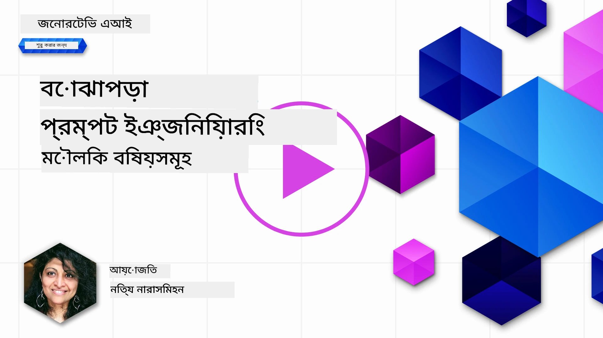
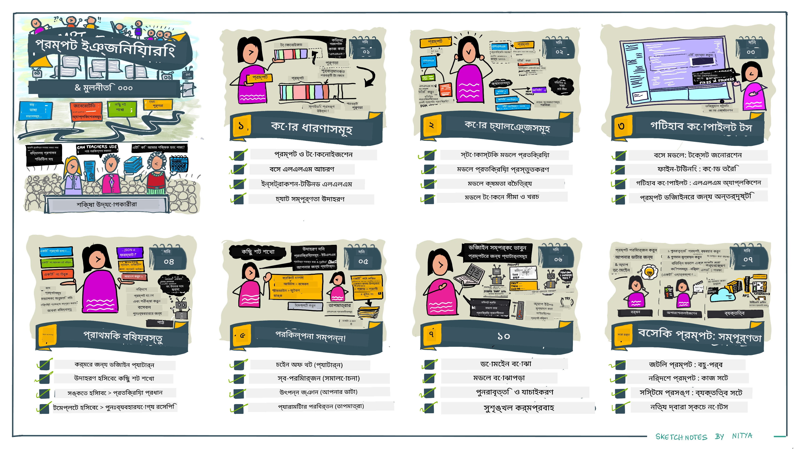
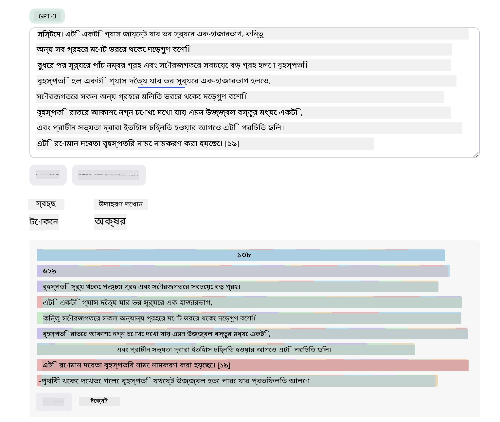
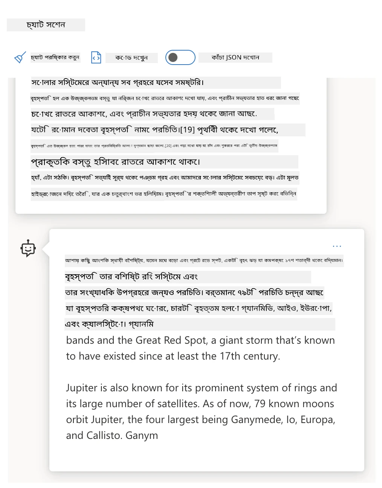
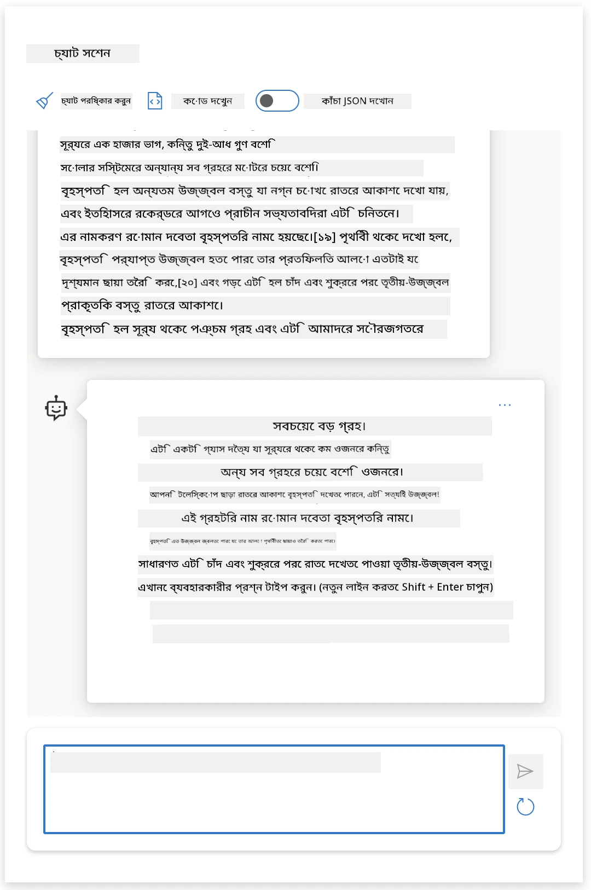
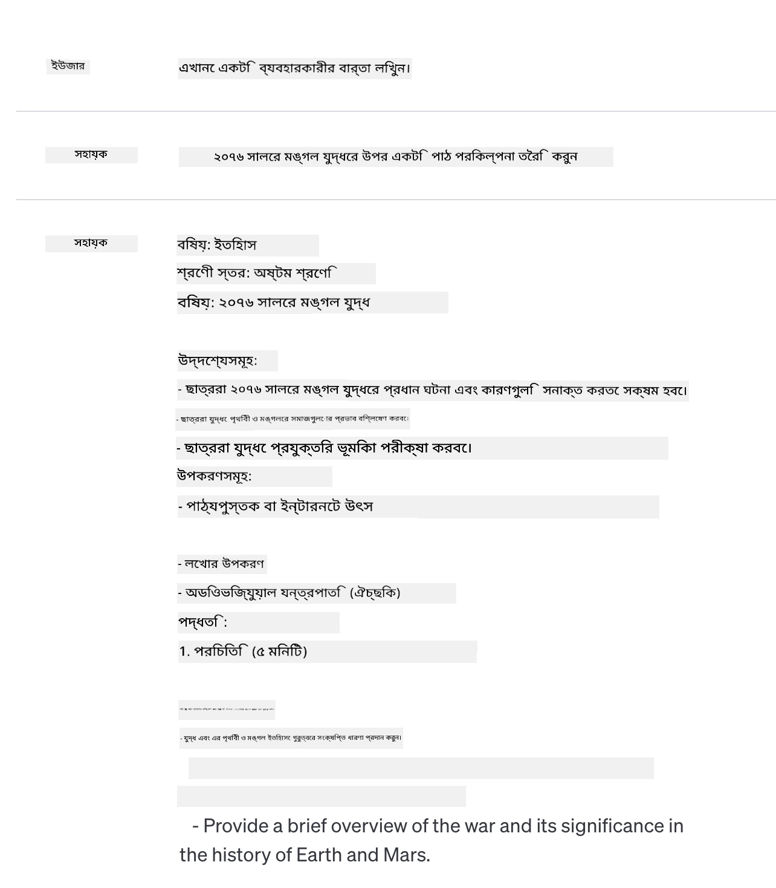
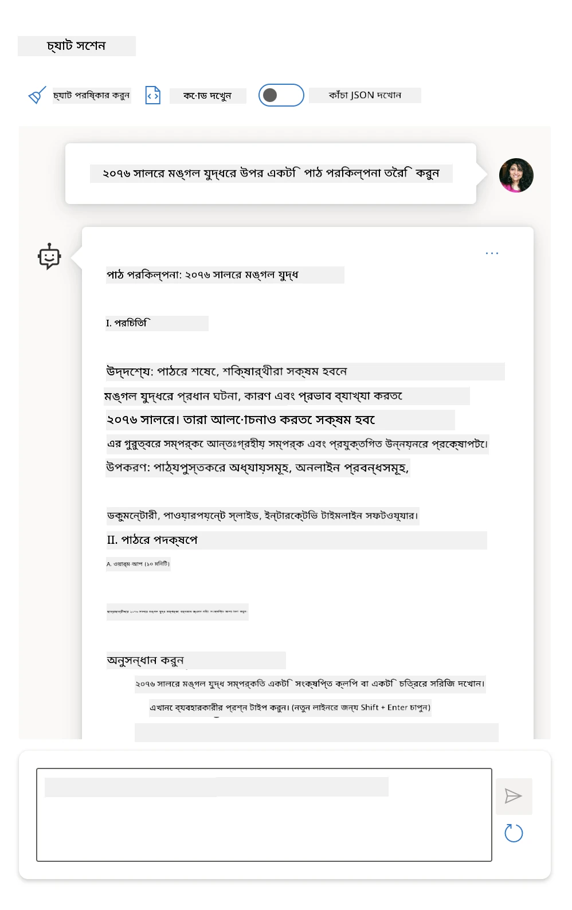
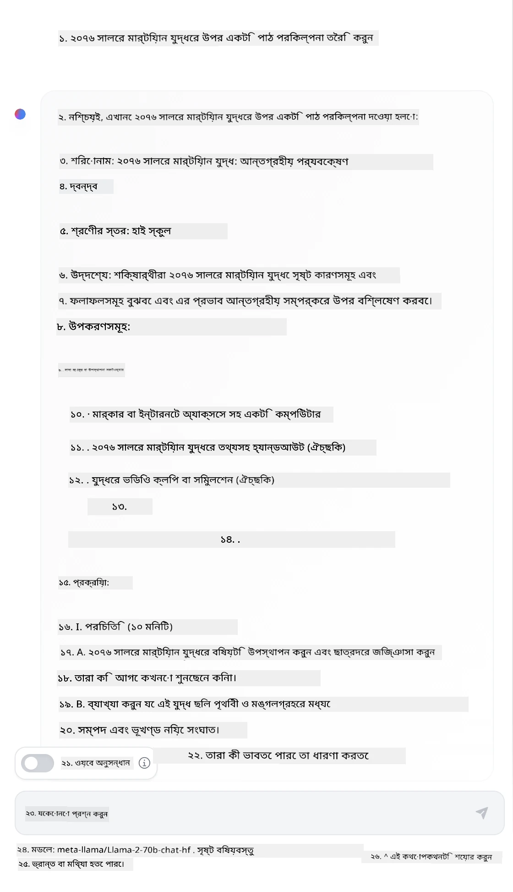

# প্রম্পট ইঞ্জিনিয়ারিং মৌলিক বিষয়াবলী

[](https://youtu.be/GElCu2kUlRs?si=qrXsBvXnCW12epb8)

## ভূমিকা
এই মডিউলটি যৌক্তিক কৃত্রিম বুদ্ধিমত্তা মডেলগুলিতে কার্যকর প্রম্পট তৈরির জন্য প্রয়োজনীয় ধারণা এবং কৌশলগুলি আচ্ছাদিত করে। আপনি একটি লার্জ ল্যাঙ্গুয়েজ মডেল (LLM) এ যেভাবে প্রম্পট লেখেন, সেটিও গুরুত্বপূর্ণ। যত্নের সাথে তৈরি করা প্রম্পট একটি ভাল মানের প্রতিক্রিয়া অর্জন করতে পারে। কিন্তু _প্রম্পট_ এবং _প্রম্পট ইঞ্জিনিয়ারিং_ এর মতো শব্দগুলি কী বোঝায়? এবং আমি কীভাবে LLM এ পাঠানো প্রম্পট _ইনপুট_ উন্নত করব? এই প্রশ্নগুলোর উত্তর আমরা এই অধ্যায় এবং পরবর্তী অধ্যায়ে খুঁজে দেখব।

_জেনারেটিভ AI_ ব্যবহারকারীর অনুরোধ অনুযায়ী নতুন বিষয়বস্তু (যেমন টেক্সট, ছবি, অডিও, কোড ইত্যাদি) তৈরি করতে সক্ষম। এটি OpenAI এর GPT ("Generative Pre-trained Transformer") সিরিজের মতো _লার্জ ল্যাঙ্গুয়েজ মডেল_ ব্যবহার করে যা প্রাকৃতিক ভাষা এবং কোড ব্যবহারের জন্য প্রশিক্ষিত।

ব্যবহারকারীরা এখন পরিচিত পদ্ধতিতে চ্যাটের মাধ্যমে এই মডেলগুলোর সাথে যোগাযোগ করতে পারে, কোনও প্রযুক্তিগত দক্ষতা বা প্রশিক্ষণের প্রয়োজন নেই। মডেলগুলি _প্রম্পট-ভিত্তিক_ — ব্যবহারকারীরা একটি টেক্সট ইনপুট (প্রম্পট) পাঠান এবং AI প্রতিক্রিয়া (সম্পূর্ণতা) পান। তারা তারপরে "AI এর সাথে চ্যাট" করতে পারে পুনরাবৃত্তিমূলকভাবে, একাধিক বার্তা বিনিময়ে, তাদের প্রম্পট উন্নত করতে থাকতে থাকে যতক্ষণ না প্রতিক্রিয়া তাদের প্রত্যাশার সাথে মেলে।

"প্রম্পট" এখন জেনারেটিভ AI অ্যাপ্লিকেশনের জন্য প্রধান _প্রোগ্রামিং ইন্টারফেস_ হয়ে উঠেছে, মডেলগুলিকে কী করতে হবে তা বলে এবং ফেরত আসা প্রতিক্রিয়ার মান প্রভাবিত করে। "প্রম্পট ইঞ্জিনিয়ারিং" একটি দ্রুত বর্ধনশীল অধ্যয়নের ক্ষেত্র যা প্রম্পট ডিজাইন এবং অপ্টিমাইজেশনের ওপর কেন্দ্রীভূত – যাতে পরিমাণে ধারাবাহিক এবং গুণমান সম্পন্ন উত্তর প্রদান করা যায়।

## শেখার লক্ষ্য

এই পাঠে, আমরা শিখব প্রম্পট ইঞ্জিনিয়ারিং কী, কেন এটি গুরুত্বপূর্ণ, এবং কীভাবে আমরা নির্দিষ্ট মডেল ও অ্যাপ্লিকেশন উদ্দেশ্যের জন্য আরও কার্যকর প্রম্পট তৈরি করতে পারি। আমরা মূল ধারণা এবং প্রম্পট ইঞ্জিনিয়ারিংয়ের সেরা অনুশীলনগুলি বুঝব — এবং একটি ইন্টারঅ্যাকটিভ জুপিটার নোটবুক "স্যান্ডবক্স" পরিবেশ সম্পর্কে জানব যেখানে আমরা এই ধারণাগুলো বাস্তব উদাহরণে প্রয়োগ করতে দেখতে পারব।

এই পাঠের শেষে আমরা সক্ষম হব:

1. কি প্রম্পট ইঞ্জিনিয়ারিং এবং কেন তা গুরুত্বপূর্ণ ব্যাখ্যা করতে।
2. একটি প্রম্পটের উপাদানগুলি বর্ণনা করতে এবং কীভাবে সেগুলো ব্যবহৃত হয়।
3. প্রম্পট ইঞ্জিনিয়ারিংয়ের সেরা অনুশীলন ও কৌশল শেখা।
4. শেখানো কৌশলগুলি OpenAI এর একটি এন্ডপয়েন্ট ব্যবহার করে বাস্তব উদাহরণে প্রয়োগ করা।

## মূল শব্দাবলী

প্রম্পট ইঞ্জিনিয়ারিং: AI মডেলকে কাঙ্ক্ষিত আউটপুট উৎপাদনের জন্য নির্দেশনা দেবার উদ্দেশ্যে ইনপুট ডিজাইন এবং পরিমার্জনের প্রক্রিয়া।

টোকেনাইজেশন: টেক্সটকে ছোট ইউনিটে (টোকেন) ভাগ করার প্রক্রিয়া, যা মডেল বুঝতে এবং প্রক্রিয়া করতে পারে।

ইনস্ট্রাকশন-টিউনড LLMs: লার্জ ল্যাঙ্গুয়েজ মডেলগুলি যেগুলো নির্দিষ্ট নির্দেশাবলীর মাধ্যমে তাদের প্রতিক্রিয়া নির্ভুলতা এবং প্রাসঙ্গিকতা উন্নত করতে ফাইন-টিউন করা হয়েছে।

## শেখার স্যান্ডবক্স

প্রম্পট ইঞ্জিনিয়ারিং এখনো বিজ্ঞান থেকে বেশি একটি শিল্প। এতে দক্ষতা বাড়ানোর সেরা উপায় হচ্ছে _অধিক অনুশীলন_ এবং ট্রায়াল-এন্ড-এরর পদ্ধতি গ্রহণ করা, যা ডোমেইন বিশেষজ্ঞতার সাথে সুপারিশকৃত কৌশল এবং মডেল-নির্দিষ্ট অপ্টিমাইজেশন মিলিয়ে কাজ করে।

এই পাঠের সংগে থাকা জুপিটার নোটবুক একটি _স্যান্ডবক্স_ পরিবেশ প্রদান করে যেখানে আপনি শেখা বিষয়গুলো অনুশীলন করতে পারেন - পাঠ চলাকালীন অথবা শেষের কোড চ্যালেঞ্জ অংশ হিসাবে। অনুশীলন সম্পাদনের জন্য আপনার প্রয়োজন:

1. **একটি Azure OpenAI API কী** — একটি চালিত LLM এর সার্ভিস এন্ডপয়েন্ট।
2. **একটি পাইথন রানটাইম** — যেখানে নোটবুক রানে করা যাবে।
3. **লোকাল পরিবেশ ভ্যারিয়েবল** — _[SETUP](./../00-course-setup/02-setup-local.md?WT.mc_id=academic-105485-koreyst) ধাপগুলি এখন সম্পন্ন করুন প্রস্তুতি নিতে_।

নোটবুকটি _শুরুর_ অনুশীলন নিয়ে আসে — তবে আপনাকে উৎসাহ দেওয়া হচ্ছে আপনার নিজস্ব _মার্কডাউন_ (বর্ণনা) এবং _কোড_ (প্রম্পট অনুরোধ) বিভাগ যোগ করতে যাতে আরও উদাহরণ বা ধারণা পরীক্ষা করতে পারেন — এবং প্রম্পট ডিজাইনের জন্য আপনার অন্তর্দৃষ্টি গড়ে তুলতে পারেন।

## চিত্রিত গাইড

পড়ার আগে বড় ছবি যেন আপনি একটু বুঝে নিতে চান যা এই পাঠ ব্যাখ্যা করে? এই চিত্রিত গাইড দেখুন, যা আপনাকে প্রধান বিষয়গুলো এবং গুরুত্বপূর্ণ ধারণাগুলো সম্পর্কে ধারণা দিবে। পাঠ রোডম্যাপটি আপনাকে মূল ধারণাগুলো এবং চ্যালেঞ্জগুলো উপলব্ধি থেকে নিয়ে যাবে এবং প্রাসঙ্গিক প্রম্পট ইঞ্জিনিয়ারিং কৌশল ও সেরা অনুশীলনের মাধ্যমে সেগুলো মোকাবেলা শেখাবে। লক্ষ্য করুন, এই গাইডের "অ্যাডভান্সড টেকনিক্স" বিভাগটি এই কারিকুলামের _পরবর্তী_ অধ্যায়ে কভার করা বিষয়।



## আমাদের স্টার্টআপ

এখন, আসুন আলোচনা করি কীভাবে _এই বিষয়_ আমাদের স্টার্টআপ মিশনে সম্পর্কিত যা [শিক্ষায় AI উদ্ভাবন এনেছে](https://educationblog.microsoft.com/2023/06/collaborating-to-bring-ai-innovation-to-education?WT.mc_id=academic-105485-koreyst)। আমরা চাচ্ছি AI-চালিত _ব্যক্তিগতকৃত শিক্ষার_ অ্যাপ্লিকেশন তৈরি করতে — তাই ভাবি আমাদের অ্যাপ্লিকেশনের বিভিন্ন ব্যবহারকারী কীভাবে "প্রম্পট ডিজাইন" করতে পারেন:

- **অ্যাডমিনিস্ট্রেটররা** AI কে অনুরোধ করতে পারেন _পাঠ্যক্রম তথ্য বিশ্লেষণ করে পরিধির ফাঁক চিহ্নিত করতে_। AI ফলাফল সারাংশ করতে বা কোড দিয়ে ভিজ্যুয়ালাইজ করতে পারে।
- **শিক্ষকরা** AI কে বলতে পারেন _একটি নির্দিষ্ট শ্রোতা ও বিষয়ের জন্য পাঠ পরিকল্পনা তৈরি করতে_। AI একটি নির্দিষ্ট ফরম্যাটে ব্যক্তিগতকৃত পরিকল্পনা তৈরি করতে পারে।
- **ছাত্ররা** AI কে অনুরোধ করতে পারেন _একটি কঠিন বিষয় সম্পর্কে টিউটরিং দিতে_। AI এখন স্তরের উপযোগী পাঠ, টিপস ও উদাহরণ দিয়ে শিক্ষার্থীদের গাইড করতে পারে।

এগুলি মাত্র পৃষ্ঠের উপর একটি উদাহরণ। [Prompts For Education](https://github.com/microsoft/prompts-for-edu/tree/main?WT.mc_id=academic-105485-koreyst) দেখুন — একটি ওপেন সোর্স প্রম্পট লাইব্রেরি যা শিক্ষা বিশেষজ্ঞরা তৈরি করেছেন — যাতে সম্ভাবনার একটি বিস্তৃত ধারণা পান! _স্যান্ডবক্সে বা OpenAI প্লেগ্রাউন্ডে সেই প্রম্পটগুলি চালিয়ে দেখুন কী হয়!_

<!--
LESSON TEMPLATE:
This unit should cover core concept #1.
Reinforce the concept with examples and references.

CONCEPT #1:
Prompt Engineering.
Define it and explain why it is needed.
-->

## প্রম্পট ইঞ্জিনিয়ারিং কী?

এই পাঠ শুরু করেছিলাম **প্রম্পট ইঞ্জিনিয়ারিং** সংজ্ঞায়িত করে, যা একটি প্রক্রিয়া যেখানে আপনার টেক্সট ইনপুট (প্রম্পট) ডিজাইন ও অপ্টিমাইজ করা হয় যাতে একটি নির্দিষ্ট অ্যাপ্লিকেশন উদ্দেশ্য ও মডেলের জন্য ধারাবাহিক ও গুণগত প্রতিক্রিয়া (সম্পূর্ণতা) প্রদান করা যায়। এটিকে ২ ধাপের প্রক্রিয়া হিসেবে ভাবা যায়:

- একটি নির্দিষ্ট মডেল ও উদ্দেশ্যের জন্য প্রাথমিক প্রম্পট _ডিজাইন_ করা
- প্রতিক্রিয়ার মান উন্নত করতে প্রম্পটকে পুনরাবৃত্তিমূলকভাবে _সংশোধন_ করা

এটি অবশ্যই একটি ট্রায়াল-এন্ড-এরর প্রক্রিয়া যা ব্যবহারকারীর অন্তর্দৃষ্টি এবং প্রচেষ্টা প্রয়োজন সর্বোত্তম ফলাফলের জন্য। তাহলে কেন এটি গুরুত্বপূর্ণ? সেই প্রশ্নের উত্তর দিতে হলে আমাদের তিনটি ধারণা বুঝতে হবে:

- _টোকেনাইজেশন_ = মডেল কীভাবে প্রম্পট "দেখে"
- _বেস LLM_ = ফাউন্ডেশন মডেল কীভাবে একটি প্রম্পট "প্রক্রিয়া করে"
- _ইনস্ট্রাকশন-টিউনড LLM_ = মডেল কীভাবে এখন "কার্য" দেখতে পারে

### টোকেনাইজেশন

একটি LLM প্রম্পটগুলোকে একটি _টোকেন সিকোয়েন্স_ হিসেবে দেখে, যেখানে বিভিন্ন মডেল (অথবা একটি মডেলের বিভিন্ন সংস্করণ) একই প্রম্পটকে বিভিন্নভাবে টোকেনাইজ করতে পারে। যেহেতু LLM গুলো টোকেন (না যে কাঁচা টেক্সট) প্রশিক্ষিত, তাই প্রম্পট কীভাবে টোকেনাইজ হয় তার সরাসরি প্রভাব থাকে উৎপাদিত উত্তর মানে।

টোকেনাইজেশন কীভাবে কাজ করে তা বোঝার জন্য [OpenAI Tokenizer](https://platform.openai.com/tokenizer?WT.mc_id=academic-105485-koreyst) এর মত টুল ব্যবহার করুন নিচের মত। আপনার প্রম্পট কপি করে দেখুন, কীভাবে টোকেনে রূপান্তর হচ্ছে, বিশেষ করে ফাঁকা স্থান ও বিরামের চিহ্নগুলি কীভাবে হ্যান্ডেল হচ্ছে লক্ষ্য করুন। এই উদাহরণটি একটি পুরনো LLM (GPT-3) দেখাচ্ছে — তাই নতুন মডেলে চেষ্টা করলে ভিন্ন ফলাফল আসতে পারে।



### ধারণা: ফাউন্ডেশন মডেল

একবার প্রম্পট টোকেনাইজ হয়ে গেলে, ["বেস LLM"](https://blog.gopenai.com/an-introduction-to-base-and-instruction-tuned-large-language-models-8de102c785a6?WT.mc_id=academic-105485-koreyst) (অর্থাৎ ফাউন্ডেশন মডেল) এর প্রধান কাজ হলো সেই সিকোয়েন্সে পরবর্তী টোকেনটা অনুমান করা। যেহেতু LLM গুলো বিশাল টেক্সট ডেটাসেটে প্রশিক্ষিত, তারা টোকেনগুলোর মধ্যে সম্পর্কের ভালো ধারণা পায় এবং নির্ভরযোগ্যতার সঙ্গে অনুমান করতে পারে। তবে তারা প্রম্পট বা টোকেনের শব্দের _অর্থ_ বুঝে না; তারা শুধু একটি প্যাটার্ন দেখে যেটা তারা তাদের পরবর্তী অনুমান দিয়ে "সম্পূর্ণ" করতে পারে। তারা অনুমান চালিয়ে যেতে পারে যতক্ষণ না ব্যবহারকারী বা পূর্বনির্ধারিত শর্ত দ্বারা থেমে যায়।

প্রম্পট ভিত্তিক কমপ্লিশন কিভাবে কাজ করে দেখতে চান? উপরের প্রম্পটটি Azure OpenAI Studio [_Chat Playground_](https://oai.azure.com/playground?WT.mc_id=academic-105485-koreyst) তে ডিফল্ট সেটিংস দিয়ে প্রবেশ করান। সিস্টেমটি প্রম্পটকে তথ্যের অনুরোধ হিসেবে গণ্য করবে — তাই এখানে এমন একটি কমপ্লিশন পাবেন যা ঐ প্রসঙ্গ পূরণ করে।

কিন্তু ব্যবহারকারী যদি নির্দিষ্ট কিছু দেখতে চায় যা কোনও শর্ত বা টাস্ক উদ্দেশ্য পূরণ করে? এটাই যে কবে _ইনস্ট্রাকশন-টিউনড_ LLM গুলো গুরুত্বপূর্ণ হয়ে ওঠে।



### ধারণা: ইনস্ট্রাকশন টিউনড LLM

[ইনস্ট্রাকশন টিউনড LLM](https://blog.gopenai.com/an-introduction-to-base-and-instruction-tuned-large-language-models-8de102c785a6?WT.mc_id=academic-105485-koreyst) ফাউন্ডেশন মডেল দিয়ে শুরু হয়ে উদাহরণ বা ইনপুট/আউটপুট জোড়া (যেমন, বহু-বার্তা "মেসেজ") ব্যবহার করে ফাইন-টিউন করা হয় যা স্পষ্ট নির্দেশাবলী সম্বলিত হতে পারে — এবং AI এর প্রতিক্রিয়া সেই নির্দেশ অনুসরণ করার চেষ্টা করে।

এটি RLHF (রিইনফোর্সমেন্ট লার্নিং উইথ হিউম্যান ফিডব্যাক) এর মতো কৌশল ব্যবহার করে মডেলকে _নির্দেশ মেনে চলতে_ এবং _প্রতিক্রিয়া থেকে শিখতে_ প্রশিক্ষিত করে যাতে তারা ব্যবহারিক অ্যাপ্লিকেশনের জন্য আরও উপযুক্ত এবং ব্যবহারকারীর উদ্দেশ্যের সাথে প্রাসঙ্গিক উত্তর তৈরি করে।

চেষ্টা করে দেখুন — উপরের প্রম্পটটিতে ফিরে আসুন, কিন্তু এখন _সিস্টেম মেসেজ_ পরিবর্তন করে নিম্নলিখিত নির্দেশনা প্রদান করুন:

> _আপনাকে দেওয়া বিষয়বস্তু দ্বিতীয় শ্রেণীর শিক্ষার্থীর জন্য সারাংশ করুন। ফলাফলটি ৩-৫টি বুলেট পয়েন্টসহ একটি প্যারাগ্রাফে সীমাবদ্ধ রাখুন।_

দেখুন কীভাবে ফলাফলটি কাঙ্ক্ষিত লক্ষ্য ও ফর্ম্যাট প্রতিফলিত হচ্ছে? একজন শিক্ষক এখন সরাসরি এই উত্তর তাদের ক্লাসের স্লাইডে ব্যবহার করতে পারে।



## কেন প্রম্পট ইঞ্জিনিয়ারিং প্রয়োজন?

এখন যেহেতু আমরা জানি LLM কীভাবে প্রম্পট প্রক্রিয়া করে, চলুন বলি কেন প্রম্পট ইঞ্জিনিয়ারিং দরকার। কারণ হলো বর্তমান LLM গুলোর কিছু চ্যালেঞ্জ রয়েছে যা _নির্ভরযোগ্য ও ধারাবাহিক কমপ্লিশন_ পেতে প্রম্পট তৈরিতে যথেষ্ট চেষ্টা না করলে কঠিন হয়ে পড়ে। যেমন:

1. **মডেল প্রতিক্রিয়া আচরণ অনির্দিষ্ট।** _একই প্রম্পট_ বিভিন্ন মডেল বা মডেলের বিভিন্ন সংস্করণে ভিন্ন প্রতিক্রিয়া দিতে পারে। একই মডেল থেকেও সময়ের সাথে ভিন্ন হতে পারে। _প্রম্পট ইঞ্জিনিয়ারিং কৌশলগুলো এই পার্থক্যগুলো হ্রাস করতে সাহায্য করে_।

1. **মডেল কল্পনাময় প্রতিক্রিয়া তৈরি করতে পারে।** মডেলগুলি দৈর্ঘ্যে সীমানাবদ্ধ ব্যাপক ডেটাসেটে প্রশিক্ষিত, তাই তারা অজানা বিষয়ে বিভ্রান্তিকর, কল্পিত বা সত্যের বিপরীতে তথ্য তৈরি করতে পারে। _প্রম্পট ইঞ্জিনিয়ারিং ব্যবহারকারীদের এই ভুল সন্ধান এবং হ্রাসে সহায়তা করে যেমন AI থেকে উক্তি বা যুক্তি চাওয়া_।

1. **মডেলের ক্ষমতায় পার্থক্য থাকে।** নতুন মডেল বা প্রজন্মগুলো ক্ষমতাসম্পন্ন, কিন্তু বিভিন্ন অনন্য দিক, খরচ এবং জটিলতা নিয়ে আসে। _প্রম্পট ইঞ্জিনিয়ারিং সেরা অনুশীলন ও ওয়ার্কফ্লো তৈরি করতে পারে যা পার্থক্যগুলো লুকিয়ে রেখে মডেল-নির্দিষ্ট চাহিদা মেটায় সুসংগত ও সহজলভ্য উপায়ে_।

OpenAI বা Azure OpenAI প্লেগ্রাউন্ডে এটি পরীক্ষা করে দেখুন:

- একই প্রম্পট বিভিন্ন LLM ডিপ্লয়মেন্টে (যেমন OpenAI, Azure OpenAI, Hugging Face) ব্যবহার করুন — পার্থক্য লক্ষ্য করলেন?
- একই প্রম্পট একই LLM ডিপ্লয়মেন্টে একাধিকবার ব্যবহার করুন (যেমন Azure OpenAI প্লেগ্রাউন্ড) — পার্থক্য কেমন ছিল?

### কল্পনাময়তা (Fabrications) উদাহরণ

এই কোর্সে আমরা **"কল্পনা"** শব্দটি ব্যবহার করি LLM গুলো কখনো কখনো প্রশিক্ষণের সীমাবদ্ধতার কারণে সত্যের বিপরীতে তথ্য তৈরি করার ঘটনাকে বোঝাতে। জনপ্রিয় প্রবন্ধ বা গবেষণাপত্রে এটি _"হ্যালুসিনেশন"_ নামেও পরিচিত। তবে আমরা দৃঢ়ভাবে পরামর্শ দিই _"কল্পনা"_ শব্দ ব্যবহার করতে যাতে ভুলবশত আমাদের যন্ত্র-চালিত ফলাফলের জন্য মানবজাতীয় গুণাবলী আরোপ না হয়। এটি [জবাবদিহি AI নির্দেশিকা](https://www.microsoft.com/ai/responsible-ai?WT.mc_id=academic-105485-koreyst) বজায় রাখতে সাহায্য করে, এমন শব্দগুলো বাদ দিয়ে যা কিছু প্রেক্ষাপটে অবমাননাকর বা অবিচ্ছিন্ন বলে বিবেচিত হতে পারে।

কল্পনাময়তার কাজ বোঝার জন্য ভাবুন এমন একটি প্রম্পট যা AI কে একটি অ-বস্তুনিষ্ঠ বিষয়ের জন্য বিষয়বস্তু তৈরি করতে বলে (যা নিশ্চিত করবে এটি প্রশিক্ষণ ডেটাসেটে নেই)। উদাহরণস্বরূপ — আমি এই প্রম্পটটি চেষ্টা করেছিলাম:

> **প্রম্পট:** 2076 সালের মার্টিয়ান যুদ্ধের ওপর একটি পাঠ পরিকল্পনা তৈরি করুন।
একটি ওয়েব অনুসন্ধানে দেখা যায় যে মার্টিয়ান যুদ্ধের ওপর কাল্পনিক বিবরণ (যেমন, টেলিভিশন সিরিজ বা বই) রয়েছে - কিন্তু ২০৭৬ সালের কোনো ঘটনা নেই। স্বাভাবিক বুদ্ধি বলছে ২০৭৬ হলো _ভবিষ্যৎ_ এবং তাই এটি কোনো বাস্তব ঘটনার সাথে সম্পর্কিত হতে পারে না।

তাহলে কি হয় যখন আমরা এই প্রম্পটটি বিভিন্ন LLM প্রদানকারীদের সাথে চালাই?

> **প্রতিক্রিয়া ১**: OpenAI Playground (GPT-35)



> **প্রতিক্রিয়া ২**: Azure OpenAI Playground (GPT-35)



> **প্রতিক্রিয়া ৩**: : Hugging Face Chat Playground (LLama-2)



প্রত্যাশা অনুসারে, প্রতিটি মডেল (বা মডেল সংস্করণ) সামান্য ভিন্ন প্রতিক্রিয়া তৈরি করে যা স্টোকাস্টিক আচরণ এবং মডেলের সামর্থ্যের পার্থক্যের কারণে। যেমন, একটি মডেল ৮ম শ্রেণীর পাঠকের উদ্দেশ্যে, অন্যটি হাই-স্কুলের ছাত্র হিসেবে ধরে নেয়। কিন্তু এই তিনটি মডেলই এমন প্রতিক্রিয়া তৈরি করেছে যা অবিজ্ঞ ব্যবহারকারীকে এই ঘটনাটি বাস্তব বলে বিশ্বাস করাতে পারে।

_মেটাপ্রম্পটিং_ এবং _তাপমাত্রা কনফিগারেশন_ এর মতো প্রম্পট ইঞ্জিনিয়ারিং কৌশল কিছুটা মডেল কল্পনাকে কমাতে পারে। নতুন প্রম্পট ইঞ্জিনিয়ারিং _স্থাপত্য_ গুলি প্রম্পট প্রবাহে নতুন সরঞ্জাম ও কৌশল নিখুঁতভাবে সংযুক্ত করে এই প্রভাবগুলো কমাতে বা দূর করতে সাহায্য করে।

## কেইস স্টাডি: GitHub Copilot

এই অংশটি শেষ করি একটি কেইস স্টাডি দেখে, জানতে পারি কিভাবে বাস্তব জীবনের সমাধানে প্রম্পট ইঞ্জিনিয়ারিং ব্যবহৃত হয়: [GitHub Copilot](https://github.com/features/copilot?WT.mc_id=academic-105485-koreyst)।

GitHub Copilot হলো আপনার "AI পেয়ার প্রোগ্রামার" - এটি পাঠ্য প্রম্পটকে কোড সম্পূর্ণতায় রূপান্তর করে এবং আপনার উন্নয়ন পরিবেশে (যেমন, Visual Studio Code) একত্রিত থাকে যা একটি সুনির্মল ব্যবহারকারীর অভিজ্ঞতা দেয়। নীচের ব্লগ সিরিজে দলিলায়িত আছে, প্রাথমিক সংস্করণটি OpenAI Codex মডেলের ওপর ভিত্তি করে ছিল - যেখানে প্রকৌশলীরা দ্রুত বুঝতে পেরেছিলেন মডেলকে সূক্ষ্মতর করতে এবং উন্নত প্রম্পট ইঞ্জিনিয়ারিং কৌশল তৈরি করতে হবে কোডের গুণগত মান বাড়ানোর জন্য। জুলাই মাসে তারা [Codex ছাড়িয়ে আরও দ্রুত প্রস্তাবনার জন্য একটি উন্নত AI মডেল প্রদর্শন করেছে](https://github.blog/2023-07-28-smarter-more-efficient-coding-github-copilot-goes-beyond-codex-with-improved-ai-model/?WT.mc_id=academic-105485-koreyst)।

তাদের শিখন যাত্রা অনুসরণ করার জন্য পোস্টগুলো ক্রমানুসারে পড়ুন।

- **মে ২০২৩** | [GitHub Copilot আপনার কোড বুঝতে আরও ভালো হচ্ছে](https://github.blog/2023-05-17-how-github-copilot-is-getting-better-at-understanding-your-code/?WT.mc_id=academic-105485-koreyst)
- **মে ২০২৩** | [GitHub ভিতরে: GitHub Copilot এর পেছনের LLM গুলোর কাজ](https://github.blog/2023-05-17-inside-github-working-with-the-llms-behind-github-copilot/?WT.mc_id=academic-105485-koreyst)
- **জুন ২০২৩** | [GitHub Copilot এর জন্য ভালো প্রম্পট লেখার কৌশল](https://github.blog/2023-06-20-how-to-write-better-prompts-for-github-copilot/?WT.mc_id=academic-105485-koreyst)
- **জুলাই ২০২৩** | [GitHub Copilot Codex ছাড়িয়ে উন্নত AI মডেল নিয়ে এগিয়ে](https://github.blog/2023-07-28-smarter-more-efficient-coding-github-copilot-goes-beyond-codex-with-improved-ai-model/?WT.mc_id=academic-105485-koreyst)
- **জুলাই ২০২৩** | [একজন ডেভেলপারের জন্য প্রম্পট ইঞ্জিনিয়ারিং ও LLM গাইড](https://github.blog/2023-07-17-prompt-engineering-guide-generative-ai-llms/?WT.mc_id=academic-105485-koreyst)
- **সেপ্টেম্বর ২০২৩** | [এন্টারপ্রাইজ LLM অ্যাপ নির্মাণ: GitHub Copilot থেকে শিক্ষা](https://github.blog/2023-09-06-how-to-build-an-enterprise-llm-application-lessons-from-github-copilot/?WT.mc_id=academic-105485-koreyst)

আপনি তাদের [ইঞ্জিনিয়ারিং ব্লগ](https://github.blog/category/engineering/?WT.mc_id=academic-105485-koreyst) থেকেও আরও পোস্ট দেখুন, যেমন [এইটি](https://github.blog/2023-09-27-how-i-used-github-copilot-chat-to-build-a-reactjs-gallery-prototype/?WT.mc_id=academic-105485-koreyst) যা দেখায় কিভাবে এসব মডেল এবং কৌশল বাস্তব জীবনের অ্যাপ্লিকেশন চালানোর জন্য প্রয়োগ করা হয়।

---

<!--
LESSON TEMPLATE:
This unit should cover core concept #2.
Reinforce the concept with examples and references.

CONCEPT #2:
Prompt Design.
Illustrated with examples.
-->

## প্রম্পট নির্মাণ

আমরা দেখেছি কেন প্রম্পট ইঞ্জিনিয়ারিং গুরুত্বপূর্ণ - এখন চলুন বুঝি কিভাবে প্রম্পট _নির্মিত_ হয় যাতে আমরা আরও কার্যকর প্রম্পট ডিজাইনের বিভিন্ন কৌশল মূল্যায়ন করতে পারি।

### মৌলিক প্রম্পট

চলুন শুরু করি মৌলিক প্রম্পট দিয়ে: মডেলে পাঠানো একটি পাঠ্য ইনপুট যেটির সাথে অন্য কোনো প্রসঙ্গ নেই। উদাহরণস্বরূপ - যখন আমরা মার্কিন জাতীয় সঙ্গীতের কয়েকটি শব্দ OpenAI [Completion API](https://platform.openai.com/docs/api-reference/completions?WT.mc_id=academic-105485-koreyst)-এ পাঠাই, এটি সাথে সাথে পরবর্তী কয়েক লাইন দিয়ে প্রতিক্রিয়া _সম্পূর্ণ_ করে দেয়, মৌলিক পূর্বাভাস আচরণ প্রদর্শন করে।

| প্রম্পট (ইনপুট) | সম্পূর্ণ (আউটপুট)                                                                                             |
| :----------------- | :--------------------------------------------------------------------------------------------------------- |
| Oh say can you see | শোনা যাচ্ছে আপনি "The Star-Spangled Banner," যুক্তরাষ্ট্রের জাতীয় সঙ্গীতের গানের কথা শুরু করছেন। পুরো গানের কথা হলো ... |

### জটিল প্রম্পট

এখন ঐ মৌলিক প্রম্পটে প্রসঙ্গ এবং নির্দেশনা যোগ করি। [Chat Completion API](https://learn.microsoft.com/azure/ai-services/openai/how-to/chatgpt?WT.mc_id=academic-105485-koreyst) আমাদের _বার্তা_ সমাহারের মাধ্যমে জটিল প্রম্পট নির্মাণ করতে দেয়, যেখানে:

- ইনপুট/আউটপুট জোড়া যা _ব্যবহারকারী_ এর ইনপুট এবং _সহকারী_ এর প্রতিক্রিয়া প্রতিফলিত করে।
- সিস্টেম বার্তা যা সহকারীর আচরণ বা ব্যক্তিত্বের প্রসঙ্গ নির্ধারণ করে।

এখন অনুরোধটি নিচের ফর্মে থাকে, যেখানে _টোকেনাইজেশন_ কার্যকরভাবে প্রসঙ্গ এবং কথোপকথন থেকে প্রাসঙ্গিক তথ্য সংগ্রহ করে। এখন সিস্টেম প্রসঙ্গ পরিবর্তন করা সম্পূর্ণতার গুণগত মানে ব্যবহারকারীর প্রদত্ত ইনপুটের মতোই গুরুত্বপূর্ণ।

```python
response = openai.chat.completions.create(
    model="gpt-3.5-turbo",
    messages=[
        {"role": "system", "content": "You are a helpful assistant."},
        {"role": "user", "content": "Who won the world series in 2020?"},
        {"role": "assistant", "content": "The Los Angeles Dodgers won the World Series in 2020."},
        {"role": "user", "content": "Where was it played?"}
    ]
)
```

### নির্দেশিকা প্রম্পট

উপরোক্ত উদাহরণগুলোতে, ব্যবহারকারীর প্রম্পটটি ছিল একটি সহজ পাঠ্য প্রশ্ন যা তথ্যের জন্য অনুরোধ হিসেবে ব্যাখ্যা করা যায়। _নির্দেশিকা_ প্রম্পটে আমরা সেই পাঠ্যকে একটি কাজের বিস্তারিত নির্দিষ্টকরণ দিতে ব্যবহার করতে পারি, AI কে আরও ভালো নির্দেশনা দেওয়ার জন্য। এখানে একটি উদাহরণ:

| প্রম্পট (ইনপুট)                                                                                                                 | সম্পূর্ণ (আউটপুট)                                                                                              | নির্দেশনার ধরণ   |
| :------------------------------------------------------------------------------------------------------------------------------- | :----------------------------------------------------------------------------------------------------------- | :--------------- |
| Write a description of the Civil War                                                                                            | _সহজ একটি অনুচ্ছেদ ফিরিয়েছে_                                                                                    | সহজ              |
| Write a description of the Civil War. Provide key dates and events and describe their significance                               | _একটি অনুচ্ছেদ ও তারপরে মূল ঘটনাগুলোর তারিখ ও বর্ণনা সহ তালিকা ফিরিয়েছে_                                           | জটিল              |
| Write a description of the Civil War in 1 paragraph. Provide 3 bullet points with key dates and their significance. Provide 3 more bullet points with key historical figures and their contributions. Return the output as a JSON file | _আরও বিস্তৃত বিবরণ এক টেক্সট বক্সে ফেরত দেয়, JSON আকারে যা আপনি ফাইল হিসেবে কপি-পেস্ট করে যাচাই করতে পারেন_         | জটিল। ফরম্যাটেড।  |

## প্রাথমিক বিষয়বস্তু

উপরের উদাহরণগুলোতে, প্রম্পট এখনও অপেক্ষাকৃত মুক্ত ছিল, যা LLM কে সিদ্ধান্ত নেওয়ার সুযোগ দেয় তার প্রি-ট্রেইনড ডেটাসেটের কোন অংশ প্রাসঙ্গিক। _প্রাথমিক বিষয়বস্তু_ ডিজাইন প্যাটার্নে, ইনপুট পাঠ্য দুটি ভাগে বিভক্ত:

- একটি নির্দেশনা (কর্ম)
- প্রাসঙ্গিক বিষয়বস্তু (যা ক্রিয়াকলাপে প্রভাব ফেলে)

নিচে একটি উদাহরণ যেখানে নির্দেশনাটি হলো "২টি বাক্যে সারসংক্ষেপ করো"।

| প্রম্পট (ইনপুট)                                                                                                                                                                                                                                                                                                                                                                                                                                                                                                                                                                                                                                                                                      | সম্পূর্ণ (আউটপুট)                                                                                                                                                                                                                                                                             |
| :-------------------------------------------------------------------------------------------------------------------------------------------------------------------------------------------------------------------------------------------------------------------------------------------------------------------------------------------------------------------------------------------------------------------------------------------------------------------------------------------------------------------------------------------------------------------------------------------------------------------------------------------------------------------------------------------------- | :---------------------------------------------------------------------------------------------------------------------------------------------------------------------------------------------------------------------------------------------------------------------------------------------- |
| Jupiter is the fifth planet from the Sun and the largest in the Solar System. It is a gas giant with a mass one-thousandth that of the Sun, but two-and-a-half times that of all the other planets in the Solar System combined. Jupiter is one of the brightest objects visible to the naked eye in the night sky, and has been known to ancient civilizations since before recorded history. It is named after the Roman god Jupiter.[19] When viewed from Earth, Jupiter can be bright enough for its reflected light to cast visible shadows,[20] and is on average the third-brightest natural object in the night sky after the Moon and Venus. <br/> **Summarize this in 2 short sentences** | জুপিটার সূর্যের পঞ্চম গ্রহ এবং সৌরজগতের সবচেয়ে বড় গ্রহ। এটি একটি গ্যাস দৈত্য যার ভর সৌরজগতের অন্যান্য সব গ্রহের সমষ্টির থেকে দেড় গুণ বেশি এবং প্রাচীন সভ্যতাদের জানা ছিল। |

প্রাথমিক বিষয়বস্তু অংশটি বিভিন্ন উপায়ে ব্যবহার করা যেতে পারে আরও কার্যকর নির্দেশনা চালানোর জন্য:

- **উদাহরণ** - মডেলকে সরাসরি কি করতে হবে না বলে, প্রয়োজনীয় আউটপুটের কিছু উদাহরণ দিয়ে প্যাটার্ন ধরতে সাহায্য করা।
- **কিউ** - নির্দেশনার পরে একটি "কিউ" যোগ করা যা সম্পূর্ণতা প্রক্রিয়ায় সহায়ক হয়ে মডেলকে আরও প্রাসঙ্গিক প্রতিক্রিয়া দিতে প্ররোচিত করে।
- **টেমপ্লেট** - এগুলো পুনরাবৃত্তিযোগ্য 'রেসিপি' যেখানে প্লেসহোল্ডার (ভেরিয়েবল) থাকে এবং নির্দিষ্ট ব্যবহারের জন্য ডেটা দিয়ে কাস্টমাইজ করা যায়।

চলুন এগুলো কার্যকরভাবে দেখি।

### উদাহরণ ব্যবহার

এটি এমন একটি পদ্ধতি যেখানে আপনি প্রাথমিক বিষয়বস্তুতে আপনার কাঙ্খিত আউটপুটের কিছু উদাহরণ "মডেলকে খাওয়ান", যাতে মডেল প্যাটার্ন ধারণ করে কাঙ্খিত আউটপুট তৈরি করে। উদাহরণের সংখ্যার ওপর ভিত্তি করে এটি হতে পারে জিরো-শট, ওয়ান-শট, ফিউ-শট প্রম্পটিং।

এখন প্রম্পটে তিনটি উপাদান থাকে:

- কাজের বিবরণ
- আউটপুটের কিছু উদাহরণ
- একটি নতুন উদাহরণের শুরু (যা একটি অন্তর্নিহিত কাজের বিবরণে রূপান্তরিত হয়)

| শিখন প্রকার | প্রম্পট (ইনপুট)                                                                                                                        | সম্পূর্ণ (আউটপুট)          |
| :------------ | :------------------------------------------------------------------------------------------------------------------------------------ | :--------------------------- |
| জিরো-শট      | "The Sun is Shining". Translate to Spanish                                                                                              | "El Sol está brillando".     |
| ওয়ান-শট       | "The Sun is Shining" => ""El Sol está brillando". <br> "It's a Cold and Windy Day" =>                                                     | "Es un día frío y ventoso".  |
| ফিউ-শট       | The player ran the bases => Baseball <br/> The player hit an ace => Tennis <br/> The player hit a six => Cricket <br/> The player made a slam-dunk => | Basketball                  |
|               |                                                                                                                                      |                             |

দ্রষ্টব্য, জিরো-শট প্রম্পটিং-এ আমাদের স্পষ্ট নির্দেশনা ("Translate to Spanish") দিতে হয়েছে, কিন্তু ওয়ান-শট উদাহরণে তা ধারণা করিয়ে দেওয়া হয়েছে। ফিউ-শট উদাহরণ আরও বেশি কার্যকর কারণ আরো উদাহরণ যোগ করলে মডেল সহজে সঠিক প্যাটার্ন ধারণ করতে পারে কোনো অতিরিক্ত নির্দেশ ছাড়া।

### প্রম্পট কিউ

প্রাথমিক বিষয়বস্তু ব্যবহার করার আরেকটি কৌশল হলো উদাহরণের পরিবর্তে _কিউ_ প্রদান করা। এই ক্ষেত্রে, আমরা মডেলকে সঠিক দিকনির্দেশনার জন্য একটুকরা দিয়ে _শুরু করছি_ যা কাঙ্খিত আউটপুটের বিন্যাসকে প্রতিফলিত করে। মডেল তখন এই কিউ ধরে ধরে উত্তর চালিয়ে যায়।

| কিউ সংখ্যা | প্রম্পট (ইনপুট)                                                                                                                                                                                                                                                                                                                                                                                                                                               | সম্পূর্ণ (আউটপুট)                                                                                                                                                                                                                                                                                       |
| :---------- | :----------------------------------------------------------------------------------------------------------------------------------------------------------------------------------------------------------------------------------------------------------------------------------------------------------------------------------------------------------------------------------------------------------------------------------------------------------- | :-------------------------------------------------------------------------------------------------------------------------------------------------------------------------------------------------------------------------------------------------------------------------------------------------------- |
| ০           | Jupiter is the fifth planet from the Sun and the largest in the Solar System. It is a gas giant with a mass one-thousandth that of the Sun, but two-and-a-half times that of all the other planets in the Solar System combined. Jupiter is one of the brightest objects visible to the naked eye in the night sky, and has been known to ancient civilizations since before recorded history. <br/>**Summarize This**                                       | Jupiter হলো সৌরজগতের সবচেয়ে বড় গ্রহ এবং সূর্যের পঞ্চম গ্রহ। এটিকে একটি গ্যাস দৈত্য বলা হয় যার ভর সৌরজগতের অন্য সব গ্রহের মিলে তুলনায় আধিক্য। প্রাচীন সভ্যতা থেকে জুপিটার পরিচিত এবং এটি রাতের আকাশে স্পষ্টদৃশ্যমান। |
| ১              | বৃহস্পতি সূর্য থেকে পঞ্চম গ্রহ এবং সৌরজগতের সবচেয়ে বড় গ্রহ। এটি একটি গ্যাস জায়ান্ট যার ভর সূর্যের এক-হাজারভাগ, কিন্তু সৌরজগতের সকল অন্যান্য গ্রহের মিলে দুই-আধ গুণ বেশি। বৃহস্পতি এক উজ্জ্বল বস্তু যা রাতে নিরীক্ষণে সহজেই চোখে পড়ে এবং প্রাচীন সভ্যতার কাছ থেকে পরিচিত ছিল যা রেকর্ডকৃত ইতিহাসের আগেও। <br/>**এটি সংক্ষেপে বলুন** <br/> আমরা যা শিখলাম তা হল বৃহস্পতি  | সূর্য থেকে পঞ্চম গ্রহ এবং সৌরজগতের সবচেয়ে বড় গ্রহ। এটি একটি গ্যাস জায়ান্ট যার ভর সূর্যের এক-হাজারভাগ, কিন্তু সব অন্যান্য গ্রহের মিলে দুই-আধ গুণ বেশি। এটি সহজেই নগ্ন চোখে দৃশ্যমান এবং প্রাচীনকাল থেকে পরিচিত।                        |
| ২              | বৃহস্পতি সূর্য থেকে পঞ্চম গ্রহ এবং সৌরজগতের সবচেয়ে বড় গ্রহ। এটি একটি গ্যাস জায়ান্ট যার ভর সূর্যের এক-হাজারভাগ, কিন্তু সৌরজগতের সকল অন্যান্য গ্রহের মিলে দুই-আধ গুণ বেশি। বৃহস্পতি এক উজ্জ্বল বস্তু যা রাতে নিরীক্ষণে সহজেই চোখে পড়ে এবং প্রাচীন সভ্যতার কাছ থেকে পরিচিত ছিল যা রেকর্ডকৃত ইতিহাসের আগেও। <br/>**এটি সংক্ষেপে বলুন** <br/> শীর্ষ ৩ তথ্য যা আমরা শিখলাম:         | ১. বৃহস্পতি সূর্য থেকে পঞ্চম গ্রহ এবং সৌরজগতের সবচেয়ে বড় গ্রহ। <br/> ২. এটি একটি গ্যাস জায়ান্ট যার ভর সূর্যের এক-হাজারভাগ...<br/> ৩. বৃহস্পতি প্রাচীনকাল থেকেই নগ্ন চোখে দৃশ্যমান ছিল...                                                                       |
|                |                                                                                                                                                                                                                                                                                                                                                                                                                                                              |                                                                                                                                                                                                                                                                                                           |

### প্রম্পট টেমপ্লেটসমূহ

একটি প্রম্পট টেমপ্লেট হলো একটি _পূর্বনির্ধারিত রেসিপি যা প্রম্পটের জন্য_ যা সংরক্ষণ করা যেতে পারে এবং প্রয়োজন অনুসারে পুনরায় ব্যবহার করা যেতে পারে, যাতে বড় স্কেলে ব্যবহারকারীর অভিজ্ঞতা আরও সঙ্গতিপূর্ণ করা যায়। এর সবচেয়ে সাধারণ রূপে, এটি শুধু প্রম্পটের উদাহরণগুলোর একটি সংগ্রহ, যেমন [OpenAI থেকে এই উদাহরণটি](https://cookbook.openai.com/examples/gpt4-1_prompting_guide?WT.mc_id=academic-105485-koreyst), যা ব্যবহারকারী এবং সিস্টেমের মেসেজসহ ইন্টারেক্টিভ প্রম্পট উপাদান এবং API-চালিত অনুরোধ বিন্যাসও প্রদান করে - পুনরায় ব্যবহারের জন্য সহায়তা করে।

আরও জটিল রূপে, যেমন [LangChain থেকে এই উদাহরণটি](https://python.langchain.com/docs/concepts/prompt_templates/?WT.mc_id=academic-105485-koreyst), এটি _প্লেসহোল্ডার_ অন্তর্ভুক্ত করে যা বিভিন্ন উৎস থেকে ডেটা (ব্যবহারকারী ইনপুট, সিস্টেম প্রসঙ্গ, বাইরের ডেটা উৎস ইত্যাদি) দিয়ে প্রতিস্থাপন করা যায় প্রম্পটটি গতিশীলভাবে তৈরি করতে। এটি একটি পুনরায় ব্যবহারযোগ্য প্রম্পট লাইব্রেরি তৈরির সুযোগ দেয় যা প্রোগ্রাম্যাটিকভাবে বড় স্কেলে সঙ্গতিপূর্ণ ব্যবহারকারীর অভিজ্ঞতা চালনা করতে ব্যবহৃত হয়।

অবশেষে, টেমপ্লেটের প্রকৃত মূল্য হলো সেই ক্ষমতায় যা প্রম্পট লাইব্রেরি নির্মাণ এবং প্রকাশের মাধ্যমে পেতে পারে যা নির্দিষ্ট অনুবর্তী ডোমেন অনুসারে প্রম্পট টেমপ্লেটকে _অপ্টিমাইজ_ করে, যাতে প্রতিক্রিয়াগুলো ব্যবহারকারী শ্রোতাদের জন্য আরো প্রাসঙ্গিক এবং সঠিক হয়। [Prompts For Edu](https://github.com/microsoft/prompts-for-edu?WT.mc_id=academic-105485-koreyst) রিপোজিটরি এই পদ্ধতির একটি চমৎকার উদাহরণ, যা শিক্ষা ক্ষেত্রে প্রম্পটের একটি লাইব্রেরি তৈরি করে যার উপর দৃষ্টি রয়েছে প্রধান উদ্দেশ্য যেমন পাঠ পরিকল্পনা, পাঠ্যক্রম ডিজাইন, ছাত্র টিউটরিং ইত্যাদি।

## সহায়ক বিষয়বস্তু

যদি আমরা প্রম্পট নির্মাণকে মনে করি একটি নির্দেশ (কাজ) এবং একটি লক্ষ্য (প্রাথমিক বিষয়বস্তু) থাকার মতো, তাহলে _দ্বিতীয়ক বিষয়বস্তু_ হলো অতিরিক্ত প্রসঙ্গ যা আমরা প্রদান করি **ফলাফলকে কোনোভাবে প্রভাবিত করার জন্য**। এটি হতে পারে টিউনিং প্যারামিটার, বিন্যাস নির্দেশনা, বিষয়বস্তু শ্রেণিবিন্যাস ইত্যাদি যা মডেলকে _তার উত্তর সামঞ্জস্য করতে_ সাহায্য করে, যাতে প্রতিক্রিয়া কাঙ্ক্ষিত ব্যবহারকারীর লক্ষ্য বা প্রত্যাশার সঙ্গে মেলানো যায়।

উদাহরণস্বরূপ: একটি কোর্স ক্যাটালগ যা ব্যাপক মেটাডেটা (নাম, বর্ণনা, স্তর, মেটাডেটা ট্যাগ, প্রশিক্ষক ইত্যাদি) ধারণ করে কোর্সের পাঠ্যক্রমে:

- আমরা একটি নির্দেশনা সংজ্ঞায়িত করতে পারি "ফল ২০২৩ সালের কোর্স ক্যাটালগ সংক্ষেপে বলো"
- আমরা প্রাথমিক বিষয়বস্তু হিসেবে কিছু উদাহরণ দিতে পারি কাঙ্ক্ষিত আউটপুটের
- আমরা দ্বিতীয়ক বিষয়বস্তু হিসেবে শীর্ষ ৫টি "ট্যাগ" চিহ্নিত করতে পারি।

এখন, মডেল উপরের উদাহরণগুলোর ফরম্যাটে সংক্ষেপ দিতে পারবে - কিন্তু যদি ফলাফলে একাধিক ট্যাগ থাকে, তাহলে এটি দ্বিতীয়ক বিষয়বস্তুর চিহ্নিত ৫টি ট্যাগকে অগ্রাধিকার দিতে পারবে।

---

<!--
LESSON TEMPLATE:
This unit should cover core concept #1.
Reinforce the concept with examples and references.

CONCEPT #3:
Prompt Engineering Techniques.
What are some basic techniques for prompt engineering?
Illustrate it with some exercises.
-->

## প্রম্পটিংয়ের শ্রেষ্ঠ অনুশীলনসমূহ

এখন যেহেতু আমরা জানি কিভাবে প্রম্পটগুলি _নির্মাণ_ করা যায়, আমরা ভাবতে পারি কিভাবে সেগুলিকে _ডিজাইন_ করব শ্রেষ্ঠ অনুশীলন অনুসারে। আমরা এটিকে দুই ভাগে চিন্তা করতে পারি - সঠিক _মনোভাব_ থাকা এবং সঠিক _প্রযুক্তি_ প্রয়োগ করা।

### প্রম্পট ইঞ্জিনিয়ারিং মনোভাব

প্রম্পট ইঞ্জিনিয়ারিং একটি পরীক্ষা-নির্ভর প্রক্রিয়া তাই মনে রাখুন তিনটি বিস্তৃত নির্দেশিকা:

১. **ডোমেন বোঝাপড়া গুরুত্বপূর্ণ।** প্রতিক্রিয়ার নির্ভুলতা এবং প্রাসঙ্গিকতা নির্ভর করে _ডোমেন_ এর উপর যেখানে সেই অ্যাপ্লিকেশন বা ব্যবহারকারী কাজ করে। আপনার অন্তর্দৃষ্টি এবং ডোমেন দক্ষতা ব্যবহার করে **প্রযুক্তিগুলি কাস্টমাইজ করুন**। উদাহরণস্বরূপ, সিস্টেম প্রম্পটে ডোমেন-নির্দিষ্ট ব্যক্তিত্ব সংজ্ঞায়িত করুন, অথবা ব্যবহারকারী প্রম্পটে ডোমেন-নির্দিষ্ট টেমপ্লেট ব্যবহার করুন। ডোমেন-নির্দিষ্ট প্রসঙ্গ প্রতিফলিত করে দ্বিতীয়ক বিষয়বস্তু দিন, অথবা মডেলকে পরিচিত ব্যবহার প্যাটার্নের দিকে পরিচালিত করতে ডোমেন-নির্দিষ্ট সংকেত ও উদাহরণ ব্যবহার করুন।

২. **মডেল বোঝাপড়া গুরুত্বপূর্ণ।** আমরা জানি মডেলগুলি স্বাভাবিকভাবেই সম্ভাব্যতার উপর ভিত্তি করে কাজ করে। তবে মডেল বাস্তবায়নও প্রশিক্ষণ ডেটাসেট (প্রাক-প্রশিক্ষিত জ্ঞান), ক্ষমতা (যেমন API বা SDK এর মাধ্যমে) এবং বিষয়ের ধরন (যেমন কোড বনাম ছবি বনাম টেক্সট) অনুসারে ভিন্ন হতে পারে। আপনি যে মডেল ব্যবহার করছেন তার শক্তি ও সীমাবদ্ধতা বুঝুন এবং সেই জ্ঞান ব্যবহার করে _কাজের অগ্রাধিকার দিন_ অথবা মডেলের ক্ষমতার জন্য _কাস্টমাইজড টেমপ্লেট তৈরি করুন_।

৩. **পুনরাবৃত্তি ও যাচাই গুরুত্বপূর্ণ।** মডেলগুলি দ্রুত উন্নত হচ্ছে, তেমনি প্রম্পট ইঞ্জিনিয়ারিংয়ের প্রযুক্তিও। একজন ডোমেন বিশেষজ্ঞ হিসেবে আপনার নিজস্ব প্রসঙ্গ বা মানদণ্ড থাকতে পারে যা বৃহত্তর সম্প্রদায়ের জন্য প্রযোজ্য নয়। প্রম্পট ইঞ্জিনিয়ারিং টুল এবং প্রযুক্তি ব্যবহার করে "জাম্প স্টার্ট" করুন, তারপর নিজের অন্তর্দৃষ্টি ও দক্ষতা ব্যবহার করে পুনরাবৃত্তি এবং যাচাই করুন। আপনার অন্তর্দৃষ্টি রেকর্ড করুন এবং একটি **জ্ঞানভিত্তিক ডাটাবেস** (যেমন প্রম্পট লাইব্রেরি) তৈরি করুন যা অন্যরা ভবিষ্যতে দ্রুত পুনরাবৃত্তির জন্য ভিত্তি হিসেবে ব্যবহার করতে পারে।

## শ্রেষ্ঠ অনুশীলনসমূহ

এখন আসুন [OpenAI](https://help.openai.com/en/articles/6654000-best-practices-for-prompt-engineering-with-openai-api?WT.mc_id=academic-105485-koreyst) এবং [Azure OpenAI](https://learn.microsoft.com/azure/ai-services/openai/concepts/prompt-engineering#best-practices?WT.mc_id=academic-105485-koreyst) অনুশীলনদের পরামর্শ দেয়া কিছু সাধারণ শ্রেষ্ঠ অনুশীলন দেখি।

| কী                              | কেন                                                                                                                                                                                                                                               |
| :-------------------------------- | :------------------------------------------------------------------------------------------------------------------------------------------------------------------------------------------------------------------------------------------------ |
| সর্বশেষ মডেলগুলো মূল্যায়ন করুন।       | নতুন মডেল প্রজন্মের উন্নত ফিচার এবং গুণগত মান থাকতে পারে - তবে খরচও বেশি হতে পারে। প্রভাব মূল্যায়ন করুন এবং তারপর স্থানান্তরের সিদ্ধান্ত নিন।                                                                                |
| নির্দেশনা ও প্রসঙ্গ আলাদা করুন।   | দেখুন আপনার মডেল/প্রোভাইডার কি নির্দেশনা, প্রাথমিক এবং দ্বিতীয়ক বিষয়বস্তু আলাদা করার জন্য _ডিলিমিটার_ ব্যবহার করে কি না। এটি টোকেনগুলোর জন্য ওজন নির্ধারণে সাহায্য করতে পারে।                                                         |
| স্পষ্ট ও নির্দিষ্ট থাকুন।             | কাঙ্ক্ষিত প্রসঙ্গ, ফলাফল, দৈর্ঘ্য, ফর্ম্যাট, স্টাইল ইত্যাদির বিস্তারিত দিন। এতে উত্তর গুণমান এবং সামঞ্জস্য উন্নতি হয়। রেসিপিগুলো পুনরায় ব্যবহারযোগ্য টেমপ্লেটে ক্যাপচার করুন।                                                          |
| বর্ণনামূলক হোন, উদাহরণ ব্যবহার করুন।      | মডেলগুলো "দেখাও ও বলো" পদ্ধতিতে ভাল সাড়া দিতে পারে। শূন্য-শট (zero-shot) পদ্ধতিতে শুরু করুন যেখানে শুধু নির্দেশনা দেওয়া হয় (কোন উদাহরণ ছাড়া), তারপর কয়েকটি উদাহরণ দিয়ে ফিউ-শট (few-shot) ব্যবহার করুন। উপমা ব্যবহার করুন। |
| সম্পূর্ণতা শুরু করতে সংকেত দিন। | কিছু শব্দ বা বাক্যাংশ দিয়ে শুরু করতে সাহায্য করুন যা মডেল উত্তর তৈরির শুরু হিসেবে ব্যবহার করতে পারে।                                                                                                               |
| পুনরাবৃত্তি করুন।                       | মাঝে মাঝে মডেলকে নিজেকে পুনরাবৃত্তি করতে হতে পারে। প্রাথমিক বিষয়বস্তুর আগে ও পরে নির্দেশ দিন, নির্দেশনা ও সংকেত ব্যবহার করুন, ইত্যাদি। পুনরাবৃত্তি ও যাচাই করে দেখুন কি কাজ করে।                                                         |
| ক্রম গুরুত্বপূর্ণ।                     | আপনি যে ক্রমে মডেলকে তথ্য প্রদান করেন তা আউটপুটে প্রভাব ফেলতে পারে, এমনকি শিক্ষণ উদাহরণগুলিতেও, সদ্য ঘটে যাওয়া বিষয়াদি প্রাধান্য পাওয়ার জন্য। বিভিন্ন বিকল্প চেষ্টা করুন।                                                               |
| মডেলকে একটি “বিকল্প” দিন।           | মডেলকে একটি _ব্যাকআপ_ সম্পূর্ণতা দিতে দিন যা এটি প্রদান করতে পারে যদি কোনো কারণে কাজ সম্পন্ন করতে না পারে। এতে মডেল ভুল বা তৈরি-করা উত্তর দেওয়ার সম্ভাবনা কমে যায়।                                                         |
|                                   |                                                                                                                                                                                                                                                   |

যখনই কোনো শ্রেষ্ঠ অনুশীলন অনুসরণ করবেন, মনে রাখবেন _আপনার অভিজ্ঞতা আলাদা হতে পারে_ মডেল, কাজ এবং ডোমেন অনুসারে। এগুলোকে একটি সূচনা বিন্দু হিসেবে ব্যবহার করুন এবং পুনরাবৃত্তি করুন। নতুন মডেল ও সরঞ্জামের আগমনে আপনার প্রম্পট ইঞ্জিনিয়ারিং প্রক্রিয়া নিয়মিত পুনর্মূল্যায়ন করুন, প্রক্রিয়ার পরিমাণ বৃদ্ধি ও উত্তর গুণমানের দিকে মনোযোগ দিয়ে।

<!--
LESSON TEMPLATE:
This unit should provide a code challenge if applicable

CHALLENGE:
Link to a Jupyter Notebook with only the code comments in the instructions (code sections are empty).

SOLUTION:
Link to a copy of that Notebook with the prompts filled in and run, showing what one example could be.
-->

## অ্যাসাইনমেন্ট

অভিনন্দন! আপনি পাঠের শেষ পর্যন্ত পৌঁছেছেন! এখন সময় আপনার শেখা ধারণা ও প্রযুক্তিগুলো বাস্তবে প্রয়োগ করে দেখার।

আমাদের অ্যাসাইনমেন্টে, আমরা একটি Jupyter Notebook ব্যবহার করব যার মাধ্যমে আপনি ইন্টারেক্টিভভাবে অনুশীলন করতে পারবেন। আপনি আপনার নিজস্ব Markdown এবং কোড সেল যোগ করেও ধারণা ও প্রযুক্তি অন্বেষণ করতে পারেন।

### শুরু করতে, রিপোজিটরি কপি করুন, তারপর

- (সুপারিশকৃত) GitHub Codespaces চালু করুন
- (অন্যথায়) রিপো লোকাল ডিভাইসে ক্লোন করুন এবং Docker Desktop ব্যবহার করুন
- (অন্যথায়) আপনার পছন্দমত Notebook রানটাইম পরিবেশে নোটবুক খুলুন।

### এরপর, এনভায়রনমেন্ট ভেরিয়েবল সেট করুন

- রিপো মূল ডিরেক্টরিতে থাকা `.env.copy` ফাইলটি কপি করে `.env` নাম দিন এবং `AZURE_OPENAI_API_KEY`, `AZURE_OPENAI_ENDPOINT` ও `AZURE_OPENAI_DEPLOYMENT` মানগুলো পূরণ করুন। এরপর ফিরে আসুন [Learning Sandbox section](#শেখার-স্যান্ডবক্স) শিখতে কিভাবে।

### এরপর, Jupyter Notebook খুলুন

- রানটাইম কার্নেল নির্বাচন করুন। বিকল্প ১ বা ২ ব্যবহার করলে ডেভ কন্টেইনার প্রদত্ত ডিফল্ট Python 3.10.x কার্নেল নির্বাচন করুন।

এখন আপনি অনুশীলনগুলি চালানোর জন্য প্রস্তুত। লক্ষ্য করুন এখানে _সঠিক বা ভুল উত্তর_ নেই - শুধু পরীক্ষা-নির্ণয় ও অন্তর্দৃষ্টি তৈরি করাই উদ্দেশ্য, যা মডেল ও অ্যাপ্লিকেশন ডোমেনের জন্য কী কাজ করে তা বুঝতে সাহায্য করবে।

_এই কারণে এই পাঠে কোড সলিউশন অংশ নেই। পরিবর্তে, নোটবুকে "My Solution:" শিরোনামের Markdown সেল থাকবে যা রেফারেন্সের জন্য একটি উদাহরণ আউটপুট দেখায়।_

 <!--
LESSON TEMPLATE:
Wrap the section with a summary and resources for self-guided learning.
-->

## জ্ঞান যাচাই

নিম্নলিখিত কোনটি যুক্তিসংগত শ্রেষ্ঠ অনুশীলন অনুসরণ করে একটি ভালো প্রম্পট?

১. আমাকে একটি লাল গাড়ির ছবি দেখান  
২. আমাকে একটি লাল গাড়ির ছবি দেখান যার ব্র্যান্ড Volvo এবং মডেল XC90, একটি পাহাড়ের পাশে পার্ক করা, যেখানে সূর্যাস্ত হচ্ছে  
৩. আমাকে একটি লাল গাড়ির ছবি দেখান যার ব্র্যান্ড Volvo এবং মডেল XC90  

উত্তর: ২, এটি সেরা প্রম্পট কারণ এটি "কি" তা বিস্তারিতভাবে বর্ণনা করে এবং নির্দিষ্ট ব্র্যান্ড ও মডেল উল্লেখ করে এবং সামগ্রিক পরিস্থিতিও বর্ণনা করে। ৩ দ্বিতীয় সেরা কারণ এতে অনেক বিস্তারিত আছে।

## 🚀 চ্যালেঞ্জ

"কিউ" (সংকেত) প্রযুক্তি ব্যবহার করে প্রম্পটটি পূরণ করুন: বাক্যটি সম্পূর্ণ করুন "Show me an image of red car of make Volvo and "। মডেল কী উত্তর দেয়, এবং আপনি কীভাবে উন্নত করবেন?

## দুর্দান্ত কাজ! আপনার শেখা চালিয়ে যান

বিভিন্ন প্রম্পট ইঞ্জিনিয়ারিং ধারণা সম্পর্কে আরও জানতে চান? যান [continued learning page](https://aka.ms/genai-collection?WT.mc_id=academic-105485-koreyst) যেখানে এই বিষয় সম্পর্কে অন্যান্য চমৎকার উত্স পাওয়া যাবে।

পাঠ ৫ এ যান যেখানে আমরা দেখব [উন্নত প্রম্পটিং কৌশলসমূহ](../05-advanced-prompts/README.md?WT.mc_id=academic-105485-koreyst)!

---

<!-- CO-OP TRANSLATOR DISCLAIMER START -->
**অস্বীকৃতি**:
এই নথিটি AI অনুবাদ পরিষেবা [Co-op Translator](https://github.com/Azure/co-op-translator) ব্যবহার করে অনূদিত হয়েছে। যদিও আমরা শুদ্ধতার জন্য চেষ্টা করি, অনুগ্রহ করে মনে রাখবেন যে স্বয়ংক্রিয় অনুবাদে ত্রুটি বা অসঙ্গতি থাকতে পারে। মূল নথিটি তার স্বভাষায় কর্তৃত্বপূর্ণ উৎস হিসেবে বিবেচিত হওয়া উচিত। গুরুত্বপূর্ণ তথ্যের জন্য পেশাদার মানব অনুবাদ সুপারিশ করা হয়। এই অনুবাদের ব্যবহারে প্রয়োজনীয় ভুল বোঝাবুঝি বা ভুল ব্যাখ্যার জন্য আমরা দায়বদ্ধ নই।
<!-- CO-OP TRANSLATOR DISCLAIMER END -->