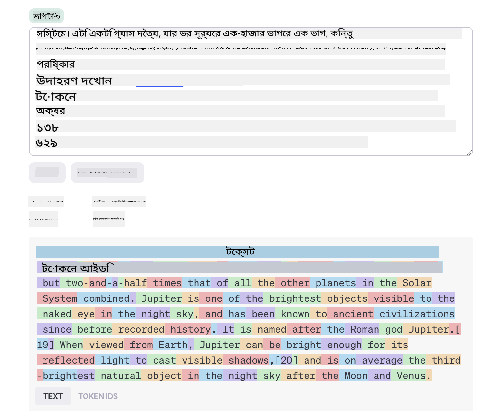
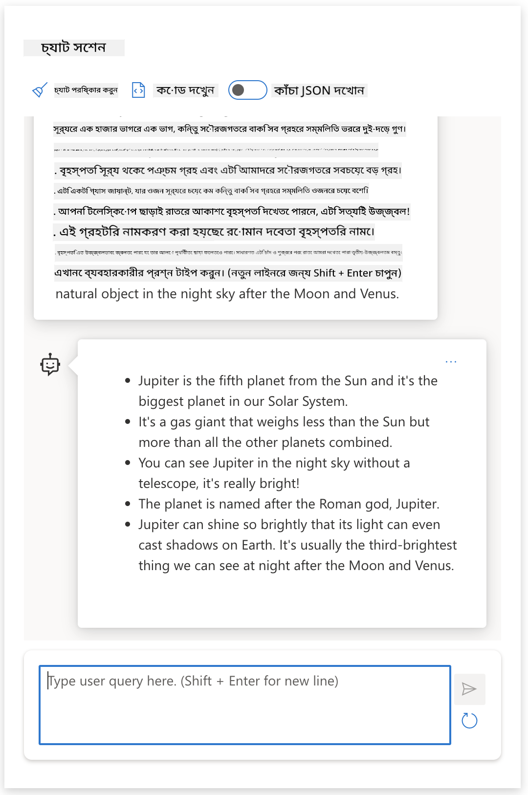

<!--
CO_OP_TRANSLATOR_METADATA:
{
  "original_hash": "0135e6c271f3ece8699050d4debbce88",
  "translation_date": "2025-10-17T14:58:10+00:00",
  "source_file": "04-prompt-engineering-fundamentals/README.md",
  "language_code": "bn"
}
-->
# প্রম্পট ইঞ্জিনিয়ারিংয়ের মৌলিক বিষয়

[](https://youtu.be/GElCu2kUlRs?si=qrXsBvXnCW12epb8)

## পরিচিতি
এই মডিউলটি জেনারেটিভ এআই মডেলের জন্য কার্যকর প্রম্পট তৈরি করার গুরুত্বপূর্ণ ধারণা এবং কৌশলগুলি নিয়ে আলোচনা করে। আপনি কীভাবে একটি LLM-এ আপনার প্রম্পট লিখবেন তা গুরুত্বপূর্ণ। একটি যত্ন সহকারে তৈরি করা প্রম্পট আরও ভালো মানের প্রতিক্রিয়া অর্জন করতে পারে। কিন্তু _প্রম্পট_ এবং _প্রম্পট ইঞ্জিনিয়ারিং_ এর মতো শব্দগুলি আসলে কী বোঝায়? এবং আমি কীভাবে LLM-এ পাঠানো প্রম্পট _ইনপুট_ উন্নত করতে পারি? এই অধ্যায় এবং পরবর্তী অধ্যায়ে আমরা এই প্রশ্নগুলোর উত্তর খুঁজে বের করার চেষ্টা করব।

_জেনারেটিভ এআই_ নতুন কন্টেন্ট তৈরি করতে সক্ষম (যেমন, টেক্সট, ছবি, অডিও, কোড ইত্যাদি) ব্যবহারকারীর অনুরোধের প্রতিক্রিয়ায়। এটি _লার্জ ল্যাঙ্গুয়েজ মডেল_ ব্যবহার করে অর্জন করে, যেমন OpenAI-এর GPT ("Generative Pre-trained Transformer") সিরিজ, যা প্রাকৃতিক ভাষা এবং কোড ব্যবহারের জন্য প্রশিক্ষিত।

ব্যবহারকারীরা এখন চ্যাটের মতো পরিচিত পদ্ধতি ব্যবহার করে এই মডেলগুলির সাথে যোগাযোগ করতে পারে, কোনো প্রযুক্তিগত দক্ষতা বা প্রশিক্ষণের প্রয়োজন ছাড়াই। মডেলগুলি _প্রম্পট-ভিত্তিক_ - ব্যবহারকারীরা একটি টেক্সট ইনপুট (প্রম্পট) পাঠায় এবং AI প্রতিক্রিয়া (কমপ্লিশন) ফিরে পায়। তারা তারপর "AI-এর সাথে চ্যাট" করতে পারে পুনরাবৃত্তিমূলকভাবে, বহু-টার্ন কথোপকথনে, তাদের প্রম্পট পরিমার্জন করতে পারে যতক্ষণ না প্রতিক্রিয়া তাদের প্রত্যাশার সাথে মিলে যায়।

"প্রম্পট" এখন জেনারেটিভ এআই অ্যাপগুলির জন্য প্রাথমিক _প্রোগ্রামিং ইন্টারফেস_ হয়ে উঠেছে, মডেলগুলিকে কী করতে হবে তা বলছে এবং ফেরত দেওয়া প্রতিক্রিয়ার গুণমানকে প্রভাবিত করছে। "প্রম্পট ইঞ্জিনিয়ারিং" একটি দ্রুত-বর্ধমান অধ্যয়নের ক্ষেত্র যা ধারাবাহিক এবং মানসম্পন্ন প্রতিক্রিয়া স্কেলে সরবরাহ করার জন্য প্রম্পটগুলির _ডিজাইন এবং অপ্টিমাইজেশন_ এর উপর ফোকাস করে।

## শেখার লক্ষ্য

এই পাঠে, আমরা শিখব প্রম্পট ইঞ্জিনিয়ারিং কী, কেন এটি গুরুত্বপূর্ণ, এবং কীভাবে আমরা একটি নির্দিষ্ট মডেল এবং অ্যাপ্লিকেশন উদ্দেশ্যের জন্য আরও কার্যকর প্রম্পট তৈরি করতে পারি। আমরা প্রম্পট ইঞ্জিনিয়ারিংয়ের মূল ধারণা এবং সেরা অনুশীলনগুলি বুঝব - এবং একটি ইন্টারেক্টিভ জুপিটার নোটবুক "স্যান্ডবক্স" পরিবেশ সম্পর্কে শিখব যেখানে আমরা বাস্তব উদাহরণে এই ধারণাগুলি প্রয়োগ করতে পারি।

এই পাঠের শেষে আমরা সক্ষম হব:

1. প্রম্পট ইঞ্জিনিয়ারিং কী এবং কেন এটি গুরুত্বপূর্ণ তা ব্যাখ্যা করতে।
2. প্রম্পটের উপাদানগুলি এবং সেগুলি কীভাবে ব্যবহৃত হয় তা বর্ণনা করতে।
3. প্রম্পট ইঞ্জিনিয়ারিংয়ের সেরা অনুশীলন এবং কৌশলগুলি শিখতে।
4. শেখা কৌশলগুলি বাস্তব উদাহরণে প্রয়োগ করতে, একটি OpenAI এন্ডপয়েন্ট ব্যবহার করে।

## গুরুত্বপূর্ণ শব্দ

প্রম্পট ইঞ্জিনিয়ারিং: AI মডেলগুলিকে কাঙ্ক্ষিত আউটপুট তৈরি করতে গাইড করার জন্য ইনপুট ডিজাইন এবং পরিমার্জনের অনুশীলন।
টোকেনাইজেশন: টেক্সটকে ছোট ছোট ইউনিটে রূপান্তর করার প্রক্রিয়া, যাকে টোকেন বলা হয়, যা একটি মডেল বুঝতে এবং প্রক্রিয়া করতে পারে।
ইন্সট্রাকশন-টিউনড LLMs: লার্জ ল্যাঙ্গুয়েজ মডেল (LLMs) যা তাদের প্রতিক্রিয়া সঠিকতা এবং প্রাসঙ্গিকতা উন্নত করতে নির্দিষ্ট নির্দেশাবলী দিয়ে ফাইন-টিউন করা হয়েছে।

## শেখার স্যান্ডবক্স

প্রম্পট ইঞ্জিনিয়ারিং বর্তমানে বিজ্ঞান থেকে বেশি শিল্প। এটি উন্নত করার সেরা উপায় হল _আরও অনুশীলন করা_ এবং একটি ট্রায়াল-এন্ড-এরর পদ্ধতি গ্রহণ করা যা অ্যাপ্লিকেশন ডোমেন দক্ষতার সাথে প্রস্তাবিত কৌশল এবং মডেল-নির্দিষ্ট অপ্টিমাইজেশনগুলিকে একত্রিত করে।

এই পাঠের সাথে থাকা জুপিটার নোটবুকটি একটি _স্যান্ডবক্স_ পরিবেশ প্রদান করে যেখানে আপনি যা শিখেছেন তা চেষ্টা করতে পারেন - যেমন আপনি যান বা কোড চ্যালেঞ্জের অংশ হিসাবে। অনুশীলনগুলি সম্পাদন করতে, আপনার প্রয়োজন হবে:

1. **একটি Azure OpenAI API কী** - একটি স্থাপন করা LLM-এর জন্য পরিষেবা এন্ডপয়েন্ট।
2. **একটি পাইথন রানটাইম** - যেখানে নোটবুকটি কার্যকর করা যেতে পারে।
3. **লোকাল এনভাইরনমেন্ট ভেরিয়েবল** - _[SETUP](./../00-course-setup/02-setup-local.md?WT.mc_id=academic-105485-koreyst) ধাপগুলি সম্পূর্ণ করুন এখন প্রস্তুত হতে_।

নোটবুকটি _স্টার্টার_ অনুশীলন নিয়ে আসে - তবে আপনাকে আরও উদাহরণ বা ধারণা চেষ্টা করার জন্য আপনার নিজের _মার্কডাউন_ (বর্ণনা) এবং _কোড_ (প্রম্পট অনুরোধ) বিভাগ যোগ করার জন্য উৎসাহিত করা হয় - এবং প্রম্পট ডিজাইনের জন্য আপনার অন্তর্দৃষ্টি তৈরি করুন।

## চিত্রিত গাইড

এই পাঠটি কী কভার করে তার একটি বড় ছবি পেতে চান? এই চিত্রিত গাইডটি দেখুন, যা আপনাকে প্রধান বিষয়গুলির একটি ধারণা দেয় এবং প্রতিটি বিষয়ে আপনার চিন্তা করার জন্য মূল বিষয়গুলি তুলে ধরে। পাঠের রোডম্যাপ আপনাকে মূল ধারণা এবং চ্যালেঞ্জগুলি বোঝা থেকে শুরু করে প্রাসঙ্গিক প্রম্পট ইঞ্জিনিয়ারিং কৌশল এবং সেরা অনুশীলনগুলির সাথে সেগুলি মোকাবিলা করার দিকে নিয়ে যায়। এই গাইডের "উন্নত কৌশল" বিভাগটি এই পাঠ্যক্রমের _পরবর্তী_ অধ্যায়ে কভার করা বিষয়বস্তুর উল্লেখ করে।


## আমাদের স্টার্টআপ

এখন, আসুন আলোচনা করি কীভাবে _এই বিষয়টি_ আমাদের স্টার্টআপ মিশনের সাথে সম্পর্কিত [শিক্ষায় AI উদ্ভাবন আনার জন্য](https://educationblog.microsoft.com/2023/06/collaborating-to-bring-ai-innovation-to-education?WT.mc_id=academic-105485-koreyst)। আমরা _ব্যক্তিগতকৃত শিক্ষার_ AI-চালিত অ্যাপ্লিকেশন তৈরি করতে চাই - তাই আসুন চিন্তা করি কীভাবে আমাদের অ্যাপ্লিকেশনের বিভিন্ন ব্যবহারকারী তাদের প্রম্পট "ডিজাইন" করতে পারে:

- **প্রশাসকরা** AI-কে _পাঠ্যক্রমের ডেটা বিশ্লেষণ করতে এবং কভারেজে ফাঁকগুলি চিহ্নিত করতে_ বলতে পারে। AI ফলাফলগুলি সংক্ষিপ্ত করতে বা কোড দিয়ে সেগুলি চিত্রিত করতে পারে।
- **শিক্ষকরা** AI-কে _একটি লক্ষ্য শ্রোতা এবং বিষয়ের জন্য একটি পাঠ পরিকল্পনা তৈরি করতে_ বলতে পারে। AI নির্দিষ্ট ফরম্যাটে ব্যক্তিগতকৃত পরিকল্পনা তৈরি করতে পারে।
- **শিক্ষার্থীরা** AI-কে _তাদের একটি কঠিন বিষয় শেখাতে_ বলতে পারে। AI এখন শিক্ষার্থীদের তাদের স্তরের সাথে মানানসই পাঠ, ইঙ্গিত এবং উদাহরণ দিয়ে গাইড করতে পারে।

এটি কেবল বরফের চূড়া। দেখুন [শিক্ষার জন্য প্রম্পট](https://github.com/microsoft/prompts-for-edu/tree/main?WT.mc_id=academic-105485-koreyst) - একটি ওপেন-সোর্স প্রম্পট লাইব্রেরি যা শিক্ষা বিশেষজ্ঞরা তৈরি করেছেন - সম্ভাবনার একটি বিস্তৃত ধারণা পেতে! _স্যান্ডবক্সে বা OpenAI প্লেগ্রাউন্ডে কিছু প্রম্পট চালানোর চেষ্টা করুন এবং দেখুন কী ঘটে!_

## প্রম্পট ইঞ্জিনিয়ারিং কী?

আমরা এই পাঠটি শুরু করেছি **প্রম্পট ইঞ্জিনিয়ারিং** কে _ডিজাইন এবং অপ্টিমাইজেশন_ প্রক্রিয়া হিসাবে সংজ্ঞায়িত করে যা একটি নির্দিষ্ট অ্যাপ্লিকেশন উদ্দেশ্য এবং মডেলের জন্য ধারাবাহিক এবং মানসম্পন্ন প্রতিক্রিয়া (কমপ্লিশন) সরবরাহ করে। আমরা এটিকে একটি ২-ধাপের প্রক্রিয়া হিসাবে ভাবতে পারি:

- একটি নির্দিষ্ট মডেল এবং উদ্দেশ্যের জন্য প্রাথমিক প্রম্পট _ডিজাইন করা_
- প্রতিক্রিয়ার গুণমান উন্নত করতে প্রম্পটটি পুনরাবৃত্তিমূলকভাবে _পরিমার্জন করা_

এটি একটি ট্রায়াল-এন্ড-এরর প্রক্রিয়া যা সর্বোত্তম ফলাফল পেতে ব্যবহারকারীর অন্তর্দৃষ্টি এবং প্রচেষ্টা প্রয়োজন। তাহলে কেন এটি গুরুত্বপূর্ণ? এই প্রশ্নের উত্তর দিতে, আমাদের প্রথমে তিনটি ধারণা বুঝতে হবে:

- _টোকেনাইজেশন_ = মডেল কীভাবে প্রম্পট "দেখে"
- _বেস LLMs_ = কীভাবে ফাউন্ডেশন মডেল একটি প্রম্পট "প্রক্রিয়া" করে
- _ইন্সট্রাকশন-টিউনড LLMs_ = কীভাবে মডেল এখন "কাজ" দেখতে পারে

### টোকেনাইজেশন

একটি LLM প্রম্পটগুলিকে একটি _টোকেনের ক্রম_ হিসাবে দেখে যেখানে বিভিন্ন মডেল (বা একটি মডেলের সংস্করণ) একই প্রম্পটকে বিভিন্নভাবে টোকেনাইজ করতে পারে। যেহেতু LLMs টোকেনের উপর প্রশিক্ষিত (কাঁচা টেক্সটের উপর নয়), প্রম্পটগুলি কীভাবে টোকেনাইজ করা হয় তা তৈরি করা প্রতিক্রিয়ার গুণমানের উপর সরাসরি প্রভাব ফেলে।

টোকেনাইজেশন কীভাবে কাজ করে তার একটি ধারণা পেতে, [OpenAI Tokenizer](https://platform.openai.com/tokenizer?WT.mc_id=academic-105485-koreyst) এর মতো সরঞ্জামগুলি চেষ্টা করুন। আপনার প্রম্পটটি কপি করুন - এবং এটি কীভাবে টোকেনে রূপান্তরিত হয় তা দেখুন, কীভাবে হোয়াইটস্পেস অক্ষর এবং বিরাম চিহ্নগুলি পরিচালনা করা হয় তা লক্ষ্য করুন। মনে রাখবেন যে এই উদাহরণটি একটি পুরানো LLM (GPT-3) দেখায় - তাই এটি একটি নতুন মডেলের সাথে চেষ্টা করলে একটি ভিন্ন ফলাফল তৈরি করতে পারে।



### ধারণা: ফাউন্ডেশন মডেল

একবার একটি প্রম্পট টোকেনাইজ করা হলে, ["বেস LLM"](https://blog.gopenai.com/an-introduction-to-base-and-instruction-tuned-large-language-models-8de102c785a6?WT.mc_id=academic-105485-koreyst) (বা ফাউন্ডেশন মডেল) এর প্রাথমিক কাজ হল সেই ক্রমে টোকেনের পূর্বাভাস দেওয়া। যেহেতু LLMs বিশাল টেক্সট ডেটাসেটে প্রশিক্ষিত হয়, তারা টোকেনগুলির মধ্যে পরিসংখ্যানগত সম্পর্ক সম্পর্কে একটি ভাল ধারণা রাখে এবং কিছু আত্মবিশ্বাসের সাথে সেই পূর্বাভাস দিতে পারে। মনে রাখবেন যে তারা প্রম্পট বা টোকেনের শব্দগুলির _অর্থ_ বোঝে না; তারা কেবল একটি প্যাটার্ন দেখে যা তারা তাদের পরবর্তী পূর্বাভাস দিয়ে "সম্পূর্ণ" করতে পারে। তারা ব্যবহারকারীর হস্তক্ষেপ বা কিছু পূর্ব-প্রতিষ্ঠিত শর্ত দ্বারা বন্ধ না হওয়া পর্যন্ত ক্রমটি পূর্বাভাস দিতে পারে।

প্রম্পট-ভিত্তিক কমপ্লিশন কীভাবে কাজ করে তা দেখতে চান? উপরের প্রম্পটটি Azure OpenAI Studio [_Chat Playground_](https://oai.azure.com/playground?WT.mc_id=academic-105485-koreyst) এ ডিফল্ট সেটিংস সহ প্রবেশ করান। সিস্টেমটি প্রম্পটগুলিকে তথ্যের অনুরোধ হিসাবে বিবেচনা করার জন্য কনফিগার করা হয়েছে - তাই আপনি একটি কমপ্লিশন দেখতে পাবেন যা এই প্রসঙ্গটি সন্তুষ্ট করে।

কিন্তু যদি ব্যবহারকারী এমন কিছু দেখতে চায় যা কিছু মানদণ্ড বা কাজের উদ্দেশ্য পূরণ করে? এখানেই _ইন্সট্রাকশন-টিউনড_ LLMs ছবিতে আসে।


### ধারণা: ইন্সট্রাকশন টিউনড LLMs

একটি [ইন্সট্রাকশন টিউনড LLM](https://blog.gopenai.com/an-introduction-to-base-and-instruction-tuned-large-language-models-8de102c785a6?WT.mc_id=academic-105485-koreyst) ফাউন্ডেশন মডেল দিয়ে শুরু করে এবং উদাহরণ বা ইনপুট/আউটপুট জোড়া (যেমন, বহু-টার্ন "মেসেজ") দিয়ে এটি ফাইন-টিউন করে যা স্পষ্ট নির্দেশাবলী ধারণ করতে পারে - এবং AI এর প্রতিক্রিয়াটি সেই নির্দেশাবলী অনুসরণ করার চেষ্টা করে।

এটি রিইনফোর্সমেন্ট লার্নিং উইথ হিউম্যান ফিডব্যাক (RLHF) এর মতো কৌশল ব্যবহার করে যা মডেলটিকে _নির্দেশাবলী অনুসরণ করতে_ এবং _ফিডব্যাক থেকে শিখতে_ প্রশিক্ষণ দিতে পারে যাতে এটি ব্যবহারিক অ্যাপ্লিকেশনের জন্য আরও উপযুক্ত এবং ব্যবহারকারীর উদ্দেশ্যের সাথে আরও প্রাসঙ্গিক প্রতিক্রিয়া তৈরি করে।

চলুন চেষ্টা করি - উপরের প্রম্পটটি পুনরায় দেখুন, তবে এখন _সিস্টেম মেসেজ_ পরিবর্তন করুন নিম্নলিখিত নির্দেশাবলী প্রসঙ্গ হিসাবে প্রদান করতে:

> _আপনাকে দেওয়া বিষয়বস্তু একটি দ্বিতীয় শ্রেণীর শিক্ষার্থীর জন্য সংক্ষিপ্ত করুন। ফলাফলটি একটি অনুচ্ছেদে ৩-৫টি বুলেট পয়েন্টে রাখুন।_

দেখুন কীভাবে ফলাফলটি এখন কাঙ্ক্ষিত লক্ষ্য এবং ফরম্যাট প্রতিফলিত করে? একজন শিক্ষক এখন সরাসরি তাদের ক্লাসের জন্য স্লাইডে এই প্রতিক্রিয়াটি ব্যবহার করতে পারেন।



## কেন প্রম্পট ইঞ্জিনিয়ারিং দরকার?

এখন আমরা জানি কীভাবে প্রম্পটগুলি LLMs দ্বারা প্রক্রিয়া করা হয়, আসুন আলোচনা করি _কেন_ প্রম্পট ইঞ্জিনিয়ারিং দরকার। উত্তরটি বর্তমান LLMs-এর বেশ কিছু চ্যালেঞ্জে রয়েছে যা _বিশ্বস্ত এবং ধারাবাহিক কমপ্লিশন_ অর্জনকে আরও চ্যালেঞ্জিং করে তোলে যদি প্রম্পট নির্মাণ এবং অপ্টিমাইজেশনে প্রচেষ্টা না করা হয়। উদাহরণস্বরূপ:

1. **মডেল প্রতিক্রিয়া স্টোকাস্টিক।** _একই প্রম্পট_ সম্ভবত বিভিন্ন মডেল বা মডেল সংস্করণের সাথে বিভিন্ন প্রতিক্রিয়া তৈরি করবে। এবং এটি এমনকি _একই মডেল_ এর সাথে বিভিন্ন সময়ে বিভিন্ন ফলাফল তৈরি করতে পারে। _প্রম্পট ইঞ্জিনিয়ারিং কৌশলগুলি আমাদের এই বৈচিত্র্যগুলি কমাতে সাহায্য করতে পারে আরও ভালো গার্ডরেল প্রদান করে_।

1. **মডেলগুলি প্রতিক্রিয়া তৈরি করতে পারে।** মডেলগুলি _বড় কিন্তু সীমিত_ ডেটাসেট দিয়ে প্রাক-প্রশিক্ষিত হয়, যার অর্থ তারা সেই প্রশিক্ষণের পরিধির বাইরে ধারণাগুলি সম্পর্কে জ্ঞান রাখে না। ফলস্বরূপ, তারা এমন কমপ্লিশন তৈরি করতে পারে যা অযথার্থ, কাল্পনিক, বা পরিচিত তথ্যের সাথে সরাসরি বিরোধপূর্ণ। _প্রম্পট ইঞ্জিনিয়ারিং কৌশলগুলি ব্যবহারকারীদের এই ধরনের প্রতিক্রিয়াগুলি চিহ্নিত করতে এবং প্রশমিত করতে সাহায্য করে, যেমন AI-কে উদ্ধৃতি বা যুক্তি জিজ্ঞাসা করে_।

1. **মডেলের ক্ষমতা পরিবর্তিত হবে।** নতুন মডেল বা মডেল প্রজন্মগুলির সমৃদ্ধ ক্ষমতা থাকবে তবে খরচ এবং জটিলতায় অনন্য বৈশিষ্ট্য এবং আপসও আনবে। _প্রম্পট ইঞ্জিনিয়ারিং আমাদের সেরা অনুশীলন এবং কর্মপ্রবাহগুলি বিকাশ করতে সাহায্য করতে পারে যা পার্থক্যগুলি দূর করে এবং মডেল-নির্দিষ্ট প্রয়োজনীয়তাগুলিতে স্কেলযোগ্য, নির্বিঘ্ন উপায়ে মানিয়ে নিতে পারে_।

চলুন এটি OpenAI বা Azure OpenAI প্লেগ্রাউন্ডে অ্যাকশনে দেখি:

- একই প্রম্পটটি বিভিন্ন LLM ডিপ্লয়মেন্ট
একটি ওয়েব অনুসন্ধান আমাকে দেখিয়েছে যে মঙ্গল গ্রহের যুদ্ধ নিয়ে কাল্পনিক গল্প (যেমন, টেলিভিশন সিরিজ বা বই) রয়েছে - কিন্তু ২০৭৬ সালে কোনো ঘটনা নেই। সাধারণ জ্ঞানও বলে যে ২০৭৬ _ভবিষ্যতে_ এবং তাই এটি কোনো বাস্তব ঘটনার সাথে সম্পর্কিত হতে পারে না।

তাহলে কী ঘটে যখন আমরা এই প্রম্পটটি বিভিন্ন LLM প্রদানকারীর সাথে চালাই?

> **প্রতিক্রিয়া ১**: OpenAI Playground (GPT-35)


> **প্রতিক্রিয়া ২**: Azure OpenAI Playground (GPT-35)


> **প্রতিক্রিয়া ৩**: Hugging Face Chat Playground (LLama-2)


প্রত্যাশিতভাবে, প্রতিটি মডেল (বা মডেল সংস্করণ) সামান্য ভিন্ন প্রতিক্রিয়া তৈরি করে, কারণ স্টোকাস্টিক আচরণ এবং মডেলের সক্ষমতার পার্থক্য। উদাহরণস্বরূপ, একটি মডেল ৮ম শ্রেণির শিক্ষার্থীদের লক্ষ্য করে, অন্যটি উচ্চ বিদ্যালয়ের শিক্ষার্থীদের জন্য উপযুক্ত। তবে তিনটি মডেলই এমন প্রতিক্রিয়া তৈরি করেছে যা একজন অজ্ঞ ব্যবহারকারীকে বিশ্বাস করাতে পারে যে ঘটনাটি বাস্তব।

প্রম্পট ইঞ্জিনিয়ারিং কৌশল যেমন _মেটাপ্রম্পটিং_ এবং _তাপমাত্রা কনফিগারেশন_ কিছুটা মডেল ভুল তথ্য প্রদান কমাতে পারে। নতুন প্রম্পট ইঞ্জিনিয়ারিং _আর্কিটেকচার_ প্রম্পট প্রবাহে নতুন সরঞ্জাম এবং কৌশলগুলি নির্বিঘ্নে অন্তর্ভুক্ত করে, এই প্রভাবগুলিকে কমানোর বা হ্রাস করার জন্য।

## কেস স্টাডি: GitHub Copilot

এই অংশটি শেষ করার আগে, আসুন একটি বাস্তব জীবনের সমাধানে প্রম্পট ইঞ্জিনিয়ারিং কীভাবে ব্যবহৃত হয় তা বুঝতে একটি কেস স্টাডি দেখি: [GitHub Copilot](https://github.com/features/copilot?WT.mc_id=academic-105485-koreyst)।

GitHub Copilot আপনার "AI Pair Programmer" - এটি টেক্সট প্রম্পটকে কোড কমপ্লিশনে রূপান্তর করে এবং আপনার ডেভেলপমেন্ট পরিবেশে (যেমন, Visual Studio Code) একীভূত হয় একটি নির্বিঘ্ন ব্যবহারকারীর অভিজ্ঞতার জন্য। নিচের ব্লগ সিরিজে নথিভুক্ত হিসাবে, প্রাথমিক সংস্করণটি OpenAI Codex মডেলের উপর ভিত্তি করে ছিল - যেখানে প্রকৌশলীরা দ্রুত বুঝতে পেরেছিলেন যে মডেলটি আরও উন্নত করতে এবং কোডের গুণমান উন্নত করতে প্রম্পট ইঞ্জিনিয়ারিং কৌশলগুলি বিকাশ করা প্রয়োজন। জুলাই মাসে, তারা [একটি উন্নত AI মডেল চালু করেছে যা Codex-এর চেয়েও এগিয়ে](https://github.blog/2023-07-28-smarter-more-efficient-coding-github-copilot-goes-beyond-codex-with-improved-ai-model/?WT.mc_id=academic-105485-koreyst) দ্রুততর পরামর্শের জন্য।

তাদের শেখার যাত্রা অনুসরণ করতে পোস্টগুলি ক্রমানুসারে পড়ুন।

- **মে ২০২৩** | [GitHub Copilot আপনার কোড বুঝতে আরও ভালো হচ্ছে](https://github.blog/2023-05-17-how-github-copilot-is-getting-better-at-understanding-your-code/?WT.mc_id=academic-105485-koreyst)
- **মে ২০২৩** | [GitHub-এর ভিতরে: GitHub Copilot-এর পিছনে থাকা LLMs নিয়ে কাজ](https://github.blog/2023-05-17-inside-github-working-with-the-llms-behind-github-copilot/?WT.mc_id=academic-105485-koreyst)
- **জুন ২০২৩** | [GitHub Copilot-এর জন্য আরও ভালো প্রম্পট কীভাবে লিখবেন](https://github.blog/2023-06-20-how-to-write-better-prompts-for-github-copilot/?WT.mc_id=academic-105485-koreyst)
- **জুলাই ২০২৩** | [GitHub Copilot উন্নত AI মডেলের সাথে Codex-এর চেয়েও এগিয়ে গেছে](https://github.blog/2023-07-28-smarter-more-efficient-coding-github-copilot-goes-beyond-codex-with-improved-ai-model/?WT.mc_id=academic-105485-koreyst)
- **জুলাই ২০২৩** | [একজন ডেভেলপারের জন্য প্রম্পট ইঞ্জিনিয়ারিং এবং LLMs গাইড](https://github.blog/2023-07-17-prompt-engineering-guide-generative-ai-llms/?WT.mc_id=academic-105485-koreyst)
- **সেপ্টেম্বর ২০২৩** | [কীভাবে একটি এন্টারপ্রাইজ LLM অ্যাপ তৈরি করবেন: GitHub Copilot থেকে শিক্ষা](https://github.blog/2023-09-06-how-to-build-an-enterprise-llm-application-lessons-from-github-copilot/?WT.mc_id=academic-105485-koreyst)

আপনি তাদের [ইঞ্জিনিয়ারিং ব্লগ](https://github.blog/category/engineering/?WT.mc_id=academic-105485-koreyst) ব্রাউজ করতে পারেন আরও পোস্টের জন্য, যেমন [এই পোস্টটি](https://github.blog/2023-09-27-how-i-used-github-copilot-chat-to-build-a-reactjs-gallery-prototype/?WT.mc_id=academic-105485-koreyst) যা দেখায় কীভাবে এই মডেল এবং কৌশলগুলি বাস্তব জীবনের অ্যাপ্লিকেশন চালানোর জন্য _প্রয়োগ_ করা হয়।

---

<!--
পাঠের টেমপ্লেট:
এই ইউনিটটি মূল ধারণা #২ কভার করা উচিত।
উদাহরণ এবং রেফারেন্স দিয়ে ধারণাটি শক্তিশালী করুন।

ধারণা #২:
প্রম্পট ডিজাইন।
উদাহরণ দিয়ে চিত্রিত।
-->

## প্রম্পট নির্মাণ

আমরা দেখেছি কেন প্রম্পট ইঞ্জিনিয়ারিং গুরুত্বপূর্ণ - এখন আসুন বুঝি কীভাবে প্রম্পটগুলি _নির্মাণ_ করা হয় যাতে আমরা আরও কার্যকর প্রম্পট ডিজাইনের জন্য বিভিন্ন কৌশল মূল্যায়ন করতে পারি।

### মৌলিক প্রম্পট

চলুন মৌলিক প্রম্পট দিয়ে শুরু করি: একটি টেক্সট ইনপুট যা মডেলে পাঠানো হয় কোনো অতিরিক্ত প্রসঙ্গ ছাড়াই। এখানে একটি উদাহরণ - যখন আমরা OpenAI [Completion API](https://platform.openai.com/docs/api-reference/completions?WT.mc_id=academic-105485-koreyst)-তে মার্কিন জাতীয় সংগীতের প্রথম কয়েকটি শব্দ পাঠাই, এটি তৎক্ষণাৎ _উত্তর সম্পূর্ণ_ করে পরবর্তী কয়েকটি লাইন দিয়ে, যা মৌলিক পূর্বাভাস আচরণকে চিত্রিত করে।

| প্রম্পট (ইনপুট)     | সম্পূর্ণতা (আউটপুট)                                                                                                                        |
| :----------------- | :----------------------------------------------------------------------------------------------------------------------------------------- |
| Oh say can you see | মনে হচ্ছে আপনি "The Star-Spangled Banner," মার্কিন যুক্তরাষ্ট্রের জাতীয় সংগীতের গানের কথা শুরু করছেন। পুরো গানের কথা হলো ... |

### জটিল প্রম্পট

এখন আসুন সেই মৌলিক প্রম্পটে প্রসঙ্গ এবং নির্দেশনা যোগ করি। [Chat Completion API](https://learn.microsoft.com/azure/ai-services/openai/how-to/chatgpt?WT.mc_id=academic-105485-koreyst) আমাদের একটি _মেসেজের_ সংগ্রহ হিসাবে একটি জটিল প্রম্পট তৈরি করতে দেয়:

- ইনপুট/আউটপুট জোড়া যা _ব্যবহারকারী_ ইনপুট এবং _সহকারী_ প্রতিক্রিয়াকে প্রতিফলিত করে।
- সিস্টেম মেসেজ যা সহকারীর আচরণ বা ব্যক্তিত্বের জন্য প্রসঙ্গ সেট করে।

অনুরোধটি এখন নিচের ফর্মে রয়েছে, যেখানে _টোকেনাইজেশন_ কার্যকরভাবে প্রসঙ্গ এবং কথোপকথন থেকে প্রাসঙ্গিক তথ্য ধারণ করে। এখন, সিস্টেম প্রসঙ্গ পরিবর্তন করা সম্পূর্ণতার গুণমানের উপর ব্যবহারকারীর প্রদত্ত ইনপুটগুলির মতোই প্রভাব ফেলতে পারে।

```python
response = openai.chat.completions.create(
    model="gpt-3.5-turbo",
    messages=[
        {"role": "system", "content": "You are a helpful assistant."},
        {"role": "user", "content": "Who won the world series in 2020?"},
        {"role": "assistant", "content": "The Los Angeles Dodgers won the World Series in 2020."},
        {"role": "user", "content": "Where was it played?"}
    ]
)
```

### নির্দেশনা প্রম্পট

উপরের উদাহরণগুলিতে, ব্যবহারকারীর প্রম্পটটি একটি সাধারণ টেক্সট অনুসন্ধান ছিল যা তথ্যের জন্য একটি অনুরোধ হিসাবে ব্যাখ্যা করা যেতে পারে। _নির্দেশনা_ প্রম্পটের সাথে, আমরা সেই টেক্সটটি ব্যবহার করে একটি কাজ আরও বিস্তারিতভাবে নির্দিষ্ট করতে পারি, AI-কে আরও ভালো নির্দেশনা প্রদান করতে পারি। এখানে একটি উদাহরণ:

| প্রম্পট (ইনপুট)                                                                                                                                                                                                                         | সম্পূর্ণতা (আউটপুট)                                                                                                        | নির্দেশনার ধরন    |
| :------------------------------------------------------------------------------------------------------------------------------------------------------------------------------------------------------------------------------------- | :------------------------------------------------------------------------------------------------------------------------- | :------------------ |
| Write a description of the Civil War                                                                                                                                                                                                   | _একটি সাধারণ প্যারাগ্রাফ প্রদান করেছে_                                                                                              | সাধারণ              |
| Write a description of the Civil War. Provide key dates and events and describe their significance                                                                                                                                     | _একটি প্যারাগ্রাফ এবং তারপরে গুরুত্বপূর্ণ ঘটনাগুলোর তারিখ এবং বর্ণনা সহ একটি তালিকা প্রদান করেছে_                                             | জটিল             |
| Write a description of the Civil War in 1 paragraph. Provide 3 bullet points with key dates and their significance. Provide 3 more bullet points with key historical figures and their contributions. Return the output as a JSON file | _আরও বিস্তারিত তথ্য একটি টেক্সট বক্সে প্রদান করেছে, যা JSON আকারে ফরম্যাট করা হয়েছে এবং আপনি এটি একটি ফাইলে কপি-পেস্ট করে যাচাই করতে পারেন_ | জটিল। ফরম্যাটেড। |

## প্রাথমিক বিষয়বস্তু

উপরের উদাহরণগুলিতে, প্রম্পটটি এখনও বেশ খোলা ছিল, LLM-কে তার প্রি-ট্রেইনড ডেটাসেটের কোন অংশটি প্রাসঙ্গিক তা সিদ্ধান্ত নিতে দিয়েছে। _প্রাথমিক বিষয়বস্তু_ ডিজাইন প্যাটার্নের সাথে, ইনপুট টেক্সটটি দুটি অংশে বিভক্ত:

- একটি নির্দেশনা (কর্ম)
- প্রাসঙ্গিক বিষয়বস্তু (যা কর্মকে প্রভাবিত করে)

এখানে একটি উদাহরণ যেখানে নির্দেশনা হলো "এটি ২টি বাক্যে সংক্ষেপ করুন।"

| প্রম্পট (ইনপুট)                                                                                                                                                                                                                                                                                                                                                                                                                                                                                                                                                                                                                                                                                      | সম্পূর্ণতা (আউটপুট)                                                                                                                                                                                                                                                                             |
| :-------------------------------------------------------------------------------------------------------------------------------------------------------------------------------------------------------------------------------------------------------------------------------------------------------------------------------------------------------------------------------------------------------------------------------------------------------------------------------------------------------------------------------------------------------------------------------------------------------------------------------------------------------------------------------------------------- | :---------------------------------------------------------------------------------------------------------------------------------------------------------------------------------------------------------------------------------------------------------------------------------------------- |
| Jupiter is the fifth planet from the Sun and the largest in the Solar System. It is a gas giant with a mass one-thousandth that of the Sun, but two-and-a-half times that of all the other planets in the Solar System combined. Jupiter is one of the brightest objects visible to the naked eye in the night sky, and has been known to ancient civilizations since before recorded history. It is named after the Roman god Jupiter.[19] When viewed from Earth, Jupiter can be bright enough for its reflected light to cast visible shadows,[20] and is on average the third-brightest natural object in the night sky after the Moon and Venus. <br/> **Summarize this in 2 short sentences** | Jupiter, সূর্যের পঞ্চম গ্রহ, সৌরজগতের বৃহত্তম এবং রাতের আকাশে সবচেয়ে উজ্জ্বল বস্তুগুলির মধ্যে একটি। রোমান দেবতা Jupiter-এর নামে নামকরণ করা হয়েছে, এটি একটি গ্যাস জায়ান্ট যার ভর সৌরজগতের অন্যান্য সমস্ত গ্রহের সম্মিলিত ভরের তুলনায় দুই-তৃতীয়াংশ বেশি। |

প্রাথমিক বিষয়বস্তু অংশটি আরও কার্যকর নির্দেশনা চালানোর জন্য বিভিন্নভাবে ব্যবহার করা যেতে পারে:

- **উদাহরণ** - মডেলকে কী করতে হবে তা স্পষ্ট নির্দেশনা দেওয়ার পরিবর্তে, এটি কী করতে হবে তার উদাহরণ দিন এবং এটি প্যাটার্নটি অনুমান করতে দিন।
- **ইঙ্গিত** - নির্দেশনার পরে একটি "ইঙ্গিত" দিন যা সম্পূর্ণতাকে প্রাইম করে, মডেলকে আরও প্রাসঙ্গিক প্রতিক্রিয়ার দিকে পরিচালিত করে।
- **টেমপ্লেট** - এগুলি প্রম্পটের পুনরাবৃত্তি 'রেসিপি' যা প্লেসহোল্ডার (ভেরিয়েবল) সহ নির্দিষ্ট ব্যবহারের ক্ষেত্রে কাস্টমাইজ করা যেতে পারে।

চলুন এগুলো কার্যকরভাবে কিভাবে কাজ করে তা দেখি।

### উদাহরণ ব্যবহার

এটি একটি পদ্ধতি যেখানে আপনি প্রাথমিক বিষয়বস্তু ব্যবহার করে মডেলকে কিছু উদাহরণ "খাওয়ান" যা একটি প্রদত্ত নির্দেশনার জন্য কাঙ্ক্ষিত আউটপুট প্রতিফলিত করে এবং এটি কাঙ্ক্ষিত আউটপুটের প্যাটার্ন অনুমান করতে দিন। প্রদত্ত উদাহরণগুলির সংখ্যার উপর ভিত্তি করে, আমরা জিরো-শট প্রম্পটিং, ওয়ান-শট প্রম্পটিং, ফিউ-শট প্রম্পটিং ইত্যাদি পেতে পারি।

প্রম্পটটি এখন তিনটি উপাদান নিয়ে গঠিত:

- একটি কাজের বিবরণ
- কাঙ্ক্ষিত আউটপুটের কয়েকটি উদাহরণ
- একটি নতুন উদাহরণের শুরু (যা একটি অন্তর্নিহিত কাজের বিবরণ হয়ে যায়)

| শেখার ধরন | প্রম্পট (ইনপুট)                                                                                                                                        | সম্পূর্ণতা (আউটপুট)         |
| :------------ | :---------------------------------------------------------------------------------------------------------------------------------------------------- | :-------------------------- |
| জিরো-শট     | "The Sun is Shining". Translate to Spanish                                                                                                            | "El Sol está brillando".    |
| ওয়ান-শট      | "The Sun is Shining" => ""El Sol está brillando". <br> "It's a Cold and Windy Day" =>                                                                 | "Es un día frío y ventoso". |
| ফিউ-শট      | The player ran the bases => Baseball <br/> The player hit an ace => Tennis <br/> The player hit a six => Cricket <br/> The player made a slam-dunk => | Basketball                  |
|               |                                                                                                                                                       |                             |

দেখুন কিভাবে আমরা জিরো-শট প্রম্পটিং-এ স্পষ্ট নির্দেশনা ("Translate to Spanish") প্রদান করতে হয়েছিল, কিন্তু এটি ওয়ান-শট প্রম্পটিং উদাহরণে অনুমান করা হয়েছে। ফিউ-শট উদাহরণটি দেখায় কিভাবে আরও উদাহরণ যোগ করলে কোনো অতিরিক্ত নির্দেশনা ছাড়াই মডেলগুলি আরও সঠিক অনুমান করতে পারে।

### প্রম্পট ইঙ্গিত

প্রাথমিক বিষয়বস্তু ব্যবহার করার আরেকটি কৌশল হলো _ইঙ্গিত_ প্রদান করা। এই ক্ষেত্রে, আমরা মডেলকে একটি _নির্দেশনা_ দিচ্ছি যা কাঙ্ক্ষিত প্রতিক্রিয়ার ফরম্যাট প্রতিফলিত করে। মডেলটি তখন "ইঙ্গিতটি গ্রহণ করে" এবং সেই ধাঁচে প্রতিক্রিয়া প্রদান করে।

| ইঙ্গিতের সংখ্যা | প্রম্পট (ইনপুট)                                                                                                                                                                                                                                                                                                                                                                                                                                               | সম্পূর্ণতা (আউটপুট)                                                                                                                                                                                                                                                                                       |
| :------------- | :----------------------------------------------------------------------------------------------------------------------------------------------------------------------------------------------------------------------------------------------------------------------------------------------------------------------------------------------------------------------------------------------------------------------------------------------------------- | :-------------------------------------------------------------------------------------------------------------------------------------------------------------------------------------------------------------------------------------------------------------------------------------------------------- |
| ০              | Jupiter is the fifth planet from the Sun and the largest in the Solar System. It is a gas giant with a mass one-thousandth that of the Sun, but two-and-a-half times that of all the other planets in the Solar System combined. Jupiter is one of the brightest objects visible to the naked eye in the night sky, and has been known to ancient civilizations since before recorded history. <br/>**Summarize This**                                       | Jupiter সৌরজগতের বৃহত্তম গ্রহ এবং সূর্যের পঞ্চম গ্রহ। এটি একটি গ্যাস জায়ান্ট যার ভর সূর্যের ১/১০০০ ভাগ, কিন্তু এটি অন্যান্য গ্রহের সম্মিলিত ভরের তুলনায় বেশি। প্রাচীন সভ্যতাগুলি Jupiter সম্পর্কে দীর্ঘদিন ধরে জানে এবং এটি রাতের আকাশে সহজেই দৃশ্যমান। |
| 1              | বৃহস্পতির সূর্য থেকে পঞ্চম গ্রহ এবং সৌরজগতের সবচেয়ে বড় গ্রহ। এটি একটি গ্যাস জায়ান্ট যার ভর সূর্যের এক-হাজার ভাগ, কিন্তু সৌরজগতের অন্যান্য সমস্ত গ্রহের সম্মিলিত ভরের দুই-গুণ। বৃহস্পতি রাতের আকাশে খালি চোখে দৃশ্যমান উজ্জ্বল বস্তুগুলোর মধ্যে একটি এবং এটি প্রাচীন সভ্যতাগুলোর কাছে ইতিহাসের আগে থেকেই পরিচিত। <br/>**সংক্ষেপ করুন** <br/> আমরা যা শিখেছি তা হলো বৃহস্পতি | সূর্য থেকে পঞ্চম গ্রহ এবং সৌরজগতের সবচেয়ে বড় গ্রহ। এটি একটি গ্যাস জায়ান্ট যার ভর সূর্যের এক-হাজার ভাগ, কিন্তু অন্যান্য সমস্ত গ্রহের সম্মিলিত ভরের দুই-গুণ। এটি খালি চোখে সহজেই দৃশ্যমান এবং প্রাচীনকাল থেকে পরিচিত।                        |
| 2              | বৃহস্পতির সূর্য থেকে পঞ্চম গ্রহ এবং সৌরজগতের সবচেয়ে বড় গ্রহ। এটি একটি গ্যাস জায়ান্ট যার ভর সূর্যের এক-হাজার ভাগ, কিন্তু সৌরজগতের অন্যান্য সমস্ত গ্রহের সম্মিলিত ভরের দুই-গুণ। বৃহস্পতি রাতের আকাশে খালি চোখে দৃশ্যমান উজ্জ্বল বস্তুগুলোর মধ্যে একটি এবং এটি প্রাচীন সভ্যতাগুলোর কাছে ইতিহাসের আগে থেকেই পরিচিত। <br/>**সংক্ষেপ করুন** <br/> শীর্ষ ৩টি তথ্য যা আমরা শিখেছি:         | ১. বৃহস্পতি সূর্য থেকে পঞ্চম গ্রহ এবং সৌরজগতের সবচেয়ে বড় গ্রহ। <br/> ২. এটি একটি গ্যাস জায়ান্ট যার ভর সূর্যের এক-হাজার ভাগ...<br/> ৩. বৃহস্পতি প্রাচীনকাল থেকে খালি চোখে দৃশ্যমান ...                                                                       |
|                |                                                                                                                                                                                                                                                                                                                                                                                                                                                              |                                                                                                                                                                                                                                                                                                           |

### প্রম্পট টেমপ্লেট

একটি প্রম্পট টেমপ্লেট হলো একটি _প্রি-ডিফাইন্ড রেসিপি_ যা সংরক্ষণ করা যায় এবং প্রয়োজন অনুযায়ী পুনরায় ব্যবহার করা যায়, যাতে বড় পরিসরে আরও ধারাবাহিক ব্যবহারকারীর অভিজ্ঞতা চালানো যায়। এর সহজতম রূপে, এটি কেবল প্রম্পট উদাহরণগুলোর একটি সংগ্রহ, যেমন [এই উদাহরণটি OpenAI থেকে](https://platform.openai.com/examples?WT.mc_id=academic-105485-koreyst), যা ইন্টারেক্টিভ প্রম্পট উপাদান (ব্যবহারকারী এবং সিস্টেম বার্তা) এবং API-চালিত অনুরোধ ফরম্যাট উভয়ই সরবরাহ করে - পুনরায় ব্যবহারের জন্য।

এর আরও জটিল রূপে, যেমন [LangChain থেকে এই উদাহরণটি](https://python.langchain.com/docs/concepts/prompt_templates/?WT.mc_id=academic-105485-koreyst), এটি _প্লেসহোল্ডার_ ধারণ করে যা ব্যবহারকারীর ইনপুট, সিস্টেম প্রসঙ্গ, বাহ্যিক ডেটা উৎস ইত্যাদি থেকে ডেটা দিয়ে প্রতিস্থাপন করা যায়, প্রম্পটটি গতিশীলভাবে তৈরি করতে। এটি আমাদের পুনরায় ব্যবহারযোগ্য প্রম্পটের একটি লাইব্রেরি তৈরি করতে দেয় যা প্রোগ্রাম্যাটিকভাবে বড় পরিসরে ধারাবাহিক ব্যবহারকারীর অভিজ্ঞতা চালানোর জন্য ব্যবহার করা যেতে পারে।

শেষ পর্যন্ত, টেমপ্লেটগুলোর আসল মূল্য হলো _প্রম্পট লাইব্রেরি_ তৈরি এবং প্রকাশ করার ক্ষমতা, যা উল্লম্ব অ্যাপ্লিকেশন ডোমেইনের জন্য অপ্টিমাইজ করা হয় - যেখানে প্রম্পট টেমপ্লেটটি এখন _অ্যাপ্লিকেশন-নির্দিষ্ট প্রসঙ্গ_ বা উদাহরণগুলোর প্রতিফলন ঘটায় যা লক্ষ্যযুক্ত ব্যবহারকারীর জন্য প্রতিক্রিয়াগুলো আরও প্রাসঙ্গিক এবং সঠিক করে তোলে। [Prompts For Edu](https://github.com/microsoft/prompts-for-edu?WT.mc_id=academic-105485-koreyst) রিপোজিটরি এই পদ্ধতির একটি চমৎকার উদাহরণ, যা শিক্ষা ডোমেইনের জন্য প্রম্পটের একটি লাইব্রেরি তৈরি করে, পাঠ পরিকল্পনা, পাঠ্যক্রম নকশা, ছাত্র টিউটরিং ইত্যাদির মতো মূল উদ্দেশ্যগুলোর উপর জোর দিয়ে।

## সহায়ক বিষয়বস্তু

যদি আমরা প্রম্পট নির্মাণকে একটি নির্দেশনা (কাজ) এবং একটি লক্ষ্য (প্রাথমিক বিষয়বস্তু) হিসাবে বিবেচনা করি, তবে _গৌণ বিষয়বস্তু_ হলো অতিরিক্ত প্রসঙ্গ যা আমরা প্রদান করি **প্রতিক্রিয়াকে কোনোভাবে প্রভাবিত করতে**। এটি টিউনিং প্যারামিটার, ফরম্যাটিং নির্দেশনা, বিষয় ট্যাক্সোনমি ইত্যাদি হতে পারে যা মডেলকে _প্রতিক্রিয়া_ ব্যবহারকারীর উদ্দেশ্য বা প্রত্যাশার সাথে মানানসই করতে সাহায্য করে।

উদাহরণস্বরূপ: একটি কোর্স ক্যাটালগ দেওয়া হয়েছে যেখানে পাঠ্যক্রমে উপলব্ধ সমস্ত কোর্সের নাম, বিবরণ, স্তর, মেটাডেটা ট্যাগ, প্রশিক্ষক ইত্যাদি সম্পর্কে বিস্তৃত মেটাডেটা রয়েছে:

- আমরা একটি নির্দেশনা সংজ্ঞায়িত করতে পারি "Fall 2023 এর জন্য কোর্স ক্যাটালগ সংক্ষেপ করুন"
- আমরা প্রাথমিক বিষয়বস্তু ব্যবহার করে কাঙ্ক্ষিত আউটপুটের কয়েকটি উদাহরণ প্রদান করতে পারি
- আমরা গৌণ বিষয়বস্তু ব্যবহার করে শীর্ষ ৫টি "ট্যাগ" চিহ্নিত করতে পারি।

এখন, মডেলটি কয়েকটি উদাহরণ দ্বারা প্রদর্শিত ফরম্যাটে একটি সংক্ষিপ্তসার প্রদান করতে পারে - কিন্তু যদি একটি ফলাফলে একাধিক ট্যাগ থাকে, এটি গৌণ বিষয়বস্তুতে চিহ্নিত ৫টি ট্যাগকে অগ্রাধিকার দিতে পারে।

---

<!--
পাঠের টেমপ্লেট:
এই ইউনিটটি মূল ধারণা #১ কভার করা উচিত।
উদাহরণ এবং রেফারেন্স দিয়ে ধারণাটি শক্তিশালী করুন।

ধারণা #৩:
প্রম্পট ইঞ্জিনিয়ারিং কৌশল।
প্রম্পট ইঞ্জিনিয়ারিংয়ের কিছু মৌলিক কৌশল কী?
কিছু অনুশীলনের মাধ্যমে এটি চিত্রিত করুন।
-->

## প্রম্পটিং সেরা অনুশীলন

এখন যেহেতু আমরা জানি প্রম্পটগুলো কীভাবে _নির্মাণ_ করা যায়, আমরা কীভাবে সেগুলোকে _ডিজাইন_ করা যায় তা নিয়ে চিন্তা করতে পারি যাতে সেরা অনুশীলন প্রতিফলিত হয়। আমরা এটি দুটি অংশে ভাবতে পারি - সঠিক _মাইন্ডসেট_ থাকা এবং সঠিক _কৌশল_ প্রয়োগ করা।

### প্রম্পট ইঞ্জিনিয়ারিং মাইন্ডসেট

প্রম্প্ট ইঞ্জিনিয়ারিং একটি ট্রায়াল-এন্ড-এরর প্রক্রিয়া, তাই তিনটি বিস্তৃত নির্দেশিকা মনে রাখুন:

1. **ডোমেইন বোঝা গুরুত্বপূর্ণ।** প্রতিক্রিয়ার সঠিকতা এবং প্রাসঙ্গিকতা হলো সেই _ডোমেইন_ এর একটি ফাংশন যেখানে অ্যাপ্লিকেশন বা ব্যবহারকারী কাজ করে। আপনার অন্তর্দৃষ্টি এবং ডোমেইন দক্ষতা প্রয়োগ করে **কৌশলগুলো কাস্টমাইজ করুন**। উদাহরণস্বরূপ, আপনার সিস্টেম প্রম্পটে _ডোমেইন-নির্দিষ্ট ব্যক্তিত্ব_ সংজ্ঞায়িত করুন, অথবা আপনার ব্যবহারকারীর প্রম্পটে _ডোমেইন-নির্দিষ্ট টেমপ্লেট_ ব্যবহার করুন। গৌণ বিষয়বস্তু প্রদান করুন যা ডোমেইন-নির্দিষ্ট প্রসঙ্গ প্রতিফলিত করে, অথবা মডেলকে পরিচিত ব্যবহার প্যাটার্নের দিকে পরিচালিত করতে _ডোমেইন-নির্দিষ্ট সংকেত এবং উদাহরণ_ ব্যবহার করুন।

2. **মডেল বোঝা গুরুত্বপূর্ণ।** আমরা জানি মডেলগুলো প্রকৃতিগতভাবে স্টোকাস্টিক। কিন্তু মডেল বাস্তবায়নগুলো তাদের ব্যবহৃত প্রশিক্ষণ ডেটাসেট (প্রি-ট্রেইনড জ্ঞান), তারা যে ক্ষমতাগুলো প্রদান করে (যেমন, API বা SDK এর মাধ্যমে) এবং তারা যে বিষয়বস্তুতে অপ্টিমাইজ করা হয় (যেমন, কোড বনাম ছবি বনাম টেক্সট) এর ক্ষেত্রে পরিবর্তিত হতে পারে। আপনি যে মডেলটি ব্যবহার করছেন তার শক্তি এবং সীমাবদ্ধতা বুঝুন, এবং সেই জ্ঞান ব্যবহার করে _কাজগুলোকে অগ্রাধিকার দিন_ বা _কাস্টমাইজড টেমপ্লেট_ তৈরি করুন যা মডেলের ক্ষমতার জন্য অপ্টিমাইজ করা।

3. **পুনরাবৃত্তি এবং যাচাই গুরুত্বপূর্ণ।** মডেলগুলো দ্রুত বিকশিত হচ্ছে, এবং প্রম্প্ট ইঞ্জিনিয়ারিংয়ের কৌশলগুলোও। একজন ডোমেইন বিশেষজ্ঞ হিসাবে, আপনার নির্দিষ্ট অ্যাপ্লিকেশনের জন্য অন্যান্য প্রসঙ্গ বা মানদণ্ড থাকতে পারে যা বৃহত্তর সম্প্রদায়ের জন্য প্রযোজ্য নয়। প্রম্প্ট ইঞ্জিনিয়ারিং সরঞ্জাম এবং কৌশল ব্যবহার করে প্রম্প্ট নির্মাণ "জাম্প স্টার্ট" করুন, তারপর আপনার নিজস্ব অন্তর্দৃষ্টি এবং ডোমেইন দক্ষতা ব্যবহার করে ফলাফলগুলো পুনরাবৃত্তি এবং যাচাই করুন। আপনার অন্তর্দৃষ্টি রেকর্ড করুন এবং একটি **জ্ঞানভাণ্ডার** (যেমন, প্রম্প্ট লাইব্রেরি) তৈরি করুন যা ভবিষ্যতে দ্রুত পুনরাবৃত্তির জন্য অন্যদের দ্বারা একটি নতুন ভিত্তি হিসাবে ব্যবহার করা যেতে পারে।

## সেরা অনুশীলন

এখন আসুন সাধারণ সেরা অনুশীলনগুলো দেখি যা [OpenAI](https://help.openai.com/en/articles/6654000-best-practices-for-prompt-engineering-with-openai-api?WT.mc_id=academic-105485-koreyst) এবং [Azure OpenAI](https://learn.microsoft.com/azure/ai-services/openai/concepts/prompt-engineering#best-practices?WT.mc_id=academic-105485-koreyst) এর অভিজ্ঞরা সুপারিশ করেছেন।

| কী                              | কেন                                                                                                                                                                                                                                               |
| :-------------------------------- | :------------------------------------------------------------------------------------------------------------------------------------------------------------------------------------------------------------------------------------------------ |
| সর্বশেষ মডেলগুলো মূল্যায়ন করুন।       | নতুন মডেল প্রজন্মগুলো উন্নত বৈশিষ্ট্য এবং গুণমান থাকার সম্ভাবনা রয়েছে - তবে উচ্চতর খরচও হতে পারে। প্রভাবের জন্য সেগুলো মূল্যায়ন করুন, তারপর মাইগ্রেশন সিদ্ধান্ত নিন।                                                                                |
| নির্দেশনা এবং প্রসঙ্গ আলাদা করুন   | আপনার মডেল/প্রদানকারী যদি _ডেলিমিটার_ সংজ্ঞায়িত করে, তাহলে নির্দেশনা, প্রাথমিক এবং গৌণ বিষয়বস্তু আরও স্পষ্টভাবে আলাদা করুন। এটি মডেলগুলোকে টোকেনগুলোতে আরও সঠিকভাবে ওজন নির্ধারণ করতে সাহায্য করতে পারে।                                                         |
| নির্দিষ্ট এবং স্পষ্ট হন             | কাঙ্ক্ষিত প্রসঙ্গ, ফলাফল, দৈর্ঘ্য, ফরম্যাট, শৈলী ইত্যাদি সম্পর্কে আরও বিস্তারিত দিন। এটি প্রতিক্রিয়ার গুণমান এবং ধারাবাহিকতা উন্নত করবে। পুনরায় ব্যবহারযোগ্য টেমপ্লেটে রেসিপিগুলো ক্যাপচার করুন।                                                          |
| বর্ণনামূলক হন, উদাহরণ ব্যবহার করুন      | মডেলগুলো "দেখাও এবং বলো" পদ্ধতির প্রতি ভালো সাড়া দিতে পারে। একটি `জিরো-শট` পদ্ধতি দিয়ে শুরু করুন যেখানে আপনি এটিকে একটি নির্দেশনা দেন (কিন্তু কোনো উদাহরণ নয়), তারপর `ফিউ-শট` চেষ্টা করুন, কাঙ্ক্ষিত আউটপুটের কয়েকটি উদাহরণ প্রদান করে। উপমা ব্যবহার করুন। |
| সম্পূর্ণতা শুরু করতে সংকেত ব্যবহার করুন | এটিকে একটি কাঙ্ক্ষিত ফলাফলের দিকে ঠেলে দিন কিছু শুরুর শব্দ বা বাক্যাংশ দিয়ে যা এটি প্রতিক্রিয়ার জন্য একটি সূচনা বিন্দু হিসাবে ব্যবহার করতে পারে।                                                                                                               |
| দ্বিগুণ করুন                       | কখনও কখনও আপনাকে মডেলটিকে পুনরাবৃত্তি করতে হতে পারে। আপনার প্রাথমিক বিষয়বস্তু আগে এবং পরে নির্দেশনা দিন, একটি নির্দেশনা এবং একটি সংকেত ব্যবহার করুন ইত্যাদি। পুনরাবৃত্তি করুন এবং যাচাই করুন কী কাজ করে তা দেখতে।                                                         |
| ক্রম গুরুত্বপূর্ণ                     | আপনি মডেলটিকে তথ্য উপস্থাপন করার ক্রম প্রতিক্রিয়াকে প্রভাবিত করতে পারে, এমনকি শেখার উদাহরণগুলোতেও, সাম্প্রতিকতার পক্ষপাতের কারণে। কী কাজ করে তা দেখতে বিভিন্ন বিকল্প চেষ্টা করুন।                                                               |
| মডেলকে একটি "বিকল্প" দিন           | মডেলটিকে একটি _ফলব্যাক_ সম্পূর্ণতা প্রতিক্রিয়া দিন যা এটি কোনো কারণে কাজটি সম্পূর্ণ করতে না পারলে প্রদান করতে পারে। এটি মডেলগুলোকে মিথ্যা বা তৈরি করা প্রতিক্রিয়া তৈরি করার সম্ভাবনা কমাতে পারে।                                                         |
|                                   |                                                                                                                                                                                                                                                   |

যেকোনো সেরা অনুশীলনের মতো, মনে রাখবেন যে _আপনার অভিজ্ঞতা ভিন্ন হতে পারে_ মডেল, কাজ এবং ডোমেইনের উপর ভিত্তি করে। এগুলোকে একটি সূচনা বিন্দু হিসাবে ব্যবহার করুন এবং আপনার জন্য কী কাজ করে তা খুঁজে বের করতে পুনরাবৃত্তি করুন। নতুন মডেল এবং সরঞ্জাম উপলব্ধ হওয়ার সাথে সাথে আপনার প্রম্প্ট ইঞ্জিনিয়ারিং প্রক্রিয়াকে ক্রমাগত পুনর্মূল্যায়ন করুন, প্রক্রিয়ার স্কেলযোগ্যতা এবং প্রতিক্রিয়ার গুণমানের উপর ফোকাস রেখে।

<!--
পাঠের টেমপ্লেট:
যদি প্রযোজ্য হয় তবে এই ইউনিটটি একটি কোড চ্যালেঞ্জ প্রদান করা উচিত

চ্যালেঞ্জ:
শুধুমাত্র কোডের মন্তব্যগুলো নির্দেশনায় রেখে একটি জুপিটার নোটবুকের লিঙ্ক দিন (কোড অংশগুলো খালি)।

সমাধান:
প্রম্প্টগুলো পূরণ করা এবং চালানো একটি উদাহরণ দেখিয়ে সেই নোটবুকের একটি কপি লিঙ্ক করুন।
-->

## অ্যাসাইনমেন্ট

অভিনন্দন! আপনি পাঠের শেষে পৌঁছেছেন! এখন কিছু বাস্তব উদাহরণ দিয়ে সেই ধারণা এবং কৌশলগুলো পরীক্ষা করার সময়!

আমাদের অ্যাসাইনমেন্টের জন্য, আমরা একটি জুপিটার নোটবুক ব্যবহার করব যেখানে আপনি ইন্টারেক্টিভভাবে অনুশীলনগুলো সম্পন্ন করতে পারেন। আপনি আপনার নিজস্ব আইডিয়া এবং কৌশলগুলো অন্বেষণ করতে নোটবুকটি আপনার নিজস্ব মার্কডাউন এবং কোড সেলে প্রসারিত করতে পারেন।

### শুরু করতে, রিপোটি ফর্ক করুন, তারপর

- (প্রস্তাবিত) GitHub Codespaces চালু করুন
- (বিকল্প) রিপোটি আপনার লোকাল ডিভাইসে ক্লোন করুন এবং এটি Docker Desktop দিয়ে ব্যবহার করুন
- (বিকল্প) আপনার পছন্দের নোটবুক রানটাইম পরিবেশে নোটবুকটি খুলুন।

### এরপর, আপনার পরিবেশ ভেরিয়েবল কনফিগার করুন

- রিপো রুটে `.env.copy` ফাইলটি `.env` এ কপি করুন এবং `AZURE_OPENAI_API_KEY`, `AZURE_OPENAI_ENDPOINT` এবং `AZURE_OPENAI_DEPLOYMENT` মানগুলো পূরণ করুন। [Learning Sandbox section](../../../04-prompt-engineering-fundamentals/04-prompt-engineering-fundamentals) এ ফিরে যান কীভাবে শিখবেন।

### এরপর, জুপিটার নোটবুক খুলুন

- রানটাইম কার্নেল নির্বাচন করুন। যদি অপশন ১ বা ২ ব্যবহার করেন, তাহলে ডেভ কন্টেইনার দ্বারা প্রদত্ত ডিফল্ট Python 3.10.x কার্নেলটি নির্বাচন করুন।

আপনি অনুশীলনগুলো চালানোর জন্য প্রস্তুত। এখানে কোনো _সঠিক এবং ভুল_ উত্তর নেই - শুধু ট্রায়াল-এন্ড-এরর দ্বারা বিকল্পগুলো অন্বেষণ এবং একটি নির্দিষ্ট মডেল এবং অ্যাপ্লিকেশন ডোমেইনের জন্য কী কাজ করে তার জন্য অন্তর্দৃষ্টি তৈরি করা।

_এই কারণে এই পাঠে কোনো কোড সমাধান অংশ নেই। পরিবর্তে, নোটবুকে "My Solution:" শিরোনামের মার্কডাউন সেল থাকবে যা রেফারেন্সের জন্য একটি উদাহরণ আউটপুট দেখায়।_

 <!--
LESSON TEMPLATE:
সারাংশ এবং স্ব-নির্দেশিত শিক্ষার জন্য সংস্থান দিয়ে বিভাগটি মোড়ানো।
-->

## জ্ঞান যাচাই

নিম্নলিখিতগুলোর মধ্যে কোনটি যুক্তিসঙ্গত সেরা অনুশীলন অনুসরণ করে একটি ভালো প্রম্পট?

1. আমাকে একটি লাল গাড়ির ছবি দেখান
2. আমাকে একটি লাল গাড়ির ছবি দেখান যার মডেল Volvo এবং XC90, যা একটি পাহাড়ের পাশে পার্ক করা আছে এবং সূর্য অস্ত যাচ্ছে
3. আমাকে একটি লাল গাড়ির ছবি দেখান যার মডেল Volvo এবং XC90

উত্তর: ২, এটি সেরা প্রম্পট কারণ এটি "কী" সম্পর্কে বিস্তারিত প্রদান করে এবং নির্দিষ্টতায় যায় (শুধু কোনো গাড়ি নয় বরং একটি নির্দিষ্ট মডেল এবং মেক) এবং এটি সামগ্রিক সেটিংও বর্ণনা করে। ৩ পরবর্তী সেরা কারণ এটিও অনেক বিবরণ ধারণ করে।

## 🚀 চ্যালেঞ্জ

দেখুন আপনি "সংকেত" কৌশলটি ব্যবহার করতে পারেন কিনা প্রম্পট দিয়ে: বাক্যটি সম্পূর্ণ করুন "Show me an image of red car of make Volvo and "। এটি কী প্রতিক্রিয়া দেয় এবং আপনি কীভাবে এটি উন্নত করবেন?

## চমৎকার কাজ! আপনার শেখা চালিয়ে যান

প্রম্পট ইঞ্জিনিয়ারিংয়ের বিভিন্ন ধারণা সম্পর্কে আরও জানতে চান? [continued learning page](https://aka.ms/genai-collection?WT.mc_id=academic-105485-koreyst) এ যান এই বিষয়ে অন্যান্য চমৎকার সংস্থান খুঁজে পেতে।

Lesson 5 এ যান যেখানে আমরা [উন্নত প্রম্পটিং কৌশল](../05

---

**অস্বীকৃতি**:  
এই নথিটি AI অনুবাদ পরিষেবা [Co-op Translator](https://github.com/Azure/co-op-translator) ব্যবহার করে অনুবাদ করা হয়েছে। আমরা যথাসাধ্য সঠিকতার জন্য চেষ্টা করি, তবে অনুগ্রহ করে মনে রাখবেন যে স্বয়ংক্রিয় অনুবাদে ত্রুটি বা অসঙ্গতি থাকতে পারে। মূল ভাষায় থাকা নথিটিকে প্রামাণিক উৎস হিসেবে বিবেচনা করা উচিত। গুরুত্বপূর্ণ তথ্যের জন্য, পেশাদার মানব অনুবাদ সুপারিশ করা হয়। এই অনুবাদ ব্যবহারের ফলে কোনো ভুল বোঝাবুঝি বা ভুল ব্যাখ্যার জন্য আমরা দায়বদ্ধ নই।