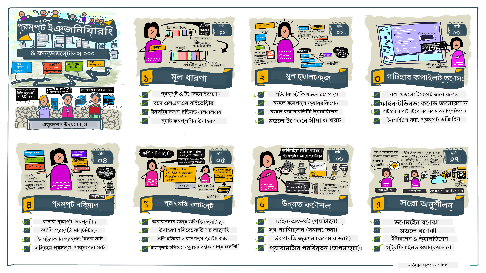
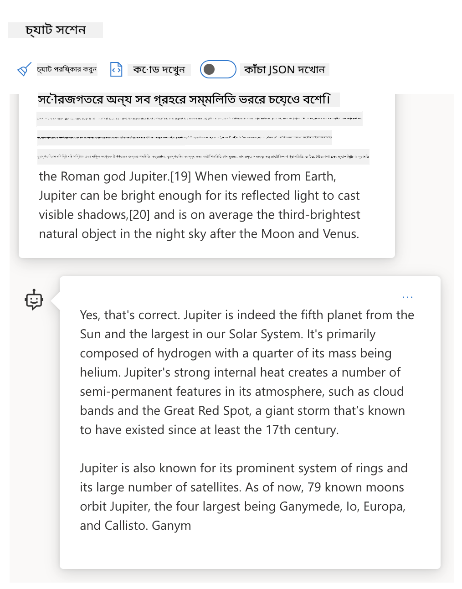

<!--
CO_OP_TRANSLATOR_METADATA:
{
  "original_hash": "a45c318dc6ebc2604f35b8b829f93af2",
  "translation_date": "2025-07-09T09:49:39+00:00",
  "source_file": "04-prompt-engineering-fundamentals/README.md",
  "language_code": "bn"
}
-->
# Prompt Engineering Fundamentals

[](https://aka.ms/gen-ai-lesson4-gh?WT.mc_id=academic-105485-koreyst)

## পরিচিতি  
এই মডিউলটি জেনারেটিভ AI মডেলগুলিতে কার্যকর প্রম্পট তৈরির জন্য প্রয়োজনীয় ধারণা এবং কৌশলগুলি কভার করে। আপনি যেভাবে একটি LLM-এ প্রম্পট লেখেন তা গুরুত্বপূর্ণ। যত্নসহকারে তৈরি করা প্রম্পট আরও ভালো মানের প্রতিক্রিয়া অর্জন করতে পারে। কিন্তু _prompt_ এবং _prompt engineering_ এর মতো শব্দগুলোর অর্থ ঠিক কী? এবং আমি কিভাবে LLM-এ পাঠানো প্রম্পট _input_ উন্নত করতে পারি? এই অধ্যায় এবং পরবর্তী অধ্যায়ে আমরা এই প্রশ্নগুলোর উত্তর খুঁজে দেখব।

_জেনারেটিভ AI_ ব্যবহারকারীর অনুরোধের প্রতিক্রিয়ায় নতুন বিষয়বস্তু (যেমন, টেক্সট, ছবি, অডিও, কোড ইত্যাদি) তৈরি করতে সক্ষম। এটি OpenAI-এর GPT ("Generative Pre-trained Transformer") সিরিজের মতো _Large Language Models_ ব্যবহার করে যা প্রাকৃতিক ভাষা এবং কোড ব্যবহারের জন্য প্রশিক্ষিত।

ব্যবহারকারীরা এখন চ্যাটের মতো পরিচিত পদ্ধতিতে এই মডেলগুলোর সাথে যোগাযোগ করতে পারে, কোনো প্রযুক্তিগত দক্ষতা বা প্রশিক্ষণের প্রয়োজন ছাড়াই। মডেলগুলো _prompt-based_ — ব্যবহারকারীরা একটি টেক্সট ইনপুট (প্রম্পট) পাঠায় এবং AI থেকে প্রতিক্রিয়া (completion) পায়। তারা তারপর "AI-এর সাথে চ্যাট" করতে পারে, একাধিক ধাপে কথোপকথন চালিয়ে প্রম্পট উন্নত করে যতক্ষণ না প্রতিক্রিয়া তাদের প্রত্যাশার সাথে মেলে।

"Prompts" এখন জেনারেটিভ AI অ্যাপ্লিকেশনগুলোর প্রধান _প্রোগ্রামিং ইন্টারফেস_ হয়ে উঠেছে, যা মডেলগুলোকে নির্দেশ দেয় কী করতে হবে এবং ফেরত আসা প্রতিক্রিয়ার গুণমান প্রভাবিত করে। "Prompt Engineering" একটি দ্রুত বর্ধনশীল গবেষণার ক্ষেত্র যা প্রম্পট ডিজাইন এবং অপ্টিমাইজেশনে মনোযোগ দেয় যাতে বড় পরিসরে ধারাবাহিক এবং মানসম্পন্ন প্রতিক্রিয়া পাওয়া যায়।

## শেখার লক্ষ্যসমূহ

এই পাঠে, আমরা শিখব Prompt Engineering কী, কেন এটি গুরুত্বপূর্ণ, এবং কিভাবে নির্দিষ্ট মডেল ও অ্যাপ্লিকেশন উদ্দেশ্যের জন্য আরও কার্যকর প্রম্পট তৈরি করা যায়। আমরা প্রম্পট ইঞ্জিনিয়ারিংয়ের মূল ধারণা এবং সেরা অনুশীলনগুলো বুঝব — এবং একটি ইন্টারেক্টিভ Jupyter Notebooks "sandbox" পরিবেশ সম্পর্কে জানব যেখানে আমরা এই ধারণাগুলো বাস্তব উদাহরণে দেখতে পারব।

এই পাঠের শেষে আমরা সক্ষম হব:

1. ব্যাখ্যা করতে পারব Prompt Engineering কী এবং কেন এটি গুরুত্বপূর্ণ।
2. প্রম্পটের উপাদানগুলো বর্ণনা করতে পারব এবং সেগুলো কীভাবে ব্যবহৃত হয়।
3. প্রম্পট ইঞ্জিনিয়ারিংয়ের সেরা অনুশীলন এবং কৌশল শিখতে পারব।
4. শেখা কৌশলগুলো বাস্তব উদাহরণে প্রয়োগ করতে পারব, OpenAI endpoint ব্যবহার করে।

## মূল শব্দসমূহ

Prompt Engineering: AI মডেলগুলোকে কাঙ্ক্ষিত আউটপুট তৈরি করতে গাইড করার জন্য ইনপুট ডিজাইন এবং পরিমার্জনের প্রক্রিয়া।  
Tokenization: টেক্সটকে ছোট ইউনিটে (টোকেন) রূপান্তর করার প্রক্রিয়া, যা মডেল বুঝতে এবং প্রক্রিয়া করতে পারে।  
Instruction-Tuned LLMs: বিশেষ নির্দেশনা দিয়ে ফাইন-টিউন করা বড় ভাষা মডেল (LLMs), যা তাদের প্রতিক্রিয়ার সঠিকতা এবং প্রাসঙ্গিকতা উন্নত করে।

## শেখার স্যান্ডবক্স

প্রম্পট ইঞ্জিনিয়ারিং এখনো বিজ্ঞান থেকে বেশি একটি শিল্প। এর জন্য আমাদের অন্তর্দৃষ্টি উন্নত করার সেরা উপায় হলো _অধিক অনুশীলন_ এবং একটি ট্রায়াল-এন্ড-এরর পদ্ধতি গ্রহণ করা, যা অ্যাপ্লিকেশন ডোমেইন দক্ষতা, সুপারিশকৃত কৌশল এবং মডেল-নির্দিষ্ট অপ্টিমাইজেশনের সংমিশ্রণ।

এই পাঠের সাথে সংযুক্ত Jupyter Notebook একটি _sandbox_ পরিবেশ প্রদান করে যেখানে আপনি শেখা বিষয়গুলো চেষ্টা করতে পারেন — চলতে চলতে বা পাঠের শেষে কোড চ্যালেঞ্জের অংশ হিসেবে। অনুশীলনগুলো সম্পাদনের জন্য আপনার প্রয়োজন হবে:

1. **একটি Azure OpenAI API কী** — একটি ডিপ্লয় করা LLM-এর সার্ভিস এন্ডপয়েন্ট।  
2. **একটি Python Runtime** — যেখানে Notebook চালানো যাবে।  
3. **লোকাল Env Variables** — _[SETUP](./../00-course-setup/SETUP.md?WT.mc_id=academic-105485-koreyst) ধাপগুলো এখনই সম্পন্ন করুন প্রস্তুতির জন্য_।

নোটবুকটি _শুরু করার_ অনুশীলন নিয়ে আসে — তবে আপনাকে উৎসাহিত করা হয় আপনার নিজের _Markdown_ (বর্ণনা) এবং _Code_ (প্রম্পট অনুরোধ) সেকশন যোগ করতে, আরও উদাহরণ বা ধারণা পরীক্ষা করার জন্য — এবং প্রম্পট ডিজাইনের জন্য আপনার অন্তর্দৃষ্টি গড়ে তুলতে।

## চিত্রিত গাইড

এই পাঠে কী কী বিষয় কভার করা হয়েছে তার একটি বড় চিত্র পেতে চান? এই চিত্রিত গাইডটি দেখুন, যা আপনাকে প্রধান বিষয়গুলো এবং প্রতিটি বিষয়ে চিন্তা করার জন্য মূল বিষয়বস্তু দেয়। পাঠের রোডম্যাপ আপনাকে মূল ধারণা এবং চ্যালেঞ্জগুলো বুঝতে সাহায্য করবে এবং প্রাসঙ্গিক প্রম্পট ইঞ্জিনিয়ারিং কৌশল ও সেরা অনুশীলন দিয়ে সেগুলো মোকাবেলা করতে শেখাবে। লক্ষ্য করুন, এই গাইডের "Advanced Techniques" অংশটি এই পাঠক্রমের _পরবর্তী_ অধ্যায়ে আলোচনা করা হয়েছে।



## আমাদের স্টার্টআপ

এখন, আসুন কথা বলি কিভাবে _এই বিষয়_ আমাদের স্টার্টআপ মিশনের সাথে সম্পর্কিত, যা [শিক্ষায় AI উদ্ভাবন নিয়ে আসার](https://educationblog.microsoft.com/2023/06/collaborating-to-bring-ai-innovation-to-education?WT.mc_id=academic-105485-koreyst) লক্ষ্যে কাজ করছে। আমরা _ব্যক্তিগতকৃত শেখার_ AI-চালিত অ্যাপ্লিকেশন তৈরি করতে চাই — তাই ভাবুন আমাদের অ্যাপ্লিকেশনের বিভিন্ন ব্যবহারকারী কীভাবে প্রম্পট "ডিজাইন" করতে পারে:

- **অ্যাডমিনিস্ট্রেটররা** AI-কে অনুরোধ করতে পারেন _পাঠ্যক্রমের তথ্য বিশ্লেষণ করে কাভারেজের ফাঁক সনাক্ত করতে_। AI ফলাফলগুলো সারাংশ করতে পারে বা কোড দিয়ে ভিজ্যুয়ালাইজ করতে পারে।  
- **শিক্ষকরা** AI-কে অনুরোধ করতে পারেন _লক্ষ্য শ্রোতা এবং বিষয়ের জন্য একটি পাঠ পরিকল্পনা তৈরি করতে_। AI নির্দিষ্ট ফরম্যাটে ব্যক্তিগতকৃত পরিকল্পনা তৈরি করতে পারে।  
- **ছাত্ররা** AI-কে অনুরোধ করতে পারেন _কঠিন বিষয়ে টিউটর করার জন্য_। AI এখন ছাত্রদের তাদের স্তরের জন্য উপযুক্ত পাঠ, টিপস ও উদাহরণ দিয়ে গাইড করতে পারে।

এগুলো কেবল শুরুর কথা। [Prompts For Education](https://github.com/microsoft/prompts-for-edu/tree/main?WT.mc_id=academic-105485-koreyst) দেখুন — একটি ওপেন-সোর্স প্রম্পট লাইব্রেরি যা শিক্ষা বিশেষজ্ঞরা তৈরি করেছেন — যাতে সম্ভাবনার বিস্তৃত ধারণা পাওয়া যায়! _স্যান্ডবক্সে বা OpenAI Playground-এ কিছু প্রম্পট চালিয়ে দেখুন কী হয়!_

<!--  
LESSON TEMPLATE:  
This unit should cover core concept #1.  
Reinforce the concept with examples and references.  

CONCEPT #1:  
Prompt Engineering.  
Define it and explain why it is needed.  
-->

## Prompt Engineering কী?

আমরা এই পাঠ শুরু করেছি **Prompt Engineering** কে সংজ্ঞায়িত করে, যা হলো একটি প্রক্রিয়া যেখানে টেক্সট ইনপুট (প্রম্পট) ডিজাইন এবং অপ্টিমাইজ করা হয় যাতে নির্দিষ্ট অ্যাপ্লিকেশন উদ্দেশ্য এবং মডেলের জন্য ধারাবাহিক ও মানসম্পন্ন প্রতিক্রিয়া (completion) পাওয়া যায়। আমরা এটিকে দুই ধাপের প্রক্রিয়া হিসেবে ভাবতে পারি:

- নির্দিষ্ট মডেল এবং উদ্দেশ্যের জন্য প্রাথমিক প্রম্পট _ডিজাইন_ করা  
- প্রতিক্রিয়ার গুণমান উন্নত করতে প্রম্পট _পরিমার্জন_ করা

এটি অবশ্যই একটি ট্রায়াল-এন্ড-এরর প্রক্রিয়া, যা ব্যবহারকারীর অন্তর্দৃষ্টি এবং প্রচেষ্টা প্রয়োজন সেরা ফলাফল পেতে। তাহলে কেন এটি গুরুত্বপূর্ণ? এই প্রশ্নের উত্তর দিতে আমাদের প্রথমে তিনটি ধারণা বুঝতে হবে:

- _Tokenization_ = মডেল কীভাবে প্রম্পট "দেখে"  
- _Base LLMs_ = ফাউন্ডেশন মডেল কীভাবে প্রম্পট "প্রক্রিয়া করে"  
- _Instruction-Tuned LLMs_ = মডেল এখন কীভাবে "কাজ" দেখতে পারে

### Tokenization

একটি LLM প্রম্পটগুলোকে _টোকেনের সিকোয়েন্স_ হিসেবে দেখে, যেখানে বিভিন্ন মডেল (বা একই মডেলের বিভিন্ন সংস্করণ) একই প্রম্পটকে ভিন্নভাবে টোকেনাইজ করতে পারে। যেহেতু LLM গুলো টোকেনের উপর প্রশিক্ষিত (কাঁচা টেক্সট নয়), প্রম্পট কিভাবে টোকেনাইজ হয় তা সরাসরি তৈরি হওয়া প্রতিক্রিয়ার গুণমান প্রভাবিত করে।

টোকেনাইজেশন কিভাবে কাজ করে তা বোঝার জন্য, নিচের মতো টুল ব্যবহার করুন [OpenAI Tokenizer](https://platform.openai.com/tokenizer?WT.mc_id=academic-105485-koreyst)। আপনার প্রম্পট কপি করে পেস্ট করুন — এবং দেখুন কীভাবে এটি টোকেনে রূপান্তরিত হয়, বিশেষ করে স্পেস এবং পাংচুয়েশন কিভাবে হ্যান্ডেল হয় তা লক্ষ্য করুন। মনে রাখবেন, এই উদাহরণটি একটি পুরনো LLM (GPT-3) দেখাচ্ছে — তাই নতুন মডেল দিয়ে চেষ্টা করলে ফলাফল ভিন্ন হতে পারে।


### ধারণা: ফাউন্ডেশন মডেল

একবার প্রম্পট টোকেনাইজ হয়ে গেলে, ["Base LLM"](https://blog.gopenai.com/an-introduction-to-base-and-instruction-tuned-large-language-models-8de102c785a6?WT.mc_id=academic-105485-koreyst) (অথবা ফাউন্ডেশন মডেল) এর প্রধান কাজ হলো ওই সিকোয়েন্সের পরবর্তী টোকেন পূর্বাভাস দেওয়া। যেহেতু LLM গুলো বিশাল টেক্সট ডেটাসেটে প্রশিক্ষিত, তারা টোকেনগুলোর মধ্যে পরিসংখ্যানগত সম্পর্ক ভালোভাবে বুঝতে পারে এবং আত্মবিশ্বাসের সাথে পূর্বাভাস দিতে পারে। তারা প্রম্পট বা টোকেনের _অর্থ_ বুঝতে পারে না; তারা শুধু একটি প্যাটার্ন দেখে যা তারা তাদের পরবর্তী পূর্বাভাস দিয়ে "সম্পূর্ণ" করতে পারে। তারা ব্যবহারকারীর হস্তক্ষেপ বা পূর্বনির্ধারিত শর্তে থামানো পর্যন্ত সিকোয়েন্স পূর্বাভাস দিতে পারে।

প্রম্পট-ভিত্তিক কমপ্লিশন কিভাবে কাজ করে দেখতে চান? উপরের প্রম্পটটি Azure OpenAI Studio [_Chat Playground_](https://oai.azure.com/playground?WT.mc_id=academic-105485-koreyst) এ ডিফল্ট সেটিংস নিয়ে প্রবেশ করান। সিস্টেম প্রম্পটকে তথ্যের অনুরোধ হিসেবে বিবেচনা করে — তাই আপনি এমন একটি কমপ্লিশন দেখতে পাবেন যা এই প্রসঙ্গ পূরণ করে।

কিন্তু যদি ব্যবহারকারী কিছু নির্দিষ্ট দেখতে চায় যা কোনো শর্ত বা কাজের উদ্দেশ্য পূরণ করে? তখন _instruction-tuned_ LLM গুলো কাজে আসে।



### ধারণা: Instruction Tuned LLMs

একটি [Instruction Tuned LLM](https://blog.gopenai.com/an-introduction-to-base-and-instruction-tuned-large-language-models-8de102c785a6?WT.mc_id=academic-105485-koreyst) ফাউন্ডেশন মডেল থেকে শুরু করে সেটিকে উদাহরণ বা ইনপুট/আউটপুট জোড়া (যেমন, বহু-ধাপের "মেসেজ") দিয়ে ফাইন-টিউন করে, যা স্পষ্ট নির্দেশনা থাকতে পারে — এবং AI এর প্রতিক্রিয়া সেই নির্দেশনা অনুসরণ করার চেষ্টা করে।

এটি Reinforcement Learning with Human Feedback (RLHF) এর মতো কৌশল ব্যবহার করে, যা মডেলকে _নির্দেশনা অনুসরণ_ এবং _প্রতিক্রিয়া থেকে শেখার_ জন্য প্রশিক্ষিত করে, যাতে এটি ব্যবহারিক অ্যাপ্লিকেশনের জন্য আরও উপযুক্ত এবং ব্যবহারকারীর উদ্দেশ্যের সাথে প্রাসঙ্গিক প্রতিক্রিয়া তৈরি করে।

চলুন চেষ্টা করি — উপরের প্রম্পটটি আবার দেখুন, কিন্তু এখন _system message_ পরিবর্তন করে নিম্নলিখিত নির্দেশনা দিন:

> _আপনাকে দেওয়া বিষয়বস্তু দ্বিতীয় শ্রেণির ছাত্রের জন্য সারাংশ করুন। ফলাফলটি ৩-৫টি বুলেট পয়েন্টসহ একটি প্যারাগ্রাফে রাখুন।_

দেখুন কীভাবে ফলাফল এখন কাঙ্ক্ষিত লক্ষ্য এবং ফরম্যাট প্রতিফলিত করছে? একজন শিক্ষক এখন সরাসরি এই প্রতিক্রিয়া তাদের ক্লাসের স্লাইডে ব্যবহার করতে পারেন।


## কেন Prompt Engineering প্রয়োজন?

এখন যেহেতু আমরা জানি কিভাবে LLM গুলো প্রম্পট প্রক্রিয়া করে, আসুন বলি কেন প্রম্পট ইঞ্জিনিয়ারিং দরকার। এর কারণ হলো বর্তমান LLM গুলো কিছু চ্যালেঞ্জ নিয়ে আসে যা _নির্ভরযোগ্য এবং ধারাবাহিক কমপ্লিশন_ পাওয়া কঠিন করে তোলে যদি প্রম্পট নির্মাণ এবং অপ্টিমাইজেশনে যথেষ্ট প্রচেষ্টা না দেওয়া হয়। উদাহরণস্বরূপ:

1. **মডেলের প্রতিক্রিয়া স্টোকাস্টিক।** একই প্রম্পট বিভিন্ন মডেল বা মডেলের সংস্করণে ভিন্ন প্রতিক্রিয়া দিতে পারে। এমনকি একই মডেলেও বিভিন্ন সময়ে ভিন্ন ফলাফল আসতে পারে। _প্রম্পট ইঞ্জিনিয়ারিং কৌশলগুলো এই পার্থক্যগুলো কমাতে সাহায্য করে ভালো গার্ডরেল প্রদান করে_।

2. **মডেলগুলো প্রতিক্রিয়া গঠন করতে পারে।** মডেলগুলো _বড় কিন্তু সীমিত_ ডেটাসেটে প্রশিক্ষিত, যার মানে তারা প্রশিক্ষণ পরিধির বাইরে থাকা ধারণাগুলো সম্পর্কে জানে না। ফলে তারা এমন কমপ্লিশন তৈরি করতে পারে যা ভুল, কাল্পনিক বা পরিচিত তথ্যের সাথে সরাসরি বিরোধপূর্ণ। _প্রম্পট ইঞ্জিনিয়ারিং ব্যবহারকারীদের এমন গঠনগুলো চিহ্নিত এবং কমাতে সাহায্য করে, যেমন AI-কে উত্স বা যুক্তি চাওয়া_।

3. **মডেলের ক্ষমতা ভিন্ন হবে।** নতুন মডেল বা মডেল প্রজন্মগুলো আরও সমৃদ্ধ ক্ষমতা নিয়ে আসে, কিন্তু সাথে আনতে পারে আলাদা বৈশিষ্ট্য এবং খরচ ও জটিলতার ট্রেডঅফ। _প্রম্পট ইঞ্জিনিয়ারিং আমাদের সেরা অনুশীলন এবং ওয়ার্কফ্লো তৈরি করতে সাহায্য করে যা পার্থক্যগুলো abstract করে এবং মডেল-নির্দিষ্ট প্রয়োজনীয়তার সাথে মানিয়ে চলে, বড় পরিসরে সহজে_।

চলুন OpenAI বা Azure OpenAI Playground-এ এটি পরীক্ষা করি:

- একই প্রম্পট বিভিন্ন LLM ডিপ্লয়মেন্টে (যেমন, OpenAI, Azure OpenAI, Hugging Face) ব্যবহার করুন — পার্থক্য দেখেছেন?  
- একই প্রম্পট বারবার একই LLM ডিপ্লয়মেন্টে (যেমন, Azure OpenAI playground) ব্যবহার করুন — পার্থক্যগুলো কেমন ছিল?

### গঠন উদাহরণ

এই কোর্সে, আমরা **"fabrication"** শব্দটি ব্যবহার করি যখন LLM গুলো কখনো কখনো তাদের প্রশিক্ষণের সীমাবদ্ধতা বা অন্যান্য কারণে তথ্যগতভাবে ভুল তথ্য তৈরি করে। আপনি হয়তো এটি _"hallucinations"_ নামে শুনে থাকবেন জনপ্রিয় আর্টিকেল বা গবেষণাপত্রে। তবে আমরা দৃঢ়ভাবে পরামর্শ দিই _"fabrication"_ শব্দটি ব্যবহার করতে, যাতে আমরা ভুলবশত যন্ত্রচালিত ফলাফলের জন্য মানবসদৃশ বৈশিষ্ট্য আরোপ না করি। এটি [Responsible AI নির্দেশিকা](https://www.microsoft.com/ai/responsible-ai?WT.mc_id=academic-105485-koreyst) এর সাথে সামঞ্জস্যপূর্ণ, যা এমন শব্দগুলো বাদ দেয় যা কিছু প্রসঙ্গে আপত্তিকর বা অপ্রাসঙ্গিক হতে পারে।

গঠন কিভাবে কাজ করে তা বোঝার জন্য একটি প্রম্পট ভাবুন যা AI-কে এমন একটি অস্থিতিশীল বিষয়ের জন্য বিষয়বস্তু তৈরি করতে বলে (যা প্রশিক্ষণ ডেটাসেটে নেই)। উদাহরণস্বরূপ — আমি এই প্রম্পটটি চেষ্টা করেছিলাম:
# 2076 সালের মার্টিয়ান যুদ্ধের পাঠ পরিকল্পনা

## পাঠের উদ্দেশ্য
শিক্ষার্থীরা 2076 সালের মার্টিয়ান যুদ্ধের কারণ, প্রধান ঘটনা এবং এর প্রভাব সম্পর্কে জানতে পারবে।

## পাঠের সময়কাল
৫০ মিনিট

## পাঠের উপকরণ
- পাঠ্যপুস্তক
- প্রেজেন্টেশন স্লাইড
- ভিডিও ক্লিপ (যুদ্ধের সংক্ষিপ্তসার)
- নোটবুক এবং কলম

## পাঠের ধাপসমূহ

### ১. ভূমিকা (১০ মিনিট)
- মার্টিয়ান যুদ্ধের পটভূমি সংক্ষেপে আলোচনা করুন।
- শিক্ষার্থীদের মধ্যে যুদ্ধ সম্পর্কে আগ্রহ সৃষ্টি করতে কিছু প্রশ্ন করুন, যেমন: "আপনারা কি মনে করেন কেন মার্সে মানুষ বসতি স্থাপন করতে চেয়েছিল?"

### ২. প্রধান ঘটনা (২০ মিনিট)
- যুদ্ধের শুরু, প্রধান সংঘর্ষ এবং গুরুত্বপূর্ণ মাইলফলকগুলি ব্যাখ্যা করুন।
- ভিডিও ক্লিপ দেখান যা যুদ্ধের মূল মুহূর্তগুলো তুলে ধরে।
- শিক্ষার্থীদের ছোট ছোট গ্রুপে ভাগ করে প্রতিটি গ্রুপকে একটি নির্দিষ্ট ঘটনা নিয়ে আলোচনা করতে বলুন।

### ৩. প্রভাব ও ফলাফল (১০ মিনিট)
- যুদ্ধের পর মার্টিয়ান সমাজ এবং পৃথিবীর উপর এর প্রভাব আলোচনা করুন।
- শিক্ষার্থীদের প্রশ্ন করতে উৎসাহিত করুন এবং তাদের মতামত শোনুন।

### ৪. সারাংশ ও মূল্যায়ন (১০ মিনিট)
- পাঠের মূল বিষয়গুলো পুনরায় সংক্ষেপে তুলে ধরুন।
- একটি ছোট কুইজ বা প্রশ্নোত্তর সেশন পরিচালনা করুন যাতে শিক্ষার্থীরা তাদের শেখা বিষয়গুলো যাচাই করতে পারে।

## বাড়ির কাজ
- শিক্ষার্থীদের একটি প্রবন্ধ লিখতে বলুন যেখানে তারা মার্টিয়ান যুদ্ধের একটি গুরুত্বপূর্ণ দিক বিশ্লেষণ করবে।

## অতিরিক্ত টিপস
- পাঠ চলাকালীন শিক্ষার্থীদের সক্রিয় অংশগ্রহণ নিশ্চিত করুন।
- বিভিন্ন মিডিয়া ব্যবহার করে পাঠকে আরও আকর্ষণীয় করুন।
একটি ওয়েব সার্চ আমাকে দেখিয়েছে যে মার্টিয়ান যুদ্ধ নিয়ে কাল্পনিক গল্প (যেমন, টেলিভিশন সিরিজ বা বই) রয়েছে — কিন্তু ২০৭৬ সালে নয়। সাধারণ বুদ্ধিও বলে যে ২০৭৬ _ভবিষ্যতে_ এবং তাই এটি কোনো বাস্তব ঘটনার সঙ্গে যুক্ত হতে পারে না।

তাহলে কি হয় যখন আমরা এই প্রম্পটটি বিভিন্ন LLM প্রদানকারীর কাছে চালাই?

> **Response 1**: OpenAI Playground (GPT-35)


> **Response 2**: Azure OpenAI Playground (GPT-35)


> **Response 3**: : Hugging Face Chat Playground (LLama-2)


প্রত্যাশা অনুযায়ী, প্রতিটি মডেল (বা মডেল সংস্করণ) সামান্য ভিন্ন উত্তর দেয় কারণ স্টোকাস্টিক আচরণ এবং মডেলের সক্ষমতার পার্থক্যের কারণে। উদাহরণস্বরূপ, একটি মডেল ৮ম শ্রেণির শিক্ষার্থীদের লক্ষ্য করে, অন্যটি উচ্চ বিদ্যালয়ের ছাত্র ধরে নেয়। কিন্তু তিনটি মডেলই এমন উত্তর তৈরি করেছে যা অজ্ঞাত ব্যবহারকারীকে বিশ্বাস করাতে পারে যে ঘটনাটি বাস্তব।

প্রম্পট ইঞ্জিনিয়ারিং কৌশল যেমন _মেটাপ্রম্পটিং_ এবং _তাপমাত্রা কনফিগারেশন_ কিছুটা মডেল গঠন কমাতে পারে। নতুন প্রম্পট ইঞ্জিনিয়ারিং _আর্কিটেকচার_ গুলোও নতুন টুল এবং কৌশলগুলোকে প্রম্পট ফ্লোতে নির্বিঘ্নে অন্তর্ভুক্ত করে, যাতে এই প্রভাবগুলো কমানো যায়।

## কেস স্টাডি: GitHub Copilot

এই অংশটি শেষ করা যাক দেখে নেওয়া যাক কিভাবে প্রম্পট ইঞ্জিনিয়ারিং বাস্তব জীবনের সমাধানে ব্যবহৃত হয় একটি কেস স্টাডির মাধ্যমে: [GitHub Copilot](https://github.com/features/copilot?WT.mc_id=academic-105485-koreyst)।

GitHub Copilot আপনার "AI পেয়ার প্রোগ্রামার" — এটি টেক্সট প্রম্পটকে কোড সম্পূর্ণতায় রূপান্তর করে এবং আপনার ডেভেলপমেন্ট পরিবেশে (যেমন, Visual Studio Code) একীভূত থাকে যাতে ব্যবহারকারীর অভিজ্ঞতা মসৃণ হয়। নিচের ব্লগ সিরিজে বর্ণিত হয়েছে, প্রাথমিক সংস্করণটি OpenAI Codex মডেলের উপর ভিত্তি করে তৈরি হয়েছিল — যেখানে ইঞ্জিনিয়াররা দ্রুত বুঝতে পেরেছিলেন মডেলকে ফাইন-টিউন করা এবং উন্নত প্রম্পট ইঞ্জিনিয়ারিং কৌশল তৈরি করা দরকার, যাতে কোডের গুণগত মান উন্নত হয়। জুলাই মাসে তারা [Codex ছাড়িয়ে যাওয়া উন্নত AI মডেল উন্মোচন করে](https://github.blog/2023-07-28-smarter-more-efficient-coding-github-copilot-goes-beyond-codex-with-improved-ai-model/?WT.mc_id=academic-105485-koreyst) যা আরও দ্রুত পরামর্শ দেয়।

তাদের শেখার যাত্রা অনুসরণ করতে নিচের পোস্টগুলো ক্রমানুসারে পড়ুন।

- **মে ২০২৩** | [GitHub Copilot আপনার কোড বুঝতে আরও ভালো হচ্ছে](https://github.blog/2023-05-17-how-github-copilot-is-getting-better-at-understanding-your-code/?WT.mc_id=academic-105485-koreyst)
- **মে ২০২৩** | [GitHub এর ভিতরে: GitHub Copilot এর পেছনের LLM গুলোর সাথে কাজ](https://github.blog/2023-05-17-inside-github-working-with-the-llms-behind-github-copilot/?WT.mc_id=academic-105485-koreyst)
- **জুন ২০২৩** | [GitHub Copilot এর জন্য কিভাবে ভালো প্রম্পট লিখবেন](https://github.blog/2023-06-20-how-to-write-better-prompts-for-github-copilot/?WT.mc_id=academic-105485-koreyst)
- **জুলাই ২০২৩** | [GitHub Copilot Codex ছাড়িয়ে উন্নত AI মডেল নিয়ে](https://github.blog/2023-07-28-smarter-more-efficient-coding-github-copilot-goes-beyond-codex-with-improved-ai-model/?WT.mc_id=academic-105485-koreyst)
- **জুলাই ২০২৩** | [একজন ডেভেলপারের জন্য প্রম্পট ইঞ্জিনিয়ারিং এবং LLM গাইড](https://github.blog/2023-07-17-prompt-engineering-guide-generative-ai-llms/?WT.mc_id=academic-105485-koreyst)
- **সেপ্টেম্বর ২০২৩** | [কিভাবে একটি এন্টারপ্রাইজ LLM অ্যাপ তৈরি করবেন: GitHub Copilot থেকে শিক্ষা](https://github.blog/2023-09-06-how-to-build-an-enterprise-llm-application-lessons-from-github-copilot/?WT.mc_id=academic-105485-koreyst)

আপনি আরও পোস্টের জন্য তাদের [ইঞ্জিনিয়ারিং ব্লগ](https://github.blog/category/engineering/?WT.mc_id=academic-105485-koreyst) ব্রাউজ করতে পারেন, যেমন [এই পোস্টটি](https://github.blog/2023-09-27-how-i-used-github-copilot-chat-to-build-a-reactjs-gallery-prototype/?WT.mc_id=academic-105485-koreyst) যা দেখায় কিভাবে এই মডেল এবং কৌশলগুলো বাস্তব জীবনের অ্যাপ্লিকেশন চালাতে _প্রয়োগ_ করা হয়।

---

<!--
LESSON TEMPLATE:
This unit should cover core concept #2.
Reinforce the concept with examples and references.

CONCEPT #2:
Prompt Design.
Illustrated with examples.
-->

## প্রম্পট নির্মাণ

আমরা দেখেছি কেন প্রম্পট ইঞ্জিনিয়ারিং গুরুত্বপূর্ণ — এখন বুঝি কিভাবে প্রম্পটগুলো _নির্মিত_ হয় যাতে আমরা বিভিন্ন কৌশল মূল্যায়ন করতে পারি আরও কার্যকর প্রম্পট ডিজাইনের জন্য।

### বেসিক প্রম্পট

চলুন বেসিক প্রম্পট দিয়ে শুরু করি: মডেলের কাছে পাঠানো একটি টেক্সট ইনপুট, কোনো অতিরিক্ত প্রসঙ্গ ছাড়া। উদাহরণস্বরূপ, যখন আমরা US জাতীয় সঙ্গীতের প্রথম কয়েকটি শব্দ OpenAI [Completion API](https://platform.openai.com/docs/api-reference/completions?WT.mc_id=academic-105485-koreyst) এ পাঠাই, এটি সঙ্গে সঙ্গেই পরবর্তী কয়েকটি লাইন _সম্পূর্ণ_ করে, যা বেসিক পূর্বাভাস আচরণ দেখায়।

| প্রম্পট (ইনপুট)     | সম্পূর্ণকরণ (আউটপুট)                                                                                                                        |
| :----------------- | :----------------------------------------------------------------------------------------------------------------------------------------- |
| Oh say can you see | মনে হচ্ছে আপনি "The Star-Spangled Banner," যুক্তরাষ্ট্রের জাতীয় সঙ্গীতের গানের লিরিক্স শুরু করছেন। সম্পূর্ণ গানের লিরিক্স হলো ... |

### জটিল প্রম্পট

এখন সেই বেসিক প্রম্পটে প্রসঙ্গ এবং নির্দেশনা যোগ করি। [Chat Completion API](https://learn.microsoft.com/azure/ai-services/openai/how-to/chatgpt?WT.mc_id=academic-105485-koreyst) আমাদের একটি জটিল প্রম্পট তৈরি করতে দেয় যা _মেসেজ_ এর সংগ্রহ:

- ইনপুট/আউটপুট জোড়া যা _ব্যবহারকারী_ ইনপুট এবং _সহকারী_ প্রতিক্রিয়া প্রতিফলিত করে।
- সিস্টেম মেসেজ যা সহকারীর আচরণ বা ব্যক্তিত্বের প্রসঙ্গ নির্ধারণ করে।

অনুরোধটি এখন নিচের রূপে থাকে, যেখানে _টোকেনাইজেশন_ কার্যকরভাবে প্রসঙ্গ এবং কথোপকথন থেকে প্রাসঙ্গিক তথ্য ধারণ করে। সিস্টেম প্রসঙ্গ পরিবর্তন করাও সম্পূর্ণকরণের গুণগত মানে ব্যবহারকারীর ইনপুটের মতোই প্রভাব ফেলে।

```python
response = openai.chat.completions.create(
    model="gpt-3.5-turbo",
    messages=[
        {"role": "system", "content": "You are a helpful assistant."},
        {"role": "user", "content": "Who won the world series in 2020?"},
        {"role": "assistant", "content": "The Los Angeles Dodgers won the World Series in 2020."},
        {"role": "user", "content": "Where was it played?"}
    ]
)
```

### নির্দেশনা প্রম্পট

উপরের উদাহরণগুলোতে, ব্যবহারকারীর প্রম্পট ছিল একটি সাধারণ টেক্সট প্রশ্ন যা তথ্যের অনুরোধ হিসেবে ব্যাখ্যা করা যায়। _নির্দেশনা_ প্রম্পটে, আমরা সেই টেক্সট ব্যবহার করে কাজটি আরও বিস্তারিতভাবে নির্দিষ্ট করতে পারি, AI কে ভালো নির্দেশনা দিতে। উদাহরণ:

| প্রম্পট (ইনপুট)                                                                                                                                                                                                                         | সম্পূর্ণকরণ (আউটপুট)                                                                                                        | নির্দেশনার ধরন    |
| :------------------------------------------------------------------------------------------------------------------------------------------------------------------------------------------------------------------------------------- | :------------------------------------------------------------------------------------------------------------------------- | :------------------ |
| Write a description of the Civil War                                                                                                                                                                                                   | _একটি সাধারণ প্যারাগ্রাফ ফেরত দেয়_                                                                                              | সাধারণ              |
| Write a description of the Civil War. Provide key dates and events and describe their significance                                                                                                                                     | _একটি প্যারাগ্রাফ এবং তারপরে গুরুত্বপূর্ণ ঘটনাগুলোর তারিখ ও বর্ণনা সহ তালিকা ফেরত দেয়_                                             | জটিল             |
| Write a description of the Civil War in 1 paragraph. Provide 3 bullet points with key dates and their significance. Provide 3 more bullet points with key historical figures and their contributions. Return the output as a JSON file | _আরও বিস্তৃত বিবরণ একটি টেক্সট বক্সে JSON ফরম্যাটে ফেরত দেয় যা আপনি কপি-পেস্ট করে ফাইল হিসেবে সংরক্ষণ ও যাচাই করতে পারেন_ | জটিল। ফরম্যাটেড। |

## প্রাথমিক বিষয়বস্তু

উপরের উদাহরণগুলোতে, প্রম্পট এখনও বেশ খোলা ছিল, LLM কে সিদ্ধান্ত নিতে দেয় কোন অংশ তার প্রাক-প্রশিক্ষিত ডেটাসেট থেকে প্রাসঙ্গিক। _প্রাথমিক বিষয়বস্তু_ ডিজাইন প্যাটার্নে, ইনপুট টেক্সট দুই ভাগে বিভক্ত:

- একটি নির্দেশনা (কর্ম)
- প্রাসঙ্গিক বিষয়বস্তু (যা কর্মকে প্রভাবিত করে)

উদাহরণস্বরূপ, যেখানে নির্দেশনা হলো "এটি ২টি বাক্যে সারসংক্ষেপ করো"।

| প্রম্পট (ইনপুট)                                                                                                                                                                                                                                                                                                                                                                                                                                                                                                                                                                                                                                                                                      | সম্পূর্ণকরণ (আউটপুট)                                                                                                                                                                                                                                                                             |
| :-------------------------------------------------------------------------------------------------------------------------------------------------------------------------------------------------------------------------------------------------------------------------------------------------------------------------------------------------------------------------------------------------------------------------------------------------------------------------------------------------------------------------------------------------------------------------------------------------------------------------------------------------------------------------------------------------- | :---------------------------------------------------------------------------------------------------------------------------------------------------------------------------------------------------------------------------------------------------------------------------------------------- |
| Jupiter is the fifth planet from the Sun and the largest in the Solar System. It is a gas giant with a mass one-thousandth that of the Sun, but two-and-a-half times that of all the other planets in the Solar System combined. Jupiter is one of the brightest objects visible to the naked eye in the night sky, and has been known to ancient civilizations since before recorded history. It is named after the Roman god Jupiter.[19] When viewed from Earth, Jupiter can be bright enough for its reflected light to cast visible shadows,[20] and is on average the third-brightest natural object in the night sky after the Moon and Venus. <br/> **Summarize this in 2 short sentences** | জুপিটার, সূর্যের পঞ্চম গ্রহ, সৌরজগতের সবচেয়ে বড় গ্রহ এবং রাতের আকাশে সবচেয়ে উজ্জ্বল বস্তুগুলোর মধ্যে একটি। এটি রোমান দেবতা জুপিটারের নামে নামকরণ করা হয়েছে, এবং এটি একটি গ্যাস জায়ান্ট যার ভর সৌরজগতের অন্যান্য সব গ্রহের মোট ভরের দেড়গুণ। |

প্রাথমিক বিষয়বস্তু অংশ বিভিন্নভাবে ব্যবহার করা যেতে পারে আরও কার্যকর নির্দেশনা চালানোর জন্য:

- **উদাহরণ** - মডেলকে সরাসরি নির্দেশনা দেওয়ার পরিবর্তে, কাজের উদাহরণ দিন এবং মডেল নিজেই প্যাটার্ন অনুমান করুক।
- **কিউ** - নির্দেশনার পরে একটি "কিউ" দিন যা সম্পূর্ণকরণকে প্রাথমিক করে, মডেলকে আরও প্রাসঙ্গিক উত্তর দিতে সাহায্য করে।
- **টেমপ্লেট** - এগুলো পুনরাবৃত্তিযোগ্য 'রেসিপি' প্রম্পটের জন্য, যেখানে প্লেসহোল্ডার (ভেরিয়েবল) থাকে যা নির্দিষ্ট ডেটা দিয়ে কাস্টমাইজ করা যায়।

চলুন এগুলো কার্যকরভাবে দেখি।

### উদাহরণ ব্যবহার

এটি এমন একটি পদ্ধতি যেখানে আপনি প্রাথমিক বিষয়বস্তু ব্যবহার করে মডেলকে কিছু কাঙ্ক্ষিত আউটপুটের উদাহরণ দেন এবং মডেল নিজেই কাঙ্ক্ষিত আউটপুটের প্যাটার্ন অনুমান করে। উদাহরণ সংখ্যার ওপর ভিত্তি করে, আমরা জিরো-শট, ওয়ান-শট, ফিউ-শট প্রম্পটিং করতে পারি।

প্রম্পট এখন তিনটি উপাদান নিয়ে গঠিত:

- একটি কাজের বর্ণনা
- কাঙ্ক্ষিত আউটপুটের কয়েকটি উদাহরণ
- একটি নতুন উদাহরণের শুরু (যা একটি অন্তর্নিহিত কাজের বর্ণনা হয়ে ওঠে)

| শেখার ধরন | প্রম্পট (ইনপুট)                                                                                                                                        | সম্পূর্ণকরণ (আউটপুট)         |
| :------------ | :---------------------------------------------------------------------------------------------------------------------------------------------------- | :-------------------------- |
| জিরো-শট     | "The Sun is Shining". Translate to Spanish                                                                                                            | "El Sol está brillando".    |
| ওয়ান-শট      | "The Sun is Shining" => ""El Sol está brillando". <br> "It's a Cold and Windy Day" =>                                                                 | "Es un día frío y ventoso". |
| ফিউ-শট      | The player ran the bases => Baseball <br/> The player hit an ace => Tennis <br/> The player hit a six => Cricket <br/> The player made a slam-dunk => | Basketball                  |
|               |                                                                                                                                                       |                             |

দেখুন কিভাবে জিরো-শট প্রম্পটিং-এ স্পষ্ট নির্দেশনা ("Translate to Spanish") দিতে হয়, কিন্তু ওয়ান-শট প্রম্পটিং-এ তা অনুমান করা হয়। ফিউ-শট উদাহরণ দেখায় কিভাবে আরও উদাহরণ যোগ করলে মডেল আরও সঠিক অনুমান করতে পারে কোনো অতিরিক্ত নির্দেশনা ছাড়াই।

### প্রম্পট কিউ

প্রাথমিক বিষয়বস্তু ব্যবহার করার আরেকটি কৌশল হলো _কিউ_ প্রদান করা উদাহরণ দেওয়ার পরিবর্তে। এই ক্ষেত্রে, আমরা মডেলকে সঠিক দিকনির্দেশনা দিতে একটি অংশ দিয়ে শুরু করি যা কাঙ্ক্ষিত আউটপুট ফরম্যাট প্রতিফলিত করে। মডেল তখন সেই কিউ ধরে ধরে উত্তর চালিয়ে যায়।

| কিউয়ের সংখ্যা | প্রম্পট (ইনপুট)                                                                                                                                                                                                                                                                                                                                                                                                                                               | সম্পূর্ণকরণ (আউটপুট)                                                                                                                                                                                                                                                                                       |
| :------------- | :----------------------------------------------------------------------------------------------------------------------------------------------------------------------------------------------------------------------------------------------------------------------------------------------------------------------------------------------------------------------------------------------------------------------------------------------------------- | :-------------------------------------------------------------------------------------------------------------------------------------------------------------------------------------------------------------------------------------------------------------------------------------------------------- |
| ০              | Jupiter is the fifth planet from the Sun and the largest in the Solar System. It is a gas giant with a mass one-thousandth that of the Sun, but two-and-a-half times that of all the other planets in the Solar System combined. Jupiter is one of the brightest objects visible to the naked eye in the night sky, and has been known to ancient civilizations since before recorded history.

**Summarize This**                                       | বৃহস্পতিই আমাদের সৌরজগতের সবচেয়ে বড় গ্রহ এবং সূর্য থেকে পঞ্চম গ্রহ। এটি একটি গ্যাস দৈত্য যার ভর সূর্যের ১/১০০০ অংশ, তবে এটি অন্যান্য সব গ্রহের মিলিত ভরের চেয়ে ভারী। প্রাচীন সভ্যতাগুলো দীর্ঘদিন ধরে বৃহস্পতিকে চেনে, এবং এটি রাতের আকাশে সহজেই দৃশ্যমান। |
| 1              | বৃহস্পতিই সূর্য থেকে পঞ্চম গ্রহ এবং সৌরজগতের সবচেয়ে বড় গ্রহ। এটি একটি গ্যাস দৈত্য যার ভর সূর্যের এক হাজার ভাগের এক ভাগ, তবে সৌরজগতের অন্যান্য সব গ্রহের মিলিত ভরের দেড় গুণ। বৃহস্পতিই রাতের আকাশে নগ্ন চোখে দেখা সবচেয়ে উজ্জ্বল বস্তুগুলোর মধ্যে একটি, এবং এটি প্রাচীন সভ্যতাগুলোতে ইতিহাসের রেকর্ডের আগেও পরিচিত ছিল। <br/>**Summarize This** <br/> আমরা যা শিখলাম তা হলো বৃহস্পতিই | সূর্য থেকে পঞ্চম গ্রহ এবং সৌরজগতের সবচেয়ে বড় গ্রহ। এটি একটি গ্যাস দৈত্য যার ভর সূর্যের এক হাজার ভাগের এক ভাগ, তবে অন্যান্য সব গ্রহের মিলিত ভরের দেড় গুণ। এটি সহজেই নগ্ন চোখে দেখা যায় এবং প্রাচীনকাল থেকে পরিচিত।                        |
| 2              | বৃহস্পতিই সূর্য থেকে পঞ্চম গ্রহ এবং সৌরজগতের সবচেয়ে বড় গ্রহ। এটি একটি গ্যাস দৈত্য যার ভর সূর্যের এক হাজার ভাগের এক ভাগ, তবে সৌরজগতের অন্যান্য সব গ্রহের মিলিত ভরের দেড় গুণ। বৃহস্পতিই রাতের আকাশে নগ্ন চোখে দেখা সবচেয়ে উজ্জ্বল বস্তুগুলোর মধ্যে একটি, এবং এটি প্রাচীন সভ্যতাগুলোতে ইতিহাসের রেকর্ডের আগেও পরিচিত ছিল। <br/>**Summarize This** <br/> আমরা শিখলাম শীর্ষ ৩টি তথ্য:         | ১. বৃহস্পতিই সূর্য থেকে পঞ্চম গ্রহ এবং সৌরজগতের সবচেয়ে বড় গ্রহ। <br/> ২. এটি একটি গ্যাস দৈত্য যার ভর সূর্যের এক হাজার ভাগের এক ভাগ...<br/> ৩. বৃহস্পতিই প্রাচীনকাল থেকে নগ্ন চোখে দেখা যায় ...                                                                       |
|                |                                                                                                                                                                                                                                                                                                                                                                                                                                                              |                                                                                                                                                                                                                                                                                                           |

### Prompt Templates

একটি প্রম্পট টেমপ্লেট হলো একটি _পূর্বনির্ধারিত রেসিপি_ যা প্রম্পট হিসেবে সংরক্ষণ ও পুনরায় ব্যবহার করা যায়, যাতে বড় পরিসরে ব্যবহারকারীর অভিজ্ঞতা আরও সঙ্গতিপূর্ণ হয়। সবচেয়ে সাধারণ রূপে, এটি প্রম্পট উদাহরণগুলোর একটি সংগ্রহ, যেমন [OpenAI থেকে এই উদাহরণটি](https://platform.openai.com/examples?WT.mc_id=academic-105485-koreyst) যা ইন্টারেক্টিভ প্রম্পট উপাদান (ব্যবহারকারী ও সিস্টেম মেসেজ) এবং API-চালিত অনুরোধ ফরম্যাট উভয়ই প্রদান করে - পুনঃব্যবহারের জন্য।

আরও জটিল রূপে, যেমন [LangChain থেকে এই উদাহরণটি](https://python.langchain.com/docs/concepts/prompt_templates/?WT.mc_id=academic-105485-koreyst), এতে _প্লেসহোল্ডার_ থাকে যা বিভিন্ন উৎস থেকে (ব্যবহারকারীর ইনপুট, সিস্টেম প্রসঙ্গ, বাহ্যিক ডেটা ইত্যাদি) ডেটা দিয়ে প্রতিস্থাপন করা যায়, ফলে প্রম্পট ডায়নামিক্যালি তৈরি করা যায়। এর মাধ্যমে আমরা পুনঃব্যবহারযোগ্য প্রম্পটের একটি লাইব্রেরি তৈরি করতে পারি যা **প্রোগ্রাম্যাটিক্যালি** বড় পরিসরে সঙ্গতিপূর্ণ ব্যবহারকারীর অভিজ্ঞতা চালাতে সাহায্য করে।

অবশেষে, টেমপ্লেটগুলোর প্রকৃত মূল্য হলো _প্রম্পট লাইব্রেরি_ তৈরি ও প্রকাশ করার ক্ষমতায়, যা নির্দিষ্ট vertikal অ্যাপ্লিকেশন ডোমেইনের জন্য অপ্টিমাইজড হয় - যেখানে প্রম্পট টেমপ্লেট এখন অ্যাপ্লিকেশন-নির্দিষ্ট প্রসঙ্গ বা উদাহরণ প্রতিফলিত করে, যা লক্ষ্যভিত্তিক ব্যবহারকারী শ্রোতাদের জন্য আরও প্রাসঙ্গিক ও সঠিক প্রতিক্রিয়া তৈরি করে। [Prompts For Edu](https://github.com/microsoft/prompts-for-edu?WT.mc_id=academic-105485-koreyst) রিপোজিটরি এই পদ্ধতির একটি চমৎকার উদাহরণ, যা শিক্ষা ডোমেইনের জন্য প্রম্পটের একটি লাইব্রেরি তৈরি করেছে, যেখানে পাঠ পরিকল্পনা, পাঠ্যক্রম ডিজাইন, ছাত্র টিউটরিং ইত্যাদির মতো মূল উদ্দেশ্যগুলোর উপর জোর দেওয়া হয়েছে।

## Supporting Content

যদি আমরা প্রম্পট নির্মাণকে একটি নির্দেশনা (কাজ) এবং একটি লক্ষ্য (প্রাথমিক বিষয়বস্তু) হিসেবে ভাবি, তাহলে _দ্বিতীয়ক বিষয়বস্তু_ হলো অতিরিক্ত প্রসঙ্গ যা আমরা প্রদান করি যাতে **আউটপুটকে কোনোভাবে প্রভাবিত করা যায়**। এটি হতে পারে টিউনিং প্যারামিটার, ফরম্যাটিং নির্দেশনা, বিষয়বস্তু শ্রেণীবিভাগ ইত্যাদি যা মডেলকে তার প্রতিক্রিয়া ব্যবহারকারীর প্রত্যাশা বা উদ্দেশ্যের সাথে মানানসই করতে সাহায্য করে।

উদাহরণস্বরূপ: একটি কোর্স ক্যাটালগের ব্যাপক মেটাডেটা (নাম, বর্ণনা, স্তর, মেটাডেটা ট্যাগ, প্রশিক্ষক ইত্যাদি) থাকলে:

- আমরা একটি নির্দেশনা দিতে পারি "Fall 2023 এর কোর্স ক্যাটালগ সারাংশ তৈরি করো"
- আমরা প্রাথমিক বিষয়বস্তু হিসেবে কাঙ্ক্ষিত আউটপুটের কয়েকটি উদাহরণ দিতে পারি
- আমরা দ্বিতীয়ক বিষয়বস্তু হিসেবে শীর্ষ ৫টি "ট্যাগ" নির্ধারণ করতে পারি।

এখন, মডেল কয়েকটি উদাহরণের ফরম্যাটে সারাংশ দিতে পারবে - কিন্তু যদি ফলাফলে একাধিক ট্যাগ থাকে, তবে দ্বিতীয়ক বিষয়বস্তুতে নির্ধারিত ৫টি ট্যাগকে অগ্রাধিকার দিতে পারবে।

---

<!--
LESSON TEMPLATE:
এই ইউনিটে মূল ধারণা #1 কভার করা উচিত।
উদাহরণ ও রেফারেন্স দিয়ে ধারণাটি শক্তিশালী করুন।

CONCEPT #3:
প্রম্পট ইঞ্জিনিয়ারিং কৌশল।
প্রম্পট ইঞ্জিনিয়ারিংয়ের কিছু মৌলিক কৌশল কী কী?
কিছু অনুশীলনের মাধ্যমে তা ব্যাখ্যা করুন।
-->

## Prompting Best Practices

এখন যেহেতু আমরা জানি কিভাবে প্রম্পট _নির্মাণ_ করা যায়, আমরা ভাবতে পারি কিভাবে সেগুলো _ডিজাইন_ করা উচিত যাতে সেরা অনুশীলন প্রতিফলিত হয়। আমরা এটাকে দুই ভাগে ভাবতে পারি - সঠিক _মনোভাব_ থাকা এবং সঠিক _কৌশল_ প্রয়োগ করা।

### Prompt Engineering Mindset

প্রম্পট ইঞ্জিনিয়ারিং হলো একটি ট্রায়াল-এন্ড-এরর প্রক্রিয়া, তাই তিনটি বড় নির্দেশক বিষয় মাথায় রাখুন:

১. **ডোমেইন বোঝাপড়া গুরুত্বপূর্ণ।** প্রতিক্রিয়ার সঠিকতা ও প্রাসঙ্গিকতা নির্ভর করে সেই ডোমেইনের উপর যেখানে অ্যাপ্লিকেশন বা ব্যবহারকারী কাজ করে। আপনার অন্তর্দৃষ্টি ও ডোমেইন দক্ষতা ব্যবহার করে **কৌশলগুলো কাস্টমাইজ করুন**। উদাহরণস্বরূপ, সিস্টেম প্রম্পটে ডোমেইন-নির্দিষ্ট ব্যক্তিত্ব নির্ধারণ করুন, অথবা ব্যবহারকারী প্রম্পটে ডোমেইন-নির্দিষ্ট টেমপ্লেট ব্যবহার করুন। দ্বিতীয়ক বিষয়বস্তুতে ডোমেইন-নির্দিষ্ট প্রসঙ্গ দিন, অথবা মডেলকে পরিচিত ব্যবহার প্যাটার্নের দিকে পরিচালিত করতে ডোমেইন-নির্দিষ্ট সংকেত ও উদাহরণ ব্যবহার করুন।

২. **মডেল বোঝাপড়া গুরুত্বপূর্ণ।** আমরা জানি মডেলগুলো প্রকৃতিগতভাবে স্টোকাস্টিক। তবে মডেল বাস্তবায়নও ভিন্ন হতে পারে তাদের প্রশিক্ষণ ডেটাসেট (প্রি-ট্রেইনড জ্ঞান), প্রদত্ত ক্ষমতা (যেমন API বা SDK এর মাধ্যমে) এবং তারা কোন ধরনের বিষয়বস্তুতে অপ্টিমাইজড (কোড, ছবি, টেক্সট ইত্যাদি) তার উপর ভিত্তি করে। আপনি যে মডেল ব্যবহার করছেন তার শক্তি ও সীমাবদ্ধতা বুঝুন, এবং সেই জ্ঞান ব্যবহার করে কাজের অগ্রাধিকার দিন বা মডেলের ক্ষমতার জন্য অপ্টিমাইজড কাস্টম টেমপ্লেট তৈরি করুন।

৩. **পুনরাবৃত্তি ও যাচাই গুরুত্বপূর্ণ।** মডেল দ্রুত বিকশিত হচ্ছে, তেমনি প্রম্পট ইঞ্জিনিয়ারিং কৌশলও। একজন ডোমেইন বিশেষজ্ঞ হিসেবে, আপনার নির্দিষ্ট অ্যাপ্লিকেশনের জন্য অন্য প্রসঙ্গ বা মানদণ্ড থাকতে পারে যা বৃহত্তর সম্প্রদায়ের জন্য প্রযোজ্য নাও হতে পারে। প্রম্পট ইঞ্জিনিয়ারিং টুল ও কৌশল ব্যবহার করে প্রম্পট নির্মাণ শুরু করুন, তারপর আপনার অন্তর্দৃষ্টি ও ডোমেইন দক্ষতা দিয়ে ফলাফল পুনরাবৃত্তি ও যাচাই করুন। আপনার অন্তর্দৃষ্টি রেকর্ড করুন এবং একটি **জ্ঞানভাণ্ডার** (যেমন প্রম্পট লাইব্রেরি) তৈরি করুন যা অন্যরা ভবিষ্যতে দ্রুত পুনরাবৃত্তির জন্য ব্যবহার করতে পারে।

## Best Practices

এখন চলুন [OpenAI](https://help.openai.com/en/articles/6654000-best-practices-for-prompt-engineering-with-openai-api?WT.mc_id=academic-105485-koreyst) এবং [Azure OpenAI](https://learn.microsoft.com/azure/ai-services/openai/concepts/prompt-engineering#best-practices?WT.mc_id=academic-105485-koreyst) বিশেষজ্ঞদের সুপারিশকৃত সাধারণ সেরা অনুশীলনগুলো দেখি।

| কী                              | কেন                                                                                                                                                                                                                                               |
| :-------------------------------- | :------------------------------------------------------------------------------------------------------------------------------------------------------------------------------------------------------------------------------------------------ |
| সর্বশেষ মডেলগুলো মূল্যায়ন করুন       | নতুন মডেল প্রজন্মগুলো উন্নত বৈশিষ্ট্য ও গুণমান নিয়ে আসতে পারে - তবে খরচও বেশি হতে পারে। প্রভাব মূল্যায়ন করে মাইগ্রেশন সিদ্ধান্ত নিন।                                                                                |
| নির্দেশনা ও প্রসঙ্গ আলাদা করুন   | দেখুন আপনার মডেল/প্রোভাইডার নির্দেশনা, প্রাথমিক ও দ্বিতীয়ক বিষয়বস্তু আলাদা করার জন্য _ডেলিমিটার_ ব্যবহার করে কিনা। এটি মডেলকে টোকেনের ওজন সঠিকভাবে নির্ধারণে সাহায্য করে।                                                         |
| স্পষ্ট ও নির্দিষ্ট হোন             | কাঙ্ক্ষিত প্রসঙ্গ, ফলাফল, দৈর্ঘ্য, ফরম্যাট, শৈলী ইত্যাদি সম্পর্কে বিস্তারিত দিন। এতে প্রতিক্রিয়ার গুণমান ও সঙ্গতি উন্নত হয়। রেসিপি পুনঃব্যবহারযোগ্য টেমপ্লেটে সংরক্ষণ করুন।                                                          |
| বর্ণনামূলক হোন, উদাহরণ ব্যবহার করুন      | মডেলগুলো "দেখাও ও বলো" পদ্ধতিতে ভালো প্রতিক্রিয়া দিতে পারে। প্রথমে `zero-shot` পদ্ধতিতে নির্দেশনা দিন (কোন উদাহরণ ছাড়া), তারপর `few-shot` পদ্ধতিতে কয়েকটি কাঙ্ক্ষিত আউটপুটের উদাহরণ দিন। উপমা ব্যবহার করুন। |
| সম্পূর্ণতা শুরু করতে সংকেত ব্যবহার করুন | কাঙ্ক্ষিত ফলাফলের দিকে ধাক্কা দিতে কিছু প্রারম্ভিক শব্দ বা বাক্যাংশ দিন যা মডেল প্রতিক্রিয়া শুরু করতে ব্যবহার করতে পারে।                                                                                                               |
| পুনরাবৃত্তি করুন                       | কখনও কখনও মডেলকে বারবার নির্দেশনা দিতে হতে পারে। প্রাথমিক বিষয়বস্তুর আগে ও পরে নির্দেশনা দিন, নির্দেশনা ও সংকেত ব্যবহার করুন ইত্যাদি। পুনরাবৃত্তি ও যাচাই করুন কোনটি কাজ করে।                                                         |
| ক্রম গুরুত্বপূর্ণ                     | মডেলকে তথ্য উপস্থাপনের ক্রম আউটপুটে প্রভাব ফেলতে পারে, এমনকি শেখার উদাহরণগুলোর ক্ষেত্রেও, কারণ সাম্প্রতিকতার পক্ষপাত থাকে। বিভিন্ন বিকল্প চেষ্টা করুন কোনটি সেরা কাজ করে দেখতে।                                                               |
| মডেলকে একটি “বিকল্প” দিন           | মডেলকে একটি _ফলব্যাক_ সম্পূর্ণতা দিন যা এটি ব্যবহার করতে পারে যদি কোনো কারণে কাজ সম্পন্ন করতে না পারে। এতে মডেল ভুল বা গড়া প্রতিক্রিয়া দেওয়ার সম্ভাবনা কমে।                                                         |
|                                   |                                                                                                                                                                                                                                                   |

যেকোনো সেরা অনুশীলনের মতো, মনে রাখবেন _আপনার অভিজ্ঞতা ভিন্ন হতে পারে_ মডেল, কাজ ও ডোমেইনের উপর ভিত্তি করে। এগুলোকে শুরু হিসেবে ব্যবহার করুন, এবং পুনরাবৃত্তি করে দেখুন কোনটি আপনার জন্য সেরা। নতুন মডেল ও টুলস আসার সাথে সাথে আপনার প্রম্পট ইঞ্জিনিয়ারিং প্রক্রিয়া নিয়মিত পুনর্মূল্যায়ন করুন, প্রক্রিয়ার বিস্তৃতি ও প্রতিক্রিয়ার গুণমানের দিকে মনোযোগ দিয়ে।

<!--
LESSON TEMPLATE:
এই ইউনিটে প্রযোজ্য হলে একটি কোড চ্যালেঞ্জ দিন

CHALLENGE:
শুধুমাত্র কোড মন্তব্যসহ একটি Jupyter Notebook এর লিঙ্ক দিন (কোড অংশ খালি থাকবে)।

SOLUTION:
সেই Notebook এর একটি কপি লিঙ্ক দিন যেখানে প্রম্পট পূরণ ও চালানো হয়েছে, একটি উদাহরণ আউটপুট দেখানোর জন্য।
-->

## Assignment

অভিনন্দন! আপনি পাঠের শেষ পর্যন্ত পৌঁছেছেন! এখন কিছু ধারণা ও কৌশল বাস্তবে প্রয়োগ করার সময়!

আমাদের অ্যাসাইনমেন্টে, আমরা একটি Jupyter Notebook ব্যবহার করব যেখানে আপনি ইন্টারেক্টিভভাবে অনুশীলন সম্পন্ন করতে পারবেন। আপনি চাইলে নিজের Markdown ও Code সেল যোগ করে নিজে থেকে ধারণা ও কৌশল অন্বেষণ করতে পারেন।

### শুরু করতে, রিপো ফর্ক করুন, তারপর

- (প্রস্তাবিত) GitHub Codespaces চালু করুন
- (অন্যথায়) রিপো আপনার লোকাল ডিভাইসে ক্লোন করুন এবং Docker Desktop দিয়ে ব্যবহার করুন
- (অন্যথায়) পছন্দসই Notebook রানটাইম পরিবেশে Notebook খুলুন।

### এরপর, আপনার পরিবেশ ভেরিয়েবল কনফিগার করুন

- রিপো রুটে `.env.copy` ফাইলটি `.env` নামে কপি করুন এবং `AZURE_OPENAI_API_KEY`, `AZURE_OPENAI_ENDPOINT` ও `AZURE_OPENAI_DEPLOYMENT` মানগুলো পূরণ করুন। তারপর [Learning Sandbox section](../../../04-prompt-engineering-fundamentals/04-prompt-engineering-fundamentals) এ ফিরে যান কিভাবে করতে হয় জানতে।

### এরপর, Jupyter Notebook খুলুন

- রানটাইম কার্নেল নির্বাচন করুন। যদি অপশন ১ বা ২ ব্যবহার করেন, ডেভ কন্টেইনারের ডিফল্ট Python 3.10.x কার্নেল নির্বাচন করুন।

আপনি অনুশীলন চালানোর জন্য প্রস্তুত। মনে রাখবেন এখানে _সঠিক বা ভুল_ উত্তর নেই - শুধু ট্রায়াল-এন্ড-এরর করে বিকল্পগুলো অন্বেষণ এবং মডেল ও অ্যাপ্লিকেশন ডোমেইনের জন্য কোনটি কাজ করে তা বোঝার চেষ্টা।

_এই কারণে এই পাঠে কোনো কোড সলিউশন অংশ নেই। পরিবর্তে, Notebook এ "My Solution:" শিরোনামে Markdown সেল থাকবে যা একটি উদাহরণ আউটপুট দেখাবে।_

 <!--
LESSON TEMPLATE:
অধ্যায়টি একটি সারাংশ ও স্ব-অধ্যয়নের জন্য সম্পদ দিয়ে শেষ করুন।
-->

## Knowledge check

নিম্নলিখিত কোনটি যুক্তিসঙ্গত সেরা অনুশীলন অনুসরণ করে একটি ভালো প্রম্পট?

১. আমাকে একটি লাল গাড়ির ছবি দেখাও  
২. আমাকে একটি লাল গাড়ির ছবি দেখাও যার ব্র্যান্ড Volvo এবং মডেল XC90, যা একটি পাহাড়ের ধারে সূর্যাস্তের সময় পার্ক করা আছে  
৩. আমাকে একটি লাল গাড়ির ছবি দেখাও যার ব্র্যান্ড Volvo এবং মডেল XC90

উত্তর: ২, এটি সেরা প্রম্পট কারণ এটি "কি" সম্পর্কে বিস্তারিত দেয় এবং নির্দিষ্ট (শুধু যেকোনো গাড়ি নয়, নির্দিষ্ট ব্র্যান্ড ও মডেল) এবং সামগ্রিক পরিবেশও বর্ণনা করে। ৩ পরবর্তী সেরা কারণ এতে অনেক বর্ণনা রয়েছে।

## 🚀 Challenge

"cue" কৌশল ব্যবহার করে প্রম্পটটি পরীক্ষা করুন: বাক্যটি সম্পূর্ণ করুন "Show me an image of red car of make Volvo and "। এটি কী প্রতিক্রিয়া দেয়, এবং আপনি কিভাবে এটি উন্নত করবেন?

## Great Work! Continue Your Learning

বিভিন্ন প্রম্পট ইঞ্জিনিয়ারিং ধারণা সম্পর্কে আরও জানতে চান? [continued learning page](https://aka.ms/genai-collection?WT.mc_id=academic-105485-koreyst) এ যান যেখানে এই বিষয়ে অন্যান্য চমৎকার সম্পদ পাবেন।

পরবর্তী পাঠ ৫ এ যান যেখানে আমরা [উন্নত প্রম্পটিং কৌশল](../05-advanced-prompts/README.md?WT.mc_id=academic-105485-koreyst) নিয়ে আলোচনা করব!

**অস্বীকৃতি**:  
এই নথিটি AI অনুবাদ সেবা [Co-op Translator](https://github.com/Azure/co-op-translator) ব্যবহার করে অনূদিত হয়েছে। আমরা যথাসাধ্য সঠিকতার চেষ্টা করি, তবে স্বয়ংক্রিয় অনুবাদে ত্রুটি বা অসঙ্গতি থাকতে পারে। মূল নথিটি তার নিজস্ব ভাষায়ই কর্তৃত্বপূর্ণ উৎস হিসেবে বিবেচিত হওয়া উচিত। গুরুত্বপূর্ণ তথ্যের জন্য পেশাদার মানব অনুবাদ গ্রহণ করার পরামর্শ দেওয়া হয়। এই অনুবাদের ব্যবহারে সৃষ্ট কোনো ভুল বোঝাবুঝি বা ভুল ব্যাখ্যার জন্য আমরা দায়ী নই।