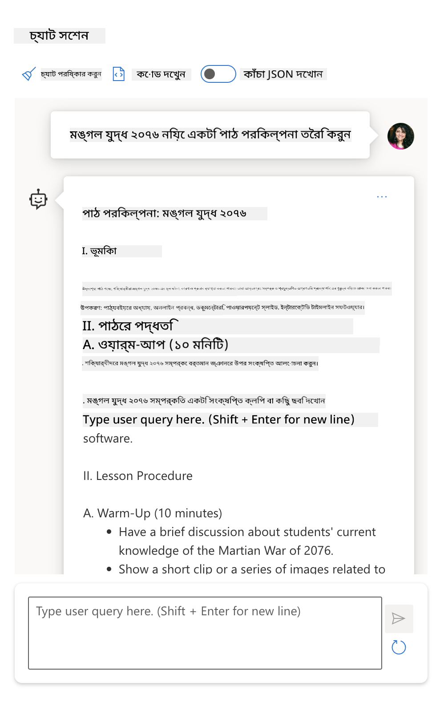
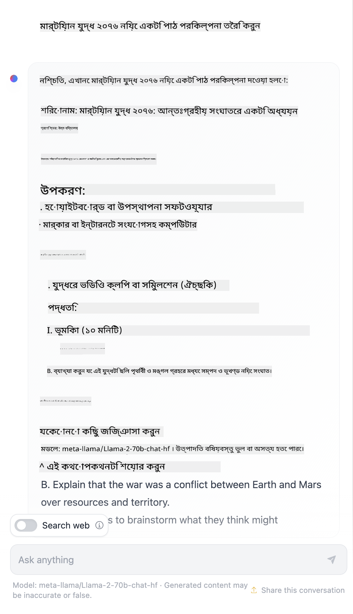

<!--
CO_OP_TRANSLATOR_METADATA:
{
  "original_hash": "dcbaaae026cb50fee071e690685b5843",
  "translation_date": "2025-08-26T15:37:56+00:00",
  "source_file": "04-prompt-engineering-fundamentals/README.md",
  "language_code": "bn"
}
-->
# প্রম্পট ইঞ্জিনিয়ারিংয়ের মৌলিক বিষয়সমূহ

[](https://aka.ms/gen-ai-lesson4-gh?WT.mc_id=academic-105485-koreyst)

## পরিচিতি
এই মডিউলে জেনারেটিভ AI মডেলে কার্যকর প্রম্পট তৈরির জন্য গুরুত্বপূর্ণ ধারণা ও কৌশল আলোচনা করা হয়েছে। আপনি LLM-এ যেভাবে প্রম্পট লিখবেন, সেটাও গুরুত্বপূর্ণ। যত্নসহকারে তৈরি করা প্রম্পট আরও ভালো মানের উত্তর দিতে পারে। কিন্তু _prompt_ এবং _prompt engineering_ শব্দগুলো আসলে কী বোঝায়? আর আমি কীভাবে LLM-এ পাঠানো প্রম্পট _input_ আরও ভালো করতে পারি? এই অধ্যায় এবং পরবর্তী অধ্যায়ে আমরা এসব প্রশ্নের উত্তর খুঁজে দেখব।

_জেনারেটিভ AI_ নতুন কনটেন্ট (যেমন: টেক্সট, ছবি, অডিও, কোড ইত্যাদি) তৈরি করতে পারে ব্যবহারকারীর অনুরোধে। এটি OpenAI-এর GPT ("Generative Pre-trained Transformer") সিরিজের মতো _Large Language Models_ ব্যবহার করে, যেগুলো প্রাকৃতিক ভাষা ও কোড ব্যবহারের জন্য প্রশিক্ষিত।

এখন ব্যবহারকারীরা চ্যাটের মতো পরিচিত পদ্ধতিতে এই মডেলগুলোর সাথে যোগাযোগ করতে পারে, কোনো প্রযুক্তিগত দক্ষতা বা প্রশিক্ষণ ছাড়াই। এই মডেলগুলো _prompt-based_ — ব্যবহারকারী টেক্সট ইনপুট (প্রম্পট) পাঠায় এবং AI উত্তর (completion) পায়। এরপর তারা "AI-এর সাথে চ্যাট" করতে পারে বারবার, বহুবার কথোপকথনে, তাদের প্রম্পট পরিমার্জন করতে পারে যতক্ষণ না উত্তর তাদের প্রত্যাশা পূরণ করে।

"প্রম্পট" এখন জেনারেটিভ AI অ্যাপের প্রধান _প্রোগ্রামিং ইন্টারফেস_ হয়ে উঠেছে, যা মডেলকে কী করতে হবে তা বলে দেয় এবং ফেরত পাওয়া উত্তরের মানকে প্রভাবিত করে। "Prompt Engineering" দ্রুত বাড়তে থাকা একটি ক্ষেত্র, যেখানে প্রম্পটের _ডিজাইন ও অপ্টিমাইজেশন_ নিয়ে কাজ করা হয়, যাতে বড় পরিসরে ধারাবাহিক ও মানসম্পন্ন উত্তর পাওয়া যায়।

## শেখার লক্ষ্য

এই পাঠে আমরা শিখব Prompt Engineering কী, কেন এটি গুরুত্বপূর্ণ, এবং কীভাবে নির্দিষ্ট মডেল ও অ্যাপ্লিকেশন লক্ষ্য অনুযায়ী আরও কার্যকর প্রম্পট তৈরি করা যায়। আমরা প্রম্পট ইঞ্জিনিয়ারিংয়ের মূল ধারণা ও সেরা চর্চাগুলো জানব — এবং একটি ইন্টারেক্টিভ Jupyter Notebooks "sandbox" পরিবেশ সম্পর্কে জানব, যেখানে বাস্তব উদাহরণে এসব ধারণা প্রয়োগ করা দেখা যাবে।

এই পাঠ শেষে আমরা পারব:

1. Prompt Engineering কী এবং কেন গুরুত্বপূর্ণ তা ব্যাখ্যা করতে।
2. একটি প্রম্পটের উপাদানসমূহ এবং সেগুলো কীভাবে ব্যবহৃত হয় তা বর্ণনা করতে।
3. Prompt Engineering-এর সেরা চর্চা ও কৌশল শিখতে।
4. শেখা কৌশল বাস্তব উদাহরণে প্রয়োগ করতে, OpenAI endpoint ব্যবহার করে।

## গুরুত্বপূর্ণ শব্দ

Prompt Engineering: AI মডেলকে কাঙ্ক্ষিত আউটপুট দিতে নির্দেশনা দিতে ইনপুট ডিজাইন ও পরিমার্জনের চর্চা।
Tokenization: টেক্সটকে ছোট ছোট ইউনিটে, অর্থাৎ টোকেনে রূপান্তর করার প্রক্রিয়া, যা মডেল বুঝতে ও প্রক্রিয়া করতে পারে।
Instruction-Tuned LLMs: বড় ভাষা মডেল (LLMs) যেগুলো নির্দিষ্ট নির্দেশনা দিয়ে ফাইন-টিউন করা হয়েছে, যাতে তাদের উত্তর আরও নির্ভুল ও প্রাসঙ্গিক হয়।

## শেখার Sandbox

Prompt engineering এখনো বিজ্ঞানের চেয়ে শিল্প বেশি। এটি নিয়ে আমাদের ধারণা বাড়ানোর সবচেয়ে ভালো উপায় হলো _অনুশীলন_ এবং চেষ্টা-ভুলের পদ্ধতি গ্রহণ করা, যেখানে অ্যাপ্লিকেশন ডোমেইন দক্ষতা, সুপারিশকৃত কৌশল এবং মডেল-নির্দিষ্ট অপ্টিমাইজেশন একত্রিত হয়।

এই পাঠের সাথে থাকা Jupyter Notebook একটি _sandbox_ পরিবেশ দেয়, যেখানে আপনি শেখা বিষয়গুলো চেষ্টা করতে পারেন — পাঠ চলাকালীন বা শেষে কোড চ্যালেঞ্জের অংশ হিসেবে। অনুশীলনগুলো চালাতে আপনার লাগবে:

1. **একটি Azure OpenAI API key** — ডিপ্লয় করা LLM-এর সার্ভিস এন্ডপয়েন্ট।
2. **একটি Python Runtime** — যাতে Notebook চালানো যায়।
3. **Local Env Variables** — _এখনই [SETUP](./../00-course-setup/02-setup-local.md?WT.mc_id=academic-105485-koreyst) ধাপগুলো সম্পন্ন করুন প্রস্তুতির জন্য_।

নোটবুকে _starter_ অনুশীলন আছে — তবে আপনাকে উৎসাহিত করা হচ্ছে নিজের _Markdown_ (বর্ণনা) এবং _Code_ (prompt অনুরোধ) অংশ যোগ করতে, যাতে আরও উদাহরণ বা ধারণা চেষ্টা করতে পারেন — এবং প্রম্পট ডিজাইন নিয়ে নিজের ধারণা গড়ে তুলতে পারেন।

## চিত্রসহ গাইড

এই পাঠে কী আছে, তার একটা সামগ্রিক ধারণা পেতে চান? দেখে নিন এই চিত্রসহ গাইড, যেখানে মূল বিষয়গুলো এবং প্রতিটি অংশে আপনার জন্য গুরুত্বপূর্ণ বিষয়গুলো তুলে ধরা হয়েছে। পাঠের রোডম্যাপ আপনাকে মূল ধারণা ও চ্যালেঞ্জ বোঝা থেকে শুরু করে, সেগুলো সমাধানে প্রাসঙ্গিক prompt engineering কৌশল ও সেরা চর্চা দেখাবে। লক্ষ্য করুন, এই গাইডের "Advanced Techniques" অংশটি পরবর্তী অধ্যায়ে আলোচনা করা বিষয়ের সাথে সম্পর্কিত।


## আমাদের স্টার্টআপ

এবার, চলুন দেখি _এই বিষয়টি_ কীভাবে আমাদের স্টার্টআপের [শিক্ষায় AI উদ্ভাবন আনার](https://educationblog.microsoft.com/2023/06/collaborating-to-bring-ai-innovation-to-education?WT.mc_id=academic-105485-koreyst) লক্ষ্যকে যুক্ত করে। আমরা চাই AI-চালিত _ব্যক্তিগতকৃত শেখার_ অ্যাপ্লিকেশন তৈরি করতে — তাই ভাবুন, আমাদের অ্যাপের বিভিন্ন ব্যবহারকারী কীভাবে "প্রম্পট ডিজাইন" করতে পারে:

- **অ্যাডমিনিস্ট্রেটররা** AI-কে _কারিকুলাম ডেটা বিশ্লেষণ করে কোথায় ঘাটতি আছে তা খুঁজে বের করতে_ বলতে পারে। AI ফলাফল সংক্ষেপ করতে পারে বা কোড দিয়ে ভিজ্যুয়ালাইজ করতে পারে।
- **শিক্ষকরা** AI-কে _নির্দিষ্ট শ্রোতা ও বিষয়ের জন্য পাঠ পরিকল্পনা তৈরি করতে_ বলতে পারে। AI নির্ধারিত ফরম্যাটে ব্যক্তিগতকৃত পরিকল্পনা তৈরি করতে পারে।
- **শিক্ষার্থীরা** AI-কে _কঠিন বিষয়ে টিউটর করতে_ বলতে পারে। AI এখন শিক্ষার্থীদের জন্য তাদের স্তর অনুযায়ী পাঠ, ইঙ্গিত ও উদাহরণ দিয়ে গাইড করতে পারে।

এটা তো শুধু শুরু। দেখে নিন [Prompts For Education](https://github.com/microsoft/prompts-for-edu/tree/main?WT.mc_id=academic-105485-koreyst) — শিক্ষাবিদদের তৈরি ওপেন-সোর্স প্রম্পট লাইব্রেরি — যাতে আরও অনেক সম্ভাবনার ধারণা পাবেন! _Sandbox-এ বা OpenAI Playground-এ এসব প্রম্পট চালিয়ে দেখুন কী হয়!_

<!--
LESSON TEMPLATE:
এই ইউনিটে মূল ধারণা #১ আলোচনা করা উচিত।
উদাহরণ ও রেফারেন্স দিয়ে ধারণাটি জোরদার করুন।

CONCEPT #1:
Prompt Engineering.
এটি সংজ্ঞায়িত করুন এবং কেন দরকার তা ব্যাখ্যা করুন।
-->

## Prompt Engineering কী?

আমরা এই পাঠ শুরু করেছি **Prompt Engineering**-কে _টেক্সট ইনপুট (প্রম্পট) ডিজাইন ও অপ্টিমাইজ_ করার প্রক্রিয়া হিসেবে সংজ্ঞায়িত করে, যাতে নির্দিষ্ট অ্যাপ্লিকেশন লক্ষ্য ও মডেলের জন্য ধারাবাহিক ও মানসম্পন্ন উত্তর (completion) পাওয়া যায়। এটিকে আমরা দুই ধাপে ভাবতে পারি:

- নির্দিষ্ট মডেল ও লক্ষ্য অনুযায়ী _প্রাথমিক প্রম্পট ডিজাইন_ করা
- উত্তর আরও ভালো করতে _প্রম্পট বারবার পরিমার্জন_ করা

এটি স্বাভাবিকভাবেই চেষ্টা-ভুলের একটি প্রক্রিয়া, যেখানে ব্যবহারকারীর ধারণা ও প্রচেষ্টা দরকার সর্বোত্তম ফল পেতে। তাহলে কেন এটি গুরুত্বপূর্ণ? এই প্রশ্নের উত্তর পেতে আমাদের তিনটি ধারণা বুঝতে হবে:

- _Tokenization_ = মডেল কীভাবে প্রম্পট "দেখে"
- _Base LLMs_ = ফাউন্ডেশন মডেল কীভাবে প্রম্পট "প্রক্রিয়া" করে
- _Instruction-Tuned LLMs_ = মডেল কীভাবে "টাস্ক" দেখতে পারে

### Tokenization

একটি LLM প্রম্পটকে _টোকেনের ধারাবাহিকতা_ হিসেবে দেখে, যেখানে বিভিন্ন মডেল (বা মডেলের সংস্করণ) একই প্রম্পটকে ভিন্নভাবে টোকেনাইজ করতে পারে। যেহেতু LLM-গুলো টোকেনের ওপর প্রশিক্ষিত (কাঁচা টেক্সটের ওপর নয়), প্রম্পট কীভাবে টোকেনাইজ হয়, সেটি তৈরি হওয়া উত্তরের মানে সরাসরি প্রভাব ফেলে।

Tokenization কীভাবে কাজ করে, তার ধারণা পেতে [OpenAI Tokenizer](https://platform.openai.com/tokenizer?WT.mc_id=academic-105485-koreyst) এর মতো টুল ব্যবহার করে দেখুন। আপনার প্রম্পট কপি করুন — এবং দেখুন কীভাবে সেটি টোকেনে রূপান্তরিত হয়, বিশেষভাবে খেয়াল করুন স্পেস ও যতিচিহ্ন কীভাবে হ্যান্ডল হয়। লক্ষ্য করুন, এই উদাহরণে পুরনো LLM (GPT-3) দেখানো হয়েছে — নতুন মডেলে চেষ্টা করলে ভিন্ন ফল হতে পারে।


### ধারণা: Foundation Models

প্রম্পট টোকেনাইজ হওয়ার পর, ["Base LLM"](https://blog.gopenai.com/an-introduction-to-base-and-instruction-tuned-large-language-models-8de102c785a6?WT.mc_id=academic-105485-koreyst) (বা Foundation model)-এর প্রধান কাজ হলো সেই ধারাবাহিকতায় পরবর্তী টোকেন অনুমান করা। LLM-গুলো বিশাল টেক্সট ডেটাসেটে প্রশিক্ষিত, তাই টোকেনগুলোর মধ্যে পরিসংখ্যানগত সম্পর্ক ভালোভাবে বোঝে এবং কিছুটা আত্মবিশ্বাস নিয়ে অনুমান করতে পারে। তবে তারা প্রম্পট বা টোকেনের _অর্থ_ বোঝে না; তারা শুধু একটি প্যাটার্ন দেখে, যেটি "সম্পূর্ণ" করতে পারে পরবর্তী অনুমান দিয়ে। তারা ধারাবাহিকভাবে অনুমান করতে পারে যতক্ষণ না ব্যবহারকারী থামায় বা পূর্বনির্ধারিত শর্তে শেষ হয়।

প্রম্পট-ভিত্তিক completion কীভাবে কাজ করে দেখতে চান? ওপরে দেয়া প্রম্পটটি Azure OpenAI Studio-র [_Chat Playground_](https://oai.azure.com/playground?WT.mc_id=academic-105485-koreyst)-এ ডিফল্ট সেটিংসে দিন। সিস্টেমটি প্রম্পটকে তথ্যের অনুরোধ হিসেবে ধরে — তাই এমন একটি completion পাবেন, যা এই প্রসঙ্গের সাথে মানানসই।

কিন্তু যদি ব্যবহারকারী নির্দিষ্ট কিছু দেখতে চায়, যা কোনো শর্ত বা টাস্ক পূরণ করে? তখনই _instruction-tuned_ LLMs কাজে আসে।


### ধারণা: Instruction Tuned LLMs

একটি [Instruction Tuned LLM](https://blog.gopenai.com/an-introduction-to-base-and-instruction-tuned-large-language-models-8de102c785a6?WT.mc_id=academic-105485-koreyst) ফাউন্ডেশন মডেল থেকে শুরু করে, উদাহরণ বা ইনপুট/আউটপুট জোড়া (যেমন: বহুবার "মেসেজ") দিয়ে ফাইন-টিউন করা হয়, যেখানে স্পষ্ট নির্দেশনা থাকতে পারে — এবং AI-এর উত্তর সেই নির্দেশনা অনুসরণ করার চেষ্টা করে।

এখানে Reinforcement Learning with Human Feedback (RLHF)-এর মতো কৌশল ব্যবহার করা হয়, যাতে মডেল _নির্দেশনা অনুসরণ_ করতে এবং _ফিডব্যাক থেকে শিখতে_ পারে, ফলে ব্যবহারিক অ্যাপ্লিকেশনের জন্য আরও প্রাসঙ্গিক ও উপযোগী উত্তর দেয়।

চলুন চেষ্টা করি — ওপরে দেয়া প্রম্পটটি আবার দিন, কিন্তু এবার _system message_ পরিবর্তন করে নিচের নির্দেশনা দিন:

> _আপনাকে দেয়া কনটেন্ট দ্বিতীয় শ্রেণির শিক্ষার্থীর জন্য সংক্ষেপ করুন। ফলাফল এক অনুচ্ছেদে রাখুন, ৩-৫টি বুলেট পয়েন্ট সহ।_

দেখুন, এবার ফলাফল কীভাবে কাঙ্ক্ষিত লক্ষ্য ও ফরম্যাটে মানানসই হয়েছে? একজন শিক্ষক সরাসরি এই উত্তরটি তার ক্লাসের স্লাইডে ব্যবহার করতে পারেন।


## Prompt Engineering কেন দরকার?

এখন আমরা জানি LLM-এ প্রম্পট কীভাবে প্রক্রিয়া হয়, এবার দেখি _কেন_ prompt engineering দরকার। কারণ হলো, বর্তমান LLM-গুলোতে কিছু চ্যালেঞ্জ আছে, যা _নির্ভরযোগ্য ও ধারাবাহিক completion_ পাওয়াকে কঠিন করে তোলে, যদি প্রম্পট তৈরি ও অপ্টিমাইজেশনে যথেষ্ট চেষ্টা না করা হয়। যেমন:

1. **মডেলের উত্তর এলোমেলো হতে পারে।** _একই প্রম্পট_ বিভিন্ন মডেল বা মডেলের সংস্করণে ভিন্ন উত্তর দিতে পারে। এমনকি _একই মডেল_ বারবার ব্যবহার করলেও ভিন্ন ফল হতে পারে। _Prompt engineering কৌশল এসব পার্থক্য কমাতে সাহায্য করে, ভালো গার্ডরেল দেয়।_

1. **মডেল ভুল তথ্য বানিয়ে দিতে পারে।** মডেলগুলো _বড় কিন্তু সীমিত_ ডেটাসেটে প্রশিক্ষিত, তাই প্রশিক্ষণের বাইরে থাকা বিষয় সম্পর্কে জানে না। ফলে তারা ভুল, কল্পিত বা পরিচিত সত্যের সাথে বিরোধী উত্তর দিতে পারে। _Prompt engineering কৌশল ব্যবহারকারীকে এসব fabrication চিহ্নিত ও কমাতে সাহায্য করে, যেমন: AI-কে citation বা reasoning চাইতে বলা।_

1. **মডেলের সক্ষমতা ভিন্ন হতে পারে।** নতুন মডেল বা মডেল জেনারেশন আরও বেশি সক্ষমতা আনবে, তবে খরচ ও জটিলতায় কিছু tradeoff থাকবে। _Prompt engineering আমাদের সেরা চর্চা ও workflow তৈরি করতে সাহায্য করে, যাতে পার্থক্যগুলো সহজে সামলানো যায় এবং মডেল-নির্দিষ্ট চাহিদায় স্কেল করা যায়।_

চলুন, OpenAI বা Azure OpenAI Playground-এ দেখে নেই:

- একই প্রম্পট বিভিন্ন LLM ডিপ্লয়মেন্টে (যেমন: OpenAI, Azure OpenAI, Hugging Face) ব্যবহার করুন — পার্থক্য দেখেছেন?
- একই প্রম্পট বারবার _একই_ LLM ডিপ্লয়মেন্টে (যেমন: Azure OpenAI playground) ব্যবহার করুন — পার্থক্যগুলো কেমন ছিল?

### Fabrications Example

এই কোর্সে আমরা **"fabrication"** শব্দটি ব্যবহার করি, যখন LLM-গুলো কখনো কখনো তথ্যগতভাবে ভুল উত্তর দেয়, তাদের প্রশিক্ষণের সীমাবদ্ধতা বা অন্যান্য কারণে। আপনি হয়তো জনপ্রিয় আর্টিকেল বা গবেষণাপত্রে _"hallucinations"_ শব্দটি শুনেছেন। তবে আমরা _"fabrication"_ শব্দটি ব্যবহারের পরামর্শ দিই, যাতে আমরা মেশিন-চালিত আচরণকে মানবিক বৈশিষ্ট্য হিসেবে ভুলভাবে না দেখি। এটি [Responsible AI guidelines](https://www.microsoft.com/ai/responsible-ai?WT.mc_id=academic-105485-koreyst) অনুসরণেও সহায়ক, কারণ কিছু শব্দ কিছু প্রসঙ্গে আপত্তিকর বা অন্তর্ভুক্তিমূলক নয়।

Fabrication কীভাবে কাজ করে, দেখতে চান? এমন একটি প্রম্পট ভাবুন, যেখানে AI-কে এমন বিষয়ের কনটেন্ট তৈরি করতে বলা হয়েছে, যা বাস্তবে নেই (যাতে প্রশিক্ষণ ডেটাসেটে না থাকে)। উদাহরণস্বরূপ — আমি এই প্রম্পটটি দিয়েছিলাম:
> **প্রম্পট:** ২০৭৬ সালের মঙ্গল যুদ্ধ নিয়ে একটি পাঠ পরিকল্পনা তৈরি করুন।

# ২০৭৬ সালের মঙ্গল যুদ্ধ: পাঠ পরিকল্পনা

## পাঠের উদ্দেশ্য
- শিক্ষার্থীরা ২০৭৬ সালের মঙ্গল যুদ্ধের কারণ, প্রধান ঘটনা এবং ফলাফল সম্পর্কে জানতে পারবে।
- শিক্ষার্থীরা যুদ্ধের সামাজিক, রাজনৈতিক এবং বৈজ্ঞানিক প্রভাব বিশ্লেষণ করতে পারবে।
- শিক্ষার্থীরা কল্পবিজ্ঞান ও ইতিহাসের সংমিশ্রণ বুঝতে পারবে।

## পাঠের সময়কাল
১ ঘণ্টা

## উপকরণ
- তথ্যচিত্র ক্লিপ
- টাইমলাইন চার্ট
- চরিত্র বিশ্লেষণ শিট
- আলোচনা প্রশ্ন

## পাঠের ধাপসমূহ

### ১. ভূমিকা (১০ মিনিট)
- শিক্ষক মঙ্গল গ্রহে মানুষের বসতি স্থাপনের সংক্ষিপ্ত ইতিহাস তুলে ধরবেন।
- ২০৭৬ সালের যুদ্ধের পটভূমি ব্যাখ্যা করবেন: কীভাবে পৃথিবী ও মঙ্গলের মধ্যে উত্তেজনা তৈরি হয়েছিল।

### ২. প্রধান ঘটনা (১৫ মিনিট)
- টাইমলাইনের মাধ্যমে যুদ্ধের গুরুত্বপূর্ণ মুহূর্তগুলো দেখানো হবে।
- প্রধান চরিত্র ও দলসমূহ: পৃথিবীর ইউনিয়ন, মঙ্গল কলোনি, স্বাধীনতা আন্দোলন।
- শিক্ষার্থীরা তথ্যচিত্র ক্লিপ দেখবে এবং নোট নেবে।

### ৩. কারণ ও ফলাফল বিশ্লেষণ (১৫ মিনিট)
- যুদ্ধের কারণ: সম্পদ, স্বাধীনতা, প্রযুক্তি।
- যুদ্ধের ফলাফল: রাজনৈতিক পরিবর্তন, প্রযুক্তিগত অগ্রগতি, মানবিক সংকট।
- শিক্ষার্থীরা ছোট দলে ভাগ হয়ে কারণ ও ফলাফল নিয়ে আলোচনা করবে।

### ৪. চরিত্র ও দৃষ্টিভঙ্গি (১০ মিনিট)
- প্রধান চরিত্রদের ভূমিকা ও সিদ্ধান্ত বিশ্লেষণ।
- শিক্ষার্থীরা চরিত্র বিশ্লেষণ শিট পূরণ করবে।

### ৫. আলোচনা ও মূল্যায়ন (১০ মিনিট)
- নিচের প্রশ্নগুলো নিয়ে শ্রেণিকক্ষে আলোচনা:
  - যুদ্ধ কি এড়ানো যেত?
  - প্রযুক্তি কি সংঘাত বাড়িয়েছে না কমিয়েছে?
  - ভবিষ্যতে এমন যুদ্ধের সম্ভাবনা কতটা?

## বাড়ির কাজ
- শিক্ষার্থীরা ২০৭৬ সালের মঙ্গল যুদ্ধের একটি সংক্ষিপ্ত গল্প লিখবে, যেখানে তারা নিজেদের পছন্দের চরিত্রের দৃষ্টিভঙ্গি তুলে ধরবে।

## মূল্যায়ন
- আলোচনা, চরিত্র বিশ্লেষণ শিট এবং বাড়ির কাজের মাধ্যমে শিক্ষার্থীদের শেখার অগ্রগতি মূল্যায়ন করা হবে।
একটি ওয়েব অনুসন্ধানে দেখা গেছে যে মঙ্গল গ্রহের যুদ্ধ নিয়ে কাল্পনিক গল্প (যেমন, টেলিভিশন সিরিজ বা বই) আছে – কিন্তু ২০৭৬ সালে নয়। সাধারণ জ্ঞানও বলে, ২০৭৬ এখনো _ভবিষ্যতে_, তাই এটি কোনো বাস্তব ঘটনার সাথে যুক্ত হতে পারে না।

তাহলে, যখন আমরা এই প্রম্পটটি বিভিন্ন LLM প্রদানকারীর সাথে চালাই, তখন কী হয়?

> **Response 1**: OpenAI Playground (GPT-35)


> **Response 2**: Azure OpenAI Playground (GPT-35)



> **Response 3**: : Hugging Face Chat Playground (LLama-2)



প্রত্যাশিতভাবেই, প্রতিটি মডেল (বা মডেল ভার্সন) সামান্য ভিন্ন ভিন্ন উত্তর দেয়, কারণ এলোমেলো আচরণ এবং মডেলের সক্ষমতার তারতম্য। উদাহরণস্বরূপ, একটি মডেল অষ্টম শ্রেণির শিক্ষার্থীদের লক্ষ্য করে, অন্যটি ধরে নেয় ব্যবহারকারী উচ্চ বিদ্যালয়ের ছাত্র। কিন্তু তিনটি মডেলই এমন উত্তর তৈরি করেছে যা একজন অজ্ঞ ব্যবহারকারীকে বিশ্বাস করাতে পারে যে ঘটনাটি সত্যি।

_মেটাপ্রম্পটিং_ এবং _টেম্পারেচার কনফিগারেশন_-এর মতো প্রম্পট ইঞ্জিনিয়ারিং কৌশল কিছুটা হলেও মডেলের বানানো তথ্য কমাতে পারে। নতুন প্রম্পট ইঞ্জিনিয়ারিং _আর্কিটেকচার_-এও নতুন টুল ও কৌশলগুলো প্রম্পট ফ্লোতে সহজেই যুক্ত করা হচ্ছে, যাতে এসব প্রভাব কমানো যায়।

## কেস স্টাডি: GitHub Copilot

এই অংশটি শেষ করি একটি বাস্তব সমাধানে প্রম্পট ইঞ্জিনিয়ারিং কীভাবে ব্যবহৃত হয়, তা বোঝার জন্য একটি কেস স্টাডি দেখে: [GitHub Copilot](https://github.com/features/copilot?WT.mc_id=academic-105485-koreyst)।

GitHub Copilot হলো আপনার "AI পেয়ার প্রোগ্রামার" – এটি টেক্সট প্রম্পটকে কোড কমপ্লিশনে রূপান্তর করে এবং আপনার ডেভেলপমেন্ট এনভায়রনমেন্টে (যেমন, Visual Studio Code) ইন্টিগ্রেটেড থাকে, যাতে ব্যবহারকারীর অভিজ্ঞতা হয় ঝামেলাহীন। নিচের ব্লগ সিরিজে বর্ণিত আছে, প্রাথমিক ভার্সনটি OpenAI Codex মডেলের ওপর ভিত্তি করে তৈরি ছিল – কিন্তু ইঞ্জিনিয়াররা দ্রুত বুঝতে পারেন, মডেলটি ফাইন-টিউন করা এবং আরও ভালো প্রম্পট ইঞ্জিনিয়ারিং কৌশল তৈরি করা দরকার, কোডের মান উন্নত করতে। জুলাইয়ে তারা [Codex-এর চেয়েও উন্নত AI মডেল উন্মোচন করে](https://github.blog/2023-07-28-smarter-more-efficient-coding-github-copilot-goes-beyond-codex-with-improved-ai-model/?WT.mc_id=academic-105485-koreyst), যাতে আরও দ্রুত সাজেশন পাওয়া যায়।

তাদের শেখার যাত্রা অনুসরণ করতে পোস্টগুলো ক্রমানুসারে পড়ুন।

- **মে ২০২৩** | [GitHub Copilot আপনার কোড আরও ভালোভাবে বুঝতে পারছে](https://github.blog/2023-05-17-how-github-copilot-is-getting-better-at-understanding-your-code/?WT.mc_id=academic-105485-koreyst)
- **মে ২০২৩** | [GitHub-এর ভিতর: GitHub Copilot-এর পেছনের LLM নিয়ে কাজ](https://github.blog/2023-05-17-inside-github-working-with-the-llms-behind-github-copilot/?WT.mc_id=academic-105485-koreyst)
- **জুন ২০২৩** | [GitHub Copilot-এর জন্য আরও ভালো প্রম্পট কীভাবে লিখবেন](https://github.blog/2023-06-20-how-to-write-better-prompts-for-github-copilot/?WT.mc_id=academic-105485-koreyst)
- **জুলাই ২০২৩** | [.. GitHub Copilot উন্নত AI মডেল নিয়ে Codex-এর সীমা ছাড়িয়ে গেছে](https://github.blog/2023-07-28-smarter-more-efficient-coding-github-copilot-goes-beyond-codex-with-improved-ai-model/?WT.mc_id=academic-105485-koreyst)
- **জুলাই ২০২৩** | [ডেভেলপারদের জন্য প্রম্পট ইঞ্জিনিয়ারিং ও LLMs গাইড](https://github.blog/2023-07-17-prompt-engineering-guide-generative-ai-llms/?WT.mc_id=academic-105485-koreyst)
- **সেপ্টেম্বর ২০২৩** | [কীভাবে একটি এন্টারপ্রাইজ LLM অ্যাপ বানাবেন: GitHub Copilot থেকে শেখা](https://github.blog/2023-09-06-how-to-build-an-enterprise-llm-application-lessons-from-github-copilot/?WT.mc_id=academic-105485-koreyst)

তাদের [ইঞ্জিনিয়ারিং ব্লগ](https://github.blog/category/engineering/?WT.mc_id=academic-105485-koreyst) -এ আরও অনেক পোস্ট দেখতে পারেন, যেমন [এই পোস্টটি](https://github.blog/2023-09-27-how-i-used-github-copilot-chat-to-build-a-reactjs-gallery-prototype/?WT.mc_id=academic-105485-koreyst), যেখানে দেখানো হয়েছে কীভাবে এসব মডেল ও কৌশল বাস্তব অ্যাপ্লিকেশনে _প্রয়োগ_ করা হচ্ছে।

---

## প্রম্পট নির্মাণ

আমরা দেখেছি কেন প্রম্পট ইঞ্জিনিয়ারিং গুরুত্বপূর্ণ – এখন চলুন দেখি কীভাবে প্রম্পট _নির্মাণ_ করা হয়, যাতে আমরা আরও কার্যকর প্রম্পট ডিজাইনের জন্য বিভিন্ন কৌশল মূল্যায়ন করতে পারি।

### বেসিক প্রম্পট

চলুন বেসিক প্রম্পট দিয়ে শুরু করি: কোনো অতিরিক্ত প্রসঙ্গ ছাড়াই মডেলে পাঠানো একটি টেক্সট ইনপুট। উদাহরণস্বরূপ – যখন আমরা যুক্তরাষ্ট্রের জাতীয় সংগীতের প্রথম কয়েকটি শব্দ OpenAI [Completion API](https://platform.openai.com/docs/api-reference/completions?WT.mc_id=academic-105485-koreyst)-তে পাঠাই, তখন এটি সঙ্গে সঙ্গে পরবর্তী কয়েকটি লাইন _সম্পন্ন_ করে দেয়, যা মডেলের মৌলিক ভবিষ্যদ্বাণী আচরণ দেখায়।

| প্রম্পট (ইনপুট)     | কমপ্লিশন (আউটপুট)                                                                                                                        |
| :----------------- | :----------------------------------------------------------------------------------------------------------------------------------------- |
| Oh say can you see | মনে হচ্ছে আপনি "The Star-Spangled Banner," অর্থাৎ যুক্তরাষ্ট্রের জাতীয় সংগীতের কথা শুরু করেছেন। পুরো গানের কথা হলো ... |

### জটিল প্রম্পট

এখন চলুন সেই বেসিক প্রম্পটে প্রসঙ্গ ও নির্দেশনা যোগ করি। [Chat Completion API](https://learn.microsoft.com/azure/ai-services/openai/how-to/chatgpt?WT.mc_id=academic-105485-koreyst) আমাদেরকে একটি জটিল প্রম্পট তৈরি করতে দেয়, যেখানে _বার্তা_ গুলো থাকে:

- ইনপুট/আউটপুট জোড়া, যেখানে _user_ ইনপুট এবং _assistant_ রেসপন্স থাকে।
- সিস্টেম মেসেজ, যা অ্যাসিস্ট্যান্টের আচরণ বা ব্যক্তিত্বের প্রসঙ্গ নির্ধারণ করে।

এখন অনুরোধটি নিচের মতো, যেখানে _টোকেনাইজেশন_ প্রসঙ্গ ও কথোপকথন থেকে প্রাসঙ্গিক তথ্য ধরে রাখে। এখন, সিস্টেম প্রসঙ্গ পরিবর্তন করাও কমপ্লিশনের মানের ওপর ব্যবহারকারীর ইনপুটের মতোই প্রভাব ফেলতে পারে।

```python
response = openai.chat.completions.create(
    model="gpt-3.5-turbo",
    messages=[
        {"role": "system", "content": "You are a helpful assistant."},
        {"role": "user", "content": "Who won the world series in 2020?"},
        {"role": "assistant", "content": "The Los Angeles Dodgers won the World Series in 2020."},
        {"role": "user", "content": "Where was it played?"}
    ]
)
```

### নির্দেশনা প্রম্পট

উপরের উদাহরণগুলোতে, ইউজার প্রম্পট ছিল সাধারণ টেক্সট প্রশ্ন, যা তথ্যের অনুরোধ হিসেবে ব্যাখ্যা করা যায়। _নির্দেশনা_ প্রম্পটে, আমরা সেই টেক্সট ব্যবহার করে নির্দিষ্টভাবে কোনো কাজের বর্ণনা দিতে পারি, যাতে AI আরও ভালোভাবে গাইড পায়। উদাহরণ দেখুন:

| প্রম্পট (ইনপুট)                                                                                                                                                                                                                         | কমপ্লিশন (আউটপুট)                                                                                                        | নির্দেশনার ধরন    |
| :------------------------------------------------------------------------------------------------------------------------------------------------------------------------------------------------------------------------------------- | :------------------------------------------------------------------------------------------------------------------------- | :------------------ |
| Write a description of the Civil War                                                                                                                                                                                                   | _একটি সাধারণ অনুচ্ছেদ ফেরত দেয়_                                                                                              | সাধারণ              |
| Write a description of the Civil War. Provide key dates and events and describe their significance                                                                                                                                     | _একটি অনুচ্ছেদ এবং তারপরে গুরুত্বপূর্ণ তারিখ ও ঘটনাগুলোর তালিকা ফেরত দেয়_                                             | জটিল             |
| Write a description of the Civil War in 1 paragraph. Provide 3 bullet points with key dates and their significance. Provide 3 more bullet points with key historical figures and their contributions. Return the output as a JSON file | _আরও বিস্তারিত তথ্য ফেরত দেয়, একটি টেক্সট বক্সে, যা JSON ফরম্যাটে থাকে এবং সহজেই কপি-পেস্ট করে যাচাই করা যায়_ | জটিল। ফরম্যাটেড। |

## প্রাইমারি কনটেন্ট

উপরের উদাহরণগুলোতে, প্রম্পট ছিল বেশ খোলামেলা, LLM নিজেই ঠিক করত তার প্রি-ট্রেইনড ডেটাসেটের কোন অংশ প্রাসঙ্গিক। _প্রাইমারি কনটেন্ট_ ডিজাইন প্যাটার্নে, ইনপুট টেক্সট দুই ভাগে ভাগ করা হয়:

- একটি নির্দেশনা (কাজ)
- প্রাসঙ্গিক কনটেন্ট (যা কাজকে প্রভাবিত করে)

এখানে একটি উদাহরণ, যেখানে নির্দেশনা হলো "এটি ২টি বাক্যে সংক্ষেপ করো"।

| প্রম্পট (ইনপুট)                                                                                                                                                                                                                                                                                                                                                                                                                                                                                                                                                                                                                                                                                      | কমপ্লিশন (আউটপুট)                                                                                                                                                                                                                                                                             |
| :-------------------------------------------------------------------------------------------------------------------------------------------------------------------------------------------------------------------------------------------------------------------------------------------------------------------------------------------------------------------------------------------------------------------------------------------------------------------------------------------------------------------------------------------------------------------------------------------------------------------------------------------------------------------------------------------------- | :---------------------------------------------------------------------------------------------------------------------------------------------------------------------------------------------------------------------------------------------------------------------------------------------- |
| Jupiter is the fifth planet from the Sun and the largest in the Solar System. It is a gas giant with a mass one-thousandth that of the Sun, but two-and-a-half times that of all the other planets in the Solar System combined. Jupiter is one of the brightest objects visible to the naked eye in the night sky, and has been known to ancient civilizations since before recorded history. It is named after the Roman god Jupiter.[19] When viewed from Earth, Jupiter can be bright enough for its reflected light to cast visible shadows,[20] and is on average the third-brightest natural object in the night sky after the Moon and Venus. <br/> **Summarize this in 2 short sentences** | Jupiter, সূর্য থেকে পঞ্চম গ্রহ, সৌরজগতের সবচেয়ে বড় এবং রাতের আকাশে উজ্জ্বলতম বস্তুগুলোর একটি। রোমান দেবতা Jupiter-এর নামে নামকরণ করা এই গ্যাস জায়ান্টের ভর বাকি সব গ্রহের সম্মিলিত ভরের আড়াই গুণ। |

প্রাইমারি কনটেন্ট অংশটি বিভিন্নভাবে আরও কার্যকর নির্দেশনা দিতে ব্যবহার করা যায়:

- **উদাহরণ** – স্পষ্ট নির্দেশনা না দিয়ে, মডেলকে কী করতে হবে তার কিছু উদাহরণ দিন এবং সে নিজেই প্যাটার্নটি বুঝে নেবে।
- **কিউ** – নির্দেশনার পরে একটি "কিউ" দিন, যা কমপ্লিশনকে প্রাইম করে, মডেলকে আরও প্রাসঙ্গিক উত্তর দিতে গাইড করে।
- **টেমপ্লেট** – এগুলো পুনরাবৃত্তিযোগ্য 'রেসিপি', যেখানে প্লেসহোল্ডার (ভ্যারিয়েবল) থাকে, যা নির্দিষ্ট ডেটা দিয়ে কাস্টমাইজ করা যায়।

চলুন এগুলো ব্যবহারিকভাবে দেখি।

### উদাহরণ ব্যবহার

এটি এমন একটি পদ্ধতি, যেখানে আপনি প্রাইমারি কনটেন্টে কিছু উদাহরণ "খাওয়ান", যাতে মডেল বুঝতে পারে কাঙ্ক্ষিত আউটপুট কেমন হবে। কতগুলো উদাহরণ দেওয়া হয়েছে তার ওপর ভিত্তি করে, zero-shot prompting, one-shot prompting, few-shot prompting ইত্যাদি হতে পারে।

এখন প্রম্পটের তিনটি অংশ:

- কাজের বর্ণনা
- কাঙ্ক্ষিত আউটপুটের কয়েকটি উদাহরণ
- নতুন একটি উদাহরণের শুরু (যা একটি ইম্প্লিসিট কাজের বর্ণনা হয়ে যায়)

| শেখার ধরন | প্রম্পট (ইনপুট)                                                                                                                                        | কমপ্লিশন (আউটপুট)         |
| :------------ | :---------------------------------------------------------------------------------------------------------------------------------------------------- | :-------------------------- |
| Zero-shot     | "The Sun is Shining". Translate to Spanish                                                                                                            | "El Sol está brillando".    |
| One-shot      | "The Sun is Shining" => ""El Sol está brillando". <br> "It's a Cold and Windy Day" =>                                                                 | "Es un día frío y ventoso". |
| Few-shot      | The player ran the bases => Baseball <br/> The player hit an ace => Tennis <br/> The player hit a six => Cricket <br/> The player made a slam-dunk => | Basketball                  |
|               |                                                                                                                                                       |                             |

দেখুন, zero-shot prompting-এ আমাদের স্পষ্ট নির্দেশনা ("Translate to Spanish") দিতে হয়েছে, কিন্তু one-shot prompting-এ সেটি মডেল নিজেই বুঝে নিয়েছে। few-shot উদাহরণে দেখা যায়, আরও উদাহরণ দিলে মডেল কোনো বাড়তি নির্দেশনা ছাড়াই আরও নির্ভুলভাবে অনুমান করতে পারে।

### প্রম্পট কিউ

প্রাইমারি কনটেন্ট ব্যবহারের আরেকটি কৌশল হলো _কিউ_ দেওয়া, উদাহরণ নয়। এখানে, আমরা মডেলকে কাঙ্ক্ষিত উত্তর ফরম্যাটের একটি অংশ দিয়ে _শুরু_ করি, যেন সে সেই ধারা ধরে এগিয়ে যেতে পারে।

| কিউ সংখ্যা | প্রম্পট (ইনপুট)                                                                                                                                                                                                                                                                                                                                                                                                                                               | কমপ্লিশন (আউটপুট)                                                                                                                                                                                                                                                                                       |
| :------------- | :----------------------------------------------------------------------------------------------------------------------------------------------------------------------------------------------------------------------------------------------------------------------------------------------------------------------------------------------------------------------------------------------------------------------------------------------------------- | :-------------------------------------------------------------------------------------------------------------------------------------------------------------------------------------------------------------------------------------------------------------------------------------------------------- |
| 0              | Jupiter is the fifth planet from the Sun and the largest in the Solar System. It is a gas giant with a mass one-thousandth that of the Sun, but two-and-a-half times that of all the other planets in the Solar System combined. Jupiter is one of the brightest objects visible to the naked eye in the night sky, and has been known to ancient civilizations since before recorded history.

**এটি সংক্ষেপে বলুন**                                       | বৃহস্পতি আমাদের সৌরজগতের সবচেয়ে বড় গ্রহ এবং সূর্য থেকে পঞ্চম। এটি একটি গ্যাস জায়ান্ট, যার ভর সূর্যের ১/১০০০ ভাগ, কিন্তু এটি বাকি সব গ্রহের সম্মিলিত ভরের চেয়েও বেশি ভারী। প্রাচীন সভ্যতাগুলো বহু আগে থেকেই বৃহস্পতিকে চিনত, এবং এটি রাতের আকাশে সহজেই দেখা যায়। |
| ১              | বৃহস্পতি সূর্য থেকে পঞ্চম গ্রহ এবং সৌরজগতের সবচেয়ে বড় গ্রহ। এটি একটি গ্যাস জায়ান্ট, যার ভর সূর্যের এক-হাজার ভাগের এক ভাগ, কিন্তু বাকি সব গ্রহের সম্মিলিত ভরের দুই-দেড় গুণ। বৃহস্পতি রাতের আকাশে খালি চোখে দেখা যায় এমন উজ্জ্বল বস্তুগুলোর একটি, এবং এটি প্রাচীন সভ্যতাগুলোর কাছে ইতিহাসের আগেই পরিচিত ছিল। <br/>**এটি সংক্ষেপে বলুন** <br/> আমরা যা শিখলাম তা হলো বৃহস্পতি | সূর্য থেকে পঞ্চম গ্রহ এবং সৌরজগতের সবচেয়ে বড় গ্রহ। এটি একটি গ্যাস জায়ান্ট, যার ভর সূর্যের এক-হাজার ভাগের এক ভাগ, কিন্তু বাকি সব গ্রহের সম্মিলিত ভরের দুই-দেড় গুণ। এটি খালি চোখে সহজেই দেখা যায় এবং প্রাচীনকাল থেকেই পরিচিত।                        |
| ২              | বৃহস্পতি সূর্য থেকে পঞ্চম গ্রহ এবং সৌরজগতের সবচেয়ে বড় গ্রহ। এটি একটি গ্যাস জায়ান্ট, যার ভর সূর্যের এক-হাজার ভাগের এক ভাগ, কিন্তু বাকি সব গ্রহের সম্মিলিত ভরের দুই-দেড় গুণ। বৃহস্পতি রাতের আকাশে খালি চোখে দেখা যায় এমন উজ্জ্বল বস্তুগুলোর একটি, এবং এটি প্রাচীন সভ্যতাগুলোর কাছে ইতিহাসের আগেই পরিচিত ছিল। <br/>**এটি সংক্ষেপে বলুন** <br/> শীর্ষ ৩টি তথ্য যা আমরা জানলাম:         | ১. বৃহস্পতি সূর্য থেকে পঞ্চম গ্রহ এবং সৌরজগতের সবচেয়ে বড় গ্রহ। <br/> ২. এটি একটি গ্যাস জায়ান্ট, যার ভর সূর্যের এক-হাজার ভাগের এক ভাগ...<br/> ৩. বৃহস্পতি প্রাচীনকাল থেকেই খালি চোখে দেখা যায় ...                                                                       |
|                |                                                                                                                                                                                                                                                                                                                                                                                                                                                              |                                                                                                                                                                                                                                                                                                           |

### প্রম্পট টেমপ্লেট

একটি প্রম্পট টেমপ্লেট হলো _একটি পূর্বনির্ধারিত প্রম্পটের রেসিপি_, যা সংরক্ষণ ও পুনরায় ব্যবহার করা যায়, যাতে বড় পরিসরে আরও ধারাবাহিক ব্যবহারকারীর অভিজ্ঞতা নিশ্চিত করা যায়। সবচেয়ে সহজভাবে, এটি [OpenAI-এর এই উদাহরণের মতো](https://platform.openai.com/examples?WT.mc_id=academic-105485-koreyst) কিছু প্রম্পট উদাহরণের একটি সংগ্রহ, যেখানে ইন্টারেক্টিভ প্রম্পট উপাদান (ব্যবহারকারী ও সিস্টেম বার্তা) এবং API-নির্ভর অনুরোধ ফরম্যাট—দুটোই থাকে, যাতে পুনরায় ব্যবহার সহজ হয়।

আরও জটিল রূপে, যেমন [LangChain-এর এই উদাহরণে](https://python.langchain.com/docs/concepts/prompt_templates/?WT.mc_id=academic-105485-koreyst), এতে _প্লেসহোল্ডার_ থাকে, যা বিভিন্ন উৎস (ব্যবহারকারীর ইনপুট, সিস্টেম প্রসঙ্গ, বাইরের ডেটা ইত্যাদি) থেকে ডেটা দিয়ে প্রতিস্থাপন করা যায়, যাতে প্রম্পটটি গতিশীলভাবে তৈরি হয়। এতে আমরা পুনরায় ব্যবহারযোগ্য প্রম্পটের একটি লাইব্রেরি তৈরি করতে পারি, যা প্রোগ্রামেটিকভাবে বড় পরিসরে ধারাবাহিক ব্যবহারকারীর অভিজ্ঞতা নিশ্চিত করতে পারে।

সবশেষে, টেমপ্লেটের আসল মূল্য হলো _প্রম্পট লাইব্রেরি_ তৈরি ও প্রকাশ করার ক্ষমতা, বিশেষ কোনো অ্যাপ্লিকেশন ডোমেইনের জন্য—যেখানে প্রম্পট টেমপ্লেটটি এখন _অপ্টিমাইজড_ থাকে, যাতে নির্দিষ্ট প্রসঙ্গ বা উদাহরণ যুক্ত হয়, যা নির্দিষ্ট ব্যবহারকারীর জন্য আরও প্রাসঙ্গিক ও নির্ভুল উত্তর দেয়। [Prompts For Edu](https://github.com/microsoft/prompts-for-edu?WT.mc_id=academic-105485-koreyst) রিপোজিটরিটি এর একটি চমৎকার উদাহরণ, যেখানে শিক্ষা ডোমেইনের জন্য প্রম্পটের লাইব্রেরি তৈরি করা হয়েছে, যেমন পাঠ পরিকল্পনা, কারিকুলাম ডিজাইন, শিক্ষার্থী টিউটরিং ইত্যাদি।

## সহায়ক বিষয়বস্তু

যদি আমরা প্রম্পট নির্মাণকে একটি নির্দেশনা (কাজ) এবং একটি লক্ষ্যবস্তু (প্রধান বিষয়বস্তু) হিসেবে ভাবি, তাহলে _গৌণ বিষয়বস্তু_ হলো অতিরিক্ত প্রসঙ্গ, যা আমরা **আউটপুটকে কোনোভাবে প্রভাবিত করতে** দিই। এটি হতে পারে টিউনিং প্যারামিটার, ফরম্যাটিং নির্দেশনা, বিষয়বস্তুর শ্রেণিবিন্যাস ইত্যাদি, যা মডেলকে তার উত্তর _ব্যবহারকারীর চাহিদা বা প্রত্যাশা অনুযায়ী_ সাজাতে সাহায্য করে।

উদাহরণ: ধরুন, একটি কোর্স ক্যাটালগ আছে, যেখানে প্রতিটি কোর্সের জন্য বিস্তৃত মেটাডেটা (নাম, বিবরণ, স্তর, ট্যাগ, শিক্ষক ইত্যাদি) রয়েছে:

- আমরা নির্দেশনা দিতে পারি "Fall 2023-এর জন্য কোর্স ক্যাটালগ সংক্ষেপে বলো"
- আমরা প্রধান বিষয়বস্তু হিসেবে কাঙ্ক্ষিত আউটপুটের কিছু উদাহরণ দিতে পারি
- আমরা গৌণ বিষয়বস্তু হিসেবে আগ্রহের শীর্ষ ৫টি "ট্যাগ" চিহ্নিত করতে পারি

এখন, মডেলটি উদাহরণে দেখানো ফরম্যাটে সারাংশ দিতে পারবে—কিন্তু যদি কোনো ফলাফলে একাধিক ট্যাগ থাকে, তাহলে গৌণ বিষয়বস্তুর ৫টি ট্যাগকে অগ্রাধিকার দিতে পারবে।

---

<!--
পাঠ টেমপ্লেট:
এই ইউনিটে মূল ধারণা #১ আলোচনা করা উচিত।
উদাহরণ ও রেফারেন্স দিয়ে ধারণাটি জোরদার করুন।

ধারণা #৩:
প্রম্পট ইঞ্জিনিয়ারিং কৌশল।
প্রম্পট ইঞ্জিনিয়ারিংয়ের কিছু মৌলিক কৌশল কী?
কিছু অনুশীলনের মাধ্যমে দেখান।
-->

## প্রম্পটিং-এর সেরা চর্চা

এখন যেহেতু আমরা জানি কীভাবে প্রম্পট _নির্মাণ_ করা যায়, আমরা ভাবতে পারি কীভাবে সেগুলো _ডিজাইন_ করা যায়, যাতে সেরা চর্চা অনুসরণ করা হয়। আমরা এটিকে দুই ভাগে ভাবতে পারি—সঠিক _মানসিকতা_ রাখা এবং সঠিক _কৌশল_ প্রয়োগ করা।

### প্রম্পট ইঞ্জিনিয়ারিং মানসিকতা

প্রম্পট ইঞ্জিনিয়ারিং হলো চেষ্টা-ত্রুটির একটি প্রক্রিয়া, তাই তিনটি বড় দিক মাথায় রাখুন:

১. **ডোমেইন বোঝা জরুরি।** উত্তর কতটা নির্ভুল ও প্রাসঙ্গিক হবে, তা নির্ভর করে _ডোমেইন_-এর ওপর, যেখানে অ্যাপ্লিকেশন বা ব্যবহারকারী কাজ করছে। আপনার অভিজ্ঞতা ও ডোমেইন জ্ঞান ব্যবহার করে **কৌশলগুলো কাস্টমাইজ করুন**। যেমন, সিস্টেম প্রম্পটে ডোমেইন-নির্দিষ্ট ব্যক্তিত্ব নির্ধারণ করুন, বা ব্যবহারকারী প্রম্পটে ডোমেইন-নির্দিষ্ট টেমপ্লেট ব্যবহার করুন। গৌণ বিষয়বস্তুতে ডোমেইন-নির্দিষ্ট প্রসঙ্গ দিন, বা পরিচিত ব্যবহার প্যাটার্নের দিকে মডেলকে পরিচালিত করতে ডোমেইন-নির্দিষ্ট সংকেত ও উদাহরণ ব্যবহার করুন।

২. **মডেল বোঝা জরুরি।** আমরা জানি, মডেলগুলো স্বভাবতই এলোমেলো। কিন্তু মডেল ইমপ্লিমেন্টেশনও আলাদা হতে পারে—তারা কোন ডেটাসেট দিয়ে প্রশিক্ষিত, কী সুবিধা দেয় (API বা SDK), এবং কোন ধরনের বিষয়বস্তুর জন্য অপ্টিমাইজড (কোড, ছবি, টেক্সট ইত্যাদি)। আপনি যে মডেল ব্যবহার করছেন, তার শক্তি ও সীমাবদ্ধতা বুঝুন, এবং সেই অনুযায়ী _কাজের অগ্রাধিকার_ দিন বা _কাস্টমাইজড টেমপ্লেট_ তৈরি করুন, যা মডেলের জন্য উপযোগী।

৩. **পুনরাবৃত্তি ও যাচাই জরুরি।** মডেল দ্রুত পরিবর্তিত হচ্ছে, তেমনি প্রম্পট ইঞ্জিনিয়ারিং কৌশলও। ডোমেইন বিশেষজ্ঞ হিসেবে, আপনার কাছে এমন প্রসঙ্গ বা মানদণ্ড থাকতে পারে, যা বৃহত্তর কমিউনিটির জন্য প্রযোজ্য নয়। প্রম্পট ইঞ্জিনিয়ারিং টুল ও কৌশল ব্যবহার করে প্রম্পট নির্মাণ শুরু করুন, তারপর নিজের অভিজ্ঞতা ও ডোমেইন জ্ঞান দিয়ে ফলাফল যাচাই ও পুনরাবৃত্তি করুন। আপনার অভিজ্ঞতা নোট করুন এবং একটি **জ্ঞানভাণ্ডার** (যেমন, প্রম্পট লাইব্রেরি) তৈরি করুন, যা অন্যরা ভবিষ্যতে দ্রুত পুনরাবৃত্তির জন্য ব্যবহার করতে পারবে।

## সেরা চর্চা

এখন চলুন দেখি [OpenAI](https://help.openai.com/en/articles/6654000-best-practices-for-prompt-engineering-with-openai-api?WT.mc_id=academic-105485-koreyst) এবং [Azure OpenAI](https://learn.microsoft.com/azure/ai-services/openai/concepts/prompt-engineering#best-practices?WT.mc_id=academic-105485-koreyst) বিশেষজ্ঞদের সুপারিশকৃত কিছু সাধারণ সেরা চর্চা।

| কী                              | কেন                                                                                                                                                                                                                                               |
| :-------------------------------- | :------------------------------------------------------------------------------------------------------------------------------------------------------------------------------------------------------------------------------------------------ |
| সর্বশেষ মডেলগুলো মূল্যায়ন করুন।       | নতুন মডেল সাধারণত উন্নত ফিচার ও গুণমান নিয়ে আসে—তবে খরচও বেশি হতে পারে। প্রভাব মূল্যায়ন করুন, তারপর মাইগ্রেশনের সিদ্ধান্ত নিন।                                                                                |
| নির্দেশনা ও প্রসঙ্গ আলাদা করুন   | দেখুন, আপনার মডেল/প্রোভাইডার কি _ডিলিমিটার_ নির্ধারণ করেছে, যাতে নির্দেশনা, প্রধান ও গৌণ বিষয়বস্তু স্পষ্টভাবে আলাদা করা যায়। এতে মডেল টোকেনের ওজন আরও নির্ভুলভাবে নির্ধারণ করতে পারে।                                                         |
| নির্দিষ্ট ও স্পষ্ট হোন             | কাঙ্ক্ষিত প্রসঙ্গ, ফলাফল, দৈর্ঘ্য, ফরম্যাট, স্টাইল ইত্যাদি সম্পর্কে বিস্তারিত দিন। এতে উত্তর আরও মানসম্মত ও ধারাবাহিক হবে। রেসিপি পুনরায় ব্যবহারযোগ্য টেমপ্লেটে সংরক্ষণ করুন।                                                          |
| বর্ণনামূলক হোন, উদাহরণ দিন      | মডেলগুলো "দেখাও ও বলো" পদ্ধতিতে ভালো সাড়া দেয়। প্রথমে `zero-shot` পদ্ধতিতে শুধু নির্দেশনা দিন (কোনো উদাহরণ ছাড়া), তারপর `few-shot` পদ্ধতিতে কাঙ্ক্ষিত আউটপুটের কিছু উদাহরণ দিন। উপমা ব্যবহার করুন। |
| সংকেত ব্যবহার করুন                | কাঙ্ক্ষিত ফলাফলের দিকে মডেলকে পরিচালিত করতে কিছু সূচনা শব্দ বা বাক্যাংশ দিন, যা সে উত্তর শুরু করতে ব্যবহার করতে পারে।                                                                                                               |
| বারবার জোর দিন                       | কখনো কখনো মডেলকে বারবার একই কথা বলতে হতে পারে। প্রধান বিষয়বস্তুর আগে ও পরে নির্দেশনা দিন, নির্দেশনা ও সংকেত একসাথে দিন ইত্যাদি। পুনরাবৃত্তি ও যাচাই করুন, কী কাজ করে দেখুন।                                                         |
| ক্রম গুরুত্বপূর্ণ                     | মডেলের কাছে তথ্য উপস্থাপনের ক্রম আউটপুটে প্রভাব ফেলতে পারে, এমনকি শেখার উদাহরণেও, কারণ রিসেন্সি বায়াস থাকে। বিভিন্ন বিকল্প চেষ্টা করুন, কোনটা ভালো কাজ করে দেখুন।                                                               |
| মডেলকে "বিকল্প" দিন           | যদি কোনো কারণে কাজটি সম্পন্ন করতে না পারে, তাহলে মডেলকে একটি _ফলব্যাক_ উত্তর দিন। এতে মডেল ভুল বা বানানো উত্তর দেওয়ার সম্ভাবনা কমে।                                                         |
|                                   |                                                                                                                                                                                                                                                   |

যেকোনো সেরা চর্চার মতো, মনে রাখবেন—_আপনার অভিজ্ঞতা আলাদা হতে পারে_ মডেল, কাজ ও ডোমেইনের ওপর নির্ভর করে। এগুলোকে শুরু হিসেবে নিন, এবং নিজের জন্য কী ভালো কাজ করে তা খুঁজে বের করুন। নতুন মডেল ও টুল আসার সঙ্গে সঙ্গে আপনার প্রম্পট ইঞ্জিনিয়ারিং প্রক্রিয়া নিয়মিত মূল্যায়ন করুন, বিশেষ করে স্কেলেবিলিটি ও উত্তর মানের দিকে নজর দিন।

<!--
পাঠ টেমপ্লেট:
যদি প্রযোজ্য হয়, এই ইউনিটে একটি কোড চ্যালেঞ্জ দিন

চ্যালেঞ্জ:
শুধু কোড মন্তব্যসহ একটি Jupyter Notebook-এর লিঙ্ক দিন (কোড অংশ ফাঁকা)।

সমাধান:
সেই Notebook-এর একটি কপি, যেখানে প্রম্পটগুলো পূরণ ও চালানো হয়েছে, একটি উদাহরণ দেখানো হয়েছে।
-->

## অ্যাসাইনমেন্ট

অভিনন্দন! আপনি পাঠের শেষ পর্যন্ত পৌঁছেছেন! এখন কিছু বাস্তব উদাহরণের মাধ্যমে এই ধারণা ও কৌশলগুলো পরীক্ষা করার সময়!

আমাদের অ্যাসাইনমেন্টে, আমরা একটি Jupyter Notebook ব্যবহার করব, যেখানে আপনি ইন্টারেক্টিভভাবে অনুশীলনগুলো সম্পন্ন করতে পারবেন। আপনি চাইলে নিজের Markdown ও Code সেল যোগ করে নতুন ধারণা ও কৌশলও পরীক্ষা করতে পারেন।

### শুরু করতে, রিপোটি ফর্ক করুন, তারপর

- (সুপারিশকৃত) GitHub Codespaces চালু করুন
- (বিকল্প) রিপোটি আপনার ডিভাইসে ক্লোন করুন এবং Docker Desktop দিয়ে চালান
- (বিকল্প) আপনার পছন্দের Notebook পরিবেশে Notebook খুলুন

### এরপর, আপনার এনভায়রনমেন্ট ভেরিয়েবল কনফিগার করুন

- রিপো রুটে থাকা `.env.copy` ফাইলটি `.env` নামে কপি করুন এবং `AZURE_OPENAI_API_KEY`, `AZURE_OPENAI_ENDPOINT` ও `AZURE_OPENAI_DEPLOYMENT` মানগুলো পূরণ করুন। [Learning Sandbox সেকশনে](../../../04-prompt-engineering-fundamentals/04-prompt-engineering-fundamentals) ফিরে এসে বিস্তারিত জানুন।

### এরপর, Jupyter Notebook খুলুন

- রানটাইম কার্নেল নির্বাচন করুন। অপশন ১ বা ২ ব্যবহার করলে ডিফল্ট Python 3.10.x কার্নেল নির্বাচন করুন, যা ডেভ কন্টেইনারে দেওয়া আছে।

এখন আপনি অনুশীলনগুলো চালাতে প্রস্তুত। এখানে কোনো _সঠিক বা ভুল_ উত্তর নেই—শুধু চেষ্টা-ত্রুটির মাধ্যমে বিভিন্ন বিকল্প অন্বেষণ এবং নির্দিষ্ট মডেল ও অ্যাপ্লিকেশন ডোমেইনের জন্য কী কাজ করে তা বোঝা।

_এই কারণে, এই পাঠে কোনো কোড সমাধান অংশ নেই। বরং, Notebook-এ "My Solution:" শিরোনামের Markdown সেল থাকবে, যেখানে একটি উদাহরণ আউটপুট দেখানো হবে।_

 <!--
পাঠ টেমপ্লেট:
একটি সারাংশ ও স্ব-শিক্ষার জন্য রিসোর্স দিন।
-->

## জ্ঞান যাচাই

নিম্নের কোনটি কিছু যুক্তিসঙ্গত সেরা চর্চা অনুসরণ করে এমন একটি ভালো প্রম্পট?

১. Show me an image of red car  
২. Show me an image of red car of make Volvo and model XC90 parked by a cliff with the sun setting  
৩. Show me an image of red car of make Volvo and model XC90  

উত্তর: ২, এটি সবচেয়ে ভালো প্রম্পট কারণ এটি "কী" চায় তা স্পষ্টভাবে বলে এবং নির্দিষ্ট করে (শুধু কোনো গাড়ি নয়, নির্দিষ্ট ব্র্যান্ড ও মডেল) এবং পুরো সেটিংও বর্ণনা করে। ৩ নম্বরটি পরের সেরা, কারণ এটিতেও অনেক বর্ণনা আছে।

## 🚀 চ্যালেঞ্জ

"Show me an image of red car of make Volvo and " বাক্যটি সম্পূর্ণ করতে "সংকেত" কৌশলটি ব্যবহার করতে পারেন কিনা দেখুন। এটি কী উত্তর দেয়, এবং আপনি কীভাবে আরও ভালো করতে পারেন?

## দারুণ কাজ! আরও শিখুন

বিভিন্ন প্রম্পট ইঞ্জিনিয়ারিং ধারণা সম্পর্কে আরও জানতে চান? [continued learning page](https://aka.ms/genai-collection?WT.mc_id=academic-105485-koreyst) এ যান, এই বিষয়ে আরও চমৎকার রিসোর্স পেতে।

Lesson 5-এ যান, যেখানে আমরা [উন্নত প্রম্পটিং কৌশল](../05-advanced-prompts/README.md?WT.mc_id=academic-105485-koreyst) নিয়ে আলোচনা করব!

---

**দায়িত্ব অস্বীকার:**
এই নথিটি AI অনুবাদ পরিষেবা [Co-op Translator](https://github.com/Azure/co-op-translator) ব্যবহার করে অনুবাদ করা হয়েছে। আমরা যথাসাধ্য নির্ভুলতা বজায় রাখার চেষ্টা করি, তবে অনুগ্রহ করে মনে রাখবেন যে স্বয়ংক্রিয় অনুবাদে ভুল বা অসঙ্গতি থাকতে পারে। মূল ভাষায় থাকা নথিটিই কর্তৃত্বপূর্ণ উৎস হিসেবে বিবেচিত হবে। গুরুত্বপূর্ণ তথ্যের জন্য পেশাদার মানব অনুবাদ সুপারিশ করা হয়। এই অনুবাদের ব্যবহারের ফলে কোনো ভুল বোঝাবুঝি বা ভুল ব্যাখ্যার জন্য আমরা দায়ী নই।