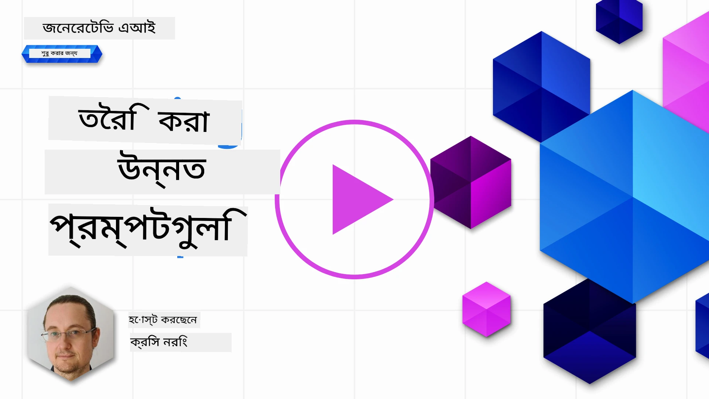

# উন্নত প্রম্পট তৈরি করা

[](https://youtu.be/BAjzkaCdRok?si=NmUIyRf7-cDgbjtt)

আগের অধ্যায় থেকে কিছু শিখনসম্পর্কিত বিষয়গুলো পুনঃস্মরণ করি:

> প্রম্পট _ইঞ্জিনিয়ারিং_ হলো এমন একটি প্রক্রিয়া যার মাধ্যমে আমরা **মডেলকে আরও প্রাসঙ্গিক প্রতিক্রিয়ার দিকে নির্দেশিত করি** বেশি কার্যকরী নির্দেশনা বা প্রেক্ষাপট প্রদান করে।

প্রম্পট লেখার দুটি ধাপও রয়েছে: প্রাসঙ্গিক প্রেক্ষাপট দিয়ে প্রম্পট নির্মাণ এবং _অপটিমাইজেশন_, কিভাবে ধাপে ধাপে প্রম্পট উন্নত করা যায়।

এখন পর্যন্ত আমরা প্রম্পট লেখার মৌলিক ধারণা পেয়েছি, কিন্তু আমাদের আরও গভীরে যেতে হবে। এই অধ্যায়ে, আপনি বিভিন্ন প্রম্পট চেষ্টা করার পর বুঝতে পারবেন কেন একটি প্রম্পট অন্যটির থেকে ভালো। আপনি এমন কিছু মৌলিক কৌশল শেখাবেন যেগুলো যেকোনো LLM এ প্রয়োগ করা যেতে পারে।

## পরিচিতি

এই অধ্যায়ে আমরা নিম্নলিখিত বিষয়গুলো আলোচনা করবো:

- আপনার প্রম্পট ইঞ্জিনিয়ারিং জ্ঞানে আরও বৃদ্ধি করুন বিভিন্ন কৌশল প্রয়োগ করে।
- আউটপুট পরিবর্তন করার জন্য আপনার প্রম্পট কনফিগার করা।

## শেখার লক্ষ্য

এই পাঠ শেষ করার পর, আপনি পারবেন:

- প্রম্পট ইঞ্জিনিয়ারিং কৌশল প্রয়োগ করতে যা আপনার প্রম্পটের ফলাফল উন্নত করে।
- এমন প্রম্পট তৈরি করতে যা পরিবর্তনশীল অথবা নির্দিষ্ট ফলাফল দেয়।

## প্রম্পট ইঞ্জিনিয়ারিং

প্রম্পট ইঞ্জিনিয়ারিং হলো সেই প্রক্রিয়া যার মাধ্যমে এমন প্রম্পট তৈরি করা হয় যা কাঙ্খিত ফলাফল দেয়। কেবল লেখা একটি টেক্সট প্রম্পট করাটা নয়, প্রম্পট ইঞ্জিনিয়ারিং একটি প্রকৌশল শাখা নয়, এটি এমন কিছু কৌশল যা আপনি কাঙ্খিত ফলাফল পেতে প্রয়োগ করতে পারেন।

### একটি প্রম্পটের উদাহরণ

চলুন একটি সাধারণ প্রম্পট দেখি:

>  ভূগোল নিয়ে ১০টি প্রশ্ন তৈরি করুন।

এই প্রম্পটে আপনি প্রকৃতপক্ষে বিভিন্ন প্রম্পট কৌশল প্রয়োগ করছেন।

চিন্তা করে দেখি:

- **প্রেক্ষাপট**, আপনি উল্লেখ করেছেন এটি "ভূগোল" সম্পর্কিত হওয়া উচিত।
- **আউটপুট সীমাবদ্ধকরণ**, আপনি ১০টির বেশি প্রশ্ন চান না।

### সহজ প্রম্পটিং এর সীমাবদ্ধতা

আপনি কাঙ্খিত ফলাফল পেতে পারেন বা না পেতে পারেন। আপনি অবশ্যই কিছু প্রশ্ন পাবেন, কিন্তু ভূগোল একটি বড় বিষয় এবং আপনি যা চান তা নাও পেতে পারেন নিম্নলিখিত কারণে:

- **বড় বিষয়**, আপনি নিশ্চিত নন এটি দেশের, রাজধানীর, নদী ইত্যাদি সম্পর্কে হবে কিনা।
- **ফরম্যাট**, যদি আপনি চান প্রশ্নগুলি নির্দিষ্ট কোন ভাবে ফরম্যাট করা হোক?

যেমন আপনি দেখতে পাচ্ছেন, প্রম্পট তৈরি করার সময় অনেক কিছু বিবেচনা করতে হয়।

এখন পর্যন্ত আমরা একটি সহজ প্রম্পটের উদাহরণ দেখেছি, কিন্তু জেনেরেটিভ AI মানুষের বিভিন্ন ভূমিকা এবং শিল্পে সাহায্য করার জন্য আরও অনেক কিছু করতে পারে। চলুন কিছু মৌলিক কৌশল পরবর্তী ভাগে দেখি।

### প্রম্পটিং-এর কৌশলগুলি

প্রথমত, আমাদের বুঝতে হবে যে প্রম্পটিং হলো একটি _উদ্ভূত_ বৈশিষ্ট্য একটি LLM এর জন্য অর্থাৎ এটি মডেলের নেটিভ ফিচার নয়, বরং আমরা মডেল ব্যবহার করার সময় আবিষ্কার করি।

কিছু মৌলিক কৌশল আছে যেগুলো দিয়ে LLM কে প্রম্পট করা যায়। আসুন সেগুলো দেখি।

- **জিরো-শট প্রম্পটিং**, এটি সবচেয়ে মৌলিক প্রম্পটিং ফর্ম। একটি একক প্রম্পট যা কেবলমাত্র তার প্রশিক্ষণ ডেটার ওপর ভিত্তি করে একটি প্রতিক্রিয়া চায়।
- **ফিউ-শট প্রম্পটিং**, এই ধরনের প্রম্পটিং মডেলকে গাইড করে ১ বা তার বেশি উদাহরণ দিয়ে যার ওপর নির্ভর করে এটি উত্তর তৈরি করবে।
- **চেইন-অফ-থট**, এই ধরনের প্রম্পটিং মডেলকে শেখায় কিভাবে একটি সমস্যা ধাপে ধাপে ভাঙতে হয়।
- **জেনারেটেড নলেজ**, প্রম্পটের প্রতিক্রিয়া উন্নত করতে, আপনি আপনার প্রম্পটের সঙ্গে অতিরিক্ত তৈরি তথ্য বা জ্ঞান দিতে পারেন।
- **লিস্ট টু মোস্ট**, চেইন-অফ-থটের মতোই, এই কৌশলটি বড় সমস্যাটিকে একটি সিরিজ ধাপে বিভক্ত করে এবং স্তরে স্তরে এগুলো সম্পাদনের জন্য বলে।
- **সেলফ-রিফাইন**, এই কৌশল মডেলের আউটপুট সমালোচনা করার পরে তা উন্নত করার জন্য বলে।
- **মাইউটিক প্রম্পটিং**। এখানে আপনি চান মডেলের উত্তর সঠিক হোক এবং উত্তরটির বিভিন্ন অংশ ব্যাখ্যা করতে বলবেন। এটি সেলফ-রিফাইনের একটি রূপ।

### জিরো-শট প্রম্পটিং

এই ধরনের প্রম্পটিং খুবই সহজ, একক প্রম্পট নিয়ে গঠিত। সম্ভবত আপনি যখন LLM শিখতে শুরু করছেন তখন এটি ব্যবহার করছেন। উদাহরণ:

- প্রম্পট: "আলজেবরা কী?"
- উত্তর: "আলজেবরা হলো গণিতের একটি শাখা যা গাণিতিক প্রতীক এবং এই প্রতীক নিয়ন্ত্রণের নিয়ম নিয়ে গবেষণা করে।"

### ফিউ-শট প্রম্পটিং

এই প্রম্পটিং মডেলকে কিছু উদাহরণসহ গাইড করে দেয়। এটি একটি একক প্রম্পট যার সাথে অতিরিক্ত কাজ-নির্দিষ্ট তথ্য থাকে। উদাহরণ:

- প্রম্পট: "শেক্সপিয়ারের শৈলীতে একটি কবিতা লিখুন। এখানে শেক্সপিয়ারীয় সনেটসমূহের কিছু উদাহরণঃ
  সনেট ১৮: 'তুমি কি একটি গ্রীষ্মের দিনের সাথে তুলনা করব? তুমি আরও সুন্দর ও মৃদু...'
  সনেট ১১৬: 'সত্যিকারের মনের বিবাহে বাধা আমি মঞ্জুর করব না। ভালোবাসা ভালোবাসা নয় যা পরিবর্তনে বদলে যায়...'
  সনেট ১৩২: 'তোমার চোখকে আমি ভালোবাসি, এবং তারা, আমার প্রতি করুণাময়, তোমার হৃদয় আমাকে অবজ্ঞায় আক্রান্ত করে,...'
  এখন, চাঁদের সৌন্দর্য নিয়ে একটি সনেট লিখুন।"
- উত্তর: "আকাশে চাঁদ মৃদু দীপ্তি ছড়ায়, রূপালি আলো যা নরম অনুগ্রহ প্রদান করে,..."

উদাহরণগুলি মডেলকে কাঙ্খিত আউটপুটের প্রেক্ষাপট, ফরম্যাট বা শৈলী বুঝতে সাহায্য করে এবং আরও সঠিক ও প্রাসঙ্গিক উত্তর তৈরি করে।

### চেইন-অফ-থট

চেইন-অফ-থট একটি খুবই আকর্ষণীয় কৌশল কারণ এটি মডেলকে ধাপে ধাপে সমস্যা সমাধানের নির্দেশ দেয়। ধারণা হলো মডেলকে এমনভাবে হুকুম দেয়া যাতে সেটি বুঝতে পারে কীভাবে কিছু করা যায়। নিচের উদাহরণ দেখুন, চেইন-অফ-থট সহ ও ছাড়া:

    - প্রম্পট: "অ্যালিসের কাছে ৫টি আপেল আছে, সে ৩টি ফেলে দিলো, ২টি ববকে দিলো আর বব একটি ফিরিয়ে দিলো, অ্যালিসের কাছে এখন কত আপেল?"
    - উত্তর: ৫

মডেল ৫ উত্তর দেয়, যা ভুল। সঠিক উত্তর হলো ১টি (হিসাব: ৫ - ৩ - ২ + ১ = ১)।

তো কিভাবে মডেলকে সঠিকভাবে শেখাব?

চেইন-অফ-থট প্রয়োগ করি। এর মানে:

1. মডেলকে একটি অনুরূপ উদাহরণ দিন।
2. হিসাব দেখান, কিভাবে সঠিকভাবে হিসাব করতে হয়।
3. আসল প্রম্পট দিন।

দেখুন কিভাবে:

- প্রম্পট: "লিসার কাছে ৭টি আপেল, সে ১টি ফেলে দিলো, ৪টি বার্টকে দিলো আর বার্ট ১টি ফিরিয়ে দিলো:  
  ৭ - ১ = ৬  
  ৬ - ৪ = ২  
  ২ + ১ = ৩  
  অ্যালিসের কাছে ৫টি আপেল ছিল, সে ৩টি ফেলে দিলো, ২টি ববকে দিলো আর বব একটি ফিরিয়ে দিলো, এখন অ্যালিসের কাছে কত আপেল?"  
  উত্তর: ১

দেখুন কিভাবে আমরা আরেকটি উদাহরণ, একটি হিসাব সহ অনেক বড় প্রম্পট লিখেছি এবং সঠিক উত্তর ১ পেয়েছি।

এখান থেকে বোঝা যায় চেইন-অফ-থট খুব শক্তিশালী একটি কৌশল।

### জেনারেটেড জ্ঞান

অনেক সময় আপনি একটি প্রম্পট তৈরি করতে চান আপনার নিজের কোম্পানির ডেটা ব্যবহার করে। চান প্রম্পটের একটা অংশ কোম্পানির তথ্য থেকে আসুক এবং অন্য অংশ হবে আসল প্রম্পট।

উদাহরণস্বরূপ, যদি আপনি ইন্স্যুরেন্স ব্যবসায় থাকেন, তাহলে আপনার প্রম্পট এমন হতে পারে:

```text
{{company}}: {{company_name}}
{{products}}:
{{products_list}}
Please suggest an insurance given the following budget and requirements:
Budget: {{budget}}
Requirements: {{requirements}}
```
  
উপরের টেমপ্লেটে দেখুন কীভাবে প্রম্পটটি তৈরি হয়েছে। টেমপ্লেটে অনেকগুলো পরিবর্তনীয় অংশ আছে, যেগুলো `{{variable}}` এই ধরনের নির্দিষ্ট স্থানে কোম্পানির API থেকে আসা তথ্য দ্বারা প্রতিস্থাপিত হবে।

আপনার কোম্পানির তথ্য দিয়ে পরিবর্তনশীল অংশগুলো প্রতিস্থাপন করার পর প্রম্পটটি দেখতে এরকম হতে পারে:

```text
Insurance company: ACME Insurance
Insurance products (cost per month):
- Car, cheap, 500 USD
- Car, expensive, 1100 USD
- Home, cheap, 600 USD
- Home, expensive, 1200 USD
- Life, cheap, 100 USD

Please suggest an insurance given the following budget and requirements:
Budget: $1000
Requirements: Car, Home, and Life insurance
```
  
এই প্রম্পট LLM এ রান করলে এমন একটি উত্তর আসতে পারে:

```output
Given the budget and requirements, we suggest the following insurance package from ACME Insurance:
- Car, cheap, 500 USD
- Home, cheap, 600 USD
- Life, cheap, 100 USD
Total cost: $1,200 USD
```
  
দেখুন, এখানে এটি লাইফ ইন্স্যুরেন্সও প্রস্তাব করছে, যা উচিত নয়। এরকম ফলাফল ইঙ্গিত দেয় যে আমাদের প্রম্পটটি পরিষ্কার করার জন্য অপটিমাইজ করতে হবে কি অনুমতি দেওয়া হয়। কিছু _ট্রায়াল অ্যান্ড এরর_ এর পরে আমরা এমন একটি প্রম্পট পাই:

```text
Insurance company: ACME Insurance
Insurance products (cost per month):
- type: Car, cheap, cost: 500 USD
- type: Car, expensive, cost: 1100 USD
- type: Home, cheap, cost: 600 USD
- type: Home, expensive, cost: 1200 USD
- type: Life, cheap, cost: 100 USD

Please suggest an insurance given the following budget and requirements:
Budget: $1000 restrict choice to types: Car, Home
```
  
দেখুন কিভাবে _type_ এবং _cost_ যোগ করা এবং _restrict_ কীওয়ার্ড ব্যবহার করা মডেলকে বোঝাতে সাহায্য করে আমরা কী চাই।

এবার নিম্নলিখিত উত্তর আসছে:

```output
Given the budget and requirements, we suggest the Car, Cheap insurance product which costs 500 USD per month.
```
  
এই উদাহরণের মূল বক্তব্য হলো, যদিও আমরা মৌলিক কৌশল _জেনারেটেড নলেজ_ ব্যবহার করছি, তবুও আমরা অধিকাংশ ক্ষেত্রে প্রম্পট অপটিমাইজ করতে হবে কাঙ্খিত আউটপুটের জন্য।

### লিস্ট-টু-মোস্ট

লিস্ট-টু-মোস্ট প্রম্পটিং ধারণা হলো বড় একটি সমস্যা ছোট ছোট উপসামস্যায় ভাগ করা। এভাবে, আপনি মডেলকে সাহায্য করেন কিভাবে বড় সমস্যা "জয়" করা যায়। একটি ভালো উদাহরণ হলো ডেটা সায়েন্স যেখানে মডেলের কাছে এমন প্রশ্ন করা যায়:

> প্রম্পট: ৫ ধাপে কিভাবে ডেটা সায়েন্স করবেন?

আপনার AI সহকারী উত্তর দিবে:

1. ডেটা সংগ্রহ করা  
2. ডেটা পরিস্কার করা  
3. ডেটা বিশ্লেষণ করা  
4. ডেটা চিত্রায়ন করা  
5. ডেটা উপস্থাপন করা

### সেলফ-রিফাইন, ফলাফল সমালোচনা

জেনেরেটিভ AI এবং LLM গুলোর ক্ষেত্রে আউটপুট বিশ্বাসযোগ্য নয়। আপনাকে যাচাই করতে হবে। মডেল কেবল পরবর্তী সবচেয়ে সম্ভাব্য কথা বলছে, যা সঠিক হতে বাধ্য নয়। সুতরাং, ভালো ধারণা হলো মডেলকে নিজেই সমালোচনা করতে বলুন, যা সেলফ-রিফাইন কৌশল।

কিভাবে কাজ করে:

1. প্রথমে একটি মৌলিক প্রম্পট মডেলকে দেন  
2. মডেল উত্তর দেয়  
3. আপনি উত্তর সমালোচনা করেন এবং উন্নতির জন্য বলেন  
4. মডেল আবার উত্তর দেয়, এবার সমালোচনা বিবেচনা করে এবং নতুন সমাধান প্রস্তাব করে

আপনি যতবার চান এই প্রক্রিয়া পুনরাবৃত্তি করতে পারেন।

এই কৌশল ব্যবহারের একটি উদাহরণ:

> প্রম্পট: "Python Web API তৈরি করুন যার রুটস প্রোডাক্ট এবং কাস্টমার্স"

AI এর উত্তর:

```python
import flask
app = Flask(__name__)

@app.route('/products')
def products():
    return 'Products'

@app.route('/customers')
def customers():
    return 'Customers'
```
  
> প্রম্পট: উপরের কোডটির ৩টি উন্নতির পরামর্শ দিন

AI এর উত্তর:

```text
Sure, here are three suggestions to improve the code:

Import the correct module: The first line should import Flask instead of flask. The correct import statement should be from flask import Flask.

Add a main function: Add a if __name__ == '__main__': block to the end of the file to run the application when the file is executed.

Use f-strings: Use f-strings to format the return statements in the route functions. For example, return 'Products' can be changed to return f'This is the {request.path} page'.
```
  
```python
from flask import Flask, request

app = Flask(__name__)

@app.route('/products')
def products():
    return f'This is the {request.path} page'

@app.route('/customers')
def customers():
    return f'This is the {request.path} page'

if __name__ == '__main__':
    app.run()
```
  
দেখুন, উপরের AI উত্তর প্রথম প্রস্তাবিত কোডটিকে সমালোচনা করে উন্নত করছে।

### মাইউটিক প্রম্পটিং

মাইউটিক প্রম্পটিং সেলফ-রিফাইনের মতই, কিন্তু এখানে মডেলের নিজেকেই ব্যাখ্যা করতে বলা হয়। লক্ষ্য হলো মডেলের আউটপুটের অসঙ্গতি কমানো যাতে সঠিক উত্তর নিশ্চিত হয়। প্রক্রিয়া অনুসরণ:

1. মডেলকে একটি প্রশ্নের উত্তর দিতে বলা  
2. উত্তরটির প্রতিটি অংশ বিস্তারিত ব্যাখ্যা করতে বলা  
3. যদি অসঙ্গতি থাকে, অসঙ্গত অংশ বাদ দেওয়া

২ ও ৩ পুনরাবৃত্তি করুন যতক্ষণ না সমস্ত অংশ পর্যালোচনা করে আপনি সন্তুষ্ট হন।

উদাহরণ প্রম্পট:

> প্রম্পট: মহামারী মোকাবেলায় ৫ ধাপে একটি সংকট পরিকল্পনা কিভাবে তৈরি করব?  
> মডেলের উত্তর:

```text
1. Identify the risks
1. Identify the stakeholders
1. Identify the resources
1. Identify the actions
1. Identify the communication channels
```
  
৫টি ধাপ চিহ্নিত করা হয়েছে, কিন্তু এটি সঠিক কি না? আসুন মডেলের প্রতিটি ধাপ বিস্তারিত ব্যাখ্যার জন্য বলি:

> প্রম্পট: প্রথম ধাপটি বিস্তারিত ব্যাখ্যা করুন, মহামারীর নির্দিষ্ট ঝুঁকিগুলো কি কি?

```text
The risks are the following:

- Loss of life
- Loss of business
- Loss of reputation
- Loss of customers
- Loss of employees
```
  
এখন আমরা নিশ্চিত হতে চাই মডেল সঠিক, তাই প্রথম ঝুঁকিটি আরও বিস্তারিত ব্যাখ্যা করতে বলি এবং আশা করি এটি উপরের উত্তরের সাথে সঙ্গতিপূর্ণ:

> প্রম্পট: মহামারীতে সবচেয়ে বড় ঝুঁকি কোনটি এবং কেন?

```text
The biggest risk is loss of life because it's the most important thing to protect.
```
  
> মহামারীতে সবচেয়ে বড় দুটি ঝুঁকি কি?

```text
The two biggest risks are loss of life and loss of business.
```
  
এখানে মডেল সঙ্গতিপূর্ণ এবং "জীবন" ও "ব্যবসা" উল্লেখ করেছে শীর্ষ দুই ঝুঁকি হিসেবে। এখন আমরা পরবর্তী ধাপে যেতে পারি আত্মবিশ্বাস সহকারে। তবে আমরা মডেলের আউটপুট অন্ধভাবে বিশ্বাস করবো না, সর্বদা যাচাই করবো।

## আপনার আউটপুট পরিবর্তন করুন

LLM গুলো প্রাকৃতিকভাবেই একরূপ প্রতিক্রিয়া দেয় না, অর্থাৎ একই প্রম্পট বারবার চালালে ভিন্ন ফল আসবে। নিচের প্রম্পটটি চেষ্টা করুন:

> "Python Web API-এর জন্য কোড তৈরি করুন"

```python
# প্রয়োজনীয় মডিউল আমদানি করুন
import flask
from flask import request, jsonify

# একটি ফ্লাস্ক অ্যাপ তৈরি করুন
app = flask.Flask(__name__)

# API-এর জন্য একটি রুট তৈরি করুন
@app.route('/api', methods=['GET'])
def api():
    # অনুরোধ থেকে ডেটা সংগ্রহ করুন
    data = request.args

    # ডেটা প্রক্রিয়াকরণ করুন
    result = process_data(data)

    # ফলাফল JSON আকারে ফেরত দিন
    return jsonify(result)

# ডেটা প্রক্রিয়াকরণের জন্য ফাংশন
def process_data(data):
    # ডেটার সাথে কিছু করুন
    result = data + 1

    # ফলাফল ফেরত দিন
    return result

# অ্যাপ চালান
if __name__ == '__main__':
    app.run()

```
  
একই প্রম্পট আবার চালালে সামান্য ভিন্ন উত্তর আসবে:

```python
#প্রয়োজনীয় প্যাকেজগুলি ইমপোর্ট করুন
import flask
from flask import request, jsonify

#Flask অ্যাপ্লিকেশন তৈরি করুন
app = flask.Flask(__name__)
app.config["DEBUG"] = True

#বইয়ের একটি তালিকা তৈরি করুন
books = [
    {'id': 0,
     'title': 'A Fire Upon the Deep',
     'author': 'Vernor Vinge',
     'first_sentence': 'The coldsleep itself was dreamless.',
     'year_published': '1992'},
    {'id': 1,
     'title': 'The Ones Who Walk Away From Omelas',
     'author': 'Ursula K. Le Guin',
     'first_sentence': 'With a clamor of bells that set the swallows soaring, the Festival of Summer came to the city Omelas, bright-towered by the sea.',
     'published': '1973'},
    {'id': 2,
     'title': 'Dhalgren',
     'author': 'Samuel R. Delany',
     'first_sentence': 'to wound the autumnal city.',
     'published': '1975'}
]

#API-এর জন্য একটি এন্ডপয়েন্ট তৈরি করুন
@app.route('/', methods=['GET'])
def home():
    return '''<h1>Books API</h1>
<p>A prototype API for retrieving books.</p>'''

#সমস্ত বই ফিরিয়ে দেওয়ার জন্য একটি এন্ডপয়েন্ট তৈরি করুন
@app.route('/api/v1/resources/books/all', methods=['GET'])
def api_all():
    return jsonify(books)

#একটি একক বই ফিরিয়ে দেওয়ার জন্য একটি এন্ডপয়েন্ট তৈরি করুন
@app.route('/api/v1/resources/books', methods=['GET'])
def api_id():
    #URL-এর অংশ হিসাবে একটি ID প্রদান করা হয়েছে কিনা পরীক্ষা করুন
    #যদি ID প্রদান করা হয়, তবে সেটি একটি ভেরিয়েবলে বরাদ্দ করুন
    #যদি কোন ID প্রদান করা না হয়, একটি ত্রুটি প্রদর্শন করুন
    if 'id' in request.args:
        id = int(request.args['id'])
    else:
        return "Error: No id field provided. Please specify an id."

    #আমাদের ফলাফলের জন্য একটি খালি তালিকা তৈরি করুন
    results = []

    #ডেটার মধ্য দিয়ে লুপ করুন এবং অনুরোধকৃত ID এর সাথে মেলে এমন ফলাফলগুলি খুঁজুন
    #ID গুলি অনন্য, তবে অন্যান্য ক্ষেত্রগুলি অনেক ফলাফল প্রদান করতে পারে
    for book in books:
        if book['id'] == id:
            results.append(book)

    #আমাদের তালিকাটি JSON ফরম্যাটে রূপান্তর করতে Flask এর jsonify ফাংশন ব্যবহার করুন
    #পাইথন ডিকশনারিগুলিকে JSON ফরম্যাটে রূপান্তর করুন
    return jsonify(results)

app.run()
```
  
> তাহলে কি আউটপুটে পার্থক্য থাকা সমস্যা?

আপনি কি করতে চান তার ওপর নির্ভর করে। যদি নির্দিষ্ট উত্তর চান তবে এটি সমস্যা। যদি আপনার তেমন না হয়, যেমন "ভূগোলের যেকোনো ৩টি প্রশ্ন তৈরি করুন", তাহলে সমস্যা নয়।

### আউটপুট পরিবর্তনের জন্য টেম্পারেচার ব্যবহার

আমরা সিদ্ধান্ত নিয়েছি আউটপুটকে আরো পূর্বানুমেয় বা নির্দিষ্ট করতে চাই। কীভাবে?

টেম্পারেচার হলো ০ থেকে ১ এর মধ্যে একটি মান, যেখানে ০ সবচেয়ে নির্দিষ্ট এবং ১ সবচেয়ে পরিবর্তনশীল। ডিফল্ট মান ০.৭। চলুন একই প্রম্পট দুইবার চালাই টেম্পারেচার ০.১ এ সেট করে:

> "Python Web API-এর জন্য কোড তৈরি করুন"

```python
#প্রয়োজনীয় লাইব্রেরি ইম্পোর্ট করুন
import flask
from flask import request, jsonify

#Flask ক্লাসের একটি ইনস্ট্যান্স তৈরি করুন
app = flask.Flask(__name__)

#API এর জন্য একটি এন্ডপয়েন্ট তৈরি করুন
@app.route('/api/v1/endpoint', methods=['GET'])
def api_endpoint():
    #রিকোয়েস্ট ডেটা পান
    data = request.get_json()

    #ডেটা প্রক্রিয়াজাত করুন
    result = process_data(data)

    #ফলাফল রিটার্ন করুন
    return jsonify(result)

#ডেটা প্রক্রিয়াজাত করার ফাংশন
def process_data(data):
    #ডেটা প্রক্রিয়াজাত করুন
    result = {'result': 'success'}

    #ফলাফল রিটার্ন করুন
    return result

#Flask অ্যাপ চালান
if __name__ == '__main__':
    app.run()

```
  
দ্বিতীয়বার চালালে ফলাফল এসেছে:

```python
#প্রয়োজনীয় লাইব্রেরি আমদানি করুন
import flask
from flask import request, jsonify

#একটি ফ্লাস্ক অ্যাপ তৈরি করুন
app = flask.Flask(__name__)

#API এর জন্য একটি রুট তৈরি করুন
@app.route('/api', methods=['GET'])
def api_call():
    #রিকোয়েস্ট থেকে ডেটা নিন
    data = request.get_json()

    #ডেটা প্রক্রিয়া করুন
    result = process_data(data)

    #ফলাফল ফেরত দিন
    return jsonify(result)

#process_data ফাংশন নির্ধারণ করুন
def process_data(data):
    #ডেটার সাথে কিছু করুন
    result = data + 1

    #ফলাফল ফেরত দিন
    return result

#অ্যাপ চালান
if __name__ == '__main__':
    app.run()

```
  
এই দুই আউটপুটের মধ্যে খুব কম পার্থক্য।

এবার বিপরীত করি, টেম্পারেচার ০.৯ সেট করি:

```python
# প্রয়োজনীয় লাইব্রেরি ইমপোর্ট করুন
import flask
from flask import request, jsonify

# একটি Flask অ্যাপ তৈরি করুন
app = flask.Flask(__name__)

# API এর জন্য একটি রুট তৈরি করুন
@app.route('/api', methods=['GET'])
def api_call():
    # অনুরোধ থেকে ডেটা পান
    data = request.args

    # ডেটা প্রক্রিয়া করুন
    result = process_data(data)

    # ফলাফল ফিরিয়ে দিন
    return jsonify(result)

# ডেটা প্রক্রিয়াকরণের জন্য ফাংশন
def process_data(data):
    # ডেটা নিয়ে কিছু করুন
    result = data + 1

    # ফলাফল ফিরিয়ে দিন
    return result

# অ্যাপ চালান
if __name__ == '__main__':
    app.run()

```
  
এবং ০.৯ টেম্পারেচার দিয়ে দ্বিতীয় চেষ্টা:

```python
import flask
from flask import request, jsonify

# ফ্লাস্ক অ্যাপ তৈরি করুন
app = flask.Flask(__name__)
app.config['DEBUG'] = True

# কিছু টেস্ট ডেটা তৈরি করুন
books = [
    {'id': 0, 'title': 'A Fire Upon The Deep', 'author': 'Vernor Vinge', 'first_sentence': 'The coldsleep itself was dreamless.', 'year_published': '1992'},
    {'id': 1, 'title': 'The Ones Who Walk Away From Omelas', 'author': 'Ursula K. Le Guin', 'first_sentence': 'With a clamor of bells that set the swallows soaring, the Festival of Summer came to the city Omelas, bright-towered by the sea.', 'published': '1973'},
    {'id': 2, 'title': 'Dhalgren', 'author': 'Samuel R. Delany', 'first_sentence': 'to wound the autumnal city.', 'published': '1975'}
]

# একটি এন্ডপয়েন্ট তৈরি করুন
@app.route('/', methods=['GET'])
def home():
    return '''<h1>Welcome to our book API!</h1>'''

@app.route('/api/v1/resources/books

```
  
দেখুন ফলাফল কত বেশি পরিবর্তিত হয়েছে।
> লক্ষ্য করুন, আউটপুট পরিবর্তনের জন্য আপনি আরও অনেক প্যারামিটার পরিবর্তন করতে পারেন যেমন top-k, top-p, repetition penalty, length penalty এবং diversity penalty কিন্তু এগুলো এই পাঠ্যক্রমের পরিধির বাইরে।

## ভাল অনুশীলন

আপনার প্রয়োজন অনুযায়ী আউটপুট পেতে আপনি অনেক অনুশীলন প্রয়োগ করতে পারেন। আপনি যত বেশি প্রম্পটিং করবেন ততই আপনার নিজস্ব স্টাইল গড়ে উঠবে।

আমরা যেসব কৌশল আলোচনা করেছি তার সাথে সাথে, একটি LLM প্রম্পট করার সময় কিছু ভাল অনুশীলন বিবেচনা করার আছে।

এখানে কিছু ভাল অনুশীলন বিবেচনা করতে পারেন:

- **প্রসঙ্গ নির্দিষ্ট করুন**। প্রসঙ্গ গুরুত্বপূর্ণ, আপনি যত বেশি নির্দিষ্ট করতে পারবেন যেমন ডোমেইন, বিষয় ইত্যাদি, তত ভালো হবে।
- আউটপুট সীমাবদ্ধ করুন। যদি আপনি নির্দিষ্ট সংখ্যক আইটেম অথবা নির্দিষ্ট দৈর্ঘ্য চান, সেটি নির্দিষ্ট করুন।
- **কি এবং কিভাবে উভয়ই নির্দিষ্ট করুন**। মনে রাখবেন কি চান এবং কিভাবে চান উভয়ই উল্লেখ করতে হবে, যেমন "Create a Python Web API with routes products and customers, divide it into 3 files"।
- **টেম্পলেট ব্যবহার করুন**। প্রায়ই, আপনি আপনার কোম্পানির ডেটা দিয়ে আপনার প্রম্পটগুলো সমৃদ্ধ করতে চান। এটি করার জন্য টেম্পলেট ব্যবহার করুন। টেম্পলেটগুলিতে ভেরিয়েবল থাকতে পারে যেগুলোকে আপনি প্রকৃত ডেটা দিয়ে প্রতিস্থাপন করবেন।
- **সঠিক বানান ব্যবহার করুন**। LLM সঠিক উত্তর দিতে পারে, তবে যদি আপনি সঠিক বানান ব্যবহার করেন, তাহলে আপনি আরও উন্নত উত্তর পাবেন।

## অ্যাসাইনমেন্ট

এখানে Python এ Flask ব্যবহার করে একটি সহজ API তৈরির কোড দেওয়া হলো:

```python
from flask import Flask, request

app = Flask(__name__)

@app.route('/')
def hello():
    name = request.args.get('name', 'World')
    return f'Hello, {name}!'

if __name__ == '__main__':
    app.run()
```

GitHub Copilot বা ChatGPT-এর মত একটি AI সহকারী ব্যবহার করুন এবং "self-refine" কৌশলটি প্রয়োগ করে কোড উন্নত করুন।

## সমাধান

কোডে উপযুক্ত প্রম্পট যোগ করে অ্যাসাইনমেন্টটি সমাধানের চেষ্টা করুন।

> [!TIP]
> উন্নত করার জন্য একটি প্রম্পট তৈরি করুন, কতগুলি উন্নতি করতে চান তা সীমাবদ্ধ করা ভালো। আপনি নির্দিষ্ট কোন দিক দিয়ে উন্নত করতে চাইলে যেমন আর্কিটেকচার, পারফরম্যান্স, সিকিউরিটি ইত্যাদি বলতে পারেন।

[Solution](../../../05-advanced-prompts/python/aoai-solution.py)

## জ্ঞান পরীক্ষা

কেন আমি chain-of-thought prompting ব্যবহার করব? আমাকে ১টি সঠিক উত্তর এবং ২টি ভুল উত্তর দেখাও।

1. একটি সমস্যা সমাধানের জন্য LLM কে শেখানোর জন্য।
1. B, কোডে ত্রুটি খুঁজে পেতে LLM কে শেখানোর জন্য।
1. C, LLM কে বিভিন্ন সমাধান নিয়ে আসার জন্য নির্দেশ দেওয়ার জন্য।

উত্তর: ১, কারণ chain-of-thought হচ্ছে LLM কে ধাপে ধাপে একটি সমস্যা কীভাবে সমাধান করতে হয় এবং সমাধানের উদাহরণ দেখানোর মাধ্যমে শেখানোর পদ্ধতি।

## 🚀 চ্যালেঞ্জ

আপনি ঠিক এখনই অ্যাসাইনমেন্টে self-refine কৌশল ব্যবহার করেছেন। আপনি যেকোনো তৈরি করা প্রোগ্রাম বেছে নিন এবং এতে আপনি কি উন্নতি প্রয়োগ করতে চান তা বিবেচনা করুন। এখন self-refine কৌশল ব্যবহার করে প্রস্তাবিত পরিবর্তনগুলি প্রয়োগ করুন। ফলাফল কেমন মনে হল, ভালো নাকি খারাপ?

## অসাধারণ কাজ! আপনার শেখা চালিয়ে যান

এই পাঠ শেষ করার পরে, আমাদের [Generative AI Learning collection](https://aka.ms/genai-collection?WT.mc_id=academic-105485-koreyst) দেখুন যাতে Generative AI তে আপনার জ্ঞান আরও উন্নত হয়!

Lesson 6-এ যান যেখানে আমরা Prompt Engineering এর জ্ঞান ব্যবহার করে [টেক্সট জেনারেশন অ্যাপ তৈরি করব](../06-text-generation-apps/README.md?WT.mc_id=academic-105485-koreyst)

---

<!-- CO-OP TRANSLATOR DISCLAIMER START -->
**অস্বীকৃতি**:
এই নথিটি AI অনুবাদ পরিষেবা [Co-op Translator](https://github.com/Azure/co-op-translator) ব্যবহার করে অনূদিত হয়েছে। যদিও আমরা শুদ্ধতার জন্য চেষ্টা করি, অনুগ্রহ করে মনে রাখবেন যে স্বয়ংক্রিয় অনুবাদে ত্রুটি বা অসঙ্গতি থাকতে পারে। মূল নথিটি তার স্বভাষায় কর্তৃত্বপূর্ণ উৎস হিসেবে বিবেচিত হওয়া উচিত। গুরুত্বপূর্ণ তথ্যের জন্য পেশাদার মানব অনুবাদ সুপারিশ করা হয়। এই অনুবাদের ব্যবহারে প্রয়োজনীয় ভুল বোঝাবুঝি বা ভুল ব্যাখ্যার জন্য আমরা দায়বদ্ধ নই।
<!-- CO-OP TRANSLATOR DISCLAIMER END -->