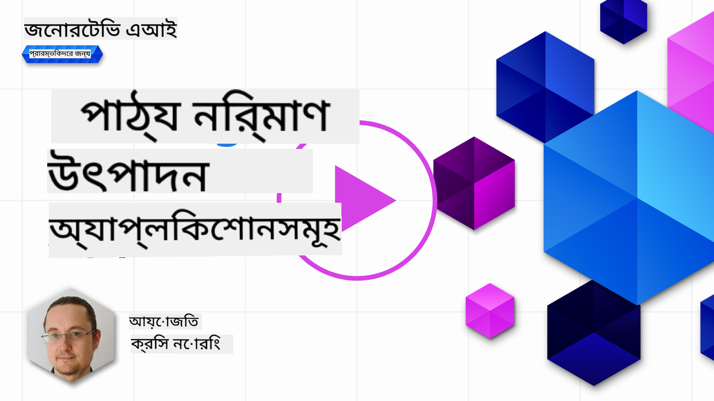

<!--
CO_OP_TRANSLATOR_METADATA:
{
  "original_hash": "00e33cd3ff945511446ecda4a9f8a828",
  "translation_date": "2025-10-17T14:49:33+00:00",
  "source_file": "06-text-generation-apps/README.md",
  "language_code": "bn"
}
-->
# টেক্সট জেনারেশন অ্যাপ্লিকেশন তৈরি করা

[](https://youtu.be/0Y5Luf5sRQA?si=t_xVg0clnAI4oUFZ)

> _(উপরের ছবিতে ক্লিক করে এই পাঠের ভিডিও দেখুন)_

এই পাঠ্যক্রমে আপনি ইতিমধ্যে দেখেছেন যে প্রম্পটের মতো মূল ধারণাগুলি এবং এমনকি "প্রম্পট ইঞ্জিনিয়ারিং" নামে একটি সম্পূর্ণ শাখা রয়েছে। অনেক টুল যেমন ChatGPT, Office 365, Microsoft Power Platform এবং আরও অনেক কিছু আপনাকে প্রম্পট ব্যবহার করে কিছু অর্জন করতে সহায়তা করে।

আপনার অ্যাপে এমন অভিজ্ঞতা যোগ করতে হলে, আপনাকে প্রম্পট, কমপ্লিশন এবং কাজ করার জন্য একটি লাইব্রেরি নির্বাচন করার মতো ধারণাগুলি বুঝতে হবে। এই অধ্যায়ে আপনি ঠিক সেটাই শিখবেন।

## পরিচিতি

এই অধ্যায়ে, আপনি:

- openai লাইব্রেরি এবং এর মূল ধারণাগুলি সম্পর্কে শিখবেন।
- openai ব্যবহার করে একটি টেক্সট জেনারেশন অ্যাপ তৈরি করবেন।
- প্রম্পট, টেম্পারেচার এবং টোকেনের মতো ধারণাগুলি ব্যবহার করে কীভাবে একটি টেক্সট জেনারেশন অ্যাপ তৈরি করবেন তা বুঝবেন।

## শেখার লক্ষ্য

এই পাঠ শেষে, আপনি সক্ষম হবেন:

- টেক্সট জেনারেশন অ্যাপ কী তা ব্যাখ্যা করতে।
- openai ব্যবহার করে একটি টেক্সট জেনারেশন অ্যাপ তৈরি করতে।
- আপনার অ্যাপটি আরও বা কম টোকেন ব্যবহার করতে এবং টেম্পারেচার পরিবর্তন করতে কনফিগার করতে, যাতে বিভিন্ন আউটপুট পাওয়া যায়।

## টেক্সট জেনারেশন অ্যাপ কী?

সাধারণত যখন আপনি একটি অ্যাপ তৈরি করেন, তখন এর একটি ইন্টারফেস থাকে যা নিম্নলিখিতগুলির মতো:

- কমান্ড-ভিত্তিক। কনসোল অ্যাপগুলি সাধারণত এমন অ্যাপ যেখানে আপনি একটি কমান্ড টাইপ করেন এবং এটি একটি কাজ সম্পন্ন করে। উদাহরণস্বরূপ, `git` একটি কমান্ড-ভিত্তিক অ্যাপ।
- ইউজার ইন্টারফেস (UI)। কিছু অ্যাপে গ্রাফিকাল ইউজার ইন্টারফেস (GUI) থাকে যেখানে আপনি বোতাম ক্লিক করেন, টেক্সট ইনপুট করেন, অপশন নির্বাচন করেন এবং আরও অনেক কিছু।

### কনসোল এবং UI অ্যাপ সীমাবদ্ধ

একটি কমান্ড-ভিত্তিক অ্যাপের সাথে তুলনা করুন যেখানে আপনি একটি কমান্ড টাইপ করেন:

- **এটি সীমাবদ্ধ**। আপনি যেকোনো কমান্ড টাইপ করতে পারবেন না, শুধুমাত্র অ্যাপটি যে কমান্ডগুলি সমর্থন করে।
- **ভাষা নির্দিষ্ট**। কিছু অ্যাপ অনেক ভাষা সমর্থন করে, তবে ডিফল্টভাবে অ্যাপটি একটি নির্দিষ্ট ভাষার জন্য তৈরি করা হয়, যদিও আপনি আরও ভাষা সমর্থন যোগ করতে পারেন।

### টেক্সট জেনারেশন অ্যাপের সুবিধা

তাহলে একটি টেক্সট জেনারেশন অ্যাপ কীভাবে আলাদা?

একটি টেক্সট জেনারেশন অ্যাপে আপনার আরও নমনীয়তা থাকে, আপনি একটি নির্দিষ্ট কমান্ড সেট বা একটি নির্দিষ্ট ইনপুট ভাষার মধ্যে সীমাবদ্ধ নন। পরিবর্তে, আপনি প্রাকৃতিক ভাষা ব্যবহার করে অ্যাপের সাথে যোগাযোগ করতে পারেন। আরেকটি সুবিধা হল আপনি ইতিমধ্যে একটি ডেটা সোর্সের সাথে যোগাযোগ করছেন যা বিশাল তথ্যের উপর প্রশিক্ষিত হয়েছে, যেখানে একটি প্রচলিত অ্যাপ শুধুমাত্র একটি ডাটাবেসে থাকা তথ্যের উপর সীমাবদ্ধ হতে পারে।

### টেক্সট জেনারেশন অ্যাপ দিয়ে কী তৈরি করা যায়?

অনেক কিছু তৈরি করা সম্ভব। উদাহরণস্বরূপ:

- **একটি চ্যাটবট**। একটি চ্যাটবট যা আপনার কোম্পানি এবং এর পণ্য সম্পর্কে প্রশ্নের উত্তর দিতে পারে।
- **সহকারী**। LLMs টেক্সট সারাংশ তৈরি করা, টেক্সট থেকে অন্তর্দৃষ্টি পাওয়া, রিজিউমের মতো টেক্সট তৈরি করা ইত্যাদির ক্ষেত্রে চমৎকার।
- **কোড সহকারী**। আপনি যে ভাষার মডেল ব্যবহার করেন তার উপর নির্ভর করে, আপনি একটি কোড সহকারী তৈরি করতে পারেন যা আপনাকে কোড লিখতে সাহায্য করে। উদাহরণস্বরূপ, আপনি GitHub Copilot এবং ChatGPT-এর মতো পণ্য ব্যবহার করতে পারেন।

## কীভাবে শুরু করবেন?

আপনাকে একটি LLM-এর সাথে ইন্টিগ্রেট করার একটি উপায় খুঁজে বের করতে হবে, যা সাধারণত নিম্নলিখিত দুটি পদ্ধতির অন্তর্ভুক্ত:

- একটি API ব্যবহার করুন। এখানে আপনি আপনার প্রম্পট দিয়ে ওয়েব রিকোয়েস্ট তৈরি করছেন এবং জেনারেটেড টেক্সট ফিরে পাচ্ছেন।
- একটি লাইব্রেরি ব্যবহার করুন। লাইব্রেরিগুলি API কলগুলিকে সহজতর করে এবং ব্যবহার করা সহজ করে তোলে।

## লাইব্রেরি/SDKs

LLM-এর সাথে কাজ করার জন্য কয়েকটি সুপরিচিত লাইব্রেরি রয়েছে যেমন:

- **openai**, এই লাইব্রেরি আপনার মডেলের সাথে সংযোগ স্থাপন এবং প্রম্পট পাঠানোর কাজ সহজ করে।

তারপর এমন কিছু লাইব্রেরি রয়েছে যা উচ্চতর স্তরে কাজ করে যেমন:

- **Langchain**। Langchain সুপরিচিত এবং এটি পাইথন সমর্থন করে।
- **Semantic Kernel**। Semantic Kernel Microsoft-এর একটি লাইব্রেরি যা C#, Python এবং Java ভাষা সমর্থন করে।

## openai ব্যবহার করে প্রথম অ্যাপ

চলুন দেখি কীভাবে আমরা আমাদের প্রথম অ্যাপ তৈরি করতে পারি, কী লাইব্রেরি দরকার, কতটা প্রয়োজন ইত্যাদি।

### openai ইনস্টল করুন

OpenAI বা Azure OpenAI-এর সাথে ইন্টারঅ্যাক্ট করার জন্য অনেক লাইব্রেরি রয়েছে। C#, Python, JavaScript, Java এবং আরও অনেক প্রোগ্রামিং ভাষা ব্যবহার করাও সম্ভব। আমরা `openai` পাইথন লাইব্রেরি ব্যবহার করতে বেছে নিয়েছি, তাই আমরা `pip` ব্যবহার করে এটি ইনস্টল করব।

```bash
pip install openai
```

### একটি রিসোর্স তৈরি করুন

আপনাকে নিম্নলিখিত পদক্ষেপগুলি সম্পন্ন করতে হবে:

- Azure-এ একটি অ্যাকাউন্ট তৈরি করুন [https://azure.microsoft.com/free/](https://azure.microsoft.com/free/?WT.mc_id=academic-105485-koreyst)।
- Azure OpenAI-তে অ্যাক্সেস পান। [https://learn.microsoft.com/azure/ai-services/openai/overview#how-do-i-get-access-to-azure-openai](https://learn.microsoft.com/azure/ai-services/openai/overview#how-do-i-get-access-to-azure-openai?WT.mc_id=academic-105485-koreyst) এ যান এবং অ্যাক্সেসের জন্য অনুরোধ করুন।

  > [!NOTE]
  > লেখার সময়, Azure OpenAI-তে অ্যাক্সেসের জন্য আবেদন করতে হবে।

- Python ইনস্টল করুন <https://www.python.org/>
- একটি Azure OpenAI Service রিসোর্স তৈরি করুন। [রিসোর্স তৈরি করার](https://learn.microsoft.com/azure/ai-services/openai/how-to/create-resource?pivots=web-portal?WT.mc_id=academic-105485-koreyst) গাইডটি দেখুন।

### API কী এবং এন্ডপয়েন্ট খুঁজুন

এখন আপনাকে আপনার `openai` লাইব্রেরিকে কোন API কী ব্যবহার করতে হবে তা জানাতে হবে। আপনার API কী খুঁজতে, Azure OpenAI রিসোর্সের "Keys and Endpoint" বিভাগে যান এবং "Key 1" মানটি কপি করুন।


এখন আপনি এই তথ্যটি কপি করেছেন, চলুন লাইব্রেরিগুলিকে এটি ব্যবহার করতে নির্দেশনা দিই।

> [!NOTE]
> আপনার API কীটি আপনার কোড থেকে আলাদা রাখা মূল্যবান। আপনি পরিবেশ ভেরিয়েবল ব্যবহার করে এটি করতে পারেন।
>
> - পরিবেশ ভেরিয়েবল `OPENAI_API_KEY`-কে আপনার API কীতে সেট করুন।
>   `export OPENAI_API_KEY='sk-...'`

### Azure কনফিগারেশন সেটআপ করুন

আপনি যদি Azure OpenAI ব্যবহার করেন, তাহলে এখানে কনফিগারেশন সেটআপ করার উপায়:

```python
openai.api_type = 'azure'
openai.api_key = os.environ["OPENAI_API_KEY"]
openai.api_version = '2023-05-15'
openai.api_base = os.getenv("API_BASE")
```

উপরে আমরা নিম্নলিখিত সেট করছি:

- `api_type` কে `azure`। এটি লাইব্রেরিকে জানায় যে Azure OpenAI ব্যবহার করতে হবে, OpenAI নয়।
- `api_key`, এটি আপনার Azure পোর্টালে পাওয়া API কী।
- `api_version`, এটি API-এর সংস্করণ যা আপনি ব্যবহার করতে চান। লেখার সময়, সর্বশেষ সংস্করণটি `2023-05-15`।
- `api_base`, এটি API-এর এন্ডপয়েন্ট। আপনি এটি Azure পোর্টালে আপনার API কী-এর পাশে খুঁজে পেতে পারেন।

> [!NOTE] > `os.getenv` একটি ফাংশন যা পরিবেশ ভেরিয়েবল পড়ে। আপনি এটি ব্যবহার করে পরিবেশ ভেরিয়েবল যেমন `OPENAI_API_KEY` এবং `API_BASE` পড়তে পারেন। আপনার টার্মিনালে এই পরিবেশ ভেরিয়েবলগুলি সেট করুন বা `dotenv` এর মতো একটি লাইব্রেরি ব্যবহার করে।

## টেক্সট জেনারেট করুন

টেক্সট জেনারেট করার উপায় হল `Completion` ক্লাস ব্যবহার করা। এখানে একটি উদাহরণ:

```python
prompt = "Complete the following: Once upon a time there was a"

completion = openai.Completion.create(model="davinci-002", prompt=prompt)
print(completion.choices[0].text)
```

উপরের কোডে, আমরা একটি কমপ্লিশন অবজেক্ট তৈরি করি এবং আমরা যে মডেলটি ব্যবহার করতে চাই এবং প্রম্পটটি পাস করি। তারপর আমরা জেনারেটেড টেক্সটটি প্রিন্ট করি।

### চ্যাট কমপ্লিশন

এখন পর্যন্ত, আপনি দেখেছেন কীভাবে আমরা টেক্সট জেনারেট করতে `Completion` ব্যবহার করেছি। তবে আরেকটি ক্লাস রয়েছে `ChatCompletion` যা চ্যাটবটের জন্য আরও উপযুক্ত। এটি ব্যবহার করার একটি উদাহরণ এখানে:

```python
import openai

openai.api_key = "sk-..."

completion = openai.ChatCompletion.create(model="gpt-3.5-turbo", messages=[{"role": "user", "content": "Hello world"}])
print(completion.choices[0].message.content)
```

এই কার্যকারিতা সম্পর্কে আরও একটি আসন্ন অধ্যায়ে।

## অনুশীলন - আপনার প্রথম টেক্সট জেনারেশন অ্যাপ

এখন আমরা শিখেছি কীভাবে openai সেটআপ এবং কনফিগার করতে হয়, এটি আপনার প্রথম টেক্সট জেনারেশন অ্যাপ তৈরি করার সময়। আপনার অ্যাপ তৈরি করতে, এই পদক্ষেপগুলি অনুসরণ করুন:

1. একটি ভার্চুয়াল এনভায়রনমেন্ট তৈরি করুন এবং openai ইনস্টল করুন:

   ```bash
   python -m venv venv
   source venv/bin/activate
   pip install openai
   ```

   > [!NOTE]
   > আপনি যদি Windows ব্যবহার করেন তবে `venv\Scripts\activate` টাইপ করুন, `source venv/bin/activate` এর পরিবর্তে।

   > [!NOTE]
   > আপনার Azure OpenAI কীটি খুঁজে পেতে [https://portal.azure.com/](https://portal.azure.com/?WT.mc_id=academic-105485-koreyst) এ যান এবং `Open AI` অনুসন্ধান করুন এবং `Open AI resource` নির্বাচন করুন এবং তারপর `Keys and Endpoint` নির্বাচন করুন এবং `Key 1` মানটি কপি করুন।

1. একটি _app.py_ ফাইল তৈরি করুন এবং এতে নিম্নলিখিত কোড দিন:

   ```python
   import openai

   openai.api_key = "<replace this value with your open ai key or Azure OpenAI key>"

   openai.api_type = 'azure'
   openai.api_version = '2023-05-15'
   openai.api_base = "<endpoint found in Azure Portal where your API key is>"
   deployment_name = "<deployment name>"

   # add your completion code
   prompt = "Complete the following: Once upon a time there was a"
   messages = [{"role": "user", "content": prompt}]

   # make completion
   completion = openai.chat.completions.create(model=deployment_name, messages=messages)

   # print response
   print(completion.choices[0].message.content)
   ```

   > [!NOTE]
   > আপনি যদি Azure OpenAI ব্যবহার করেন, তাহলে আপনাকে `api_type` কে `azure` এবং `api_key` কে আপনার Azure OpenAI কীতে সেট করতে হবে।

   আপনি নিম্নলিখিত আউটপুট দেখতে পাবেন:

   ```output
    very unhappy _____.

   Once upon a time there was a very unhappy mermaid.
   ```

## বিভিন্ন ধরণের প্রম্পট, বিভিন্ন কাজের জন্য

এখন আপনি দেখেছেন কীভাবে একটি প্রম্পট ব্যবহার করে টেক্সট জেনারেট করতে হয়। আপনার এমন একটি প্রোগ্রামও রয়েছে যা আপনি পরিবর্তন এবং পরিবর্তন করতে পারেন বিভিন্ন ধরণের টেক্সট জেনারেট করার জন্য।

প্রম্পট বিভিন্ন ধরণের কাজের জন্য ব্যবহার করা যেতে পারে। উদাহরণস্বরূপ:

- **একটি নির্দিষ্ট ধরণের টেক্সট জেনারেট করুন**। উদাহরণস্বরূপ, আপনি একটি কবিতা, কুইজের জন্য প্রশ্ন ইত্যাদি জেনারেট করতে পারেন।
- **তথ্য অনুসন্ধান করুন**। আপনি প্রম্পট ব্যবহার করে তথ্য অনুসন্ধান করতে পারেন যেমন 'ওয়েব ডেভেলপমেন্টে CORS কী বোঝায়?'।
- **কোড জেনারেট করুন**। আপনি প্রম্পট ব্যবহার করে কোড জেনারেট করতে পারেন, যেমন ইমেইল যাচাই করার জন্য একটি নিয়মিত এক্সপ্রেশন তৈরি করা বা একটি সম্পূর্ণ প্রোগ্রাম তৈরি করা, যেমন একটি ওয়েব অ্যাপ।

## একটি আরও বাস্তব ব্যবহার: একটি রেসিপি জেনারেটর

ধরুন আপনার বাড়িতে কিছু উপাদান রয়েছে এবং আপনি কিছু রান্না করতে চান। এর জন্য, আপনার একটি রেসিপি দরকার। রেসিপি খুঁজে পাওয়ার একটি উপায় হল একটি সার্চ ইঞ্জিন ব্যবহার করা বা আপনি একটি LLM ব্যবহার করতে পারেন।

আপনি এমন একটি প্রম্পট লিখতে পারেন:

> "চিকেন, আলু এবং গাজর দিয়ে একটি ডিশের জন্য ৫টি রেসিপি দেখান। প্রতি রেসিপিতে ব্যবহৃত সমস্ত উপাদানের তালিকা দিন।"

উপরের প্রম্পটটি দেওয়া হলে, আপনি সম্ভবত এরকম একটি উত্তর পাবেন:

```output
1. Roasted Chicken and Vegetables:
Ingredients:
- 4 chicken thighs
- 2 potatoes, cut into cubes
- 2 carrots, cut into cubes
- 2 tablespoons olive oil
- 2 cloves garlic, minced
- 1 teaspoon dried thyme
- 1 teaspoon dried oregano
- Salt and pepper, to taste

2. Chicken and Potato Stew:
Ingredients:
- 2 tablespoons olive oil
- 1 onion, diced
- 2 cloves garlic, minced
- 2 chicken breasts, cut into cubes
- 2 potatoes, cut into cubes
- 2 carrots, cut into cubes
- 1 teaspoon dried oregano
- 1 teaspoon dried thyme
- 1 cup chicken broth
- Salt and pepper, to taste

3. Chicken and Potato Bake:
Ingredients:
- 2 tablespoons olive oil
- 2 chicken breasts, cut into cubes
- 2 potatoes, cut into cubes
- 2 carrots, cut into cubes
- 1 onion, diced
- 2 cloves garlic, minced
- 1 teaspoon dried oregano
- 1 teaspoon dried thyme
- 1 cup chicken broth
- Salt and pepper, to taste

4. Chicken and Potato Soup:
Ingredients:
- 2 tablespoons olive oil
- 1 onion, diced
- 2 cloves garlic, minced
- 2 chicken breasts, cut into cubes
- 2 potatoes, cut into cubes
- 2 carrots, cut into cubes
- 1 teaspoon dried oregano
- 1 teaspoon dried thyme
- 4 cups chicken broth
- Salt and pepper, to taste

5. Chicken and Potato Hash:
Ingredients:
- 2 tablespoons olive oil
- 2 chicken breasts, cut into cubes
- 2 potatoes, cut into cubes
- 2 carrots, cut into cubes
- 1 onion, diced
- 2 cloves garlic, minced
- 1 teaspoon dried oregano
```

এই ফলাফলটি চমৎকার, আমি জানি কী রান্না করব। এই পর্যায়ে, যা দরকার তা হল:

- আমি যা পছন্দ করি না বা যার প্রতি আমি অ্যালার্জিক তা বাদ দেওয়া।
- একটি শপিং লিস্ট তৈরি করা, যদি আমার বাড়িতে সমস্ত উপাদান না থাকে।

উপরের ক্ষেত্রে, চলুন একটি অতিরিক্ত প্রম্পট যোগ করি:

> "দয়া করে রসুনযুক্ত রেসিপিগুলি সরিয়ে দিন কারণ আমি অ্যালার্জিক এবং এটি অন্য কিছু দিয়ে প্রতিস্থাপন করুন। এছাড়াও, রেসিপিগুলির জন্য একটি শপিং লিস্ট তৈরি করুন, বিবেচনা করে যে আমার বাড়িতে ইতিমধ্যে চিকেন, আলু এবং গাজর রয়েছে।"

এখন আপনি একটি নতুন ফলাফল পাবেন, যথা:

```output
1. Roasted Chicken and Vegetables:
Ingredients:
- 4 chicken thighs
- 2 potatoes, cut into cubes
- 2 carrots, cut into cubes
- 2 tablespoons olive oil
- 1 teaspoon dried thyme
- 1 teaspoon dried oregano
- Salt and pepper, to taste

2. Chicken and Potato Stew:
Ingredients:
- 2 tablespoons olive oil
- 1 onion, diced
- 2 chicken breasts, cut into cubes
- 2 potatoes, cut into cubes
- 2 carrots, cut into cubes
- 1 teaspoon dried oregano
- 1 teaspoon dried thyme
- 1 cup chicken broth
- Salt and pepper, to taste

3. Chicken and Potato Bake:
Ingredients:
- 2 tablespoons olive oil
- 2 chicken breasts, cut into cubes
- 2 potatoes, cut into cubes
- 2 carrots, cut into cubes
- 1 onion, diced
- 1 teaspoon dried oregano
- 1 teaspoon dried thyme
- 1 cup chicken broth
- Salt and pepper, to taste

4. Chicken and Potato Soup:
Ingredients:
- 2 tablespoons olive oil
- 1 onion, diced
- 2 chicken breasts, cut into cubes
- 2 potatoes, cut into cubes
- 2 carrots, cut into cubes
- 1 teaspoon dried oregano
- 1 teaspoon dried thyme
- 4 cups chicken broth
- Salt and pepper, to taste

5. Chicken and Potato Hash:
Ingredients:
- 2 tablespoons olive oil
- 2 chicken breasts, cut into cubes
- 2 potatoes, cut into cubes
- 2 carrots, cut into cubes
- 1 onion, diced
- 1 teaspoon dried oregano

Shopping List:
- Olive oil
- Onion
- Thyme
- Oregano
- Salt
- Pepper
```

এটি আপনার পাঁচটি রেসিপি, যেখানে রসুন উল্লেখ নেই এবং আপনার কাছে একটি শপিং লিস্টও রয়েছে যা আপনার বাড়িতে ইতিমধ্যে যা আছে তা বিবেচনা করে।

## অনুশীলন - একটি রেসিপি জেনারেটর তৈরি করুন

এখন আমরা একটি পরিস্থিতি দেখেছি, চলুন প্রদর্শিত পরিস্থিতির সাথে মিলে কোড লিখি। এটি করতে, এই পদক্ষেপগুলি অনুসরণ করুন:

1. বিদ্যমান _app.py_ ফাইলটি একটি সূচনা পয়েন্ট হিসাবে ব্যবহার করুন।
1. `prompt` ভেরিয়েবলটি খুঁজুন এবং এর কোডটি নিম্নলিখিতটিতে পরিবর্তন করুন:

   ```python
   prompt = "Show me 5 recipes for a dish with the following ingredients: chicken, potatoes, and carrots. Per recipe, list all the ingredients used"
   ```

   এখন যদি আপনি কোডটি চালান, আপনি এরকম একটি আউটপুট দেখতে পাবেন:

   ```output
   -Chicken Stew with Potatoes and Carrots: 3 tablespoons oil, 1 onion, chopped, 2 cloves garlic, minced, 1 carrot, peeled and chopped, 1 potato, peeled and chopped, 1 bay leaf, 1 thyme sprig, 1/2 teaspoon salt, 1/4 teaspoon black pepper, 1 1/2 cups chicken broth, 1/2 cup dry white wine, 2 tablespoons chopped fresh parsley, 2 tablespoons unsalted butter, 1 1/2 pounds boneless, skinless chicken thighs, cut into 1-inch pieces
   -Oven-Roasted Chicken with Potatoes and Carrots: 3 tablespoons extra-virgin olive oil, 1 tablespoon Dijon mustard, 1 tablespoon chopped fresh rosemary, 1 tablespoon chopped fresh thyme, 4 cloves garlic, minced, 1 1/2 pounds small red potatoes, quartered, 1 1/2 pounds carrots, quartered lengthwise, 1/2 teaspoon salt, 1/4 teaspoon black pepper, 1 (4-pound) whole chicken
   -Chicken, Potato, and Carrot Casserole: cooking spray, 1 large onion, chopped, 2 cloves garlic, minced, 1 carrot, peeled and shredded, 1 potato, peeled and shredded, 1/2 teaspoon dried thyme leaves, 1/4 teaspoon salt, 1/4 teaspoon black pepper, 2 cups fat-free, low-sodium chicken broth, 1 cup frozen peas, 1/4 cup all-purpose flour, 1 cup 2% reduced-fat milk, 1/4 cup grated Parmesan cheese

   -One Pot Chicken and Potato Dinner: 2 tablespoons olive oil, 1 pound boneless, skinless chicken thighs, cut into 1-inch pieces, 1 large onion, chopped, 3 cloves garlic, minced, 1 carrot, peeled and chopped, 1 potato, peeled and chopped, 1 bay leaf, 1 thyme sprig, 1/2 teaspoon salt, 1/4 teaspoon black pepper, 2 cups chicken broth, 1/2 cup dry white wine

   -Chicken, Potato, and Carrot Curry: 1 tablespoon vegetable oil, 1 large onion, chopped, 2 cloves garlic, minced, 1 carrot, peeled and chopped, 1 potato, peeled and chopped, 1 teaspoon ground coriander, 1 teaspoon ground cumin, 1/2 teaspoon ground turmeric, 1/2 teaspoon ground ginger, 1/4 teaspoon cayenne pepper, 2 cups chicken broth, 1/2 cup dry white wine, 1 (15-ounce) can chickpeas, drained and rinsed, 1/2 cup raisins, 1/2 cup chopped fresh cilantro
   ```

   > NOTE, আপনার LLM অ-নির্ধারিত, তাই আপনি প্রতিবার প্রোগ্রাম চালানোর সময় বিভিন্ন ফলাফল পেতে পারেন।

   চমৎকার, চলুন দেখি কীভাবে আমরা জিনিসগুলি উন্নত করতে পারি। জিনিসগুলি উন্নত করতে, আমরা নিশ্চিত করতে চাই যে কোডটি নমনীয়, যাতে উপাদান এবং রেসিপির সংখ্যা উন্নত এবং পরিবর্তন করা যায়।

1. চলুন কোডটি নিম্নলিখিতভাবে পরিবর্তন করি:

   ```python
   no_recipes = input("No of recipes (for example, 5): ")

   ingredients = input("List of ingredients (for example, chicken, potatoes, and carrots): ")

   # interpolate the number of recipes into the prompt an ingredients
   prompt = f"Show me {no_recipes} recipes for a dish with the following ingredients: {ingredients}. Per recipe, list all the ingredients used"
   ```

   কোডটি পরীক্ষা করার সময়, এটি এরকম দেখতে পারে:

   ```output
   No of recipes (for example, 5): 3
   List of ingredients (for example, chicken, potatoes, and carrots): milk,strawberries

   -Strawberry milk shake: milk, strawberries, sugar, vanilla extract, ice cubes
   -Strawberry shortcake: milk, flour, baking powder, sugar, salt, unsalted butter, strawberries, whipped cream
   -Strawberry milk: milk, strawberries, sugar, vanilla extract
   ```

### ফিল্টার এবং শপিং লিস্ট যোগ করে উন্নতি করুন

এখন আমাদের একটি কার্যকরী অ্যাপ রয়েছে যা রেসিপি তৈরি করতে সক্ষম এবং এটি নমনীয় কারণ এটি ব্যবহারকারীর ইনপুটের উপর নির্ভর করে, রেসিপির সংখ্যা এবং ব্যবহৃত উপাদান উভয় ক্ষেত্রেই।

এটি আরও উন্নত করতে, আমরা নিম্নলিখিতগুলি যোগ করতে চাই:

- **উপাদানগুলি ফিল্টার করুন**। আমরা এমন উপাদানগুলি ফিল্টার করতে চাই যা আমরা পছন্দ করি না বা যার প্রতি আমরা অ্যালার্জিক। এই পরিবর্তনটি সম্পন্ন করতে, আমরা আমাদের বিদ্যমান প্রম্পটটি সম্পাদনা করতে পারি এবং এর শেষে একটি ফিল্টার শর্ত যোগ করতে পারি:

  ```python
  filter = input("Filter (for example, vegetarian, vegan, or gluten-free): ")

  prompt = f"Show me {no_recipes} recipes for a dish with the following ingredients: {ingredients}. Per recipe, list all the ingredients used, no {filter}"
  ```

  উপরে, আমরা প্রম্পটের শেষে `{filter}` যোগ করেছি এবং আমরা ব্যবহারকারীর কাছ থেকে ফিল্টার মানটি সংগ্রহ করেছি।

  প্রোগ্রাম চালানোর একটি উদাহরণ ইনপুট এখন এরকম দেখতে পারে:

  ```output
  No of recipes (for example, 5): 3
  List of ingredients (for example, chicken, potatoes, and carrots): onion,milk
  Filter (for example, vegetarian, vegan, or gluten-free): no milk

  1. French Onion Soup

  Ingredients:

  -1 large onion, sliced
  -3 cups beef broth
  -1 cup milk
  -6 slices french bread
  -1/4 cup shredded Parmesan cheese
  -1 tablespoon butter
  -1 teaspoon dried thyme
  -1/4 teaspoon salt
  -1/4 teaspoon black pepper

  Instructions:

  1. In a large pot, sauté onions in butter until golden brown.
  2. Add beef broth, milk, thyme, salt, and pepper. Bring to a boil.
  3. Reduce heat and simmer for 10 minutes.
  4. Place french bread slices on soup bowls.
  5. Ladle soup over bread.
  6. Sprinkle with Parmesan cheese.

  2. Onion and Potato Soup

  Ingredients:

  -1 large onion, chopped
  -2 cups potatoes, diced
  -3 cups vegetable broth
  -1 cup milk
  -1/4 teaspoon black pepper

  Instructions:

  1. In a large pot, sauté onions in butter until golden brown.
  2. Add potatoes, vegetable broth, milk, and pepper. Bring to a boil.
  3. Reduce heat and simmer for 10 minutes.
  4. Serve hot.

  3. Creamy Onion Soup

  Ingredients:

  -1 large onion, chopped
  -3 cups vegetable broth
  -1 cup milk
  -1/4 teaspoon black pepper
  -1/4 cup all-purpose flour
  -1/2 cup shredded Parmesan cheese

  Instructions:

  1. In a large pot, sauté onions in butter until golden brown.
  2. Add vegetable broth, milk, and pepper. Bring to a boil.
  3. Reduce heat and simmer for 10 minutes.
  4. In a small bowl, whisk together flour and Parmesan cheese until smooth.
  5. Add to soup and simmer for an additional 5 minutes, or until soup has thickened.
  ```

  আপনি দেখতে পাচ্ছেন, দুধযুক্ত কোনো রেসিপি ফিল্টার করা হয়েছে। তবে, যদি আপনি ল্যাকটোজ অসহিষ্ণু হন, তাহলে আপনি হয়তো চিজযুক্ত রেসিপিগুলিও ফিল্টার করতে চাইবেন, তাই স্পষ্ট হওয়া দরকার।

- **একটি শপিং লিস্ট তৈরি করুন**। আমরা একটি শপিং লিস্ট তৈরি করতে চাই, যা আমাদের বাড়িতে ইতিমধ্যে যা আছে তা বিবেচনা করে।

  এই কার্যকারিতার জন্য, আমরা হয়তো সবকিছু এক প্রম্পটে সমাধান করার চেষ্টা করতে পারি অথবা আমরা এটি দুটি প্রম্পটে ভাগ করতে পারি। চলুন দ্বিতীয় পদ্ধতিটি চেষ্টা করি। এখানে আমরা একটি অতিরিক্ত প্রম্পট যোগ করার পরামর্শ দিচ্ছি, তবে এটি কাজ করার জন্য, আমাদের পূর্ববর্তী প্রম্পটের ফলাফলটি পরবর্তী প্রম্পটের প্রসঙ্গ হিসাবে যোগ করতে হবে।
কোডের সেই অংশটি খুঁজে বের করুন যা প্রথম প্রম্পটের ফলাফল প্রিন্ট করে এবং নিচের কোডটি যোগ করুন:

  ```python
  old_prompt_result = completion.choices[0].message.content
  prompt = "Produce a shopping list for the generated recipes and please don't include ingredients that I already have."

  new_prompt = f"{old_prompt_result} {prompt}"
  messages = [{"role": "user", "content": new_prompt}]
  completion = openai.Completion.create(engine=deployment_name, messages=messages, max_tokens=1200)

  # print response
  print("Shopping list:")
  print(completion.choices[0].message.content)
  ```

নিম্নলিখিত বিষয়গুলো লক্ষ্য করুন:

1. আমরা একটি নতুন প্রম্পট তৈরি করছি, যেখানে প্রথম প্রম্পটের ফলাফল নতুন প্রম্পটে যোগ করা হচ্ছে:

     ```python
     new_prompt = f"{old_prompt_result} {prompt}"
     ```

1. আমরা একটি নতুন অনুরোধ করছি, তবে প্রথম প্রম্পটে আমরা যত টোকেন চেয়েছিলাম তা বিবেচনা করে, এইবার আমরা `max_tokens` 1200 বলে দিচ্ছি।

     ```python
     completion = openai.Completion.create(engine=deployment_name, prompt=new_prompt, max_tokens=1200)
     ```

এই কোডটি চালিয়ে দেখলে আমরা এখন নিম্নলিখিত আউটপুটে পৌঁছাই:

     ```output
     No of recipes (for example, 5): 2
     List of ingredients (for example, chicken, potatoes, and carrots): apple,flour
     Filter (for example, vegetarian, vegan, or gluten-free): sugar


     -Apple and flour pancakes: 1 cup flour, 1/2 tsp baking powder, 1/2 tsp baking soda, 1/4 tsp salt, 1 tbsp sugar, 1 egg, 1 cup buttermilk or sour milk, 1/4 cup melted butter, 1 Granny Smith apple, peeled and grated
     -Apple fritters: 1-1/2 cups flour, 1 tsp baking powder, 1/4 tsp salt, 1/4 tsp baking soda, 1/4 tsp nutmeg, 1/4 tsp cinnamon, 1/4 tsp allspice, 1/4 cup sugar, 1/4 cup vegetable shortening, 1/4 cup milk, 1 egg, 2 cups shredded, peeled apples
     Shopping list:
     -Flour, baking powder, baking soda, salt, sugar, egg, buttermilk, butter, apple, nutmeg, cinnamon, allspice
     ```

## আপনার সেটআপ উন্নত করুন

এখন পর্যন্ত আমাদের কাছে এমন কোড আছে যা কাজ করে, তবে কিছু পরিবর্তন করলে এটি আরও উন্নত হতে পারে। কিছু বিষয় যা আমাদের করা উচিত:

- **কোড থেকে সিক্রেট আলাদা করুন**, যেমন API key। সিক্রেট কোডে থাকা উচিত নয় এবং এটি একটি নিরাপদ স্থানে সংরক্ষণ করা উচিত। সিক্রেটকে কোড থেকে আলাদা করতে, আমরা পরিবেশ ভেরিয়েবল এবং `python-dotenv` এর মতো লাইব্রেরি ব্যবহার করতে পারি যা একটি ফাইল থেকে সেগুলো লোড করে। কোডে এটি দেখতে এমন হবে:

  1. একটি `.env` ফাইল তৈরি করুন নিম্নলিখিত বিষয়বস্তু দিয়ে:

     ```bash
     OPENAI_API_KEY=sk-...
     ```

     > লক্ষ্য করুন, Azure এর জন্য আপনাকে নিম্নলিখিত পরিবেশ ভেরিয়েবল সেট করতে হবে:

     ```bash
     OPENAI_API_TYPE=azure
     OPENAI_API_VERSION=2023-05-15
     OPENAI_API_BASE=<replace>
     ```

     কোডে, আপনি পরিবেশ ভেরিয়েবলগুলো এভাবে লোড করবেন:

     ```python
     from dotenv import load_dotenv

     load_dotenv()

     openai.api_key = os.environ["OPENAI_API_KEY"]
     ```

- **টোকেন দৈর্ঘ্য সম্পর্কে একটি কথা**। আমরা কতগুলো টোকেন ব্যবহার করব তা বিবেচনা করা উচিত যাতে আমরা আমাদের প্রয়োজনীয় টেক্সট তৈরি করতে পারি। টোকেনের খরচ হয়, তাই যেখানে সম্ভব, আমাদের টোকেনের সংখ্যা কমিয়ে অর্থনৈতিকভাবে ব্যবহার করার চেষ্টা করা উচিত। উদাহরণস্বরূপ, আমরা প্রম্পটটি এমনভাবে সাজাতে পারি যাতে কম টোকেন ব্যবহার করা যায়।

  টোকেন পরিবর্তন করতে, আপনি `max_tokens` প্যারামিটার ব্যবহার করতে পারেন। উদাহরণস্বরূপ, যদি আপনি ১০০ টোকেন ব্যবহার করতে চান, তাহলে আপনি করবেন:

  ```python
  completion = client.chat.completions.create(model=deployment, messages=messages, max_tokens=100)
  ```

- **তাপমাত্রা নিয়ে পরীক্ষা করা**। তাপমাত্রা এমন একটি বিষয় যা আমরা এখন পর্যন্ত উল্লেখ করিনি, তবে এটি আমাদের প্রোগ্রামের কার্যকারিতার জন্য গুরুত্বপূর্ণ। তাপমাত্রার মান যত বেশি হবে আউটপুট তত বেশি র‍্যান্ডম হবে। বিপরীতে, তাপমাত্রার মান যত কম হবে আউটপুট তত বেশি পূর্বানুমানযোগ্য হবে। আপনার আউটপুটে বৈচিত্র্য চান কিনা তা বিবেচনা করুন।

  তাপমাত্রা পরিবর্তন করতে, আপনি `temperature` প্যারামিটার ব্যবহার করতে পারেন। উদাহরণস্বরূপ, যদি আপনি ০.৫ তাপমাত্রা ব্যবহার করতে চান, তাহলে আপনি করবেন:

  ```python
  completion = client.chat.completions.create(model=deployment, messages=messages, temperature=0.5)
  ```

  > লক্ষ্য করুন, ১.০ এর কাছাকাছি মান হলে আউটপুট বেশি বৈচিত্র্যময় হবে।

## অ্যাসাইনমেন্ট

এই অ্যাসাইনমেন্টের জন্য, আপনি কী তৈরি করবেন তা বেছে নিতে পারেন।

কিছু পরামর্শ এখানে দেওয়া হলো:

- রেসিপি জেনারেটর অ্যাপটি আরও উন্নত করতে টুইক করুন। তাপমাত্রার মান এবং প্রম্পট নিয়ে পরীক্ষা করুন এবং দেখুন আপনি কী তৈরি করতে পারেন।
- একটি "স্টাডি বাডি" তৈরি করুন। এই অ্যাপটি একটি বিষয়ের উপর প্রশ্নের উত্তর দিতে সক্ষম হওয়া উচিত, উদাহরণস্বরূপ Python। আপনি এমন প্রম্পট রাখতে পারেন যেমন "Python এ একটি নির্দিষ্ট বিষয় কী?", অথবা আপনি এমন একটি প্রম্পট রাখতে পারেন যা বলে, একটি নির্দিষ্ট বিষয়ের জন্য কোড দেখান ইত্যাদি।
- ইতিহাস বট, ইতিহাসকে জীবন্ত করে তুলুন, বটকে একটি নির্দিষ্ট ঐতিহাসিক চরিত্র হিসেবে নির্দেশ দিন এবং তার জীবন ও সময় সম্পর্কে প্রশ্ন করুন।

## সমাধান

### স্টাডি বাডি

নিচে একটি স্টার্টার প্রম্পট দেওয়া হলো, দেখুন আপনি এটি কীভাবে ব্যবহার করতে পারেন এবং আপনার পছন্দমতো টুইক করতে পারেন।

```text
- "You're an expert on the Python language

    Suggest a beginner lesson for Python in the following format:

    Format:
    - concepts:
    - brief explanation of the lesson:
    - exercise in code with solutions"
```

### ইতিহাস বট

এখানে কিছু প্রম্পট দেওয়া হলো যা আপনি ব্যবহার করতে পারেন:

```text
- "You are Abe Lincoln, tell me about yourself in 3 sentences, and respond using grammar and words like Abe would have used"
- "You are Abe Lincoln, respond using grammar and words like Abe would have used:

   Tell me about your greatest accomplishments, in 300 words"
```

## জ্ঞান যাচাই

তাপমাত্রা ধারণাটি কী করে?

1. এটি আউটপুট কতটা র‍্যান্ডম হবে তা নিয়ন্ত্রণ করে।
1. এটি প্রতিক্রিয়া কত বড় হবে তা নিয়ন্ত্রণ করে।
1. এটি কতগুলো টোকেন ব্যবহার করা হবে তা নিয়ন্ত্রণ করে।

## 🚀 চ্যালেঞ্জ

অ্যাসাইনমেন্টে কাজ করার সময়, তাপমাত্রা পরিবর্তন করে দেখুন, ০, ০.৫ এবং ১ সেট করে চেষ্টা করুন। মনে রাখবেন, ০ সবচেয়ে কম বৈচিত্র্যময় এবং ১ সবচেয়ে বেশি। কোন মানটি আপনার অ্যাপের জন্য সবচেয়ে ভালো কাজ করে?

## অসাধারণ কাজ! আপনার শেখা চালিয়ে যান

এই পাঠ শেষ করার পর, আমাদের [Generative AI Learning collection](https://aka.ms/genai-collection?WT.mc_id=academic-105485-koreyst) দেখুন এবং আপনার Generative AI জ্ঞানের স্তর আরও উন্নত করুন!

Lesson 7 এ যান যেখানে আমরা দেখব কীভাবে [চ্যাট অ্যাপ্লিকেশন তৈরি করা যায়](../07-building-chat-applications/README.md?WT.mc_id=academic-105485-koreyst)!

---

**অস্বীকৃতি**:  
এই নথিটি AI অনুবাদ পরিষেবা [Co-op Translator](https://github.com/Azure/co-op-translator) ব্যবহার করে অনুবাদ করা হয়েছে। আমরা যথাসাধ্য সঠিকতার জন্য চেষ্টা করি, তবে অনুগ্রহ করে মনে রাখবেন যে স্বয়ংক্রিয় অনুবাদে ত্রুটি বা অসঙ্গতি থাকতে পারে। মূল ভাষায় থাকা নথিটিকে প্রামাণিক উৎস হিসেবে বিবেচনা করা উচিত। গুরুত্বপূর্ণ তথ্যের জন্য, পেশাদার মানব অনুবাদ সুপারিশ করা হয়। এই অনুবাদ ব্যবহারের ফলে কোনো ভুল বোঝাবুঝি বা ভুল ব্যাখ্যার জন্য আমরা দায়ী থাকব না।