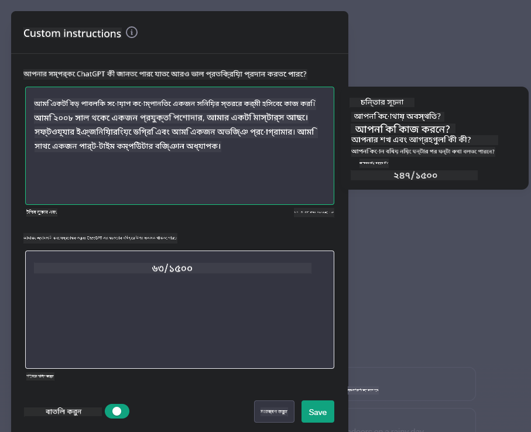

<!--
CO_OP_TRANSLATOR_METADATA:
{
  "original_hash": "a1f836db3d459bfd326b6fadca90866c",
  "translation_date": "2025-10-17T14:56:49+00:00",
  "source_file": "07-building-chat-applications/README.md",
  "language_code": "bn"
}
-->
# জেনারেটিভ এআই-চালিত চ্যাট অ্যাপ্লিকেশন তৈরি করা

[](https://youtu.be/R9V0ZY1BEQo?si=IHuU-fS9YWT8s4sA)

> _(উপরের ছবিতে ক্লিক করে এই পাঠের ভিডিও দেখুন)_

আমরা ইতিমধ্যে টেক্সট-জেনারেশন অ্যাপ তৈরি করার পদ্ধতি দেখেছি, এবার চ্যাট অ্যাপ্লিকেশন নিয়ে আলোচনা করা যাক।

চ্যাট অ্যাপ্লিকেশন আমাদের দৈনন্দিন জীবনের অংশ হয়ে উঠেছে, যা শুধু সাধারণ কথোপকথনের মাধ্যম নয়। এটি গ্রাহক সেবা, প্রযুক্তিগত সহায়তা এবং এমনকি উন্নত পরামর্শমূলক সিস্টেমের গুরুত্বপূর্ণ অংশ। সম্ভবত আপনি কিছুদিন আগেই কোনো চ্যাট অ্যাপ্লিকেশন থেকে সাহায্য পেয়েছেন। যখন আমরা এই প্ল্যাটফর্মগুলোতে জেনারেটিভ এআই-এর মতো উন্নত প্রযুক্তি সংযুক্ত করি, তখন জটিলতা যেমন বাড়ে, তেমনি চ্যালেঞ্জও বাড়ে।

কিছু প্রশ্নের উত্তর আমাদের প্রয়োজন:

- **অ্যাপ তৈরি করা**। কীভাবে আমরা দক্ষতার সাথে এই এআই-চালিত অ্যাপ্লিকেশনগুলো নির্দিষ্ট ব্যবহার ক্ষেত্রে তৈরি এবং সংযুক্ত করতে পারি?
- **পর্যবেক্ষণ**। একবার চালু করার পর, কীভাবে আমরা নিশ্চিত করব যে অ্যাপ্লিকেশনগুলো সর্বোচ্চ মানের কার্যকারিতা এবং [দায়িত্বশীল এআই-এর ছয়টি নীতিমালা](https://www.microsoft.com/ai/responsible-ai?WT.mc_id=academic-105485-koreyst) অনুসরণ করছে?

যেহেতু আমরা স্বয়ংক্রিয়তা এবং মানব-মেশিন ইন্টারঅ্যাকশনের যুগে প্রবেশ করছি, জেনারেটিভ এআই কীভাবে চ্যাট অ্যাপ্লিকেশনের পরিধি, গভীরতা এবং অভিযোজন ক্ষমতা পরিবর্তন করছে তা বোঝা অত্যন্ত গুরুত্বপূর্ণ। এই পাঠে আমরা এই জটিল সিস্টেমগুলোকে সমর্থনকারী স্থাপত্যের দিকগুলো বিশ্লেষণ করব, ডোমেইন-নির্দিষ্ট কাজের জন্য এগুলোকে সূক্ষ্মভাবে টিউন করার পদ্ধতিগুলো নিয়ে আলোচনা করব এবং দায়িত্বশীল এআই বাস্তবায়ন নিশ্চিত করার জন্য প্রাসঙ্গিক মেট্রিক এবং বিবেচনাগুলো মূল্যায়ন করব।

## পরিচিতি

এই পাঠে আলোচনা করা হবে:

- চ্যাট অ্যাপ্লিকেশন দক্ষতার সাথে তৈরি এবং সংযুক্ত করার কৌশল।
- অ্যাপ্লিকেশন কাস্টমাইজেশন এবং সূক্ষ্ম টিউনিং প্রয়োগের পদ্ধতি।
- চ্যাট অ্যাপ্লিকেশন কার্যকরভাবে পর্যবেক্ষণ করার কৌশল এবং বিবেচনা।

## শেখার লক্ষ্য

এই পাঠ শেষে আপনি:

- বিদ্যমান সিস্টেমে চ্যাট অ্যাপ্লিকেশন তৈরি এবং সংযুক্ত করার জন্য প্রয়োজনীয় বিষয়গুলো বর্ণনা করতে পারবেন।
- নির্দিষ্ট ব্যবহার ক্ষেত্রে চ্যাট অ্যাপ্লিকেশন কাস্টমাইজ করতে পারবেন।
- এআই-চালিত চ্যাট অ্যাপ্লিকেশনের মান বজায় রাখতে এবং কার্যকরভাবে পর্যবেক্ষণ করতে গুরুত্বপূর্ণ মেট্রিক এবং বিবেচনা চিহ্নিত করতে পারবেন।
- নিশ্চিত করতে পারবেন যে চ্যাট অ্যাপ্লিকেশনগুলো দায়িত্বশীলভাবে এআই ব্যবহার করছে।

## চ্যাট অ্যাপ্লিকেশনে জেনারেটিভ এআই সংযুক্ত করা

জেনারেটিভ এআই-এর মাধ্যমে চ্যাট অ্যাপ্লিকেশন উন্নত করা শুধু এগুলোকে আরও স্মার্ট করার বিষয় নয়; এটি তাদের স্থাপত্য, কার্যকারিতা এবং ব্যবহারকারীর অভিজ্ঞতা অপ্টিমাইজ করার বিষয়। এর মধ্যে স্থাপত্যের ভিত্তি, API সংযোগ এবং ব্যবহারকারীর ইন্টারফেসের বিবেচনা অন্তর্ভুক্ত। এই অংশটি আপনাকে এই জটিল ক্ষেত্রগুলোতে একটি বিস্তৃত রোডম্যাপ প্রদান করতে চায়, আপনি এগুলোকে বিদ্যমান সিস্টেমে সংযুক্ত করুন বা স্বতন্ত্র প্ল্যাটফর্ম হিসেবে তৈরি করুন।

এই অংশ শেষে, আপনি দক্ষতার সাথে চ্যাট অ্যাপ্লিকেশন তৈরি এবং সংযুক্ত করার জন্য প্রয়োজনীয় দক্ষতা অর্জন করবেন।

### চ্যাটবট নাকি চ্যাট অ্যাপ্লিকেশন?

চ্যাট অ্যাপ্লিকেশন তৈরি করার আগে, 'চ্যাটবট' এবং 'এআই-চালিত চ্যাট অ্যাপ্লিকেশন'-এর মধ্যে পার্থক্য তুলনা করা যাক, যেগুলো আলাদা ভূমিকা এবং কার্যকারিতা প্রদান করে। চ্যাটবটের প্রধান উদ্দেশ্য হলো নির্দিষ্ট কথোপকথনমূলক কাজগুলো স্বয়ংক্রিয় করা, যেমন বারবার জিজ্ঞাসিত প্রশ্নের উত্তর দেওয়া বা একটি প্যাকেজ ট্র্যাক করা। এটি সাধারণত নিয়ম-ভিত্তিক লজিক বা জটিল এআই অ্যালগরিদম দ্বারা পরিচালিত হয়। অন্যদিকে, এআই-চালিত চ্যাট অ্যাপ্লিকেশন একটি আরও বিস্তৃত পরিবেশ যা মানব ব্যবহারকারীদের মধ্যে টেক্সট, ভয়েস এবং ভিডিও চ্যাটের মতো বিভিন্ন ধরনের ডিজিটাল যোগাযোগ সহজতর করে। এর প্রধান বৈশিষ্ট্য হলো একটি জেনারেটিভ এআই মডেলের সংযুক্তি যা সূক্ষ্ম, মানবসদৃশ কথোপকথন অনুকরণ করে, বিভিন্ন ইনপুট এবং প্রাসঙ্গিক সংকেতের ভিত্তিতে প্রতিক্রিয়া তৈরি করে। একটি জেনারেটিভ এআই-চালিত চ্যাট অ্যাপ্লিকেশন ওপেন-ডোমেইন আলোচনায় অংশ নিতে পারে, পরিবর্তিত কথোপকথনের প্রেক্ষাপটে মানিয়ে নিতে পারে এবং এমনকি সৃজনশীল বা জটিল সংলাপ তৈরি করতে পারে।

নীচের টেবিলটি তাদের অনন্য ভূমিকা বুঝতে সাহায্য করার জন্য প্রধান পার্থক্য এবং সাদৃশ্যগুলো তুলে ধরে।

| চ্যাটবট                              | জেনারেটিভ এআই-চালিত চ্যাট অ্যাপ্লিকেশন |
| ------------------------------------- | -------------------------------------- |
| কাজ-কেন্দ্রিক এবং নিয়ম-ভিত্তিক        | প্রাসঙ্গিক সচেতন                       |
| সাধারণত বড় সিস্টেমে সংযুক্ত           | এক বা একাধিক চ্যাটবট হোস্ট করতে পারে   |
| প্রোগ্রাম করা কার্যকারিতায় সীমাবদ্ধ   | জেনারেটিভ এআই মডেল সংযুক্ত             |
| বিশেষায়িত ও কাঠামোবদ্ধ কথোপকথন       | ওপেন-ডোমেইন আলোচনায় সক্ষম             |

### SDK এবং API দিয়ে পূর্বনির্ধারিত কার্যকারিতা ব্যবহার করা

চ্যাট অ্যাপ্লিকেশন তৈরি করার সময়, প্রথম পদক্ষেপ হতে পারে বিদ্যমান সম্পদগুলো মূল্যায়ন করা। SDK এবং API ব্যবহার করে চ্যাট অ্যাপ্লিকেশন তৈরি করা বিভিন্ন কারণে সুবিধাজনক। ভালোভাবে ডকুমেন্টেড SDK এবং API সংযুক্ত করে, আপনি আপনার অ্যাপ্লিকেশনকে দীর্ঘমেয়াদে সফল করার জন্য কৌশলগতভাবে অবস্থান করছেন, স্কেলেবিলিটি এবং রক্ষণাবেক্ষণের বিষয়গুলো সমাধান করছেন।

- **উন্নয়ন প্রক্রিয়া দ্রুততর এবং খরচ কমানো**: নিজে থেকে কার্যকারিতা তৈরি করার ব্যয়বহুল প্রক্রিয়ার পরিবর্তে পূর্বনির্ধারিত কার্যকারিতার উপর নির্ভর করা আপনাকে আপনার অ্যাপ্লিকেশনের অন্যান্য গুরুত্বপূর্ণ দিকগুলোর উপর মনোযোগ দিতে সাহায্য করে, যেমন ব্যবসায়িক লজিক।
- **উন্নত কার্যকারিতা**: নিজে থেকে কার্যকারিতা তৈরি করার সময়, আপনি নিজেকে প্রশ্ন করবেন "এটি কীভাবে স্কেল করবে? এই অ্যাপ্লিকেশনটি কি হঠাৎ ব্যবহারকারীর প্রবাহ সামলাতে সক্ষম?" ভালোভাবে রক্ষণাবেক্ষণ করা SDK এবং API-তে এই উদ্বেগগুলোর জন্য প্রাক-নির্ধারিত সমাধান থাকে।
- **সহজ রক্ষণাবেক্ষণ**: আপডেট এবং উন্নয়ন পরিচালনা করা সহজ, কারণ বেশিরভাগ API এবং SDK-তে নতুন সংস্করণ প্রকাশিত হলে শুধু একটি লাইব্রেরি আপডেট করতে হয়।
- **সর্বাধুনিক প্রযুক্তি অ্যাক্সেস**: বিশাল ডেটাসেটে প্রশিক্ষিত এবং সূক্ষ্মভাবে টিউন করা মডেল ব্যবহার করে আপনার অ্যাপ্লিকেশনকে প্রাকৃতিক ভাষার সক্ষমতা প্রদান করা।

একটি SDK বা API-এর কার্যকারিতা অ্যাক্সেস করা সাধারণত সরবরাহকৃত পরিষেবাগুলো ব্যবহারের অনুমতি পাওয়ার মাধ্যমে সম্পন্ন হয়, যা সাধারণত একটি ইউনিক কী বা অথেন্টিকেশন টোকেনের মাধ্যমে হয়। আমরা OpenAI Python Library ব্যবহার করে এটি কীভাবে কাজ করে তা দেখব। আপনি এই পাঠের জন্য [OpenAI-এর নোটবুক](./python/oai-assignment.ipynb?WT.mc_id=academic-105485-koreyst) বা [Azure OpenAI Services-এর নোটবুক](./python/aoai-assignment.ipynb?WT.mc_id=academic-105485-koreys) এ নিজে চেষ্টা করতে পারেন।

```python
import os
from openai import OpenAI

API_KEY = os.getenv("OPENAI_API_KEY","")

client = OpenAI(
    api_key=API_KEY
    )

chat_completion = client.chat.completions.create(model="gpt-3.5-turbo", messages=[{"role": "user", "content": "Suggest two titles for an instructional lesson on chat applications for generative AI."}])
```

উপরের উদাহরণটি GPT-3.5 Turbo মডেল ব্যবহার করে প্রম্পট সম্পন্ন করে, তবে লক্ষ্য করুন যে API কী সেট করা হয়েছে। যদি আপনি কী সেট না করেন, তাহলে একটি ত্রুটি পাবেন।

## ব্যবহারকারীর অভিজ্ঞতা (UX)

সাধারণ UX নীতিগুলো চ্যাট অ্যাপ্লিকেশনের ক্ষেত্রে প্রযোজ্য, তবে মেশিন লার্নিং উপাদানগুলোর কারণে কিছু অতিরিক্ত বিবেচনা বিশেষভাবে গুরুত্বপূর্ণ হয়ে ওঠে।

- **অস্পষ্টতার সমাধানের ব্যবস্থা**: জেনারেটিভ এআই মডেল মাঝে মাঝে অস্পষ্ট উত্তর তৈরি করে। একটি ফিচার যা ব্যবহারকারীদের স্পষ্টীকরণের জন্য অনুরোধ করতে দেয়, এই সমস্যার সমাধানে সহায়ক হতে পারে।
- **প্রসঙ্গ ধরে রাখা**: উন্নত জেনারেটিভ এআই মডেল কথোপকথনের প্রসঙ্গ মনে রাখতে সক্ষম, যা ব্যবহারকারীর অভিজ্ঞতার জন্য একটি প্রয়োজনীয় সম্পদ হতে পারে। ব্যবহারকারীদের প্রসঙ্গ নিয়ন্ত্রণ এবং পরিচালনা করার ক্ষমতা দেওয়া অভিজ্ঞতা উন্নত করে, তবে সংবেদনশীল ব্যবহারকারীর তথ্য ধরে রাখার ঝুঁকি তৈরি করে। এই তথ্য কতক্ষণ ধরে রাখা হবে তা নিয়ে বিবেচনা করা, যেমন একটি রিটেনশন পলিসি প্রবর্তন করা, গোপনীয়তার বিরুদ্ধে প্রসঙ্গের প্রয়োজনীয়তার ভারসাম্য বজায় রাখতে পারে।
- **ব্যক্তিগতকরণ**: শেখার এবং মানিয়ে নেওয়ার ক্ষমতা সহ, এআই মডেল ব্যবহারকারীর জন্য একটি ব্যক্তিগত অভিজ্ঞতা প্রদান করে। ব্যবহারকারীর প্রোফাইলের মতো ফিচারের মাধ্যমে ব্যবহারকারীর অভিজ্ঞতা কাস্টমাইজ করা শুধু ব্যবহারকারীকে বোঝার অনুভূতি দেয় না, বরং তাদের নির্দিষ্ট উত্তর খুঁজে পাওয়ার প্রচেষ্টাকে আরও কার্যকর এবং সন্তোষজনক করে তোলে।

ব্যক্তিগতকরণের একটি উদাহরণ হলো OpenAI-এর ChatGPT-তে "কাস্টম ইনস্ট্রাকশন" সেটিংস। এটি আপনাকে আপনার প্রম্পটের জন্য গুরুত্বপূর্ণ প্রসঙ্গ হতে পারে এমন তথ্য প্রদান করতে দেয়। এখানে একটি কাস্টম ইনস্ট্রাকশনের উদাহরণ দেওয়া হলো।



এই "প্রোফাইল" ChatGPT-কে লিঙ্কড লিস্ট নিয়ে একটি পাঠ পরিকল্পনা তৈরি করতে অনুরোধ করে। লক্ষ্য করুন যে ChatGPT ব্যবহারকারীর অভিজ্ঞতার ভিত্তিতে আরও গভীর পাঠ পরিকল্পনা তৈরি করতে পারে।


### মাইক্রোসফটের সিস্টেম মেসেজ ফ্রেমওয়ার্ক বড় ভাষার মডেলের জন্য

[মাইক্রোসফট নির্দেশনা প্রদান করেছে](https://learn.microsoft.com/azure/ai-services/openai/concepts/system-message#define-the-models-output-format?WT.mc_id=academic-105485-koreyst) LLM থেকে প্রতিক্রিয়া তৈরি করার সময় কার্যকর সিস্টেম মেসেজ লেখার জন্য, যা চারটি ক্ষেত্রে বিভক্ত:

1. মডেলটি কার জন্য, তার ক্ষমতা এবং সীমাবদ্ধতা সংজ্ঞায়িত করা।
2. মডেলের আউটপুট ফরম্যাট সংজ্ঞায়িত করা।
3. মডেলের উদ্দেশ্যপ্রণোদিত আচরণ প্রদর্শনকারী নির্দিষ্ট উদাহরণ প্রদান করা।
4. অতিরিক্ত আচরণগত গার্ডরেল প্রদান করা।

### অ্যাক্সেসিবিলিটি

যে ব্যবহারকারীর দৃষ্টিশক্তি, শ্রবণশক্তি, মোটর বা জ্ঞানীয় প্রতিবন্ধকতা রয়েছে, একটি ভালোভাবে ডিজাইন করা চ্যাট অ্যাপ্লিকেশন সবার জন্য ব্যবহারযোগ্য হওয়া উচিত। নিম্নলিখিত তালিকাটি বিভিন্ন ব্যবহারকারীর প্রতিবন্ধকতার জন্য অ্যাক্সেসিবিলিটি উন্নত করার লক্ষ্যে নির্দিষ্ট ফিচারগুলো তুলে ধরে।

- **দৃষ্টিশক্তি প্রতিবন্ধীদের জন্য ফিচার**: উচ্চ কনট্রাস্ট থিম এবং পুনঃআকারযোগ্য টেক্সট, স্ক্রিন রিডার সামঞ্জস্য।
- **শ্রবণশক্তি প্রতিবন্ধীদের জন্য ফিচার**: টেক্সট-টু-স্পিচ এবং স্পিচ-টু-টেক্সট ফাংশন, অডিও নোটিফিকেশনের জন্য ভিজ্যুয়াল সংকেত।
- **মোটর প্রতিবন্ধীদের জন্য ফিচার**: কীবোর্ড নেভিগেশন সাপোর্ট, ভয়েস কমান্ড।
- **জ্ঞানীয় প্রতিবন্ধীদের জন্য ফিচার**: সরল ভাষার বিকল্প।

## ডোমেইন-নির্দিষ্ট ভাষার মডেলের জন্য কাস্টমাইজেশন এবং সূক্ষ্ম টিউনিং

একটি চ্যাট অ্যাপ্লিকেশন কল্পনা করুন যা আপনার কোম্পানির জারগন বুঝতে পারে এবং এর ব্যবহারকারীদের সাধারণত যে প্রশ্নগুলো থাকে তা পূর্বানুমান করতে পারে। এখানে উল্লেখযোগ্য দুটি পদ্ধতি রয়েছে:

- **DSL মডেল ব্যবহার করা**। DSL মানে ডোমেইন স্পেসিফিক ল্যাঙ্গুয়েজ। আপনি একটি তথাকথিত DSL মডেল ব্যবহার করতে পারেন যা একটি নির্দিষ্ট ডোমেইনে প্রশিক্ষিত এবং এর ধারণা ও পরিস্থিতি বুঝতে সক্ষম।
- **সূক্ষ্ম টিউনিং প্রয়োগ করা**। সূক্ষ্ম টিউনিং হলো নির্দিষ্ট ডেটা দিয়ে আপনার মডেলকে আরও প্রশিক্ষণ দেওয়ার প্রক্রিয়া।

## কাস্টমাইজেশন: DSL ব্যবহার করা

ডোমেইন-স্পেসিফিক ল্যাঙ্গুয়েজ মডেল (DSL মডেল) ব্যবহার করে ব্যবহারকারীর সম্পৃক্ততা উন্নত করা যায় এবং বিশেষ, প্রাসঙ্গিক কথোপকথন প্রদান করা যায়। এটি একটি মডেল যা একটি নির্দিষ্ট ক্ষেত্র, শিল্প বা বিষয়ের সাথে সম্পর্কিত টেক্সট বুঝতে এবং তৈরি করতে প্রশিক্ষিত বা সূক্ষ্মভাবে টিউন করা হয়েছে। DSL মডেল ব্যবহারের বিকল্পগুলোতে একটি নতুন মডেল প্রশিক্ষণ দেওয়া থেকে শুরু করে SDK এবং API-এর মাধ্যমে পূর্বনির্ধারিত মডেল ব্যবহার করা পর্যন্ত বিভিন্ন পদ্ধতি অন্তর্ভুক্ত। আরেকটি বিকল্প হলো সূক্ষ্ম টিউনিং, যা একটি বিদ্যমান প্রি-ট্রেইন্ড মডেলকে একটি নির্দিষ্ট ডোমেইনের জন্য মানিয়ে নেওয়ার প্রক্রিয়া।

## কাস্টমাইজেশন: সূক্ষ্ম টিউনিং প্রয়োগ করা

যখন একটি প্রি-ট্রেইন্ড মডেল একটি বিশেষ ডোমেইন বা নির্দিষ্ট কাজের ক্ষেত্রে কম কার্যকর হয়, তখন সূক্ষ্ম টিউনিং বিবেচনা করা হয়।

উদাহরণস্বরূপ, চিকিৎসা সংক্রান্ত প্রশ্নগুলো জটিল এবং অনেক প্রসঙ্গের প্রয়োজন হয়। একজন চিকিৎসক যখন রোগীর রোগ নির্ণয় করেন, এটি জীবনধারা বা পূর্ববর্তী অবস্থার মতো বিভিন্ন কারণের উপর ভিত্তি করে হয় এবং এমনকি সাম্প্রতিক চিকিৎসা জার্নালগুলোর উপর নির্ভর করে তাদের রোগ নির্ণয় যাচাই করতে পারে। এমন সূক্ষ্ম পরিস্থিতিতে, একটি সাধারণ উদ্দেশ্য এআই চ্যাট অ্যাপ্লিকেশন নির্ভরযোগ্য উৎস হতে পারে না।

### পরিস্থিতি: একটি চিকিৎসা অ্যাপ্লিকেশন

একটি চ্যাট অ্যাপ্লিকেশন কল্পনা করুন যা চিকিৎসকদের চিকিৎসা নির্দেশিকা, ওষুধের পারস্পরিক ক্রিয়া বা সাম্প্রতিক গবেষণার তথ্য দ্রুত রেফারেন্স প্রদান করে সাহায্য করে।

একটি সাধারণ উদ্দেশ্য মডেল সাধারণ চিকিৎসা প্রশ্নের উত্তর দিতে বা সাধারণ পরামর্শ দিতে যথেষ্ট হতে পারে, তবে এটি নিম্নলিখিত ক্ষেত্রে সমস্যায় পড়তে পারে:

- **অত্যন্ত নির্দিষ্ট বা জটিল বিষয়**। উদাহরণস্বরূপ, একজন নিউরোলজিস্ট অ্যাপ্লিকেশনকে জিজ্ঞাসা করতে পারেন, "শিশু রোগীদের মধ্যে ড্রাগ-রেজিস্ট্যান্ট এপিলেপসি পরিচালনার বর্তমান সেরা পদ্ধতি কী?"
- **সাম্প্রতিক উন্নয়নগুলোর অভাব**। একটি সাধারণ উদ্দেশ্য মডেল নিউরোলজি এবং ফার্মাকোলজির সাম্প্রতিক উন্নয়নগুলো অন্তর্ভুক্ত করে একটি বর্তমান উত্তর প্রদান করতে সমস্যায় পড়তে পারে।

এমন পরিস্থিতিতে, একটি বিশেষ চিকিৎসা ডেটাসেট দিয়ে মডেলকে সূক্ষ্মভাবে টিউন করা এর ক্ষমতা উল্লেখযোগ্যভাবে উন্নত করতে পারে, যাতে এটি এই জটিল চিকিৎসা প্রশ্নগুলো আরও সঠিকভাবে এবং নির্ভরযোগ্যভাবে পরিচালনা করতে পারে। এটি একটি বড় এবং প্রাসঙ্গিক ডেটাসেট অ্যাক্সেসের প্রয়োজন, যা ডোমেইন-নির্দিষ্ট চ্যালেঞ্জ এবং প্রশ্নগুলোকে সমাধান করার জন্য প্রতিনিধিত্ব করে।

## উচ্চ মানসম্পন্ন এআই-চালিত চ্যাট অভিজ্ঞতার জন্য বিবেচনা

এই অংশটি "উচ্চ মানসম্পন্ন" চ্যাট অ্যাপ্লিকেশনের মানদণ্ড তুলে ধরে, যা কার্যকর মেট্রিক সংগ্রহ এবং এআই প্রযুক্তি দায়িত্বশীলভাবে ব্যবহার করার একটি কাঠামো অনুসরণ করে।

### প্রধান মেট্রিক

অ্যাপ্লিকেশনের উচ্চ মানসম্পন্ন কার্যকারিতা বজায় রাখতে, গুরুত্বপূর্ণ ম
| **অস্বাভাবিকতা সনাক্তকরণ**   | অপ্রত্যাশিত আচরণের সাথে সামঞ্জস্যপূর্ণ নয় এমন অস্বাভাবিক প্যাটার্ন সনাক্ত করার জন্য সরঞ্জাম এবং কৌশল। | আপনি অস্বাভাবিকতার প্রতি কীভাবে প্রতিক্রিয়া জানাবেন? |

### চ্যাট অ্যাপ্লিকেশনে দায়িত্বশীল AI অনুশীলন বাস্তবায়ন

মাইক্রোসফটের দায়িত্বশীল AI পদ্ধতি AI উন্নয়ন এবং ব্যবহারের জন্য ছয়টি নীতিকে চিহ্নিত করেছে যা নির্দেশিকা হিসেবে কাজ করা উচিত। নিচে নীতিগুলি, তাদের সংজ্ঞা এবং একটি চ্যাট ডেভেলপার কী বিবেচনা করা উচিত এবং কেন এটি গুরুত্ব সহকারে নেওয়া উচিত তা উল্লেখ করা হয়েছে।

| নীতিমালা                | মাইক্রোসফটের সংজ্ঞা                                   | চ্যাট ডেভেলপারের জন্য বিবেচনা                                           | কেন এটি গুরুত্বপূর্ণ                                                                      |
| ---------------------- | ----------------------------------------------------- | ---------------------------------------------------------------------- | -------------------------------------------------------------------------------------- |
| ন্যায্যতা               | AI সিস্টেমগুলোকে সকল মানুষের প্রতি ন্যায্য আচরণ করতে হবে। | নিশ্চিত করুন যে চ্যাট অ্যাপ্লিকেশনটি ব্যবহারকারীর ডেটার ভিত্তিতে বৈষম্য করে না। | ব্যবহারকারীদের মধ্যে বিশ্বাস এবং অন্তর্ভুক্তি তৈরি করতে; আইনি জটিলতা এড়াতে।               |
| নির্ভরযোগ্যতা এবং নিরাপত্তা | AI সিস্টেমগুলোকে নির্ভরযোগ্য এবং নিরাপদভাবে কাজ করতে হবে। | ত্রুটি এবং ঝুঁকি কমানোর জন্য পরীক্ষণ এবং সুরক্ষার ব্যবস্থা বাস্তবায়ন করুন। | ব্যবহারকারীর সন্তুষ্টি নিশ্চিত করে এবং সম্ভাব্য ক্ষতি প্রতিরোধ করে।                     |
| গোপনীয়তা এবং সুরক্ষা   | AI সিস্টেমগুলোকে নিরাপদ এবং গোপনীয়তার প্রতি শ্রদ্ধাশীল হতে হবে। | শক্তিশালী এনক্রিপশন এবং ডেটা সুরক্ষার ব্যবস্থা বাস্তবায়ন করুন।       | সংবেদনশীল ব্যবহারকারীর ডেটা রক্ষা করতে এবং গোপনীয়তা আইন মেনে চলতে।                      |
| অন্তর্ভুক্তি            | AI সিস্টেমগুলোকে সকলকে ক্ষমতায়িত করতে এবং মানুষকে সম্পৃক্ত করতে হবে। | বিভিন্ন শ্রেণীর মানুষের জন্য সহজে ব্যবহারযোগ্য এবং অ্যাক্সেসযোগ্য UI/UX ডিজাইন করুন। | নিশ্চিত করে যে একটি বৃহত্তর পরিসরের মানুষ অ্যাপ্লিকেশনটি কার্যকরভাবে ব্যবহার করতে পারে। |
| স্বচ্ছতা                | AI সিস্টেমগুলোকে বোঝার মতো হতে হবে।                   | AI প্রতিক্রিয়ার জন্য স্পষ্ট ডকুমেন্টেশন এবং যুক্তি প্রদান করুন।         | ব্যবহারকারীরা একটি সিস্টেমের উপর বেশি বিশ্বাস স্থাপন করে যদি তারা সিদ্ধান্ত গ্রহণের প্রক্রিয়া বুঝতে পারে। |
| জবাবদিহিতা             | AI সিস্টেমের জন্য মানুষকে জবাবদিহি করতে হবে।          | AI সিদ্ধান্তের অডিটিং এবং উন্নতির জন্য একটি স্পষ্ট প্রক্রিয়া স্থাপন করুন। | ভুলের ক্ষেত্রে চলমান উন্নতি এবং সংশোধনমূলক ব্যবস্থা সক্ষম করে।                          |

## অ্যাসাইনমেন্ট

[অ্যাসাইনমেন্ট](../../../07-building-chat-applications/python) দেখুন, এটি আপনাকে প্রথম চ্যাট প্রম্পট চালানো থেকে শুরু করে, টেক্সট শ্রেণীবদ্ধকরণ এবং সারসংক্ষেপ তৈরি পর্যন্ত বিভিন্ন অনুশীলনের মধ্য দিয়ে নিয়ে যাবে। লক্ষ্য করুন যে অ্যাসাইনমেন্টগুলি বিভিন্ন প্রোগ্রামিং ভাষায় উপলব্ধ!

## চমৎকার কাজ! যাত্রা চালিয়ে যান

এই পাঠ শেষ করার পরে, আমাদের [Generative AI Learning collection](https://aka.ms/genai-collection?WT.mc_id=academic-105485-koreyst) দেখুন, আপনার Generative AI জ্ঞান আরও উন্নত করতে!

Lesson 8-এ যান এবং দেখুন কীভাবে আপনি [সার্চ অ্যাপ্লিকেশন তৈরি](../08-building-search-applications/README.md?WT.mc_id=academic-105485-koreyst) শুরু করতে পারেন!

---

**অস্বীকৃতি**:  
এই নথিটি AI অনুবাদ পরিষেবা [Co-op Translator](https://github.com/Azure/co-op-translator) ব্যবহার করে অনুবাদ করা হয়েছে। আমরা যথাসাধ্য সঠিকতার জন্য চেষ্টা করি, তবে অনুগ্রহ করে মনে রাখবেন যে স্বয়ংক্রিয় অনুবাদে ত্রুটি বা অসঙ্গতি থাকতে পারে। মূল ভাষায় থাকা নথিটিকে প্রামাণিক উৎস হিসেবে বিবেচনা করা উচিত। গুরুত্বপূর্ণ তথ্যের জন্য, পেশাদার মানব অনুবাদ সুপারিশ করা হয়। এই অনুবাদ ব্যবহারের ফলে কোনো ভুল বোঝাবুঝি বা ভুল ব্যাখ্যা হলে আমরা দায়বদ্ধ থাকব না।