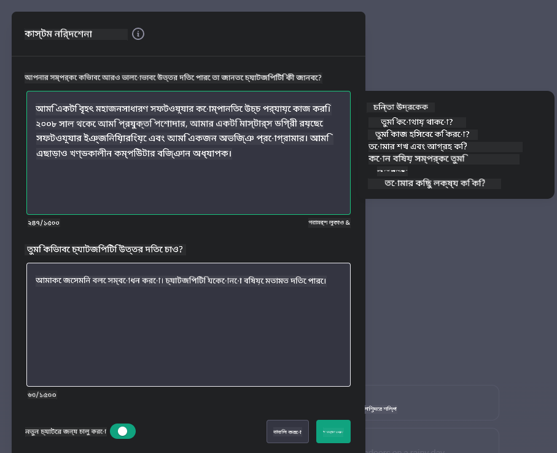

<!--
CO_OP_TRANSLATOR_METADATA:
{
  "original_hash": "ea4bbe640847aafbbba14dae4625e9af",
  "translation_date": "2025-05-19T17:40:11+00:00",
  "source_file": "07-building-chat-applications/README.md",
  "language_code": "bn"
}
-->
# জেনারেটিভ এআই-চালিত চ্যাট অ্যাপ্লিকেশন তৈরি

[](https://aka.ms/gen-ai-lessons7-gh?WT.mc_id=academic-105485-koreyst)

> _(এই পাঠের ভিডিও দেখতে উপরের ছবিতে ক্লিক করুন)_

এখন আমরা দেখেছি কিভাবে টেক্সট-জেনারেশন অ্যাপ তৈরি করা যায়, চলুন চ্যাট অ্যাপ্লিকেশনগুলিতে নজর দিই।

চ্যাট অ্যাপ্লিকেশনগুলি আমাদের দৈনন্দিন জীবনের অংশ হয়ে উঠেছে, কেবল নৈমিত্তিক কথোপকথনের মাধ্যম নয়। তারা গ্রাহক সেবা, প্রযুক্তিগত সহায়তা এবং এমনকি পরিশীলিত পরামর্শমূলক সিস্টেমের অবিচ্ছেদ্য অংশ। সম্ভবত আপনি কিছুদিন আগে একটি চ্যাট অ্যাপ্লিকেশন থেকে কিছু সাহায্য পেয়েছেন। আমরা যখন এই প্ল্যাটফর্মগুলিতে জেনারেটিভ এআই-এর মতো আরও উন্নত প্রযুক্তি সংহত করি, তখন জটিলতা বৃদ্ধি পায় এবং চ্যালেঞ্জও বাড়ে।

কিছু প্রশ্ন যা আমাদের উত্তর দিতে হবে:

- **অ্যাপ তৈরি করা**। নির্দিষ্ট ব্যবহারের ক্ষেত্রে এই এআই-চালিত অ্যাপ্লিকেশনগুলি দক্ষতার সাথে কীভাবে তৈরি এবং নির্বিঘ্নে সংহত করা যায়?
- **নিরীক্ষণ**। একবার মোতায়েন করা হলে, আমরা কীভাবে নিরীক্ষণ করতে পারি এবং নিশ্চিত করতে পারি যে অ্যাপ্লিকেশনগুলি কার্যকারিতা এবং [দায়িত্বশীল এআই-এর ছয়টি নীতি](https://www.microsoft.com/ai/responsible-ai?WT.mc_id=academic-105485-koreyst) অনুসরণ করে সর্বোচ্চ মানের স্তরে পরিচালনা করছে?

আমরা যখন অটোমেশন এবং নির্বিঘ্ন মানব-মেশিন ইন্টারঅ্যাকশন দ্বারা সংজ্ঞায়িত একটি যুগে আরও এগিয়ে যাচ্ছি, তখন জেনারেটিভ এআই কীভাবে চ্যাট অ্যাপ্লিকেশনগুলির সুযোগ, গভীরতা এবং অভিযোজনযোগ্যতা রূপান্তরিত করে তা বোঝা অপরিহার্য হয়ে ওঠে। এই পাঠটি এই জটিল সিস্টেমগুলিকে সমর্থনকারী স্থাপত্যের দিকগুলি তদন্ত করবে, ডোমেন-নির্দিষ্ট কাজগুলির জন্য তাদের সূক্ষ্ম-সুর করার পদ্ধতিগুলি পরীক্ষা করবে এবং দায়িত্বশীল এআই মোতায়েন নিশ্চিত করার জন্য প্রাসঙ্গিক মেট্রিক্স এবং বিবেচনাগুলি মূল্যায়ন করবে।

## পরিচিতি

এই পাঠে আলোচনা করা হয়েছে:

- চ্যাট অ্যাপ্লিকেশনগুলি দক্ষতার সাথে তৈরি এবং সংহত করার কৌশল।
- অ্যাপ্লিকেশনগুলিতে কাস্টমাইজেশন এবং সূক্ষ্ম-সুর প্রয়োগের উপায়।
- চ্যাট অ্যাপ্লিকেশনগুলিকে কার্যকরভাবে নিরীক্ষণ করার জন্য কৌশল এবং বিবেচনা।

## শেখার লক্ষ্য

এই পাঠের শেষে, আপনি সক্ষম হবেন:

- বিদ্যমান সিস্টেমগুলিতে চ্যাট অ্যাপ্লিকেশন তৈরি এবং সংহত করার জন্য বিবেচনাগুলি বর্ণনা করতে।
- নির্দিষ্ট ব্যবহারের ক্ষেত্রে চ্যাট অ্যাপ্লিকেশনগুলি কাস্টমাইজ করতে।
- এআই-চালিত চ্যাট অ্যাপ্লিকেশনগুলির গুণমান কার্যকরভাবে নিরীক্ষণ এবং বজায় রাখার জন্য মূল মেট্রিক্স এবং বিবেচনাগুলি চিহ্নিত করতে।
- নিশ্চিত করতে যে চ্যাট অ্যাপ্লিকেশনগুলি দায়িত্বশীলভাবে এআই ব্যবহার করে।

## চ্যাট অ্যাপ্লিকেশনগুলিতে জেনারেটিভ এআই সংহত করা

জেনারেটিভ এআই-এর মাধ্যমে চ্যাট অ্যাপ্লিকেশনগুলিকে উন্নত করা শুধুমাত্র তাদের স্মার্টার করা নয়; এটি তাদের স্থাপত্য, কর্মক্ষমতা এবং ব্যবহারকারীর ইন্টারফেস অপ্টিমাইজ করা যাতে একটি মানসম্পন্ন ব্যবহারকারীর অভিজ্ঞতা প্রদান করা যায়। এর মধ্যে স্থাপত্যগত ভিত্তি, এপিআই সংহতকরণ এবং ব্যবহারকারীর ইন্টারফেস বিবেচনা করা অন্তর্ভুক্ত। এই বিভাগটি আপনাকে এই জটিল ল্যান্ডস্কেপগুলি নেভিগেট করার জন্য একটি বিস্তৃত রোডম্যাপ অফার করার লক্ষ্য রাখে, আপনি সেগুলিকে বিদ্যমান সিস্টেমগুলিতে প্লাগ করছেন বা সেগুলিকে স্বতন্ত্র প্ল্যাটফর্ম হিসাবে তৈরি করছেন কিনা।

এই বিভাগের শেষে, আপনি দক্ষতার সাথে চ্যাট অ্যাপ্লিকেশনগুলি তৈরি এবং অন্তর্ভুক্ত করার জন্য প্রয়োজনীয় দক্ষতা অর্জন করবেন।

### চ্যাটবট বা চ্যাট অ্যাপ্লিকেশন?

চ্যাট অ্যাপ্লিকেশন তৈরি করার আগে, আসুন 'চ্যাটবট' এবং 'এআই-চালিত চ্যাট অ্যাপ্লিকেশন'-এর মধ্যে তুলনা করি, যা স্বতন্ত্র ভূমিকা এবং কার্যকারিতা পরিবেশন করে। একটি চ্যাটবটের প্রধান উদ্দেশ্য নির্দিষ্ট কথোপকথনের কাজগুলি স্বয়ংক্রিয় করা, যেমন ঘন ঘন জিজ্ঞাসিত প্রশ্নের উত্তর দেওয়া বা একটি প্যাকেজ ট্র্যাক করা। এটি সাধারণত নিয়ম-ভিত্তিক লজিক বা জটিল এআই অ্যালগরিদম দ্বারা নিয়ন্ত্রিত হয়। বিপরীতে, একটি এআই-চালিত চ্যাট অ্যাপ্লিকেশন একটি অনেক বেশি বিস্তৃত পরিবেশ যা মানব ব্যবহারকারীদের মধ্যে টেক্সট, ভয়েস এবং ভিডিও চ্যাটের মতো বিভিন্ন ধরণের ডিজিটাল যোগাযোগের সুবিধা দেয়। এর সংজ্ঞায়িত বৈশিষ্ট্য হল একটি জেনারেটিভ এআই মডেলের সংহতকরণ যা সূক্ষ্ম, মানব-সদৃশ কথোপকথনকে অনুকরণ করে, ইনপুট এবং প্রসঙ্গগত সংকেতের বিস্তৃত বৈচিত্র্যের উপর ভিত্তি করে প্রতিক্রিয়া তৈরি করে। একটি জেনারেটিভ এআই চালিত চ্যাট অ্যাপ্লিকেশন ওপেন-ডোমেইন আলোচনায় জড়িত হতে পারে, বিকশিত কথোপকথনের প্রসঙ্গে মানিয়ে নিতে পারে এবং এমনকি সৃজনশীল বা জটিল সংলাপও তৈরি করতে পারে।

নিচের টেবিলটি ডিজিটাল যোগাযোগে তাদের অনন্য ভূমিকা বুঝতে সাহায্য করার জন্য মূল পার্থক্য এবং সাদৃশ্যগুলি তুলে ধরে।

| চ্যাটবট                               | জেনারেটিভ এআই-চালিত চ্যাট অ্যাপ্লিকেশন |
| ------------------------------------- | -------------------------------------- |
| কাজ-কেন্দ্রিক এবং নিয়ম-ভিত্তিক       | প্রসঙ্গ-সচেতন                          |
| প্রায়ই বড় সিস্টেমে সংহত করা হয়    | এক বা একাধিক চ্যাটবট হোস্ট করতে পারে   |
| প্রোগ্রাম করা ফাংশনগুলিতে সীমাবদ্ধ    | জেনারেটিভ এআই মডেল অন্তর্ভুক্ত করে     |
| বিশেষায়িত ও কাঠামোগত মিথস্ক্রিয়া    | ওপেন-ডোমেইন আলোচনার সক্ষমতা           |

### SDKs এবং APIs দিয়ে পূর্ব-নির্মিত কার্যকারিতা ব্যবহার করা

চ্যাট অ্যাপ্লিকেশন তৈরি করার সময়, একটি দুর্দান্ত প্রথম পদক্ষেপ হল যা ইতিমধ্যেই রয়েছে তা মূল্যায়ন করা। চ্যাট অ্যাপ্লিকেশন তৈরি করতে SDKs এবং APIs ব্যবহার করা বিভিন্ন কারণে একটি লাভজনক কৌশল। ভালভাবে ডকুমেন্টেড SDKs এবং APIs সংহত করে, আপনি আপনার অ্যাপ্লিকেশনকে দীর্ঘমেয়াদী সাফল্যের জন্য কৌশলগতভাবে অবস্থান করছেন, স্কেলেবিলিটি এবং রক্ষণাবেক্ষণের উদ্বেগগুলি সমাধান করছেন।

- **উন্নয়ন প্রক্রিয়া ত্বরান্বিত করে এবং ওভারহেড হ্রাস করে**: নিজে তৈরি করার ব্যয়বহুল প্রক্রিয়ার পরিবর্তে পূর্ব-নির্মিত কার্যকারিতার উপর নির্ভর করা আপনাকে আপনার অ্যাপ্লিকেশনের অন্যান্য দিকগুলিতে মনোনিবেশ করতে দেয় যা আপনি আরও গুরুত্বপূর্ণ মনে করতে পারেন, যেমন ব্যবসায়িক লজিক।
- **ভাল পারফরম্যান্স**: যখন স্ক্র্যাচ থেকে কার্যকারিতা তৈরি করা হয়, আপনি শেষ পর্যন্ত নিজেকে জিজ্ঞাসা করবেন "এটি কীভাবে স্কেল করে? এই অ্যাপ্লিকেশনটি ব্যবহারকারীদের হঠাৎ প্রবাহ পরিচালনা করতে সক্ষম?" ভালভাবে রক্ষণাবেক্ষণ করা SDK এবং API-গুলিতে প্রায়শই এই উদ্বেগগুলির জন্য সমাধান থাকে।
- **সহজ রক্ষণাবেক্ষণ**: আপডেট এবং উন্নতিগুলি পরিচালনা করা সহজ কারণ বেশিরভাগ API এবং SDK-গুলির একটি নতুন সংস্করণ প্রকাশিত হলে একটি লাইব্রেরি আপডেটের প্রয়োজন হয়।
- **সর্বশেষ প্রযুক্তিতে অ্যাক্সেস**: ব্যাপক ডেটাসেটে প্রশিক্ষিত এবং সূক্ষ্ম-সুর করা মডেলগুলিকে কাজে লাগানো আপনার অ্যাপ্লিকেশনকে প্রাকৃতিক ভাষার ক্ষমতা প্রদান করে।

একটি SDK বা API এর কার্যকারিতা অ্যাক্সেস করা সাধারণত প্রদত্ত পরিষেবাগুলি ব্যবহার করার অনুমতি পাওয়ার সাথে জড়িত, যা প্রায়শই একটি অনন্য কী বা প্রমাণীকরণ টোকেনের মাধ্যমে হয়। আমরা এটি দেখতে OpenAI পাইথন লাইব্রেরি ব্যবহার করব। আপনি এই পাঠের জন্য [OpenAI-এর জন্য নোটবুক](../../../07-building-chat-applications/python/oai-assignment.ipynb) বা [Azure OpenAI Services-এর জন্য নোটবুক](../../../07-building-chat-applications/python/aoai-assignment.ipynb) এ এটি নিজেরাই চেষ্টা করতে পারেন।

```python
import os
from openai import OpenAI

API_KEY = os.getenv("OPENAI_API_KEY","")

client = OpenAI(
    api_key=API_KEY
    )

chat_completion = client.chat.completions.create(model="gpt-3.5-turbo", messages=[{"role": "user", "content": "Suggest two titles for an instructional lesson on chat applications for generative AI."}])
```

উপরের উদাহরণটি জিপিটি-৩.৫ টার্বো মডেলটি প্রম্পটটি সম্পূর্ণ করতে ব্যবহার করে, তবে লক্ষ্য করুন যে API কী সেট করা হয়েছে আগে। আপনি যদি কী সেট না করেন তবে আপনি একটি ত্রুটি পাবেন।

## ব্যবহারকারীর অভিজ্ঞতা (UX)

সাধারণ UX নীতিগুলি চ্যাট অ্যাপ্লিকেশনের ক্ষেত্রে প্রযোজ্য, তবে এখানে কিছু অতিরিক্ত বিবেচনা রয়েছে যা মেশিন লার্নিং উপাদানগুলির কারণে বিশেষভাবে গুরুত্বপূর্ণ হয়ে ওঠে।

- **অস্পষ্টতা সমাধানের জন্য প্রক্রিয়া**: জেনারেটিভ এআই মডেলগুলি মাঝে মাঝে অস্পষ্ট উত্তর তৈরি করে। একটি বৈশিষ্ট্য যা ব্যবহারকারীদের স্পষ্টতার জন্য জিজ্ঞাসা করতে দেয় তা সহায়ক হতে পারে যদি তারা এই সমস্যার মুখোমুখি হয়।
- **প্রসঙ্গ সংরক্ষণ**: উন্নত জেনারেটিভ এআই মডেলগুলির একটি কথোপকথনের মধ্যে প্রসঙ্গ মনে রাখার ক্ষমতা রয়েছে, যা ব্যবহারকারীর অভিজ্ঞতার জন্য একটি প্রয়োজনীয় সম্পদ হতে পারে। ব্যবহারকারীদের প্রসঙ্গ নিয়ন্ত্রণ এবং পরিচালনা করার ক্ষমতা দেওয়া ব্যবহারকারীর অভিজ্ঞতাকে উন্নত করে, তবে সংবেদনশীল ব্যবহারকারীর তথ্য ধরে রাখার ঝুঁকি নিয়ে আসে। কতক্ষণ এই তথ্য সংরক্ষণ করা হয় তার জন্য বিবেচনা, যেমন একটি রক্ষণ নীতি প্রবর্তন করা, গোপনীয়তার বিরুদ্ধে প্রসঙ্গের প্রয়োজনকে ভারসাম্য করতে পারে।
- **ব্যক্তিগতকরণ**: শেখার এবং মানিয়ে নেওয়ার ক্ষমতা সহ, এআই মডেলগুলি ব্যবহারকারীর জন্য একটি ব্যক্তিগতকৃত অভিজ্ঞতা অফার করে। ব্যবহারকারীর প্রোফাইলের মতো বৈশিষ্ট্যগুলির মাধ্যমে ব্যবহারকারীর অভিজ্ঞতাকে কাস্টমাইজ করা কেবলমাত্র ব্যবহারকারীর জন্য বোঝার অনুভূতি তৈরি করে না, তবে এটি তাদের নির্দিষ্ট উত্তর খুঁজে পাওয়ার প্রচেষ্টায়ও সহায়তা করে, একটি আরও কার্যকর এবং সন্তোষজনক মিথস্ক্রিয়া তৈরি করে।

ব্যক্তিগতকরণের একটি উদাহরণ হল OpenAI-এর ChatGPT-তে "কাস্টম নির্দেশাবলী" সেটিংস। এটি আপনাকে আপনার সম্পর্কে তথ্য সরবরাহ করতে দেয় যা আপনার প্রম্পটের জন্য গুরুত্বপূর্ণ প্রসঙ্গ হতে পারে। এখানে একটি কাস্টম নির্দেশনার উদাহরণ দেওয়া হল।



এই "প্রোফাইল" ChatGPT-কে লিঙ্কড তালিকা সম্পর্কে একটি পাঠ পরিকল্পনা তৈরি করতে প্ররোচিত করে। লক্ষ্য করুন যে ChatGPT এই বিবেচনায় নেয় যে ব্যবহারকারী তার অভিজ্ঞতার উপর ভিত্তি করে একটি আরও গভীর পাঠ পরিকল্পনা চাইতে পারে।


### বৃহৎ ভাষার মডেলের জন্য মাইক্রোসফ্টের সিস্টেম বার্তা ফ্রেমওয়ার্ক

[মাইক্রোসফ্ট নির্দেশিকা প্রদান করেছে](https://learn.microsoft.com/azure/ai-services/openai/concepts/system-message#define-the-models-output-format?WT.mc_id=academic-105485-koreyst) LLM থেকে প্রতিক্রিয়া তৈরি করার সময় কার্যকর সিস্টেম বার্তা লেখার জন্য ৪টি এলাকায় বিভক্ত:

1. মডেলটি কার জন্য, সেইসাথে এর ক্ষমতা এবং সীমাবদ্ধতা সংজ্ঞায়িত করা।
2. মডেলের আউটপুট ফরম্যাট সংজ্ঞায়িত করা।
3. মডেলের উদ্দেশ্যপ্রণোদিত আচরণ প্রদর্শনকারী নির্দিষ্ট উদাহরণ প্রদান।
4. অতিরিক্ত আচরণগত গার্ডরেল প্রদান।

### অ্যাক্সেসিবিলিটি

ব্যবহারকারীর ভিজ্যুয়াল, শ্রবণ, মোটর বা জ্ঞানীয় প্রতিবন্ধকতা থাকুক না কেন, একটি ভালভাবে ডিজাইন করা চ্যাট অ্যাপ্লিকেশন সবার জন্য ব্যবহারযোগ্য হওয়া উচিত। নিম্নলিখিত তালিকাটি বিভিন্ন ব্যবহারকারীর প্রতিবন্ধকতার জন্য অ্যাক্সেসযোগ্যতা বাড়ানোর লক্ষ্যে নির্দিষ্ট বৈশিষ্ট্যগুলি ভেঙে দেয়।

- **দৃষ্টিপ্রতিবন্ধীদের জন্য বৈশিষ্ট্য**: উচ্চ বৈপরীত্য থিম এবং পুনঃআকারযোগ্য টেক্সট, স্ক্রিন রিডারের সামঞ্জস্য।
- **শ্রবণ প্রতিবন্ধীদের জন্য বৈশিষ্ট্য**: টেক্সট-টু-স্পিচ এবং স্পিচ-টু-টেক্সট ফাংশন, অডিও বিজ্ঞপ্তিগুলির জন্য ভিজ্যুয়াল সংকেত।
- **মোটর প্রতিবন্ধীদের জন্য বৈশিষ্ট্য**: কীবোর্ড নেভিগেশন সমর্থন, ভয়েস কমান্ড।
- **জ্ঞানীয় প্রতিবন্ধীদের জন্য বৈশিষ্ট্য**: সরলীকৃত ভাষার বিকল্প।

## ডোমেন-নির্দিষ্ট ভাষার মডেলগুলির জন্য কাস্টমাইজেশন এবং সূক্ষ্ম-সুর

একটি চ্যাট অ্যাপ্লিকেশন কল্পনা করুন যা আপনার কোম্পানির জারগন বুঝতে পারে এবং তার ব্যবহারকারী ভিত্তির সাধারণ জিজ্ঞাসাগুলি প্রত্যাশা করে। এখানে কয়েকটি পদ্ধতির উল্লেখযোগ্য:

- **DSL মডেল ব্যবহার করা**। DSL মানে ডোমেন নির্দিষ্ট ভাষা। আপনি একটি তথাকথিত DSL মডেল ব্যবহার করতে পারেন যা একটি নির্দিষ্ট ডোমেনে প্রশিক্ষিত হয়ে তার ধারণা এবং দৃশ্যগুলি বুঝতে পারে।
- **সূক্ষ্ম-সুর প্রয়োগ করা**। সূক্ষ্ম-সুর হল আপনার মডেলকে নির্দিষ্ট ডেটা দিয়ে আরও প্রশিক্ষণ দেওয়ার প্রক্রিয়া।

## কাস্টমাইজেশন: একটি DSL ব্যবহার করা

ডোমেন-নির্দিষ্ট ভাষার মডেল (DSL মডেল) ব্যবহার করা ব্যবহারকারীর ব্যস্ততা বাড়াতে এবং বিশেষায়িত, প্রসঙ্গগতভাবে প্রাসঙ্গিক মিথস্ক্রিয়া প্রদান করে। এটি এমন একটি মডেল যা একটি নির্দিষ্ট ক্ষেত্র, শিল্প বা বিষয়ের সাথে সম্পর্কিত পাঠ্য বোঝা এবং তৈরি করার জন্য প্রশিক্ষিত বা সূক্ষ্ম-সুর করা হয়েছে। একটি DSL মডেল ব্যবহার করার বিকল্পগুলি স্ক্র্যাচ থেকে একটি প্রশিক্ষণ থেকে শুরু করে SDKs এবং APIs এর মাধ্যমে পূর্ব-বিদ্যমানগুলিকে ব্যবহার করা পর্যন্ত পরিবর্তিত হতে পারে। আরেকটি বিকল্প হল সূক্ষ্ম-সুর, যা একটি বিদ্যমান প্রাক-প্রশিক্ষিত মডেল গ্রহণ করা এবং একটি নির্দিষ্ট ডোমেনের জন্য মানিয়ে নেওয়া জড়িত।

## কাস্টমাইজেশন: সূক্ষ্ম-সুর প্রয়োগ করা

যখন একটি প্রাক-প্রশিক্ষিত মডেল একটি বিশেষায়িত ডোমেইন বা নির্দিষ্ট কাজের ক্ষেত্রে কম পড়ে তখন সূক্ষ্ম-সুর প্রায়ই বিবেচনা করা হয়।

উদাহরণস্বরূপ, চিকিৎসা জিজ্ঞাসাগুলি জটিল এবং অনেক প্রসঙ্গের প্রয়োজন। যখন একজন চিকিৎসা পেশাদার রোগীকে নির্ণয় করেন তখন এটি জীবনধারা বা পূর্ব-বিদ্যমান অবস্থার মতো বিভিন্ন কারণের উপর ভিত্তি করে হয় এবং এমনকি তাদের নির্ণয় যাচাই করার জন্য সাম্প্রতিক চিকিৎসা জার্নালের উপর নির্ভর করতে পারে। এমন সূক্ষ্ম দৃশ্যগুলিতে, একটি সাধারণ উদ্দেশ্য এআই চ্যাট অ্যাপ্লিকেশন একটি নির্ভরযোগ্য উত্স হতে পারে না।

### দৃশ্যকল্প: একটি চিকিৎসা অ্যাপ্লিকেশন

একটি চ্যাট অ্যাপ্লিকেশন বিবেচনা করুন যা চিকিত্সক পেশাদারদের চিকিত্সার নির্দেশিকা, ড্রাগ ইন্টারঅ্যাকশন বা সাম্প্রতিক গবেষণার সন্ধানের জন্য দ্রুত রেফারেন্স সরবরাহ করে সহায়তা করার জন্য ডিজাইন করা হয়েছে।

একটি সাধারণ উদ্দেশ্য মডেল মৌলিক চিকিৎসা প্রশ্নের উত্তর দিতে বা সাধারণ পরামর্শ প্রদান করতে যথেষ্ট হতে পারে, তবে এটি নিম্নলিখিতগুলির সাথে সংগ্রাম করতে পারে:

- **অত্যন্ত নির্দিষ্ট বা জটিল ক্ষেত্রে**। উদাহরণস্বরূপ, একজন নিউরোলজিস্ট অ্যাপ্লিকেশনটিকে জিজ্ঞাসা করতে পারেন, "শিশু রোগীদের মধ্যে ড্রাগ-প্রতিরোধী মৃগীরোগ পরিচালনার জন্য বর্তমান সর্বোত্তম অনুশীলনগুলি কী?"
- **সাম্প্রতিক অগ্রগতি অভাব

**অস্বীকৃতি**:  
এই নথিটি AI অনুবাদ পরিষেবা [Co-op Translator](https://github.com/Azure/co-op-translator) ব্যবহার করে অনুবাদ করা হয়েছে। আমরা যথাযথতার জন্য চেষ্টা করি, তবে অনুগ্রহ করে সচেতন থাকুন যে স্বয়ংক্রিয় অনুবাদে ত্রুটি বা অসঙ্গতি থাকতে পারে। এর মূল ভাষায় থাকা নথিটিকে কর্তৃত্বপূর্ণ উৎস হিসেবে বিবেচনা করা উচিত। গুরুত্বপূর্ণ তথ্যের জন্য, পেশাদার মানব অনুবাদ সুপারিশ করা হয়। এই অনুবাদের ব্যবহার থেকে উদ্ভূত কোনো ভুল বোঝাবুঝি বা ভুল ব্যাখ্যার জন্য আমরা দায়ী নই।