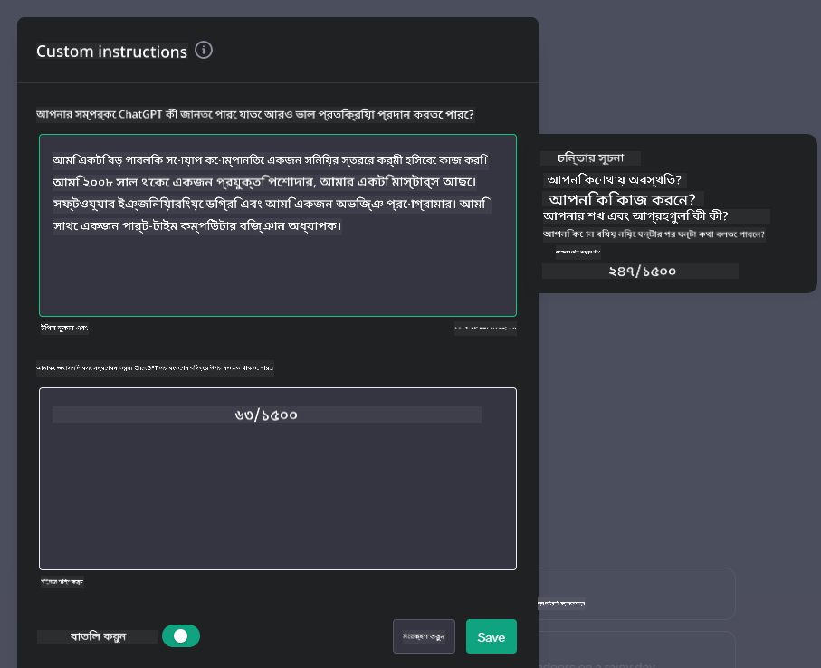

<!--
CO_OP_TRANSLATOR_METADATA:
{
  "original_hash": "ea4bbe640847aafbbba14dae4625e9af",
  "translation_date": "2025-06-25T15:19:53+00:00",
  "source_file": "07-building-chat-applications/README.md",
  "language_code": "bn"
}
-->
# জেনারেটিভ এআই-চালিত চ্যাট অ্যাপ্লিকেশন তৈরি করা

> _(এই পাঠের ভিডিও দেখতে উপরের ছবিতে ক্লিক করুন)_

এখন আমরা দেখেছি কীভাবে টেক্সট-জেনারেশন অ্যাপ তৈরি করা যায়, আসুন চ্যাট অ্যাপ্লিকেশনগুলির দিকে নজর দিই।

চ্যাট অ্যাপ্লিকেশনগুলি আমাদের দৈনন্দিন জীবনের সাথে একীভূত হয়ে গেছে, শুধুমাত্র নৈমিত্তিক কথোপকথনের মাধ্যমের চেয়ে বেশি কিছু অফার করে। তারা গ্রাহক সেবা, প্রযুক্তিগত সহায়তা এবং এমনকি পরিশীলিত উপদেষ্টা সিস্টেমের অবিচ্ছেদ্য অংশ। সম্ভবত আপনি কিছুদিন আগে একটি চ্যাট অ্যাপ্লিকেশন থেকে কিছু সাহায্য পেয়েছেন। আমরা যখন এই প্ল্যাটফর্মগুলিতে জেনারেটিভ এআই-এর মতো আরও উন্নত প্রযুক্তি একীভূত করি, তখন জটিলতা বৃদ্ধি পায় এবং চ্যালেঞ্জও বৃদ্ধি পায়।

কিছু প্রশ্ন যা আমাদের উত্তর দিতে হবে:

- **অ্যাপ তৈরি করা**। কীভাবে আমরা দক্ষতার সাথে এই AI-চালিত অ্যাপ্লিকেশনগুলি নির্দিষ্ট ব্যবহার ক্ষেত্রে জন্য তৈরি এবং নির্বিঘ্নে একীভূত করতে পারি?
- **পর্যবেক্ষণ**। একবার স্থাপন করা হলে, কীভাবে আমরা পর্যবেক্ষণ করতে এবং নিশ্চিত করতে পারি যে অ্যাপ্লিকেশনগুলি কার্যকারিতার ক্ষেত্রে এবং [দায়িত্বশীল AI-এর ছয়টি নীতির](https://www.microsoft.com/ai/responsible-ai?WT.mc_id=academic-105485-koreyst) মেনে সর্বোচ্চ মানের স্তরে কাজ করছে?

আমরা যখন স্বয়ংক্রিয়তা এবং নির্বিঘ্ন মানব-যন্ত্রের যোগাযোগ দ্বারা সংজ্ঞায়িত একটি যুগে আরও এগিয়ে যাচ্ছি, তখন চ্যাট অ্যাপ্লিকেশনগুলির পরিসর, গভীরতা এবং অভিযোজনযোগ্যতা কীভাবে রূপান্তরিত হয় তা বোঝা অপরিহার্য হয়ে ওঠে। এই পাঠটি এই জটিল সিস্টেমগুলিকে সমর্থন করে এমন স্থাপত্যের দিকগুলি তদন্ত করবে, ডোমেন-নির্দিষ্ট কাজগুলির জন্য তাদের সূক্ষ্ম-সুর করার পদ্ধতিগুলি বিশ্লেষণ করবে এবং দায়িত্বশীল AI স্থাপনের নিশ্চয়তা দেওয়ার জন্য প্রাসঙ্গিক মেট্রিক এবং বিবেচনাগুলি মূল্যায়ন করবে।

## পরিচিতি

এই পাঠে আলোচনা করা হয়েছে:

- চ্যাট অ্যাপ্লিকেশনগুলি দক্ষতার সাথে তৈরি এবং একীভূত করার কৌশল।
- অ্যাপ্লিকেশনগুলিতে কাস্টমাইজেশন এবং সূক্ষ্ম-সুর করার প্রয়োগ।
- চ্যাট অ্যাপ্লিকেশনগুলি কার্যকরভাবে পর্যবেক্ষণ করার কৌশল এবং বিবেচনা।

## শেখার লক্ষ্য

এই পাঠ শেষে, আপনি সক্ষম হবেন:

- বিদ্যমান সিস্টেমগুলিতে চ্যাট অ্যাপ্লিকেশন তৈরি এবং একীভূত করার বিবেচনা বর্ণনা করতে।
- নির্দিষ্ট ব্যবহার-কেসের জন্য চ্যাট অ্যাপ্লিকেশন কাস্টমাইজ করতে।
- AI-চালিত চ্যাট অ্যাপ্লিকেশনগুলির মান কার্যকরভাবে পর্যবেক্ষণ এবং রক্ষণাবেক্ষণের জন্য মূল মেট্রিক এবং বিবেচনা চিহ্নিত করতে।
- নিশ্চিত করতে যে চ্যাট অ্যাপ্লিকেশনগুলি দায়িত্বশীলভাবে AI ব্যবহার করে।

## চ্যাট অ্যাপ্লিকেশনগুলিতে জেনারেটিভ এআই একীভূত করা

জেনারেটিভ এআই-এর মাধ্যমে চ্যাট অ্যাপ্লিকেশনগুলিকে উন্নত করা শুধুমাত্র তাদের আরও স্মার্ট করা নয়; এটি তাদের স্থাপত্য, কর্মক্ষমতা এবং ব্যবহারকারীর ইন্টারফেসকে অপ্টিমাইজ করার বিষয়ে, একটি মানসম্পন্ন ব্যবহারকারীর অভিজ্ঞতা প্রদানের জন্য। এর মধ্যে স্থাপত্যের ভিত্তি, API একীভূতকরণ এবং ব্যবহারকারীর ইন্টারফেসের বিবেচনা তদন্ত করা অন্তর্ভুক্ত। এই বিভাগটি আপনাকে এই জটিল ল্যান্ডস্কেপগুলি নেভিগেট করার জন্য একটি বিস্তৃত রোডম্যাপ দেওয়ার লক্ষ্য রাখে, আপনি বিদ্যমান সিস্টেমগুলিতে তাদের প্লাগ করছেন বা স্ট্যান্ড-অ্যালোন প্ল্যাটফর্ম হিসাবে তৈরি করছেন কিনা।

এই বিভাগের শেষে, আপনি চ্যাট অ্যাপ্লিকেশনগুলি দক্ষতার সাথে তৈরি এবং একীভূত করার জন্য প্রয়োজনীয় দক্ষতা অর্জন করবেন।

### চ্যাটবট বা চ্যাট অ্যাপ্লিকেশন?

আমরা চ্যাট অ্যাপ্লিকেশন তৈরি করার আগে, আসুন 'চ্যাটবট' বনাম 'AI-চালিত চ্যাট অ্যাপ্লিকেশন' তুলনা করি, যা স্বতন্ত্র ভূমিকা এবং কার্যকারিতা পরিবেশন করে। একটি চ্যাটবটের প্রধান উদ্দেশ্য হল নির্দিষ্ট কথোপকথন কাজগুলি স্বয়ংক্রিয় করা, যেমন প্রায়শই জিজ্ঞাসিত প্রশ্নের উত্তর দেওয়া বা একটি প্যাকেজ ট্র্যাক করা। এটি সাধারণত নিয়ম-ভিত্তিক যুক্তি বা জটিল AI অ্যালগরিদম দ্বারা পরিচালিত হয়। এর বিপরীতে, একটি AI-চালিত চ্যাট অ্যাপ্লিকেশন একটি আরও বিস্তৃত পরিবেশ যা মানব ব্যবহারকারীদের মধ্যে টেক্সট, ভয়েস এবং ভিডিও চ্যাটের মতো বিভিন্ন ধরনের ডিজিটাল যোগাযোগের সুবিধা প্রদান করার জন্য ডিজাইন করা হয়েছে। এর সংজ্ঞায়িত বৈশিষ্ট্যটি একটি জেনারেটিভ এআই মডেলের একীকরণ যা সূক্ষ্ম, মানব-সদৃশ কথোপকথন অনুকরণ করে, একটি বিস্তৃত বৈচিত্র্য ইনপুট এবং প্রসঙ্গ সংকেতের উপর ভিত্তি করে প্রতিক্রিয়া তৈরি করে। একটি জেনারেটিভ এআই চালিত চ্যাট অ্যাপ্লিকেশন খোলা-ডোমেন আলোচনায় জড়িত হতে পারে, বিকশিত কথোপকথন প্রসঙ্গের সাথে মানিয়ে নিতে পারে এবং এমনকি সৃজনশীল বা জটিল সংলাপ তৈরি করতে পারে।

নিচের টেবিলটি ডিজিটাল যোগাযোগে তাদের অনন্য ভূমিকা বুঝতে সাহায্য করার জন্য মূল পার্থক্য এবং সাদৃশ্যগুলি রূপরেখা দেয়।

| চ্যাটবট                              | জেনারেটিভ AI-চালিত চ্যাট অ্যাপ্লিকেশন |
| ------------------------------------- | -------------------------------------- |
| কাজ-কেন্দ্রিক এবং নিয়ম-ভিত্তিক       | প্রসঙ্গ সচেতন                          |
| প্রায়ই বড় সিস্টেমে একীভূত          | এক বা একাধিক চ্যাটবট হোস্ট করতে পারে   |
| প্রোগ্রাম করা ফাংশনগুলিতে সীমিত       | জেনারেটিভ AI মডেল অন্তর্ভুক্ত         |
| বিশেষায়িত এবং কাঠামোগত যোগাযোগ      | খোলা-ডোমেন আলোচনা সক্ষম               |

### SDKs এবং APIs সহ প্রি-বিল্ট কার্যকারিতা ব্যবহার করা

চ্যাট অ্যাপ্লিকেশন তৈরি করার সময়, একটি চমৎকার প্রথম পদক্ষেপ হল কী ইতিমধ্যে সেখানে রয়েছে তা মূল্যায়ন করা। SDKs এবং APIs ব্যবহার করে চ্যাট অ্যাপ্লিকেশন তৈরি করা বিভিন্ন কারণে একটি সুবিধাজনক কৌশল। ভাল-ডকুমেন্টেড SDKs এবং APIs একীভূত করে, আপনি দীর্ঘমেয়াদী সাফল্যের জন্য আপনার অ্যাপ্লিকেশনকে কৌশলগতভাবে অবস্থান করছেন, মাপযোগ্যতা এবং রক্ষণাবেক্ষণের উদ্বেগগুলি সমাধান করছেন।

- **উন্নয়ন প্রক্রিয়া দ্রুত করে এবং ওভারহেড কমায়**: নিজে তৈরি করার ব্যয়বহুল প্রক্রিয়ার পরিবর্তে প্রি-বিল্ট কার্যকারিতার উপর নির্ভর করা আপনাকে আপনার অ্যাপ্লিকেশনের অন্যান্য দিকগুলির উপর ফোকাস করতে দেয় যা আপনি আরও গুরুত্বপূর্ণ মনে করতে পারেন, যেমন ব্যবসায়িক যুক্তি।
- **উত্তম কর্মক্ষমতা**: যখন স্ক্র্যাচ থেকে কার্যকারিতা তৈরি করা হয়, তখন আপনি অবশেষে নিজেকে জিজ্ঞাসা করবেন "এটি কীভাবে স্কেল করে? এই অ্যাপ্লিকেশনটি ব্যবহারকারীদের আকস্মিক আগমন পরিচালনা করতে সক্ষম কিনা?" ভাল রক্ষণাবেক্ষণ করা SDK এবং APIs প্রায়ই এই উদ্বেগের জন্য বিল্ট-ইন সমাধান থাকে।
- **সহজ রক্ষণাবেক্ষণ**: আপডেট এবং উন্নতিগুলি পরিচালনা করা সহজ কারণ বেশিরভাগ APIs এবং SDKs কেবলমাত্র একটি লাইব্রেরি আপডেটের প্রয়োজন হয় যখন একটি নতুন সংস্করণ প্রকাশিত হয়।
- **সর্বাধুনিক প্রযুক্তির অ্যাক্সেস**: ব্যাপক ডেটাসেটে প্রশিক্ষিত এবং সূক্ষ্ম-সুর করা মডেলগুলি ব্যবহার করে আপনার অ্যাপ্লিকেশনকে প্রাকৃতিক ভাষার ক্ষমতা প্রদান করে।

একটি SDK বা API এর কার্যকারিতা অ্যাক্সেস করা সাধারণত প্রদত্ত পরিষেবাগুলি ব্যবহার করার অনুমতি প্রাপ্তির সাথে জড়িত, যা প্রায়শই একটি অনন্য কী বা প্রমাণীকরণ টোকেন ব্যবহার করে হয়। আমরা কীভাবে এটি দেখতে পাবে তা অন্বেষণ করতে OpenAI Python Library ব্যবহার করব। আপনি এই পাঠের জন্য [OpenAI নোটবুক](../../../07-building-chat-applications/python/oai-assignment.ipynb) বা [Azure OpenAI Services নোটবুক](../../../07-building-chat-applications/python/aoai-assignment.ipynb) এ এটি নিজেরাই চেষ্টা করতে পারেন।

```python
import os
from openai import OpenAI

API_KEY = os.getenv("OPENAI_API_KEY","")

client = OpenAI(
    api_key=API_KEY
    )

chat_completion = client.chat.completions.create(model="gpt-3.5-turbo", messages=[{"role": "user", "content": "Suggest two titles for an instructional lesson on chat applications for generative AI."}])
```

উপরের উদাহরণটি প্রম্পট সম্পূর্ণ করতে GPT-3.5 Turbo মডেল ব্যবহার করে, তবে লক্ষ্য করুন যে API কী সেট করার আগে সেট করা হয়েছে। আপনি কী সেট না করলে একটি ত্রুটি পাবেন।

## ব্যবহারকারীর অভিজ্ঞতা (UX)

সাধারণ UX নীতিগুলি চ্যাট অ্যাপ্লিকেশনগুলিতে প্রয়োগ হয়, তবে এখানে কিছু অতিরিক্ত বিবেচনা রয়েছে যা মেশিন লার্নিং উপাদানগুলির কারণে বিশেষভাবে গুরুত্বপূর্ণ হয়ে ওঠে।

- **অস্পষ্টতার সমাধান করার জন্য মেকানিজম**: জেনারেটিভ এআই মডেলগুলি মাঝে মাঝে অস্পষ্ট উত্তর তৈরি করে। একটি বৈশিষ্ট্য যা ব্যবহারকারীদের স্পষ্টতার জন্য জিজ্ঞাসা করার অনুমতি দেয় তা সহায়ক হতে পারে যদি তারা এই সমস্যার সম্মুখীন হয়।
- **প্রসঙ্গ ধরে রাখা**: উন্নত জেনারেটিভ এআই মডেলগুলি কথোপকথনের মধ্যে প্রসঙ্গ মনে রাখার ক্ষমতা রাখে, যা ব্যবহারকারীর অভিজ্ঞতার জন্য একটি প্রয়োজনীয় সম্পদ হতে পারে। ব্যবহারকারীদের প্রসঙ্গ নিয়ন্ত্রণ এবং পরিচালনা করার ক্ষমতা দেওয়া ব্যবহারকারীর অভিজ্ঞতা উন্নত করে, তবে সংবেদনশীল ব্যবহারকারীর তথ্য ধরে রাখার ঝুঁকি তৈরি করে। এই তথ্য কতক্ষণ সংরক্ষণ করা হয় তার জন্য বিবেচনা, যেমন একটি রক্ষণাবেক্ষণ নীতি প্রবর্তন করা, গোপনীয়তার বিরুদ্ধে প্রসঙ্গের প্রয়োজনকে ভারসাম্য করতে পারে।
- **ব্যক্তিগতকরণ**: শিখতে এবং মানিয়ে নেওয়ার ক্ষমতা সহ, AI মডেলগুলি ব্যবহারকারীর জন্য একটি ব্যক্তিগতকৃত অভিজ্ঞতা অফার করে। ব্যবহারকারীর প্রোফাইলের মতো বৈশিষ্ট্যের মাধ্যমে ব্যবহারকারীর অভিজ্ঞতা কাস্টমাইজ করা শুধুমাত্র ব্যবহারকারীকে বোঝার মতো অনুভব করে না, বরং এটি নির্দিষ্ট উত্তরগুলি খুঁজে বের করার তাদের অনুসন্ধানে সহায়তা করে, আরও দক্ষ এবং সন্তোষজনক যোগাযোগ তৈরি করে।

ব্যক্তিগতকরণের একটি উদাহরণ হল OpenAI-এর ChatGPT-তে "কাস্টম নির্দেশাবলী" সেটিংস। এটি আপনাকে আপনার প্রম্পটের জন্য গুরুত্বপূর্ণ প্রসঙ্গ হতে পারে এমন আপনার সম্পর্কে তথ্য প্রদান করতে দেয়। এখানে একটি কাস্টম নির্দেশনার উদাহরণ।



এই "প্রোফাইল" ChatGPT কে লিঙ্কড লিস্ট সম্পর্কে একটি পাঠ পরিকল্পনা তৈরি করতে অনুরোধ করে। লক্ষ্য করুন যে ChatGPT ব্যবহারকারীর অভিজ্ঞতার উপর ভিত্তি করে একটি আরও গভীর পাঠ পরিকল্পনা চায় তা বিবেচনা করে।


### বড় ভাষার মডেলের জন্য মাইক্রোসফটের সিস্টেম মেসেজ ফ্রেমওয়ার্ক

[মাইক্রোসফট নির্দেশিকা প্রদান করেছে](https://learn.microsoft.com/azure/ai-services/openai/concepts/system-message#define-the-models-output-format?WT.mc_id=academic-105485-koreyst) যখন LLMs থেকে প্রতিক্রিয়া তৈরি করার সময় কার্যকর সিস্টেম বার্তা লেখার জন্য চারটি এলাকায় বিভক্ত:

1. মডেলটি কার জন্য, পাশাপাশি এর ক্ষমতা এবং সীমাবদ্ধতা সংজ্ঞায়িত করা।
2. মডেলের আউটপুট ফরম্যাট সংজ্ঞায়িত করা।
3. মডেলের উদ্দেশ্যযুক্ত আচরণ প্রদর্শনকারী নির্দিষ্ট উদাহরণ প্রদান করা।
4. অতিরিক্ত আচরণগত গার্ডরেল প্রদান করা।

### অ্যাক্সেসিবিলিটি

একজন ব্যবহারকারীর দৃষ্টিশক্তি, শ্রবণশক্তি, মোটর বা জ্ঞানীয় প্রতিবন্ধকতা থাকুক না কেন, একটি ভালভাবে ডিজাইন করা চ্যাট অ্যাপ্লিকেশন সকলের দ্বারা ব্যবহারযোগ্য হওয়া উচিত। নিম্নলিখিত তালিকা বিভিন্ন ব্যবহারকারীর প্রতিবন্ধকতার জন্য অ্যাক্সেসযোগ্যতা বাড়ানোর লক্ষ্যযুক্ত নির্দিষ্ট বৈশিষ্ট্যগুলি ভেঙে দেয়।

- **দৃষ্টিশক্তি প্রতিবন্ধকতার জন্য বৈশিষ্ট্য**: উচ্চ কনট্রাস্ট থিম এবং পুনরায় আকারযোগ্য পাঠ্য, স্ক্রিন রিডার সামঞ্জস্য।
- **শ্রবণ প্রতিবন্ধকতার জন্য বৈশিষ্ট্য**: টেক্সট-টু-স্পিচ এবং স্পিচ-টু-টেক্সট ফাংশন, অডিও বিজ্ঞপ্তির জন্য ভিজ্যুয়াল সংকেত।
- **মোটর প্রতিবন্ধকতার জন্য বৈশিষ্ট্য**: কীবোর্ড নেভিগেশন সমর্থন, ভয়েস কমান্ড।
- **জ্ঞানীয় প্রতিবন্ধকতার জন্য বৈশিষ্ট্য**: সরল ভাষার বিকল্প।

## ডোমেন-নির্দিষ্ট ভাষার মডেলের জন্য কাস্টমাইজেশন এবং সূক্ষ্ম-সুর করা

একটি চ্যাট অ্যাপ্লিকেশন কল্পনা করুন যা আপনার কোম্পানির শব্দভাণ্ডার বুঝতে পারে এবং এর ব্যবহারকারী ভিত্তির সাধারণ প্রশ্নগুলি পূর্বাভাস দিতে পারে। উল্লেখ করার মতো কয়েকটি পদ্ধতি রয়েছে:

- **DSL মডেলগুলি ব্যবহার করা**। DSL এর অর্থ ডোমেন-নির্দিষ্ট ভাষা। আপনি একটি তথাকথিত DSL মডেল ব্যবহার করতে পারেন যা একটি নির্দিষ্ট ডোমেনে প্রশিক্ষিত, এর ধারণা এবং দৃশ্যগুলি বুঝতে।
- **ফাইন-টিউনিং প্রয়োগ করা**। ফাইন-টিউনিং হল আপনার মডেলটিকে নির্দিষ্ট ডেটা দিয়ে আরও প্রশিক্ষণ দেওয়ার প্রক্রিয়া।

## কাস্টমাইজেশন: DSL ব্যবহার করা

ডোমেন-নির্দিষ্ট ভাষার মডেল (DSL মডেল) ব্যবহার করে ব্যবহারকারীর ব্যস্ততা বাড়ানো যেতে পারে এবং বিশেষায়িত, প্রসঙ্গগতভাবে প্রাসঙ্গিক যোগাযোগ প্রদান করে। এটি একটি মডেল যা একটি নির্দিষ্ট ক্ষেত্র, শিল্প বা বিষয় সম্পর্কিত পাঠ্য বুঝতে এবং তৈরি করতে প্রশিক্ষিত বা সূক্ষ্ম-সুর করা হয়। একটি DSL মডেল ব্যবহার করার বিকল্পগুলি স্ক্র্যাচ থেকে একটি প্রশিক্ষণ থেকে শুরু করে, SDKs এবং APIs এর মাধ্যমে বিদ্যমানগুলি ব্যবহার করা পর্যন্ত পরিবর্তিত হতে পারে। আরেকটি বিকল্প হল ফাইন-টিউনিং, যা একটি বিদ্যমান প্রাক-প্রশিক্ষিত মডেল নেওয়া এবং একটি নির্দিষ্ট ডোমেনের জন্য এটি অভিযোজিত করার অন্তর্ভুক্ত।

## কাস্টমাইজেশন: ফাইন-টিউনিং প্রয়োগ করা

ফাইন-টিউনিং প্রায়ই বিবেচনা করা হয় যখন একটি প্রাক-প্রশিক্ষিত মডেল একটি বিশেষায়িত ডোমেন বা নির্দিষ্ট কাজের ক্ষেত্রে কম পড়ে।

উদাহরণস্বরূপ, চিকিৎসা প্রশ্নগুলি জটিল এবং প্রচুর প্রসঙ্গের প্রয়োজন হয়। যখন একজন চিকিৎসা পেশাদার রোগীকে নির্ণয় করেন তখন এটি জীবনযাত্রার মতো বিভিন্ন কারণের উপর ভিত্তি করে হয় বা বিদ্যমান অবস্থার উপর ভিত্তি করে হয় এবং এমনকি তাদের নির্ণয়ের বৈধতা দেওয়ার জন্য সাম্প্রতিক চিকিৎসা জার্নালের উপর নির্ভর করতে পারে। এমন সূক্ষ্ম পরিস্থিতিতে, একটি সাধারণ-উদ্দেশ্য AI চ্যাট অ্যাপ্লিকেশন একটি নির্ভরযোগ্য উৎস হতে পারে না।

### দৃশ্যপট: একটি চিকিৎসা অ্যাপ্লিকেশন

চিকিৎসা অনুশীলনকারীদের চিকিৎসার নির্দেশিকা, ওষুধের মিথস্ক্রিয়া বা সাম্প্রতিক গবেষণা ফলাফলগুলির দ্রুত রেফারেন্স প্রদান করে সহায়তা করার জন্য একটি চ্যাট অ্যাপ্লিকেশন ডিজাইন করার কথা বিবেচনা করুন।

একটি সাধারণ-উদ্দেশ্য মডেল মৌলিক চিকিৎসা প্রশ্নের উত্তর দিতে বা সাধারণ পরামর্শ প্রদান করতে পর্যাপ্ত হতে পারে, তবে এটি নিম্নলিখিতগুলির সাথে লড়াই করতে পারে:

- **অত্যন্ত নির্দিষ্ট বা জটিল ক্ষেত্রে**। উদাহরণস্বরূপ, একজন নিউরোলজিস্ট অ্যাপ্লিকেশনটিকে জিজ্ঞাসা করতে পারেন, "শিশু রোগীদের মধ্যে ড্রাগ-প্রতিরোধী মৃগী ​​পরিচালনার জন্য বর্তমান সেরা অনুশীলনগুলি কী?"
- **সাম্প্রতিক অগ্রগতি অনুপস্থিত**। একটি সাধারণ-উদ্দেশ্য মডেল নিউরোলজি এবং ফার্মাকোলজিতে সর্বশেষ অগ্রগতি অন্তর্ভুক্ত করে একটি বর্তমান উত্তর প্রদান করতে লড়াই করতে পারে।

এই ধরনের পরিস্থিতিতে, একটি বিশেষায়িত চিকিৎসা ডেটাসেট দিয়ে মডেলটিকে সূক্ষ্ম-সুর করা এই জটিল চিকিৎসা অনুসন্ধানগুলি আরও সঠিকভাবে এবং নির্ভরযোগ্যভাবে পরিচালনা করার

**অস্বীকৃতি**:  
এই নথিটি AI অনুবাদ পরিষেবা [Co-op Translator](https://github.com/Azure/co-op-translator) ব্যবহার করে অনুবাদ করা হয়েছে। আমরা যথাসম্ভব সঠিক অনুবাদের চেষ্টা করি, তবে দয়া করে সচেতন থাকুন যে স্বয়ংক্রিয় অনুবাদে ত্রুটি বা অসঙ্গতি থাকতে পারে। মূল ভাষায় থাকা নথিটিকে প্রামাণিক উৎস হিসেবে বিবেচনা করা উচিত। গুরুত্বপূর্ণ তথ্যের জন্য, পেশাদার মানব অনুবাদ সুপারিশ করা হয়। এই অনুবাদের ব্যবহারের ফলে উদ্ভূত কোনো ভুল বোঝাবুঝি বা ভুল ব্যাখ্যার জন্য আমরা দায়ী থাকবো না।