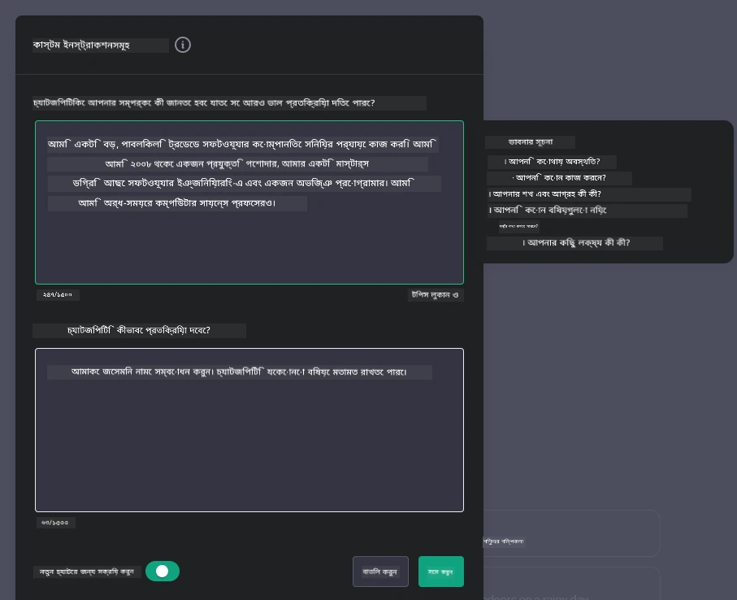

# প্রজেনারেটিভ AI চালিত চ্যাট অ্যাপ্লিকেশন তৈরি

[](https://youtu.be/R9V0ZY1BEQo?si=IHuU-fS9YWT8s4sA)

> _(এই পাঠের ভিডিও দেখতে উপরের ছবিতে ক্লিক করুন)_

যেহেতু আমরা দেখেছি কিভাবে আমরা টেক্সট-জেনারেশন অ্যাপ তৈরি করতে পারি, চলুন চ্যাট অ্যাপ্লিকেশনের দিকে তাকাই।

চ্যাট অ্যাপ্লিকেশনগুলো আমাদের দৈনন্দিন জীবনে মিশে গেছে, যেগুলি কেবল নির্দিষ্ট আলাপচারিতার মাধ্যম হিসেবে নয়। এরা কাস্টমার সার্ভিস, টেকনিক্যাল সাপোর্ট এবং এমনকি জটিল পরামর্শমূলক সিস্টেমের অবিচ্ছেদ্য অংশ। সম্ভবত আপনি সম্প্রতি একটি চ্যাট অ্যাপ্লিকেশন থেকে কিছু সাহায্য পেয়েছেন। আমরা যখন প্রজেনারেটিভ AI এর মতো উন্নত প্রযুক্তি এই প্ল্যাটফর্মগুলোতে সংযুক্ত করি, তখন জটিলতাও বাড়ে এবং চ্যালেঞ্জগুলোও বেড়ে যায়।

আমাদের উত্তর প্রয়োজন এমন কয়েকটি প্রশ্ন:

- **অ্যাপ্লিকেশন তৈরি**। আমরা কীভাবে দক্ষভাবে এই AI-চালিত অ্যাপ্লিকেশনগুলো নির্দিষ্ট ব্যবহার ক্ষেত্রে জন্য তৈরি ও সুনির্দিষ্টভাবে সংযুক্ত করব?
- **মনিটরিং**। একবার ডিপ্লয় করার পর, কীভাবে আমরা অ্যাপ্লিকেশনগুলো সর্বোচ্চ মান বজায় রেখে কার্যকরভাবে কাজ করছে তা পর্যবেক্ষণ করব, কার্যকারিতা এবং [দায়িত্বশীল AI এর ছয় মূলনীতি](https://www.microsoft.com/ai/responsible-ai?WT.mc_id=academic-105485-koreyst) অনুসরণের দিক থেকে?

যেহেতু আমরা স্বয়ংক্রিয়তা এবং নির্বিঘ্ন মানব-মেশিন যোগাযোগ দ্বারা সংজ্ঞায়িত যুগে প্রবেশ করছি, প্রজেনারেটিভ AI কীভাবে চ্যাট অ্যাপ্লিকেশনের পরিধি, গভীরতা, এবং অভিযোজনক্ষমতা রূপান্তরিত করে তা বোঝা অপরিহার্য। এই পাঠটি এই জটিল সিস্টেমগুলোকে সমর্থনকারী স্থাপত্যের দিকগুলো তদন্ত করবে, ডোমেইন-সংশ্লিষ্ট কাজের জন্য সেগুলোর ফাইন-টিউনিং এর পদ্ধতি বিশ্লেষণ করবে এবং দায়িত্বশীল AI ডিপ্লয়মেন্ট নিশ্চিত করার জন্য প্রাসঙ্গিক মেট্রিক্স ও বিবেচনাগুলো মূল্যায়ন করবে।

## ভূমিকা

এই পাঠে যা কাভার করা হবে:

- চ্যাট অ্যাপ্লিকেশন দক্ষতার সাথে তৈরি ও সংযুক্ত করার প্রযুক্তি।
- কাস্টমাইজেশন এবং ফাইন-টিউনিং প্রয়োগ করার পদ্ধতি।
- চ্যাট অ্যাপ্লিকেশন কার্যকরভাবে মনিটর করার কৌশল ও বিবেচনা।

## শেখার লক্ষ্য

এই পাঠ শেষ হওয়ার আগেই, আপনি সক্ষম হবেন:

- বিদ্যমান সিস্টেমে চ্যাট অ্যাপ্লিকেশন তৈরি ও সংযোজন করার বিবেচনা ব্যাখ্যা করতে।
- নির্দিষ্ট ব্যবহার-কেসের জন্য চ্যাট অ্যাপ্লিকেশন কাস্টমাইজ করতে।
- AI-চালিত চ্যাট অ্যাপ্লিকেশনের গুণমান রক্ষা ও মনিটর করার জন্য মূল মেট্রিক্স ও বিবেচনা সনাক্ত করতে।
- চ্যাট অ্যাপ্লিকেশনগুলি দায়িত্বশীল AI ব্যবহার করে কাজ করছে তা নিশ্চিত করতে।

## প্রজেনারেটিভ AI চ্যাট অ্যাপ্লিকেশনে সংযুক্তকরণ

প্রজেনারেটিভ AI দ্বারা চ্যাট অ্যাপ্লিকেশনগুলোকে উন্নত করা কেবল তা স্মার্ট করা নয়; এটি তাদের স্থাপত্য, কর্মক্ষমতা এবং ব্যবহারকারীর ইন্টারফেস অপ্টিমাইজ করে শ্রেষ্ঠমানের ব্যবহারকারীর অভিজ্ঞতা প্রদান করা। এর মধ্যে রয়েছে স্থাপত্যগত ভিত্তি, API সংযোজন, এবং UI বিবেচনা। এই অংশটি আপনাকে এই জটিল ক্ষেত্রগুলো পরিচালনার জন্য সম্পূর্ণ পথনির্দেশনা প্রদান করবে, আপনি যেভাবেই হোক বিদ্যমান সিস্টেমে সংযোগই করুন বা স্বাধীন প্ল্যাটফর্ম হিসেবে তৈরিই করুন।

এই অংশ শেষে, আপনি দক্ষতার সাথে চ্যাট অ্যাপ্লিকেশন তৈরি ও সংযুক্ত করার দক্ষতা অর্জন করবেন।

### চ্যাটবট না কি চ্যাট অ্যাপ্লিকেশন?

চ্যাট অ্যাপ্লিকেশন তৈরি শুরু করার আগে, আসুন 'চ্যাটবট' ও 'AI-চালিত চ্যাট অ্যাপ্লিকেশন' এর মধ্যে তুলনা করি, যা আলাদা ভূমিকা ও কার্যকারিতা পালন করে। চ্যাটবটের প্রধান উদ্দেশ্য হল নির্দিষ্ট কথোপকথনমূলক কাজ স্বয়ংক্রিয়করণ, যেমন সাধারণ প্রশ্নের উত্তর দেয়া বা প্যাকেজ ট্র্যাকিং। এটি সাধারণত নিয়মভিত্তিক লজিক অথবা জটিল AI অ্যালগরিদম দ্বারা পরিচালিত হয়। বিপরীতে, AI-চালিত চ্যাট অ্যাপ্লিকেশন একটি বহুমুখী পরিবেশ যেখানে মানব ব্যবহারকারীদের মধ্যে টেক্সট, ভয়েস, এবং ভিডিও চ্যাটের মতো বিভিন্ন ডিজিটাল যোগাযোগ সহজ হয়। এর প্রধান বৈশিষ্ট্য হলো একটি প্রজেনারেটিভ AI মডেলের সংযোজন, যা সূক্ষ্মতম ও মানবসদৃশ কথোপকথন সৃষ্টিতে সক্ষম, যা বিভিন্ন ইনপুট ও প্রসঙ্গ অনুযায়ী উত্তর তৈরি করে। প্রজেনারেটিভ AI চালিত চ্যাট অ্যাপ্লিকেশন মুক্ত-ডোমেইন আলোচনায় জড়িত হতে পারে, কথা চলতে চলতে পরিবেশের সাথে খাপ খাইয়ে নিতে পারে এবং সৃজনশীল বা জটিল সংলাপও তৈরি করতে পারে।

নিচের টেবিলটি তাদের মূল পার্থক্য ও সাদৃশ্যগুলোর সারাংশ তুলে ধরে, যা ডিজিটাল যোগাযোগে তাদের পৃথক ভূমিকা বোঝাতে সহায়ক।

| চ্যাটবট                              | প্রজেনারেটিভ AI চালিত চ্যাট অ্যাপ্লিকেশন |
| ------------------------------------- | -------------------------------------- |
| কাজ-কেন্দ্রিক ও নিয়মভিত্তিক             | প্রসঙ্গ সচেতন                           |
| প্রায়শই বড় সিস্টেমে সংযুক্ত            | এক বা একাধিক চ্যাটবট হোস্ট করতে পারে    |
| প্রোগ্রাম্ড কার্যাবলীতে সীমাবদ্ধ          | প্রজেনারেটিভ AI মডেল অন্তর্ভুক্ত করে     |
| বিশেষায়িত ও কাঠামোবদ্ধ আলাপচারিতা        | মুক্ত-ডোমেইন আলোচনা চালাতে সক্ষম          |

### SDK ও API ব্যবহার করে প্রি-বিল্ট ফাংশনালিটি কাজে লাগানো

চ্যাট অ্যাপ্লিকেশন তৈরি করার সময়, প্রথম ধাপ হিসাবে যা ইতিমধ্যে বিদ্যমান তা মূল্যায়ন করা যুক্তিযুক্ত। SDK ও API ব্যবহার করে চ্যাট অ্যাপ্লিকেশন তৈরি একটি কার্যকর কৌশল, কারণ এতে অনেক সুবিধা রয়েছে। ভাল ডকুমেন্টেড SDK ও API সংযুক্তিকরণ আপনার অ্যাপ্লিকেশনকে দীর্ঘস্থায়ী সফলতার জন্য সঠিক পথে নিয়ে যাবে, স্কেলেবিলিটি ও রক্ষণাবেক্ষণের সমস্যা মোকাবেলা করবে।

- **উন্নয়ন প্রক্রিয়া দ্রুততর করে ও অতিরিক্ত জটিলতা কমায়**: নিজে থেকে ফাংশনালিটি তৈরি করার ব্যয়বহুল প্রক্রিয়ার পরিবর্তে প্রি-বিল্ট ফাংশনালিটি ব্যবহার করলে আপনি অ্যাপ্লিকেশনের অন্যান্য গুরুত্বপূর্ণ অংশ যেমন ব্যবসায়িক লজিকে মনোনিবেশ করতে পারবেন।
- **উচ্চতর কর্মক্ষমতা**: ফাংশনালিটি নিজে থেকে তৈরির সময় আপনি শেষ পর্যন্ত প্রশ্ন করবেন "এটি কতটুকু স্কেল হয়? কি এই অ্যাপ্লিকেশন আকস্মিক ব্যবহারকারী বৃদ্ধির চাপ সামলাতে সক্ষম?" ভালো রক্ষণাবেক্ষণকৃত SDK ও API সাধারণত এই সমস্যাগুলোর সমাধান অন্তর্নিহিত করে।
- **সহজ রক্ষণাবেক্ষণ**: নতুন ভার্শন রিলিজে শুধু লাইব্রেরি আপডেট করলেই অধিকাংশ API এবং SDK আপডেট এবং উন্নতি পরিচালনা সহজ হয়।
- **সর্বাধুনিক প্রযুক্তি ব্যবহারের সুযোগ**: বৃহৎ ডেটাসেট দ্বারা প্রশিক্ষিত ও ফাইন-টিউনড মডেলগুলো ব্যবহার করে আপনার অ্যাপ্লিকেশনে প্রাকৃত ভাষার ক্ষমতা বৃদ্ধি পায়।

SDK বা API এর ফাংশনালিটি অ্যাক্সেস করতে সাধারণত সেবাগুলো ব্যবহারের অনুমতি নিতে হয়, যা প্রায়ই একটি ইউনিক কি বা অথেন্টিকেশন টোকেনের মাধ্যমে হয়। আমরা OpenAI Python লাইব্রেরি ব্যবহার করে এটি কী রকম হয় তা অন্বেষণ করব। আপনি নিম্নলিখিত [OpenAI এর জন্য নোটবুক](./python/oai-assignment.ipynb?WT.mc_id=academic-105485-koreyst) বা এই পাঠের জন্য [Azure OpenAI সার্ভিসের জন্য নোটবুক](./python/aoai-assignment.ipynb?WT.mc_id=academic-105485-koreys) স্বয়ংক্রিয় পরীক্ষাও করতে পারেন।

```python
import os
from openai import OpenAI

API_KEY = os.getenv("OPENAI_API_KEY","")

client = OpenAI(
    api_key=API_KEY
    )

response = client.responses.create(model="gpt-5-mini", input="Suggest two titles for an instructional lesson on chat applications for generative AI.", store=False)
print(response.output_text)
```

উপরোক্ত উদাহরণে GPT-5 মিনি মডেল ব্যবহার করে Responses API জন্য প্রম্পট সম্পন্ন করা হয়েছে, তবে লক্ষ্য করুন API কী সেট করার আগে এ কাজ করা হয়নি। যদি কী সেট না করেন তবে একটি ত্রুটি পাবেন।

## ব্যবহারকারীর অভিজ্ঞতা (UX)

সাধারণ UX নীতিমালা চ্যাট অ্যাপ্লিকেশনে প্রযোজ্য, তবে এখানে বিশেষ কিছু বিবেচনা এসেছে যা মেশিন লার্নিং উপাদানের কারণে গুরুত্বপূর্ণ হয়ে যায়।

- **অস্পষ্টতার সমাধানের প্রক্রিয়া**: প্রজেনারেটিভ AI মডেল মাঝে মাঝে অস্পষ্ট উত্তর তৈরি করতে পারে। একটি ফিচার যা ব্যবহারকারীদের স্পষ্টকরণের জন্য অনুরোধ করতে সাহায্য করে, তা সমস্যা হলে কার্যকর।
- **প্রসঙ্গ ধরে রাখা**: উন্নত প্রজেনারেটিভ AI মডেলের কথোপকথনে প্রসঙ্গ স্মরণ করার ক্ষমতা থাকে, যা ব্যবহারকারীর অভিজ্ঞতার জন্য গুরুত্বপূর্ণ। ব্যবহারকারীদের প্রসঙ্গ নিয়ন্ত্রণ করার ক্ষমতা দিলে অভিজ্ঞতা উন্নত হয়, তবে সংবেদশীল তথ্য সংরক্ষণের ঝুঁকি বাড়ে। কতক্ষণ তথ্য সংরক্ষণ করা হবে (যেমন রিটেনশন পলিসি) সেই বিষয় বিবেচনা করে গোপনীয়তা ও প্রসঙ্গের প্রয়োজনের মাঝে ভারসাম্য রাখা হয়।
- **ব্যক্তিগতকরণ**: শেখার এবং অভিযোজনের ক্ষমতা দিয়ে AI মডেল ব্যবহারকারীর জন্য স্বতন্ত্র অভিজ্ঞতা প্রদান করে। ব্যবহারকারীর প্রোফাইলের মতো ফিচারের মাধ্যমে UX ব্যক্তিগতকরণ ব্যবহারকারীর বোঝাপড়া বাড়ায় এবং নির্দিষ্ট উত্তর খুঁজে পেতে সাহায্য করে, যা আরও দক্ষ ও সন্তোষজনক আলাপচারিতা তৈরি করে।

ব্যক্তিগতকরণের একটি উদাহরণ হলো OpenAI এর ChatGPT তে "কাস্টম ইনস্ট্রাকশনস" সেটিংস। এতে আপনি আপনার বিষয়ে গুরুত্বপূর্ণ প্রসঙ্গ সংক্রান্ত তথ্য সরবরাহ করতে পারেন। নীচে একটি কাস্টম ইনস্ট্রাকশনের উদাহরণ দেওয়া হয়েছে।



এই "প্রোফাইল" ChatGPT কে লিঙ্কড লিস্ট নিয়ে একটি পাঠ পরিকল্পনা তৈরির জন্য নির্দেশ দেয়। লক্ষ্য করুন ChatGPT ব্যবহারকারীর অভিজ্ঞতার ওপর ভিত্তি করে গভীরতর পাঠ পরিকল্পনা তৈরি করার চেষ্টা করছে।


### মাইক্রোসফটের সিস্টেম মেসেজ ফ্রেমওয়ার্ক ফর লার্জ ল্যাঙ্গুয়েজ মডেলস

[মাইক্রোসফট নির্দেশনা প্রদান করেছে](https://learn.microsoft.com/azure/ai-foundry/openai/concepts/system-message#define-the-models-output-format?WT.mc_id=academic-105485-koreyst) LLM থেকে প্রতিক্রিয়া উৎপাদনের সময় কার্যকর সিস্টেম মেসেজ লেখার জন্য, যা ৪টি বিভাগের মধ্যে বিভক্ত:

১. মডেলটি কার জন্য, তার ক্ষমতা ও সীমাবদ্ধতা নির্ধারণ।
২. মডেলের আউটপুট ফরম্যাট নির্ধারণ।
৩. নির্দিষ্ট উদাহরণ প্রদান যেগুলো মডেলের প্রত্যাশিত আচরণ প্রদর্শন করে।
৪. অতিরিক্ত আচরণগত নিরাপত্তা প্রণালী প্রদান।

### প্রবেশযোগ্যতা

ব্যবহারকারী দৃষ্টি, শ্রবণ, মোটর বা জ্ঞানীয় প্রতিবন্ধকতা থাকুক না থাকুক, একটি ভাল ডিজাইনকৃত চ্যাট অ্যাপ্লিকেশন সকলের ব্যবহারের উপযোগী হওয়া উচিত। নিচের তালিকায় বিভিন্ন প্রতিবন্ধকতার জন্য প্রবেশযোগ্যতা উন্নত করার নির্দিষ্ট বৈশিষ্ট্যগুলো বর্ণনা করা হয়েছে।

- **দৃষ্টিহীনতার জন্য বৈশিষ্ট্য**: উচ্চ কনট্রাস্ট থিম, রিসাইজেবল টেক্সট, স্ক্রীন রিডার কম্প্যাটিবিলিটি।
- **শ্রবণ প্রতিবন্ধকতার জন্য বৈশিষ্ট্য**: টেক্সট-টু-স্পিচ ও স্পিচ-টু-টেক্সট ফাংশন, অডিও নোটিফিকেশন এর জন্য ভিজ্যুয়াল সংকেত।
- **মোটর প্রতিবন্ধকতার জন্য বৈশিষ্ট্য**: কীবোর্ড নেভিগেশন সাপোর্ট, ভয়েস কমান্ড।
- **জ্ঞানীয় প্রতিবন্ধকতার জন্য বৈশিষ্ট্য**: সরল ভাষার বিকল্পসমূহ।

## ডোমেইন-নির্দিষ্ট ভাষা মডেলের জন্য কাস্টমাইজেশন এবং ফাইন-টিউনিং

কল্পনা করুন একটি চ্যাট অ্যাপ্লিকেশন যা আপনার কোম্পানির ভাষা বুঝতে পারে এবং তার ব্যবহারকারীদের সাধারণ প্রশ্নগুলোর পূর্বানুমান করতে পারে। উল্লেখ করার মতো কয়েকটি পদ্ধতি আছে:

- **DSL মডেল ব্যবহার**। DSL মানে ডোমেইন স্পেসিফিক ভাষা। আপনি একটি নির্দিষ্ট ডোমেইনে প্রশিক্ষিত DSL মডেল ব্যবহার করে এর ধারণা ও পরিস্থিতি বোঝাতে পারেন।
- **ফাইন-টিউনিং প্রয়োগ**। ফাইন-টিউনিং মানে আপনার মডেলকে নির্দিষ্ট ডেটা ব্যবহার করে আরও প্রশিক্ষণ দেওয়া।

## কাস্টমাইজেশন: একটি DSL ব্যবহার

ডোমেইন-নির্দিষ্ট ভাষার মডেল (DSL মডেল) ব্যবহার করে ব্যবহারকারীর সম্পৃক্ততা বাড়ানো যায়, কারণ তারা বিশেষায়িত ও প্রসঙ্গানুসারিত আলাপচারিতা প্রদান করে। এটি এমন একটি মডেল যা একটি নির্দিষ্ট ক্ষেত্র, শিল্প বা বিষয়ের সম্পর্কিত টেক্সট বোঝার এবং জেনারেট করার জন্য প্রশিক্ষিত বা ফাইন-টিউন করা হয়। DSL মডেল ব্যবহারের বিকল্পগুলোর মধ্যে রয়েছে স্ক্র্যাচ থেকে প্রশিক্ষণ, অথবা SDK ও API এর মাধ্যমে পূর্ব-অস্তিত্বর মডেল ব্যবহার। অন্য একটি বিকল্প হলো ফাইন-টিউনিং, যেখানে একটি পূর্বপ্রশিক্ষিত মডেল গ্রহণ করে সেটিকে নির্দিষ্ট ডোমেইনের জন্য অভিযোজিত করা হয়।

## কাস্টমাইজেশন: ফাইন-টিউনিং প্রয়োগ

ফাইন-টিউনিং সাধারণত যখন একটি পূর্বপ্রশিক্ষিত মডেল বিশেষায়িত ডোমেইন বা নির্দিষ্ট কাজের জন্য অপর্যাপ্ত হয় তখন বিবেচনা করা হয়।

উদাহরণস্বরূপ, চিকিৎসাসংক্রান্ত প্রশ্ন জটিল এবং অনেক প্রসঙ্গ প্রয়োজন। একজন চিকিৎসক রোগ নির্ণয় করেন জীবনশৈলী, পূর্ববর্তী অবস্থা ইত্যাদি বিভিন্ন উপাদানের ভিত্তিতে এবং সম্প্রতি প্রকাশিত চিকিৎসা জার্নাল ব্যবহার করতে পারেন। এমন সূক্ষ্ম পরিস্থিতিতে, সাধারণ উদ্দেশ্যের AI চ্যাট অ্যাপ্লিকেশন একটি নির্ভরযোগ্য উৎস হতে পারে না।

### পরিস্থিতি: একটি চিকিৎসা অ্যাপ্লিকেশন

একটি চ্যাট অ্যাপ্লিকেশন কল্পনা করুন যা চিকিৎসককে দ্রুত রেফারেন্স দেয় চিকিত্সা নির্দেশিকা, ওষুধের পারস্পরিক প্রভাব, বা সাম্প্রতিক গবেষণার তথ্য।

সাধারণ উদ্দেশ্যের একটি মডেল মৌলিক চিকিৎসা প্রশ্নের উত্তর দিতে বা সাধারণ পরামর্শ দিতে সক্ষম হতে পারে, তবে নিম্নলিখিত ক্ষেত্রে সমস্যায় পড়তে পারে:

- **অত্যন্ত নির্দিষ্ট বা জটিল ক্ষেত্রে**। যেমন, এক নিউরোলজিস্ট অ্যাপ্লিকেশনকে জিজ্ঞেস করতে পারেন, "শিশু রোগীদের ওষুধ-প্রতিরোধী এপিলেপসির ব্যবস্থাপনার বর্তমান শ্রেষ্ঠ চর্চা কী?"
- **সম্প্রতি উন্নতির অভাব**। সাধারণ মডেল সর্বশেষ নিউরোলজি ও ফার্মাকোলজির উন্নতিগুলো অন্তর্ভুক্ত একটি বর্তমান উত্তর দিতে সমস্যায় পড়তে পারে।

এমন ক্ষেত্রে, একটি বিশেষায়িত চিকিৎসা ডেটাসেট দিয়ে মডেল ফাইন-টিউনিং এর মাধ্যমে এই জটিল চিকিৎসাসংক্রান্ত প্রশ্নগুলোর দক্ষ ও নিখুঁত উত্তর প্রদানের ক্ষমতা বৃদ্ধি পায়। এর জন্য প্রয়োজন ব্যাপক এবং প্রাসঙ্গিক ডেটাসেট যা ডোমেইন-নির্দিষ্ট সমস্যা ও প্রশ্নগুলোকে প্রতিনিধিত্ব করে।

## একটি উচ্চমানের AI-চালিত চ্যাট অভিজ্ঞতার জন্য বিবেচনাপত্র

এই অংশটি "উচ্চমানের" চ্যাট অ্যাপ্লিকেশনের মানদণ্ড উল্লেখ করে, যা কার্যকর মেট্রিক্স সংগ্রহ এবং দায়িত্বশীল AI প্রযুক্তির ব্যবহারের কাঠামো অনুসরণ করে।

### প্রধান মেট্রিক্স

একটি অ্যাপ্লিকেশনকে উচ্চমান বজায় রাখতে, মূল মেট্রিক্স এবং বিবেচনাগুলো নিরীক্ষণ করা অপরিহার্য। এই মাপগুলো শুধুমাত্র অ্যাপ্লিকেশন কার্যকারিতা নিশ্চিত করে না, বরং AI মডেল এবং ব্যবহারকারীর অভিজ্ঞতার গুণগত মানও মূল্যায়ন করে। নিচে মৌলিক, AI এবং ব্যবহারকারীর অভিজ্ঞতা মেট্রিক্সের তালিকা দেওয়া হল:

| মেট্রিক্স                    | সংজ্ঞা                                                                                                     | চ্যাট ডেভেলপারের বিবেচনা                                         |
| ----------------------------- | -------------------------------------------------------------------------------------------------------- | ----------------------------------------------------------------- |
| **আপটাইম**                   | ব্যবহারকারীরা অ্যাপ্লিকেশনটি কতক্ষণ চলমান ও প্রবেশযোগ্য তা পরিমাপ করে।                                  | আপনি কীভাবে ডাউনটাইম ন্যূনতম করবেন?                             |
| **প্রতিক্রিয়া সময়**         | ব্যবহারকারীর প্রশ্নের উত্তরে অ্যাপ্লিকেশনের নেওয়া সময়।                                                  | আপনি কীভাবে প্রশ্ন প্রক্রিয়াকরণ অপ্টিমাইজ করে প্রতিক্রিয়া সময় উন্নত করবেন? |
| **প্রিসিশন**                 | সত্য ইতিবাচক পূর্বাভাসের অনুপাত মোট ইতিবাচক পূর্বাভাসের মধ্যে।                                         | আপনি কীভাবে আপনার মডেলের প্রিসিশন যাচাই করবেন?                  |
| **রিকল (সংবেদনশীলতা)**       | সত্য ইতিবাচক পূর্বাভাসের অনুপাত মোট বাস্তব ইতিবাচকের মধ্যে।                                            | আপনি কীভাবে রিকল পরিমাপ ও উন্নত করবেন?                          |
| **এফ১ স্কোর**                | প্রিসিশন ও রিকলের হারমোনিক মেইন, যা দুইয়ের মধ্যে সমতা বজায় রাখে।                                     | আপনার লক্ষ্য এফ১ স্কোর কী? কীভাবে প্রিসিশন এবং রিকলের ভারসাম্য করবেন?    |
| **পারপ্লেক্সিটি**             | মডেল দ্বারা পূর্বাভাসকৃত সম্ভাব্যতা বিতরণ বাস্তব ডেটার বিতরণের সাথে কত ঘনিষ্ঠ তা পরিমাপ করে।           | আপনি কীভাবে পারপ্লেক্সিটি কমাবেন?                                  |
| **ব্যবহারকারী সন্তুষ্টির মেট্রিক্স** | ব্যবহারকারীর আবেদন বিষয়ক ধারণা পরিমাপ করে। সাধারণত জরিপের মাধ্যমে সংগ্রহ করা হয়।                     | আপনি কত ঘন ঘন ব্যবহারকারীর প্রতিক্রিয়া সংগ্রহ করবেন? কীভাবে সেই অনুযায়ী মানিয়ে নেবেন? |
| **ত্রুটির হার**               | মডেল বুঝতে বা আউটপুটে ভুল করার হার।                                                                     | ত্রুটি হ্রাসের জন্য আপনার কি কৌশল আছে?                            |
| **পুনঃপ্রশিক্ষণ চক্র**            | মডেল নতুন ডেটা এবং অন্তর্দৃষ্টি নিয়ে আপডেট করার ফ্রিকোয়েন্সি।                                       | আপনি কত ঘন ঘন মডেল পুনঃপ্রশিক্ষণ করবেন? পুনঃপ্রশিক্ষণের ট্রিগার কী?   |

| **অস্বাভাবিকতা সনাক্তকরণ**         | অস্বাভাবিক বা প্রত্যাশিত আচরণের সাথে মিল না খাওয়া নিদর্শনগুলো চিহ্নিত করার জন্য সরঞ্জাম ও কৌশল।                        | আপনি অস্বাভাবিকতার প্রতি কীভাবে প্রতিক্রিয়া দেখাবেন?                                        |

### চ্যাট অ্যাপ্লিকেশনগুলিতে দায়িত্বশীল AI অনুশীলন বাস্তবায়ন

মাইক্রোসফটের দায়িত্বশীল AI দৃষ্টিভঙ্গিতে ছয়টি নীতিমালা চিহ্নিত করা হয়েছে যা AI উন্নয়ন এবং ব্যবহারের পথপ্রদর্শক হওয়া উচিত। নীচে নীতিগুলো, তাদের সংজ্ঞা এবং একটি চ্যাট ডেভেলপারকে যা বিবেচনা করা উচিত এবং কেন তা গুরুত্ব সহকারে নেওয়া উচিত তা দেওয়া আছে।

| নীতিমালা              | মাইক্রোসফটের সংজ্ঞা                              | চ্যাট ডেভেলপারের জন্য বিবেচ্য বিষয়                                    | কেন এটি গুরুত্বপূর্ণ                                                                        |
| ---------------------- | ----------------------------------------------------- | ---------------------------------------------------------------------- | -------------------------------------------------------------------------------------- |
| ন্যায্যতা                 | AI সিস্টেম সকল মানুষের প্রতি ন্যায্য থাকা উচিত।       | নিশ্চিত করুন চ্যাট অ্যাপ্লিকেশন ব্যবহারকারীদের তথ্যের ভিত্তিতে বৈষম্য না করে।  | ব্যবহারকারীদের মধ্যে বিশ্বাস ও অন্তর্ভুক্তি তৈরি করার জন্য; আইনি জটিলতা এড়াতে।                |
| নির্ভরযোগ্যতা এবং নিরাপত্তা | AI সিস্টেম নির্ভরযোগ্য এবং নিরাপদ হতে হবে।            | ত্রুটি ও ঝুঁকি কমাতে পরীক্ষা এবং ফেইল-সেফ প্রণালী বাস্তবায়ন করুন।         | ব্যবহারকারীর সন্তুষ্টি নিশ্চিত করে এবং সম্ভাব্য ক্ষতি রোধ করে।                                 |
| গোপনীয়তা এবং নিরাপত্তা    | AI সিস্টেম নিরাপদ হতে হবে এবং গোপনীয়তা সম্মান করতে হবে। | শক্তিশালী এনক্রিপশন এবং ডেটা সুরক্ষা ব্যবস্থা প্রয়োগ করুন।              | সংবেদনশীল ব্যবহারকারী তথ্য সুরক্ষিত রাখতে এবং গোপনীয়তা আইন মেনে চলতে।                         |
| অন্তর্ভুক্তিমূলকতা           | AI সিস্টেম সবার ক্ষমতায়ন করা এবং মানুষকে সম্পৃক্ত করা উচিত। | বিভিন্ন দর্শকদের জন্য অ্যাক্সেসযোগ্য ও ব্যবহার-বান্ধব UI/UX ডিজাইন করুন। | অ্যাপ্লিকেশনটি অধিক সংখ্যক মানুষ দক্ষতার সাথে ব্যবহার করতে পারে তা নিশ্চিত করে।                   |
| স্বচ্ছতা                   | AI সিস্টেম বোঝার যোগ্য হওয়া উচিত।                | AI প্রতিক্রিয়ার জন্য সুস্পষ্ট ডকুমেন্টেশন এবং যুক্তি প্রদান করুন।            | ব্যবহারকারীরা সিদ্ধান্ত গ্রহণ প্রক্রিয়া বুঝতে পারলে সিস্টেমের প্রতি তাদের বিশ্বাস বাড়ে। |
| জবাবদিহিতা                | AI সিস্টেমের জন্য মানুষদের জবাবদিহি থাকা উচিত।          | AI সিদ্ধান্ত পর্যবেক্ষণ এবং উন্নতির জন্য একটি পরিষ্কার প্রক্রিয়া স্থাপন করুন।     | ভুল হলে চলমান উন্নতি এবং সংশোধনমূলক ব্যবস্থা গ্রহণে সাহায্য করে।               |

## অ্যাসাইনমেন্ট

দেখুন [assignment](../../../07-building-chat-applications/python)। এটি আপনাকে ধাপে ধাপে প্রথম চ্যাট প্রম্পট চালানো থেকে শুরু করে টেক্সট শ্রেণীবিভাগ ও সারাংশ তৈরি করা এবং আরও অনেক কিছু শেখাবে। লক্ষ্য করুন অ্যাসাইনমেন্টগুলো বিভিন্ন প্রোগ্রামিং ভাষায় উপলব্ধ!

## চমৎকার কাজ! যাত্রা চালিয়ে যান

এই পাঠ শেষ করার পর, আমাদের [Generative AI Learning collection](https://aka.ms/genai-collection?WT.mc_id=academic-105485-koreyst) দেখুন যাতে আপনি আপনার জেনারেটিভ AI জ্ঞানে উন্নতি চালিয়ে যেতে পারেন!

পাঠ ৮ এ যান এবং দেখুন কিভাবে আপনি [search applications তৈরি করতে শুরু করতে পারেন](../08-building-search-applications/README.md?WT.mc_id=academic-105485-koreyst)!

---

<!-- CO-OP TRANSLATOR DISCLAIMER START -->
**অস্বীকৃতি**:
এই নথিটি AI অনুবাদ পরিষেবা [Co-op Translator](https://github.com/Azure/co-op-translator) ব্যবহার করে অনূদিত হয়েছে। যদিও আমরা শুদ্ধতার জন্য চেষ্টা করি, অনুগ্রহ করে মনে রাখবেন যে স্বয়ংক্রিয় অনুবাদে ত্রুটি বা অসঙ্গতি থাকতে পারে। মূল নথিটি তার স্বভাষায় কর্তৃত্বপূর্ণ উৎস হিসেবে বিবেচিত হওয়া উচিত। গুরুত্বপূর্ণ তথ্যের জন্য পেশাদার মানব অনুবাদ সুপারিশ করা হয়। এই অনুবাদের ব্যবহারে প্রয়োজনীয় ভুল বোঝাবুঝি বা ভুল ব্যাখ্যার জন্য আমরা দায়বদ্ধ নই।
<!-- CO-OP TRANSLATOR DISCLAIMER END -->