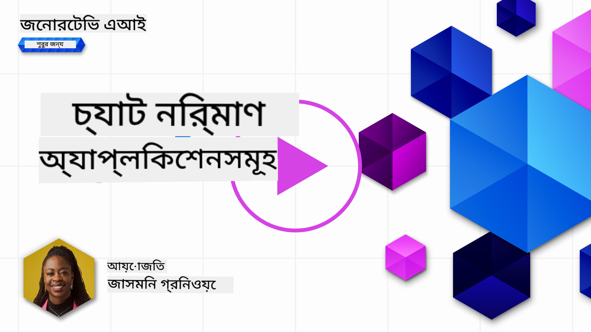
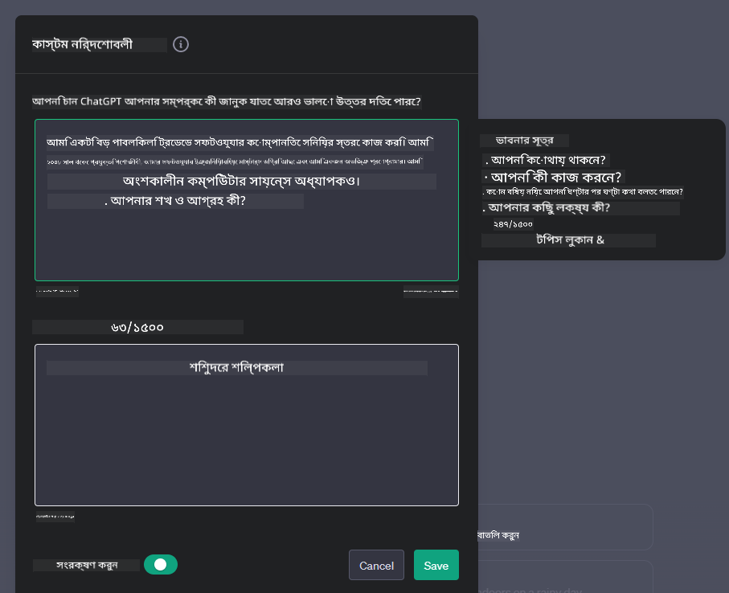

<!--
CO_OP_TRANSLATOR_METADATA:
{
  "original_hash": "ea4bbe640847aafbbba14dae4625e9af",
  "translation_date": "2025-07-09T12:22:04+00:00",
  "source_file": "07-building-chat-applications/README.md",
  "language_code": "bn"
}
-->
# জেনারেটিভ AI-চালিত চ্যাট অ্যাপ্লিকেশন তৈরি করা

[](https://aka.ms/gen-ai-lessons7-gh?WT.mc_id=academic-105485-koreyst)

> _(এই পাঠের ভিডিও দেখতে উপরের ছবিতে ক্লিক করুন)_

এখন যেহেতু আমরা দেখেছি কীভাবে টেক্সট-জেনারেশন অ্যাপ তৈরি করা যায়, চলুন চ্যাট অ্যাপ্লিকেশনগুলো সম্পর্কে জানি।

চ্যাট অ্যাপ্লিকেশনগুলো আমাদের দৈনন্দিন জীবনের সঙ্গে একীভূত হয়ে গেছে, যা শুধুমাত্র সাধারণ কথোপকথনের মাধ্যম নয়। এগুলো গ্রাহক সেবা, প্রযুক্তিগত সহায়তা এবং এমনকি জটিল পরামর্শদাতা সিস্টেমের অবিচ্ছেদ্য অংশ। সম্ভবত আপনি সম্প্রতি কোনো চ্যাট অ্যাপ্লিকেশন থেকে সাহায্য পেয়েছেন। আমরা যখন এই প্ল্যাটফর্মগুলোতে জেনারেটিভ AI-এর মতো উন্নত প্রযুক্তি সংযুক্ত করি, তখন জটিলতা এবং চ্যালেঞ্জ দুটোই বাড়ে।

আমাদের কিছু প্রশ্নের উত্তর জানা জরুরি:

- **অ্যাপ তৈরি করা**। কীভাবে আমরা দক্ষতার সঙ্গে এই AI-চালিত অ্যাপগুলো নির্দিষ্ট ব্যবহারের ক্ষেত্রে তৈরি ও নির্বিঘ্নে সংযুক্ত করতে পারি?
- **পর্যবেক্ষণ**। একবার ডিপ্লয় করার পর, কীভাবে আমরা নিশ্চিত করব যে অ্যাপ্লিকেশনগুলো কার্যকারিতা এবং [দায়িত্বশীল AI-এর ছয় নীতিমালা](https://www.microsoft.com/ai/responsible-ai?WT.mc_id=academic-105485-koreyst) অনুসারে সর্বোচ্চ মান বজায় রাখছে?

যখন আমরা স্বয়ংক্রিয়তা এবং নির্বিঘ্ন মানব-মেশিন ইন্টারঅ্যাকশনের যুগে প্রবেশ করছি, তখন বুঝতে হবে কীভাবে জেনারেটিভ AI চ্যাট অ্যাপ্লিকেশনগুলোর পরিধি, গভীরতা এবং অভিযোজন ক্ষমতাকে রূপান্তরিত করে। এই পাঠে আমরা এই জটিল সিস্টেমগুলোর আর্কিটেকচার, ডোমেন-নির্দিষ্ট কাজের জন্য ফাইন-টিউনিং পদ্ধতি এবং দায়িত্বশীল AI ডিপ্লয়মেন্ট নিশ্চিত করার জন্য প্রাসঙ্গিক মেট্রিক্স ও বিবেচনাগুলো বিশ্লেষণ করব।

## পরিচিতি

এই পাঠে আলোচনা করা হবে:

- চ্যাট অ্যাপ্লিকেশন দক্ষতার সঙ্গে তৈরি ও সংযুক্ত করার কৌশল।
- অ্যাপ্লিকেশনগুলোর কাস্টমাইজেশন ও ফাইন-টিউনিং প্রয়োগ।
- চ্যাট অ্যাপ্লিকেশন পর্যবেক্ষণের কৌশল ও বিবেচনা।

## শেখার লক্ষ্য

এই পাঠ শেষ করার পর আপনি সক্ষম হবেন:

- বিদ্যমান সিস্টেমে চ্যাট অ্যাপ্লিকেশন তৈরি ও সংযুক্ত করার বিবেচনাগুলো বর্ণনা করতে।
- নির্দিষ্ট ব্যবহারের জন্য চ্যাট অ্যাপ্লিকেশন কাস্টমাইজ করতে।
- AI-চালিত চ্যাট অ্যাপ্লিকেশনগুলোর গুণগত মান বজায় রাখতে প্রয়োজনীয় মেট্রিক্স ও বিবেচনাগুলো চিহ্নিত করতে।
- চ্যাট অ্যাপ্লিকেশনগুলো দায়িত্বশীলভাবে AI ব্যবহার করছে তা নিশ্চিত করতে।

## চ্যাট অ্যাপ্লিকেশনে জেনারেটিভ AI সংযুক্তকরণ

জেনারেটিভ AI-এর মাধ্যমে চ্যাট অ্যাপ্লিকেশন উন্নত করা মানে শুধু তাদের আরও বুদ্ধিমান করা নয়; এটি তাদের আর্কিটেকচার, কর্মক্ষমতা এবং ব্যবহারকারী ইন্টারফেস অপ্টিমাইজ করে একটি মানসম্পন্ন ব্যবহারকারীর অভিজ্ঞতা প্রদান করা। এর মধ্যে রয়েছে আর্কিটেকচারাল ভিত্তি, API ইন্টিগ্রেশন এবং UI বিবেচনা। এই অংশটি আপনাকে এই জটিল ক্ষেত্রগুলোতে পথনির্দেশ করবে, আপনি যদি বিদ্যমান সিস্টেমে সংযুক্ত করেন বা স্বতন্ত্র প্ল্যাটফর্ম হিসেবে তৈরি করেন।

এই অংশ শেষ করার পর, আপনি দক্ষতার সঙ্গে চ্যাট অ্যাপ্লিকেশন তৈরি ও সংযুক্ত করার দক্ষতা অর্জন করবেন।

### চ্যাটবট না চ্যাট অ্যাপ্লিকেশন?

চ্যাট অ্যাপ্লিকেশন তৈরি করার আগে, আসুন 'চ্যাটবট' এবং 'AI-চালিত চ্যাট অ্যাপ্লিকেশন' এর মধ্যে পার্থক্য দেখি, যাদের আলাদা ভূমিকা ও কার্যকারিতা রয়েছে। একটি চ্যাটবটের প্রধান উদ্দেশ্য হলো নির্দিষ্ট কথোপকথন কাজগুলো স্বয়ংক্রিয় করা, যেমন প্রায়শই জিজ্ঞাসিত প্রশ্নের উত্তর দেওয়া বা একটি প্যাকেজ ট্র্যাক করা। এটি সাধারণত নিয়ম-ভিত্তিক লজিক বা জটিল AI অ্যালগরিদম দ্বারা নিয়ন্ত্রিত। অন্যদিকে, AI-চালিত চ্যাট অ্যাপ্লিকেশন একটি বিস্তৃত পরিবেশ যা বিভিন্ন ধরনের ডিজিটাল যোগাযোগ যেমন টেক্সট, ভয়েস এবং ভিডিও চ্যাটের সুযোগ দেয়। এর প্রধান বৈশিষ্ট্য হলো একটি জেনারেটিভ AI মডেল সংযুক্ত করা, যা সূক্ষ্ম, মানবসদৃশ কথোপকথন অনুকরণ করে এবং বিভিন্ন ইনপুট ও প্রসঙ্গ অনুযায়ী প্রতিক্রিয়া তৈরি করে। একটি জেনারেটিভ AI-চালিত চ্যাট অ্যাপ্লিকেশন মুক্ত-ডোমেইন আলোচনা করতে পারে, কথোপকথনের প্রসঙ্গ অনুযায়ী মানিয়ে নিতে পারে এবং সৃজনশীল বা জটিল সংলাপও তৈরি করতে পারে।

নিচের টেবিলটি তাদের মূল পার্থক্য ও সাদৃশ্য তুলে ধরে, যা ডিজিটাল যোগাযোগে তাদের অনন্য ভূমিকা বোঝাতে সাহায্য করবে।

| চ্যাটবট                               | জেনারেটিভ AI-চালিত চ্যাট অ্যাপ্লিকেশন |
| ------------------------------------- | -------------------------------------- |
| কাজ-কেন্দ্রিক এবং নিয়মভিত্তিক          | প্রসঙ্গ-সচেতন                           |
| প্রায়শই বড় সিস্টেমে সংযুক্ত থাকে      | এক বা একাধিক চ্যাটবট হোস্ট করতে পারে    |
| প্রোগ্রামকৃত ফাংশনের মধ্যে সীমাবদ্ধ     | জেনারেটিভ AI মডেল অন্তর্ভুক্ত করে       |
| বিশেষায়িত ও কাঠামোবদ্ধ কথোপকথন       | মুক্ত-ডোমেইন আলোচনার সক্ষমতা রাখে       |

### SDK এবং API ব্যবহার করে পূর্বনির্মিত ফাংশনালিটি কাজে লাগানো

চ্যাট অ্যাপ্লিকেশন তৈরি করার সময়, প্রথম ধাপে যা আছে তা মূল্যায়ন করা ভালো। SDK এবং API ব্যবহার করে চ্যাট অ্যাপ্লিকেশন তৈরি করা বিভিন্ন কারণে লাভজনক। ভালোভাবে ডকুমেন্টেড SDK ও API সংযুক্ত করে, আপনি আপনার অ্যাপ্লিকেশনকে দীর্ঘমেয়াদী সফলতার জন্য প্রস্তুত করছেন, যা স্কেলেবিলিটি ও রক্ষণাবেক্ষণের সমস্যা মোকাবেলা করে।

- **উন্নয়ন প্রক্রিয়া দ্রুততর করে এবং ওভারহেড কমায়**: নিজে থেকে ফাংশনালিটি তৈরি করার ব্যয়বহুল প্রক্রিয়ার পরিবর্তে পূর্বনির্মিত ফাংশন ব্যবহার করলে আপনি আপনার অ্যাপ্লিকেশনের অন্যান্য গুরুত্বপূর্ণ দিক যেমন ব্যবসায়িক লজিকে মনোযোগ দিতে পারেন।
- **ভালো কর্মক্ষমতা**: নিজে থেকে ফাংশন তৈরি করার সময় আপনি প্রশ্ন করবেন, "এটি কীভাবে স্কেল করবে? হঠাৎ ব্যবহারকারীর সংখ্যা বেড়ে গেলে কী হবে?" ভালো রক্ষণাবেক্ষণকৃত SDK ও API-তে সাধারণত এই সমস্যাগুলোর সমাধান থাকে।
- **সহজ রক্ষণাবেক্ষণ**: নতুন সংস্করণ আসলে সাধারণত লাইব্রেরি আপডেট করলেই হয়, যা রক্ষণাবেক্ষণ সহজ করে।
- **সর্বাধুনিক প্রযুক্তি ব্যবহারের সুযোগ**: প্রশিক্ষিত ও ফাইন-টিউন করা মডেল ব্যবহার করে আপনার অ্যাপ্লিকেশন প্রাকৃতিক ভাষার দক্ষতা পায়।

SDK বা API-এর ফাংশনালিটি ব্যবহারের জন্য সাধারণত একটি অনন্য কী বা অথেনটিকেশন টোকেনের মাধ্যমে অনুমতি নিতে হয়। আমরা OpenAI Python লাইব্রেরি ব্যবহার করে এটি কীভাবে কাজ করে তা দেখব। আপনি নিজেও এই পাঠের জন্য [OpenAI-এর নোটবুক](../../../07-building-chat-applications/python/oai-assignment.ipynb) বা [Azure OpenAI সার্ভিসের নোটবুক](../../../07-building-chat-applications/python/aoai-assignment.ipynb) ব্যবহার করে চেষ্টা করতে পারেন।

```python
import os
from openai import OpenAI

API_KEY = os.getenv("OPENAI_API_KEY","")

client = OpenAI(
    api_key=API_KEY
    )

chat_completion = client.chat.completions.create(model="gpt-3.5-turbo", messages=[{"role": "user", "content": "Suggest two titles for an instructional lesson on chat applications for generative AI."}])
```

উপরের উদাহরণে GPT-3.5 Turbo মডেল ব্যবহার করে প্রম্পট সম্পন্ন করা হয়েছে, তবে লক্ষ্য করুন API কী সেট করা হয়েছে আগে থেকে। কী না দিলে ত্রুটি দেখাবে।

## ব্যবহারকারীর অভিজ্ঞতা (UX)

সাধারণ UX নীতিমালা চ্যাট অ্যাপ্লিকেশনে প্রযোজ্য, তবে এখানে কিছু অতিরিক্ত বিবেচনা রয়েছে যা মেশিন লার্নিং উপাদানের কারণে বিশেষভাবে গুরুত্বপূর্ণ।

- **অস্পষ্টতা মোকাবেলার ব্যবস্থা**: জেনারেটিভ AI মডেল মাঝে মাঝে অস্পষ্ট উত্তর তৈরি করে। ব্যবহারকারীরা যদি এমন সমস্যার সম্মুখীন হন, তাহলে স্পষ্টকরণের জন্য অনুরোধ করার সুবিধা থাকা দরকার।
- **প্রসঙ্গ সংরক্ষণ**: উন্নত জেনারেটিভ AI মডেল কথোপকথনের প্রসঙ্গ মনে রাখতে পারে, যা ব্যবহারকারীর অভিজ্ঞতার জন্য গুরুত্বপূর্ণ। ব্যবহারকারীদের প্রসঙ্গ নিয়ন্ত্রণ ও পরিচালনার সুযোগ দিলে অভিজ্ঞতা উন্নত হয়, তবে এতে সংবেদনশীল তথ্য সংরক্ষণের ঝুঁকি থাকে। তথ্য কতক্ষণ সংরক্ষণ করা হবে, যেমন রিটেনশন পলিসি প্রবর্তন, তা গোপনীয়তা ও প্রসঙ্গের প্রয়োজনের মধ্যে ভারসাম্য রক্ষা করে।
- **ব্যক্তিগতকরণ**: শেখার ও অভিযোজন ক্ষমতার কারণে AI মডেল ব্যবহারকারীর জন্য ব্যক্তিগতকৃত অভিজ্ঞতা প্রদান করে। ব্যবহারকারীর প্রোফাইলের মতো বৈশিষ্ট্য ব্যবহারকারীর অনুভূতিকে উন্নত করে এবং নির্দিষ্ট উত্তর খোঁজার প্রক্রিয়াকে আরও কার্যকর ও সন্তোষজনক করে তোলে।

ব্যক্তিগতকরণের একটি উদাহরণ হলো OpenAI-এর ChatGPT-র "Custom instructions" সেটিংস। এটি আপনাকে নিজের সম্পর্কে তথ্য দিতে দেয় যা আপনার প্রম্পটের জন্য গুরুত্বপূর্ণ প্রসঙ্গ হতে পারে। নিচে একটি কাস্টম ইনস্ট্রাকশনের উদাহরণ।



এই "প্রোফাইল" ChatGPT-কে লিঙ্কড লিস্ট নিয়ে একটি পাঠ পরিকল্পনা তৈরি করতে বলে। লক্ষ্য করুন ChatGPT ব্যবহারকারীর অভিজ্ঞতা বিবেচনা করে আরও গভীর পাঠ পরিকল্পনা তৈরি করছে।


### বড় ভাষা মডেলের জন্য Microsoft-এর সিস্টেম মেসেজ ফ্রেমওয়ার্ক

[Microsoft নির্দেশনা দিয়েছে](https://learn.microsoft.com/azure/ai-services/openai/concepts/system-message#define-the-models-output-format?WT.mc_id=academic-105485-koreyst) LLM থেকে প্রতিক্রিয়া তৈরি করার সময় কার্যকর সিস্টেম মেসেজ লেখার জন্য, যা ৪টি অংশে বিভক্ত:

1. মডেল কার জন্য, তার ক্ষমতা ও সীমাবদ্ধতা নির্ধারণ।
2. মডেলের আউটপুট ফরম্যাট নির্ধারণ।
3. মডেলের প্রত্যাশিত আচরণ প্রদর্শনের জন্য নির্দিষ্ট উদাহরণ প্রদান।
4. অতিরিক্ত আচরণগত গার্ডরেল প্রদান।

### প্রবেশযোগ্যতা

ব্যবহারকারীর দৃষ্টি, শ্রবণ, মোটর বা জ্ঞানীয় প্রতিবন্ধকতা যাই থাকুক না কেন, একটি ভালো ডিজাইনকৃত চ্যাট অ্যাপ্লিকেশন সবার জন্য ব্যবহারযোগ্য হওয়া উচিত। নিচের তালিকায় বিভিন্ন প্রতিবন্ধকতার জন্য প্রবেশযোগ্যতা বাড়ানোর নির্দিষ্ট বৈশিষ্ট্যগুলো তুলে ধরা হয়েছে।

- **দৃষ্টিশক্তি প্রতিবন্ধকতার জন্য বৈশিষ্ট্য**: উচ্চ কনট্রাস্ট থিম এবং রিসাইজেবল টেক্সট, স্ক্রিন রিডার সামঞ্জস্যতা।
- **শ্রবণ প্রতিবন্ধকতার জন্য বৈশিষ্ট্য**: টেক্সট-টু-স্পিচ এবং স্পিচ-টু-টেক্সট ফাংশন, অডিও নোটিফিকেশনের জন্য ভিজ্যুয়াল সংকেত।
- **মোটর প্রতিবন্ধকতার জন্য বৈশিষ্ট্য**: কীবোর্ড নেভিগেশন সাপোর্ট, ভয়েস কমান্ড।
- **জ্ঞানীয় প্রতিবন্ধকতার জন্য বৈশিষ্ট্য**: সরলীকৃত ভাষার অপশন।

## ডোমেন-নির্দিষ্ট ভাষা মডেলের জন্য কাস্টমাইজেশন ও ফাইন-টিউনিং

ভাবুন এমন একটি চ্যাট অ্যাপ্লিকেশন যা আপনার কোম্পানির বিশেষ শব্দভাণ্ডার বুঝতে পারে এবং ব্যবহারকারীদের সাধারণ প্রশ্নগুলো আগাম অনুমান করতে পারে। এখানে কয়েকটি পদ্ধতি উল্লেখযোগ্য:

- **DSL মডেল ব্যবহার**। DSL মানে ডোমেন-নির্দিষ্ট ভাষা। আপনি একটি DSL মডেল ব্যবহার করতে পারেন যা নির্দিষ্ট ডোমেনের ধারণা ও পরিস্থিতি বুঝতে প্রশিক্ষিত।
- **ফাইন-টিউনিং প্রয়োগ**। ফাইন-টিউনিং হলো আপনার মডেলকে নির্দিষ্ট ডেটা দিয়ে আরও প্রশিক্ষণ দেওয়ার প্রক্রিয়া।

## কাস্টমাইজেশন: DSL ব্যবহার

ডোমেন-নির্দিষ্ট ভাষা মডেল (DSL মডেল) ব্যবহার করে ব্যবহারকারীর সম্পৃক্ততা বাড়ানো যায় এবং বিশেষায়িত, প্রসঙ্গভিত্তিক কথোপকথন প্রদান করা যায়। এটি এমন একটি মডেল যা নির্দিষ্ট ক্ষেত্র, শিল্প বা বিষয়ের সাথে সম্পর্কিত টেক্সট বুঝতে ও তৈরি করতে প্রশিক্ষিত বা ফাইন-টিউন করা হয়। DSL মডেল ব্যবহারের অপশনগুলো হতে পারে নতুন করে প্রশিক্ষণ দেওয়া, অথবা SDK ও API-এর মাধ্যমে পূর্বনির্মিত মডেল ব্যবহার করা। আরেকটি বিকল্প হলো ফাইন-টিউনিং, যেখানে একটি পূর্বপ্রশিক্ষিত মডেলকে নির্দিষ্ট ডোমেনের জন্য অভিযোজিত করা হয়।

## কাস্টমাইজেশন: ফাইন-টিউনিং প্রয়োগ

যখন একটি পূর্বপ্রশিক্ষিত মডেল নির্দিষ্ট ডোমেন বা কাজের জন্য যথেষ্ট নয়, তখন ফাইন-টিউনিং বিবেচনা করা হয়।

উদাহরণস্বরূপ, চিকিৎসা সংক্রান্ত প্রশ্ন জটিল এবং অনেক প্রসঙ্গের প্রয়োজন। একজন চিকিৎসক রোগ নির্ণয় করার সময় জীবনযাপন, পূর্ববর্তী শারীরিক অবস্থা এবং সাম্প্রতিক চিকিৎসা জার্নাল ইত্যাদি বিবেচনা করেন। এমন সূক্ষ্ম পরিস্থিতিতে সাধারণ AI চ্যাট অ্যাপ্লিকেশন নির্ভরযোগ্য নয়।

### পরিস্থিতি: একটি চিকিৎসা অ্যাপ্লিকেশন

একটি চ্যাট অ্যাপ্লিকেশন যা চিকিৎসকদের দ্রুত চিকিৎসা নির্দেশিকা, ওষুধের পারস্পরিক ক্রিয়া বা সাম্প্রতিক গবেষণার তথ্য দিতে সাহায্য করে।

সাধারণ মডেল হয়তো মৌলিক চিকিৎসা প্রশ্নের উত্তর দিতে পারবে বা সাধারণ পরামর্শ দিতে পারবে, কিন্তু নিম্নলিখিত ক্ষেত্রে সমস্যায় পড়তে পারে:

- **অত্যন্ত নির্দিষ্ট বা জটিল মামলা**। যেমন, একজন নিউরোলজিস্ট অ্যাপ্লিকেশনটিকে জিজ্ঞাসা করতে পারেন, "শিশু রোগীদের ড্রাগ-প্রতিরোধী মৃগী ব্যবস্থাপনার সর্বশেষ সেরা পদ্ধতিগুলো কী?"
- **সাম্প্রতিক অগ্রগতি অনুপস্থিত**। সাধারণ মডেল হয়তো সাম্প্রতিক নিউরোলজি ও ফার্মাকোলজির অগ্রগতি অন্তর্ভুক্ত করে সঠিক উত্তর দিতে পারবে না।

এমন ক্ষেত্রে, বিশেষায়িত চিকিৎসা ডেটাসেট দিয়ে মডেল ফাইন-টিউন করলে এর জটিল চিকিৎসা প্রশ্নগুলো আরও সঠিক ও নির্ভরযোগ্যভাবে মোকাবেলা করার ক্ষমতা বৃদ্ধি পায়। এর জন্য বড় ও প্রাসঙ্গিক ডেটাসেটের প্রয়োজন, যা ডোমেন-নির্দিষ্ট চ্যালেঞ্জ ও প্রশ্নগুলো প্রতিনিধিত্ব করে।

## উচ্চমানের AI-চালিত চ্যাট অভিজ্ঞতার জন্য বিবেচনা

এই অংশে "উচ্চমানের" চ্যাট অ্যাপ্লিকেশনের মানদণ্ড তুলে ধরা হয়েছে, যার মধ্যে রয়েছে কার্যকর মেট্রিক্স সংগ্রহ এবং AI প্রযুক্তি দায়িত্বশীলভাবে ব্যবহারের জন্য একটি কাঠামো অনুসরণ।

### প্রধান মেট্রিক্স

একটি অ্যাপ্লিকেশনের উচ্চমানের কর্মক্ষমতা বজায় রাখতে, প্রধান মেট্রিক্স ও বিবেচনাগুলো নজর রাখা জরুরি। এই মাপদণ্ডগুলো শুধুমাত্র অ্যাপ্লিকেশনের কার্যকারিতা নিশ্চিত করে না, বরং AI মডেল ও ব্যবহারকারীর অভিজ্ঞতার গুণগত মানও মূল্যায়ন করে। নিচে মৌলিক, AI এবং ব্যবহারকারীর অভিজ্ঞতার মেট্রিক্সের একটি তালিকা দেওয়া হলো।

| মেট্রিক্স                      | সংজ্ঞা                                                                                                               | চ্যাট ডেভেলপারদের জন্য বিবেচনা                                         |
| ----------------------------- | -------------------------------------------------------------------------------------------------------------------- | --------------------------------------------------------------------- |
| **আপটাইম**                    | অ্যাপ্লিকেশন কতক্ষণ সচল ও ব্যবহারকারীদের জন্য প্রবেশযোগ্য থাকে তা পরিমাপ করে।                                         | আপনি কীভাবে ডাউনটাইম কমাবেন?                                           |
| **প্রতিক্রিয়া সময়**          | ব্যবহারকারীর প্রশ্নের উত্তর দিতে অ্যাপ্লিকেশন কত সময় নেয়।                                                           | কীভাবে প্রশ্ন প্রক্রিয়াকরণ অপ্টিমাইজ করে প্রতিক্রিয়া সময় উন্নত করবেন? |
| **প্রিসিশন**                 | সত্য ইতিবাচক পূর্বাভাসের অনুপাত মোট ইতিবাচক পূর্বাভাসের মধ্যে।                                                      | আপনার মডেলের প্রিসিশন কীভাবে যাচাই করবেন?                           |
| **রিকল (সংবেদন
| **অস্বাভাবিকতা সনাক্তকরণ**         | অপ্রত্যাশিত আচরণের সাথে খাপ খাওয়ানো অস্বাভাবিক প্যাটার্ন চিহ্নিত করার জন্য টুল এবং কৌশল।                        | অস্বাভাবিকতার প্রতি আপনি কীভাবে প্রতিক্রিয়া জানাবেন?                                        |

### চ্যাট অ্যাপ্লিকেশনগুলিতে দায়িত্বশীল AI অনুশীলন বাস্তবায়ন

Microsoft-এর দায়িত্বশীল AI-এর দৃষ্টিভঙ্গি ছয়টি নীতিমালা নির্ধারণ করেছে যা AI উন্নয়ন এবং ব্যবহারের জন্য পথপ্রদর্শক হওয়া উচিত। নিচে নীতিমালা, তাদের সংজ্ঞা, এবং চ্যাট ডেভেলপারদের জন্য বিবেচ্য বিষয়সমূহ এবং কেন এগুলো গুরুত্ব সহকারে নেওয়া উচিত তা দেওয়া হয়েছে।

| নীতিমালা             | Microsoft-এর সংজ্ঞা                                | চ্যাট ডেভেলপারদের জন্য বিবেচ্য বিষয়                                      | কেন এটি গুরুত্বপূর্ণ                                                                     |
| ---------------------- | ----------------------------------------------------- | ---------------------------------------------------------------------- | -------------------------------------------------------------------------------------- |
| ন্যায়পরায়ণতা               | AI সিস্টেম সকল মানুষকে ন্যায়পরায়ণভাবে আচরণ করা উচিত।            | নিশ্চিত করুন যে চ্যাট অ্যাপ্লিকেশন ব্যবহারকারীর তথ্যের ভিত্তিতে বৈষম্য করে না।  | ব্যবহারকারীদের মধ্যে বিশ্বাস এবং অন্তর্ভুক্তি গড়ে তোলার জন্য; আইনি জটিলতা এড়াতে।                |
| নির্ভরযোগ্যতা এবং নিরাপত্তা | AI সিস্টেম নির্ভরযোগ্য এবং নিরাপদভাবে কাজ করা উচিত।        | ত্রুটি এবং ঝুঁকি কমাতে পরীক্ষা এবং ব্যর্থতা প্রতিরোধ ব্যবস্থা বাস্তবায়ন করুন।         | ব্যবহারকারীর সন্তুষ্টি নিশ্চিত করে এবং সম্ভাব্য ক্ষতি রোধ করে।                                 |
| গোপনীয়তা এবং নিরাপত্তা   | AI সিস্টেম নিরাপদ এবং গোপনীয়তা রক্ষা করা উচিত।      | শক্তিশালী এনক্রিপশন এবং তথ্য সুরক্ষা ব্যবস্থা প্রয়োগ করুন।              | সংবেদনশীল ব্যবহারকারীর তথ্য সুরক্ষিত রাখতে এবং গোপনীয়তা আইন মেনে চলতে।                         |
| অন্তর্ভুক্তিমূলকতা          | AI সিস্টেম সবাইকে ক্ষমতায়িত করা এবং মানুষকে যুক্ত করা উচিত। | বিভিন্ন শ্রোতার জন্য সহজলভ্য এবং ব্যবহারবান্ধব UI/UX ডিজাইন করুন। | নিশ্চিত করে যে আরও বিস্তৃত মানুষ অ্যাপ্লিকেশনটি কার্যকরভাবে ব্যবহার করতে পারে।                   |
| স্বচ্ছতা           | AI সিস্টেম বোঝার যোগ্য হওয়া উচিত।                  | AI প্রতিক্রিয়ার জন্য স্পষ্ট ডকুমেন্টেশন এবং যুক্তি প্রদান করুন।            | ব্যবহারকারীরা সিস্টেমের সিদ্ধান্ত গ্রহণ প্রক্রিয়া বুঝতে পারলে তাদের বিশ্বাস বাড়ে। |
| দায়িত্বশীলতা         | AI সিস্টেমের জন্য মানুষ দায়িত্বশীল হওয়া উচিত।          | AI সিদ্ধান্তের নিরীক্ষণ এবং উন্নতির জন্য একটি স্পষ্ট প্রক্রিয়া প্রতিষ্ঠা করুন।     | ভুল হলে চলমান উন্নতি এবং সংশোধনমূলক ব্যবস্থা গ্রহণ সম্ভব করে।               |

## অ্যাসাইনমেন্ট

[assignment](../../../07-building-chat-applications/python) দেখুন, এটি আপনাকে প্রথম চ্যাট প্রম্পট চালানো থেকে শুরু করে টেক্সট শ্রেণীবিভাগ এবং সারাংশ তৈরি সহ বিভিন্ন অনুশীলনের মধ্য দিয়ে নিয়ে যাবে। লক্ষ্য করুন যে অ্যাসাইনমেন্টগুলো বিভিন্ন প্রোগ্রামিং ভাষায় উপলব্ধ!

## দুর্দান্ত কাজ! যাত্রা চালিয়ে যান

এই পাঠ শেষ করার পর, আমাদের [Generative AI Learning collection](https://aka.ms/genai-collection?WT.mc_id=academic-105485-koreyst) দেখুন যাতে আপনি আপনার Generative AI জ্ঞান আরও উন্নত করতে পারেন!

পাঠ ৮-এ যান এবং দেখুন কীভাবে আপনি [সার্চ অ্যাপ্লিকেশন তৈরি শুরু করতে পারেন](../08-building-search-applications/README.md?WT.mc_id=academic-105485-koreyst)!

**অস্বীকৃতি**:  
এই নথিটি AI অনুবাদ সেবা [Co-op Translator](https://github.com/Azure/co-op-translator) ব্যবহার করে অনূদিত হয়েছে। আমরা যথাসাধ্য সঠিকতার চেষ্টা করি, তবে স্বয়ংক্রিয় অনুবাদে ত্রুটি বা অসঙ্গতি থাকতে পারে। মূল নথিটি তার নিজস্ব ভাষায়ই কর্তৃত্বপূর্ণ উৎস হিসেবে বিবেচিত হওয়া উচিত। গুরুত্বপূর্ণ তথ্যের জন্য পেশাদার মানব অনুবাদ গ্রহণ করার পরামর্শ দেওয়া হয়। এই অনুবাদের ব্যবহারে সৃষ্ট কোনো ভুল বোঝাবুঝি বা ভুল ব্যাখ্যার জন্য আমরা দায়ী নই।