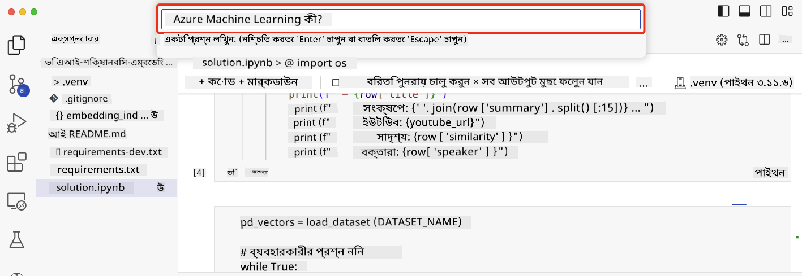

<!--
CO_OP_TRANSLATOR_METADATA:
{
  "original_hash": "d46aad0917a1a342d613e2c13d457da5",
  "translation_date": "2025-05-19T18:23:32+00:00",
  "source_file": "08-building-search-applications/README.md",
  "language_code": "bn"
}
-->
# সার্চ অ্যাপ্লিকেশন তৈরি করা

> > _এই পাঠের ভিডিও দেখতে উপরের ছবিতে ক্লিক করুন_

এলএলএমগুলো শুধুমাত্র চ্যাটবট এবং টেক্সট জেনারেশনের জন্য নয়। এমবেডিং ব্যবহার করে সার্চ অ্যাপ্লিকেশন তৈরি করাও সম্ভব। এমবেডিং হলো ডেটার সংখ্যাগত উপস্থাপনা, যা ভেক্টর নামেও পরিচিত, এবং ডেটার জন্য সেমান্টিক সার্চ করতে ব্যবহৃত হয়।

এই পাঠে, আপনি আমাদের শিক্ষা স্টার্টআপের জন্য একটি সার্চ অ্যাপ্লিকেশন তৈরি করবেন। আমাদের স্টার্টআপ একটি অলাভজনক প্রতিষ্ঠান যা উন্নয়নশীল দেশের শিক্ষার্থীদের বিনামূল্যে শিক্ষা প্রদান করে। আমাদের স্টার্টআপের অনেক ইউটিউব ভিডিও রয়েছে যা শিক্ষার্থীরা এআই সম্পর্কে শেখার জন্য ব্যবহার করতে পারে। আমাদের স্টার্টআপ একটি সার্চ অ্যাপ্লিকেশন তৈরি করতে চায় যা শিক্ষার্থীদের একটি প্রশ্ন টাইপ করে ইউটিউব ভিডিও খুঁজতে সাহায্য করবে।

উদাহরণস্বরূপ, একজন শিক্ষার্থী 'জুপিটার নোটবুক কী?' বা 'অ্যাজুর এমএল কী' টাইপ করতে পারে এবং সার্চ অ্যাপ্লিকেশন প্রশ্নটির সাথে সম্পর্কিত ইউটিউব ভিডিওগুলির একটি তালিকা প্রদান করবে এবং আরও ভালো, সার্চ অ্যাপ্লিকেশনটি ভিডিওতে প্রশ্নের উত্তর যেখানে অবস্থিত তার লিঙ্ক প্রদান করবে।

## ভূমিকা

এই পাঠে আমরা আলোচনা করব:

- সেমান্টিক বনাম কীওয়ার্ড সার্চ।
- টেক্সট এমবেডিং কী।
- একটি টেক্সট এমবেডিং ইনডেক্স তৈরি করা।
- একটি টেক্সট এমবেডিং ইনডেক্সে সার্চ করা।

## শেখার লক্ষ্য

এই পাঠ শেষ করার পর, আপনি সক্ষম হবেন:

- সেমান্টিক এবং কীওয়ার্ড সার্চের মধ্যে পার্থক্য বলতে।
- টেক্সট এমবেডিং কী তা ব্যাখ্যা করতে।
- ডেটা সার্চ করার জন্য এমবেডিং ব্যবহার করে একটি অ্যাপ্লিকেশন তৈরি করতে।

## কেন একটি সার্চ অ্যাপ্লিকেশন তৈরি করবেন?

একটি সার্চ অ্যাপ্লিকেশন তৈরি করা আপনাকে এমবেডিং ব্যবহার করে ডেটা সার্চ করার উপায়গুলি বুঝতে সাহায্য করবে। এছাড়াও, আপনি একটি সার্চ অ্যাপ্লিকেশন তৈরি করতে শিখবেন যা শিক্ষার্থীরা দ্রুত তথ্য খুঁজে পেতে ব্যবহার করতে পারে।

এই পাঠে মাইক্রোসফট [AI Show](https://www.youtube.com/playlist?list=PLlrxD0HtieHi0mwteKBOfEeOYf0LJU4O1) ইউটিউব চ্যানেলের ইউটিউব ট্রান্সক্রিপ্টের একটি এমবেডিং ইনডেক্স অন্তর্ভুক্ত রয়েছে। AI Show হলো একটি ইউটিউব চ্যানেল যা আপনাকে এআই এবং মেশিন লার্নিং সম্পর্কে শেখায়। এমবেডিং ইনডেক্সে অক্টোবর ২০২৩ পর্যন্ত প্রতিটি ইউটিউব ট্রান্সক্রিপ্টের এমবেডিং রয়েছে। আপনি আমাদের স্টার্টআপের জন্য একটি সার্চ অ্যাপ্লিকেশন তৈরি করতে এমবেডিং ইনডেক্স ব্যবহার করবেন। সার্চ অ্যাপ্লিকেশনটি ভিডিওতে প্রশ্নের উত্তর যেখানে অবস্থিত তার লিঙ্ক প্রদান করে। এটি শিক্ষার্থীদের দ্রুত প্রয়োজনীয় তথ্য খুঁজে পেতে সহায়ক।

নিচে 'আপনি কি আরস্টুডিও অ্যাজুর এমএল-এর সাথে ব্যবহার করতে পারেন?' প্রশ্নটির জন্য একটি সেমান্টিক কোয়েরির উদাহরণ দেওয়া হয়েছে। ইউটিউব ইউআরএলটি দেখুন, আপনি দেখবেন ইউআরএলে একটি টাইমস্ট্যাম্প রয়েছে যা আপনাকে ভিডিওতে প্রশ্নের উত্তর যেখানে অবস্থিত সেখানে নিয়ে যায়।

## সেমান্টিক সার্চ কী?

এখন আপনি হয়তো ভাবছেন, সেমান্টিক সার্চ কী? সেমান্টিক সার্চ হলো একটি সার্চ কৌশল যা কোয়েরিতে থাকা শব্দগুলোর অর্থ বা সেমান্টিক্স ব্যবহার করে প্রাসঙ্গিক ফলাফল প্রদান করে।

এখানে একটি সেমান্টিক সার্চের উদাহরণ দেওয়া হলো। ধরুন আপনি একটি গাড়ি কিনতে চান, আপনি হয়তো 'আমার স্বপ্নের গাড়ি' সার্চ করবেন, সেমান্টিক সার্চ বুঝতে পারে যে আপনি গাড়ির `dreaming` সম্পর্কে নন, বরং আপনি আপনার `ideal` গাড়ি কিনতে চান। সেমান্টিক সার্চ আপনার উদ্দেশ্য বুঝতে পারে এবং প্রাসঙ্গিক ফলাফল প্রদান করে। বিকল্প হলো `keyword search` যা আক্ষরিকভাবে গাড়ি সম্পর্কে স্বপ্নের জন্য সার্চ করে এবং প্রায়ই অপ্রাসঙ্গিক ফলাফল প্রদান করে।

## টেক্সট এমবেডিং কী?

[টেক্সট এমবেডিং](https://en.wikipedia.org/wiki/Word_embedding?WT.mc_id=academic-105485-koreyst) হলো একটি টেক্সট উপস্থাপনা কৌশল যা [প্রাকৃতিক ভাষা প্রক্রিয়াকরণ](https://en.wikipedia.org/wiki/Natural_language_processing?WT.mc_id=academic-105485-koreyst) এ ব্যবহৃত হয়। টেক্সট এমবেডিং হলো টেক্সটের সেমান্টিক সংখ্যাগত উপস্থাপনা। এমবেডিং ডেটা এমনভাবে উপস্থাপন করতে ব্যবহৃত হয় যা একটি মেশিনের জন্য বোঝা সহজ। টেক্সট এমবেডিং তৈরির জন্য অনেক মডেল রয়েছে, এই পাঠে আমরা OpenAI এমবেডিং মডেল ব্যবহার করে এমবেডিং তৈরি করার উপর ফোকাস করব।

এখানে একটি উদাহরণ দেওয়া হলো, কল্পনা করুন নিম্নলিখিত টেক্সটটি AI Show ইউটিউব চ্যানেলের একটি পর্বের ট্রান্সক্রিপ্টে রয়েছে:

```text
Today we are going to learn about Azure Machine Learning.
```

আমরা টেক্সটটি OpenAI এমবেডিং API-তে পাঠাব এবং এটি ১৫৩৬ সংখ্যার একটি এমবেডিং ফেরত দেবে যা একটি ভেক্টর নামে পরিচিত। ভেক্টরের প্রতিটি সংখ্যা টেক্সটের একটি ভিন্ন দিক উপস্থাপন করে। সংক্ষেপে, এখানে ভেক্টরের প্রথম ১০টি সংখ্যা দেওয়া হলো।

```python
[-0.006655829958617687, 0.0026128944009542465, 0.008792596869170666, -0.02446001023054123, -0.008540431968867779, 0.022071078419685364, -0.010703742504119873, 0.003311325330287218, -0.011632772162556648, -0.02187200076878071, ...]
```

## এমবেডিং ইনডেক্স কীভাবে তৈরি করা হয়?

এই পাঠের জন্য এমবেডিং ইনডেক্সটি কিছু পাইথন স্ক্রিপ্টের মাধ্যমে তৈরি করা হয়েছে। আপনি এই পাঠের 'স্ক্রিপ্ট' ফোল্ডারে [README](./scripts/README.md?WT.mc_id=academic-105485-koreyst) তে স্ক্রিপ্ট এবং নির্দেশাবলী পাবেন। এই পাঠ সম্পূর্ণ করতে আপনাকে এই স্ক্রিপ্টগুলি চালানোর প্রয়োজন নেই কারণ এমবেডিং ইনডেক্সটি আপনার জন্য সরবরাহ করা হয়েছে।

স্ক্রিপ্টগুলি নিম্নলিখিত কাজগুলি সম্পাদন করে:

1. [AI Show](https://www.youtube.com/playlist?list=PLlrxD0HtieHi0mwteKBOfEeOYf0LJU4O1) প্লেলিস্টের প্রতিটি ইউটিউব ভিডিওর ট্রান্সক্রিপ্ট ডাউনলোড করা হয়।
2. [OpenAI Functions](https://learn.microsoft.com/azure/ai-services/openai/how-to/function-calling?WT.mc_id=academic-105485-koreyst) ব্যবহার করে ইউটিউব ট্রান্সক্রিপ্টের প্রথম ৩ মিনিট থেকে বক্তার নাম বের করার চেষ্টা করা হয়। প্রতিটি ভিডিওর জন্য বক্তার নাম এমবেডিং ইনডেক্সে `embedding_index_3m.json` নামে সংরক্ষিত হয়।
3. ট্রান্সক্রিপ্ট টেক্সট তারপর **৩ মিনিটের টেক্সট সেগমেন্টে** ভাগ করা হয়। সেগমেন্টে পরবর্তী সেগমেন্ট থেকে প্রায় ২০টি শব্দ ওভারল্যাপিং অন্তর্ভুক্ত থাকে যাতে সেগমেন্টের এমবেডিং কাটা না যায় এবং আরও ভাল সার্চ প্রসঙ্গ প্রদান করে।
4. প্রতিটি টেক্সট সেগমেন্ট তারপর OpenAI Chat API-তে পাঠানো হয় টেক্সটটি ৬০ শব্দে সংক্ষেপিত করার জন্য। সারাংশও এমবেডিং ইনডেক্স `embedding_index_3m.json` তে সংরক্ষিত হয়।
5. অবশেষে, সেগমেন্ট টেক্সটটি OpenAI এমবেডিং API-তে পাঠানো হয়। এমবেডিং API সেগমেন্টের সেমান্টিক অর্থকে উপস্থাপন করে এমন ১৫৩৬ সংখ্যার একটি ভেক্টর ফেরত দেয়। সেগমেন্টটি OpenAI এমবেডিং ভেক্টরের সাথে এমবেডিং ইনডেক্স `embedding_index_3m.json` তে সংরক্ষিত হয়।

### ভেক্টর ডেটাবেস

পাঠের সরলতার জন্য, এমবেডিং ইনডেক্সটি `embedding_index_3m.json` নামক একটি JSON ফাইলে সংরক্ষিত এবং একটি Pandas DataFrame-এ লোড করা হয়। তবে, প্রোডাকশনে, এমবেডিং ইনডেক্সটি [Azure Cognitive Search](https://learn.microsoft.com/training/modules/improve-search-results-vector-search?WT.mc_id=academic-105485-koreyst), [Redis](https://cookbook.openai.com/examples/vector_databases/redis/readme?WT.mc_id=academic-105485-koreyst), [Pinecone](https://cookbook.openai.com/examples/vector_databases/pinecone/readme?WT.mc_id=academic-105485-koreyst), [Weaviate](https://cookbook.openai.com/examples/vector_databases/weaviate/readme?WT.mc_id=academic-105485-koreyst) এর মতো একটি ভেক্টর ডেটাবেসে সংরক্ষিত হবে, আরও অনেকের মধ্যে।

## কসমাইন সিমিলারিটি বোঝা

আমরা টেক্সট এমবেডিং সম্পর্কে শিখেছি, পরবর্তী পদক্ষেপ হল কিভাবে টেক্সট এমবেডিং ব্যবহার করে ডেটা সার্চ করতে হয় এবং বিশেষ করে কসমাইন সিমিলারিটি ব্যবহার করে একটি প্রদত্ত কোয়েরির সাথে সবচেয়ে মিল এমবেডিংগুলি খুঁজে বের করতে হয় তা শেখা।

### কসমাইন সিমিলারিটি কী?

কসমাইন সিমিলারিটি হলো দুটি ভেক্টরের মধ্যে সাদৃশ্যের একটি পরিমাপ, আপনি এটিকে `nearest neighbor search` হিসেবেও শুনবেন। একটি কসমাইন সিমিলারিটি সার্চ সম্পাদন করতে আপনাকে OpenAI এমবেডিং API ব্যবহার করে _কোয়েরি_ টেক্সটের জন্য _ভেক্টরাইজ_ করতে হবে। তারপর কোয়েরি ভেক্টর এবং এমবেডিং ইনডেক্সের প্রতিটি ভেক্টরের মধ্যে _কসমাইন সিমিলারিটি_ গণনা করুন। মনে রাখবেন, এমবেডিং ইনডেক্সের প্রতিটি ইউটিউব ট্রান্সক্রিপ্ট টেক্সট সেগমেন্টের জন্য একটি ভেক্টর রয়েছে। অবশেষে, কসমাইন সিমিলারিটি দ্বারা ফলাফলগুলি সাজান এবং সর্বোচ্চ কসমাইন সিমিলারিটি সহ টেক্সট সেগমেন্টগুলি কোয়েরির সাথে সবচেয়ে মিল।

গাণিতিক দৃষ্টিকোণ থেকে, কসমাইন সিমিলারিটি দুটি ভেক্টরের মধ্যে কোণটির কসমাইন পরিমাপ করে যা একটি বহু-মাত্রিক স্থানে প্রজেক্ট করা হয়। এই পরিমাপটি উপকারী, কারণ যদি দুটি ডকুমেন্ট আকারের কারণে ইউক্লিডিয়ান দূরত্ব দ্বারা দূরে থাকে, তবে তারা এখনও তাদের মধ্যে একটি ছোট কোণ থাকতে পারে এবং তাই উচ্চতর কসমাইন সিমিলারিটি। কসমাইন সিমিলারিটি সমীকরণ সম্পর্কে আরও তথ্যের জন্য, [কসমাইন সিমিলারিটি](https://en.wikipedia.org/wiki/Cosine_similarity?WT.mc_id=academic-105485-koreyst) দেখুন।

## আপনার প্রথম সার্চ অ্যাপ্লিকেশন তৈরি করা

এরপর, আমরা এমবেডিং ব্যবহার করে একটি সার্চ অ্যাপ্লিকেশন তৈরি করতে শিখব। সার্চ অ্যাপ্লিকেশনটি শিক্ষার্থীদের একটি প্রশ্ন টাইপ করে একটি ভিডিও খুঁজতে অনুমতি দেবে। সার্চ অ্যাপ্লিকেশনটি প্রশ্নটির সাথে সম্পর্কিত ভিডিওগুলির একটি তালিকা প্রদান করবে। সার্চ অ্যাপ্লিকেশনটি ভিডিওতে প্রশ্নের উত্তর যেখানে অবস্থিত তার লিঙ্কও প্রদান করবে।

এই সমাধানটি উইন্ডোজ ১১, ম্যাকওএস এবং উবুন্টু ২২.০৪-এ পাইথন ৩.১০ বা তার পরের সংস্করণ ব্যবহার করে তৈরি এবং পরীক্ষা করা হয়েছে। আপনি [python.org](https://www.python.org/downloads/?WT.mc_id=academic-105485-koreyst) থেকে পাইথন ডাউনলোড করতে পারেন।

## অ্যাসাইনমেন্ট - সার্চ অ্যাপ্লিকেশন তৈরি করা, শিক্ষার্থীদের সক্ষম করতে

আমরা এই পাঠের শুরুতে আমাদের স্টার্টআপ পরিচয় করিয়ে দিয়েছি। এখন শিক্ষার্থীদের তাদের মূল্যায়নের জন্য একটি সার্চ অ্যাপ্লিকেশন তৈরি করতে সক্ষম করার সময় এসেছে।

এই অ্যাসাইনমেন্টে, আপনি সার্চ অ্যাপ্লিকেশন তৈরি করতে ব্যবহৃত Azure OpenAI সার্ভিস তৈরি করবেন। আপনি নিম্নলিখিত Azure OpenAI সার্ভিস তৈরি করবেন। এই অ্যাসাইনমেন্ট সম্পূর্ণ করতে আপনার একটি Azure সাবস্ক্রিপশন প্রয়োজন হবে।

### Azure ক্লাউড শেল শুরু করা

1. [Azure পোর্টালে](https://portal.azure.com/?WT.mc_id=academic-105485-koreyst) সাইন ইন করুন।
2. Azure পোর্টালের উপরের ডান কোণে ক্লাউড শেল আইকনটি নির্বাচন করুন।
3. পরিবেশের ধরন হিসাবে **Bash** নির্বাচন করুন।

#### একটি রিসোর্স গ্রুপ তৈরি করুন

> এই নির্দেশাবলীর জন্য, আমরা পূর্ব US-এ "semantic-video-search" নামে রিসোর্স গ্রুপ ব্যবহার করছি।
> আপনি রিসোর্স গ্রুপের নাম পরিবর্তন করতে পারেন, তবে রিসোর্সগুলির অবস্থান পরিবর্তন করার সময়,
> [মডেল উপলব্ধতার টেবিল](https://aka.ms/oai/models?WT.mc_id=academic-105485-koreyst) পরীক্ষা করুন।

```shell
az group create --name semantic-video-search --location eastus
```

#### একটি Azure OpenAI সার্ভিস রিসোর্স তৈরি করুন

Azure ক্লাউড শেল থেকে, একটি Azure OpenAI সার্ভিস রিসোর্স তৈরি করতে নিম্নলিখিত কমান্ডটি চালান।

```shell
az cognitiveservices account create --name semantic-video-openai --resource-group semantic-video-search \
    --location eastus --kind OpenAI --sku s0
```

#### এই অ্যাপ্লিকেশনে ব্যবহারের জন্য এন্ডপয়েন্ট এবং কী পেতে

Azure ক্লাউড শেল থেকে, Azure OpenAI সার্ভিস রিসোর্সের জন্য এন্ডপয়েন্ট এবং কী পেতে নিম্নলিখিত কমান্ডগুলি চালান।

```shell
az cognitiveservices account show --name semantic-video-openai \
   --resource-group  semantic-video-search | jq -r .properties.endpoint
az cognitiveservices account keys list --name semantic-video-openai \
   --resource-group semantic-video-search | jq -r .key1
```

#### OpenAI এমবেডিং মডেল ডিপ্লয় করুন

Azure ক্লাউড শেল থেকে, OpenAI এমবেডিং মডেল ডিপ্লয় করতে নিম্নলিখিত কমান্ডটি চালান।

```shell
az cognitiveservices account deployment create \
    --name semantic-video-openai \
    --resource-group  semantic-video-search \
    --deployment-name text-embedding-ada-002 \
    --model-name text-embedding-ada-002 \
    --model-version "2"  \
    --model-format OpenAI \
    --sku-capacity 100 --sku-name "Standard"
```

## সমাধান

GitHub Codespaces এ [সমাধান নোটবুক](../../../08-building-search-applications/python/aoai-solution.ipynb) খুলুন এবং Jupyter নোটবুকে নির্দেশাবলী অনুসরণ করুন।

যখন আপনি নোটবুকটি চালাবেন, তখন আপনাকে একটি কোয়েরি প্রবেশ করানোর জন্য অনুরোধ করা হবে। ইনপুট বাক্সটি এরকম দেখাবে:



## চমৎকার কাজ! আপনার শেখা চালিয়ে যান

এই পাঠটি সম্পন্ন করার পরে, আমাদের [Generative AI Learning collection](https://aka.ms/genai-collection?WT.mc_id=academic-105485-koreyst) পরীক্ষা করুন আপনার জেনারেটিভ এআই জ্ঞানকে আরও উন্নত করার জন্য!

পাঠ ৯-এ যান যেখানে আমরা [চিত্র তৈরি অ্যাপ্লিকেশন তৈরি](../09-building-image-applications/README.md?WT.mc_id=academic-105485-koreyst) করার বিষয়ে আলোচনা করব!

**অস্বীকৃতি**:  
এই নথিটি AI অনুবাদ পরিষেবা [Co-op Translator](https://github.com/Azure/co-op-translator) ব্যবহার করে অনুবাদ করা হয়েছে। আমরা যথাসম্ভব নির্ভুলতার জন্য চেষ্টা করি, তবে অনুগ্রহ করে সচেতন থাকুন যে স্বয়ংক্রিয় অনুবাদে ত্রুটি বা অসঙ্গতি থাকতে পারে। নথিটির মূল ভাষায় লেখা আসল নথিটিকে প্রামাণিক হিসেবে বিবেচনা করা উচিত। গুরুত্বপূর্ণ তথ্যের জন্য, পেশাদার মানব অনুবাদ সুপারিশ করা হয়। এই অনুবাদ ব্যবহারের ফলে সৃষ্ট কোনো ভুল বোঝাবুঝি বা ভুল ব্যাখ্যার জন্য আমরা দায়ী নই।