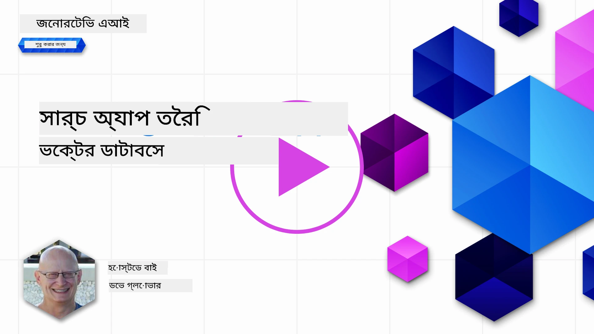
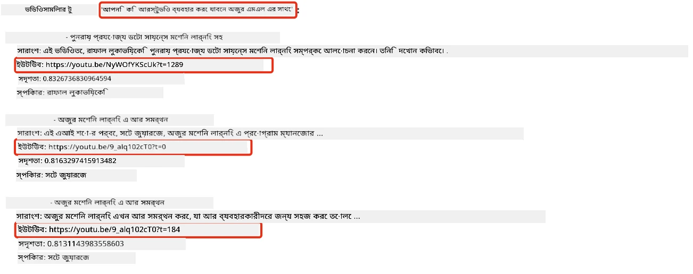
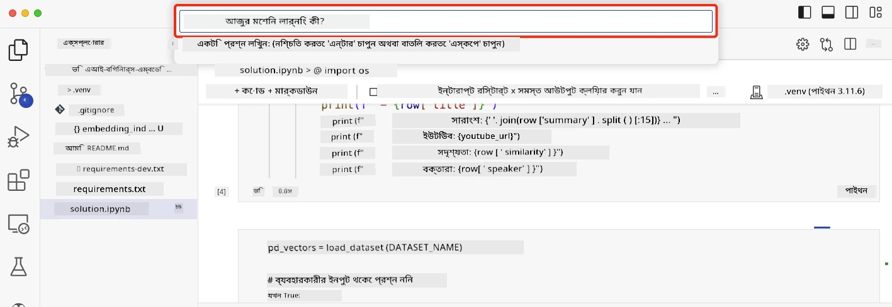

# একটি সার্চ অ্যাপ্লিকেশন তৈরি করা

[](https://youtu.be/W0-nzXjOjr0?si=GcsqiTTvd7RKbo7V)

> > _এই পাঠের ভিডিও দেখতে উপরের ছবিতে ক্লিক করুন_

চ্যাটবট এবং টেক্সট জেনারেশনের বাইরে LLMs এর আরও অনেক কিছু আছে। Embeddings ব্যবহার করে সার্চ অ্যাপ্লিকেশন তৈরি করাও সম্ভব। Embeddings হল ডেটার সংখ্যাসূচক উপস্থাপন যা ভেক্টর হিসাবেও পরিচিত, এবং সেগুলো ডেটার সেমান্টিক সার্চের জন্য ব্যবহার করা যেতে পারে।

এই পাঠে, আপনি আমাদের এডুকেশন স্টার্টআপের জন্য একটি সার্চ অ্যাপ্লিকেশন তৈরি করতে যাচ্ছেন। আমাদের স্টার্টআপ হল একটি অলাভজনক প্রতিষ্ঠান যা উন্নয়নশীল দেশগুলোর ছাত্রছাত্রীদের ফ্রি শিক্ষা প্রদান করে। আমাদের স্টার্টআপের অনেক ইউ-টিউব ভিডিও আছে যা ছাত্রছাত্রীরা AI সম্পর্কে শিখতে ব্যবহার করতে পারে। আমাদের স্টার্টআপ একটি সার্চ অ্যাপ্লিকেশন তৈরি করতে চায়, যা ছাত্রছাত্রীদের প্রশ্ন টাইপ করে ইউটিউব ভিডিও খুঁজে পেতে সাহায্য করবে।

উদাহরণস্বরূপ, একজন ছাত্র 'জুপিটার নোটবুক কী?' বা 'আজুর ML কী?' টাইপ করতে পারে এবং সার্চ অ্যাপ্লিকেশন প্রশ্নের প্রাসঙ্গিক ইউটিউব ভিডিওগুলোর একটি তালিকা ফেরত দেবে, আর ভালো খবর হল, সার্চ অ্যাপ্লিকেশন প্রশ্নের উত্তরের ভিডিওর অংশের জন্য একটি লিঙ্কও দেবে।

## পরিচিতি

এই পাঠে, আমরা আলোচনা করব:

- সেমান্টিক বনাম কীওয়ার্ড সার্চ।
- টেক্সট এমবেডিং কী।
- টেক্সট এমবেডিং সূচক তৈরি করা।
- টেক্সট এমবেডিং সূচকে সার্চ করা।

## শেখার লক্ষ্য

এই পাঠ সম্পন্ন করার পর, আপনি পারবেন:

- সেমান্টিক এবং কীওয়ার্ড সার্চের পার্থক্য বলা।
- টেক্সট এমবেডিং কী তা ব্যাখ্যা করা।
- এমবেডিং ব্যবহার করে একটি অ্যাপ্লিকেশন তৈরি করা যা ডেটার জন্য সার্চ করতে পারে।

## কেন সার্চ অ্যাপ্লিকেশন তৈরি করবেন?

একটি সার্চ অ্যাপ্লিকেশন তৈরি করা আপনাকে শিখতে সাহায্য করবে কীভাবে এমবেডিং ব্যবহার করে ডেটার জন্য সার্চ করা যায়। আপনি শিখবেন কীভাবে এমন একটি সার্চ অ্যাপ্লিকেশন তৈরি করতে হয় যা ছাত্রছাত্রীদের দ্রুত তথ্য খুঁজে পেতে সাহায্য করে।

এই পাঠে একটি এমবেডিং সূচক রয়েছে Microsoft [AI Show](https://www.youtube.com/playlist?list=PLlrxD0HtieHi0mwteKBOfEeOYf0LJU4O1) ইউটিউব চ্যানেলের ট্রান্সক্রিপ্টের জন্য। AI Show হল একটি ইউটিউব চ্যানেল যা AI ও মেশিন লার্নিং শেখায়। এমবেডিং সূচকটি অক্টোবর ২০২৩ পর্যন্ত প্রতিটি ট্রান্সক্রিপ্টের এমবেডিং ধারণ করে। আপনি এই সূচক ব্যবহার করে আমাদের স্টার্টআপের জন্য সার্চ অ্যাপ্লিকেশন তৈরি করবেন। সার্চ অ্যাপ্লিকেশন ভিডিওর সেই অংশের লিঙ্কও দেবে যেখানে প্রশ্নের উত্তর আছে। এটি ছাত্রছাত্রীদের জন্য দ্রুত তথ্য খুঁজে পাওয়ার একটা দুর্দান্ত উপায়।

নিচে একটি সেমান্টিক ক্যোয়ারির উদাহরণ দেওয়া হয়েছে 'can you use rstudio with azure ml?' প্রশ্নের জন্য। ইউটিউব URL দেখুন, এতে একটি টাইমস্ট্যাম্প আছে যা আপনাকে ভিডিওর সেই অংশে নিয়ে যাবে যেখানে প্রশ্নের উত্তর আছে।



## সেমান্টিক সার্চ কী?

এখন আপনি হয়ত ভাবছেন, সেমান্টিক সার্চ কী? সেমান্টিক সার্চ হলো এমন একটি সার্চ কৌশল যা ক্যোয়ারির শব্দগুলোর অর্থ বা সেমান্টিক্স ব্যবহার করে প্রাসঙ্গিক ফলাফল প্রদান করে।

এখানে একটি সেমান্টিক সার্চের উদাহরণ: ধরুন আপনি একটি গাড়ি কিনতে যাচ্ছেন, আপনি সার্চ করবেন 'my dream car', সেমান্টিক সার্চ বুঝতে পারে যে আপনি গাড়ি নিয়ে স্বপ্ন দেখছেন না, বরং আপনি আপনার 'আদর্শ' গাড়ি কিনতে চান। সেমান্টিক সার্চ আপনার উদ্দেশ্য বুঝে প্রাসঙ্গিক ফলাফল দেয়। বিকল্প হল 'কীওয়ার্ড সার্চ' যা শব্দানুসারে স্বপ্ন এবং গাড়ি সম্পর্কিত সার্চ করতে পারে এবং প্রায়ই প্রাসঙ্গিক নয় এমন ফলাফল দেয়।

## টেক্সট এমবেডিং কী?

[টেক্সট এমবেডিং](https://en.wikipedia.org/wiki/Word_embedding?WT.mc_id=academic-105485-koreyst) হল একটি টেক্সট প্রতিনিধিত্ব কৌশল যা [ন্যাচারাল ল্যাঙ্গুয়েজ প্রসেসিং](https://en.wikipedia.org/wiki/Natural_language_processing?WT.mc_id=academic-105485-koreyst) এ ব্যবহৃত হয়। টেক্সট এমবেডিং হল টেক্সটের সেমান্টিক সংখ্যাসূচক উপস্থাপন। এমবেডিংগুলি এমন ভাবে ডেটাকে উপস্থাপন করে যা মেশিনের জন্য বোধগম্য হয়। টেক্সট এমবেডিং তৈরির অনেক মডেল রয়েছে, এই পাঠে আমরা OpenAI এমবেডিং মডেল ব্যবহার করে এমবেডিং তৈরি করার জন্য মনোযোগ দেব।

ধরুন, AI Show ইউটিউব চ্যানেলের একটি এপিসোডের ট্রান্সক্রিপ্ট থেকে নিম্নলিখিত টেক্সট:

```text
Today we are going to learn about Azure Machine Learning.
```

আমরা টেক্সটটি OpenAI এমবেডিং API তে পাঠাব এবং এটা ১৫৩৬ সংখ্যার একটি এমবেডিং ফিরিয়ে দেবে, যা একটি ভেক্টর। ভেক্টরের প্রতিটি সংখ্যা টেক্সটের একটি ভিন্ন দিক উপস্থাপন করে। সংক্ষেপে, ভেক্টরের প্রথম ১০টি সংখ্যা এখানে দেওয়া হলো।

```python
[-0.006655829958617687, 0.0026128944009542465, 0.008792596869170666, -0.02446001023054123, -0.008540431968867779, 0.022071078419685364, -0.010703742504119873, 0.003311325330287218, -0.011632772162556648, -0.02187200076878071, ...]
```

## এমবেডিং সূচক কীভাবে তৈরি করা হয়?

এই পাঠের জন্য এমবেডিং সূচক একটি সিরিজ পাইথন স্ক্রিপ্ট ব্যবহার করে তৈরি করা হয়েছে। আপনি এই স্ক্রিপ্টগুলি 'scripts' ফোল্ডারে [README](./scripts/README.md?WT.mc_id=academic-105485-koreyst) ফাইলে নির্দেশনা সহ পাবেন। এই পাঠ সম্পন্ন করতে আপনাকে স্ক্রিপ্ট চালাতে হবে না কারণ এমবেডিং সূচক ইতিমধ্যে প্রস্তুত।

স্ক্রিপ্টগুলো নিম্নলিখিত কাজগুলি করে:

1. [AI Show](https://www.youtube.com/playlist?list=PLlrxD0HtieHi0mwteKBOfEeOYf0LJU4O1) প্লেলিস্টের প্রতিটি ইউটিউব ভিডিওর ট্রান্সক্রিপ্ট ডাউনলোড করা হয়।
2. [OpenAI Functions](https://learn.microsoft.com/azure/ai-foundry/openai/how-to/function-calling?WT.mc_id=academic-105485-koreyst) ব্যবহার করে ইউটিউব ট্রান্সক্রিপ্টের প্রথম ৩ মিনিট থেকে স্পীকারের নাম বের করার চেষ্টা করা হয়। প্রতিটি ভিডিওর স্পীকার নাম এমবেডিং সূচকে `embedding_index_3m.json` ফাইলে সংরক্ষণ করা হয়।
3. ট্রান্সক্রিপ্ট টেক্সট **৩ মিনিটের পাঠ অংশ** এ ভাগ করা হয়। প্রতিটি অংশে পরবর্তী অংশ থেকে প্রায় ২০টি ওয়ার্ড ওভারল্যাপ থাকে যাতে এমবেডিং কাট না হয় এবং সার্চের প্রসঙ্গ উন্নত হয়।
4. প্রতিটি পাঠ অংশ OpenAI Chat API তে পাঠিয়ে টেক্সটকে ৬০ শব্দে সারাংশ করা হয়। সারাংশ `embedding_index_3m.json` এ সংরক্ষণ করা হয়।
5. শেষে পাঠ অংশটি OpenAI এমবেডিং API তে পাঠানো হয়। এমবেডিং API ১৫৩৬ সংখ্যার একটি ভেক্টর ফিরিয়ে দেয় যা অংশের সেমান্টিক অর্থ উপস্থাপন করে। অংশ এবং এমবেডিং ভেক্টর এমবেডিং সূচক `embedding_index_3m.json` এ সংরক্ষণ করা হয়।

### ভেক্টর ডাটাবেস

পাঠের সরলতার জন্য, এমবেডিং সূচক একটি JSON ফাইলে `embedding_index_3m.json` নামে সংরক্ষণ করা হয়েছে এবং একটি Pandas DataFrame এ লোড করা হয়েছে। তবে প্রোডাকশনে, এমবেডিং সূচক ভেক্টর ডাটাবেস যেমন [Azure Cognitive Search](https://learn.microsoft.com/training/modules/improve-search-results-vector-search?WT.mc_id=academic-105485-koreyst), [Redis](https://cookbook.openai.com/examples/vector_databases/redis/readme?WT.mc_id=academic-105485-koreyst), [Pinecone](https://cookbook.openai.com/examples/vector_databases/pinecone/readme?WT.mc_id=academic-105485-koreyst), [Weaviate](https://cookbook.openai.com/examples/vector_databases/weaviate/readme?WT.mc_id=academic-105485-koreyst) ইত্যাদিতে সংরক্ষণ করা হয়।

## কোসাইন সাদৃশ্য বোঝা

আমরা টেক্সট এমবেডিং সম্পর্কে শিখেছি, পরের ধাপ হল শেখা কিভাবে টেক্সট এমবেডিং ব্যবহার করে ডেটার জন্য সার্চ করতে হয় এবং বিশেষ করে কোসাইন সাদৃশ্য ব্যবহার করে একটি ক্যোয়ারির সবচেয়ে অনুরূপ এমবেডিং খুঁজে পাওয়া যায়।

### কোসাইন সাদৃশ্য কী?

কোসাইন সাদৃশ্য হল দুটি ভেক্টরের মধ্যে সাদৃশ্যের পরিমাপ, এটিকে 'নিকটতম প্রতিবেশী সন্ধান' হিসেবেও বলা হয়। কোসাইন সাদৃশ্য সার্চ করতে, আপনাকে ক্যোয়ারির টেক্সট OpenAI এমবেডিং API দিয়ে ভেক্টরাইজ করতে হবে। তারপর ক্যোয়ারি ভেক্টর এবং এমবেডিং সূচকের প্রতিটি ভেক্টরের মধ্যকার কোসাইন সাদৃশ্য হিসাব করতে হবে। মনে রাখবেন, এমবেডিং সূচকে প্রতিটি ইউটিউব ট্রান্সক্রিপ্ট পাঠ অংশের জন্য একটি ভেক্টর আছে। শেষে ফলাফল কোসাইন সাদৃশ্য অনুযায়ী সাজানো হয় এবং সবচেয়ে বেশি কোসাইন সাদৃশ্যযুক্ত পাঠ অংশগুলো ক্যোয়ারির সবচেয়ে অনুরূপ।

গণিতের দৃষ্টিকোণ থেকে, কোসাইন সাদৃশ্য হলো বহু-মাত্রিক স্থানে দুটি ভেক্টরের মধ্যকার কোণের কোসাইন। এই পরিমাপ উপকারী কারণ, Euclidean দূরত্ব দ্বারা দুই ডকুমেন্ট দূরে থাকলেও, তাদের মধ্যকার কোণ ছোট হলে কোসাইন সাদৃশ্য বেশি হতে পারে। কোসাইন সাদৃশ্য সূত্র সম্পর্কে বিস্তারিত জানতে দেখুন [Cosine similarity](https://en.wikipedia.org/wiki/Cosine_similarity?WT.mc_id=academic-105485-koreyst)।

## আপনার প্রথম সার্চ অ্যাপ্লিকেশন তৈরি

পরবর্তীতে, আমরা এমবেডিং ব্যবহার করে একটি সার্চ অ্যাপ্লিকেশন কীভাবে তৈরি করবেন তা শিখব। সার্চ অ্যাপ্লিকেশনটি ছাত্রছাত্রীদের প্রশ্ন টাইপ করে ভিডিও খুঁজতে দেবে। সার্চ অ্যাপ্লিকেশন প্রশ্নের প্রাসঙ্গিক ভিডিওগুলোর একটি তালিকা ফেরত দেবে। এছাড়া ভিডিওর সেই অংশের লিঙ্কও দেবে যেখানে প্রশ্নের উত্তর পাওয়া যায়।

এই সমাধানটি Windows 11, macOS, এবং Ubuntu 22.04 এ Python 3.10 বা তার পরের ভার্সনে পরীক্ষা ও তৈরি করা হয়েছে। আপনি Python [python.org](https://www.python.org/downloads/?WT.mc_id=academic-105485-koreyst) থেকে ডাউনলোড করতে পারেন।

## অ্যাসাইনমেন্ট - ছাত্রছাত্রীদের জন্য সার্চ অ্যাপ্লিকেশন তৈরি

আমরা এই পাঠের শুরুতে আমাদের স্টার্টআপ পরিচয় করিয়েছি। এখন সময় এসেছে ছাত্রছাত্রীদের তাদের মূল্যায়নের জন্য সার্চ অ্যাপ্লিকেশন তৈরি করার দক্ষতা দেওয়ার।

এই অ্যাসাইনমেন্টে, আপনি Azure OpenAI পরিষেবাগুলি তৈরি করবেন যা সার্চ অ্যাপ্লিকেশন তৈরিতে ব্যবহৃত হবে। আপনাকে নিম্নলিখিত Azure OpenAI পরিষেবাগুলি তৈরি করতে হবে। এই অ্যাসাইনমেন্ট সম্পন্ন করতে একটি Azure সাবস্ক্রিপশন প্রয়োজন।

### Azure Cloud Shell শুরু করুন

1. [Azure পোর্টালে](https://portal.azure.com/?WT.mc_id=academic-105485-koreyst) সাইন ইন করুন।
2. Azure পোর্টালের উপরের ডানদিকে Cloud Shell আইকনে ক্লিক করুন।
3. পরিবেশ ধরণ হিসেবে **Bash** নির্বাচন করুন।

#### একটি রিসোর্স গ্রুপ তৈরি করুন

> এই নির্দেশনায়, আমরা "semantic-video-search" নামে একটি রিসোর্স গ্রুপ East US-এ ব্যবহার করছি।
> আপনি রিসোর্স গ্রুপের নাম পরিবর্তন করতে পারেন, কিন্তু রিসোর্সের অবস্থান পরিবর্তনের সময়,
> [মডেল উপলব্ধতা তালিকা](https://aka.ms/oai/models?WT.mc_id=academic-105485-koreyst) চেক করুন।

```shell
az group create --name semantic-video-search --location eastus
```

#### একটি Azure OpenAI সার্ভিস রিসোর্স তৈরি করুন

Azure Cloud Shell থেকে নিম্নলিখিত কমান্ড রান করুন একটি Azure OpenAI সার্ভিস রিসোর্স তৈরি করতে।

```shell
az cognitiveservices account create --name semantic-video-openai --resource-group semantic-video-search \
    --location eastus --kind OpenAI --sku s0
```

#### এই অ্যাপ্লিকেশনে ব্যবহার করার জন্য এন্ডপয়েন্ট ও কি সংগ্রহ করুন

Azure Cloud Shell থেকে নিম্নলিখিত কমান্ডগুলি রান করুন Azure OpenAI সার্ভিস রিসোর্সের এন্ডপয়েন্ট এবং কি পেতে।

```shell
az cognitiveservices account show --name semantic-video-openai \
   --resource-group  semantic-video-search | jq -r .properties.endpoint
az cognitiveservices account keys list --name semantic-video-openai \
   --resource-group semantic-video-search | jq -r .key1
```

#### OpenAI এমবেডিং মডেল ডিপ্লয় করুন

Azure Cloud Shell থেকে নিম্নলিখিত কমান্ড রান করে OpenAI এমবেডিং মডেলটি ডিপ্লয় করুন।

```shell
az cognitiveservices account deployment create \
    --name semantic-video-openai \
    --resource-group  semantic-video-search \
    --deployment-name text-embedding-ada-002 \
    --model-name text-embedding-ada-002 \
    --model-version "2"  \
    --model-format OpenAI \
    --sku-capacity 100 --sku-name "Standard"
```

## সমাধান

GitHub Codespaces-এ [সমাধান নোটবুক](./python/aoai-solution.ipynb?WT.mc_id=academic-105485-koreyst) খুলুন এবং জুপিটার নোটবুকের নির্দেশনা অনুসরণ করুন।

নোটবুক চালানোর সময়, আপনাকে একটি ক্যোয়ারির জন্য ইনপুট দিতে বলা হবে। ইনপুট বক্স এইরকম দেখতে হবে:



## চমৎকার কাজ! আপনার শেখা চালিয়ে যান

এই পাঠ সম্পন্ন করার পরে, আমাদের [জেনারেটিভ এআই লার্নিং কালেকশন](https://aka.ms/genai-collection?WT.mc_id=academic-105485-koreyst) দেখুন যাতে আপনার জেনারেটিভ এআই জ্ঞান আরো বাড়াতে পারেন!

পরবর্তী পাঠ ৯-এ যান যেখানে আমরা দেখব কীভাবে [ইমেজ জেনারেশন অ্যাপ্লিকেশন তৈরি করবেন](../09-building-image-applications/README.md?WT.mc_id=academic-105485-koreyst)!

---

<!-- CO-OP TRANSLATOR DISCLAIMER START -->
**অস্বীকৃতি**:
এই নথিটি AI অনুবাদ পরিষেবা [Co-op Translator](https://github.com/Azure/co-op-translator) ব্যবহার করে অনূদিত হয়েছে। যদিও আমরা শুদ্ধতার জন্য চেষ্টা করি, অনুগ্রহ করে মনে রাখবেন যে স্বয়ংক্রিয় অনুবাদে ত্রুটি বা অসঙ্গতি থাকতে পারে। মূল নথিটি তার স্বভাষায় কর্তৃত্বপূর্ণ উৎস হিসেবে বিবেচিত হওয়া উচিত। গুরুত্বপূর্ণ তথ্যের জন্য পেশাদার মানব অনুবাদ সুপারিশ করা হয়। এই অনুবাদের ব্যবহারে প্রয়োজনীয় ভুল বোঝাবুঝি বা ভুল ব্যাখ্যার জন্য আমরা দায়বদ্ধ নই।
<!-- CO-OP TRANSLATOR DISCLAIMER END -->