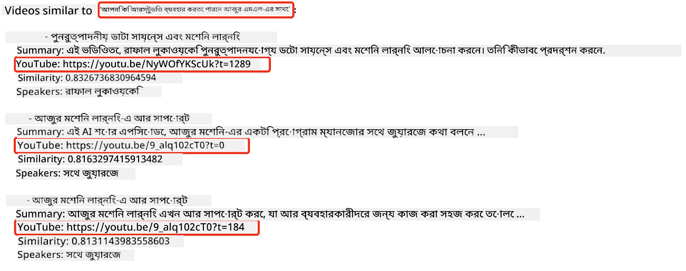
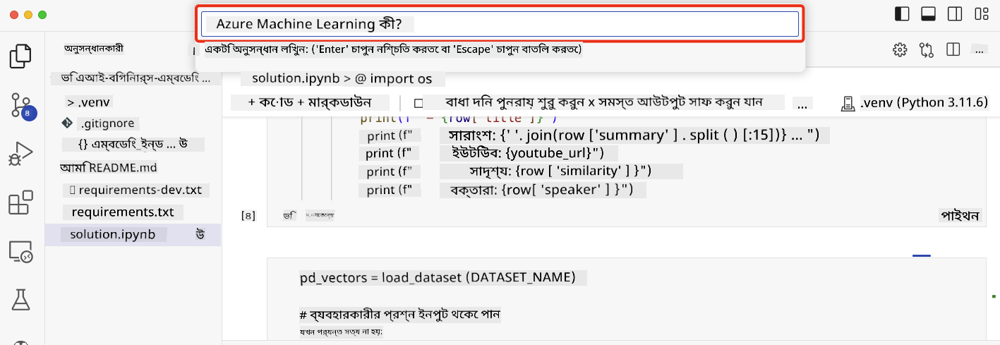

<!--
CO_OP_TRANSLATOR_METADATA:
{
  "original_hash": "d46aad0917a1a342d613e2c13d457da5",
  "translation_date": "2025-06-25T16:20:47+00:00",
  "source_file": "08-building-search-applications/README.md",
  "language_code": "bn"
}
-->
# সার্চ অ্যাপ্লিকেশন তৈরি করা

[](https://aka.ms/gen-ai-lesson8-gh?WT.mc_id=academic-105485-koreyst)

> > _এই পাঠের ভিডিও দেখতে উপরের ছবিতে ক্লিক করুন_

LLMs শুধুমাত্র চ্যাটবট এবং টেক্সট জেনারেশনেই সীমাবদ্ধ নয়। এম্বেডিং ব্যবহার করে সার্চ অ্যাপ্লিকেশন তৈরি করা সম্ভব। এম্বেডিং হল ডেটার সংখ্যাগত উপস্থাপনা যা ভেক্টর নামেও পরিচিত এবং এটি ডেটার জন্য সেমান্টিক সার্চে ব্যবহার করা যেতে পারে।

এই পাঠে, আপনি আমাদের শিক্ষা স্টার্টআপের জন্য একটি সার্চ অ্যাপ্লিকেশন তৈরি করবেন। আমাদের স্টার্টআপ একটি অলাভজনক সংস্থা যা উন্নয়নশীল দেশের শিক্ষার্থীদের বিনামূল্যে শিক্ষা প্রদান করে। আমাদের স্টার্টআপের অনেক YouTube ভিডিও রয়েছে যা শিক্ষার্থীরা AI সম্পর্কে শেখার জন্য ব্যবহার করতে পারে। আমাদের স্টার্টআপ একটি সার্চ অ্যাপ্লিকেশন তৈরি করতে চায় যা শিক্ষার্থীদের একটি প্রশ্ন টাইপ করে YouTube ভিডিও খুঁজতে দেয়।

উদাহরণস্বরূপ, একজন শিক্ষার্থী 'জুপিটার নোটবুকস কী?' বা 'অ্যাজুর এমএল কী' টাইপ করতে পারে এবং সার্চ অ্যাপ্লিকেশনটি প্রশ্নের সাথে সম্পর্কিত YouTube ভিডিওগুলির একটি তালিকা ফিরিয়ে দেবে এবং আরও ভালভাবে, সার্চ অ্যাপ্লিকেশনটি সেই ভিডিওর স্থানে একটি লিঙ্ক ফিরিয়ে দেবে যেখানে প্রশ্নের উত্তরটি অবস্থিত।

## পরিচিতি

এই পাঠে আমরা কভার করব:

- সেমান্টিক বনাম কীওয়ার্ড সার্চ।
- টেক্সট এম্বেডিং কী।
- টেক্সট এম্বেডিং ইনডেক্স তৈরি করা।
- টেক্সট এম্বেডিং ইনডেক্সে অনুসন্ধান করা।

## শিক্ষার লক্ষ্য

এই পাঠ সম্পন্ন করার পর, আপনি সক্ষম হবেন:

- সেমান্টিক এবং কীওয়ার্ড সার্চের মধ্যে পার্থক্য বলতে।
- টেক্সট এম্বেডিং কী তা ব্যাখ্যা করতে।
- এম্বেডিং ব্যবহার করে ডেটা অনুসন্ধানের জন্য একটি অ্যাপ্লিকেশন তৈরি করতে।

## কেন একটি সার্চ অ্যাপ্লিকেশন তৈরি করবেন?

একটি সার্চ অ্যাপ্লিকেশন তৈরি করা আপনাকে এম্বেডিং ব্যবহার করে ডেটা অনুসন্ধান করতে শিখতে সাহায্য করবে। আপনি এমন একটি সার্চ অ্যাপ্লিকেশন তৈরি করতে শিখবেন যা শিক্ষার্থীরা দ্রুত তথ্য খুঁজে পেতে ব্যবহার করতে পারে।

পাঠটিতে Microsoft [AI শো](https://www.youtube.com/playlist?list=PLlrxD0HtieHi0mwteKBOfEeOYf0LJU4O1) YouTube চ্যানেলের YouTube ট্রান্সক্রিপ্টের একটি এম্বেডিং ইনডেক্স অন্তর্ভুক্ত রয়েছে। AI শো একটি YouTube চ্যানেল যা আপনাকে AI এবং মেশিন লার্নিং সম্পর্কে শেখায়। এম্বেডিং ইনডেক্সে অক্টোবর 2023 পর্যন্ত প্রতিটি YouTube ট্রান্সক্রিপ্টের এম্বেডিং অন্তর্ভুক্ত রয়েছে। আপনি আমাদের স্টার্টআপের জন্য একটি সার্চ অ্যাপ্লিকেশন তৈরি করতে এম্বেডিং ইনডেক্স ব্যবহার করবেন। সার্চ অ্যাপ্লিকেশনটি ভিডিওর সেই স্থানে একটি লিঙ্ক ফিরিয়ে দেয় যেখানে প্রশ্নের উত্তরটি অবস্থিত। এটি শিক্ষার্থীদের দ্রুত প্রয়োজনীয় তথ্য খুঁজে পাওয়ার একটি দুর্দান্ত উপায়।

'আপনি কি অ্যাজুর এমএল-এর সাথে আরস্টুডিও ব্যবহার করতে পারেন?' প্রশ্নের জন্য একটি সেমান্টিক কুয়েরি উদাহরণ নিচে দেওয়া হল। YouTube url দেখুন, আপনি দেখবেন যে url-এ একটি টাইমস্ট্যাম্প রয়েছে যা আপনাকে ভিডিওর সেই স্থানে নিয়ে যায় যেখানে প্রশ্নের উত্তরটি অবস্থিত।



## সেমান্টিক সার্চ কী?

এখন আপনি হয়তো ভাবছেন, সেমান্টিক সার্চ কী? সেমান্টিক সার্চ একটি সার্চ কৌশল যা একটি কুয়েরিতে শব্দের অর্থ বা সেমান্টিক ব্যবহার করে প্রাসঙ্গিক ফলাফল প্রদান করে।

এখানে একটি সেমান্টিক সার্চের উদাহরণ রয়েছে। ধরুন আপনি একটি গাড়ি কিনতে চাইছেন, আপনি 'আমার স্বপ্নের গাড়ি' সার্চ করতে পারেন, সেমান্টিক সার্চ বুঝতে পারে যে আপনি গাড়ি নিয়ে `dreaming` করছেন না, বরং আপনি আপনার `ideal` গাড়ি কিনতে চাইছেন। সেমান্টিক সার্চ আপনার উদ্দেশ্য বুঝতে পারে এবং প্রাসঙ্গিক ফলাফল প্রদান করে। বিকল্পটি হল `keyword search` যা গাড়ি সম্পর্কে স্বপ্নের জন্য আক্ষরিকভাবে সার্চ করবে এবং প্রায়শই অপ্রাসঙ্গিক ফলাফল প্রদান করবে।

## টেক্সট এম্বেডিং কী?

[টেক্সট এম্বেডিং](https://en.wikipedia.org/wiki/Word_embedding?WT.mc_id=academic-105485-koreyst) হল একটি টেক্সট উপস্থাপনা কৌশল যা [প্রাকৃতিক ভাষা প্রক্রিয়াকরণ](https://en.wikipedia.org/wiki/Natural_language_processing?WT.mc_id=academic-105485-koreyst) এ ব্যবহৃত হয়। টেক্সট এম্বেডিং হল টেক্সটের সেমান্টিক সংখ্যাগত উপস্থাপনা। এম্বেডিং ডেটাকে এমনভাবে উপস্থাপন করতে ব্যবহৃত হয় যা একটি মেশিনের জন্য বোঝা সহজ। টেক্সট এম্বেডিং তৈরির জন্য অনেক মডেল রয়েছে, এই পাঠে, আমরা OpenAI এম্বেডিং মডেল ব্যবহার করে এম্বেডিং তৈরি করার দিকে মনোযোগ দেব।

এখানে একটি উদাহরণ, কল্পনা করুন যে নিম্নলিখিত টেক্সটটি AI শো YouTube চ্যানেলের একটি পর্বের ট্রান্সক্রিপ্টে রয়েছে:

```text
Today we are going to learn about Azure Machine Learning.
```

আমরা টেক্সটটিকে OpenAI এম্বেডিং API-তে পাঠাব এবং এটি 1536 সংখ্যার একটি এম্বেডিং ফিরিয়ে দেবে যা একটি ভেক্টর নামে পরিচিত। ভেক্টরের প্রতিটি সংখ্যা টেক্সটের একটি ভিন্ন দিক উপস্থাপন করে। সংক্ষিপ্ততার জন্য, এখানে ভেক্টরের প্রথম 10 সংখ্যা দেওয়া হল।

```python
[-0.006655829958617687, 0.0026128944009542465, 0.008792596869170666, -0.02446001023054123, -0.008540431968867779, 0.022071078419685364, -0.010703742504119873, 0.003311325330287218, -0.011632772162556648, -0.02187200076878071, ...]
```

## এম্বেডিং ইনডেক্স কীভাবে তৈরি হয়?

এই পাঠের জন্য এম্বেডিং ইনডেক্স একটি সিরিজ পাইথন স্ক্রিপ্ট ব্যবহার করে তৈরি করা হয়েছে। আপনি 'স্ক্রিপ্ট' ফোল্ডারে এই পাঠের জন্য স্ক্রিপ্টগুলি এবং নির্দেশাবলী [README](./scripts/README.md?WT.mc_id=academic-105485-koreyst) এ পাবেন। আপনাকে এই পাঠ সম্পন্ন করার জন্য এই স্ক্রিপ্টগুলি চালানোর প্রয়োজন নেই কারণ এম্বেডিং ইনডেক্স আপনার জন্য প্রদান করা হয়েছে।

স্ক্রিপ্টগুলি নিম্নলিখিত অপারেশনগুলি সম্পাদন করে:

1. [AI শো](https://www.youtube.com/playlist?list=PLlrxD0HtieHi0mwteKBOfEeOYf0LJU4O1) প্লেলিস্টের প্রতিটি YouTube ভিডিওর জন্য ট্রান্সক্রিপ্ট ডাউনলোড করা হয়।
2. [OpenAI ফাংশন](https://learn.microsoft.com/azure/ai-services/openai/how-to/function-calling?WT.mc_id=academic-105485-koreyst) ব্যবহার করে YouTube ট্রান্সক্রিপ্টের প্রথম 3 মিনিট থেকে বক্তার নাম বের করার চেষ্টা করা হয়। প্রতিটি ভিডিওর জন্য বক্তার নাম এম্বেডিং ইনডেক্সে `embedding_index_3m.json` নামে সংরক্ষিত হয়।
3. তারপর ট্রান্সক্রিপ্ট টেক্সটটি **3 মিনিটের টেক্সট সেগমেন্টে** ভাগ করা হয়। সেগমেন্টে পরবর্তী সেগমেন্ট থেকে প্রায় 20 শব্দ ওভারল্যাপিং অন্তর্ভুক্ত থাকে যাতে সেগমেন্টের এম্বেডিং কাটা না যায় এবং আরও ভাল সার্চ প্রসঙ্গ প্রদান করে।
4. প্রতিটি টেক্সট সেগমেন্ট তারপর OpenAI চ্যাট API-তে পাঠানো হয় যাতে টেক্সটটি 60 শব্দে সংক্ষেপিত হয়। সংক্ষিপ্তসারটি এম্বেডিং ইনডেক্সে `embedding_index_3m.json` নামে সংরক্ষিত হয়।
5. অবশেষে, সেগমেন্ট টেক্সটটি OpenAI এম্বেডিং API-তে পাঠানো হয়। এম্বেডিং API 1536 সংখ্যার একটি ভেক্টর ফিরিয়ে দেয় যা সেগমেন্টের সেমান্টিক অর্থকে উপস্থাপন করে। সেগমেন্টটি OpenAI এম্বেডিং ভেক্টরের সাথে এম্বেডিং ইনডেক্সে `embedding_index_3m.json` নামে সংরক্ষিত হয়।

### ভেক্টর ডেটাবেস

পাঠের সরলতার জন্য, এম্বেডিং ইনডেক্সটি `embedding_index_3m.json` নামে একটি JSON ফাইলে সংরক্ষিত হয় এবং একটি Pandas ডেটাফ্রেমে লোড করা হয়। তবে, প্রোডাকশনে, এম্বেডিং ইনডেক্সটি [অ্যাজুর কগনিটিভ সার্চ](https://learn.microsoft.com/training/modules/improve-search-results-vector-search?WT.mc_id=academic-105485-koreyst), [রেডিস](https://cookbook.openai.com/examples/vector_databases/redis/readme?WT.mc_id=academic-105485-koreyst), [পাইনকোন](https://cookbook.openai.com/examples/vector_databases/pinecone/readme?WT.mc_id=academic-105485-koreyst), [উইভিয়েট](https://cookbook.openai.com/examples/vector_databases/weaviate/readme?WT.mc_id=academic-105485-koreyst) এর মতো ভেক্টর ডেটাবেসে সংরক্ষিত হবে, কয়েকটি নাম উল্লেখ করতে।

## কোসাইন সাদৃশ্য বোঝা

আমরা টেক্সট এম্বেডিং সম্পর্কে শিখেছি, পরবর্তী পদক্ষেপ হল কিভাবে টেক্সট এম্বেডিং ব্যবহার করে ডেটা সার্চ করতে হয় এবং বিশেষভাবে একটি প্রদত্ত কুয়েরির সাথে সবচেয়ে অনুরূপ এম্বেডিং খুঁজে পেতে কোসাইন সাদৃশ্য ব্যবহার করা।

### কোসাইন সাদৃশ্য কী?

কোসাইন সাদৃশ্য দুটি ভেক্টরের মধ্যে সাদৃশ্যের একটি পরিমাপ, আপনি এটিকে `nearest neighbor search` নামেও শুনবেন। কোসাইন সাদৃশ্য সার্চ সম্পাদন করতে আপনাকে OpenAI এম্বেডিং API ব্যবহার করে _কুয়েরি_ টেক্সটের জন্য _ভেক্টরাইজ_ করতে হবে। তারপর কুয়েরি ভেক্টর এবং এম্বেডিং ইনডেক্সের প্রতিটি ভেক্টরের মধ্যে _কোসাইন সাদৃশ্য_ গণনা করুন। মনে রাখবেন, এম্বেডিং ইনডেক্সে প্রতিটি YouTube ট্রান্সক্রিপ্ট টেক্সট সেগমেন্টের জন্য একটি ভেক্টর রয়েছে। অবশেষে, কোসাইন সাদৃশ্য দ্বারা ফলাফলগুলি সাজান এবং সর্বোচ্চ কোসাইন সাদৃশ্য সহ টেক্সট সেগমেন্টগুলি কুয়েরির সাথে সবচেয়ে অনুরূপ।

গণিতের দৃষ্টিকোণ থেকে, কোসাইন সাদৃশ্য একটি বহুমাত্রিক স্থানে প্রক্ষেপিত দুটি ভেক্টরের মধ্যে কোণের কোসাইন পরিমাপ করে। এই পরিমাপটি উপকারী, কারণ যদি দুটি ডকুমেন্ট আকারের কারণে ইউক্লিডিয়ান দূরত্ব দ্বারা দূরে থাকে, তবে তারা এখনও তাদের মধ্যে একটি ছোট কোণ থাকতে পারে এবং তাই উচ্চতর কোসাইন সাদৃশ্য থাকতে পারে। কোসাইন সাদৃশ্য সমীকরণের বিষয়ে আরও তথ্যের জন্য, [কোসাইন সাদৃশ্য](https://en.wikipedia.org/wiki/Cosine_similarity?WT.mc_id=academic-105485-koreyst) দেখুন।

## আপনার প্রথম সার্চ অ্যাপ্লিকেশন তৈরি করা

এরপর, আমরা এম্বেডিং ব্যবহার করে একটি সার্চ অ্যাপ্লিকেশন তৈরি করতে শিখব। সার্চ অ্যাপ্লিকেশনটি শিক্ষার্থীদের একটি প্রশ্ন টাইপ করে ভিডিও সার্চ করতে দেবে। সার্চ অ্যাপ্লিকেশনটি প্রশ্নের সাথে সম্পর্কিত ভিডিওগুলির একটি তালিকা ফিরিয়ে দেবে। সার্চ অ্যাপ্লিকেশনটি ভিডিওর সেই স্থানে একটি লিঙ্কও ফিরিয়ে দেবে যেখানে প্রশ্নের উত্তরটি অবস্থিত।

এই সমাধানটি Windows 11, macOS এবং Ubuntu 22.04-এ Python 3.10 বা তার পরে ব্যবহার করে তৈরি এবং পরীক্ষা করা হয়েছে। আপনি [python.org](https://www.python.org/downloads/?WT.mc_id=academic-105485-koreyst) থেকে পাইথন ডাউনলোড করতে পারেন।

## অ্যাসাইনমেন্ট - শিক্ষার্থীদের সক্ষম করার জন্য একটি সার্চ অ্যাপ্লিকেশন তৈরি করা

আমরা এই পাঠের শুরুতে আমাদের স্টার্টআপটি পরিচয় করিয়েছি। এখন সময় এসেছে শিক্ষার্থীদের তাদের মূল্যায়নের জন্য একটি সার্চ অ্যাপ্লিকেশন তৈরি করতে সক্ষম করার।

এই অ্যাসাইনমেন্টে, আপনি সার্চ অ্যাপ্লিকেশনটি তৈরি করতে ব্যবহৃত Azure OpenAI Services তৈরি করবেন। আপনি নিম্নলিখিত Azure OpenAI Services তৈরি করবেন। এই অ্যাসাইনমেন্ট সম্পন্ন করতে আপনার একটি Azure সাবস্ক্রিপশন প্রয়োজন হবে।

### Azure ক্লাউড শেল শুরু করুন

1. [Azure পোর্টালে](https://portal.azure.com/?WT.mc_id=academic-105485-koreyst) সাইন ইন করুন।
2. Azure পোর্টালের উপরের ডান কোণে ক্লাউড শেল আইকন নির্বাচন করুন।
3. পরিবেশের জন্য **Bash** নির্বাচন করুন।

#### একটি রিসোর্স গ্রুপ তৈরি করুন

> এই নির্দেশাবলীর জন্য, আমরা পূর্ব মার্কিন যুক্তরাষ্ট্রে "semantic-video-search" নামে একটি রিসোর্স গ্রুপ ব্যবহার করছি।
> আপনি রিসোর্স গ্রুপের নাম পরিবর্তন করতে পারেন, তবে রিসোর্সগুলির অবস্থান পরিবর্তন করার সময়,
> [মডেল উপলব্ধতা টেবিল](https://aka.ms/oai/models?WT.mc_id=academic-105485-koreyst) পরীক্ষা করুন।

```shell
az group create --name semantic-video-search --location eastus
```

#### একটি Azure OpenAI Service রিসোর্স তৈরি করুন

Azure ক্লাউড শেল থেকে, একটি Azure OpenAI Service রিসোর্স তৈরি করতে নিম্নলিখিত কমান্ড চালান।

```shell
az cognitiveservices account create --name semantic-video-openai --resource-group semantic-video-search \
    --location eastus --kind OpenAI --sku s0
```

#### এই অ্যাপ্লিকেশনে ব্যবহারের জন্য এন্ডপয়েন্ট এবং কীগুলি পান

Azure ক্লাউড শেল থেকে, Azure OpenAI Service রিসোর্সের জন্য এন্ডপয়েন্ট এবং কীগুলি পেতে নিম্নলিখিত কমান্ডগুলি চালান।

```shell
az cognitiveservices account show --name semantic-video-openai \
   --resource-group  semantic-video-search | jq -r .properties.endpoint
az cognitiveservices account keys list --name semantic-video-openai \
   --resource-group semantic-video-search | jq -r .key1
```

#### OpenAI এম্বেডিং মডেল মোতায়েন করুন

Azure ক্লাউড শেল থেকে, OpenAI এম্বেডিং মডেল মোতায়েন করতে নিম্নলিখিত কমান্ড চালান।

```shell
az cognitiveservices account deployment create \
    --name semantic-video-openai \
    --resource-group  semantic-video-search \
    --deployment-name text-embedding-ada-002 \
    --model-name text-embedding-ada-002 \
    --model-version "2"  \
    --model-format OpenAI \
    --sku-capacity 100 --sku-name "Standard"
```

## সমাধান

GitHub Codespaces-এ [সমাধান নোটবুক](../../../08-building-search-applications/python/aoai-solution.ipynb) খুলুন এবং Jupyter নোটবুকে নির্দেশাবলী অনুসরণ করুন।

যখন আপনি নোটবুক চালাবেন, তখন আপনাকে একটি কুয়েরি প্রবেশ করতে বলা হবে। ইনপুট বাক্সটি এরকম দেখাবে:



## দারুণ কাজ! আপনার শেখা চালিয়ে যান

এই পাঠ সম্পন্ন করার পর, আমাদের [জেনারেটিভ AI শেখার সংগ্রহ](https://aka.ms/genai-collection?WT.mc_id=academic-105485-koreyst) দেখুন আপনার জেনারেটিভ AI জ্ঞানকে আরও উন্নত করতে!

পাঠ 9-এ যান যেখানে আমরা কিভাবে [ইমেজ জেনারেশন অ্যাপ্লিকেশন তৈরি করা যায়](../09-building-image-applications/README.md?WT.mc_id=academic-105485-koreyst) তা দেখব!

**অস্বীকৃতি**:  
এই নথিটি AI অনুবাদ পরিষেবা [Co-op Translator](https://github.com/Azure/co-op-translator) ব্যবহার করে অনূদিত হয়েছে। আমরা যথাসম্ভব নির্ভুলতার জন্য চেষ্টা করি, তবে দয়া করে সচেতন থাকুন যে স্বয়ংক্রিয় অনুবাদে ত্রুটি বা অসঙ্গতি থাকতে পারে। নথিটির মূল ভাষায় থাকা সংস্করণটিকে প্রামাণিক উৎস হিসেবে বিবেচনা করা উচিত। গুরুত্বপূর্ণ তথ্যের জন্য, পেশাদার মানব অনুবাদ সুপারিশ করা হয়। এই অনুবাদ ব্যবহারের ফলে উদ্ভূত কোনো ভুল বোঝাবুঝি বা ভুল ব্যাখ্যার জন্য আমরা দায়ী নই।