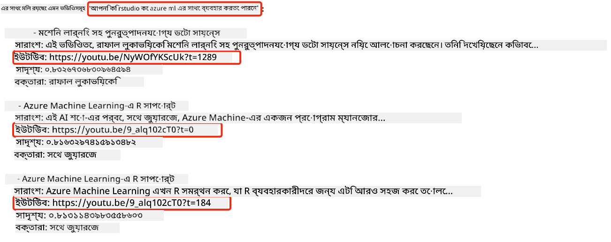
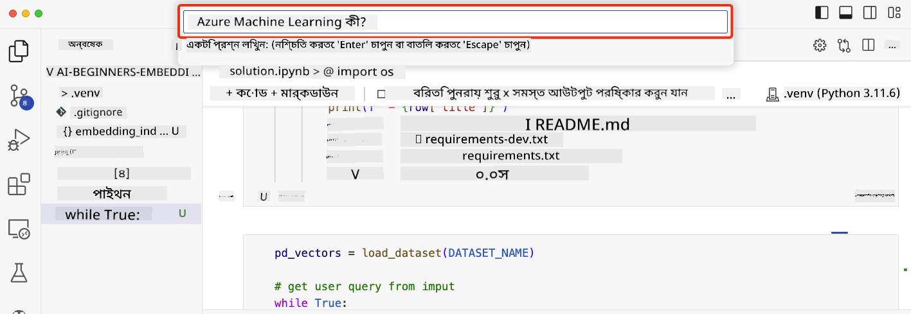

<!--
CO_OP_TRANSLATOR_METADATA:
{
  "original_hash": "d46aad0917a1a342d613e2c13d457da5",
  "translation_date": "2025-07-09T12:51:13+00:00",
  "source_file": "08-building-search-applications/README.md",
  "language_code": "bn"
}
-->
# সার্চ অ্যাপ্লিকেশন তৈরি করা

[](https://aka.ms/gen-ai-lesson8-gh?WT.mc_id=academic-105485-koreyst)

> > _এই লেসনের ভিডিও দেখতে উপরের ছবিতে ক্লিক করুন_

LLM শুধু চ্যাটবট বা টেক্সট জেনারেশনের জন্য নয়। Embeddings ব্যবহার করেও সার্চ অ্যাপ্লিকেশন তৈরি করা সম্ভব। Embeddings হলো ডেটার সংখ্যাসূচক উপস্থাপনা, যাকে ভেক্টরও বলা হয়, এবং এগুলো ডেটার সেমান্টিক সার্চে ব্যবহার করা যায়।

এই লেসনে, আমরা আমাদের শিক্ষা স্টার্টআপের জন্য একটি সার্চ অ্যাপ্লিকেশন তৈরি করব। আমাদের স্টার্টআপ একটি অলাভজনক প্রতিষ্ঠান যা উন্নয়নশীল দেশের শিক্ষার্থীদের বিনামূল্যে শিক্ষা প্রদান করে। আমাদের স্টার্টআপের কাছে অনেক YouTube ভিডিও রয়েছে যা শিক্ষার্থীরা AI সম্পর্কে শেখার জন্য ব্যবহার করতে পারে। আমাদের স্টার্টআপ এমন একটি সার্চ অ্যাপ্লিকেশন তৈরি করতে চায় যা শিক্ষার্থীরা প্রশ্ন টাইপ করে YouTube ভিডিও খুঁজে পেতে পারে।

উদাহরণস্বরূপ, একজন শিক্ষার্থী 'What are Jupyter Notebooks?' বা 'What is Azure ML' টাইপ করতে পারে এবং সার্চ অ্যাপ্লিকেশন প্রশ্নের সাথে সম্পর্কিত YouTube ভিডিওগুলোর একটি তালিকা দেখাবে, এবং আরও ভালো হলো, সার্চ অ্যাপ্লিকেশন ভিডিওর সেই অংশের লিঙ্কও দেবে যেখানে প্রশ্নের উত্তর রয়েছে।

## পরিচিতি

এই লেসনে আমরা আলোচনা করব:

- সেমান্টিক বনাম কীওয়ার্ড সার্চ।
- Text Embeddings কী।
- Text Embeddings Index তৈরি করা।
- Text Embeddings Index এ সার্চ করা।

## শেখার লক্ষ্য

এই লেসন শেষ করার পর, আপনি সক্ষম হবেন:

- সেমান্টিক এবং কীওয়ার্ড সার্চের মধ্যে পার্থক্য বলতে।
- Text Embeddings কী তা ব্যাখ্যা করতে।
- Embeddings ব্যবহার করে ডেটা সার্চ করার জন্য একটি অ্যাপ্লিকেশন তৈরি করতে।

## কেন সার্চ অ্যাপ্লিকেশন তৈরি করবেন?

সার্চ অ্যাপ্লিকেশন তৈরি করলে আপনি বুঝতে পারবেন কীভাবে Embeddings ব্যবহার করে ডেটা সার্চ করতে হয়। এছাড়াও, আপনি এমন একটি সার্চ অ্যাপ্লিকেশন তৈরি করতে শিখবেন যা শিক্ষার্থীরা দ্রুত তথ্য খুঁজে পেতে ব্যবহার করতে পারে।

এই লেসনে Microsoft [AI Show](https://www.youtube.com/playlist?list=PLlrxD0HtieHi0mwteKBOfEeOYf0LJU4O1) YouTube চ্যানেলের ট্রান্সক্রিপ্টের Embedding Index অন্তর্ভুক্ত রয়েছে। AI Show হলো একটি YouTube চ্যানেল যা AI এবং মেশিন লার্নিং শেখায়। Embedding Index-এ ২০২৩ সালের অক্টোবর পর্যন্ত প্রতিটি YouTube ট্রান্সক্রিপ্টের Embeddings রয়েছে। আপনি এই Embedding Index ব্যবহার করে আমাদের স্টার্টআপের জন্য একটি সার্চ অ্যাপ্লিকেশন তৈরি করবেন। সার্চ অ্যাপ্লিকেশন ভিডিওর সেই অংশের লিঙ্ক দেবে যেখানে প্রশ্নের উত্তর রয়েছে। এটি শিক্ষার্থীদের দ্রুত তথ্য খুঁজে পাওয়ার জন্য একটি চমৎকার উপায়।

নিচে 'can you use rstudio with azure ml?' প্রশ্নের জন্য একটি সেমান্টিক কুয়েরির উদাহরণ দেওয়া হলো। YouTube URL-এ একটি টাইমস্ট্যাম্প রয়েছে যা আপনাকে ভিডিওর সেই অংশে নিয়ে যাবে যেখানে প্রশ্নের উত্তর রয়েছে।



## সেমান্টিক সার্চ কী?

আপনি হয়তো ভাবছেন, সেমান্টিক সার্চ কী? সেমান্টিক সার্চ হলো এমন একটি সার্চ পদ্ধতি যা কুয়েরির শব্দগুলোর অর্থ বা সেমান্টিক্স ব্যবহার করে প্রাসঙ্গিক ফলাফল প্রদান করে।

এখানে একটি সেমান্টিক সার্চের উদাহরণ: ধরুন আপনি একটি গাড়ি কিনতে চান, আপনি 'my dream car' সার্চ করবেন। সেমান্টিক সার্চ বুঝতে পারবে আপনি গাড়ি নিয়ে স্বপ্ন দেখছেন না, বরং আপনার আদর্শ গাড়ি কেনার চেষ্টা করছেন। সেমান্টিক সার্চ আপনার উদ্দেশ্য বুঝে প্রাসঙ্গিক ফলাফল দেখায়। অন্যদিকে, কীওয়ার্ড সার্চ শব্দগুলো যেমন আছে তেমন অনুসন্ধান করে, যা প্রায়ই অপ্রাসঙ্গিক ফলাফল দেয়।

## Text Embeddings কী?

[Text embeddings](https://en.wikipedia.org/wiki/Word_embedding?WT.mc_id=academic-105485-koreyst) হলো একটি টেক্সট উপস্থাপনা পদ্ধতি যা [natural language processing](https://en.wikipedia.org/wiki/Natural_language_processing?WT.mc_id=academic-105485-koreyst)-এ ব্যবহৃত হয়। Text embeddings হলো টেক্সটের সেমান্টিক সংখ্যাসূচক উপস্থাপনা। Embeddings ডেটাকে এমনভাবে উপস্থাপন করে যা মেশিনের জন্য বোঝা সহজ হয়। Text embeddings তৈরির জন্য অনেক মডেল আছে, এই লেসনে আমরা OpenAI Embedding Model ব্যবহার করে embeddings তৈরি করার ওপর ফোকাস করব।

উদাহরণস্বরূপ, ধরুন নিচের টেক্সটটি AI Show YouTube চ্যানেলের একটি এপিসোডের ট্রান্সক্রিপ্ট থেকে নেওয়া হয়েছে:

```text
Today we are going to learn about Azure Machine Learning.
```

আমরা এই টেক্সট OpenAI Embedding API-তে পাঠাব এবং এটি ১৫৩৬ সংখ্যার একটি ভেক্টর রিটার্ন করবে। ভেক্টরের প্রতিটি সংখ্যা টেক্সটের একটি ভিন্ন দিক উপস্থাপন করে। সংক্ষিপ্ততার জন্য, এখানে ভেক্টরের প্রথম ১০টি সংখ্যা দেওয়া হলো:

```python
[-0.006655829958617687, 0.0026128944009542465, 0.008792596869170666, -0.02446001023054123, -0.008540431968867779, 0.022071078419685364, -0.010703742504119873, 0.003311325330287218, -0.011632772162556648, -0.02187200076878071, ...]
```

## Embedding index কীভাবে তৈরি করা হয়?

এই লেসনের Embedding index তৈরি করা হয়েছে একাধিক Python স্ক্রিপ্ট ব্যবহার করে। আপনি এই স্ক্রিপ্টগুলো এবং নির্দেশনাগুলো [README](./scripts/README.md?WT.mc_id=academic-105485-koreyst) ফাইলে 'scripts' ফোল্ডারে পাবেন। এই লেসন সম্পন্ন করতে আপনাকে স্ক্রিপ্টগুলো চালাতে হবে না কারণ Embedding Index আপনাকে দেওয়া হয়েছে।

স্ক্রিপ্টগুলো নিম্নলিখিত কাজগুলো করে:

1. [AI Show](https://www.youtube.com/playlist?list=PLlrxD0HtieHi0mwteKBOfEeOYf0LJU4O1) প্লেলিস্টের প্রতিটি YouTube ভিডিওর ট্রান্সক্রিপ্ট ডাউনলোড করা হয়।
2. [OpenAI Functions](https://learn.microsoft.com/azure/ai-services/openai/how-to/function-calling?WT.mc_id=academic-105485-koreyst) ব্যবহার করে প্রথম ৩ মিনিটের ট্রান্সক্রিপ্ট থেকে স্পিকার নাম বের করার চেষ্টা করা হয়। প্রতিটি ভিডিওর স্পিকার নাম Embedding Index `embedding_index_3m.json` এ সংরক্ষিত হয়।
3. ট্রান্সক্রিপ্ট টেক্সটকে **৩ মিনিটের টেক্সট সেগমেন্টে** ভাগ করা হয়। প্রতিটি সেগমেন্টের সাথে পরবর্তী সেগমেন্ট থেকে প্রায় ২০টি শব্দ ওভারল্যাপ করা হয় যাতে Embedding কাটা না পড়ে এবং সার্চের প্রসঙ্গ ভালো হয়।
4. প্রতিটি টেক্সট সেগমেন্ট OpenAI Chat API-তে পাঠিয়ে ৬০ শব্দের সারাংশ তৈরি করা হয়। সারাংশও Embedding Index `embedding_index_3m.json` এ সংরক্ষিত হয়।
5. অবশেষে, সেগমেন্ট টেক্সট OpenAI Embedding API-তে পাঠানো হয়। Embedding API ১৫৩৬ সংখ্যার একটি ভেক্টর রিটার্ন করে যা সেগমেন্টের সেমান্টিক অর্থ উপস্থাপন করে। সেগমেন্ট এবং OpenAI Embedding ভেক্টর Embedding Index `embedding_index_3m.json` এ সংরক্ষিত হয়।

### ভেক্টর ডাটাবেস

সহজতার জন্য, Embedding Index একটি JSON ফাইল `embedding_index_3m.json` এ সংরক্ষিত এবং Pandas DataFrame এ লোড করা হয়। তবে প্রোডাকশনে Embedding Index ভেক্টর ডাটাবেসে সংরক্ষণ করা হয়, যেমন [Azure Cognitive Search](https://learn.microsoft.com/training/modules/improve-search-results-vector-search?WT.mc_id=academic-105485-koreyst), [Redis](https://cookbook.openai.com/examples/vector_databases/redis/readme?WT.mc_id=academic-105485-koreyst), [Pinecone](https://cookbook.openai.com/examples/vector_databases/pinecone/readme?WT.mc_id=academic-105485-koreyst), [Weaviate](https://cookbook.openai.com/examples/vector_databases/weaviate/readme?WT.mc_id=academic-105485-koreyst) ইত্যাদি।

## cosine similarity বোঝা

আমরা text embeddings সম্পর্কে শিখেছি, পরবর্তী ধাপ হলো text embeddings ব্যবহার করে ডেটা সার্চ করা এবং বিশেষ করে cosine similarity ব্যবহার করে একটি কুয়েরির সবচেয়ে মিল থাকা embeddings খুঁজে বের করা।

### cosine similarity কী?

Cosine similarity হলো দুইটি ভেক্টরের মধ্যে মিলের পরিমাপ, এটিকে `nearest neighbor search` হিসেবেও ডাকা হয়। cosine similarity সার্চ করতে হলে আপনাকে OpenAI Embedding API ব্যবহার করে কুয়েরি টেক্সটের ভেক্টর তৈরি করতে হবে। তারপর কুয়েরি ভেক্টর এবং Embedding Index এর প্রতিটি ভেক্টরের মধ্যে cosine similarity হিসাব করতে হবে। মনে রাখবেন, Embedding Index-এ প্রতিটি YouTube ট্রান্সক্রিপ্ট টেক্সট সেগমেন্টের জন্য একটি ভেক্টর আছে। অবশেষে, ফলাফলগুলো cosine similarity অনুযায়ী সাজাতে হবে এবং সবচেয়ে বেশি cosine similarity থাকা টেক্সট সেগমেন্টগুলো কুয়েরির সবচেয়ে মিল থাকা অংশ।

গণিতের দৃষ্টিকোণ থেকে, cosine similarity হলো দুইটি ভেক্টরের মধ্যে কোণের cosine মান, যা একটি বহু-মাত্রিক স্থানে প্রক্ষেপিত। এই পরিমাপটি উপকারী কারণ Euclidean দূরত্বে দুইটি ডকুমেন্ট অনেক দূরে থাকলেও তাদের মধ্যে কোণ ছোট হতে পারে এবং তাই cosine similarity বেশি হতে পারে। cosine similarity সমীকরণের বিস্তারিত জানতে দেখুন [Cosine similarity](https://en.wikipedia.org/wiki/Cosine_similarity?WT.mc_id=academic-105485-koreyst)।

## আপনার প্রথম সার্চ অ্যাপ্লিকেশন তৈরি করা

এখন আমরা শিখব কীভাবে Embeddings ব্যবহার করে একটি সার্চ অ্যাপ্লিকেশন তৈরি করতে হয়। সার্চ অ্যাপ্লিকেশনটি শিক্ষার্থীদের প্রশ্ন টাইপ করে ভিডিও খুঁজতে সাহায্য করবে। সার্চ অ্যাপ্লিকেশন প্রশ্নের সাথে সম্পর্কিত ভিডিওগুলোর একটি তালিকা দেখাবে। এছাড়াও, ভিডিওর সেই অংশের লিঙ্ক দেবে যেখানে প্রশ্নের উত্তর রয়েছে।

এই সমাধানটি Windows 11, macOS, এবং Ubuntu 22.04-এ Python 3.10 বা তার পরবর্তী ভার্সনে তৈরি ও পরীক্ষা করা হয়েছে। Python ডাউনলোড করতে পারেন [python.org](https://www.python.org/downloads/?WT.mc_id=academic-105485-koreyst) থেকে।

## অ্যাসাইনমেন্ট - শিক্ষার্থীদের জন্য সার্চ অ্যাপ্লিকেশন তৈরি করা

এই লেসনের শুরুতে আমরা আমাদের স্টার্টআপ পরিচয় করিয়েছি। এখন শিক্ষার্থীদের তাদের অ্যাসেসমেন্টের জন্য সার্চ অ্যাপ্লিকেশন তৈরি করার সুযোগ দেওয়ার সময়।

এই অ্যাসাইনমেন্টে, আপনি Azure OpenAI Services তৈরি করবেন যা সার্চ অ্যাপ্লিকেশন তৈরিতে ব্যবহৃত হবে। আপনাকে নিম্নলিখিত Azure OpenAI Services তৈরি করতে হবে। এই অ্যাসাইনমেন্ট সম্পন্ন করতে Azure সাবস্ক্রিপশন প্রয়োজন।

### Azure Cloud Shell শুরু করা

1. [Azure portal](https://portal.azure.com/?WT.mc_id=academic-105485-koreyst)-এ সাইন ইন করুন।
2. Azure পোর্টালের উপরের ডানদিকে Cloud Shell আইকনে ক্লিক করুন।
3. পরিবেশের ধরন হিসেবে **Bash** নির্বাচন করুন।

#### একটি resource group তৈরি করা

> এই নির্দেশনাগুলোর জন্য, আমরা East US-এ "semantic-video-search" নামের resource group ব্যবহার করছি।
> আপনি resource group এর নাম পরিবর্তন করতে পারেন, কিন্তু যখন resource এর অবস্থান পরিবর্তন করবেন,
> [model availability table](https://aka.ms/oai/models?WT.mc_id=academic-105485-koreyst) চেক করুন।

```shell
az group create --name semantic-video-search --location eastus
```

#### একটি Azure OpenAI Service resource তৈরি করা

Azure Cloud Shell থেকে নিচের কমান্ডটি চালিয়ে একটি Azure OpenAI Service resource তৈরি করুন।

```shell
az cognitiveservices account create --name semantic-video-openai --resource-group semantic-video-search \
    --location eastus --kind OpenAI --sku s0
```

#### এই অ্যাপ্লিকেশনে ব্যবহারের জন্য endpoint এবং keys পাওয়া

Azure Cloud Shell থেকে নিচের কমান্ডগুলো চালিয়ে Azure OpenAI Service resource এর endpoint এবং keys সংগ্রহ করুন।

```shell
az cognitiveservices account show --name semantic-video-openai \
   --resource-group  semantic-video-search | jq -r .properties.endpoint
az cognitiveservices account keys list --name semantic-video-openai \
   --resource-group semantic-video-search | jq -r .key1
```

#### OpenAI Embedding মডেল ডিপ্লয় করা

Azure Cloud Shell থেকে নিচের কমান্ডটি চালিয়ে OpenAI Embedding মডেল ডিপ্লয় করুন।

```shell
az cognitiveservices account deployment create \
    --name semantic-video-openai \
    --resource-group  semantic-video-search \
    --deployment-name text-embedding-ada-002 \
    --model-name text-embedding-ada-002 \
    --model-version "2"  \
    --model-format OpenAI \
    --sku-capacity 100 --sku-name "Standard"
```

## সমাধান

GitHub Codespaces-এ [solution notebook](python/aoai-solution.ipynb) খুলুন এবং Jupyter Notebook-এ নির্দেশনাগুলো অনুসরণ করুন।

নোটবুক চালানোর সময়, আপনাকে একটি কুয়েরি প্রবেশ করানোর জন্য বলা হবে। ইনপুট বক্স এরকম দেখাবে:



## অসাধারণ কাজ! আপনার শেখা চালিয়ে যান

এই লেসন শেষ করার পর, আমাদের [Generative AI Learning collection](https://aka.ms/genai-collection?WT.mc_id=academic-105485-koreyst) দেখুন এবং Generative AI সম্পর্কে আরও দক্ষতা অর্জন করুন!

পরবর্তী লেসন ৯-এ যান যেখানে আমরা শিখব কীভাবে [ইমেজ জেনারেশন অ্যাপ্লিকেশন তৈরি করতে হয়](../09-building-image-applications/README.md?WT.mc_id=academic-105485-koreyst)!

**অস্বীকৃতি**:  
এই নথিটি AI অনুবাদ সেবা [Co-op Translator](https://github.com/Azure/co-op-translator) ব্যবহার করে অনূদিত হয়েছে। আমরা যথাসাধ্য সঠিকতার চেষ্টা করি, তবে স্বয়ংক্রিয় অনুবাদে ত্রুটি বা অসঙ্গতি থাকতে পারে। মূল নথিটি তার নিজস্ব ভাষায়ই কর্তৃত্বপূর্ণ উৎস হিসেবে বিবেচিত হওয়া উচিত। গুরুত্বপূর্ণ তথ্যের জন্য পেশাদার মানব অনুবাদ গ্রহণ করার পরামর্শ দেওয়া হয়। এই অনুবাদের ব্যবহারে সৃষ্ট কোনো ভুল বোঝাবুঝি বা ভুল ব্যাখ্যার জন্য আমরা দায়ী নই।