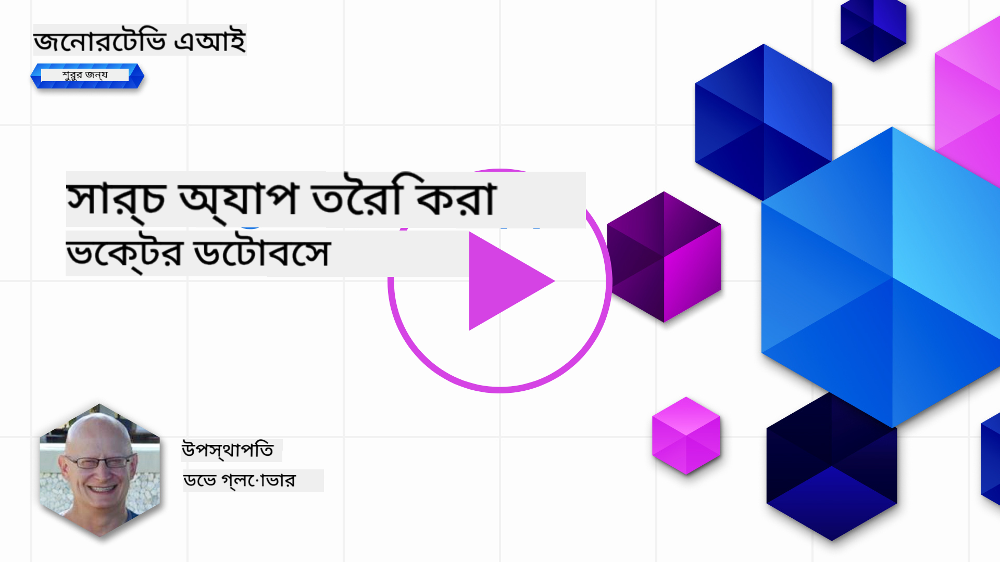

<!--
CO_OP_TRANSLATOR_METADATA:
{
  "original_hash": "58953c08b8ba7073b836d4270ea0fe86",
  "translation_date": "2025-10-17T14:50:46+00:00",
  "source_file": "08-building-search-applications/README.md",
  "language_code": "bn"
}
-->
# সার্চ অ্যাপ্লিকেশন তৈরি করা

[](https://youtu.be/W0-nzXjOjr0?si=GcsqiTTvd7RKbo7V)

> > _উপরের ছবিতে ক্লিক করে এই পাঠের ভিডিও দেখুন_

LLMs শুধুমাত্র চ্যাটবট এবং টেক্সট জেনারেশনের জন্য নয়। এম্বেডিং ব্যবহার করে সার্চ অ্যাপ্লিকেশন তৈরি করাও সম্ভব। এম্বেডিং হল ডেটার সংখ্যাসূচক উপস্থাপনা, যা ভেক্টর নামেও পরিচিত, এবং এটি ডেটার জন্য সেমান্টিক সার্চে ব্যবহার করা যেতে পারে।

এই পাঠে, আপনি আমাদের শিক্ষা স্টার্টআপের জন্য একটি সার্চ অ্যাপ্লিকেশন তৈরি করবেন। আমাদের স্টার্টআপ একটি অলাভজনক সংস্থা যা উন্নয়নশীল দেশের শিক্ষার্থীদের বিনামূল্যে শিক্ষা প্রদান করে। আমাদের স্টার্টআপের অনেক ইউটিউব ভিডিও রয়েছে যা শিক্ষার্থীরা AI সম্পর্কে শেখার জন্য ব্যবহার করতে পারে। আমাদের স্টার্টআপ একটি সার্চ অ্যাপ্লিকেশন তৈরি করতে চায় যা শিক্ষার্থীদের একটি প্রশ্ন টাইপ করে ইউটিউব ভিডিও খুঁজতে সাহায্য করবে।

উদাহরণস্বরূপ, একজন শিক্ষার্থী 'জুপিটার নোটবুক কী?' বা 'অ্যাজুর এমএল কী?' টাইপ করতে পারে এবং সার্চ অ্যাপ্লিকেশন সেই প্রশ্নের সাথে সম্পর্কিত ইউটিউব ভিডিওগুলির একটি তালিকা প্রদান করবে। আরও ভালোভাবে বলতে গেলে, সার্চ অ্যাপ্লিকেশন ভিডিওর সেই অংশের লিঙ্ক প্রদান করবে যেখানে প্রশ্নের উত্তর রয়েছে।

## পরিচিতি

এই পাঠে আমরা আলোচনা করব:

- সেমান্টিক বনাম কীওয়ার্ড সার্চ।
- টেক্সট এম্বেডিং কী।
- টেক্সট এম্বেডিং ইনডেক্স তৈরি করা।
- টেক্সট এম্বেডিং ইনডেক্সে সার্চ করা।

## শেখার লক্ষ্য

এই পাঠ সম্পন্ন করার পরে, আপনি সক্ষম হবেন:

- সেমান্টিক এবং কীওয়ার্ড সার্চের মধ্যে পার্থক্য করতে।
- টেক্সট এম্বেডিং কী তা ব্যাখ্যা করতে।
- এম্বেডিং ব্যবহার করে ডেটা সার্চ করার জন্য একটি অ্যাপ্লিকেশন তৈরি করতে।

## কেন একটি সার্চ অ্যাপ্লিকেশন তৈরি করবেন?

একটি সার্চ অ্যাপ্লিকেশন তৈরি করলে আপনি ডেটা সার্চ করার জন্য এম্বেডিং কীভাবে ব্যবহার করবেন তা বুঝতে পারবেন। এছাড়াও, আপনি একটি সার্চ অ্যাপ্লিকেশন তৈরি করতে শিখবেন যা শিক্ষার্থীদের দ্রুত তথ্য খুঁজে পেতে সাহায্য করতে পারে।

এই পাঠে Microsoft [AI Show](https://www.youtube.com/playlist?list=PLlrxD0HtieHi0mwteKBOfEeOYf0LJU4O1) ইউটিউব চ্যানেলের ইউটিউব ট্রান্সক্রিপ্টের এম্বেডিং ইনডেক্স অন্তর্ভুক্ত রয়েছে। AI Show একটি ইউটিউব চ্যানেল যা আপনাকে AI এবং মেশিন লার্নিং সম্পর্কে শেখায়। এম্বেডিং ইনডেক্সে অক্টোবর ২০২৩ পর্যন্ত প্রতিটি ইউটিউব ট্রান্সক্রিপ্টের এম্বেডিং রয়েছে। আপনি আমাদের স্টার্টআপের জন্য একটি সার্চ অ্যাপ্লিকেশন তৈরি করতে এই এম্বেডিং ইনডেক্স ব্যবহার করবেন। সার্চ অ্যাপ্লিকেশন ভিডিওর সেই অংশের লিঙ্ক প্রদান করবে যেখানে প্রশ্নের উত্তর রয়েছে। এটি শিক্ষার্থীদের দ্রুত প্রয়োজনীয় তথ্য খুঁজে পেতে একটি চমৎকার উপায়।

নিচে 'can you use rstudio with azure ml?' প্রশ্নের জন্য একটি সেমান্টিক কোয়েরির উদাহরণ দেওয়া হয়েছে। ইউটিউব URLটি দেখুন, আপনি দেখতে পাবেন URL-এ একটি টাইমস্ট্যাম্প রয়েছে যা আপনাকে ভিডিওর সেই অংশে নিয়ে যায় যেখানে প্রশ্নের উত্তর রয়েছে।


## সেমান্টিক সার্চ কী?

এখন আপনি হয়তো ভাবছেন, সেমান্টিক সার্চ কী? সেমান্টিক সার্চ একটি সার্চ কৌশল যা কোয়েরির শব্দগুলির অর্থ ব্যবহার করে প্রাসঙ্গিক ফলাফল প্রদান করে।

এখানে একটি সেমান্টিক সার্চের উদাহরণ রয়েছে। ধরুন আপনি একটি গাড়ি কিনতে চান, আপনি 'আমার স্বপ্নের গাড়ি' সার্চ করতে পারেন। সেমান্টিক সার্চ বুঝতে পারে যে আপনি গাড়ি নিয়ে `স্বপ্ন দেখছেন` না, বরং আপনি আপনার `আদর্শ` গাড়ি কিনতে চাইছেন। সেমান্টিক সার্চ আপনার উদ্দেশ্য বুঝতে পারে এবং প্রাসঙ্গিক ফলাফল প্রদান করে। বিকল্পটি হল `কীওয়ার্ড সার্চ` যা আক্ষরিকভাবে গাড়ি নিয়ে স্বপ্নের জন্য সার্চ করবে এবং প্রায়ই অপ্রাসঙ্গিক ফলাফল প্রদান করে।

## টেক্সট এম্বেডিং কী?

[টেক্সট এম্বেডিং](https://en.wikipedia.org/wiki/Word_embedding?WT.mc_id=academic-105485-koreyst) হল একটি টেক্সট উপস্থাপনা কৌশল যা [ন্যাচারাল ল্যাঙ্গুয়েজ প্রসেসিং](https://en.wikipedia.org/wiki/Natural_language_processing?WT.mc_id=academic-105485-koreyst)-এ ব্যবহৃত হয়। টেক্সট এম্বেডিং হল টেক্সটের সেমান্টিক সংখ্যাসূচক উপস্থাপনা। এম্বেডিং ডেটাকে এমনভাবে উপস্থাপন করতে ব্যবহৃত হয় যা একটি মেশিনের জন্য সহজে বোঝা যায়। টেক্সট এম্বেডিং তৈরি করার জন্য অনেক মডেল রয়েছে, এই পাঠে আমরা OpenAI Embedding Model ব্যবহার করে এম্বেডিং তৈরি করার উপর ফোকাস করব।

এখানে একটি উদাহরণ রয়েছে, কল্পনা করুন যে নিম্নলিখিত টেক্সটটি AI Show ইউটিউব চ্যানেলের একটি এপিসোডের ট্রান্সক্রিপ্টে রয়েছে:

```text
Today we are going to learn about Azure Machine Learning.
```

আমরা টেক্সটটি OpenAI Embedding API-তে পাঠাব এবং এটি ১৫৩৬টি সংখ্যার একটি এম্বেডিং প্রদান করবে, যা একটি ভেক্টর নামে পরিচিত। ভেক্টরের প্রতিটি সংখ্যা টেক্সটের একটি ভিন্ন দিক উপস্থাপন করে। সংক্ষেপে, এখানে ভেক্টরের প্রথম ১০টি সংখ্যা রয়েছে।

```python
[-0.006655829958617687, 0.0026128944009542465, 0.008792596869170666, -0.02446001023054123, -0.008540431968867779, 0.022071078419685364, -0.010703742504119873, 0.003311325330287218, -0.011632772162556648, -0.02187200076878071, ...]
```

## এম্বেডিং ইনডেক্স কীভাবে তৈরি হয়?

এই পাঠের এম্বেডিং ইনডেক্সটি একটি সিরিজ পাইথন স্ক্রিপ্ট ব্যবহার করে তৈরি করা হয়েছে। আপনি এই স্ক্রিপ্টগুলি এবং নির্দেশাবলী [README](./scripts/README.md?WT.mc_id=academic-105485-koreyst)-এ 'scripts' ফোল্ডারে পাবেন। এই পাঠ সম্পন্ন করতে এই স্ক্রিপ্টগুলি চালানোর প্রয়োজন নেই কারণ এম্বেডিং ইনডেক্সটি আপনার জন্য প্রদান করা হয়েছে।

স্ক্রিপ্টগুলি নিম্নলিখিত অপারেশনগুলি সম্পন্ন করে:

1. [AI Show](https://www.youtube.com/playlist?list=PLlrxD0HtieHi0mwteKBOfEeOYf0LJU4O1) প্লেলিস্টের প্রতিটি ইউটিউব ভিডিওর ট্রান্সক্রিপ্ট ডাউনলোড করা হয়।
2. [OpenAI Functions](https://learn.microsoft.com/azure/ai-services/openai/how-to/function-calling?WT.mc_id=academic-105485-koreyst) ব্যবহার করে ইউটিউব ট্রান্সক্রিপ্টের প্রথম ৩ মিনিট থেকে স্পিকার নাম বের করার চেষ্টা করা হয়। প্রতিটি ভিডিওর স্পিকার নাম `embedding_index_3m.json` নামক এম্বেডিং ইনডেক্সে সংরক্ষণ করা হয়।
3. ট্রান্সক্রিপ্ট টেক্সটটি **৩ মিনিটের টেক্সট সেগমেন্টে** ভাগ করা হয়। প্রতিটি সেগমেন্টে প্রায় ২০টি শব্দ পরবর্তী সেগমেন্ট থেকে ওভারল্যাপ করে যাতে সেগমেন্টের এম্বেডিং কাটা না যায় এবং আরও ভালো সার্চ প্রসঙ্গ প্রদান করা যায়।
4. প্রতিটি টেক্সট সেগমেন্ট OpenAI Chat API-তে পাঠানো হয় যাতে টেক্সটটি ৬০ শব্দে সংক্ষেপিত করা যায়। সংক্ষেপণটি `embedding_index_3m.json` এম্বেডিং ইনডেক্সে সংরক্ষণ করা হয়।
5. অবশেষে, সেগমেন্ট টেক্সটটি OpenAI Embedding API-তে পাঠানো হয়। এম্বেডিং API ১৫৩৬ সংখ্যার একটি ভেক্টর প্রদান করে যা সেগমেন্টের সেমান্টিক অর্থ উপস্থাপন করে। সেগমেন্টটি OpenAI Embedding ভেক্টরের সাথে `embedding_index_3m.json` এম্বেডিং ইনডেক্সে সংরক্ষণ করা হয়।

### ভেক্টর ডেটাবেস

পাঠের সরলতার জন্য, এম্বেডিং ইনডেক্সটি `embedding_index_3m.json` নামক একটি JSON ফাইলে সংরক্ষণ করা হয়েছে এবং একটি Pandas DataFrame-এ লোড করা হয়েছে। তবে, প্রোডাকশনে এম্বেডিং ইনডেক্সটি [Azure Cognitive Search](https://learn.microsoft.com/training/modules/improve-search-results-vector-search?WT.mc_id=academic-105485-koreyst), [Redis](https://cookbook.openai.com/examples/vector_databases/redis/readme?WT.mc_id=academic-105485-koreyst), [Pinecone](https://cookbook.openai.com/examples/vector_databases/pinecone/readme?WT.mc_id=academic-105485-koreyst), [Weaviate](https://cookbook.openai.com/examples/vector_databases/weaviate/readme?WT.mc_id=academic-105485-koreyst) ইত্যাদি ভেক্টর ডেটাবেসে সংরক্ষণ করা হবে।

## কসাইন সিমিলারিটি বোঝা

আমরা টেক্সট এম্বেডিং সম্পর্কে শিখেছি, পরবর্তী ধাপ হল টেক্সট এম্বেডিং ব্যবহার করে ডেটা সার্চ করা এবং বিশেষ করে কসাইন সিমিলারিটি ব্যবহার করে একটি প্রদত্ত কোয়েরির সাথে সবচেয়ে মিল এম্বেডিং খুঁজে বের করা।

### কসাইন সিমিলারিটি কী?

কসাইন সিমিলারিটি হল দুটি ভেক্টরের মধ্যে সাদৃশ্যের একটি পরিমাপ, এটি `nearest neighbor search` নামেও পরিচিত। কসাইন সিমিলারিটি সার্চ করতে হলে OpenAI Embedding API ব্যবহার করে _query_ টেক্সটের জন্য _ভেক্টরাইজ_ করতে হবে। তারপর কোয়েরি ভেক্টর এবং এম্বেডিং ইনডেক্সের প্রতিটি ভেক্টরের মধ্যে _কসাইন সিমিলারিটি_ গণনা করতে হবে। মনে রাখবেন, এম্বেডিং ইনডেক্সে প্রতিটি ইউটিউব ট্রান্সক্রিপ্ট টেক্সট সেগমেন্টের জন্য একটি ভেক্টর রয়েছে। অবশেষে, কসাইন সিমিলারিটি অনুযায়ী ফলাফলগুলো সাজান এবং সবচেয়ে বেশি কসাইন সিমিলারিটি থাকা টেক্সট সেগমেন্টগুলো কোয়েরির সাথে সবচেয়ে বেশি মিল।

গাণিতিক দৃষ্টিকোণ থেকে, কসাইন সিমিলারিটি দুটি ভেক্টরের মধ্যে কোণ পরিমাপ করে যা বহুমাত্রিক স্থানে প্রজেক্ট করা হয়। এই পরিমাপটি উপকারী কারণ যদি দুটি ডকুমেন্ট আকারের কারণে ইউক্লিডিয়ান দূরত্বে দূরে থাকে, তারা এখনও তাদের মধ্যে ছোট কোণ থাকতে পারে এবং তাই উচ্চ কসাইন সিমিলারিটি থাকতে পারে। কসাইন সিমিলারিটি সমীকরণ সম্পর্কে আরও তথ্যের জন্য, দেখুন [Cosine similarity](https://en.wikipedia.org/wiki/Cosine_similarity?WT.mc_id=academic-105485-koreyst)।

## আপনার প্রথম সার্চ অ্যাপ্লিকেশন তৈরি করা

পরবর্তী ধাপে, আমরা এম্বেডিং ব্যবহার করে একটি সার্চ অ্যাপ্লিকেশন তৈরি করা শিখব। সার্চ অ্যাপ্লিকেশন শিক্ষার্থীদের একটি প্রশ্ন টাইপ করে ভিডিও খুঁজতে সাহায্য করবে। সার্চ অ্যাপ্লিকেশন প্রশ্নের সাথে সম্পর্কিত ভিডিওগুলির একটি তালিকা প্রদান করবে। সার্চ অ্যাপ্লিকেশন ভিডিওর সেই অংশের লিঙ্কও প্রদান করবে যেখানে প্রশ্নের উত্তর রয়েছে।

এই সমাধানটি Windows 11, macOS, এবং Ubuntu 22.04-এ Python 3.10 বা তার পরবর্তী সংস্করণ ব্যবহার করে তৈরি এবং পরীক্ষা করা হয়েছে। আপনি [python.org](https://www.python.org/downloads/?WT.mc_id=academic-105485-koreyst) থেকে Python ডাউনলোড করতে পারেন।

## অ্যাসাইনমেন্ট - শিক্ষার্থীদের সক্ষম করার জন্য একটি সার্চ অ্যাপ্লিকেশন তৈরি করা

আমরা এই পাঠের শুরুতে আমাদের স্টার্টআপ পরিচয় করিয়েছি। এখন শিক্ষার্থীদের তাদের মূল্যায়নের জন্য একটি সার্চ অ্যাপ্লিকেশন তৈরি করতে সক্ষম করার সময়।

এই অ্যাসাইনমেন্টে, আপনি Azure OpenAI Services তৈরি করবেন যা সার্চ অ্যাপ্লিকেশন তৈরি করতে ব্যবহৃত হবে। আপনি নিম্নলিখিত Azure OpenAI Services তৈরি করবেন। এই অ্যাসাইনমেন্ট সম্পন্ন করতে আপনার একটি Azure সাবস্ক্রিপশন প্রয়োজন হবে।

### Azure Cloud Shell শুরু করুন

1. [Azure পোর্টালে](https://portal.azure.com/?WT.mc_id=academic-105485-koreyst) সাইন ইন করুন।
2. Azure পোর্টালের উপরের ডান কোণে Cloud Shell আইকন নির্বাচন করুন।
3. পরিবেশের ধরন হিসেবে **Bash** নির্বাচন করুন।

#### একটি রিসোর্স গ্রুপ তৈরি করুন

> এই নির্দেশাবলীর জন্য, আমরা East US-এ "semantic-video-search" নামক রিসোর্স গ্রুপ ব্যবহার করছি।
> আপনি রিসোর্স গ্রুপের নাম পরিবর্তন করতে পারেন, তবে রিসোর্সগুলির অবস্থান পরিবর্তন করার সময়,
> [মডেল অ্যাভেইলেবিলিটি টেবিল](https://aka.ms/oai/models?WT.mc_id=academic-105485-koreyst) পরীক্ষা করুন।

```shell
az group create --name semantic-video-search --location eastus
```

#### একটি Azure OpenAI Service রিসোর্স তৈরি করুন

Azure Cloud Shell থেকে নিম্নলিখিত কমান্ড চালিয়ে একটি Azure OpenAI Service রিসোর্স তৈরি করুন।

```shell
az cognitiveservices account create --name semantic-video-openai --resource-group semantic-video-search \
    --location eastus --kind OpenAI --sku s0
```

#### এই অ্যাপ্লিকেশনে ব্যবহারের জন্য এন্ডপয়েন্ট এবং কীস পান

Azure Cloud Shell থেকে নিম্নলিখিত কমান্ড চালিয়ে Azure OpenAI Service রিসোর্সের এন্ডপয়েন্ট এবং কীস পান।

```shell
az cognitiveservices account show --name semantic-video-openai \
   --resource-group  semantic-video-search | jq -r .properties.endpoint
az cognitiveservices account keys list --name semantic-video-openai \
   --resource-group semantic-video-search | jq -r .key1
```

#### OpenAI Embedding মডেল ডিপ্লয় করুন

Azure Cloud Shell থেকে নিম্নলিখিত কমান্ড চালিয়ে OpenAI Embedding মডেল ডিপ্লয় করুন।

```shell
az cognitiveservices account deployment create \
    --name semantic-video-openai \
    --resource-group  semantic-video-search \
    --deployment-name text-embedding-ada-002 \
    --model-name text-embedding-ada-002 \
    --model-version "2"  \
    --model-format OpenAI \
    --sku-capacity 100 --sku-name "Standard"
```

## সমাধান

GitHub Codespaces-এ [solution notebook](./python/aoai-solution.ipynb?WT.mc_id=academic-105485-koreyst) খুলুন এবং Jupyter Notebook-এ নির্দেশাবলী অনুসরণ করুন।

যখন আপনি নোটবুক চালাবেন, তখন আপনাকে একটি কোয়েরি প্রবেশ করানোর জন্য অনুরোধ করা হবে। ইনপুট বক্সটি এরকম দেখাবে:


## চমৎকার কাজ! আপনার শেখা চালিয়ে যান

এই পাঠ সম্পন্ন করার পরে, আমাদের [Generative AI Learning collection](https://aka.ms/genai-collection?WT.mc_id=academic-105485-koreyst) দেখুন এবং জেনারেটিভ AI সম্পর্কে আপনার জ্ঞান আরও উন্নত করুন!

Lesson 9-এ যান যেখানে আমরা [ইমেজ জেনারেশন অ্যাপ্লিকেশন তৈরি করা](../09-building-image-applications/README.md?WT.mc_id=academic-105485-koreyst) নিয়ে আলোচনা করব!

---

**অস্বীকৃতি**:  
এই নথিটি AI অনুবাদ পরিষেবা [Co-op Translator](https://github.com/Azure/co-op-translator) ব্যবহার করে অনুবাদ করা হয়েছে। আমরা যথাসাধ্য সঠিকতা নিশ্চিত করার চেষ্টা করি, তবে অনুগ্রহ করে মনে রাখবেন যে স্বয়ংক্রিয় অনুবাদে ত্রুটি বা অসঙ্গতি থাকতে পারে। মূল ভাষায় থাকা নথিটিকে প্রামাণিক উৎস হিসেবে বিবেচনা করা উচিত। গুরুত্বপূর্ণ তথ্যের জন্য, পেশাদার মানব অনুবাদ সুপারিশ করা হয়। এই অনুবাদ ব্যবহারের ফলে কোনো ভুল বোঝাবুঝি বা ভুল ব্যাখ্যার জন্য আমরা দায়বদ্ধ নই।