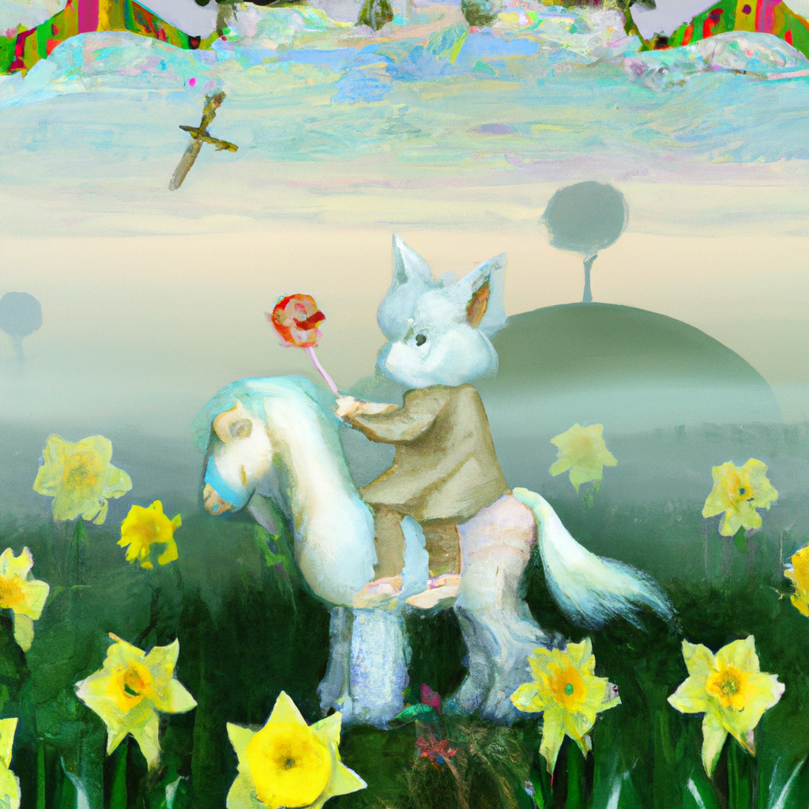

<!--
CO_OP_TRANSLATOR_METADATA:
{
  "original_hash": "7a655f30d1dcbdfe6eff2558eff249af",
  "translation_date": "2025-06-25T17:12:41+00:00",
  "source_file": "09-building-image-applications/README.md",
  "language_code": "bn"
}
-->
# ইমেজ জেনারেশন অ্যাপ্লিকেশন তৈরি করা

LLM-এর ক্ষেত্রে শুধুমাত্র টেক্সট জেনারেশনই নয়, টেক্সট বিবরণ থেকে ইমেজ তৈরি করাও সম্ভব। ইমেজ একটি মোডালিটি হিসেবে অত্যন্ত কার্যকরী হতে পারে বিভিন্ন ক্ষেত্রে, যেমন মেডটেক, স্থাপত্য, পর্যটন, গেম ডেভেলপমেন্ট এবং আরও অনেক কিছু। এই অধ্যায়ে, আমরা দুটি জনপ্রিয় ইমেজ জেনারেশন মডেল, DALL-E এবং Midjourney সম্পর্কে জানব।

## ভূমিকা

এই পাঠে আমরা আলোচনা করব:

- ইমেজ জেনারেশন এবং কেন এটি উপকারী।
- DALL-E এবং Midjourney, এরা কি এবং কিভাবে কাজ করে।
- কিভাবে আপনি একটি ইমেজ জেনারেশন অ্যাপ তৈরি করবেন।

## শেখার লক্ষ্য

এই পাঠ সম্পন্ন করার পর, আপনি পারবেন:

- একটি ইমেজ জেনারেশন অ্যাপ্লিকেশন তৈরি করতে।
- মেটা প্রম্পটের মাধ্যমে আপনার অ্যাপ্লিকেশনের সীমানা নির্ধারণ করতে।
- DALL-E এবং Midjourney এর সাথে কাজ করতে।

## কেন একটি ইমেজ জেনারেশন অ্যাপ্লিকেশন তৈরি করবেন?

ইমেজ জেনারেশন অ্যাপ্লিকেশনগুলি জেনারেটিভ এআই এর ক্ষমতাগুলি অন্বেষণ করার একটি দুর্দান্ত উপায়। এগুলি ব্যবহার করা যেতে পারে, যেমন:

- **ইমেজ এডিটিং এবং সংশ্লেষণ**। আপনি বিভিন্ন ব্যবহারের ক্ষেত্রে, যেমন ইমেজ এডিটিং এবং ইমেজ সংশ্লেষণের জন্য ইমেজ তৈরি করতে পারেন।

- **বিভিন্ন শিল্পে প্রয়োগ করা**। এগুলি বিভিন্ন শিল্পে, যেমন মেডটেক, পর্যটন, গেম ডেভেলপমেন্ট এবং আরও অনেক ক্ষেত্রে ইমেজ তৈরি করতে ব্যবহার করা যেতে পারে।

## দৃশ্যপট: Edu4All

এই পাঠের অংশ হিসেবে, আমরা আমাদের স্টার্টআপ Edu4All এর সাথে কাজ চালিয়ে যাব। শিক্ষার্থীরা তাদের মূল্যায়নের জন্য ইমেজ তৈরি করবে, ঠিক কী ইমেজ হবে তা শিক্ষার্থীদের উপর নির্ভর করবে, তবে তারা তাদের নিজস্ব রূপকথার জন্য চিত্রণ তৈরি করতে পারে বা তাদের গল্পের জন্য একটি নতুন চরিত্র তৈরি করতে পারে বা তাদের ধারণা এবং ধারণাগুলি কল্পনা করতে সহায়তা করতে পারে।

এখানে উদাহরণস্বরূপ Edu4All এর শিক্ষার্থীরা যদি শ্রেণীকক্ষে স্মৃতিস্তম্ভ নিয়ে কাজ করছে তাহলে তারা যা তৈরি করতে পারে:


একটি প্রম্পট ব্যবহার করে

> "কুকুর আইফেল টাওয়ারের পাশে, সকালের সূর্যালোকে"

## DALL-E এবং Midjourney কি?

[DALL-E](https://openai.com/dall-e-2?WT.mc_id=academic-105485-koreyst) এবং [Midjourney](https://www.midjourney.com/?WT.mc_id=academic-105485-koreyst) দুটি জনপ্রিয় ইমেজ জেনারেশন মডেল, তারা আপনাকে প্রম্পট ব্যবহার করে ইমেজ তৈরি করতে দেয়।

### DALL-E

আসুন DALL-E দিয়ে শুরু করি, যা একটি জেনারেটিভ এআই মডেল যা টেক্সট বিবরণ থেকে ইমেজ তৈরি করে।

> [DALL-E দুটি মডেলের সমন্বয়, CLIP এবং diffused attention](https://towardsdatascience.com/openais-dall-e-and-clip-101-a-brief-introduction-3a4367280d4e?WT.mc_id=academic-105485-koreyst)।

- **CLIP**, একটি মডেল যা এম্বেডিং তৈরি করে, যা ইমেজ এবং টেক্সট থেকে ডেটার সংখ্যাগত উপস্থাপনা।

- **Diffused attention**, একটি মডেল যা এম্বেডিং থেকে ইমেজ তৈরি করে। DALL-E একটি ইমেজ এবং টেক্সট ডেটাসেটে প্রশিক্ষিত এবং টেক্সট বিবরণ থেকে ইমেজ তৈরি করতে ব্যবহার করা যেতে পারে। উদাহরণস্বরূপ, DALL-E একটি টুপি পরা বিড়াল বা মোহক সহ একটি কুকুরের ছবি তৈরি করতে পারে।

### Midjourney

Midjourney DALL-E এর মতোই কাজ করে, এটি টেক্সট প্রম্পট থেকে ইমেজ তৈরি করে। Midjourney, "টুপি পরা বিড়াল" বা "মোহক সহ কুকুর" এর মতো প্রম্পট ব্যবহার করে ইমেজ তৈরি করতেও ব্যবহার করা যেতে পারে।


_চিত্র ক্রেডিট উইকিপিডিয়া, Midjourney দ্বারা তৈরি ইমেজ_

## DALL-E এবং Midjourney কিভাবে কাজ করে

প্রথমে, [DALL-E](https://arxiv.org/pdf/2102.12092.pdf?WT.mc_id=academic-105485-koreyst)। DALL-E একটি জেনারেটিভ এআই মডেল যা একটি _অটোরিগ্রেসিভ ট্রান্সফরমার_ সহ ট্রান্সফরমার আর্কিটেকচারের উপর ভিত্তি করে।

একটি _অটোরিগ্রেসিভ ট্রান্সফরমার_ সংজ্ঞায়িত করে কিভাবে একটি মডেল টেক্সট বিবরণ থেকে ইমেজ তৈরি করে, এটি একবারে একটি পিক্সেল তৈরি করে, এবং তারপর পরবর্তী পিক্সেল তৈরি করতে তৈরি পিক্সেলগুলি ব্যবহার করে। নিউরাল নেটওয়ার্কের একাধিক স্তর অতিক্রম করে, যতক্ষণ না ইমেজটি সম্পূর্ণ হয়।

এই প্রক্রিয়ার মাধ্যমে, DALL-E, ইমেজে বৈশিষ্ট্য, বস্তু, বৈশিষ্ট্য এবং আরও অনেক কিছু নিয়ন্ত্রণ করে। তবে, DALL-E 2 এবং 3 এর তৈরি ইমেজের উপর আরও বেশি নিয়ন্ত্রণ রয়েছে।

## আপনার প্রথম ইমেজ জেনারেশন অ্যাপ্লিকেশন তৈরি করা

তাহলে একটি ইমেজ জেনারেশন অ্যাপ্লিকেশন তৈরি করতে কী কী লাগে? আপনাকে নিম্নলিখিত লাইব্রেরিগুলির প্রয়োজন:

- **python-dotenv**, আপনার গোপনীয়তাগুলি কোড থেকে দূরে একটি _.env_ ফাইলে রাখতে এই লাইব্রেরিটি ব্যবহার করার জন্য অত্যন্ত সুপারিশ করা হয়।
- **openai**, এই লাইব্রেরিটি আপনি OpenAI API এর সাথে ইন্টারঅ্যাক্ট করতে ব্যবহার করবেন।
- **pillow**, পাইথনে ইমেজ নিয়ে কাজ করতে।
- **requests**, আপনাকে HTTP অনুরোধ করতে সাহায্য করার জন্য।

1. নিম্নলিখিত বিষয়বস্তু সহ একটি ফাইল _.env_ তৈরি করুন:

   ```text
   AZURE_OPENAI_ENDPOINT=<your endpoint>
   AZURE_OPENAI_API_KEY=<your key>
   ```

   Azure পোর্টালে আপনার রিসোর্সের জন্য "Keys and Endpoint" বিভাগে এই তথ্যটি সন্ধান করুন।

1. উপরের লাইব্রেরিগুলি _requirements.txt_ নামে একটি ফাইলে সংগ্রহ করুন এইভাবে:

   ```text
   python-dotenv
   openai
   pillow
   requests
   ```

1. পরবর্তী, ভার্চুয়াল পরিবেশ তৈরি করুন এবং লাইব্রেরিগুলি ইনস্টল করুন:

   ```bash
   python3 -m venv venv
   source venv/bin/activate
   pip install -r requirements.txt
   ```

   Windows এর জন্য, আপনার ভার্চুয়াল পরিবেশ তৈরি এবং সক্রিয় করতে নিম্নলিখিত কমান্ডগুলি ব্যবহার করুন:

   ```bash
   python3 -m venv venv
   venv\Scripts\activate.bat
   ```

1. _app.py_ নামে একটি ফাইলে নিম্নলিখিত কোড যোগ করুন:

   ```python
   import openai
   import os
   import requests
   from PIL import Image
   import dotenv

   # import dotenv
   dotenv.load_dotenv()

   # Get endpoint and key from environment variables
   openai.api_base = os.environ['AZURE_OPENAI_ENDPOINT']
   openai.api_key = os.environ['AZURE_OPENAI_API_KEY']

   # Assign the API version (DALL-E is currently supported for the 2023-06-01-preview API version only)
   openai.api_version = '2023-06-01-preview'
   openai.api_type = 'azure'


   try:
       # Create an image by using the image generation API
       generation_response = openai.Image.create(
           prompt='Bunny on horse, holding a lollipop, on a foggy meadow where it grows daffodils',    # Enter your prompt text here
           size='1024x1024',
           n=2,
           temperature=0,
       )
       # Set the directory for the stored image
       image_dir = os.path.join(os.curdir, 'images')

       # If the directory doesn't exist, create it
       if not os.path.isdir(image_dir):
           os.mkdir(image_dir)

       # Initialize the image path (note the filetype should be png)
       image_path = os.path.join(image_dir, 'generated-image.png')

       # Retrieve the generated image
       image_url = generation_response["data"][0]["url"]  # extract image URL from response
       generated_image = requests.get(image_url).content  # download the image
       with open(image_path, "wb") as image_file:
           image_file.write(generated_image)

       # Display the image in the default image viewer
       image = Image.open(image_path)
       image.show()

   # catch exceptions
   except openai.InvalidRequestError as err:
       print(err)

   ```

এই কোডটি ব্যাখ্যা করা যাক:

- প্রথমে, আমরা প্রয়োজনীয় লাইব্রেরিগুলি আমদানি করি, যার মধ্যে OpenAI লাইব্রেরি, dotenv লাইব্রেরি, requests লাইব্রেরি এবং Pillow লাইব্রেরি অন্তর্ভুক্ত।

  ```python
  import openai
  import os
  import requests
  from PIL import Image
  import dotenv
  ```

- পরবর্তী, আমরা _.env_ ফাইল থেকে পরিবেশগত ভেরিয়েবলগুলি লোড করি।

  ```python
  # import dotenv
  dotenv.load_dotenv()
  ```

- তারপর, আমরা OpenAI API এর জন্য এন্ডপয়েন্ট, কী, সংস্করণ এবং টাইপ সেট করি।

  ```python
  # Get endpoint and key from environment variables
  openai.api_base = os.environ['AZURE_OPENAI_ENDPOINT']
  openai.api_key = os.environ['AZURE_OPENAI_API_KEY']

  # add version and type, Azure specific
  openai.api_version = '2023-06-01-preview'
  openai.api_type = 'azure'
  ```

- পরবর্তী, আমরা ইমেজ তৈরি করি:

  ```python
  # Create an image by using the image generation API
  generation_response = openai.Image.create(
      prompt='Bunny on horse, holding a lollipop, on a foggy meadow where it grows daffodils',    # Enter your prompt text here
      size='1024x1024',
      n=2,
      temperature=0,
  )
  ```

  উপরের কোডটি একটি JSON অবজেক্টের সাথে সাড়া দেয় যা তৈরি করা ইমেজের URL ধারণ করে। আমরা ইমেজটি ডাউনলোড করতে এবং একটি ফাইলে সংরক্ষণ করতে URL ব্যবহার করতে পারি।

- সর্বশেষে, আমরা ইমেজটি খুলি এবং এটি প্রদর্শন করার জন্য স্ট্যান্ডার্ড ইমেজ ভিউয়ার ব্যবহার করি:

  ```python
  image = Image.open(image_path)
  image.show()
  ```

### ইমেজ তৈরি সম্পর্কে আরও বিস্তারিত

চলুন আমরা ইমেজ তৈরি করে এমন কোডটি আরও বিস্তারিতভাবে দেখি:

```python
generation_response = openai.Image.create(
        prompt='Bunny on horse, holding a lollipop, on a foggy meadow where it grows daffodils',    # Enter your prompt text here
        size='1024x1024',
        n=2,
        temperature=0,
    )
```

- **prompt**, হল টেক্সট প্রম্পট যা ইমেজ তৈরি করতে ব্যবহৃত হয়। এই ক্ষেত্রে, আমরা "খরগোশ ঘোড়ার উপর, ললিপপ ধরে, কুয়াশাচ্ছন্ন মাঠে যেখানে ড্যাফোডিল জন্মায়" প্রম্পটটি ব্যবহার করছি।
- **size**, হল তৈরি হওয়া ইমেজের আকার। এই ক্ষেত্রে, আমরা 1024x1024 পিক্সেলের একটি ইমেজ তৈরি করছি।
- **n**, হল তৈরি হওয়া ইমেজের সংখ্যা। এই ক্ষেত্রে, আমরা দুটি ইমেজ তৈরি করছি।
- **temperature**, হল একটি প্যারামিটার যা একটি জেনারেটিভ এআই মডেলের আউটপুটের র্যান্ডমনেস নিয়ন্ত্রণ করে। তাপমাত্রা হল 0 এবং 1 এর মধ্যে একটি মান যেখানে 0 মানে আউটপুট নির্ধারিত এবং 1 মানে আউটপুট র্যান্ডম। ডিফল্ট মান 0.7।

ইমেজ নিয়ে আরও কিছু করা যায় যা আমরা পরবর্তী বিভাগে আলোচনা করব।

## ইমেজ জেনারেশনের অতিরিক্ত ক্ষমতা

আপনি এখন পর্যন্ত দেখেছেন কিভাবে আমরা পাইথনে কয়েকটি লাইনের মাধ্যমে একটি ইমেজ তৈরি করতে সক্ষম হয়েছি। তবে, ইমেজ নিয়ে আরও কিছু করা যায়।

আপনি এছাড়াও নিম্নলিখিত কাজগুলি করতে পারেন:

- **সম্পাদনাগুলি সম্পাদন করুন**। একটি বিদ্যমান ইমেজ, একটি মাস্ক এবং একটি প্রম্পট প্রদান করে, আপনি একটি ইমেজ পরিবর্তন করতে পারেন। উদাহরণস্বরূপ, আপনি একটি ইমেজের একটি অংশে কিছু যোগ করতে পারেন। আমাদের খরগোশের ইমেজ কল্পনা করুন, আপনি খরগোশের উপর একটি টুপি যোগ করতে পারেন। আপনি এটি কিভাবে করবেন তা হল ইমেজ, একটি মাস্ক (পরিবর্তনের জন্য এলাকার অংশ চিহ্নিত করে) এবং একটি টেক্সট প্রম্পট প্রদান করে যা করা উচিত তা বলার মাধ্যমে।

  ```python
  response = openai.Image.create_edit(
    image=open("base_image.png", "rb"),
    mask=open("mask.png", "rb"),
    prompt="An image of a rabbit with a hat on its head.",
    n=1,
    size="1024x1024"
  )
  image_url = response['data'][0]['url']
  ```

  বেস ইমেজটি শুধুমাত্র খরগোশ ধারণ করবে কিন্তু চূড়ান্ত ইমেজটিতে খরগোশের উপর টুপি থাকবে।

- **ভেরিয়েশন তৈরি করুন**। ধারণাটি হল যে আপনি একটি বিদ্যমান ইমেজ নিন এবং ভেরিয়েশন তৈরি করতে বলুন। একটি ভেরিয়েশন তৈরি করতে, আপনি একটি ইমেজ এবং একটি টেক্সট প্রম্পট প্রদান করুন এবং কোড এইভাবে:

  ```python
  response = openai.Image.create_variation(
    image=open("bunny-lollipop.png", "rb"),
    n=1,
    size="1024x1024"
  )
  image_url = response['data'][0]['url']
  ```

  > নোট করুন, এটি শুধুমাত্র OpenAI তে সমর্থিত

## তাপমাত্রা

তাপমাত্রা একটি প্যারামিটার যা একটি জেনারেটিভ এআই মডেলের আউটপুটের র্যান্ডমনেস নিয়ন্ত্রণ করে। তাপমাত্রা হল 0 এবং 1 এর মধ্যে একটি মান যেখানে 0 মানে আউটপুট নির্ধারিত এবং 1 মানে আউটপুট র্যান্ডম। ডিফল্ট মান 0.7।

চলুন একটি উদাহরণ দেখে নিই কিভাবে তাপমাত্রা কাজ করে, এই প্রম্পটটি দুইবার চালিয়ে:

> প্রম্পট: "খরগোশ ঘোড়ার উপর, ললিপপ ধরে, কুয়াশাচ্ছন্ন মাঠে যেখানে ড্যাফোডিল জন্মায়"



এখন আসুন সেই একই প্রম্পটটি আবার চালাই, শুধু দেখতে যে আমরা একই ইমেজ দুইবার পাব না:


যেমন আপনি দেখতে পাচ্ছেন, ইমেজগুলি একই নয় কিন্তু অনুরূপ। আসুন তাপমাত্রা মান 0.1 এ পরিবর্তন করি এবং দেখি কি হয়:

```python
 generation_response = openai.Image.create(
        prompt='Bunny on horse, holding a lollipop, on a foggy meadow where it grows daffodils',    # Enter your prompt text here
        size='1024x1024',
        n=2
    )
```

### তাপমাত্রা পরিবর্তন করা

তাহলে আসুন আমরা প্রতিক্রিয়াটি আরও নির্ধারিত করার চেষ্টা করি। আমরা দেখতে পেয়েছি যে প্রথম ইমেজে একটি খরগোশ আছে এবং দ্বিতীয় ইমেজে একটি ঘোড়া আছে, তাই ইমেজগুলি খুবই ভিন্ন।

তাহলে আসুন আমাদের কোড পরিবর্তন করি এবং তাপমাত্রা 0 সেট করি, এইভাবে:

```python
generation_response = openai.Image.create(
        prompt='Bunny on horse, holding a lollipop, on a foggy meadow where it grows daffodils',    # Enter your prompt text here
        size='1024x1024',
        n=2,
        temperature=0
    )
```

এখন যখন আপনি এই কোডটি চালাবেন, আপনি এই দুটি ইমেজ পাবেন:

- 
- 

এখানে আপনি স্পষ্টভাবে দেখতে পারেন কিভাবে ইমেজগুলি একে অপরের সাথে আরও সাদৃশ্যপূর্ণ।

## মেটাপ্রম্পটের সাথে আপনার অ্যাপ্লিকেশনের সীমানা কিভাবে নির্ধারণ করবেন

আমাদের ডেমো দিয়ে, আমরা ইতিমধ্যেই আমাদের ক্লায়েন্টদের জন্য ইমেজ তৈরি করতে পারি। তবে, আমাদের অ্যাপ্লিকেশনের জন্য কিছু সীমানা তৈরি করতে হবে।

উদাহরণস্বরূপ, আমরা এমন ইমেজ তৈরি করতে চাই না যা কাজের জন্য নিরাপদ নয়, বা যা শিশুদের জন্য উপযুক্ত নয়।

আমরা এটি _মেটাপ্রম্পট_ দিয়ে করতে পারি। মেটাপ্রম্পট হল টেক্সট প্রম্পট যা একটি জেনারেটিভ এআই মডেলের আউটপুট নিয়ন্ত্রণ করতে ব্যবহৃত হয়। উদাহরণস্বরূপ, আমরা মেটাপ্রম্পট ব্যবহার করে আউটপুট নিয়ন্ত্রণ করতে পারি এবং নিশ্চিত করতে পারি যে তৈরি হওয়া ইমেজগুলি কাজের জন্য নিরাপদ বা শিশুদের জন্য উপযুক্ত।

### এটি কিভাবে কাজ করে?

এখন, মেটাপ্রম্পট কিভাবে কাজ করে?

মেটাপ্রম্পট হল টেক্সট প্রম্পট যা একটি জেনারেটিভ এআই মডেলের আউটপুট নিয়ন্ত্রণ করতে ব্যবহৃত হয়, এগুলি টেক্সট প্রম্পটের আগে স্থাপন করা হয় এবং মডেলের আউটপুট নিয়ন্ত্রণ করতে ব্যবহৃত হয় এবং মডেলের আউটপুট নিয়ন্ত্রণ করতে অ্যাপ্লিকেশনে এমবেড করা হয়। প্রম্পট ইনপুট এবং মেটাপ্রম্পট ইনপুটকে একটি একক টেক্সট প্রম্পটে আবদ্ধ করে।

একটি মেটাপ্রম্পটের উদাহরণ হতে পারে নিম্নলিখিত:

```text
You are an assistant designer that creates images for children.

The image needs to be safe for work and appropriate for children.

The image needs to be in color.

The image needs to be in landscape orientation.

The image needs to be in a 16:9 aspect ratio.

Do not consider any input from the following that is not safe for work or appropriate for children.

(Input)

```

এখন, আসুন আমাদের ডেমোতে কিভাবে মেটাপ্রম্পট ব্যবহার করা যায় তা দেখি।

```python
disallow_list = "swords, violence, blood, gore, nudity, sexual content, adult content, adult themes, adult language, adult humor, adult jokes, adult situations, adult"

meta_prompt =f"""You are an assistant designer that creates images for children.

The image needs to be safe for work and appropriate for children.

The image needs to be in color.

The image needs to be in landscape orientation.

The image needs to be in a 16:9 aspect ratio.

Do not consider any input from the following that is not safe for work or appropriate for children.
{disallow_list}
"""

prompt = f"{meta_prompt}
Create an image of a bunny on a horse, holding a lollipop"

# TODO add request to generate image
```

উপরের প্রম্পট থেকে, আপনি দেখতে পারেন কিভাবে তৈরি হওয়া সমস্ত ইমেজ মেটাপ্রম্পট বিবেচনা করে।

## অ্যাসাইনমেন্ট - আসুন শিক্ষার্থীদের সক্ষম করি

আমরা এই পাঠের শুরুতে Edu4All এর পরিচয় দিয়েছি। এখন সময় এসেছে শিক্ষার্থীদের তাদের মূল্যায়নের জন্য ইমেজ তৈরি করতে সক্ষম করার।

শিক্ষার্থীরা তাদের মূল্যায়নের জন্য স্মৃতিস্তম্ভগুলি ধারণকারী ইমেজ তৈরি করবে, ঠিক কী স্মৃতিস্তম্ভগুলি হবে তা শিক্ষার্থীদের উপর নির্ভর করবে। শিক্ষার্থীদের এই কাজে তাদের সৃজনশীলতা ব্যবহার করতে বলা হয়েছে এবং এই স্মৃতিস্তম্ভগুলি বিভিন্ন প্রসঙ্গে স্থাপন করতে বলা হয়েছে।

## সমাধান

এখানে একটি সম্ভাব্য সমাধান:

```python
import openai
import os
import requests
from PIL import Image
import dotenv

# import dotenv
dotenv.load_dotenv()

# Get endpoint and key from environment variables
openai.api_base = "<replace with endpoint>"
openai.api_key = "<replace with api key>"

# Assign the API version (DALL-E is currently supported for the 2023-06-01-preview API version only)
openai.api_version = '2023-06-01-preview'
openai.api_type = 'azure'

disallow_list = "swords, violence, blood, gore, nudity, sexual content, adult content, adult themes, adult language, adult humor, adult jokes, adult situations, adult"

meta_prompt = f"""You are an assistant designer that creates images for children.

The image needs to be safe for work and appropriate for children.

The image needs to be in color.

The image needs to be in landscape orientation.

The image needs to be in a 16:9 aspect ratio.

Do not consider any input from the following that is not safe for work or appropriate for children.
{disallow_list}"""

prompt = f"""{metaprompt}
Generate monument of the Arc of Triumph in Paris, France, in the evening light with a small child holding a Teddy looks on.
""""

try:
    # Create an image by using the image generation API
    generation_response = openai.Image.create(
        prompt=prompt,    # Enter your prompt text here
        size='1024x1024',
        n=2,
        temperature=0,
    )
    # Set the directory for the stored image
    image_dir = os.path.join(os.curdir, 'images')

    # If the directory doesn't exist, create it
    if not os.path.isdir(image_dir):
        os.mkdir(image_dir)

    # Initialize the image path (note the filetype should be png)
    image_path = os.path.join(image_dir, 'generated-image.png')

    # Retrieve the generated image
    image_url = generation_response["data"][0]["url"]  # extract image URL from response
    generated_image = requests.get(image_url).content  # download the image
    with open(image_path, "wb") as image_file:
        image_file.write(generated_image)

    # Display the image in the default image viewer
    image = Image.open(image_path)
    image.show()

# catch exceptions
except openai.InvalidRequestError as err:
    print(err)
```

## দুর্দান্ত কাজ! আপনার শেখা চালিয়ে যান

এই পাঠ সম্পন্ন করার পর, আমাদের [জেনারেটিভ এআই লার্নিং সংগ্রহ](https://aka.ms/genai-collection?WT.mc_id=academic-105485-koreyst) দেখুন আপনার জেনারেটিভ এআই জ্ঞান বাড়াতে!

পাঠ 10 এ যান যেখানে আমরা দেখব কিভাবে [লো-কোড দিয়ে এআই অ্যাপ্লিকেশন তৈরি করা যায়](../10-building-low-code-ai-applications/README.md?WT.mc_id=academic-105485-koreyst)

**অস্বীকৃতি**:  
এই নথিটি এআই অনুবাদ পরিষেবা [Co-op Translator](https://github.com/Azure/co-op-translator) ব্যবহার করে অনুবাদ করা হয়েছে। আমরা যথাসাধ্য নির্ভুলতার জন্য চেষ্টা করি, তবে অনুগ্রহ করে মনে রাখবেন যে স্বয়ংক্রিয় অনুবাদে ত্রুটি বা অসংগতি থাকতে পারে। এর মূল ভাষায় থাকা নথিটিকে প্রামাণিক উৎস হিসেবে বিবেচনা করা উচিত। গুরুত্বপূর্ণ তথ্যের জন্য, পেশাদার মানব অনুবাদ সুপারিশ করা হয়। এই অনুবাদ ব্যবহারের ফলে উদ্ভূত কোন ভুল বোঝাবুঝি বা ভুল ব্যাখ্যার জন্য আমরা দায়ী নই।