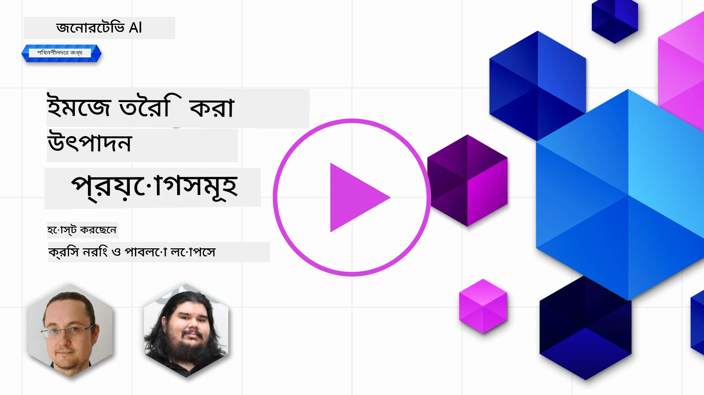

# ইমেজ জেনারেশন অ্যাপ্লিকেশন তৈরি

[](https://aka.ms/gen-ai-lesson9-gh?WT.mc_id=academic-105485-koreyst)

LLMs শুধুমাত্র টেক্সট জেনারেশন নয়। আপনি টেক্সট বর্ণনা থেকে চিত্রও তৈরি করতে পারেন। চিত্র একটি মাধ্যম হিসেবে মেডটেক, আর্কিটেকচার, পর্যটন, গেম ডেভেলপমেন্ট, মার্কেটিং এবং আরও অনেক ক্ষেত্রে ব্যবহারযোগ্য। এই পাঠে আমরা আজকের **GPT Image** মডেলগুলি দেখি এবং একটি চিত্র জেনারেশন অ্যাপ তৈরি করি।

## পরিচিতি

ইমেজ জেনারেশন আপনাকে একটি প্রাকৃতিক-ভাষার প্রম্পট থেকে একটি ছবি তৈরি করতে দেয়। এই পাঠে আমরা OpenAI-এর **`gpt-image`** পরিবারের মডেলগুলি নিয়ে কাজ করি - যা বর্তমানে **[Microsoft Foundry](https://ai.azure.com?WT.mc_id=academic-105485-koreyst)** এবং OpenAI প্ল্যাটফর্মে উপলব্ধ ইমেজ মডেলগুলির বর্তমান প্রজন্ম। এই মডেলগুলি পুরানো DALL·E মডেল (DALL·E 2/3 হল লিগ্যাসি) গুলোর স্থান নিচ্ছে।

পুরো পাঠজুড়ে আমরা একটি কাল্পনিক স্টার্টআপ, **Edu4All**, এর গল্প বলব, যেটি শেখার সরঞ্জাম তৈরি করে। টিমটি অ্যাসাইনমেন্ট এবং স্টাডি ম্যাটিরিয়ালের জন্য চিত্র তৈরি করতে চায়।

## শেখার লক্ষ্যসমূহ

এই পাঠ শেষ হলে আপনি পারবেন:

- ব্যাখ্যা করতে কি ইমেজ জেনারেশন এবং কোথায় এটি উপকারি।
- `gpt-image` মডেল পরিবার বুঝতে এবং কীভাবে এটি লিগ্যাসি DALL·E মডেল থেকে পৃথক।
- পাইথন (এবং টাইপস্ক্রিপ্ট / .NET) ব্যবহার করে একটি ইমেজ জেনারেশন অ্যাপ তৈরি করা।
- চিত্র সম্পাদনা করা এবং মেটাপ্রম্পট ব্যবহার করে সেফটি গার্ডরেইল প্রয়োগ করা।

## ইমেজ জেনারেশন কী?

ইমেজ জেনারেশন মডেলগুলি একটি টেক্সট প্রম্পট থেকে চিত্র তৈরি করে। আধুনিক মডেল যেমন `gpt-image` ট্রান্সফরমার + ডিফিউশন প্রযুক্তির ওপর নির্মিত: মডেলটি প্রশিক্ষণের সময় টেক্সট এবং চিত্রের মধ্যকার সম্পর্ক শিখে, পরে একটি প্রম্পট পেলে ধাপে ধাপে এলোমেলো শব্দকে একটি বর্ণনার সাথে মিলানো চিত্রে "ডিনয়েজ" করে।

দুটি সুপরিচিত ইমেজ মডেল পরিবার হল:

- **`gpt-image` (OpenAI)** - বর্তমান প্রজন্ম, যেটি এই পাঠে ব্যবহৃত। এটি টেক্সট-টু-ইমেজ জেনারেশন এবং চিত্র সম্পাদনা (মাস্ক দিয়ে ইনপেইন্টিং) সমর্থন করে।
- **Midjourney** - একটি জনপ্রিয় তৃতীয় পক্ষের মডেল যার নিজস্ব সার্ভিস এবং Discord ভিত্তিক ওয়ার্কফ্লো আছে।

> পুরানো OpenAI ইমেজ মডেল - **DALL·E 2** এবং **DALL·E 3** - হল লিগ্যাসি। DALL·E 3 নতুন ডিপ্লয়মেন্টের জন্য আর উপলব্ধ নয়, এবং `create_variation` ফিচারটি শুধুমাত্র DALL·E 2 তে ছিল। নতুন অ্যাপ্লিকেশনের জন্য `gpt-image` মডেল ব্যবহার করুন।

### কোন `gpt-image` মডেলটি ব্যবহার করব?

Microsoft Foundry তে নিম্নলিখিতগুলি **সাধারণভাবে উপলব্ধ**:

| মডেল | নোটস |
| --- | --- |
| **`gpt-image-2`** | সর্বশেষ এবং সবচেয়ে সক্ষম ইমেজ মডেল - সুপারিশকৃত ডিফল্ট। |
| `gpt-image-1.5` | সাধারণভাবে উপলব্ধ; কম খরচে শক্তিশালী গুণমান। |
| `gpt-image-1-mini` | সাধারণভাবে উপলব্ধ; দ্রুততম / সর্বনিম্ন খরচ। |
| `gpt-image-1` | পূর্বাভাস মাত্র। |

সর্বদা বর্তমান [Foundry ইমেজ মডেল তালিকা](https://learn.microsoft.com/azure/ai-foundry/openai/concepts/models?WT.mc_id=academic-105485-koreyst) চেক করুন উপলব্ধতা এবং অঞ্চল সম্পর্কে।

> **গুরুত্বপূর্ণ:** `gpt-image` মডেলগুলি তৈরি করা চিত্র **base64** (`b64_json`) ফর্ম্যাটে ফেরত দেয়, URL নয়। আপনার কোড base64 স্ট্রিংকে বাইটে ডিকোড করে সংরক্ষণ করে - ডাউনলোডের জন্য কোনো ইমেজ URL নাই।

## সেটআপ

আপনি উদাহরণগুলো চালাতে পারেন **Microsoft Foundry এর Azure OpenAI**-র বিরুদ্ধে ( `aoai-*` উদাহরণ) অথবা **OpenAI প্ল্যাটফর্ম**-এ ( `oai-*` উদাহরণ)।

### 1. মডেল তৈরি ও ডিপ্লয় করুন

[রিসোর্স তৈরি](https://learn.microsoft.com/azure/ai-foundry/openai/how-to/create-resource?pivots=web-portal&WT.mc_id=academic-105485-koreyst) গাইড অনুসরণ করে Microsoft Foundry রিসোর্স তৈরি করুন, তারপর একটি ইমেজ মডেল ডিপ্লয় করুন - **`gpt-image-2`** সুপারিশকৃত।

### 2. আপনার `.env` কনফিগার করুন

```text
AZURE_OPENAI_ENDPOINT=<your endpoint>
AZURE_OPENAI_API_KEY=<your key>
AZURE_OPENAI_DEPLOYMENT="gpt-image-2"
```

এই মানগুলো আপনার রিসোর্সের [Foundry পোর্টাল](https://ai.azure.com?WT.mc_id=academic-105485-koreyst) এর **Deployments** পেজে পাবেন।

### 3. লাইব্রেরি ইনস্টল করুন

একটি `requirements.txt` তৈরি করুন:

```text
python-dotenv
openai
pillow
```

তারপর একটি ভার্চুয়াল এনভায়রনমেন্ট তৈরি ও সক্রিয় করুন এবং ইনস্টল করুন:

```bash
python3 -m venv venv
source venv/bin/activate        # উইন্ডোজ: venv\Scripts\activate
pip install -r requirements.txt
```

## অ্যাপ তৈরি করুন

নিচের কোড সহ `app.py` তৈরি করুন। এটি একটিচিত্র তৈরি করে PNG হিসেবে সংরক্ষণ করে।

```python
import os
import base64
from openai import AzureOpenAI
from PIL import Image
import dotenv

dotenv.load_dotenv()

# ক্লায়েন্টকে আপনার Azure OpenAI (Microsoft Foundry) রিসোর্সে নির্দেশ দিন।
# ইমেজ মডেলগুলির জন্য সাম্প্রতিক API সংস্করণ প্রয়োজন - আপনার মডেলের জন্য প্রয়োজনীয় সংস্করণটি জানার জন্য Foundry ডকুমেন্টেশন দেখুন।
client = AzureOpenAI(
    api_key=os.environ["AZURE_OPENAI_API_KEY"],
    api_version="2025-04-01-preview",
    azure_endpoint=os.environ["AZURE_OPENAI_ENDPOINT"],
)

deployment = os.environ["AZURE_OPENAI_DEPLOYMENT"]  # যেমন "gpt-image-2"

result = client.images.generate(
    model=deployment,
    prompt='Bunny on a horse, holding a lollipop, on a foggy meadow where it grows daffodils',
    size="1024x1024",   # এছাড়াও ১৫৩৬x১০২৪ (ল্যান্ডস্কেপ), ১০২৪x১৫৩৬ (পোর্ট্রেট), অথবা "auto"
    n=1,
)

# gpt-image মডেলগুলো base64 (b64_json) রিটার্ন করে, URL নয় - এটি বাইটে ডিকোড করুন।
image_bytes = base64.b64decode(result.data[0].b64_json)

os.makedirs("images", exist_ok=True)
image_path = os.path.join("images", "generated-image.png")
with open(image_path, "wb") as f:
    f.write(image_bytes)

Image.open(image_path).show()
```

`python app.py` দিয়ে চালান। `images/` ফোল্ডারের মধ্যে একটি PNG ফাইল পাবেন।

> `images.generate` প্রতিটি কল একই প্রম্পটের জন্য ভিন্ন চিত্র তৈরি করে - ইমেজ মডেলগুলোতে `temperature` প্যারামিটার নেই (এটি টেক্সট জেনারেশন নিয়ন্ত্রণ)। ভিন্নতা পেতে আবার API কল করুন; কমাতে চাইলে আপনার প্রম্পট নির্দিষ্ট করুন।

## চিত্র সম্পাদনা

`gpt-image` মডেলগুলি বিদ্যমান একটি চিত্র **সম্পাদনা** করতে পারে: চিত্র দিন, ঐচ্ছিক **মাস্ক** দিন (যা পরিবর্তন করার এলাকা চিহ্নিত করে), এবং পরিবর্তনের বর্ণনা দেয় এমন প্রম্পট দিন। যেমন জেনারেশন, এডিটও base64 হিসাবে ফেরত আসে।

```python
result = client.images.edit(
    model=deployment,
    image=open("sunlit_lounge.png", "rb"),
    mask=open("mask.png", "rb"),
    prompt="A sunlit indoor lounge area with a pool containing a flamingo",
)
image_bytes = base64.b64decode(result.data[0].b64_json)
with open("images/edited-image.png", "wb") as f:
    f.write(image_bytes)
```

<div style="display: flex; justify-content: space-between; align-items: center; margin: 20px 0;">
  
  
  
</div>

## মেটাপ্রম্পট দিয়ে সীমানা নির্ধারণ

চিত্র জেনারেট করতে পারার পর, আপনাকে গার্ডরেইল লাগবে যেন আপনার অ্যাপ নিরাপদ বা অবৈধ বিষয়বস্তু তৈরি না করে। একটি **মেটাপ্রম্পট** হলো এমন টেক্সট যা আপনি ব্যবহারকারীর প্রম্পটের আগে যুক্ত করেন মডেলের আউটপুট সীমাবদ্ধ করতে।

```python
disallow_list = "swords, violence, blood, gore, nudity, sexual content, adult content, adult themes, adult language"

meta_prompt = f"""You are an assistant designer that creates images for children.

The image needs to be safe for work and appropriate for children.
The image needs to be in color, in landscape orientation, and in a 16:9 aspect ratio.

Do not consider any input that is not safe for work or appropriate for children, including:
{disallow_list}
"""

prompt = f"{meta_prompt}\nCreate an image of a bunny on a horse, holding a lollipop"
# `prompt` কে client.images.generate(...) এ পাঠান
```

এখন প্রতিটি চিত্র মেটাপ্রম্পট দ্বারা নির্ধারিত সীমার মধ্যে তৈরি হয়। এটি Microsoft Foundry তে বিল্ট-ইন কনটেন্ট ফিল্টারগুলোর সাথে মিলিয়ে ডিফেন্স ইন ডেপথ গঠন করে।

## অ্যাসাইনমেন্ট - শিক্ষার্থীদের সক্রিয় করা যাক

Edu4All শিক্ষার্থীরা তাদের মূল্যায়নের জন্য চিত্র প্রয়োজন। এমন একটি অ্যাপ তৈরি করুন যা **স্মৃতিস্তম্ভ** এর (কোন স্মৃতিস্তম্ভ হবে তা আপনি নির্ধারণ করবেন) চিত্র তৈরি করে, বিভিন্ন সৃজনশীল প্রেক্ষাপটে স্থাপন করে - উদাহরণস্বরূপ, একটি বিখ্যাত ল্যান্ডমার্ক সূর্যাস্তে আর একটি শিশু তাকিয়ে আছে।

নিজে চেষ্টা করুন, তারপর রেফারেন্স সমাধানগুলোর সঙ্গে তুলনা করুন:

- পাইথন (Azure): [aoai-solution.py](../../../09-building-image-applications/python/aoai-solution.py)
- পাইথন (Azure) পূর্ণ জেনারেশন অ্যাপ: [aoai-app.py](../../../09-building-image-applications/python/aoai-app.py)
- পাইথন (OpenAI): [oai-app.py](../../../09-building-image-applications/python/oai-app.py)
- টাইপস্ক্রিপ্ট (Azure): [typescript/image-generation-app](../../../09-building-image-applications/typescript/image-generation-app)
- .NET (Azure): [dotnet/notebook-azure-openai.dib](../../../09-building-image-applications/dotnet/notebook-azure-openai.dib)

[python/](../../../09-building-image-applications/python) এর নোটবুকগুলোও কাজ করুন (`aoai-assignment.ipynb` Azure এর জন্য, `oai-assignment.ipynb` OpenAI এর জন্য)।

## অসাধারণ কাজ! আপনার শিখন চালিয়ে যান

এই পাঠ শেষ করার পর, আমাদের [Generative AI Learning collection](https://aka.ms/genai-collection?WT.mc_id=academic-105485-koreyst) দেখুন আপনার Generative AI জ্ঞান উন্নত করার জন্য!

পরবর্তী পাঠ 10 এর জন্য এগিয়ে যান।

---

<!-- CO-OP TRANSLATOR DISCLAIMER START -->
**অস্বীকৃতি**:
এই নথিটি AI অনুবাদ পরিষেবা [Co-op Translator](https://github.com/Azure/co-op-translator) ব্যবহার করে অনূদিত হয়েছে। যদিও আমরা শুদ্ধতার জন্য চেষ্টা করি, অনুগ্রহ করে মনে রাখবেন যে স্বয়ংক্রিয় অনুবাদে ত্রুটি বা অসঙ্গতি থাকতে পারে। মূল নথিটি তার স্বভাষায় কর্তৃত্বপূর্ণ উৎস হিসেবে বিবেচিত হওয়া উচিত। গুরুত্বপূর্ণ তথ্যের জন্য পেশাদার মানব অনুবাদ সুপারিশ করা হয়। এই অনুবাদের ব্যবহারে প্রয়োজনীয় ভুল বোঝাবুঝি বা ভুল ব্যাখ্যার জন্য আমরা দায়বদ্ধ নই।
<!-- CO-OP TRANSLATOR DISCLAIMER END -->