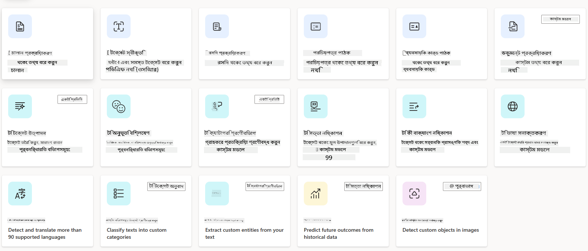
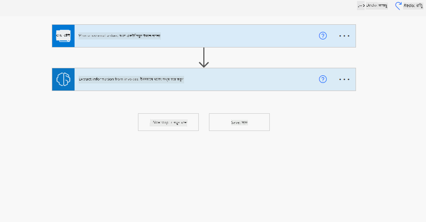
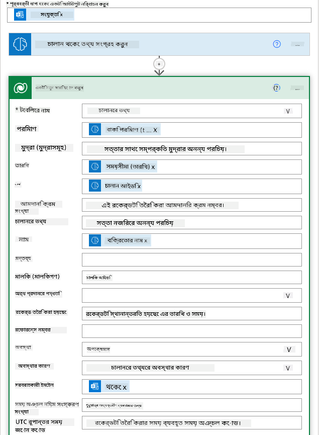
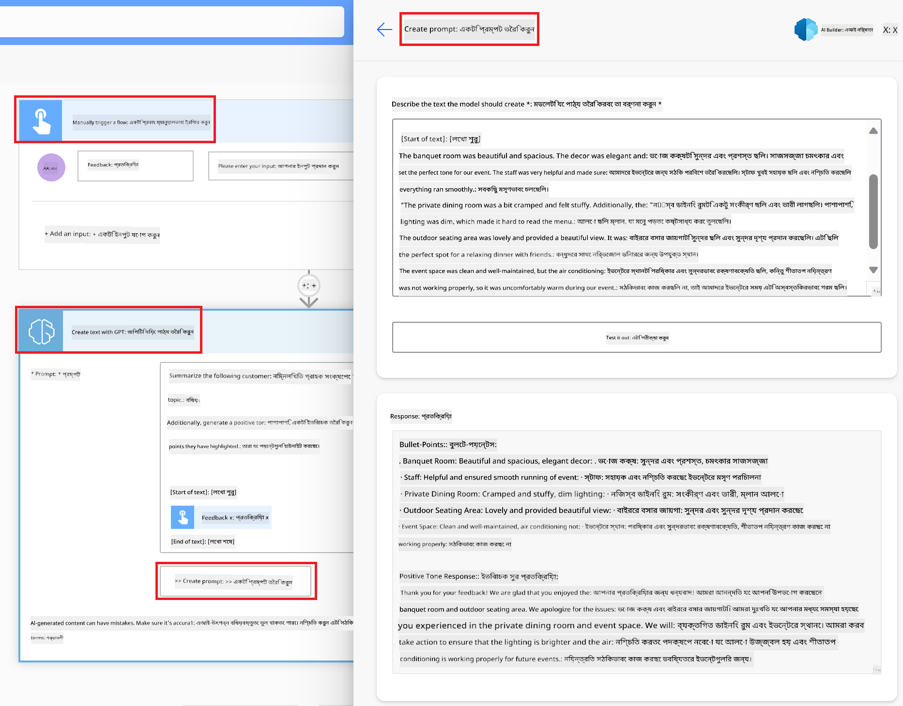

<!--
CO_OP_TRANSLATOR_METADATA:
{
  "original_hash": "f5ff3b6204a695a117d6f452403c95f7",
  "translation_date": "2025-05-19T20:00:58+00:00",
  "source_file": "10-building-low-code-ai-applications/README.md",
  "language_code": "bn"
}
-->
# লো কোড এআই অ্যাপ্লিকেশন তৈরি করা

## ভূমিকা

এখন আমরা ইমেজ তৈরি করার অ্যাপ্লিকেশন তৈরি করা শিখেছি, চলুন লো কোড সম্পর্কে কথা বলি। জেনারেটিভ এআই বিভিন্ন ক্ষেত্রে ব্যবহার করা যেতে পারে, যার মধ্যে লো কোড একটি। কিন্তু লো কোড কি এবং আমরা কীভাবে এআই এতে যুক্ত করতে পারি?

লো কোড ডেভেলপমেন্ট প্ল্যাটফর্মের মাধ্যমে প্রথাগত ডেভেলপার এবং অ-ডেভেলপারদের জন্য অ্যাপ এবং সমাধান তৈরি করা সহজ হয়ে উঠেছে। লো কোড ডেভেলপমেন্ট প্ল্যাটফর্ম আপনাকে খুব কম কোড ব্যবহার করে অ্যাপ এবং সমাধান তৈরি করতে সক্ষম করে। এটি একটি ভিজ্যুয়াল ডেভেলপমেন্ট এনভায়রনমেন্ট প্রদান করে যা আপনাকে কম্পোনেন্টগুলি ড্র্যাগ এবং ড্রপ করে অ্যাপ এবং সমাধান তৈরি করতে সক্ষম করে। এটি আপনাকে দ্রুত এবং কম সম্পদ দিয়ে অ্যাপ এবং সমাধান তৈরি করতে সক্ষম করে। এই পাঠে, আমরা লো কোড কীভাবে ব্যবহার করতে হয় এবং পাওয়ার প্ল্যাটফর্ম ব্যবহার করে এআই দিয়ে লো কোড ডেভেলপমেন্ট কীভাবে উন্নত করতে হয় তা গভীরভাবে আলোচনা করব।

পাওয়ার প্ল্যাটফর্ম প্রতিষ্ঠানগুলিকে তাদের দলকে স্বল্প-কোড বা কোন-কোড পরিবেশের মাধ্যমে নিজেদের সমাধান তৈরি করতে সক্ষম করে। এই পরিবেশটি সমাধান তৈরির প্রক্রিয়াকে সহজ করে তোলে। পাওয়ার প্ল্যাটফর্মের সাথে, সমাধানগুলি মাস বা বছর নয়, বরং দিন বা সপ্তাহের মধ্যে তৈরি করা যেতে পারে। পাওয়ার প্ল্যাটফর্ম পাঁচটি প্রধান পণ্য নিয়ে গঠিত: পাওয়ার অ্যাপস, পাওয়ার অটোমেট, পাওয়ার বি আই, পাওয়ার পেজেস এবং কপাইলট স্টুডিও।

এই পাঠটি কভার করবে:

- পাওয়ার প্ল্যাটফর্মে জেনারেটিভ এআই এর পরিচয়
- কপাইলটের পরিচয় এবং এটি কীভাবে ব্যবহার করতে হয়
- পাওয়ার প্ল্যাটফর্মে অ্যাপ এবং ফ্লো তৈরি করতে জেনারেটিভ এআই ব্যবহার করা
- এআই বিল্ডার সহ পাওয়ার প্ল্যাটফর্মের এআই মডেলগুলি বোঝা

## শেখার লক্ষ্য

এই পাঠের শেষে, আপনি সক্ষম হবেন:

- পাওয়ার প্ল্যাটফর্মে কপাইলট কীভাবে কাজ করে তা বুঝতে।

- আমাদের শিক্ষা স্টার্টআপের জন্য একটি স্টুডেন্ট অ্যাসাইনমেন্ট ট্র্যাকার অ্যাপ তৈরি করতে।

- একটি ইনভয়েস প্রসেসিং ফ্লো তৈরি করতে যা এআই ব্যবহার করে ইনভয়েস থেকে তথ্য বের করে।

- জিপিটি এআই মডেল দিয়ে টেক্সট তৈরি করার সময় সেরা পদ্ধতি প্রয়োগ করতে।

এই পাঠে আপনি যে সরঞ্জাম এবং প্রযুক্তি ব্যবহার করবেন তা হলো:

- **পাওয়ার অ্যাপস**, স্টুডেন্ট অ্যাসাইনমেন্ট ট্র্যাকার অ্যাপের জন্য, যা অ্যাপ তৈরি করার জন্য একটি লো-কোড ডেভেলপমেন্ট এনভায়রনমেন্ট প্রদান করে যা ডেটা ট্র্যাক, ম্যানেজ এবং ইন্টারঅ্যাক্ট করতে সহায়তা করে।

- **ডেটাভার্স**, স্টুডেন্ট অ্যাসাইনমেন্ট ট্র্যাকার অ্যাপের জন্য ডেটা সংরক্ষণের জন্য, যেখানে ডেটাভার্স অ্যাপের ডেটা সংরক্ষণের জন্য একটি লো-কোড ডেটা প্ল্যাটফর্ম প্রদান করবে।

- **পাওয়ার অটোমেট**, ইনভয়েস প্রসেসিং ফ্লোর জন্য, যেখানে আপনি ইনভয়েস প্রসেসিং প্রক্রিয়াটি স্বয়ংক্রিয় করতে ওয়ার্কফ্লো তৈরি করার জন্য একটি লো-কোড ডেভেলপমেন্ট এনভায়রনমেন্ট পাবেন।

- **এআই বিল্ডার**, ইনভয়েস প্রসেসিং এআই মডেলের জন্য, যেখানে আপনি আমাদের স্টার্টআপের জন্য ইনভয়েস প্রসেস করতে প্রিবিল্ট এআই মডেল ব্যবহার করবেন।

## পাওয়ার প্ল্যাটফর্মে জেনারেটিভ এআই

লো-কোড ডেভেলপমেন্ট এবং অ্যাপ্লিকেশনকে জেনারেটিভ এআই দিয়ে উন্নত করা পাওয়ার প্ল্যাটফর্মের জন্য একটি মূল ফোকাস এলাকা। লক্ষ্য হলো সবাইকে এআই-চালিত অ্যাপ, সাইট, ড্যাশবোর্ড তৈরি করতে এবং এআই দিয়ে প্রক্রিয়াগুলি স্বয়ংক্রিয় করতে সক্ষম করা, _কোনও ডেটা বিজ্ঞান দক্ষতার প্রয়োজন ছাড়াই_। এই লক্ষ্যটি কপাইলট এবং এআই বিল্ডারের আকারে পাওয়ার প্ল্যাটফর্মে লো-কোড ডেভেলপমেন্ট অভিজ্ঞতায় জেনারেটিভ এআই সংহত করে অর্জিত হয়।

### এটি কীভাবে কাজ করে?

কপাইলট হলো একটি এআই সহকারী যা আপনাকে পাওয়ার প্ল্যাটফর্ম সমাধানগুলি তৈরি করতে সক্ষম করে আপনার প্রয়োজনীয়তাগুলি প্রাকৃতিক ভাষায় কথোপকথনের ধাপে বর্ণনা করে। আপনি উদাহরণস্বরূপ আপনার এআই সহকারীকে বলতে পারেন আপনার অ্যাপ কোন ক্ষেত্রগুলি ব্যবহার করবে এবং এটি অ্যাপ এবং অন্তর্নিহিত ডেটা মডেল উভয়ই তৈরি করবে অথবা আপনি কিভাবে পাওয়ার অটোমেটে একটি ফ্লো সেট আপ করবেন তা উল্লেখ করতে পারেন।

আপনার অ্যাপ স্ক্রিনে একটি বৈশিষ্ট্য হিসাবে কপাইলট চালিত কার্যকারিতা ব্যবহার করতে পারেন যাতে ব্যবহারকারীরা কথোপকথনমূলক ইন্টারঅ্যাকশনের মাধ্যমে অন্তর্দৃষ্টি উন্মোচন করতে পারে।

এআই বিল্ডার হলো পাওয়ার প্ল্যাটফর্মে উপলব্ধ একটি লো-কোড এআই ক্ষমতা যা আপনাকে প্রক্রিয়াগুলি স্বয়ংক্রিয় করতে এবং ফলাফলগুলি পূর্বাভাস দিতে সহায়তা করার জন্য এআই মডেলগুলি ব্যবহার করতে সক্ষম করে। এআই বিল্ডারের সাথে আপনি ডেটাভার্স বা বিভিন্ন ক্লাউড ডেটা উৎস যেমন শেয়ারপয়েন্ট, ওয়ানড্রাইভ বা আজুরে আপনার ডেটার সাথে সংযুক্ত আপনার অ্যাপ এবং ফ্লোতে এআই আনতে পারেন।

কপাইলট পাওয়ার প্ল্যাটফর্মের সমস্ত পণ্যেই উপলব্ধ: পাওয়ার অ্যাপস, পাওয়ার অটোমেট, পাওয়ার বি আই, পাওয়ার পেজেস এবং পাওয়ার ভার্চুয়াল এজেন্টস। এআই বিল্ডার পাওয়ার অ্যাপস এবং পাওয়ার অটোমেটে উপলব্ধ। এই পাঠে, আমরা আমাদের শিক্ষা স্টার্টআপের জন্য একটি সমাধান তৈরি করতে পাওয়ার অ্যাপস এবং পাওয়ার অটোমেটে কপাইলট এবং এআই বিল্ডার কীভাবে ব্যবহার করতে হয় তা নিয়ে আলোচনা করব।

### পাওয়ার অ্যাপসে কপাইলট

পাওয়ার প্ল্যাটফর্মের অংশ হিসেবে, পাওয়ার অ্যাপস একটি লো-কোড ডেভেলপমেন্ট এনভায়রনমেন্ট প্রদান করে যা অ্যাপ তৈরি করার জন্য যা ডেটা ট্র্যাক, ম্যানেজ এবং ইন্টারঅ্যাক্ট করতে সহায়তা করে। এটি একটি অ্যাপ ডেভেলপমেন্ট পরিষেবা যা একটি স্কেলযোগ্য ডেটা প্ল্যাটফর্ম এবং ক্লাউড পরিষেবা এবং অন-প্রিমাইস ডেটার সাথে সংযুক্ত হওয়ার ক্ষমতা সহ। পাওয়ার অ্যাপস আপনাকে এমন অ্যাপ তৈরি করতে দেয় যা ব্রাউজার, ট্যাবলেট এবং ফোনে চালানো যায় এবং সহকর্মীদের সাথে ভাগ করা যায়। পাওয়ার অ্যাপস একটি সহজ ইন্টারফেস দিয়ে ব্যবহারকারীদের অ্যাপ ডেভেলপমেন্টে সহায়তা করে, যাতে প্রতিটি ব্যবসায়িক ব্যবহারকারী বা প্রো ডেভেলপার কাস্টম অ্যাপ তৈরি করতে পারে। অ্যাপ ডেভেলপমেন্ট অভিজ্ঞতাটি কপাইলটের মাধ্যমে জেনারেটিভ এআই দিয়ে আরও উন্নত করা হয়েছে।

পাওয়ার অ্যাপসে কপাইলট এআই সহকারী বৈশিষ্ট্যটি আপনাকে আপনার প্রয়োজনীয় অ্যাপের ধরণ এবং আপনার অ্যাপ কোন তথ্য ট্র্যাক, সংগ্রহ বা প্রদর্শন করতে চায় তা বর্ণনা করতে সক্ষম করে। কপাইলট তারপর আপনার বর্ণনার উপর ভিত্তি করে একটি প্রতিক্রিয়াশীল ক্যানভাস অ্যাপ তৈরি করে। আপনি তারপর আপনার প্রয়োজন মেটাতে অ্যাপটি কাস্টমাইজ করতে পারেন। এআই কপাইলট এছাড়াও একটি ডেটাভার্স টেবিল তৈরি করে এবং আপনার প্রয়োজনীয় ক্ষেত্রগুলি দিয়ে ডেটা সংরক্ষণের জন্য প্রস্তাব করে এবং কিছু নমুনা ডেটা প্রদান করে। আমরা এই পাঠে পরে ডেটাভার্স কি এবং এটি পাওয়ার অ্যাপসে কীভাবে ব্যবহার করতে হয় তা দেখব। আপনি তারপর কথোপকথনের ধাপের মাধ্যমে এআই কপাইলট সহকারী বৈশিষ্ট্য ব্যবহার করে টেবিলটি কাস্টমাইজ করতে পারেন। এই বৈশিষ্ট্যটি পাওয়ার অ্যাপস হোম স্ক্রিন থেকে সহজেই উপলব্ধ।

### পাওয়ার অটোমেটে কপাইলট

পাওয়ার প্ল্যাটফর্মের অংশ হিসেবে, পাওয়ার অটোমেট ব্যবহারকারীদের অ্যাপ্লিকেশন এবং পরিষেবার মধ্যে স্বয়ংক্রিয় ওয়ার্কফ্লো তৈরি করতে দেয়। এটি যোগাযোগ, ডেটা সংগ্রহ এবং সিদ্ধান্ত অনুমোদনের মতো পুনরাবৃত্তিমূলক ব্যবসায়িক প্রক্রিয়াগুলি স্বয়ংক্রিয় করতে সহায়তা করে। এর সহজ ইন্টারফেস ব্যবহারকারীদের (শুরু থেকে অভিজ্ঞ ডেভেলপার পর্যন্ত) কাজের কাজগুলি স্বয়ংক্রিয় করতে দেয়। ওয়ার্কফ্লো ডেভেলপমেন্ট অভিজ্ঞতাটি কপাইলটের মাধ্যমে জেনারেটিভ এআই দিয়ে আরও উন্নত করা হয়েছে।

পাওয়ার অটোমেটে কপাইলট এআই সহকারী বৈশিষ্ট্যটি আপনাকে আপনার প্রয়োজনীয় ফ্লো এবং আপনার ফ্লো কী ধরনের ক্রিয়াকলাপ সম্পাদন করতে চায় তা বর্ণনা করতে সক্ষম করে। কপাইলট তারপর আপনার বর্ণনার উপর ভিত্তি করে একটি ফ্লো তৈরি করে। আপনি তারপর আপনার প্রয়োজন মেটাতে ফ্লোটি কাস্টমাইজ করতে পারেন। এআই কপাইলট এছাড়াও প্রয়োজনীয় ক্রিয়াকলাপগুলি প্রস্তাব করে যা আপনি স্বয়ংক্রিয় করতে চান। আমরা এই পাঠে পরে ফ্লো কী এবং এটি পাওয়ার অটোমেটে কীভাবে ব্যবহার করতে হয় তা দেখব। আপনি তারপর কথোপকথনের ধাপের মাধ্যমে এআই কপাইলট সহকারী বৈশিষ্ট্য ব্যবহার করে ক্রিয়াকলাপগুলি কাস্টমাইজ করতে পারেন। এই বৈশিষ্ট্যটি পাওয়ার অটোমেট হোম স্ক্রিন থেকে সহজেই উপলব্ধ।

## অ্যাসাইনমেন্ট: আমাদের স্টার্টআপের জন্য কপাইলট ব্যবহার করে ছাত্রদের অ্যাসাইনমেন্ট এবং ইনভয়েস ম্যানেজ করা

আমাদের স্টার্টআপ শিক্ষার্থীদের জন্য অনলাইন কোর্স প্রদান করে। স্টার্টআপটি দ্রুত বৃদ্ধি পেয়েছে এবং এখন এর কোর্সের চাহিদা পূরণ করতে সংগ্রাম করছে। স্টার্টআপ আপনাকে তাদের ছাত্রদের অ্যাসাইনমেন্ট এবং ইনভয়েস ম্যানেজ করার জন্য একটি লো কোড সমাধান তৈরি করতে সহায়তা করার জন্য একটি পাওয়ার প্ল্যাটফর্ম ডেভেলপার হিসেবে নিয়োগ দিয়েছে। তাদের সমাধানটি অ্যাপের মাধ্যমে ছাত্রদের অ্যাসাইনমেন্ট ট্র্যাক এবং ম্যানেজ করতে এবং একটি ওয়ার্কফ্লোর মাধ্যমে ইনভয়েস প্রসেসিং প্রক্রিয়াটি স্বয়ংক্রিয় করতে সক্ষম হওয়া উচিত। আপনাকে জেনারেটিভ এআই ব্যবহার করে সমাধানটি তৈরি করতে বলা হয়েছে।

কপাইলট ব্যবহার শুরু করার সময়, আপনি কপাইলট দিয়ে অ্যাপ এবং ফ্লো তৈরি করতে শুরু করতে [পাওয়ার প্ল্যাটফর্ম কপাইলট প্রম্পট লাইব্রেরি](https://github.com/pnp/powerplatform-prompts?WT.mc_id=academic-109639-somelezediko) ব্যবহার করতে পারেন। এই লাইব্রেরিতে এমন প্রম্পটের একটি তালিকা রয়েছে যা আপনি কপাইলট দিয়ে অ্যাপ এবং ফ্লো তৈরি করতে ব্যবহার করতে পারেন। আপনি কপাইলটকে আপনার প্রয়োজনীয়তাগুলি কীভাবে বর্ণনা করবেন তার ধারণা পেতে লাইব্রেরির প্রম্পটগুলি ব্যবহার করতে পারেন।

### আমাদের স্টার্টআপের জন্য একটি স্টুডেন্ট অ্যাসাইনমেন্ট ট্র্যাকার অ্যাপ তৈরি করুন

আমাদের স্টার্টআপের শিক্ষাবিদরা ছাত্রদের অ্যাসাইনমেন্ট ট্র্যাক করতে সংগ্রাম করছেন। তারা অ্যাসাইনমেন্ট ট্র্যাক করতে একটি স্প্রেডশীট ব্যবহার করছেন কিন্তু শিক্ষার্থীর সংখ্যা বেড়ে যাওয়ায় এটি পরিচালনা করা কঠিন হয়ে উঠেছে। তারা আপনাকে একটি অ্যাপ তৈরি করতে বলেছে যা তাদের ছাত্রদের অ্যাসাইনমেন্ট ট্র্যাক এবং ম্যানেজ করতে সহায়তা করবে। অ্যাপটি তাদের নতুন অ্যাসাইনমেন্ট যোগ করতে, অ্যাসাইনমেন্ট দেখতে, অ্যাসাইনমেন্ট আপডেট করতে এবং অ্যাসাইনমেন্ট মুছতে সক্ষম করতে হবে। অ্যাপটি শিক্ষাবিদ এবং শিক্ষার্থীদের গ্রেড করা অ্যাসাইনমেন্ট এবং গ্রেড না করা অ্যাসাইনমেন্ট দেখতে সক্ষম করতে হবে।

আপনি নিচের ধাপগুলি অনুসরণ করে পাওয়ার অ্যাপসে কপাইলট ব্যবহার করে অ্যাপটি তৈরি করবেন:

1. [পাওয়ার অ্যাপস](https://make.powerapps.com?WT.mc_id=academic-105485-koreyst) হোম স্ক্রিনে নেভিগেট করুন।

1. হোম স্ক্রিনের টেক্সট এলাকাটি ব্যবহার করে আপনি যে অ্যাপটি তৈরি করতে চান তা বর্ণনা করুন। উদাহরণস্বরূপ, **_আমি একটি অ্যাপ তৈরি করতে চাই যা ছাত্রদের অ্যাসাইনমেন্ট ট্র্যাক এবং ম্যানেজ করবে_**। প্রম্পটটি এআই কপাইলটে পাঠাতে **সেন্ড** বোতামে ক্লিক করুন।

1. এআই কপাইলট আপনার ট্র্যাক করতে চাওয়া ডেটা সংরক্ষণের জন্য প্রয়োজনীয় ক্ষেত্রগুলি সহ একটি ডেটাভার্স টেবিল প্রস্তাব করবে এবং কিছু নমুনা ডেটা দেবে। আপনি তারপর কথোপকথনের ধাপের মাধ্যমে এআই কপাইলট সহকারী বৈশিষ্ট্য ব্যবহার করে টেবিলটি কাস্টমাইজ করতে পারেন।

   > **গুরুত্বপূর্ণ**: ডেটাভার্স হলো পাওয়ার প্ল্যাটফর্মের জন্য অন্তর্নিহিত ডেটা প্ল্যাটফর্ম। এটি অ্যাপের ডেটা সংরক্ষণের জন্য একটি লো-কোড ডেটা প্ল্যাটফর্ম। এটি একটি সম্পূর্ণ পরিচালিত পরিষেবা যা মাইক্রোসফট ক্লাউডে ডেটা সুরক্ষিতভাবে সংরক্ষণ করে এবং আপনার পাওয়ার প্ল্যাটফর্ম পরিবেশের মধ্যে প্রদান করা হয়। এটি ডেটা শ্রেণীবিভাগ, ডেটা লাইনেজ, সূক্ষ্ম-গ্রেইনড অ্যাক্সেস কন্ট্রোল এবং আরও অনেক কিছু সহ অন্তর্নির্মিত ডেটা গভর্নেন্স ক্ষমতা নিয়ে আসে। ডেটাভার্স সম্পর্কে আরও জানতে পারেন [এখানে](https://docs.microsoft.com/powerapps/maker/data-platform/data-platform-intro?WT.mc_id=academic-109639-somelezediko)।

1. শিক্ষাবিদরা তাদের অ্যাসাইনমেন্ট জমা দিয়েছে এমন শিক্ষার্থীদের ইমেইল পাঠাতে চান যাতে তাদের অ্যাসাইনমেন্টের অগ্রগতির বিষয়ে আপডেট রাখা যায়। আপনি টেবিলে শিক্ষার্থীর ইমেইল সংরক্ষণের জন্য একটি নতুন ক্ষেত্র যোগ করতে কপাইলট ব্যবহার করতে পারেন। উদাহরণস্বরূপ, আপনি টেবিলে একটি নতুন ক্ষেত্র যোগ করতে নিম্নলিখিত প্রম্পটটি ব্যবহার করতে পারেন: **_আমি শিক্ষার্থীর ইমেইল সংরক্ষণের জন্য একটি কলাম যোগ করতে চাই_**। প্রম্পটটি এআই কপাইলটে পাঠাতে **সেন্ড** বোতামে ক্লিক করুন।

1. এআই কপাইলট একটি নতুন ক্ষেত্র তৈরি করবে এবং আপনি তারপর আপনার প্রয়োজন মেটাতে ক্ষেত্রটি কাস্টমাইজ করতে পারেন।

1. টেবিলটি সম্পন্ন হলে, অ্যাপ তৈরি করতে **Create app** বোতামে ক্লিক করুন।

1. এআই কপাইলট আপনার বর্ণনার উপর ভিত্তি করে একটি প্রতিক্রিয়াশীল ক্যানভাস অ্যাপ তৈরি করবে। আপনি তারপর আপনার প্রয়োজন মেটাতে অ্যাপটি কাস্টমাইজ করতে পারেন।

1. শিক্ষাবিদরা শিক্ষার্থীদের ইমেইল পাঠাতে, আপনি অ্যাপটিতে একটি নতুন স্ক্রিন যোগ করতে কপাইলট ব্যবহার করতে পারেন। উদাহরণস্বরূপ, আপনি অ্যাপটিতে একটি নতুন স্ক্রিন যোগ করতে নিম্নলিখিত প্রম্পটটি ব্যবহার করতে পারেন: **_আমি শিক্ষার্থীদের ইমেইল পাঠানোর জন্য একটি স্ক্রিন যোগ করতে চাই_**। প্রম্পটটি এআই কপাইলটে পাঠাতে **সেন্ড** বোতামে ক্লিক করুন।

1. এআই কপাইলট একটি নতুন স্ক্রিন তৈরি করবে এবং আপনি তারপর আপনার প্রয়োজন মেটাতে স্ক্রিনটি কাস্টমাইজ করতে পারেন।

1. অ্যাপটি সম্পন্ন হলে, অ্যাপটি সংরক্ষণ করতে **Save** বোতামে ক্লিক করুন।

1. শিক্ষাবিদদের সাথে অ্যাপটি শেয়ার করতে, **Share** বোতামে ক্লিক করুন এবং তারপর আবার **Share** বোতামে ক্লিক করুন। আপনি তারপর তাদের ইমেইল ঠিকানা প্রবেশ করে শিক্ষাবিদদের সাথে অ্যাপটি শেয়ার করতে পারেন।

> **আপনার হোমওয়ার্ক**: আপনি যে অ্যাপটি তৈরি করেছেন তা একটি ভালো শুরু কিন্তু এটি উন্নত করা যেতে পারে। ইমেইল বৈশিষ্ট্য সহ, শিক্ষাবিদরা কেবল শিক্ষার্থীদের ম্যানুয়ালি ইমেইল পাঠাতে পারেন তাদের ইমেইল টাইপ করতে হবে। আপনি কি কপাইলট ব্যবহার করে এমন একটি অটোমেশন তৈরি করতে পারেন যা শিক্ষার্থীরা তাদের অ্যাসাইনমেন্ট জমা দিলে শিক্ষাবিদরা স্বয়ংক্রিয়ভাবে ইমেইল পাঠাতে সক্ষম করবে? আপনার ইঙ্গিত হলো সঠিক প্রম্পট দিয়ে আপনি পাওয়ার অটোমেটে কপাইলট ব্যবহার করে এটি তৈরি করতে পারেন।

### আমাদের স্টার্টআপের জন্য একটি ইনভয়েস তথ্য টেবিল তৈরি করুন

আমাদের স্টার্টআপের অর্থ বিভাগ ইনভয়েস ট্র্যাক করতে সংগ্রাম করছে। তারা ইনভয়েস
একটি লেখা। - **সংবেদনশীলতা বিশ্লেষণ**: এই মডেলটি পাঠ্যের মধ্যে ইতিবাচক, নেতিবাচক, নিরপেক্ষ, বা মিশ্র সংবেদনশীলতা সনাক্ত করে। - **বিজনেস কার্ড রিডার**: এই মডেলটি বিজনেস কার্ড থেকে তথ্য সংগ্রহ করে। - **পাঠ্য স্বীকৃতি**: এই মডেলটি চিত্র থেকে পাঠ্য সংগ্রহ করে। - **বস্তু সনাক্তকরণ**: এই মডেলটি চিত্র থেকে বস্তু সনাক্ত ও সংগ্রহ করে। - **ডকুমেন্ট প্রসেসিং**: এই মডেলটি ফর্ম থেকে তথ্য সংগ্রহ করে। - **চালান প্রসেসিং**: এই মডেলটি চালান থেকে তথ্য সংগ্রহ করে। কাস্টম এআই মডেলের মাধ্যমে আপনি আপনার নিজস্ব মডেল AI Builder-এ আনতে পারেন যাতে এটি যেকোনো AI Builder কাস্টম মডেলের মতো কাজ করতে পারে, আপনাকে আপনার নিজস্ব ডেটা ব্যবহার করে মডেলটি প্রশিক্ষণ দেওয়ার অনুমতি দেয়। আপনি এই মডেলগুলি ব্যবহার করে প্রক্রিয়া স্বয়ংক্রিয় করতে এবং পাওয়ার অ্যাপস এবং পাওয়ার অটোমেট উভয় ক্ষেত্রেই ফলাফল পূর্বাভাস দিতে পারেন। আপনার নিজস্ব মডেল ব্যবহার করার সময় কিছু সীমাবদ্ধতা প্রযোজ্য। এই [সীমাবদ্ধতা](https://learn.microsoft.com/ai-builder/byo-model#limitations?WT.mc_id=academic-105485-koreyst) সম্পর্কে আরও পড়ুন। 

## অ্যাসাইনমেন্ট #2 - আমাদের স্টার্টআপের জন্য একটি চালান প্রসেসিং ফ্লো তৈরি করুন

অর্থনৈতিক দল চালান প্রক্রিয়াকরণে সংগ্রাম করছে। তারা চালানগুলি ট্র্যাক করার জন্য একটি স্প্রেডশীট ব্যবহার করছে, কিন্তু চালানের সংখ্যা বাড়ার সাথে সাথে এটি পরিচালনা করা কঠিন হয়ে উঠেছে। তারা আপনাকে AI ব্যবহার করে চালান প্রক্রিয়াকরণে সহায়তা করার জন্য একটি ওয়ার্কফ্লো তৈরি করতে বলেছে। ওয়ার্কফ্লোটি তাদের চালান থেকে তথ্য সংগ্রহ করতে এবং ডেটাভার্স টেবিলে তথ্য সংরক্ষণ করতে সক্ষম করতে হবে। ওয়ার্কফ্লোটি তাদের অর্থনৈতিক দলের কাছে সংগ্রহ করা তথ্য সহ একটি ইমেল পাঠাতে সক্ষম করতে হবে।

এখন যেহেতু আপনি জানেন AI Builder কী এবং কেন এটি ব্যবহার করা উচিত, আসুন দেখে নেওয়া যাক আপনি কীভাবে AI Builder-এ পূর্বে আলোচনা করা চালান প্রসেসিং AI মডেল ব্যবহার করে একটি ওয়ার্কফ্লো তৈরি করতে পারেন যা অর্থনৈতিক দলকে চালান প্রক্রিয়াকরণে সহায়তা করবে।

AI Builder-এ চালান প্রসেসিং AI মডেল ব্যবহার করে অর্থনৈতিক দলকে চালান প্রক্রিয়াকরণে সহায়তা করার জন্য একটি ওয়ার্কফ্লো তৈরি করতে, নিম্নলিখিত ধাপগুলি অনুসরণ করুন:

1. [Power Automate](https://make.powerautomate.com?WT.mc_id=academic-105485-koreyst) হোম স্ক্রিনে যান।
2. হোম স্ক্রিনের টেক্সট এলাকাটি ব্যবহার করে আপনি যে ওয়ার্কফ্লো তৈরি করতে চান তা বর্ণনা করুন। উদাহরণস্বরূপ, **_আমার মেইলবক্সে যখন একটি চালান আসে তখন এটি প্রক্রিয়াকরণ করুন_**। AI কপাইলটকে প্রম্পট পাঠাতে **পাঠান** বোতামে ক্লিক করুন। 
3. AI কপাইলট আপনাকে স্বয়ংক্রিয় করতে চান এমন কাজটি সম্পাদন করার জন্য প্রয়োজনীয় পদক্ষেপগুলি সুপারিশ করবে। আপনি **পরবর্তী** বোতামে ক্লিক করে পরবর্তী ধাপগুলি দেখতে পারেন।
4. পরবর্তী ধাপে, পাওয়ার অটোমেট আপনাকে ফ্লোয়ের জন্য প্রয়োজনীয় সংযোগগুলি সেট আপ করতে বলবে। আপনি শেষ হলে, ফ্লো তৈরি করতে **ফ্লো তৈরি করুন** বোতামে ক্লিক করুন।
5. AI কপাইলট একটি ফ্লো তৈরি করবে এবং আপনি আপনার প্রয়োজন অনুযায়ী ফ্লোটি কাস্টমাইজ করতে পারেন।
6. ফ্লোয়ের ট্রিগার আপডেট করুন এবং **ফোল্ডার** সেট করুন যেখানে চালানগুলি সংরক্ষিত হবে। উদাহরণস্বরূপ, আপনি ফোল্ডারটি **ইনবক্স** সেট করতে পারেন। **উন্নত বিকল্পগুলি দেখান**-এ ক্লিক করুন এবং **শুধুমাত্র সংযুক্তিসহ** **হ্যাঁ** সেট করুন। এটি নিশ্চিত করবে যে ফ্লো শুধুমাত্র একটি সংযুক্তিসহ ইমেল ফোল্ডারে পৌঁছালে চালু হবে।
7. ফ্লো থেকে নিম্নলিখিত পদক্ষেপগুলি সরান: **HTML থেকে টেক্সট**, **কম্পোজ**, **কম্পোজ 2**, **কম্পোজ 3** এবং **কম্পোজ 4** কারণ আপনি সেগুলি ব্যবহার করবেন না।
8. ফ্লো থেকে **শর্ত** পদক্ষেপটি সরান কারণ আপনি এটি ব্যবহার করবেন না। এটি নিম্নলিখিত স্ক্রিনশটের মতো হওয়া উচিত: 
9. **একটি পদক্ষেপ যোগ করুন** বোতামে ক্লিক করুন এবং **ডেটাভার্স** অনুসন্ধান করুন। **একটি নতুন সারি যোগ করুন** পদক্ষেপটি নির্বাচন করুন।
10. **চালান থেকে তথ্য সংগ্রহ করুন** পদক্ষেপে, ইমেল থেকে **সংযুক্তি বিষয়বস্তু**-এর দিকে নির্দেশ করতে **চালান ফাইল** আপডেট করুন। এটি নিশ্চিত করবে যে ফ্লো চালানের সংযুক্তি থেকে তথ্য সংগ্রহ করে।
11. আপনি পূর্বে তৈরি করা **টেবিল** নির্বাচন করুন। উদাহরণস্বরূপ, আপনি **চালান তথ্য** টেবিলটি নির্বাচন করতে পারেন। পূর্ববর্তী পদক্ষেপ থেকে গতিশীল বিষয়বস্তু নির্বাচন করুন নিম্নলিখিত ক্ষেত্রগুলি পূরণ করতে: - আইডি - পরিমাণ - তারিখ - নাম - স্থিতি - **স্থিতি** **অপেক্ষমান**-এ সেট করুন। - সরবরাহকারী ইমেল - **যখন একটি নতুন ইমেল আসে** ট্রিগার থেকে **থেকে** গতিশীল বিষয়বস্তু ব্যবহার করুন। 
12. ফ্লো শেষ হলে, ফ্লো সংরক্ষণ করতে **সংরক্ষণ করুন** বোতামে ক্লিক করুন। আপনি ট্রিগারে নির্দিষ্ট ফোল্ডারে একটি চালান সহ একটি ইমেল পাঠিয়ে ফ্লো পরীক্ষা করতে পারেন।

> **আপনার হোমওয়ার্ক**: আপনি যে ফ্লোটি তৈরি করেছেন তা একটি ভাল শুরু, এখন আপনাকে ভাবতে হবে কিভাবে আপনি একটি অটোমেশন তৈরি করতে পারেন যা আমাদের অর্থনৈতিক দলকে সরবরাহকারীকে তাদের চালানের বর্তমান স্থিতি সম্পর্কে আপডেট করার জন্য একটি ইমেল পাঠাতে সক্ষম করবে। আপনার ইঙ্গিত: ফ্লোটি চালানের স্থিতি পরিবর্তিত হলে চলতে হবে।

## পাওয়ার অটোমেট-এ একটি টেক্সট জেনারেশন AI মডেল ব্যবহার করুন

AI Builder-এ GPT AI মডেল তৈরি করুন আপনাকে একটি প্রম্পটের উপর ভিত্তি করে পাঠ্য তৈরি করতে সক্ষম করে এবং এটি Microsoft Azure OpenAI সার্ভিস দ্বারা চালিত হয়। এই ক্ষমতার সাথে, আপনি আপনার অ্যাপস এবং ফ্লোতে GPT (Generative Pre-Trained Transformer) প্রযুক্তি অন্তর্ভুক্ত করতে পারেন বিভিন্ন স্বয়ংক্রিয় ফ্লো এবং অন্তর্দৃষ্টিপূর্ণ অ্যাপ্লিকেশন তৈরি করতে।

GPT মডেলগুলি বিপুল পরিমাণ ডেটার উপর ব্যাপক প্রশিক্ষণ পায়, যা তাদের একটি প্রম্পট সরবরাহ করা হলে মানুষের ভাষার সাথে ঘনিষ্ঠভাবে মিলে যাওয়া পাঠ্য তৈরি করতে সক্ষম করে। কর্মপ্রবাহ অটোমেশনের সাথে সংহত হলে, GPT-এর মতো AI মডেলগুলি বিভিন্ন কাজের গতি বৃদ্ধি এবং স্বয়ংক্রিয় করতে ব্যবহার করা যেতে পারে।

উদাহরণস্বরূপ, আপনি বিভিন্ন ব্যবহারের জন্য স্বয়ংক্রিয়ভাবে পাঠ্য তৈরি করার জন্য ফ্লো তৈরি করতে পারেন, যেমন: ইমেলের খসড়া, পণ্যের বিবরণ এবং আরও অনেক কিছু। আপনি মডেলটি বিভিন্ন অ্যাপ্লিকেশনের জন্য পাঠ্য তৈরি করতে ব্যবহার করতে পারেন, যেমন চ্যাটবট এবং গ্রাহক পরিষেবা অ্যাপ্লিকেশনগুলি যা গ্রাহক পরিষেবা এজেন্টদের গ্রাহকের প্রশ্নের কার্যকর এবং দক্ষতার সাথে সাড়া দিতে সক্ষম করে।

Power Automate-এ এই AI মডেলটি কীভাবে ব্যবহার করবেন তা জানতে, [AI Builder এবং GPT-এর সাথে বুদ্ধিমত্তা যোগ করুন](https://learn.microsoft.com/training/modules/ai-builder-text-generation/?WT.mc_id=academic-109639-somelezediko) মডিউলটি দেখুন।

## দুর্দান্ত কাজ! আপনার শেখা চালিয়ে যান

এই পাঠটি শেষ করার পরে, আমাদের [জেনারেটিভ AI লার্নিং সংগ্রহ](https://aka.ms/genai-collection?WT.mc_id=academic-105485-koreyst) দেখুন আপনার জেনারেটিভ AI জ্ঞানকে আরও উন্নত করতে!

পাঠ 11-এ যান যেখানে আমরা দেখব কিভাবে [ফাংশন কলিংয়ের সাথে জেনারেটিভ AI একত্রিত করা যায়](../11-integrating-with-function-calling/README.md?WT.mc_id=academic-105485-koreyst)!

**বিষয়বস্তু ঘোষণা**:  
এই নথিটি AI অনুবাদ পরিষেবা [Co-op Translator](https://github.com/Azure/co-op-translator) ব্যবহার করে অনুবাদ করা হয়েছে। আমরা যথাসম্ভব সঠিকতার জন্য চেষ্টা করি, তবে অনুগ্রহ করে সচেতন থাকুন যে স্বয়ংক্রিয় অনুবাদে ভুল বা অপ্রকৃত তথ্য থাকতে পারে। মূল ভাষায় লেখা নথিটিকে প্রামাণিক উৎস হিসেবে বিবেচনা করা উচিত। গুরুত্বপূর্ণ তথ্যের জন্য, পেশাদার মানব অনুবাদ সুপারিশ করা হয়। এই অনুবাদ ব্যবহার থেকে উদ্ভূত কোন ভুল বোঝাবুঝি বা ভুল ব্যাখ্যার জন্য আমরা দায়ী থাকব না।