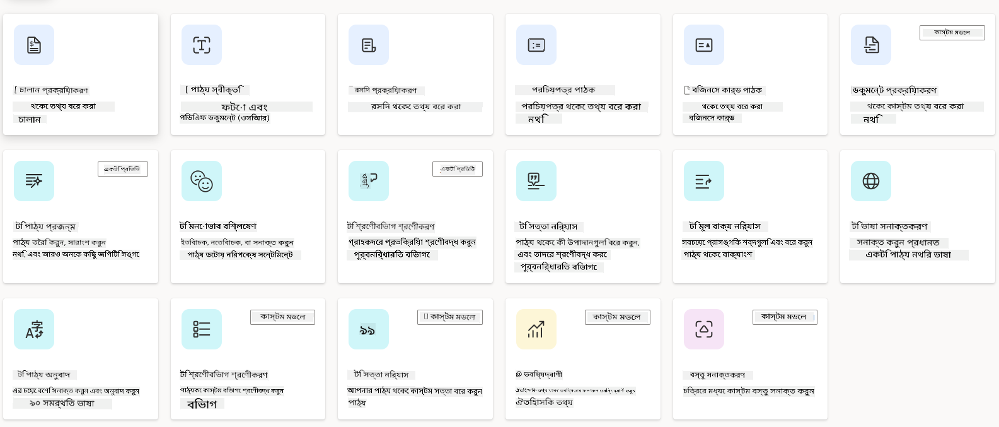
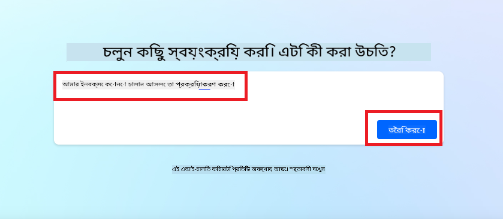
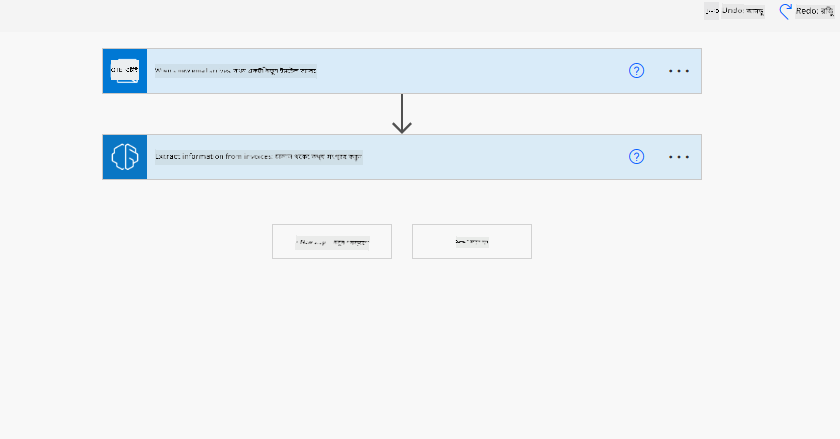
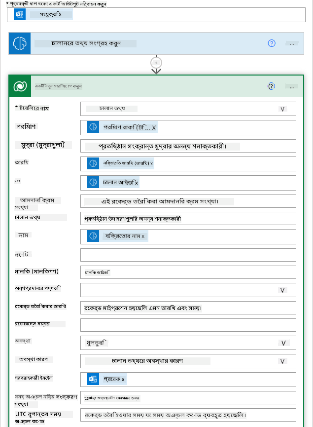
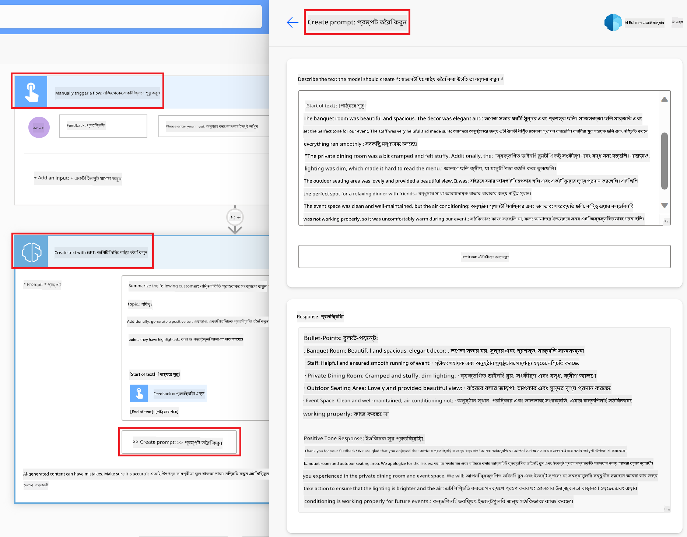

<!--
CO_OP_TRANSLATOR_METADATA:
{
  "original_hash": "f5ff3b6204a695a117d6f452403c95f7",
  "translation_date": "2025-06-25T18:21:19+00:00",
  "source_file": "10-building-low-code-ai-applications/README.md",
  "language_code": "bn"
}
-->
# লো কোড AI অ্যাপ্লিকেশন তৈরি করা

## পরিচিতি

এখন আমরা শিখেছি কীভাবে ইমেজ জেনারেটিং অ্যাপ্লিকেশন তৈরি করতে হয়, চলুন লো কোড নিয়ে আলোচনা করি। জেনারেটিভ AI বিভিন্ন ক্ষেত্রে ব্যবহার করা যেতে পারে যার মধ্যে লো কোড অন্তর্ভুক্ত, কিন্তু লো কোড কী এবং আমরা কীভাবে এতে AI যুক্ত করতে পারি?

লো কোড ডেভেলপমেন্ট প্ল্যাটফর্ম ব্যবহার করে অ্যাপ এবং সমাধান তৈরি করা ঐতিহ্যবাহী ডেভেলপার এবং নন-ডেভেলপারদের জন্য সহজ হয়ে উঠেছে। লো কোড ডেভেলপমেন্ট প্ল্যাটফর্ম আপনাকে সামান্য বা কোন কোড ছাড়াই অ্যাপ এবং সমাধান তৈরি করতে সক্ষম করে। এটি একটি ভিজ্যুয়াল ডেভেলপমেন্ট পরিবেশ প্রদান করে যা আপনাকে অ্যাপ এবং সমাধান তৈরি করতে উপাদানগুলি টেনে এনে ছেড়ে দিতে সক্ষম করে। এটি আপনাকে দ্রুত এবং কম সম্পদ দিয়ে অ্যাপ এবং সমাধান তৈরি করতে সক্ষম করে। এই পাঠে, আমরা লো কোড কীভাবে ব্যবহার করতে হয় এবং কীভাবে Power Platform ব্যবহার করে AI দিয়ে লো কোড ডেভেলপমেন্ট উন্নত করতে হয় তা গভীরভাবে আলোচনা করব।

Power Platform সংগঠনগুলিকে তাদের দলকে একটি সহজবোধ্য লো-কোড বা নো-কোড পরিবেশের মাধ্যমে তাদের নিজস্ব সমাধান তৈরি করতে সক্ষম করার সুযোগ প্রদান করে। এই পরিবেশ সমাধান তৈরি করার প্রক্রিয়াকে সহজ করে তোলে। Power Platform দিয়ে, সমাধানগুলি মাস বা বছর নয়, দিনের বা সপ্তাহের মধ্যে তৈরি করা যেতে পারে। Power Platform পাঁচটি মূল পণ্য নিয়ে গঠিত: Power Apps, Power Automate, Power BI, Power Pages এবং Copilot Studio।

এই পাঠে অন্তর্ভুক্ত:

- Power Platform-এ জেনারেটিভ AI-এর পরিচিতি
- Copilot-এর পরিচিতি এবং এটি কীভাবে ব্যবহার করবেন
- Power Platform-এ জেনারেটিভ AI ব্যবহার করে অ্যাপ এবং ফ্লো তৈরি করা
- AI Builder-এর সাথে Power Platform-এ AI মডেলগুলি বোঝা

## শিক্ষার লক্ষ্য

এই পাঠ শেষে আপনি সক্ষম হবেন:

- Power Platform-এ Copilot কীভাবে কাজ করে তা বুঝতে।

- আমাদের শিক্ষা স্টার্টআপের জন্য একটি স্টুডেন্ট অ্যাসাইনমেন্ট ট্র্যাকার অ্যাপ তৈরি করতে।

- একটি ইনভয়েস প্রসেসিং ফ্লো তৈরি করতে যা ইনভয়েস থেকে তথ্য বের করতে AI ব্যবহার করে।

- GPT AI মডেল দিয়ে টেক্সট তৈরি করার সময় সেরা অনুশীলনগুলি প্রয়োগ করতে।

এই পাঠে আপনি যে সরঞ্জাম এবং প্রযুক্তি ব্যবহার করবেন তা হল:

- **Power Apps**, স্টুডেন্ট অ্যাসাইনমেন্ট ট্র্যাকার অ্যাপের জন্য, যা ডেটা ট্র্যাক, পরিচালনা এবং ইন্টারঅ্যাক্ট করার জন্য অ্যাপ তৈরি করার জন্য একটি লো-কোড ডেভেলপমেন্ট পরিবেশ প্রদান করে।

- **Dataverse**, স্টুডেন্ট অ্যাসাইনমেন্ট ট্র্যাকার অ্যাপের ডেটা সংরক্ষণের জন্য যেখানে Dataverse অ্যাপের ডেটা সংরক্ষণের জন্য একটি লো-কোড ডেটা প্ল্যাটফর্ম প্রদান করবে।

- **Power Automate**, ইনভয়েস প্রসেসিং ফ্লোর জন্য যেখানে আপনি ইনভয়েস প্রসেসিং প্রক্রিয়াকে স্বয়ংক্রিয় করতে ওয়ার্কফ্লো তৈরি করার জন্য লো-কোড ডেভেলপমেন্ট পরিবেশ পাবেন।

- **AI Builder**, ইনভয়েস প্রসেসিং AI মডেলের জন্য যেখানে আপনি আমাদের স্টার্টআপের জন্য ইনভয়েস প্রক্রিয়া করতে প্রিবিল্ট AI মডেল ব্যবহার করবেন।

## Power Platform-এ জেনারেটিভ AI

লো-কোড ডেভেলপমেন্ট এবং অ্যাপ্লিকেশনকে জেনারেটিভ AI দিয়ে উন্নত করা Power Platform-এর একটি মূল ফোকাস এলাকা। লক্ষ্য হল সবাইকে AI দ্বারা চালিত অ্যাপ, সাইট, ড্যাশবোর্ড তৈরি করতে এবং AI দিয়ে প্রক্রিয়াগুলি স্বয়ংক্রিয় করতে সক্ষম করা, _কোনও ডেটা সায়েন্স দক্ষতা প্রয়োজন ছাড়াই_। এই লক্ষ্যটি Copilot এবং AI Builder আকারে Power Platform-এর লো-কোড ডেভেলপমেন্ট অভিজ্ঞতায় জেনারেটিভ AI ইন্টিগ্রেট করে অর্জন করা হয়।

### এটি কীভাবে কাজ করে?

Copilot হল একটি AI সহকারী যা আপনাকে প্রাকৃতিক ভাষা ব্যবহার করে একটি সিরিজ কথোপকথনের ধাপে আপনার প্রয়োজনীয়তা বর্ণনা করে Power Platform সমাধান তৈরি করতে সক্ষম করে। উদাহরণস্বরূপ, আপনি আপনার AI সহকারীকে নির্দেশ দিতে পারেন যে আপনার অ্যাপ কোন ক্ষেত্রগুলি ব্যবহার করবে এবং এটি অ্যাপ এবং অন্তর্নিহিত ডেটা মডেল উভয়ই তৈরি করবে অথবা আপনি Power Automate-এ একটি ফ্লো সেট আপ করার জন্য কীভাবে নির্দিষ্ট করবেন।

আপনি আপনার অ্যাপ স্ক্রিনগুলিতে একটি বৈশিষ্ট্য হিসাবে Copilot দ্বারা চালিত কার্যকারিতা ব্যবহার করতে পারেন যাতে ব্যবহারকারীরা কথোপকথনের ইন্টারঅ্যাকশনের মাধ্যমে অন্তর্দৃষ্টি আবিষ্কার করতে পারে।

AI Builder হল Power Platform-এ উপলব্ধ একটি লো-কোড AI ক্ষমতা যা আপনাকে প্রক্রিয়াগুলি স্বয়ংক্রিয় করতে এবং ফলাফলগুলি পূর্বাভাস দিতে সাহায্য করার জন্য AI মডেলগুলি ব্যবহার করতে সক্ষম করে। AI Builder-এর সাথে আপনি আপনার ডেটা Dataverse বা SharePoint, OneDrive বা Azure-এর মতো বিভিন্ন ক্লাউড ডেটা সোর্সে সংযুক্ত আপনার অ্যাপ এবং ফ্লোতে AI আনতে পারেন।

Copilot Power Platform-এর সমস্ত পণ্যগুলিতে উপলব্ধ: Power Apps, Power Automate, Power BI, Power Pages এবং Power Virtual Agents। AI Builder Power Apps এবং Power Automate-এ উপলব্ধ। এই পাঠে, আমরা আমাদের শিক্ষা স্টার্টআপের জন্য একটি সমাধান তৈরি করতে Power Apps এবং Power Automate-এ Copilot এবং AI Builder কীভাবে ব্যবহার করবেন তা নিয়ে আলোচনা করব।

### Power Apps-এ Copilot

Power Platform-এর অংশ হিসাবে, Power Apps ডেটা ট্র্যাক, পরিচালনা এবং ইন্টারঅ্যাক্ট করার জন্য অ্যাপ তৈরি করার জন্য একটি লো-কোড ডেভেলপমেন্ট পরিবেশ প্রদান করে। এটি একটি স্কেলযোগ্য ডেটা প্ল্যাটফর্ম এবং ক্লাউড পরিষেবা এবং অন-প্রিমাইজ ডেটার সাথে সংযোগ করার ক্ষমতা সহ অ্যাপ ডেভেলপমেন্ট পরিষেবার একটি সুইট। Power Apps আপনাকে এমন অ্যাপ তৈরি করতে দেয় যা ব্রাউজার, ট্যাবলেট এবং ফোনে চলে এবং সহকর্মীদের সাথে শেয়ার করা যেতে পারে। Power Apps একটি সহজ ইন্টারফেস সহ ব্যবহারকারীদের অ্যাপ ডেভেলপমেন্টে সহজ করে তোলে, যাতে প্রতিটি ব্যবসায়িক ব্যবহারকারী বা প্রো ডেভেলপার কাস্টম অ্যাপ তৈরি করতে পারে। Copilot-এর মাধ্যমে জেনারেটিভ AI দিয়ে অ্যাপ ডেভেলপমেন্ট অভিজ্ঞতাও উন্নত করা হয়েছে।

Power Apps-এর Copilot AI সহকারী বৈশিষ্ট্য আপনাকে কী ধরনের অ্যাপ প্রয়োজন এবং আপনার অ্যাপ কী তথ্য ট্র্যাক, সংগ্রহ বা প্রদর্শন করতে চায় তা বর্ণনা করতে সক্ষম করে। Copilot তারপর আপনার বিবরণের উপর ভিত্তি করে একটি প্রতিক্রিয়াশীল ক্যানভাস অ্যাপ তৈরি করে। তারপর আপনি আপনার প্রয়োজন অনুযায়ী অ্যাপটি কাস্টমাইজ করতে পারেন। AI Copilot এছাড়াও আপনার প্রয়োজনীয় ক্ষেত্রগুলি সহ একটি Dataverse টেবিল তৈরি করে এবং কিছু নমুনা ডেটা দিয়ে সাজেস্ট করে। আমরা Dataverse কী এবং Power Apps-এ এটি কীভাবে ব্যবহার করতে পারেন তা পরে এই পাঠে দেখব। তারপর আপনি কথোপকথনের ধাপের মাধ্যমে AI Copilot সহকারী বৈশিষ্ট্য ব্যবহার করে আপনার প্রয়োজন অনুযায়ী টেবিলটি কাস্টমাইজ করতে পারেন। এই বৈশিষ্ট্যটি Power Apps হোম স্ক্রিন থেকে সহজেই উপলব্ধ।

### Power Automate-এ Copilot

Power Platform-এর অংশ হিসাবে, Power Automate ব্যবহারকারীদের অ্যাপ্লিকেশন এবং পরিষেবার মধ্যে স্বয়ংক্রিয় ওয়ার্কফ্লো তৈরি করতে দেয়। এটি যোগাযোগ, ডেটা সংগ্রহ এবং সিদ্ধান্ত অনুমোদনের মতো পুনরাবৃত্তিমূলক ব্যবসায়িক প্রক্রিয়াগুলি স্বয়ংক্রিয় করতে সহায়তা করে। এর সহজ ইন্টারফেস ব্যবহারকারীদের প্রযুক্তিগত দক্ষতার (শুরু থেকে অভিজ্ঞ ডেভেলপার পর্যন্ত) কাজের কাজগুলি স্বয়ংক্রিয় করতে দেয়। Copilot-এর মাধ্যমে জেনারেটিভ AI দিয়ে ওয়ার্কফ্লো ডেভেলপমেন্ট অভিজ্ঞতাও উন্নত করা হয়েছে।

Power Automate-এর Copilot AI সহকারী বৈশিষ্ট্য আপনাকে কী ধরনের ফ্লো প্রয়োজন এবং আপনার ফ্লো কী পদক্ষেপগুলি সম্পাদন করতে চায় তা বর্ণনা করতে সক্ষম করে। Copilot তারপর আপনার বিবরণের উপর ভিত্তি করে একটি ফ্লো তৈরি করে। তারপর আপনি আপনার প্রয়োজন অনুযায়ী ফ্লোটি কাস্টমাইজ করতে পারেন। AI Copilot এছাড়াও আপনাকে স্বয়ংক্রিয় করতে চান এমন কাজটি সম্পাদন করতে প্রয়োজনীয় পদক্ষেপগুলি সাজেস্ট করে। আমরা ফ্লো কী এবং Power Automate-এ কীভাবে এগুলি ব্যবহার করতে পারেন তা পরে এই পাঠে দেখব। তারপর আপনি কথোপকথনের ধাপের মাধ্যমে AI Copilot সহকারী বৈশিষ্ট্য ব্যবহার করে আপনার প্রয়োজন অনুযায়ী পদক্ষেপগুলি কাস্টমাইজ করতে পারেন। এই বৈশিষ্ট্যটি Power Automate হোম স্ক্রিন থেকে সহজেই উপলব্ধ।

## অ্যাসাইনমেন্ট: আমাদের স্টার্টআপের জন্য শিক্ষার্থীদের অ্যাসাইনমেন্ট এবং ইনভয়েস পরিচালনা করুন, Copilot ব্যবহার করে

আমাদের স্টার্টআপ শিক্ষার্থীদের অনলাইন কোর্স প্রদান করে। স্টার্টআপটি দ্রুত বৃদ্ধি পেয়েছে এবং এখন এর কোর্সগুলির চাহিদা মেটাতে সংগ্রাম করছে। স্টার্টআপ আপনাকে তাদের শিক্ষার্থী অ্যাসাইনমেন্ট এবং ইনভয়েস পরিচালনা করতে সাহায্য করার জন্য একটি লো কোড সমাধান তৈরি করতে Power Platform ডেভেলপার হিসেবে নিয়োগ দিয়েছে। তাদের সমাধানটি একটি অ্যাপের মাধ্যমে শিক্ষার্থী অ্যাসাইনমেন্টগুলি ট্র্যাক এবং পরিচালনা করতে এবং একটি ওয়ার্কফ্লোর মাধ্যমে ইনভয়েস প্রসেসিং প্রক্রিয়াকে স্বয়ংক্রিয় করতে সক্ষম হওয়া উচিত। আপনাকে সমাধানটি তৈরি করতে জেনারেটিভ AI ব্যবহার করতে বলা হয়েছে।

Copilot ব্যবহার শুরু করার সময়, আপনি [Power Platform Copilot Prompt Library](https://github.com/pnp/powerplatform-prompts?WT.mc_id=academic-109639-somelezediko) ব্যবহার করতে পারেন প্রম্পটগুলি দিয়ে শুরু করতে। এই লাইব্রেরিতে এমন প্রম্পটের একটি তালিকা রয়েছে যা আপনি Copilot দিয়ে অ্যাপ এবং ফ্লো তৈরি করতে ব্যবহার করতে পারেন। আপনি আপনার প্রয়োজনীয়তাগুলি Copilot-কে কীভাবে বর্ণনা করবেন তার ধারণা পেতে লাইব্রেরির প্রম্পটগুলি ব্যবহার করতে পারেন।

### আমাদের স্টার্টআপের জন্য একটি স্টুডেন্ট অ্যাসাইনমেন্ট ট্র্যাকার অ্যাপ তৈরি করুন

আমাদের স্টার্টআপের শিক্ষকদের শিক্ষার্থীদের অ্যাসাইনমেন্টগুলি ট্র্যাক রাখতে কঠিন সময় কাটাচ্ছে। তারা অ্যাসাইনমেন্টগুলি ট্র্যাক করতে একটি স্প্রেডশিট ব্যবহার করে আসছে কিন্তু শিক্ষার্থীদের সংখ্যা বেড়ে যাওয়ায় এটি পরিচালনা করা কঠিন হয়ে পড়েছে। তারা আপনাকে একটি অ্যাপ তৈরি করতে বলেছে যা তাদের শিক্ষার্থী অ্যাসাইনমেন্টগুলি ট্র্যাক এবং পরিচালনা করতে সাহায্য করবে। অ্যাপটি তাদের নতুন অ্যাসাইনমেন্ট যোগ করতে, অ্যাসাইনমেন্ট দেখতে, অ্যাসাইনমেন্ট আপডেট করতে এবং অ্যাসাইনমেন্ট মুছে ফেলতে সক্ষম হওয়া উচিত। অ্যাপটি শিক্ষকদের এবং শিক্ষার্থীদের গ্রেড করা হয়েছে এমন অ্যাসাইনমেন্ট এবং গ্রেড করা হয়নি এমন অ্যাসাইনমেন্ট দেখতে সক্ষম হওয়া উচিত।

আপনি Power Apps-এ Copilot ব্যবহার করে অ্যাপটি নিম্নলিখিত পদক্ষেপগুলি অনুসরণ করে তৈরি করবেন:

1. [Power Apps](https://make.powerapps.com?WT.mc_id=academic-105485-koreyst) হোম স্ক্রিনে যান।

1. আপনি যে অ্যাপটি তৈরি করতে চান তা বর্ণনা করতে হোম স্ক্রিনে টেক্সট এলাকাটি ব্যবহার করুন। উদাহরণস্বরূপ, **_আমি শিক্ষার্থী অ্যাসাইনমেন্টগুলি ট্র্যাক এবং পরিচালনা করার জন্য একটি অ্যাপ তৈরি করতে চাই_**। AI Copilot-কে প্রম্পট পাঠাতে **Send** বোতামে ক্লিক করুন।

1. AI Copilot আপনাকে যে ডেটা ট্র্যাক করতে চান তা সংরক্ষণ করার জন্য প্রয়োজনীয় ক্ষেত্রগুলি সহ একটি Dataverse টেবিল সাজেস্ট করবে এবং কিছু নমুনা ডেটা প্রদান করবে। আপনি কথোপকথনের ধাপের মাধ্যমে AI Copilot সহকারী বৈশিষ্ট্য ব্যবহার করে আপনার প্রয়োজন অনুযায়ী টেবিলটি কাস্টমাইজ করতে পারেন।

   > **গুরুত্বপূর্ণ**: Dataverse হল Power Platform-এর অন্তর্নিহিত ডেটা প্ল্যাটফর্ম। এটি অ্যাপের ডেটা সংরক্ষণের জন্য একটি লো-কোড ডেটা প্ল্যাটফর্ম। এটি একটি সম্পূর্ণ পরিচালিত পরিষেবা যা Microsoft Cloud-এ ডেটা নিরাপদে সংরক্ষণ করে এবং আপনার Power Platform পরিবেশের মধ্যে সরবরাহ করা হয়। এটি বিল্ট-ইন ডেটা গভর্নেন্স ক্ষমতা সহ আসে, যেমন ডেটা শ্রেণীবিন্যাস, ডেটা লিনিয়েজ, সূক্ষ্ম-দানা অ্যাক্সেস নিয়ন্ত্রণ এবং আরও অনেক কিছু। আপনি Dataverse সম্পর্কে আরও জানতে পারেন [এখানে](https://docs.microsoft.com/powerapps/maker/data-platform/data-platform-intro?WT.mc_id=academic-109639-somelezediko)।

1. শিক্ষকেরা শিক্ষার্থীদের তাদের অ্যাসাইনমেন্টের অগ্রগতির বিষয়ে আপডেট রাখতে অ্যাসাইনমেন্ট জমা দিয়েছে এমন শিক্ষার্থীদের ইমেইল পাঠাতে চান। আপনি শিক্ষার্থীর ইমেইল সংরক্ষণের জন্য টেবিলে একটি নতুন ক্ষেত্র যোগ করতে Copilot ব্যবহার করতে পারেন। উদাহরণস্বরূপ, আপনি টেবিলে একটি নতুন ক্ষেত্র যোগ করতে নিম্নলিখিত প্রম্পটটি ব্যবহার করতে পারেন: **_আমি শিক্ষার্থীর ইমেইল সংরক্ষণ করার জন্য একটি কলাম যোগ করতে চাই_**। AI Copilot-কে প্রম্পট পাঠাতে **Send** বোতামে ক্লিক করুন।

1. AI Copilot একটি নতুন ক্ষেত্র তৈরি করবে এবং তারপর আপনি আপনার প্রয়োজন অনুযায়ী ক্ষেত্রটি কাস্টমাইজ করতে পারেন।

1. টেবিল শেষ হলে, **Create app** বোতামে ক্লিক করে অ্যাপটি তৈরি করুন।

1. AI Copilot আপনার বিবরণের উপর ভিত্তি করে একটি প্রতিক্রিয়াশীল ক্যানভাস অ্যাপ তৈরি করবে। তারপর আপনি আপনার প্রয়োজন অনুযায়ী অ্যাপটি কাস্টমাইজ করতে পারেন।

1. শিক্ষকদের শিক্ষার্থীদের ইমেইল পাঠানোর জন্য, আপনি অ্যাপে একটি নতুন স্ক্রিন যোগ করতে Copilot ব্যবহার করতে পারেন। উদাহরণস্বরূপ, আপনি অ্যাপে একটি নতুন স্ক্রিন যোগ করতে নিম্নলিখিত প্রম্পটটি ব্যবহার করতে পারেন: **_আমি শিক্ষার্থীদের ইমেইল পাঠানোর জন্য একটি স্ক্রিন যোগ করতে চাই_**। AI Copilot-কে প্রম্পট পাঠাতে **Send** বোতামে ক্লিক করুন।

1. AI Copilot একটি নতুন স্ক্রিন তৈরি করবে এবং তারপর আপনি আপনার প্রয়োজন অনুযায়ী স্ক্রিনটি কাস্টমাইজ করতে পারেন।

1. অ্যাপ শেষ হলে, **Save** বোতামে ক্লিক করে অ্যাপটি সংরক্ষণ করুন।

1. শিক্ষকদের সাথে অ্যাপটি শেয়ার করতে, **Share** বোতামে ক্লিক করুন এবং তারপর আবার **Share** বোতামে ক্লিক করুন। তারপর আপনি তাদের ইমেইল ঠিকানা প্রবেশ করে শিক্ষকদের সাথে অ্যাপটি শেয়ার করতে পারেন।

> **আপনার হোমওয়ার্ক**: আপনি যে অ্যাপটি তৈরি করেছেন তা একটি ভাল শুরু কিন্তু উন্নত করা যেতে পারে। ইমেইল বৈশিষ্ট্যটির সাথে, শিক্ষকদের কেবল শিক্ষার্থীদের ইমেইল ম্যানুয়ালি পাঠাতে হবে তাদের ইমেইল টাইপ করে। আপনি শিক্ষার্থীরা তাদের অ্যাসাইনমেন্ট জমা দিলে শিক্ষকদের স্বয়ংক্রিয়ভাবে ইমেইল পাঠানোর জন্য একটি অটোমেশন তৈরি করতে Copilot ব্যবহার করতে পারেন? আপনার ইঙ্গিত হল সঠিক প্রম্পট দিয়ে আপনি এটি তৈরি করতে Power Automate-এ Copilot ব্যবহার করতে পারেন।

### আমাদের স্টার্টআপের জন্য একটি ইনভয়েস তথ্য টেবিল তৈরি করুন

আমাদের স্টার্টআপের ফাইন্যান্স দল ইনভয়েস ট্র্যাক রাখতে সংগ্রাম করছে। তারা ইনভয়েস ট্র্যাক করতে একটি স্প্রেডশিট ব্যবহার করে আসছে কিন্তু ইনভয়েসের সংখ্যা বেড়ে যাওয়ায় এটি পরিচালনা করা কঠিন হয়ে পড়েছে। তারা আপনাকে একটি টেবিল তৈরি করতে বলেছে যা তাদের প্রাপ্ত ইনভয়েসের তথ্য সংরক্ষণ, ট্র্যাক এবং পরিচালনা করতে সাহায্য করবে। টেবিলটি সমস্ত ইনভয়েসের তথ্য বের করে এবং টেবিলে সংরক্ষণ করবে এমন একটি অটোমেশন তৈরি করতে ব্যবহার করা উচিত। টেবিলটি ফাইন্যান্স দলকে প্রদত্ত এবং প্রদত্ত হয়নি এমন ইনভয়েসগুলি দেখতে সক্ষম করবে।

Power Platform-এর একটি অন্তর্নিহিত ডেটা প্ল্যাটফর্ম রয়েছে যা Dataverse নামে পরিচিত যা আপনাকে আপনার অ্যাপ এবং সমাধানের জন্য ডেটা সংরক্ষণ করতে সক্ষম করে। Dataverse অ্যাপের ডেটা সংরক্ষণের জন্য একটি লো-কোড ডেটা প্ল্যাটফর্ম প্রদান করে। এটি একটি সম্পূর্ণ পরিচালিত পরিষেবা যা Microsoft Cloud-এ ডেটা নিরাপদে সংরক্ষণ করে এবং আপনার Power Platform পরিবেশের মধ্যে সরবরাহ করা হয়। এটি বিল্ট-ইন ডেটা গভর্নেন্স ক্ষমতা সহ আসে, যেমন ডেটা শ্রেণীবিন্যাস, ডেটা লিনিয়েজ, সূক্ষ্ম-দানা অ্যাক্সেস নিয়ন্ত্রণ এবং আরও অনেক কিছু। আপনি Dataverse সম্পর্কে আরও জানতে পারেন [এখানে](https://docs.microsoft.com/powerapps/maker/data-platform/data-platform-intro?WT.mc_id=academic-109639-somelezediko)।

আমাদের স্টার্টআপের জন্য কেন Dataverse ব্যবহার করা উচিত? Dataverse-এর স্ট্যান্ডার্ড এবং কাস্টম টেবিল
একটি পাঠ্য। - **অনুভূতি বিশ্লেষণ**: এই মডেল পাঠ্যের মধ্যে ইতিবাচক, নেতিবাচক, নিরপেক্ষ বা মিশ্র অনুভূতি শনাক্ত করে। - **বিজনেস কার্ড রিডার**: এই মডেল ব্যবসায়িক কার্ড থেকে তথ্য সংগ্রহ করে। - **পাঠ্য শনাক্তকরণ**: এই মডেল চিত্র থেকে পাঠ্য সংগ্রহ করে। - **বস্তু শনাক্তকরণ**: এই মডেল চিত্র থেকে বস্তু শনাক্ত ও সংগ্রহ করে। - **ডকুমেন্ট প্রক্রিয়াকরণ**: এই মডেল ফর্ম থেকে তথ্য সংগ্রহ করে। - **চালান প্রক্রিয়াকরণ**: এই মডেল চালান থেকে তথ্য সংগ্রহ করে। কাস্টম AI মডেলগুলির মাধ্যমে আপনি AI Builder-এ আপনার নিজস্ব মডেল নিয়ে আসতে পারেন যাতে এটি যেকোনো AI Builder কাস্টম মডেলের মতো কাজ করতে পারে, আপনাকে আপনার নিজস্ব ডেটা ব্যবহার করে মডেল প্রশিক্ষণ দেওয়ার সুযোগ দেয়। আপনি এই মডেলগুলি ব্যবহার করে প্রক্রিয়াগুলি স্বয়ংক্রিয় করতে এবং Power Apps এবং Power Automate উভয় ক্ষেত্রেই ফলাফলগুলি পূর্বাভাস দিতে পারেন। আপনার নিজস্ব মডেল ব্যবহার করার সময় কিছু সীমাবদ্ধতা প্রযোজ্য। এই [সীমাবদ্ধতা](https://learn.microsoft.com/ai-builder/byo-model#limitations?WT.mc_id=academic-105485-koreyst) সম্পর্কে আরও পড়ুন। 

## অ্যাসাইনমেন্ট #২ - আমাদের স্টার্টআপের জন্য চালান প্রক্রিয়াকরণ প্রবাহ তৈরি করুন

অর্থ বিভাগের দলটি চালান প্রক্রিয়াকরণে সমস্যার সম্মুখীন হচ্ছে। তারা চালানগুলি ট্র্যাক করার জন্য একটি স্প্রেডশীট ব্যবহার করছিল কিন্তু চালানের সংখ্যা বাড়ার সাথে সাথে এটি পরিচালনা করা কঠিন হয়ে পড়েছে। তারা আপনাকে AI ব্যবহার করে চালান প্রক্রিয়াকরণে সহায়তা করার জন্য একটি কর্মপ্রবাহ তৈরি করতে বলেছে। কর্মপ্রবাহটি তাদের চালান থেকে তথ্য সংগ্রহ করতে এবং Dataverse টেবিলে তথ্য সংরক্ষণ করতে সক্ষম হওয়া উচিত। কর্মপ্রবাহটি তাদের সংগৃহীত তথ্য সহ অর্থ বিভাগের দলকে ইমেল পাঠাতে সক্ষম হওয়া উচিত। এখন আপনি জানেন AI Builder কি এবং কেন এটি ব্যবহার করবেন, চলুন দেখি কিভাবে আপনি AI Builder-এ চালান প্রক্রিয়াকরণ AI মডেল ব্যবহার করতে পারেন, যা আমরা আগে আলোচনা করেছি, একটি কর্মপ্রবাহ তৈরি করতে যা অর্থ বিভাগের দলকে চালান প্রক্রিয়াকরণে সহায়তা করবে। AI Builder-এ চালান প্রক্রিয়াকরণ AI মডেল ব্যবহার করে অর্থ বিভাগের দলকে চালান প্রক্রিয়াকরণে সহায়তা করার জন্য একটি কর্মপ্রবাহ তৈরি করতে, নিচের ধাপগুলি অনুসরণ করুন:

1. [Power Automate](https://make.powerautomate.com?WT.mc_id=academic-105485-koreyst) হোম স্ক্রিনে যান।
2. আপনি যে কর্মপ্রবাহ তৈরি করতে চান তার বর্ণনা দেওয়ার জন্য হোম স্ক্রিনের টেক্সট এলাকা ব্যবহার করুন। উদাহরণস্বরূপ, **_চালান প্রক্রিয়া করুন যখন এটি আমার মেইলবক্সে আসে_**। AI Copilot-এ প্রম্পট পাঠাতে **Send** বোতামে ক্লিক করুন। 
3. AI Copilot আপনাকে যে কাজটি স্বয়ংক্রিয় করতে চান তার জন্য প্রয়োজনীয় পদক্ষেপগুলি সুপারিশ করবে। আপনি **Next** বোতামে ক্লিক করে পরবর্তী ধাপগুলির মাধ্যমে যেতে পারেন।
4. পরবর্তী ধাপে, Power Automate আপনাকে প্রবাহের জন্য প্রয়োজনীয় সংযোগগুলি সেট আপ করার জন্য প্রম্পট করবে। একবার আপনি সম্পন্ন হলে, প্রবাহ তৈরি করতে **Create flow** বোতামে ক্লিক করুন।
5. AI Copilot একটি প্রবাহ তৈরি করবে এবং তারপর আপনি আপনার প্রয়োজন অনুসারে প্রবাহটি কাস্টমাইজ করতে পারেন।
6. প্রবাহের ট্রিগার আপডেট করুন এবং **Folder** সেট করুন যেখানে চালানগুলি সংরক্ষণ করা হবে। উদাহরণস্বরূপ, আপনি ফোল্ডারটি **Inbox** এ সেট করতে পারেন। **Show advanced options**-এ ক্লিক করুন এবং **Only with Attachments**-কে **Yes**-এ সেট করুন। এটি নিশ্চিত করবে যে যখন একটি সংযুক্তি সহ ইমেল ফোল্ডারে পৌঁছায় তখনই প্রবাহটি চালানো হবে।
7. প্রবাহ থেকে নিম্নলিখিত পদক্ষেপগুলি সরান: **HTML to text**, **Compose**, **Compose 2**, **Compose 3** এবং **Compose 4** কারণ আপনি সেগুলি ব্যবহার করবেন না।
8. **Condition** পদক্ষেপটি প্রবাহ থেকে সরান কারণ আপনি এটি ব্যবহার করবেন না। এটি নিম্নলিখিত স্ক্রিনশটের মতো দেখানো উচিত: 
9. **Add an action** বোতামে ক্লিক করুন এবং **Dataverse** অনুসন্ধান করুন। **Add a new row** পদক্ষেপটি নির্বাচন করুন।
10. **Extract Information from invoices** পদক্ষেপে, **Invoice File**-কে ইমেল থেকে **Attachment Content**-এর দিকে নির্দেশ করুন। এটি নিশ্চিত করবে যে প্রবাহটি চালান সংযুক্তি থেকে তথ্য সংগ্রহ করে।
11. আপনি আগে যে **Table** তৈরি করেছিলেন তা নির্বাচন করুন। উদাহরণস্বরূপ, আপনি **Invoice Information** টেবিলটি নির্বাচন করতে পারেন। পূর্ববর্তী পদক্ষেপের গতিশীল বিষয়বস্তু থেকে নিম্নলিখিত ক্ষেত্রগুলি পূরণ করতে নির্বাচন করুন: - আইডি - পরিমাণ - তারিখ - নাম - স্থিতি - **Status**-কে **Pending**-এ সেট করুন। - সরবরাহকারী ইমেল - **From** গতিশীল বিষয়বস্তু ব্যবহার করুন **When a new email arrives** ট্রিগার থেকে। 
12. একবার আপনি প্রবাহটি সম্পন্ন করলে, **Save** বোতামে ক্লিক করুন প্রবাহটি সংরক্ষণ করতে। তারপর আপনি ট্রিগারে নির্দিষ্ট ফোল্ডারে একটি চালান সহ ইমেল পাঠিয়ে প্রবাহটি পরীক্ষা করতে পারেন।

> **আপনার বাড়ির কাজ**: আপনি যে প্রবাহটি তৈরি করেছেন তা একটি ভালো শুরু, এখন আপনাকে ভাবতে হবে কিভাবে আমাদের অর্থ বিভাগের দল সরবরাহকারীকে তাদের চালানের বর্তমান স্থিতি সম্পর্কে আপডেট করার জন্য একটি ইমেল পাঠাতে সক্ষম হবে এমন একটি স্বয়ংক্রিয় ব্যবস্থা তৈরি করা যায়। আপনার ইঙ্গিত: চালানের স্থিতি পরিবর্তন হলে প্রবাহটি চালানো উচিত।

## Power Automate-এ একটি পাঠ্য প্রজন্ম AI মডেল ব্যবহার করুন

AI Builder-এর GPT AI মডেল দিয়ে পাঠ্য তৈরি করুন যা আপনাকে একটি প্রম্পটের উপর ভিত্তি করে পাঠ্য তৈরি করতে সক্ষম করে এবং Microsoft Azure OpenAI সার্ভিস দ্বারা চালিত। এই ক্ষমতা দিয়ে, আপনি আপনার অ্যাপ এবং প্রবাহে GPT (Generative Pre-Trained Transformer) প্রযুক্তি অন্তর্ভুক্ত করতে পারেন বিভিন্ন স্বয়ংক্রিয় প্রবাহ এবং তথ্যপূর্ণ অ্যাপ্লিকেশন তৈরি করতে।

GPT মডেলগুলি বিপুল পরিমাণ ডেটা নিয়ে ব্যাপক প্রশিক্ষণের মাধ্যমে পাঠ্য তৈরি করতে সক্ষম হয় যা একটি প্রম্পট প্রদান করা হলে মানব ভাষার সাথে বেশ কাছাকাছি সাদৃশ্যপূর্ণ। কর্মপ্রবাহ অটোমেশনের সাথে একত্রিত হলে, GPT-এর মতো AI মডেলগুলি একটি বিস্তৃত কাজের পরিসরকে সহজতর ও স্বয়ংক্রিয় করতে ব্যবহার করা যেতে পারে।

উদাহরণস্বরূপ, আপনি স্বয়ংক্রিয়ভাবে বিভিন্ন ব্যবহার ক্ষেত্রে জন্য পাঠ্য তৈরি করার জন্য প্রবাহ তৈরি করতে পারেন, যেমন: ইমেলের খসড়া, পণ্যের বিবরণ এবং আরও অনেক কিছু। আপনি মডেলটি ব্যবহার করে বিভিন্ন অ্যাপের জন্য পাঠ্য তৈরি করতে পারেন, যেমন চ্যাটবট এবং গ্রাহক পরিষেবা অ্যাপ যা গ্রাহক পরিষেবা প্রতিনিধিদের গ্রাহকের প্রশ্নের কার্যকর ও দক্ষভাবে উত্তর দিতে সক্ষম করে।

এই AI মডেলটি Power Automate-এ কিভাবে ব্যবহার করবেন তা শিখতে [AI Builder এবং GPT দিয়ে বুদ্ধিমত্তা যোগ করুন](https://learn.microsoft.com/training/modules/ai-builder-text-generation/?WT.mc_id=academic-109639-somelezediko) মডিউলটি দেখুন।

## অসাধারণ কাজ! আপনার শিক্ষাগ্রহণ চালিয়ে যান

এই পাঠটি সম্পন্ন করার পরে, আমাদের [Generative AI Learning সংগ্রহ](https://aka.ms/genai-collection?WT.mc_id=academic-105485-koreyst) দেখুন যাতে আপনার Generative AI জ্ঞান আরও উন্নত করতে পারেন!

Lesson 11-এ যান যেখানে আমরা দেখব কিভাবে [Function Calling-এর সাথে Generative AI একত্রিত করা যায়](../11-integrating-with-function-calling/README.md?WT.mc_id=academic-105485-koreyst)!

**অস্বীকৃতি**:  
এই নথিটি AI অনুবাদ পরিষেবা [Co-op Translator](https://github.com/Azure/co-op-translator) ব্যবহার করে অনুবাদ করা হয়েছে। আমরা যথাসম্ভব সঠিকতার জন্য চেষ্টা করি, তবে অনুগ্রহ করে মনে রাখবেন যে স্বয়ংক্রিয় অনুবাদে ত্রুটি বা ভুল থাকতে পারে। এর মূল ভাষায় থাকা নথিটিকে কর্তৃত্বপূর্ণ উৎস হিসাবে বিবেচনা করা উচিত। গুরুত্বপূর্ণ তথ্যের জন্য, পেশাদার মানব অনুবাদ সুপারিশ করা হয়। এই অনুবাদ ব্যবহারের ফলে উদ্ভূত কোনো ভুল বোঝাবুঝি বা ভুল ব্যাখ্যার জন্য আমরা দায়ী থাকব না।