# লো কোড এআই অ্যাপ্লিকেশন তৈরি

[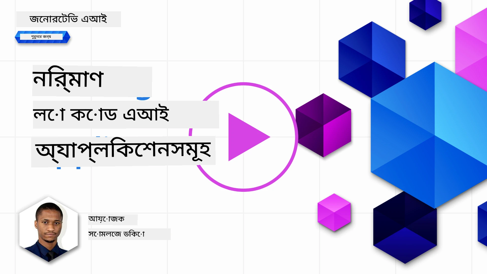](https://youtu.be/1vzq3Nd8GBA?si=h6LHWJXdmqf6mhDg)

> _(এই পাঠের ভিডিও দেখতে উপরের ছবিতে ক্লিক করুন)_

## ভূমিকা

এখন যেহেতু আমরা ছবি তৈরি করা অ্যাপ্লিকেশন তৈরি করা শিখেছি, চলুন লো কোড নিয়ে কথা বলি। জেনোরেটিভ এআই বিভিন্ন ক্ষেত্রে ব্যবহার করা যেতে পারে যার মধ্যে লো কোডও রয়েছে, কিন্তু লো কোড কী এবং আমরা কীভাবে তাতে এআই যোগ করতে পারি?

লো কোড ডেভেলপমেন্ট প্ল্যাটফর্মের মাধ্যমে ঐতিহ্যবাহী ডেভেলপার এবং নন-ডেভেলপারদের জন্য অ্যাপ এবং সমাধান তৈরি করা সহজ হয়েছে। লো কোড ডেভেলপমেন্ট প্ল্যাটফর্ম আপনাকে খুব কম বা কোনও কোড না লিখেই অ্যাপ এবং সমাধান তৈরি করতে সক্ষম করে। এটি একটি ভিজ্যুয়াল ডেভেলপমেন্ট পরিবেশ প্রদান করে যা আপনাকে কম্পোনেন্ট ড্র্যাগ এবং ড্রপ করে অ্যাপ এবং সমাধান তৈরি করতে দেয়। এটি আপনাকে দ্রুত এবং কম সম্পদে অ্যাপ ও সমাধান তৈরি করতে সাহায্য করে। এই পাঠে, আমরা লো কোড কীভাবে ব্যবহার করবেন এবং পাওয়ার প্ল্যাটফর্ম ব্যবহার করে লো কোড ডেভেলপমেন্টে কীভাবে এআই সংযোজন করবেন তা গভীরভাবে আলোচনা করব।

পাওয়ার প্ল্যাটফর্ম প্রতিষ্ঠানগুলিকে তাদের টিমকে একটি সহজ লো-কোড বা नो-কোড পরিবেশের মাধ্যমে নিজেদের সমাধান তৈরি করতে সক্ষম করে। এই পরিবেশ সমাধান তৈরি করার প্রক্রিয়াটি সহজতর করে। পাওয়ার প্ল্যাটফর্মের মাধ্যমে, সমাধানগুলি মাস বা বছরের পরিবর্তে কয়েকদিন বা সপ্তাহের মধ্যে তৈরি করা যায়। পাওয়ার প্ল্যাটফর্মে পাঁচটি মূল পণ্য রয়েছে: পাওয়ার অ্যাপস, পাওয়ার অটোমেট, পাওয়ার বিআই, পাওয়ার পেজেস এবং কপাইলট স্টুডিও।

এই পাঠে যা আলোচনা হবে:

- পাওয়ার প্ল্যাটফর্মে জেনারেটিভ এআই পরিচিতি
- কপাইলটের পরিচিতি এবং এটি কীভাবে ব্যবহার করবেন
- পাওয়ার প্ল্যাটফর্মে অ্যাপস এবং ফ্লো তৈরি করতে জেনারেটিভ এআই ব্যবহার
- পাওয়ার প্ল্যাটফর্মে AI বিল্ডারের মাধ্যমে এআই মডেলগুলো বোঝা
- মাইক্রোসফট কপাইলট স্টুডিও ব্যবহার করে বুদ্ধিমান এজেন্ট তৈরি

## শেখার লক্ষ্যসমূহ

এই পাঠের শেষ নাগাদ আপনি সক্ষম হবেন:

- পাওয়ার প্ল্যাটফর্মে কপাইলট কীভাবে কাজ করে তা বোঝা।

- আমাদের শিক্ষা স্টার্টআপের জন্য একটি স্টুডেন্ট এসাইনমেন্ট ট্র্যাকার অ্যাপ তৈরি করা।

- একটি ইনভয়েস প্রোসেসিং ফ্লো তৈরি করা যা এআই ব্যবহার করে ইনভয়েস থেকে তথ্য নিষ্কাশন করে।

- GPT এআই মডেল দিয়ে টেক্সট তৈরি করার সময় সেরা অনুশীলন প্রয়োগ করা।

- মাইক্রোসফট কপাইলট স্টুডিও কী তা বোঝা এবং এটি দিয়ে বুদ্ধিমান এজেন্ট তৈরি করা।

এই পাঠে আপনি যে সরঞ্জাম এবং প্রযুক্তি ব্যবহার করবেন:

- **Power Apps**, স্টুডেন্ট এসাইনমেন্ট ট্র্যাকার অ্যাপের জন্য, যা একটি লো-কোড ডেভেলপমেন্ট পরিবেশ প্রদান করে অ্যাপ তৈরি, ডেটা ট্র্যাক, পরিচালনা ও অন্তরা্ক্রিয়া করার জন্য।

- **Dataverse**, স্টুডেন্ট এসাইনমেন্ট ট্র্যাকার অ্যাপের ডেটা সংরক্ষণের জন্য, যেখানে Dataverse একটি লো-কোড ডেটা প্ল্যাটফর্ম সরবরাহ করে অ্যাপের ডেটা সংরক্ষণের জন্য।

- **Power Automate**, ইনভয়েস প্রোসেসিং ফ্লো-এর জন্য যেখানে আপনি লো-কোড ডেভেলপমেন্ট পরিবেশ পাবেন ইনভয়েস প্রোসেসিং প্রক্রিয়া স্বয়ংক্রিয় করতে।

- **AI Builder**, ইনভয়েস প্রোসেসিং এআই মডেলের জন্য যেখানে আপনি প্রি-বিল্ট এআই মডেল ব্যবহার করে আমাদের স্টার্টআপের ইনভয়েসগুলো প্রক্রিয়াজাত করবেন।

## পাওয়ার প্ল্যাটফর্মে জেনারেটিভ এআই

জেনারেটিভ এআই দিয়ে লো-কোড ডেভেলপমেন্ট এবং অ্যাপ্লিকেশন উন্নত করা পাওয়ার প্ল্যাটফর্মের একটি গুরুত্বপূর্ণ লক্ষ্যমাত্রা। লক্ষ্য হল প্রত্যেককে সক্ষম করা যাতে তারা এআই-চালিত অ্যাপ, সাইট, ড্যাশবোর্ড তৈরি করতে এবং এআই দিয়ে প্রক্রিয়া স্বয়ংক্রিয় করতে পারে, _কোনও তথ্য বিজ্ঞানী দক্ষতা ছাড়াই_। এই লক্ষ্যটি অর্জিত হয় পাওয়ার প্ল্যাটফর্মের লো-কোড ডেভেলপমেন্ট অভিজ্ঞতায় কপাইলট এবং AI বিল্ডার একত্রিত করে।

### এটা কীভাবে কাজ করে?

কপাইলট একটি এআই সহকারী যা আপনাকে পাওয়ার প্ল্যাটফর্ম সলিউশন তৈরি করতে সক্ষম করে আপনার চাহিদা একটি প্রাকৃতিক ভাষায় কথোপকথনের ধারায় বর্ণনা করে। উদাহরণস্বরূপ, আপনি আপনার এআই সহকারীকে বলতে পারেন আপনার অ্যাপ কোন ফিল্ড ব্যবহার করবে এবং এটি অ্যাপ এবং তার নীচের ডেটা মডেল তৈরি করবে অথবা আপনি Power Automate-এ ফ্লো কীভাবে সেটআপ করবেন তা নির্দিষ্ট করতে পারেন।

আপনি কপাইলট-চালিত কার্যকারিতা আপনার অ্যাপ স্ক্রীনগুলোতে একটি ফিচার হিসেবে ব্যবহার করতে পারেন যাতে ব্যবহারকারীরা কথোপকথনের মাধ্যমে অন্তর্দৃষ্টি অন্বেষণ করতে পারে।

AI বিল্ডার পাওয়ার প্ল্যাটফর্মে উপলব্ধ একটি লো-কোড এআই সক্ষমতা যা আপনাকে এআই মডেল ব্যবহার করে প্রক্রিয়া স্বয়ংক্রিয় করতে এবং ফলাফল পূর্বানুমান করতে সহায়তা করে। AI বিল্ডার দিয়ে আপনি আপনার অ্যাপ এবং ফ্লোতে এআই আনতে পারেন যা Dataverse-এ বা বিভিন্ন ক্লাউড ডেটা সোর্স যেমন SharePoint, OneDrive, বা Azure-এর সাথে সংযুক্ত।

কপাইলট পাওয়ার প্ল্যাটফর্মের সব পণ্যগুলোতে উপলব্ধ: পাওয়ার অ্যাপস, পাওয়ার অটোমেট, পাওয়ার বিআই, পাওয়ার পেজেস এবং কপাইলট স্টুডিও (পূর্বে পাওয়ার ভার্চুয়াল এজেন্ট)। AI বিল্ডার পাওয়ার অ্যাপস এবং পাওয়ার অটোমেটে উপলব্ধ। এই পাঠে আমরা আমাদের শিক্ষা স্টার্টআপের জন্য সমাধান তৈরি করতে পাওয়ার অ্যাপস এবং পাওয়ার অটোমেটে কপাইলট এবং AI বিল্ডার কীভাবে ব্যবহার করবেন তাতে ফোকাস করব।

### পাওয়ার অ্যাপে কপাইলট

পাওয়ার প্ল্যাটফর্মের অংশ হিসাবে, পাওয়ার অ্যাপস একটি লো-কোড ডেভেলপমেন্ট পরিবেশ প্রদান করে ডেটা ট্র্যাক, পরিচালনা ও ইন্টারঅ্যাকশন করার জন্য অ্যাপ তৈরি করতে। এটি একটি অ্যাপ ডেভেলপমেন্ট পরিষেবার স্যুট যার একটি স্কেলেবল ডেটা প্ল্যাটফর্ম এবং ক্লাউড পরিষেবা ও অন-প্রিমাইসিস ডেটার সাথে সংযোগ করার ক্ষমতা রয়েছে। পাওয়ার অ্যাপস আপনাকে এমন অ্যাপ তৈরি করতে দেয় যা ব্রাউজার, ট্যাবলেট ও ফোনে চলে এবং সহকর্মীদের সঙ্গে শেয়ার করা যায়। পাওয়ার অ্যাপস ব্যবহারকারীদের সহজ ইন্টারফেস দিয়ে অ্যাপ ডেভেলপমেন্টে পরিচিত করায়, যাতে প্রতিটি ব্যবসায়িক ব্যবহারকারী বা পেশাদার ডেভেলপার নিজস্ব অ্যাপ তৈরি করতে পারে। জেনারেটিভ এআই কপাইলটের মাধ্যমে অ্যাপ ডেভেলপমেন্ট অভিজ্ঞতাও উন্নত হয়েছে।

পাওয়ার অ্যাপে কপাইলট এআই সহকারী ফিচার আপনাকে বর্ণনা করতে দেয় আপনি কী ধরনের অ্যাপ চান এবং আপনার অ্যাপ কী তথ্য ট্র্যাক, সংগ্রহ বা প্রদর্শন করবে। এরপর কপাইলট আপনার বর্ণনার ভিত্তিতে একটি প্রতিক্রিয়াশীল ক্যানভাস অ্যাপ তৈরি করে। আপনি পরে আপনার প্রয়োজন অনুসারে অ্যাপটি কাস্টমাইজ করতে পারেন। এছাড়াও AI কপাইলট একটি Dataverse টেবিল প্রস্তাব করে যেখানে আপনার ট্র্যাক করতে চাওয়া ডেটা সংরক্ষণের জন্য প্রয়োজনীয় ক্ষেত্র এবং কিছু নমুনা ডেটা থাকে। আমরা এই পাঠে পরে দেখব Dataverse কী এবং কীভাবে পাওয়ার অ্যাপে এটি ব্যবহার করবেন। আপনি কথোপকথনমূলক ধাপের মাধ্যমে AI কপাইলট সাহায্যে টেবিলটি আপনার প্রয়োজন অনুযায়ী কাস্টমাইজ করতে পারেন। এই ফিচার পাওয়ার অ্যাপস হোম স্ক্রীনে সহজলভ্য।

### পাওয়ার অটোমেটে কপাইলট

পাওয়ার প্ল্যাটফর্মের অংশ হিসাবে, পাওয়ার অটোমেট ব্যবহারকারীকে অ্যাপ্লিকেশন ও পরিষেবাগুলোর মধ্যে স্বয়ংক্রিয় ওয়ার্কফ্লো তৈরি করতে দেয়। এটি যোগাযোগ, ডেটা সংগ্রহ এবং সিদ্ধান্ত গ্রহণ অনুমোদনের মতো পুনরাবৃত্ত ব্যবসায়িক প্রক্রিয়া স্বয়ংক্রিয় করতে সাহায্য করে। এর সহজ ইন্টারফেস প্রতিটি প্রযুক্তিগত দক্ষতার ব্যবহারকারী (শুরুমাত্রিক থেকে অভিজ্ঞ ডেভেলপার) কে কাজ স্বয়ংক্রিয় করতে সক্ষম করে। জেনারেটিভ এআই কপাইলটের মাধ্যমে ওয়ার্কফ্লো ডেভেলপমেন্ট অভিজ্ঞতাও উন্নত হয়েছে।

পাওয়ার অটোমেটে কপাইলট এআই সহকারী ফিচার আপনাকে বর্ণনা করতে সাহায্য করে আপনি কী ধরনের ফ্লো চান এবং আপনার ফ্লো কী কাজ করবে। কপাইলট আপনার বর্ণনার ভিত্তিতে একটি ফ্লো তৈরি করে। আপনি পরে আপনার প্রয়োজন অনুযায়ী ফ্লোটি কাস্টমাইজ করতে পারেন। AI কপাইলট কাজ সম্পন্ন করতে দরকারি অ্যাকশনগুলোও তৈরি ও প্রস্তাব করে। আমরা এই পাঠে পরে ফ্লো কী এবং কীভাবে পাওয়ার অটোমেটে এগুলি ব্যবহার করবেন তা দেখব। কথোপকথনের ধাপের মাধ্যমে AI কপাইলট সহকারী ব্যবহার করে আপনি অ্যাকশনগুলো আপনার প্রয়োজন অনুসারে কাস্টমাইজ করতে পারবেন। এই ফিচার পাওয়ার অটোমেট হোম স্ক্রীনে সহজলভ্য।

## মাইক্রোসফট কপাইলট স্টুডিও দিয়ে বুদ্ধিমান এজেন্ট তৈরি

[Microsoft Copilot Studio](https://learn.microsoft.com/microsoft-copilot-studio/fundamentals-what-is-copilot-studio?WT.mc_id=academic-105485-koreyst) (পূর্বে পাওয়ার ভার্চুয়াল এজেন্ট) হলো পাওয়ার প্ল্যাটফর্মের লো-কোড সদস্য যা **এআই এজেন্ট** তৈরির জন্য— কথোপকথনমূলক কপাইলট যেগুলি ব্যবহারকারীদের পক্ষ থেকে প্রশ্নের উত্তর দিতে পারে, কাজ করতে পারে, এবং স্বয়ংক্রিয় করতে পারে। পাওয়ার প্ল্যাটফর্মের অন্যান্য অংশের মতই, আপনি একটি ভিজ্যুয়াল, প্রাকৃতিক ভাষাভিত্তিক অভিজ্ঞতায় এজেন্ট তৈরি করেন: আপনি বর্ণনা করেন এজেন্ট কী করবে, এবং কপাইলট স্টুডিও এর নির্দেশনা, জ্ঞান এবং কাজগুলো সাজাতে সাহায্য করে।

আমাদের শিক্ষা স্টার্টআপের জন্য, আপনি এমন একটি এজেন্ট তৈরি করতে পারেন যা ছাত্রদের কোর্স বিষয়ে প্রশ্নের উত্তর দেয়, এসাইনমেন্টের সময়সীমা পরীক্ষা করে, এবং এমনকি ইন্সট্রাক্টরের কাছে ইমেইল পাঠায় — সবকিছু কোড না লিখেই।

এখানে কিছু সাম্প্রতিক ক্ষমতা রয়েছে যা কপাইলট স্টুডিওকে শক্তিশালী করে তোলে:

- **আপনার জ্ঞান থেকে জেনারেটিভ উত্তর**। প্রতিটি কথোপকথন হাতে তৈরি না করে, আপনি **জ্ঞান সোর্স** যুক্ত করতে পারেন — পাবলিক ওয়েবসাইট, শেয়ারপয়েন্ট, ওয়ানড্রাইভ, ডাটাভার্স, আপলোড করা ফাইল বা এন্টারপ্রাইজ ডেটা কানেক্টরের মাধ্যমে — এবং এজেন্ট সেখান থেকে ভিত্তিপ্রাপ্ত উত্তর তৈরি করে।

- **জেনারেটিভ অর্কেস্ট্রেশন**। কঠোর ট্রিগার ফ্রেজের উপর নির্ভর না করে, এজেন্ট এআই ব্যবহার করে একটি অনুরোধ বোঝে এবং কী জ্ঞান, বিষয় এবং কাজ একত্রিত করতে হবে তা সিদ্ধান্ত নেয়, একাধিক ধাপ একসাথে দিতে পারে।

- **অ্যাকশন এবং কানেক্টর**। এজেন্ট শুধু চ্যাট করে না, কাজও করে। আপনি একটি এজেন্টকে 1,500+ প্রি-বিল্ট পাওয়ার প্ল্যাটফর্ম কানেক্টর, পাওয়ার অটোমেট ফ্লো, কাস্টম REST API, প্রম্পট বা **মডেল কনটেক্সট প্রোটোকল (MCP)** সার্ভার দ্বারা সমর্থিত অ্যাকশন দিতে পারেন।

- **স্বায়ত্তশাসিত এজেন্ট**। এজেন্ট শুধু চ্যাট উইন্ডোতে সাড়া দেয় না। আপনি **স্বায়ত্তশাসিত এজেন্ট** তৈরি করতে পারেন যা কোনো ইভেন্ট দ্বারা ট্রিগার হয় — যেমন একটি নতুন ইমেইল, ডাটাভার্সে নতুন রেকর্ড, বা একটি ফাইল আপলোড — এবং তারপর পেছনে কাজ সম্পন্ন করে।

- **মাল্টি-এজেন্ট অর্কেস্ট্রেশন**। এজেন্ট অন্য এজেন্টকেও কল করতে পারে। একটি কপাইলট স্টুডিও এজেন্ট অন্য এজেন্টকে হ্যান্ডঅফ করতে বা অন্যান্য এজেন্ট দ্বারা সম্প্রসারিত হতে পারে, যার মধ্যে রয়েছে মাইক্রোসফট ৩৬৫ কপাইলট এবং মাইক্রোসফট ফাউন্ড্রিতে তৈরি এজেন্ট।

- **মডেল পছন্দ**। বিল্ট-ইন মডেলের বাইরে, আপনি মাইক্রোসফট ফাউন্ড্রি মডেল ক্যাটালগ থেকে মডেল আনতে পারেন যা আপনার এজেন্টকে যুক্তি এবং সাড়া দেওয়ার পদ্ধতি কাস্টমাইজ করতে দেয়।

- **যেকোনো জায়গায় প্রকাশ**। একবার তৈরি হলে, একটি এজেন্ট বিভিন্ন চ্যানেলে প্রকাশ করা যায়—মাইক্রোসফট টিমস, মাইক্রোসফট ৩৬৫ কপাইলট, একটি ওয়েবসাইট বা কাস্টম অ্যাপ, এবং আরও অনেক কিছু— নিরাপত্তা, প্রমাণীকরণ এবং বিশ্লেষণ শক্তিশালীভাবে পাওয়ার প্ল্যাটফর্ম প্রশাসন অভিজ্ঞতার মাধ্যমে পরিচালিত হয়।

আপনি [copilotstudio.microsoft.com](https://copilotstudio.microsoft.com?WT.mc_id=academic-105485-koreyst)-এ আপনার প্রথম এজেন্ট তৈরি শুরু করতে পারেন এবং [Microsoft Copilot Studio ডকুমেন্টেশন](https://learn.microsoft.com/microsoft-copilot-studio/?WT.mc_id=academic-105485-koreyst) থেকে আরও জানতে পারেন।

## অ্যাসাইনমেন্ট: কপাইলট ব্যবহার করে আমাদের স্টার্টআপের ছাত্রদের অ্যাসাইনমেন্ট এবং ইনভয়েস পরিচালনা

আমাদের স্টার্টআপ ছাত্রদের কাছে অনলাইন কোর্স প্রদান করে। স্টার্টআপ দ্রুত বৃদ্ধি পাচ্ছে এবং এখন এর কোর্সগুলোর চাহিদা পূরণ করতে কষ্ট হচ্ছে। তারা আপনাকে একটি পাওয়ার প্ল্যাটফর্ম ডেভেলপার হিসেবে নিয়োগ করেছে যাতে তারা তাদের ছাত্রদের অ্যাসাইনমেন্ট এবং ইনভয়েস পরিচালনা করতে একটি লো-কোড সমাধান তৈরি করতে পারেন। সমাধানটি তাদের একটি অ্যাপের মাধ্যমে ছাত্রদের অ্যাসাইনমেন্ট ট্র্যাক এবং পরিচালনা করতে এবং একটি ওয়ার্কফ্লোর মাধ্যমে ইনভয়েস প্রক্রিয়া স্বয়ংক্রিয় করতে সক্ষম হতে হবে। আপনাকে জেনারেটিভ এআই ব্যবহার করে এই সমাধানটি উন্নত করতে বলা হয়েছে।

যখন আপনি কপাইলট ব্যবহার শুরু করেন, তখন আপনি [Power Platform Copilot Prompt Library](https://github.com/pnp/powerplatform-prompts?WT.mc_id=academic-109639-somelezediko) ব্যবহার করে প্রম্পট দিয়ে শুরু করতে পারেন। এই লাইব্রেরিতে কপাইলট দিয়ে অ্যাপ এবং ফ্লো তৈরি করার জন্য ব্যবহারযোগ্য প্রম্পটের তালিকা রয়েছে। এছাড়াও লাইব্রেরির প্রম্পট ব্যবহার করে আপনি জানতে পারবেন কপাইলটের কাছে কীভাবে আপনার চাহিদা বর্ণনা করবেন।

### আমাদের স্টার্টআপের জন্য একটি স্টুডেন্ট এসাইনমেন্ট ট্র্যাকার অ্যাপ তৈরি

আমাদের স্টার্টআপের শিক্ষকরাও ছাত্রদের অ্যাসাইনমেন্ট ট্র্যাক করতে কষ্ট পাচ্ছিলেন। তারা একটি স্প্রেডশীট ব্যবহার করছিলেন অ্যাসাইনমেন্ট ট্র্যাক করার জন্য কিন্তু ছাত্রসংখ্যা বাড়ার কারণে এটি পরিচালনা করা কঠিন হয়ে পড়েছে। তারা আপনাকে একটি অ্যাপ তৈরি করতে বলেছেন যা তাদের অ্যাসাইনমেন্ট ট্র্যাক এবং পরিচালনা করতে সাহায্য করবে। অ্যাপটি নতুন অ্যাসাইনমেন্ট যোগ করা, অ্যাসাইনমেন্ট দেখা, অ্যাসাইনমেন্ট আপডেট করা এবং অ্যাসাইনমেন্ট মুছে ফেলা সক্ষম করবে। অ্যাপটি শিক্ষকদের এবং ছাত্রদের গ্রেডকৃত এবং অগ্রেড করা অ্যাসাইনমেন্ট দেখার সুবিধাও দিতে হবে।

আপনি নিচের ধাপগুলি অনুসরণ করে পাওয়ার অ্যাপে কপাইলট ব্যবহার করে এই অ্যাপটি তৈরি করবেন:

1. [Power Apps](https://make.powerapps.com?WT.mc_id=academic-105485-koreyst) হোম স্ক্রীনে যান।

1. হোম স্ক্রীনের টেক্সট এরিয়া ব্যবহার করে আপনি যে অ্যাপটি তৈরি করতে চান তা বর্ণনা করুন। উদাহরণস্বরূপ, **_আমি একটি অ্যাপ তৈরি করতে চাই যা ছাত্রদের অ্যাসাইনমেন্ট ট্র্যাক এবং পরিচালনা করবে_**। প্রম্পট AI কপাইলট-এ পাঠাতে **Send** বাটনে ক্লিক করুন।

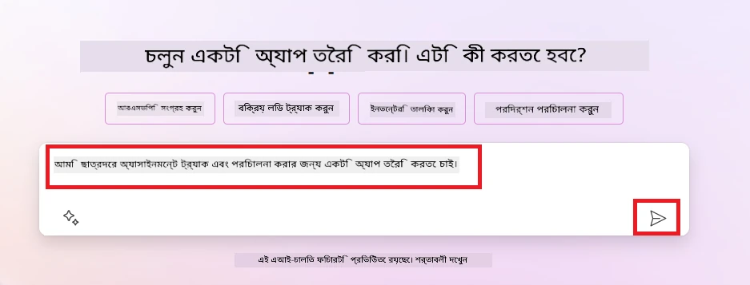

1. AI কপাইলট প্রস্তাব করবে একটি Dataverse টেবিল যেখানে আপনার ট্র্যাক করতে চান এমন ডেটা সংরক্ষণের জন্য প্রয়োজনীয় ফিল্ড এবং কিছু নমুনা ডেটা থাকবে। এরপর কথোপকথনধর্মী ধাপের মাধ্যমে এই টেবিলটি আপনার প্রয়োজন অনুযায়ী কাস্টমাইজ করতে পারবেন AI কপাইলট সহকারী ফিচারের মাধ্যমে।

   > **গুরুত্বপূর্ণ**: Dataverse হলো পাওয়ার প্ল্যাটফর্মের জন্য মূল ডেটা প্ল্যাটফর্ম। এটি একটি লো-কোড ডেটা প্ল্যাটফর্ম যা অ্যাপের ডেটা সংরক্ষণ করে। এটি একটি সম্পূর্ণ ব্যবস্থাপিত সার্ভিস যা মাইক্রোসফট ক্লাউডে নিরাপদে ডেটা সংরক্ষণ করে এবং আপনার পাওয়ার প্ল্যাটফর্ম পরিবেশে প্রদান করা হয়। এতে অন্তর্নির্মিত ডেটা গভর্নেন্স ফিচার রয়েছে, যেমন ডেটা শ্রেণিবিভাগ, ডেটা লাইনিয়েজ, সূক্ষ্ম-গ্রানুলার অ্যাক্সেস নিয়ন্ত্রণ ইত্যাদি। আপনি Dataverse সম্পর্কে আরও জানতে পারেন [এখানে](https://learn.microsoft.com/power-apps/maker/data-platform/data-platform-intro?WT.mc_id=academic-109639-somelezediko)।

   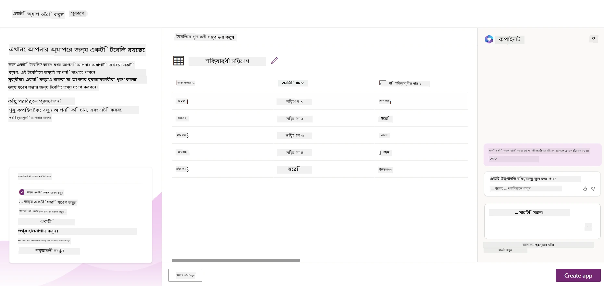

1. শিক্ষকরাও ছাত্রদের অ্যাসাইনমেন্ট জমা দেওয়ার পর তাদের আপডেট রাখার জন্য ইমেইল পাঠাতে চান। আপনি কপাইলট ব্যবহার করে টেবিলে একটি নতুন ফিল্ড যোগ করতে পারেন ছাত্রদের ইমেইল সংরক্ষণের জন্য। উদাহরণস্বরূপ, আপনি নিচের প্রম্পট ব্যবহার করতে পারেন: **_আমি ছাত্র ইমেইল সংরক্ষণ করার জন্য একটি কলাম যোগ করতে চাই_**। প্রম্পট AI কপাইলট-এ পাঠাতে **Send** বাটনে ক্লিক করুন।

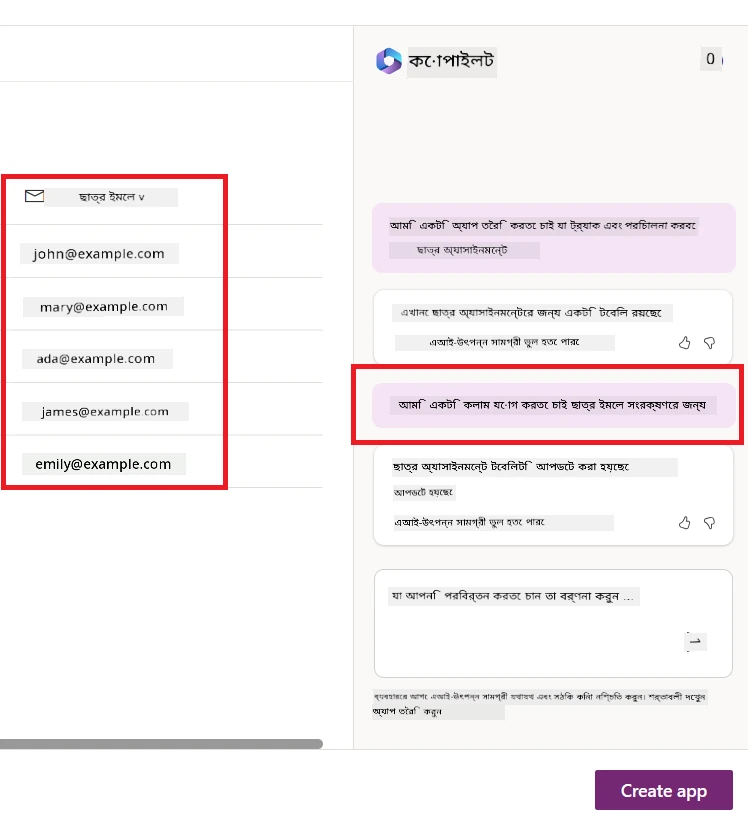

1. AI কপাইলট একটি নতুন ফিল্ড তৈরি করবে এবং আপনি সেটি আপনার প্রয়োজন মতো কাস্টমাইজ করতে পারবেন।

1. টেবিল সম্পন্ন হলে, অ্যাপ তৈরি করতে **Create app** বোতামে ক্লিক করুন।

1. AI Copilot আপনার বিবরণের ভিত্তিতে একটি প্রতিক্রিয়াশীল ক্যানভাস অ্যাপ তৈরি করবে। এরপর আপনি আপনার প্রয়োজন অনুযায়ী অ্যাপটি কাস্টমাইজ করতে পারবেন।

1. শিক্ষার্থীদের ইমেইল পাঠানোর জন্য শিক্ষকরা Copilot ব্যবহার করে অ্যাপে একটি নতুন স্ক্রিন যোগ করতে পারেন। উদাহরণস্বরূপ, আপনি নিম্নলিখিত প্রম্পট ব্যবহার করে অ্যাপে একটি নতুন স্ক্রিন যোগ করতে পারেন: **_আমি শিক্ষার্থীদের ইমেইল পাঠানোর জন্য একটি স্ক্রিন যোগ করতে চাই_**। প্রম্পটটি AI Copilot-এ পাঠাতে **Send** বোতামে ক্লিক করুন।

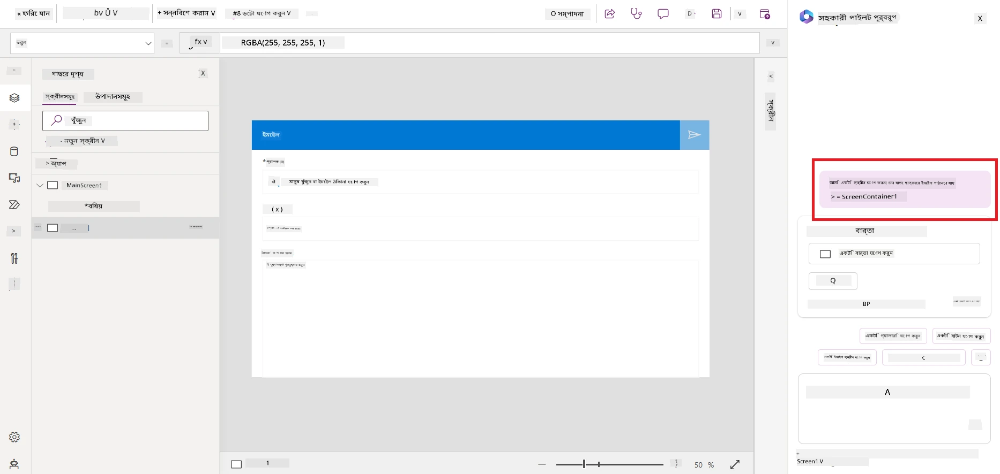

1. AI Copilot একটি নতুন স্ক্রিন তৈরি করবে এবং আপনি আপনার চাহিদা অনুযায়ী সেই স্ক্রিনটি কাস্টমাইজ করতে পারবেন।

1. অ্যাপটি সম্পন্ন হলে, অ্যাপটি সংরক্ষণ করতে **Save** বোতামে ক্লিক করুন।

1. শিক্ষকদের সাথে অ্যাপ শেয়ার করতে, **Share** বোতামে ক্লিক করুন এবং তারপর আবার **Share** বোতামে ক্লিক করুন। এরপর তাদের ইমেইল ঠিকানা প্রবেশ করিয়ে অ্যাপটি শিক্ষকদের সঙ্গে শেয়ার করতে পারবেন।

> **আপনার কর্ম**: আপনি যা অ্যাপ বানিয়েছেন তা শুরু করার জন্য ভালো, তবে এটি আরও উন্নত করা যেতে পারে। ইমেইল ফিচার দিয়ে শিক্ষকরা শিক্ষার্থীদের ইমেইল ম্যানুয়ালি টাইপ করে পাঠাতে পারেন। আপনি কি Copilot ব্যবহার করে এমন একটি অটোমেশন তৈরি করতে পারেন যাতে শিক্ষকরা স্বয়ংক্রিয়ভাবে যখন শিক্ষার্থীরা তাদের নিয়োগ জমা দেয় তখন ইমেইল পাঠাতে পারেন? আপনার হিন্ট হলো, সঠিক প্রম্পট দিয়ে আপনি Power Automate-এ Copilot ব্যবহার করে এটি তৈরি করতে পারবেন।

### আমাদের স্টার্টআপের জন্য ইনভয়েস তথ্য টেবিল তৈরি করুন

আমাদের স্টার্টআপের অর্থনৈতিক দল ইনভয়েস ট্র্যাক করতে সমস্যায় পড়েছে। তারা ইনভয়েস ট্র্যাক করতে একটি স্প্রেডশীট ব্যবহার করছিল কিন্তু ইনভয়েসের সংখ্যা বেড়ে যাওয়ায় এটি পরিচালনা করা কঠিন হয়ে উঠেছে। তারা আপনাকে একটি টেবিল তৈরি করতে বলেছে যা তাদের ইনভয়েসের তথ্য সংরক্ষণ, ট্র্যাক এবং পরিচালনায় সহায়তা করবে। টেবিলটি এমন একটি অটোমেশন তৈরি করার জন্য ব্যবহৃত হবে যা সমস্ত ইনভয়েসের তথ্য বের করে টেবিলে সংরক্ষণ করবে। টেবিলটি অর্থনৈতিক দলকে প্রদর্শন করার জন্য সুবিধা দেবে কোন ইনভয়েস প্রদেয় হয়েছে এবং কোনটি হয়নি।

পাওয়ার প্ল্যাটফর্মের একটি অন্তর্নিহিত ডেটা প্ল্যাটফর্ম রয়েছে যার নাম Dataverse যা আপনার অ্যাপ এবং সলিউশনের ডেটা সংরক্ষণে সক্ষম করে। Dataverse একটি লো-কোড ডেটা প্ল্যাটফর্ম যা অ্যাপের ডেটা সংরক্ষণ করে। এটি একটি সম্পূর্ণভাবে পরিচালিত পরিষেবা যা Microsoft ক্লাউডে নিরাপদভাবে ডেটা সংরক্ষণ করে এবং আপনার পাওয়ার প্ল্যাটফর্ম পরিবেশের মধ্যে প্রোভিশন্ড। এর সাথে বিল্ট-ইন ডেটা গভর্নেন্স ক্ষমতা রয়েছে, যেমন ডেটা শ্রেণীবদ্ধকরণ, ডেটা লিনিয়েজ, সূক্ষ্ম-গ্রেনেড অ্যাক্সেস নিয়ন্ত্রণ, এবং আরও অনেক কিছু। আপনি আরও জানতে পারেন [Dataverse সম্পর্কে এখানে](https://learn.microsoft.com/power-apps/maker/data-platform/data-platform-intro?WT.mc_id=academic-109639-somelezediko).

কেন আমাদের স্টার্টআপের জন্য Dataverse ব্যবহার করা উচিত? Dataverse-এর স্ট্যান্ডার্ড এবং কাস্টম টেবিলগুলি আপনার ডেটার জন্য একটি নিরাপদ এবং ক্লাউড ভিত্তিক সংরক্ষণ বিকল্প প্রদান করে। টেবিলগুলি আপনাকে বিভিন্ন ধরনের ডেটা সংরক্ষণ করতে দেয়, যেমন আপনি একক Excel ওয়ার্কবুকে একাধিক ওয়ার্কশীট ব্যবহার করতে পারেন। আপনি টেবিলগুলি ব্যবহার করে এমন ডেটা সংরক্ষণ করতে পারেন যা আপনার সংস্থা বা ব্যবসায়িক চাহিদার জন্য নির্দিষ্ট। Dataverse ব্যবহারের কিছু সুবিধা আমাদের স্টার্টআপ পাবে, যার মধ্যে অন্তর্ভুক্ত কিন্তু সীমাবদ্ধ নয়:

- **সহজে পরিচালনা যোগ্য**: মেটাডেটা এবং ডেটা উভয়ই ক্লাউডে সংরক্ষিত হয়, তাই আপনি কিভাবে এগুলি সংরক্ষণ বা পরিচালনা করা হয় তা নিয়ে চিন্তা করতে হবে না। আপনি আপনার অ্যাপ এবং সলিউশন তৈরি করায় মনোযোগ দিতে পারবেন।

- **নিরাপদ**: Dataverse আপনার ডেটার জন্য একটি নিরাপদ এবং ক্লাউড ভিত্তিক সংরক্ষণ বিকল্প প্রদান করে। আপনি টেবিলের ডেটার অ্যাক্সেস কে পাবে এবং কিভাবে সেটা পাবে তা রোল ভিত্তিক সুরক্ষা ব্যবহার করে নিয়ন্ত্রণ করতে পারেন।

- **সমৃদ্ধ মেটাডেটা**: ডেটা টাইপ এবং সম্পর্ক সরাসরি Power Apps-এর মধ্যে ব্যবহৃত হয়

- **লজিক এবং ভ্যালিডেশন**: ব্যবসায়িক নিয়ম, হিসাব করা ক্ষেত্র, এবং ভ্যালিডেশন নিয়ম ব্যবহার করে বাণিজ্যিক লজিক প্রয়োগ এবং ডেটার সঠিকতা বজায় রাখতে পারেন।

এখন আপনি জানেন Dataverse কী এবং কেন এটি ব্যবহার করা উচিত, চলুন দেখি কিভাবে Copilot ব্যবহার করে Dataverse-এ একটি টেবিল তৈরি করা যায় যা আমাদের অর্থনৈতিক দলের প্রয়োজন মেটাবে।

> **বিঃদ্রঃ** : আপনি এই টেবিলটি পরবর্তী অংশে ব্যবহার করবেন এমন একটি অটোমেশন তৈরির জন্য যা সমস্ত ইনভয়েস তথ্য বের করে এটিকে টেবিলে সংরক্ষণ করবে।

Copilot ব্যবহার করে Dataverse-এ একটি টেবিল তৈরি করার জন্য নিচের ধাপগুলি অনুসরণ করুন:

1. [Power Apps](https://make.powerapps.com?WT.mc_id=academic-105485-koreyst) হোম স্ক্রিনে যান।

2. বাম পার্শ্বের নেভিগেশন বারে **Tables** নির্বাচন করুন এবং তারপর **Describe the new Table** এ ক্লিক করুন।

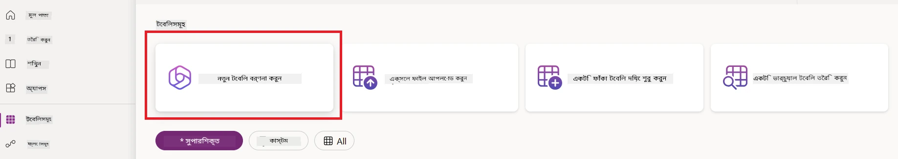

1. **Describe the new Table** স্ক্রিনে, টেক্সট এরিয়ায় আপনি যে টেবিলটি তৈরি করতে চান তা বর্ণনা করুন। উদাহরণস্বরূপ, **_আমি ইনভয়েস তথ্য সংরক্ষণ করার জন্য একটি টেবিল তৈরি করতে চাই_**। প্রম্পটটি AI Copilot-এ পাঠাতে **Send** বোতামে ক্লিক করুন।

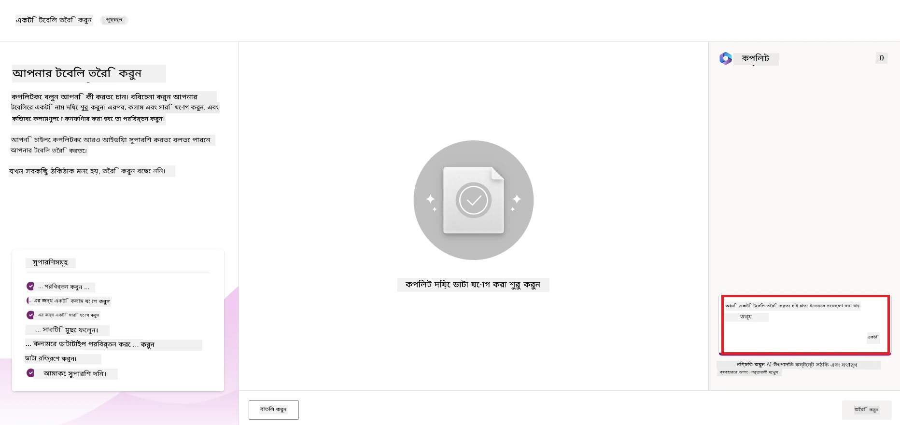

1. AI Copilot একটি Dataverse টেবিল প্রস্তাব করবে যা আপনার ট্র্যাক করতে চান ডেটা সংরক্ষণের জন্য প্রয়োজনীয় ফিল্ড এবং কিছু নমুনা ডেটা রয়েছে। আপনি AI Copilot অ্যাসিস্ট্যান্ট ফিচারের মাধ্যমে কথোপকথনের ধাপগুলো অনুসরণ করে টেবিলটি আপনার প্রয়োজন অনুযায়ী কাস্টমাইজ করতে পারবেন।

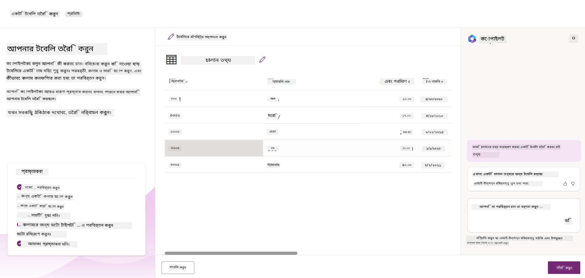

1. অর্থনৈতিক দল সরবরাহকারীর সাথে ইনভয়েসের বর্তমান অবস্থা আপডেট করার জন্য ইমেইল পাঠাতে চায়। আপনি Copilot ব্যবহার করে টেবিলে সরবরাহকারী ইমেইল সংরক্ষণের জন্য একটি নতুন ফিল্ড যোগ করতে পারেন। উদাহরণস্বরূপ, আপনি নিম্নলিখিত প্রম্পট ব্যবহার করতে পারেন: **_আমি সরবরাহকারীর ইমেইল সংরক্ষণের জন্য একটি কলাম যোগ করতে চাই_**। প্রম্পটটি AI Copilot-এ পাঠাতে **Send** বোতামে ক্লিক করুন।

1. AI Copilot একটি নতুন ফিল্ড তৈরি করবে এবং আপনি সেটি আপনার চাহিদা অনুযায়ী কাস্টমাইজ করতে পারবেন।

1. টেবিল তৈরি সম্পন্ন হলে, টেবিল তৈরি করতে **Create** বোতামে ক্লিক করুন।

## Power Platform-এ AI Builder সঙ্গে AI মডেলসমূহ

AI Builder একটি লো-কোড AI সক্ষমতা যা পাওয়ার প্ল্যাটফর্মে পাওয়া যায় যা আপনাকে প্রক্রিয়া স্বয়ংক্রিয়করণ এবং ফলাফল পূর্বাভাসে AI মডেল ব্যবহারে সহায়তা করে। AI Builder দিয়ে আপনি আপনার ডেটা যা Dataverse-এ বা বিভিন্ন ক্লাউড ডেটা সোর্স যেমন SharePoint, OneDrive বা Azure তে সংযুক্ত, সেগুলিতে AI আনে অ্যাপ এবং ফ্লো তৈরি করতে পারেন।

## প্রি-বিল্ট AI মডেল বনাম কাস্টম AI মডেল

AI Builder দুটি ধরনের AI মডেল প্রদান করে: প্রি-বিল্ট AI মডেল এবং কাস্টম AI মডেল। প্রি-বিল্ট AI মডেলগুলি Microsoft দ্বারা প্রশিক্ষিত এবং পাওয়ার প্ল্যাটফর্মে উপলব্ধ রেডি-টু-ইউজ AI মডেল। এগুলি আপনাকে ডেটা সংগ্রহ করে নিজের মডেল তৈরি, প্রশিক্ষণ ও প্রকাশ না করেই আপনার অ্যাপ এবং ফ্লোতে বুদ্ধিমত্তা যোগ করতে সহায়তা করে। আপনি এই মডেল ব্যবহার করে প্রক্রিয়া স্বয়ংক্রিয়করণ এবং ফলাফল পূর্বাভাস করতে পারেন।

পাওয়ার প্ল্যাটফর্মে উপলব্ধ কিছু প্রি-বিল্ট AI মডেল হল:

- **কী ফ্রেজ নির্যাস**: এই মডেলটি টেক্সট থেকে কী ফ্রেজ বের করে।
- **ভাষা সনাক্তকরণ**: এই মডেলটি একটি টেক্সটের ভাষা সনাক্ত করে।
- **মনের অবস্থা বিশ্লেষণ**: এই মডেলটি টেক্সটের পজিটিভ, নেগেটিভ, নিউট্রাল বা মিশ্র অনুভূতি সনাক্ত করে।
- **ব্যবসায়িক কার্ড রিডার**: এই মডেলটি বিজনেস কার্ড থেকে তথ্য নির্যাস করে।
- **টেক্সট শনাক্তকরণ**: এই মডেলটি ইমেজ থেকে টেক্সট বের করে।
- **অবজেক্ট সনাক্তকরণ**: এই মডেলটি চিত্র থেকে অবজেক্ট সনাক্ত ও বের করে।
- **ডকুমেন্ট প্রক্রিয়াকরণ**: এই মডেল ফর্ম থেকে তথ্য নির্যাস করে।
- **ইনভয়েস প্রক্রিয়াকরণ**: এই মডেল ইনভয়েস থেকে তথ্য বের করে।

কাস্টম AI মডেল দিয়ে আপনি AI Builder-এ নিজের মডেল নিয়ে আসতে পারেন যা অন্য কোনো AI Builder কাস্টম মডেলের মতো কাজ করে, আপনার নিজস্ব ডেটা ব্যবহার করে মডেলটিকে প্রশিক্ষিত করতে দেয়। আপনি এই মডেলগুলি Power Apps এবং Power Automate-এ প্রক্রিয়া স্বয়ংক্রিয়করণ এবং ফলাফল পূর্বাভাসে ব্যবহার করতে পারেন। নিজের মডেল ব্যবহারে কিছু সীমাবদ্ধতা প্রযোজ্য। বিস্তারিত [সীমাবদ্ধতাগুলি এখানে পড়ুন](https://learn.microsoft.com/ai-builder/byo-model#limitations?WT.mc_id=academic-105485-koreyst)।

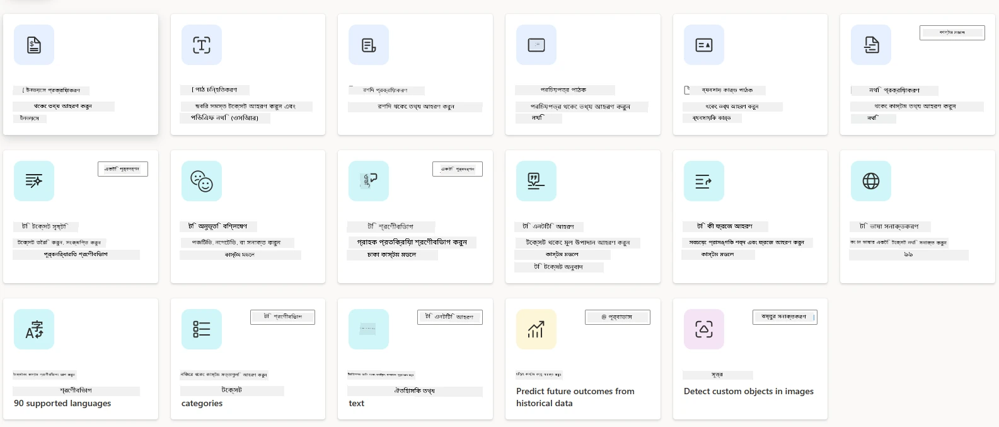

## অ্যাসাইনমেন্ট #2 - আমাদের স্টার্টআপের জন্য ইনভয়েস প্রক্রিয়াকরণ ফ্লো তৈরি করুন

অর্থনৈতিক দল ইনভয়েস প্রক্রিয়াকরণে সমস্যায় আছে। তারা ইনভয়েস ট্র্যাক করতে স্প্রেডশীট ব্যবহার করছিলেন কিন্তু ইনভয়েসের সংখ্যা বেড়ে যাওয়ায় এটি পরিচালনা করা কঠিন হয়েছে। তারা আপনাকে এমন একটি ওয়ার্কফ্লো তৈরি করতে বলে যা AI ব্যবহার করে ইনভয়েস প্রক্রিয়াকরণে সহায়তা করবে। ওয়ার্কফ্লোটি ইনভয়েস থেকে তথ্য নির্যাস করতে এবং তথ্য Dataverse টেবিলে সংরক্ষণ করতে সক্ষম হবে। ওয়ার্কফ্লোটি নির্যাস করা তথ্য সহ অর্থনৈতিক দলকে একটি ইমেইল পাঠানোর সুবিধাও দিতে হবে।

এখন আপনি জানেন AI Builder কী এবং কেন এটি ব্যবহার করা উচিত, চলুন দেখি কিভাবে আমরা আগের আলোচনায় উল্লেখিত Invoice Processing AI মডেল ব্যবহার করে অর্থনৈতিক দলের ইনভয়েস প্রক্রিয়াকরণের জন্য একটি ওয়ার্কফ্লো তৈরি করতে পারি।

AI Builder-এর Invoice Processing AI মডেল ব্যবহার করে অর্থনৈতিক দলের ইনভয়েস প্রক্রিয়াকরণের জন্য একটি ওয়ার্কফ্লো তৈরি করতে নিচের ধাপগুলি অনুসরণ করুন:

1. [Power Automate](https://make.powerautomate.com?WT.mc_id=academic-105485-koreyst) হোম স্ক্রিনে যান।

2. হোম স্ক্রিনের টেক্সট এরিয়ায় আপনি যে ওয়ার্কফ্লোটি তৈরি করতে চান সেটা বর্ণনা করুন। উদাহরণস্বরূপ, **_আমার মেইলবক্সে ইনভয়েস এলে সেটি প্রক্রিয়াকরণ কর্_**। প্রম্পট AI Copilot-এ পাঠাতে **Send** বোতামে ক্লিক করুন।

   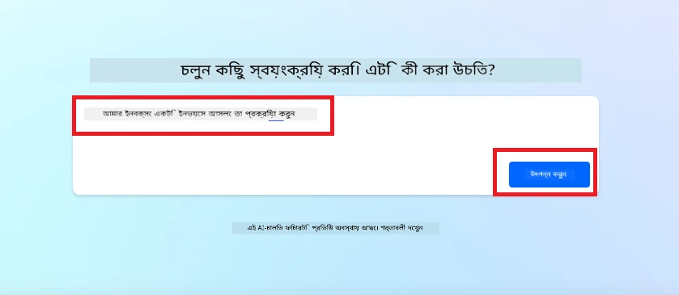

3. AI Copilot আপনার স্বয়ংক্রিয় করতে চান কাজটি সম্পাদনের জন্য প্রয়োজনীয় অ্যাকশন প্রদর্শন করবে। পরবর্তী ধাপগুলি দেখতে **Next** বোতামে ক্লিক করুন।

4. পরবর্তী ধাপে, Power Automate আপনাকে ফ্লো-এর জন্য প্রয়োজনীয় সংযোগগুলি সেটআপ করতে বলবে। কাজ শেষ হলে, ফ্লো তৈরি করতে **Create flow** বোতামে ক্লিক করুন।

5. AI Copilot একটি ফ্লো তৈরি করবে এবং আপনি আপনার প্রয়োজন অনুযায়ী ফ্লো কাস্টমাইজ করতে পারবেন।

6. ফ্লোর ট্রিগার আপডেট করে সেট করুন **Folder**, যেখানে ইনভয়েস সংরক্ষিত হবে। উদাহরণস্বরূপ, ফোল্ডারটি **Inbox** হতে পারে। তারপর **Show advanced options** তে ক্লিক করুন এবং **Only with Attachments** কে **Yes** সেট করুন। এটি নিশ্চিত করবে যে ফ্লো শুধুমাত্র একটি সংলগ্ন ফাইল সহ ইমেইল পাওয়া গেলে চলবে।

7. ফ্লো থেকে নিম্নলিখিত অ্যাকশনসমূহ সরান: **HTML to text**, **Compose**, **Compose 2**, **Compose 3** এবং **Compose 4**, কারণ আপনি এগুলি ব্যবহার করবেন না।

8. ফ্লো থেকে **Condition** অ্যাকশনটি সরান কারণ আপনি এটি ব্যবহার করবেন না। এটি নিম্নলিখিত স্ক্রিনশটের মতো দেখাবে:

   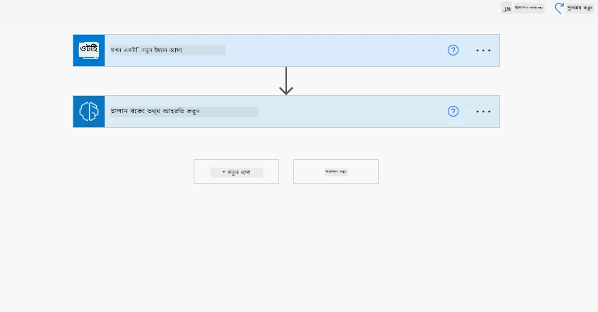

9. **Add an action** বোতামে ক্লিক করুন এবং **Dataverse** অনুসন্ধান করুন। তারপর **Add a new row** অ্যাকশনটি নির্বাচন করুন।

10. **Extract Information from invoices** অ্যাকশনে, **Invoice File** আপডেট করে ইমেইল থেকে **Attachment Content** নির্দিষ্ট করুন। এটি নিশ্চিত করবে যে ফ্লো ইনভয়েস সংলগ্ন ফাইল থেকে তথ্য বের করে।

11. আগেই তৈরি করা টেবিলটি নির্বাচন করুন। উদাহরণস্বরূপ, আপনি **Invoice Information** টেবিলটি বেছে নিতে পারেন। পূর্ববর্তী অ্যাকশন থেকে ডায়নামিক কনটেন্ট ব্যবহার করে নিচের ফিল্ডগুলি পূরণ করুন:

    - আইডি
    - পরিমাণ
    - তারিখ
    - নাম
    - অবস্থা - **Status** কে **Pending** সেট করুন।
    - সরবরাহকারী ইমেইল - **When a new email arrives** ট্রিগার থেকে **From** ডায়নামিক কনটেন্টটি ব্যবহার করুন।

    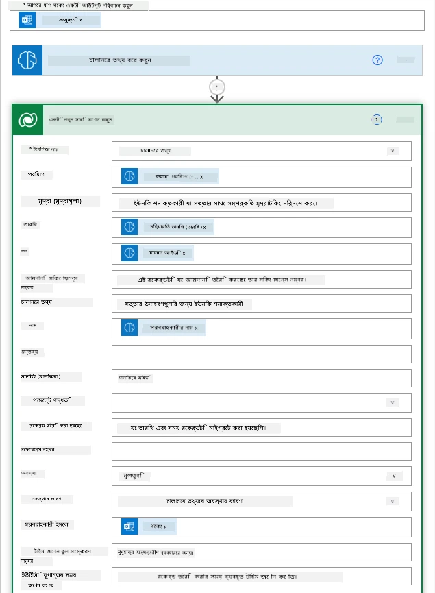

12. ফ্লো শেষ হলে, ফ্লো সংরক্ষণ করতে **Save** বোতামে ক্লিক করুন। এরপর আপনি ফলোটি পরীক্ষা করতে পারেন ট্রিগারে নির্দিষ্ট ফোল্ডারে ইনভয়েস সহ ইমেইল পাঠিয়ে।

> **আপনার কর্ম**: আপনি যা ফ্লো তৈরি করেছেন তা শুরু করার জন্য ভাল, এখন চিন্তা করুন কীভাবে একটি স্বয়ংক্রিয় ব্যবস্থা তৈরি করবেন যা আমাদের অর্থনৈতিক দলকে সরবরাহকারীকে ইমেইল পাঠাতে সক্ষম করবে তাদের ইনভয়েসের বর্তমান অবস্থা আপডেট করার জন্য। আপনার হিন্ট: ফ্লো তখনই চলতে হবে যখন ইনভয়েসের অবস্থা পরিবর্তিত হয়।

## Power Automate-এ টেক্সট জেনারেশন AI মডেল ব্যবহার করুন

AI Builder-এর Create Text with GPT AI মডেল একটি প্রম্পটের ভিত্তিতে টেক্সট তৈরি করতে সক্ষম এবং এটি Microsoft Azure OpenAI সার্ভিস দ্বারা পরিচালিত। এই সক্ষমতার মাধ্যমে আপনি GPT (Generative Pre-Trained Transformer) প্রযুক্তি আপনার অ্যাপ এবং ফ্লো-তে সংযোজন করতে পারেন এবং বিভিন্ন স্বয়ংক্রিয় ফ্লো এবং তথ্যবহুল অ্যাপ্লিকেশন তৈরি করতে পারেন।

GPT মডেলগুলো ব্যাপক পরিমাণ ডেটায় প্রশিক্ষণ পেয়ে থাকে, যার ফলে তারা প্রম্পট পাওয়ার পর মানুষের ভাষার মতো টেক্সট তৈরি করতে সক্ষম। ওয়ার্কফ্লো স্বয়ংক্রিয়করণের সাথে সংযুক্ত হলে, GPT-এর মতো AI মডেলগুলি বিভিন্ন কাজ সহজতর এবং স্বয়ংক্রিয় করতে ব্যবহার করা যেতে পারে।

উদাহরণস্বরূপ, আপনি ফ্লো তৈরি করতে পারেন যা স্বয়ংক্রিয়ভাবে বিভিন্ন ব্যবহারের জন্য টেক্সট জেনারেট করে, যেমন ইমেইলের ড্রাফট, পণ্য বিবরণ, এবং আরও অনেক কিছু। আপনি মডেল ব্যবহার করতে পারেন বিভিন্ন অ্যাপের জন্য, যেমন চ্যাটবট এবং কাস্টমার সার্ভিস অ্যাপ যা কাস্টমার সার্ভিস এজেন্টদের গ্রাহক অনুসন্ধানে কার্যকর ও দক্ষ প্রতিক্রিয়া দেওয়ার সুযোগ দেয়।

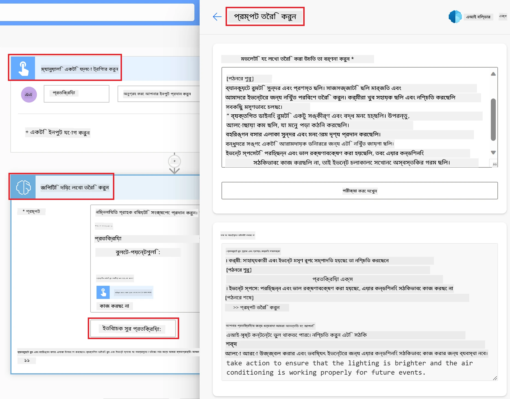

Power Automate-এ এই AI মডেলটি কীভাবে ব্যবহার করবেন তা জানতে, [Add intelligence with AI Builder and GPT](https://learn.microsoft.com/training/modules/ai-builder-text-generation/?WT.mc_id=academic-109639-somelezediko) মডিউলটি দেখে নিন।

## চমৎকার কাজ! আপনার শেখা চালিয়ে যান

এই পাঠ শেষ করার পর, আমাদের [Generative AI Learning collection](https://aka.ms/genai-collection?WT.mc_id=academic-105485-koreyst) দেখুন যাতে আপনি আপনার Generative AI জ্ঞান আরও উন্নত করতে পারেন!

Copilot কাস্টমাইজ করতে এবং আরও বেশি কিছু জানতে চান? [Awesome Copilot](https://github.com/github/awesome-copilot?WT.mc_id=academic-105485-koreyst) দেখুন — এটি একটি সম্প্রদায়-প্রদান করা নির্দেশাবলী, এজেন্ট, দক্ষতা এবং কনফিগারেশনের সংগ্রহ, যা GitHub Copilot এর সর্বোচ্চ সুবিধা নিতে সাহায্য করে।

Lesson 11-এ যান যেখানে আমরা দেখব কিভাবে [Generative AI কে Function Calling-এর সাথে ইন্টিগ্রেট করব](../11-integrating-with-function-calling/README.md?WT.mc_id=academic-105485-koreyst)!

---

<!-- CO-OP TRANSLATOR DISCLAIMER START -->
**অস্বীকৃতি**:
এই নথিটি AI অনুবাদ পরিষেবা [Co-op Translator](https://github.com/Azure/co-op-translator) ব্যবহার করে অনূদিত হয়েছে। যদিও আমরা শুদ্ধতার জন্য চেষ্টা করি, অনুগ্রহ করে মনে রাখবেন যে স্বয়ংক্রিয় অনুবাদে ত্রুটি বা অসঙ্গতি থাকতে পারে। মূল নথিটি তার স্বভাষায় কর্তৃত্বপূর্ণ উৎস হিসেবে বিবেচিত হওয়া উচিত। গুরুত্বপূর্ণ তথ্যের জন্য পেশাদার মানব অনুবাদ সুপারিশ করা হয়। এই অনুবাদের ব্যবহারে প্রয়োজনীয় ভুল বোঝাবুঝি বা ভুল ব্যাখ্যার জন্য আমরা দায়বদ্ধ নই।
<!-- CO-OP TRANSLATOR DISCLAIMER END -->