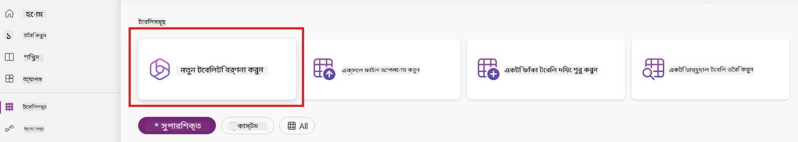
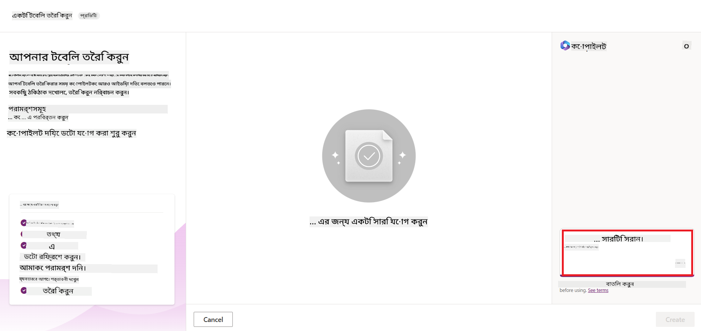
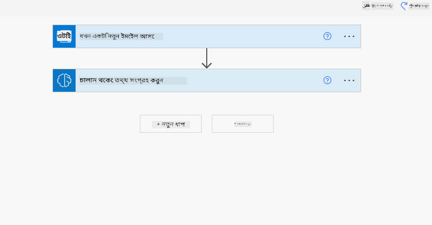

<!--
CO_OP_TRANSLATOR_METADATA:
{
  "original_hash": "f5ff3b6204a695a117d6f452403c95f7",
  "translation_date": "2025-07-09T13:50:07+00:00",
  "source_file": "10-building-low-code-ai-applications/README.md",
  "language_code": "bn"
}
-->
# লো কোড AI অ্যাপ্লিকেশন তৈরি করা

> _(এই লেসনের ভিডিও দেখতে উপরের ছবিতে ক্লিক করুন)_

## পরিচিতি

এখন যেহেতু আমরা ছবি তৈরি করার অ্যাপ্লিকেশন তৈরি করা শিখেছি, চলুন লো কোড সম্পর্কে কথা বলি। জেনারেটিভ AI বিভিন্ন ক্ষেত্রে ব্যবহার করা যেতে পারে, যার মধ্যে লো কোডও রয়েছে, কিন্তু লো কোড কী এবং আমরা কীভাবে এতে AI যোগ করতে পারি?

লো কোড ডেভেলপমেন্ট প্ল্যাটফর্ম ব্যবহার করে প্রচলিত ডেভেলপার এবং নন-ডেভেলপারদের জন্য অ্যাপ এবং সমাধান তৈরি করা সহজ হয়ে উঠেছে। লো কোড ডেভেলপমেন্ট প্ল্যাটফর্ম আপনাকে খুব কম বা কোনো কোড ছাড়াই অ্যাপ এবং সমাধান তৈরি করতে সাহায্য করে। এটি একটি ভিজ্যুয়াল ডেভেলপমেন্ট পরিবেশ প্রদান করে যেখানে আপনি কম্পোনেন্টগুলো ড্র্যাগ ও ড্রপ করে অ্যাপ এবং সমাধান তৈরি করতে পারেন। এর ফলে আপনি দ্রুত এবং কম রিসোর্স ব্যবহার করে অ্যাপ তৈরি করতে পারেন। এই লেসনে আমরা লো কোড কীভাবে ব্যবহার করতে হয় এবং Power Platform ব্যবহার করে AI দিয়ে লো কোড ডেভেলপমেন্ট কীভাবে উন্নত করা যায় তা গভীরভাবে আলোচনা করব।

Power Platform প্রতিষ্ঠানগুলোকে তাদের টিমকে একটি সহজবোধ্য লো-কোড বা নো-কোড পরিবেশের মাধ্যমে নিজস্ব সমাধান তৈরি করার সুযোগ দেয়। এই পরিবেশ সমাধান তৈরির প্রক্রিয়াকে সহজ করে তোলে। Power Platform দিয়ে সমাধানগুলো মাস বা বছর নয়, কয়েকদিন বা সপ্তাহের মধ্যে তৈরি করা যায়। Power Platform-এর পাঁচটি মূল পণ্য হলো: Power Apps, Power Automate, Power BI, Power Pages এবং Copilot Studio।

এই লেসনে আলোচনা করা হবে:

- Power Platform-এ জেনারেটিভ AI-এর পরিচিতি
- Copilot-এর পরিচিতি এবং কীভাবে এটি ব্যবহার করবেন
- Power Platform-এ জেনারেটিভ AI ব্যবহার করে অ্যাপ এবং ফ্লো তৈরি করা
- AI Builder-এর মাধ্যমে Power Platform-এর AI মডেলগুলো বোঝা

## শেখার লক্ষ্য

এই লেসনের শেষে আপনি সক্ষম হবেন:

- Power Platform-এ Copilot কীভাবে কাজ করে তা বুঝতে।

- আমাদের শিক্ষা স্টার্টআপের জন্য একটি Student Assignment Tracker অ্যাপ তৈরি করতে।

- ইনভয়েস থেকে তথ্য আহরণ করতে AI ব্যবহার করে একটি Invoice Processing ফ্লো তৈরি করতে।

- Create Text with GPT AI Model ব্যবহার করার সময় সেরা অনুশীলনগুলো প্রয়োগ করতে।

এই লেসনে আপনি যে টুল এবং প্রযুক্তি ব্যবহার করবেন:

- **Power Apps**, Student Assignment Tracker অ্যাপের জন্য, যা একটি লো-কোড ডেভেলপমেন্ট পরিবেশ প্রদান করে যেখানে আপনি ডেটা ট্র্যাক, ম্যানেজ এবং ইন্টারঅ্যাক্ট করতে পারেন।

- **Dataverse**, Student Assignment Tracker অ্যাপের ডেটা সংরক্ষণের জন্য, যা একটি লো-কোড ডেটা প্ল্যাটফর্ম।

- **Power Automate**, Invoice Processing ফ্লোর জন্য, যেখানে আপনি লো-কোড পরিবেশে ওয়ার্কফ্লো তৈরি করে ইনভয়েস প্রসেসিং অটোমেট করতে পারবেন।

- **AI Builder**, Invoice Processing AI মডেলের জন্য, যেখানে আপনি প্রি-বিল্ট AI মডেল ব্যবহার করে ইনভয়েস প্রসেস করবেন।

## Power Platform-এ জেনারেটিভ AI

জেনারেটিভ AI দিয়ে লো-কোড ডেভেলপমেন্ট এবং অ্যাপ্লিকেশন উন্নত করা Power Platform-এর একটি প্রধান লক্ষ্য। উদ্দেশ্য হলো সবাইকে AI-চালিত অ্যাপ, সাইট, ড্যাশবোর্ড তৈরি এবং AI দিয়ে প্রক্রিয়া অটোমেট করার সুযোগ দেওয়া, _যেখানে ডেটা সায়েন্সের কোনো বিশেষজ্ঞতা প্রয়োজন হয় না_। এই লক্ষ্য পূরণে Power Platform-এ Copilot এবং AI Builder-এর মাধ্যমে জেনারেটিভ AI লো-কোড ডেভেলপমেন্ট অভিজ্ঞতার সঙ্গে একীভূত করা হয়েছে।

### এটা কীভাবে কাজ করে?

Copilot হলো একটি AI সহকারী যা আপনাকে Power Platform সমাধান তৈরি করতে সাহায্য করে, যেখানে আপনি আপনার প্রয়োজনীয়তা স্বাভাবিক ভাষায় কথোপকথনের মাধ্যমে বর্ণনা করবেন। উদাহরণস্বরূপ, আপনি AI সহকারীকে বলতে পারেন আপনার অ্যাপে কোন কোন ফিল্ড থাকবে, তখন এটি অ্যাপ এবং ডেটা মডেল উভয়ই তৈরি করবে, অথবা আপনি Power Automate-এ একটি ফ্লো কীভাবে সেটআপ করবেন তা নির্দিষ্ট করতে পারেন।

আপনি Copilot চালিত ফিচারগুলো আপনার অ্যাপ স্ক্রিনে ব্যবহার করতে পারেন, যাতে ব্যবহারকারীরা কথোপকথনের মাধ্যমে ইনসাইট পেতে পারেন।

AI Builder হলো Power Platform-এ একটি লো-কোড AI ক্ষমতা, যা AI মডেল ব্যবহার করে প্রক্রিয়া অটোমেট এবং ফলাফল পূর্বাভাস দিতে সাহায্য করে। AI Builder দিয়ে আপনি Dataverse বা বিভিন্ন ক্লাউড ডেটা সোর্স যেমন SharePoint, OneDrive বা Azure-এর সাথে সংযুক্ত অ্যাপ এবং ফ্লোতে AI যোগ করতে পারেন।

Copilot Power Platform-এর সব পণ্যে উপলব্ধ: Power Apps, Power Automate, Power BI, Power Pages এবং Power Virtual Agents। AI Builder Power Apps এবং Power Automate-এ উপলব্ধ। এই লেসনে আমরা Power Apps এবং Power Automate-এ Copilot এবং AI Builder কীভাবে ব্যবহার করে আমাদের শিক্ষা স্টার্টআপের জন্য সমাধান তৈরি করা যায় তা দেখব।

### Power Apps-এ Copilot

Power Platform-এর অংশ হিসেবে, Power Apps একটি লো-কোড ডেভেলপমেন্ট পরিবেশ প্রদান করে যেখানে আপনি ডেটা ট্র্যাক, ম্যানেজ এবং ইন্টারঅ্যাক্ট করার জন্য অ্যাপ তৈরি করতে পারেন। এটি একটি অ্যাপ ডেভেলপমেন্ট সার্ভিসের স্যুট, যার মধ্যে রয়েছে স্কেলেবল ডেটা প্ল্যাটফর্ম এবং ক্লাউড সার্ভিস ও অন-প্রিমাইসিস ডেটার সাথে সংযোগের ক্ষমতা। Power Apps দিয়ে আপনি ব্রাউজার, ট্যাবলেট এবং ফোনে চলা অ্যাপ তৈরি করতে পারেন এবং সেগুলো সহকর্মীদের সাথে শেয়ার করতে পারেন। Power Apps ব্যবহারকারীদের জন্য সহজ ইন্টারফেস দিয়ে অ্যাপ ডেভেলপমেন্টে সাহায্য করে, যাতে প্রতিটি ব্যবসায়িক ব্যবহারকারী বা পেশাদার ডেভেলপার নিজস্ব কাস্টম অ্যাপ তৈরি করতে পারে। জেনারেটিভ AI-এর মাধ্যমে Copilot এই অভিজ্ঞতাকে আরও উন্নত করে।

Power Apps-এর Copilot AI সহকারী ফিচার আপনাকে বলতে দেয় আপনি কী ধরনের অ্যাপ চান এবং আপনার অ্যাপ কী তথ্য ট্র্যাক, সংগ্রহ বা প্রদর্শন করবে। এরপর Copilot আপনার বর্ণনার ভিত্তিতে একটি রেসপন্সিভ Canvas অ্যাপ তৈরি করে। আপনি পরে আপনার প্রয়োজন অনুযায়ী অ্যাপটি কাস্টমাইজ করতে পারেন। AI Copilot একটি Dataverse টেবিলও তৈরি করে প্রস্তাব দেয়, যেখানে আপনার ট্র্যাক করা তথ্য সংরক্ষণের জন্য প্রয়োজনীয় ফিল্ড এবং কিছু নমুনা ডেটা থাকে। এই লেসনের পরবর্তী অংশে আমরা Dataverse কী এবং কীভাবে Power Apps-এ এটি ব্যবহার করবেন তা দেখব। আপনি AI Copilot-এর কথোপকথন ভিত্তিক ধাপগুলো ব্যবহার করে টেবিলটি কাস্টমাইজ করতে পারবেন। এই ফিচারটি Power Apps হোম স্ক্রিন থেকে সহজেই পাওয়া যায়।

### Power Automate-এ Copilot

Power Platform-এর অংশ হিসেবে, Power Automate ব্যবহারকারীদের অ্যাপ্লিকেশন এবং সার্ভিসের মধ্যে অটোমেটেড ওয়ার্কফ্লো তৈরি করতে দেয়। এটি যোগাযোগ, ডেটা সংগ্রহ এবং সিদ্ধান্ত অনুমোদনের মতো পুনরাবৃত্তি ব্যবসায়িক প্রক্রিয়া অটোমেট করতে সাহায্য করে। এর সহজ ইন্টারফেস নতুন থেকে অভিজ্ঞ ডেভেলপার পর্যন্ত সবাইকে কাজ অটোমেট করতে সক্ষম করে। জেনারেটিভ AI-এর মাধ্যমে Copilot ওয়ার্কফ্লো ডেভেলপমেন্ট অভিজ্ঞতাকে উন্নত করে।

Power Automate-এর Copilot AI সহকারী ফিচার আপনাকে বলতে দেয় আপনি কী ধরনের ফ্লো চান এবং ফ্লো কী কী কাজ করবে। এরপর Copilot আপনার বর্ণনার ভিত্তিতে একটি ফ্লো তৈরি করে। আপনি পরে আপনার প্রয়োজন অনুযায়ী ফ্লোটি কাস্টমাইজ করতে পারেন। AI Copilot সেই কাজের জন্য প্রয়োজনীয় অ্যাকশনগুলোও তৈরি ও প্রস্তাব দেয়। এই লেসনের পরবর্তী অংশে আমরা ফ্লো কী এবং কীভাবে Power Automate-এ ব্যবহার করবেন তা দেখব। আপনি AI Copilot-এর কথোপকথন ভিত্তিক ধাপগুলো ব্যবহার করে অ্যাকশনগুলো কাস্টমাইজ করতে পারবেন। এই ফিচারটি Power Automate হোম স্ক্রিন থেকে সহজেই পাওয়া যায়।

## অ্যাসাইনমেন্ট: Copilot ব্যবহার করে আমাদের স্টার্টআপের জন্য ছাত্রদের অ্যাসাইনমেন্ট এবং ইনভয়েস ম্যানেজ করা

আমাদের স্টার্টআপ ছাত্রদের জন্য অনলাইন কোর্স প্রদান করে। স্টার্টআপটি দ্রুত বৃদ্ধি পেয়েছে এবং এখন তাদের কোর্সের চাহিদা মেটাতে সমস্যা হচ্ছে। তারা আপনাকে Power Platform ডেভেলপার হিসেবে নিয়োগ দিয়েছে একটি লো কোড সমাধান তৈরি করতে, যা তাদের ছাত্রদের অ্যাসাইনমেন্ট এবং ইনভয়েস ম্যানেজ করতে সাহায্য করবে। তাদের সমাধানটি একটি অ্যাপের মাধ্যমে ছাত্রদের অ্যাসাইনমেন্ট ট্র্যাক এবং ম্যানেজ করতে পারবে এবং একটি ওয়ার্কফ্লোর মাধ্যমে ইনভয়েস প্রসেসিং অটোমেট করতে পারবে। আপনাকে জেনারেটিভ AI ব্যবহার করে এই সমাধান তৈরি করতে বলা হয়েছে।

Copilot ব্যবহার শুরু করার জন্য, আপনি [Power Platform Copilot Prompt Library](https://github.com/pnp/powerplatform-prompts?WT.mc_id=academic-109639-somelezediko) ব্যবহার করতে পারেন। এই লাইব্রেরিতে Copilot দিয়ে অ্যাপ এবং ফ্লো তৈরি করার জন্য বিভিন্ন প্রম্পটের তালিকা রয়েছে। আপনি এই প্রম্পটগুলো দেখে বুঝতে পারবেন কীভাবে আপনার প্রয়োজন Copilot-কে বর্ণনা করবেন।

### আমাদের স্টার্টআপের জন্য Student Assignment Tracker অ্যাপ তৈরি করা

আমাদের স্টার্টআপের শিক্ষকরা ছাত্রদের অ্যাসাইনমেন্ট ট্র্যাক করতে সমস্যায় পড়ছেন। তারা আগে স্প্রেডশীট ব্যবহার করতেন, কিন্তু ছাত্রের সংখ্যা বাড়ার সঙ্গে সেটি ম্যানেজ করা কঠিন হয়ে গেছে। তারা আপনাকে একটি অ্যাপ তৈরি করতে বলেছেন যা তাদের অ্যাসাইনমেন্ট ট্র্যাক এবং ম্যানেজ করতে সাহায্য করবে। অ্যাপটি নতুন অ্যাসাইনমেন্ট যোগ করা, অ্যাসাইনমেন্ট দেখা, আপডেট করা এবং মুছে ফেলার সুবিধা দেবে। এছাড়া শিক্ষক এবং ছাত্ররা গ্রেডকৃত এবং অগ্রেডকৃত অ্যাসাইনমেন্ট দেখতে পারবে।

আপনি নিচের ধাপগুলো অনুসরণ করে Power Apps-এ Copilot ব্যবহার করে অ্যাপটি তৈরি করবেন:

1. [Power Apps](https://make.powerapps.com?WT.mc_id=academic-105485-koreyst) হোম স্ক্রিনে যান।

2. হোম স্ক্রিনের টেক্সট এরিয়ায় আপনার তৈরি করতে চাওয়া অ্যাপটি বর্ণনা করুন। উদাহরণস্বরূপ, **_আমি একটি অ্যাপ তৈরি করতে চাই যা ছাত্রদের অ্যাসাইনমেন্ট ট্র্যাক এবং ম্যানেজ করবে_**। তারপর AI Copilot-কে প্রম্পট পাঠাতে **Send** বাটনে ক্লিক করুন।

3. AI Copilot একটি Dataverse টেবিল প্রস্তাব করবে, যেখানে আপনার ট্র্যাক করা তথ্য সংরক্ষণের জন্য প্রয়োজনীয় ফিল্ড এবং কিছু নমুনা ডেটা থাকবে। আপনি AI Copilot-এর কথোপকথন ভিত্তিক ধাপগুলো ব্যবহার করে টেবিলটি আপনার প্রয়োজন অনুযায়ী কাস্টমাইজ করতে পারবেন।

   > **গুরুত্বপূর্ণ**: Dataverse হলো Power Platform-এর অন্তর্নিহিত ডেটা প্ল্যাটফর্ম। এটি একটি লো-কোড ডেটা প্ল্যাটফর্ম যা অ্যাপের ডেটা সংরক্ষণ করে। এটি একটি সম্পূর্ণ ব্যবস্থাপিত সার্ভিস যা Microsoft Cloud-এ নিরাপদে ডেটা সংরক্ষণ করে এবং আপনার Power Platform পরিবেশের মধ্যে প্রোভিশন করা হয়। এতে ডেটা শ্রেণীবিভাগ, ডেটা লিনিয়েজ, সূক্ষ্ম-গ্রেড অ্যাক্সেস নিয়ন্ত্রণ এবং আরও অনেক ডেটা গভর্নেন্স ক্ষমতা অন্তর্ভুক্ত রয়েছে। Dataverse সম্পর্কে আরও জানতে পারেন [এখানে](https://docs.microsoft.com/powerapps/maker/data-platform/data-platform-intro?WT.mc_id=academic-109639-somelezediko)।

   

4. শিক্ষকরা ছাত্রদের যারা অ্যাসাইনমেন্ট জমা দিয়েছে তাদের ইমেইল পাঠাতে চান যাতে তারা তাদের অ্যাসাইনমেন্টের অগ্রগতি সম্পর্কে আপডেট থাকতে পারে। আপনি Copilot ব্যবহার করে টেবিলে একটি নতুন ফিল্ড যোগ করতে পারেন ছাত্রদের ইমেইল সংরক্ষণের জন্য। উদাহরণস্বরূপ, আপনি নিচের প্রম্পট ব্যবহার করতে পারেন: **_আমি ছাত্রদের ইমেইল সংরক্ষণের জন্য একটি কলাম যোগ করতে চাই_**। তারপর AI Copilot-কে প্রম্পট পাঠাতে **Send** বাটনে ক্লিক করুন।

5. AI Copilot একটি নতুন ফিল্ড তৈরি করবে এবং আপনি সেটি আপনার প্রয়োজন অনুযায়ী কাস্টমাইজ করতে পারবেন।

6. টেবিল সম্পন্ন হলে, অ্যাপ তৈরি করতে **Create app** বাটনে ক্লিক করুন।

7. AI Copilot আপনার বর্ণনার ভিত্তিতে একটি রেসপন্সিভ Canvas অ্যাপ তৈরি করবে। আপনি পরে আপনার প্রয়োজন অনুযায়ী অ্যাপটি কাস্টমাইজ করতে পারবেন।

8. শিক্ষকরা ছাত্রদের ইমেইল পাঠানোর জন্য অ্যাপে একটি নতুন স্ক্রিন যোগ করতে Copilot ব্যবহার করতে পারেন। উদাহরণস্বরূপ, আপনি নিচের প্রম্পট ব্যবহার করতে পারেন: **_আমি ছাত্রদের ইমেইল পাঠানোর জন্য একটি স্ক্রিন যোগ করতে চাই_**। তারপর AI Copilot-কে প্রম্পট পাঠাতে **Send** বাটনে ক্লিক করুন।

9. AI Copilot একটি নতুন স্ক্রিন তৈরি করবে এবং আপনি সেটি আপনার প্রয়োজন অনুযায়ী কাস্টমাইজ করতে পারবেন।

10. অ্যাপ সম্পন্ন হলে, **Save** বাটনে ক্লিক করে অ্যাপটি সংরক্ষণ করুন।

11. শিক্ষকেদের সাথে অ্যাপ শেয়ার করতে, **Share** বাটনে ক্লিক করুন এবং পুনরায় **Share** বাটনে ক্লিক করুন। এরপর তাদের ইমেইল ঠিকানা দিয়ে অ্যাপ শেয়ার করুন।

> **আপনার হোমওয়ার্ক**: আপনি যে অ্যাপটি তৈরি করেছেন তা একটি ভালো শুরু, কিন্তু উন্নত করা যেতে পারে। ইমেইল ফিচার দিয়ে শিক্ষকরা শুধুমাত্র ম্যানুয়ালি ছাত্রদের ইমেইল টাইপ করে ইমেইল পাঠাতে পারেন। আপনি কি Copilot ব্যবহার করে এমন একটি অটোমেশন তৈরি করতে পারেন যা ছাত্ররা অ্যাসাইনমেন্ট জমা দিলে স্বয়ংক্রিয়ভাবে শিক্ষকরা ইমেইল পাঠাতে পারবেন? আপনার হিন্ট হলো সঠিক প্রম্পট ব্যবহার করে আপনি Power Automate-এ Copilot ব্যবহার করে এটি তৈরি করতে পারেন।

### আমাদের স্টার্টআপের জন্য ইনভয়েস তথ্যের টেবিল তৈরি করা

আমাদের স্টার্টআপের ফাইন্যান্স টিম ইনভয়েস ট্র্যাক করতে সমস্যায় পড়ছে। তারা আগে স্প্রেডশীট ব্যবহার করতেন, কিন্তু ইনভয়েসের সংখ্যা বাড়ার সঙ্গে সেটি ম্যানেজ করা কঠিন হয়ে গেছে। তারা আপনাকে একটি টেবিল তৈরি করতে বলেছেন যা তাদের ইনভয়েসের তথ্য সংরক্ষণ, ট্র্যাক এবং ম্যানেজ করতে সাহায্য করবে। টেবিলটি এমন একটি অটোমেশন তৈরির জন্য ব্যবহার করা হবে যা ইনভয়েসের সব তথ্য আহরণ করে টেবিলে সংরক্ষণ করবে। টেবিলটি ফাইন্যান্স টিমকে প্রদর্শন করবে কোন ইনভয়েস পরিশোধিত হয়েছে এবং কোনগুলো হয়নি।

Power Platform-এর অন্তর্নিহিত ডেটা প্ল্যাটফর্ম Dataverse আপনাকে আপনার অ্যাপ এবং সমাধানের জন্য ডেটা সংরক্ষণ করতে দেয়। Dataverse একটি লো-কোড ডেটা প্ল্যাটফর্ম যা অ্যাপের ডেটা সংরক্ষণ করে। এটি একটি সম্পূর্ণ ব্যবস্থাপিত সার্ভিস যা Microsoft Cloud-এ নিরাপদে ডেটা সংরক্ষণ করে এবং আপনার Power Platform পরিবেশের মধ্যে প্রোভিশন করা হয়। এতে ডেটা শ্রেণীবিভাগ, ডেটা লিনিয়েজ, সূক্ষ্ম-গ্রেড অ্যাক্সেস নিয়ন্ত্রণ এবং আরও অনেক ডেটা গভর্নেন্স ক্ষমতা অন্তর্ভুক্ত রয়েছে। Dataverse সম্পর্কে আরও জানতে পারেন [এখানে](https://docs.microsoft.com/powerapps/maker/data-platform/data-platform-intro?WT.mc_id=academic-109639-somelezediko)।

আমাদের স্টার্টআপের জন্য Dataverse কেন ব্যবহার করা উচিত? Dataverse-এর স্ট্যান্ডার্ড এবং কাস্টম টেবিলগুলো আপনার ডেটার জন্য একটি নিরাপদ এবং ক্লাউড-ভিত্তিক স্টোরেজ অপশন প্রদান করে। টেবিলগুলো আপনাকে বিভিন্ন ধরনের ডেটা সংরক্ষণ করতে দেয়, যেমন আপনি একক Excel ওয়ার্কবুকে একাধিক ওয়ার্কশীট ব্যবহার করেন। আপনি টেবিলগুলো ব্যবহার করে আপনার প্রতিষ্ঠান বা ব্যবসার প্রয়োজনীয় ডেটা সংরক্ষণ করতে পারেন। Dataverse ব্যবহারের কিছু সুবিধা আমাদের স্টার্টআপ পাবে, যার মধ্যে রয়েছে কিন্তু সীমাবদ্ধ নয়:
- **সহজে পরিচালনা করা যায়**: মেটাডেটা এবং ডেটা উভয়ই ক্লাউডে সংরক্ষিত থাকে, তাই কীভাবে সেগুলো সংরক্ষণ বা পরিচালনা করা হয় তা নিয়ে চিন্তা করতে হয় না। আপনি আপনার অ্যাপ এবং সমাধান তৈরি করার দিকে মনোযোগ দিতে পারেন।

- **নিরাপদ**: Dataverse আপনার ডেটার জন্য একটি নিরাপদ এবং ক্লাউড-ভিত্তিক স্টোরেজ অপশন প্রদান করে। আপনি নিয়ন্ত্রণ করতে পারেন কে আপনার টেবিলের ডেটায় অ্যাক্সেস পাবে এবং তারা কীভাবে রোল ভিত্তিক নিরাপত্তা ব্যবহার করে অ্যাক্সেস করতে পারবে।

- **সমৃদ্ধ মেটাডেটা**: ডেটা টাইপ এবং সম্পর্ক সরাসরি Power Apps এর মধ্যে ব্যবহৃত হয়।

- **লজিক এবং যাচাই**: আপনি ব্যবসায়িক নিয়ম, হিসাব করা ক্ষেত্র এবং যাচাই নিয়ম ব্যবহার করে ব্যবসায়িক লজিক প্রয়োগ করতে এবং ডেটার সঠিকতা বজায় রাখতে পারেন।

এখন যেহেতু আপনি জানেন Dataverse কী এবং কেন এটি ব্যবহার করবেন, চলুন দেখি কিভাবে Copilot ব্যবহার করে Dataverse-এ একটি টেবিল তৈরি করা যায় যা আমাদের ফাইন্যান্স দলের চাহিদা পূরণ করবে।

> **Note** : আপনি পরবর্তী অংশে এই টেবিলটি ব্যবহার করবেন একটি অটোমেশন তৈরি করতে যা সমস্ত ইনভয়েস তথ্য বের করে টেবিলে সংরক্ষণ করবে।

Copilot ব্যবহার করে Dataverse-এ একটি টেবিল তৈরি করতে নিচের ধাপগুলো অনুসরণ করুন:

1. [Power Apps](https://make.powerapps.com?WT.mc_id=academic-105485-koreyst) হোম স্ক্রীনে যান।

2. বাম দিকের নেভিগেশন বারে **Tables** নির্বাচন করুন এবং তারপর **Describe the new Table** ক্লিক করুন।

3. **Describe the new Table** স্ক্রীনে, টেক্সট এরিয়া ব্যবহার করে আপনি যে টেবিলটি তৈরি করতে চান তা বর্ণনা করুন। উদাহরণস্বরূপ, **_আমি একটি টেবিল তৈরি করতে চাই যেখানে ইনভয়েস তথ্য সংরক্ষণ করা হবে_**। AI Copilot-কে প্রম্পট পাঠাতে **Send** বোতামে ক্লিক করুন।

4. AI Copilot একটি Dataverse টেবিল প্রস্তাব করবে যেখানে আপনার ট্র্যাক করতে চাওয়া ডেটা সংরক্ষণের জন্য প্রয়োজনীয় ক্ষেত্র এবং কিছু নমুনা ডেটা থাকবে। এরপর আপনি AI Copilot সহকারী ফিচারের মাধ্যমে কথোপকথনের ধাপগুলো অনুসরণ করে টেবিলটি আপনার প্রয়োজন অনুযায়ী কাস্টমাইজ করতে পারবেন।

5. ফাইন্যান্স দল সরবরাহকারীকে তাদের ইনভয়েসের বর্তমান অবস্থা জানাতে একটি ইমেইল পাঠাতে চায়। আপনি Copilot ব্যবহার করে টেবিলে একটি নতুন ফিল্ড যোগ করতে পারেন সরবরাহকারীর ইমেইল সংরক্ষণের জন্য। উদাহরণস্বরূপ, আপনি নিম্নলিখিত প্রম্পট ব্যবহার করতে পারেন: **_আমি একটি কলাম যোগ করতে চাই সরবরাহকারীর ইমেইল সংরক্ষণের জন্য_**। AI Copilot-কে প্রম্পট পাঠাতে **Send** বোতামে ক্লিক করুন।

6. AI Copilot একটি নতুন ফিল্ড তৈরি করবে এবং আপনি সেটি আপনার প্রয়োজন অনুযায়ী কাস্টমাইজ করতে পারবেন।

7. টেবিল সম্পন্ন হলে, **Create** বোতামে ক্লিক করে টেবিল তৈরি করুন।

## Power Platform-এ AI মডেলসমূহ AI Builder-এর মাধ্যমে

AI Builder হলো Power Platform-এ একটি লো-কোড AI ক্ষমতা যা আপনাকে AI মডেল ব্যবহার করে প্রক্রিয়া স্বয়ংক্রিয়করণ এবং ফলাফল পূর্বাভাসে সাহায্য করে। AI Builder-এর মাধ্যমে আপনি Dataverse বা বিভিন্ন ক্লাউড ডেটা সোর্স যেমন SharePoint, OneDrive বা Azure-তে সংযুক্ত আপনার ডেটার সাথে অ্যাপ এবং ফ্লোতে AI সংযোজন করতে পারেন।

## Prebuilt AI Models বনাম Custom AI Models

AI Builder দুই ধরনের AI মডেল প্রদান করে: Prebuilt AI Models এবং Custom AI Models। Prebuilt AI Models হলো Microsoft দ্বারা প্রশিক্ষিত এবং Power Platform-এ ব্যবহারযোগ্য প্রস্তুত মডেল। এগুলো আপনাকে ডেটা সংগ্রহ, মডেল তৈরি, প্রশিক্ষণ এবং প্রকাশ না করেই আপনার অ্যাপ এবং ফ্লোতে বুদ্ধিমত্তা যোগ করতে সাহায্য করে। আপনি এগুলো ব্যবহার করে প্রক্রিয়া স্বয়ংক্রিয়করণ এবং ফলাফল পূর্বাভাস করতে পারেন।

Power Platform-এ পাওয়া কিছু Prebuilt AI Models হলো:

- **Key Phrase Extraction**: টেক্সট থেকে মূল বাক্যাংশ বের করে।
- **Language Detection**: টেক্সটের ভাষা সনাক্ত করে।
- **Sentiment Analysis**: টেক্সটে ইতিবাচক, নেতিবাচক, নিরপেক্ষ বা মিশ্র অনুভূতি সনাক্ত করে।
- **Business Card Reader**: বিজনেস কার্ড থেকে তথ্য বের করে।
- **Text Recognition**: ছবির থেকে টেক্সট বের করে।
- **Object Detection**: ছবির থেকে বস্তু সনাক্ত ও বের করে।
- **Document processing**: ফর্ম থেকে তথ্য বের করে।
- **Invoice Processing**: ইনভয়েস থেকে তথ্য বের করে।

Custom AI Models দিয়ে আপনি আপনার নিজস্ব মডেল AI Builder-এ নিয়ে আসতে পারেন যাতে এটি AI Builder কাস্টম মডেলের মতো কাজ করে এবং আপনি আপনার নিজস্ব ডেটা ব্যবহার করে মডেল প্রশিক্ষণ দিতে পারেন। আপনি এই মডেলগুলো Power Apps এবং Power Automate-এ প্রক্রিয়া স্বয়ংক্রিয়করণ এবং ফলাফল পূর্বাভাসে ব্যবহার করতে পারেন। নিজের মডেল ব্যবহারে কিছু সীমাবদ্ধতা প্রযোজ্য। বিস্তারিত জানতে পড়ুন [limitations](https://learn.microsoft.com/ai-builder/byo-model#limitations?WT.mc_id=academic-105485-koreyst)।

## অ্যাসাইনমেন্ট #2 - আমাদের স্টার্টআপের জন্য ইনভয়েস প্রসেসিং ফ্লো তৈরি করুন

ফাইন্যান্স দল ইনভয়েস প্রসেস করতে সমস্যায় পড়েছে। তারা ইনভয়েস ট্র্যাক করতে একটি স্প্রেডশীট ব্যবহার করছিল, কিন্তু ইনভয়েসের সংখ্যা বাড়ার সাথে এটি পরিচালনা করা কঠিন হয়ে পড়েছে। তারা আপনাকে একটি ওয়ার্কফ্লো তৈরি করতে বলেছে যা AI ব্যবহার করে ইনভয়েস প্রসেস করতে সাহায্য করবে। ওয়ার্কফ্লোটি ইনভয়েস থেকে তথ্য বের করে Dataverse টেবিলে সংরক্ষণ করবে এবং ফাইন্যান্স টিমকে ইমেইল পাঠানোর সুবিধাও দেবে।

এখন যেহেতু আপনি জানেন AI Builder কী এবং কেন এটি ব্যবহার করবেন, চলুন দেখি কিভাবে AI Builder-এর Invoice Processing AI Model ব্যবহার করে একটি ওয়ার্কফ্লো তৈরি করা যায় যা ফাইন্যান্স টিমকে ইনভয়েস প্রসেস করতে সাহায্য করবে।

AI Builder-এর Invoice Processing AI Model ব্যবহার করে ফাইন্যান্স টিমের জন্য ইনভয়েস প্রসেসিং ওয়ার্কফ্লো তৈরি করতে নিচের ধাপগুলো অনুসরণ করুন:

1. [Power Automate](https://make.powerautomate.com?WT.mc_id=academic-105485-koreyst) হোম স্ক্রীনে যান।

2. হোম স্ক্রীনের টেক্সট এরিয়া ব্যবহার করে আপনি যে ওয়ার্কফ্লো তৈরি করতে চান তা বর্ণনা করুন। উদাহরণস্বরূপ, **_আমার মেইলবক্সে ইনভয়েস এলে সেটি প্রসেস কর_**। AI Copilot-কে প্রম্পট পাঠাতে **Send** বোতামে ক্লিক করুন।

   

3. AI Copilot আপনার কাজটি স্বয়ংক্রিয় করতে প্রয়োজনীয় অ্যাকশনগুলো প্রস্তাব করবে। পরবর্তী ধাপগুলো দেখতে **Next** বোতামে ক্লিক করুন।

4. পরবর্তী ধাপে, Power Automate ফ্লোর জন্য প্রয়োজনীয় সংযোগ সেটআপ করতে বলবে। কাজ শেষ হলে, **Create flow** বোতামে ক্লিক করে ফ্লো তৈরি করুন।

5. AI Copilot একটি ফ্লো তৈরি করবে এবং আপনি সেটি আপনার প্রয়োজন অনুযায়ী কাস্টমাইজ করতে পারবেন।

6. ফ্লোর ট্রিগার আপডেট করুন এবং **Folder** সেট করুন যেখানে ইনভয়েস সংরক্ষণ করা হবে। উদাহরণস্বরূপ, **Inbox**। **Show advanced options** ক্লিক করে **Only with Attachments** সেট করুন **Yes**। এতে ফ্লোটি শুধুমাত্র তখনই চলবে যখন ঐ ফোল্ডারে অ্যাটাচমেন্টসহ ইমেইল আসবে।

7. ফ্লো থেকে নিম্নলিখিত অ্যাকশনগুলো সরিয়ে ফেলুন: **HTML to text**, **Compose**, **Compose 2**, **Compose 3** এবং **Compose 4** কারণ এগুলো ব্যবহার করবেন না।

8. ফ্লো থেকে **Condition** অ্যাকশনও সরিয়ে ফেলুন কারণ এটি ব্যবহার করবেন না। এটি নিচের স্ক্রিনশটের মতো দেখাবে:

   

9. **Add an action** বোতামে ক্লিক করুন এবং **Dataverse** সার্চ করুন। **Add a new row** অ্যাকশন নির্বাচন করুন।

10. **Extract Information from invoices** অ্যাকশনে, **Invoice File** আপডেট করে ইমেইলের **Attachment Content** পয়েন্ট করুন। এতে ফ্লো ইনভয়েস অ্যাটাচমেন্ট থেকে তথ্য বের করবে।

11. পূর্বে তৈরি করা **Table** নির্বাচন করুন। উদাহরণস্বরূপ, **Invoice Information** টেবিল। পূর্ববর্তী অ্যাকশন থেকে ডায়নামিক কন্টেন্ট ব্যবহার করে নিচের ফিল্ডগুলো পূরণ করুন:

    - ID  
    - Amount  
    - Date  
    - Name  
    - Status - **Status** সেট করুন **Pending**।  
    - Supplier Email - **When a new email arrives** ট্রিগার থেকে **From** ডায়নামিক কন্টেন্ট ব্যবহার করুন।

    

12. ফ্লো সম্পন্ন হলে, **Save** বোতামে ক্লিক করে ফ্লো সংরক্ষণ করুন। এরপর নির্দিষ্ট ফোল্ডারে ইনভয়েসসহ একটি ইমেইল পাঠিয়ে ফ্লোটি পরীক্ষা করতে পারেন।

> **আপনার হোমওয়ার্ক**: আপনি যে ফ্লোটি তৈরি করেছেন তা একটি ভালো শুরু, এখন ভাবুন কিভাবে একটি অটোমেশন তৈরি করবেন যা আমাদের ফাইন্যান্স টিমকে সরবরাহকারীকে তাদের ইনভয়েসের বর্তমান অবস্থা জানাতে ইমেইল পাঠাতে সাহায্য করবে। আপনার হিন্ট: ফ্লোটি তখনই চলতে হবে যখন ইনভয়েসের স্ট্যাটাস পরিবর্তিত হয়।

## Power Automate-এ Text Generation AI Model ব্যবহার করুন

AI Builder-এর Create Text with GPT AI Model আপনাকে একটি প্রম্পটের ভিত্তিতে টেক্সট তৈরি করতে সাহায্য করে এবং এটি Microsoft Azure OpenAI Service দ্বারা চালিত। এই ক্ষমতার মাধ্যমে আপনি GPT (Generative Pre-Trained Transformer) প্রযুক্তি আপনার অ্যাপ এবং ফ্লোতে সংযোজন করতে পারেন, যা বিভিন্ন স্বয়ংক্রিয় ফ্লো এবং বুদ্ধিমান অ্যাপ্লিকেশন তৈরি করতে সাহায্য করে।

GPT মডেল ব্যাপক ডেটা দিয়ে প্রশিক্ষিত হয়, যার ফলে এটি প্রম্পট পেলে মানুষের ভাষার মতো টেক্সট তৈরি করতে সক্ষম। ওয়ার্কফ্লো অটোমেশনের সাথে সংযুক্ত হলে, GPT-এর মতো AI মডেল বিভিন্ন কাজ সহজ ও স্বয়ংক্রিয় করতে ব্যবহৃত হয়।

উদাহরণস্বরূপ, আপনি ইমেইলের খসড়া, পণ্যের বর্ণনা ইত্যাদি স্বয়ংক্রিয়ভাবে তৈরি করার জন্য ফ্লো তৈরি করতে পারেন। এছাড়াও, আপনি এই মডেল ব্যবহার করে চ্যাটবট এবং কাস্টমার সার্ভিস অ্যাপ তৈরি করতে পারেন যা গ্রাহক সেবাকর্মীদের দ্রুত এবং কার্যকরভাবে গ্রাহকের প্রশ্নের উত্তর দিতে সাহায্য করে।

Power Automate-এ এই AI মডেল কীভাবে ব্যবহার করবেন জানতে [Add intelligence with AI Builder and GPT](https://learn.microsoft.com/training/modules/ai-builder-text-generation/?WT.mc_id=academic-109639-somelezediko) মডিউলটি দেখুন।

## দুর্দান্ত কাজ! আপনার শেখা চালিয়ে যান

এই পাঠ শেষ করার পর, আমাদের [Generative AI Learning collection](https://aka.ms/genai-collection?WT.mc_id=academic-105485-koreyst) দেখুন এবং আপনার Generative AI জ্ঞান আরও উন্নত করুন!

পরবর্তী লেসন ১১-এ যান যেখানে আমরা দেখব কিভাবে [Generative AI Function Calling-এর সাথে ইন্টিগ্রেট করা যায়](../11-integrating-with-function-calling/README.md?WT.mc_id=academic-105485-koreyst)!

**অস্বীকৃতি**:  
এই নথিটি AI অনুবাদ সেবা [Co-op Translator](https://github.com/Azure/co-op-translator) ব্যবহার করে অনূদিত হয়েছে। আমরা যথাসাধ্য সঠিকতার চেষ্টা করি, তবে স্বয়ংক্রিয় অনুবাদে ত্রুটি বা অসঙ্গতি থাকতে পারে। মূল নথিটি তার নিজস্ব ভাষায়ই কর্তৃত্বপূর্ণ উৎস হিসেবে বিবেচিত হওয়া উচিত। গুরুত্বপূর্ণ তথ্যের জন্য পেশাদার মানব অনুবাদ গ্রহণ করার পরামর্শ দেওয়া হয়। এই অনুবাদের ব্যবহারে সৃষ্ট কোনো ভুল বোঝাবুঝি বা ভুল ব্যাখ্যার জন্য আমরা দায়ী নই।