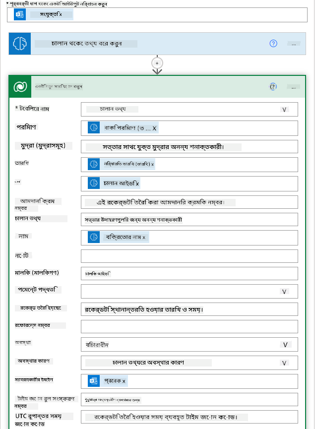
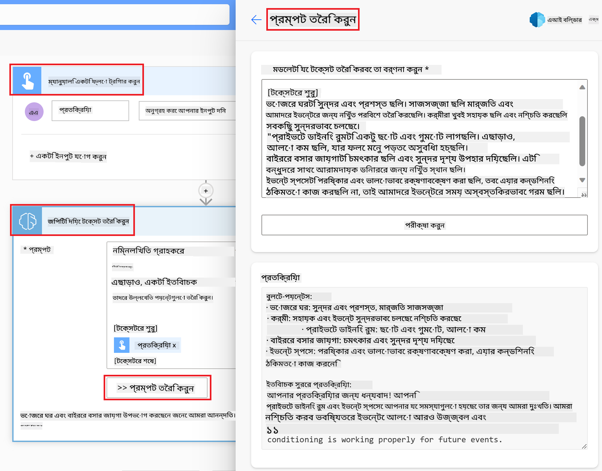

<!--
CO_OP_TRANSLATOR_METADATA:
{
  "original_hash": "846ac8e3b7dcfb697d3309fec05f0fea",
  "translation_date": "2025-10-17T14:54:30+00:00",
  "source_file": "10-building-low-code-ai-applications/README.md",
  "language_code": "bn"
}
-->
# লো কোড AI অ্যাপ্লিকেশন তৈরি করা

> _(উপরের ছবিতে ক্লিক করে এই পাঠের ভিডিও দেখুন)_

## পরিচিতি

এখন আমরা ইমেজ জেনারেটিং অ্যাপ্লিকেশন তৈরি করা শিখেছি, এবার লো কোড নিয়ে কথা বলি। জেনারেটিভ AI বিভিন্ন ক্ষেত্রে ব্যবহার করা যেতে পারে, যার মধ্যে লো কোডও রয়েছে। কিন্তু লো কোড কী এবং আমরা কীভাবে এতে AI যোগ করতে পারি?

লো কোড ডেভেলপমেন্ট প্ল্যাটফর্ম ব্যবহার করে ঐতিহ্যবাহী ডেভেলপার এবং নন-ডেভেলপারদের জন্য অ্যাপ এবং সমাধান তৈরি করা সহজ হয়ে গেছে। লো কোড ডেভেলপমেন্ট প্ল্যাটফর্ম আপনাকে খুব কম বা কোনো কোড ছাড়াই অ্যাপ এবং সমাধান তৈরি করতে সক্ষম করে। এটি একটি ভিজ্যুয়াল ডেভেলপমেন্ট পরিবেশ প্রদান করে যেখানে আপনি কম্পোনেন্টগুলো ড্র্যাগ এবং ড্রপ করে অ্যাপ এবং সমাধান তৈরি করতে পারেন। এটি আপনাকে দ্রুত এবং কম সম্পদ দিয়ে অ্যাপ এবং সমাধান তৈরি করতে সক্ষম করে। এই পাঠে, আমরা লো কোড ব্যবহার করার পদ্ধতি এবং AI ব্যবহার করে লো কোড ডেভেলপমেন্টকে কীভাবে উন্নত করা যায় তা গভীরভাবে আলোচনা করব।

পাওয়ার প্ল্যাটফর্ম প্রতিষ্ঠানগুলোকে তাদের টিমকে একটি সহজ লো-কোড বা নো-কোড পরিবেশের মাধ্যমে নিজেদের সমাধান তৈরি করতে সক্ষম করে। এই পরিবেশ সমাধান তৈরির প্রক্রিয়াকে সহজ করে তোলে। পাওয়ার প্ল্যাটফর্ম ব্যবহার করে সমাধান মাস বা বছর নয়, বরং দিন বা সপ্তাহের মধ্যে তৈরি করা যায়। পাওয়ার প্ল্যাটফর্ম পাঁচটি মূল পণ্য নিয়ে গঠিত: পাওয়ার অ্যাপস, পাওয়ার অটোমেট, পাওয়ার BI, পাওয়ার পেজেস এবং কোপাইলট স্টুডিও।

এই পাঠে আলোচনা করা হবে:

- পাওয়ার প্ল্যাটফর্মে জেনারেটিভ AI এর পরিচিতি
- কোপাইলটের পরিচিতি এবং এটি কীভাবে ব্যবহার করবেন
- পাওয়ার প্ল্যাটফর্মে জেনারেটিভ AI ব্যবহার করে অ্যাপ এবং ফ্লো তৈরি করা
- AI বিল্ডারের মাধ্যমে পাওয়ার প্ল্যাটফর্মে AI মডেলগুলো বোঝা

## শেখার লক্ষ্য

এই পাঠ শেষে, আপনি সক্ষম হবেন:

- পাওয়ার প্ল্যাটফর্মে কোপাইলট কীভাবে কাজ করে তা বুঝতে।

- আমাদের শিক্ষা স্টার্টআপের জন্য একটি স্টুডেন্ট অ্যাসাইনমেন্ট ট্র্যাকার অ্যাপ তৈরি করতে।

- একটি ইনভয়েস প্রসেসিং ফ্লো তৈরি করতে যা AI ব্যবহার করে ইনভয়েস থেকে তথ্য বের করে।

- GPT AI মডেল দিয়ে টেক্সট তৈরি করার সময় সেরা পদ্ধতি প্রয়োগ করতে।

এই পাঠে আপনি যে টুল এবং প্রযুক্তি ব্যবহার করবেন:

- **পাওয়ার অ্যাপস**, স্টুডেন্ট অ্যাসাইনমেন্ট ট্র্যাকার অ্যাপের জন্য, যা একটি লো-কোড ডেভেলপমেন্ট পরিবেশ প্রদান করে অ্যাপ তৈরি করতে যা ডেটা ট্র্যাক, ম্যানেজ এবং ইন্টারঅ্যাক্ট করে।

- **ডাটাভার্স**, স্টুডেন্ট অ্যাসাইনমেন্ট ট্র্যাকার অ্যাপের ডেটা সংরক্ষণের জন্য যেখানে ডাটাভার্স একটি লো-কোড ডেটা প্ল্যাটফর্ম প্রদান করবে।

- **পাওয়ার অটোমেট**, ইনভয়েস প্রসেসিং ফ্লো এর জন্য যেখানে আপনি ইনভয়েস প্রসেসিং প্রক্রিয়া অটোমেট করতে লো-কোড ডেভেলপমেন্ট পরিবেশ পাবেন।

- **AI বিল্ডার**, ইনভয়েস প্রসেসিং AI মডেলের জন্য যেখানে আপনি আমাদের স্টার্টআপের ইনভয়েস প্রসেস করতে প্রিবিল্ট AI মডেল ব্যবহার করবেন।

## পাওয়ার প্ল্যাটফর্মে জেনারেটিভ AI

লো-কোড ডেভেলপমেন্ট এবং অ্যাপ্লিকেশনকে জেনারেটিভ AI দিয়ে উন্নত করা পাওয়ার প্ল্যাটফর্মের একটি গুরুত্বপূর্ণ লক্ষ্য। লক্ষ্য হলো সবাইকে AI-চালিত অ্যাপ, সাইট, ড্যাশবোর্ড তৈরি এবং AI দিয়ে প্রক্রিয়া অটোমেট করতে সক্ষম করা, _ডেটা সায়েন্সের কোনো বিশেষজ্ঞতা ছাড়াই_। এই লক্ষ্য অর্জন করা হয় পাওয়ার প্ল্যাটফর্মে লো-কোড ডেভেলপমেন্ট অভিজ্ঞতায় জেনারেটিভ AI কে কোপাইলট এবং AI বিল্ডারের আকারে সংযুক্ত করে।

### এটি কীভাবে কাজ করে?

কোপাইলট হলো একটি AI সহকারী যা আপনাকে পাওয়ার প্ল্যাটফর্ম সমাধান তৈরি করতে সক্ষম করে আপনার প্রয়োজনীয়তা প্রাকৃতিক ভাষায় বর্ণনা করে। উদাহরণস্বরূপ, আপনি আপনার AI সহকারীকে নির্দেশ দিতে পারেন আপনার অ্যাপ কোন ফিল্ডগুলো ব্যবহার করবে এবং এটি আপনার বর্ণনা অনুযায়ী অ্যাপ এবং অন্তর্নিহিত ডেটা মডেল তৈরি করবে অথবা আপনি কীভাবে পাওয়ার অটোমেটে একটি ফ্লো সেট আপ করবেন তা নির্দিষ্ট করতে পারেন।

আপনার অ্যাপ স্ক্রিনে কোপাইলট চালিত ফিচারগুলো ব্যবহার করে ব্যবহারকারীদের কথোপকথনের মাধ্যমে ইনসাইট খুঁজে বের করতে সক্ষম করতে পারেন।

AI বিল্ডার হলো পাওয়ার প্ল্যাটফর্মে উপলব্ধ একটি লো-কোড AI সক্ষমতা যা আপনাকে AI মডেল ব্যবহার করে প্রক্রিয়া অটোমেট করতে এবং ফলাফল পূর্বাভাস দিতে সাহায্য করে। AI বিল্ডার দিয়ে আপনি আপনার অ্যাপ এবং ফ্লোতে AI নিয়ে আসতে পারেন যা ডাটাভার্স বা SharePoint, OneDrive বা Azure এর মতো বিভিন্ন ক্লাউড ডেটা সোর্সের সাথে সংযুক্ত হয়।

কোপাইলট পাওয়ার প্ল্যাটফর্মের সব পণ্যেই উপলব্ধ: পাওয়ার অ্যাপস, পাওয়ার অটোমেট, পাওয়ার BI, পাওয়ার পেজেস এবং পাওয়ার ভার্চুয়াল এজেন্টস। AI বিল্ডার পাওয়ার অ্যাপস এবং পাওয়ার অটোমেটে উপলব্ধ। এই পাঠে, আমরা আমাদের শিক্ষা স্টার্টআপের জন্য একটি সমাধান তৈরি করতে পাওয়ার অ্যাপস এবং পাওয়ার অটোমেটে কোপাইলট এবং AI বিল্ডার কীভাবে ব্যবহার করবেন তা নিয়ে আলোচনা করব।

### পাওয়ার অ্যাপসে কোপাইলট

পাওয়ার প্ল্যাটফর্মের অংশ হিসেবে, পাওয়ার অ্যাপস একটি লো-কোড ডেভেলপমেন্ট পরিবেশ প্রদান করে অ্যাপ তৈরি করতে যা ডেটা ট্র্যাক, ম্যানেজ এবং ইন্টারঅ্যাক্ট করে। এটি একটি অ্যাপ ডেভেলপমেন্ট সার্ভিসের সুইট যা একটি স্কেলেবল ডেটা প্ল্যাটফর্ম এবং ক্লাউড সার্ভিস এবং অন-প্রিমাইস ডেটার সাথে সংযোগ করার ক্ষমতা প্রদান করে। পাওয়ার অ্যাপস আপনাকে এমন অ্যাপ তৈরি করতে দেয় যা ব্রাউজার, ট্যাবলেট এবং ফোনে চলে এবং সহকর্মীদের সাথে শেয়ার করা যায়। পাওয়ার অ্যাপস একটি সহজ ইন্টারফেস দিয়ে ব্যবহারকারীদের অ্যাপ ডেভেলপমেন্টে সহায়তা করে, যাতে প্রতিটি ব্যবসায়িক ব্যবহারকারী বা প্রো ডেভেলপার কাস্টম অ্যাপ তৈরি করতে পারে। জেনারেটিভ AI এর মাধ্যমে কোপাইলট পাওয়ার অ্যাপসের অ্যাপ ডেভেলপমেন্ট অভিজ্ঞতাকে আরও উন্নত করে।

পাওয়ার অ্যাপসে কোপাইলট AI সহকারী ফিচার আপনাকে বর্ণনা করতে সক্ষম করে আপনি কী ধরনের অ্যাপ চান এবং আপনার অ্যাপ কী তথ্য ট্র্যাক, সংগ্রহ বা প্রদর্শন করবে। কোপাইলট আপনার বর্ণনার ভিত্তিতে একটি রেসপন্সিভ ক্যানভাস অ্যাপ তৈরি করে। এরপর আপনি আপনার প্রয়োজন অনুযায়ী অ্যাপটি কাস্টমাইজ করতে পারেন। AI কোপাইলট ডাটাভার্স টেবিলও তৈরি করে এবং আপনার প্রয়োজনীয় ডেটা সংরক্ষণ করতে ফিল্ডগুলো সাজেস্ট করে এবং কিছু নমুনা ডেটা প্রদান করে। আমরা এই পাঠে পরে দেখব ডাটাভার্স কী এবং আপনি এটি পাওয়ার অ্যাপসে কীভাবে ব্যবহার করতে পারেন। এরপর আপনি কথোপকথনের ধাপে AI কোপাইলট সহকারী ফিচার ব্যবহার করে টেবিলটি কাস্টমাইজ করতে পারেন। এই ফিচারটি পাওয়ার অ্যাপস হোম স্ক্রিন থেকে সহজেই পাওয়া যায়।

### পাওয়ার অটোমেটে কোপাইলট

পাওয়ার প্ল্যাটফর্মের অংশ হিসেবে, পাওয়ার অটোমেট ব্যবহারকারীদের অ্যাপ্লিকেশন এবং সার্ভিসের মধ্যে অটোমেটেড ওয়ার্কফ্লো তৈরি করতে দেয়। এটি পুনরাবৃত্তিমূলক ব্যবসায়িক প্রক্রিয়া যেমন যোগাযোগ, ডেটা সংগ্রহ এবং সিদ্ধান্ত অনুমোদন অটোমেট করতে সাহায্য করে। এর সহজ ইন্টারফেস ব্যবহারকারীদের (শুরু থেকে অভিজ্ঞ ডেভেলপার পর্যন্ত) কাজের টাস্ক অটোমেট করতে দেয়। ওয়ার্কফ্লো ডেভেলপমেন্ট অভিজ্ঞতাও জেনারেটিভ AI এর মাধ্যমে কোপাইলট দিয়ে উন্নত করা হয়েছে।

পাওয়ার অটোমেটে কোপাইলট AI সহকারী ফিচার আপনাকে বর্ণনা করতে সক্ষম করে আপনি কী ধরনের ফ্লো চান এবং আপনার ফ্লো কী কাজ করবে। কোপাইলট আপনার বর্ণনার ভিত্তিতে একটি ফ্লো তৈরি করে। এরপর আপনি আপনার প্রয়োজন অনুযায়ী ফ্লোটি কাস্টমাইজ করতে পারেন। AI কোপাইলট আপনার অটোমেট করতে চাওয়া টাস্কের জন্য প্রয়োজনীয় অ্যাকশনগুলো সাজেস্ট করে এবং তৈরি করে। আমরা এই পাঠে পরে দেখব ফ্লো কী এবং আপনি এটি পাওয়ার অটোমেটে কীভাবে ব্যবহার করতে পারেন। এরপর আপনি কথোপকথনের ধাপে AI কোপাইলট সহকারী ফিচার ব্যবহার করে অ্যাকশনগুলো কাস্টমাইজ করতে পারেন। এই ফিচারটি পাওয়ার অটোমেট হোম স্ক্রিন থেকে সহজেই পাওয়া যায়।

## অ্যাসাইনমেন্ট: আমাদের স্টার্টআপের জন্য স্টুডেন্ট অ্যাসাইনমেন্ট এবং ইনভয়েস ম্যানেজ করুন, কোপাইলট ব্যবহার করে

আমাদের স্টার্টআপ শিক্ষার্থীদের জন্য অনলাইন কোর্স প্রদান করে। স্টার্টআপটি দ্রুত বৃদ্ধি পেয়েছে এবং এখন এর কোর্সের চাহিদা সামলাতে হিমশিম খাচ্ছে। স্টার্টআপ আপনাকে একটি পাওয়ার প্ল্যাটফর্ম ডেভেলপার হিসেবে নিয়োগ দিয়েছে তাদের জন্য একটি লো-কোড সমাধান তৈরি করতে যা তাদের স্টুডেন্ট অ্যাসাইনমেন্ট এবং ইনভয়েস ম্যানেজ করতে সাহায্য করবে। তাদের সমাধানটি শিক্ষার্থীদের অ্যাসাইনমেন্ট ট্র্যাক এবং ম্যানেজ করতে একটি অ্যাপ এবং ইনভয়েস প্রসেসিং প্রক্রিয়া অটোমেট করতে একটি ওয়ার্কফ্লো তৈরি করতে সক্ষম হওয়া উচিত। আপনাকে জেনারেটিভ AI ব্যবহার করে সমাধানটি তৈরি করতে বলা হয়েছে।

কোপাইলট ব্যবহার শুরু করার সময়, আপনি [পাওয়ার প্ল্যাটফর্ম কোপাইলট প্রম্পট লাইব্রেরি](https://github.com/pnp/powerplatform-prompts?WT.mc_id=academic-109639-somelezediko) ব্যবহার করতে পারেন প্রম্পটগুলো দিয়ে শুরু করতে। এই লাইব্রেরিতে এমন প্রম্পটের একটি তালিকা রয়েছে যা আপনি কোপাইলট দিয়ে অ্যাপ এবং ফ্লো তৈরি করতে ব্যবহার করতে পারেন। আপনি লাইব্রেরির প্রম্পটগুলো ব্যবহার করে আপনার প্রয়োজনীয়তা কোপাইলটকে কীভাবে বর্ণনা করবেন তার ধারণা পেতে পারেন।

### আমাদের স্টার্টআপের জন্য একটি স্টুডেন্ট অ্যাসাইনমেন্ট ট্র্যাকার অ্যাপ তৈরি করুন

আমাদের স্টার্টআপের শিক্ষকদের শিক্ষার্থীদের অ্যাসাইনমেন্ট ট্র্যাক করতে সমস্যা হচ্ছে। তারা একটি স্প্রেডশিট ব্যবহার করে অ্যাসাইনমেন্টগুলো ট্র্যাক করছিলেন কিন্তু শিক্ষার্থীর সংখ্যা বেড়ে যাওয়ায় এটি ম্যানেজ করা কঠিন হয়ে গেছে। তারা আপনাকে একটি অ্যাপ তৈরি করতে বলেছেন যা তাদের শিক্ষার্থীদের অ্যাসাইনমেন্ট ট্র্যাক এবং ম্যানেজ করতে সাহায্য করবে। অ্যাপটি তাদের নতুন অ্যাসাইনমেন্ট যোগ করতে, অ্যাসাইনমেন্ট দেখতে, অ্যাসাইনমেন্ট আপডেট করতে এবং অ্যাসাইনমেন্ট মুছতে সক্ষম করবে। অ্যাপটি শিক্ষকদের এবং শিক্ষার্থীদের গ্রেডেড এবং নন-গ্রেডেড অ্যাসাইনমেন্ট দেখতে সক্ষম করবে।

আপনি নিচের ধাপগুলো অনুসরণ করে পাওয়ার অ্যাপসে কোপাইলট ব্যবহার করে অ্যাপটি তৈরি করবেন:

1. [পাওয়ার অ্যাপস](https://make.powerapps.com?WT.mc_id=academic-105485-koreyst) হোম স্ক্রিনে যান।

1. হোম স্ক্রিনে টেক্সট এরিয়া ব্যবহার করে আপনি যে অ্যাপ তৈরি করতে চান তা বর্ণনা করুন। উদাহরণস্বরূপ, **_আমি একটি অ্যাপ তৈরি করতে চাই যা শিক্ষার্থীদের অ্যাসাইনমেন্ট ট্র্যাক এবং ম্যানেজ করবে_**। প্রম্পটটি AI কোপাইলটকে পাঠাতে **Send** বোতামে ক্লিক করুন।

1. AI কোপাইলট একটি ডাটাভার্স টেবিল সাজেস্ট করবে যেখানে আপনার ট্র্যাক করতে চাওয়া ডেটা সংরক্ষণ করতে প্রয়োজনীয় ফিল্ডগুলো থাকবে এবং কিছু নমুনা ডেটা থাকবে। আপনি কথোপকথনের ধাপে AI কোপাইলট সহকারী ফিচার ব্যবহার করে টেবিলটি কাস্টমাইজ করতে পারেন।

   > **গুরুত্বপূর্ণ**: ডাটাভার্স হলো পাওয়ার প্ল্যাটফর্মের অন্তর্নিহিত ডেটা প্ল্যাটফর্ম। এটি একটি লো-কোড ডেটা প্ল্যাটফর্ম যা অ্যাপের ডেটা সংরক্ষণ করে। এটি একটি সম্পূর্ণ পরিচালিত সার্ভিস যা মাইক্রোসফট ক্লাউডে ডেটা নিরাপদে সংরক্ষণ করে এবং আপনার পাওয়ার প্ল্যাটফর্ম পরিবেশে প্রভিশন করা হয়। এটি বিল্ট-ইন ডেটা গভর্নেন্স সক্ষমতা যেমন ডেটা শ্রেণীবিন্যাস, ডেটা লিনিয়েজ, সূক্ষ্ম-গ্রেডেড অ্যাক্সেস কন্ট্রোল এবং আরও অনেক কিছু নিয়ে আসে। ডাটাভার্স সম্পর্কে আরও জানতে পারেন [এখানে](https://docs.microsoft.com/powerapps/maker/data-platform/data-platform-intro?WT.mc_id=academic-109639-somelezediko)।

   

1. শিক্ষকেরা শিক্ষার্থীদের তাদের অ্যাসাইনমেন্ট জমা দেওয়ার অগ্রগতি সম্পর্কে আপডেট রাখতে ইমেইল পাঠাতে চান। আপনি টেবিলে শিক্ষার্থীর ইমেইল সংরক্ষণ করার জন্য একটি নতুন ফিল্ড যোগ করতে কোপাইলট ব্যবহার করতে পারেন। উদাহরণস্বরূপ, আপনি টেবিলে একটি নতুন ফিল্ড যোগ করতে নিম্নলিখিত প্রম্পট ব্যবহার করতে পারেন: **_আমি শিক্ষার্থীর ইমেইল সংরক্ষণ করার জন্য একটি কলাম যোগ করতে চাই_**। প্রম্পটটি AI কোপাইলটকে পাঠাতে **Send** বোতামে ক্লিক করুন।

1. AI কোপাইলট একটি নতুন ফিল্ড তৈরি করবে এবং আপনি আপনার প্রয়োজন অনুযায়ী ফিল্ডটি কাস্টমাইজ করতে পারবেন।

1. টেবিল সম্পন্ন হলে, **Create app** বোতামে ক্লিক করে অ্যাপ তৈরি করুন।

1. AI কোপাইলট আপনার বর্ণনার ভিত্তিতে একটি রেসপন্সিভ ক্যানভাস অ্যাপ তৈরি করবে। এরপর আপনি আপনার প্রয়োজন অনুযায়ী অ্যাপটি কাস্টমাইজ করতে পারবেন।

1. শিক্ষকদের শিক্ষার্থীদের ইমেইল পাঠানোর জন্য, আপনি অ্যাপে একটি নতুন স্ক্রিন যোগ করতে কোপাইলট ব্যবহার করতে পারেন। উদাহরণস্বরূপ, আপনি অ্যাপে একটি নতুন স্ক্রিন যোগ করতে নিম্নলিখিত প্রম্পট ব্যবহার করতে পারেন: **_আমি শিক্ষার্থীদের ইমেইল পাঠানোর জন্য একটি স্ক্রিন যোগ করতে চাই_**। প্রম্পটটি AI কোপাইলটকে পাঠাতে **Send** বোতামে ক্লিক করুন।

1. AI কোপাইলট একটি নতুন স্ক্রিন তৈরি করবে এবং আপনি আপনার প্রয়োজন অনুযায়ী স্ক্রিনটি কাস্টমাইজ করতে পারবেন।

1. অ্যাপ সম্পন্ন হলে, **Save** বোতামে ক্লিক করে অ্যাপটি সংরক্ষণ করুন।

1. শিক্ষকদের সাথে অ্যাপটি শেয়ার করতে, **Share** বোতামে ক্লিক করুন এবং তারপর আবার **Share** বোতামে ক্লিক করুন। এরপর শিক্ষকদের ইমেইল ঠিকানা দিয়ে অ্যাপটি শেয়ার করতে পারবেন।

> **আপনার হোমওয়ার্ক**: আপনি যে অ্যাপটি তৈরি করেছেন তা একটি ভালো শুরু কিন্তু এটি আরও উন্নত করা যেতে পারে। ইমেইল ফিচার দিয়ে শিক্ষকেরা শুধুমাত্র শিক্ষার্থীদের ইমেইল ম্যানুয়ালি টাইপ করে পাঠাতে পারেন। আপনি কি কোপাইলট ব্যবহার করে একটি অটোমেশন তৈরি করতে পারেন যা শিক্ষার্থীরা তাদের অ্যাসাইনমেন্ট জমা দিলে শিক্ষকদের স্বয়ংক্রিয়ভাবে ইমেইল পাঠাতে সক্ষম করবে? আপনার ইঙ্গিত হলো সঠিক প্রম্পট দিয়ে আপনি পাওয়ার অটোমেটে কোপাইলট ব্যবহার করে এটি তৈরি করতে পারেন।

### আমাদের স্টার্টআপের জন্য একটি ইনভয়েস ইনফরমেশন টেবিল তৈরি করুন

আমাদের স্টার্টআপের ফাইন্যান্স টিম ইনভয়েস ট্র্যাক করতে সমস্যায় পড়ছে। তারা একটি স্প্রেডশিট ব্যবহার করে ইনভয়েসগুলো ট্র্যাক করছিলেন কিন্তু ইনভয়েসের সংখ্যা বেড়ে যাওয়ায় এটি ম্যানেজ করা কঠিন হয়ে গেছে। তারা আপনাকে একটি টেবিল
কেন আমাদের স্টার্টআপে Dataverse ব্যবহার করা উচিত? Dataverse-এর স্ট্যান্ডার্ড এবং কাস্টম টেবিলগুলো আপনার ডেটার জন্য একটি নিরাপদ এবং ক্লাউড-ভিত্তিক সংরক্ষণ বিকল্প প্রদান করে। টেবিলগুলো বিভিন্ন ধরনের ডেটা সংরক্ষণ করতে সাহায্য করে, যেমন একটি এক্সেল ওয়ার্কবুকের একাধিক ওয়ার্কশিট ব্যবহার করা হয়। আপনি আপনার সংস্থা বা ব্যবসার প্রয়োজন অনুযায়ী ডেটা সংরক্ষণ করতে টেবিল ব্যবহার করতে পারেন। Dataverse ব্যবহার করে আমাদের স্টার্টআপ যে সুবিধাগুলো পাবে তার মধ্যে উল্লেখযোগ্য কিছু হলো:

- **সহজ ব্যবস্থাপনা**: মেটাডেটা এবং ডেটা উভয়ই ক্লাউডে সংরক্ষিত হয়, তাই সেগুলো কীভাবে সংরক্ষণ বা পরিচালনা করা হয় তা নিয়ে চিন্তা করার দরকার নেই। আপনি আপনার অ্যাপ এবং সমাধান তৈরি করার দিকে মনোযোগ দিতে পারেন।

- **নিরাপত্তা**: Dataverse আপনার ডেটার জন্য একটি নিরাপদ এবং ক্লাউড-ভিত্তিক সংরক্ষণ বিকল্প প্রদান করে। আপনি টেবিলের ডেটা কে অ্যাক্সেস করতে পারবে এবং কীভাবে অ্যাক্সেস করবে তা রোল-ভিত্তিক নিরাপত্তা ব্যবহার করে নিয়ন্ত্রণ করতে পারেন।

- **সমৃদ্ধ মেটাডেটা**: ডেটার ধরন এবং সম্পর্কগুলো সরাসরি Power Apps-এ ব্যবহার করা হয়।

- **লজিক এবং যাচাইকরণ**: ব্যবসার নিয়ম, গণনা করা ক্ষেত্র এবং যাচাইকরণ নিয়ম ব্যবহার করে ব্যবসার লজিক প্রয়োগ এবং ডেটার সঠিকতা বজায় রাখতে পারেন।

এখন আপনি Dataverse কী এবং কেন এটি ব্যবহার করা উচিত তা জানেন, চলুন দেখি কীভাবে Copilot ব্যবহার করে আমাদের ফাইন্যান্স টিমের প্রয়োজন অনুযায়ী Dataverse-এ একটি টেবিল তৈরি করা যায়।

> **Note**: আপনি এই টেবিলটি পরবর্তী অংশে ব্যবহার করবেন একটি অটোমেশন তৈরি করতে যা সমস্ত ইনভয়েস তথ্য বের করে টেবিলে সংরক্ষণ করবে।

Copilot ব্যবহার করে Dataverse-এ একটি টেবিল তৈরি করতে নিচের ধাপগুলো অনুসরণ করুন:

1. [Power Apps](https://make.powerapps.com?WT.mc_id=academic-105485-koreyst) হোম স্ক্রিনে যান।

2. বাম দিকের নেভিগেশন বার থেকে **Tables** নির্বাচন করুন এবং তারপর **Describe the new Table**-এ ক্লিক করুন।

3. **Describe the new Table** স্ক্রিনে, আপনি যে টেবিল তৈরি করতে চান তা বর্ণনা করতে টেক্সট এরিয়া ব্যবহার করুন। উদাহরণস্বরূপ, **_আমি ইনভয়েস তথ্য সংরক্ষণ করার জন্য একটি টেবিল তৈরি করতে চাই_**। **Send** বোতামে ক্লিক করে AI Copilot-এ প্রম্পট পাঠান।

4. AI Copilot আপনার ডেটা ট্র্যাক করার জন্য প্রয়োজনীয় ক্ষেত্র এবং কিছু নমুনা ডেটা সহ একটি Dataverse টেবিলের প্রস্তাব দেবে। আপনি AI Copilot সহায়ক বৈশিষ্ট্য ব্যবহার করে কথোপকথনের ধাপগুলোর মাধ্যমে টেবিলটি কাস্টমাইজ করতে পারেন।

5. ফাইন্যান্স টিম সরবরাহকারীকে তাদের ইনভয়েসের বর্তমান স্ট্যাটাস সম্পর্কে আপডেট করার জন্য একটি ইমেইল পাঠাতে চায়। আপনি টেবিলে সরবরাহকারীর ইমেইল সংরক্ষণ করার জন্য একটি নতুন ক্ষেত্র যোগ করতে Copilot ব্যবহার করতে পারেন। উদাহরণস্বরূপ, আপনি নিম্নলিখিত প্রম্পট ব্যবহার করতে পারেন: **_আমি সরবরাহকারীর ইমেইল সংরক্ষণ করার জন্য একটি কলাম যোগ করতে চাই_**। **Send** বোতামে ক্লিক করে AI Copilot-এ প্রম্পট পাঠান।

6. AI Copilot একটি নতুন ক্ষেত্র তৈরি করবে এবং আপনি ক্ষেত্রটি আপনার প্রয়োজন অনুযায়ী কাস্টমাইজ করতে পারবেন।

7. টেবিল সম্পন্ন হলে, **Create** বোতামে ক্লিক করে টেবিল তৈরি করুন।

## Power Platform-এ AI Builder-এর AI মডেল

AI Builder একটি লো-কোড AI ক্ষমতা যা Power Platform-এ উপলব্ধ এবং এটি আপনাকে প্রক্রিয়া অটোমেট করতে এবং ফলাফল পূর্বাভাস দিতে সাহায্য করার জন্য AI মডেল ব্যবহার করতে সক্ষম করে। AI Builder-এর মাধ্যমে আপনি Dataverse বা SharePoint, OneDrive বা Azure-এর মতো বিভিন্ন ক্লাউড ডেটা সোর্সে সংযুক্ত আপনার ডেটার জন্য AI আপনার অ্যাপ এবং ফ্লোতে নিয়ে আসতে পারেন।

## প্রিবিল্ট AI মডেল বনাম কাস্টম AI মডেল

AI Builder দুটি ধরনের AI মডেল প্রদান করে: প্রিবিল্ট AI মডেল এবং কাস্টম AI মডেল। প্রিবিল্ট AI মডেল হলো প্রস্তুত-ব্যবহারযোগ্য AI মডেল যা Microsoft দ্বারা প্রশিক্ষিত এবং Power Platform-এ উপলব্ধ। এগুলো আপনাকে আপনার অ্যাপ এবং ফ্লোতে বুদ্ধিমত্তা যোগ করতে সাহায্য করে, ডেটা সংগ্রহ এবং তারপর আপনার নিজস্ব মডেল তৈরি, প্রশিক্ষণ এবং প্রকাশ করার প্রয়োজন ছাড়াই। আপনি এই মডেলগুলো ব্যবহার করে প্রক্রিয়া অটোমেট করতে এবং ফলাফল পূর্বাভাস দিতে পারেন।

Power Platform-এ উপলব্ধ কিছু প্রিবিল্ট AI মডেল হলো:

- **Key Phrase Extraction**: এই মডেল টেক্সট থেকে মূল বাক্যাংশ বের করে।
- **Language Detection**: এই মডেল টেক্সটের ভাষা সনাক্ত করে।
- **Sentiment Analysis**: এই মডেল টেক্সটে ইতিবাচক, নেতিবাচক, নিরপেক্ষ বা মিশ্র অনুভূতি সনাক্ত করে।
- **Business Card Reader**: এই মডেল বিজনেস কার্ড থেকে তথ্য বের করে।
- **Text Recognition**: এই মডেল ইমেজ থেকে টেক্সট বের করে।
- **Object Detection**: এই মডেল ইমেজ থেকে বস্তু সনাক্ত এবং বের করে।
- **Document processing**: এই মডেল ফর্ম থেকে তথ্য বের করে।
- **Invoice Processing**: এই মডেল ইনভয়েস থেকে তথ্য বের করে।

কাস্টম AI মডেল ব্যবহার করে আপনি আপনার নিজস্ব মডেল AI Builder-এ নিয়ে আসতে পারেন যাতে এটি AI Builder কাস্টম মডেলের মতো কাজ করতে পারে। এটি আপনাকে আপনার নিজস্ব ডেটা ব্যবহার করে মডেল প্রশিক্ষণ দিতে সক্ষম করে। আপনি এই মডেলগুলো Power Apps এবং Power Automate-এ প্রক্রিয়া অটোমেট করতে এবং ফলাফল পূর্বাভাস দিতে ব্যবহার করতে পারেন। আপনার নিজস্ব মডেল ব্যবহার করার সময় কিছু সীমাবদ্ধতা প্রযোজ্য। এই [সীমাবদ্ধতা](https://learn.microsoft.com/ai-builder/byo-model#limitations?WT.mc_id=academic-105485-koreyst) সম্পর্কে আরও পড়ুন।

## অ্যাসাইনমেন্ট #২ - আমাদের স্টার্টআপের জন্য একটি ইনভয়েস প্রসেসিং ফ্লো তৈরি করুন

ফাইন্যান্স টিম ইনভয়েস প্রসেস করতে সমস্যায় পড়ছে। তারা ইনভয়েস ট্র্যাক করার জন্য একটি স্প্রেডশিট ব্যবহার করছে, কিন্তু ইনভয়েসের সংখ্যা বাড়ার সাথে সাথে এটি পরিচালনা করা কঠিন হয়ে উঠেছে। তারা আপনাকে AI ব্যবহার করে একটি ওয়ার্কফ্লো তৈরি করতে বলেছে যা তাদের ইনভয়েস প্রসেস করতে সাহায্য করবে। এই ওয়ার্কফ্লোটি তাদের ইনভয়েস থেকে তথ্য বের করে Dataverse টেবিলে সংরক্ষণ করতে সক্ষম করবে। এছাড়াও, এই ওয়ার্কফ্লোটি তাদের ফাইন্যান্স টিমকে বের করা তথ্য সহ একটি ইমেইল পাঠাতে সক্ষম করবে।

এখন আপনি AI Builder কী এবং কেন এটি ব্যবহার করা উচিত তা জানেন, চলুন দেখি কীভাবে AI Builder-এর Invoice Processing AI Model ব্যবহার করে একটি ওয়ার্কফ্লো তৈরি করা যায় যা ফাইন্যান্স টিমকে ইনভয়েস প্রসেস করতে সাহায্য করবে।

Invoice Processing AI Model ব্যবহার করে ফাইন্যান্স টিমকে ইনভয়েস প্রসেস করতে সাহায্য করার জন্য একটি ওয়ার্কফ্লো তৈরি করতে নিচের ধাপগুলো অনুসরণ করুন:

1. [Power Automate](https://make.powerautomate.com?WT.mc_id=academic-105485-koreyst) হোম স্ক্রিনে যান।

2. হোম স্ক্রিনে টেক্সট এরিয়া ব্যবহার করে আপনি যে ওয়ার্কফ্লো তৈরি করতে চান তা বর্ণনা করুন। উদাহরণস্বরূপ, **_আমার মেইলবক্সে ইনভয়েস আসলে তা প্রসেস করুন_**। **Send** বোতামে ক্লিক করে AI Copilot-এ প্রম্পট পাঠান।

   

3. AI Copilot আপনার অটোমেট করতে চান এমন কাজ সম্পাদনের জন্য প্রয়োজনীয় অ্যাকশনগুলো প্রস্তাব করবে। আপনি **Next** বোতামে ক্লিক করে পরবর্তী ধাপগুলো দেখতে পারেন।

4. পরবর্তী ধাপে, Power Automate ফ্লো সেটআপ করার জন্য প্রয়োজনীয় সংযোগগুলো কনফিগার করতে বলবে। সম্পন্ন হলে, **Create flow** বোতামে ক্লিক করে ফ্লো তৈরি করুন।

5. AI Copilot একটি ফ্লো তৈরি করবে এবং আপনি ফ্লোটি আপনার প্রয়োজন অনুযায়ী কাস্টমাইজ করতে পারবেন।

6. ফ্লোর ট্রিগার আপডেট করুন এবং **Folder** সেট করুন যেখানে ইনভয়েসগুলো সংরক্ষণ করা হবে। উদাহরণস্বরূপ, আপনি ফোল্ডারটি **Inbox** সেট করতে পারেন। **Show advanced options**-এ ক্লিক করুন এবং **Only with Attachments**-কে **Yes** সেট করুন। এটি নিশ্চিত করবে যে ফ্লো শুধুমাত্র যখন একটি ইমেইল সংযুক্তি সহ ফোল্ডারে আসে তখনই চলবে।

7. ফ্লো থেকে নিম্নলিখিত অ্যাকশনগুলো সরিয়ে ফেলুন: **HTML to text**, **Compose**, **Compose 2**, **Compose 3** এবং **Compose 4** কারণ আপনি এগুলো ব্যবহার করবেন না।

8. ফ্লো থেকে **Condition** অ্যাকশন সরিয়ে ফেলুন কারণ আপনি এটি ব্যবহার করবেন না। এটি নিম্নলিখিত স্ক্রিনশটের মতো দেখতে হবে:

   

9. **Add an action** বোতামে ক্লিক করুন এবং **Dataverse** অনুসন্ধান করুন। **Add a new row** অ্যাকশন নির্বাচন করুন।

10. **Extract Information from invoices** অ্যাকশনে, **Invoice File** আপডেট করুন যাতে এটি ইমেইলের **Attachment Content**-এর দিকে নির্দেশ করে। এটি নিশ্চিত করবে যে ফ্লো ইনভয়েস সংযুক্তি থেকে তথ্য বের করে।

11. আপনি আগে তৈরি করা টেবিলটি নির্বাচন করুন। উদাহরণস্বরূপ, আপনি **Invoice Information** টেবিলটি নির্বাচন করতে পারেন। পূর্ববর্তী অ্যাকশন থেকে ডায়নামিক কন্টেন্ট ব্যবহার করে নিম্নলিখিত ক্ষেত্রগুলো পূরণ করুন:

    - ID  
    - Amount  
    - Date  
    - Name  
    - Status - **Status**-কে **Pending** সেট করুন।  
    - Supplier Email - **When a new email arrives** ট্রিগার থেকে **From** ডায়নামিক কন্টেন্ট ব্যবহার করুন।  

    

12. ফ্লো সম্পন্ন হলে, **Save** বোতামে ক্লিক করে ফ্লো সংরক্ষণ করুন। আপনি ফ্লোটি পরীক্ষা করতে পারেন একটি ইনভয়েস সহ ইমেইল ট্রিগার ফোল্ডারে পাঠিয়ে।

> **আপনার হোমওয়ার্ক**: আপনি যে ফ্লোটি তৈরি করেছেন তা একটি ভালো শুরু, এখন আপনাকে ভাবতে হবে কীভাবে একটি অটোমেশন তৈরি করা যায় যা আমাদের ফাইন্যান্স টিমকে সরবরাহকারীকে তাদের ইনভয়েসের বর্তমান স্ট্যাটাস সম্পর্কে আপডেট করার জন্য একটি ইমেইল পাঠাতে সক্ষম করবে। আপনার ইঙ্গিত: ফ্লোটি চালু হতে হবে যখন ইনভয়েসের স্ট্যাটাস পরিবর্তন হয়।

## Power Automate-এ Text Generation AI Model ব্যবহার করুন

AI Builder-এর Create Text with GPT AI Model আপনাকে একটি প্রম্পটের ভিত্তিতে টেক্সট তৈরি করতে সক্ষম করে এবং এটি Microsoft Azure OpenAI Service দ্বারা চালিত। এই ক্ষমতার মাধ্যমে, আপনি GPT (Generative Pre-Trained Transformer) প্রযুক্তি আপনার অ্যাপ এবং ফ্লোতে অন্তর্ভুক্ত করতে পারেন যাতে বিভিন্ন অটোমেটেড ফ্লো এবং অন্তর্দৃষ্টিপূর্ণ অ্যাপ্লিকেশন তৈরি করা যায়।

GPT মডেলগুলো বিশাল পরিমাণ ডেটার উপর ব্যাপক প্রশিক্ষণ গ্রহণ করে, যা তাদেরকে একটি প্রম্পট প্রদান করলে মানুষের ভাষার মতো টেক্সট তৈরি করতে সক্ষম করে। ওয়ার্কফ্লো অটোমেশনের সাথে একত্রিত হলে, GPT-এর মতো AI মডেলগুলোকে বিভিন্ন কাজ সহজতর এবং অটোমেট করতে ব্যবহার করা যেতে পারে।

উদাহরণস্বরূপ, আপনি বিভিন্ন ব্যবহারের জন্য স্বয়ংক্রিয়ভাবে টেক্সট তৈরি করার জন্য ফ্লো তৈরি করতে পারেন, যেমন: ইমেইলের খসড়া, পণ্যের বিবরণ এবং আরও অনেক কিছু। আপনি মডেলটি বিভিন্ন অ্যাপের জন্য টেক্সট তৈরি করতে ব্যবহার করতে পারেন, যেমন: চ্যাটবট এবং কাস্টমার সার্ভিস অ্যাপ যা কাস্টমার সার্ভিস এজেন্টদের গ্রাহকের প্রশ্নের কার্যকর এবং দক্ষতার সাথে উত্তর দিতে সক্ষম করে।

Power Automate-এ এই AI Model ব্যবহার করতে, [Add intelligence with AI Builder and GPT](https://learn.microsoft.com/training/modules/ai-builder-text-generation/?WT.mc_id=academic-109639-somelezediko) মডিউলটি অনুসরণ করুন।

## চমৎকার কাজ! আপনার শেখা চালিয়ে যান

এই পাঠটি সম্পন্ন করার পরে, আমাদের [Generative AI Learning collection](https://aka.ms/genai-collection?WT.mc_id=academic-105485-koreyst) দেখুন এবং আপনার Generative AI জ্ঞান আরও উন্নত করুন!

Lesson 11-এ যান যেখানে আমরা দেখব কীভাবে [Generative AI Function Calling-এর সাথে ইন্টিগ্রেট করা যায়](../11-integrating-with-function-calling/README.md?WT.mc_id=academic-105485-koreyst)!

---

**অস্বীকৃতি**:  
এই নথিটি AI অনুবাদ পরিষেবা [Co-op Translator](https://github.com/Azure/co-op-translator) ব্যবহার করে অনুবাদ করা হয়েছে। আমরা যথাসাধ্য সঠিকতার জন্য চেষ্টা করি, তবে অনুগ্রহ করে মনে রাখবেন যে স্বয়ংক্রিয় অনুবাদে ত্রুটি বা অসঙ্গতি থাকতে পারে। মূল ভাষায় থাকা নথিটিকে প্রামাণিক উৎস হিসেবে বিবেচনা করা উচিত। গুরুত্বপূর্ণ তথ্যের জন্য, পেশাদার মানব অনুবাদ সুপারিশ করা হয়। এই অনুবাদ ব্যবহারের ফলে কোনো ভুল বোঝাবুঝি বা ভুল ব্যাখ্যার জন্য আমরা দায়ী থাকব না।