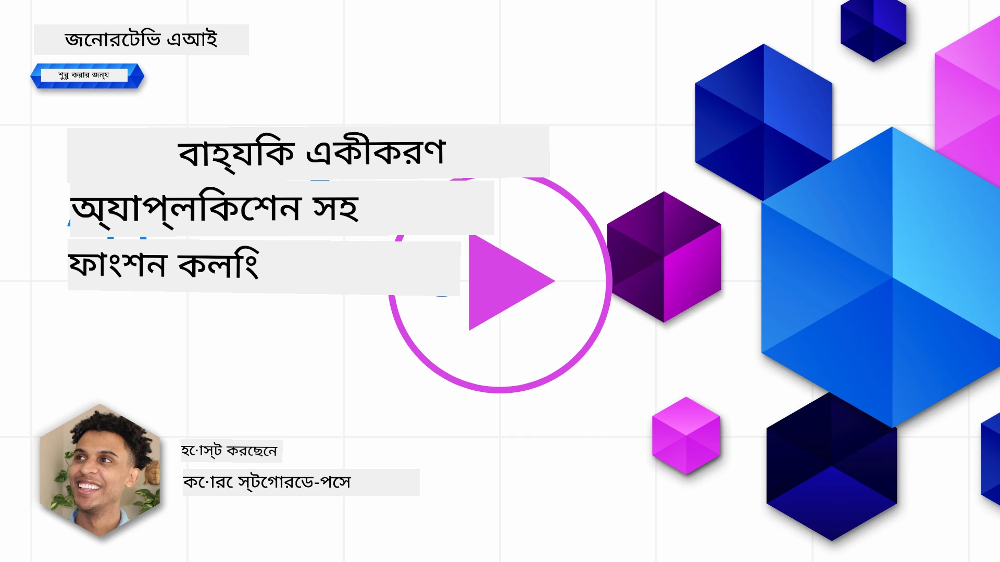
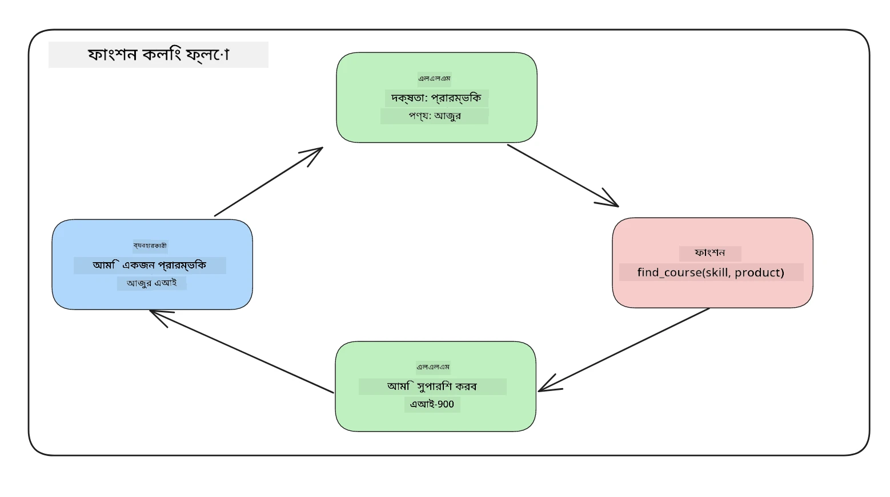
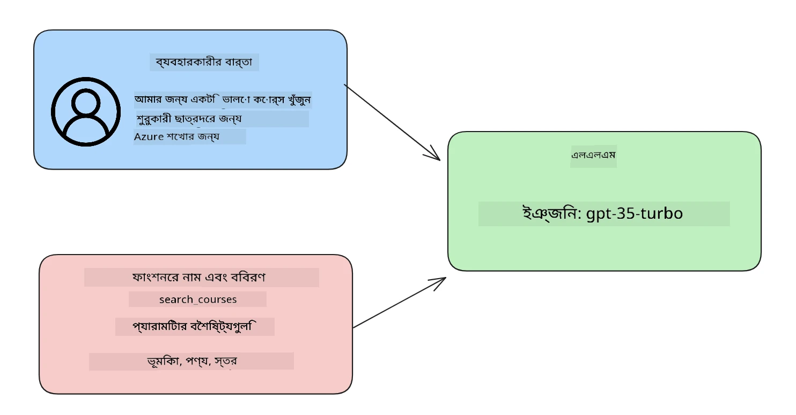

# ফাংশন কলিং-এর সাথে ইন্টিগ্রেশন

[](https://youtu.be/DgUdCLX8qYQ?si=f1ouQU5HQx6F8Gl2)

আপনি পূর্ববর্তী পাঠগুলিতে যথেষ্ট কিছু শিখেছেন। তবে, আমরা আরও উন্নতি করতে পারি। কিছু বিষয় যা আমরা সমাধান করতে পারি তা হল কিভাবে আমরা একটি আরও সঙ্গতিপূর্ণ প্রতিক্রিয়া ফরম্যাট পেতে পারি যাতে প্রতিক্রিয়া এর নিচের ধাপগুলো জুড়ে কাজ করা সহজ হয়। এছাড়াও, আমরা আমাদের অ্যাপ্লিকেশনকে আরও সমৃদ্ধ করতে অন্যান্য উত্স থেকে ডেটা যোগ করতে চাইতে পারি।

উপরে উল্লিখিত সমস্যাগুলোই এই অধ্যায়ে সমাধান করার লক্ষ্য রয়েছে।

## পরিচিতি

এই পাঠে আলোচনা করা হবে:

- ফাংশন কলিং কী এবং এর ব্যবহার ক্ষেত্র সম্বন্ধে ব্যাখ্যা করা।
- Azure OpenAI ব্যবহার করে ফাংশন কল তৈরি করা।
- কিভাবে একটি ফাংশন কল একটি অ্যাপ্লিকেশনে ইন্টিগ্রেট করা যায়।

## শেখার লক্ষ্যসমূহ

এই পাঠ শেষ হওয়ার পরে, আপনি পারবেন:

- ফাংশন কলিংয়ের উদ্দেশ্য ব্যাখ্যা করতে।
- Azure OpenAI সার্ভিস ব্যবহার করে ফাংশন কল সেটআপ করতে।
- আপনার অ্যাপ্লিকেশনের ব্যবহার ক্ষেত্র অনুযায়ী কার্যকর ফাংশন কল ডিজাইন করতে।

## পরিস্থিতি: ফাংশন দিয়ে আমাদের চ্যাটবট উন্নত করা

এই পাঠের জন্য, আমরা একটি শিক্ষা স্টার্টআপের জন্য একটি ফিচার তৈরি করতে চাই যেখানে ব্যবহারকারীরা একটি চ্যাটবট ব্যবহার করে প্রযুক্তিগত কোর্স খুঁজে পাবে। আমরা তাদের দক্ষতা স্তর, বর্তমান ভূমিকা এবং আগ্রহের প্রযুক্তি অনুযায়ী কোর্স প্রস্তাব করব।

এই পরিস্থিতি সম্পন্ন করতে, আমরা নিম্নলিখিত সমন্বয় ব্যবহার করব:

- `Azure OpenAI` ব্যবহার করে ব্যবহারকারীর জন্য একটি চ্যাট অভিজ্ঞতা তৈরি করা হবে।
- `Microsoft Learn Catalog API` ব্যবহার করে ব্যবহারকারীর অনুরোধ অনুযায়ী কোর্স খুঁজতে সাহায্য করা।
- `Function Calling` ব্যবহার করে ব্যবহারকারীর প্রশ্ন ফাংশনে পাঠাবে যা API রিকোয়েস্ট করবে।

শুরু করার জন্য, চলুন দেখি কেন আমরা প্রথমেই ফাংশন কলিং ব্যবহার করতে চাই:

## কেন ফাংশন কলিং

ফাংশন কলিংয়ের আগে, LLM থেকে প্রতিক্রিয়াগুলো ছিল অব্যবস্থিত এবং অসঙ্গতিপূর্ণ। ডেভেলপারদের জটিল যাচাই কোড লিখতে হত যাতে তারা প্রতিটি ধরনের প্রতিক্রিয়া সামলাতে পারেন। ব্যবহারকারীরা "স্টকহোমে বর্তমান আবহাওয়া কী?" এর মতো প্রশ্নের উত্তর পেতেন না। কারণ মডেলগুলো শুধুমাত্র প্রশিক্ষণকৃত তথ্য পর্যন্ত সীমাবদ্ধ ছিল।

ফাংশন কলিং হল Azure OpenAI সার্ভিসের একটি বৈশিষ্ট্য যা নিম্নলিখিত সীমাবদ্ধতাগুলো কাটিয়ে উঠার জন্য:

- **সঙ্গতিপূর্ণ প্রতিক্রিয়া ফরম্যাট**। প্রতিক্রিয়া ফরম্যাট নিয়ন্ত্রণে রেখে আমরা সহজেই অন্যান্য সিস্টেমে এই প্রতিক্রিয়া ইন্টিগ্রেট করতে পারি।
- **বাহ্যিক ডেটা**। চ্যাট প্রসঙ্গে অ্যাপ্লিকেশনের অন্যান্য উৎস থেকে ডেটা ব্যবহার করার সক্ষমতা।

## একটি পরিস্থিতির মাধ্যমে সমস্যা ব্যাখ্যা

> আমরা সুপারিশ করি আপনি নিম্নোক্ত [অন্তর্ভুক্ত নোটবুকটি](./python/aoai-assignment.ipynb?WT.mc_id=academic-105485-koreyst) ব্যবহার করুন যদি আপনি নিচের পরিস্থিতি চালাতে চান। আপনি শুধু পড়েও যেতে পারেন কারণ আমরা একটি সমস্যা উদাহরণগুলো দিয়ে দেখাবো যেখানে ফাংশন সাহায্য করতে পারে।

চলুন দেখি একটি উদাহরণ যা প্রতিক্রিয়া ফরম্যাট সমস্যাটি উপস্থাপন করে:

ধরুন আমরা ছাত্রদের তথ্যের একটি ডাটাবেস তৈরি করতে চাই যাতে আমরা তাদের জন্য সঠিক কোর্স প্রস্তাব করতে পারি। নিচে দুইটি ছাত্র বর্ণনা দেওয়া হয়েছে যা ডেটায় খুবই অনুরূপ।

1. আমাদের Azure OpenAI রিসোর্সের সাথে একটি সংযোগ তৈরি করুন:

   ```python
   import os
   import json
   from openai import OpenAI
   from dotenv import load_dotenv
   load_dotenv()

   # Responses APIটি Azure OpenAI (Microsoft Foundry) v1 এন্ডপয়েন্ট থেকে পরিবেশন করা হয়
   # তাই আমরা OpenAI ক্লায়েন্টটি <your-endpoint>/openai/v1/ এ নির্দেশ করি।
   endpoint = os.environ['AZURE_OPENAI_ENDPOINT']
   client = OpenAI(
   api_key=os.environ['AZURE_OPENAI_API_KEY'],
   base_url=f"{endpoint.rstrip('/')}/openai/v1/",
   )

   deployment=os.environ['AZURE_OPENAI_DEPLOYMENT']
   ```

   নিচে Azure OpenAI সংযোগ কনফিগার করার জন্য কিছু পাইথন কোড আছে। কারণ আমরা v1 এন্ডপয়েন্ট ব্যবহার করছি, শুধু `api_key` এবং `base_url` সেট করাই প্রয়োজন (কোন `api_version` দরকার নেই)।

1. `student_1_description` এবং `student_2_description` ভ্যারিয়েবল ব্যবহার করে দুইটি ছাত্র বর্ণনা তৈরি করা।

   ```python
   student_1_description="Emily Johnson is a sophomore majoring in computer science at Duke University. She has a 3.7 GPA. Emily is an active member of the university's Chess Club and Debate Team. She hopes to pursue a career in software engineering after graduating."

   student_2_description = "Michael Lee is a sophomore majoring in computer science at Stanford University. He has a 3.8 GPA. Michael is known for his programming skills and is an active member of the university's Robotics Club. He hopes to pursue a career in artificial intelligence after finishing his studies."
   ```

   উপরের ছাত্র বর্ণনাগুলো আমরা LLM-এ পাঠাবো ডেটা পার্স করার জন্য। এই ডেটা পরে আমাদের অ্যাপ্লিকেশনে ব্যবহার করা যাবে, API তে পাঠানো বা ডাটাবেসে সংরক্ষণ করা যাবে।

1. চলুন দুইটি অভিন্ন প্রম্পট তৈরি করি যা LLM কে বলে কী তথ্য আমরা চাই:

   ```python
   prompt1 = f'''
   Please extract the following information from the given text and return it as a JSON object:

   name
   major
   school
   grades
   club

   This is the body of text to extract the information from:
   {student_1_description}
   '''

   prompt2 = f'''
   Please extract the following information from the given text and return it as a JSON object:

   name
   major
   school
   grades
   club

   This is the body of text to extract the information from:
   {student_2_description}
   '''
   ```

   উপরের প্রম্পটগুলো LLM কে তথ্য বের করতে এবং JSON ফরম্যাটে প্রতিক্রিয়া দিতে নির্দেশ করে।

1. প্রম্পট এবং Azure OpenAI সংযোগ সেট করার পর, এখন আমরা `client.responses.create` ব্যবহার করে প্রম্পটগুলো LLM-এ পাঠাবো। আমরা প্রম্পট `input` ভ্যারিয়েবলে রাখবো এবং রোল `user` নির্দিষ্ট করবো। এটা ব্যবহারকারীর একটি ম্যাসেজ চ্যাটবট-এ লেখা হওয়ার অনুকরণ।

   ```python
   # প্রথম প্রম্পট থেকে প্রতিক্রিয়া
   openai_response1 = client.responses.create(
   model=deployment,
   input = [{'role': 'user', 'content': prompt1}],
   store=False,
   )
   openai_response1.output_text

   # দ্বিতীয় প্রম্পট থেকে প্রতিক্রিয়া
   openai_response2 = client.responses.create(
   model=deployment,
   input = [{'role': 'user', 'content': prompt2}],
   store=False,
   )
   openai_response2.output_text
   ```

এখন আমরা উভয় রিকোয়েস্ট LLM-এ পাঠাতে পারি এবং আমরা পাওয়া প্রতিক্রিয়াটি দেখতে পারি এমনভাবে `openai_response1.output_text` ব্যবহার করে।

1. সর্বশেষে, আমরা প্রতিক্রিয়াটি JSON ফরম্যাটে রূপান্তর করব `json.loads` কল করে:

   ```python
   # প্রতিক্রিয়াটি একটি JSON অবজেক্ট হিসাবে লোড হচ্ছে
   json_response1 = json.loads(openai_response1.output_text)
   json_response1
   ```

   প্রতিক্রিয়া 1:

   ```json
   {
     "name": "Emily Johnson",
     "major": "computer science",
     "school": "Duke University",
     "grades": "3.7",
     "club": "Chess Club"
   }
   ```

   প্রতিক্রিয়া 2:

   ```json
   {
     "name": "Michael Lee",
     "major": "computer science",
     "school": "Stanford University",
     "grades": "3.8 GPA",
     "club": "Robotics Club"
   }
   ```

   যদিও প্রম্পটগুলো একই এবং বর্ণনাগুলো অনুরূপ, আমরা দেখতে পেয়েছি `Grades` প্রপার্টির মান ভিন্নভাবে ফরম্যাট হয়েছে, যেমন কখনো `3.7` আবার কখনো `3.7 GPA` ইত্যাদি।

   এই ফলাফল এর কারণ হল LLM লিখিত প্রম্পটের অব্যবস্থিত ডেটা গ্রহণ করে এবং অব্যবस्थित ডেটা ফেরত দেয়। আমাদের একটি কাঠামোগত ফরম্যাট থাকা উচিত যেন আমরা জানি এই ডেটা সংরক্ষণ বা ব্যবহারে কী আশা করতে পারি।

তাহলে আমরা ফরম্যাটিং সমস্যাটি কিভাবে সমাধান করব? ফাংশন কলিং ব্যবহার করে আমরা নিশ্চিত করতে পারি যে আমরা কাঠামোগত ডেটা পেতে পারি। ফাংশন কলিং ব্যবহারে, LLM আসলে কোন ফাংশন কল বা চালায় না। বরং, আমরা LLM কে তার প্রতিক্রিয়ার জন্য একটি কাঠামো তৈরি করে দিই। তারপর আমরা সেই কাঠামো অনুযায়ী জানি কোন ফাংশন আমাদের অ্যাপে চালাতে হবে।



আমরা পরে ফাংশন থেকে যেটি ফেরত পাই তা আবার LLM-এ পাঠাতে পারি। LLM তখন ব্যবহারকারীর প্রশ্নের উত্তর স্বাভাবিক ভাষায় প্রদান করবে।

## ফাংশন কল ব্যবহার করার ব্যবহার ক্ষেত্রগুলি

অনেক ভিন্ন ভিন্ন ব্যবহার ক্ষেত্র যেখানে ফাংশন কল আপনার অ্যাপ উন্নত করতে পারে, যেমন:

- **বাহ্যিক সরঞ্জাম কল করা**। চ্যাটবট ব্যবহারকারীদের প্রশ্নের উত্তর দেওয়ার জন্য চমৎকার। ফাংশন কলিং ব্যবহার করে, চ্যাটবটগুলো ব্যবহারকারীর মেসেজের দ্বারা নির্দিষ্ট কাজ সম্পন্ন করতে পারে। উদাহরণস্বরূপ, একজন ছাত্র চ্যাটবটকে বলতে পারে "আমার শিক্ষকের কাছে একটি ইমেইল পাঠাও বলুন আমি এই বিষয়ে আরও সাহায্য চাই"। এটা `send_email(to: string, body: string)` নামে একটি ফাংশন কল করতে পারে।

- **API বা ডাটাবেস কোয়েরি তৈরি করা**। ব্যবহারকারী প্রাকৃতিক ভাষা ব্যবহার করে তথ্য খুঁজে পেতে পারে যা একটি ফরম্যাটেড কোয়েরি বা API রিকোয়েস্টে রূপান্তরিত হয়। উদাহরণস্বরূপ, একজন শিক্ষক প্রশ্ন করতে পারে "গত অ্যাসাইনমেন্ট শেষ করেছেন এমন ছাত্ররা কে আছে" যা `get_completed(student_name: string, assignment: int, current_status: string)` নামে একটি ফাংশন কল হতে পারে।

- **কাঠামোগত ডেটা তৈরি করা**। ব্যবহারকারী একটি ব্লক টেক্সট বা CSV কে নিয়ে LLM ব্যবহার করে গুরুত্বপূর্ণ তথ্য বের করতে পারে। উদাহরণস্বরূপ, একজন ছাত্র শান্তি চুক্তি সম্পর্কিত একটি উইকিপিডিয়া আর্টিকেল থেকে AI ফ্ল্যাশকার্ড তৈরি করতে পারে। এটি `get_important_facts(agreement_name: string, date_signed: string, parties_involved: list)` নামে একটি ফাংশন দ্বারা করা যেতে পারে।

## আপনার প্রথম ফাংশন কল তৈরি

একটি ফাংশন কল তৈরি প্রক্রিয়ায় ৩টি প্রধান ধাপ রয়েছে:

1. ফাংশন (সরঞ্জাম) গুলোর একটি তালিকা এবং একটি ব্যবহারকারীর বার্তা নিয়ে Responses API কল করা।
2. মডেলের প্রতিক্রিয়া পড়া যাতে কার্য সম্পাদন করা যায়, অর্থাৎ কোন ফাংশন বা API কল কার্যকর করা।
3. আপনার ফাংশনের প্রতিক্রিয়া নিয়ে Responses API-তে আরেকটি কল করা যাতে ব্যবহারকারীর জন্য একটি প্রতিক্রিয়া তৈরি করা যায়।



### ধাপ ১ - মেসেজ তৈরি করা

প্রথম ধাপ হল একটি ব্যবহারকারীর মেসেজ তৈরি করা। এটি ডাইনামিক্যালি একটি টেক্সট ইনপুট থেকে নেওয়া হতে পারে অথবা আপনি এখানে মান নির্ধারণ করতে পারেন। যদি এটি Responses API সাথে আপনার প্রথম কাজ হয়, আমরা মেসেজের `role` এবং `content` নির্ধারণ করতে হবে।

`role` হতে পারে `system` (নিয়ম তৈরি করা), `assistant` (মডেল), অথবা `user` (চূড়ান্ত ব্যবহারকারী)। ফাংশন কলিংতে, আমরা এটিকে `user` হিসেবে নির্ধারণ করব এবং একটি উদাহরণ প্রশ্ন দেব।

```python
messages= [ {"role": "user", "content": "Find me a good course for a beginner student to learn Azure."} ]
```

বিভিন্ন রোল নির্ধারণ করে, LLM স্পষ্টভাবে বুঝতে পারে কার কথা বলা হচ্ছে—সিস্টেম নাকি ব্যবহারকারী, যা সংলাপের ইতিহাস গঠনে সাহায্য করে।

### ধাপ ২ - ফাংশন তৈরি করা

পরবর্তী ধাপে, আমরা একটি ফাংশন এবং তার প্যারামিটারগুলো সংজ্ঞায়িত করব। এখানে আমরা শুধু একটি ফাংশন ব্যবহার করব যার নাম `search_courses` কিন্তু আপনি একাধিক ফাংশন তৈরি করতে পারবেন।

> **গুরুত্বপূর্ণ** : ফাংশনগুলো সিস্টেম মেসেজে LLM-এ অন্তর্ভুক্ত করা হয় এবং এটি আপনার উপলব্ধ টোকেনের অংশ হিসেবে গণ্য হবে।

নিচে আমরা ফাংশনগুলো একটি আইটেমের অ্যারে হিসাবে তৈরি করি। প্রতিটি আইটেম Responses API এর ফ্ল্যাট ফর্ম্যাটে একটি টুল, যার প্রপার্টি হলো `type`, `name`, `description` এবং `parameters`:

```python
functions = [
   {
      "type":"function",
      "name":"search_courses",
      "description":"Retrieves courses from the search index based on the parameters provided",
      "parameters":{
         "type":"object",
         "properties":{
            "role":{
               "type":"string",
               "description":"The role of the learner (i.e. developer, data scientist, student, etc.)"
            },
            "product":{
               "type":"string",
               "description":"The product that the lesson is covering (i.e. Azure, Power BI, etc.)"
            },
            "level":{
               "type":"string",
               "description":"The level of experience the learner has prior to taking the course (i.e. beginner, intermediate, advanced)"
            }
         },
         "required":[
            "role"
         ]
      }
   }
]
```

নিম্নে প্রতিটি ফাংশন ইনস্ট্যান্সের বর্ণনা দেয়া হলো:

- `name` - ফাংশনের নাম যেটি আমরা কল করাতে চাই।
- `description` - এটা ফাংশনটি কিভাবে কাজ করে তার বিবরণ। এখানে স্পষ্ট এবং নির্দিষ্ট হওয়া গুরুত্বপূর্ণ।
- `parameters` - একটি তালিকা যার মান এবং ফরম্যাট যা আপনি মডেল থেকে প্রত্যাশা করেন। প্যারামিটার অ্যারে এমন আইটেমের সমষ্টি যাদের নিচের প্রপার্টিগুলো রয়েছে:
  1. `type` - ডেটার ধরন যা প্রপার্টিগুলোতে থাকবে।
  1. `properties` - নির্দিষ্ট মানের তালিকা যা মডেল তার প্রতিক্রিয়ায় ব্যবহার করবে
      1. `name` - প্রয়োগের ক্ষেত্রে ব্যবহৃত প্রপার্টির নাম, যেমন `product`।
      1. `type` - প্রপার্টির ডেটা টাইপ যেমন `string`।
      1. `description` - নির্দিষ্ট প্রপার্টির বর্ণনা।

এখানে একটি ঐচ্ছিক প্রপার্টি `required` ও রয়েছে - ফাংশন কল সম্পন্ন করার জন্য প্রয়োজনীয় প্রপার্টি।

### ধাপ ৩ - ফাংশন কল করা

ফাংশন সংজ্ঞায়িত করার পর, আমরা এখন এটি Responses API কল-এ অন্তর্ভুক্ত করব। আমরা অনুরোধে `tools` যোগ করব। এই ক্ষেত্রে `tools=functions`।

এছাড়াও `tool_choice` সেট করা যেতে পারে `auto` এ। এর অর্থ হলো LLM নিজেই নির্বাচন করবে কোন ফাংশন কল করতে হবে ব্যবহারকারীর বার্তার উপর ভিত্তি করে, আমাদের নিজে নির্ধারণ না করে।

নিচে কিছু কোড আছে যেখানে আমরা `client.responses.create` কল করি, লক্ষ্য করুন কিভাবে আমরা `tools=functions` এবং `tool_choice="auto"` সেট করেছি এবং এভাবে LLM কে ফাংশনগুলো কল করার সময়ের সিদ্ধান্ত দেওয়া হয়েছে:

```python
response = client.responses.create(model=deployment,
                                        input=messages,
                                        tools=functions,
                                        tool_choice="auto",
                                        store=False)

print(response.output)
```

ফিরতে আসা প্রতিক্রিয়ায় এখন একটি `function_call` আইটেম থাকবে `response.output` অংশে যা এরকম দেখাবে:

```json
{
  "type": "function_call",
  "name": "search_courses",
  "call_id": "call_abc123",
  "arguments": "{\n  \"role\": \"student\",\n  \"product\": \"Azure\",\n  \"level\": \"beginner\"\n}"
}
```

এখানে দেখা যাচ্ছে কিভাবে ফাংশন `search_courses` কল হয়েছে এবং কি আর্গুমেন্ট দিয়ে যা JSON প্রতিক্রিয়ায় `arguments` প্রপার্টিতে তালিকাভুক্ত।

উপসংহার হল LLM ফাংশনের আর্গুমেন্ট পূরণ করতে প্রাপ্ত ডেটা সনাক্ত করতে পেরেছে কারণ এটি `input` প্যারামিটারে দেয়া ভ্যালু থেকে এটি বের করছে Responses API কল-এ। নিচে একটি রিমাইন্ডার `messages` মানের:

```python
messages= [ {"role": "user", "content": "Find me a good course for a beginner student to learn Azure."} ]
```

আপনি দেখতে পাচ্ছেন, `student`, `Azure` ও `beginner` `messages` থেকে নির্গত হয়ে ফাংশনের ইনপুট হিসেবে সেট হয়েছে। ফাংশনগুলোর মাধ্যমে তথ্য আহরণ করার পাশাপাশি কাঠামো প্রদানও হচ্ছে LLM-কে এবং পুনঃব্যবহারযোগ্য কার্যকারিতা তৈরি হচ্ছে।

এখন আমাদের দেখতে হবে কিভাবে এটিকে আমাদের অ্যাপে ব্যবহার করা যায়।

## ফাংশন কল অ্যাপ্লিকেশনে ইন্টিগ্রেশন

LLM থেকে ফরম্যাট করা প্রতিক্রিয়া পরীক্ষা করার পর, আমরা এটিকে একটি অ্যাপ্লিকেশনে সংহত করতে পারি।

### ফ্লো পরিচালনা করা

এটিকে আমাদের অ্যাপ্লিকেশনে সংহত করতে নিচের ধাপগুলো গ্রহণ করব:

1. প্রথমে OpenAI সার্ভিসে কল করুন এবং `output` থেকে ফাংশন কল আইটেমগুলো বের করুন।

   ```python
   response_items = response.output
   tool_calls = [item for item in response_items if item.type == "function_call"]
   ```

1. এখন আমরা একটি ফাংশন সংজ্ঞায়িত করব যা Microsoft Learn API কল করবে কোর্স তালিকা পেতে:

   ```python
   import requests

   def search_courses(role, product, level):
     url = "https://learn.microsoft.com/api/catalog/"
     params = {
        "role": role,
        "product": product,
        "level": level
     }
     response = requests.get(url, params=params)
     modules = response.json()["modules"]
     results = []
     for module in modules[:5]:
        title = module["title"]
        url = module["url"]
        results.append({"title": title, "url": url})
     return str(results)
   ```

   লক্ষ্য করুন আমরা এখন বাস্তব পাইথন ফাংশন তৈরি করেছি যা `functions` ভ্যারিয়েবলে থাকা ফাংশন নামের সঙ্গে মেল খায়। আমরা প্রয়োজনে বাইরের API কল করছি প্রয়োজনীয় ডেটা সংগ্রহ করতে। এখানে আমরা Microsoft Learn API ব্যবহার করে ট্রেনিং মডিউল খুঁজছি।

ঠিক আছে, তাই আমরা `functions` ভ্যারিয়েবল এবং একটি পাইথন ফাংশন তৈরি করেছি, এখন কিভাবে LLM কে বোঝাবো এই দুইকে কীভাবে ম্যাপ করতে যাতে আমাদের পাইথন ফাংশন কল হয়?

1. দেখতে হবে আমাদের কি পাইথন ফাংশন কল করতে হবে কিনা, এর জন্য LLM এর প্রতিক্রিয়ায় `function_call` আইটেম আছে কিনা তা পরীক্ষা করতে হবে এবং তারপর উক্ত ফাংশন কল করতে হবে। নিচে এটি পরীক্ষা করার কোড দেখুন:

   ```python
   # পরীক্ষা করুন মডেল কি একটি ফাংশন কল করতে চায়
   if tool_calls:
    for tool_call in tool_calls:
     print("Recommended Function call:")
     print(tool_call.name)
     print()

     # ফাংশন কল করুন।
     function_name = tool_call.name

     available_functions = {
             "search_courses": search_courses,
     }
     function_to_call = available_functions[function_name]

     function_args = json.loads(tool_call.arguments)
     function_response = function_to_call(**function_args)

     print("Output of function call:")
     print(function_response)
     print(type(function_response))

     # কথোপকথনে ফাংশন কল এবং তার ফলাফল যোগ করুন।
     # মডেলের function_call আইটেম অবশ্যই তার আউটপুটের আগে যুক্ত করতে হবে।
     messages.append(tool_call)  # সহকারী'র function_call আইটেম
     messages.append( # ফাংশনের ফলাফল
         {
             "type": "function_call_output",
             "call_id": tool_call.call_id,
             "output": function_response,
         }
     )
   ```

   এই তিন লাইন নিশ্চিত করবে আমরা ফাংশন নাম, আর্গুমেন্ট সংগ্রহ করছি এবং কল করছি:

   ```python
   function_to_call = available_functions[function_name]

   function_args = json.loads(tool_call.arguments)
   function_response = function_to_call(**function_args)
   ```

   নিচে আমাদের কোড রান করার আউটপুট:

   **আউটপুট**

   ```Recommended Function call:
   {
     "name": "search_courses",
     "arguments": "{\n  \"role\": \"student\",\n  \"product\": \"Azure\",\n  \"level\": \"beginner\"\n}"
   }

   Output of function call:
   [{'title': 'Describe concepts of cryptography', 'url': 'https://learn.microsoft.com/training/modules/describe-concepts-of-cryptography/?
   WT.mc_id=api_CatalogApi'}, {'title': 'Introduction to audio classification with TensorFlow', 'url': 'https://learn.microsoft.com/en-
   us/training/modules/intro-audio-classification-tensorflow/?WT.mc_id=api_CatalogApi'}, {'title': 'Design a Performant Data Model in Azure SQL
   Database with Azure Data Studio', 'url': 'https://learn.microsoft.com/training/modules/design-a-data-model-with-ads/?
   WT.mc_id=api_CatalogApi'}, {'title': 'Getting started with the Microsoft Cloud Adoption Framework for Azure', 'url':
   'https://learn.microsoft.com/training/modules/cloud-adoption-framework-getting-started/?WT.mc_id=api_CatalogApi'}, {'title': 'Set up the
   Rust development environment', 'url': 'https://learn.microsoft.com/training/modules/rust-set-up-environment/?WT.mc_id=api_CatalogApi'}]
   <class 'str'>
   ```

1. এখন আপডেট করা মেসেজ, `messages` LLM-এ পাঠাবো যাতে আমরা একটি প্রাকৃতিক ভাষায় প্রতিক্রিয়া পেতে পারি, API JSON ফরম্যাটেড প্রতিক্রিয়ার পরিবর্তে।

   ```python
   print("Messages in next request:")
   print(messages)
   print()

   second_response = client.responses.create(
      input=messages,
      model=deployment,
      tool_choice="auto",
      tools=functions,
      temperature=0,
      store=False,
         )  # একটি নতুন প্রতিক্রিয়া পান মডেল থেকে যেখানে এটি ফাংশন প্রতিক্রিয়া দেখতে পারে


   print(second_response.output_text)
   ```

   **আউটপুট**

   ```text
   I found some good courses for beginner students to learn Azure:

   1. [Describe concepts of cryptography](https://learn.microsoft.com/training/modules/describe-concepts-of-cryptography/?WT.mc_id=api_CatalogApi)
   2. [Introduction to audio classification with TensorFlow](https://learn.microsoft.com/training/modules/intro-audio-classification-tensorflow/?WT.mc_id=api_CatalogApi)
   3. [Design a Performant Data Model in Azure SQL Database with Azure Data Studio](https://learn.microsoft.com/training/modules/design-a-data-model-with-ads/?WT.mc_id=api_CatalogApi)
   4. [Getting started with the Microsoft Cloud Adoption Framework for Azure](https://learn.microsoft.com/training/modules/cloud-adoption-framework-getting-started/?WT.mc_id=api_CatalogApi)
   5. [Set up the Rust development environment](https://learn.microsoft.com/training/modules/rust-set-up-environment/?WT.mc_id=api_CatalogApi)

   You can click on the links to access the courses.
   ```

## অ্যাসাইনমেন্ট

Azure OpenAI Function Calling-এর আপনার শেখা চালিয়ে যেতে, আপনি তৈরি করতে পারেন:

- ফাংশনের আরও প্যারামিটার যা শিক্ষার্থীদের জন্য আরো কোর্স খুঁজে পেতে সাহায্য করতে পারে।

- শিক্ষার্থী থেকে তাদের মাতৃভাষার মতো আরও তথ্য গ্রহণকারী আরেকটি ফাংশন কল তৈরি করুন
- ফাংশন কল এবং/অথবা API কল কোনও উপযুক্ত কোর্স ফেরত না দিলে ত্রুটি পরিচালনা তৈরি করুন

টিপস: এই তথ্যটি কিভাবে এবং কোথায় উপলব্ধ তা দেখতে [Learn API reference documentation](https://learn.microsoft.com/training/support/catalog-api-developer-reference?WT.mc_id=academic-105485-koreyst) পৃষ্ঠা অনুসরণ করুন।

## দুর্দান্ত কাজ! যাত্রা অব্যাহত রাখুন

এই পাঠটি সম্পন্ন করার পরে, আমাদের [Generative AI Learning সংগ্রহ](https://aka.ms/genai-collection?WT.mc_id=academic-105485-koreyst) দেখুন যাতে আপনার Generative AI জ্ঞান আরও উন্নত করতে পারেন!

পাঠ ১২-এ যান, যেখানে আমরা দেখব কিভাবে [AI অ্যাপ্লিকেশনের জন্য UX ডিজাইন করতে হয়](../12-designing-ux-for-ai-applications/README.md?WT.mc_id=academic-105485-koreyst) !

---

<!-- CO-OP TRANSLATOR DISCLAIMER START -->
**অস্বীকৃতি**:
এই নথিটি AI অনুবাদ পরিষেবা [Co-op Translator](https://github.com/Azure/co-op-translator) ব্যবহার করে অনূদিত হয়েছে। যদিও আমরা শুদ্ধতার জন্য চেষ্টা করি, অনুগ্রহ করে মনে রাখবেন যে স্বয়ংক্রিয় অনুবাদে ত্রুটি বা অসঙ্গতি থাকতে পারে। মূল নথিটি তার স্বভাষায় কর্তৃত্বপূর্ণ উৎস হিসেবে বিবেচিত হওয়া উচিত। গুরুত্বপূর্ণ তথ্যের জন্য পেশাদার মানব অনুবাদ সুপারিশ করা হয়। এই অনুবাদের ব্যবহারে প্রয়োজনীয় ভুল বোঝাবুঝি বা ভুল ব্যাখ্যার জন্য আমরা দায়বদ্ধ নই।
<!-- CO-OP TRANSLATOR DISCLAIMER END -->