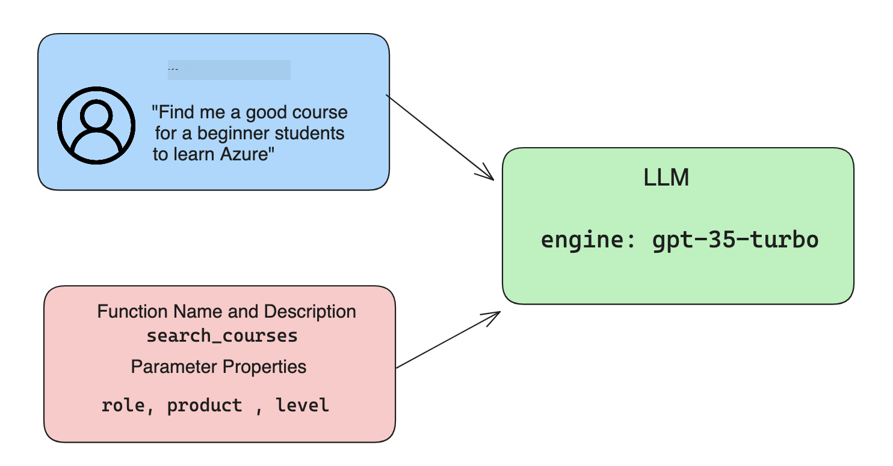

<!--
CO_OP_TRANSLATOR_METADATA:
{
  "original_hash": "f6f84f9ef2d066cd25850cab93580a50",
  "translation_date": "2025-10-17T14:51:14+00:00",
  "source_file": "11-integrating-with-function-calling/README.md",
  "language_code": "bn"
}
-->
# ফাংশন কলিং এর সাথে ইন্টিগ্রেশন

[](https://youtu.be/DgUdCLX8qYQ?si=f1ouQU5HQx6F8Gl2)

আগের পাঠগুলোতে আপনি অনেক কিছু শিখেছেন। তবে, আমরা আরও উন্নতি করতে পারি। কিছু বিষয় যা আমরা সমাধান করতে পারি তা হলো কিভাবে আমরা আরও সুনির্দিষ্ট রেসপন্স ফরম্যাট পেতে পারি যাতে রেসপন্সের সাথে কাজ করা সহজ হয়। এছাড়াও, আমরা আমাদের অ্যাপ্লিকেশনকে আরও সমৃদ্ধ করতে অন্যান্য উৎস থেকে ডেটা যোগ করতে চাইতে পারি।

উপরোক্ত সমস্যাগুলোই এই অধ্যায়ে সমাধান করার চেষ্টা করা হয়েছে।

## পরিচিতি

এই পাঠে আলোচনা করা হবে:

- ফাংশন কলিং কী এবং এর ব্যবহার ক্ষেত্র।
- Azure OpenAI ব্যবহার করে ফাংশন কল তৈরি করা।
- কিভাবে একটি অ্যাপ্লিকেশনে ফাংশন কল ইন্টিগ্রেট করা যায়।

## শেখার লক্ষ্য

এই পাঠ শেষে আপনি সক্ষম হবেন:

- ফাংশন কলিং ব্যবহারের উদ্দেশ্য ব্যাখ্যা করতে।
- Azure OpenAI Service ব্যবহার করে ফাংশন কল সেটআপ করতে।
- আপনার অ্যাপ্লিকেশনের ব্যবহার ক্ষেত্রে কার্যকর ফাংশন কল ডিজাইন করতে।

## দৃশ্যপট: আমাদের চ্যাটবটকে ফাংশন দিয়ে উন্নত করা

এই পাঠে, আমরা আমাদের শিক্ষা স্টার্টআপের জন্য একটি ফিচার তৈরি করতে চাই যেখানে ব্যবহারকারীরা একটি চ্যাটবট ব্যবহার করে টেকনিক্যাল কোর্স খুঁজে পেতে পারে। আমরা তাদের দক্ষতা, বর্তমান ভূমিকা এবং আগ্রহের প্রযুক্তি অনুযায়ী কোর্স সুপারিশ করব।

এই দৃশ্যপট সম্পন্ন করতে আমরা ব্যবহার করব:

- `Azure OpenAI` ব্যবহারকারীর জন্য একটি চ্যাট অভিজ্ঞতা তৈরি করতে।
- `Microsoft Learn Catalog API` ব্যবহারকারীর অনুরোধ অনুযায়ী কোর্স খুঁজে পেতে সাহায্য করতে।
- `Function Calling` ব্যবহারকারীর প্রশ্ন নিয়ে একটি ফাংশনে পাঠিয়ে API অনুরোধ তৈরি করতে।

শুরু করার জন্য, প্রথমে দেখে নিই কেন আমরা ফাংশন কলিং ব্যবহার করতে চাই:

## কেন ফাংশন কলিং

ফাংশন কলিং এর আগে, LLM থেকে পাওয়া রেসপন্সগুলো ছিল অসংগঠিত এবং অসঙ্গতিপূর্ণ। ডেভেলপারদের জটিল ভ্যালিডেশন কোড লিখতে হতো যাতে প্রতিটি রেসপন্সের ভিন্নতা সামলানো যায়। ব্যবহারকারীরা "স্টকহোমে বর্তমান আবহাওয়া কী?" এর মতো প্রশ্নের উত্তর পেত না। কারণ মডেলগুলো শুধুমাত্র তাদের প্রশিক্ষণের সময়ের ডেটা পর্যন্ত সীমাবদ্ধ ছিল।

Azure OpenAI Service এর ফাংশন কলিং ফিচার নিম্নলিখিত সীমাবদ্ধতাগুলো দূর করতে সাহায্য করে:

- **সুনির্দিষ্ট রেসপন্স ফরম্যাট**। যদি আমরা রেসপন্স ফরম্যাটকে আরও ভালোভাবে নিয়ন্ত্রণ করতে পারি, তাহলে আমরা সহজেই রেসপন্সকে অন্যান্য সিস্টেমে ইন্টিগ্রেট করতে পারি।
- **বাহ্যিক ডেটা**। চ্যাট প্রসঙ্গে অ্যাপ্লিকেশনের অন্যান্য উৎস থেকে ডেটা ব্যবহার করার ক্ষমতা।

## একটি দৃশ্যপটের মাধ্যমে সমস্যাটি চিত্রিত করা

> আমরা আপনাকে [অন্তর্ভুক্ত নোটবুক](./python/aoai-assignment.ipynb?WT.mc_id=academic-105485-koreyst) ব্যবহার করার পরামর্শ দিচ্ছি যদি আপনি নিচের দৃশ্যপটটি চালাতে চান। আপনি শুধু পড়েও নিতে পারেন কারণ আমরা এখানে একটি সমস্যা চিত্রিত করার চেষ্টা করছি যেখানে ফাংশনগুলো সমস্যার সমাধান করতে পারে।

চলুন একটি উদাহরণ দেখি যা রেসপন্স ফরম্যাট সমস্যাটি চিত্রিত করে:

ধরুন আমরা শিক্ষার্থীদের ডেটাবেস তৈরি করতে চাই যাতে আমরা তাদের জন্য সঠিক কোর্স সুপারিশ করতে পারি। নিচে শিক্ষার্থীদের দুটি বর্ণনা দেওয়া হয়েছে যা তাদের ডেটার ক্ষেত্রে খুবই মিল রয়েছে।

1. আমাদের Azure OpenAI রিসোর্সের সাথে সংযোগ তৈরি করুন:

   ```python
   import os
   import json
   from openai import AzureOpenAI
   from dotenv import load_dotenv
   load_dotenv()

   client = AzureOpenAI(
   api_key=os.environ['AZURE_OPENAI_API_KEY'],  # this is also the default, it can be omitted
   api_version = "2023-07-01-preview"
   )

   deployment=os.environ['AZURE_OPENAI_DEPLOYMENT']
   ```

   নিচে কিছু Python কোড দেওয়া হয়েছে যা আমাদের Azure OpenAI এর সাথে সংযোগ কনফিগার করতে সাহায্য করে যেখানে আমরা `api_type`, `api_base`, `api_version` এবং `api_key` সেট করি।

1. দুটি শিক্ষার্থীর বর্ণনা তৈরি করুন ভেরিয়েবল `student_1_description` এবং `student_2_description` ব্যবহার করে।

   ```python
   student_1_description="Emily Johnson is a sophomore majoring in computer science at Duke University. She has a 3.7 GPA. Emily is an active member of the university's Chess Club and Debate Team. She hopes to pursue a career in software engineering after graduating."

   student_2_description = "Michael Lee is a sophomore majoring in computer science at Stanford University. He has a 3.8 GPA. Michael is known for his programming skills and is an active member of the university's Robotics Club. He hopes to pursue a career in artificial intelligence after finishing his studies."
   ```

   আমরা উপরের শিক্ষার্থী বর্ণনাগুলো LLM এ পাঠাতে চাই যাতে ডেটা পার্স করা যায়। এই ডেটা পরে আমাদের অ্যাপ্লিকেশনে ব্যবহার করা যাবে এবং API তে পাঠানো বা ডেটাবেসে সংরক্ষণ করা যাবে।

1. দুটি অভিন্ন প্রম্পট তৈরি করি যেখানে আমরা LLM কে নির্দেশ দেই কোন তথ্য আমরা চাই:

   ```python
   prompt1 = f'''
   Please extract the following information from the given text and return it as a JSON object:

   name
   major
   school
   grades
   club

   This is the body of text to extract the information from:
   {student_1_description}
   '''

   prompt2 = f'''
   Please extract the following information from the given text and return it as a JSON object:

   name
   major
   school
   grades
   club

   This is the body of text to extract the information from:
   {student_2_description}
   '''
   ```

   উপরের প্রম্পটগুলো LLM কে তথ্য বের করতে এবং JSON ফরম্যাটে রেসপন্স দিতে নির্দেশ দেয়।

1. প্রম্পট এবং Azure OpenAI এর সাথে সংযোগ সেটআপ করার পর, আমরা এখন প্রম্পটগুলো LLM এ পাঠাবো `openai.ChatCompletion` ব্যবহার করে। আমরা প্রম্পটটি `messages` ভেরিয়েবলে সংরক্ষণ করি এবং `user` রোল অ্যাসাইন করি। এটি একটি ব্যবহারকারীর চ্যাটবটে লেখা বার্তা অনুকরণ করতে সাহায্য করে।

   ```python
   # response from prompt one
   openai_response1 = client.chat.completions.create(
   model=deployment,
   messages = [{'role': 'user', 'content': prompt1}]
   )
   openai_response1.choices[0].message.content

   # response from prompt two
   openai_response2 = client.chat.completions.create(
   model=deployment,
   messages = [{'role': 'user', 'content': prompt2}]
   )
   openai_response2.choices[0].message.content
   ```

এখন আমরা দুটি অনুরোধ LLM এ পাঠাতে পারি এবং রেসপন্স পরীক্ষা করতে পারি যা আমরা পাই `openai_response1['choices'][0]['message']['content']` এর মাধ্যমে।

1. শেষ পর্যন্ত, আমরা রেসপন্সকে JSON ফরম্যাটে রূপান্তর করতে পারি `json.loads` কল করে:

   ```python
   # Loading the response as a JSON object
   json_response1 = json.loads(openai_response1.choices[0].message.content)
   json_response1
   ```

   রেসপন্স ১:

   ```json
   {
     "name": "Emily Johnson",
     "major": "computer science",
     "school": "Duke University",
     "grades": "3.7",
     "club": "Chess Club"
   }
   ```

   রেসপন্স ২:

   ```json
   {
     "name": "Michael Lee",
     "major": "computer science",
     "school": "Stanford University",
     "grades": "3.8 GPA",
     "club": "Robotics Club"
   }
   ```

   যদিও প্রম্পটগুলো একই এবং বর্ণনাগুলো মিল রয়েছে, আমরা দেখি `Grades` প্রপার্টির মান বিভিন্নভাবে ফরম্যাট করা হয়েছে, যেমন কখনও `3.7` বা `3.7 GPA`।

   এই ফলাফলটি হয়েছে কারণ LLM লিখিত প্রম্পটের আকারে অসংগঠিত ডেটা নেয় এবং অসংগঠিত ডেটা রিটার্ন করে। আমাদের একটি সংগঠিত ফরম্যাট প্রয়োজন যাতে আমরা জানি এই ডেটা সংরক্ষণ বা ব্যবহার করার সময় কী আশা করা উচিত।

তাহলে আমরা কিভাবে ফরম্যাটিং সমস্যার সমাধান করব? ফাংশন কলিং ব্যবহার করে আমরা নিশ্চিত করতে পারি যে আমরা সংগঠিত ডেটা ফিরে পাচ্ছি। ফাংশন কলিং ব্যবহার করার সময়, LLM আসলে কোনো ফাংশন কল বা চালায় না। বরং, আমরা LLM এর রেসপন্সের জন্য একটি কাঠামো তৈরি করি। তারপর আমরা সেই সংগঠিত রেসপন্স ব্যবহার করে আমাদের অ্যাপ্লিকেশনে কোন ফাংশন চালানো হবে তা নির্ধারণ করি।


আমরা তারপর ফাংশন থেকে যা ফিরে পাই তা LLM এ পাঠাতে পারি। LLM তখন ব্যবহারকারীর প্রশ্নের উত্তর দিতে প্রাকৃতিক ভাষা ব্যবহার করে রেসপন্স দেয়।

## ফাংশন কল ব্যবহারের ক্ষেত্রে

ফাংশন কল ব্যবহার করে আপনার অ্যাপ উন্নত করার অনেক ব্যবহার ক্ষেত্র রয়েছে, যেমন:

- **বাহ্যিক টুল কল করা**। চ্যাটবট ব্যবহারকারীদের প্রশ্নের উত্তর দিতে খুবই কার্যকর। ফাংশন কলিং ব্যবহার করে, চ্যাটবট ব্যবহারকারীর বার্তা ব্যবহার করে নির্দিষ্ট কাজ সম্পন্ন করতে পারে। উদাহরণস্বরূপ, একজন শিক্ষার্থী চ্যাটবটকে বলতে পারে "আমার ইনস্ট্রাক্টরকে একটি ইমেইল পাঠাও যেখানে আমি বলছি এই বিষয়ে আরও সাহায্য দরকার।" এটি `send_email(to: string, body: string)` নামক একটি ফাংশন কল করতে পারে।

- **API বা ডেটাবেস অনুরোধ তৈরি করা**। ব্যবহারকারীরা প্রাকৃতিক ভাষা ব্যবহার করে তথ্য খুঁজে পেতে পারে যা একটি ফরম্যাটেড অনুরোধ বা API অনুরোধে রূপান্তরিত হয়। উদাহরণস্বরূপ, একজন শিক্ষক অনুরোধ করতে পারে "শেষ অ্যাসাইনমেন্ট সম্পন্ন করা শিক্ষার্থীরা কারা?" যা `get_completed(student_name: string, assignment: int, current_status: string)` নামক একটি ফাংশন কল করতে পারে।

- **সংগঠিত ডেটা তৈরি করা**। ব্যবহারকারীরা একটি টেক্সট ব্লক বা CSV নিয়ে LLM ব্যবহার করে গুরুত্বপূর্ণ তথ্য বের করতে পারে। উদাহরণস্বরূপ, একজন শিক্ষার্থী একটি উইকিপিডিয়া নিবন্ধকে AI ফ্ল্যাশকার্ড তৈরি করতে রূপান্তর করতে পারে। এটি `get_important_facts(agreement_name: string, date_signed: string, parties_involved: list)` নামক একটি ফাংশন ব্যবহার করে করা যেতে পারে।

## আপনার প্রথম ফাংশন কল তৈরি করা

ফাংশন কল তৈরি করার প্রক্রিয়া তিনটি প্রধান ধাপ অন্তর্ভুক্ত করে:

1. **কল করা** Chat Completions API একটি ফাংশনের তালিকা এবং ব্যবহারকারীর বার্তা সহ।
2. **পড়া** মডেলের রেসপন্স এবং একটি কাজ সম্পন্ন করা অর্থাৎ একটি ফাংশন বা API কল চালানো।
3. **আরেকটি কল করা** Chat Completions API তে ফাংশন থেকে প্রাপ্ত রেসপন্স ব্যবহার করে ব্যবহারকারীর জন্য একটি রেসপন্স তৈরি করা।



### ধাপ ১ - বার্তা তৈরি করা

প্রথম ধাপ হলো একটি ব্যবহারকারীর বার্তা তৈরি করা। এটি একটি টেক্সট ইনপুটের মান নিয়ে ডাইনামিকভাবে অ্যাসাইন করা যেতে পারে অথবা আপনি এখানে একটি মান অ্যাসাইন করতে পারেন। যদি এটি আপনার প্রথমবার Chat Completions API নিয়ে কাজ হয়, তাহলে আমাদের বার্তার `role` এবং `content` নির্ধারণ করতে হবে।

`role` হতে পারে `system` (নিয়ম তৈরি করা), `assistant` (মডেল) বা `user` (শেষ ব্যবহারকারী)। ফাংশন কলিং এর জন্য, আমরা এটিকে `user` হিসেবে অ্যাসাইন করব এবং একটি উদাহরণ প্রশ্ন দেব।

```python
messages= [ {"role": "user", "content": "Find me a good course for a beginner student to learn Azure."} ]
```

বিভিন্ন রোল অ্যাসাইন করে, এটি LLM এর কাছে স্পষ্ট করে তোলে যে এটি সিস্টেম বলছে নাকি ব্যবহারকারী, যা LLM এর জন্য একটি কথোপকথনের ইতিহাস তৈরি করতে সাহায্য করে।

### ধাপ ২ - ফাংশন তৈরি করা

পরবর্তী ধাপে, আমরা একটি ফাংশন এবং সেই ফাংশনের প্যারামিটারগুলো নির্ধারণ করব। এখানে আমরা শুধুমাত্র একটি ফাংশন ব্যবহার করব যার নাম `search_courses`, তবে আপনি একাধিক ফাংশন তৈরি করতে পারেন।

> **গুরুত্বপূর্ণ** : ফাংশনগুলো LLM এর সিস্টেম বার্তায় অন্তর্ভুক্ত করা হয় এবং আপনার উপলব্ধ টোকেনের পরিমাণে অন্তর্ভুক্ত করা হবে।

নিচে, আমরা ফাংশনগুলোকে একটি আইটেমের অ্যারে হিসেবে তৈরি করি। প্রতিটি আইটেম একটি ফাংশন এবং এর প্রপার্টি `name`, `description` এবং `parameters` রয়েছে:

```python
functions = [
   {
      "name":"search_courses",
      "description":"Retrieves courses from the search index based on the parameters provided",
      "parameters":{
         "type":"object",
         "properties":{
            "role":{
               "type":"string",
               "description":"The role of the learner (i.e. developer, data scientist, student, etc.)"
            },
            "product":{
               "type":"string",
               "description":"The product that the lesson is covering (i.e. Azure, Power BI, etc.)"
            },
            "level":{
               "type":"string",
               "description":"The level of experience the learner has prior to taking the course (i.e. beginner, intermediate, advanced)"
            }
         },
         "required":[
            "role"
         ]
      }
   }
]
```

প্রতিটি ফাংশন ইনস্ট্যান্সের বিস্তারিত বর্ণনা নিচে দেওয়া হলো:

- `name` - ফাংশনের নাম যা আমরা কল করতে চাই।
- `description` - ফাংশনটি কিভাবে কাজ করে তার বর্ণনা। এখানে নির্দিষ্ট এবং স্পষ্ট হওয়া গুরুত্বপূর্ণ।
- `parameters` - একটি মানের তালিকা এবং ফরম্যাট যা আপনি মডেলকে তার রেসপন্সে তৈরি করতে চান। প্যারামিটার অ্যারে আইটেমের সমন্বয়ে গঠিত যেখানে আইটেমগুলো নিম্নলিখিত প্রপার্টি রয়েছে:
  1.  `type` - প্রপার্টিগুলো যে ডেটা টাইপে সংরক্ষণ করা হবে।
  1.  `properties` - নির্দিষ্ট মানের তালিকা যা মডেল তার রেসপন্সে ব্যবহার করবে।
      1. `name` - প্রপার্টির নাম যা মডেল তার ফরম্যাটেড রেসপন্সে ব্যবহার করবে, যেমন `product`।
      1. `type` - এই প্রপার্টির ডেটা টাইপ, যেমন `string`।
      1. `description` - নির্দিষ্ট প্রপার্টির বর্ণনা।

এছাড়াও একটি ঐচ্ছিক প্রপার্টি `required` রয়েছে - ফাংশন কল সম্পন্ন করার জন্য প্রয়োজনীয় প্রপার্টি।

### ধাপ ৩ - ফাংশন কল করা

একটি ফাংশন নির্ধারণ করার পর, এখন আমাদের এটি Chat Completion API এর কলের মধ্যে অন্তর্ভুক্ত করতে হবে। আমরা এটি `functions` অনুরোধে যোগ করে করি। এই ক্ষেত্রে `functions=functions`।

এছাড়াও একটি অপশন রয়েছে `function_call` কে `auto` সেট করার। এর মানে হলো আমরা LLM কে ব্যবহারকারীর বার্তার উপর ভিত্তি করে কোন ফাংশন কল করা উচিত তা নির্ধারণ করতে দেব, নিজে থেকে অ্যাসাইন না করে।

নিচে কিছু কোড দেওয়া হলো যেখানে আমরা `ChatCompletion.create` কল করি, লক্ষ্য করুন কিভাবে আমরা `functions=functions` এবং `function_call="auto"` সেট করি এবং LLM কে আমাদের প্রদত্ত ফাংশনগুলো কল করার সিদ্ধান্ত নিতে দিই:

```python
response = client.chat.completions.create(model=deployment,
                                        messages=messages,
                                        functions=functions,
                                        function_call="auto")

print(response.choices[0].message)
```

এখন যে রেসপন্স ফিরে আসছে তা দেখতে এরকম:

```json
{
  "role": "assistant",
  "function_call": {
    "name": "search_courses",
    "arguments": "{\n  \"role\": \"student\",\n  \"product\": \"Azure\",\n  \"level\": \"beginner\"\n}"
  }
}
```

এখানে আমরা দেখতে পাচ্ছি কিভাবে `search_courses` ফাংশনটি কল করা হয়েছে এবং কোন আর্গুমেন্টগুলো ব্যবহার করা হয়েছে, যা JSON রেসপন্সের `arguments` প্রপার্টিতে তালিকাভুক্ত।

LLM এর সিদ্ধান্ত ছিল আর্গুমেন্টগুলো ফিট করার জন্য ডেটা খুঁজে বের করা যা এটি `messages` প্যারামিটারে প্রদত্ত মান থেকে বের করেছে। নিচে `messages` এর মানের একটি স্মরণ করিয়ে দেওয়া হলো:

```python
messages= [ {"role": "user", "content": "Find me a good course for a beginner student to learn Azure."} ]
```

যেমনটি আপনি দেখতে পাচ্ছেন, `student`, `Azure` এবং `beginner` `messages` থেকে বের করা হয়েছে এবং ফাংশনের ইনপুট হিসেবে সেট করা হয়েছে। এইভাবে ফাংশন ব্যবহার করা একটি প্রম্পট থেকে তথ্য বের করার জন্য এবং LLM কে কাঠামো প্রদান করার জন্য এবং পুনরায় ব্যবহারযোগ্য কার্যকারিতা তৈরির জন্য একটি চমৎকার উপায়।

পরবর্তী ধাপে, আমরা দেখব কিভাবে এটি আমাদের অ্যাপ্লিকেশনে ব্যবহার করা যায়।

## একটি অ্যাপ্লিকেশনে ফাংশন কল ইন্টিগ্রেট করা

LLM থেকে ফরম্যাটেড রেসপন্স পরীক্ষা করার পর, এখন আমরা এটি আমাদের অ্যাপ্লিকেশনে ইন্টিগ্রেট করতে পারি।

### প্রবাহ পরিচালনা করা

এটি আমাদের অ্যাপ্লিকেশনে ইন্টিগ্রেট করতে, নিচের ধাপগুলো অনুসরণ করুন:

1. প্রথমে, OpenAI সার্ভিসে কল করুন এবং বার্তাটি একটি ভেরিয়েবলে সংরক্ষণ করুন যার নাম `response_message`।

   ```python
   response_message = response.choices[0].message
   ```

1. এখন আমরা একটি ফাংশন নির্ধারণ করব যা Microsoft Learn API কল করে কোর্সের একটি তালিকা পেতে সাহায্য করবে:

   ```python
   import requests

   def search_courses(role, product, level):
     url = "https://learn.microsoft.com/api/catalog/"
     params = {
        "role": role,
        "product": product,
        "level": level
     }
     response = requests.get(url, params=params)
     modules = response.json()["modules"]
     results = []
     for module in modules[:5]:
        title = module["title"]
        url = module["url"]
        results.append({"title": title, "url": url})
     return str(results)
   ```

   লক্ষ্য করুন কিভাবে আমরা এখন একটি প্রকৃত Python ফাংশন তৈরি করেছি যা `functions` ভেরিয়েবলে উল্লেখিত ফাংশন নামের সাথে মানানসই। আমরা প্রয়োজনীয় ডেটা পেতে প্রকৃত বাহ্যিক API কলও করছি। এই ক্ষেত্রে, আমরা Microsoft Learn API এর বিরুদ্ধে যাচ্ছি ট্রেনিং মডিউল খুঁজতে।

ঠিক আছে, আমরা `functions` ভেরিয়েবল এবং একটি সংশ্লিষ্ট Python ফাংশন তৈরি করেছি, কিভাবে আমরা LLM কে বলব এই দুটি একসাথে মানানসই করে যাতে আমাদের Python ফাংশন কল করা হয়?

1. Python ফাংশন কল করতে হবে কিনা তা দেখতে, আমাদের LLM রেসপন্সে `function_call` আছে কিনা তা দেখতে হবে এবং নির্দেশিত ফাংশন কল করতে হবে। নিচে কিভাবে আপনি উল্লেখিত চেক করতে পারেন:

   ```python
   # Check if the model wants to call a function
   if response_message.function_call.name:
    print("Recommended Function call:")
    print(response_message.function_call.name)
    print()

    # Call the function.
    function_name = response_message.function_call.name

    available_functions = {
            "search_courses": search_courses,
    }
    function_to_call = available_functions[function_name]

    function_args = json.loads(response_message.function_call.arguments)
    function_response = function_to_call(**function_args)

    print("Output of function call:")
    print(function_response)
    print(type(function_response))


    # Add the assistant response and function response to the messages
    messages.append( # adding assistant response to messages
        {
            "role": response_message.role,
            "function_call": {
                "name": function_name,
                "arguments": response_message.function_call.arguments,
            },
            "content": None
        }
    )
    messages.append( # adding function response to messages
        {
            "role": "function",
            "name": function_name,
            "content":function_response,
        }
    )
   ```

   এই তিনটি লাইন নিশ্চিত করে যে আমরা ফাংশনের নাম, আর্গুমেন্টগুলো বের করি এবং কল করি:

   ```python
   function_to_call = available_functions[function_name]

   function_args = json.loads(response_message.function_call.arguments)
   function_response = function_to_call(**function_args)
   ```

   নিচে আমাদের কোড চালানোর আউটপুট দেওয়া হলো:

   **আউটপুট**

   ```Recommended Function call:
   {
     "name": "search_courses",
     "arguments": "{\n  \"role\": \"student\",\n  \"product\": \"Azure\",\n  \"level\": \"beginner\"\n}"
   }

   Output of function call:
   [{'title': 'Describe concepts of cryptography', 'url': 'https://learn.microsoft.com/training/modules/describe-concepts-of-cryptography/?
   WT.mc_id=api_CatalogApi'}, {'title': 'Introduction to audio classification with TensorFlow', 'url': 'https://learn.microsoft.com/en-
   us/training/modules/intro-audio-classification-tensorflow/?WT.mc_id=api_CatalogApi'}, {'title': 'Design a Performant Data Model in Azure SQL
   Database with Azure Data Studio', 'url': 'https://learn.microsoft.com/training/modules/design-a-data-model-with-ads/?
   WT.mc_id=api_CatalogApi'}, {'title': 'Getting started with the Microsoft Cloud Adoption Framework for Azure', 'url':
   'https://learn.microsoft.com/training/modules/cloud-adoption-framework-getting-started/?WT.mc_id=api_CatalogApi'}, {'title': 'Set up the
   Rust development environment', 'url': 'https://learn.microsoft.com/training/modules/rust-set-up-environment/?WT.mc_id=api_CatalogApi'}]
   <class 'str'>
   ```

1. এখন আমরা আপডেট করা বার্তা, `messages` LLM এ পাঠাবো যাতে আমরা একটি প্রাকৃতিক ভাষার রেসপন্স পাই API JSON ফরম্যাটেড রেসপন্সের পরিবর্তে।

   ```python
   print("Messages in next request:")
   print(messages)
   print()

   second_response = client.chat.completions.create(
      messages=messages,
      model=deployment,
      function_call="auto",
      functions=functions,
      temperature=0
         )  # get a new response from GPT where it can see the function response


   print(second_response.choices[0].message)
   ```

   **আউটপুট**

   ```python
   {
     "role": "assistant",
     "content": "I found some good courses for beginner students to learn Azure:\n\n1. [Describe concepts of cryptography] (https://learn.microsoft.com/training/modules/describe-concepts-of-cryptography/?WT.mc_id=api_CatalogApi)\n2. [Introduction to audio classification with TensorFlow](https://learn.microsoft.com/training/modules/intro-audio-classification-tensorflow/?WT.mc_id=api_CatalogApi)\n3. [Design a Performant Data Model in Azure SQL Database with Azure Data Studio](https://learn.microsoft.com/training/modules/design-a-data-model-with-ads/?WT.mc_id=api_CatalogApi)\n4. [Getting started with the Microsoft Cloud Adoption Framework for Azure](https://learn.microsoft.com/training/modules/cloud-adoption-framework-getting-started/?WT.mc_id=api_CatalogApi)\n5. [Set up the Rust development environment](https://learn.microsoft.com/training/modules/rust-set-up-environment/?WT.mc_id=api_CatalogApi)\n\nYou can click on the links to access the courses."
   }

   ```

## অ্যাসাইনমেন্ট

Azure OpenAI Function Calling এর শিক্ষার ধারাবাহিকতা বজায় রাখতে আপনি তৈরি করতে পারেন:

- ফাংশনের আরও প্যারামিটার যা শিক্ষার্থীদের আরও কোর্স খুঁজে পেতে সাহায্য করবে।
- আরেকটি ফাংশন কল তৈরি করুন যা শিক্ষার্থীর মাতৃভাষার মতো আরও তথ্য নেয়।
- ফাংশন কল এবং/অথবা API কল যদি কোনো উপযুক্ত কোর্স না ফেরত দেয়, তখন ত্রুটি পরিচালনা তৈরি করুন

ইঙ্গিত: এই ডেটা কোথায় এবং কীভাবে পাওয়া যায় তা দেখতে [Learn API reference documentation](https://learn.microsoft.com/training/support/catalog-api-developer-reference?WT.mc_id=academic-105485-koreyst) পৃষ্ঠাটি অনুসরণ করুন।

## দারুণ কাজ! যাত্রা চালিয়ে যান

এই পাঠ শেষ করার পর, আমাদের [Generative AI Learning collection](https://aka.ms/genai-collection?WT.mc_id=academic-105485-koreyst) দেখুন, যাতে আপনার Generative AI জ্ঞানের স্তর আরও উন্নত করতে পারেন!

Lesson 12-তে যান, যেখানে আমরা দেখব কীভাবে [AI অ্যাপ্লিকেশনের জন্য UX ডিজাইন করা যায়](../12-designing-ux-for-ai-applications/README.md?WT.mc_id=academic-105485-koreyst)!

---

**অস্বীকৃতি**:  
এই নথিটি AI অনুবাদ পরিষেবা [Co-op Translator](https://github.com/Azure/co-op-translator) ব্যবহার করে অনুবাদ করা হয়েছে। আমরা যথাসাধ্য সঠিকতা নিশ্চিত করার চেষ্টা করি, তবে অনুগ্রহ করে মনে রাখবেন যে স্বয়ংক্রিয় অনুবাদে ত্রুটি বা অসঙ্গতি থাকতে পারে। নথিটির মূল ভাষায় থাকা আসল সংস্করণকে প্রামাণিক উৎস হিসেবে বিবেচনা করা উচিত। গুরুত্বপূর্ণ তথ্যের জন্য, পেশাদার মানব অনুবাদ সুপারিশ করা হয়। এই অনুবাদ ব্যবহারের ফলে কোনো ভুল বোঝাবুঝি বা ভুল ব্যাখ্যার জন্য আমরা দায়ী থাকব না।