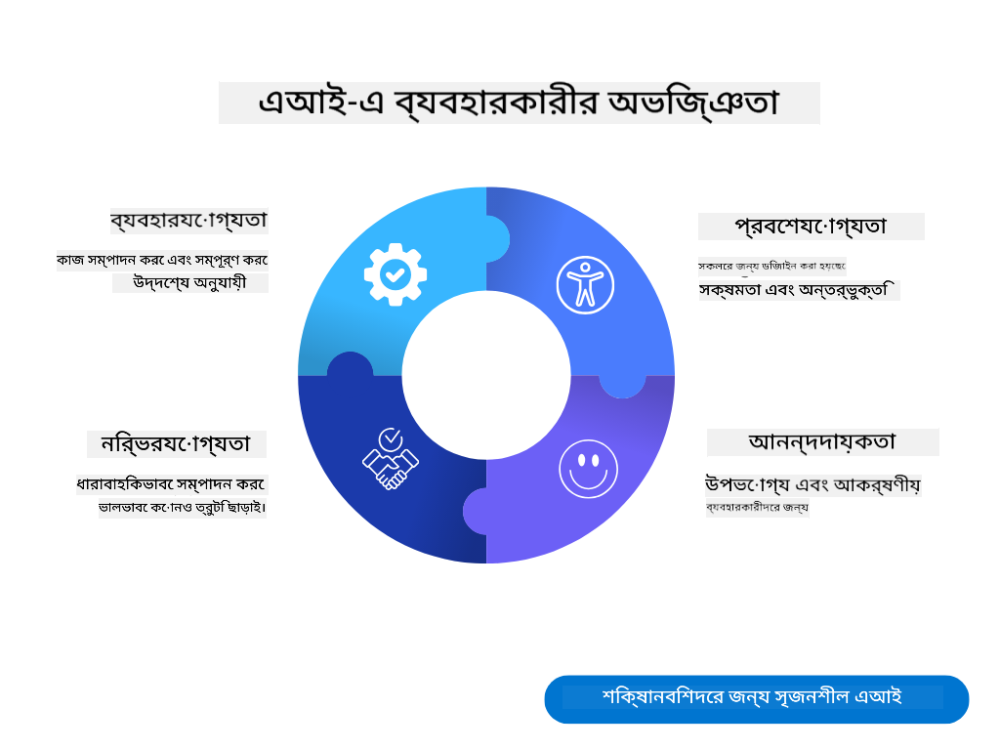
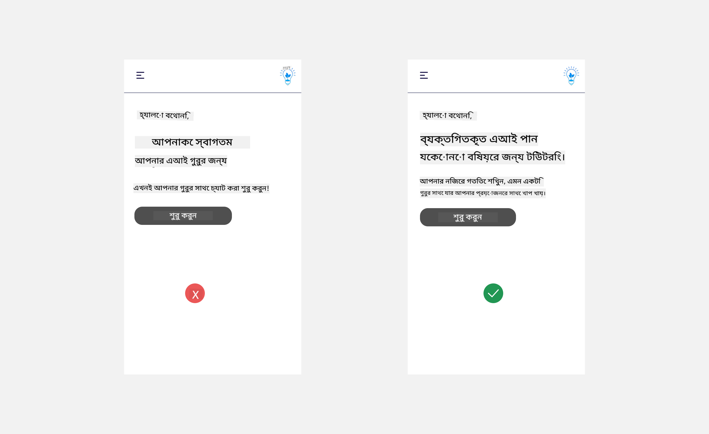
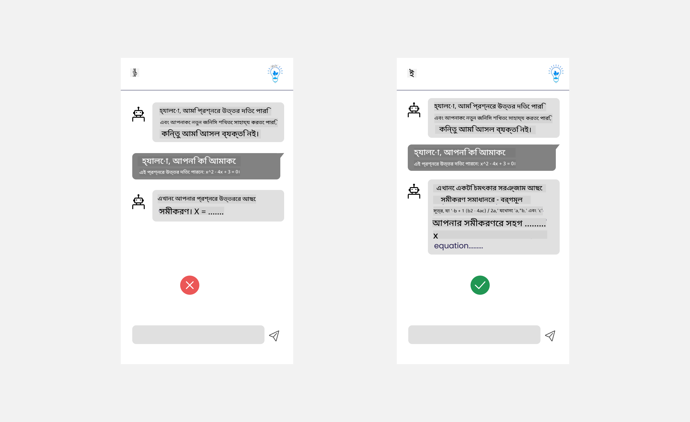
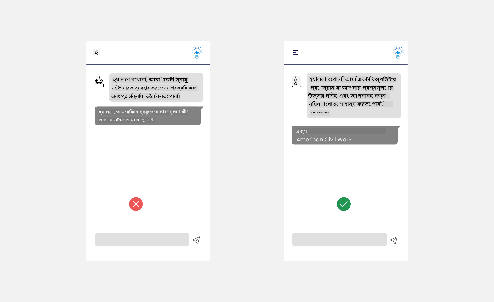
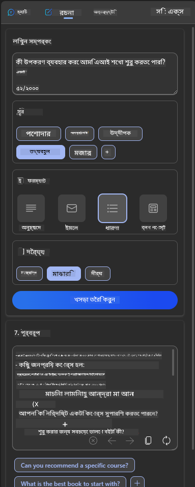
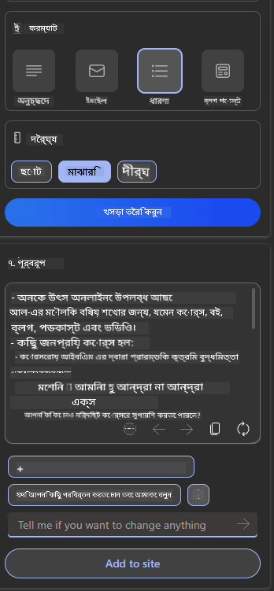
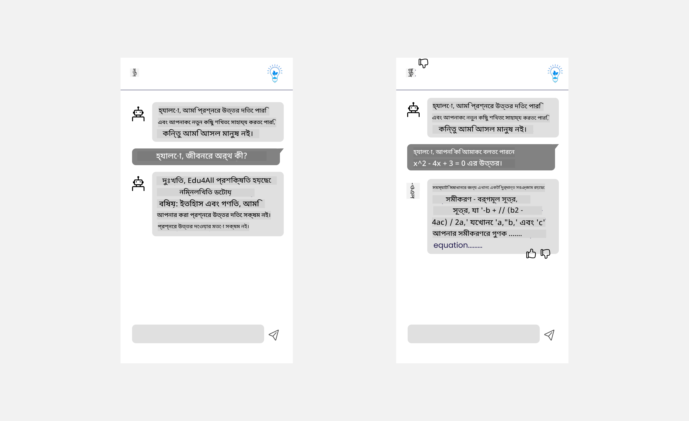

<!--
CO_OP_TRANSLATOR_METADATA:
{
  "original_hash": "ec385b41ee50579025d50cc03bfb3a25",
  "translation_date": "2025-05-19T21:48:56+00:00",
  "source_file": "12-designing-ux-for-ai-applications/README.md",
  "language_code": "bn"
}
-->
# এআই অ্যাপ্লিকেশনের জন্য ইউএক্স ডিজাইন

ব্যবহারকারীর অভিজ্ঞতা (ইউএক্স) অ্যাপ তৈরি করার একটি অত্যন্ত গুরুত্বপূর্ণ দিক। ব্যবহারকারীদের আপনার অ্যাপটি দক্ষতার সাথে ব্যবহার করে কাজ সম্পন্ন করতে সক্ষম হতে হবে। দক্ষ হওয়া এক বিষয়, তবে আপনাকে এমনভাবে অ্যাপ ডিজাইন করতে হবে যাতে এটি সবাই ব্যবহার করতে পারে, অর্থাৎ অ্যাপটি _অ্যাক্সেসযোগ্য_ করতে হবে। এই অধ্যায়টি এই এলাকায় মনোনিবেশ করবে যাতে আপনি এমন একটি অ্যাপ ডিজাইন করতে পারেন যা মানুষ ব্যবহার করতে পারে এবং করতে চায়।

## পরিচিতি

ব্যবহারকারীর অভিজ্ঞতা হল ব্যবহারকারী কীভাবে একটি নির্দিষ্ট পণ্য বা পরিষেবা, এটি একটি সিস্টেম, সরঞ্জাম বা ডিজাইন হোক, এর সাথে যোগাযোগ করে এবং ব্যবহার করে। এআই অ্যাপ্লিকেশন তৈরি করার সময়, ডেভেলপাররা কেবলমাত্র ব্যবহারকারীর অভিজ্ঞতাকে কার্যকর করার দিকে মনোনিবেশ করে না বরং নৈতিকতার দিকেও মনোযোগ দেয়। এই পাঠে, আমরা কিভাবে ব্যবহারকারীর প্রয়োজনগুলি পূরণ করে এমন কৃত্রিম বুদ্ধিমত্তা (এআই) অ্যাপ্লিকেশন তৈরি করা যায় তা আলোচনা করব।

এই পাঠে নিম্নলিখিত বিষয়গুলি অন্তর্ভুক্ত থাকবে:

- ব্যবহারকারীর অভিজ্ঞতার পরিচিতি এবং ব্যবহারকারীর প্রয়োজনগুলি বোঝা
- বিশ্বাস এবং স্বচ্ছতার জন্য এআই অ্যাপ্লিকেশন ডিজাইন করা
- সহযোগিতা এবং প্রতিক্রিয়ার জন্য এআই অ্যাপ্লিকেশন ডিজাইন করা

## শেখার লক্ষ্য

এই পাঠ গ্রহণের পর, আপনি সক্ষম হবেন:

- কিভাবে ব্যবহারকারীর প্রয়োজন মেটাতে এআই অ্যাপ্লিকেশন তৈরি করা যায় তা বোঝা।
- বিশ্বাস এবং সহযোগিতা প্রচার করে এমন এআই অ্যাপ্লিকেশন ডিজাইন করা।

### প্রয়োজনীয়তা

কিছু সময় নিন এবং [ব্যবহারকারীর অভিজ্ঞতা এবং ডিজাইন চিন্তাভাবনা](https://learn.microsoft.com/training/modules/ux-design?WT.mc_id=academic-105485-koreyst) সম্পর্কে আরও পড়ুন।

## ব্যবহারকারীর অভিজ্ঞতার পরিচিতি এবং ব্যবহারকারীর প্রয়োজনগুলি বোঝা

আমাদের কাল্পনিক শিক্ষা স্টার্টআপে, আমাদের দুটি প্রধান ব্যবহারকারী আছে, শিক্ষক এবং ছাত্র। এই দুটি ব্যবহারকারীর প্রত্যেকেরই অনন্য প্রয়োজন রয়েছে। ব্যবহারকারী-কেন্দ্রিক ডিজাইন ব্যবহারকারীকে অগ্রাধিকার দেয়, নিশ্চিত করে যে পণ্যগুলি তাদের জন্য প্রাসঙ্গিক এবং উপকারী।

অ্যাপ্লিকেশনটি একটি ভাল ব্যবহারকারীর অভিজ্ঞতা প্রদান করার জন্য **উপযোগী, নির্ভরযোগ্য, অ্যাক্সেসযোগ্য এবং আনন্দদায়ক** হওয়া উচিত।

### ব্যবহারযোগ্যতা

উপযোগী হওয়া মানে অ্যাপ্লিকেশনের এমন কার্যকারিতা থাকা যা তার উদ্দেশ্য পূরণ করে, যেমন গ্রেডিং প্রক্রিয়া স্বয়ংক্রিয় করা বা পুনরাবৃত্তির জন্য ফ্ল্যাশকার্ড তৈরি করা। একটি অ্যাপ্লিকেশন যা গ্রেডিং প্রক্রিয়া স্বয়ংক্রিয় করে তা পূর্বনির্ধারিত মানদণ্ডের উপর ভিত্তি করে ছাত্রদের কাজের জন্য সঠিকভাবে এবং দক্ষতার সাথে স্কোর বরাদ্দ করতে সক্ষম হওয়া উচিত। অনুরূপভাবে, একটি অ্যাপ্লিকেশন যা পুনরাবৃত্তি ফ্ল্যাশকার্ড তৈরি করে তা তার ডেটার উপর ভিত্তি করে প্রাসঙ্গিক এবং বৈচিত্র্যময় প্রশ্ন তৈরি করতে সক্ষম হওয়া উচিত।

### নির্ভরযোগ্যতা

নির্ভরযোগ্য হওয়া মানে অ্যাপ্লিকেশনটি ধারাবাহিকভাবে এবং ত্রুটি ছাড়াই তার কাজ সম্পাদন করতে সক্ষম। তবে, এআই মানুষের মতোই নিখুঁত নয় এবং ত্রুটিপ্রবণ হতে পারে। অ্যাপ্লিকেশনগুলি এমন ত্রুটি বা অপ্রত্যাশিত পরিস্থিতির সম্মুখীন হতে পারে যা মানব হস্তক্ষেপ বা সংশোধনের প্রয়োজন। আপনি কিভাবে ত্রুটি পরিচালনা করবেন? এই পাঠের শেষ অংশে, আমরা আলোচনা করব কিভাবে সহযোগিতা এবং প্রতিক্রিয়ার জন্য এআই সিস্টেম এবং অ্যাপ্লিকেশন ডিজাইন করা হয়।

### অ্যাক্সেসযোগ্যতা

অ্যাক্সেসযোগ্য হওয়া মানে বিভিন্ন ক্ষমতার ব্যবহারকারীদের জন্য ব্যবহারকারীর অভিজ্ঞতা প্রসারিত করা, যার মধ্যে প্রতিবন্ধী ব্যক্তিরাও অন্তর্ভুক্ত রয়েছে, নিশ্চিত করে যে কেউ বাদ না পড়ে। অ্যাক্সেসযোগ্যতার নির্দেশিকা এবং নীতিগুলি অনুসরণ করে, এআই সমাধানগুলি আরও অন্তর্ভুক্তিমূলক, ব্যবহারযোগ্য এবং সমস্ত ব্যবহারকারীর জন্য উপকারী হয়ে ওঠে।

### আনন্দদায়ক

আনন্দদায়ক হওয়া মানে অ্যাপ্লিকেশনটি ব্যবহার করতে উপভোগ্য। একটি আকর্ষণীয় ব্যবহারকারীর অভিজ্ঞতা ব্যবহারকারীর উপর ইতিবাচক প্রভাব ফেলতে পারে, তাদের অ্যাপ্লিকেশনে ফিরে আসতে উৎসাহিত করে এবং ব্যবসার রাজস্ব বাড়ায়।

প্রতিটি চ্যালেঞ্জ এআই দিয়ে সমাধান করা যায় না। এআই আপনার ব্যবহারকারীর অভিজ্ঞতাকে বাড়িয়ে তুলতে আসে, এটি ম্যানুয়াল কাজ স্বয়ংক্রিয় করা হোক বা ব্যবহারকারীর অভিজ্ঞতা ব্যক্তিগতকৃত করা হোক।

## বিশ্বাস এবং স্বচ্ছতার জন্য এআই অ্যাপ্লিকেশন ডিজাইন করা

এআই অ্যাপ্লিকেশন ডিজাইন করার সময় বিশ্বাস তৈরি করা সমালোচনামূলক। বিশ্বাস নিশ্চিত করে যে একজন ব্যবহারকারী আত্মবিশ্বাসী যে অ্যাপ্লিকেশনটি কাজটি সম্পন্ন করবে, ধারাবাহিকভাবে ফলাফল প্রদান করবে এবং ফলাফলগুলি ব্যবহারকারীর প্রয়োজনের সাথে মেলে। এই এলাকায় একটি ঝুঁকি হল অবিশ্বাস এবং অতিরিক্ত বিশ্বাস। অবিশ্বাস ঘটে যখন একজন ব্যবহারকারীর একটি এআই সিস্টেমের উপর সামান্য বা কোন বিশ্বাস থাকে না, এটি ব্যবহারকারীকে আপনার অ্যাপ্লিকেশন প্রত্যাখ্যান করতে পরিচালিত করে। অতিরিক্ত বিশ্বাস ঘটে যখন একজন ব্যবহারকারী একটি এআই সিস্টেমের ক্ষমতাকে অতিরিক্ত মূল্যায়ন করে, ব্যবহারকারীদের এআই সিস্টেমের উপর খুব বেশি বিশ্বাস করতে পরিচালিত করে। উদাহরণস্বরূপ, অতিরিক্ত বিশ্বাসের ক্ষেত্রে একটি স্বয়ংক্রিয় গ্রেডিং সিস্টেম শিক্ষককে কিছু কাগজপত্র প্রমাণ না করার দিকে পরিচালিত করতে পারে যাতে নিশ্চিত করা যায় যে গ্রেডিং সিস্টেমটি ভালভাবে কাজ করে। এটি ছাত্রদের জন্য অন্যায্য বা ভুল গ্রেড বা প্রতিক্রিয়া এবং উন্নতির জন্য সুযোগ হারাতে পারে।

বিশ্বাসকে ডিজাইনের কেন্দ্রে রাখতে দুটি উপায় হল ব্যাখ্যা এবং নিয়ন্ত্রণ।

### ব্যাখ্যা

যখন এআই ভবিষ্যৎ প্রজন্মের কাছে জ্ঞান প্রদান করার মতো সিদ্ধান্তের তথ্য দিতে সাহায্য করে, তখন শিক্ষক এবং অভিভাবকদের এআই সিদ্ধান্তগুলি কীভাবে নেওয়া হয় তা বোঝা গুরুত্বপূর্ণ। এটি হল ব্যাখ্যা - এআই অ্যাপ্লিকেশনগুলি কীভাবে সিদ্ধান্ত নেয় তা বোঝা। ব্যাখ্যার জন্য ডিজাইন করার মধ্যে এআই অ্যাপ্লিকেশন কী করতে পারে তার উদাহরণগুলির বিশদ যোগ করা অন্তর্ভুক্ত। উদাহরণস্বরূপ, "এআই শিক্ষক দিয়ে শুরু করুন" এর পরিবর্তে, সিস্টেমটি ব্যবহার করতে পারে: "এআই ব্যবহার করে আপনার নোটগুলি সহজতর পুনরাবৃত্তির জন্য সারাংশ করুন।"

আরেকটি উদাহরণ হল এআই কীভাবে ব্যবহারকারী এবং ব্যক্তিগত ডেটা ব্যবহার করে। উদাহরণস্বরূপ, একটি ব্যবহারকারী যার ব্যক্তিত্ব ছাত্র তাদের ব্যক্তিত্বের উপর ভিত্তি করে সীমাবদ্ধতা থাকতে পারে। এআই প্রশ্নের উত্তর প্রকাশ করতে সক্ষম নাও হতে পারে তবে ব্যবহারকারীকে কীভাবে তারা একটি সমস্যা সমাধান করতে পারে তা ভাবতে গাইড করতে পারে।

ব্যাখ্যার একটি শেষ গুরুত্বপূর্ণ অংশ হল ব্যাখ্যার সরলীকরণ। ছাত্র এবং শিক্ষক এআই বিশেষজ্ঞ নাও হতে পারে, তাই অ্যাপ্লিকেশনটি কী করতে পারে বা কী করতে পারে না তার ব্যাখ্যা সহজ এবং বোঝার সহজ হওয়া উচিত।

### নিয়ন্ত্রণ

জেনারেটিভ এআই এআই এবং ব্যবহারকারীর মধ্যে একটি সহযোগিতা তৈরি করে, যেখানে উদাহরণস্বরূপ একজন ব্যবহারকারী বিভিন্ন ফলাফলের জন্য প্রম্পটগুলি পরিবর্তন করতে পারে। তাছাড়া, একবার একটি আউটপুট তৈরি হলে, ব্যবহারকারীরা ফলাফলগুলি পরিবর্তন করতে সক্ষম হওয়া উচিত যাতে তাদের নিয়ন্ত্রণের অনুভূতি দেওয়া যায়। উদাহরণস্বরূপ, Bing ব্যবহার করার সময়, আপনি ফরম্যাট, টোন এবং দৈর্ঘ্যের উপর ভিত্তি করে আপনার প্রম্পটটি কাস্টমাইজ করতে পারেন। তাছাড়া, আপনি আপনার আউটপুটে পরিবর্তন যোগ করতে পারেন এবং আউটপুটটি নীচের মতো পরিবর্তন করতে পারেন:

Bing-এর আরেকটি বৈশিষ্ট্য যা ব্যবহারকারীকে অ্যাপ্লিকেশনের উপর নিয়ন্ত্রণ প্রদান করে তা হল এআই যে ডেটা ব্যবহার করে তাতে প্রবেশ এবং প্রস্থান করার ক্ষমতা। একটি স্কুল অ্যাপ্লিকেশনের জন্য, একজন ছাত্র তাদের নোটগুলি পাশাপাশি শিক্ষকদের সংস্থানগুলি পুনরাবৃত্তি উপাদান হিসাবে ব্যবহার করতে চাইতে পারে।

> এআই অ্যাপ্লিকেশন ডিজাইন করার সময়, ব্যবহারকারীরা এর ক্ষমতার অযৌক্তিক প্রত্যাশা নির্ধারণ না করে তা নিশ্চিত করার জন্য উদ্দেশ্যমূলকতা গুরুত্বপূর্ণ। এটি করার একটি উপায় হল প্রম্পট এবং ফলাফলের মধ্যে ঘর্ষণ তৈরি করা। ব্যবহারকারীকে মনে করিয়ে দেওয়া, এটি একটি এআই এবং একজন সহকর্মী মানুষ নয়

## সহযোগিতা এবং প্রতিক্রিয়ার জন্য এআই অ্যাপ্লিকেশন ডিজাইন করা

আগে উল্লেখ করা হয়েছে, জেনারেটিভ এআই ব্যবহারকারী এবং এআই এর মধ্যে একটি সহযোগিতা তৈরি করে। বেশিরভাগ ব্যস্ততা একটি ব্যবহারকারী একটি প্রম্পট ইনপুট এবং এআই একটি আউটপুট তৈরি করে। যদি আউটপুটটি ভুল হয় তবে কী হবে? যদি ত্রুটি ঘটে তবে অ্যাপ্লিকেশনটি কীভাবে ত্রুটি পরিচালনা করে? এআই কি ব্যবহারকারীকে দোষারোপ করে নাকি ত্রুটির ব্যাখ্যা দেওয়ার জন্য সময় নেয়?

এআই অ্যাপ্লিকেশনগুলি প্রতিক্রিয়া পেতে এবং দিতে তৈরি করা উচিত। এটি কেবল এআই সিস্টেমকে উন্নত করতে সহায়তা করে না বরং ব্যবহারকারীদের সাথে বিশ্বাস তৈরি করে। ডিজাইনে একটি প্রতিক্রিয়া লুপ অন্তর্ভুক্ত করা উচিত, একটি উদাহরণ হতে পারে আউটপুটে একটি সাধারণ থাম্বস আপ বা ডাউন।

এটি পরিচালনা করার আরেকটি উপায় হল সিস্টেমের ক্ষমতা এবং সীমাবদ্ধতাগুলি স্পষ্টভাবে যোগাযোগ করা। যখন একজন ব্যবহারকারী এআই ক্ষমতার বাইরে কিছু চাওয়ার ভুল করে, তখন এটি পরিচালনা করার একটি উপায়ও থাকা উচিত, যেমন নীচে দেখানো হয়েছে।

সিস্টেম ত্রুটি অ্যাপ্লিকেশনগুলির সাথে সাধারণ যেখানে ব্যবহারকারীকে এআই-এর সুযোগের বাইরে থাকা তথ্যের সহায়তা প্রয়োজন হতে পারে বা অ্যাপ্লিকেশনে ব্যবহারকারী কতগুলি প্রশ্ন/বিষয় তৈরি করতে পারে তার উপর একটি সীমা থাকতে পারে। উদাহরণস্বরূপ, সীমিত বিষয়ের ডেটা সহ প্রশিক্ষিত একটি এআই অ্যাপ্লিকেশন, উদাহরণস্বরূপ, ইতিহাস এবং গণিত, ভূগোলের আশেপাশের প্রশ্নগুলি পরিচালনা করতে সক্ষম নাও হতে পারে। এটি কমানোর জন্য, এআই সিস্টেমটি এমন একটি প্রতিক্রিয়া দিতে পারে: "দুঃখিত, আমাদের পণ্যটি নিম্নলিখিত বিষয়গুলির ডেটা দিয়ে প্রশিক্ষিত হয়েছে....., আমি আপনার জিজ্ঞাসা করা প্রশ্নের উত্তর দিতে সক্ষম নই।"

এআই অ্যাপ্লিকেশনগুলি নিখুঁত নয়, তাই তারা ভুল করতে বাধ্য। আপনার অ্যাপ্লিকেশন ডিজাইন করার সময়, আপনাকে ব্যবহারকারীদের কাছ থেকে প্রতিক্রিয়া এবং ত্রুটি পরিচালনার জন্য একটি সহজ এবং সহজে ব্যাখ্যা করার উপায় তৈরি করতে হবে তা নিশ্চিত করা উচিত।

## অ্যাসাইনমেন্ট

এখন পর্যন্ত আপনি যে কোনও এআই অ্যাপ তৈরি করেছেন, আপনার অ্যাপে নিম্নলিখিত পদক্ষেপগুলি বাস্তবায়ন করার কথা বিবেচনা করুন:

- **আনন্দদায়ক:** কিভাবে আপনি আপনার অ্যাপকে আরও আনন্দদায়ক করতে পারেন তা বিবেচনা করুন। আপনি কি সর্বত্র ব্যাখ্যা যোগ করছেন? আপনি কি ব্যবহারকারীকে অন্বেষণ করতে উৎসাহিত করছেন? আপনি কীভাবে আপনার ত্রুটির বার্তাগুলি শব্দ করছেন?

- **ব্যবহারযোগ্যতা:** একটি ওয়েব অ্যাপ তৈরি করা। নিশ্চিত করুন যে আপনার অ্যাপটি মাউস এবং কীবোর্ড উভয় দ্বারা নেভিগেট করা যায়।

- **বিশ্বাস এবং স্বচ্ছতা:** এআই এবং এর আউটপুটের উপর সম্পূর্ণ বিশ্বাস করবেন না, প্রক্রিয়ায় আউটপুট যাচাই করার জন্য কীভাবে একজন মানুষকে যুক্ত করবেন তা বিবেচনা করুন। এছাড়াও, বিশ্বাস এবং স্বচ্ছতা অর্জনের জন্য অন্যান্য উপায় বিবেচনা এবং বাস্তবায়ন করুন।

- **নিয়ন্ত্রণ:** ব্যবহারকারীকে তারা অ্যাপ্লিকেশনটিতে যে ডেটা সরবরাহ করে তার নিয়ন্ত্রণ দিন। এআই অ্যাপ্লিকেশনে ডেটা সংগ্রহে একজন ব্যবহারকারী কীভাবে অন্তর্ভুক্ত এবং বাদ দিতে পারেন তার একটি উপায় বাস্তবায়ন করুন।

## আপনার শেখা চালিয়ে যান!

এই পাঠ সম্পন্ন করার পরে, আমাদের [জেনারেটিভ এআই শেখার সংগ্রহ](https://aka.ms/genai-collection?WT.mc_id=academic-105485-koreyst) পরীক্ষা করে আপনার জেনারেটিভ এআই জ্ঞানকে আরও বাড়িয়ে তুলুন!

পাঠ ১৩ এ যান, যেখানে আমরা কিভাবে [এআই অ্যাপ্লিকেশনগুলি সুরক্ষিত করা যায়](../13-securing-ai-applications/README.md?WT.mc_id=academic-105485-koreyst) তা দেখব!

**অস্বীকৃতি**:  
এই নথিটি AI অনুবাদ পরিষেবা [Co-op Translator](https://github.com/Azure/co-op-translator) ব্যবহার করে অনুবাদ করা হয়েছে। আমরা যথাসাধ্য সঠিকতা নিশ্চিত করার চেষ্টা করি, তবে অনুগ্রহ করে সচেতন থাকুন যে স্বয়ংক্রিয় অনুবাদে ত্রুটি বা অসঙ্গতি থাকতে পারে। এর মূল ভাষায় থাকা নথিটিকে প্রামাণিক উৎস হিসেবে বিবেচনা করা উচিত। গুরুত্বপূর্ণ তথ্যের জন্য, পেশাদার মানব অনুবাদ সুপারিশ করা হয়। এই অনুবাদ ব্যবহারের ফলে উদ্ভূত কোনো ভুল বোঝাবুঝি বা ভুল ব্যাখ্যার জন্য আমরা দায়ী নই।