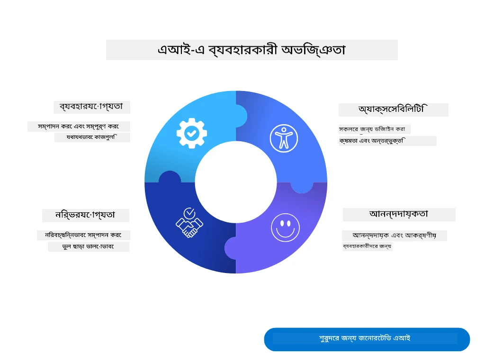
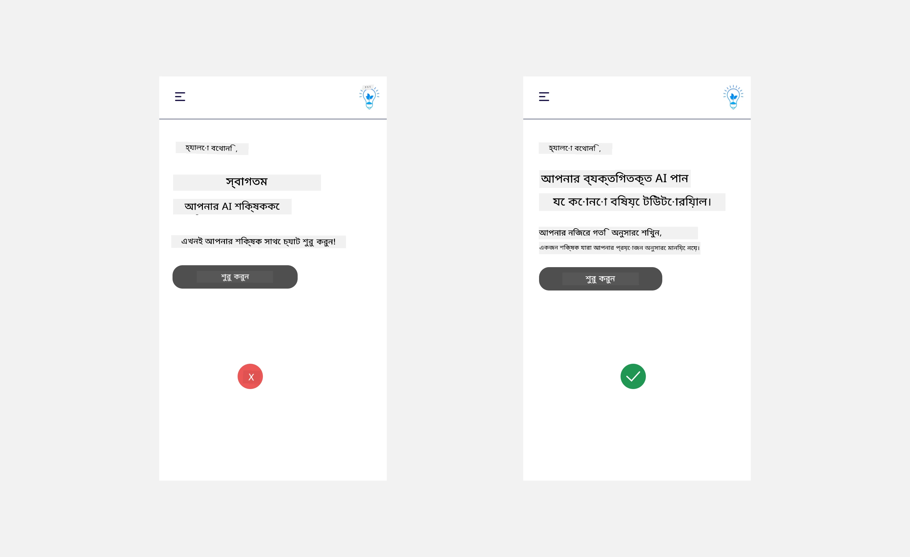
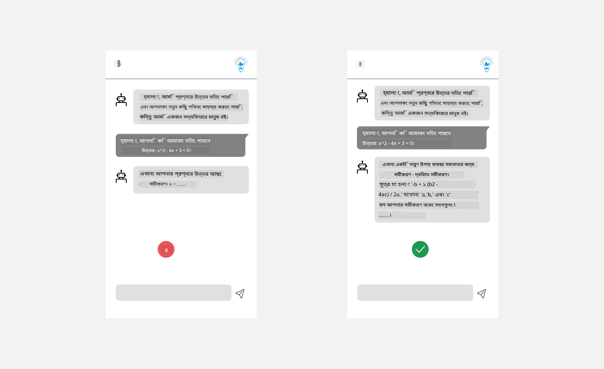
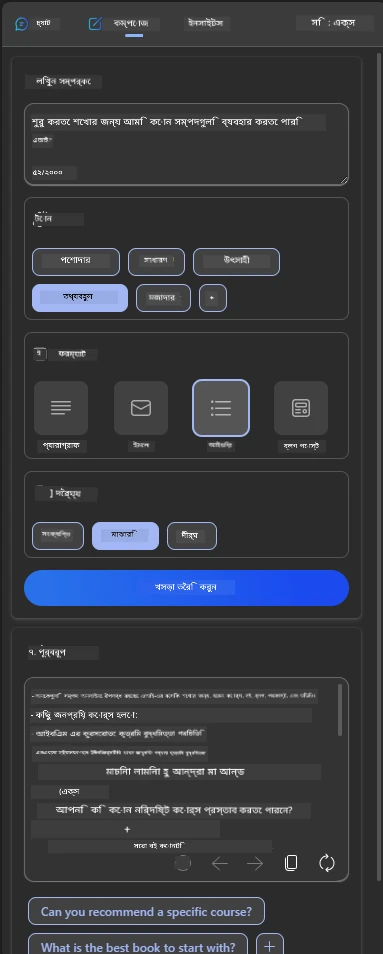
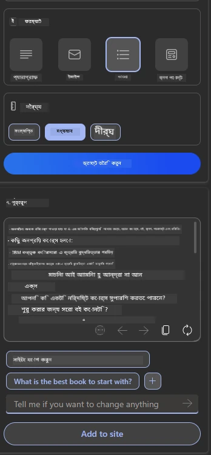
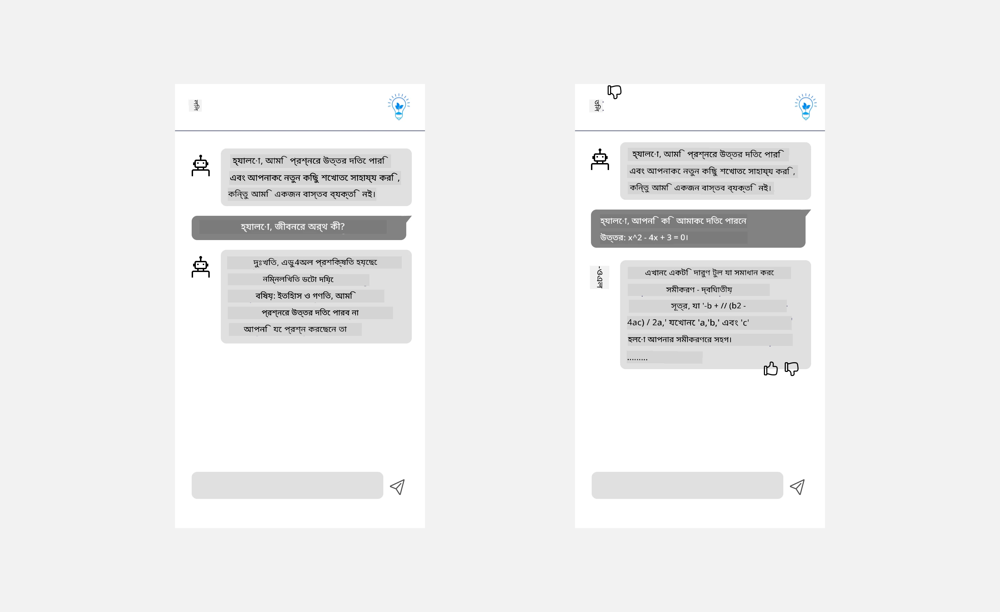

# AI অ্যাপ্লিকেশনগুলোর জন্য UX ডিজাইনিং

> _(এই ছবিতে ক্লিক করে এই পাঠের ভিডিও দেখুন)_

ব্যবহারকারীর অভিজ্ঞতা অ্যাপ তৈরি করার একটি অত্যন্ত গুরুত্বপূর্ণ দিক। ব্যবহারকারীরা কর্ম সম্পাদনের জন্য দক্ষতার সঙ্গে আপনার অ্যাপ ব্যবহার করতে পারা প্রয়োজন। দক্ষতা থাকা এক কথা, কিন্তু আপনাকে এমন অ্যাপ ডিজাইন করতেও হবে যেগুলো সবাই ব্যবহার করতে পারবে, অর্থাৎ অ্যাক্সেসযোগ্য হবে। এই অধ্যায়টি এই এলাকায় ফোকাস করবে যাতে আপনি এমন একটি অ্যাপ ডিজাইন করতে পারেন যা মানুষ ব্যবহার করতে চায় এবং পারে।

## পরিচিতি

ব্যবহারকারীর অভিজ্ঞতা হলো ব্যবহারকারীর একটি নির্দিষ্ট পণ্য বা পরিষেবা যেমন সিস্টেম, টুল বা ডিজাইন কীভাবে ইন্টারঅ্যাক্ট করে এবং ব্যবহার করে। AI অ্যাপ্লিকেশন তৈরি করার সময়, ডেভেলপাররা শুধুমাত্র ব্যবহারকারীর অভিজ্ঞতা কার্যকর রাখা নয়, তা নৈতিকও রাখতে মনোযোগ দেন। এই পাঠে, আমরা কভার করব কীভাবে এমন আর্টিফিশিয়াল ইন্টেলিজেন্স (AI) অ্যাপ্লিকেশন তৈরি করবেন যা ব্যবহারকারীর চাহিদাগুলো পূরণ করে।

এই পাঠের বিষয়বস্তুসমূহ হবে:

- ব্যবহারকারীর অভিজ্ঞতার পরিচিতি এবং ব্যবহারকারীর চাহিদা বোঝা
- বিশ্বাস এবং স্বচ্ছতার জন্য AI অ্যাপ্লিকেশন ডিজাইন করা
- সহযোগিতা এবং প্রতিক্রিয়ার জন্য AI অ্যাপ্লিকেশন ডিজাইন করা

## শেখার লক্ষ্যসমূহ

এই পাঠ শেষে আপনি সক্ষম হবেন:

- ব্যবহারকারীর চাহিদা পূরণকারী AI অ্যাপ্লিকেশন তৈরি করা বোঝা।
- বিশ্বাস এবং সহযোগিতা বাড়ানোর জন্য AI অ্যাপ্লিকেশন ডিজাইন করা।

### পূর্বপ্রয়োজনীয়তা

কিছু সময় নিয়ে [ব্যবহারকারীর অভিজ্ঞতা এবং ডিজাইন চিন্তা সম্পর্কে](https://learn.microsoft.com/training/modules/ux-design?WT.mc_id=academic-105485-koreyst) আরও পড়ুন।

## ব্যবহারকারীর অভিজ্ঞতার পরিচিতি এবং ব্যবহারকারীর চাহিদা বোঝা

আমাদের কাল্পনিক শিক্ষা স্টার্টআপে, আমাদের দুই প্রধান ব্যবহারকারী আছে, শিক্ষক এবং ছাত্র। প্রতিটি ব্যবহারকারীর আলাদা চাহিদা রয়েছে। ব্যবহারকারী-কেন্দ্রিক ডিজাইন ব্যবহারকারীকে অগ্রাধিকার দেয় যাতে পণ্যগুলি সংশ্লিষ্ট এবং তাদের জন্য উপকারী হয় যাদের জন্য তা তৈরি করা হয়েছে।

অ্যাপ্লিকেশনটি **ব্যবহারযোগ্য, নির্ভরযোগ্য, অ্যাক্সেসযোগ্য এবং মনোরম** হওয়া উচিত একটি ভালো ব্যবহারকারীর অভিজ্ঞতা দিতে।

### ব্যবহারযোগ্যতা

ব্যবহারযোগ্য হওয়ার মানে হলো যে অ্যাপ্লিকেশনটির কার্যকারিতা তার উদ্দেশ্যটির সাথে মিলে যেমন গ্রেডিং প্রক্রিয়া স্বয়ংক্রিয়করণ বা পর্যালোচনার জন্য ফ্ল্যাশকার্ড তৈরি করা। একটি গ্রেডিং স্বয়ংক্রিয়করণ অ্যাপ্লিকেশন পূর্বনির্ধারিত মানদণ্ড অনুযায়ী ছাত্রদের কাজের স্কোর সঠিক এবং দক্ষতার সঙ্গে নির্ধারণ করতে পারে। একইভাবে, একটি পর্যালোচনার ফ্ল্যাশকার্ড তৈরি করা অ্যাপ্লিকেশন তার ডেটার ভিত্তিতে সংশ্লিষ্ট এবং বৈচিত্র্যময় প্রশ্ন তৈরি করতে পারে।

### নির্ভরযোগ্যতা

নির্ভরযোগ্য হওয়ার অর্থ হচ্ছে অ্যাপ্লিকেশনটি ধারাবাহিকভাবে এবং ত্রুটিমুক্ত কাজ করতে পারা। তবে, AI মানুষের মতো নিখুঁত নয় এবং ত্রুটি ঘটতে পারে। অ্যাপ্লিকেশনগুলোতে ত্রুটি বা অপ্রত্যাশিত পরিস্থিতি দেখা দিতে পারে যা মানুষের হস্তক্ষেপ বা সংশোধনের প্রয়োজন হতে পারে। আপনি কীভাবে ত্রুটির মোকাবিলা করেন? এই পাঠের শেষ অংশে আমরা কিভাবে AI সিস্টেম এবং অ্যাপ্লিকেশনগুলো সহযোগিতা এবং প্রতিক্রিয়ার জন্য ডিজাইন করা হয় তা আলোচনা করব।

### অ্যাক্সেসযোগ্যতা

অ্যাক্সেসযোগ্য হওয়ার মানে হলো বিভিন্ন সক্ষমতার ব্যবহারকারীদের জন্য ব্যবহারকারীর অভিজ্ঞতা বিস্তৃত করা, যার মধ্যে প্রতিবন্ধী ব্যক্তিরাও অন্তর্ভুক্ত, যাতে কেউ বাদ না পড়ে। অ্যাক্সেসযোগ্যতা নির্দেশিকা এবং নীতিমালা মেনে চলায় AI সমাধানগুলো আরো অন্তর্ভুক্তিমূলক, ব্যবহারযোগ্য এবং সকল ব্যবহারকারীর জন্য উপকারী হয়।

### মনোরম

মনোরম হওয়ার অর্থ হলো অ্যাপ্লিকেশনটি ব্যবহার করতে উপভোগ্য হওয়া। একটি আকর্ষণীয় ব্যবহারকারীর অভিজ্ঞতা ব্যবহারকারীর উপর ইতিবাচক প্রভাব ফেলে এবং তাদের অ্যাপ্লিকেশনটিতে আবার ফিরে আসার জন্য উৎসাহিত করে এবং ব্যবসায়িক আয় বৃদ্ধি করে।

সব সমস্যার সমাধান AI দিয়ে সম্ভব নয়। AI আপনার ব্যবহারকারীর অভিজ্ঞতা বাড়াতে আসে, তা হয় ম্যানুয়াল কাজ স্বয়ংক্রিয়করণ, বা ব্যবহারকারীর অভিজ্ঞতা ব্যক্তিগতকরণ।

## বিশ্বাস এবং স্বচ্ছতার জন্য AI অ্যাপ্লিকেশন ডিজাইন করা

AI অ্যাপ্লিকেশন ডিজাইনে বিশ্বাস তৈরী করা অত্যন্ত গুরুত্বপূর্ণ। বিশ্বাস ব্যবহারকারীকে নিশ্চিত করে যে অ্যাপ্লিকেশনটি কাজ করবে, ধারাবাহিকভাবে ফলাফল প্রদান করবে এবং ফলাফলগুলোই ব্যবহারকারীর প্রয়োজন। এই ক্ষেত্রে ঝুঁকি হলো অবিশ্বাস এবং অতিরিক্ত বিশ্বাস। অবিশ্বাস ঘটে যখন ব্যবহারকারীর AI সিস্টেমের প্রতি খুব কম বা কোনো বিশ্বাস নেই, ফলে তারা আপনার অ্যাপ্লিকেশন প্রত্যাখ্যান করে। অতিরিক্ত বিশ্বাস ঘটে যখন ব্যবহারকারী AI সিস্টেমের ক্ষমতা বেশি হিসাব করে, ফলে তারা AI সিস্টেমের ওপর অত্যধিক বিশ্বাস স্থাপন করে। উদাহরণস্বরূপ, অটোমেটেড গ্রেডিং সিস্টেমে অতিরিক্ত বিশ্বাস হলে শিক্ষক হয়তো কিছু নথি পরীক্ষা করবেন না নিশ্চিত করতে যে গ্রেডিং সিস্টেম সঠিকভাবে কাজ করছে কিনা, যা ছাত্রদের জন্য অন্যায় বা ভুল গ্রেড হতে পারে অথবা প্রতিক্রিয়া এবং উন্নতির সুযোগ হারাতে পারে।

বিশ্বাস ডিজাইনের কেন্দ্রে স্থাপন করার দুই উপায় হলো ব্যাখ্যাত্মকতা এবং নিয়ন্ত্রণ।

### ব্যাখ্যাত্মকতা

যখন AI ভবিষ্যত প্রজন্মকে জ্ঞান প্রদান করার মতো সিদ্ধান্তে সাহায্য করে, তখন শিক্ষার্থী ও অভিভাবকদের বোঝা জরুরি AI সিদ্ধান্তগুলো কীভাবে নেওয়া হয়। এটিই ব্যাখ্যাত্মকতা — বুঝতে পারা কিভাবে AI অ্যাপ্লিকেশন সিদ্ধান্ত নেয়। ব্যাখ্যাত্মকতার জন্য ডিজাইনে AI কীভাবে আউটপুটে এসেছে তা প্রদর্শনের বিস্তারিত যোগ করা হয়। দর্শককে জানাতে হবে আউটপুট AI দ্বারা তৈরি, মানুষের দ্বারা নয়। উদাহরণস্বরূপ, "এখনই আপনার টিউটরের সাথে চ্যাট শুরু করুন" বলার পরিবর্তে বলুন "AI টিউটর ব্যবহার করুন যা আপনার চাহিদা অনুযায়ী মানিয়ে নেয় এবং আপনার গতি অনুযায়ী শেখায়।"

আরেকটি উদাহরণ হলো AI কিভাবে ব্যবহারকারীর ব্যক্তিগত ডেটা ব্যবহার করে। উদাহরণস্বরূপ, একজন ছাত্র চরিত্রের ব্যবহারকারীর সীমাবদ্ধতা থাকতে পারে তাদের চরিত্র অনুসারে। AI হয়তো প্রশ্নের উত্তর প্রকাশ করতে পারবে না কিন্তু ব্যবহারকারীকে সমস্যার সমাধান ভাবতে সাহায্য করতে পারে।

ব্যাখ্যাত্মকতার আরেকটি গুরুত্বপূর্ণ অংশ হচ্ছে ব্যাখ্যা সহজ এবং বোধ্য করা। ছাত্র ও শিক্ষকরা AI বিশেষজ্ঞ নাও হতে পারেন, তাই অ্যাপ্লিকেশন কি করতে পারে বা পারে না তা সহজ এবং বোঝাটাও সহজ হওয়া উচিত।

### নিয়ন্ত্রণ

জেনারেটিভ AI AI এবং ব্যবহারকারীর মধ্যে সহযোগিতা সৃষ্টি করে, যেখানে ব্যবহারকারী বিভিন্ন আউটপুটের জন্য প্রম্পট পরিবর্তন করতে পারেন। এছাড়াও, একবার আউটপুট তৈরি হলে ব্যবহারকারীরা ফলাফল পরিবর্তন করতে পারেন যা তাদের নিয়ন্ত্রণের অনুভূতি দেয়। উদাহরণস্বরূপ, Microsoft Copilot (পূর্বে Bing Chat) ব্যবহার করার সময়, আপনি ফরম্যাট, টোন এবং দৈর্ঘ্যের উপর ভিত্তি করে আপনার প্রম্পট পরিবর্তন করতে পারেন। এছাড়াও, আপনি আউটপুট পরিবর্তন এবং পরিবর্তনকে যুক্ত করতে পারেন নিচের মতো:

Microsoft Copilot-এর আরেকটি বৈশিষ্ট্য যা ব্যবহারকারীকে নিয়ন্ত্রণ দেয় তা হলো AI ডেটা ব্যবহারের জন্য অপ্ট ইন ও অপ্ট আউট করার ক্ষমতা। একটি স্কুল অ্যাপ্লিকেশনে, শিক্ষক এবং ছাত্র উভয়ের ব্যক্তিগত নোট ও রিসোর্স ব্যবহার করতে পারেন পুনর্বিবেচনার উপকরণ হিসেবে।

> AI অ্যাপ্লিকেশন ডিজাইনের সময়, ব্যত্যয় সৃষ্টিই গুরুত্বপূর্ণ যাতে ব্যবহারকারীরা অতিরিক্ত বিশ্বাস না করে এবং তার ক্ষমতার ব্যাপারে অবাস্তব প্রত্যাশা না রাখে। এটির একটি উপায় হলো প্রম্পট ও ফলাফলের মধ্যে কিছু বাধা সৃষ্টি করা। ব্যবহারকারীকে স্মরণ করিয়ে দেওয়া যে এটা AI, একজন সহকর্মী মানব নয়।

## সহযোগিতা এবং প্রতিক্রিয়ার জন্য AI অ্যাপ্লিকেশন ডিজাইন করা

আগেই বলা হয়েছে, জেনারেটিভ AI ব্যবহারকারী এবং AI এর মধ্যে সহযোগিতা তৈরি করে। বেশিরভাগ সময় ব্যবহারকারী একটি প্রম্পট দিয়ে এবং AI আউটপুট তৈরি করে। তবে আউটপুট যদি ভুল হয়? ত্রুটি ঘটলে অ্যাপ্লিকেশন কীভাবে তা পরিচালনা করে? AI ব্যবহারকারীকে দোষারোপ করে নাকি ত্রুটির ব্যাখ্যা করে?

AI অ্যাপ্লিকেশনগুলো প্রতিক্রিয়া নেওয়া এবং দেওয়ার জন্য ডিজাইন করা উচিত। এটি কেবল AI সিস্টেম উন্নত করে না, বরং ব্যবহারকারীর সঙ্গে বিশ্বাসও গড়ে তোলে। ডিজাইনে একটি প্রতিক্রিয়া চক্র থাকা উচিত, যেমন আউটপুটে একটি সহজ থাম্বস আপ বা ডাউন।

আরেকটি উপায় হলো সিস্টেমের ক্ষমতা এবং সীমাবদ্ধতাগুলোর স্পষ্ট যোগাযোগ রাখা। যখন ব্যবহারকারী AI ক্ষমতার বাইরে কিছু অনুরোধ করে ভুল করে, তখন সেটি পরিচালনার জন্য একটি ব্যবস্থা থাকা উচিত, যেমন নিচের উদাহরণে দেখানো হয়েছে।

সিস্টেম ত্রুটি সাধারণ, যেখানে ব্যবহারকারী হয়তো AI এর বহির্গত তথ্যের সাহায্য চাইতে পারে বা অ্যাপ্লিকেশন কতগুলো প্রশ্ন/বিষয় সংক্ষিপ্ত করতে পারে তার সীমা থাকতে পারে। উদাহরণস্বরূপ, ইতিহাস এবং গণিতের সীমিত বিষয়ে ট্রেনকৃত AI অ্যাপ্লিকেশন ভূগোল সম্পর্কিত প্রশ্ন সামলাতে নাও পারে। এ থেকে রক্ষা পেতে AI সিস্টেম উত্তর দিতে পারে: "দুঃখিত, আমাদের পণ্য নিম্নলিখিত বিষয়গুলোর তথ্য দিয়ে প্রশিক্ষিত.... আমি আপনার প্রশ্নের উত্তর দিতে পারছি না।"

AI অ্যাপ্লিকেশনগুলো নিখুঁত নয়, তাই ভুল হওয়া স্বাভাবিক। আপনার অ্যাপ ডিজাইন করার সময় ব্যবহারকারীদের থেকে প্রতিক্রিয়ার জন্য জায়গা রাখা এবং ত্রুটি পরিচালনাকে সহজ ও বোধগম্য রাখতে হবে।

## অ্যাসাইনমেন্ট

এখন পর্যন্ত যে কোনো AI অ্যাপ তৈরি করেছেন, সেটিতে নিচের ধাপগুলো প্রয়োগ করার কথা ভাবুন:

- **মনোরম:** কীভাবে আপনার অ্যাপ আরো মনোরম করা যায় বিবেচনা করুন। আপনি কি সর্বত্র ব্যাখ্যা যোগাচ্ছেন? আপনি ব্যবহারকারীকে অনুসন্ধানের জন্য উৎসাহিত করছেন? আপনার ত্রুটি বার্তা কী ভাবে লিখছেন?

- **ব্যবহারযোগ্যতা:** একটি ওয়েব অ্যাপ তৈরি করছেন। নিশ্চিত করুন অ্যাপটি মাউস এবং কিবোর্ড উভয় দ্বারা নেভিগেটেবল।

- **বিশ্বাস ও স্বচ্ছতা:** AI এবং তার আউটপুটে পুরোপুরি বিশ্বাস করবেন না, বিবেচনা করুন স্বাভাবিকভাবে ফলাফল যাচাই করার জন্য একজন মানুষকে প্রক্রিয়ায় অন্তর্ভুক্ত করবেন। এছাড়াও বিশ্বাস এবং স্বচ্ছতা অর্জনের অন্যান্য পথ ভাবুন এবং প্রয়োগ করুন।

- **নিয়ন্ত্রণ:** ব্যবহারকারী যে ডেটা প্রদান করেন অ্যাপ্লিকেশনে তাদের নিয়ন্ত্রণ দিন। এমন একটি ব্যবস্থা প্রয়োগ করুন যা ব্যবহারকারীকে AI অ্যাপ্লিকেশনে ডেটা সংগ্রহের জন্য অপ্ট-ইন এবং অপ্ট-আউট করার সুযোগ দেয়।

<!-- ## [Post-lecture quiz](../../../12-designing-ux-for-ai-applications/quiz-url) -->

## আপনার শেখা চালিয়ে যান!

এই পাঠ শেষ করার পর, আমাদের [জেনারেটিভ AI শেখার সংগ্রহ](https://aka.ms/genai-collection?WT.mc_id=academic-105485-koreyst) দেখুন এবং আপনার জেনারেটিভ AI জ্ঞান উন্নত করতে থাকুন!

পরবর্তী পাঠ ১৩ এ যান, যেখানে আমরা দেখব [AI অ্যাপ্লিকেশনগুলোর সুরক্ষা](../13-securing-ai-applications/README.md?WT.mc_id=academic-105485-koreyst) কীভাবে নিশ্চিত করবেন!

---

<!-- CO-OP TRANSLATOR DISCLAIMER START -->
**অস্বীকৃতি**:
এই নথিটি AI অনুবাদ পরিষেবা [Co-op Translator](https://github.com/Azure/co-op-translator) ব্যবহার করে অনূদিত হয়েছে। যদিও আমরা শুদ্ধতার জন্য চেষ্টা করি, অনুগ্রহ করে মনে রাখবেন যে স্বয়ংক্রিয় অনুবাদে ত্রুটি বা অসঙ্গতি থাকতে পারে। মূল নথিটি তার স্বভাষায় কর্তৃত্বপূর্ণ উৎস হিসেবে বিবেচিত হওয়া উচিত। গুরুত্বপূর্ণ তথ্যের জন্য পেশাদার মানব অনুবাদ সুপারিশ করা হয়। এই অনুবাদের ব্যবহারে প্রয়োজনীয় ভুল বোঝাবুঝি বা ভুল ব্যাখ্যার জন্য আমরা দায়বদ্ধ নই।
<!-- CO-OP TRANSLATOR DISCLAIMER END -->