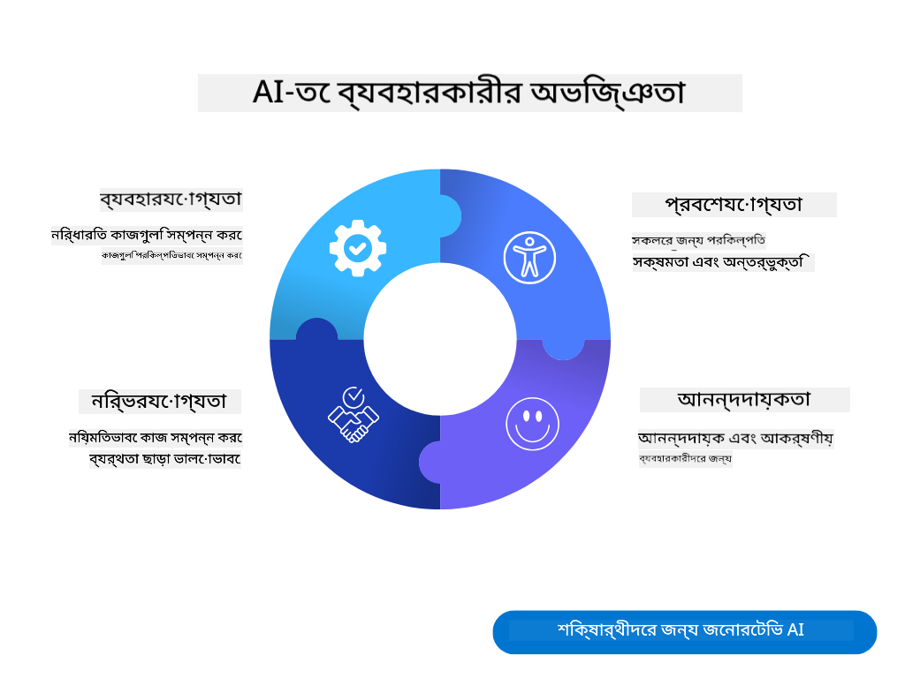
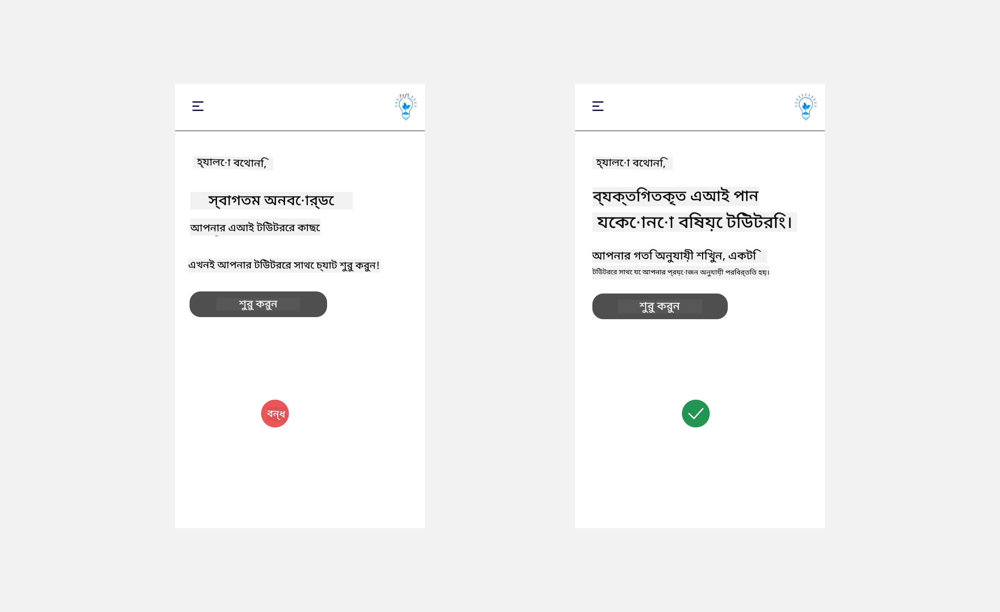
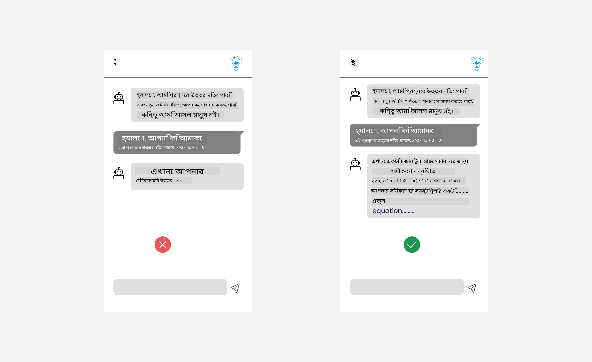
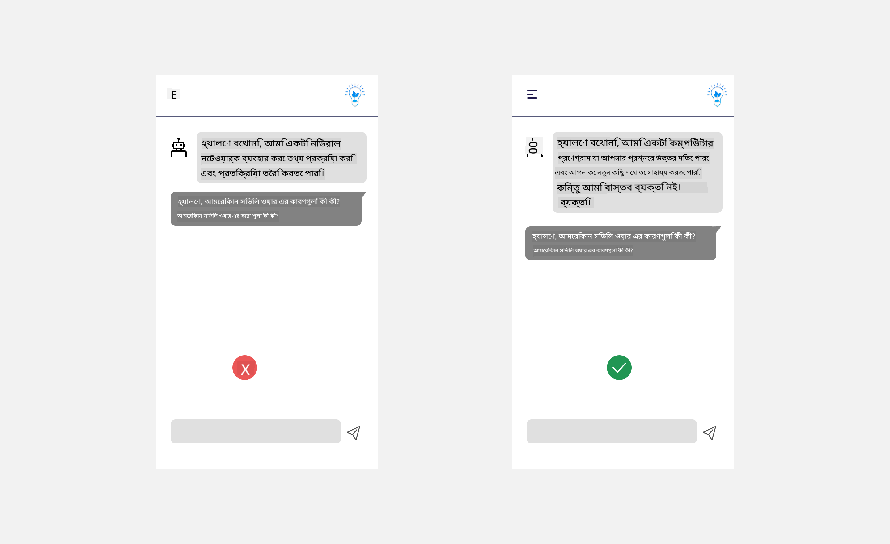
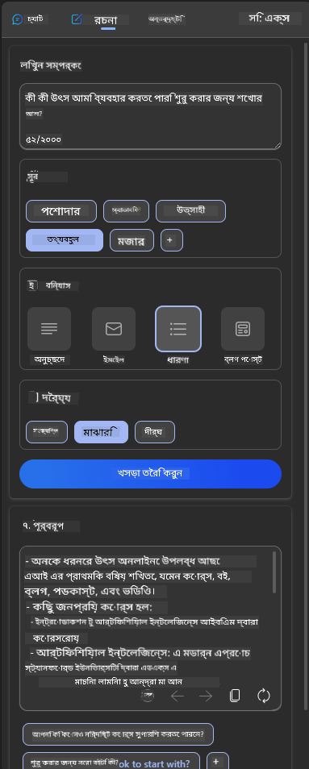
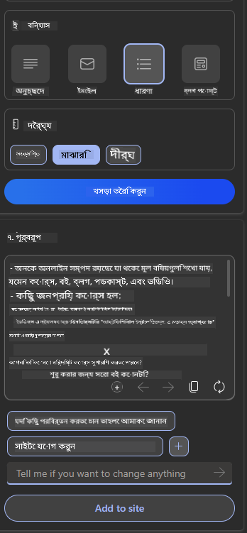
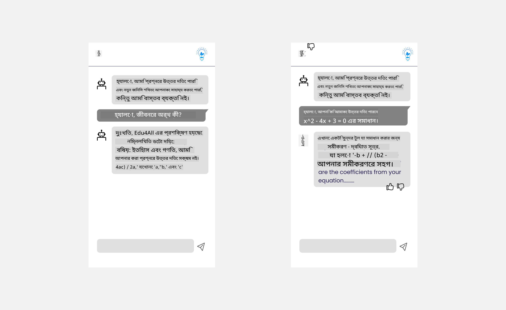

<!--
CO_OP_TRANSLATOR_METADATA:
{
  "original_hash": "ec385b41ee50579025d50cc03bfb3a25",
  "translation_date": "2025-06-25T20:16:02+00:00",
  "source_file": "12-designing-ux-for-ai-applications/README.md",
  "language_code": "bn"
}
-->
# AI অ্যাপ্লিকেশনের জন্য UX ডিজাইন করা

> _(উপরের ছবিতে ক্লিক করে এই পাঠের ভিডিও দেখুন)_

ব্যবহারকারীর অভিজ্ঞতা অ্যাপ তৈরির একটি অত্যন্ত গুরুত্বপূর্ণ দিক। ব্যবহারকারীদের আপনার অ্যাপ ব্যবহার করে দক্ষতার সাথে কাজ সম্পাদন করতে সক্ষম হতে হবে। দক্ষ হওয়া এক বিষয় কিন্তু আপনাকে এমনভাবে অ্যাপ ডিজাইন করতে হবে যাতে সবাই এটি ব্যবহার করতে পারে, এটিকে _অ্যাক্সেসযোগ্য_ করতে। এই অধ্যায়টি এই অঞ্চলে ফোকাস করবে যাতে আপনি একটি অ্যাপ ডিজাইন করেন যা মানুষ ব্যবহার করতে পারে এবং করতে চায়।

## পরিচয়

ব্যবহারকারীর অভিজ্ঞতা হল কীভাবে একজন ব্যবহারকারী একটি নির্দিষ্ট পণ্য বা পরিষেবা ব্যবহার করে তা সিস্টেম, টুল বা ডিজাইন হতে পারে। AI অ্যাপ্লিকেশন তৈরি করার সময়, বিকাশকারীরা শুধুমাত্র ব্যবহারকারীর অভিজ্ঞতা কার্যকর তা নিশ্চিত করার উপরই নয় বরং নৈতিকতার উপরও ফোকাস করে। এই পাঠে, আমরা কীভাবে ব্যবহারকারীর চাহিদা পূরণ করে এমন কৃত্রিম বুদ্ধিমত্তা (AI) অ্যাপ্লিকেশন তৈরি করতে হয় তা কভার করব।

পাঠে নিম্নলিখিত বিষয়গুলি কভার করা হবে:

- ব্যবহারকারীর অভিজ্ঞতার পরিচয় এবং ব্যবহারকারীর চাহিদা বোঝা
- বিশ্বাস এবং স্বচ্ছতার জন্য AI অ্যাপ্লিকেশন ডিজাইন করা
- সহযোগিতা এবং প্রতিক্রিয়ার জন্য AI অ্যাপ্লিকেশন ডিজাইন করা

## শেখার লক্ষ্য

এই পাঠ নেওয়ার পরে, আপনি সক্ষম হবেন:

- কীভাবে AI অ্যাপ্লিকেশন তৈরি করতে হয় যা ব্যবহারকারীর চাহিদা পূরণ করে তা বুঝুন।
- বিশ্বাস এবং সহযোগিতা প্রচার করে এমন AI অ্যাপ্লিকেশন ডিজাইন করুন।

### পূর্বশর্ত

কিছু সময় নিন এবং [ব্যবহারকারীর অভিজ্ঞতা এবং ডিজাইন চিন্তা সম্পর্কে আরও পড়ুন।](https://learn.microsoft.com/training/modules/ux-design?WT.mc_id=academic-105485-koreyst)

## ব্যবহারকারীর অভিজ্ঞতার পরিচয় এবং ব্যবহারকারীর চাহিদা বোঝা

আমাদের কাল্পনিক শিক্ষা স্টার্টআপে, আমাদের দুটি প্রধান ব্যবহারকারী রয়েছে, শিক্ষক এবং ছাত্র। প্রতিটি ব্যবহারকারীর অনন্য চাহিদা রয়েছে। একটি ব্যবহারকারী-কেন্দ্রিক ডিজাইন ব্যবহারকারীকে অগ্রাধিকার দেয় যাতে পণ্যগুলি প্রাসঙ্গিক এবং যার জন্য এটি উদ্দেশ্যপ্রাপ্ত তাদের জন্য উপকারী হয়।

অ্যাপ্লিকেশনটি একটি ভাল ব্যবহারকারীর অভিজ্ঞতা প্রদান করতে **উপযোগী, নির্ভরযোগ্য, অ্যাক্সেসযোগ্য এবং আনন্দদায়ক** হওয়া উচিত।

### ব্যবহারযোগ্যতা

উপযোগী হওয়ার অর্থ হল অ্যাপ্লিকেশনটির উদ্দেশ্যপূর্ণ কাজের সাথে মিল রেখে কার্যকারিতা রয়েছে, যেমন গ্রেডিং প্রক্রিয়া স্বয়ংক্রিয় করা বা পুনরায় দেখার জন্য ফ্ল্যাশকার্ড তৈরি করা। একটি অ্যাপ্লিকেশন যা গ্রেডিং প্রক্রিয়া স্বয়ংক্রিয় করে তা পূর্বনির্ধারিত মানদণ্ডের উপর ভিত্তি করে ছাত্রদের কাজের স্কোর সঠিকভাবে এবং দক্ষতার সাথে বরাদ্দ করতে সক্ষম হওয়া উচিত। অনুরূপভাবে, একটি অ্যাপ্লিকেশন যা পুনরায় দেখার ফ্ল্যাশকার্ড তৈরি করে তা তার ডেটার উপর ভিত্তি করে প্রাসঙ্গিক এবং বৈচিত্র্যময় প্রশ্ন তৈরি করতে সক্ষম হওয়া উচিত।

### নির্ভরযোগ্যতা

নির্ভরযোগ্য হওয়ার অর্থ হল অ্যাপ্লিকেশনটি তার কাজ ধারাবাহিকভাবে এবং ত্রুটি ছাড়াই সম্পাদন করতে পারে। যাইহোক, AI ঠিক মানুষের মতোই নিখুঁত নয় এবং ত্রুটির সম্মুখীন হতে পারে। অ্যাপ্লিকেশনগুলি এমন ত্রুটি বা অপ্রত্যাশিত পরিস্থিতির সম্মুখীন হতে পারে যা মানুষের হস্তক্ষেপ বা সংশোধন প্রয়োজন। আপনি কীভাবে ত্রুটি পরিচালনা করবেন? এই পাঠের শেষ অংশে, আমরা কভার করব কীভাবে AI সিস্টেম এবং অ্যাপ্লিকেশনগুলি সহযোগিতা এবং প্রতিক্রিয়ার জন্য ডিজাইন করা হয়েছে।

### অ্যাক্সেসযোগ্যতা

অ্যাক্সেসযোগ্য হওয়ার অর্থ হল বিভিন্ন ক্ষমতা সহ ব্যবহারকারীদের অভিজ্ঞতা প্রসারিত করা, যার মধ্যে প্রতিবন্ধী ব্যক্তিরাও রয়েছে, যাতে কেউ বাদ না যায় তা নিশ্চিত করা। অ্যাক্সেসযোগ্যতা নির্দেশিকা এবং নীতিগুলি অনুসরণ করে, AI সমাধানগুলি আরও অন্তর্ভুক্ত, ব্যবহারযোগ্য এবং সমস্ত ব্যবহারকারীর জন্য উপকারী হয়ে ওঠে।

### আনন্দদায়ক

আনন্দদায়ক হওয়ার অর্থ হল অ্যাপ্লিকেশনটি ব্যবহার করতে আনন্দদায়ক। একটি আকর্ষণীয় ব্যবহারকারীর অভিজ্ঞতা ব্যবহারকারীর উপর ইতিবাচক প্রভাব ফেলতে পারে তাদের অ্যাপ্লিকেশনে ফিরে আসতে উৎসাহিত করে এবং ব্যবসার আয় বৃদ্ধি করে।

প্রতিটি চ্যালেঞ্জ AI দিয়ে সমাধান করা যায় না। AI আসে আপনার ব্যবহারকারীর অভিজ্ঞতাকে বাড়ানোর জন্য, এটি ম্যানুয়াল কাজগুলি স্বয়ংক্রিয় করা বা ব্যবহারকারীর অভিজ্ঞতাকে ব্যক্তিগতকৃত করা।

## বিশ্বাস এবং স্বচ্ছতার জন্য AI অ্যাপ্লিকেশন ডিজাইন করা

বিশ্বাস তৈরি করা AI অ্যাপ্লিকেশন ডিজাইন করার সময় গুরুত্বপূর্ণ। বিশ্বাস নিশ্চিত করে যে একজন ব্যবহারকারী আত্মবিশ্বাসী যে অ্যাপ্লিকেশনটি কাজটি সম্পন্ন করবে, ধারাবাহিকভাবে ফলাফল প্রদান করবে এবং ফলাফলগুলি ব্যবহারকারীর প্রয়োজন। এই এলাকায় একটি ঝুঁকি হল অবিশ্বাস এবং অতিরিক্ত বিশ্বাস। অবিশ্বাস ঘটে যখন একজন ব্যবহারকারী AI সিস্টেমের প্রতি সামান্য বা কোন বিশ্বাস রাখে, এটি ব্যবহারকারীকে আপনার অ্যাপ্লিকেশন প্রত্যাখ্যান করতে পরিচালিত করে। অতিরিক্ত বিশ্বাস ঘটে যখন একজন ব্যবহারকারী AI সিস্টেমের ক্ষমতাকে অত্যধিক মূল্যায়ন করে, যার ফলে ব্যবহারকারীরা AI সিস্টেমের উপর খুব বেশি বিশ্বাস করে। উদাহরণস্বরূপ, একটি স্বয়ংক্রিয় গ্রেডিং সিস্টেমের ক্ষেত্রে অতিরিক্ত বিশ্বাস শিক্ষককে কিছু কাগজপত্র প্রমাণ করতে না দেওয়ার কারণ হতে পারে যাতে গ্রেডিং সিস্টেমটি ভাল কাজ করে। এটি ছাত্রদের জন্য অন্যায় বা অযথা গ্রেড বা প্রতিক্রিয়া এবং উন্নতির সুযোগ হারানোর কারণ হতে পারে।

বিশ্বাসকে ডিজাইনের কেন্দ্রে রাখার দুটি উপায় হল ব্যাখ্যাযোগ্যতা এবং নিয়ন্ত্রণ।

### ব্যাখ্যাযোগ্যতা

যখন AI ভবিষ্যত প্রজন্মের কাছে জ্ঞান প্রদান করার মতো সিদ্ধান্তগুলি জানাতে সাহায্য করে, তখন শিক্ষক এবং অভিভাবকদের জন্য AI সিদ্ধান্তগুলি কীভাবে নেওয়া হয় তা বোঝা অত্যন্ত গুরুত্বপূর্ণ। এটি ব্যাখ্যাযোগ্যতা - কীভাবে AI অ্যাপ্লিকেশনগুলি সিদ্ধান্ত নেয় তা বোঝা। ব্যাখ্যাযোগ্যতার জন্য ডিজাইন করার মধ্যে একটি AI অ্যাপ্লিকেশন কী করতে পারে তার উদাহরণের বিবরণ যোগ করা অন্তর্ভুক্ত। উদাহরণস্বরূপ, "AI শিক্ষক দিয়ে শুরু করুন" এর পরিবর্তে, সিস্টেমটি ব্যবহার করতে পারে: "AI ব্যবহার করে আপনার নোটগুলি সহজ পুনরায় দেখার জন্য সংক্ষিপ্ত করুন।"

আরেকটি উদাহরণ হল কীভাবে AI ব্যবহারকারী এবং ব্যক্তিগত ডেটা ব্যবহার করে। উদাহরণস্বরূপ, একজন ব্যবহারকারী যার ব্যক্তিত্ব ছাত্র রয়েছে তার ব্যক্তিত্বের উপর ভিত্তি করে সীমাবদ্ধতা থাকতে পারে। AI উত্তর প্রকাশ করতে সক্ষম নাও হতে পারে তবে ব্যবহারকারীকে কীভাবে তারা একটি সমস্যা সমাধান করতে পারে তা চিন্তা করতে সাহায্য করতে পারে।

ব্যাখ্যাযোগ্যতার আরেকটি গুরুত্বপূর্ণ অংশ হল ব্যাখ্যার সরলীকরণ। ছাত্র এবং শিক্ষক AI বিশেষজ্ঞ নাও হতে পারে, তাই অ্যাপ্লিকেশন কী করতে পারে বা করতে পারে না তার ব্যাখ্যাগুলি সরল এবং সহজবোধ্য হওয়া উচিত।

### নিয়ন্ত্রণ

জেনারেটিভ AI ব্যবহারকারী এবং AI-এর মধ্যে একটি সহযোগিতা তৈরি করে, যেখানে উদাহরণস্বরূপ একজন ব্যবহারকারী বিভিন্ন ফলাফলের জন্য প্রম্পটগুলি পরিবর্তন করতে পারে। এছাড়াও, একবার একটি আউটপুট তৈরি হলে, ব্যবহারকারীদের ফলাফলগুলি পরিবর্তন করার ক্ষমতা থাকা উচিত যাতে তাদের নিয়ন্ত্রণের অনুভূতি দেওয়া হয়। উদাহরণস্বরূপ, Bing ব্যবহার করার সময়, আপনি আপনার প্রম্পটটি বিন্যাস, টোন এবং দৈর্ঘ্যের উপর ভিত্তি করে তৈরি করতে পারেন। এছাড়াও, আপনি আপনার আউটপুটে পরিবর্তন যোগ করতে পারেন এবং আউটপুটটি নীচের মতো পরিবর্তন করতে পারেন:

Bing-এর আরেকটি বৈশিষ্ট্য যা একজন ব্যবহারকারীকে অ্যাপ্লিকেশনটির উপর নিয়ন্ত্রণ দেয় তা হল AI যে ডেটা ব্যবহার করে তাতে অপ্ট ইন এবং অপ্ট আউট করার ক্ষমতা। একটি স্কুল অ্যাপ্লিকেশনের জন্য, একজন ছাত্র তার নোটগুলি পাশাপাশি শিক্ষকের সম্পদগুলি পর্যালোচনা উপাদান হিসাবে ব্যবহার করতে চাইতে পারে।

> AI অ্যাপ্লিকেশন ডিজাইন করার সময়, এর ক্ষমতার অবাস্তব প্রত্যাশা সেট করার জন্য ব্যবহারকারীরা অতিরিক্ত বিশ্বাস না করার জন্য উদ্দেশ্যতা হল মূল বিষয়। এটি করার একটি উপায় হল প্রম্পট এবং ফলাফলের মধ্যে ঘর্ষণ তৈরি করা। ব্যবহারকারীকে মনে করিয়ে দেওয়া, এটি AI এবং একজন সহকর্মী মানুষ নয়

## সহযোগিতা এবং প্রতিক্রিয়ার জন্য AI অ্যাপ্লিকেশন ডিজাইন করা

আগে উল্লেখ করা হয়েছে, জেনারেটিভ AI ব্যবহারকারী এবং AI-এর মধ্যে একটি সহযোগিতা তৈরি করে। বেশিরভাগ ব্যস্ততা একটি ব্যবহারকারীর ইনপুটিং প্রম্পট এবং AI একটি আউটপুট তৈরি করে। যদি আউটপুট ভুল হয় তাহলে কি হবে? ত্রুটি ঘটলে অ্যাপ্লিকেশনটি কীভাবে পরিচালনা করে? AI কি ব্যবহারকারীকে দোষ দেয় বা ত্রুটিটি ব্যাখ্যা করতে সময় নেয়?

AI অ্যাপ্লিকেশনগুলি প্রতিক্রিয়া পেতে এবং দিতে তৈরি করা উচিত। এটি শুধুমাত্র AI সিস্টেমকে উন্নত করতে সাহায্য করে না বরং ব্যবহারকারীদের সাথে বিশ্বাসও তৈরি করে। একটি প্রতিক্রিয়া লুপ ডিজাইনে অন্তর্ভুক্ত করা উচিত, একটি উদাহরণ হতে পারে আউটপুটে একটি সাধারণ থাম্বস আপ বা ডাউন।

এটি পরিচালনা করার আরেকটি উপায় হল সিস্টেমের ক্ষমতা এবং সীমাবদ্ধতাগুলি স্পষ্টভাবে যোগাযোগ করা। যখন একজন ব্যবহারকারী AI ক্ষমতার বাইরে কিছু অনুরোধ করে একটি ত্রুটি করে, তখন এটি পরিচালনা করার একটি উপায়ও থাকা উচিত, যেমনটি নীচে দেখানো হয়েছে।

অ্যাপ্লিকেশনের সাথে সিস্টেম ত্রুটি সাধারণ যেখানে ব্যবহারকারীকে AI এর সুযোগের বাইরে থাকা তথ্যের সাথে সহায়তা প্রয়োজন হতে পারে বা অ্যাপ্লিকেশনে ব্যবহারকারী কতগুলি প্রশ্ন/বিষয় তৈরি করতে পারে তার উপর সীমা থাকতে পারে। উদাহরণস্বরূপ, ইতিহাস এবং গণিতের মতো সীমিত বিষয়ের ডেটা দিয়ে প্রশিক্ষিত একটি AI অ্যাপ্লিকেশন ভূগোল সম্পর্কিত প্রশ্নগুলি পরিচালনা করতে সক্ষম নাও হতে পারে। এটি প্রশমিত করার জন্য, AI সিস্টেমটি এমন একটি প্রতিক্রিয়া দিতে পারে: "দুঃখিত, আমাদের পণ্যটি নিম্নলিখিত বিষয়গুলির ডেটা দিয়ে প্রশিক্ষিত হয়েছে....., আমি আপনার জিজ্ঞাসা করা প্রশ্নের উত্তর দিতে সক্ষম নই।"

AI অ্যাপ্লিকেশনগুলি নিখুঁত নয়, অতএব, তারা ভুল করার জন্য আবদ্ধ। আপনার অ্যাপ্লিকেশন ডিজাইন করার সময়, আপনি ব্যবহারকারীদের কাছ থেকে প্রতিক্রিয়া এবং ত্রুটি পরিচালনার জন্য একটি উপায় তৈরি করতে হবে যা সহজ এবং সহজে ব্যাখ্যাযোগ্য।

## অ্যাসাইনমেন্ট

আপনি এখন পর্যন্ত যে কোনও AI অ্যাপ তৈরি করেছেন তা নিন, আপনার অ্যাপে নীচের পদক্ষেপগুলি বাস্তবায়নের কথা বিবেচনা করুন:

- **আনন্দদায়ক:** কীভাবে আপনি আপনার অ্যাপটিকে আরও আনন্দদায়ক করতে পারেন তা বিবেচনা করুন। আপনি সর্বত্র ব্যাখ্যা যোগ করছেন? আপনি কি ব্যবহারকারীকে অন্বেষণ করতে উৎসাহিত করছেন? আপনি কীভাবে আপনার ত্রুটি বার্তাগুলি শব্দ করছেন?

- **ব্যবহারযোগ্যতা:** একটি ওয়েব অ্যাপ তৈরি করা। নিশ্চিত করুন যে আপনার অ্যাপটি মাউস এবং কীবোর্ড উভয়ই দ্বারা নেভিগেটযোগ্য।

- **বিশ্বাস এবং স্বচ্ছতা:** AI এবং এর আউটপুটের উপর সম্পূর্ণ বিশ্বাস করবেন না, আউটপুট যাচাই করার জন্য প্রক্রিয়ায় একজন মানুষকে কীভাবে যোগ করবেন তা বিবেচনা করুন। এছাড়াও, বিশ্বাস এবং স্বচ্ছতা অর্জনের জন্য অন্যান্য উপায় বিবেচনা এবং বাস্তবায়ন করুন।

- **নিয়ন্ত্রণ:** ব্যবহারকারীকে তারা অ্যাপ্লিকেশনটিতে যে ডেটা প্রদান করে তার নিয়ন্ত্রণ দিন। AI অ্যাপ্লিকেশনে ডেটা সংগ্রহে একজন ব্যবহারকারী কীভাবে অপ্ট-ইন এবং অপ্ট-আউট করতে পারে তা বাস্তবায়ন করুন।

## আপনার শেখা চালিয়ে যান!

এই পাঠ সম্পন্ন করার পরে, আমাদের [জেনারেটিভ AI লার্নিং সংগ্রহ](https://aka.ms/genai-collection?WT.mc_id=academic-105485-koreyst) দেখুন আপনার জেনারেটিভ AI জ্ঞানকে আরও উন্নত করতে!

পাঠ 13-এ যান, যেখানে আমরা কীভাবে [AI অ্যাপ্লিকেশনগুলি সুরক্ষিত করতে হয়](../13-securing-ai-applications/README.md?WT.mc_id=academic-105485-koreyst) তা দেখব!

**অস্বীকৃতি**:  
এই নথিটি AI অনুবাদ পরিষেবা [Co-op Translator](https://github.com/Azure/co-op-translator) ব্যবহার করে অনুবাদ করা হয়েছে। আমরা যথাসাধ্য সঠিকতা নিশ্চিত করার চেষ্টা করি, তবে অনুগ্রহ করে মনে রাখবেন যে স্বয়ংক্রিয় অনুবাদে ত্রুটি বা অসঙ্গতি থাকতে পারে। এর মূল ভাষায় থাকা নথিটিকে প্রামাণিক উৎস হিসেবে বিবেচনা করা উচিত। গুরুত্বপূর্ণ তথ্যের জন্য, পেশাদার মানব অনুবাদ সুপারিশ করা হয়। এই অনুবাদ ব্যবহারের ফলে উদ্ভূত কোনো ভুল বোঝাবুঝি বা ভুল ব্যাখ্যার জন্য আমরা দায়ী নই।