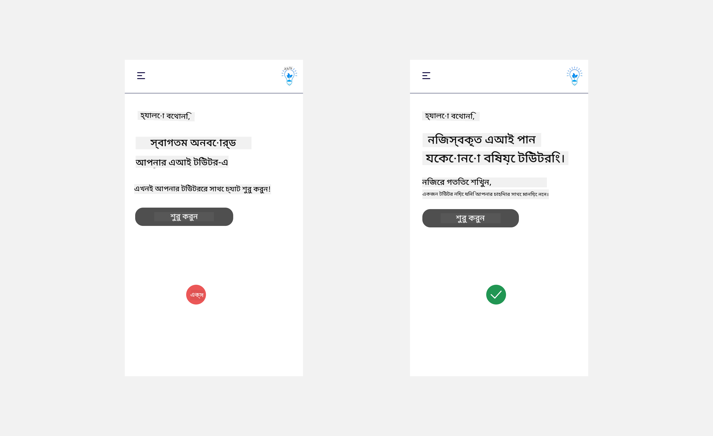
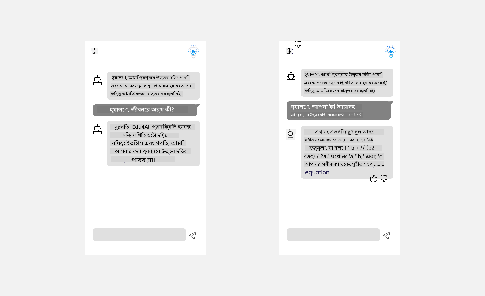

<!--
CO_OP_TRANSLATOR_METADATA:
{
  "original_hash": "78bbeed50fd4dc9fdee931f5daf98cb3",
  "translation_date": "2025-10-17T14:50:16+00:00",
  "source_file": "12-designing-ux-for-ai-applications/README.md",
  "language_code": "bn"
}
-->
# AI অ্যাপ্লিকেশনের জন্য UX ডিজাইন

> _(উপরের ছবিতে ক্লিক করে এই পাঠের ভিডিও দেখুন)_

ইউজার এক্সপেরিয়েন্স (UX) অ্যাপ তৈরি করার একটি অত্যন্ত গুরুত্বপূর্ণ দিক। ব্যবহারকারীদের আপনার অ্যাপটি দক্ষতার সাথে ব্যবহার করে কাজ সম্পন্ন করতে সক্ষম হতে হবে। দক্ষ হওয়া একটি বিষয়, তবে আপনাকে এমনভাবে অ্যাপ ডিজাইন করতে হবে যাতে এটি সবাই ব্যবহার করতে পারে, অর্থাৎ এটি _অ্যাক্সেসযোগ্য_ হতে হবে। এই অধ্যায়টি এই ক্ষেত্রের উপর ফোকাস করবে যাতে আপনি এমন একটি অ্যাপ ডিজাইন করতে পারেন যা মানুষ ব্যবহার করতে চায় এবং করতে পারে।

## ভূমিকা

ইউজার এক্সপেরিয়েন্স হল একটি ব্যবহারকারী কীভাবে একটি নির্দিষ্ট পণ্য বা পরিষেবার সাথে যোগাযোগ করে এবং এটি ব্যবহার করে, তা একটি সিস্টেম, টুল বা ডিজাইন যাই হোক না কেন। AI অ্যাপ্লিকেশন তৈরি করার সময়, ডেভেলপাররা শুধুমাত্র ইউজার এক্সপেরিয়েন্স কার্যকর করার দিকে মনোযোগ দেয় না, বরং এটি নৈতিক কিনা তা নিশ্চিত করার দিকেও মনোযোগ দেয়। এই পাঠে, আমরা কিভাবে ব্যবহারকারীর প্রয়োজন মেটানোর জন্য কৃত্রিম বুদ্ধিমত্তা (AI) অ্যাপ্লিকেশন তৈরি করা যায় তা নিয়ে আলোচনা করব।

এই পাঠে নিম্নলিখিত বিষয়গুলো অন্তর্ভুক্ত থাকবে:

- ইউজার এক্সপেরিয়েন্স এবং ব্যবহারকারীর প্রয়োজন বোঝার ভূমিকা
- বিশ্বাস এবং স্বচ্ছতার জন্য AI অ্যাপ্লিকেশন ডিজাইন করা
- সহযোগিতা এবং প্রতিক্রিয়ার জন্য AI অ্যাপ্লিকেশন ডিজাইন করা

## শেখার লক্ষ্য

এই পাঠ গ্রহণের পরে, আপনি সক্ষম হবেন:

- কিভাবে AI অ্যাপ্লিকেশন তৈরি করতে হয় যা ব্যবহারকারীর প্রয়োজন মেটায় তা বুঝতে পারবেন।
- বিশ্বাস এবং সহযোগিতা প্রচারের জন্য AI অ্যাপ্লিকেশন ডিজাইন করতে পারবেন।

### পূর্বশর্ত

কিছু সময় নিয়ে [ইউজার এক্সপেরিয়েন্স এবং ডিজাইন থিংকিং](https://learn.microsoft.com/training/modules/ux-design?WT.mc_id=academic-105485-koreyst) সম্পর্কে আরও পড়ুন।

## ইউজার এক্সপেরিয়েন্স এবং ব্যবহারকারীর প্রয়োজন বোঝার ভূমিকা

আমাদের কাল্পনিক শিক্ষা স্টার্টআপে, আমাদের দুটি প্রধান ব্যবহারকারী রয়েছে, শিক্ষক এবং শিক্ষার্থী। এই দুটি ব্যবহারকারীর অনন্য প্রয়োজন রয়েছে। একটি ব্যবহারকারী-কেন্দ্রিক ডিজাইন ব্যবহারকারীকে অগ্রাধিকার দেয়, নিশ্চিত করে যে পণ্যগুলি তাদের জন্য প্রাসঙ্গিক এবং উপকারী।

অ্যাপ্লিকেশনটি **উপযোগী, নির্ভরযোগ্য, অ্যাক্সেসযোগ্য এবং আনন্দদায়ক** হওয়া উচিত যাতে একটি ভালো ইউজার এক্সপেরিয়েন্স প্রদান করা যায়।

### উপযোগিতা

উপযোগী হওয়া মানে অ্যাপ্লিকেশনের কার্যকারিতা তার উদ্দেশ্য অনুযায়ী মিলে যায়, যেমন গ্রেডিং প্রক্রিয়া স্বয়ংক্রিয় করা বা পুনরায় পড়ার জন্য ফ্ল্যাশকার্ড তৈরি করা। একটি অ্যাপ্লিকেশন যা গ্রেডিং প্রক্রিয়া স্বয়ংক্রিয় করে তা পূর্বনির্ধারিত মানদণ্ডের উপর ভিত্তি করে শিক্ষার্থীদের কাজের স্কোর সঠিক এবং দক্ষতার সাথে নির্ধারণ করতে সক্ষম হওয়া উচিত। একইভাবে, একটি অ্যাপ্লিকেশন যা পুনরায় পড়ার জন্য ফ্ল্যাশকার্ড তৈরি করে তা তার ডেটার উপর ভিত্তি করে প্রাসঙ্গিক এবং বৈচিত্র্যময় প্রশ্ন তৈরি করতে সক্ষম হওয়া উচিত।

### নির্ভরযোগ্যতা

নির্ভরযোগ্য হওয়া মানে অ্যাপ্লিকেশনটি তার কাজ ধারাবাহিকভাবে এবং ত্রুটি ছাড়াই সম্পাদন করতে পারে। তবে, AI মানুষের মতোই নিখুঁত নয় এবং ত্রুটির সম্ভাবনা থাকতে পারে। অ্যাপ্লিকেশনগুলি ত্রুটি বা অপ্রত্যাশিত পরিস্থিতির সম্মুখীন হতে পারে যা মানব হস্তক্ষেপ বা সংশোধনের প্রয়োজন। আপনি কীভাবে ত্রুটি পরিচালনা করবেন? এই পাঠের শেষ অংশে, আমরা আলোচনা করব কিভাবে AI সিস্টেম এবং অ্যাপ্লিকেশনগুলি সহযোগিতা এবং প্রতিক্রিয়ার জন্য ডিজাইন করা হয়।

### অ্যাক্সেসযোগ্যতা

অ্যাক্সেসযোগ্য হওয়া মানে বিভিন্ন ক্ষমতার ব্যবহারকারীদের, যার মধ্যে প্রতিবন্ধী ব্যক্তিরাও অন্তর্ভুক্ত, ব্যবহারকারীর অভিজ্ঞতা প্রসারিত করা, নিশ্চিত করা যে কেউ বাদ পড়ছে না। অ্যাক্সেসযোগ্যতার নির্দেশিকা এবং নীতিগুলি অনুসরণ করে, AI সমাধানগুলি আরও অন্তর্ভুক্তিমূলক, ব্যবহারযোগ্য এবং সমস্ত ব্যবহারকারীর জন্য উপকারী হয়ে ওঠে।

### আনন্দদায়ক

আনন্দদায়ক হওয়া মানে অ্যাপ্লিকেশনটি ব্যবহার করার জন্য উপভোগ্য। একটি আকর্ষণীয় ব্যবহারকারীর অভিজ্ঞতা ব্যবহারকারীর উপর ইতিবাচক প্রভাব ফেলতে পারে, তাদের অ্যাপ্লিকেশনে ফিরে আসতে উৎসাহিত করতে পারে এবং ব্যবসার আয় বাড়াতে পারে।

প্রতিটি চ্যালেঞ্জ AI দিয়ে সমাধান করা যায় না। AI ব্যবহারকারীর অভিজ্ঞতাকে উন্নত করতে আসে, তা ম্যানুয়াল কাজ স্বয়ংক্রিয় করা হোক বা ব্যবহারকারীর অভিজ্ঞতা ব্যক্তিগতকরণ করা হোক।

## বিশ্বাস এবং স্বচ্ছতার জন্য AI অ্যাপ্লিকেশন ডিজাইন করা

AI অ্যাপ্লিকেশন ডিজাইন করার সময় বিশ্বাস তৈরি করা অত্যন্ত গুরুত্বপূর্ণ। বিশ্বাস নিশ্চিত করে যে ব্যবহারকারী আত্মবিশ্বাসী যে অ্যাপ্লিকেশনটি কাজ সম্পন্ন করবে, ধারাবাহিকভাবে ফলাফল প্রদান করবে এবং ফলাফলগুলি ব্যবহারকারীর প্রয়োজন অনুযায়ী হবে। এই ক্ষেত্রে একটি ঝুঁকি হল অবিশ্বাস এবং অতিরিক্ত বিশ্বাস। অবিশ্বাস ঘটে যখন একজন ব্যবহারকারী AI সিস্টেমে সামান্য বা কোনো বিশ্বাস রাখে না, এটি ব্যবহারকারীকে আপনার অ্যাপ্লিকেশন প্রত্যাখ্যান করতে বাধ্য করে। অতিরিক্ত বিশ্বাস ঘটে যখন একজন ব্যবহারকারী AI সিস্টেমের ক্ষমতাকে অতিরিক্ত মূল্যায়ন করে, যার ফলে ব্যবহারকারীরা AI সিস্টেমকে খুব বেশি বিশ্বাস করে। উদাহরণস্বরূপ, একটি স্বয়ংক্রিয় গ্রেডিং সিস্টেমের ক্ষেত্রে অতিরিক্ত বিশ্বাস শিক্ষকের কিছু কাগজপত্র প্রমাণ করার প্রয়োজনীয়তা উপেক্ষা করতে পারে যাতে গ্রেডিং সিস্টেমটি ভালভাবে কাজ করে। এটি শিক্ষার্থীদের জন্য অন্যায় বা ভুল গ্রেডের কারণ হতে পারে, বা প্রতিক্রিয়া এবং উন্নতির সুযোগ হারাতে পারে।

বিশ্বাসকে ডিজাইনের কেন্দ্রে রাখার দুটি উপায় হল ব্যাখ্যাযোগ্যতা এবং নিয়ন্ত্রণ।

### ব্যাখ্যাযোগ্যতা

যখন AI সিদ্ধান্ত নেওয়ার ক্ষেত্রে সাহায্য করে, যেমন ভবিষ্যৎ প্রজন্মকে জ্ঞান প্রদান করা, তখন শিক্ষক এবং অভিভাবকদের জন্য AI সিদ্ধান্তগুলি কীভাবে নেওয়া হয় তা বোঝা গুরুত্বপূর্ণ। এটি ব্যাখ্যাযোগ্যতা - AI অ্যাপ্লিকেশনগুলি কীভাবে সিদ্ধান্ত নেয় তা বোঝা। ব্যাখ্যাযোগ্যতার জন্য ডিজাইন করার মধ্যে অন্তর্ভুক্ত রয়েছে AI কীভাবে আউটপুটে পৌঁছেছে তা হাইলাইট করে এমন বিবরণ যোগ করা। শ্রোতাদের সচেতন হতে হবে যে আউটপুটটি AI দ্বারা তৈরি এবং একজন মানুষের দ্বারা নয়। উদাহরণস্বরূপ, "আপনার টিউটরের সাথে এখনই চ্যাট শুরু করুন" বলার পরিবর্তে বলুন "AI টিউটর ব্যবহার করুন যা আপনার প্রয়োজনের সাথে মানিয়ে যায় এবং আপনাকে আপনার গতিতে শিখতে সাহায্য করে।"

আরেকটি উদাহরণ হল AI কীভাবে ব্যবহারকারী এবং ব্যক্তিগত ডেটা ব্যবহার করে। উদাহরণস্বরূপ, একজন শিক্ষার্থী ব্যক্তিত্বের ব্যবহারকারী তাদের ব্যক্তিত্বের উপর ভিত্তি করে সীমাবদ্ধতা থাকতে পারে। AI প্রশ্নের উত্তর প্রকাশ করতে সক্ষম নাও হতে পারে তবে ব্যবহারকারীকে কীভাবে তারা একটি সমস্যা সমাধান করতে পারে তা চিন্তা করতে সাহায্য করতে পারে।

ব্যাখ্যাযোগ্যতার আরেকটি গুরুত্বপূর্ণ অংশ হল ব্যাখ্যাগুলির সরলীকরণ। শিক্ষার্থী এবং শিক্ষকরা AI বিশেষজ্ঞ নাও হতে পারে, তাই অ্যাপ্লিকেশনটি কী করতে পারে বা করতে পারে না তার ব্যাখ্যা সহজ এবং সহজবোধ্য হওয়া উচিত।

### নিয়ন্ত্রণ

জেনারেটিভ AI ব্যবহারকারী এবং AI-এর মধ্যে একটি সহযোগিতা তৈরি করে, যেখানে উদাহরণস্বরূপ একজন ব্যবহারকারী বিভিন্ন ফলাফলের জন্য প্রম্পটগুলি সংশোধন করতে পারে। এছাড়াও, একবার একটি আউটপুট তৈরি হলে, ব্যবহারকারীদের ফলাফলগুলি সংশোধন করার ক্ষমতা থাকা উচিত যা তাদের নিয়ন্ত্রণের অনুভূতি দেয়। উদাহরণস্বরূপ, Bing ব্যবহার করার সময়, আপনি ফরম্যাট, টোন এবং দৈর্ঘ্যের উপর ভিত্তি করে আপনার প্রম্পট কাস্টমাইজ করতে পারেন। এছাড়াও, আপনি আপনার আউটপুটে পরিবর্তন যোগ করতে পারেন এবং আউটপুটটি সংশোধন করতে পারেন যেমনটি নীচে দেখানো হয়েছে:

Bing-এর আরেকটি বৈশিষ্ট্য যা একজন ব্যবহারকারীকে অ্যাপ্লিকেশনের উপর নিয়ন্ত্রণ দেয় তা হল AI যে ডেটা ব্যবহার করে তাতে অন্তর্ভুক্ত বা বাদ দেওয়ার ক্ষমতা। একটি স্কুল অ্যাপ্লিকেশনের জন্য, একজন শিক্ষার্থী তাদের নোট পাশাপাশি শিক্ষকের সংস্থানগুলি পুনরায় পড়ার উপাদান হিসাবে ব্যবহার করতে চাইতে পারে।

> AI অ্যাপ্লিকেশন ডিজাইন করার সময়, ব্যবহারকারীদের অতিরিক্ত বিশ্বাস না করার জন্য ইচ্ছাকৃতভাবে কাজ করা গুরুত্বপূর্ণ, যা এর ক্ষমতার উপর অবাস্তব প্রত্যাশা তৈরি করে। এটি করার একটি উপায় হল প্রম্পট এবং ফলাফলের মধ্যে কিছু বাধা তৈরি করা। ব্যবহারকারীকে মনে করিয়ে দেওয়া, এটি AI এবং একজন সহকর্মী মানুষ নয়।

## সহযোগিতা এবং প্রতিক্রিয়ার জন্য AI অ্যাপ্লিকেশন ডিজাইন করা

আগে উল্লেখ করা হয়েছে, জেনারেটিভ AI ব্যবহারকারী এবং AI-এর মধ্যে একটি সহযোগিতা তৈরি করে। বেশিরভাগ যোগাযোগ একটি ব্যবহারকারী প্রম্পট ইনপুট করে এবং AI একটি আউটপুট তৈরি করে। যদি আউটপুটটি ভুল হয় তাহলে কী হবে? ত্রুটি ঘটলে অ্যাপ্লিকেশনটি কীভাবে পরিচালনা করে? AI কি ব্যবহারকারীকে দোষ দেয় নাকি ত্রুটিটি ব্যাখ্যা করতে সময় নেয়?

AI অ্যাপ্লিকেশনগুলি প্রতিক্রিয়া গ্রহণ এবং প্রদান করার জন্য তৈরি করা উচিত। এটি শুধুমাত্র AI সিস্টেমকে উন্নত করতে সাহায্য করে না বরং ব্যবহারকারীদের সাথে বিশ্বাসও তৈরি করে। ডিজাইনে একটি প্রতিক্রিয়া লুপ অন্তর্ভুক্ত করা উচিত, একটি উদাহরণ হতে পারে আউটপুটে একটি সাধারণ থাম্বস আপ বা ডাউন।

এটি পরিচালনার আরেকটি উপায় হল সিস্টেমের ক্ষমতা এবং সীমাবদ্ধতা স্পষ্টভাবে যোগাযোগ করা। যখন একজন ব্যবহারকারী এমন কিছু অনুরোধ করার সময় ভুল করে যা AI ক্ষমতার বাইরে, তখন এটি পরিচালনা করার একটি উপায় থাকা উচিত, যেমনটি নীচে দেখানো হয়েছে।

অ্যাপ্লিকেশনের সাথে সিস্টেম ত্রুটি সাধারণ যেখানে ব্যবহারকারীকে AI-এর সুযোগের বাইরে থাকা তথ্যের সাথে সহায়তা প্রয়োজন হতে পারে বা অ্যাপ্লিকেশনের সীমা থাকতে পারে যে একজন ব্যবহারকারী কতগুলি প্রশ্ন/বিষয় তৈরি করতে পারে। উদাহরণস্বরূপ, একটি AI অ্যাপ্লিকেশন যা সীমিত বিষয়গুলিতে ডেটা দিয়ে প্রশিক্ষিত, যেমন ইতিহাস এবং গণিত, ভূগোল সম্পর্কিত প্রশ্নগুলি পরিচালনা করতে সক্ষম নাও হতে পারে। এটি প্রশমিত করতে, AI সিস্টেমটি একটি প্রতিক্রিয়া দিতে পারে যেমন: "দুঃখিত, আমাদের পণ্যটি নিম্নলিখিত বিষয়গুলিতে ডেটা দিয়ে প্রশিক্ষিত হয়েছে....., আমি আপনার জিজ্ঞাসা করা প্রশ্নের উত্তর দিতে সক্ষম নই।"

AI অ্যাপ্লিকেশনগুলি নিখুঁত নয়, তাই তারা ভুল করতে বাধ্য। আপনার অ্যাপ্লিকেশনগুলি ডিজাইন করার সময়, ব্যবহারকারীদের কাছ থেকে প্রতিক্রিয়া এবং ত্রুটি পরিচালনার জন্য একটি সহজ এবং সহজবোধ্য উপায় তৈরি করা নিশ্চিত করুন।

## অ্যাসাইনমেন্ট

আপনার তৈরি করা যেকোনো AI অ্যাপ নিন এবং আপনার অ্যাপে নিচের ধাপগুলি বাস্তবায়নের কথা বিবেচনা করুন:

- **আনন্দদায়ক:** কীভাবে আপনি আপনার অ্যাপটিকে আরও আনন্দদায়ক করতে পারেন তা বিবেচনা করুন। আপনি কি সর্বত্র ব্যাখ্যা যোগ করছেন? আপনি কি ব্যবহারকারীকে অন্বেষণ করতে উৎসাহিত করছেন? আপনি কীভাবে আপনার ত্রুটির বার্তাগুলি শব্দ করছেন?

- **উপযোগিতা:** একটি ওয়েব অ্যাপ তৈরি করা। নিশ্চিত করুন যে আপনার অ্যাপটি মাউস এবং কীবোর্ড উভয়ের দ্বারা নেভিগেট করা যায়।

- **বিশ্বাস এবং স্বচ্ছতা:** AI এবং এর আউটপুটকে সম্পূর্ণভাবে বিশ্বাস করবেন না, প্রক্রিয়াটিতে আউটপুট যাচাই করার জন্য একজন মানুষকে যোগ করার কথা বিবেচনা করুন। এছাড়াও, বিশ্বাস এবং স্বচ্ছতা অর্জনের অন্যান্য উপায় বিবেচনা করুন এবং বাস্তবায়ন করুন।

- **নিয়ন্ত্রণ:** ব্যবহারকারীকে তারা যে ডেটা অ্যাপ্লিকেশনে প্রদান করে তার নিয়ন্ত্রণ দিন। AI অ্যাপ্লিকেশনে ডেটা সংগ্রহে একজন ব্যবহারকারী কীভাবে অন্তর্ভুক্ত বা বাদ দিতে পারে তা বাস্তবায়ন করুন।

<!-- ## [পাঠ-পরবর্তী কুইজ](../../../12-designing-ux-for-ai-applications/quiz-url) -->

## আপনার শেখা চালিয়ে যান!

এই পাঠ সম্পন্ন করার পরে, আমাদের [জেনারেটিভ AI শেখার সংগ্রহ](https://aka.ms/genai-collection?WT.mc_id=academic-105485-koreyst) দেখুন যাতে আপনার জেনারেটিভ AI জ্ঞান আরও উন্নত করতে পারেন!

পাঠ ১৩-তে যান, যেখানে আমরা দেখব কিভাবে [AI অ্যাপ্লিকেশন সুরক্ষিত করা যায়](../13-securing-ai-applications/README.md?WT.mc_id=academic-105485-koreyst)!

---

**অস্বীকৃতি**:  
এই নথিটি AI অনুবাদ পরিষেবা [Co-op Translator](https://github.com/Azure/co-op-translator) ব্যবহার করে অনুবাদ করা হয়েছে। আমরা যথাসাধ্য সঠিকতার জন্য চেষ্টা করি, তবে অনুগ্রহ করে মনে রাখবেন যে স্বয়ংক্রিয় অনুবাদে ত্রুটি বা অসঙ্গতি থাকতে পারে। মূল ভাষায় থাকা নথিটিকে প্রামাণিক উৎস হিসেবে বিবেচনা করা উচিত। গুরুত্বপূর্ণ তথ্যের জন্য, পেশাদার মানব অনুবাদ সুপারিশ করা হয়। এই অনুবাদ ব্যবহারের ফলে সৃষ্ট কোনো ভুল বোঝাবুঝি বা ভুল ব্যাখ্যার জন্য আমরা দায়ী থাকব না।