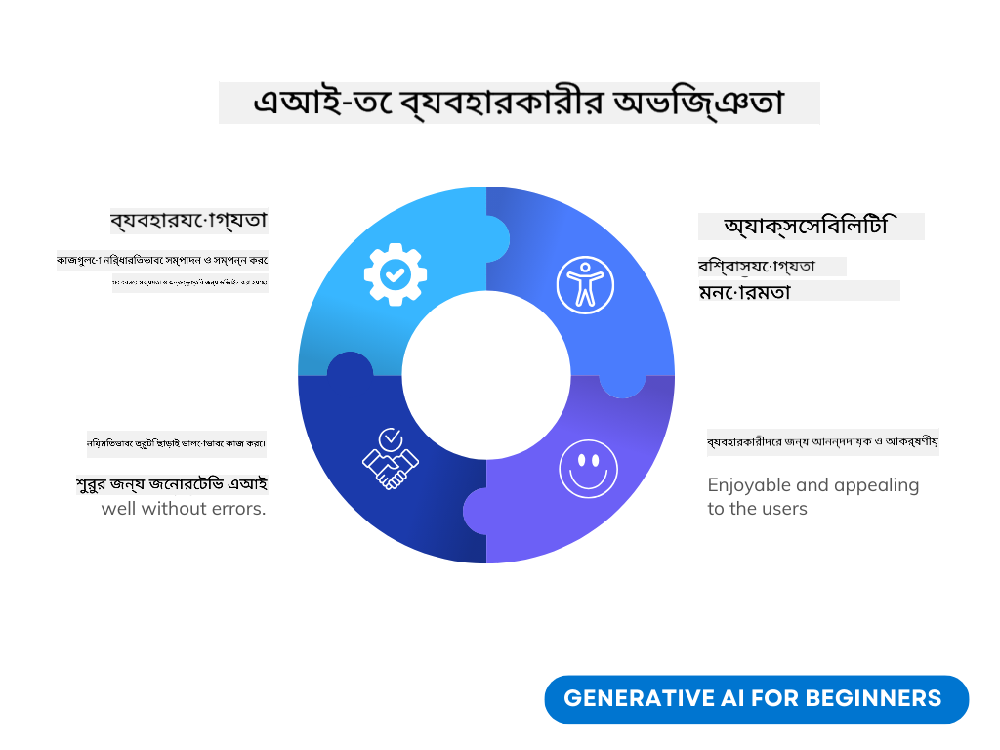

<!--
CO_OP_TRANSLATOR_METADATA:
{
  "original_hash": "747668e4c53d067369f06e9ec2e6313e",
  "translation_date": "2025-08-26T15:41:32+00:00",
  "source_file": "12-designing-ux-for-ai-applications/README.md",
  "language_code": "bn"
}
-->
# এআই অ্যাপ্লিকেশনের জন্য ইউএক্স ডিজাইন করা

> _(উপরের ছবিতে ক্লিক করে এই পাঠের ভিডিও দেখুন)_

ব্যবহারকারীর অভিজ্ঞতা (ইউএক্স) অ্যাপ তৈরি করার একটি অত্যন্ত গুরুত্বপূর্ণ দিক। ব্যবহারকারীরা যেন সহজে ও দক্ষভাবে আপনার অ্যাপ ব্যবহার করে কাজ করতে পারে, সেটি নিশ্চিত করা জরুরি। দক্ষতা গুরুত্বপূর্ণ হলেও, আপনাকে এমনভাবে অ্যাপ ডিজাইন করতে হবে যাতে সবাই এটি ব্যবহার করতে পারে, অর্থাৎ অ্যাপটি _সবার জন্য সহজলভ্য_ হয়। এই অধ্যায়ে আমরা এই বিষয়গুলো নিয়ে আলোচনা করব, যাতে আপনি এমন একটি অ্যাপ ডিজাইন করতে পারেন যা মানুষ ব্যবহার করতে চায় এবং পারে।

## পরিচিতি

ব্যবহারকারীর অভিজ্ঞতা হলো, একজন ব্যবহারকারী কীভাবে একটি নির্দিষ্ট পণ্য বা সেবা (যেমন কোনো সিস্টেম, টুল বা ডিজাইন) ব্যবহার ও তার সাথে যোগাযোগ করে। এআই অ্যাপ্লিকেশন তৈরি করার সময়, ডেভেলপাররা শুধু কার্যকারিতা নয়, নৈতিক দিকও বিবেচনা করেন। এই পাঠে আমরা দেখব কীভাবে কৃত্রিম বুদ্ধিমত্তা (এআই) অ্যাপ্লিকেশন তৈরি করা যায়, যা ব্যবহারকারীর চাহিদা পূরণ করে।

এই পাঠে নিচের বিষয়গুলো আলোচনা করা হবে:

- ইউএক্স পরিচিতি ও ব্যবহারকারীর চাহিদা বোঝা
- বিশ্বাস ও স্বচ্ছতার জন্য এআই অ্যাপ্লিকেশন ডিজাইন করা
- সহযোগিতা ও প্রতিক্রিয়ার জন্য এআই অ্যাপ্লিকেশন ডিজাইন করা

## শেখার লক্ষ্য

এই পাঠটি শেষ করার পর আপনি পারবেন:

- কীভাবে ব্যবহারকারীর চাহিদা পূরণ করে এমন এআই অ্যাপ্লিকেশন তৈরি করতে হয়, তা বুঝতে।
- কীভাবে বিশ্বাস ও সহযোগিতা বাড়ায় এমন এআই অ্যাপ্লিকেশন ডিজাইন করতে হয়, তা জানতে।

### পূর্বশর্ত

কিছুটা সময় নিয়ে [ব্যবহারকারীর অভিজ্ঞতা ও ডিজাইন থিঙ্কিং](https://learn.microsoft.com/training/modules/ux-design?WT.mc_id=academic-105485-koreyst) সম্পর্কে পড়ে নিন।

## ইউএক্স পরিচিতি ও ব্যবহারকারীর চাহিদা বোঝা

আমাদের কাল্পনিক শিক্ষা স্টার্টআপে, প্রধান দুই ধরনের ব্যবহারকারী আছে—শিক্ষক ও শিক্ষার্থী। প্রত্যেকেরই আলাদা চাহিদা রয়েছে। ব্যবহারকারী-কেন্দ্রিক ডিজাইন মানে হচ্ছে, ব্যবহারকারীর চাহিদাকে অগ্রাধিকার দিয়ে এমন পণ্য তৈরি করা, যা তাদের জন্য প্রাসঙ্গিক ও উপকারী।

একটি অ্যাপ্লিকেশনকে **উপযোগী, নির্ভরযোগ্য, সহজলভ্য ও আনন্দদায়ক** হতে হবে, যাতে ভালো ব্যবহারকারীর অভিজ্ঞতা পাওয়া যায়।

### ব্যবহারযোগ্যতা

উপযোগী মানে, অ্যাপ্লিকেশনের ফিচারগুলো তার উদ্দেশ্যের সাথে মানানসই, যেমন স্বয়ংক্রিয়ভাবে নম্বর দেওয়া বা রিভিশনের জন্য ফ্ল্যাশকার্ড তৈরি করা। যেমন, স্বয়ংক্রিয় নম্বর দেওয়ার অ্যাপ্লিকেশনটি যেন নির্ভুল ও দ্রুত শিক্ষার্থীদের কাজ মূল্যায়ন করতে পারে। আবার, ফ্ল্যাশকার্ড তৈরি করার অ্যাপ্লিকেশন যেন ডেটার ভিত্তিতে প্রাসঙ্গিক ও বৈচিত্র্যময় প্রশ্ন তৈরি করতে পারে।

### নির্ভরযোগ্যতা

নির্ভরযোগ্য মানে, অ্যাপ্লিকেশনটি বারবার ও নির্ভুলভাবে তার কাজ করতে পারে। তবে, এআই-ও মানুষের মতোই ভুল করতে পারে। অ্যাপ্লিকেশন চলাকালীন কোনো ত্রুটি বা অপ্রত্যাশিত পরিস্থিতি আসতে পারে, যেখানে মানুষের হস্তক্ষেপ দরকার হতে পারে। আপনি কীভাবে এই ত্রুটি সামলাবেন? এই পাঠের শেষ অংশে আমরা দেখব, কীভাবে এআই সিস্টেম ও অ্যাপ্লিকেশন সহযোগিতা ও প্রতিক্রিয়ার জন্য ডিজাইন করা হয়।

### সহজলভ্যতা

সহজলভ্য মানে, বিভিন্ন সক্ষমতার ব্যবহারকারীদের জন্য অ্যাপ্লিকেশনটি ব্যবহারযোগ্য করা, যাতে কেউ বাদ না পড়ে। অ্যাক্সেসিবিলিটি গাইডলাইন ও নীতিমালা অনুসরণ করলে, এআই সমাধানগুলো আরও অন্তর্ভুক্তিমূলক, ব্যবহারযোগ্য ও সবার জন্য উপকারী হয়।

### আনন্দদায়ক

আনন্দদায়ক মানে, অ্যাপ্লিকেশনটি ব্যবহার করতে ভালো লাগে। আকর্ষণীয় ব্যবহারকারীর অভিজ্ঞতা ব্যবহারকারীর ওপর ইতিবাচক প্রভাব ফেলে, ফলে তারা বারবার অ্যাপটি ব্যবহার করতে চায় এবং ব্যবসার আয় বাড়ে।

সব সমস্যার সমাধান এআই দিয়ে হয় না। এআই আপনার ব্যবহারকারীর অভিজ্ঞতাকে সমৃদ্ধ করে, যেমন ম্যানুয়াল কাজ স্বয়ংক্রিয় করা বা ব্যক্তিগতকৃত অভিজ্ঞতা তৈরি করা।

## বিশ্বাস ও স্বচ্ছতার জন্য এআই অ্যাপ্লিকেশন ডিজাইন করা

এআই অ্যাপ্লিকেশন ডিজাইন করার সময় বিশ্বাস তৈরি করা অত্যন্ত গুরুত্বপূর্ণ। বিশ্বাস মানে, ব্যবহারকারী নিশ্চিত যে অ্যাপ্লিকেশনটি কাজটি ঠিকভাবে করবে, নিয়মিত ফলাফল দেবে এবং ফলাফলটি ব্যবহারকারীর চাহিদা পূরণ করবে। এখানে দুটি ঝুঁকি আছে—অবিশ্বাস ও অতিরিক্ত বিশ্বাস। অবিশ্বাস হলে ব্যবহারকারী এআই সিস্টেমে আস্থা পায় না, ফলে অ্যাপ্লিকেশনটি গ্রহণ করে না। আবার, অতিরিক্ত বিশ্বাস হলে ব্যবহারকারী এআই সিস্টেমের ক্ষমতা অতিরঞ্জিতভাবে ধরে নেয়, ফলে এআই-কে অন্ধভাবে বিশ্বাস করে। যেমন, স্বয়ংক্রিয় নম্বর দেওয়ার সিস্টেমে অতিরিক্ত বিশ্বাসের কারণে শিক্ষক হয়তো কিছু খাতা যাচাই না করেই ধরে নেন, সিস্টেমটি ঠিক কাজ করছে। এতে শিক্ষার্থীরা অন্যায় বা ভুল নম্বর পেতে পারে, কিংবা প্রতিক্রিয়া ও উন্নতির সুযোগ হারাতে পারে।

বিশ্বাস নিশ্চিত করার দুটি উপায় হলো ব্যাখ্যাযোগ্যতা ও নিয়ন্ত্রণ।

### ব্যাখ্যাযোগ্যতা

যখন এআই কোনো সিদ্ধান্ত নিতে সাহায্য করে, যেমন ভবিষ্যৎ প্রজন্মকে শিক্ষা দেওয়া, তখন শিক্ষক ও অভিভাবকদের বোঝা জরুরি, এআই কীভাবে সিদ্ধান্ত নিচ্ছে। এটিই ব্যাখ্যাযোগ্যতা—এআই অ্যাপ্লিকেশন কীভাবে সিদ্ধান্ত নেয়, তা বোঝা। ব্যাখ্যাযোগ্যতার জন্য, আউটপুট কীভাবে এসেছে, সে বিষয়ে বিস্তারিত তথ্য দেওয়া উচিত। ব্যবহারকারীদের জানাতে হবে, আউটপুটটি এআই তৈরি করেছে, মানুষ নয়। যেমন, "এখনই আপনার টিউটরের সাথে চ্যাট শুরু করুন" বলার বদলে বলা যেতে পারে, "আপনার চাহিদা অনুযায়ী মানিয়ে নেওয়া এআই টিউটর ব্যবহার করুন, যা আপনাকে আপনার গতিতে শিখতে সাহায্য করবে।"

আরেকটি উদাহরণ, এআই কীভাবে ব্যবহারকারীর ব্যক্তিগত ডেটা ব্যবহার করে। যেমন, একজন শিক্ষার্থী তার পরিচয় অনুযায়ী কিছু সীমাবদ্ধতা পেতে পারে। এআই হয়তো সরাসরি উত্তর দেবে না, বরং ব্যবহারকারীকে সমস্যার সমাধান ভাবতে সাহায্য করবে।

ব্যাখ্যাযোগ্যতার আরেকটি গুরুত্বপূর্ণ দিক হলো, ব্যাখ্যাকে সহজ করা। শিক্ষার্থী ও শিক্ষকরা হয়তো এআই বিশেষজ্ঞ নন, তাই অ্যাপ্লিকেশন কী করতে পারে বা পারে না, সে ব্যাখ্যাগুলো সহজ ও বোধগম্য হওয়া উচিত।

### নিয়ন্ত্রণ

জেনারেটিভ এআই ব্যবহারকারী ও এআই-এর মধ্যে সহযোগিতা তৈরি করে, যেখানে ব্যবহারকারী বিভিন্ন ফলাফলের জন্য প্রম্পট পরিবর্তন করতে পারে। আবার, আউটপুট তৈরি হওয়ার পর ব্যবহারকারী চাইলে ফলাফল পরিবর্তন করতে পারে, এতে ব্যবহারকারীর নিয়ন্ত্রণের অনুভূতি বাড়ে। যেমন, Bing-এ আপনি ফরম্যাট, টোন ও দৈর্ঘ্য অনুযায়ী প্রম্পট সাজাতে পারেন। আবার, আউটপুটে পরিবর্তনও আনতে পারেন, যেমন নিচের ছবিতে দেখা যাচ্ছে:

Bing-এর আরেকটি ফিচার হলো, ব্যবহারকারী চাইলে এআই কোন ডেটা ব্যবহার করবে, তা নিয়ন্ত্রণ করতে পারে। যেমন, স্কুল অ্যাপ্লিকেশনে শিক্ষার্থী চাইলে নিজের নোট ও শিক্ষকের রিসোর্স রিভিশনের জন্য ব্যবহার করতে পারে।

> এআই অ্যাপ্লিকেশন ডিজাইন করার সময়, ব্যবহারকারীরা যেন অযৌক্তিকভাবে এআই-কে অতিরিক্ত বিশ্বাস না করে, তা নিশ্চিত করতে সচেতনতা জরুরি। এর একটি উপায় হলো, প্রম্পট ও ফলাফলের মাঝে কিছুটা বাধা তৈরি করা। ব্যবহারকারীকে মনে করিয়ে দিন, এটি এআই, কোনো মানুষ নয়।

## সহযোগিতা ও প্রতিক্রিয়ার জন্য এআই অ্যাপ্লিকেশন ডিজাইন করা

আগেই বলা হয়েছে, জেনারেটিভ এআই ব্যবহারকারী ও এআই-এর মধ্যে সহযোগিতা তৈরি করে। বেশিরভাগ ক্ষেত্রে, ব্যবহারকারী একটি প্রম্পট দেয় এবং এআই আউটপুট তৈরি করে। কিন্তু যদি আউটপুট ভুল হয়? অ্যাপ্লিকেশন কীভাবে ত্রুটি সামলায়? এআই কি ব্যবহারকারীকে দোষ দেয়, নাকি ত্রুটির কারণ ব্যাখ্যা করে?

এআই অ্যাপ্লিকেশন এমনভাবে তৈরি করা উচিত, যাতে প্রতিক্রিয়া নেওয়া ও দেওয়া যায়। এতে শুধু এআই সিস্টেমের উন্নতি হয় না, ব্যবহারকারীর আস্থাও বাড়ে। ডিজাইনে প্রতিক্রিয়া লুপ রাখা উচিত, যেমন আউটপুটে সহজভাবে থাম্বস আপ বা ডাউন দেওয়ার অপশন।

আরেকটি উপায় হলো, সিস্টেমের সক্ষমতা ও সীমাবদ্ধতা স্পষ্টভাবে জানানো। ব্যবহারকারী যদি এআই-এর ক্ষমতার বাইরে কিছু চায়, তাহলে সেটি কীভাবে সামলানো হবে, সেটিও ডিজাইনে রাখা উচিত, যেমন নিচের ছবিতে দেখা যাচ্ছে।

সিস্টেম ত্রুটি অ্যাপ্লিকেশনে সাধারণ, যেখানে ব্যবহারকারী হয়তো এআই-এর আওতার বাইরে কোনো তথ্য চাইতে পারে, বা অ্যাপ্লিকেশনে নির্দিষ্ট সংখ্যক প্রশ্ন/বিষয়ে সারাংশ তৈরি করার সীমা থাকতে পারে। যেমন, কোনো এআই অ্যাপ্লিকেশন যদি শুধু ইতিহাস ও গণিত বিষয়ে প্রশিক্ষিত হয়, তাহলে ভূগোল নিয়ে প্রশ্ন এলে সেটি সামলাতে পারবে না। এ ক্ষেত্রে, এআই সিস্টেম এমন উত্তর দিতে পারে: "দুঃখিত, আমাদের পণ্য নিম্নলিখিত বিষয়গুলোতে প্রশিক্ষিত হয়েছে....., আপনি যে প্রশ্ন করেছেন, তার উত্তর দিতে পারছি না।"

এআই অ্যাপ্লিকেশন নিখুঁত নয়, তাই ভুল করবেই। অ্যাপ্লিকেশন ডিজাইন করার সময়, ব্যবহারকারীর প্রতিক্রিয়া ও ত্রুটি সামলানোর জন্য সহজ ও বোধগম্য উপায় রাখা উচিত।

## অ্যাসাইনমেন্ট

আপনি এখন পর্যন্ত যেসব এআই অ্যাপ বানিয়েছেন, সেখানে নিচের ধাপগুলো যুক্ত করার কথা ভাবুন:

- **আনন্দদায়ক:** কীভাবে আপনার অ্যাপ আরও আনন্দদায়ক করা যায়, ভাবুন। আপনি কি সর্বত্র ব্যাখ্যা দিচ্ছেন? ব্যবহারকারীকে কি নতুন কিছু এক্সপ্লোর করতে উৎসাহিত করছেন? আপনার ত্রুটির বার্তাগুলো কেমন?

- **ব্যবহারযোগ্যতা:** ওয়েব অ্যাপ তৈরি করছেন। নিশ্চিত করুন, আপনার অ্যাপ মাউস ও কিবোর্ড—দুটো দিয়েই ব্যবহার করা যায়।

- **বিশ্বাস ও স্বচ্ছতা:** এআই ও তার আউটপুটকে পুরোপুরি বিশ্বাস করবেন না, বরং আউটপুট যাচাইয়ের জন্য মানুষের ভূমিকা রাখার কথা ভাবুন। বিশ্বাস ও স্বচ্ছতা অর্জনের আরও উপায় ভাবুন ও বাস্তবায়ন করুন।

- **নিয়ন্ত্রণ:** ব্যবহারকারী যেন অ্যাপ্লিকেশনে দেওয়া ডেটার ওপর নিয়ন্ত্রণ রাখতে পারে। এআই অ্যাপ্লিকেশনে ডেটা সংগ্রহে ব্যবহারকারী চাইলে অংশ নিতে বা না নিতে পারে, এমন ব্যবস্থা রাখুন।

## শেখা চালিয়ে যান!

এই পাঠ শেষ করার পর, আমাদের [Generative AI Learning collection](https://aka.ms/genai-collection?WT.mc_id=academic-105485-koreyst) দেখে নিন, যাতে আপনার জেনারেটিভ এআই জ্ঞান আরও বাড়ে!

এবার যান পাঠ ১৩-তে, যেখানে আমরা দেখব কীভাবে [এআই অ্যাপ্লিকেশন সুরক্ষিত করা যায়](../13-securing-ai-applications/README.md?WT.mc_id=academic-105485-koreyst)!

---

**দায়িত্ব অস্বীকার:**
এই নথিটি AI অনুবাদ পরিষেবা [Co-op Translator](https://github.com/Azure/co-op-translator) ব্যবহার করে অনুবাদ করা হয়েছে। আমরা যথাসাধ্য নির্ভুলতা বজায় রাখার চেষ্টা করি, তবে অনুগ্রহ করে মনে রাখবেন যে স্বয়ংক্রিয় অনুবাদে ভুল বা অসঙ্গতি থাকতে পারে। মূল ভাষায় থাকা নথিটিই কর্তৃত্বপূর্ণ উৎস হিসেবে বিবেচিত হবে। গুরুত্বপূর্ণ তথ্যের জন্য পেশাদার মানব অনুবাদ গ্রহণ করার পরামর্শ দেওয়া হচ্ছে। এই অনুবাদের ব্যবহারের ফলে কোনো ভুল বোঝাবুঝি বা ভুল ব্যাখ্যার জন্য আমরা দায়ী নই।