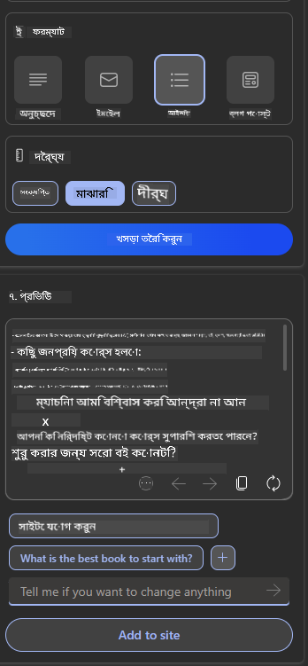

<!--
CO_OP_TRANSLATOR_METADATA:
{
  "original_hash": "ec385b41ee50579025d50cc03bfb3a25",
  "translation_date": "2025-07-09T14:53:34+00:00",
  "source_file": "12-designing-ux-for-ai-applications/README.md",
  "language_code": "bn"
}
-->
# AI অ্যাপ্লিকেশনের জন্য UX ডিজাইন করা

> _(এই পাঠের ভিডিও দেখতে উপরের ছবিতে ক্লিক করুন)_

ইউজার এক্সপেরিয়েন্স (UX) অ্যাপ তৈরি করার একটি অত্যন্ত গুরুত্বপূর্ণ দিক। ব্যবহারকারীদের আপনার অ্যাপটি দক্ষতার সঙ্গে ব্যবহার করতে পারা দরকার যাতে তারা তাদের কাজ সম্পন্ন করতে পারে। দক্ষ হওয়া একটি বিষয়, কিন্তু আপনাকে এমনভাবে অ্যাপ ডিজাইন করতেও হবে যাতে সবাই এটি ব্যবহার করতে পারে, অর্থাৎ অ্যাপটি _অ্যাক্সেসিবল_ হয়। এই অধ্যায়টি এই দিকটিতে ফোকাস করবে যাতে আপনি এমন একটি অ্যাপ ডিজাইন করতে পারেন যা মানুষ ব্যবহার করতে চায় এবং ব্যবহার করতে পারে।

## পরিচিতি

ইউজার এক্সপেরিয়েন্স হলো ব্যবহারকারীর একটি নির্দিষ্ট পণ্য বা সেবা, যেমন সিস্টেম, টুল বা ডিজাইনের সঙ্গে ইন্টারঅ্যাকশন এবং ব্যবহার করার পদ্ধতি। AI অ্যাপ্লিকেশন তৈরি করার সময়, ডেভেলপাররা শুধু কার্যকর UX নিশ্চিত করাই নয়, বরং নৈতিকতাও বিবেচনা করে। এই পাঠে আমরা কিভাবে ব্যবহারকারীর চাহিদা পূরণ করে Artificial Intelligence (AI) অ্যাপ্লিকেশন তৈরি করা যায় তা আলোচনা করব।

এই পাঠে নিম্নলিখিত বিষয়গুলো আলোচনা করা হবে:

- ইউজার এক্সপেরিয়েন্সের পরিচিতি এবং ব্যবহারকারীর চাহিদা বোঝা
- বিশ্বাস এবং স্বচ্ছতার জন্য AI অ্যাপ্লিকেশন ডিজাইন করা
- সহযোগিতা এবং ফিডব্যাকের জন্য AI অ্যাপ্লিকেশন ডিজাইন করা

## শেখার লক্ষ্য

এই পাঠ শেষ করার পর, আপনি সক্ষম হবেন:

- ব্যবহারকারীর চাহিদা পূরণ করে AI অ্যাপ্লিকেশন তৈরি করতে।
- বিশ্বাস এবং সহযোগিতা বাড়ানোর জন্য AI অ্যাপ্লিকেশন ডিজাইন করতে।

### পূর্বশর্ত

কিছু সময় নিয়ে [user experience এবং design thinking সম্পর্কে](https://learn.microsoft.com/training/modules/ux-design?WT.mc_id=academic-105485-koreyst) আরও পড়ুন।

## ইউজার এক্সপেরিয়েন্সের পরিচিতি এবং ব্যবহারকারীর চাহিদা বোঝা

আমাদের কাল্পনিক শিক্ষা স্টার্টআপে দুই ধরনের প্রধান ব্যবহারকারী আছেন, শিক্ষক এবং ছাত্র। প্রত্যেকের আলাদা আলাদা চাহিদা রয়েছে। একটি ইউজার-সেন্ট্রিক ডিজাইন ব্যবহারকারীর প্রাধান্য দেয় যাতে পণ্যগুলো তাদের জন্য প্রাসঙ্গিক এবং উপকারী হয় যাদের জন্য তা তৈরি করা হয়েছে।

অ্যাপ্লিকেশনটি **উপযোগী, নির্ভরযোগ্য, অ্যাক্সেসিবল এবং আনন্দদায়ক** হতে হবে যাতে ভালো ইউজার এক্সপেরিয়েন্স নিশ্চিত হয়।

### ব্যবহারযোগ্যতা

উপযোগী হওয়ার মানে হলো অ্যাপ্লিকেশনের ফাংশনালিটি তার উদ্দেশ্যের সাথে মেলে, যেমন গ্রেডিং প্রক্রিয়া স্বয়ংক্রিয় করা বা রিভিশনের জন্য ফ্ল্যাশকার্ড তৈরি করা। একটি গ্রেডিং প্রক্রিয়া স্বয়ংক্রিয় অ্যাপ্লিকেশনকে নির্ধারিত মানদণ্ড অনুযায়ী ছাত্রদের কাজের সঠিক এবং দক্ষ স্কোর দিতে সক্ষম হতে হবে। একইভাবে, একটি রিভিশন ফ্ল্যাশকার্ড তৈরি করা অ্যাপ্লিকেশন তার ডেটার ভিত্তিতে প্রাসঙ্গিক এবং বৈচিত্র্যময় প্রশ্ন তৈরি করতে পারবে।

### নির্ভরযোগ্যতা

নির্ভরযোগ্য হওয়ার মানে হলো অ্যাপ্লিকেশন তার কাজ ধারাবাহিকভাবে এবং ত্রুটিমুক্ত করতে পারে। তবে, AI মানুষের মতোই নিখুঁত নয় এবং ত্রুটির সম্ভাবনা থাকে। অ্যাপ্লিকেশনগুলো ত্রুটি বা অপ্রত্যাশিত পরিস্থিতির সম্মুখীন হতে পারে যেখানে মানুষের হস্তক্ষেপ বা সংশোধন প্রয়োজন। আপনি কীভাবে ত্রুটি মোকাবেলা করবেন? এই পাঠের শেষ অংশে আমরা আলোচনা করব কিভাবে AI সিস্টেম এবং অ্যাপ্লিকেশনগুলো সহযোগিতা এবং ফিডব্যাকের জন্য ডিজাইন করা হয়।

### অ্যাক্সেসিবিলিটি

অ্যাক্সেসিবল হওয়ার মানে হলো বিভিন্ন সক্ষমতার ব্যবহারকারীদের জন্য ইউজার এক্সপেরিয়েন্স প্রসারিত করা, যার মধ্যে প্রতিবন্ধী ব্যক্তিরাও অন্তর্ভুক্ত, যাতে কেউ বাদ না পড়ে। অ্যাক্সেসিবিলিটি গাইডলাইন এবং নীতিমালা অনুসরণ করে AI সমাধানগুলো আরও অন্তর্ভুক্তিমূলক, ব্যবহারযোগ্য এবং সকলের জন্য উপকারী হয়।

### আনন্দদায়ক

আনন্দদায়ক হওয়ার মানে হলো অ্যাপ্লিকেশনটি ব্যবহার করতে মজার হওয়া। আকর্ষণীয় ইউজার এক্সপেরিয়েন্স ব্যবহারকারীর উপর ইতিবাচক প্রভাব ফেলে, তাদের অ্যাপ্লিকেশনে ফিরে আসার জন্য উৎসাহিত করে এবং ব্যবসার আয় বাড়ায়।

প্রতিটি চ্যালেঞ্জ AI দিয়ে সমাধান করা যায় না। AI আসে আপনার ইউজার এক্সপেরিয়েন্স বাড়ানোর জন্য, যেমন ম্যানুয়াল কাজ স্বয়ংক্রিয় করা বা ব্যক্তিগতকৃত ইউজার এক্সপেরিয়েন্স তৈরি করা।

## বিশ্বাস এবং স্বচ্ছতার জন্য AI অ্যাপ্লিকেশন ডিজাইন করা

AI অ্যাপ্লিকেশন ডিজাইনে বিশ্বাস গড়ে তোলা অত্যন্ত গুরুত্বপূর্ণ। বিশ্বাস নিশ্চিত করে যে ব্যবহারকারী আত্মবিশ্বাসী যে অ্যাপ্লিকেশন কাজটি সম্পন্ন করবে, ধারাবাহিকভাবে ফলাফল দেবে এবং ফলাফলগুলোই ব্যবহারকারীর প্রয়োজন। এই ক্ষেত্রে ঝুঁকি হলো অবিশ্বাস এবং অতিরিক্ত বিশ্বাস। অবিশ্বাস ঘটে যখন ব্যবহারকারীর AI সিস্টেমের প্রতি খুব কম বা কোনো বিশ্বাস থাকে, যা অ্যাপ্লিকেশন প্রত্যাখ্যানের দিকে নিয়ে যায়। অতিরিক্ত বিশ্বাস ঘটে যখন ব্যবহারকারী AI সিস্টেমের ক্ষমতা অতিরিক্ত মূল্যায়ন করে, যার ফলে তারা AI সিস্টেমের ওপর অতিরিক্ত নির্ভর করে। উদাহরণস্বরূপ, একটি স্বয়ংক্রিয় গ্রেডিং সিস্টেমের ক্ষেত্রে অতিরিক্ত বিশ্বাসের ফলে শিক্ষক হয়তো কিছু কাগজপত্র যাচাই করবেন না, যা ছাত্রদের জন্য অন্যায় বা ভুল গ্রেডিং হতে পারে, অথবা ফিডব্যাক ও উন্নতির সুযোগ হারাতে পারে।

বিশ্বাস ডিজাইনের কেন্দ্রে রাখার দুটি উপায় হলো explainability এবং control।

### Explainability

যখন AI সিদ্ধান্ত গ্রহণে সাহায্য করে, যেমন ভবিষ্যৎ প্রজন্মকে জ্ঞান প্রদান, তখন শিক্ষক এবং অভিভাবকদের জন্য বোঝা জরুরি AI কিভাবে সিদ্ধান্ত নেয়। এটিই explainability - AI অ্যাপ্লিকেশন কিভাবে সিদ্ধান্ত নেয় তা বোঝা। explainability ডিজাইনে AI অ্যাপ্লিকেশন কী করতে পারে তার উদাহরণ দেওয়া অন্তর্ভুক্ত থাকে। উদাহরণস্বরূপ, "Get started with AI teacher" এর পরিবর্তে সিস্টেম ব্যবহার করতে পারে: "AI ব্যবহার করে সহজ রিভিশনের জন্য আপনার নোট সারাংশ করুন।"

আরেকটি উদাহরণ হলো AI কিভাবে ব্যবহারকারী এবং ব্যক্তিগত ডেটা ব্যবহার করে। উদাহরণস্বরূপ, একজন ব্যবহারকারী যার persona ছাত্র, তার persona অনুযায়ী সীমাবদ্ধতা থাকতে পারে। AI হয়তো প্রশ্নের উত্তর সরাসরি দিতে পারবে না, কিন্তু ব্যবহারকারীকে চিন্তা করতে সাহায্য করতে পারে কিভাবে সমস্যার সমাধান করা যায়।

explainability এর আরেকটি গুরুত্বপূর্ণ অংশ হলো ব্যাখ্যাগুলোকে সহজ করা। ছাত্র এবং শিক্ষকরা AI বিশেষজ্ঞ নাও হতে পারেন, তাই অ্যাপ্লিকেশন কী করতে পারে বা পারে না তার ব্যাখ্যা সহজ এবং বোঝার মতো হওয়া উচিত।

### Control

Generative AI ব্যবহারকারী এবং AI এর মধ্যে সহযোগিতা তৈরি করে, যেখানে ব্যবহারকারী বিভিন্ন ফলাফলের জন্য প্রম্পট পরিবর্তন করতে পারে। এছাড়াও, আউটপুট তৈরি হওয়ার পর ব্যবহারকারীরা ফলাফল পরিবর্তন করতে পারে, যা তাদের নিয়ন্ত্রণের অনুভূতি দেয়। উদাহরণস্বরূপ, Bing ব্যবহার করার সময়, আপনি ফরম্যাট, টোন এবং দৈর্ঘ্যের ভিত্তিতে প্রম্পট কাস্টমাইজ করতে পারেন। এছাড়াও, আপনি আউটপুটে পরিবর্তন যোগ করতে এবং আউটপুট পরিবর্তন করতে পারেন, যেমন নিচের ছবিতে দেখানো হয়েছে:

Bing এর আরেকটি ফিচার যা ব্যবহারকারীকে অ্যাপ্লিকেশনের উপর নিয়ন্ত্রণ দেয় তা হলো AI যে ডেটা ব্যবহার করে তার জন্য opt-in এবং opt-out করার সুবিধা। একটি স্কুল অ্যাপ্লিকেশনে, একজন ছাত্র হয়তো তার নোট এবং শিক্ষকদের রিসোর্স উভয়কেই রিভিশন ম্যাটেরিয়াল হিসেবে ব্যবহার করতে চাইতে পারে।

> AI অ্যাপ্লিকেশন ডিজাইনের সময়, উদ্দেশ্যমূলক হওয়া গুরুত্বপূর্ণ যাতে ব্যবহারকারীরা অতিরিক্ত বিশ্বাস না করে এবং AI এর ক্ষমতার জন্য অবাস্তব প্রত্যাশা না করে। এর একটি উপায় হলো প্রম্পট এবং ফলাফলের মধ্যে কিছু বাধা তৈরি করা, ব্যবহারকারীকে স্মরণ করিয়ে দেওয়া যে এটি AI, একজন মানুষের মতো নয়।

## সহযোগিতা এবং ফিডব্যাকের জন্য AI অ্যাপ্লিকেশন ডিজাইন করা

আগে উল্লেখ করা হয়েছে, generative AI ব্যবহারকারী এবং AI এর মধ্যে সহযোগিতা তৈরি করে। বেশিরভাগ ক্ষেত্রে ব্যবহারকারী একটি প্রম্পট ইনপুট দেয় এবং AI আউটপুট তৈরি করে। যদি আউটপুট ভুল হয় তাহলে কী হবে? অ্যাপ্লিকেশন কীভাবে ত্রুটি মোকাবেলা করবে? AI ব্যবহারকারীকে দোষারোপ করবে নাকি ত্রুটির ব্যাখ্যা দেবে?

AI অ্যাপ্লিকেশনগুলোকে ফিডব্যাক গ্রহণ এবং প্রদান করার জন্য তৈরি করা উচিত। এটি শুধু AI সিস্টেমকে উন্নত করতে সাহায্য করে না, ব্যবহারকারীর সঙ্গে বিশ্বাসও গড়ে তোলে। ডিজাইনে একটি ফিডব্যাক লুপ থাকা উচিত, যেমন আউটপুটে সহজ একটি থাম্বস আপ বা ডাউন।

আরেকটি উপায় হলো সিস্টেমের ক্ষমতা এবং সীমাবদ্ধতা স্পষ্টভাবে জানানো। যখন ব্যবহারকারী AI এর ক্ষমতার বাইরে কিছু চায়, তখন সেটি মোকাবেলা করার উপায় থাকা উচিত, যেমন নিচের ছবিতে দেখানো হয়েছে।

সিস্টেম ত্রুটি সাধারণ, যেখানে ব্যবহারকারী হয়তো AI এর সীমার বাইরে তথ্যের জন্য সাহায্য চাইতে পারে বা অ্যাপ্লিকেশনের প্রশ্ন/বিষয় সীমা থাকতে পারে। উদাহরণস্বরূপ, একটি AI অ্যাপ্লিকেশন যা সীমিত বিষয় যেমন ইতিহাস এবং গণিতের ডেটা দিয়ে প্রশিক্ষিত, হয়তো ভূগোল সম্পর্কিত প্রশ্নের উত্তর দিতে পারবে না। এই পরিস্থিতি মোকাবেলায় AI সিস্টেম বলতে পারে: "দুঃখিত, আমাদের পণ্য নিম্নলিখিত বিষয়গুলোর ডেটা দিয়ে প্রশিক্ষিত হয়েছে..., আমি আপনার প্রশ্নের উত্তর দিতে পারছি না।"

AI অ্যাপ্লিকেশন নিখুঁত নয়, তাই ভুল হওয়াই স্বাভাবিক। আপনার অ্যাপ ডিজাইন করার সময় ব্যবহারকারীর ফিডব্যাক এবং ত্রুটি মোকাবেলার জন্য সহজ এবং বোঝার মতো ব্যবস্থা রাখা উচিত।

## অ্যাসাইনমেন্ট

এখন পর্যন্ত আপনি যে কোনো AI অ্যাপ তৈরি করেছেন, সেগুলোতে নিচের ধাপগুলো প্রয়োগ করার কথা ভাবুন:

- **আনন্দদায়ক:** কিভাবে আপনার অ্যাপ আরও আনন্দদায়ক করা যায় তা বিবেচনা করুন। আপনি কি সর্বত্র ব্যাখ্যা যোগ করছেন? ব্যবহারকারীকে অন্বেষণ করতে উৎসাহিত করছেন? আপনার ত্রুটি বার্তাগুলো কেমন শব্দায়িত হচ্ছে?

- **ব্যবহারযোগ্যতা:** একটি ওয়েব অ্যাপ তৈরি করুন। নিশ্চিত করুন আপনার অ্যাপ মাউস এবং কীবোর্ড উভয় দিয়ে নেভিগেটযোগ্য।

- **বিশ্বাস এবং স্বচ্ছতা:** AI এবং এর আউটপুট সম্পূর্ণরূপে বিশ্বাস করবেন না, কিভাবে একজন মানুষকে প্রক্রিয়ায় যুক্ত করে আউটপুট যাচাই করবেন তা বিবেচনা করুন। এছাড়াও, বিশ্বাস এবং স্বচ্ছতা অর্জনের অন্যান্য উপায় বিবেচনা ও প্রয়োগ করুন।

- **নিয়ন্ত্রণ:** ব্যবহারকারীকে তাদের ডেটার উপর নিয়ন্ত্রণ দিন যা তারা অ্যাপ্লিকেশনে প্রদান করে। AI অ্যাপ্লিকেশনে ডেটা সংগ্রহে opt-in এবং opt-out করার ব্যবস্থা করুন।

## আপনার শেখা চালিয়ে যান!

এই পাঠ শেষ করার পর, আমাদের [Generative AI Learning collection](https://aka.ms/genai-collection?WT.mc_id=academic-105485-koreyst) দেখুন এবং আপনার Generative AI জ্ঞান আরও উন্নত করুন!

পরবর্তী পাঠ ১৩ এ যান, যেখানে আমরা দেখব কিভাবে [AI অ্যাপ্লিকেশন সুরক্ষিত করা যায়](../13-securing-ai-applications/README.md?WT.mc_id=academic-105485-koreyst)!

**অস্বীকৃতি**:  
এই নথিটি AI অনুবাদ সেবা [Co-op Translator](https://github.com/Azure/co-op-translator) ব্যবহার করে অনূদিত হয়েছে। আমরা যথাসাধ্য সঠিকতার চেষ্টা করি, তবে স্বয়ংক্রিয় অনুবাদে ত্রুটি বা অসঙ্গতি থাকতে পারে। মূল নথিটি তার নিজস্ব ভাষায়ই কর্তৃত্বপূর্ণ উৎস হিসেবে বিবেচিত হওয়া উচিত। গুরুত্বপূর্ণ তথ্যের জন্য পেশাদার মানব অনুবাদ গ্রহণ করার পরামর্শ দেওয়া হয়। এই অনুবাদের ব্যবহারে সৃষ্ট কোনো ভুল বোঝাবুঝি বা ভুল ব্যাখ্যার জন্য আমরা দায়ী নই।