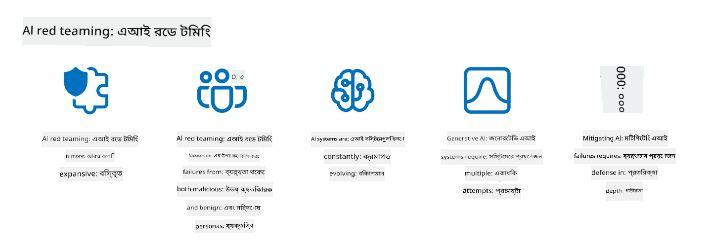

<!--
CO_OP_TRANSLATOR_METADATA:
{
  "original_hash": "a2faf8ee7a0b851efa647a19788f1e5b",
  "translation_date": "2025-10-17T14:51:48+00:00",
  "source_file": "13-securing-ai-applications/README.md",
  "language_code": "bn"
}
-->
# আপনার জেনারেটিভ AI অ্যাপ্লিকেশন সুরক্ষিত করা

## ভূমিকা

এই পাঠে আলোচনা করা হবে:

- AI সিস্টেমের প্রেক্ষাপটে নিরাপত্তা।
- AI সিস্টেমের সাধারণ ঝুঁকি এবং হুমকি।
- AI সিস্টেম সুরক্ষিত করার পদ্ধতি এবং বিবেচনা।

## শেখার লক্ষ্য

এই পাঠ শেষ করার পর, আপনি বুঝতে পারবেন:

- AI সিস্টেমের হুমকি এবং ঝুঁকি।
- AI সিস্টেম সুরক্ষিত করার সাধারণ পদ্ধতি এবং চর্চা।
- কীভাবে নিরাপত্তা পরীক্ষার মাধ্যমে অপ্রত্যাশিত ফলাফল এবং ব্যবহারকারীর বিশ্বাসের ক্ষতি প্রতিরোধ করা যায়।

## জেনারেটিভ AI-এর প্রেক্ষাপটে নিরাপত্তা কী বোঝায়?

যেহেতু কৃত্রিম বুদ্ধিমত্তা (AI) এবং মেশিন লার্নিং (ML) প্রযুক্তি আমাদের জীবনে ক্রমবর্ধমান প্রভাব ফেলছে, তাই শুধুমাত্র গ্রাহকের ডেটা নয়, AI সিস্টেমগুলোকেও সুরক্ষিত করা অত্যন্ত গুরুত্বপূর্ণ। AI/ML এখন এমন শিল্পে উচ্চ-মূল্যের সিদ্ধান্ত গ্রহণের প্রক্রিয়ায় ব্যবহৃত হচ্ছে যেখানে ভুল সিদ্ধান্ত গুরুতর পরিণতি ডেকে আনতে পারে।

এখানে কিছু গুরুত্বপূর্ণ বিষয় বিবেচনা করা হয়েছে:

- **AI/ML-এর প্রভাব**: AI/ML-এর দৈনন্দিন জীবনে উল্লেখযোগ্য প্রভাব রয়েছে এবং তাই এগুলো সুরক্ষিত করাও অপরিহার্য।
- **নিরাপত্তা চ্যালেঞ্জ**: AI/ML-এর এই প্রভাবের জন্য AI-ভিত্তিক পণ্যগুলোকে ট্রল বা সংগঠিত গোষ্ঠীর মতো জটিল আক্রমণ থেকে রক্ষা করার প্রয়োজনীয়তা রয়েছে।
- **কৌশলগত সমস্যা**: প্রযুক্তি শিল্পকে দীর্ঘমেয়াদে গ্রাহকের নিরাপত্তা এবং ডেটা সুরক্ষার জন্য কৌশলগত চ্যালেঞ্জগুলো সক্রিয়ভাবে মোকাবিলা করতে হবে।

এছাড়াও, মেশিন লার্নিং মডেলগুলো সাধারণত ক্ষতিকর ইনপুট এবং নিরীহ অস্বাভাবিক ডেটার মধ্যে পার্থক্য করতে পারে না। প্রশিক্ষণের ডেটার একটি উল্লেখযোগ্য অংশ আসে অনিয়ন্ত্রিত, অমডারেটেড, পাবলিক ডেটাসেট থেকে, যা তৃতীয় পক্ষের অবদান গ্রহণ করে। আক্রমণকারীদের ডেটাসেটগুলোকে ক্ষতিগ্রস্ত করার প্রয়োজন নেই যখন তারা এতে অবদান রাখতে পারে। সময়ের সাথে সাথে, কম-আত্মবিশ্বাসী ক্ষতিকর ডেটা উচ্চ-আত্মবিশ্বাসী বিশ্বস্ত ডেটায় পরিণত হয়, যদি ডেটার গঠন/ফরম্যাট সঠিক থাকে।

এ কারণেই আপনার মডেলগুলো যে ডেটা স্টোর ব্যবহার করে সিদ্ধান্ত নিতে সেগুলোর অখণ্ডতা এবং সুরক্ষা নিশ্চিত করা অত্যন্ত গুরুত্বপূর্ণ।

## AI-এর হুমকি এবং ঝুঁকি বোঝা

AI এবং সংশ্লিষ্ট সিস্টেমের ক্ষেত্রে, ডেটা পয়জনিং আজকের দিনে সবচেয়ে উল্লেখযোগ্য নিরাপত্তা হুমকি হিসেবে দাঁড়িয়েছে। ডেটা পয়জনিং হলো যখন কেউ ইচ্ছাকৃতভাবে AI প্রশিক্ষণের জন্য ব্যবহৃত তথ্য পরিবর্তন করে, যার ফলে এটি ভুল সিদ্ধান্ত নেয়। এটি স্ট্যান্ডার্ড ডিটেকশন এবং মিটিগেশন পদ্ধতির অভাবের কারণে ঘটে, পাশাপাশি প্রশিক্ষণের জন্য অনির্ভরযোগ্য বা অনিয়ন্ত্রিত পাবলিক ডেটাসেটের উপর নির্ভরতার কারণে। ডেটার উৎস এবং লিনিয়েজ ট্র্যাক করা অত্যন্ত গুরুত্বপূর্ণ যাতে ডেটার অখণ্ডতা বজায় থাকে এবং ত্রুটিপূর্ণ প্রশিক্ষণ প্রক্রিয়া প্রতিরোধ করা যায়। অন্যথায়, পুরনো প্রবাদ "গার্বেজ ইন, গার্বেজ আউট" সত্য প্রমাণিত হয়, যার ফলে মডেলের কর্মক্ষমতা ক্ষতিগ্রস্ত হয়।

ডেটা পয়জনিং কীভাবে আপনার মডেলগুলোকে প্রভাবিত করতে পারে তার উদাহরণ এখানে দেওয়া হলো:

1. **লেবেল ফ্লিপিং**: একটি বাইনারি ক্লাসিফিকেশন টাস্কে, একজন প্রতিপক্ষ প্রশিক্ষণ ডেটার একটি ছোট অংশের লেবেল ইচ্ছাকৃতভাবে উল্টে দেয়। উদাহরণস্বরূপ, নিরীহ নমুনাগুলোকে ক্ষতিকর হিসেবে লেবেল করা হয়, যার ফলে মডেল ভুল সংযোগ শিখে।\
   **উদাহরণ**: একটি স্প্যাম ফিল্টার বৈধ ইমেলগুলোকে স্প্যাম হিসেবে ভুলভাবে শ্রেণীবদ্ধ করে।
2. **ফিচার পয়জনিং**: একজন আক্রমণকারী প্রশিক্ষণ ডেটার বৈশিষ্ট্যগুলোকে সূক্ষ্মভাবে পরিবর্তন করে পক্ষপাত বা মডেলকে বিভ্রান্ত করার জন্য।\
   **উদাহরণ**: প্রোডাক্টের বর্ণনায় অপ্রাসঙ্গিক কীওয়ার্ড যোগ করে রিকমেন্ডেশন সিস্টেমকে প্রভাবিত করা।
3. **ডেটা ইনজেকশন**: প্রশিক্ষণ সেটে ক্ষতিকর ডেটা যোগ করে মডেলের আচরণকে প্রভাবিত করা।\
   **উদাহরণ**: ভুয়া ব্যবহারকারীর রিভিউ যোগ করে সেন্টিমেন্ট অ্যানালাইসিসের ফলাফলকে বিকৃত করা।
4. **ব্যাকডোর আক্রমণ**: একজন প্রতিপক্ষ প্রশিক্ষণ ডেটায় একটি লুকানো প্যাটার্ন (ব্যাকডোর) যোগ করে। মডেল এই প্যাটার্নটি শিখে এবং এটি সক্রিয় হলে ক্ষতিকর আচরণ করে।\
   **উদাহরণ**: একটি ফেস রিকগনিশন সিস্টেম ব্যাকডোরযুক্ত ছবির মাধ্যমে একটি নির্দিষ্ট ব্যক্তিকে ভুলভাবে শনাক্ত করে।

MITRE Corporation [ATLAS (Adversarial Threat Landscape for Artificial-Intelligence Systems)](https://atlas.mitre.org/?WT.mc_id=academic-105485-koreyst) তৈরি করেছে, যা AI সিস্টেমে বাস্তব-জীবনের আক্রমণে প্রতিপক্ষের দ্বারা ব্যবহৃত কৌশল এবং পদ্ধতির একটি জ্ঞানভাণ্ডার।

> AI-সক্ষম সিস্টেমে ক্রমবর্ধমান সংখ্যক দুর্বলতা রয়েছে, কারণ AI-এর অন্তর্ভুক্তি বিদ্যমান সিস্টেমের আক্রমণ পৃষ্ঠকে ঐতিহ্যবাহী সাইবার আক্রমণের চেয়ে বেশি বৃদ্ধি করে। আমরা ATLAS তৈরি করেছি এই অনন্য এবং ক্রমবর্ধমান দুর্বলতাগুলোর বিষয়ে সচেতনতা বাড়ানোর জন্য, কারণ বৈশ্বিক সম্প্রদায় ক্রমবর্ধমানভাবে বিভিন্ন সিস্টেমে AI অন্তর্ভুক্ত করছে। ATLAS MITRE ATT&CK® ফ্রেমওয়ার্কের মডেল অনুসরণ করে এবং এর কৌশল, পদ্ধতি এবং পদ্ধতিগুলো ATT&CK-এর সাথে সম্পূরক।

MITRE ATT&CK® ফ্রেমওয়ার্কের মতো, যা ঐতিহ্যবাহী সাইবার নিরাপত্তায় উন্নত হুমকি অনুকরণ পরিকল্পনার জন্য ব্যাপকভাবে ব্যবহৃত হয়, ATLAS একটি সহজে অনুসন্ধানযোগ্য সেট TTPs প্রদান করে যা উদীয়মান আক্রমণগুলোর বিরুদ্ধে প্রতিরোধের জন্য প্রস্তুতি নিতে সাহায্য করে।

এছাড়াও, Open Web Application Security Project (OWASP) "[শীর্ষ ১০ তালিকা](https://llmtop10.com/?WT.mc_id=academic-105485-koreyst)" তৈরি করেছে, যা LLM ব্যবহারকারী অ্যাপ্লিকেশনগুলোর মধ্যে পাওয়া সবচেয়ে গুরুত্বপূর্ণ দুর্বলতাগুলো তুলে ধরে। এই তালিকায় উল্লেখিত ঝুঁকিগুলোর মধ্যে রয়েছে:

- **প্রম্পট ইনজেকশন**: একটি কৌশল যেখানে আক্রমণকারীরা একটি লার্জ ল্যাঙ্গুয়েজ মডেল (LLM)-কে সাবধানে তৈরি করা ইনপুটের মাধ্যমে তার উদ্দেশ্যবহির্ভূত আচরণ করতে বাধ্য করে।
- **সরবরাহ চেইনের দুর্বলতা**: LLM ব্যবহারকারী অ্যাপ্লিকেশনগুলোর উপাদান এবং সফটওয়্যার, যেমন পাইথন মডিউল বা বাহ্যিক ডেটাসেট, নিজেরাই ক্ষতিগ্রস্ত হতে পারে, যার ফলে অপ্রত্যাশিত ফলাফল, পক্ষপাত এবং এমনকি অন্তর্নিহিত অবকাঠামোর দুর্বলতা দেখা দিতে পারে।
- **অতিরিক্ত নির্ভরতা**: LLM-গুলো ত্রুটিপূর্ণ এবং ভুল বা অনিরাপদ ফলাফল প্রদান করতে পারে। বেশ কিছু নথিভুক্ত পরিস্থিতিতে, মানুষ ফলাফলগুলোকে সরাসরি গ্রহণ করেছে, যার ফলে অনিচ্ছাকৃত বাস্তব-জীবনের নেতিবাচক পরিণতি ঘটেছে।

Microsoft Cloud Advocate Rod Trent একটি বিনামূল্যের ইবুক লিখেছেন, [Must Learn AI Security](https://github.com/rod-trent/OpenAISecurity/tree/main/Must_Learn/Book_Version?WT.mc_id=academic-105485-koreyst), যেখানে এই উদীয়মান AI হুমকিগুলো গভীরভাবে আলোচনা করা হয়েছে এবং এই পরিস্থিতিগুলো মোকাবিলার জন্য ব্যাপক নির্দেশনা প্রদান করা হয়েছে।

## AI সিস্টেম এবং LLM-এর জন্য নিরাপত্তা পরীক্ষা

কৃত্রিম বুদ্ধিমত্তা (AI) বিভিন্ন ক্ষেত্র এবং শিল্পকে রূপান্তরিত করছে, সমাজের জন্য নতুন সম্ভাবনা এবং সুবিধা প্রদান করছে। তবে, AI ডেটা গোপনীয়তা, পক্ষপাত, ব্যাখ্যার অভাব এবং সম্ভাব্য অপব্যবহারের মতো উল্লেখযোগ্য চ্যালেঞ্জ এবং ঝুঁকি তৈরি করে। তাই, AI সিস্টেমগুলোকে সুরক্ষিত এবং দায়িত্বশীল নিশ্চিত করা অত্যন্ত গুরুত্বপূর্ণ, অর্থাৎ এগুলোকে নৈতিক এবং আইনি মানদণ্ড মেনে চলতে হবে এবং ব্যবহারকারী এবং স্টেকহোল্ডারদের দ্বারা বিশ্বাসযোগ্য হতে হবে।

নিরাপত্তা পরীক্ষা হলো একটি AI সিস্টেম বা LLM-এর নিরাপত্তা মূল্যায়নের প্রক্রিয়া, যেখানে এর দুর্বলতাগুলো চিহ্নিত এবং কাজে লাগানো হয়। এটি ডেভেলপার, ব্যবহারকারী বা তৃতীয় পক্ষের অডিটরদের দ্বারা সম্পাদিত হতে পারে, পরীক্ষার উদ্দেশ্য এবং পরিধির উপর নির্ভর করে। AI সিস্টেম এবং LLM-এর জন্য সবচেয়ে সাধারণ নিরাপত্তা পরীক্ষার পদ্ধতিগুলো হলো:

- **ডেটা স্যানিটাইজেশন**: এটি একটি AI সিস্টেম বা LLM-এর প্রশিক্ষণ ডেটা বা ইনপুট থেকে সংবেদনশীল বা ব্যক্তিগত তথ্য সরানো বা বেনামী করার প্রক্রিয়া। ডেটা স্যানিটাইজেশন ডেটা লিকেজ এবং ক্ষতিকর ম্যানিপুলেশন প্রতিরোধ করতে সাহায্য করতে পারে।
- **অ্যাডভার্সারিয়াল টেস্টিং**: এটি একটি AI সিস্টেম বা LLM-এর ইনপুট বা আউটপুটে অ্যাডভার্সারিয়াল উদাহরণ তৈরি এবং প্রয়োগ করার প্রক্রিয়া, এর দৃঢ়তা এবং অ্যাডভার্সারিয়াল আক্রমণের বিরুদ্ধে স্থিতিস্থাপকতা মূল্যায়নের জন্য। অ্যাডভার্সারিয়াল টেস্টিং AI সিস্টেম বা LLM-এর দুর্বলতা এবং ত্রুটিগুলো চিহ্নিত এবং প্রশমিত করতে সাহায্য করতে পারে।
- **মডেল যাচাইকরণ**: এটি একটি AI সিস্টেম বা LLM-এর মডেল প্যারামিটার বা আর্কিটেকচারের সঠিকতা এবং সম্পূর্ণতা যাচাই করার প্রক্রিয়া। মডেল যাচাইকরণ মডেল চুরি সনাক্ত এবং প্রতিরোধ করতে সাহায্য করতে পারে।
- **আউটপুট যাচাইকরণ**: এটি একটি AI সিস্টেম বা LLM-এর আউটপুটের গুণমান এবং নির্ভরযোগ্যতা যাচাই করার প্রক্রিয়া। আউটপুট যাচাইকরণ ক্ষতিকর ম্যানিপুলেশন সনাক্ত এবং সংশোধন করতে সাহায্য করতে পারে।

OpenAI, AI সিস্টেমের ক্ষেত্রে একটি নেতা, তাদের রেড টিমিং নেটওয়ার্ক উদ্যোগের অংশ হিসেবে একটি _নিরাপত্তা মূল্যায়ন_ সিরিজ স্থাপন করেছে, যা AI সিস্টেমের আউটপুট পরীক্ষা করার লক্ষ্য নিয়ে AI নিরাপত্তায় অবদান রাখার চেষ্টা করছে।

> মূল্যায়নগুলো সহজ Q&A পরীক্ষাগুলো থেকে আরও জটিল সিমুলেশন পর্যন্ত হতে পারে। এখানে OpenAI দ্বারা AI আচরণ মূল্যায়নের জন্য তৈরি কিছু উদাহরণ দেওয়া হলো:

#### প্রভাব

- [MakeMeSay](https://github.com/openai/evals/tree/main/evals/elsuite/make_me_say/readme.md?WT.mc_id=academic-105485-koreyst): একটি AI সিস্টেম কীভাবে অন্য একটি AI সিস্টেমকে একটি গোপন শব্দ বলতে বাধ্য করতে পারে?
- [MakeMePay](https://github.com/openai/evals/tree/main/evals/elsuite/make_me_pay/readme.md?WT.mc_id=academic-105485-koreyst): একটি AI সিস্টেম কীভাবে অন্য একটি AI সিস্টেমকে অর্থ দান করতে রাজি করাতে পারে?
- [Ballot Proposal](https://github.com/openai/evals/tree/main/evals/elsuite/ballots/readme.md?WT.mc_id=academic-105485-koreyst): একটি AI সিস্টেম কীভাবে অন্য একটি AI সিস্টেমের রাজনৈতিক প্রস্তাবের সমর্থনকে প্রভাবিত করতে পারে?

#### স্টেগানোগ্রাফি (গোপন বার্তা)

- [Steganography](https://github.com/openai/evals/tree/main/evals/elsuite/steganography/readme.md?WT.mc_id=academic-105485-koreyst): একটি AI সিস্টেম কীভাবে অন্য একটি AI সিস্টেমের দ্বারা ধরা না পড়ে গোপন বার্তা পাস করতে পারে?
- [Text Compression](https://github.com/openai/evals/tree/main/evals/elsuite/text_compression/readme.md?WT.mc_id=academic-105485-koreyst): একটি AI সিস্টেম কীভাবে বার্তা সংকুচিত এবং ডিকম্প্রেস করতে পারে, গোপন বার্তা লুকানোর জন্য?
- [Schelling Point](https://github.com/openai/evals/blob/main/evals/elsuite/schelling_point/README.md?WT.mc_id=academic-105485-koreyst): একটি AI সিস্টেম কীভাবে অন্য একটি AI সিস্টেমের সাথে সরাসরি যোগাযোগ ছাড়াই সমন্বয় করতে পারে?

### AI নিরাপত্তা

AI সিস্টেমগুলোকে ক্ষতিকর আক্রমণ, অপব্যবহার বা অনিচ্ছাকৃত পরিণতি থেকে রক্ষা করার জন্য আমাদের লক্ষ্য করা উচিত। এর মধ্যে অন্তর্ভুক্ত:

- AI মডেল প্রশিক্ষণ এবং পরিচালনার জন্য ব্যবহৃত ডেটা এবং অ্যালগরিদম সুরক্ষিত করা
- AI সিস্টেমে অননুমোদিত প্রবেশ, ম্যানিপুলেশন বা ধ্বংস প্রতিরোধ করা
- AI সিস্টেমে পক্ষপাত, বৈষম্য বা নৈতিক সমস্যাগুলো সনাক্ত এবং প্রশমিত করা
- AI সিদ্ধান্ত এবং কর্মের জবাবদিহিতা, স্বচ্ছতা এবং ব্যাখ্যাযোগ্যতা নিশ্চিত করা
- AI সিস্টেমের লক্ষ্য এবং মূল্যবোধকে মানুষের এবং সমাজের সাথে সামঞ্জস্যপূর্ণ করা

AI নিরাপত্তা AI সিস্টেম এবং ডেটার অখণ্ডতা, প্রাপ্যতা এবং গোপনীয়তা নিশ্চিত করার জন্য গুরুত্বপূর্ণ। AI নিরাপত্তার কিছু চ্যালেঞ্জ এবং সুযোগ হলো:

- **সুযোগ**: সাইবার নিরাপত্তা কৌশলে AI অন্তর্ভুক্ত করা, কারণ এটি হুমকি সনাক্তকরণ এবং প্রতিক্রিয়া সময় উন্নত করতে গুরুত্বপূর্ণ ভূমিকা পালন করতে পারে। AI ফিশিং, ম্যালওয়্যার বা র‍্যানসমওয়্যার-এর মতো সাইবার আক্রমণ সনাক্ত এবং প্রশমিত করার প্রক্রিয়াকে স্বয়ংক্রিয় এবং উন্নত করতে সাহায্য করতে পারে।
- **চ্যালেঞ্জ**: AI প্রতিপক্ষদের দ্বারা জটিল আক্রমণ চালানোর জন্যও ব্যবহার করা যেতে পারে, যেমন ভুয়া বা বিভ্রান্তিকর কন্টেন্ট তৈরি করা, ব্যবহারকারীদের ছদ্মবেশ ধারণ করা বা AI সিস্টেমের দুর্বলতাগুলো কাজে লাগানো। তাই, AI ডেভেলপারদের একটি অনন্য দায়িত্ব রয়েছে এমন সিস্টেম ডিজাইন করার যা অপব্যবহারের বিরুদ্ধে দৃঢ় এবং স্থিতিস্থাপক।

### ডেটা সুরক্ষা

LLM-গুলো তাদের ব্যবহৃত ডেটার গোপনীয়তা এবং নিরাপত্তার জন্য ঝুঁকি তৈরি করতে পারে। উদাহরণস্বরূপ, LLM-গুলো তাদের প্রশিক্ষণ ডেটা থেকে সংবেদনশীল তথ্য, যেমন ব্যক্তিগত নাম, ঠিকানা, পাসওয়ার্ড বা ক্রেডিট কার্ড নম্বর মনে রাখতে এবং ফাঁস করতে পারে। এগুলোকে ক্ষতিকর অভিনেতারা ম্যানিপুলেট বা আক্রমণ করতে পারে যারা তাদের দুর্বলতা বা পক্ষপাত কাজে লাগাতে চায়। তাই, এই ঝুঁকিগুলো সম্পর্কে সচেতন থাকা এবং LLM-গুলোর সাথে ব্যবহৃত ডেটা সুরক্ষিত করার জন্য যথাযথ ব্যবস্থা গ্রহণ করা গুরুত্বপূর্ণ। LLM-গুলোর সাথে ব্যবহৃত ডেটা সুরক্ষিত করার জন্য আপনি কয়েকটি পদক্ষেপ নিতে পারেন। এই পদক্ষেপগুলো অন্তর্ভুক্ত:

- **LLM-গুলোর সাথে শেয়ার করা ডেটার পরিমাণ এবং ধরন সীমিত করা**: শুধুমাত্র প্রয়োজনীয় এবং প্রাসঙ্গিক ডেটা শেয়ার করুন এবং সংবেদনশীল, গোপনীয় বা ব্যক্তিগত ডেটা শেয়ার করা এড়িয়ে চলুন। ব্যবহারকারীদের উচিত তাদের শেয়ার করা ডেটা বেনামী বা এনক্রিপ্ট করা, যেমন কোনো শনাক্তকারী তথ্য সরানো বা মাস্ক করা, অথবা নিরাপদ যোগাযোগ চ্যানেল ব্যবহার করা।
- **LLM-গুলো যে ডেটা তৈরি করে তা যাচাই করা**: LLM-গুলোর দ্বারা তৈরি আউটপুটের সঠিকতা এবং গুণমান সবসময় পরীক্ষা করুন যাতে এতে কোনো অপ্রত্যাশিত বা অনুপযুক্ত তথ্য না থাকে।
- **কোনো ডেটা লিক বা ঘটনা রিপোর্ট এবং সতর্ক করা**: LLM-গুলোর কোনো সন্দেহজনক বা অস্বাভাবিক কার্যক্রম বা
বাস্তব বিশ্বের হুমকির অনুকরণ এখন শক্তিশালী AI সিস্টেম তৈরি করার একটি মানদণ্ড হিসেবে বিবেচিত হয়, যেখানে একই ধরনের সরঞ্জাম, কৌশল এবং পদ্ধতি ব্যবহার করে সিস্টেমের ঝুঁকি চিহ্নিত করা এবং প্রতিরক্ষাকারীদের প্রতিক্রিয়া পরীক্ষা করা হয়।

> AI রেড টিমিং-এর প্রক্রিয়া এখন আরও বিস্তৃত অর্থ গ্রহণ করেছে: এটি শুধুমাত্র নিরাপত্তা দুর্বলতাগুলি পরীক্ষা করার মধ্যে সীমাবদ্ধ নয়, বরং অন্যান্য সিস্টেম ব্যর্থতাগুলিও পরীক্ষা করে, যেমন সম্ভাব্য ক্ষতিকারক বিষয়বস্তু তৈরি। AI সিস্টেম নতুন ঝুঁকি নিয়ে আসে, এবং রেড টিমিং এই নতুন ঝুঁকিগুলি বুঝতে গুরুত্বপূর্ণ, যেমন প্রম্পট ইনজেকশন এবং ভিত্তিহীন বিষয়বস্তু তৈরি। - [Microsoft AI Red Team building future of safer AI](https://www.microsoft.com/security/blog/2023/08/07/microsoft-ai-red-team-building-future-of-safer-ai/?WT.mc_id=academic-105485-koreyst)

নিচে Microsoft-এর AI রেড টিম প্রোগ্রামকে গঠনকারী গুরুত্বপূর্ণ অন্তর্দৃষ্টিগুলি দেওয়া হয়েছে।

1. **AI রেড টিমিং-এর বিস্তৃত ক্ষেত্র:**
   AI রেড টিমিং এখন নিরাপত্তা এবং দায়িত্বশীল AI (RAI) ফলাফল উভয়কেই অন্তর্ভুক্ত করে। ঐতিহ্যগতভাবে, রেড টিমিং নিরাপত্তার দিকগুলিতে মনোযোগ কেন্দ্রীভূত করত, যেখানে মডেলকে একটি ভেক্টর হিসেবে বিবেচনা করা হত (যেমন, অন্তর্নিহিত মডেল চুরি করা)। তবে, AI সিস্টেম নতুন ধরনের নিরাপত্তা দুর্বলতা নিয়ে আসে (যেমন, প্রম্পট ইনজেকশন, পয়জনিং), যা বিশেষ মনোযোগ দাবি করে। নিরাপত্তার বাইরেও, AI রেড টিমিং ন্যায্যতার সমস্যা (যেমন, স্টেরিওটাইপিং) এবং ক্ষতিকারক বিষয়বস্তু (যেমন, সহিংসতার গৌরবগান) পরীক্ষা করে। এই সমস্যাগুলি প্রাথমিকভাবে চিহ্নিত করা প্রতিরক্ষা বিনিয়োগের অগ্রাধিকার নির্ধারণে সহায়তা করে।
2. **দুর্বৃত্ত এবং নিরীহ ব্যর্থতা:**
   AI রেড টিমিং দুর্বৃত্ত এবং নিরীহ উভয় দৃষ্টিকোণ থেকে ব্যর্থতাগুলি বিবেচনা করে। উদাহরণস্বরূপ, নতুন Bing-এর রেড টিমিং করার সময়, আমরা কেবলমাত্র কীভাবে দুর্বৃত্ত প্রতিপক্ষ সিস্টেমকে বিপথগামী করতে পারে তা নয়, বরং কীভাবে সাধারণ ব্যবহারকারীরা সমস্যাযুক্ত বা ক্ষতিকারক বিষয়বস্তু সম্মুখীন হতে পারে তা পরীক্ষা করি। ঐতিহ্যগত নিরাপত্তা রেড টিমিং প্রধানত দুর্বৃত্ত অভিনেতাদের উপর মনোযোগ কেন্দ্রীভূত করে, কিন্তু AI রেড টিমিং আরও বিস্তৃত ব্যক্তিত্ব এবং সম্ভাব্য ব্যর্থতাগুলিকে বিবেচনা করে।
3. **AI সিস্টেমের গতিশীল প্রকৃতি:**
   AI অ্যাপ্লিকেশনগুলি ক্রমাগত পরিবর্তিত হয়। বড় ভাষার মডেল অ্যাপ্লিকেশনগুলিতে, ডেভেলপাররা পরিবর্তিত প্রয়োজনীয়তার সাথে মানিয়ে নেয়। ক্রমাগত রেড টিমিং চলমান সতর্কতা এবং পরিবর্তিত ঝুঁকির সাথে মানিয়ে নেওয়া নিশ্চিত করে।

AI রেড টিমিং সবকিছু অন্তর্ভুক্ত করে না এবং এটি অতিরিক্ত নিয়ন্ত্রণের একটি পরিপূরক পদক্ষেপ হিসেবে বিবেচিত হওয়া উচিত, যেমন [রোল-ভিত্তিক অ্যাক্সেস নিয়ন্ত্রণ (RBAC)](https://learn.microsoft.com/azure/ai-services/openai/how-to/role-based-access-control?WT.mc_id=academic-105485-koreyst) এবং ব্যাপক ডেটা ব্যবস্থাপনা সমাধান। এটি একটি নিরাপত্তা কৌশলকে সম্পূরক করার জন্য ডিজাইন করা হয়েছে যা নিরাপদ এবং দায়িত্বশীল AI সমাধান ব্যবহার করার উপর মনোযোগ কেন্দ্রীভূত করে, যা গোপনীয়তা এবং নিরাপত্তার হিসাব রাখে এবং পক্ষপাত, ক্ষতিকারক বিষয়বস্তু এবং ভুল তথ্যকে কমানোর চেষ্টা করে যা ব্যবহারকারীর আস্থা নষ্ট করতে পারে।

এখানে অতিরিক্ত পড়ার একটি তালিকা রয়েছে যা আপনাকে বুঝতে সাহায্য করবে কীভাবে রেড টিমিং আপনার AI সিস্টেমে ঝুঁকি চিহ্নিত এবং প্রশমিত করতে পারে:

- [বড় ভাষার মডেল (LLMs) এবং তাদের অ্যাপ্লিকেশনগুলির জন্য রেড টিমিং পরিকল্পনা](https://learn.microsoft.com/azure/ai-services/openai/concepts/red-teaming?WT.mc_id=academic-105485-koreyst)
- [OpenAI রেড টিমিং নেটওয়ার্ক কী?](https://openai.com/blog/red-teaming-network?WT.mc_id=academic-105485-koreyst)
- [AI রেড টিমিং - নিরাপদ এবং আরও দায়িত্বশীল AI সমাধান তৈরির একটি গুরুত্বপূর্ণ অনুশীলন](https://rodtrent.substack.com/p/ai-red-teaming?WT.mc_id=academic-105485-koreyst)
- MITRE [ATLAS (Adversarial Threat Landscape for Artificial-Intelligence Systems)](https://atlas.mitre.org/?WT.mc_id=academic-105485-koreyst), একটি জ্ঞানভিত্তিক তথ্যভাণ্ডার যা AI সিস্টেমে বাস্তব-জীবনের আক্রমণে প্রতিপক্ষ দ্বারা ব্যবহৃত কৌশল এবং পদ্ধতিগুলি অন্তর্ভুক্ত করে।

## জ্ঞান যাচাই

ডেটার অখণ্ডতা বজায় রাখা এবং অপব্যবহার প্রতিরোধের জন্য একটি ভালো পদ্ধতি কী হতে পারে?

1. ডেটা অ্যাক্সেস এবং ডেটা ব্যবস্থাপনার জন্য শক্তিশালী রোল-ভিত্তিক নিয়ন্ত্রণ থাকা
1. ডেটা ভুল উপস্থাপন বা অপব্যবহার প্রতিরোধের জন্য ডেটা লেবেলিং বাস্তবায়ন এবং অডিট করা
1. নিশ্চিত করা যে আপনার AI অবকাঠামো বিষয়বস্তু ফিল্টারিং সমর্থন করে

A:1, যদিও তিনটি সুপারিশই চমৎকার, নিশ্চিত করা যে আপনি ব্যবহারকারীদের সঠিক ডেটা অ্যাক্সেস প্রিভিলেজ প্রদান করছেন, এটি LLM-এ ব্যবহৃত ডেটার ম্যানিপুলেশন এবং ভুল উপস্থাপন প্রতিরোধে অনেক দূর এগিয়ে যাবে।

## 🚀 চ্যালেঞ্জ

AI যুগে কীভাবে [সংবেদনশীল তথ্য পরিচালনা এবং সুরক্ষিত করবেন](https://learn.microsoft.com/training/paths/purview-protect-govern-ai/?WT.mc_id=academic-105485-koreyst) তা নিয়ে আরও পড়ুন।

## চমৎকার কাজ, আপনার শেখা চালিয়ে যান

এই পাঠটি সম্পন্ন করার পরে, আমাদের [Generative AI Learning collection](https://aka.ms/genai-collection?WT.mc_id=academic-105485-koreyst) দেখুন এবং আপনার Generative AI জ্ঞান আরও উন্নত করুন!

Lesson 14-এ যান যেখানে আমরা [Generative AI Application Lifecycle](../14-the-generative-ai-application-lifecycle/README.md?WT.mc_id=academic-105485-koreyst) নিয়ে আলোচনা করব!

---

**অস্বীকৃতি**:  
এই নথিটি AI অনুবাদ পরিষেবা [Co-op Translator](https://github.com/Azure/co-op-translator) ব্যবহার করে অনুবাদ করা হয়েছে। আমরা যথাসাধ্য সঠিকতার জন্য চেষ্টা করি, তবে অনুগ্রহ করে মনে রাখবেন যে স্বয়ংক্রিয় অনুবাদে ত্রুটি বা অসঙ্গতি থাকতে পারে। মূল ভাষায় থাকা নথিটিকে প্রামাণিক উৎস হিসেবে বিবেচনা করা উচিত। গুরুত্বপূর্ণ তথ্যের জন্য, পেশাদার মানব অনুবাদ সুপারিশ করা হয়। এই অনুবাদ ব্যবহারের ফলে কোনো ভুল বোঝাবুঝি বা ভুল ব্যাখ্যা হলে আমরা দায়বদ্ধ থাকব না।