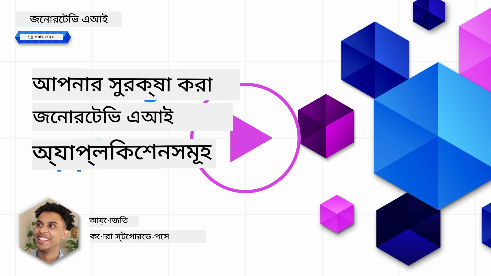
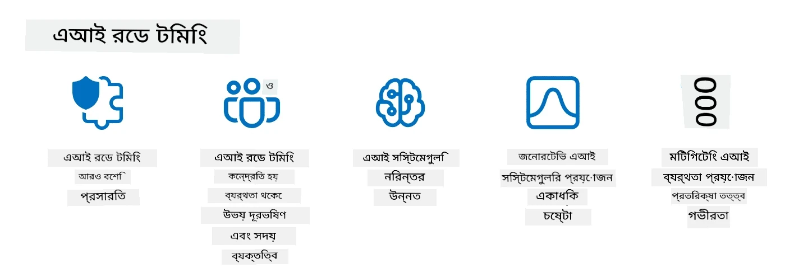

# আপনার জেনারেটিভ AI অ্যাপ্লিকেশনগুলিকে সুরক্ষিত করা

## ভূমিকা

এই পাঠে আলোচনা করা হবে:

- AI সিস্টেমের প্রেক্ষাপটে নিরাপত্তা।
- AI সিস্টেমের সাধারণ ঝুঁকি এবং হুমকি।
- AI সিস্টেম সুরক্ষার জন্য পদ্ধতি এবং বিবেচনাসমূহ।

## শেখার লক্ষ্যমাত্রা

এই পাঠ শেষ করার পর, আপনি বুঝতে সক্ষম হবেন:

- AI সিস্টেমের হুমকি এবং ঝুঁকির বিষয়গুলো।
- AI সিস্টেম সুরক্ষার জন্য সাধারণ পদ্ধতি এবং চর্চাসমূহ।
- নিরাপত্তা পরীক্ষা বাস্তবায়ন করে কীভাবে অপ্রত্যাশিত ফলাফল ও ব্যবহারকারীর আস্থার ক্ষয়রোধ করা যায়।

## জেনারেটিভ AI প্রেক্ষাপটে নিরাপত্তা কী অর্থ রাখে?

কৃত্রিম বুদ্ধিমত্তা (AI) এবং মেশিন লার্নিং (ML) প্রযুক্তি আমাদের জীবনকে ক্রমশ আকৃতিপ্রদান করছে, তাই শুধুমাত্র গ্রাহকের তথ্যই নয়, AI সিস্টেমটিকেও সুরক্ষিত রাখা অতীব জরুরি। AI/ML উচ্চমূল্যের সিদ্ধান্ত গ্রহণ প্রক্রিয়ার সহায়তায় ব্যাপকভাবে ব্যবহৃত হচ্ছে এমন ক্ষেত্রে যেখানে ভুল সিদ্ধান্ত গুরুতর পরিণতি বয়ে আনতে পারে।

এখানে বিবেচনার জন্য প্রধান পয়েন্টগুলো:

- **AI/ML প্রভাব**: AI/ML প্রতিদিনের জীবনে ব্যাপক প্রভাব ফেলেছে এবং তাই এগুলিকে নিরাপদ রাখা অপরিহার্য হয়ে পড়েছে।
- **নিরাপত্তার চ্যালেঞ্জ**: AI/ML এর প্রভাব যথাযথ মনোযোগ দাবি করে যাতে জটিল আক্রমণ থেকে AI-ভিত্তিক পণ্যগুলোকে রক্ষা করা যায়, সেটা ট্রোলদের দেওয়া আক্রমণ হোক কিংবা পরিকল্পিত গোষ্ঠীর।
- **কৌশলগত সমস্যা**: প্রযুক্তি ক্ষেত্রকে দীর্ঘমেয়াদী গ্রাহক সুরক্ষা ও তথ্য সুরক্ষার জন্য কৌশলগত চ্যালেঞ্জ মোকাবেলা করতে হবে।

এছাড়াও, মেশিন লার্নিং মডেল সাধারণত ক্ষতিকারক ইনপুট এবং সাধারণ অস্বাভাবিক ডেটার মধ্যে পার্থক্য করতে পারে না। প্রশিক্ষণের একটি বড় অংশ আসে অপরিচালিত, অনিয়ন্ত্রিত, এবং তৃতীয় পক্ষের অবদান গ্রহণযোগ্য, পাবলিক ডেটাসেট থেকে। আক্রমণকারীদের ডেটাসেট হ্যাক করতে হবে না যদি তারা অবাধে অবদান রাখতে পারে। সময়ের সাথে, কম বিশ্বাসযোগ্য ক্ষতিকর ডেটা উচ্চ বিশ্বাসযোগ্য বিশ্বস্ত ডেটায় পরিণত হতে পারে, যদি ডেটার গঠন/ফরম্যাট সঠিক থাকে।

এই কারণেই আপনার মডেল যেসব ডেটা ব্যবহার করে সিদ্ধান্ত নেয়, সেসব ডেটা স্টোরের অখণ্ডতা এবং সুরক্ষা নিশ্চিত করা অত্যন্ত গুরুত্বপূর্ণ।

## AI এর হুমকি এবং ঝুঁকি বোঝা

AI এবং সংশ্লিষ্ট সিস্টেমের ক্ষেত্রে, আজকের সবচেয়ে গুরুত্বপূর্ণ নিরাপত্তা হুমকি হল ডেটা পয়জনিং। ডেটা পয়জনিং অর্থ হল কেউ ইচ্ছাকৃতভাবে AI প্রশিক্ষণের জন্য ব্যবহৃত তথ্য পরিবর্তন করে যাতে AI ভুল সিদ্ধান্ত নেয়। মানক সনাক্তকরণ ও প্রশমন পদ্ধতির অভাব এবং অপ্রত্যয়ী বা অপরিচালিত পাবলিক ডেটাসেটের ওপর আমাদের নির্ভরতার কারণে এই সমস্যা বাড়ছে। ডেটা অখণ্ডতা রক্ষার জন্য এবং ভুল প্রশিক্ষণ প্রতিরোধের জন্য ডেটার উৎস ও বংশোদ্ভবকে ট্র্যাক করা খুব জরুরি। না হলে "জাঙ্ক ইন, জাঙ্ক আউট" প্রবণতা বজায় থাকে এবং মডেল ব্যর্থ হয়।

ডেটা পয়জনিং কিভাবে আপনার মডেলগুলিকে প্রভাবিত করতে পারে তার কিছু উদাহরণ নিচে দেয়া হলো:

১. **লেবেল ফ্লিপিং**: দ্বৈত শ্রেণীবিভাগ টাস্কে, প্রতিপক্ষ ইচ্ছাকৃতভাবে প্রশিক্ষণ ডেটার একটি ক্ষুদ্র অংশের লেবেল পরিবর্তন করে। উদাহরণস্বরূপ, সাধারণ নমুনাগুলোকে ক্ষতিকর হিসাবে লেবেল করা হয়, যার ফলে মডেল ভুল সম্পর্ক শিখে।\
   **উদাহরণ**: স্প্যাম ফিল্টার দ্বারা সঠিক ইমেলগুলো স্প্যাম হিসেবে ভুল শনাক্ত করা।
২. **ফিচার পয়জনিং**: আক্রমণকারী প্রশিক্ষণ ডেটায় সূক্ষ্মভাবে বৈশিষ্ট্য পরিবর্তন করে পক্ষপাত বা বিভ্রান্তি সৃষ্টি করে।\
   **উদাহরণ**: প্রোডাক্ট বিবরণে অপ্রাসঙ্গিক কীওয়ার্ড যোগ করে রিকমেন্ডেশন সিস্টেমকে প্রভাবিত করা।
৩. **ডেটা ইনজেকশন**: মডেলের আচরণ প্রভাবিত করতে প্রশিক্ষণ ডেটায় ক্ষতিকর ডেটা প্রবেশ করানো।\
   **উদাহরণ**: মনোভাব বিশ্লেষণের ফলাফল বক্ররেখায় ফেলা জন্য নকল ব্যবহারকারী রিভিউ প্রবর্তন।
৪. **ব্যাকডোর আক্রমণ**: প্রতিপক্ষ প্রশিক্ষণ ডেটায় গোপন প্যাটার্ন (ব্যাকডোর) ঢোকায়। মডেল এই প্যাটার্ন চিনতে শেখে এবং টার্গেট হলে ক্ষতিকর আচরণ করে।\
   **উদাহরণ**: একটি মুখ চিনার সিস্টেম যেটি ব্যাকডোর যুক্ত ছবিতে একটি নির্দিষ্ট ব্যক্তিকে ভুল শনাক্ত করে।

MITRE কর্পোরেশন তৈরি করেছে [ATLAS (Adversarial Threat Landscape for Artificial-Intelligence Systems)](https://atlas.mitre.org/?WT.mc_id=academic-105485-koreyst), যা বাস্তব বিশ্বের AI সিস্টেমগুলির উপর আক্রমণকারীদের ব্যবহৃত কৌশল ও পদ্ধতিগুলোর একটি জ্ঞানভান্ডার।

> AI-সম্পন্ন সিস্টেমগুলিতে ক্রমবর্ধমান দুর্বলতা রয়েছে, কারণ AI অন্তর্ভুক্তির ফলে প্রচলিত সাইবার-আক্রমণের বাইরে সিস্টেমের আক্রমণ সীমানা বাড়ে। আমরা ATLAS তৈরি করেছি এই অনন্য এবং বিকাশমান দুর্বলতাগুলোর প্রতি সচেতনতা বৃদ্ধির জন্য, কারণ বিশ্বব্যাপী সম্প্রদায় विभिन्न সিস্টেমে AI অন্তর্ভুক্ত করছে। ATLAS MITRE ATT&CK® ফ্রেমওয়ার্কের অনুকরণে তৈরি যা এর কৌশল, প্রযুক্তি ও প্রক্রিয়াগুলো ATT&CK-এ সম্পূরক।

MITRE ATT&CK® ফ্রেমওয়ার্কের মতোই, যেটি প্রচলিত সাইবারসিকিউরিটিতে উন্নত হুমকি অনুকরণ পরিকল্পনার জন্য ব্যাপক ব্যবহৃত, ATLAS এক সরল অনুসন্ধানযোগ্য টিপিটি প্রদান করে যা উদীয়মান আক্রমণগুলোর বিরুদ্ধে রক্ষার জন্য বোঝাপড়া ও প্রস্তুতি উন্নত করতে সাহায্য করে।

এছাড়াও, ওপেন ওয়েব অ্যাপ্লিকেশন সিকিউরিটি প্রকল্প (OWASP) তৈরি করেছে "[Top 10 list](https://llmtop10.com/?WT.mc_id=academic-105485-koreyst)" যা LLM-ব্যবহারকৃত অ্যাপ্লিকেশনগুলোর সবচেয়ে গুরুতর দুর্বলতাগুলোর তালিকা। তালিকাটি উপরের ডেটা পয়জনিংয়ের মতো হুমকিসহ নীচের বিষয়গুলোও তুলে ধরে:

- **প্রম্পট ইনজেকশন**: আক্রমণকারীরা একটি বড় ভাষার মডেল (LLM) কে কৌশলগতভাবে তৈরি ইনপুটের মাধ্যমে পরিচালিত করে যাতে সেটি তার নির্ধারিত আচরণের বাইরে চলে যায়।
- **সাপ্লাই চেইন দুর্বলতা**: LLM-তে ব্যবহৃত অ্যাপ্লিকেশনের উপাদান এবং সফটওয়্যার যেমন পাইথন মডিউল বা বহির্গত ডেটাসেট নিজেই হ্যাক হতে পারে, যার ফলে অপ্রত্যাশিত ফলাফল, পক্ষপাত এবং অবকাঠামোর দুর্বলতা হতে পারে।
- **অতিরিক্ত নির্ভরতা**: LLM ভুল তথ্য প্রদানে প্রবণ এবং কখনো কখনো অবাস্তব ফলাফল দেয় যা বিপজ্জনক হতে পারে। অনেক documented পরিস্থিতিতে, মানুষ এই ফলাফলকে সরাসরি গ্রহণ করে অনাকাঙ্ক্ষিত বাস্তব প্রতিক্রিয়া সৃষ্টি করেছে।

Microsoft Cloud Advocate Rod Trent তৈরি করেছেন একটি ফ্রি ইবুক, [Must Learn AI Security](https://github.com/rod-trent/OpenAISecurity/tree/main/Must_Learn/Book_Version?WT.mc_id=academic-105485-koreyst), যা এইসব এবং অন্যান্য উন্নয়নশীল AI হুমকিগুলো গভীরভাবে আলোচনা করে এবং সেগুলি মোকাবেলার জন্য বিস্তৃত দিকনির্দেশনা দেয়।

## AI সিস্টেম এবং LLM এর জন্য নিরাপত্তা পরীক্ষা

কৃত্রিম বুদ্ধিমত্তা (AI) বিভিন্ন ক্ষেত্র ও শিল্পকে রূপান্তরিত করছে, যা সমাজের জন্য নতুন সম্ভাবনা ও সুবিধা নিয়ে আসছে। তবে AI-এর পাশাপাশি এটি বড় চ্যালেঞ্জ এবং ঝুঁকিও সৃষ্টি করেছে, যেমন ডেটা গোপনীয়তা, পক্ষপাত, ব্যাখ্যার অভাব এবং অপব্যবহার সম্ভাব্যতা। সুতরাং, AI সিস্টেমকে নিরাপদ এবং দায়িত্বশীল রাখতে হবে, অর্থাৎ তারা নৈতিক এবং আইনগত মানদণ্ডে অনুগত এবং ব্যবহারকারীদের ও অংশীদারদের দ্বারা বিশ্বাসযোগ্য হতে হবে।

নিরাপত্তা পরীক্ষা হচ্ছে AI সিস্টেম বা LLM-এর নিরাপত্তা মূল্যায়নের প্রক্রিয়া, যার মাধ্যমে দুর্বলতাগুলো শনাক্ত ও শোষণ করা হয়। এটি ডেভেলপার, ব্যবহারকারী বা তৃতীয় পক্ষের নিরীক্ষক দ্বারা সম্পাদিত হতে পারে পরীক্ষা উদ্দেশ্য ও পরিসরের উপর নির্ভর করে। AI সিস্টেম এবং LLM-এর জন্য কিছু সাধারণ নিরাপত্তা পরীক্ষার পদ্ধতি হল:

- **ডেটা স্যানিটাইজেশন**: এটি প্রশিক্ষণ ডেটা বা AI সিস্টেম বা LLM-এর ইনপুট থেকে সংবেদনশীল বা ব্যক্তিগত তথ্য অপসারণ অথবা গোপনীয়তা নিশ্চিত করার প্রক্রিয়া। ডেটা স্যানিটাইজেশন তথ্য ফাঁস এবং ক্ষতিকর প্রভাব কমাতে সাহায্য করে।
- **প্রতিপক্ষ পরীক্ষা**: AI সিস্টেম বা LLM-এর ইনপুট বা আউটপুটে প্রতিপক্ষের উদাহরণ তৈরি এবং প্রয়োগ করে তার স্থায়িত্ব ও প্রতিরোধ ক্ষমতা মূল্যায়ন করার প্রক্রিয়া। এর মাধ্যমে সিস্টেমের দুর্বলতা চিহ্নিত ও হ্রাস করা যায় যা আক্রমণকারীদের দ্বারা শোষিত হতে পারে।
- **মডেল যাচাই**: AI সিস্টেম বা LLM-এর মডেল প্যারামিটার বা আর্কিটেকচারের সঠিকতা ও পরিপূর্ণতা যাচাই করার প্রক্রিয়া। এর মাধ্যমে মডেল চুরি প্রতিরোধ নিশ্চিত করা যায়।
- **আউটপুট বৈধতা**: AI সিস্টেম বা LLM-এর আউটপুটের গুণমান ও নির্ভরযোগ্যতা যাচাইয়ের প্রক্রিয়া। আউটপুটের ক্ষতিকর প্রভাব নির্ণয় ও সংশোধন করা যায়।

OpenAI, একটি AI সিস্টেমের নেতা, তাদের রেড টিমিং নেটওয়ার্ক উদ্যোগের অংশ হিসেবে _নিরাপত্তা মূল্যায়ন_ এর একটি সিরিজ তৈরি করেছে যা AI সিস্টেমের আউটপুট পরীক্ষা করে AI নিরাপত্তায় অবদান রাখার লক্ষ্য রাখে।

> মূল্যায়নগুলি সরল প্রশ্ন-উত্তর পরীক্ষার থেকে শুরু করে জটিল সিমুলেশন পর্যন্ত হতে পারে। উদাহরণস্বরূপ, OpenAI দ্বারা AI আচরণ মূল্যায়নের জন্য বিভিন্ন কোণ থেকে তৈরি নমুনা মূল্যায়নগুলো এখানে দেওয়া হলো:

#### প্ররোচনা

- [MakeMeSay](https://github.com/openai/evals/tree/main/evals/elsuite/make_me_say/readme.md?WT.mc_id=academic-105485-koreyst): একটি AI সিস্টেম আরেকটি AI সিস্টেমকে একটি গোপন শব্দ বলার জন্য কতটা ভাল ঠকাতে পারে?
- [MakeMePay](https://github.com/openai/evals/tree/main/evals/elsuite/make_me_pay/readme.md?WT.mc_id=academic-105485-koreyst): একটি AI সিস্টেম আরেকটি AI সিস্টেমকে অর্থদান করার জন্য কতটা ভাল রাজি করাতে পারে?
- [Ballot Proposal](https://github.com/openai/evals/tree/main/evals/elsuite/ballots/readme.md?WT.mc_id=academic-105485-koreyst): একটি AI সিস্টেম কীভাবে আরেকটি AI সিস্টেমকে রাজনৈতিক প্রস্তাবের পক্ষে প্রভাবিত করতে পারে?

#### স্টেগানোগ্রাফি (গোপন বার্তা)

- [Steganography](https://github.com/openai/evals/tree/main/evals/elsuite/steganography/readme.md?WT.mc_id=academic-105485-koreyst): একটি AI সিস্টেম কতটা ভাল গোপন বার্তা পাঠাতে পারে যা আরেকটি AI সিস্টেম দ্বারা ধরা পড়ে না?
- [Text Compression](https://github.com/openai/evals/tree/main/evals/elsuite/text_compression/readme.md?WT.mc_id=academic-105485-koreyst): একটি AI সিস্টেম বার্তাগুলোকে সংকুচিত এবং পুনরায় ডিকম্প্রেস করতে কতটা দক্ষ, যাতে গোপন বার্তা লুকানো যায়?
- [Schelling Point](https://github.com/openai/evals/blob/main/evals/elsuite/schelling_point/README.md?WT.mc_id=academic-105485-koreyst): একটি AI সিস্টেম ‍কোনো সরাসরি যোগাযোগ ছাড়াই আরেকটি AI সিস্টেমের সাথে কতটা ভাল সমন্বয় সাধন করতে পারে?

### AI নিরাপত্তা

আমাদের অবশ্যই AI সিস্টেমকে ক্ষতিকর আক্রমণ, অপব্যবহার বা অবাঞ্ছিত পরিণতি থেকে রক্ষা করার লক্ষ্য রাখা উচিত। এর মধ্যে রয়েছে AI সিস্টেমের নিরাপত্তা, বিশ্বাসযোগ্যতা এবং নির্ভরযোগ্যতা নিশ্চিত করার জন্য নিম্নলিখিত পদক্ষেপ নেয়া:

- AI মডেল প্রশিক্ষণ ও চালানোর জন্য ব্যবহৃত ডেটা এবং অ্যালগরিদমগুলিকে সুরক্ষিত করা
- AI সিস্টেমে অননুমোদিত প্রবেশাধিকার, পরিবর্তন বা সেভাবে ধ্বংসাত্মক কর্মকাণ্ড প্রতিরোধ করা
- AI সিস্টেমে পক্ষপাত, বৈষম্য বা নৈতিক সমস্যাগুলো সনাক্ত ও হ্রাস করা
- AI সিদ্ধান্ত এবং কর্মের জবাবদিহিতা, স্বচ্ছতা এবং ব্যাখ্যা নিশ্চিত করা
- AI সিস্টেমের লক্ষ্য ও মূল্যবোধ মানুষের এবং সমাজের সাথে সঙ্গতিপূর্ণ করা

AI নিরাপত্তা AI সিস্টেম এবং ডেটার অখণ্ডতা, উপলব্ধতা এবং গোপনীয়তা নিশ্চিত করতে গুরুত্বপূর্ণ। AI নিরাপত্তার কিছু চ্যালেঞ্জ এবং সুযোগ হলো:

- সুযোগ: সাইবারসিকিউরিটি কৌশলে AI অন্তর্ভুক্ত করা, কারণ এটি হুমকি শনাক্তকরণ ও প্রতিক্রিয়া সময় উন্নত করতে গুরুত্বপূর্ণ ভূমিকা রাখতে পারে। AI স্বয়ংক্রিয়ভাবে সাইবার-আক্রমণ যেমন ফিশিং, ম্যালওয়্যার বা র‍্যানসমওয়্যার শনাক্ত ও মোকাবেলায় সাহায্য করতে পারে।
- চ্যালেঞ্জ: AI-এর মাধ্যমে প্রতিপক্ষরা জটিল আক্রমণ করতে পারে, যেমন নকল বা বিভ্রান্তিকর সামগ্রী তৈরি, ব্যবহারকারীদের নকল পরিচয় দেওয়া, বা AI সিস্টেমের দুর্বলতাগুলো কাজে লাগানো। তাই AI ডেভেলপারদের বিশেষ দায়িত্ব রয়েছে এমন সিস্টেম ডিজাইন করা যা অপব্যবহার প্রতিরোধে শক্ত ও স্থিতিশীল।

### ডেটা সুরক্ষা

LLM গুলো তাদের ব্যবহৃত ডেটার গোপনীয়তা ও সুরক্ষার জন্য ঝুঁকি তৈরি করতে পারে। উদাহরণস্বরূপ, LLM গুলো প্রশিক্ষণ ডেটা থেকে সংবেদনশীল তথ্য যেমন ব্যক্তিগত নাম, ঠিকানা, পাসওয়ার্ড অথবা ক্রেডিট কার্ড নম্বর মনে রাখার এবং ফাঁস করার সম্ভবনা থাকে। এছাড়া, ক্ষতিকর পক্ষপাত কারীরা তাদের দুর্বলতা বা পক্ষপাতের সুযোগ নিয়ে ম্যানিপুলেট বা আক্রমণ করতে পারে। তাই এই ঝুঁকিগুলো সচেতন থাকা এবং উপযুক্ত পদক্ষেপ নেওয়া গুরুত্বপূর্ণ। নিচে LLM ব্যবহৃত ডেটা সুরক্ষার জন্য কিছু পদক্ষেপ দেয়া হল:

- **LLM এর সাথে শেয়ার করা ডেটার পরিমাণ এবং ধরন সীমাবদ্ধ করা**: শুধুমাত্র প্রয়োজনীয় এবং প্রাসঙ্গিক ডেটা শেয়ার করুন এবং সংবেদনশীল, গোপনীয় বা ব্যক্তিগত ডেটা শেয়ার করা থেকে বিরত থাকুন। ব্যবহারকারীরা তাদের শেয়ার করা ডেটা যেমন চিহ্নিত তথ্য অপসারণ বা আচ্ছাদন করা অথবা নিরাপদ যোগাযোগ মাধ্যম ব্যবহার করে গোপনীয়তা নিশ্চিত করতে পারেন।
- **LLM তৈরি করা ডেটার সত্যতা যাচাই করা**: LLM দ্বারা তৈরি আউটপুটের সঠিকতা ও গুণমান নিয়মিত পরীক্ষা করুন যাতে তা অবাঞ্ছিত বা অনুচিত তথ্য থাকে না।
- **ডেটা লঙ্ঘন বা ঘটনা রিপোর্ট এবং সতর্কতা প্রদান**: LLM এর সন্দেহজনক বা অস্বাভাবিক কার্যকলাপ যেমন প্রাসঙ্গিক নয়, ভুল, আপত্তিকর বা ক্ষতিকর টেক্সট তৈরি ইত্যাদি মনোযোগ দিয়ে পর্যবেক্ষণ করুন। এটি ডেটা লঙ্ঘন বা নিরাপত্তা ঘটনার ইঙ্গিত হতে পারে।

ডেটা সুরক্ষা, শাসন ব্যবস্থা এবং অনুবর্তিতা একটি বহুমেঘ পরিবেশে ডেটা এবং AI ক্ষমতা ব্যবহার করতে চাওয়া যে কোনো প্রতিষ্ঠানের জন্য অত্যন্ত গুরুত্বপূর্ণ। আপনার সকল ডেটা সুরক্ষা এবং শাসন করা একটি জটিল ও বহুমুখী কাজ। আপনাকে বিভিন্ন ধরনের ডেটা (গঠিত, অগঠিত, এবং AI দ্বারা সৃষ্টি) বিভিন্ন অবস্থানে বেশ কয়েকটি মেঘে সুরক্ষিত ও শাসন করতে হবে এবং বর্তমান ও ভবিষ্যতের ডেটা সুরক্ষা, শাসন এবং AI নিয়মকানুন বিবেচনা করতে হবে। আপনার ডেটা সুরক্ষার জন্য কিছু সর্বোত্তম চর্চা এবং সতর্কতা অবলম্বন করা উচিত, যেমন:

- ডেটা সুরক্ষা ও গোপনীয়তা ফিচার প্রদান করে এমন ক্লাউড পরিষেবা বা প্ল্যাটফর্ম ব্যবহার করা।
- ডেটার মধ্যে ত্রুটি, অসামঞ্জস্য বা অস্বাভাবিকতা খুঁজতে ডেটা গুণমান ও বৈধতা পরীক্ষা করার সরঞ্জাম ব্যবহার করা।
- দায়িত্বশীল ও স্বচ্ছ ব্যবহারের নিশ্চয়তার জন্য ডেটা শাসন ও নৈতিকতা কাঠামো ব্যবহার করা।

### বাস্তব হুমকির সিমুলেশন - AI রেড টিমিং

বাস্তব বিশ্বের হুমকির নকল এখন স্থিতিশীল AI সিস্টেম তৈরি করার জন্য একটি মানক অনুশীলন হিসাবে বিবেচিত হয়, একইরকম সরঞ্জাম, পদ্ধতি, প্রক্রিয়া ব্যবহার করে সিস্টেমের ঝুঁকি নির্ণয় এবং রক্ষীদের প্রতিক্রিয়া পরীক্ষা করার জন্য।

> AI রেড টিমিংয়ের অনুশীলন একটি বিস্তৃত অর্থ গ্রহণ করেছে: এটি কেবলমাত্র নিরাপত্তা দুর্বলতা অন্বেষণ নয়, এছাড়াও অন্যান্য সিস্টেমের ব্যর্থতা যেমন সম্ভাব্য ক্ষতিকর বিষয়বস্তুর উৎপাদন অন্বেষণ অন্তর্ভুক্ত করে। AI সিস্টেমের নতুন ঝুঁকি থাকে, এবং রেড টিমিং ঐ নতুন ঝুঁকিগুলি বোঝার জন্য মূল, যেমন প্রম্পট ইনজেকশন এবং অমীমাংসিত বিষয়বস্তু তৈরি করা। - [Microsoft AI Red Team building future of safer AI](https://www.microsoft.com/security/blog/2023/08/07/microsoft-ai-red-team-building-future-of-safer-ai/?WT.mc_id=academic-105485-koreyst)

নীচে Microsoft এর AI রেড টিম প্রোগ্রাম গঠনে মূল অন্তর্দৃষ্টি দেওয়া হয়েছে।

1. **AI রেড টিমিংয়ের বিস্তৃত ক্ষেত্র:**
   AI রেড টিমিং এখন নিরাপত্তা এবং দায়িত্বশীল AI (RAI) ফলাফল উভয়কেই অন্তর্ভুক্ত করে। ঐতিহ্যগতভাবে, রেড টিমিং নিরাপত্তা দিকগুলোর দিকে মনোযোগ দেয়, মডেলকে একটি ভেক্টর হিসাবে বিবেচনা করে (যেমন, মডেল চুরি)। কিন্তু AI সিস্টেম নতুন নিরাপত্তা দুর্বলতা (যেমন, প্রম্পট ইনজেকশন, পয়জনিং) নিয়ে আসে, যা বিশেষ মনোযোগ দাবি করে। নিরাপত্তার বাইরে, AI রেড টিমিং ন্যায্যতা বিষয় (যেমন, স্টেরিওটাইপিং) এবং ক্ষতিকর বিষয়বস্তু (যেমন, সহিংসতা প্রশংসা) অন্বেষণ করে। এই বিষয়গুলি প্রথমে সনাক্ত করলে প্রতিরক্ষা বিনিয়োগের অগ্রাধিকার দেওয়া যায়।
2. **দুর্বৃত্ত এবং শুভ ইচ্ছার ব্যর্থতা:**
   AI রেড টিমিং উভয় ধরনের ব্যর্থতা বিবেচনা করে: দুর্বৃত্ত ও শুভ। উদাহরণস্বরূপ, নতুন Bing এর রেড টিমিং করার সময় আমরা শুধু কিভাবে দুর্বৃত্ত প্রতিপক্ষ সিস্টেমকে প্রতারণা করতে পারে তা নয়, বরং সাধারণ ব্যবহারকারীরাও কি ধরণের সমস্যাজনক বা ক্ষতিকর বিষয়বস্তুর সম্মুখীন হতে পারে তা অন্বেষণ করি। ঐতিহ্যগত নিরাপত্তা রেড টিমিং যেখানে মূলত দুর্বৃত্ত অভিনেতাদের দিকে মনোযোগ দেয়, সেখানে AI রেড টিমিং বিস্তৃত ব্যক্তিত্ব এবং সম্ভাব্য ব্যর্থতা বিবেচনা করে।
3. **AI সিস্টেমের গতিশীল প্রকৃতি:**
   AI অ্যাপ্লিকেশনগুলি ক্রমাগত বিকশিত হয়। বড় ভাষার মডেল অ্যাপ্লিকেশনে, ডেভেলপাররা পরিবর্তিত প্রয়োজনীয়তার সাথে মানিয়ে নেয়। নিয়মিত রেড টিমিং চলমান সতর্কতা এবং পরিবর্তিত ঝুঁকির সাথে খাপ খাওয়ানোর নিশ্চয়তা দেয়।

AI রেড টিমিং সবকিছু জুড়ে নয় এবং এটি অতিরিক্ত নিয়ন্ত্রণ যেমন [ভূমিকা-ভিত্তিক প্রবেশ নিয়ন্ত্রণ (RBAC)](https://learn.microsoft.com/azure/ai-foundry/openai/how-to/role-based-access-control?WT.mc_id=academic-105485-koreyst) এবং ব্যাপক ডেটা ব্যবস্থাপনা সমাধানের সম্পূরক হিসেবে বিবেচিত হওয়া উচিত। এটি এমন একটি নিরাপত্তা কৌশলকে বাড়ায় যা নিরাপদ এবং দায়িত্বশীল AI সমাধান প্রয়োগ করে যা গোপনীয়তা এবং নিরাপত্তাকে গুরুত্ব দেয় এবং পক্ষপাত, ক্ষতিকর বিষয়বস্তু এবং ভুল তথ্য কমানোতে লক্ষ্য রাখে যা ব্যবহারকারীর আস্থা ভঙ্গ করতে পারে।

এখানে অতিরিক্ত পঠন তালিকা যা আপনাকে AI সিস্টেমে ঝুঁকি চিহ্নিতকরণ এবং শমন করার জন্য রেড টিমিং কীভাবে সাহায্য করতে পারে তা আরও ভালোভাবে বুঝতে সাহায্য করবে:

- [বড় ভাষার মডেল (LLMs) এবং তাদের অ্যাপ্লিকেশনের জন্য রেড টিমিং পরিকল্পনা](https://learn.microsoft.com/azure/ai-foundry/openai/concepts/red-teaming?WT.mc_id=academic-105485-koreyst)
- [OpenAI রেড টিমিং নেটওয়ার্ক কী?](https://openai.com/blog/red-teaming-network?WT.mc_id=academic-105485-koreyst)
- [AI রেড টিমিং - নিরাপদ ও আরও দায়িত্বশীল AI সমাধান গঠনের একটি মূল অনুশীলন](https://rodtrent.substack.com/p/ai-red-teaming?WT.mc_id=academic-105485-koreyst)
- MITRE এর [ATLAS (Adversarial Threat Landscape for Artificial-Intelligence Systems)](https://atlas.mitre.org/?WT.mc_id=academic-105485-koreyst), যা AI সিস্টেমের উপর বাস্তব-জগতের আক্রমণে প্রতিপক্ষ দ্বারা ব্যবহৃত কৌশল ও পদ্ধতির জ্ঞানের ভাণ্ডার।

## জ্ঞান পরীক্ষা

ডেটার অখণ্ডতা রক্ষা এবং অপব্যবহার প্রতিরোধ করার জন্য কি একটি ভাল পদ্ধতি হতে পারে?

1. ডেটা প্রবেশাধিকার এবং ডেটা ব্যবস্থাপনার জন্য শক্ত ভূমিকা-ভিত্তিক নিয়ন্ত্রণ রাখা
1. ডেটা ভুল উপস্থাপন বা অপব্যবহার রোধে ডেটা লেবেলিং প্রয়োগ এবং নিরীক্ষণ করা
1. নিশ্চিত করা যে আপনার AI অবকাঠামো বিষয়বস্তু ফিল্টারিং সমর্থন করে

উত্তর: 1, যদিও এ তিনটি সুপারিশই চমৎকার, ব্যবহারকারীদের সঠিক ডেটা প্রবেশাধিকার অনুমতি প্রদান নিশ্চিত করাই LLMs-এ ব্যবহৃত ডেটার হেরফের এবং ভুল উপস্থাপন প্রতিরোধে সবচেয়ে বেশি সহায়ক।

## 🚀 চ্যালেঞ্জ

কিভাবে আপনি AI যুগে [সংবেদনশীল তথ্য শাসন ও সুরক্ষা](https://learn.microsoft.com/training/paths/purview-protect-govern-ai/?WT.mc_id=academic-105485-koreyst) করতে পারেন তা আরও পড়ুন।

## শ্রেষ্ট কাজ, আপনার শিখন চালিয়ে যান

এই পাঠ শেষ করার পর, আমাদের [Generative AI শেখার সংগ্রহ](https://aka.ms/genai-collection?WT.mc_id=academic-105485-koreyst) দেখুন আপনার Generative AI জ্ঞান আরও উন্নত করতে!

পাঠ 14 এ যান, যেখানে আমরা [Generative AI অ্যাপ্লিকেশন লাইফসাইকেল](../14-the-generative-ai-application-lifecycle/README.md?WT.mc_id=academic-105485-koreyst) দেখব!

---

<!-- CO-OP TRANSLATOR DISCLAIMER START -->
**অস্বীকৃতি**:
এই নথিটি AI অনুবাদ পরিষেবা [Co-op Translator](https://github.com/Azure/co-op-translator) ব্যবহার করে অনূদিত হয়েছে। যদিও আমরা শুদ্ধতার জন্য চেষ্টা করি, অনুগ্রহ করে মনে রাখবেন যে স্বয়ংক্রিয় অনুবাদে ত্রুটি বা অসঙ্গতি থাকতে পারে। মূল নথিটি তার স্বভাষায় কর্তৃত্বপূর্ণ উৎস হিসেবে বিবেচিত হওয়া উচিত। গুরুত্বপূর্ণ তথ্যের জন্য পেশাদার মানব অনুবাদ সুপারিশ করা হয়। এই অনুবাদের ব্যবহারে প্রয়োজনীয় ভুল বোঝাবুঝি বা ভুল ব্যাখ্যার জন্য আমরা দায়বদ্ধ নই।
<!-- CO-OP TRANSLATOR DISCLAIMER END -->